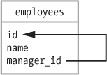
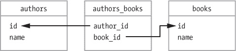
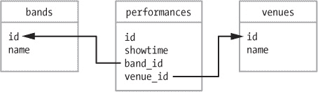
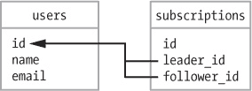
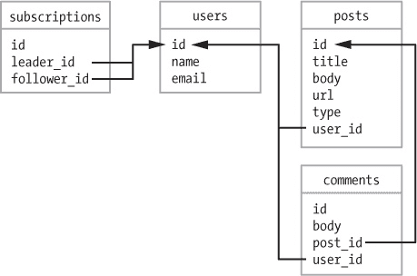

# 第八章 高级活动记录

在构建一个新应用程序时，首先要确定数据模型。*数据模型*是对程序中模型的描述，包括它们的属性和关联。首先，确定所需的模型及其关系，然后为这些模型创建表，并在 Rails 控制台中进行测试。一旦数据模型正确工作，构建其余的应用程序就会容易得多。

一些人听到*数据模型*这个词时，会想到带有框和箭头的图示。如果你理解模型之间的关系，图示是没有必要的。不过，本章确实包含了一些基本的图示，用于说明不同的关联。在每个图示中，箭头从子模型中的外键指向父模型中的主键。

在本章中，你将从零开始构建一个新的应用程序。这个应用程序是一个类似于 Tumblr 的社交网络。用户创建帐户，然后发布文本和图片供其他用户查看。用户可以关注其他用户，这样他们朋友的帖子就会出现在主页的时间线上。

首先，我将讨论几种高级数据建模技术。然后，我们将一起完成你新社交网络网站所需的模型构建。

# 高级数据建模

在构建博客时，你使用了`has_many`和`belongs_to`关联。现实世界的应用程序通常需要更复杂的关联。

例如，有时你需要建模两个相同类型模型之间的关联，或者你可能需要建模模型之间的多对多关系。你还可能需要将对象层次结构存储在数据库中，但关系型数据库并不真正支持继承。最后，你可能需要建模一个可以与多种不同类型模型关联的类。

本节将讨论这四种情况，首先介绍使用自连接关联建模两个相同类型模型之间的关系。

## 自连接关联

假设有一个用于管理员工的应用程序。除了每个员工的姓名、职位和薪资等数据外，还需要存储每个员工经理的姓名。每个员工`属于`一个经理，而一个经理`拥有`多个下属。经理也是员工，所以你需要在同类型的两个模型之间建立关联。

回想一下，`belongs_to`关联意味着模型需要一个外键来将其与另一个模型链接。外键是一个字段，用于标识关联另一方的模型。因此，`employees`表需要一个名为`manager_id`的字段，用于将每个员工与经理关联起来。图示图 8-1 展示了这一关系是如何运作的。

一个 *自连接关联* 允许你使用单个表来建模组织结构图或其他树形结构。`manager_id` 外键指向员工经理的 id。此类型的关联也用于建模其他树形结构，比如嵌套评论，其中回复包括一个 `parent_id`，指向父评论。



图 8-1. 自连接关联

一旦 `manager_id` 字段添加到 `employees` 表中，你可以在 `Employee` 模型中定义关联：

```
  class Employee < ActiveRecord::Base
➊   has_many :subordinates, class_name: 'Employee',
➋                           foreign_key: 'manager_id'
➌   belongs_to :manager, class_name: 'Employee'
  end
```

首先，为下属添加一个 `has_many` 关联。因为这个关联指向的是 `Employee` 模型，而不是一个名为 `Subordinate` 的模型，所以你必须指定 `class_name: 'Employee'` ➊。你还必须指定外键名称，在这种情况下是 `manager_id` ➋。最后，为 `manager` 添加一个 `belongs_to` 关联。同样，你必须明确声明模型的类名，因为 Rails 无法仅根据关联名称推测出来 ➌。

有了这些关联，你可以调用 `subordinates` 方法来获取经理的下属列表。你还可以使用 `manager` 和 `manager=` 方法来获取和设置员工的经理。几乎每个员工都应该有一个 `manager_id`，如 表 8-1 中所示。如果你的 `manager_id` 是 `nil`，那么你一定是老板！

表 8-1. 员工表

| id | name | manager_id |
| --- | --- | --- |
| 1 | Alice | NULL |
| 2 | Bob | 1 |

注意，Bob 的 `manager_id` 是 1。这意味着 Alice 是 Bob 的经理。Alice 的 `manager_id` 是 NULL，在 Ruby 中是 `nil`。她是这家只有两个人的公司的 CEO。

## 多对多关联

而一对多关联仅涉及两个表，多对多关联总是涉及一个第三个表，称为 *连接表*。连接表存储关联两端的外键。它 `belongs_to` 关联中的每个模型。

Rails 提供了两种不同的方式来设置多对多关联。

### has_and_belongs_to_many

如果你使用连接表仅仅为了关联而不需要额外的数据，那么可以使用 `has_and_belongs_to_many` 关联。你仍然需要创建连接表，但不需要为其定义模型。连接表必须以它连接的两个模型的名称命名。

例如，作者写许多书籍，而某些书籍有多个作者。你需要的所有数据都存储在作者或书籍模型中，因此你可以在作者和书籍之间创建一个 `has_and_belongs_to_many` 关联，如 图 8-2 中所示。



图 8-2. `has_and_belongs_to_many` 关联

图 8-2 展示了`Author`和`Book`模型以及它们之间的连接表。按照以下方式定义这些模型之间的关联：

```
class Author < ActiveRecord::Base
  has_and_belongs_to_many :books
end
```

一位作者可能写很多书，但一本书也可以有多个作者：

```
class Book < ActiveRecord::Base
  has_and_belongs_to_many :authors
end
```

为了使此关联生效，`authors`和`books`之间的连接表必须命名为`authors_books`，并且必须包含`author_id`和`book_id`字段。使用`rails generate`命令创建一个空的迁移文件：

```
$ **bin/rails g migration CreateAuthorsBooks**
  invoke   active_record
  create     db/migrate/..._create_authors_books.rb
```

然后编辑迁移文件，移除主键并创建两个外键：

```
  class CreateAuthorsBooks < ActiveRecord::Migration
    def change
      create_table :authors_books**, id: false** do |t|
➊       **t.references :author, null: false, index: true**

        **t.references :book, null: false, index: true**
      end
    end
  end
```

`t.references :author` 语句 ➊ 表示此字段是一个外键，引用了`Author`模型。该字段名为`author_id`。`null: false`选项添加了一个约束，禁止 NULL 值，`index: true`选项则为该字段创建了数据库索引，以加速查询。下一行创建了`book_id`字段，也有 NULL 约束和数据库索引。

你也可以在迁移中使用`create_join_table`方法来创建连接表。此方法接受关联的名称，并创建正确的表，其中没有主键，每个关联都有外键并带有 NULL 约束。此方法不会自动为外键创建索引，你可以按照以下方式添加索引：

```
class CreateAuthorsBooks < ActiveRecord::Migration
  def change
    **create_join_table :authors, :books do |t|**
      **t.index :author_id**
      **t.index :book_id**
    **end**
  end
end
```

在创建了连接表后，你无需做任何额外操作来使关联生效。连接表不需要关联模型。使用`has_and_belongs_to_many`关联时，Rails 会为你管理连接表。

### has_many :through

如果你希望在连接表中存储除关联模型的外键之外的其他信息，可以使用`has_many :through`关联。例如，你可以使用名为`performances`的连接表来建模乐队与场馆之间的关联。图 8-3 展示了乐队、演出和场馆之间的关系。



图 8-3. `has_many :through` 关联

每个演出都属于一个乐队和一个场馆。它还具有演出时间。模型如下所示：

```
class Band < ActiveRecord::Base
  has_many :performances
  has_many :venues, through: :performances
end
```

一个乐队进行多场演出，因此乐队通过其演出与许多不同的场馆建立关联：

```
class Venue < ActiveRecord::Base
  has_many :performances
  has_many :bands, through: :performances
end
```

一个场馆承办多场演出。场馆通过它所承办的演出与多个不同的乐队建立关联：

```
class Performance < ActiveRecord::Base
  belongs_to :band
  belongs_to :venue
end
```

演出将乐队与场馆关联起来。场馆还可以在`performances`表中存储额外的数据，例如演出的时间：

## 单表继承

有时候你需要在数据库中存储类的层次结构。大多数关系型数据库不支持继承，但你可以使用*单表继承*来创建这些模型并在数据库中存储继承结构。

例如，假设你正在编写一个管理宠物商店的应用。你需要一种方式来建模不同类型的宠物，例如狗和鱼。宠物狗和宠物鱼有很多相同的属性和方法，所以它们都继承自一个名为 `Pet` 的父类是很有意义的。

在 Rails 中，你可以为宠物创建一个单独的表，然后将 `Dog` 和 `Fish` 这两个子类的记录存储在同一个表中。Rails 使用名为 *type* 的列来跟踪每行中存储的对象类型。除了父模型所需的列之外，你还需要将子模型所需的所有列添加到表中。你需要这么做，因为所有模型都存储在同一个表中。

父模型 `Pet` 是一个普通的 Active Record 模型。`Pet` 模型继承自 `ActiveRecord::Base`：

```
class Pet < ActiveRecord::Base
end
```

`Dog` 模型继承自 `Pet`：

```
class Dog < Pet
end
```

`Fish` 模型也继承自 `Pet`：

```
class Fish < Pet
end
```

在这些模型就位后，你可以将所有三种类型的记录存储在一个名为 `pets` 的单一表中，如表 8-2 所示。

表 8-2. 宠物表

| id | 类型 | 名称 | 费用 |
| --- | --- | --- | --- |
| 1 | 狗 | 柯利犬 | 200 |
| 2 | 鱼 | 金鱼 | 5 |
| 3 | 狗 | 可卡犬 | 100 |

这三行来自 `pets` 表，包含了 `Dog` 和 `Fish` 模型的数据。你现在可以像 `Pet.count` 一样调用来计算表中的宠物数量。调用 `Dog.count` 返回 2，`Fish.count` 返回 1。因为 Rails 知道每条记录的类型，`pet = Pet.find(2)` 会返回一个 `Fish` 类型的对象。

在下一节中，你将看到单表继承的另一个示例，当时你会为新应用创建帖子模型。

## 多态关联

使用多态关联，一个模型可以通过单一关联属于多个其他模型。多态关联的经典示例是允许对多种类型的对象进行评论。例如，你可能希望让人们对帖子和图片都能发表评论。以下是你使用多态关联时，评论模型可能的样子：

```
class Comment < ActiveRecord::Base
  belongs_to :commentable, polymorphic: true
end
```

不使用 `belongs_to :post` 或 `belongs_to :image`，而是指定评论 `belongs_to` 一个叫做 `:commentable` 的东西。这个名字可以是你喜欢的任何名字，但惯例是将其命名为模型名称的形容词形式。

`comments` 表需要两个字段来支持这种关联，一个名为 `commentable_id` 的整数字段和一个名为 `commentable_type` 的字符串字段。`commentable_type` 字段保存拥有此评论的对象的类名。这个设置类似于你在前一节中看到的单表继承的 `type` 列。`commentable_id` 是一个外键，指向拥有此评论的对象的 `id`。

在可以有评论的模型中，包含 `as: :commentable` 到 `has_many :comments` 关联中：

```
class Post < ActiveRecord::Base
  has_many :comments, as: :commentable
end

class Image < ActiveRecord::Base
  has_many :comments, as: :commentable
end
```

`has_many` 关联的工作方式与以前相同。像`@post.comments`这样的调用会返回与帖子相关的评论列表。它是通过查找与`@post`对象的`id`以及类名`Post`匹配的评论来实现的。

如果你的应用增长，并且你需要在其他模型上添加评论，你可以在新模型中添加相同的`has_many`关联，而不需要更改`Comment`模型。

现在理论部分已经够多了，让我们将一些知识付诸实践。

# 社交应用

在这一节中，你将为一个类似 Tumblr 的社交网络服务构建数据模型。你需要为用户和帖子创建模型。你还需要表示用户如何关注其他用户，以及几种不同类型的帖子，用户应该能够对帖子进行评论。

从在你的代码目录中创建一个新的空 Rails 应用开始：

```
$ **cd code**
$ **rails new social**
$ **cd social**
```

我把我的应用称为*social*，但你可以随意命名。谁知道呢，或许有一天你会发布这个应用并以十亿美元的价格出售！

现在让我们来构建这个应用所需的模型。

## 用户模型

如果这是一个社交网站，首先你需要一个用户模型以及用户之间关系的模型。像 Twitter 一样，Tumblr 不使用“朋友”这一概念，而是通过“关注”其他用户来订阅他们的更新。

从创建一个名为`User`的新资源开始。现在，添加 `name` 和 `email` 的字符串字段。你可以随时通过创建新的数据库迁移来添加更多字段。以下命令将为用户创建控制器、模型、数据库迁移以及其他文件：

```
$ **bin/rails generate resource User name email**
```

通过运行这个新的数据库迁移来创建`users`表：

```
$ **bin/rake db:migrate**
```

接下来，你需要创建一个模型来表示订阅的概念。订阅是一种自我连接类型，但它是多对多关联，因此你需要一个连接表。这个模型应该包含什么呢？你通过关注另一个用户的帖子来订阅他们。你可以把你关注的用户称为“领导者”。所以，你需要在`subscriptions`表中存储`leader_id`和`follower_id`。

当一个用户关注另一个用户时，关注者的`id`会存储在`follower_id`字段中，另一位用户的`id`会存储在`leader_id`字段中。这样的设置让你能够轻松找到一个用户的关注者和领导者列表。

```
$ **bin/rails g model Subscription leader:references follower:references**
  invoke  active_record
  create    db/migrate/..._create_subscriptions.rb
  create    app/models/subscription.rb
  invoke    test_unit
  create      test/models/subscription_test.rb
  create      test/fixtures/subscriptions.yml
```

因为这是一个连接表，使用模型生成器来创建订阅的数据库迁移和模型。别忘了更新你的数据库：

```
$ **bin/rake db:migrate**
```

既然你已经创建了表格，现在需要更新模型文件以定义关联。首先，在编辑器中打开文件*app/models/subscription.rb*：

```
class Subscription < ActiveRecord::Base
  belongs_to :leader**, class_name: 'User'**
  belongs_to :follower**, class_name: 'User'**
end
```

在创建模型时，你使用了`leader:references`和`follower:references`，因此 Rails 模型生成器为你在`Subscription`模型中添加了两个`belongs_to`关联。`：leader`和`：follower`实际上都指向一个`User`，所以你需要添加类名`User`。默认情况下，Rails 会查找与关联名称匹配的模型名称。如果你不指定类名，Rails 会查找名为`Leader`和`Follower`的模型。图 8-4 显示了`users`和`subscriptions`的表格。

### 注意

*实际上，这些表格也包括`created_at`和`updated_at`时间戳，但为了简洁起见，我在本章的图表中省略了它们。*



图 8-4. 订阅关联

在`subscriptions`表中，`leader_id`和`follower_id`都是外键，指向一个用户。现在`Subscription`关联已完成，我们来添加`User`关联。打开你的编辑器中的*app/models/user.rb*文件：

```
  class User < ActiveRecord::Base
➊   **has_many :subscriptions, foreign_key: :follower_id,**
➋                            **dependent: :destroy**
➌   **has_many :leaders, through: :subscriptions**
  end
```

从用户拥有多个订阅的事实开始。在这种情况下，你需要指定使用的外键。通常，你会将其命名为`user_id`，但因为你在建模领导者和追随者，所以应该将其命名为`follower_id` ➊。同时，使用`dependent: :destroy` ➋来指定如果该用户被删除时会发生什么。这告诉 Rails，如果该用户被销毁，则销毁所有相关的订阅。最后，向领导者添加`has_many:through`关联➌。

接下来，为模型添加一些方法，使得操作关联更简单。你也可以使用这些方法在 Rails 控制台中测试关联：

```
  class User < ActiveRecord::Base
    has_many :subscriptions, foreign_key: :follower_id,
                             dependent: :destroy
    has_many :leaders, through: :subscriptions

➊   **def following?(leader)**
        **leaders.include? leader**
    **end**

➋   **def follow!(leader)**
➌     **if leader != self && !following?(leader)**
        **leaders << leader**
      **end**
    **end**
  end
```

首先，添加一个*谓词方法*，返回`true`或`false`值，命名为`following?` ➊，用来判断当前用户是否正在关注另一个用户。此方法会检查当前用户的`leaders`集合中是否包含作为参数传入的`leader`。

然后，添加`follow!`方法➋，表示当前用户正在关注另一个用户。此方法确保当前用户不会试图关注自己，且不会已经关注了另一个用户➌。如果两种情况都不成立，传递给该方法的`leader`会使用`<<`插入到当前用户的`leaders`集合中，这是插入操作符。

有了这些方法后，你现在可以启动 Rails 控制台并测试你的关联：

```
$ **bin/rails console**
```

从创建两个用户开始：

```
irb(main):001:0> **alice = User.create name: "Alice"**
   (0.1ms) begin transaction
  SQL (0.6ms) INSERT INTO "users" ...
   (0.8ms) commit transaction
 => #<User id: 1, name: "Alice", ...>
irb(main):002:0> **bob = User.create name: "Bob"**
   (0.1ms) begin transaction
  SQL (0.6ms) INSERT INTO "users" ...
   (0.8ms) commit transaction
 => #<User id: 2, name: "Bob", ...>
```

现在，在`alice`上调用`follow!`方法，并传入`bob`。然后在`alice`上调用`following?`方法，确认`follow`是否正常工作。最后，再次调用`following?`来查看`bob`是否正在关注`alice`：

```
irb(main):003:0> **alice.follow! bob**
  User Exists (0.2ms) SELECT ...
   (0.1ms) begin transaction
  SQL (16.1ms) INSERT INTO ...
   (20.4ms) commit transaction
  User Load (0.3ms) SELECT ...
 => #<ActiveRecord::Associations::CollectionProxy ...>
irb(main):004:0> **alice.following? bob**
 => true
irb(main):005:0> **bob.following? alice**
User Exists (0.2ms) SELECT ...
 => false
```

调用 `alice.follow! bob` 会将 `bob` 添加到 `alice` 的 `leaders` 集合中。接下来，调用 `alice.following? bob` 会检查 `alice.leaders` 集合中是否包含 `bob`。结果是包含的，所以方法返回 `true`。当然，它实际上并没有查找 `bob`，而是查找指向 `bob` 的 `User` 的 `id`。调用 `bob.following? alice` 返回 `false`。因为 `bob.leaders` 集合是空的，所以 `bob` 并没有关注 `alice`。表 8-3 和 表 8-4 显示了 `alice` 关注 `bob` 后的 `users` 和 `subscriptions` 表（时间戳字段被省略）。

表 8-3. 用户表

| id | name | email |
| --- | --- | --- |
| 1 | Alice | NULL |
| 2 | Bob | NULL |

`users` 表保存了 `alice` 和 `bob` 的记录。

表 8-4. 订阅表

| id | leader_id | follower_id |
| --- | --- | --- |
| 1 | 2 | 1 |

`subscriptions` 表保存了一个记录，表示 `alice` 和 `bob` 之间的关联。`leader_id` 是 2，即 `bob` 的 `id`；`follower_id` 是 1，即 `alice` 的 `id`。这意味着 `alice` 正在关注 `bob`。

此时，你可以通过调用 `leaders` 方法获取 `alice` 正在关注的每个用户的列表。拥有这个列表是有帮助的，但这只是你所需要的一半。你还希望能够列出一个用户的关注者。为此，使用 `subscriptions` 表，但这次是反向操作。

你需要在 `Subscription` 模型中添加另一个 `has_many` 关联，它是现有关联的反向关联。然后，你可以使用该关联来查找关注者。

```
  class User < ActiveRecord::Base
    has_many :subscriptions, foreign_key: :follower_id,
                             dependent: :destroy
    has_many :leaders, through: :subscriptions

➊   **has_many :reverse_subscriptions, foreign_key: :leader_id,**
➋                                    **class_name: 'Subscription',**
                                     **dependent: :destroy**
➌   **has_many :followers, through: :reverse_subscriptions**

    def following?(leader)
      leaders.include? leader
    end

    def follow!(leader)
      if leader != self && !following?(leader)
        leaders << leader
      end
    end
  end
```

这个关联是现有 `:subscriptions` 关联的反向关联。没有什么巧妙的词语来描述订阅的反向，所以将关联命名为 `:reverse_subscriptions`。该关联使用 `leader_id` 字段作为外键 ➊。因为关联名称与模型名称不匹配，你还需要指定类名 ➋。和订阅关联一样，指定 `dependent: :destroy`，这样如果用户被删除，`subscriptions` 表中就不会留下孤立的记录。添加 `:reverse_subscriptions` 关联后，你可以使用它来为 `:followers` 添加另一个 `has_many :through` 关联 ➌。

重启 Rails 控制台以使这些更改生效，然后尝试新的关联：

```
➊ irb(main):001:0> **alice = User.find(1)**
    User Load (0.3ms) SELECT ...
  => #<User id: 1, name: "Alice", ...>
  irb(main):002:0> **bob = User.find(2)**
    User Load (0.3ms) SELECT ...
  => #<User id: 2, name: "Bob", ...>
➋ irb(main):003:0> **alice.followers**
    User Load (0.2ms) SELECT ...
  => #<ActiveRecord::Associations::CollectionProxy []>
➌ irb(main):004:0> **alice.followers.to_a**
  => []
  irb(main):005:0> **bob.followers.to_a**
    User Load (0.2ms) SELECT ...
  => [#<User id: 1, name: "Alice", ...>]
```

由于你重启了控制台，你首先需要在数据库中查找你的用户 ➊。调用 `followers` 方法查看 `alice` 是否有任何关注者 ➋。该方法返回一种称为 `ActiveRecord::Associations::CollectionProxy` 的关系类型。我通过在 `followers` 后面链式调用 `to_a` 来使输出更容易阅读，这会将输出转换为数组 ➌。

输出显示`alice`没有关注者，而`bob`有一个关注者——`alice`。`User`关联和方法到目前为止工作正常。现在，用户可以相互关注，我们可以继续讨论帖子功能。

## 帖子模型

人们在社交网络上不仅仅想分享纯文本——他们还想分享图片、链接和视频。我们应该允许用户为每种类型的内容创建不同的帖子类型，尽管这些帖子类型将共享一些共同的功能。这听起来像是继承的完美应用场景。

首先，创建一个名为`Post`的基础模型，然后从该类继承创建`TextPost`、`ImagePost`等模型。你可以使用单表继承来创建这些模型，并在数据库中存储继承结构。由于`posts`表存储所有类型的帖子记录，你必须向`posts`表中添加其他模型所需的列。除了常见的`title`和`body`字段外，还需要添加一个`url`字段来存储图像帖子的图像地址，以及一个`type`字段用于单表继承。

考虑到这些需求，生成帖子资源并更新应用的数据库：

```
$ **bin/rails g resource Post title body:text url type user:references**
$ **bin/rake db:migrate**
```

`user:references`选项会添加一个`user_id`字段，这样你就可以将帖子与用户关联起来。别忘了更新应用的数据库。

现在，你已准备好为不同类型的帖子创建资源。

```
$ **bin/rails g resource TextPost --parent=Post --migration=false**
$ **bin/rails g resource ImagePost --parent=Post --migration=false**
```

在这里，我为资源生成器传递了两个选项。`--parent=Post`选项表示这些模型继承自`Post`，而`--migration=false`选项告诉生成器不要为此资源创建数据库迁移。因为这些资源存储在之前创建的`posts`表中，所以不需要数据库迁移。

首先，让我们更新新创建的`Post`模型，位于*app/models/post.rb*，确保所有帖子都有一个关联的用户和类型：

```
  class Post < ActiveRecord::Base
    belongs_to :user
➊   **validates :user_id, presence: true**
➋   **validates :type, presence: true**
  end
```

我们社交应用中的所有帖子都属于个别用户。这个验证确保了`Post`在没有关联`user_id`的情况下无法创建➊。类型验证➋确保所有记录要么被识别为`TextPost`，要么是`ImagePost`。

现在为`TextPost`和`ImagePost`模型添加验证。首先，编辑*app/models/image_post.rb*，并为`ImagePost`模型添加一个 URL 验证：

```
class ImagePost < Post
  **validates :url, presence: true**
end
```

`url`字段保存`ImagePost`的图像地址。用户可以从如 Flickr 或 Imgur 这样的图片分享网站复制 URL。应用不应允许没有图像`url`的`ImagePost`被保存。

然后，在*app/models/text_post.rb*中更新`TextPost`模型，检查是否有帖子正文：

```
class TextPost < Post
  **validates :body, presence: true**
end
```

应用还不应允许没有`body`文本的`TextPost`被保存。

在编辑模型时，还要在*app/models/user.rb*的其余`has_many`关联下，为新帖模型添加关联：

```
class User < ActiveRecord::Base
  has_many :subscriptions, foreign_key: :follower_id,
                           dependent: :destroy
  has_many :leaders, :through => :subscriptions

  has_many :reverse_subscriptions, foreign_key: :leader_id,
                                   class_name: 'Subscription',
                                   dependent: :destroy
  has_many :followers, through: :reverse_subscriptions

  **has_many :posts, dependent: :destroy**
  **has_many :text_posts, dependent: :destroy**
  **has_many :image_posts, dependent: :destroy**

  --*snip*--
```

现在，你可以重新启动 Rails 控制台并使用这些新模型：

```
➊ irb(main):001:0> **alice = User.find(1)**
    User Load (42.0ms) SELECT ...
   => #<User id: 1, ...>
  irb(main):002:0> **post1 = alice.text_posts.create(body: "First Post")**
     (0.1ms) begin transaction
    SQL (0.7ms) INSERT INTO ...
     (1.9ms) commit transaction
   => #<TextPost id: 1, ...>
  irb(main):003:0> **post2 = alice.image_posts.create(**
                                   **url: "http://i.imgur.com/Y7syDEa.jpg")**
     (0.1ms) begin transaction
    SQL (0.7ms) INSERT INTO ...
     (1.9ms) commit transaction
   => #<ImagePost id: 2, ...>
➋ irb(main):004:0> **alice.posts.to_a**
    Post Load (32.3ms) SELECT ...
   => [#<TextPost id: 1, ...>, #<ImagePost id: 2, ...>]
➌ irb(main):005:0> **alice.text_posts.to_a**
    TextPost Load (0.4ms) SELECT ...
   => [#<TextPost id: 1, ...>]
```

因为你重新启动了控制台，首先找到表示 `alice` 的 `User` ➊。然后创建一个属于 `alice` 的 `TextPost` 和一个 `ImagePost`。`User` 模型上的 `posts` 方法返回与该用户关联的所有帖子，无论类型如何 ➋。请注意，你刚刚创建的 `TextPost` 和 `ImagePost` 都会在同一个集合中返回。`text_posts` 方法只会返回 `TextPost` 对象 ➌。

## 评论模型

现在用户和帖子模型已经到位，接下来为应用程序创建评论模型。添加一个文本字段来保存评论的 `body`，一个 `post_id` 来引用拥有此评论的帖子，以及一个 `user_id` 来引用发表评论的用户。

请注意，我没有在这些评论中使用多态关联。因为我的不同帖子类型都继承自基类 `Post`，所以我可以简单地将 `Comment` 与 `Post` 关联，从而允许对任何类型的帖子进行评论。

```
$ **bin/rails g resource Comment body:text post:references user:references**
$ **bin/rake db:migrate**
```

还需要在 `User` 和 `Post` 模型中添加 `has_many :comments` 以完成用户、帖子和评论之间的关联。图 8-5 展示了你在本章中创建的表及其关联。



图 8-5. 社交应用数据模型，省略了时间戳

到此，你已经完成了所有模型的创建，并且已经朝着构建新的社交网络迈出了重要一步。

# 摘要

我在本章中讲解了一些相当高级的数据库建模技巧。`User` 模型有多个复杂的关联。不同类型的帖子展示了单表继承。幸运的是，`Comment` 模型没有包含任何意外的复杂性。

在下一章中，我将讲解认证，并且你将开始添加控制器操作和视图，以便用户可以注册并登录到你的社交网络。

# 练习

| Q: | 1\. 在本章中，你在所有的 `has_many` 关联上都指定了 `dependent: :destroy`，以确保相关的依赖模型会被移除。例如，因为 `Post` 模型与 `User` 模型有 `dependent: :destroy` 关联，如果一个 `User` 被销毁，那么该用户的所有帖子也会被销毁。你认为如果在 `belongs_to` 关联上指定 `dependent: :destroy` 会发生什么情况？ |
| --- | --- |
| Q: | 2\. 为 `Comment` 模型添加验证，以确保每个评论都属于一个 `User` 和一个 `Post`。你的应用程序不应允许没有 `user_id` 和 `post_id` 的评论被创建。你还应该确保所有评论的 `body` 字段都有文本内容。 |
| Q: | 3\. 使用 Rails 控制台创建一个新的 `User`。为该 `User` 创建一个 `TextPost` 或 `ImagePost`，并至少创建一个 `Comment`。然后销毁该 `User`，确保与之关联的 `Post` 和 `Comment` 也被销毁。 |
