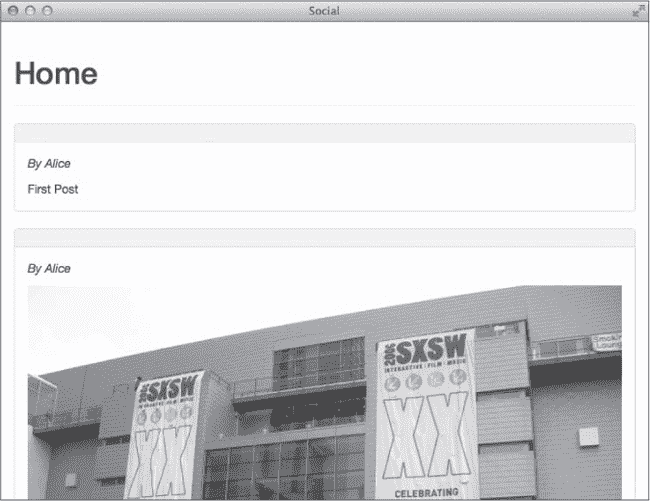
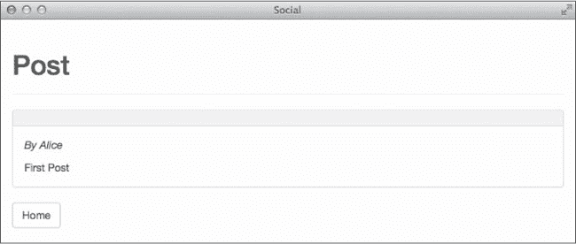
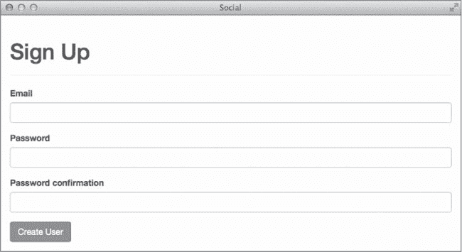
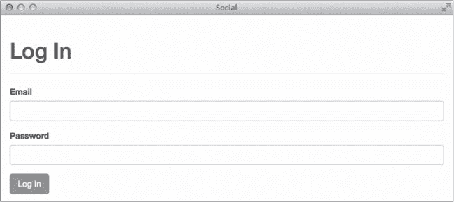
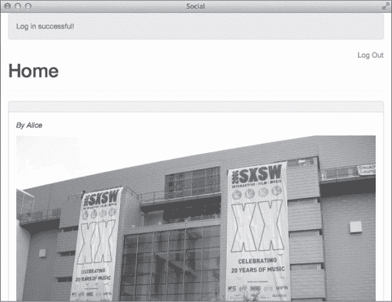

# 第九章 认证

身份是任何社交网络中的核心概念，而*认证*是向系统证明你身份的行为。你希望用户能够注册新账户并登录到你的应用程序。尽管像 devise 和 authlogic 这样的宝石为 Rails 应用程序提供了完整的认证系统，但在本章中，你将亲自动手构建自己的系统。

除了注册、登录和登出操作外，你还需要添加获取当前登录用户身份和将匿名用户重定向到登录页面的方法。这个认证系统将需要控制器和视图，因此在开始之前，先花点时间使用 Bootstrap 框架为你的站点添加一些样式。

Bootstrap

Bootstrap 是一个开源前端框架，最初由 Twitter 创建。它提供了一组 CSS 和 JavaScript 文件，你可以将其集成到网站中，以提供愉悦的排版、适应桌面和移动浏览器的响应式布局，以及模态对话框、下拉菜单、工具提示等功能。Bootstrap 的完整文档可以在线访问，地址是*[`getbootstrap.com/`](http://getbootstrap.com/)*。

你可以下载 Bootstrap 框架并手动将 CSS 和 JavaScript 文件集成到你的应用程序中，但 bootstrap-sass gem 可以为你完成所有这些工作。既然你已经在构建自己的认证系统，这里可以省点力——编辑你的应用程序的*Gemfile*并添加这个 gem。

```
**gem 'bootstrap-sass'**
```

然后运行**`bin/bundle install`**命令以更新已安装的 gem。现在 gem 安装完成，你需要对 CSS 和 JavaScript 文件做一些修改以包含 Bootstrap。首先，更新*app/assets/stylesheets/application.css*，如下所示：

```
--*snip*-
*= require_tree.
***= require bootstrap**
*= require_self
*/
```

这段代码将 Bootstrap CSS 文件包含到你的应用程序中。接下来，通过编辑 *app/assets/javascripts/application.js* 文件并将这行代码添加到文件末尾，来包含 Bootstrap 的 JavaScript 文件：

```
**//= require bootstrap**
```

最后，更新应用程序布局以使用 Bootstrap 样式。打开文件*app/views/layouts/application.html.erb*，并像下面这样更改页面主体的内容：

```
*--snip--*
**<body>**
  **<div class="container">** ➊
    **<%= yield %>** ➋
  **</div>**
</body>
</html>
```

带有 `class="container"` 的 `div` 包裹着页面的内容 ➊，并提供根据屏幕宽度调整的边距，使得你的站点在桌面和移动屏幕上看起来都很清晰。`yield` 语句 ➋ 被 Rails 用来将视图模板的内容插入到布局中。

现在你已经有了样式表、JavaScript 和基本的布局，你可以开始使用 Bootstrap 了。

# 认证系统

认证系统的目的是识别当前用户，并仅显示用户想要查看或被授权查看的页面。你将使用电子邮件地址和密码的组合来识别用户。电子邮件地址是一个不错的选择，因为它们是全球唯一的。没有两个用户会拥有相同的电子邮件地址。

在你的应用程序中，匿名用户只能查看用于登录或注册新账户的页面。其他所有页面都应该受到限制。

## 帖子索引与展示

在开始构建认证系统之前，你需要保护的数据来自匿名用户。我们先为上章创建的`Post`模型添加`index`和`show`页面。首先，添加控制器操作。打开文件*app/controllers/posts_controller.rb*并添加以下`index`和`show`方法：

```
  class PostsController < ApplicationController
➊   **def index**
         **@posts = Post.all**
    **end**

➋   **def show**
         **@post = Post.find(params[:id])**
    **end**
  end
```

这两个操作类似于博客中的`index`和`show`操作，参见第四章。`index`操作 ➊ 从数据库中检索所有帖子并将其分配给`@posts`变量，然后渲染*app/views/posts/index.html.erb*视图。`show`操作 ➋ 使用`params`哈希中的`id`找到请求的帖子，将其分配给`@post`，并渲染*app/views/posts/show.html.erb*视图。

现在，你需要为这些操作创建相应的视图模板。创建一个名为*app/views/posts/index.html.erb*的新文件，并添加以下代码：

```
➊ <div class="page-header">
    <h1>Home</h1>
  </div>

➋ <%= render @posts %>
```

`index`视图使用 Bootstrap 的`page-header`类 ➊ 添加了一个标题，并使用部分渲染了`@posts`集合 ➋。

由于你使用部分来渲染帖子，接下来添加这些部分；你将为每种帖子类型添加一个部分——目前有两种类型——因此你需要两个部分文件。

首先，创建文件*app/views/text_posts/_text_post.html.erb*并打开进行编辑：

```
➊ <div class="panel panel-default">
➋   <div class="panel-heading">
      <h3 class="panel-title">
➌       <%= text_post.title %>
      </h3>
    </div>

➍ <div class="panel-body">
    <p><em>By <%= text_post.user.name %></em></p>

    <%= text_post.body %>
  </div>
</div>
```

这个部分使用了 Bootstrap 的面板组件来显示`TextPost`。`panel`类 ➊ 在内容周围添加了灰色边框。`panel-heading`类 ➋ 添加了浅灰色背景。然后，`title`被渲染在`<h3>`元素中，内容为`<%= text_post.title %>` ➌。`panel-body`类 ➍ 为了匹配标题添加了内边距。帖子作者和正文在此部分中渲染。

然后，创建文件*app/views/image_posts/_image_post.html.erb*，并添加以下内容。`ImagePost`部分与`TextPost`部分稍有不同：

```
  <div class="panel panel-default">
    <div class="panel-heading">
      <h3 class="panel-title">
        <%= image_post.title %>
      </h3>
     </div>

     <div class="panel-body">
       <p><em>By <%= image_post.user.name %></em></p>

➊       <%= image_tag image_post.url, class: "img-responsive" %>

       <%= image_post.body %>
   </div>
 </div>
```

这个部分使用 ERB 的`image_tag`助手来添加一个图像标签，其源设置为`image_post.url` ➊，即图像的存储位置。该行还为图像添加了 Bootstrap 的`img-responsive`类，使其根据浏览器宽度自动缩放。

设置好这些视图后，启动 Rails 服务器并查看应用程序：

```
$ **bin/rails server**
```

现在在浏览器中访问*http://localhost:3000/posts*。`Post index`视图应该类似于图 9-1，具体取决于你在 Rails 控制台中创建了多少个帖子。



图 9-1. *帖子索引视图*

你在上一章创建了两个帖子，当前应用程序的`Post index`视图显示了这两个帖子。由于在上一章没有添加标题，因此标题为空。

现在，`Post`部分已创建，`Post show`视图也可以使用这些部分。创建新文件*app/views/posts/show.html.erb*并添加以下内容：

```
  <div class="page-header">
    <h1>Post</h1>
  </div>

➊ <%= render @post %>

  <%= link_to "Home", posts_path,
➋       class: "btn btn-default" %>
```

`show`视图与`index`视图类似，有两个区别。它渲染单个帖子 ➊，而不是帖子集合，并且包含一个按钮 ➋，该按钮链接回帖子索引页面。

访问*http://localhost:3000/posts/1*查看实际效果，如图 9-2 所示。



图 9-2. *帖子显示视图*

现在应用程序已经有了用于显示帖子（posts）的操作和视图，接下来让我们添加身份验证，保护这些操作不被匿名用户访问。

## 注册

在这里，你将实现一个用户注册流程，要求输入电子邮件地址、密码和密码确认。如果用户输入的电子邮件地址尚未存在于数据库中，并且密码匹配，系统将创建一个新的`User`并感谢用户注册。

你已经能够存储新用户的电子邮件地址，因为在`users`表中有一个名为`email`的字符串字段。然而，你需要更加小心地处理密码。绝对不要以明文形式存储用户密码。相反，应存储密码的哈希版本，这称为*密码摘要*。Rails 的安全密码功能提供了对密码哈希的内建支持，使用一种叫做 bcrypt 的哈希算法。Bcrypt 是一种安全的单向哈希算法。

你可以通过在 Rails 模型中调用`has_secure_password`方法来启用安全密码功能。该方法为模型添加了`password`和`password_confirmation`属性，并要求模型具有一个名为`password_digest`的字符串字段。它添加了验证，要求在创建时`password`和`password_confirmation`属性必须匹配。如果这两个属性匹配，系统会自动对密码进行哈希并将其存储在`password_digest`字段中。

首先，编辑应用程序的*Gemfile*并添加 bcrypt gem。因为许多应用程序包含身份验证系统，所以该 gem 的注释行已存在。去掉该行前面的注释符号并保存文件。

```
gem 'bcrypt', '~> 3.1.7'
```

每次更改*Gemfile*时，你还需要运行`bin/bundle install`命令，以更新系统上安装的 gem：

```
$ **bin/bundle install**
```

下一步是向`users`表添加`password_digest`字段，并运行数据库迁移命令`bin/rake db:migrate`，这样你就可以存储用户的哈希密码：

```
$ **bin/rails g migration AddPasswordDigistToUsers password_digest**
```

现在你需要为`User`模型启用安全密码功能。打开*app/models/user.rb*并在上章添加的`has_many`关联下方添加`has_secure_password`行。在编辑该文件时，还需要为电子邮件字段添加`presence`和`uniqueness`验证：

```
class User < ActiveRecord::Base
  --*snip*--

  **has_secure_password**

  **validates :email, presence: true, uniqueness: true**
  --*snip*--
end
```

创建新用户的默认路由是 *http://localhost:3001/users/new*。这个路由有效，但像 *http://localhost:3001/signup* 这样的自定义路由可能更容易记住。

编辑 *config/routes.rb* 并为注册页面添加路由。在用户注册账户或登录到应用程序后，你希望将用户重定向到主页。因此，在编辑此文件时，将 `root` 路由设置为 `posts index` 页面。

```
Rails.application.routes.draw do
  resources :comments
  resources :image_posts
  resources :text_posts
  resources :posts
  resources :users

  **get 'signup', to: 'users#new', as: 'signup'**

  **root 'posts#index'**
end
```

打开 *app/controllers/users_controller.rb* 并为 `UsersController` 添加创建新 `Users` 的必要操作：

```
  class UsersController < ApplicationController
➊   **def new**
      **@user = User.new**
    **end**

➋   **def create**
      **@user = User.new(user_params)**
      **if @user.save**
      **redirect_to root_url,**
        **notice: "Welcome to the site!"**
    **else**
      **render "new"**
    **end**
  **end**

  **private**

  **def user_params**
    **params.require(:user).permit(:name, :email, :password,**
                                 **:password_confirmation)**
  **end**
**end**
```

`new` 方法 ➊ 实例化一个空的新的 `User` 对象并渲染注册表单。`create` 方法 ➋ 使用表单传递的参数实例化一个 `User` 对象。如果用户可以保存，它会将用户重定向到网站根目录并显示欢迎消息。否则，它会重新渲染新用户表单。

现在控制器操作已到位，接下来在 *app/views/users/new.html.erb* 中添加注册表单：

```
   <div class="page-header">
    <h1>Sign Up</h1>
  </div>

  <%= form_for(@user) do |f| %>
➊   <% if @user.errors.any? %>
      <div class="alert alert-danger">
        <strong>
          <%= pluralize(@user.errors.count, "error") %>
          prevented you from signing up:
        </strong>
        <ul>
          <% @user.errors.full_messages.each do |msg| %>
            <li><%= msg %></li>
          <% end %>
        </ul>
      </div>
    <% end %>

➋   <div class="form-group">
      <%= f.label :email %>
➌     <%= f.email_field :email, class: "form-control" %>
    </div>
    <div class="form-group">
      <%= f.label :password %>
      <%= f.password_field :password, class: "form-control" %>
    </div>
    <div class="form-group">
      <%= f.label :password_confirmation %>
      <%= f.password_field :password_confirmation,
        class: "form-control" %>
    </div>

    <%= f.submit class: "btn btn-primary" %>
  <% end %>
```

该表单的前半部分显示错误消息 ➊（如果有）。表单使用具有 Bootstrap 类 `form-group` 的 `div` 来将标签和输入控件分组 ➋，并且为输入控件添加了 `form-control` 类 ➌。Bootstrap 使用这些类来为表单应用样式。

在浏览器中访问 *http://localhost:3000/signup* 以查看注册表单，如 图 9-3 所示。



图 9-3. 注册表单

在 `create` 动作中，你为新用户添加了一个闪现消息以表示欢迎，但你的视图中还没有显示闪现消息的地方。Bootstrap 包含一个非常适合显示闪现消息的 `alert` 类。打开 *app/views/layouts/application.html.erb* 的应用布局，并按照下面的示例添加一个闪现消息的区域：

```
 --*snip*--
 <body>
   <div class="container">
➊    **<% if notice %>**
       **<div class="alert alert-success"><%= notice %></div>**
     **<% end %>**
➋    **<% if alert %>**
       **<div class="alert alert-danger"><%= alert %></div>**
     **<% end %>**

     <%= yield %>
   </div>
 </body>
 </html>
```

本应用使用了两种不同类型的闪现消息：`notice` 消息 ➊ 表示成功。`notice` 消息使用 Bootstrap 的 `alert-success` 类显示为绿色。`alert` 消息 ➋ 表示错误。`alert` 消息使用 Bootstrap 的 `alert-danger` 类显示为红色。

在上一章中，你没有为创建的用户添加电子邮件地址或密码。如果你想使用 `alice` 或 `bob` 登录，可以在 Rails 控制台中更新他们的帐户。

```
➊ irb(main):001:0> **alice = User.find(1)**
    User Load ...
   => #<User id: 1, name: "Alice", ...>
➋ irb(main):002:0> **alice.email = "alice@example.com"**
   => "alice@example.com"
  irb(main):003:0> **alice.password = "password"**
   => "password"
  irb(main):004:0> **alice.password_confirmation = "password"**
   => "password"
➌ irb(main):005:0> **alice.save**
    --*snip*--
   => true
```

在使用 `bin/rails console` 启动 Rails 控制台后，通过 `id` 查找 `User` ➊。然后为 `email`、`password` 和 `password_confirmation` 赋值 ➋。最后，使用 `alice.save` 保存 `User` ➌。为另一个 `User` 重复这些步骤。确保每个用户的 `email` 唯一。

现在你已经了解了如何为用户创建一个注册账户的表单，接下来我们来看看如何让他们登录。

## 登录

用户注册账户时，填写类似 图 9-3 中的表单，并在数据库中创建一个新的用户记录。另一方面，登录没有模型表示，登录不会在数据库中创建记录。相反，用户的身份存储在 *session* 中，这是用于标识从特定浏览器到 Web 服务器的请求的小量数据。

### 会话

通常，Web 服务器是 *无状态的*。也就是说，它们不会记住用户从一次请求到下一次请求的身份。您必须添加此功能，即通过将当前登录用户的 `user_id` 存储在会话中来实现。

Rails 默认将会话信息存储在一个 cookie 中。会话 cookie 已签名并加密，以防篡改。用户无法查看存储在其会话 cookie 中的数据。

Rails 中的会话值使用键值对存储，并像哈希一样访问：

```
session[:user_id] = @user.id
```

此命令将 `@user.id` 存储在当前用户计算机上的一个 cookie 中。该 cookie 会随每个请求自动发送到服务器。

当用户成功登录到您的网站时，您需要将 `user_id` 存储在 `session` 中。然后，您需要在每个请求中查找 `session` 中的 `user_id`。如果找到了 `user_id` 并且 `User` 记录与该 `id` 匹配，那么您就知道该用户已通过身份验证。否则，您应将用户重定向到登录页面。

### 实现

现在让我们实现登录过程。首先，使用 Rails 生成器创建一个 `sessions` 控制器：

```
$ **bin/rails g controller Sessions**
```

接下来，打开 *config/routes.rb*。添加一个新的资源 `:sessions`，并添加登录和登出的路由：

```
Rails.application.routes.draw do
  resources :comments
  resources :image_posts
  resources :text_posts
  resources :posts
  resources :users
  **resources :sessions**

  get 'signup', to: 'users#new', as: 'signup'

  **get 'login', to: 'sessions#new', as: 'login'**
  **get 'logout', to: 'sessions#destroy', as: 'logout'**

  root 'posts#index'
end
```

现在，创建一个名为 *app/views/sessions/new.html.erb* 的新文件，并添加登录表单：

```
  <div class="page-header">
    <h1>Log In</h1>
  </div>
➊ <%= form_tag sessions_path do %>
    <div class="form-group">
      <%= label_tag :email %>
      <%= email_field_tag :email, params[:email],
        class: "form-control" %>
    </div>
    <div class="form-group">
      <%= label_tag :password %>
      <%= password_field_tag :password, nil,
        class: "form-control" %>
    </div>
    <%= submit_tag "Log In", class: "btn btn-primary" %>
<% end %>
```

请注意，我在这里使用的是 `form_tag` ➊ 而不是 `form_for`。注册过程使用了 `form_for`，因为该表单与 `User` 模型关联。现在使用 `form_tag`，因为登录表单与任何模型无关。

会话控制器处理登录和登出。编辑 *app/controllers/sessions_controller.rb* 以添加以下操作：

```
  class SessionsController < ApplicationController
➊   **def new**
    **end**

➋   **def create**
      **user = User.find_by(email: params[:email])**
      **if user && user.authenticate(params[:password])**
        **session[:user_id] = user.id**
        **redirect_to root_url, notice: "Log in successful!"**
      **else**
        **flash.now.alert = "Invalid email or password"**
        **render "new"**
      **end**
    **end**

➌   **def destroy**
      **session[:user_id] = nil**
      **redirect_to root_url, notice: "Log out successful!"**
    **end**
  end
```

`new` 方法 ➊ 渲染登录表单。控制器操作无需做任何事情。请记住，操作默认会呈现与其名称匹配的视图文件。在这种情况下，`new` 方法会渲染位于 */app/views/sessions/new.html.erb* 的视图。`create` 方法 ➋ 通过电子邮件地址查找用户记录。如果找到了匹配的用户，并且该用户能够通过提供的密码进行身份验证，它会将 `user_id` 存储在会话中并重定向到主页。否则，它会将错误消息添加到 flash 中并重新显示登录表单。`destroy` 方法 ➌ 清除存储在会话中的 `user_id` 并重定向到主页。

访问 *http://localhost:3000/login* 查看在 图 9-4 中显示的登录表单。



图 9-4. 登录表单

用户现在可以登录和登出，但应用程序的其余部分无法知道当前用户的任何信息。当你向应用程序添加新功能时，当前用户的身份将被频繁使用。例如，应用程序使用当前用户来决定显示哪些帖子，并将所有新的帖子或评论分配给当前用户。接下来，让我们添加使身份验证系统可供应用程序其余部分使用的方法。

## 当前用户

首先，你需要能够识别当前登录的用户。在 *app/controllers/application_controller.rb* 中将 `current_user` 方法添加到 `ApplicationController` 中，并使其成为一个 `helper` 方法。这样，它将在所有控制器和视图中可用，为应用程序中的其他部分访问当前登录的用户奠定基础：

```
class ApplicationController < ActionController::Base
  # Prevent CSRF attacks by raising an exception.
  # For APIs, you may want to use :null_session instead.
  protect_from_forgery with: :exception

  **private**

  **def current_user**
    **if session[:user_id]**
       **@current_user ||= User.find(session[:user_id])**
    **end**
  **end**
  **helper_method :current_user**
end
```

`current_user` 方法返回一个 `User` 对象，表示当前登录的用户。当没有用户登录时，该方法返回 `nil`，因此你也可以在条件语句中使用它，当没有用户登录时会产生不同的结果。

例如，使用 `current_user` 方法在用户已登录时添加登出链接，或者在没有用户登录时显示登录和注册的链接。打开 *app/views/layouts/application.html.erb* 文件，并将此代码添加到 `yield` 语句上方：

```
    *--snip--*
    **<div class="pull-right">**
      **<% if current_user %>**
        **<%= link_to 'Log Out', logout_path %>**
      **<% else %>**
        **<%= link_to 'Log In', login_path %> or**
        **<%= link_to 'Sign Up', signup_path %>**
      **<% end %>**
    **</div>**

    <%= yield %>
  </div>
</body>
</html>
```

现在，已登录用户应该看到一个登出链接，而匿名用户应该看到登录或注册的链接。

## 验证用户

在任何社交应用程序中，某些页面不应该对匿名用户开放。你需要的最后一件事是限制页面，使得只有经过身份验证的用户才能查看它们。你可以使用 Rails 的 `before_action` 方法来实现这一点。

`before_action` 是一个在控制器中其他任何动作之前自动执行的方法。这些方法有时用于通过加载多个不同操作所需的数据来消除重复。`before_action` 还可以通过渲染或重定向到另一个位置来终止当前请求。

创建一个名为 `authenticate_user!` 的方法，如果没有当前用户，则将其重定向到登录页面。将此方法添加到 *app/controllers/application_controller.rb* 中的 `ApplicationController`，这样它将在所有控制器中可用：

```
class ApplicationController < ActionController::Base
  # Prevent CSRF attacks by raising an exception.
  # For APIs, you may want to use :null_session instead.
  protect_from_forgery with: :exception

  private

  def current_user
    if session[:user_id]
      @current_user ||= User.find(session[:user_id])
    end
  end
  helper_method :current_user

  **def authenticate_user!**
    **redirect_to login_path unless current_user**
  **end**
end
```

因为你将 `posts index` 页面设置为应用程序的主页，接下来我们在帖子控制器中尝试这个方法。打开 *app/controllers/posts_controller.rb* 文件并添加一个 `before_action`：

```
class PostsController < ApplicationController
  **before_action :authenticate_user!**

  --*snip*--
end
```

现在，如果匿名用户尝试访问首页，他或她应该会自动被重定向到登录页面。确保不要将此 `before_action` 添加到会话页面。如果这样做，匿名用户将无法访问登录页面！

## 使用当前用户

现在你的应用程序知道了谁已经登录，你可以将主页更改为仅显示当前用户创建的帖子或当前用户关注的任何人发布的帖子。此类主页通常按时间顺序排列，称为 *时间线*。

你需要做的第一件事是为`User`模型添加一个方法，返回一个`user_id`列表，用于查询帖子。我们称这个方法为`timeline_user_ids`。打开*app/models/user.rb*文件，并在文件末尾添加此方法：

```
--*snip*--

  **def timeline_user_ids**
➊   **leader_ids + [id]**
  **end**
end
```

在第八章中添加的`has_many :leaders`关联会自动添加一个名为`leader_ids`的方法，该方法返回一个包含该用户领导者（即用户关注的人的`id`值）`id`的数组。`timeline_user_ids`方法将当前用户的`id`添加到`leader_ids`返回的数组中，并返回新的数组➊，该数组应包含你想在时间轴上显示的每个用户。

现在打开*app/controllers/posts_controller.rb*并更新`index`动作以使用这个方法：

```
def index
  **user_ids = current_user.timeline_user_ids**
  **@posts = Post.where(user_id: user_ids)**
             **.order("created_at DESC")**
end
```

与其直接使用`Post.all`获取所有帖子，`index`动作首先获取`current_user.timeline_user_ids`返回的`user_ids`列表。然后，它初始化`@posts`，包括所有应该出现在时间轴中的帖子，并根据这些 id 筛选。还需要添加`order`子句，因为时间轴是按逆时间顺序显示的。

登录后查看图 9-5 页面。



图 9-5. 登录后的 Post 索引视图

点击注销链接，并确认你被重定向到登录页面。

# 总结

你的应用程序现在真的是开始成型了。得益于 Bootstrap，你已经有了一些相当不错的样式。用户现在可以注册、登录和注销。你还可以根据用户是否通过身份验证来限制对页面的访问。

你写了很多代码，但到目前为止你只是通过在浏览器中点击来测试它。当你只有少数几个动作需要测试时，这还不算太糟。但随着应用程序中的动作增多，这种测试方式会变得繁琐。

在下一章中，你将学习如何进行模型和控制器的自动化测试。我们将研究 Rails 自带的默认测试框架，编写针对应用程序各部分的测试，并了解一些关于测试驱动开发的内容。

# 练习

| 问题： | 1\. 你添加了一个帖子`show`动作和视图，但目前无法通过输入 URL 访问单个帖子的页面。使用 Rails 的`time_ago_in_words`助手，在`TextPost`和`ImagePost`部分中，根据`created_at`字段创建一个指向帖子的链接。 |
| --- | --- |

| 问题： | 2\. 为帖子添加评论。这个过程与第五章结束时为博客添加评论类似。首先，更新*app/views/posts/show.html.erb*中的帖子`show`页面，在底部渲染评论集合并显示添加新评论的表单，如下所示：

```
  *--snip--*

  **<h3>Comments<h3>**
  **<%= render @post.comments %>**

  **<h4>New Comment</h4>**
  **<%= form_for @post.comments.build do &#124;f&#124; %>**
    **<div class="form-group">**
      **<%= f.label :body %><br>**
      **<%= f.text_area :body, class: "form-control" %>**
    **</div>**
➊   **<%= f.hidden_field :post_id %>**
    **<%= f.submit class: "btn btn-primary" %>**
  **<% end %>**
```

表单包括当前帖子`post_id`的隐藏字段 ➊。接下来，在*app/controllers/comments_controller.rb*中添加`create`动作：|

```
**def create**
  **@comment = current_user.comments.build(comment_params)**

  **if @comment.save**
    **redirect_to post_path(@comment.post_id),**
                **notice: 'Comment was successfully created.'**
  **else**
    **redirect_to post_path(@comment.post_id),**
                **alert: 'Error creating comment.'**
  **end**
**end**
```

还要在`CommentsController`中添加私有的`comment_params`方法。除了评论`body`，还要允许在`params`中传递的`post_id`：|

```
**def comment_params**
  **params.require(:comment).permit(:body, :post_id)**
**end**
```

确保只有经过身份验证的用户才能访问这个控制器。最后，创建评论部分 *app/views/comments/_comment.html.erb*。这个部分需要显示添加评论的用户的名字以及评论的内容。|

| 问： | 3\. 认证系统的安全性如何？查看`password_digest`字段中一个`User`的内容。还要检查你登录应用后放置在电脑上的 cookie。你能猜出这两者中包含的数据吗？ |
| --- | --- |
