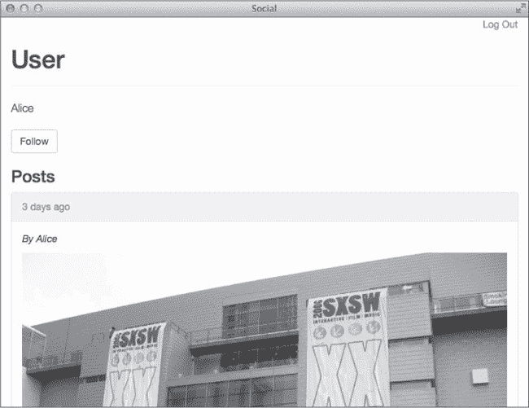
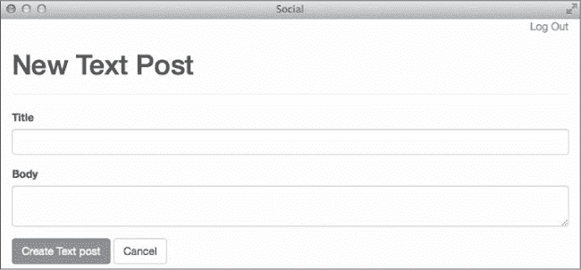

# 第十章：测试

到目前为止，你一直在 Rails 控制台中输入代码并点击浏览器中的链接来测试代码。然而，随着你为应用程序添加更多功能，这种方式将无法扩展。即便使用了更有效的测试方法，你仍然需要记得在每次添加新功能后重新测试应用程序中的所有内容。否则，你可能会错过回归错误。

与其手动测试你的应用程序，不如在 Ruby 中编写自动化测试，确保你的代码是正确的并满足所有需求。一旦你设置好一套自动化测试，你就可以运行整个测试套件来捕捉回归，从而帮助你更有信心地重构代码。

Ruby 提供了几种不同的测试框架。本章重点介绍 Rails 默认使用的测试框架：MiniTest。

# 在 Rails 中进行测试

基本的测试框架会在生成 Rails 模型和控制器时自动创建在*test*目录中。这些只是起点：它们并不真正测试任何内容，但有了框架，添加你自己的测试将变得更加容易。

在本章中，我将讨论如何测试模型和控制器。你将学习如何测试单独的组件以及组件之间的交互。但首先，让我们为测试准备好环境。

## 准备测试

到目前为止，你一直在 Rails `development` 环境中构建应用程序。Rails `test` 环境已经预先配置好用于测试，但在运行测试之前，你仍然需要做一些准备工作。

`test` 环境使用一个独立的数据库专门用于运行测试。首先，确保通过运行数据库迁移来更新应用程序的*db/schema.rb*：

```
$ **bin/rake db:migrate**
```

测试数据库会在每次测试运行之前自动重新创建，以确保测试不依赖于数据库中已经存在的数据。

## 运行测试

现在测试数据库已经设置好，你可以开始运行你的测试了。Rails 提供了几种不同的 rake 任务，用于运行你将创建的各种类型的测试。

默认情况下，`bin/rake test` 命令会运行所有测试。如果你在命令行中包含某个测试文件的名称，它只会运行该文件中的测试。在处理特定模型或控制器时，运行与该类相关的测试会更快。

这个命令会运行文件*test/models/user_test.rb*中的所有测试：

```
$ **bin/rake test test/models/user_test.rb**
```

稍等片刻，你应该会看到类似下面的输出：

```
Run options: --seed 46676

# Running:

Finished in 0.001716s, 0.0000 runs/s, 0.0000 assertions/s.

0 runs, 0 assertions, 0 failures, 0 errors, 0 skips
```

如最后一行所示，还没有定义任何测试。打开*test/models/user_test.rb*，让我们添加一些测试。

```
➊ require 'test_helper'

➋ class UserTest < ActiveSupport::TestCase
➌   # test "the truth" do
    # assert true
    # end
  end
```

这个测试文件首先引入了文件*test/test_helper.rb* ➊，该文件包含了所有测试的配置。测试助手还会加载所有*fixtures*（样本数据），并且可以包含测试的辅助方法。接下来，测试文件通过继承自`ActiveSupport::TestCase` ➋ 定义了一个名为`UserTest`的*测试用例*。测试用例是一组与某个类相关的测试。在测试用例内部，注释中提供了一个简单的示例测试 ➌。

注释掉的测试即使取消注释也并未真正进行测试，因此可以将其移除。但这些行展示了所有测试的基本结构，所以在继续之前让我们先检查一下：

```
➊ test "the truth" do
➋   assert true
  end
```

`test` 方法 ➊ 接受一个测试名称和一个要执行的代码块。这个代码块包含一个或多个断言 ➋。*断言* 用于测试代码行的预期结果。这里显示的 `assert` 方法期望其参数评估为 true。如果断言为真，测试通过并输出一个点。如果断言为假，测试失败，并输出一个 *F* 以及标识失败测试的消息。

现在让我们按照这个基本的测试结构向文件中添加一个真实的测试。我觉得同时打开正在测试的模型文件（在本例中是 *app/models/user.rb*）和测试文件很有帮助。我通常会为模型中添加的任何自定义方法编写测试，并验证模型的验证是否按预期工作。查看 `user` 模型时，你会看到几个 `has_many` 关联，接着是 Rails 的 `has_secure_password` 方法、一个验证以及你编写的方法。

首先，确保你能够创建一个有效的用户。记住，`has_secure_password` 方法会为名为 `password` 和 `password_confirmation` 的属性添加验证。用户还需要有一个唯一的电子邮件地址，因此要创建有效的用户，你必须提供 `email`、`password` 和 `password_confirmation`。

```
  test "saves with valid attributes" do
➊   user = User.new(
      email: "user@example.com",
      password: "password",
      password_confirmation: "password"
     )
➋    assert user.save
   end
```

在这里，你用有效的属性实例化一个新的 `User` 对象 ➊ 并断言它能够成功保存 ➋。

再次运行此文件中的测试：

```
  $ **bin/rake test test/models/user_test.rb**
  Run options: --seed 40521

  # Running:
➊.

  Finished in 0.067091s, 14.9051 tests/s, 14.9051 assertions/s.

➋ 1 runs, 1 assertions, 0 failures, 0 errors, 0 skips
```

单个点 ➊ 代表单个测试。最后一行输出 ➋ 告诉你你运行了一个测试，包含一个断言且没有失败。

你可以继续添加更多的测试，但手动为所有测试创建用户会变得很繁琐。幸运的是，Rails 提供了之前提到的 fixtures，它可以自动创建需要的多个带有示例数据的模型对象。

## 使用 Fixtures

*Fixtures* 为测试提供示例数据，它们是用 *YAML* 格式编写的。YAML 最初代表 *Yet Another Markup Language*，但现在是 *YAML Ain’t Markup Language* 的递归首字母缩略词。Fixtures 会被 *tests/test_helper.rb* 文件自动加载到 `test` 数据库中，并对所有测试用例可用。

### 用户 Fixtures

打开文件 *test/fixtures/users.yml*，清空其内容，并创建两个示例用户：

```
➊ user1:
➋   email: user1@example.com
➌   password_digest: <%= BCrypt::Password.create "password" %>

  user2:
     email: user2@example.com
     password_digest: <%= BCrypt::Password.create "password" %>
```

这段代码为两个用户添加了示例数据。YAML 文件以第一个 fixture 的名称开始，后面跟着冒号 ➊。在本例中，fixture 名为 `user1`。在名称下缩进的行指定了属性。第一个用户的电子邮件地址是 `user1@example.com` ➋。

你甚至可以使用 ERB 来帮助向数据中添加内容。与其预先计算`password_digest`字段的值，不如使用`BCrypt::Password.create`方法动态生成`password_digest` ➌。这个方法是你在第九章中安装的 bcrypt gem 的一部分。

在测试中，使用`users`方法并传递你想要的用户的名字来引用这些用户。例如，`users(:user1)`返回之前定义的第一个用户。

返回到*test/models/user_test.rb*中的用户测试，试试新的数据：

```
    test "validates email presence" do
➊     @user1 = users(:user1)
➋     @user1.email = nila

➌     assert_not @user1.valid?
    end
```

这个测试使用数据初始化一个用户 ➊，将该用户的`email`设置为`nil` ➋，并使用`assert_not`方法确保用户无效 ➌。只有当`assert_not`方法的条件为假值时，才会通过。

这个测试证明了电子邮件是必需的；现在你将添加一个测试，确保电子邮件的唯一性。

```
    test "validates email uniqueness" do
➊     @user1 = users(:user1)
      @user2 = users(:user2)

➋     @user1.email = @user2.email

➌     asseart_not @user1.valid?
    end
```

这个测试使用数据初始化两个用户 ➊，将第一个用户的`email`设置为第二个用户的`email` ➋，并验证 ➌ 第一个用户不再有效。第二个用户仍然有效，因为第一个用户由于无效数据不能被保存。你可以查看*log/test.log*中的测试日志，查看每个测试运行的查询。

数据有基于数据名称的`id`值，这些值始终是相同的。例如，`@user1`的`id`是 206669143\。这个值永远不会改变。数据之间的关联是通过名称创建的，因为每个数据的`id`是基于其名称的。接下来讨论的`Post`数据包括与之前创建的`User`数据的关联。

### 后置数据

Rails 自动为`TextPost`和`ImagePost`类型创建了数据文件。你将把这两种类型的数据包括在`Post`文件中。其他类型的数据文件会导致错误，因此在继续之前，请删除文件*test/fixtures/text_posts.yml*和*test/fixtures/image_posts.yml*。

现在打开文件*test/fixtures/posts.yml*并创建一些示例帖子：

```
post1:
  title: Title One
  body: Body One
  type: TextPost
  user: user1

post2:
  title: Title Two
  url: http://i.imgur.com/Y7syDEa.jpg
  type: ImagePost
  user: user1

post3:
  title: Title Three
  body: Body Three
  type: TextPost
  user: user2
```

这里你有三个帖子。前两个属于名为*user1*的`User`，第三个属于*user2*。稍后你会在为`Post`模型添加测试时用到这些帖子。

## 将断言应用于实践

断言是测试的构建块。你已经在之前写的测试中看到了几个断言，如`assert`和`assert_not`。MiniTest 库中包含了更多断言，Rails 还添加了一些自己的断言。这里是一些最常用的断言：

**`assert` *`test`***

如果`test`表达式的值为真，则测试通过

**`assert_empty` *`obj`***

如果`obj.empty?`为真，则测试通过

**`assert_equal` *`expected, actual`***

如果`expected`值等于`actual`值，则测试通过

**`assert_includes` *`collection, obj`***

如果`collection.includes?(obj)`返回真，则测试通过

**`assert_instance_of` *`class, obj`***

如果`obj.instance_of?(class)`为真，则测试通过

**`assert_match` *`regexp, string`***

如果给定的 `string` 与正则表达式 `regexp` 匹配，则测试通过

**`assert_nil` *obj***

如果 `obj.nil?` 为真，测试通过

每个断言也有“不”的形式。例如，`assert_not` 如果被测试的表达式为假则通过，`assert_not_equal` 如果预期值与实际值不相等则通过。断言还接受一个可选的消息参数，这是一个在断言失败时打印的字符串。

让我们将对断言的知识付诸实践，并为 `user` 模型添加更多测试。以下是第一个测试：

```
   test "should follow leader" do
➊    @user1 = users(:user1)
     @user2 = users(:user2)

➋    @user1.follow!(@user2)

➌    assert_equal 1, @user1.leaders.count
     assert_equal 1, @user2.followers.count
   end
```

该测试使用 fixtures 创建两个用户 ➊，然后调用 `@user1` 的 `follow!` 方法，并将 `@user2` 作为参数 ➋。接着确保 `@user1` 有一个领导者，而 `@user2` 有一个追随者 ➌。

接下来的测试验证了 `following?` 方法是否正常工作：

```
test "following? should be true" do
  @user1 = users(:user1)
  @user2 = users(:user2)

  @user1.follow!(@user2)

  assert @user1.following?(@user2)
end
```

它再次使用 fixtures 创建两个用户，然后调用 `@user1` 的 `follow!` 方法，并将 `@user2` 作为参数，最后确保 `@user1.following?(@user2)` 返回 true。

## 使用回调消除重复

你所编写的测试应该都能正确工作，但我引入了一些代码重复。几乎每个测试都使用 fixtures 来创建用户。记住，不要重复自己。幸运的是，测试用例包括两个回调，可以帮助消除这些重复。*回调* 是在每个测试之前和之后自动调用的方法。

`setup` 方法在每个测试之前调用，而 `teardown` 方法在每个测试之后调用。这些方法通常用于初始化在多个测试中使用的对象。你可以使用 `setup` 方法自动初始化 `@user1` 和 `@user2` 的值。

```
  class UserTest < ActiveSupport::TestCase
➊   def setup
      @user1 = users(:user1)
      @user2 = users(:user2)
    end

    --*snip*--
➋   test "following? should be true" do
      @user1.follow!(@user2)

      assert @user1.following?(@user2)
    end
  end
```

现在，`@user1` 和 `@user2` 在 `setup` 方法中初始化 ➊，你可以从每个测试中去除重复部分，如重写后的 `following?` 测试 ➋ 所示。

# 模型测试

到目前为止，你看到的测试都是模型测试。*模型测试* 验证了应用程序模型的行为。这类测试以前被称为 *单元测试*。我通常会为验证和我编写的任何自定义方法添加测试。

我已经为 `User` 模型覆盖了这两个回调，那么现在让我们为 `Post` 模型添加测试。在编写测试时，你可能还想参考 *app/models/post.rb* 中的 `Post` 模型。

```
class Post < ActiveRecord::Base
  belongs_to :user
  has_many :comments, dependent: :destroy

  validates :user_id, presence: true
  validates :type, presence: true
end
```

`Post` 模型仍然非常简单。一个帖子属于一个用户，并且可以有多个评论。它还验证了 `user_id` 和 `type` 的存在。让我们添加一个测试来验证 `Post` 是否有 `user_id`。在编辑器中打开 *test/models/post_test.rb* 文件：

```
  require 'test_helper'

  class PostTest < ActiveSupport::TestCase
➊   def setup
      @post1 = posts(:post1)
      @post2 = posts(:post2)
    end

➋   test "validates user_id presence" do
      @post1.user_id = nil

      assert_not @post1.valid?
   end
end
```

`setup` 方法 ➊ 初始化了两个你可以在测试中引用的帖子。第一个测试 ➋ 验证没有 `user_id` 的 `Post` 是无效的。

由于现在你已经为用户和帖子编写了模型测试，你可以使用 `bin/rake test:models` 命令来运行所有模型测试：

```
$ **bin/rake test:models**
Run options: --seed 47072

# Running:

......

Finished in 0.234202s, 25.6189 runs/s, 29.8887 assertions/s.

6 runs, 7 assertions, 0 failures, 0 errors, 0 skips
```

如果此命令导致错误，请删除之前提到的`TextPost`和`ImagePost`模型中未使用的 fixture 文件。删除*test/fixtures/text_posts.yml*和*test/fixtures/image_posts.yml*。

其他帖子类型有自己的验证。例如，`TextPost`验证`body`的存在，`ImagePost`验证`url`的存在。既然我们已经有了`TextPost`和`ImagePost`的 fixture，那么让我们为这两个验证添加测试：

```
  test "TextPost requires body" do
➊   assert_instance_of TextPost, @post1

➋   @post1.body = nil

➌   assert_not @post1.valid?
  end

  test "ImagePost requires url" do
    assert_instance_of ImagePost, @post2

    @post2.url = nil

    assert_not @post2.valid?
  end
```

这两个测试遵循相同的模式。首先，验证`@post1`是否为`TextPost`的实例 ➊。接着，将`@post1`的`body`设置为`nil` ➋。最后，验证`@post1`不再有效 ➌。`ImagePost`的断言做了相同的事情，但针对`@post2`。

# 控制器测试

*控制器测试*通过模拟请求到你的应用程序并验证响应，来验证单个控制器的操作。控制器测试确保控制器操作能够成功响应有效请求，并正确渲染视图或重定向到正确的位置。这类测试之前被称为*功能测试*。

## 控制器测试辅助方法

Rails 包含了几个辅助方法和变量，使控制器测试更易编写。

方法`get`、`post`、`put`、`patch`、`head`和`delete`模拟对控制器操作的请求。这些方法可以接受两个可选的哈希：一个表示请求参数，另一个表示当前会话。

在使用上述六个方法之一发出请求后，以下四个哈希变得可用：

| **`assigns`** | 包含在控制器操作中分配的实例变量 |
| --- | --- |
| **`cookies`** | 包含操作中设置的任何 cookie 值 |
| **`flash`** | 包含操作中设置的闪存值 |
| **`session`** | 包含操作中设置的任何会话值 |

你的测试还可以访问三个实例变量：`@controller`包含正在处理请求的控制器；`@request`是正在处理的请求；`@response`是控制器对该请求的响应。

## 控制器测试断言

Rails 为控制器测试添加了几个断言，除了你已经见过的那些之外。控制器操作总是会渲染响应或重定向到不同的 URL。

**`assert_response` *`type`***

如果 HTTP 响应与特定状态码匹配，则通过测试。对于`type`，可以使用状态码或符号`：success`、`：redirect`、`：missing`或`：error`。

**`assert_redirected_to` *`options`***

如果请求导致重定向到`options`中给定的路径，则通过测试。

**`assert_template` *expected***

如果请求渲染了`expected`模板，则通过测试。

这些断言验证控制器操作是否正确响应请求。对于简单的 GET 请求，`assert_response :success`可能是唯一需要的测试。如果控制器操作分配了实例变量，你还应验证该赋值操作。

让我们为`UsersController`中的`new`和`create`动作添加控制器测试。首先，测试`new`动作是否成功渲染带有新创建的`User`模型实例的注册表单。打开文件*test/controllers/users_controller_test.rb*，添加以下测试：

```
   test "should get new with new user" do
➊    get :new

➋    user = assigns(:user)

➌   assert user.new_record?
    assert_response :success
  end
```

这个测试发出一个 GET 请求到新用户页面 ➊，获取控制器中分配给实例变量`@user`的值 ➋，并验证`user`是一个新记录 ➌，且响应成功。

下一个测试检查在给定有效数据时创建新用户的能力：

```
   test "should create user" do
➊    params = {
       user: {
         email: "user@example.com",
         password: "password",
         password_confirmation: "password"
       }
      }

➋     post :create, params
➌     assert_redirected_to root_url
    end
```

这个测试稍微复杂一些，因为`create`动作需要一个包含新用户数据的哈希 ➊。这个测试通过`params`哈希向`create`动作发出 POST 请求 ➋，然后验证该动作是否重定向到`root_url` ➌。

上一个测试检查了`User`成功保存时发生的情况。你应该测试控制器动作中的另一条路径，即当`User`无法保存时。你可以添加一个测试，尝试创建一个具有无效属性的用户，并验证是否再次渲染新用户模板。

使用`bin/rake test:controllers`命令运行新的控制器测试：

```
$ **bin/rake test:controllers**
```

`UsersController`的测试应该成功通过，那么我们继续进行`PostsController`的测试。验证`before_action`方法`authenticate_user!`是否正常工作，以确保应用程序不会向未认证用户展示帖子。

打开文件*test/controllers/posts_controller_test.rb*，并添加以下测试：

```
    test "redirects anonymous users to login" do
➊     get :index
➋     assert_redirected_to login_url
    end

    test "get index for authenticated users" do
➌     user1 = users(:user1)

➍     get :index, {}, { user_id: user1.id }
      assert_response :success
    end
```

第一个测试尝试 GET 请求文章`index`页面 ➊，并验证该动作是否重定向到登录页面 ➋。第二个测试使用一个数据固定项初始化一个用户 ➌，然后带着`user_id`在会话中发出 GET 请求访问`index`页面 ➍。通过在会话中包含有效的`user_id`来模拟登录用户，应该能获得一个成功的响应。

# 集成测试

*集成测试*验证不同控制器之间的交互。这些测试通常用于测试应用程序中多个页面之间的*流程*。一个流程的例子可能是登录应用、查看页面，然后执行某个其他操作。这些操作中的每一个都可以通过控制器测试来覆盖。集成测试确保它们能一起工作。

## 集成辅助工具

因为集成测试通常涉及在应用程序页面之间移动，所以你的测试不仅需要向动作发出请求，还需要跟随任何重定向。辅助方法`redirect?`和`follow_redirect!`分别检查最后的请求是否导致重定向，并跟随重定向响应。

如果你知道一个请求会导致重定向，可以使用更具体的方法。你可以使用`get_via_redirect`、`post_via_redirect`、`put_via_redirect`、`patch_via_redirect`或者`delete_via_redirect`来发出适当的请求并跟随重定向。

## 测试流程

Rails 不会像模型和控制器测试那样自动创建集成测试，因为 Rails 无法知道你想要测试哪些流程。尽管它们不会自动创建，但 Rails 确实提供了一个生成器，你可以用来创建集成测试。

让我们添加一个集成测试，验证用户是否可以登录应用程序、查看主页然后退出。首先，使用`bin/rails generate`命令创建一个新的集成测试：

```
$ **bin/rails g integration_test user_flow**
```

这个命令创建一个新文件，命名为*test/integration/user_flow_test.rb*。在你的编辑器中打开该文件，让我们添加一个测试：

```
  require 'test_helper'

  class UserFlowTest < ActionDispatch::IntegrationTest

    test "user login, browse, and logout" do
      user = users(:user1)

➊     get "/login"
a
      assert_response :success

➋     post_via_redirect "/sessions",
        email: user.email,
        password: "password"

      assert_equal "/", path

➌     get_via_redirect "/logout"

      assert_equal "/login", path
    end
 end
```

这个测试看起来像是一个扩展的控制器测试。该测试使用`get`请求页面➊，然后验证响应是否成功。你知道用户是通过向会话路径发送 POST 请求来登录应用程序，然后被重定向到主页，所以你使用`post_via_redirect`方法提交用户的电子邮件地址和密码，随后自动跟随重定向➋。最后，测试发出一个 GET 请求到登出页面➌，并被重定向回登录页面。

输入以下命令来运行集成测试：

```
$ **bin/rake test test/integration/user_flow_test.rb**
Run options: --seed 51886

# Running:

.

Finished in 1.049118s, 0.9532 runs/s, 2.8595 assertions/s.

1 runs, 3 assertions, 0 failures, 0 errors, 0 skips
```

该测试确认用户能够登录应用程序、查看主页并成功退出。

目前，这条路径基本上是用户在应用程序中可以走的唯一路径。当你向应用程序添加更多操作时，可以创建集成测试来验证其他流程是否正常工作。

# 使用测试驱动开发添加功能

到目前为止编写的所有测试都验证了现有功能，但一些 Rails 开发者使用测试在实现功能之前定义功能，这种做法被称为*测试驱动开发（TDD）*。在 TDD 中，你首先编写一个测试，然后添加代码使测试通过。一旦测试通过，你可以根据需要重构代码。如果你遵循 TDD，就不必担心以后解析代码来弄清楚需要验证哪些功能。

TDD 通常是一个三步过程，称为红-绿-重构：

1.  编写一个失败的测试（红色）。

1.  编写代码使测试通过（绿色）。

1.  根据需要重构（refactor）。

通过遵循这个过程，你可以确信新功能符合测试中指定的要求，并且没有引入任何回归问题。

让我们使用 TDD 向我们的社交应用程序添加功能。尽管许多功能仍然缺失，但我们先集中关注这些：

+   添加一个用户`show`页面，显示用户的帖子并包含一个“关注”按钮。

+   让用户能够创建新帖子。

对于这些功能，你将首先编写一个失败的测试，然后编写代码使测试通过。

## 显示用户

用户的 `show` 页面显示了用户的姓名和帖子，应该还包括一个按钮，允许其他用户关注该用户。为了添加用户的 `show` 页面，你需要在用户控制器中添加一个 `show` 方法并创建相应的视图。你知道控制器应该为视图分配一个名为 `@user` 的实例变量并返回成功响应，所以我们来为此添加一个测试。

打开文件 *test/controllers/users_controller_test.rb* 并添加这个测试：

```
test "should show user" do
  user = users(:user1)

  get :show, id: user.id
  assert assigns(:user)
  assert_response :success
end
```

现在，运行测试并确保它失败：

```
$ **bin/rake test test/controllers/users_controller_test.rb**
```

运行这个测试应该会导致一个错误。由于你还没有创建 `show` 操作，所以找不到 `UsersController` 的 `show` 操作。现在让我们向 *app/controllers/users_controller.rb* 中添加 `show` 操作：

```
class UsersController < ApplicationController

**def show**
  **@user = User.find(params[:id])**
  **@posts = @user.posts.order("created_at DESC")**
  **end**

--*snip*--
```

保存文件并再次运行测试。这次你应该会看到一个不同的错误。模板丢失了。创建一个新的文件 *app/views/users/show.html.erb*，并现在添加该模板：

```
<div class="page-header">
  <h1>User</h1>
</div>

<p class="lead"><%= @user.name %></p>

<h2>Posts</h2>

<%= render @posts %>

<%= link_to "Home", root_path,
      class: "btn btn-default" %>
```

保存这个文件并再次运行测试。所有测试现在应该都通过了，但你仍然有一个问题。这个页面显示了用户的电子邮件地址和用户的帖子，但没有人可以关注该用户！

关注一个用户会在数据库的 subscriptions 表中创建一条记录。由于这必须在服务器端进行，添加关注按钮需要一个控制器操作和一个新的路由到该操作。

在 *test/controllers/users_controller_test.rb* 中添加另一个控制器测试，以描述这个操作：

```
   test "should follow user" do
➊    user1 = users(:user1)
     user2 = users(:user2)

➋    get :follow, { id: user2.id }, { user_id: user1.id }
➌    assert user1.following? user2
     assert_redirected_to user_url(user2)
   end
```

这个测试首先使用数据填充（fixtures）创建两个用户 ➊。接下来，它使用第二个用户的 `id` 作为参数，且将第一个用户的 `id` 放入会话中，发出对 `follow` 操作的 GET 请求 ➋。这模拟了 `user1` 关注 `user2` 的场景。最后，它验证 `user1` 已经关注了 `user2`，并且请求会重定向回 `user2` 的 `show` 页面 ➌。

现在打开 *app/controllers/users_controller.rb* 文件，并在其他操作之后但在 `private` 方法之前添加 `follow` 操作：

```
   class UsersController < ApplicationController
     --*snip*--

     **def follow**
➊    **@user = User.find(params[:id])**
➋    **if current_user.follow!(@user)**
➌      **redirect_to @user, notice: "Follow successful!"**
     **else**
       **redirect_to @user, alert: "Error following."**
     **end**
   **end**

   private
   --*snip*--
```

这个方法使用 `id` 参数 ➊ 找到正确的用户，调用当前用户的 `follow!` 方法 ➋，然后重定向到 @user ➌。

现在打开 *config/routes.rb* 并为新的 `follow` 操作添加一个路由：

```
Rails.application.routes.draw do
  --*snip*-

  get 'signup', to: 'users#new', as: 'signup'
  **get 'follow/:id', to: 'users#follow', as: 'follow_user'**

  --*snip*-
end
```

我将其添加到了 `signup` 路由下，因为这两个操作都在用户控制器中。现在，回到 *app/views/users/show.html.erb* 中，你可以添加关注按钮了：

```
--*snip*-
<p class="lead"><%= @user.name %></p>

**<%= link_to "Follow", follow_user_path(@user),**
      **class: "btn btn-default" %>**

<h2>Posts</h2>
--*snip*--
```

关注按钮类似于首页按钮；它实际上是一个带有 Bootstrap `btn` 和 `btn-default` 样式的链接，使其看起来像一个按钮。

现在你可以重新运行控制器测试，确保它们全部通过。如果 Rails 服务器尚未启动，你也可以启动它，然后在你的浏览器中访问 *http://localhost:3000/users/1* 来查看第一个用户的 `show` 页面，正如 图 10-1 所示。



图 10-1. 用户显示页面

图 10-1 是`show`页面，包含用户的姓名、关注该用户的按钮和该用户的帖子。

## 创建帖子

现在，让我们为用户提供添加帖子功能。添加帖子需要两个控制器动作：`new`和`create`。`new`动作也需要一个相应的视图。`create`动作应重定向到新创建的帖子，因此不需要视图。

你的应用程序有两种不同类型的帖子。从添加创建`TextPost`类型帖子的功能开始。`TextPostsController`中的`new`动作应实例化一个新的`TextPost`对象，并为该对象渲染一个表单。在*test/controllers/text_posts_controller_test.rb*中添加一个失败的测试，然后开始工作：

```
   test "get new with new post" do
➊    user1 = users(:user1)

➋    get :new, {}, { user_id: user1.id }
     text_post = assigns(:text_post)

     assert text_post.new_record?
     assert_response :success
   end
```

测试首先使用数据集创建一个新用户 ➊，然后发送一个 GET 请求到`new`动作，并在会话中设置`user_id` ➋。这一步是必要的，因为`TextPostsController`要求一个经过身份验证的用户。测试接着获取`text_post`实例变量，验证它是一个新记录，并验证响应成功。运行测试并观察这个测试失败：

```
$ **bin/rake test test/controllers/text_posts_controller_test.rb**
```

错误消息应指出`TextPostsController`中缺少`new`动作。打开*app/controllers/text_posts_controller.rb*，并添加`new`动作：

```
class TextPostsController < ApplicationController
  **def new**
    **@text_post = TextPost.new**
  **end**
end
```

你几乎已经完成了测试的所有步骤。最后一步是添加相应的视图。创建文件*app/views/text_posts/new.html.erb*，并添加以下内容：

```
<div class="page-header">
  <h1>New Text Post</h1>
</div>

<%= render 'form' %>
```

这个视图是一个页面头部，后跟用于表单部分的`render`命令。让我们现在添加这个部分。首先，创建文件*app/views/text_posts/_form.html.erb*，并添加这个表单：

```
<%= form_for @text_post do |f| %> ➊
  <div class="form-group">
    <%= f.label :title %>
    <%= f.text_field :title, class: "form-control" %> ➋
  </div>
  <div class="form-group">
    <%= f.label :body %>
    <%= f.text_area :body, class: "form-control" %> ➌
  </div>

  <%= f.submit class: "btn btn-primary" %> ➍
  <%= link_to 'Cancel', :back, class: "btn btn-default" %>
<% end %>
```

这个部分为分配给`@text_post` ➊的新`TextPost`创建了一个表单。表单包括一个用于帖子标题的文本框 ➋、一个用于帖子内容的文本区域 ➌，以及提交表单或取消并返回的按钮 ➍。

在编辑视图时，在主页上添加一个创建新文本帖子按钮。打开*app/views/posts/index.html.erb*，然后在页面头部下方添加这个链接：

```
<p>
  <%= link_to "New Text Post", new_text_post_path,
        class: "btn btn-default" %>
</p>
```

现在你应该能够成功运行`TextPostController`的测试。现在，在*test/controllers/text_posts_controller_test.rb*中添加另一个控制器测试，用于描述创建一个`TextPost`：

```
    test "should create post" do

➊     user = users(:user1)
➋     params = {
        text_post: {
          title: "Test Title",
          body: "Test Body"
        }
      }

➌     post :create, params, { user_id: user.id }

      text_post = assigns(:text_post)

➍     assert text_post.persisted?

      assert_redirected_to post_url(text_post)
    end
```

与之前的`TextPostsController`控制器测试类似，本测试首先从一个数据集初始化一个新的用户 ➊。接下来，它为一个新的`TextPost`设置必要的参数 ➋，然后发送一个 POST 请求 ➌到`create`动作，附带`params`哈希和会话中的`user.id`。最后，它确保 ➍ 新的文本帖子已成功保存到数据库，并且请求重定向到新帖子的 URL。

使这个测试通过的第一步是向`TextPostsController`添加一个`create`动作。打开文件*app/controllers/text_posts_controller.rb*，并添加以下方法：

```
   class TextPostsController < ApplicationController
   --*snip*--

   **def create**

     **@text_post =**
➊      **current_user.text_posts.build(text_post_params)**
       **if @text_post.save**
➋       **redirect_to post_path(@text_post),**
                       **notice: "Post created!"**
        **else**
➌         **render :new, alert: "Error creating post."**
        **end**
      **end**
    end
```

`create` 方法使用表单中的 `params` 为当前用户创建一个新的文本帖子➊。如果能够保存该新帖子，它将重定向用户➋ 到新创建的帖子页面。否则，它会再次呈现带有错误消息的新建文本帖子表单 ➌。

最后，添加 `text_post_params` 方法来处理 Rails 强参数。这一方法会在 `create` 操作中调用，以获取新建 `TextPost` 的允许参数。将此私有方法添加到 `TextPostsController` 类的底部：

```
    class TextPostsController < ApplicationController
    --*snip*--
    **private**

    **def text_post_params**
➊     **params.require(:text_post).permit(:title, :body)**
    **end**
  end
```

这个方法确保➊ `params` 哈希包含 `:text_post` 键，并允许在 `:text_post` 键下的 `:title` 和 `:body` 键值对。进行此更改后，所有测试应重新通过。在首页点击 **新建文本帖子** 按钮，如图 10-2 所示，查看创建 `TextPost` 的表单。



图 10-2. 新建文本帖子表单

创建新的 `ImagePost` 的过程类似。本章末的练习 3 将引导你完成必要的步骤。

这些新功能使我们的应用更加接近一个完整的社交网络。

# 总结

本章涵盖了很多内容。你了解了 MiniTest 框架，编写了模型、控制器和集成测试。我们讨论了测试驱动开发，并使用它向社交网络添加了功能。

你可以在代码之前或之后编写测试，且可以使用任何测试框架——重要的是你要编写测试。能够输入一个命令并验证应用是否正常工作，值得花费一些时间来实现。在应用的生命周期中，全面的测试集带来的好处是无法估量的。

# 练习

| 问： | 1\. 目前你无法通过点击 URL 到达用户的 `show` 页面。请更新 `TextPost` 和 `ImagePost` 的局部视图，使得用户的 `name` 成为指向该用户 `show` 页面链接。同时，在应用布局的顶部，*Log Out* 链接旁边，添加一个名为 *Profile* 的链接，指向当前用户的 `show` 页面。 |
| --- | --- |

| 问：| 2\. `follow` 操作不应对匿名用户开放。请在 `UsersController` 中调用 `before_action :authenticate_user!` 并使用 `only` 选项，要求在执行 `follow` 操作前进行身份验证。更新 `UsersController` 后，以下测试应该通过：

```
test "follow should require login" do
  user = users(:user1)

  get :follow, { id: user.id }

  assert_redirected_to login_url
end
```

此外，用户 `show` 页面上的 Follow 按钮不应在匿名用户或当前用户已关注该展示用户的情况下显示。请更新 `show` 视图来解决这个问题。|

| 问： | 3\. 为图像帖子添加`new`和`create`操作，以及`create`操作中使用的私有`image_post_params`方法，位置在*app/controllers/image_posts_controller.rb*中。然后在*app/views/image_posts/new.html.erb*中为`new`操作创建视图，并在*app/views/image_posts/_form.html.erb*中为`ImagePost`表单创建部分视图。 |
| --- | --- |

将以下控制器测试添加到*test/controllers/image_posts_controller_test.rb*中。在你将操作添加到`ImagePostsController`并创建相关视图后，两个测试应当通过。

```
test "get new with new post" do
  user1 = users(:user1)

  get :new, {}, { user_id: user1.id }

  image_post = assigns(:image_post)

  assert image_post.new_record?
  assert_response :success
end

test "should create post" do
  user = users(:user1)
  params = {
    image_post: {
      title: "Test Title",
      url: "http://i.imgur.com/Y7syDEa.jpg"
    }
  }

  post :create, params, { user_id: user.id }

  image_post = assigns(:image_post)

  assert image_post.persisted?
  assert_redirected_to post_url(image_post)
end
```

你对这些操作和视图的实现应类似于 TextPost 的`new`和`create`操作以及视图。如果你想练习 TDD，欢迎先添加这些测试并确认它们失败，再开始实现操作。
