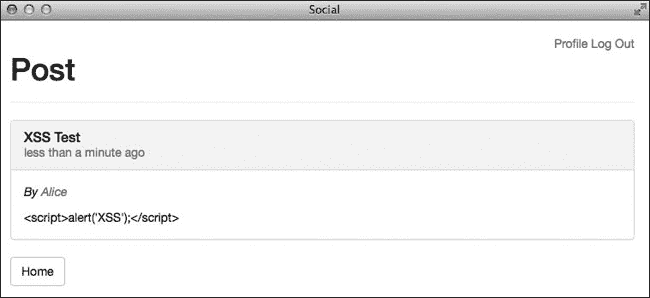
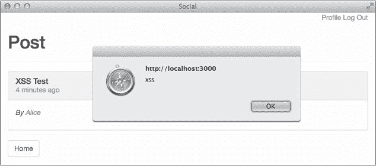

# 第十一章：安全

当用户在你的网站上注册账户时，他们信任你会保护他们的数据安全。遗憾的是，随着你的应用越来越受欢迎，攻击的可能性也会增加。即使你的应用目前不太受欢迎，它仍然可能成为自动化系统的目标，这些系统会扫描网络，寻找易受攻击的网站。

在本章中，你将学习四种最常见的安全漏洞，以及如何保护你的站点免受它们的侵害。我们将讨论授权、注入攻击、跨站脚本攻击和跨站请求伪造攻击。

# 授权攻击

你在第九章中创建了一个认证系统，但认证并不等于授权。*认证*是用来识别用户的。*授权*则是指定一个已登录用户可以在你的应用中访问的内容。你的认证系统通过电子邮件地址和密码来识别用户。授权系统通常处理角色或权限。

到目前为止，你还没有为应用中的用户定义角色，但应该为一些权限做出规定。例如，用户应该能够查看和编辑自己发布的帖子，但只能查看其他用户发布的帖子。用户还应该能够管理自己帖子下的评论，即使这些评论是由其他用户添加的。

*授权攻击*发生在用户设法绕过权限，访问属于另一个用户的资源时。最常见的授权攻击类型是*不安全的直接对象引用*，这意味着用户可以通过操控 URL 来访问你应用中受限的资源。

让我们来看一个来自社交应用的示例。这段代码示例创建了一个方法，允许用户编辑之前创建的文本帖子，但它包含一个资源查找，这使得不安全的直接对象引用成为可能：

```
def edit
  @text_post = TextPost.find(params[:id])
end
```

这个方法使用作为 URL 一部分传入的`id`参数来查找要编辑的`TextPost`，无论最初是谁创建的。因为这段代码没有检查哪个用户在尝试访问该帖子，所以任何经过身份验证的用户都可以编辑应用中的任何帖子。用户只需打开自己的一个帖子进行编辑，找出 URL 中表示帖子的`id`的部分，并将该值更改为另一个帖子的`id`。

你只希望用户能够编辑他们自己的帖子。下面的列表展示了一种更好的处理这种查找的方法：

```
def edit
  **@text_post = current_user.text_posts.find(params[:id])**
end
```

通过使用`current_user.text_posts`，`find`方法仅限于查找当前用户的帖子。现在，如果用户在尝试修改其他用户的帖子时更改了 URL 中的`id`，`find`将会失败，用户应该会看到 404 错误页面。如果某个资源属于某个用户，在数据库中查找该资源时，始终引用该用户。

现在你已经知道了正确的找到要编辑的帖子的方法，将之前的方法添加到文本帖子控制器 *app/controllers/text_posts_controller.rb* 中。当用户提交`edit`文本帖子表单时，修改内容会发送到`update`操作。使用相同的授权方法，为文本帖子添加`update`方法：

```
   def update
➊    @text_post = current_user.text_posts.find(params[:id])
➋    if @text_post.update(text_post_params)
       redirect_to post_path(@text_post), notice: "Post updated!"
    else
      render :edit, alert: "Error updating post."
    end
   end
```

该方法会找到属于当前用户的正确文本帖子 ➊，并使用文本帖子表单中的`params`调用`update`方法 ➋。如果`update`调用成功，文本帖子会在数据库中更新，用户会被重定向到更新后的帖子。否则，`edit`视图会重新渲染，并显示错误信息。

接下来，创建文件 *app/views/text_posts/edit.html.erb*，并为文本帖子添加`edit`视图：

```
<div class="page-header">
  <h1>Edit Text Post</h1>
</div>

<%= render 'form' %>
```

这个视图与文本帖子的`new`视图相同，唯一不同的是标题。这个视图重用了你在上一章中创建的表单局部视图。最后，在 *app/views/text_posts/_text_post.html.erb* 中的`TextPost`局部视图添加指向`edit`操作的链接。

```
      <%= text_post.body %>

➊     **<% if text_post.user == current_user %>**
        **<p>**
        **<%= link_to 'Edit', edit_text_post_path(text_post),**
              **class: "btn btn-default" %>**
        **</p>**
      **<% end %>**
    </div>
  </div>
```

该链接仅在文本帖子属于当前用户 ➊ 时显示。编辑图片帖子遵循相同的模式。将`edit`和`update`方法添加到 *app/controllers/image_posts_controller.rb*，为图片帖子在 *app/views/image_posts/edit.html.erb* 创建`edit`视图，并在 *app/views/image_posts/_image_post.html.erb* 中的`ImagePost`局部视图添加指向`edit`操作的链接。这些步骤在本章末的练习 1 中讲解。

# 注入攻击

*注入攻击*发生在用户的输入作为应用程序的一部分被执行时。注入攻击非常常见，尤其是在较旧的应用程序中。

避免注入攻击的第一条规则是*绝不信任用户输入*。如果一个应用程序没有确保用户输入的所有数据都是安全的，那么它就容易受到注入攻击。记住这一点，我们将在本节中讨论两种类型的注入攻击：SQL 注入和跨站脚本攻击。

## SQL 注入

在*SQL 注入*攻击中，用户输入会直接添加到 SQL 语句中。如果恶意用户提供实际的 SQL 代码作为输入，他或她可能绕过应用程序的授权系统，查询应用程序的数据库，并获取或删除受限信息。

例如，考虑一个没有使用 Rails 内建安全密码功能的应用程序。相反，开发者将用户名和密码存储在数据库中，并编写了自己的`authenticate`方法来验证用户的凭证。这个自定义的`User.authenticate`方法展示了*不该*做的事情，因为它容易受到 SQL 注入攻击：

```
  class User < ActiveRecord::Base
➊   def self.authenticate(username, password)
➋     where("username = '#{username}' " +
            "AND password = '#{password}'").first
    end
  end
```

该方法接受`username`和`password` ➊ 作为参数。这些值由用户输入并作为参数传递给控制器。然后，这些变量会使用字符串插值添加到`where`调用中 ➋。

这个方法对于有效的`username`和`password`组合会返回正确的用户对象。例如，假设一个`User`的`username`为 tony，`password`为 secret，这个方法会返回该`User`：

```
User.authenticate("tony", "secret")
 => #<User id: 1, username: ...>
```

方法调用然后生成以下 SQL 代码：

```
SELECT * FROM "users"
WHERE (username = 'tony' AND password = 'secret')
ORDER BY "users"."id" ASC
LIMIT 1
```

该方法在传入无效的`username`和`password`组合时也能正确工作：

```
User.authenticate("tony", "wrong")
 => nil
```

在这种情况下，`password`无效，因此方法返回`nil`。到目前为止，一切正常！

### 绕过认证系统

不幸的是，经验丰富的攻击者知道一个方便的 SQL 字符串，可以完全绕过这个`authenticate`方法：`' OR '1'='1`。在 SQL 中，`'1'='1'`语句的结果是`TRUE`，所以如果它与`OR`一起添加到任何其他条件语句中，整个条件语句都会被计算为`TRUE`。

让我们看看当这个字符串传递给`authenticate`方法的`username`和`password`时会发生什么：

```
User.authenticate("' OR '1'='1", "' OR '1'='1")
 => #<User id: 1, username: ...>
```

我没有向方法传递任何有效的数据，那么`authenticate`方法是如何成功的呢？方法调用生成的 SQL 代码揭示了其中的技巧：

```
SELECT * FROM "users"
WHERE (username = '' OR '1'='1' AND password = '' OR '1'='1')
ORDER BY "users"."id" ASC
LIMIT 1
```

即使数据库中没有`username`和`password`为空字符串的用户，`OR '1'='1'`的添加使得`WHERE`子句计算为`TRUE`，然后该方法返回数据库中的第一个用户。攻击者现在以第一个用户身份登录。这个攻击的危害加剧，因为数据库中的第一个用户通常是应用程序的创建者，他可能还拥有特殊权限。

### 防止 SQL 注入

幸运的是，您通常可以通过仔细检查代码找到 SQL 注入错误。如果您看到`where`方法内部有字符串插值，假设它是危险的并且需要修正。

如果您必须构建自己的查询字符串，请切换到哈希条件：

```
def self.authenticate
  username = params[:username]
  password = params[:password]

  where(username: username,
        password: password).first
end
```

在这里，字符串被完全移除出对`where`方法的调用。

## 跨站脚本

*跨站脚本攻击（XSS）*是另一种常见的注入攻击。在跨站脚本攻击中，攻击者被允许向您的应用程序中输入恶意的 JavaScript 代码。任何文本字段都可能被用于跨站脚本攻击。当另一个用户查看包含恶意 JavaScript 的页面时，用户的浏览器会将代码作为应用程序的一部分执行。

跨站脚本漏洞可以被利用来篡改您的网站，甚至显示假的登录表单，试图窃取用户凭据。如果攻击者能够向您的网站注入代码，几乎可以做任何事情。

### 内置保护

Rails 默认提供跨站脚本保护。除非您明确绕过此保护，否则您的应用程序是安全的，免受 XSS 攻击。作为快速检查，尝试在新文本帖子的正文中输入以下 JavaScript 代码：

```
**<script>alert('XSS');</script>**
```

保存此帖子后，你会看到在显示文本之前，Rails 会首先*转义*所有 HTML 标签，通过将特殊字符替换为相应的字符实体，正如图 11-1 所示。



图 11-1. 带有转义 HTML 的文本帖子

例如，小于号被替换为 `&lt;`，大于号被替换为 `&gt;`。这些代码不会被执行，而是像其他文本一样显示在页面上。所以如果你不打算允许用户在你的网站中输入 HTML，你的应用程序就可以避免跨站脚本攻击。

不幸的是，用户可能会希望在你的应用程序中输入 HTML 标签来格式化他们的帖子。在这种情况下，你的网站至少需要接受一些 HTML 标签。你可以通过在视图中使用 `raw` 辅助方法来关闭 HTML 标签的自动转义功能。打开 *app/views/text_posts/_text_post.html.erb* 并在 `text_post.body` 前添加 `raw`：

```
--*snip*--
  <%= **raw** text_post.body %>
--*snip*--
```

现在，当你在浏览器中刷新页面时，script 标签将不会被转义，你应该会看到一个弹出窗口，显示“XSS”，如图 11-2 所示。



图 11-2. 带有 XSS 漏洞的文本帖子

诀窍是让你的应用程序只接受安全的标签，如 `<strong>` 用于加粗，`<em>` 用于斜体，`<p>` 用于标记段落，同时拒绝诸如 `<script>` 这样的危险标签。你可能会想自己编写一个辅助方法来处理这些危险标签，但幸运的是，Rails 提供了 `sanitize` 辅助方法来帮你处理这些问题。

### sanitize 方法

`sanitize` 辅助方法会移除所有未明确允许的 HTML 标签，只有在白名单中的标签才会被保留。你可以通过在 Rails 控制台输入**`ActionView::Base.sanitized_allowed_tags`**查看允许的标签列表。

在 Rails 控制台尝试一些 `sanitize` 方法的示例，熟悉它是如何工作的：

```
irb(main):001:0> **helper.sanitize("<p>Hello</p>")**
 => "<p>Hello</p>"
irb(main):002:0> **helper.sanitize("<script>alert('XSS')</script>")**
 => ""
```

你可以通过在 `options` 哈希中为 `tags` 键指定值，来自定义允许的标签数组：

```
irb(main):003:0> **helper.sanitize("<p>Hello</p>", tags: ["em", "strong"])**
 => "Hello"
```

现在你已经看到 `sanitize` 方法的实际效果，将 `TextPost` 部分中之前编辑的 `raw` 方法调用替换为 `sanitize`。

```
--*snip*--
  <%= **sanitize** text_post.body %>
--*snip*--
```

再次刷新页面，你应该不再看到警告。

# 跨站请求伪造攻击

*跨站请求伪造（CSRF）攻击*发生在你的应用程序的用户访问了一个被攻击者修改过的站点，该站点专门针对你的站点。恶意站点试图利用你应用程序对该用户的信任，向你的应用程序提交请求。

要利用 CSRF 漏洞，攻击者必须首先在你的应用程序中找到这个漏洞。接下来，他或她必须创建一个页面，里面包含指向该漏洞的链接。最后，攻击者必须诱使你的应用程序用户访问这个恶意页面并激活链接。

## CSRF 是如何工作的

假设你正在构建一个在线支付应用程序。你的应用程序包括一个`transfer`操作，接受`amount`和`to`参数，指定要将多少钱转账给另一个用户。

攻击者可能会研究你的网站生成的请求，并尝试在他或她自己的网站上复制这些请求，使用像 HTML 图像标签这样简单的方式：

```

```

每次有人访问此页面时，用户的浏览器会发出一个 GET 请求来加载这个图像。如果访问者已登录到你的站点，并且你的站点容易受到 CSRF 攻击，那么$100 会从访问者的账户转到攻击者的账户。

你并没有构建一个支付站点，但你的站点容易受到 CSRF 攻击。在第十章中，你为一个用户添加了一个方法，可以让他/她在网站上*关注*另一个用户。在这样做时，你向 *config/routes.rb* 添加了以下一行：

```
get 'follow/:id', to: 'users#follow', as: 'follow_user'
```

通过查看我点击“关注”按钮时生成的请求，我可以创建一个恶意链接来利用这个漏洞。假设我的账户`id`是 10，链接会像这样：

```

```

现在，我只需要说服其他用户访问一个包含这个图像标签的页面，他们就会自动关注我。

## 防止 CSRF

你可以通过两个步骤来防止 CSRF 攻击。首先，包含一个用户特定的令牌在所有改变应用程序状态的请求中，并忽略任何不包含此令牌的请求。其次，永远不要使用 GET 请求来改变状态。如果一个请求可能会创建或更改数据库或会话中的数据，它应该使用 POST 请求。

Rails 默认会处理包括一个秘密令牌并拒绝请求。打开 *app/views/layouts/application.html.erb* 文件，可以查看包括令牌的代码：

```
<%= csrf_meta_tags %>
```

在浏览器中加载你的网站，然后查看源代码，查看页面`head`中由该方法生成的`meta`标签。

```
<meta content="authenticity_token" name="csrf-param" />
<meta content="KA1Q/JoVfI+aV6/L4..." name="csrf-token" />
```

你还可以在应用程序中的每个表单里看到一个隐藏字段，里面包含`authenticity_token`。每次提交表单时，这个隐藏字段的值会与其他参数一起提交。`authenticity_token`也会自动包含在所有的 POST 请求中。

现在打开 *app/controllers/application_controller.rb* 文件，查看实际拒绝无效请求的代码：

```
protect_from_forgery with: :exception
```

在这里，Rails 更进一步，对那些没有包括 CSRF 令牌的请求抛出异常。这个异常会被记录下来，可以用来追踪攻击者。

第二步必须由你自己处理。每次你添加控制器操作时，确保如果该操作可能更改数据，就不要使用 GET 请求。在第十章中添加的 `follow` 操作会在数据库中创建一条记录，因此它应该使用 POST 请求。POST 请求会自动包含 `authenticity_token`，并且 Rails 会通过 `ApplicationController` 中的 `protect_from_forgery` 方法验证该令牌。

要修正应用中的这个漏洞，打开 *config/routes.rb* 并将 `follow` 操作改为使用 POST 而不是 GET：

```
--*snip*--
**post** 'follow/:id', to: 'users#follow', as: 'follow_user'
--*snip*--
```

现在，更新 *app/views/users/show.html.erb* 中的链接，改为使用 POST 方法，而不是默认的 GET：

```
<%= link_to "Follow", follow_user_path(@user),
      **method: :post**, class: "btn btn-default" %>
```

通过这两个更改，`follow` 操作现在应该可以防止 CSRF 攻击。

# 总结

如今，恶意用户和网站在网络上不可避免。随着你的应用越来越受欢迎，遭遇攻击的风险也会增加。幸运的是，Rails 提供了你所需的工具来保护你的应用和用户免受攻击。

本章中涵盖的安全漏洞来自《开放网络应用程序安全项目（OWASP）》发布的前十名漏洞列表。访问 *[`www.owasp.org/`](http://www.owasp.org/)* 查找你所在地区的 OWASP 分会，并参加当地免费的应用安全会议。

现在你的应用已经功能完备且安全，接下来我们将在下一章讨论性能。没有人喜欢慢速的 Web 应用！在这一点上，Rails 同样提供了若干提升应用性能的工具，但你需要将它们付诸实践。

# 练习

| 问题： | 1\. 用户应该能够编辑他们的图片帖子。在 *app/controllers/image_posts_controller.rb* 中添加 `edit` 和 `update` 方法。还要在 *app/views/image_posts/edit.html.erb* 中添加 `ImagePost edit` 视图。最后，在 *app/views/image_posts/_image_post.html.erb* 中的 `ImagePost` 部分添加指向 `edit` 操作的链接。这些方法和视图应该类似于你为文本帖子添加的内容。 |
| --- | --- |

| 问题： | 2\. 用户应能够管理他们自己帖子的评论。首先，在 `PostsController` 中的 `show` 操作内添加 `@can_moderate` 实例变量，如下所示：

```
  --*snip*--

  def show
    @post = Post.find(params[:id])
    **@can_moderate = (current_user == @post.user)**
  end
end
```

该变量为 `true` 时表示 `current_user` 是正在显示的帖子作者。现在，更新 *app/views/comments/_comment.html.erb* 中的评论部分，如果 `@can_moderate` 的值为 `true`，则包括指向 `destroy` 操作的链接。最后，将 `destroy` 操作添加到 *app/controllers/comments_controller.rb* 中的 `CommentsController`。该操作应使用 `params` 哈希中的 `id` 查找正确的评论，调用该评论的 `destroy` 方法，然后重定向到 `post_path`，并显示成功或失败的消息。

| 问题： | 3\. 你需要修正应用中的另一个 CSRF 漏洞。打开 *config/routes.rb* 文件，查看 `logout` 路由：

```
    --*snip*--
    get 'login', to: 'sessions#new', as: 'login'
➊   get 'logout', to: 'sessions#destroy', as: 'logout'

    root 'posts#index'
  end
```

该路由指向`SessionsController`中的`destroy`操作，并且你正在使用 GET 请求 ➊来访问它。将该路由从`get`改为`delete`，这样就需要使用 DELETE 请求。此外，在应用程序布局的*app/views/layouts/application.html.erb*中的*登出*链接上添加`method: :delete`。
