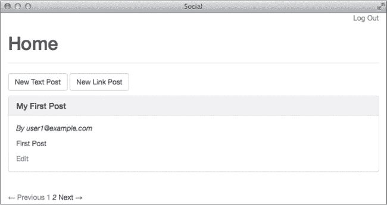

# 第十二章 性能  

Ruby on Rails 相对于其他语言和 Web 框架的性能仍然是一个争议话题。通过快速 Google 搜索可以发现，许多人认为 Ruby on Rails 很慢。  

Ruby 解释器的更新版本在性能方面取得了显著进展。Ruby 2.0 包括了垃圾回收优化和其他改进，使其比旧版本更快。Ruby 2.1 引入了一个代际垃圾收集器，性能更为出色。  

随着 Ruby 语言的进步，Ruby on Rails 也在不断改进。Rails 框架现在包括了几项专门用于提升应用程序性能的功能。本章首先讨论其中的两项内建功能，然后介绍一些你可以做的事情来提高性能。最后，我将讨论 Rails 支持的缓存技术。  

# 内建优化功能  

资源管道和 Turbolinks 是你在创建原始博客时就已经使用的两个内建的 Rails 性能优化功能。这两项功能在新的 Rails 应用程序中默认启用，我们将在这里探索它们是如何工作的。  

## 资源管道  

*资源管道* 是 Rails 的一项功能，它将你应用程序中使用的所有单独的 JavaScript 和 CSS 文件合并成一个 JavaScript 文件和一个 CSS 文件，从而减少浏览器为了渲染网页所发出的请求数量，因为你的应用程序使用了多个同类型的文件。浏览器并行请求的数量是有限的，因此较少的请求应该能使页面加载速度更快。  

资源管道还会 *压缩*，或者说是压缩 JavaScript 和 CSS 文件，通过移除空白字符和注释。文件更小，加载更快，因此你的网页加载速度也更快。  

最后，资源管道预处理器还使你能够使用更高级的语言，如 CoffeeScript 代替 JavaScript，以及 Sass 代替普通的 CSS。这些高级语言的文件会在被服务之前，通过各自的编译器预编译成普通的 JavaScript 和 CSS，以便浏览器能够理解。  

### 清单  

当你为应用程序生成控制器时，Rails 还会在 *app/assets/javascripts* 和 *app/assets/stylesheets* 目录中生成相应的 JavaScript 和 CSS 文件。Rails 使用清单文件，而不是单独链接到这些文件。正如在 第五章中提到的，清单文件是应用程序所需的其他文件的列表。

清单文件使用 *指令*，这些指令指定要包含的其他文件，以便生成一个用于生产环境的单一文件。`require` 指令包含清单中的单一文件。`require_tree` 指令包含一个目录中的所有文件。`require_self` 指令包含清单文件的内容。  

要查看示例，请打开默认的 CSS 清单文件 *app/assets/stylesheets/application.css*：  

```
  /*
   * This is a manifest file that'll be compiled into application.css,
   * which will include all the files listed below.
   *
  --*snip*--
   *
➊  *= require_tree .
➋  *= require bootstrap
➌  *= require_self
   */
```

这个文件首先使用`require_tree .`指令 ➊来包含当前目录下的所有 CSS 文件。接着，它使用你在第九章中添加的`require bootstrap`指令包含了 Bootstrap 样式表。最后，`require_self`指令 ➌将这个文件的内容包括在注释块下面。目前，注释块下方没有任何内容。

资源管道默认在三个不同的位置搜索资源。你已经知道其中一个位置：*app/assets*目录用于存放你应用程序的 CSS、JavaScript 和图片文件。

*lib/assets*目录用于存放你编写的库所需的资源。由于你还没有编写任何库，这个目录目前是空的。*vendor/assets*目录用于存放第三方创建的资源，如 JavaScript 插件和 CSS 框架的代码。

Ruby gems 可以将它们自己的目录添加到资源管道搜索的路径列表中。你可以在 JavaScript 清单文件*app/assets/javascripts/application.js*中看到这一点：

```
  // This is a manifest file that'll be compiled into application.js,
  // which will include all the files listed below.
  //
  --*snip*--
  //
➊ //= require jquery
  //= require jquery_ujs
  //= require turbolinks
➋ //= require_tree .
➌ //= require bootstrap
```

这个文件使用`require`指令 ➊来引入 jQuery、jQuery UJS 和 Turbolinks 库，这些库是你应用程序的*Gemfile*中包含的 jquery-rails 和 turbolinks gems 的一部分。

它接着使用`require_tree` ➋来包含当前目录下的所有 JavaScript 文件。最后，它要求 Bootstrap CSS 框架所需的 JavaScript 文件 ➌。

你不会在*vendor/assets/javascripts*目录中找到*jquery*、*jquery_ujs*、*turbolinks*或*bootstrap*。相反，提供这些文件的 gems 已经更新了资源管道搜索路径，将它们自己的目录添加到路径中。

你可以通过在 Rails 控制台中输入`Rails.application.config.assets.paths`来查看资源管道搜索路径的完整列表。这条语句将返回一个路径数组。在这个列表中，你应该能找到像*jquery-rails-3.1.0/vendor/assets/javascript*、*turbolinks-2.2.2/lib/assets/javascripts*和*bootstrap-sass-3.1.1.0/vendor/assets/javascripts*这样的路径。

### 调试模式

如你所见，在开发环境中，CSS 和 JavaScript 文件作为单独的、未压缩的文件提供。根据服务器输出，你的社交媒体应用程序提供了 31 个单独的 CSS 和 JavaScript 文件。一个名为*调试模式*的资源管道配置控制着每个环境中资源的处理方式。

在开发环境中，调试模式已开启。这意味着 CSS 和 JavaScript 文件中引用的文件将单独提供，如果你需要使用浏览器的开发工具调试文件中的问题，这样做非常有用。

如果你想强制将资源合并并预处理，以便查看它们在生产环境中如何提供，你可以关闭调试模式。只需在开发环境配置文件*config/environments/development.rb*的底部修改`config.assets.debug`的值即可：

```
config.assets.debug = **false**
```

当调试模式关闭时，Rails 会将所有文件合并并运行预处理器（如 CoffeeScript 或 Sass 编译器），然后再提供它们。修改此文件后，重新启动 Rails 服务器，然后检查终端中的服务器输出，看看有什么不同：

```
  Started GET "/login" for 127.0.0.1 at 2014-03-16 20:38:43 -0500
  Processing by SessionsController#new as HTML
    Rendered sessions/new.html.erb within layouts/application (1.5ms)
  Completed 200 OK in 5ms (Views: 4.5ms | ActiveRecord: 0.0ms)

➊ Started GET "/assets/application.css" for 127.0.0.1 at ...

➋ Started GET "/assets/application.js" for 127.0.0.1 at ...
```

现在只会提供两个文件（➊和➋）——CSS 和 JavaScript 清单文件。这个设置在开发模式下可能会减慢页面加载速度，因为每个请求都会将文件合并，因此在继续之前，请将`config.assets.debug`设置为`true`。

### 资源预编译

在生产环境中，你应该预编译应用程序的资源，并通过你的 Web 服务器将它们作为静态文件提供。你可以通过几种方式预编译资源。当你在第六章中将博客部署到 Heroku 时，你在部署过程中预编译了资源。Rails 还包括一个`rake`任务来预编译资源。

`rake`任务会从你的 CSS 和 JavaScript 清单中编译所有文件，并将它们写入*public/assets*目录。你可以使用以下命令为生产环境预编译资源：

```
$ **RAILS_ENV=production bin/rake assets:precompile**
```

在预编译过程中，会根据编译文件的内容生成一个 MD5 哈希，并将其插入到文件名中。当文件被保存时，文件名会基于文件内容，因此，如果你更新了文件，你可以确保提供的是正确版本的文件。

例如，预编译后，文件*app/assets/stylesheets/application.css*可能会被命名为*public/assets/application-d5ac076c28e38393c3059d7167501838.css*。Rails 视图助手会在生产环境中自动使用正确的文件名。开发环境中不需要编译过的资源，因此，当你看完它们后，可以使用`assets:clobber rake`任务将其删除：

```
$ **RAILS_ENV=production bin/rake assets:clobber**
```

这个命令会删除*public/assets*目录及其所有内容。

在第十五章中，你将学习如何使用一个名为 Capistrano 的程序将你的应用程序部署到自己的服务器。你可以配置 Capistrano，在部署过程中自动预编译资源，就像你在将博客部署到 Heroku 时所做的那样。

## Turbolinks

资源管道减少了浏览器请求资源的次数，但浏览器仍然需要为每个页面解析并重新编译 CSS 和 JavaScript。根据你的应用程序中包含的 CSS 和 JavaScript 的数量，这可能会消耗相当多的时间。

*Turbolinks*是 Rails 的一个功能，它通过替换当前页面`body`和`title`的内容为新页面的数据，而不是加载整个新页面，从而加速了在你的应用程序中跟随链接的过程。使用 Turbolinks 时，点击链接时甚至不会下载 CSS 和 JavaScript 文件。

### Turbolinks 的实际应用

在新的 Rails 应用程序中，Turbolinks 默认启用。从你在第二章构建第一个应用程序开始，你就一直在使用它。你可以通过查看 Rails 服务器的输出看到它在工作。打开浏览器，访问*http://localhost:3000/*，并检查终端中的输出：

```
Started GET "/" for 127.0.0.1 at ...
Processing by PostsController#index as HTML

--*snip*--

Started GET "/assets/bootstrap.js?body=1" for 127.0.0.1 at ...

Started GET "/assets/application.js?body=1" for 127.0.0.1 at ...
```

在对帖子索引页发出 `GET` 请求后，浏览器会获取应用程序所需的所有 CSS 和 JavaScript 文件。现在点击索引页上的一个链接，比如“新建文本帖子”，再次检查输出：

```
Started GET "/text_posts/new" for 127.0.0.1 at ...
Processing by TextPostsController#new as HTML
  User Load (0.2ms) SELECT "users".* FROM "users"
    WHERE "users"."id" = ? LIMIT 1 [["id", 7]]
  Rendered text_posts/_form.html.erb (2.4ms)
  Rendered text_posts/new.html.erb within layouts/application (3.3ms)
Completed 200 OK in 38ms (Views: 36.5ms | ActiveRecord: 0.2ms)
```

浏览器只会发出对新文本帖子的 `GET` 请求。它不会重新加载 CSS 和 JavaScript 文件，因为这些文件已经被加载到内存中。最后，点击浏览器中的返回按钮。

这次终端窗口中没有输出。索引页已在浏览器中缓存，没有请求发送到服务器。Turbolinks 默认会缓存十个页面。

### JavaScript 事件

如果你的应用程序包含使用 jQuery 的 `ready` 函数来附加事件处理程序或触发其他代码的 JavaScript 代码，那么需要修改这些 JavaScript 代码，使其与 turbolinks 配合工作。因为 turbolinks 在点击链接时不会重新加载整个页面，所以 `ready` 函数不会被调用。

相反，`page:load` 事件会在加载过程结束时触发。你可以通过将以下 CoffeeScript 代码添加到 *app/assets/javascripts/posts.js.coffee* 来看到这个过程：

```
  --*snip*--

  **$(document).ready ->**
➊   **console.log 'Document Ready'**

  **$(document).on 'page:load', ->**
➋   **console.log 'Page Load'**
```

不幸的是，CoffeeScript 超出了本书的范围，但如果你已经熟悉 JavaScript，可能会认识到这段代码的作用。它会在页面首次加载时在浏览器的 JavaScript 控制台打印“Document Ready” ➊，而当你点击一个使用 turbolinks 的链接时，打印“Page Load” ➋。

因为你当前没有使用 `$(document).ready()` 来触发任何 JavaScript 代码，所以你现在不需要担心这个问题。但如果你以后开始使用 `ready` 函数，应该重新查看这一部分内容。

# 代码优化

现在你已经看过了 Rails 提供的一些内建优化，我们来看看你可以做哪些额外的事情来提高性能。我将介绍一些你可以用来减少应用程序数据库查询次数并提升慢查询性能的技巧。

## 减少数据库查询

Rails 模型让访问数据变得如此简单，以至于你可能会忘记你实际上是在查询数据库。幸运的是，Rails 服务器会在终端显示 SQL 语句。当你浏览应用程序时，查看这些输出，找出可能的低效之处。

### 检查 SQL 输出

确保你的服务器正在运行，并且在我带你通过几个示例时密切关注终端输出。在开始之前，确保你已经登出了应用程序。首先，浏览到登录页面 *http://localhost:3000/login*，并检查服务器输出：

```
Started GET "/login" for 127.0.0.1 at 2014-03-18 18:58:39 -0500
Processing by SessionsController#new as HTML
  Rendered sessions/new.html.erb within layouts/application (2.0ms)
Completed 200 OK in 12ms (Views: 11.8ms | ActiveRecord: 0.0ms)
```

这个页面不会生成任何 SQL 查询。

现在登录到应用程序：

```
  Started POST "/sessions" for 127.0.0.1 at 2014-03-18 18:59:01 -0500
  Processing by SessionsController#create as HTML
    Parameters: ...
➊   User Load (0.2ms) SELECT "users".* FROM "users"
      WHERE "users"."email" = 'alice@example.com' LIMIT 1
  Redirected to http://localhost:3000/
  Completed 302 Found in 70ms (ActiveRecord: 0.2ms)
```

该页面生成了一条 SQL 查询 ➊，因为 Rails 加载了与你在前一页面输入的电子邮件地址匹配的用户记录。`SessionsController` 中的 `create` 方法使用该记录来验证你输入的密码。

登录到应用后，你应该会被重定向到帖子索引页面。该页面的服务器输出应该类似于下面这样：

```
  Started GET "/" for 127.0.0.1 at 2014-03-18 18:59:02 -0500
  Processing by PostsController#index as HTML
➊   User Load (0.1ms) SELECT "users".* FROM "users"
      WHERE "users"."id" = ? LIMIT 1 [["id", 1]]
➋    (0.1ms) SELECT "users".id FROM "users" INNER JOIN
      "subscriptions" ON "users"."id" = "subscriptions"."leader_id"
      WHERE "subscriptions"."follower_id" = ? [["follower_id", 1]]
➌   Post Load (0.2ms) SELECT "posts".* FROM "posts"
      WHERE "posts"."user_id" IN (2, 1)
      ORDER BY created_at DESC
➍   User Load (0.1ms) SELECT "users".* FROM "users"
      WHERE "users"."id" = ? LIMIT 1 [["id", 2]]
    User Load (0.1ms) SELECT "users".* FROM "users"
      WHERE "users"."id" = ? LIMIT 1 [["id", 1]]
    CACHE (0.0ms) SELECT "users".* FROM "users"
      WHERE "users"."id" = ? LIMIT 1 [["id", 1]]
    Rendered collection (2.7ms)
    Rendered posts/index.html.erb within layouts/application (3.8ms)
  Completed 200 OK in 13ms (Views: 11.0ms | ActiveRecord: 0.6ms)
```

该页面生成了六条查询。首先，它查找了 id 为 1 的用户 ➊；该查询在 `PostController` 中的 `authenticate_user!` 调用中查找 `current_user`。接下来，页面通过 `current_user.timeline_user_ids` 查找当前用户所关注的用户的 id ➋。然后，它查找帖子 ➌，这些帖子的 `user_id` 与 `current_user` 或其关注者的 `id` 匹配。

最后，页面会进行三次连续的查询 ➍，通过 `SELECT "users".* FROM "users"` 查找与 `id` 匹配的用户。这看起来有点奇怪。我的索引页面上有三篇帖子，但多出了三条查询。我们来看一下 *app/controllers/posts_controller.rb* 中的 `index` 动作，看看发生了什么：

```
  class PostsController < ApplicationController
➊   before_action :authenticate_user!

    def index
➋     user_ids = current_user.timeline_user_ids
➌     @posts = Post.where(user_id: user_ids)
                 .order("created_at DESC")
    end

  --*snip*--
```

这段代码在每个动作之前调用了 authenticate_user! ➊。`index` 动作找到当前用户希望查看的 `user_ids` ➋，然后查找匹配这些用户的帖子 ➌。你已经在之前的服务器输出中考虑了这些查询。由于 `index` 动作没有创建三条用户查询，这些查询一定是来自视图。

`index` 视图呈现帖子集合。这意味着这些查询的源头必须在 *app/views/text_posts/_text_post.html.erb* 中的 `TextPost` 部分：

```
  --*snip*-
    <div class="panel-body">
➊     <p><em>By <%= text_post.user.name %></em></p>
--*snip*--
```

这里是问题所在。每篇帖子创建者的名字 ➊ 是通过调用 `text_post.user.name` 来显示的。如果你检查 ImagePost 部分，你可以验证它也做了同样的事情。每显示一篇帖子，就会生成一条额外的查询，这就解释了你在 SQL 输出中看到的三条额外查询。

### N + 1 查询

创建每个记录的额外数据库查询的代码属于 *N + 1 查询* 问题类别。这些问题在 Rails 应用中很常见，当集合上的关联被引用时，如果没有先加载关联的模型，就会发生这种情况。

在这种情况下，我将一组帖子加载到 `@posts` 中。然后我引用了每个帖子创建者的 `name`。因为我没有提前加载这些用户，Rails 会在渲染页面时逐个从数据库中获取它们。这些额外的查询意味着索引页面上的三条帖子导致了四条查询。查询的数量总是比集合中的项数多一个。

幸运的是，这个问题很容易修复。在 Rails 中，你可以提前使用 `includes` 方法指定所有需要的关联。这个技巧被称为 *预加载*。

现在让我们更新 `PostsController` 中的 `index` 动作，使用预加载：

```
  --*snip*--
    def index
      user_ids = current_user.timeline_user_ids
➊     @posts = Post**.includes(:user)**.where(user_id: user_ids)
                 .order("created_at DESC")
    end
  --*snip*--
```

在这里，我将`includes(:user)`方法 ➊ 链接到设置`@posts`的查询中。传递给`includes`的符号必须与模型中的关联名称匹配。在这个例子中，`post`属于`:user`。

使用`includes`方法，Rails 确保使用最少的查询加载指定的关联。在保存此文件后，刷新浏览器中的索引页面，并查看终端中的 SQL 输出：

```
  --*snip*--
    Post Load (0.3ms) SELECT "posts".* FROM "posts"
      WHERE "posts"."user_id" IN (2, 1) ORDER BY created_at DESC
➊   User Load (0.3ms) SELECT "users".* FROM "users"
      WHERE "users"."id" IN (2, 1)
  --*snip*--
```

查找每个用户的三个查询已被 ➊ 替换为一个查询，一次性查找所有用户。

在构建应用程序时，要注意额外的查询。检查视图中类似`text_post.user.name`的调用。注意这个调用中的两个点。两个点意味着你正在访问一个关联模型中的数据，这可能会引入 N + 1 查询问题，因此你应该在视图渲染之前预加载该关联。

## 分页

你已经减少了加载索引页面帖子所需的数据库查询次数，但想想当你有成千上万条帖子时会发生什么。索引页面会尝试显示所有这些帖子，显著增加应用程序的加载时间。你可以使用*分页*，即将记录集合分割成多个页面的过程，来缓解这个问题。

`will_paginate` gem 可以为你处理所有分页。首先，将`will_paginate`添加到你的应用程序的*Gemfile*中：

```
--*snip*--

gem 'bootstrap-sass'

**gem 'will_paginate'**

--*snip*--
```

记得在更改*Gemfile*后始终更新已安装的 gem：

```
$ **bin/bundle install**
```

接下来，更新*app/controllers/posts_controller.rb*中的`index`操作，添加对`paginate`方法的调用：

```
  --*snip*--
    def index
      user_ids = current_user.timeline_user_ids
      @posts = Post.includes(:user).where(user_id: user_ids)
➊                **.paginate(page: params[:page], per_page: 5)**
                 .order("created_at DESC")
    end
  --*snip*--
```

`paginate`方法与其他设置实例变量`@posts` ➊ 的方法链式调用。`will_paginate` gem 会自动添加`params[:page]`。我指定了`per_page: 5`，这样你可以在数据库中只有 6 个帖子时看到分页效果。默认每页 30 条记录。

`paginate`方法自动将正确的`limit`和`offset`调用添加到数据库查询中，从而选择最少的记录。

最后，打开`index`视图（位于*app/views/posts/index.html.erb*），并在页面的末尾添加对`will_paginate`的调用：

```
  --*snip*--

➊ **<%= will_paginate @posts %>**
```

`will_paginate`视图助手 ➊ 接受一个记录集合，这里是`@posts`，并渲染正确的链接以便在该集合的各页之间导航。

为了查看此功能，你需要重新启动你的 Rails 服务器，因为你添加了一个新的 gem。然后创建新的帖子，直到至少有六个，并浏览到用户页面。如果你点击第二页，如图 12-1 所示，你应该能看到新的链接。



图 12-1. 分页链接

`will_paginate`视图助手添加了*上一页*和*1*的链接，点击这些链接可以从第二页返回到第一页。

再次检查服务器输出，查看用于从数据库检索帖子时的查询：

```
  Started GET "/posts?page=2" for 127.0.0.1 at 2014-03-26 11:52:27 -0500
  Processing by PostsController#index as HTML
    Parameters: {"page"=>"2"}
  --*snip*--
➊   Post Load (0.4ms) SELECT "posts".* FROM "posts"
      WHERE "posts"."user_id" IN (2, 1)
      ORDER BY created_at DESC LIMIT 5 OFFSET 5
  --*snip*--
```

第二页的查询 ➊ 现在如预期包含了 `LIMIT 5 OFFSET 5`。这个查询只会获取渲染该页面所需的帖子。

# 缓存

在编程中，*缓存*是存储频繁使用的数据的过程，以便对相同数据的后续请求能够更快地返回。Rails 将存储数据的地方称为 *缓存存储*。Rails 应用程序通常使用两种类型的缓存。

*低级缓存*将耗时计算的结果存储在缓存中——这对那些经常读取但很少变化的值非常有用。*片段缓存*将视图的一部分存储在缓存中，以加速页面渲染。渲染大量模型集合可能会很耗时。如果数据很少变化，片段缓存可以提高应用程序的页面加载速度。

缓存在开发环境中默认是禁用的，因此在开始学习之前，你需要启用它。在开发过程中保持缓存禁用是一个好主意，因为你总是希望在开发时使用最新版本的数据。例如，如果你将一个值存储在缓存中，然后修改计算该值的代码，那么应用程序可能会返回缓存中的值，而不是由新代码计算出来的值。

在本章节中，你将启用开发环境中的缓存，以便了解它是如何工作的，并学习 Rails 应用程序中使用的缓存类型。打开 *config/environments/development.rb* 并将 `config.action_controller.perform_caching` 的值更改为 `true`：

```
Social::Application.configure do
  --*snip*--

  # Show full error reports and disable caching.
  config.consider_all_requests_local       = true
  config.action_controller.perform_caching = **true**

  --*snip*--
end
```

完成本章内容后，将此值更改回 `false`，以禁用开发环境中的缓存。

Rails 支持几种不同的缓存存储。默认的 `ActiveSupport::Cache::FileStore` 会将缓存数据存储在文件系统中。一个流行的生产环境缓存选择是 `ActiveSupport::Cache::MemCacheStore`，它使用 memcached 服务器来存储数据。memcached 服务器是一个高性能的缓存存储，支持在多台计算机之间进行分布式缓存。

现在你已经启用了缓存，让我们为你的应用程序指定一个缓存存储。你无需在电脑上安装 memcached，可以使用 `ActiveSupport::Cache::MemoryStore` 来演示缓存。这个选项也将缓存对象存储在计算机的内存中，但无需安装额外的软件。在你刚刚修改的行下面，向 *config/environments/development.rb* 添加这一行：

```
Social::Application.configure do
  --*snip*--

  # Show full error reports and disable caching.
  config.consider_all_requests_local       = true
  config.action_controller.perform_caching = true
  **config.cache_store = :memory_store**

  --*snip*--
end
```

将缓存存储在内存中比存储在磁盘上更快。内存存储默认分配 32MB 的内存。当缓存数据超过此量时，内存存储会执行清理过程，移除最少使用的对象，因此你无需担心手动从缓存中删除对象。

重启 Rails 服务器以使这些更改生效。

## 缓存键

缓存中的所有内容都通过缓存键进行引用。*缓存键*是一个唯一的字符串，用于标识特定的对象或其他数据。

Active Record 模型包含 `cache_key` 方法，用于自动生成一个缓存键。你可以通过在模型实例上调用 `cache_key` 在 Rails 控制台中尝试它：

```
  2.1.0 :001 > **post = Post.first**
    Post Load (0.2ms) SELECT "posts".* ...
   => #<TextPost id: 1, title: ...>
  2.1.0 :002 > **post.cache_key**
➊  => "text_posts/1-20140317221533035072000"
```

该帖子的缓存键是类名的复数形式，后跟一个斜杠，然后是帖子的 `id`，再加上一个破折号，最后是 `updated_at` 日期作为字符串 ➊。

使用 `updated_at` 日期作为键的一部分解决了缓存失效的问题。当帖子被修改时，`updated_at` 日期会变化，因此其 `cache_key` 也会发生变化。这样你就不必担心从缓存中获取过时的数据。

## 低级缓存

低级缓存在你需要执行一个耗时的计算或数据库操作时非常有用。它常用于可能需要较长时间才能返回的 API 请求。Rails 中的低级缓存使用 `Rails.cache.fetch` 方法。

`fetch` 方法接受一个缓存键并尝试从缓存中读取匹配的值。`fetch` 方法还接受一个块。如果提供了 Ruby 代码块，当值不在缓存中时，该方法会执行块，计算结果并将其写入缓存，然后返回结果。

为了演示低级缓存，我们在索引页面上显示每个帖子的评论数。首先编辑 *app/views/text_posts/_text_post.html.erb*，并在 `text_post.body` 下方添加评论计数：

```
--*snip*--

    <p><%= sanitize text_post.body %></p>

    **<p><%= pluralize text_post.comments.count, "Comment" %></p>**

--*snip*--
```

这行新代码使用了 `pluralize` 辅助方法，根据评论的数量正确地将“Comment”这个词变为复数。例如，如果帖子没有评论，它会显示“0 Comments”。对 *app/views/image_posts/_image_post.html.erb* 进行类似的修改，将 `text_post` 替换为 `image_post`。

现在在浏览器中刷新帖子索引页面，查看服务器输出：

```
  Started GET "/posts" for 127.0.0.1 at 2014-03-26 15:15:05 -0500
  Processing by PostsController#index as HTML
  --*snip*--
➊    (0.1ms) SELECT COUNT(*) FROM "comments"
        WHERE "comments"."post_id" = ? [["post_id", 6]]
     (0.1ms) SELECT COUNT(*) FROM "comments"
        WHERE "comments"."post_id" = ? [["post_id", 5]]
     (0.1ms) SELECT COUNT(*) FROM "comments"
        WHERE "comments"."post_id" = ? [["post_id", 4]]
     (0.1ms) SELECT COUNT(*) FROM "comments"
        WHERE "comments"."post_id" = ? [["post_id", 3]]
     (0.1ms) SELECT COUNT(*) FROM "comments"
        WHERE "comments"."post_id" = ? [["post_id", 2]]
  Rendered collection (5.4ms)
  Rendered posts/index.html.erb within layouts/application (10.1ms)
Completed 200 OK in 22ms (Views: 16.8ms | ActiveRecord: 1.5ms)
```

这个更改添加了五个新的查询 ➊ 用来统计每个帖子的评论数。这些额外的查询占用了宝贵的加载时间，但你可以通过消除它们来提高性能。消除这些查询的一种方法是通过使用 `Rails.cache.fetch` 缓存你需要的值（在这种情况下是每个帖子的评论数）。

你可以通过向 `Post` 模型添加一个方法来执行缓存。编辑 *app/models/post.rb*，并添加 `cached_comment_count` 方法，如下所示：

```
  class Post < ActiveRecord::Base
    --*snip*--

    **def cached_comment_count**
➊     **Rails.cache.fetch [self, "comment_count"] do**
        **comments.size**
      **end**
    **end**
  end
```

这个方法将数组 `[self, "comment_count"]` ➊ 传递给 `Rails.cache.fetch` 方法。在这里，`self` 代表当前的帖子。`fetch` 方法将这些值组合成一个单一的缓存键。块仍然像以前一样调用 `comments.size`。

现在更新 `TextPost` 和 `ImagePost` 视图，使用这个新方法：

```
--*snip*--

    <p><%= pluralize **text_post.cached_comment_count**, "Comment" %></p>

--*snip*--
```

当你在浏览器中刷新索引页面时，六个评论计数查询将再次执行，并且这些值会被缓存。再次刷新页面，查看服务器输出，注意查询不再被执行。

这个缓存方案有一个小问题。Rails 的 `cache_key` 方法使用帖子的 `id` 和 `updated_at` 日期来创建缓存键，但向帖子添加评论不会改变帖子的 `updated_at` 日期。你需要的是在添加评论时更新帖子。

Rails 提供了 `touch` 选项用于关联关系，正是为了这个目的。当你在关联关系上指定 `touch: true` 时，Rails 会在关联的任何部分发生变化时，自动将父模型的 `updated_at` 值设置为当前时间。无论是当一个模型被添加或移除，还是当关联的某个模型发生更改时，这种情况都会发生。

打开 *app/models/comment.rb* 并向 `belongs_to` 关联中添加 `touch: true`，如下所示：

```
class Comment < ActiveRecord::Base
  belongs_to :post**, touch: true**
  belongs_to :user

  validates :user_id, presence: true
end
```

现在，帖子上的 `updated_at` 值会在其评论被更新、删除或为其创建新评论时发生变化。如果你向一个帖子添加评论，然后重新加载索引页面，该帖子的评论计数查询将再次执行，并且新的计数会被缓存。

### 注意

*你也可以使用 Rails 的计数器缓存来解决这个问题。通过计数器缓存，Rails 会自动跟踪每个帖子关联的评论数量。通过向 `Post` 模型添加名为 `comments_count` 的列，并在 `Comment` 模型中的 `belongs_to :post` 声明中添加 `counter_cache: true` 来启用此功能。*

## 片段缓存

除了低级别的值缓存外，你还可以使用 Rails 的一个功能，叫做 *片段缓存*，来缓存视图的部分内容。缓存视图通过将渲染后的视图数据存储在缓存中，减少了应用程序的页面加载时间。片段缓存通常是在部分视图中进行的。

为了有效演示片段缓存，我需要一个慢速页面。使用慢速页面可以让片段缓存的影响更加明显。让我们使用 Ruby 的 `sleep` 方法让帖子渲染得更慢。显然，你永远不会在真实应用中这么做——这只是为了演示。

打开 *app/views/text_posts/_text_post.html.erb* 部分，在第一行添加 `sleep` 调用，如下所示：

```
➊  **<% sleep 1 %>**
   <div class="panel panel-default">
     --*snip*--
</div>
```

这个 `sleep` 调用 ➊ 告诉 Ruby 暂停 1 秒。对 *app/views/image_posts/_image_post.html.erb* 中的 `ImagePost` 部分视图做同样的修改。

现在，当你刷新索引页面时，显示的时间应该会更长。检查服务器输出以获取确切的时间：

```
  Started GET "/posts" for 127.0.0.1 at 2014-03-26 16:03:32 -0500
  Processing by PostsController#index as HTML
    --*snip*--
➊   Rendered collection (5136.5ms)
    Rendered posts/index.html.erb within layouts/application (5191.6ms)
  Completed 200 OK in 5362ms (Views: 5263.1ms | ActiveRecord: 11.8ms)
```

渲染这五个帖子花费了超过五秒钟 ➊，考虑到这五个 `sleep` 调用，这是可以理解的。

现在让我们在部分视图中添加片段缓存。再次编辑 *app/views/text_posts/_text_post.html.erb*，并添加 `cache` 方法调用和块，如下所示：

```
➊  **<% cache text_post do %>**
     <% sleep 1 %>
     <div class="panel panel-default">
       --*snip*--
     </div>
    **<% end %>**
```

`cache` 方法 ➊ 会自动调用 `cache_key` 来处理 `text_post`。我还将所有的代码都缩进到了块内。对 `ImagePost` 部分视图做同样的修改。

现在，当你在浏览器中刷新页面时，你应该能看到来自 Rails 服务器的一些新输出：

```
  Started GET "/posts" for 127.0.0.1 at 2014-03-26 16:18:08 -0500
  Processing by PostsController#index as HTML
  --*snip*--
➊ Cache digest for text_posts/_text_post.html: 3e...
➋ Read fragment views/text_posts/5-2014... (0.0ms)
➌ Write fragment views/text_posts/5-2014... (0.1ms)
  --*snip*--
  Rendered collection (5021.2ms)
  Rendered posts/index.html.erb within layouts/application (5026.5ms)
Completed 200 OK in 5041ms (Views: 5035.8ms | ActiveRecord: 1.1ms)
```

渲染索引页面现在会生成关于缓存的几行输出。首先，为部分生成一个摘要 ➊。这个摘要每次渲染该部分时都相同。接下来，Rails 读取缓存 ➋ 来查看这个部分是否已经存在。如果没有找到缓存中的部分，那么该部分会被渲染并写入缓存 ➌。

刷新页面应该会从缓存中读取所有部分，页面渲染速度也会更快。检查服务器输出以确保：

```
  Started GET "/posts" for 127.0.0.1 at 2014-03-26 16:29:13 -0500
  Processing by PostsController#index as HTML
  --*snip*--
  Cache digest for text_posts/_text_post.html: 3e...
➊ Read fragment views/text_posts/22-2014... (0.1ms)
  --*snip*--
➋   Rendered collection (25.9ms)
    Rendered posts/index.html.erb within layouts/application (31.5ms)
  Completed 200 OK in 77ms (Views: 73.1ms | ActiveRecord: 1.0ms)
```

现在你只看到缓存读取 ➊，并且集合渲染非常快速 ➋，在你添加了 `sleep` 调用后，渲染所需的时间大大减少。显然，缓存可以显著提高性能。

你现在应该从 `TextPost` 和 `ImagePost` 部分中移除 `sleep` 调用，但保留视图中的缓存。

## 问题

缓存是加速应用程序的好方法，但也可能引发一些问题。除非代码块或视图片段的缓存键包含用户 ID，否则相同的缓存数据会被发送给每个用户。

例如，`TextPost` 和 `ImagePost` 部分都包含检查帖子是否属于当前用户的代码。如果是，它会显示一个链接到 `edit` 动作的按钮。

```
  <% cache text_post do %>
    <div class="panel panel-default">
      --*snip*--
➊       <% if text_post.user == current_user %>
          <p><%= link_to 'Edit', edit_text_post_path(text_post),
                  class: "btn btn-default" %></p>
        <% end %>
      </div>
    </div>
  <% end %>
```

`TextPost` 部分中的条件语句在 *app/views/test_posts/_text_post.html.erb* 文件中，如果帖子属于 `current_user` ➊，则显示编辑按钮。帖子的所有者可能是第一个查看该帖子的用户。在所有者查看帖子后，视图片段会被缓存，并且包含了编辑按钮。当其他用户查看同一个帖子时，视图片段会从缓存中读取，其他用户也能看到编辑按钮。

你可以通过几种方式来解决这个问题。你可以在缓存键中包含用户 ID，但那样会为每个用户在缓存中创建一个单独的帖子副本，从而失去缓存对多个用户的好处。一个更简单的解决方案是将按钮移动到被缓存的片段之外，如下所示：

```
<% cache text_post do %>
  <div class="panel panel-default">
    --*snip*--
  </div>
<% end %>

**<% if text_post.user == current_user %>**
  **<p><%= link_to 'Edit', edit_text_post_path(text_post),**
          **class: "btn btn-default" %></p>**
**<% end %>**
```

一旦编辑按钮被移到缓存块之外，条件语句就会为每个查看帖子用户进行评估，只有当当前用户是帖子的所有者时，编辑按钮才会显示。对`ImagePost`部分做相同的更改，文件位置是 *app/views/image_posts/_image_post.html.erb*。

记得像本节开始时所示的那样编辑 *config/environments/development.rb*，并在完成本章最后的练习后，禁用开发环境中的缓存。

# 总结

没有人喜欢慢速的 web 应用程序！本章介绍了加速应用程序的技巧，从 Rails 内置特性，如资产管道和 Turbolinks，到数据库查询优化、分页和缓存。现在尝试以下练习，让你的应用程序更快。

完成练习后，请将*config/environments/development.rb*中的`config.action_controller.perform_caching`更改回`false`。在开发过程中保持缓存关闭。否则，每次修改缓存视图片段时，您都需要记得清除缓存。

下一章将介绍调试策略，帮助您追踪应用程序中的难以捉摸的问题。您将查看服务器输出和日志，寻找线索，最终深入正在运行的应用程序，看看到底发生了什么。

# 练习

| 问： | 1\. 到目前为止，您的性能优化主要集中在文章的索引页面。打开某个文章的详细页面，例如*http://localhost:3000/posts/1*。确保该文章有若干评论，然后检查服务器输出。在*app/controllers/posts_controller.rb*中的`PostsController`里使用急切加载（eager loading），以减少该页面发出的查询次数。 |
| --- | --- |
| 问： | 2\. 文章显示页面渲染了评论集合。在*app/views/comments/_comment.html.erb*中的`comment`部分添加片段缓存。您只希望在`@can_moderate`为`true`时显示删除按钮。在这种情况下，通过将数组`[comment, @can_moderate]`传递给缓存方法，将`@can_moderate`的值包括在缓存键中。 |
| 问： | 3\. 您可以通过将`render @post.comments`调用包裹在`cache`块中来缓存整个评论集合。打开*app/views/posts/show.html.erb*中的显示页面，并添加`cache`块。将数组`[@post, 'comments', @can_moderate]`传递给`cache`方法，确保只有具有管理评论权限的用户才能看到删除按钮，这在练习 2 中已有提到。将缓存集合包装在另一个缓存块中的技术有时被称为*俄罗斯套娃*缓存，因为多个缓存片段互相嵌套。当一个对象添加到集合中时，只需重新创建外层缓存。其他对象的缓存数据可以重用，只有新对象需要重新渲染。 |
