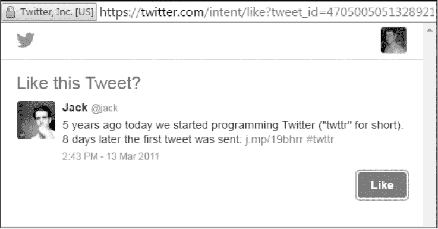

## HTTP 参数污染**


*HTTP 参数污染（HPP）* 是通过操控网站处理 HTTP 请求时接收的参数方式来进行的一种攻击过程。漏洞发生在攻击者注入额外的参数到请求中，而目标网站信任这些参数，导致出现意料之外的行为。HPP 漏洞可能出现在服务器端或客户端。在客户端（通常是你的浏览器）中，你可以看到测试的效果。在许多情况下，HPP 漏洞取决于服务器端代码如何使用作为参数传递的值，这些值由攻击者控制。因此，发现这些漏洞可能需要比其他类型的漏洞更多的实验。

在本章中，我们将首先探讨服务器端 HPP 与客户端 HPP 之间的一般区别。接着，我将使用三个涉及流行社交媒体平台的例子来说明如何利用 HPP 在目标网站上注入参数。具体来说，你将学习服务器端和客户端 HPP 之间的区别、如何测试这种类型的漏洞，以及开发人员常犯的错误。正如你将看到的，发现 HPP 漏洞需要实验和坚持，但它值得付出努力。

### 服务器端 HPP

在服务器端 HPP 中，你会向服务器发送意料之外的信息，试图使服务器端的代码返回意外的结果。当你向网站发起请求时，网站的服务器会处理请求并返回响应，正如在第一章中讨论的那样。在某些情况下，服务器不仅仅返回一个网页，还会根据它从 URL 中收到的信息运行一些代码。该代码仅在服务器端运行，因此对你来说是不可见的：你可以看到你发送的信息和收到的结果，但中间的代码是无法看到的。因此，你只能推测发生了什么。由于你无法看到服务器端代码的运行方式，服务器端 HPP 依赖于你识别潜在的易受攻击的参数并进行实验。

让我们看一个例子：如果你的银行通过其网站发起转账，接受由其服务器处理的 URL 参数，那么可能会发生服务器端 HPP。假设你可以通过输入三个 URL 参数`from`、`to`和`amount`来转账。每个参数指定了转账的源账户、目标账户和转账金额，顺序如下。一个通过这些参数转账 5000 美元的 URL 可能如下所示：

```
https://www.bank.com/transfer?from=12345&to=67890&amount=5000
```

银行可能会假设它只会收到一个`from`参数。但如果你提交两个参数，会发生什么呢？比如以下的 URL：

```
https://www.bank.com/transfer?from=12345&to=67890&amount=5000&from=ABCDEF
```

这个 URL 最初的结构与第一个示例相同，但添加了一个额外的 `from` 参数，指定了另一个发送账户 `ABCDEF`。在这种情况下，攻击者会发送额外的参数，希望应用程序使用第一个 `from` 参数来验证转账，但使用第二个参数来提取资金。因此，如果银行信任最后一个收到的 `from` 参数，攻击者可能能够从他们不拥有的账户执行转账。服务器端代码将不会从账户 12345 向 67890 转账 $5000，而是使用第二个参数，从账户 ABCDEF 向 67890 转账。

当服务器接收到多个具有相同名称的参数时，它可以以多种方式进行响应。例如，PHP 和 Apache 使用最后一个出现的参数，Apache Tomcat 使用第一个出现的参数，ASP 和 IIS 使用所有出现的参数，等等。两位研究员 Luca Carettoni 和 Stefano di Paolo 在 AppSec EU 09 大会上对服务器技术之间的许多差异进行了详细介绍：这些信息现在可以在 OWASP 网站上找到，网址为 *[`www.owasp.org/images/b/ba/AppsecEU09_CarettoniDiPaola_v0.8.pdf`](https://www.owasp.org/images/b/ba/AppsecEU09_CarettoniDiPaola_v0.8.pdf)*（请参见幻灯片 9）。因此，处理多个具有相同名称的参数提交时，并没有一个单一的保证过程，发现 HPP 漏洞需要通过实验来确认你正在测试的网站是如何工作的。

这个银行示例使用了显而易见的参数。但有时，HPP 漏洞是由于隐藏的服务器端行为引起的，这些行为来自于不直接可见的代码。例如，假设你的银行决定修改处理转账的方式，并更改其后端代码，不再在 URL 中包含 `from` 参数。这次，银行将接收两个参数，一个是接收转账的账户，另一个是转账金额。要转账的账户将由服务器设置，对你不可见。一个示例链接可能如下所示：

```
https://www.bank.com/transfer?to=67890&amount=5000
```

通常，服务器端代码对我们来说是个谜，但为了这个示例，我们知道银行（明显糟糕且冗余的）服务器端 Ruby 代码如下所示：

```
user.account = 12345

def prepare_transfer(➊params)

  ➋ params << user.account

  ➌ transfer_money(params) #user.account (12345) becomes params[2]

end

def transfer_money(params)

  ➍ to = params[0]

  ➎ amount = params[1]

  ➏ from = params[2]

    transfer(to,amount,from)

end
```

这段代码创建了两个函数，`prepare_transfer` 和 `transfer_money`。`prepare_transfer` 函数接受一个名为 `params` ➊ 的数组，该数组包含 URL 中的 `to` 和 `amount` 参数。数组为 `[67890,5000]`，其中数组值被括号包围，且每个值之间由逗号分隔。函数的第一行 ➋ 将之前在代码中定义的用户账户信息添加到数组的末尾。最终，我们会在 `params` 中得到数组 `[67890,5000,12345]`，然后将 `params` 传递给 `transfer_money` ➌。请注意，与参数不同，数组没有与值关联的名称，因此代码依赖于数组始终按顺序包含每个值：第一个是要转账的账户，接下来是转账金额，最后是转账来源账户。 在 `transfer_money` 中，值的顺序变得显而易见，因为函数将每个数组值分配给一个变量。由于数组的位置是从 0 开始编号的，`params[0]` 访问数组中的第一个位置的值，在此案例中是 `67890`，并将其分配给变量 `to` ➍。其他值也分别在第 ➎ 和 ➏ 行分配给变量。然后，变量名被传递给 `transfer` 函数（该代码片段中未显示），该函数接受这些值并执行转账。

理想情况下，URL 参数应始终按代码预期的格式进行格式化。然而，攻击者可以通过向 `params` 传递 `from` 值来改变该逻辑的结果，如以下 URL 所示：

```
https://www.bank.com/transfer?to=67890&amount=5000&from=ABCDEF
```

在这种情况下，`from` 参数也包含在传递给 `prepare_transfer` 函数的 `params` 数组中；因此，数组的值将是 `[67890,5000,ABCDEF]`，并且在 ➋ 添加用户账户后，结果会变为 `[67890,5000,ABCDEF,12345]`。因此，在 `prepare_transfer` 中调用的 `transfer_money` 函数中，`from` 变量将获取第三个参数，期望 `user.account` 的值为 `12345`，但实际上会引用攻击者传递的值 `ABCDEF` ➍。

### 客户端 HPP

客户端 HPP 漏洞允许攻击者向 URL 中注入额外的参数，以在用户端（*客户端*是指在你的计算机上发生的操作，通常通过浏览器，而不是在网站的服务器上发生）产生效果。

Luca Carettoni 和 Stefano di Paola 在他们的演示中使用了理论 URL *http://host/page.php?par=123%26action=edit* 及以下服务器端代码，展示了这种行为的一个例子：

```
➊ <? $val=htmlspecialchars($_GET['par'],ENT_QUOTES); ?>

➋ <a href="/page.php?action=view&par='.<?=$val?>.'">View Me!</a>
```

这段代码基于`par`的值（一个用户输入的参数）生成一个新的 URL。在这个示例中，攻击者将值`123%26action=edit`作为`par`的值传递，从而生成了一个额外的、未预期的参数。`&`的 URL 编码值是`%26`，这意味着当 URL 被解析时，`%26`会被解释为`&`。这个值会向生成的`href`中添加一个额外的参数，而不会让`action`参数在 URL 中显现。如果参数使用的是`123&action=edit`而不是`%26`，`&`会被解释为分隔两个不同的参数，但由于站点的代码只使用了`par`参数，`action`参数将被丢弃。使用`%26`的值可以绕过这一点，确保`action`不会最初被识别为一个单独的参数，因此`123%26action=edit`成为了`par`的值。

接下来，`par`（其编码后的`&`为`%26`）被传递给函数`htmlspecialchars` ➊。`htmlspecialchars`函数将特殊字符（如`%26`）转换为其 HTML 编码值，将`%26`转化为`&amp;`（HTML 实体，用于表示 HTML 中的`&`），在该字符可能具有特殊含义的地方。转换后的值被存储在`$val`中。然后通过将`$val`附加到`href`值上，生成了一个新的链接，位置见➋。因此，生成的链接变为`<a href="/page.php?action=view&par=123`&amp;action=edit`">`。因此，攻击者成功地将额外的`action=edit`添加到了`href`网址中，这可能会导致漏洞，具体取决于应用程序如何处理这个被夹带的`action`参数。

以下三个示例详细介绍了在 HackerOne 和 Twitter 上发现的客户端和服务器端 HPP 漏洞。这些示例都涉及了 URL 参数篡改。然而，需要注意的是，没有两个示例是通过相同的方法发现的，也没有共享相同的根本原因，这进一步强调了在寻找 HPP 漏洞时彻底测试的重要性。

### HackerOne 社交分享按钮

**难度:** 低

**网址:** *[`hackerone.com/blog/introducing-signal-and-impact/`](https://hackerone.com/blog/introducing-signal-and-impact/)*

**来源:** *[`hackerone.com/reports/105953/`](https://hackerone.com/reports/105953/)*

**报告日期:** 2015 年 12 月 18 日

**奖励金额:** $500

查找 HPP 漏洞的一种方法是寻找看似与其他服务联系的链接。HackerOne 博客文章正是通过包括分享到流行社交媒体网站（如 Twitter、Facebook 等）的链接来做到这一点。当点击这些链接时，HackerOne 链接会生成内容供用户在社交媒体上发布。发布的内容包括指向原始博客文章的 URL 引用。

一位黑客发现了一个漏洞，允许你在 HackerOne 博客帖子的网址中附加一个参数。添加的 URL 参数会反映在共享的社交媒体链接中，从而使生成的社交媒体内容链接到目标 HackerOne 博客网址以外的地方。

漏洞报告中使用的示例涉及访问网址*https://hackerone.com/blog/introducing-signal*，然后在末尾添加*&u=https://vk.com/durov*。在博客页面，当 HackerOne 渲染一个分享到 Facebook 的链接时，链接将变成如下：

```
https://www.facebook.com/sharer.php?u=https://hackerone.com/blog/introducing

-signal?&u=https://vk.com/durov
```

如果 HackerOne 的访客在尝试分享内容时点击了这个恶意更新的链接，最后一个`u`参数会优先于第一个`u`参数。随后，Facebook 帖子将使用最后一个`u`参数。然后，点击该链接的 Facebook 用户将被引导到*[`vk.com/durov`](https://vk.com/durov)*，而不是 HackerOne。

此外，在发布到 Twitter 时，HackerOne 会包含默认的推文文本来推广该帖子。攻击者还可以通过在 URL 中加入`&text=`来操控这段文本，像这样：

```
https://hackerone.com/blog/introducing-signal?&u=https://vk.com/

durov&text=another_site:https://vk.com/durov
```

当用户点击这个链接时，他们会看到一个包含文本“another_site: [`vk.com/durov`](https://vk.com/durov)”的推文弹窗，而不是推广 HackerOne 博客的文本。

#### *总结*

在网站接受内容、似乎在联系另一个网络服务（如社交媒体网站），并依赖当前 URL 生成待发布内容时，注意漏洞机会。

在这些情况下，提交的内容可能在未经适当的安全检查的情况下被传递，这可能导致参数污染漏洞。

### Twitter 取消订阅通知

**难度：** 低

**网址：** *[`www.twitter.com/`](https://www.twitter.com/)*

**来源：** *https://blog.mert.ninja/twitter-hpp-vulnerability/*

**报告日期：** 2015 年 8 月 23 日

**奖励支付：** $700

在某些情况下，成功发现 HPP 漏洞需要坚持不懈。2015 年 8 月，黑客 Mert Tasci 在取消订阅接收 Twitter 通知时注意到了一个有趣的网址（我在这里进行了简化）：

```
https://twitter.com/i/u?iid=F6542&uid=1134885524&nid=22+26&sig=647192e86e28fb6

691db2502c5ef6cf3xxx
```

注意到参数`UID`。这个`UID`恰好是当前登录的 Twitter 账户的用户 ID。在注意到`UID`后，Tasci 做了大多数黑客会做的事情——他尝试将`UID`更改为另一个用户的`UID`，但什么也没发生。Twitter 仅返回了一个错误。

坚持继续，而其他人可能已经放弃，Tasci 尝试添加第二个`UID`参数，因此 URL 看起来像这样（同样是简化版）：

```
https://twitter.com/i/u?iid=F6542&uid=2321301342&uid=1134885524&nid=22+26&sig=

647192e86e28fb6691db2502c5ef6cf3xxx
```

成功！他成功地将另一位用户从他们的邮件通知中取消订阅。Twitter 存在 HPP 用户取消订阅漏洞。正如 FileDescriptor 向我解释的那样，这个漏洞之所以值得注意，是因为它与 `SIG` 参数有关。事实证明，Twitter 使用 `UID` 值来生成 `SIG` 值。当用户点击取消订阅的 URL 时，Twitter 会验证该 `URL` 是否没有被篡改，通过检查 `SIG` 和 `UID` 的值。因此，在 Tasci 的第一次测试中，改变 `UID` 以取消另一个用户的订阅失败了，因为签名不再与 Twitter 预期的匹配。然而，通过添加第二个 `UID`，Tasci 成功地使 Twitter 用第一个 `UID` 参数验证签名，但使用第二个 `UID` 参数执行了取消订阅操作。

#### *要点*

Tasci 的努力展示了坚持和知识的重要性。如果他在更改 `UID` 为另一个用户的值并失败后放弃，或者如果他不知道 HPP 类型的漏洞，他将无法获得 $700 的奖励。

此外，还要留意那些包含自动递增整数的参数，如 `UID`，这些参数通常会出现在 HTTP 请求中：许多漏洞都涉及到操控这些参数的值，使得 Web 应用程序的行为变得出乎意料。我将在第十六章中更详细地讨论这一点。

### Twitter Web Intents

**难度：** 低

**URL：** *[`twitter.com/`](https://twitter.com/)*

**来源：** *[`ericrafaloff.com/parameter-tampering-attack-on-twitter-web-intents/`](https://ericrafaloff.com/parameter-tampering-attack-on-twitter-web-intents/)*

**报告日期：** 2015 年 11 月

**奖励支付：** 未披露

在某些情况下，HPP 漏洞可能暗示着其他问题，并可能导致发现其他 bug。这就是 Twitter Web Intents 功能中发生的情况。该功能提供了在非 Twitter 网站的上下文中与 Twitter 用户的推文、回复、转发、点赞和关注互动的弹出流程。Twitter Web Intents 使用户能够在不离开页面的情况下与 Twitter 内容互动，也无需仅仅为了互动而授权新的应用程序。图 3-1 显示了这些弹出窗口的一个示例。



*图 3-1：Twitter Web Intents 功能的早期版本，它允许用户在不离开页面的情况下与 Twitter 内容进行互动。在这个例子中，用户可以点赞 Jack 的推文。*

在测试此功能时，黑客 Eric Rafaloff 发现所有四种意图类型——关注用户、点赞推文、转发推文和发推文——都存在 HPP 漏洞。Twitter 会通过一个 `GET` 请求创建每个意图，URL 参数如下：

```
https://twitter.com/intent/intentType?parameter_name=parameterValue
```

该 URL 将包括 intentType 和一个或多个参数名/值对——例如，Twitter 用户名和推文 ID。Twitter 将使用这些参数来创建弹出意图，显示用户要关注的对象或要点赞的推文。Rafaloff 发现当他创建一个包含两个 `screen_name` 参数的 URL 时，而不是预期的单一 `screen_name` 参数时，出现了问题：

```
https://twitter.com/intent/follow?screen_name=twitter&screen_name=ericrtest3
```

Twitter 会处理请求，优先使用第二个 `screen_name` 值 `ericrtest3`，而不是第一个 `twitter` 值来生成 Follow 按钮。因此，试图关注 Twitter 官方账户的用户可能会被欺骗去关注 Rafaloff 的测试账户。访问 Rafaloff 创建的 URL 会导致 Twitter 后端代码使用两个 `screen_name` 参数生成以下 HTML 表单：

```
➊ <form class="follow" id="follow_btn_form" action="/intent/follow?screen

   _name=ericrtest3" method="post">

     <input type="hidden" name="authenticity_token" value="...">

  ➋ <input type="hidden" name="screen_name" value="twitter">

  ➌ <input type="hidden" name="profile_id" value="783214">

     <button class="button" type="submit">

       <b></b><strong>Follow</strong>

     </button>

   </form>
```

Twitter 会使用第一个 `screen_name` 参数中的信息，这个参数与官方 Twitter 账户相关联。因此，目标用户会看到他们打算关注的用户的正确个人资料，因为 URL 中的第一个 `screen_name` 参数用于填充 ➋ 和 ➌ 处的代码。但是，点击按钮后，目标用户将会关注 `ericrtest3`，因为表单标签中的操作将使用传递给原始 URL 的第二个 `screen_name` 参数值 ➊。

类似地，当提出点赞意图时，Rafaloff 发现他可以在没有与点赞推文相关的情况下，仍然包含一个 `screen_name` 参数。例如，他可以创建这个 URL：

```
https://twitter.com/intent/like?tweet_i.d=6616252302978211845&screen

_name=ericrtest3
```

一个普通的点赞意图只需要 `tweet_id` 参数；然而，Rafaloff 将 `screen_name` 参数注入到 URL 的末尾。点赞这条推文将导致目标用户看到正确的推文所有者的个人资料来进行点赞。但正确的推文旁边的 Follow 按钮以及推文作者的正确个人资料会显示为与之无关的用户 `ericrtest3`。

#### *要点*

Twitter Web Intents 漏洞与之前的 `UID` Twitter 漏洞类似。不出所料，当一个网站容易受到像 HPP 这样的漏洞影响时，可能意味着更广泛的系统性问题。有时，当你发现这样的漏洞时，值得花时间全面探索平台，看看是否有其他地方也可以利用类似的行为。

### 总结

HPP 所带来的风险取决于网站后端执行的操作以及污染参数的使用位置。

发现 HPP 漏洞需要彻底的测试，比某些其他漏洞更为重要，因为我们通常无法访问服务器在收到 HTTP 请求后运行的代码。这意味着我们只能推测网站如何处理我们传递给它们的参数。

通过反复试验，你可能会发现 HPP 漏洞发生的情况。通常，社交媒体链接是测试这种漏洞类型的一个好起点，但记得继续深入挖掘，并在测试参数替换时考虑 HPP 漏洞，例如类似 ID 的值。
