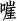

## **6

回车换行符注入**


一些漏洞允许用户输入在 HTML 和 HTTP 响应中具有特殊含义的编码字符。通常，应用程序会对这些字符进行清理，以防止攻击者恶意篡改 HTTP 消息，但在某些情况下，应用程序要么忘记清理输入，要么未能正确清理。当这种情况发生时，服务器、代理和浏览器可能会将特殊字符解释为代码，并改变原始 HTTP 消息，从而允许攻击者操控应用程序的行为。

编码字符的两个示例是`%0D`和`%0A`，分别表示`\n`（回车）和`\r`（换行符）。这些编码字符通常被称为*回车换行符（CRLF）*。服务器和浏览器依赖 CRLF 字符来识别 HTTP 消息的各个部分，例如头部。

*回车换行注入（CRLF 注入）*漏洞发生在应用程序未能清理用户输入或清理不当的情况下。如果攻击者能够将 CRLF 字符注入到 HTTP 消息中，他们可以实现我们将在本章讨论的两种攻击：HTTP 请求走私和 HTTP 响应分割攻击。此外，通常你可以将 CRLF 注入与其他漏洞链式利用，在漏洞报告中展示更大的影响，正如我在本章后面将演示的那样。出于本书的目的，我们将仅提供如何利用 CRLF 注入实现 HTTP 请求走私的示例。

### **HTTP 请求走私**

*HTTP 请求走私*发生在攻击者利用 CRLF 注入漏洞将第二个 HTTP 请求附加到最初的合法请求时。由于应用程序没有预料到注入的 CRLF，它最初将这两个请求当作一个请求处理。该请求会通过接收服务器（通常是代理或防火墙）传递，处理后再发送到另一个服务器，例如执行站点操作的应用程序服务器。这种类型的漏洞可能导致缓存中毒、防火墙绕过、请求劫持或 HTTP 响应分割。

在*缓存中毒*中，攻击者可以修改应用程序缓存中的条目，提供恶意页面而不是正确的页面。在*防火墙绕过*中，攻击者通过使用 CRLF 字符构造请求以绕过安全检查。在*请求劫持*情况下，攻击者可以在攻击者与客户端之间没有任何交互的情况下窃取`httponly` cookies 和 HTTP 认证信息。这些攻击之所以有效，是因为服务器将 CRLF 字符解释为 HTTP 头开始的标志，因此，如果它们看到另一个头部，它们会将其解释为新 HTTP 请求的开始。

*HTTP 响应拆分*，本章接下来的内容将重点讨论，它允许攻击者通过注入新的浏览器可以解析的头部，来拆分单个 HTTP 响应。攻击者可以根据漏洞的性质，使用两种方法之一来利用响应拆分。第一种方法中，攻击者使用 CRLF 字符完成初始服务器响应，并插入额外的头部，生成新的 HTTP 响应。然而，有时攻击者只能修改响应，而无法注入完全新的 HTTP 响应。例如，他们可能只能注入有限数量的字符。这导致了第二种利用响应拆分的方法，即插入新的 HTTP 响应头，例如 `Location` 头。注入 `Location` 头将允许攻击者将 CRLF 漏洞与重定向结合，发送目标到恶意网站，或者跨站脚本攻击（XSS），这是我们将在第七章中讨论的攻击。

### **v.shopify.com 响应拆分**

**难度：** 中等

**URL：** *v.shopify.com/last_shop?<YOURSITE>.myshopify.com*

**来源：** *[`hackerone.com/reports/106427/`](https://hackerone.com/reports/106427/)*

**报告日期：** 2015 年 12 月 22 日

**奖金支付：** $500

2015 年 12 月，HackerOne 用户 krankopwnz 报告称，Shopify 未验证传递到 URL 中的 shop 参数 *v.shopify.com/last_shop?<YOURSITE>.myshopify.com*。Shopify 向该 URL 发送了一个 `GET` 请求，以设置记录用户最后一次登录的商店的 cookie。因此，攻击者可以在 URL 中将 CRLF 字符 `%0d%0a`（编码时大小写无关）作为 `last_shop` 参数的一部分进行注入。当这些字符被提交时，Shopify 会使用完整的 `last_shop` 参数生成新的 HTTP 响应头。以下是 krankopwnz 为测试该漏洞是否有效而注入的恶意代码，作为商店名称的一部分：

```
%0d%0aContent-Length:%200%0d%0a%0d%0aHTTP/1.1%20200%20OK%0d%0aContent-Type:%20

text/html%0d%0aContent-Length:%2019%0d%0a%0d%0a<html>deface</html>
```

由于 Shopify 使用未经清理的 `last_shop` 参数在 HTTP 响应中设置了 cookie，响应中包含了浏览器将其解释为两个响应的内容。`%20` 字符代表编码后的空格，在响应接收时会被解码。

浏览器接收到的响应被解码为：

```
➊ Content-Length: 0

   HTTP/1.1 200 OK

   Content-Type: text/html

   Content-Length: 19

➋ <html>deface</html>
```

响应的第一部分将在原始 HTTP 头之后出现。原始响应的内容长度被声明为`0` ➊，这告诉浏览器响应体中没有内容。接下来，一个 CRLF 开始了新的一行和新的头部。文本设置了新的头部信息，告诉浏览器有第二个响应，它是 HTML 格式的，并且其长度为`19`。然后，头部信息向浏览器提供了渲染 HTML 的内容 ➋。当恶意攻击者使用注入的 HTTP 头时，可能会出现各种漏洞，包括 XSS（跨站脚本攻击），我们将在第七章中讨论。

#### ***重点总结***

留意那些接受输入并将其作为返回头部的一部分使用的站点，特别是当它们设置 cookie 时。如果你在一个站点上发现这种行为，尝试提交`%0D%0A`（或者在 Internet Explorer 中仅使用`%0A%20`）来检查该站点是否正确防护了 CRLF 注入。如果没有，测试是否能够添加新的头部或整个 HTTP 响应。当这种漏洞发生时，通常用户交互很少，例如在`GET`请求中，最容易被利用。

### **Twitter HTTP 响应分割**

**难度：** 高

**网址：** *https://twitter.com/i/safety/report_story/*

**来源：** *[`hackerone.com/reports/52042/`](https://hackerone.com/reports/52042/)*

**报告日期：** 2015 年 3 月 15 日

**支付悬赏：** $3,500

在寻找漏洞时，记得要跳出常规思维，提交编码值以查看站点如何处理输入。在某些情况下，站点会通过使用黑名单来防止 CRLF 注入。换句话说，站点会检查输入中的任何黑名单字符，然后相应地删除这些字符或不允许 HTTP 请求被发送。然而，攻击者有时可以通过使用字符编码绕过黑名单。

2015 年 3 月，FileDescriptor 通过操控 Twitter 处理字符编码的方式，发现了一个漏洞，使他能够通过 HTTP 请求设置一个 cookie。

FileDescriptor 测试的 HTTP 请求包含了一个`reported_tweet_id`参数，当发送到*https://twitter.com/i/safety/report_story/*（一个允许用户报告不当广告的 Twitter 遗留页面）时。响应时，Twitter 还会返回一个包含 HTTP 请求提交参数的 cookie。在他的测试中，FileDescriptor 注意到 CR 和 LF 字符被列入黑名单并进行了清理。Twitter 会将任何 LF 字符替换为空格，并在收到任何 CR 时返回 HTTP 400（错误请求），从而防止 CRLF 注入。但 FileDescriptor 知道一个 Firefox 漏洞，错误地解码了 cookie，可能允许用户向网站注入恶意载荷。了解这个漏洞后，他测试了 Twitter 上是否也存在类似的漏洞。

在 Firefox 漏洞中，Firefox 会剥离 cookie 中所有超出 ASCII 字符范围的 Unicode 字符。然而，Unicode 字符可以由多个字节组成。如果多字节字符中的某些字节被剥离，剩余的字节可能导致恶意字符在网页上被渲染。

受 Firefox 漏洞的启发，FileDescriptor 测试了攻击者是否能够通过 Twitter 的黑名单，利用相同的多字节字符技术悄悄传递恶意字符。因此，FileDescriptor 找到了一种 Unicode 字符，其编码以 `%0A`（换行符 LF）结尾，但其其他字节不包含在 HTTP 字符集内。他使用了 Unicode 字符 ，该字符的十六进制编码为 U+560A（`56 0A`）。但当此字符用于 URL 中时，它会被 UTF-8 编码为 `%E5%98%8A`。这三个字节 `%E3`、`%98`、`%8A` 绕过了 Twitter 的黑名单，因为它们不是恶意字符。

当 FileDescriptor 提交这个值时，他发现 Twitter 不会清理 URL 编码字符，但会将 UTF-8 编码的 `%E5%98%8A` 解码回其 Unicode 值 `56 0A`。Twitter 会丢弃 `56` 作为无效字符，留下换行符 `0A` 不变。此外，他还发现字符 （它编码为 `56 0D`）也可以用来将必要的回车符 (`%0D`) 插入 HTTP 响应中。

一旦他确认该方法有效，FileDescriptor 将值 `%E5%98%8A%E5%98%8DSet-Cookie:%20test` 传入 Twitter 的 URL 参数。Twitter 会解码字符，去除超出范围的字符，并保留 `%0A` 和 `%0D` 在 HTTP 请求中，最终结果为值 `%0A%0DSet-Cookie:%20test`。CRLF 会将 HTTP 响应分成两部分，因此第二个响应仅包含 `Set-Cookie: test` 值，这是用于设置 cookie 的 HTTP 头部。

CRLF 攻击在允许 XSS 攻击时可能更加危险。虽然利用 XSS 的细节在这个例子中并不重要，但应该注意到，FileDescriptor 在这个概念验证的基础上进一步展开了。他向 Twitter 演示了如何利用这个 CRLF 漏洞执行恶意 JavaScript，使用以下 URL：

```
https://twitter.com/login?redirect_after_login=https://twitter.com:21/%E5

%98%8A%E5%98%8Dcontent-type:text/html%E5%98%8A%E5%98%8Dlocation:%E5%98%8A%E5

%98%8D%E5%98%8A%E5%98%8D%E5%98%BCsvg/onload=alert%28innerHTML%29%E5%98%BE
```

关键的细节是分布在各处的 3 字节值：`%E5%98%8A`、`%E5%98%8D`、`%E5%98%BC` 和 `%E5%98%BE`。经过字符去除后，这些值分别解码为 `%0A`、`%0D`、`%3C` 和 `%3E`，它们都是 HTML 特殊字符。字节 `%3C` 是左尖括号 (`<`)，而 `%3E` 是右尖括号 (`>`)。

URL 中的其他字符按原样包含在 HTTP 响应中。因此，当这些编码的字节字符经过解码并带有换行符时，头部显示如下：

```
https://twitter.com/login?redirect_after_login=https://twitter.com:21/

content-type:text/html

location:

<svg/onload=alert(innerHTML)>
```

负载被解码后，注入了`content-type text/html`头部，这告诉浏览器响应将包含 HTML。`Location`头使用`<svg>`标签执行 JavaScript 代码`alert(innerHTML)`。该警告框会创建一个包含网页内容的弹窗，使用 DOM 的`innerHTML`属性（`innerHTML`属性返回给定元素的 HTML）。在这种情况下，警告框将包含已登录用户的会话和认证 Cookie，表明攻击者可以窃取这些值。窃取认证 Cookie 可以让攻击者登录目标账户，这也解释了为什么 FileDescriptor 因发现此漏洞而获得了 3500 美元的赏金。

#### ***要点***

如果服务器以某种方式清理字符`%0D%0A`，请考虑网站可能是如何进行清理的，并思考是否能绕过它的努力，比如通过双重编码。你可以通过传递多字节字符并确定它们是否被解码为其他字符，来测试网站是否错误处理了额外的值。

### **总结**

CRLF 漏洞允许攻击者通过修改 HTTP 响应头来操控它们。利用 CRLF 漏洞可能导致缓存投毒、防火墙绕过、请求劫持或 HTTP 响应拆分。由于 CRLF 漏洞是由网站在其头部反射未经清理的用户输入`%0D%0A`引起的，因此在进行黑客攻击时，监控和审查所有 HTTP 响应非常重要。此外，如果你发现你可以控制的输入被返回到 HTTP 头中，但字符`%0D%0A`正在被清理，尝试像 FileDescriptor 那样包含多字节编码的输入，以确定网站如何处理解码过程。
