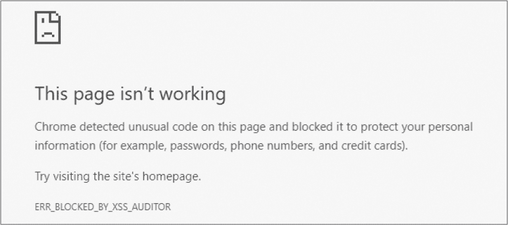
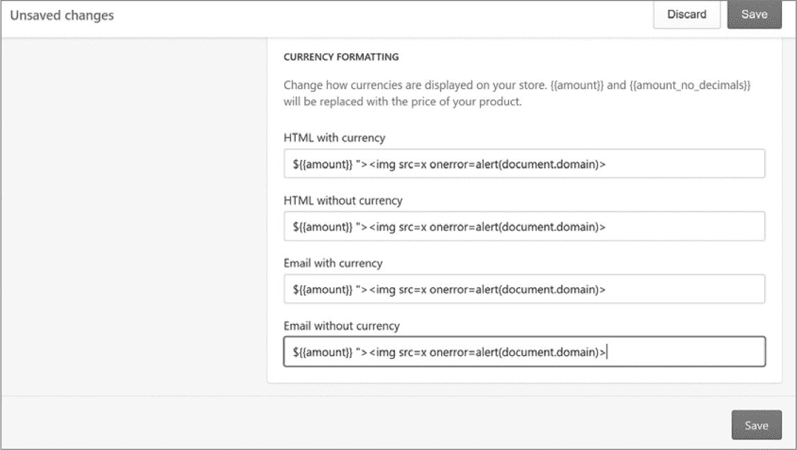

## 跨站脚本（XSS）**


*跨站脚本（XSS）*漏洞的最著名例子之一是 Samy Kamkar 创建的 Myspace Samy 蠕虫。2005 年 10 月，Kamkar 利用 Myspace 的一个漏洞，使他能够在个人资料中存储一个 JavaScript 有效载荷。每当一个登录用户访问他的 Myspace 个人资料时，载荷代码会执行，使得该用户成为 Kamkar 的朋友，并将该用户的个人资料更新为显示文本“但最重要的是，samy 是我的英雄。”然后，这段代码会复制到该用户的个人资料中，并继续感染其他 Myspace 用户页面。

尽管 Kamkar 并没有恶意创建这个蠕虫，但由于此事，政府突袭了 Kamkar 的住所。Kamkar 因释放该蠕虫而被逮捕，并对一项重罪指控表示认罪。

Kamkar 的蠕虫是一个极端的例子，但他的攻击展示了 XSS 漏洞对网站可能造成的广泛影响。与我目前介绍的其他漏洞类似，XSS 发生在网站未对某些字符进行净化时，导致浏览器执行恶意的 JavaScript。允许 XSS 漏洞发生的字符包括双引号（`"`）、单引号（`'`）和尖括号（`< >`）。

如果一个网站正确地净化字符，这些字符将作为 HTML 实体呈现。例如，网页的源代码将以以下方式显示这些字符：

+   一个双引号（`"`)可以表示为`&quot;`或`&#34;`

+   一个单引号（`'`）可以表示为`&apos;`或`&#39;`

+   一个开头的尖括号（`<`）可以表示为`&lt;`或`&#60;`

+   一个结束的尖括号（`>`）可以表示为`&gt;`或`&#62;`

这些特殊字符在未净化的情况下，在 HTML 和 JavaScript 中定义了网页的结构。例如，如果一个网站没有净化尖括号，你可以插入`<script></script>`来注入一个有效载荷，像这样：

```
<script>alert(document.domain);</script>
```

当你将这个有效载荷提交到一个未净化的网页时，`<script></script>`标签会指示浏览器执行其中的 JavaScript。这个有效载荷执行`alert`函数，弹出一个显示传递给`alert`的内容的对话框。括号中的`document`是 DOM，它返回网站的域名。例如，如果这个有效载荷在*https://www.<example>.com/foo/bar/*执行，弹出的对话框将显示*www.<example>.com*。

当你发现 XSS 漏洞时，确认其影响范围，因为并非所有 XSS 漏洞都是相同的。确认漏洞的影响并包括这一分析可以改善你的报告，帮助漏洞评估者验证你的漏洞，甚至可能提高你的赏金。

例如，一个没有使用`httponly`标志的敏感 cookie 的 XSS 漏洞与使用了该标志的 XSS 漏洞是不同的。当一个站点没有`httponly`标志时，你的 XSS 可以读取 cookie 的值；如果这些值包括会话识别 cookie，你可以窃取目标的会话并访问他们的账户。你可以警告`document.cookie`来确认你能读取敏感的 cookie（知道一个站点认为哪些 cookie 是敏感的需要在每个站点上进行试验）。即使你不能访问敏感的 cookie，你也可以警告`document.domain`来确认是否可以从 DOM 中访问敏感的用户信息，并代表目标执行操作。

但是，如果你没有正确警告域名，XSS 可能不会成为该站点的漏洞。例如，如果你从一个沙盒 iFrame 中警告`document.domain`，你的 JavaScript 可能是无害的，因为它无法访问 cookies，无法在用户账户上执行操作，或无法从 DOM 中访问敏感的用户信息。

由于浏览器实施了*同源策略（SOP）*作为安全机制，JavaScript 被渲染为无害。SOP 限制了文档（DOM 中的 D）如何与来自不同来源的资源进行交互。SOP 保护无辜的网站免受恶意网站通过用户进行的攻击。例如，如果你访问了*www.<malicious>.com*并且它发起了一个`GET`请求到*www.<example>.com/profile*，SOP 会阻止*www.<malicious>.com*读取*www.<example>.com/profile*的响应。*www.<example>.com*网站可能允许来自不同来源的站点与其交互，但通常这些交互仅限于特定的网站，*www.<example>.com*信任的网站。

网站的协议（例如，HTTP 或 HTTPS）、主机（例如，*www.<example>.com*）和端口决定了网站的来源。Internet Explorer 是这一规则的例外，它不会将端口视为来源的一部分。表格 7-1 展示了不同来源的示例，并且指示它们是否与*http://www.<example>.com/*被视为相同来源。

**表格 7-1：** SOP 示例

| **网址** | **同源？** | **原因** |
| --- | --- | --- |
| *http://www.<example>.com/countries* | 是 | 不适用 |
| *http://www.<example>.com/countries/Canada* | 是 | 不适用 |
| *https://www.<example>.com/countries* | 否 | 不同协议 |
| *http://store.<example>.com/countries* | 否 | 不同主机 |
| *http://www.<example>.com:8080/countries* | 否 | 不同端口 |

在某些情况下，URL 的源与实际来源不匹配。例如，`about:blank`和`javascript:`方案会继承打开它们的文档的来源。`about:blank`上下文访问或与浏览器交互，而`javascript:`则执行 JavaScript。URL 本身并没有提供关于其来源的信息，因此浏览器会以不同的方式处理这两种上下文。当你发现 XSS 漏洞时，在你的概念验证中使用`alert(document.domain)`是很有帮助的：它确认了 XSS 执行的来源，尤其是在浏览器显示的 URL 与 XSS 执行的来源不同的情况下。这正是当一个网站打开`javascript:` URL 时发生的情况。如果*www.<example>.com*打开了`javascript:alert(document.domain)`的 URL，浏览器地址栏会显示`javascript:alert(document.domain)`，但弹出框会显示*www.<example>.com*，因为弹出框继承了前一个文档的来源。

尽管我这里只举了使用 HTML `<script>`标签来实现 XSS 的例子，但在发现潜在注入点时，您并不总是能够提交 HTML 标签。在这些情况下，您可能能够提交单引号或双引号来注入 XSS 有效载荷。根据注入位置的不同，XSS 的影响可能会很大。例如，假设你能够访问以下代码的`value`属性：

```
<input type="text" name="username" value="hacker" width=50px>
```

通过在`value`属性中注入双引号，你可以关闭现有的引号，并将恶意的 XSS 有效载荷注入到标签中。你可以通过将`value`属性改为`hacker" onfocus=alert(document.cookie) autofocus "`来实现，这会导致以下结果：

```
<input type="text" name="username" value="hacker"

 onfocus=alert(document.cookie) autofocus "" width=50px>
```

`autofocus`属性指示浏览器在页面加载完成后立即将光标焦点放在输入框上。`onfocus` JavaScript 属性告诉浏览器当输入框获得焦点时执行 JavaScript（没有`autofocus`时，`onfocus`会在用户点击输入框时触发）。但这两个属性有其局限性：你不能在隐藏字段上使用自动聚焦。此外，如果页面上有多个字段设置了自动聚焦，焦点会落在第一个或最后一个元素上，这取决于浏览器。当有效载荷运行时，它会在`document.cookie`上触发警报。

类似地，假设你有权限访问`<script>`标签中的一个变量。如果你能将单引号注入到以下代码中的`name`变量值里，你就能关闭该变量并执行你自己的 JavaScript：

```
<script>

    var name = 'hacker';

</script>
```

因为我们控制着`hacker`的值，将`name`变量改为`hacker';alert(document.cookie);'`会导致以下结果：

```
<script>

    var name = 'hacker';alert(document.cookie);'';

</script>
```

注入一个单引号和分号后，变量 `name` 会被关闭。由于我们使用的是 `<script>` 标签，JavaScript 函数 `alert(document.cookie)`（我们也注入了这个函数）会执行。我们添加了额外的 `;'` 来结束函数调用并确保 JavaScript 语法正确，因为网站包含了一个 `';` 来关闭 `name` 变量。如果没有 `';` 语法结尾，可能会留下一个悬空的单引号，从而破坏页面的语法。

如你所知，你可以使用几种方法执行 XSS。由 Cure53 的渗透测试专家维护的网站 *[`html5sec.org/`](http://html5sec.org/)* 是一个关于 XSS payloads 的优秀参考。

### XSS 类型

XSS 主要有两种类型：反射型和存储型。*反射型 XSS* 是指一个没有存储在网站上的单一 HTTP 请求，传送并执行 XSS payload。包括 Chrome、Internet Explorer 和 Safari 在内的浏览器，尝试通过引入 *XSS 审计器* 来防止这种漏洞（2018 年 7 月，微软宣布他们将在 Edge 浏览器中退休 XSS 审计器，因为有其他安全机制可以防止 XSS）。XSS 审计器尝试保护用户免受执行 JavaScript 的恶意链接。当发生 XSS 尝试时，浏览器会显示一个损坏的页面，并提示页面已被阻止以保护用户。图 7-1 显示了 Google Chrome 中的一个示例。



*图 7-1：Google Chrome 中被 XSS 审计器阻止的页面*

尽管浏览器开发者们付出了巨大努力，但攻击者仍然经常绕过 XSS 审计器，因为 JavaScript 在网站上的执行方式复杂多变。由于绕过 XSS 审计器的方法经常变化，它们超出了本书的讨论范围。不过，有两个很好的资源可以进一步了解，分别是 FileDescriptor 的博客文章 *[`blog.innerht.ml/the-misunderstood-x-xss-protection/`](https://blog.innerht.ml/the-misunderstood-x-xss-protection/)* 和 Masato Kinugawa 的过滤器绕过备忘单 *https://github.com/masatokinugawa/filterbypass/wiki/Browser’s-XSS-Filter-Bypass-Cheat-Sheet/*。

相比之下，*存储型 XSS* 是指当网站保存恶意 payload 并渲染它时未经过消毒处理。网站也可能在多个位置渲染输入的 payload。payload 可能不会在提交后立即执行，但它可能在访问其他页面时执行。例如，如果你在一个网站上创建了一个包含 XSS payload 的个人资料作为你的名字，那么 XSS 可能不会在你查看个人资料时执行；相反，它可能在别人搜索你的名字或给你发信息时执行。

你还可以将 XSS 攻击分为以下三种子类别：基于 DOM 的、盲型和自我型。*基于 DOM 的 XSS* 攻击涉及操控网站现有的 JavaScript 代码来执行恶意的 JavaScript；它可以是存储型或反射型的。例如，假设网页 *www.<example>.com/hi/* 使用以下 HTML 代码来替换页面内容，且未检查 URL 中的恶意输入。这样就可能执行 XSS 攻击。

```
<html>

  <body>

    <h1>Hi <span id="name"></span></h1>

    <script>document.getElementById('name').innerHTML=location.hash.split('#')

      [1]</script>

  </body>

</html>
```

在这个示例网页中，脚本标签调用文档对象的 `getElementById` 方法来查找具有 ID `'name'` 的 HTML 元素。该调用返回指向 `<h1>` 标签中 `<span>` 元素的引用。接下来，脚本标签使用 `innerHTML` 方法修改 `<span id="name"></span>` 标签之间的文本。脚本将 `<span></span>` 之间的文本设置为来自 `location.hash` 的值，`location.hash` 是 URL 中 `#` 后的任何文本（`location` 是另一个浏览器 API，类似于 DOM；它提供了关于当前 URL 的信息）。

因此，访问 *www.<example>.com/hi#Peter/* 会导致页面的 HTML 动态更新为 `<h1><span id="name">Peter</span></h1>`。但该页面在更新 `<span>` 元素之前没有清理 URL 中的 `#` 值。所以，如果用户访问 *www.<example>.com/h1#*，一个 JavaScript 警告框会弹出并显示 *www.<example>.com*（假设浏览器没有返回图片 `x`）。页面的最终 HTML 将会像这样：

```
<html>

  <body>

    <h1>Hi <span id="name"></span>

      </h1>

    <script>document.getElementById('name').innerHTML=location.hash.split('#')

      [1]</script>

  </body>

</html>
```

这次，网页不会在 `<h1>` 标签之间渲染 Peter，而是会显示一个 JavaScript 警告框，里面显示 `document.domain` 名称。攻击者可以利用这一点，因为为了执行任何 JavaScript，他们将 `` 标签的 JavaScript 属性提供给 `onerror`。

*盲型 XSS* 是一种存储型 XSS 攻击，其中另一个用户从黑客无法访问的网站位置渲染 XSS 负载。例如，如果你在创建个人资料时将 XSS 作为你的名字和姓氏添加，这可能会发生。这些值在普通用户查看你的个人资料时可能会被转义，但当管理员访问列出所有新用户的管理页面时，可能不会清理这些值，从而执行 XSS。Matthew Bryant 提供的 XSSHunter 工具 (*[`xsshunter.com/`](https://xsshunter.com/)*) 非常适合检测盲型 XSS。Bryant 设计的负载会执行 JavaScript，加载远程脚本。当脚本执行时，它会读取 DOM、浏览器信息、Cookies 和其他返回到 XSSHunter 账户的信息。

*Self XSS* 漏洞是指仅影响输入有效载荷的用户的漏洞。由于攻击者只能攻击自己，因此自我 XSS 被认为是低严重性漏洞，并且在大多数漏洞悬赏计划中不符合奖励资格。例如，当 XSS 通过 `POST` 请求提交时，可能会发生这种漏洞。但由于请求受到 CSRF 的保护，只有目标用户才能提交 XSS 有效载荷。自我 XSS 可能会被存储，也可能不会。

如果你发现自我 XSS，尝试寻找机会将其与其他可能影响其他用户的漏洞结合，例如 *登录/登出 CSRF*。在这种攻击中，目标用户会被登出自己的账户，并登录到攻击者的账户以执行恶意的 JavaScript。通常，登录/登出 CSRF 攻击需要能够使用恶意 JavaScript 将目标用户重新登录到账户中。我们不会讨论使用登录/登出 CSRF 的漏洞，但一个很好的例子是 Jack Whitton 在 Uber 网站上发现的漏洞，你可以在 *https://whitton.io/articles/uber-turning-self-xss-into-good-xss/* 阅读详细信息。

XSS 的影响取决于多种因素：它是存储型还是反射型，是否能访问 cookies，有效载荷在哪个位置执行等等。尽管 XSS 可能对网站造成潜在的损害，但修复 XSS 漏洞通常很容易，只需要软件开发人员在渲染之前对用户输入进行过滤（就像 HTML 注入一样）。

### Shopify 批发

**难度：** 低

**网址：** *[wholesale.shopify.com/](http://wholesale.shopify.com/)*

**来源：** *[`hackerone.com/reports/106293/`](https://hackerone.com/reports/106293/)*

**报告日期：** 2015 年 12 月 21 日

**支付悬赏：** $500

XSS 有效载荷不需要复杂，但你需要根据它们渲染的位置以及它们是否包含在 HTML 或 JavaScript 标签中来定制。在 2015 年 12 月，Shopify 的批发网站是一个简单的网页，顶部有一个独特的搜索框。该页面上的 XSS 漏洞很简单，但容易被忽略：输入到搜索框中的文本被未经过滤地反射在现有的 JavaScript 标签中。

人们忽视了这个漏洞，因为 XSS 有效载荷并没有利用未经过滤的 HTML。当 XSS 利用 HTML 的渲染方式时，攻击者可以看到有效载荷的效果，因为 HTML 定义了网站的外观和感觉。相比之下，JavaScript 代码可以 *改变* 网站的外观和感觉或执行其他操作，但它并不 *定义* 网站的外观和感觉。

在这种情况下，输入 `"><script>alert('XSS')</script>` 并不会执行 XSS 载荷 `alert('XSS')`，因为 Shopify 对 HTML 标签 `<>` 进行了编码。这些字符会被无害地呈现为 `&lt;` 和 `&gt;`。黑客意识到该输入在网页中的 `<script></script>` 标签内没有被清理。很可能，黑客是通过查看页面的源代码得出这个结论的，源代码包含了页面的 HTML 和 JavaScript。你可以通过在浏览器地址栏中输入 *view-source:URL* 来查看任何网页的源代码。例如，图 7-2 显示了 *[`nostarch.com/`](https://nostarch.com/)* 网站的部分页面源代码。

在意识到输入没有被清理后，黑客将 `test';alert('XSS');'` 输入到 Shopify 的搜索框中，当呈现时，会创建一个 JavaScript 警告框，显示文本 `'XSS'`。虽然报告中没有明确说明，但很可能 Shopify 是在 JavaScript 语句中呈现搜索词，例如 `var search_term = '`<INJECTION>`'`。注入的第一部分 `test';` 会关闭该标签，并将 `alert('XSS');` 插入为一个独立的语句。最后的 `'` 会确保 JavaScript 语法正确。最终结果可能会像 `var search_term = 'test';alert('xss'); '';`。


*图 7-2：* [`nostarch.com/`](https://nostarch.com/) *网站的页面源代码*

#### *重点总结*

XSS 漏洞不一定复杂。Shopify 的漏洞并不复杂：它只是一个没有清理用户输入的简单输入文本字段。在测试 XSS 时，务必查看页面源代码，确认你的载荷是否被呈现在 HTML 或 JavaScript 标签中。

### Shopify 货币格式化

**难度：** 低

**网址：** *<YOURSITE>.myshopify.com/admin/settings/general/*

**来源：** *[`hackerone.com/reports/104359/`](https://hackerone.com/reports/104359/)*

**报告日期：** 2015 年 12 月 9 日

**奖励金额：** $1,000

XSS 载荷并不总是立即执行。因此，黑客应确保在所有可能呈现的地方正确清理载荷。在这个例子中，Shopify 的商店设置允许用户更改货币格式。2015 年 12 月，当设置社交媒体页面时，这些输入框中的值没有得到正确清理。恶意用户可以设置一个商店，并在商店的货币设置字段中注入一个 XSS 载荷，如 图 7-3 所示。该载荷在商店的社交媒体销售渠道中被呈现。恶意用户可以配置商店，以便当另一个商店管理员访问该销售渠道时执行载荷。

Shopify 使用 Liquid 模板引擎动态渲染商店页面上的内容。例如，`${{ }}` 是 Liquid 的语法；要渲染的变量放在内层的大括号中。在 图 7-3 中，`${{amount}}` 是一个合法的值，但被追加了值 `">`，这是 XSS 有效载荷。`">` 关闭了 HTML 标签，正在将有效载荷注入到其中。当 HTML 标签关闭时，浏览器渲染该图像标签，并查找 `src` 属性中指示的图像 `x`。由于 Shopify 网站上不太可能存在此值的图像，浏览器会遇到错误并调用 JavaScript 事件处理程序 `onerror`。事件处理程序执行处理程序中定义的 JavaScript。在此情况下，它是 `alert(document.domain)` 函数。



*图 7-3：报告时 Shopify 的货币设置页面*

虽然当用户访问货币页面时 JavaScript 不会执行，但有效载荷也会出现在 Shopify 商店的社交媒体销售渠道中。当其他商店管理员点击易受攻击的销售渠道标签时，恶意的 XSS 会被渲染为未经清理并执行 JavaScript。

#### *重点总结*

XSS 有效载荷并不总是在提交后立即执行。由于有效载荷可以在网站的多个位置使用，因此必须访问每个位置。在这种情况下，仅仅提交恶意有效载荷在货币页面上并未执行 XSS。错误报告者必须配置另一个网站功能，才能使 XSS 执行。

### Yahoo! Mail 存储型 XSS

**难度：** 中等

**URL：** Yahoo! Mail

**来源：** *[`klikki.fi/adv/yahoo.html`](https://klikki.fi/adv/yahoo.html)*

**报告日期：** 2015 年 12 月 26 日

**悬赏金额：** $10,000

通过修改输入的文本来清理用户输入有时会导致问题，尤其是在处理不当时。在这个例子中，Yahoo! Mail 的编辑器允许用户通过 HTML 在电子邮件中嵌入图像，使用 `` 标签。编辑器通过移除所有 JavaScript 属性，如 `onload`、`onerror` 等，来清理数据，避免 XSS 漏洞。然而，它未能避免用户故意提交格式错误的 `` 标签时发生的漏洞。

大多数 HTML 标签都接受属性，它们是关于 HTML 标签的附加信息。例如，`` 标签需要一个指向图像地址的 `src` 属性来渲染图像。该标签还允许使用 `width` 和 `height` 属性来定义图像的大小。

一些 HTML 属性是布尔属性：当它们包含在 HTML 标签中时，被视为 true，省略时被视为 false。

通过这个漏洞，Jouko Pynnonen 发现如果他将布尔属性添加到带有值的 HTML 标签中，Yahoo! Mail 会移除该值，但保留属性的等号。这是 Pynnonen 提供的一个示例：

```
<INPUT TYPE="checkbox" CHECKED="hello" NAME="check box">
```

在这里，HTML 输入标签可能包含一个 `CHECKED` 属性，用来表示是否应该将复选框渲染为选中状态。根据 Yahoo 的标签解析，该行将变为：

```
<INPUT TYPE="checkbox" CHECKED= NAME="check box">
```

这看起来无害，但 HTML 允许在未加引号的属性值周围有零个或多个空格字符。因此，浏览器会将其读取为 `CHECKED` 的值为 `NAME="check`，而 input 标签有一个名为 `box` 的第三个属性，但没有值。

为了利用这一点，Pynnonen 提交了以下 `` 标签：

```

```

Yahoo! 邮件过滤会将其更改为以下内容：

```

```

`ismap` 值是一个布尔型的 `` 标签属性，指示图像是否有可点击区域。在这个案例中，Yahoo! 删除了 `'xxx'`，并且字符串末尾的单引号被移动到了 `yyy` 的末尾。

有时，网站的后端是一个黑箱，你不知道代码是如何被处理的，就像这个案例一样。我们不知道为什么 `'xxx'` 被删除，或者为什么单引号被移到 `yyy` 的末尾。可能是 Yahoo 的解析引擎，或者浏览器处理 Yahoo 返回的内容时做出了这些更改。不过，你可以利用这些异常找到漏洞。

由于代码处理的方式，一个 `` 标签的高度和宽度为 100%，这导致图片占据了整个浏览器窗口。当用户将鼠标移到网页上时，XSS payload 会因为注入中的 `onmouseover=alert(/XSS/)` 部分而执行。

#### *要点*

当网站通过修改用户输入而不是对值进行编码或转义来清理输入时，你应该继续测试网站的服务器端逻辑。考虑开发者如何编写他们的解决方案以及他们做出了哪些假设。例如，检查开发者是否考虑过如果提交了两个 `src` 属性，或者如果空格被替换为斜杠会发生什么。在这个案例中，漏洞报告者检查了当布尔属性提交值时会发生什么。

### Google 图片搜索

**难度：** 中等

**网址：** *[images.google.com/](http://images.google.com/)*

**来源：** *[`mahmoudsec.blogspot.com/2015/09/how-i-found-xss-vulnerability-in-google.html`](https://mahmoudsec.blogspot.com/2015/09/how-i-found-xss-vulnerability-in-google.html)*

**报告日期：** 2015 年 9 月 12 日

**奖励支付：** 未公开

根据你的输入渲染位置，你并不总是需要使用特殊字符来利用 XSS 漏洞。在 2015 年 9 月，Mahmoud Jamal 使用 Google 图片搜索为他的 HackerOne 个人资料寻找一张图片。在浏览时，他注意到图片 URL *[`www.google.com/imgres?imgurl=https://lh3.googleuser.com/`](http://www.google.com/imgres?imgurl=https://lh3.googleuser.com/)*... 来自 Google。

注意到 URL 中提到`imgurl`，Jamal 意识到他可以控制该参数的值；它可能会作为链接渲染在页面上。当他将鼠标悬停在他个人资料的缩略图上时，Jamal 确认`<a>`标签的`href`属性包含了相同的 URL。他尝试将`imgurl`参数更改为`javascript:alert(1)`，并注意到`href`属性也更改为相同的值。

这个`javascript:alert(1)`有效载荷在特殊字符被清理时非常有用，因为该载荷不包含需要网站编码的特殊字符。当点击指向`javascript:alert(1)`的链接时，会打开一个新的浏览器窗口，并执行`alert`函数。此外，由于 JavaScript 是在初始网页的上下文中执行的，而该网页包含了该链接，因此 JavaScript 可以访问该页面的 DOM。换句话说，指向`javascript:alert(1)`的链接将对 Google 执行`alert`函数。这个结果表明，恶意攻击者可能会访问网页上的信息。如果点击指向 JavaScript 协议的链接没有继承初始站点渲染该链接的上下文，那么 XSS 攻击就无害了：攻击者无法访问易受攻击网页的 DOM。

充满期待的 Jamal 点击了他认为是恶意链接的内容，但没有 JavaScript 被执行。当鼠标点击通过锚标签的`onmousedown`JavaScript 属性时，Google 已经清理了 URL 地址。

作为解决方法，Jamal 尝试通过页面进行切换。当他到达“查看图片”按钮时，他按下了 ENTER 键。JavaScript 被触发，因为他可以在不点击鼠标的情况下访问链接。

#### *要点*

始终留意那些可能在页面上反射的 URL 参数，因为你可以控制这些值。如果你发现任何在页面上渲染的 URL 参数，也要考虑它们的上下文。URL 参数可能会提供绕过清理特殊字符的过滤器的机会。在这个例子中，Jamal 不需要提交任何特殊字符，因为该值作为锚标签中的`href`属性被渲染。

此外，甚至在 Google 和其他大型网站上也要寻找漏洞。很容易认为仅仅因为一个公司很大，它的所有漏洞都已经被发现了。显然，情况并非总是如此。

### Google Tag Manager 存储型 XSS

**难度：** 中等

**URL:** *[tagmanager.google.com/](http://tagmanager.google.com/)*

**Source:** *[`blog.it-securityguard.com/bugbounty-the-5000-google-xss/`](https://blog.it-securityguard.com/bugbounty-the-5000-google-xss/)*

**报告日期：** 2014 年 10 月 31 日

**奖励金额：** $5,000

网站的常见最佳实践是在渲染时清理用户输入，而不是在提交时保存输入。原因是，向网站提交数据的方式（如文件上传）容易引入新的方式，且可能会忘记清理输入。然而，在某些情况下，公司并未遵循这一做法：HackerOne 的 Patrik Fehrenbach 在 2014 年 10 月测试 Google 的 XSS 漏洞时发现了这一疏漏。

Google Tag Manager 是一款 SEO 工具，可以让营销人员轻松添加和更新网站标签。为了实现这一点，该工具提供了多个用户可以互动的网页表单。Fehrenbach 从查找可用的表单字段开始，并输入了 XSS 负载，例如 `#">`。如果该负载被表单字段接受，负载将关闭现有的 HTML 标签，然后尝试加载一个不存在的图片。由于找不到该图片，网站将执行 `onerror` JavaScript 函数 `alert(3)`。

但 Fehrenbach 的负载并未生效。Google 正确地清理了他的输入。Fehrenbach 注意到了一种提交负载的替代方式。除了表单字段，Google 还提供了上传包含多个标签的 JSON 文件的功能。因此，Fehrenbach 向 Google 的服务上传了以下 JSON 文件：

```
"data": {

  "name": "#">",

  "type": "AUTO_EVENT_VAR",

  "autoEventVarMacro": {

    "varType": "HISTORY_NEW_URL_FRAGMENT"

  }

}
```

请注意，`name` 属性的值与 Fehrenbach 之前尝试的相同的 XSS 负载。Google 没有遵循最佳实践，而是在提交表单时进行输入清理，而不是在渲染时进行。因此，Google 忘记对文件上传的输入进行清理，导致 Fehrenbach 的负载执行。

#### *关键要点*

Fehrenbach 的报告中有两个值得注意的细节。首先，Fehrenbach 找到了另一种输入 XSS 负载的方法。你也应该寻找替代的输入方法。确保测试目标提供的所有输入方式，因为每种输入的处理方式可能不同。第二，Google 尝试在输入时进行数据清理，而不是在渲染时进行。如果 Google 遵循最佳实践，本可以避免此漏洞。即使你知道网站开发人员通常会采取常见的防御措施来应对某些攻击，也要检查是否存在漏洞。开发人员也会犯错。

### 联合航空 XSS

**难度：** 难

**URL:** *[checkin.united.com/](http://checkin.united.com/)*

**来源：** *[`strukt93.blogspot.jp/2016/07/united-to-xss-united.html`](http://strukt93.blogspot.jp/2016/07/united-to-xss-united.html)*

**报告日期：** 2016 年 7 月

**悬赏金：** 未公开

2016 年 7 月，在寻找便宜机票时，Mustafa Hasan 开始在 United Airlines 网站上寻找漏洞。他发现访问子域名*[checkin.united.com](http://checkin.united.com)*会重定向到一个包含`SID`参数的 URL。注意到任何传递给该参数的值都会在页面 HTML 中渲染，他测试了`"><svg onload=confirm(1)>`。如果渲染不当，该标签将关闭现有的 HTML 标签并注入 Hasan 的`<svg>`标签，导致一个由`onload`事件触发的 JavaScript 弹窗。

但是，当他提交 HTTP 请求时，什么也没发生，尽管他的有效载荷以原样渲染，未经过清理。Hasan 没有放弃，而是打开了网站的 JavaScript 文件，可能是使用浏览器的开发者工具。他发现了以下代码，该代码重写了可能导致 XSS 的 JavaScript 属性，如`alert`、`confirm`、`prompt`和`write`：

```
   [function () {

   /*

   XSS prevention via JavaScript

   */

   var XSSObject = new Object();

   XSSObject.lockdown = function(obj,name) {

       if (!String.prototype.startsWith) {

           try {

               if (Object.defineProperty) {

                   Object.defineProperty(obj, name, {

                       configurable: false

                   });

               }

           } catch (e)  { };

       }

   }

   XSSObject.proxy = function (obj, name, report_function_name, ➊exec_original)

   {

       var proxy = obj[name];

       obj[name] = function () {

           if (exec_original) {

               return proxy.apply(this, arguments);

           }

       };

       XSSObject.lockdown(obj, name);

   };

➋ XSSObject.proxy(window, 'alert', 'window.alert', false);

   XSSObject.proxy(window, 'confirm', 'window.confirm', false);

   XSSObject.proxy(window, 'prompt', 'window.prompt', false);

   XSSObject.proxy(window, 'unescape', 'unescape', false);

   XSSObject.proxy(document, 'write', 'document.write', false);

   XSSObject.proxy(String, 'fromCharCode', 'String.fromCharCode', true);

   }]();
```

即使你不懂 JavaScript，你也许能通过某些词汇猜出发生了什么。例如，`XSSObject proxy`定义中的`exec_original`参数名 ➊ 暗示了某种执行的关系。紧接着该参数下方是所有有趣函数的列表，并且传递了`false`值（除了最后一个实例） ➋。我们可以假设该站点试图通过不允许执行传递到`XSSObject proxy`中的 JavaScript 属性来保护自己。

值得注意的是，JavaScript 允许你重写现有的函数。因此，Hasan 首先尝试通过在`SID`中添加以下值来恢复`document.write`函数：

```
javascript:document.write=HTMLDocument.prototype.write;document.write('STRUKT');
```

这个值通过使用`write`函数的原型，将文档的`write`函数恢复到其原始功能。由于 JavaScript 是面向对象的，所有对象都有一个原型。通过调用`HTMLDocument`，Hasan 将当前文档的`write`函数恢复到了`HTMLDocument`的原始实现。然后，他调用了`document.write('STRUKT')`将他的名字以纯文本的形式添加到页面上。

但是，当 Hasan 尝试利用这个漏洞时，他再次遇到了困难。他联系了 Rodolfo Assis 寻求帮助。两人合作后发现，United 的 XSS 过滤器缺少对与`write`类似的函数的重写：`writeln`函数。这两个函数的区别在于，`writeln`在写入文本后会添加一个换行符，而`write`则不会。

Assis 认为他可以使用`writeln`函数将内容写入 HTML 文档。这样做可以绕过 United 的 XSS 过滤器。他通过以下有效载荷实现了这一点：

```
";}{document.writeln(decodeURI(location.hash))-"#
```

但是他的 JavaScript 仍然没有执行，因为 XSS 过滤器仍然在加载并覆盖了`alert`函数：Assis 需要使用不同的方法。在我们查看最终的有效载荷以及 Assis 如何绕过`alert`重写之前，让我们先分析一下他的初始有效载荷。

第一部分，`";}`，关闭了正在注入的现有 JavaScript。接下来，`{` 打开了 JavaScript payload，`document.writeln` 调用了 JavaScript 文档对象的 `writeln` 函数，将内容写入 DOM。传递给 `writeln` 的 `decodeURI` 函数解码 URL 中的编码实体（例如，`%22` 会变成 `"`）。传递给 `decodeURI` 的 `location.hash` 代码返回 URL 中 `#` 后的所有参数，这在后面定义。在完成这部分初始化后，`-"` 替换了 payload 开头的引号，以确保 JavaScript 语法的正确性。

最后一部分，`#`，添加了一个从未发送到服务器的参数。这最后一部分是一个已定义的、可选的 URL 部分，称为 *fragment*，它用于引用文档的一部分。但在这个案例中，Assis 利用定义 fragment 开始的哈希符号（`#`）。`location.hash` 的引用返回所有 `#` 后的内容。但返回的内容将被 URL 编码，因此输入的 `` 将被返回为 `%3Cimg%20src%3D1%20onerror%3Dalert%281%29%3E%20`。为了处理编码，`decodeURI` 函数将内容解码回 HTML ``。这很重要，因为解码后的值会传递给 `writeln` 函数，后者将 HTML `` 标签写入 DOM。当网站无法找到 `src` 属性中引用的图像 `1` 时，HTML 标签会执行 XSS。如果 payload 成功，一个 JavaScript 提示框会弹出，显示数字 `1`。但它没有。

Assis 和 Hasan 意识到他们需要在联合网站的上下文中创建一个新的 HTML 文档：他们需要一个没有加载 XSS 过滤 JavaScript，但仍能访问联合网页信息、cookies 等的页面。所以他们使用了带有以下 payload 的 iFrame：

```
";}{document.writeln(decodeURI(location.hash))-"#<iframe

src=javascript:alert(document.domain)><iframe>
```

这个 payload 的行为和原始 URL 中的 `` 标签完全相同。但在这个例子中，他们写入了一个 `<iframe>` 到 DOM 中，并将 `src` 属性更改为使用 JavaScript 方案来 `alert(document.domain)`。这个 payload 类似于在 第 65 页 中讨论的 “Google 图像搜索” 中提到的 XSS 漏洞，因为 JavaScript 方案继承了父 DOM 的上下文。现在 XSS 可以访问联合 DOM，因此 `document.domain` 打印出 *[www.united.com](http://www.united.com)*。当站点渲染出一个弹出提示框时，漏洞被确认。

iFrame 可以使用 `src` 属性来加载远程 HTML。因此，Assis 可以将源设置为 JavaScript，立即调用 `alert` 函数并显示文档域名。

#### *要点*

注意有关此漏洞的三个重要细节。首先，哈桑表现出了持续的坚持。当他的有效负载未能触发时，他并没有放弃，而是深入研究 JavaScript 查找原因。其次，使用 JavaScript 属性黑名单应该让黑客意识到代码中可能存在 XSS 漏洞，因为这可能是开发者犯错的机会。第三，拥有 JavaScript 知识对于成功确认更复杂的漏洞至关重要。

### 总结

XSS 漏洞对网站开发者来说构成真实的风险，并且仍然在许多网站上普遍存在，常常暴露在明面上。通过提交恶意负载，例如``，你可以检查输入字段是否存在漏洞。但这并不是测试 XSS 漏洞的唯一方法。每当网站通过修改（如删除字符、属性等）来净化输入时，你应该彻底测试净化功能。寻找那些网站在提交时净化输入而不是在渲染输入时进行净化的机会，并测试所有的输入方法。此外，查找你控制的 URL 参数是否反映在页面上；这些可能允许你找到绕过编码的 XSS 漏洞，例如在锚点标签的`href`值中添加`javascript:alert(document.domain)`。

重要的是要考虑网站渲染输入的所有地方，并且要了解这些地方是使用 HTML 还是 JavaScript。记住，XSS 有效负载可能不会立即执行。
