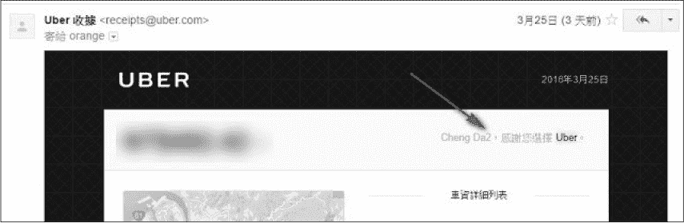
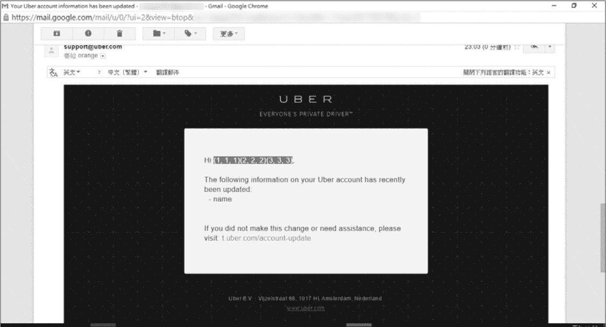
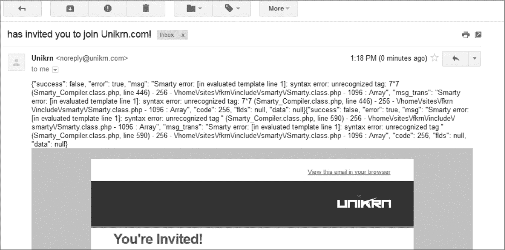
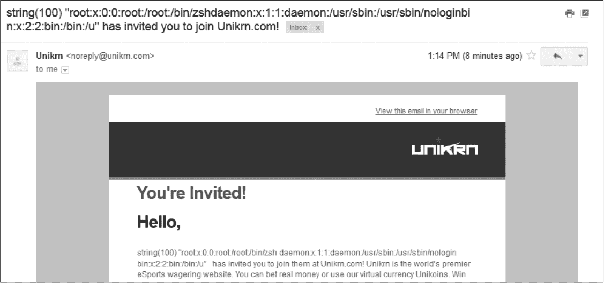

## 第八章：TEMPLATE INJECTION**


*模板引擎* 是一种通过在渲染时自动填充模板中的占位符来创建动态网站、电子邮件和其他媒体的代码。通过使用占位符，模板引擎使开发人员能够分离应用程序和业务逻辑。例如，一个网站可能仅使用一个模板来生成用户个人资料页面，并为个人资料字段（如用户的姓名、电子邮件地址和年龄）设置动态占位符。模板引擎通常还提供额外的好处，如用户输入清理功能、简化的 HTML 生成和易于维护。但这些功能并不能使模板引擎免受漏洞的影响。

*模板注入* 漏洞发生在引擎渲染用户输入时未正确清理，可能导致远程代码执行。我们将在第十二章中更详细地讨论远程代码执行。

有两种类型的模板注入漏洞：服务器端和客户端。

### 服务器端模板注入

*服务器端模板注入（SSTI）* 漏洞发生在服务器端逻辑中进行注入时。由于模板引擎与特定的编程语言相关联，当发生注入时，有时你可能能够执行该语言中的任意代码。是否能这样做取决于引擎提供的安全保护以及网站的防护措施。Python 的 Jinja2 引擎曾允许任意文件访问和远程代码执行，Ruby 默认使用的 ERB 模板引擎也是如此。相比之下，Shopify 的 Liquid 引擎允许访问有限数量的 Ruby 方法，以防止完全的远程代码执行。其他流行的引擎包括 PHP 的 Smarty 和 Twig、Ruby 的 Haml、Mustache 等。

测试 SSTI 漏洞时，你需要使用该引擎特定的语法提交模板表达式。例如，PHP 的 Smarty 模板引擎使用四个大括号 `{{ }}` 来表示表达式，而 ERB 使用尖括号、百分号和等号的组合 `<%= %>`。在 Smarty 上进行注入测试时，通常提交 `{{7*7}}` 并查找页面上回显输入的地方（例如表单、URL 参数等）。在这种情况下，你需要查找由代码 `7*7` 执行后渲染出来的 `49`。如果你找到 `49`，说明你成功地注入了表达式，模板已对其进行了评估。

由于不同的模板引擎语法不统一，因此你必须了解构建你正在测试的网站所使用的软件。像 Wappalyzer 和 BuiltWith 这样的工具专门用于此目的。在识别出软件后，使用该模板引擎的语法提交一个简单的有效载荷，例如`7*7`。

### 客户端模板注入

*客户端模板注入（CSTI）*漏洞出现在客户端模板引擎中，且这些模板引擎是用 JavaScript 编写的。流行的客户端模板引擎包括谷歌的 AngularJS 和 Facebook 的 ReactJS。

由于 CSTI 发生在用户的浏览器中，通常无法利用它们实现远程代码执行，但可以用它们来实现 XSS。然而，实现 XSS 有时可能很困难，并且需要绕过预防措施，就像 SSTI 漏洞一样。例如，ReactJS 通过默认设置有效地防止 XSS。在测试使用 ReactJS 的应用程序时，你应该在 JavaScript 文件中查找函数`dangerouslySetInnerHTML`，因为你可以控制提供给该函数的输入。这故意绕过了 ReactJS 的 XSS 保护。关于 AngularJS，1.6 版本之前的版本包含了一个沙箱，限制了对某些 JavaScript 函数的访问，并防止了 XSS（要确认 AngularJS 的版本，可以在浏览器的开发者控制台中输入`Angular.version`）。但是，伦理黑客通常会在 1.6 版本发布之前找到并发布 AngularJS 沙箱绕过方法。以下是一个流行的绕过方法，适用于 1.3.0 到 1.5.7 版本的沙箱，当你发现 AngularJS 注入时可以提交该方法：

```
{{a=toString().constructor.prototype;a.charAt=a.trim;$eval('a,alert(1),a')}}
```

你可以在* [`pastebin.com/xMXwsm0N`](https://pastebin.com/xMXwsm0N)*和* [`jsfiddle.net/89aj1n7m/`](https://jsfiddle.net/89aj1n7m/)*找到其他已发布的 AngularJS 沙箱绕过方法。

演示 CSTI 漏洞的严重性需要测试你可能执行的代码。虽然你可能能够评估一些 JavaScript 代码，但有些网站可能有额外的安全机制来防止利用。例如，我通过使用负载`{{4+4}}`发现了一个 CSTI 漏洞，这在使用 AngularJS 的网站上返回了`8`。但是当我使用`{{4*4}}`时，返回的文本是`{{44}}`，因为该网站通过移除星号来清理输入。该字段还移除了特殊字符，例如`()`和`[]`，并且最多允许 30 个字符。结合这些预防措施，CSTI 漏洞基本上变得无效。

### Uber AngularJS 模板注入

**难度：** 高

**网址：** *[`developer.uber.com/`](https://developer.uber.com/)*

**来源：** *[`hackerone.com/reports/125027/`](https://hackerone.com/reports/125027/)*

**报告日期：** 2016 年 3 月 22 日

**奖励金额：** $3,000

2016 年 3 月，PortSwigger（Burp Suite 的创建者）首席安全研究员 James Kettle 在一个 Uber 子域名中发现了一个 CSTI 漏洞，通过 URL *https://developer.uber.com/docs/deep-linking?q=wrtz{{7*7}}*。如果在访问链接后查看渲染的页面源代码，你会看到字符串`wrtz49`，这表明模板已经计算了表达式`7*7`。

事实证明，*[developer.uber.com](http://developer.uber.com)* 使用 AngularJS 来渲染其网页。你可以通过使用像 Wappalyzer 或 BuiltWith 这样的工具，或者查看页面源代码并查找 `ng-` HTML 属性来确认这一点。如前所述，旧版本的 AngularJS 实现了 Sandbox，但 Uber 使用的版本存在 Sandbox 漏洞。因此，在这种情况下，CSTI 漏洞意味着你可以执行 XSS。

使用以下 JavaScript 代码在 Uber URL 中，Kettle 绕过了 AngularJS Sandbox 并执行了 `alert` 函数：

```
https://developer.uber.com/docs/deep-linking?q=wrtz{{(_="".sub).call.call({}

[$="constructor"].getOwnPropertyDescriptor(_.__proto__,$).value,0,"alert(1)")

()}}zzzz
```

对此有效载荷的解析超出了本书的范围，因为 AngularJS Sandbox 绕过的多种方法已经公开，并且 Sandbox 在版本 1.6 中被移除。但该有效载荷 `alert(1)` 的最终结果是一个 JavaScript 弹窗。这个概念验证向 Uber 演示了攻击者如何利用这个 CSTI 漏洞实现 XSS，从而可能导致开发者账户和相关应用程序被攻击。

#### *重点总结*

在确认一个站点是否使用客户端模板引擎后，通过提交简单的有效载荷，使用与该引擎相同的语法开始测试站点，例如对于 AngularJS 使用`{{7*7}}`，并观察渲染结果。如果有效载荷被执行，在浏览器控制台中输入*Angular.version*来检查站点使用的 AngularJS 版本。如果版本大于 1.6，则可以提交来自上述资源的有效载荷而无需绕过 Sandbox。如果版本小于 1.6，则需要提交像 Kettle 那样的 Sandbox 绕过方法，具体取决于应用程序使用的 AngularJS 版本。

### Uber Flask Jinja2 模板注入

**难度：** 中等

**URL:** *[`riders.uber.com/`](https://riders.uber.com/)*

**来源：** *[`hackerone.com/reports/125980/`](https://hackerone.com/reports/125980/)*

**报告日期：** 2016 年 3 月 25 日

**奖励金额：** $10,000

在进行黑客攻击时，识别公司使用的技术是很重要的。当 Uber 在 HackerOne 上启动其公开的漏洞奖励计划时，它还在其网站上发布了一张“藏宝图”，网址为 *[`eng.uber.com/bug-bounty/`](https://eng.uber.com/bug-bounty/)* （2017 年 8 月发布了修订版，网址为 *[`medium.com/uber-security-privacy/uber-bug-bounty-treasure-map-17192af85c1a/`](https://medium.com/uber-security-privacy/uber-bug-bounty-treasure-map-17192af85c1a/)*）。这张地图列出了 Uber 运营的多个敏感属性，包括每个属性使用的软件。

在其地图中，Uber 透露 *[riders.uber.com](http://riders.uber.com)* 使用了 Node.js、Express 和 Backbone.js，这些技术并不立即显现为潜在的 SSTI 攻击向量。但是，网站 *[vault.uber.com](http://vault.uber.com)* 和 *[partners.uber.com](http://partners.uber.com)* 使用了 Flask 和 Jinja2。Jinja2 是一个服务器端模板引擎，如果实现不当，可能会允许远程代码执行。尽管 *[riders.uber.com](http://riders.uber.com)* 并未使用 Jinja2，但如果该网站向 *vault* 或 *partners* 子域提供输入，并且这些网站未对输入进行清理，那么攻击者可能会利用 SSTI 漏洞。

发现此漏洞的黑客 Orange Tsai，将 `{{1+1}}` 输入为他的名字，以开始测试 SSTI 漏洞。他查找是否有任何交互发生在子域之间。

在他的报告中，Orange 解释说，任何对 *[riders.uber.com](http://riders.uber.com)* 上的个人资料的更改都会导致发送电子邮件通知账户所有者变更情况——这是常见的安全做法。通过将他的名字更改为包含 `{{1+1}}`，他收到了带有 `2` 的名字的电子邮件，如图 8-1 所示。



*图 8-1：Orange 执行他注入到自己名字中的代码后收到的电子邮件*

这一行为立即引起了警觉，因为 Uber 评估了他的表达式并将其替换为方程的结果。Orange 随后尝试提交 Python 代码 ` {{c,c,c}} ` 以确认是否可以评估更复杂的操作。此代码遍历数组 `[1,2,3]`，并将每个数字打印三次。图 8-2 中的电子邮件显示了 Orange 的名字作为九个数字，这是 `for` 循环执行后的结果，确认了他的发现。

Jinja2 还实现了一个沙箱，限制了执行任意代码的能力，但有时可以被绕过。在这种情况下，Orange 本可以做到这一点。



*图 8-2：因 Orange 注入更复杂的代码而导致的电子邮件*

Orange 在他的报告中仅报告了能够执行代码的能力，但他本可以将此漏洞利用得更进一步。在他的报告中，他将发现该漏洞所需的信息归功于 nVisium 的博客文章。但这些文章还包含了关于将 Jinja2 漏洞与其他概念结合使用时的额外信息。让我们稍作偏离，看看这些附加信息如何应用于 Orange 的漏洞，并查看 nVisium 的博客文章 *[`nvisium.com/blog/2016/03/09/exploring-ssti-in-flask-jinja2.html`](https://nvisium.com/blog/2016/03/09/exploring-ssti-in-flask-jinja2.html)*。

在博客文章中，nVisium 展示了如何通过使用*自省*这一面向对象编程概念来利用 Jinja2。自省是指在运行时检查对象的属性，看看有哪些数据可供访问。关于面向对象自省的具体细节超出了本书的范围。在这个漏洞的背景下，自省使得 Orange 能够执行代码并识别在注入发生时，模板对象可用的属性。一旦攻击者知道了这些信息，他们就可能找到可以利用的属性，从而实现远程代码执行；我将在第十二章中详细讨论这种漏洞类型。

当 Orange 发现这个漏洞时，他仅报告了执行必要代码以进行自省的能力，而没有进一步尝试利用该漏洞。最好采用 Orange 的方法，因为这样可以确保你不会执行任何无意的操作；同时，公司也可以评估漏洞的潜在影响。如果你有兴趣探索问题的完整严重性，可以在报告中询问公司是否允许继续测试。

#### *要点总结*

注意一个网站使用的技术；这些技术常常为你如何利用该网站提供线索。还要考虑这些技术如何相互作用。在这种情况下，Flask 和 Jinja2 是很好的攻击向量，尽管它们并未直接应用于存在漏洞的网站。与 XSS 漏洞类似，检查所有可能使用你输入的位置，因为漏洞可能不会立即显现。在这种情况下，恶意负载被作为纯文本渲染在用户的个人资料页面上，并且在发送电子邮件时执行了代码。

### Rails 动态渲染

**难度：** 中等

**网址：** 不适用

**来源：** *https://nvisium.com/blog/2016/01/26/rails-dynamic-render-to-rce-cve-2016-0752/*

**报告日期：** 2015 年 2 月 1 日

**赏金支付：** 不适用

在 2016 年初，Ruby on Rails 团队披露了一个潜在的远程代码执行漏洞，该漏洞出现在他们处理渲染模板的方式中。nVisium 团队的一名成员识别了该漏洞，并提供了一个有价值的问题分析，分配了 CVE-2016-0752。Ruby on Rails 使用*模型-视图-控制器架构（MVC）*设计。在这种设计中，数据库逻辑（模型）与表现逻辑（视图）和应用逻辑（控制器）分开。MVC 是一种常见的编程设计模式，可以提高代码的可维护性。

在 nVisium 团队的报告中，解释了 Rails 控制器如何基于用户控制的参数推断出应该渲染哪个模板文件，这些控制器负责应用程序的逻辑。根据网站的开发方式，这些用户控制的参数可能会直接传递给负责传递数据给展示逻辑的`render`方法。漏洞可能出现在开发者将输入传递给`render`函数的情况下，比如调用`render`方法和`params[:template]`，其中`params[:template]`的值是仪表板。在 Rails 中，所有来自 HTTP 请求的参数都可以通过`params`数组访问应用程序控制器的逻辑。在这种情况下，`template`参数被提交到 HTTP 请求中并传递给`render`函数。

这个行为值得注意，因为`render`方法并未向 Rails 提供具体的上下文；换句话说，它并没有提供文件路径或链接，而是自动决定应该返回哪个文件的内容。它能做到这一点是因为 Rails 强烈执行"约定优于配置"的原则：无论传递给`render`函数的模板参数值是什么，都用来扫描文件名并渲染内容。根据发现，Rails 会首先递归地搜索应用程序根目录*/app/views*。这是所有用于渲染用户内容的文件的常见默认文件夹。如果 Rails 未能找到匹配名称的文件，它会扫描应用程序根目录。如果仍然找不到文件，Rails 会扫描服务器根目录。

在 CVE-2016-0752 漏洞之前，恶意用户可以传递`template=%2fetc%2fpasswd`，然后 Rails 会首先在视图目录中查找文件*/etc/passwd*，接着在应用程序目录中查找，最后在服务器根目录中查找。假设你使用的是 Linux 机器且该文件是可读的，Rails 会打印出你的*/etc/passwd*文件。

根据 nVisium 的文章，Rails 使用的搜索顺序也可以用于任意代码执行，当用户提交模板注入时，例如``<%25%3d`ls`%25>``。如果网站使用的是默认的 Rails 模板语言 ERB，则此编码输入会被解释为``<%= `ls` %>`，即列出当前目录下所有文件的 Linux 命令。尽管 Rails 团队已修复了这个漏洞，但你仍然可以测试 SSTI（服务器端模板注入），以防开发者将用户控制的输入传递给`render inline:`，因为`inline:`用于直接将 ERB 传递给`render`函数。

#### *重点总结*

了解你正在测试的软件是如何工作的，这将帮助你发现漏洞。在这种情况下，任何使用`render`函数传递用户控制的输入的 Rails 站点都是脆弱的。了解 Rails 使用的设计模式无疑有助于发现这个漏洞。正如本例中的模板参数所示，当你控制的输入可能直接与内容渲染方式相关时，要留意可能出现的机会。

### Unikrn Smarty 模板注入

**难度：** 中等

**URL：** N/A

**来源：** *[`hackerone.com/reports/164224/`](https://hackerone.com/reports/164224/)*

**报告日期：** 2016 年 8 月 29 日

**奖励支付：** $400

2016 年 8 月 29 日，我受邀参加当时的 Unikrn 私密漏洞悬赏计划，这是一个电子竞技博彩网站。在我对该站点的初步侦查中，我使用的 Wappalyzer 工具确认该站点使用了 AngularJS。这个发现让我警觉，因为我之前曾成功发现过 AngularJS 注入漏洞。我开始通过提交`{{7*7}}`并观察是否渲染出数字`49`来寻找 CSTI 漏洞，首先是我的个人资料页面。尽管我在个人资料页面没有成功，但我注意到你可以邀请朋友访问该站点，于是我也测试了该功能。

提交邀请后，我收到了如图 8-3 所示的奇怪邮件。



*图 8-3：我收到的来自 Unikrn 的 Smarty 错误邮件*

邮件的开头包含了一个堆栈跟踪，显示了一个 Smarty 错误，表明`7*7`没有被识别。看起来像是`{{7*7}}`被注入到了模板中，Smarty 试图评估该代码，但未能识别`7*7`。

我立即查阅了 James Kettle 关于模板注入的必读文章（* [`blog.portswigger.net/2015/08/server-side-template-injection.html`](http://blog.portswigger.net/2015/08/server-side-template-injection.html) *），测试了他提到的 Smarty 载荷（他还提供了一个很棒的 Black Hat 演讲，YouTube 上可以找到）。Kettle 特别提到了载荷`{self::getStreamVariable("file:///proc/self/loginuuid")}`，它调用`getStreamVariable`方法读取文件*/proc/self/loginuuid*。我尝试了他分享的载荷，但没有收到输出。

现在我对自己的发现感到怀疑。但随后，我搜索了 Smarty 文档中的保留变量，找到了返回当前使用的 Smarty 版本的`{$smarty.version}`变量。我将我的个人资料名称更改为`{$smarty.version}`，并重新邀请自己访问该站点。结果是我收到了一个邀请邮件，邮件中使用了 2.6.18 作为我的名字，这正是站点上安装的 Smarty 版本。我的注入得以执行，我的信心也恢复了。

当我继续阅读文档时，我了解到可以使用标签`{php} {/php}`来执行任意的 PHP 代码（Kettle 在他的文章中特别提到了这些标签，但我完全没有注意到）。于是，我尝试了负载`{php}print "Hello"{/php}`作为我的名字，并再次提交了邀请。随后收到的邮件中指出是 Hello 邀请我加入该网站，确认我已经执行了 PHP 的`print`函数。

作为最终测试，我想提取*/etc/passwd*文件，以向赏金计划展示这个漏洞的潜力。虽然*/etc/passwd*文件并不关键，但访问它通常作为标志，表明远程代码执行漏洞的存在。所以我使用了以下负载：

```
{php}$s=file_get_contents('/etc/passwd');var_dump($s);{/php}
```

这段 PHP 代码打开*/etc/passwd*文件，使用`file_get_contents`读取文件内容，并将内容赋值给变量`$s`。一旦`$s`被设置，我通过`var_dump`输出该变量的内容，期望我收到的邮件中会包含*/etc/passwd*文件的内容，作为邀请我加入 Unikrn 网站的人的名字。但奇怪的是，我收到的邮件中名字为空白。

我想知道 Unikrn 是否限制了名字的长度。这次我搜索了 PHP 文档中的`file_get_contents`，文档详细说明了如何限制每次读取的数据量。我将负载更改为如下：

```
{php}$s=file_get_contents('/etc/passwd',NULL,NULL,0,100);var_dump($s);{/php}
```

这个负载中的关键参数是`'/etc/passwd'`、`0`和`100`。路径指向要读取的文件，`0`指示 PHP 从文件中的哪里开始读取（在本例中是从文件开头），而`100`表示要读取的数据长度。我使用这个负载重新邀请自己加入 Unikrn，结果产生了如图 8-4 所示的邮件。



*图 8-4：Unikrn 邀请邮件显示*/etc/passwd*文件内容*

我成功执行了任意代码，并作为概念验证，每次提取*/etc/passwd*文件的 100 个字符。在我提交报告后，漏洞在一小时内得到了修复。

#### *收获*

处理这个漏洞的过程非常有趣。最初的堆栈追踪是一个明显的警告，表明某些地方出问题了，正如谚语所说，“哪里有烟，哪里就有火”。如果你发现潜在的 SSTI 漏洞，一定要仔细阅读文档，确定如何最佳地进行操作——并保持坚持。

### 总结

在寻找漏洞时，最好确认底层技术（无论是 web 框架、前端渲染引擎还是其他技术），以便识别可能的攻击面和测试思路。各种模板引擎的多样性使得很难确定哪些方法在所有情况下有效，但了解所使用的技术有助于克服这个挑战。当你控制的文本被渲染时，留意出现的漏洞机会。此外，也要记住，漏洞可能不会立即显现，但可能仍然存在于其他功能中，比如邮件中。
