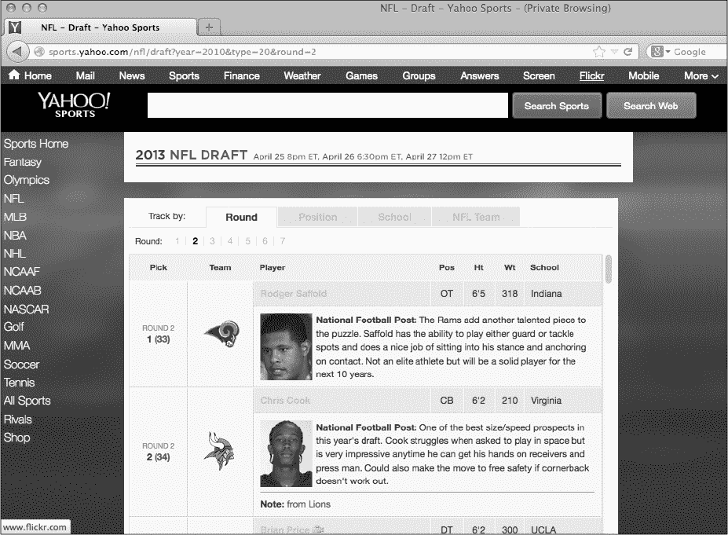
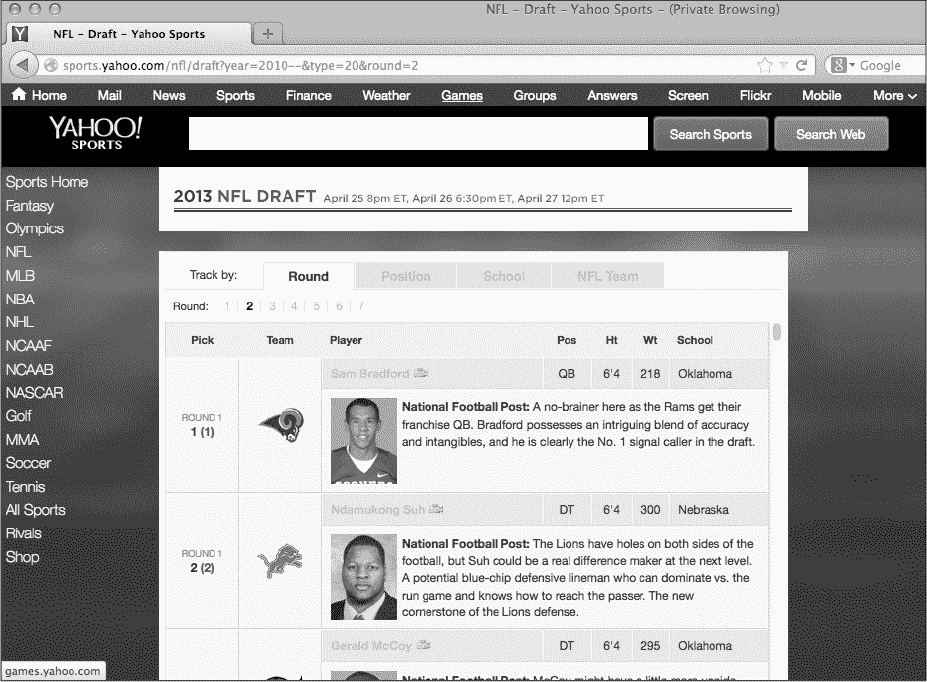
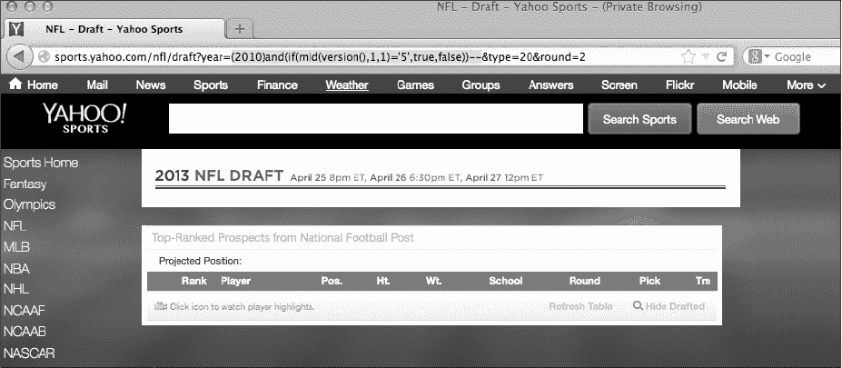

## 第九章：**SQL 注入**


当数据库支持的网站上的漏洞允许攻击者使用*SQL（结构化查询语言）*查询或攻击该站点的数据库时，这种攻击被称为*SQL 注入（SQLi）*。通常，SQLi 攻击的回报极高，因为它们可能造成严重损害：攻击者可以操纵或提取信息，甚至为自己创建数据库中的管理员登录。

### SQL 数据库

数据库将信息存储在包含字段的记录中，这些记录位于一组表中。表包含一个或多个列，表中的一行代表数据库中的一条记录。

用户依赖 SQL 来创建、读取、更新和删除数据库中的记录。用户向数据库发送 SQL 命令（语句或查询），然后—假设命令被接受—数据库解释语句并执行某些操作。常见的 SQL 数据库包括 MySQL、PostgreSQL、MSSQL 等。在本章中，我们将使用 MySQL，但这些基本概念适用于所有 SQL 数据库。

SQL 语句由关键字和函数组成。例如，以下语句告诉数据库从`users`表中的`name`列选择信息，条件是`ID`列的值等于`1`。

```
SELECT name FROM users WHERE id = 1;
```

许多网站依赖数据库来存储信息，并使用这些信息动态生成内容。例如，如果网站*https://www.<example>.com/*在数据库中存储了你以前的订单，当你使用账户登录时，你的网页浏览器将查询该网站的数据库，并根据返回的信息生成 HTML。

以下是服务器 PHP 代码的理论示例，展示了在用户访问*https://www.<example>.com?name=peter*后生成 MySQL 命令的过程：

```
   $name = ➊$_GET['name'];

   $query = "SELECT * FROM users WHERE name = ➋'$name' ";

➌ mysql_query($query);
```

代码使用`$_GET[]` ➊来访问 URL 参数中指定的 name 值，并将该值存储在`$name`变量中。然后，该参数被传递给`$query`变量 ➋，而没有进行任何清理。`$query`变量表示要执行的查询，并从`users`表中提取所有数据，其中`name`列的值与`name` URL 参数中的值匹配。查询通过将`$query`变量传递给 PHP 函数`mysql_query` ➌来执行。

该站点期望`name`包含常规文本。但如果用户在 URL 参数中输入恶意输入`test' OR 1='1`，例如`https://www.example.com?name=test' OR 1='1`，执行的查询将是：

```
$query = "SELECT * FROM users WHERE name = 'test➊' OR 1='1➋' ";
```

恶意输入关闭了`test`值后的单引号(`'`) ➊，并在查询末尾添加了 SQL 代码`OR 1='1`。`OR 1='1`中的悬挂单引号打开了硬编码在➋之后的闭合单引号。如果注入的查询没有包含一个开头的单引号，悬挂的引号将导致 SQL 语法错误，从而阻止查询的执行。

SQL 使用条件操作符`AND`和`OR`。在这种情况下，SQL 注入修改了`WHERE`子句，搜索`name`列匹配`test`或等式`1='1'`返回`true`的记录。MySQL 很贴心地将`'1'`视为整数，因为`1`总是等于`1`，所以条件为`true`，查询返回`users`表中的所有记录。但当查询的其他部分已被净化时，注入`test' OR 1='1`将不起作用。例如，你可能会使用像这样的查询：

```
$name = $_GET['name'];

$password = ➊mysql_real_escape_string($_GET['password']);

$query = "SELECT * FROM users WHERE name = '$name' AND password = '$password' ";
```

在这种情况下，`password`参数也是由用户控制的，但已正确净化➊。如果你使用相同的有效载荷，`test' OR 1='1`，作为用户名，并且密码为 12345，那么你的语句将如下所示：

```
$query = "SELECT * FROM users WHERE name = 'test' OR 1='1' AND password = '12345' ";
```

该查询会查找所有记录，其中`name`为`test`或`1='1'`，并且`password`为`12345`（我们将忽略这个数据库存储明文密码的事实，这是另一个漏洞）。因为密码检查使用了`AND`操作符，所以除非某条记录的密码是`12345`，否则该查询不会返回数据。尽管这破坏了我们尝试的 SQL 注入攻击，但它并没有阻止我们尝试其他攻击方法。

我们需要消除`password`参数，可以通过添加`;--, test' OR 1='1;--`来实现。这次注入完成了两个任务：分号（`;`）结束了 SQL 语句，而两个破折号（`--`）告诉数据库后面的文本是注释。这个注入参数将查询更改为`SELECT * FROM users WHERE name = 'test' OR 1='1';`。语句中的`AND password = '12345'`部分变成了注释，因此该命令会返回表中的所有记录。当使用`--`作为注释时，请记住，MySQL 要求在破折号后和剩余的查询之间有一个空格。否则，MySQL 将返回错误并不会执行命令。

### SQL 注入防范措施

防止 SQL 注入的一种保护措施是使用*预处理语句*，这是一种数据库特性，能够执行重复的查询。预处理语句的具体细节超出了本书的范围，但它们能防止 SQL 注入，因为查询不再是动态执行的。数据库像模板一样使用查询，并为变量留有占位符。因此，即使用户将未经净化的数据传递给查询，注入也无法修改数据库的查询模板，从而防止 SQL 注入。

网络框架，如 Ruby on Rails、Django、Symphony 等，也提供内置的保护措施来帮助防止 SQL 注入。但它们并不完美，无法在所有地方防止这种漏洞。你刚刚看到的两个简单的 SQL 注入示例通常不会在使用框架的网站上生效，除非网站开发人员没有遵循最佳实践或没有意识到保护措施并非自动提供。例如，网站*[`rails-sqli.org/`](https://rails-sqli.org/)*维护了 Rails 中由开发者错误导致的常见 SQL 注入模式列表。在测试 SQL 注入漏洞时，最好的办法是寻找看起来是定制开发的旧网站，或使用没有当前系统内置保护的 Web 框架和内容管理系统。

### Yahoo! Sports 盲 SQL 注入

**难度：** 中等

**网址：** *[`sports.yahoo.com`](https://sports.yahoo.com)*

**来源：** 无

**报告日期：** 2014 年 2 月 16 日

**赏金支付：** $3,705

*盲 SQL 注入*漏洞发生在你能够将 SQL 语句注入到查询中，但无法获取查询的直接输出时。利用盲注的关键是通过比较未修改和修改过的查询结果来推断信息。例如，在 2014 年 2 月，Stefano Vettorazzi 在测试 Yahoo! Sports 子域时发现了盲 SQL 注入。该页面通过 URL 接收参数，查询数据库以获取信息，并根据参数返回 NFL 球员的列表。

Vettorazzi 更改了以下网址，该网址返回了 2010 年的 NFL 球员，从这个：

*[sports.yahoo.com/nfl/draft?year=2010&type=20&round=2](http://sports.yahoo.com/nfl/draft?year=2010&type=20&round=2)*

改为如下：

*[sports.yahoo.com/nfl/draft?year=2010--&type=20&round=2](http://sports.yahoo.com/nfl/draft?year=2010--&type=20&round=2)*

Vettorazzi 在第二个网址的`year`参数中添加了两个连字符（`--`）。图 9-1 显示了 Vettorazzi 添加两个连字符之前 Yahoo!页面的样子。图 9-2 显示了 Vettorazzi 添加连字符后的结果。

图 9-1 中返回的球员与图 9-2 中返回的不同。我们看不到实际的查询，因为代码在网站的后台。但原始查询很可能将每个 URL 参数传递给一个 SQL 查询，查询大致如下：

```
SELECT * FROM players WHERE year = 2010 AND type = 20 AND round = 2;
```

通过在`year`参数中添加两个连字符，Vettorazzi 将查询改为如下：

```
SELECT * FROM PLAYERS WHERE year = 2010-- AND type = 20 AND round = 2;
```



*图 9-1：Yahoo!带有未修改年份参数的球员搜索结果*



*图 9-2：Yahoo!带有修改过的年份参数（包括--）的球员搜索结果*

这个 Yahoo!的漏洞略显不同，因为大多数（如果不是全部）数据库中的查询必须以分号结束。由于 Vettorazzi 只注入了两个破折号并将查询的分号注释掉，这个查询应该会失败，并返回错误或者没有记录。一些数据库可以处理没有分号的查询，因此 Yahoo!可能在使用这种功能，或者它的代码以其他方式处理了这个错误。无论如何，在 Vettorazzi 意识到查询返回了不同的结果之后，他尝试通过提交以下代码作为`year`参数来推断该网站使用的数据库版本：

```
(2010)and(if(mid(version(),1,1))='5',true,false))--
```

MySQL 数据库的`version()`函数返回当前使用的 MySQL 数据库版本。`mid`函数根据其第二和第三个参数返回传递给第一个参数的字符串的一部分。第二个参数指定子字符串的起始位置，第三个参数指定子字符串的长度。Vettorazzi 通过调用`version()`函数检查该网站是否使用 MySQL。然后，他通过传递`mid`函数的第一个参数为`1`（起始位置）和第二个参数为`1`（子字符串长度）来获取版本号的第一个数字。代码通过`if`语句检查 MySQL 版本的第一个数字。

`if`语句有三个参数：一个逻辑检查、检查为真时执行的操作，以及检查为假时执行的操作。在这种情况下，代码检查`version`的第一个数字是否为`5`；如果是，查询返回`true`。如果不是，查询返回`false`。

然后 Vettorazzi 将真/假输出与`year`参数通过`and`运算符连接，因此如果 MySQL 数据库的主版本是 5，2010 年的玩家将会出现在 Yahoo!网页上。这个查询之所以有效，是因为条件`2010 and true`会返回`true`，而`2010 and false`会返回`false`并且不返回任何记录。Vettorazzi 执行查询时没有返回任何记录，如图 9-3 所示，这意味着`version`返回的值的第一个数字不是`5`。



*图 9-3：当代码检查数据库版本是否以数字 5 开头时，Yahoo!的玩家搜索结果为空。*

这个漏洞是一个盲目 SQL 注入（blind SQLi），因为 Vettorazzi 不能直接在页面上注入查询并查看输出。但 Vettorazzi 仍然能够找到有关该站点的信息。通过插入布尔检查，比如版本检查的`if`语句，Vettorazzi 可以推断出他需要的信息。他本可以继续从 Yahoo!数据库中提取更多信息。但是，通过他的测试查询找到 MySQL 版本信息已经足够确认 Yahoo!存在这个漏洞。

#### *总结*

SQLi 漏洞像其他注入漏洞一样，并不总是很难利用。找到 SQLi 漏洞的一种方法是测试 URL 参数并查看查询结果是否有微妙的变化。在本例中，添加双短横线改变了 Vettorazzi 的基准查询结果，从而暴露了 SQLi 漏洞。

### Uber Blind SQLi

**难度：** 中等

**网址：** *http://sctrack.email.uber.com.cn/track/unsubscribe.do/*

**来源：** *[`hackerone.com/reports/150156/`](https://hackerone.com/reports/150156/)*

**报告日期：** 2016 年 7 月 8 日

**奖励金额：** $4,000

除了网页外，你还可以在其他地方发现盲 SQLi 漏洞，比如电子邮件链接。2016 年 7 月，Orange Tsai 收到了来自 Uber 的一封电子邮件广告。他注意到取消订阅链接中包含了一个 base64 编码的字符串作为 URL 参数。链接看起来像这样：

*http://sctrack.email.uber.com.cn/track/unsubscribe.do?p=eyJ1c2VyX2lkIjogIjU3NTUiLCAicmVjZWl2ZXIiOiAib3JhbmdlQG15bWFpbCJ9*

解码 `p` 参数值 `eyJ1c2VyX2lkIjogIjU3NTUiLCAicmVjZWl2ZXIiOiAib3JhbmdlQG15bWFpbCJ9` 使用 base64 返回的 JSON 字符串是 `{"user_id": "5755", "receiver": "orange@mymail"}`。对于解码后的字符串，Orange 在编码后的 `p` URL 参数中添加了代码 `and sleep(12) = 1`。这个无害的附加代码使得数据库响应取消订阅操作的时间延长至 12 秒 `{"user_id": "5755 and sleep(12)=1", "receiver": "orange@mymail"}`。如果网站存在漏洞，查询执行会评估 `sleep(12)`，并且在比较 `sleep` 命令的输出与 `1` 之前，执行会暂停 12 秒。在 MySQL 中，`sleep` 命令通常返回 0，因此这个比较会失败。但这并不重要，因为执行将至少延迟 12 秒。

在 Orange 重新编码修改后的负载并将其传递给 URL 参数后，他访问了取消订阅链接，确认 HTTP 响应至少延迟了 12 秒。意识到他需要更具体的 SQLi 证据以便发送给 Uber，他通过暴力破解导出了用户名、主机名和数据库名。通过这种方式，他证明了自己可以从 SQLi 漏洞中提取信息，而无需访问机密数据。

一个名为 `user` 的 SQL 函数返回数据库的用户名和主机名，形式为 *<user>*@*<host>*。由于 Orange 无法访问他注入的查询的输出，他无法直接调用 `user`。相反，Orange 修改了查询，增加了一个条件检查，当查询查找他的用户 ID 时，使用 `mid` 函数逐一比较数据库用户名和主机名字符串的每个字符。与之前的 Yahoo! Sports 盲 SQLi 漏洞类似，Orange 使用了比较语句和暴力破解来推导用户名和主机名字符串的每个字符。

例如，Orange 使用 `mid` 函数获取 `user` 函数返回值的第一个字符。然后他比较该字符是否等于 `'a'`，然后是 `'b'`，然后是 `'c'`，以此类推。如果比较语句为真，服务器将执行取消订阅命令。这个结果表明 `user` 函数的返回值的第一个字符与正在比较的字符相等。如果语句为假，服务器将不会尝试取消订阅 Orange。通过使用这种方法检查 `user` 函数返回值的每个字符，Orange 最终能够推导出整个用户名和主机名。

手动暴力破解一个字符串需要时间，因此 Orange 创建了一个 Python 脚本，代表他生成并提交有效负载给 Uber，具体如下：

```
➊ import json

   import string

   import requests

   from urllib import quote

   from base64 import b64encode

➋ base = string.digits + string.letters + '_-@.'

➌ payload = {"user_id": 5755, "receiver": "blog.orange.tw"}

➍ for l in range(0, 30):

    ➎ for i in base:

        ➏ payload['user_id'] = "5755 and mid(user(),%d,1)='%c'#"%(l+1, i)

        ➐ new_payload = json.dumps(payload)

           new_payload = b64encode(new_payload)

           r = requests.get('http://sctrack.email.uber.com.cn/track/unsubscribe.

   do?p='+quote(new_payload))

        ➑ if len(r.content)>0:

                   print i,

                   break
```

Python 脚本以五行`import`语句开始➊，这些语句加载了 Orange 需要用来处理 HTTP 请求、JSON 和字符串编码的库。

数据库的用户名和主机名可以由大写字母、小写字母、数字、连字符（`-`）、下划线（`_`）、@符号（`@`）或句点（`.`）的任意组合构成。在 ➋ 处，Orange 创建了 `base` 变量来保存这些字符。 ➌ 处的代码创建了一个变量来保存脚本发送到服务器的有效负载。 ➏ 处的代码是注入部分，使用了 ➍ 和 ➎ 处的 `for` 循环。

让我们详细查看 ➏ 处的代码。Orange 使用字符串`user_id`来引用他的用户 ID 5755，这个字符串在 ➌ 处已定义，以创建他的有效负载。他使用 `mid` 函数和字符串处理构造了一个类似于本章前面提到的 Yahoo! 漏洞的有效负载。有效负载中的 `%d` 和 `%c` 是字符串替换占位符。`%d` 表示一个数字数据，而 `%c` 表示字符数据。

有效负载字符串从第一个双引号（`"`)开始，到第二对双引号结束，在第三个百分号符号前结束 ➏ 处。第三个百分号符号告诉 Python 替换 `%d` 和 `%c` 占位符，并用括号中的百分号后面的值来替代它们。所以代码将 `%d` 替换为 `l+1`（变量 `l` 加上数字 `1`），将 `%c` 替换为变量 `i`。井号（`#`）是 MySQL 中另一种注释的方式，它将 Orange 的注入部分后面的查询内容标记为注释。

`l`和`i`变量是➍和➎处的循环迭代器。第一次进入➍处的`l in range (0,30)`时，`l`将是`0`。`l`的值是`user`函数返回的用户名和主机名字符串中的位置，脚本正在尝试暴力破解。一旦脚本确定了正在测试的用户名和主机名字符串中的位置，代码将在➎处进入一个嵌套循环，遍历`base`字符串中的每个字符。脚本第一次遍历这两个循环时，`l`将是`0`，`i`将是`a`。这些值会传递给➏处的`mid`函数，生成有效负载`"5755 and mid(user(),0,1)='a'#"。

在下一次嵌套`for`循环的迭代中，`l`的值仍然是`0`，`i`将是`b`，以创建有效负载`"5755 and mid(user(),0,1)='b'#"。`l`的位置将保持不变，随着循环遍历`base`中的每个字符来创建➏处的有效负载。

每次创建新的有效负载时，➐处的代码将有效负载转换为 JSON，使用`base64encode`函数对字符串重新编码，并发送 HTTP 请求到服务器。➑处的代码检查服务器是否返回消息。如果`i`中的字符与正在测试的位置的用户名子字符串匹配，脚本会停止测试该位置的字符，并继续测试`user`字符串中的下一个位置。嵌套循环会中断，并返回到➍处的循环，➍处的代码将`l`增加`1`，以测试用户名字符串的下一个位置。

这个概念证明让 Orange 确认数据库用户名和主机名是`sendcloud_w@10.9.79.210`，数据库名是`sendcloud`（要获取数据库名，将➏处的`user`替换为`database`）。在报告回应中，Uber 确认 SQLi 并未发生在其服务器上。注入发生在 Uber 使用的第三方服务器上，但 Uber 仍然支付了奖励。并非所有赏金项目都会这样做。Uber 可能支付了赏金，因为该漏洞允许攻击者从`sendcloud`数据库中导出 Uber 所有客户的电子邮件地址。

尽管像 Orange 一样编写自己的脚本来从一个易受攻击的网站转储数据库信息是可行的，但你也可以使用自动化工具。附录 A 包含了关于一种名为 sqlmap 的工具的信息。

#### *要点*

注意接受编码参数的 HTTP 请求。解码后，将查询注入请求中时，请确保重新编码有效负载，以确保一切仍然符合服务器预期的编码。

提取数据库名、用户名和主机名通常是无害的，但请确保这些操作在你参与的赏金项目的允许范围内。在某些情况下，`sleep`命令就足以证明概念。

### Drupal SQLi

**难度：** 难

**URL：** 任何使用 7.32 版本或更早版本的 Drupal 站点

**来源：** *[`hackerone.com/reports/31756/`](https://hackerone.com/reports/31756/)*

**报告日期：** 2014 年 10 月 17 日

**赏金支付：** $3,000

*Drupal* 是一个流行的开源内容管理系统，用于构建网站，类似于 Joomla! 和 WordPress。它是用 PHP 编写的，并且是 *模块化* 的，这意味着你可以将新的功能单元安装到 Drupal 网站中。每个 Drupal 安装都包含 *Drupal 核心*，它是一组运行平台的模块。这些核心模块需要连接到数据库，比如 MySQL。

2014 年，Drupal 发布了一个紧急安全更新，以修复 Drupal 核心的漏洞，因为所有的 Drupal 网站都容易受到 SQL 注入漏洞的攻击，匿名用户也可以轻易滥用这个漏洞。该漏洞的影响允许攻击者接管任何未修补的 Drupal 网站。Stefan Horst 发现了这个漏洞，当时他注意到 Drupal 核心的预处理语句功能存在一个 bug。

Drupal 的漏洞发生在 Drupal 的数据库应用程序编程接口（API）中。Drupal API 使用 PHP 数据对象（PDO）扩展，它是一个用于在 PHP 中访问数据库的 *接口*。接口是一个编程概念，它保证了函数的输入和输出，但不定义函数是如何实现的。换句话说，PDO 隐藏了数据库之间的差异，因此程序员可以使用相同的函数来查询和获取数据，而不管数据库的类型。PDO 支持预处理语句。

Drupal 创建了一个数据库 API 来使用 PDO 功能。该 API 创建了一个 Drupal 数据库抽象层，因此开发者不必直接使用自己的代码查询数据库。但他们仍然可以使用预处理语句，并且可以将代码与任何数据库类型一起使用。API 的具体细节超出了本书的范围。但你需要知道，API 会生成 SQL 语句来查询数据库，并且具有内建的安全检查来防止 SQL 注入漏洞。

记住，预处理语句可以防止 SQL 注入漏洞，因为攻击者无法通过恶意输入修改查询结构，即使输入没有经过清理。但如果注入发生在模板创建过程中，预处理语句也无法防止 SQL 注入漏洞。如果攻击者可以在模板创建过程中注入恶意输入，他们可以创建自己的恶意预处理语句。Horst 发现的漏洞就是因为 SQL 的 `IN` 子句，它用于查找存在于一组值中的值。例如，代码 `SELECT * FROM users WHERE name IN ('peter', 'paul', 'ringo');` 会从 `users` 表中选择 `name` 列值为 `peter`、`paul` 或 `ringo` 的数据。

为了理解为什么 `IN` 子句存在漏洞，我们来看看 Drupal API 背后的代码：

```
$this->expandArguments($query, $args);

$stmt = $this->prepareQuery($query);

$stmt->execute($args, $options);
```

`expandArguments`函数负责构建使用`IN`子句的查询。在`expandArguments`构建查询后，它将查询传递给`prepareQuery`，后者构建准备好的语句，而`execute`函数执行这些语句。为了理解这个过程的重要性，我们再来看一下`expandArguments`的相关代码：

```
   --snip--

➊ foreach(array_filter($args, `is_array`) as $key => $data) {

  ➋ $new_keys = array();

  ➌ foreach ($data as $i => $value) {

       --snip--

    ➍ $new_keys[$key . '_' . $i] = $value;

      }

     --snip--

   }
```

这段 PHP 代码使用了数组。PHP 可以使用关联数组，显式地定义键，如下所示：

```
['red' => 'apple', 'yellow' => 'banana']
```

该数组的键是`'red'`和`'yellow'`，而数组的值是箭头（`=>`）右侧的水果。

另外，PHP 也可以使用*结构化数组*，如下所示：

```
['apple', 'banana']
```

结构化数组的键是隐式的，基于值在列表中的位置。例如，`'apple'`的键是`0`，`'banana'`的键是`1`。

`foreach` PHP 函数遍历数组，并可以将数组的键和值分开。它还可以将每个键和值分别赋给变量，并将它们传递给代码块进行处理。在➊处，`foreach`获取数组的每个元素，并通过调用`array_filter($args, 'is_array')`验证传递给它的值是否为数组。经过声明确认它具有数组值后，它将每个数组的键赋值给`$key`，每个值赋给`$data`，用于`foreach`循环的每次迭代。代码会修改数组中的值以创建占位符，因此在➋处，代码初始化了一个新的空数组，用于稍后保存占位符值。

为了创建占位符，代码在➌处通过将每个键赋给`$i`，每个值赋给`$value`，遍历`$data`数组。然后在➍处，初始化于➋的`new_keys`数组包含了第一个数组的键与➌处的键的连接。代码的目标是创建看起来像`name_0`、`name_1`等数据占位符。

下面是使用 Drupal 的`db_query`函数查询数据库时，一个典型查询的样子：

```
db_query("SELECT * FROM {users} WHERE name IN (:name)",

  array(':name'=>array('user1','user2')));
```

`db_query`函数接受两个参数：一个包含变量命名占位符的查询和一个用于替换这些占位符的值的数组。在这个例子中，占位符是`:name`，它是一个包含`'user1'`和`'user2'`值的数组。在结构化数组中，`'user1'`的键是`0`，`'user2'`的键是`1`。当 Drupal 执行`db_query`函数时，它调用`expandArguments`函数，将键与每个值连接。生成的查询使用`name_0`和`name_1`替代键，如下所示：

```
SELECT * FROM users WHERE name IN (:name_0, :name_1)
```

但是，当你使用关联数组调用`db_query`时，就会出现问题，以下是代码示例：

```
db_query("SELECT * FROM {users} where name IN (:name)",

  array(':name'=>array('test);-- ' => 'user1', 'test' => 'user2')));
```

在这种情况下，`:name`是一个数组，它的键是`'test);--'`和`'test'`。当`expandArguments`接收到`:name`数组并处理它以创建查询时，它生成了如下内容：

```
SELECT * FROM users WHERE name IN (:name_test);-- , :name_test)
```

我们已将注释注入到预处理语句中。之所以会发生这种情况，是因为`expandArguments`遍历每个数组元素以构建占位符，但假设传入的是结构化数组。在第一次迭代中，`$i`被赋值为`'test);--'`，`$value`被赋值为`'user1'`。`$key`为`':name'`，将其与`$i`结合后得到`name_test);--`。在第二次迭代中，`$i`被赋值为`'test'`，`$value`为`'user2'`。将`$key`与`$i`结合后得到`name_test`。

这种行为允许恶意用户将 SQL 语句注入到依赖`IN`子句的 Drupal 查询中。这个漏洞影响了 Drupal 的登录功能，使得 SQLi 漏洞变得非常严重，因为任何网站用户，包括匿名用户，都可能利用它。更糟糕的是，PHP PDO 默认支持一次执行多个查询。这意味着攻击者可以在用户登录查询中附加额外的查询，以执行非`IN`子句的 SQL 命令。例如，攻击者可以使用`INSERT`语句，将记录插入数据库，从而创建一个管理员用户，然后利用该用户登录网站。

#### *要点总结*

这个 SQLi 漏洞不仅仅是提交一个单引号并破坏查询那么简单。实际上，它需要理解 Drupal 核心的数据库 API 如何处理`IN`子句。这个漏洞的要点是要留意改变传递给网站的输入结构的机会。当 URL 将`name`作为参数时，可以尝试向参数添加`[]`以将其更改为数组，并测试网站如何处理它。

### 总结

SQL 注入（SQLi）可能是一个重大的漏洞，并且对网站非常危险。如果攻击者发现了 SQLi 漏洞，他们可能获得网站的全部权限。在某些情况下，SQLi 漏洞可以通过向数据库插入数据来提升权限，从而在网站上获得管理员权限，例如 Drupal 的例子。当你寻找 SQLi 漏洞时，应该关注能够向查询中传递未转义的单引号或双引号的地方。当你发现漏洞时，漏洞存在的迹象可能很微妙，比如盲注。你还应该寻找那些可以以意外方式向网站传递数据的地方，例如你可以在请求数据中替换数组参数的地方，就像 Uber 的漏洞一样。
