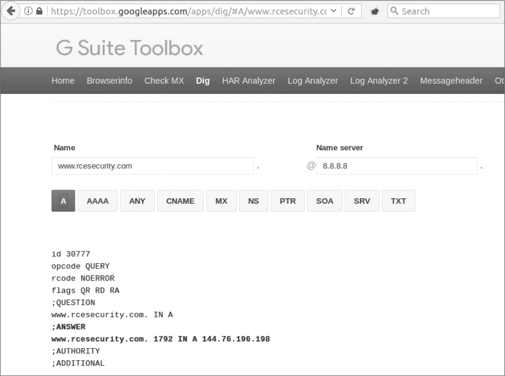

## **10

服务器端请求伪造（SSRF）**


*服务器端请求伪造（SSRF）* 漏洞使攻击者能够让服务器执行未预期的网络请求。与跨站请求伪造（CSRF）漏洞类似，SSRF 利用另一个系统执行恶意行为。CSRF 是利用另一个用户，而 SSRF 则是利用目标应用服务器。与 CSRF 一样，SSRF 漏洞的影响和执行方式可能有所不同。然而，仅仅因为你能够让目标服务器向其他任意服务器发送请求，并不意味着目标应用程序本身存在漏洞。该应用程序可能故意允许这种行为。因此，理解如何在发现潜在 SSRF 时展示影响非常重要。

### 展示服务器端请求伪造的影响

根据网站的组织结构，容易受到 SSRF 攻击的服务器可能会向内部网络或外部地址发出 HTTP 请求。受影响服务器发出请求的能力决定了你可以通过 SSRF 做些什么。

一些较大的网站设置了防火墙，禁止外部互联网流量访问内部服务器。例如，网站通常会设置有限数量的对外开放的服务器，这些服务器接收来自访问者的 HTTP 请求，并将请求转发到其他无法公开访问的服务器。一个常见的例子是数据库服务器，通常无法直接访问互联网。当你登录与数据库服务器通信的网站时，你可能会通过常规的网页表单提交用户名和密码。网站接收你的 HTTP 请求后，会使用你的凭据向数据库服务器发出请求。然后，数据库服务器会向 Web 应用服务器响应信息，Web 应用服务器会将这些信息转发给你。在这个过程中，你通常并不意识到远程数据库服务器的存在，且不应该直接访问该数据库。

允许攻击者控制请求到内部服务器的易受攻击服务器可能会暴露私人信息。例如，如果在前述的数据库示例中存在 SSRF 漏洞，攻击者可能会发送请求到数据库服务器并获取他们本不应访问的信息。SSRF 漏洞为攻击者提供了访问更广泛网络的机会，可以作为目标。

假设你发现了 SSRF 漏洞，但受影响的网站没有内部服务器，或者这些服务器无法通过漏洞访问。在这种情况下，检查是否可以通过受影响服务器向任意外部站点发出请求。如果你能利用目标服务器与自己控制的服务器进行通信，你可以使用从中请求的信息进一步了解目标应用程序所使用的软件。你也许还可以控制其响应。

例如，如果易受攻击的服务器遵循重定向，你可能能够将外部请求转换为内部请求，这是 Justin Kennedy 向我指出的一个技巧。在某些情况下，网站可能不允许访问内部 IP，但会与外部网站通信。如果是这样，你可以返回一个状态码为 301、302、303 或 307 的 HTTP 响应，这些都是重定向类型。由于你控制响应，你可以将重定向指向内部 IP 地址，以测试服务器是否会遵循 301 响应并发起对内部网络的 HTTP 请求。

另外，你也可以利用服务器的响应来测试其他漏洞，例如 SQL 注入（SQLi）或跨站脚本（XSS），如在“通过 SSRF 响应攻击用户”一节中所讨论的，第 98 页提供了相关内容。这是否成功取决于目标应用如何使用伪造请求的响应，但在这些情况下，富有创意通常会有所帮助。

最不具影响力的情况是，当 SSRF 漏洞仅允许你与有限数量的外部网站进行通信时。在这些情况下，你可能会利用配置错误的黑名单。例如，假设一个网站可以与*www.<example>.com*进行外部通信，但仅验证提供的 URL 是否以*<example>.com*结尾。攻击者可以注册*attacker<example>.com*，从而让攻击者控制目标站点的响应。

### 调用 GET 与 POST 请求

在确认你可以提交 SSRF 后，验证你是否能调用`GET`或`POST` HTTP 方法来利用该站点。如果攻击者能够控制`POST`参数，那么 HTTP `POST`请求可能会更具影响力；`POST`请求通常会触发状态改变行为，比如创建用户账户、调用系统命令或执行任意代码，具体取决于易受攻击的服务器能与哪些其他应用程序通信。而 HTTP `GET`请求则通常与数据外泄有关。由于`POST`请求的 SSRF 可能会很复杂，且依赖于系统环境，本章将重点讨论使用`GET`请求的漏洞。要了解更多关于基于`POST`请求的 SSRF，请阅读 Orange Tsai 在 2017 年黑帽大会上的演讲幻灯片，链接为*[`www.blackhat.com/docs/us-17/thursday/us-17-Tsai-A-New-Era-Of-SSRF-Exploiting-URL-Parser-In-Trending-Programming-Languages.pdf`](https://www.blackhat.com/docs/us-17/thursday/us-17-Tsai-A-New-Era-Of-SSRF-Exploiting-URL-Parser-In-Trending-Programming-Languages.pdf)*。

### 执行盲 SSRF 攻击

在确认可以在哪里以及如何发起请求之后，考虑是否能够访问请求的响应。如果无法访问响应，那你就发现了一个*盲 SSRF*。例如，攻击者可能通过 SSRF 访问了内部网络，但无法读取对内部服务器请求的 HTTP 响应。因此，他们需要找到另一种方式来提取信息，通常是通过计时攻击或使用域名系统（DNS）。

在某些盲目 SSRFs 中，响应时间可能会揭示与服务器交互的信息。利用响应时间的一种方式是对不可访问的服务器进行*端口扫描*。*端口*在服务器之间传递信息。你可以通过发送请求并查看是否有响应来扫描服务器上的端口。例如，你可以尝试通过端口扫描内部服务器来利用内网中的 SSRF。通过这种方式，你可能会根据是否有来自已知端口（如端口 80 或 443）的响应在 1 秒钟或 10 秒钟内返回，从而判断服务器是开放、关闭还是被过滤的。*过滤端口*就像是一个通信黑洞。它们不会回复请求，因此你永远无法知道它们是开放还是关闭，且请求会超时。相反，快速的回复可能意味着服务器是开放并接受通信，或者是关闭并且不接受通信。当你利用 SSRF 进行端口扫描时，可以尝试连接到常见的端口，如 22（用于 SSH）、80（HTTP）、443（HTTPS）、8080（备用 HTTP）和 8443（备用 HTTPS）。你将能够确认响应是否不同，并从这些差异中推断出信息。

DNS 是互联网的地图。你可以尝试通过内部系统调用 DNS 请求，并控制请求的地址，包括子域名。如果成功，你可能能够通过盲目 SSRF 漏洞偷运信息。为了以这种方式利用盲目 SSRF，你将偷运的信息作为子域名附加到你自己的域名上。目标服务器随后会对该子域名进行 DNS 查找，指向你的网站。例如，假设你发现了一个盲目 SSRF 漏洞，并且能够在服务器上执行有限的命令，但无法读取任何响应。如果你能在控制查找域名的同时调用 DNS 查找，你可以将 SSRF 输出添加到子域名，并使用`whoami`命令。这种技术通常被称为*带外（OOB）信息外泄*。当你在子域名上使用`whoami`命令时，易受攻击的网站会向你的服务器发送一个 DNS 请求。你的服务器会接收到对*data.<yourdomain>.com*的 DNS 查找，其中*data*是易受攻击的服务器上`whoami`命令的输出。由于 URL 只能包含字母数字字符，你需要使用 base32 编码来对数据进行编码。

### 利用 SSRF 响应攻击用户

当你无法直接攻击内部系统时，可以尝试利用影响用户或应用程序本身的 SSRF。如果你的 SSRF 不是盲目型的，可以通过向 SSRF 请求返回恶意响应来实现攻击，比如跨站脚本（XSS）或 SQL 注入（SQLi）有效载荷，这些攻击会在易受攻击的网站上执行。如果其他用户经常访问存储型 XSS 有效载荷，那么它特别重要，因为你可以利用这些有效载荷攻击用户。例如，假设 *www.<example>.com/picture?url=* 接受一个 URL 来为你的账户资料加载图片。如果你向自己的站点提交一个返回带有 XSS 有效载荷的 HTML 页面的网址，那么完整的网址会是 *www.<example>.com/picture?url=<attacker>.com/xss*。如果 *www.<example>.com* 保存了有效载荷的 HTML 并将其作为个人资料图片渲染，那么该站点就存在存储型 XSS 漏洞。但如果该站点渲染了 HTML 有效载荷并没有保存，你仍然可以测试该站点是否为该操作阻止了 CSRF。如果没有阻止，你可以将链接 *www.<example>.com/picture?url=<attacker>.com/xss* 分享给目标。如果目标访问了该链接，SSRF 将触发 XSS，并向你的站点发出请求。

当你寻找 SSRF 漏洞时，留意是否有机会将 URL 或 IP 地址作为某些网站功能的一部分提交。然后考虑如何利用这种行为来与内部系统通信，或将其与其他类型的恶意行为结合。

### ESEA SSRF 和查询 AWS 元数据

**难度：** 中等

**URL：** *[`play.esea.net/global/media_preview.php?url=/`](https://play.esea.net/global/media_preview.php?url=/)*

**来源：** *[`buer.haus/2016/04/18/esea-server-side-request-forgery-and-querying-aws-meta-data/`](http://buer.haus/2016/04/18/esea-server-side-request-forgery-and-querying-aws-meta-data/)*

**报告日期：** 2016 年 4 月 11 日

**奖励金额：** $1,000

在某些情况下，你可以通过多种方式利用并展示 SSRF 的影响。电子竞技娱乐协会（ESEA），一个竞争性视频游戏社区，在 2016 年启动了一个自营的漏洞奖励计划。ESEA 启动该计划后，Brett Buerhaus 通过*Google dorking*快速搜索以*.php*扩展名结尾的 URL。Google dorking 使用 Google 搜索关键词来指定搜索的执行位置和目标信息类型。Buerhaus 使用了查询*site:[`play.esea.net/`](https://play.esea.net/) ext:php*，这告诉 Google 仅返回以*.php*结尾的*https://play.esea.net/*网站的结果。旧版网站设计通常会使用以*.php*结尾的网页，这可能表明该页面使用了过时的功能，因此是查找漏洞的好地方。当 Buerhaus 进行搜索时，他收到了 URL*[`play.esea.net/global/media_preview.php?url=`](https://play.esea.net/global/media_preview.php?url=)*作为结果之一。

这个结果之所以引人注目，是因为其中的`url=`参数。这个参数表明 ESEA 可能正在渲染由 URL 参数定义的外部网站内容。在寻找 SSRF 漏洞时，URL 参数是一个警示信号。为了开始测试，Buerhaus 将自己的域名插入到该参数中，构造出 URL*[`play.esea.net/global/media_preview.php?url=http://ziot.org`](https://play.esea.net/global/media_preview.php?url=http://ziot.org)*。他收到了一个错误信息，表明 ESEA 期望该 URL 返回一张图片。于是他尝试了 URL*[`play.esea.net/global/media_preview.php?url=http://ziot.org/1.png`](https://play.esea.net/global/media_preview.php?url=http://ziot.org/1.png)*，并成功了。

验证文件扩展名是确保功能安全的常见方法之一，在这种方法中，用户可以控制会发起服务器请求的参数。ESEA 将 URL 渲染限制为图像，但这并不意味着它正确地验证了 URL。Buerhaus 在 URL 中添加了一个空字节(*%00*)来开始他的测试。在需要程序员手动管理内存的编程语言中，空字节用于终止字符串。根据网站实现功能的方式，添加空字节可能会导致网站提前结束 URL。如果 ESEA 存在漏洞，网站就会将请求发送到*https://play.esea.net/global/media_preview.php?url=http://ziot.org%00/1.png*，而不是按预期发出请求到*[`play.esea.net/global/media_preview.php?url=http://ziot.org`](https://play.esea.net/global/media_preview.php?url=http://ziot.org)*。但 Buerhaus 发现，添加空字节并没有奏效。

接下来，他尝试添加更多的正斜杠，它们将 URL 的各个部分分开。多个正斜杠后面的输入通常会被忽略，因为多个斜杠不符合 URL 的标准结构。Buerhaus 希望站点会发起请求到 *[`play.esea.net/global/media_preview.php?url=http://ziot.org`](https://play.esea.net/global/media_preview.php?url=http://ziot.org)*，而不是 *[`play.esea.net/global/media_preview.php?url=http://ziot.org///1.png`](https://play.esea.net/global/media_preview.php?url=http://ziot.org///1.png)*。这个测试也失败了。

在他的最后一次尝试中，Buerhaus 将其 URL 中的 *1.png* 从 URL 的一部分改为一个参数，通过将正斜杠转换为问号。因此，他提交的 URL 从 *[`play.esea.net/global/media_preview.php?url=http://ziot.org/1.png`](https://play.esea.net/global/media_preview.php?url=http://ziot.org/1.png)* 改为了 *[`play.esea.net/global/media_preview.php?url=http://ziot.org?1.png`](https://play.esea.net/global/media_preview.php?url=http://ziot.org?1.png)*。第一个 URL 向他的网站提交请求，查找 */1.png*。但第二个 URL 使请求发送到网站的主页 *[`ziot.org`](http://ziot.org)*，并将 *1.png* 作为请求中的参数。因此，ESEA 渲染了 Buerhaus 的 *[`ziot.org`](http://ziot.org)* 网页。

Buerhaus 已确认他可以发起外部 HTTP 请求，并且网站会呈现响应——这是一个很有前景的开始。但向任何服务器发起请求可能是公司可以接受的风险，前提是服务器不会泄露信息，或者网站不会对 HTTP 响应做任何处理。为了提升 SSRF 的严重性，Buerhaus 在他的服务器响应中返回了一个 XSS payload，正如在 “通过 SSRF 响应攻击用户” 中描述的那样，参见 第 98 页。

他将这个漏洞与 Ben Sadeghipour 分享，看看他们是否能将其提升为更严重的漏洞。Sadeghipour 建议提交 *http://169.254.169.254/latest/meta-data/hostname*。这是 Amazon Web Services (AWS) 为其托管的网站提供的一个 IP 地址。如果 AWS 服务器向该 URL 发送 HTTP 请求，AWS 会返回关于服务器的元数据。通常，这个功能有助于内部自动化和脚本处理。但该端点也可以用来访问私密信息。根据站点的 AWS 配置，端点 *http://169.254.169.254/latest/meta-data/iam/security-credentials/* 会返回执行请求的服务器的身份访问管理 (IAM) 安全凭证。由于 AWS 安全凭证配置较为复杂，账户通常会比实际需要的权限更多。如果能够访问这些凭证，你可以使用 AWS 命令行控制用户有权限访问的任何服务。ESEA 确实托管在 AWS 上，服务器的内部主机名被返回给了 Buerhaus。此时，他停止了操作并报告了该漏洞。

#### *总结*

Google dorking 可以在你寻找需要特定 URL 设置的漏洞时节省时间。如果你使用该工具寻找 SSRF 漏洞，注意那些看起来正在与外部网站交互的目标 URL。在这个案例中，漏洞通过 URL 参数 `url=` 被暴露。当你发现 SSRF 漏洞时，要有宏大的视角。Buerhaus 本可以使用 XSS 载荷报告 SSRF，但那远没有访问网站的 AWS 元数据那样具有影响力。

### Google 内部 DNS SSRF

**难度：** 中等

**网址：** *[`toolbox.googleapps.com/`](https://toolbox.googleapps.com/)*

**来源：** *[`www.rcesecurity.com/2017/03/ok-google-give-me-all-your-internal-dns-information/`](https://www.rcesecurity.com/2017/03/ok-google-give-me-all-your-internal-dns-information/)*

**报告日期：** 2017 年 1 月

**奖励支付：** 未公开

有时，网站本应仅执行对外部站点的 HTTP 请求。当你发现具有此功能的网站时，检查是否可以滥用它来访问内部网络。

Google 提供了 *[`toolbox.googleapps.com`](https://toolbox.googleapps.com)* 网站，帮助用户调试他们在使用 Google G Suite 服务时遇到的问题。该服务的 DNS 工具引起了 Julien Ahrens 的注意（* [www.rcesecurity.com](http://www.rcesecurity.com) *），因为它允许用户执行 HTTP 请求。

Google 的 DNS 工具包括 dig，功能类似于 Unix 的 `dig` 命令，允许用户查询域名服务器以获取网站的 DNS 信息。DNS 信息将 IP 地址映射到可读的域名，如 *www.<example>.com*。在 Ahrens 发现该漏洞时，Google 包含了两个输入框：一个用于将 URL 映射为 IP 地址，另一个用于域名服务器，如 图 10-1 所示。



*图 10-1：谷歌 dig 工具的查询示例*

Ahrens 特别注意到 Name server 字段，因为它允许用户指定一个 IP 地址来指向 DNS 查询。这个重要的发现表明，用户可以将 DNS 查询发送到任何 IP 地址。

一些 IP 地址被保留用于内部使用。它们可以通过内部 DNS 查询发现，但不应该通过互联网访问。这些保留的 IP 范围包括：

+   10.0.0.0 到 10.255.255.255

+   100.64.0.0 到 100.127.255.255

+   127.0.0.0 到 127.255.255.255

+   172.16.0.0 到 172.31.255.255

+   192.0.0.0 到 192.0.0.255

+   198.18.0.0 到 198.19.255.255

此外，一些 IP 地址被保留用于特定目的。

为了开始测试 Name server 字段，Ahrens 将自己的网站作为要查找的服务器，并使用 IP 地址 127.0.0.1 作为 Name server。IP 地址 127.0.0.1 通常被称为*localhost*，服务器使用它来引用自己。在这个案例中，localhost 是执行 dig 命令的谷歌服务器。Ahrens 的测试结果是“服务器没有响应”错误。这个错误意味着工具尝试连接到自己的 53 号端口（响应 DNS 查询的端口）以获取关于 Ahrens 网站的信息，*[rcesecurity.com](http://rcesecurity.com)*。 wording "did not respond"（没有响应）非常重要，因为它意味着服务器允许内部连接，而如果是“permission denied”（拒绝权限）之类的词语就不一样。这一警示信号让 Ahrens 继续进行测试。

接下来，Ahrens 将 HTTP 请求发送到 Burp Intruder 工具，这样他就可以开始枚举 10.*x*.*x*.*x*范围内的内部 IP 地址。几分钟后，他收到来自一个内部 10\.IP 地址的响应（他故意没有透露是哪个 IP 地址），返回了一个空的 A 记录，这是 DNS 服务器返回的一种记录类型。尽管 A 记录为空，但它是 Ahrens 网站的记录：

```
id 60520

opcode QUERY

rcode REFUSED

flags QR RD RA

;QUESTION

www.rcesecurity.com IN A

;ANSWER

;AUTHORITY

;ADDITIONAL
```

Ahrens 发现了一个具有内部访问权限的 DNS 服务器，它会响应他的请求。一个内部 DNS 服务器通常不知道外部网站，这解释了空白的 A 记录。但该服务器应该知道如何映射到内部地址。

为了展示漏洞的影响，Ahrens 必须检索关于谷歌内部网络的信息，因为内部网络的信息不应该公开访问。一次快速的谷歌搜索显示，谷歌使用子域名*[corp.google.com](http://corp.google.com)*作为其内部站点的基础。因此，Ahrens 开始对*[corp.google.com](http://corp.google.com)*进行子域名暴力破解，最终发现了域名*ad.corp.google.com*。将这个子域名提交给 dig 工具，并请求早前找到的内部 IP 地址的 A 记录，返回了谷歌的私人 DNS 信息，内容远非空白：

```
id 54403

opcode QUERY

rcode NOERROR

flags QR RD RA

;QUESTION

ad.corp.google.com IN A

;ANSWER

ad.corp.google.com. 58 IN A 100.REDACTED

ad.corp.google.com. 58 IN A 172.REDACTED

ad.corp.google.com. 58 IN A 172.REDACTED

ad.corp.google.com. 58 IN A 172.REDACTED

ad.corp.google.com. 58 IN A 172.REDACTED

ad.corp.google.com. 58 IN A 172.REDACTED

ad.corp.google.com. 58 IN A 172.REDACTED

ad.corp.google.com. 58 IN A 172.REDACTED

ad.corp.google.com. 58 IN A 172.REDACTED

ad.corp.google.com. 58 IN A 172.REDACTED

ad.corp.google.com. 58 IN A 100.REDACTED

;AUTHORITY

;ADDITIONAL
```

请注意内部 IP 地址 `100.REDACTED` 和 `172.REDACTED` 的引用。相比之下，*ad.corp.google.com* 的公共 DNS 查询返回了以下记录，其中不包括 Ahrens 发现的私有 IP 地址信息：

```
dig A ad.corp.google.com @8.8.8.8

; <<>> DiG 9.8.3-P1 <<>> A ad.corp.google.com @8.8.8.8

;; global options: +cmd

;; Got answer:

;; ->>HEADER<<- opcode: QUERY, status: NXDOMAIN, id: 5981

;; flags: qr rd ra; QUERY: 1, ANSWER: 0, AUTHORITY: 1, ADDITIONAL: 0

;; QUESTION SECTION:

;ad.corp.google.com.    IN  A

;; AUTHORITY SECTION:

corp.google.com.  59  IN  SOA ns3.google.com. dns-admin.google.com. 147615698

900 900 1800 60

;; Query time: 28 msec

;; SERVER: 8.8.8.8#53(8.8.8.8)

;; WHEN: Wed Feb 15 23:56:05 2017

;; MSG SIZE  rcvd: 86
```

Ahrens 还使用 Google 的 DNS 工具请求了 *ad.corp.google.com* 的名称服务器，返回了以下结果：

```
id 34583

opcode QUERY

rcode NOERROR

flags QR RD RA

;QUESTION

ad.corp.google.com IN NS

;ANSWER

ad.corp.google.com. 1904 IN NS hot-dcREDACTED

ad.corp.google.com. 1904 IN NS hot-dcREDACTED

ad.corp.google.com. 1904 IN NS cbf-dcREDACTED

ad.corp.google.com. 1904 IN NS vmgwsREDACTED

ad.corp.google.com. 1904 IN NS hot-dcREDACTED

ad.corp.google.com. 1904 IN NS vmgwsREDACTED

ad.corp.google.com. 1904 IN NS cbf-dcREDACTED

ad.corp.google.com. 1904 IN NS twd-dcREDACTED

ad.corp.google.com. 1904 IN NS cbf-dcREDACTED

ad.corp.google.com. 1904 IN NS twd-dcREDACTED

;AUTHORITY

;ADDITIONAL
```

此外，Ahrens 还发现至少有一个内部域名可以公开访问：一个位于 *minecraft.corp.google.com* 的 Minecraft 服务器。

#### *要点*

请注意包含外部 HTTP 请求功能的网站。当你找到这些网站时，尝试使用私有网络 IP 地址 127.0.0.1 或示例中列出的 IP 范围，将请求指向内部。如果你发现了内部网站，尝试从外部源访问它们，以展示更大的影响。它们很可能只允许内部访问。

### 使用 Webhook 进行内部端口扫描

**难度：** 简单

**URL：** 不适用

**来源：** 不适用

**报告日期：** 2017 年 10 月

**赏金支付：** 未公开

*Webhook* 允许用户在某些操作发生时，要求一个网站向另一个远程网站发送请求。例如，一个电子商务网站可能允许用户设置一个 webhook，每当用户提交订单时，就将购买信息发送到远程网站。允许用户定义远程网站 URL 的 webhook 提供了 SSRF（服务器端请求伪造）的机会。但是，任何 SSRF 的影响可能是有限的，因为你不能总是控制请求或访问响应。

在 2017 年 10 月测试一个网站时，我注意到我可以创建自定义 webhook。所以我提交了一个 *http://localhost* 的 webhook URL，看看服务器是否会与自身通信。该网站表示这个 URL 不被允许，所以我又尝试了 *http://127.0.0.1*，但也返回了错误信息。没有气馁，我尝试以其他方式引用 127.0.0.1。网站 *[`www.psyon.org/tools/ip_address_converter.php?ip=127.0.0.1/`](https://www.psyon.org/tools/ip_address_converter.php?ip=127.0.0.1/)* 列出了几个替代的 IP 地址，包括 127.0.1、127.1 等等。两者似乎都有效。

提交报告后，我意识到我的发现的严重性不足以获得赏金。我展示的只是绕过了该站点的本地检查。为了有资格获得奖励，我必须证明我能够破坏该站点的基础设施或提取信息。

该网站还使用了一个名为“Web 集成”的功能，允许用户将远程内容导入到网站中。通过创建自定义集成，我可以提供一个远程 URL，返回一个 XML 结构供该站点解析并为我的账户呈现。

一开始，我提交了 127.0.0.1，并希望网站能披露有关响应的信息。结果，网站显示了错误 500“无法连接”，而没有返回有效的内容。这个错误看起来很有前景，因为网站披露了关于响应的信息。接着，我检查是否能够与服务器上的端口进行通信。我回到集成配置，提交了 127.0.0.1:443，这是访问服务器的 IP 地址和端口号之间用冒号分隔的形式。我想看看网站是否能够在端口 443 上通信。再次，我收到了错误 500“无法连接”。对于端口 8080，我也收到了相同的错误。然后，我尝试了端口 22，它通过 SSH 连接。这次错误是 503，“无法检索所有头信息”。

中奖了。“无法检索所有头信息”的响应将 HTTP 流量发送到一个期望 SSH 协议的端口。这种响应不同于 500 错误响应，因为它确认可以建立连接。我重新提交了报告，展示我可以利用 Web 集成功能对公司内部服务器进行端口扫描，因为不同的端口（开放/关闭或过滤）返回了不同的响应。

#### *要点总结*

如果你可以提交 URL 来创建 Web 钩子或故意导入远程内容，尝试定义特定的端口。服务器对不同端口的响应方式的细微变化可以揭示端口是否开放、关闭或被过滤。除了服务器返回的消息差异外，端口的响应时间也可能揭示它们是开放、关闭还是被过滤的。

### 总结

SSRF（服务器端请求伪造）发生在攻击者可以利用服务器执行未预期的网络请求时。但并不是所有请求都可以被利用。例如，一个网站允许你向远程或本地服务器发起请求，并不意味着这个请求具有重要性。识别出能够发起未预期请求的能力只是发现这些漏洞的第一步。报告这些漏洞的关键在于展示其行为的完整影响。在本章中的每个例子里，网站都允许发起 HTTP 请求。但它们没有充分保护自己的基础设施，防止恶意用户的攻击。
