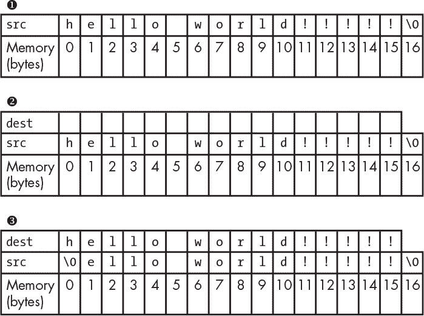
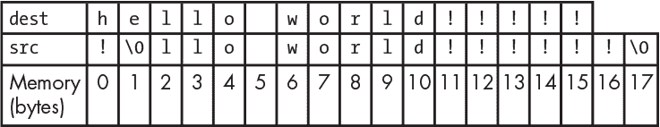

## **13

内存漏洞**


每个应用程序都依赖计算机内存来存储和执行应用程序的代码。*内存漏洞*是利用应用程序内存管理中的错误的攻击。攻击导致意外的行为，可能使攻击者能够注入并执行他们自己的命令。

内存漏洞通常发生在开发人员负责应用程序内存管理的编程语言中，如 C 和 C++。其他语言如 Ruby、Python、PHP 和 Java 则为开发人员管理内存分配，因此这些语言对内存漏洞的易受攻击性较低。

在执行任何 C 或 C++中的动态操作之前，开发人员必须确保为该操作分配了足够的内存。例如，假设你正在编写一个动态银行应用程序，允许用户导入交易记录。当应用程序运行时，你无法预知用户会导入多少交易记录。有人可能只导入一条记录，也有人可能导入一千条。在没有内存管理的语言中，你必须检查导入的交易记录数，然后为它们分配适当的内存。当开发人员没有考虑到为应用程序分配所需的内存时，就可能发生如缓冲区溢出之类的错误。

查找和利用内存漏洞是复杂的，关于这个主题已经写了整本书。因此，本章仅通过介绍其中两种内存漏洞——缓冲区溢出和越界读取漏洞——来简要介绍该主题。如果你有兴趣深入了解，建议阅读 Jon Erickson 的《Hacking: The Art of Exploitation》或 Tobias Klein 的《A Bug Hunter’s Diary: A Guided Tour Through the Wilds of Software Security》；这两本书都可以在 No Starch Press 购买。

### 缓冲区溢出

*缓冲区溢出*漏洞是指应用程序写入的数据超过了为该数据分配的内存（即*缓冲区*）。缓冲区溢出会导致程序行为不可预测，最严重的情况下还可能导致严重的安全漏洞。当攻击者能够控制溢出并执行他们自己的代码时，他们可能会危及应用程序，甚至根据用户权限，危及服务器。这种漏洞类似于第十二章中的 RCE 示例。

缓冲区溢出通常发生在开发者忘记检查写入变量的数据大小时。当开发者计算数据所需内存时出错，也可能发生溢出。由于这些错误可能通过多种方式发生，我们这里只检查其中一种——*缺少长度检查*。在 C 语言中，缺少长度检查通常涉及会改变内存的函数，如`strcpy()`和`memcpy()`。但这些检查也可能发生在开发者使用内存分配函数时，如`malloc()`或`calloc()`。`strcpy()`（和`memcpy()`）函数有两个参数：一个用于复制数据的缓冲区和要复制的数据。以下是 C 语言中的一个例子：

```
 #include <string.h>

 int main()

 {

➊ char src[16]="hello world";

➋ char dest[16];

➌ strcpy(dest, src);

➍ printf("src is %s\n", src);

   printf("dest is %s\n", dest);

   return 0;

 }
```

在这个例子中，字符串`src` ➊被设置为字符串`"hello world"`，它的长度是 11 个字符，包括空格。此代码为`src`和`dest` ➋分配了 16 个字节（每个字符 1 个字节）。因为每个字符需要 1 个字节的内存，并且字符串必须以空字节（`\0`）结尾，`"hello world"`字符串总共需要 12 个字节，这在 16 字节的分配范围内。接着，`strcpy()`函数将`src`中的字符串复制到`dest` ➌。在➍处的`printf`语句输出如下：

```
src is hello world

dest is hello world
```

这段代码按预期工作，但如果有人真的想强调这个问候语呢？考虑这个例子：

```
 #include <string.h>

 #include <stdio.h>

 int main()

 {

➊ char src[17]="hello world!!!!!";

➋ char dest[16];

➌ strcpy(dest, src);

   printf("src is %s\n", src);

   printf("dest is %s\n", dest);

   return 0;

 }
```

在这里，添加了五个感叹号，使得字符串的总字符数达到了 16 个。开发者记得所有字符串在 C 语言中必须以空字节（`\0`）结尾。他们为`src` ➊分配了 17 个字节，但忘记为`dest` ➋做相同的操作。在编译并运行程序后，开发者将看到如下输出：

```
src is

dest is hello world!!!!!
```

尽管`src`变量被赋值为`'hello world!!!!!'`，但它为空。这是因为 C 语言是如何分配*栈内存*的。栈内存地址是递增分配的，所以程序中较早定义的变量会拥有比后面定义的变量更低的内存地址。在这个例子中，`src`被加入到内存栈中，接着是`dest`。当溢出发生时，17 个字符的`'hello world!!!!!!'`被写入到`dest`变量中，但字符串的空字节（`\0`）溢出到`src`变量的第一个字符处。因为空字节表示字符串的结束，`src`就显得是空的。

图 13-1 展示了每行代码从 ➊ 到 ➌ 执行时栈的状态。



*图 13-1：内存如何从 dest 溢出到 src*

在图 13-1 中，`src`被加入栈中并为该变量分配了 17 个字节，图中从 0 ➊开始标注。接着，`dest`被加入栈中，但只分配了 16 个字节 ➋。当`src`被复制到`dest`时，本应存储在`dest`中的最后一个字节溢出到`src`的第一个字节（字节 0） ➌。这使得`src`的第一个字节变成了空字节。

如果你在`src`中再添加一个感叹号，并将长度更新为 18，输出将如下所示：

```
src is !

dest is hello world!!!!!
```

`dest`变量只会保存`'hello world!!!!!'`，最后的感叹号和空字节将溢出到`src`。这将使`src`看起来仿佛只包含了字符串`'!'`。图 13-1➌中的内存将发生变化，变得像图 13-2 那样。



*图 13-2：两个字符从 dest 溢出到 src*

但是，如果开发者忘记了空字节并使用了字符串的确切长度，情况会怎样呢？

```
#include <string.h>

#include <stdio.h>

int main ()

{

  char ➊src [12]="hello world!";

  char ➋dest[12];

  strcpy(dest, src);

  printf("src is %s\n", src);

  printf("dest is %s\n", dest);

  return 0;

}
```

开发者在不考虑空字节的情况下计算字符串中的字符数，并在➊和➋位置分别为`src`和`dest`字符串分配 12 个字节。程序的其余部分将`src`字符串复制到`dest`中并打印结果，像之前的程序那样。假设开发者在 64 位处理器上运行这段代码。

由于在之前的示例中空字节溢出到`dest`，你可能会认为`src`会变成一个空字符串。但程序的输出将如下所示：

```
src is hello world!

dest is hello world!
```

在现代的 64 位处理器上，这段代码不会引起意外行为或缓冲区溢出。64 位机器上的最小内存分配是 16 字节（由于内存对齐设计，超出了本书的讨论范围）。在 32 位系统中，是 8 字节。由于`hello world!`只需要 13 字节，包括空字节，因此它不会溢出为`dest`变量分配的最小 16 字节。

### 越界读取

相比之下，*越界读取*漏洞可以让攻击者读取超出内存边界的数据。这个漏洞发生在应用程序读取了给定变量或操作的过多内存时。越界读取可能会泄露敏感信息。

一个著名的越界读取漏洞是*OpenSSL Heartbleed 漏洞*，它在 2014 年 4 月被披露。OpenSSL 是一个软件库，它允许应用程序服务器通过网络安全地进行通信，不用担心窃听者。通过 OpenSSL，应用程序可以识别通信对端的服务器。Heartbleed 允许攻击者在通信过程中读取任意数据，比如服务器的私钥、会话数据、密码等等，通过 OpenSSL 的服务器标识过程。

这个漏洞利用了 OpenSSL 的心跳请求功能，该功能向服务器发送消息，然后服务器返回相同的消息给请求者，以验证两台服务器的通信。心跳请求可能包含一个长度参数，而这个参数正是导致漏洞的因素。易受攻击的 OpenSSL 版本会根据请求中发送的长度参数分配内存给服务器的返回消息，而不是根据实际需要回显的消息大小。

因此，攻击者可以通过发送一个包含大长度参数的心跳请求来利用 Heartbleed 漏洞。假设一条消息是 100 字节，而攻击者发送了 1000 字节作为消息的长度。任何攻击者将此消息发送到的易受攻击的服务器都会读取预定的 100 字节消息以及另外 900 字节的任意内存。包括在这些任意数据中的信息取决于易受攻击服务器在处理请求时的运行进程和内存布局。

### PHP ftp_genlist() 整数溢出

**难度：** 高

**网址：** 不适用

**来源：** *[`bugs.php.net/bug.php?id=69545/`](https://bugs.php.net/bug.php?id=69545/)*

**报告日期：** 2015 年 4 月 28 日

**悬赏金额：** $500

管理内存的编程语言并非免疫于内存漏洞。尽管 PHP 自动管理内存，但该语言是用 C 编写的，而 C 确实需要手动管理内存。因此，内建的 PHP 函数可能会受到内存漏洞的影响。正如 Max Spelsberg 发现 PHP FTP 扩展中的缓冲区溢出问题一样。

PHP 的 FTP 扩展会读取传入的数据，如文件，来跟踪`ftp_genlist()`函数接收的数据大小和行数。大小和行数的变量被初始化为无符号整数。在 32 位机器上，无符号整数的最大内存分配为 2³²字节（4,294,967,295 字节或 4GB）。因此，如果攻击者发送超过 2³²字节的数据，缓冲区将发生溢出。

作为概念验证的一部分，Spelsberg 提供了 PHP 代码来启动 FTP 服务器以及 Python 代码来连接到该服务器。连接建立后，他的 Python 客户端通过套接字连接向 FTP 服务器发送了 2³² + 1 字节的数据。由于 Spelsberg 覆盖了内存，类似于前面讨论的缓冲区溢出例子，PHP FTP 服务器崩溃了。

#### *要点*

缓冲区溢出是一种众所周知且有详尽文档记录的漏洞类型，但你仍然可以在那些自行管理内存的应用程序中发现它们。即使你测试的应用程序不是用 C 或 C++编写的，如果应用程序是用其他可能容易出现内存管理错误的语言编写的，你仍然可能发现缓冲区溢出。在这种情况下，检查是否有遗漏的变量长度检查。

### Python Hotshot 模块

**难度：** 高

**网址：** 不适用

**来源：** *[`bugs.python.org/issue24481`](http://bugs.python.org/issue24481)*

**报告日期：** 2015 年 6 月 20 日

**悬赏金额：** $500

像 PHP 一样，Python 编程语言传统上是用 C 语言编写的。事实上，有时它被称为 CPython（也存在其他用不同语言编写的 Python 版本，包括 Jython、PyPy 等）。Python 的 hotshot 模块是现有 Python profile 模块的替代品。hotshot 模块描述了程序各个部分执行的频率和持续时间。由于 hotshot 是用 C 语言编写的，它的性能影响比现有的 profile 模块更小。但在 2015 年 6 月，John Leitch 发现代码中存在缓冲区溢出漏洞，攻击者可以将一个字符串从一个内存位置复制到另一个位置。

脆弱的代码调用了`memcpy()`方法，它将指定数量的内存字节从一个位置复制到另一个位置。例如，脆弱的代码可能看起来像下面这样：

```
memcpy(self->buffer + self->index, s, len);
```

`memcpy()` 方法接受三个参数：目标、源和要复制的字节数。在这个例子中，这些值分别是变量 `self->buffer + self->index`（缓冲区和索引长度的总和）、`s` 和 `len`。

`self->buffer` 目标变量的长度始终是固定的。但 `s`，源变量的长度可能是任意的。这意味着，在执行复制函数时，`memcpy()` 并不会验证它写入的缓冲区的大小。攻击者可以将比分配的字节数更长的字符串传递给该函数。该字符串会被写入目标并溢出，因此它会继续写入超出预定缓冲区的内存。

#### *要点*

查找缓冲区溢出的一种方法是查找函数`strcpy()`和`memcpy()`。如果找到了这些函数，请验证它们是否进行了适当的缓冲区长度检查。你需要从找到的代码开始向后追溯，以确认你能够控制源和目标，进而溢出分配的内存。

### Libcurl 读取越界

**Difficulty:** 高

**URL:** N/A

**Source:** *[`curl.haxx.se/docs/adv_20141105.html`](http://curl.haxx.se/docs/adv_20141105.html)*

**Date reported:** 2014 年 11 月 5 日

**Bounty paid:** $1,000

Libcurl 是一个免费的客户端 URL 传输库，cURL 命令行工具使用它来传输数据。Symeon Paraschoudis 发现了 libcurl `curl_easy_duphandle` 函数中的一个漏洞，该漏洞可能被利用来外泄敏感数据。

在使用 libcurl 进行传输时，你可以通过 `CURLOPT_POSTFIELDS` 标志传递数据进行 `POST` 请求。但执行此操作并不保证数据在操作过程中保持不变。为了确保数据在通过 `POST` 请求发送时不被更改，另一个标志 `CURLOPT_COPYPOSTFIELDS` 会复制数据的内容，并将副本与 `POST` 请求一起发送。内存区域的大小通过另一个名为 `CURLOPT_POSTFIELDSIZE` 的变量来设置。

为了复制数据，cURL 会分配内存。但复制数据的内部 libcurl 函数有两个问题：首先，错误地复制 `POST` 数据会导致 libcurl 将 `POST` 数据缓冲区视为 C 字符串。libcurl 会假设 `POST` 数据以空字节结尾。当数据没有以空字节结尾时，libcurl 会继续读取字符串，直到它找到空字节，这可能导致 libcurl 复制一个太小（如果空字节出现在 `POST` 主体中间）、太大的字符串，或者可能导致应用崩溃。其次，在复制数据后，libcurl 没有更新它应该读取数据的位置。这个问题出现在：在 libcurl 复制数据和读取数据之间，内存可能已经被清除或重新用于其他目的。如果发生了这些事件，位置可能包含一些不应该被发送的数据。

#### *重点总结*

cURL 工具是一个非常流行且稳定的库，用于通过网络传输数据。尽管它很受欢迎，但仍然存在一些 bug。任何涉及复制内存的功能都是寻找内存 bug 的好地方。与其他内存相关的问题一样，越界读取漏洞很难发现。但是，如果你从查找常见的易受攻击函数开始，你更有可能找到 bug。

### 总结

内存漏洞可能允许攻击者读取泄露的数据或运行他们自己的代码，但这些漏洞很难被发现。现代编程语言较少受到内存漏洞的影响，因为它们会处理自己的内存分配。但使用需要开发者手动分配内存的编程语言编写的应用程序仍然容易受到内存 bug 的影响。要发现内存漏洞，你需要了解内存管理，这可能是复杂的，甚至可能依赖于硬件。如果你想搜索这些类型的漏洞，我建议你还阅读一些专门研究这个话题的书籍。
