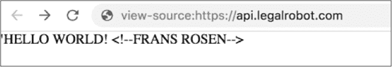

## **14

子域接管**

*子域接管*漏洞发生在恶意攻击者能够从一个合法站点获取子域名时。一旦攻击者控制了该子域名，他们就可以提供自己的内容或拦截流量。

### **理解域名**

要理解子域接管漏洞是如何工作的，我们首先需要了解域名的注册和使用方式。域名是访问网站的 URL，它们通过域名系统（DNS）映射到 IP 地址。域名是以层级结构组织的，每一部分由一个句点分隔。域名的最后一部分——最右边的部分——是*顶级域名*。顶级域名的例子包括*.com*、*.ca*、*.info*等。域名层级中的上一级是人们或公司注册的域名。这个层级部分用于访问网站。例如，假设*<example>.com*是一个已注册的域名，且其顶级域名是*.com*。接下来的层级是本章的重点：*子域名*。子域名是 URL 中最左边的部分，可以在同一注册域名下承载独立的网站。例如，如果 Example 公司有一个面向客户的网站，但还需要一个单独的电子邮件网站，它可以拥有单独的*www.<example>.com*和*webmail.<example>.com*子域名。这些子域名每一个都可以提供自己的网站内容。

网站所有者可以使用多种方法创建子域名，但最常见的两种方法是向网站的 DNS 记录中添加 A 记录或 CNAME 记录。*A 记录*将站点名称映射到一个或多个 IP 地址。*CNAME*应该是一个唯一的记录，将站点名称映射到另一个站点名称。只有站点管理员才能为站点创建 DNS 记录（当然，除非你发现了漏洞）。

### **子域接管是如何工作的**

当用户可以控制 A 记录或 CNAME 记录指向的 IP 地址或 URL 时，就会发生子域接管。这个漏洞的常见示例涉及到网站托管平台 Heroku。在一个典型的工作流程中，网站开发人员创建一个新应用并将其托管在 Heroku 上。然后，开发人员为其主站点的子域创建一个 CNAME 记录，并将该子域指向 Heroku。以下是一个可能出现问题的假设示例：

1.  Example 公司在 Heroku 平台上注册了一个账户，但没有使用 SSL。

1.  Heroku 为 Example 公司分配了子域名*[unicorn457.herokuapp.com](http://unicorn457.herokuapp.com)*来托管其新应用。

1.  Example 公司在其 DNS 提供商处创建了一个 CNAME 记录，将子域名*test.<example>.com*指向*[unicorn457.herokuapp.com](http://unicorn457.herokuapp.com)*。

1.  几个月后，Example 公司决定删除其*test.<example>.com*子域名。它关闭了 Heroku 账户并删除了服务器上的站点内容，但它没有删除 CNAME 记录。

1.  一个恶意的人注意到 CNAME 记录指向 Heroku 上一个未注册的 URL，并声明域名 *unicorn457.heroku.com*。

1.  攻击者现在可以从 *test.<example>.com* 提供他们自己的内容，由于 URL 的缘故，这看起来像是一个合法的 Example Company 网站。

如你所见，这种漏洞通常发生在一个网站没有删除指向攻击者可以控制的外部网站的 CNAME（或 A 记录）时。与子域接管相关的常见外部服务包括 Zendesk、Heroku、GitHub、Amazon S3 和 SendGrid。

子域接管的影响取决于子域和父域的配置。例如，在“Web Hacking Pro Tips #8” (*[`www.youtube.com/watch?v=76TIDwaxtyk`](https://www.youtube.com/watch?v=76TIDwaxtyk)*) 中，Arne Swinnen 描述了如何限定 cookies，使得浏览器只将存储的 cookies 发送到适当的域。但也可以通过仅将子域指定为一个点（如 *.<example>.com*）来限定 cookie，使得浏览器将 cookies 发送到所有子域。当一个网站采用这种配置时，浏览器会将 *<example>.com* 的 cookies 发送到用户访问的任何 Example Company 子域。如果攻击者控制了 *test.<example>.com*，他们可以从访问恶意的 *test.<example>.com* 子域的目标那里窃取 *<example>.com* 的 cookies。

另外，如果这些 cookies 没有这样被限定，恶意攻击者仍然可以在子域上创建一个模仿父域的网站。如果攻击者在子域上放置一个登录页面，他们可能会钓鱼用户提交其凭据。子域接管使得两种常见的攻击成为可能。但在以下示例中，我们还将探讨其他攻击方式，如电子邮件拦截。

查找子域接管漏洞需要查阅网站的 DNS 记录。一个很好的方法是使用 KnockPy 工具，它列举子域并搜索来自像 S3 这样的服务的常见子域接管相关错误消息。KnockPy 带有一份常见子域的测试列表，但你也可以提供自己的子域列表。GitHub 仓库 SecLists (*[`github.com/danielmiessler/SecLists/`](https://github.com/danielmiessler/SecLists/)*) 也列出了在其众多与安全相关的列表中常见的子域。

### **Ubiquiti 子域接管**

**难度：** 低

**URL：** *http://assets.goubiquiti.com/*

**来源：** *[`hackerone.com/reports/109699/`](https://hackerone.com/reports/109699/)*

**报告日期：** 2016 年 1 月 10 日

**赏金支付：** $500

Amazon Simple Storage（简称 S3）是由 Amazon Web Services（AWS）提供的文件托管服务。在 S3 上的账户是一个 *桶*，你可以通过一个特殊的 AWS URL 访问它，该 URL 以桶名开头。Amazon 为其桶的 URL 使用全球命名空间，这意味着一旦有人注册了一个桶，其他人就无法再注册它。例如，如果我注册了桶 *<example>*，它的 URL 将是 *<example>.s3.amazonaws.com*，并且我将拥有它。Amazon 还允许用户注册任何尚未被注册的名称，这意味着攻击者可以注册任何未被注册的 S3 桶。

在本报告中，Ubiquiti 创建了一个 CNAME 记录，将 *assets.goubiquiti.com* 指向 S3 桶 *uwn-images*。该桶可以通过 URL *uwn-images.s3.website.us-west-1.amazonaws.com* 访问。由于 Amazon 在全球拥有服务器，URL 中包含有关该桶所在的 Amazon 地理区域的信息。在本例中，*us-west-1* 是指北加利福尼亚。

但是 Ubiquiti 要么没有注册该桶，要么已经将其从 AWS 账户中移除，但忘记删除 CNAME 记录。因此，访问 *assets.goubiquiti.com* 仍会尝试从 S3 提供内容。结果，黑客声明了该 S3 桶，并向 Ubiquiti 报告了这个漏洞。

#### ***要点***

注意检查指向第三方服务如 S3 的 DNS 记录。当你发现此类记录时，确认该公司是否已正确配置该服务。除了对网站的 DNS 记录进行初步检查外，你还可以使用像 KnockPy 这样的自动化工具持续监控记录和服务。最好这样做，以防公司删除了子域名但忘记更新其 DNS 记录。

### **Scan.me 指向 Zendesk**

**难度：** 低

**URL：** *http://support.scan.me/*

**来源：** *[`hackerone.com/reports/114134/`](https://hackerone.com/reports/114134/)*

**报告日期：** 2016 年 2 月 2 日

**赏金支付：** $1,000

Zendesk 平台在网站的子域名上提供客户支持服务。例如，如果 Example 公司使用 Zendesk，其相关的子域名可能是 *support.<example>.com*。

类似于之前的 Ubiquiti 示例，*scan.me* 网站的所有者创建了一个 CNAME 记录，将 *support.scan.me* 指向 *[scan.zendesk.com](http://scan.zendesk.com)*。后来，Snapchat 收购了 *scan.me*。在收购时，*support.scan.me* 将子域名发布到 Zendesk，但忘记删除 CNAME 记录。黑客 harry_mg 找到了这个子域名，声明了 *[scan.zendesk.com](http://scan.zendesk.com)*，并通过 Zendesk 在其上提供了自己的内容。

#### ***要点***

关注公司收购情况，因为这可能会改变公司提供服务的方式。在母公司与收购公司之间进行优化时，一些子域可能会被删除。如果公司没有更新 DNS 记录，可能会导致子域接管。由于子域随时可能发生变化，最佳做法是在公司宣布收购后，持续检查记录。

### **Shopify Windsor 子域接管**

**难度：** 低

**网址：** *http://windsor.shopify.com/*

**来源：** *[`hackerone.com/reports/150374/`](https://hackerone.com/reports/150374/)*

**报告日期：** 2016 年 7 月 10 日

**赏金支付：**$500

并非所有子域接管都涉及在第三方服务上注册账户。2016 年 7 月，黑客 zseano 发现 Shopify 为*windsor.shopify.com*创建了一个 CNAME 记录，指向*aislingofwindsor.com*。他通过在网站*[crt.sh](http://crt.sh)*上搜索所有 Shopify 的子域发现了这一点，*crt.sh*跟踪了所有由网站注册的 SSL 证书以及证书关联的子域。这些信息之所以能够公开，是因为所有 SSL 证书都必须向证书授权机构注册，以便浏览器在你访问网站时验证证书的真实性。*crt.sh*网站随时间跟踪这些注册，并将信息提供给访问者。网站还可以注册通配符证书，提供 SSL 保护给该网站的任何子域。在*[crt.sh](http://crt.sh)*上，这通过在子域位置放置一个星号表示。

当一个网站注册通配符证书时，*crt.sh*(http://crt.sh)无法识别该证书使用的子域，但每个证书都包含一个唯一的哈希值。另一个网站*[censys.io](http://censys.io)*通过扫描互联网跟踪证书哈希值及其使用的子域。通过在*[censys.io](http://censys.io)*上搜索通配符证书哈希值，可能会帮助你识别新的子域。

通过浏览*[crt.sh](http://crt.sh)*上的子域列表并访问每个子域，zseano 注意到*windsor.shopify.com*返回了 404 页面未找到的错误。这意味着 Shopify 要么没有从该子域提供内容，要么它不再拥有*aislingofwindsor.com*。测试后者时，zseano 访问了一个域名注册网站，搜索了*aislingofwindsor.com*，并发现可以以$10 的价格购买该域名。他购买了该域名，并将这一漏洞报告给了 Shopify，作为子域接管漏洞。

#### ***要点总结***

并非所有子域名都涉及使用第三方服务。如果你发现某个子域名指向另一个域名并返回 404 页面，请检查是否能够注册该域名。网站*[crt.sh](http://crt.sh)*提供了一个很好的参考，列出了通过网站注册的 SSL 证书，可以作为识别子域名的初步步骤。如果通配符证书已在*[crt.sh](http://crt.sh)*注册，可以在*[censys.io](http://censys.io)*上搜索证书哈希。

### **Snapchat 快速接管事件**

**难度：** 中等

**URL：** *http://fastly.sc-cdn.net/takeover.html*

**来源：** *[`hackerone.com/reports/154425/`](https://hackerone.com/reports/154425/)*

**报告日期：** 2016 年 7 月 27 日

**悬赏金额：** $3,000

Fastly 是一个*内容分发网络（CDN）*。CDN 将内容的副本存储在全球各地的服务器上，这样可以为请求内容的用户提供更短的传输时间和距离。

2016 年 7 月 27 日，黑客 Ebrietas 向 Snapchat 报告称，其域名*sc-cdn.net*存在 DNS 配置错误。URL *http://fastly.sc-cdn.net* 有一个 CNAME 记录，指向一个 Snapchat 没有正确声明的 Fastly 子域名。当时，Fastly 允许用户在加密其流量并使用 Fastly 共享的通配符证书时，注册自定义子域名。错误配置自定义子域名会导致该域名出现错误信息，显示“Fastly 错误：未知域名：*<misconfigured domain>*。请检查此域名是否已添加到服务中。”

在报告该漏洞之前，Ebrietas 在*[censys.io](http://censys.io)*上查找了域名*sc-cdn.net*，并通过该域名 SSL 证书的注册信息确认了 Snapchat 对该域名的所有权。这一点很重要，因为域名*sc-cdn.net*并没有像*[snapchat.com](http://snapchat.com)*那样明确包含 Snapchat 的任何标识信息。他还配置了一个服务器来接收来自该 URL 的流量，以确认该域名确实在使用中。

在解决报告时，Snapchat 确认，只有极少数用户使用了旧版本的应用程序，这些用户会向该子域名请求未认证的内容。随后，这些用户的配置被更新，并指向了另一个 URL。理论上，攻击者可能在该短暂时间内通过该子域名向用户提供恶意文件。

#### ***要点总结***

注意观察指向返回错误消息的服务的网站。当你发现错误时，通过阅读它们的文档确认这些服务是如何使用的。然后检查你是否能找到 misconfigurations（配置错误），从而能够接管子域名。此外，始终做额外的确认步骤，以验证你认为是漏洞的部分。在这种情况下，Ebrietas 查找了 SSL 证书信息，确认 Snapchat 拥有该域名，然后报告。在此之后，他配置了自己的服务器来接收请求，确保 Snapchat 使用该域名。

### **Legal Robot 接管**

**难度：** 中等

**网址：** *https://api.legalrobot.com/*

**来源：** *[`hackerone.com/reports/148770/`](https://hackerone.com/reports/148770/)*

**报告日期：** 2016 年 7 月 1 日

**支付赏金：** $100

即使网站在第三方服务上正确配置了其子域名，这些服务本身也可能存在配置错误的漏洞。这正是 Frans Rosen 在 2016 年 7 月 1 日发现的，当时他向 Legal Robot 提交了一份报告。他通知公司，他有一个指向 *[Modulus.io](http://Modulus.io)* 的 *api.legalrobot.com* 的 DNS CNAME 记录，而他能够接管这个子域名。

正如你现在可能已经意识到的，看到这样的错误页面后，黑客的下一步应该是访问该服务以声明子域名。但是，尝试声明 *api.legalrobot.com* 时发生了错误，因为 Legal Robot 已经声明了该域名。

Rosen 没有放弃，而是尝试为 Legal Robot 声明通配符子域名 **.legalrobot.com**，该子域名可用。Modulus 的配置允许通配符子域名覆盖更具体的子域名，在这种情况下包括 *api.legalrobot.com*。在声明了通配符域名之后，Rosen 能够在 *api.legalrobot.com* 上托管自己的内容，如图 14-1 所示。

*图 14-1：HTML 页面源代码，作为 Frans Rosen 声称的子域名接管的概念验证*

请注意 Rosen 在图 14-1 中托管的内容。与发布一页尴尬的页面声明子域名已被接管不同，他使用了一页非侵入性的文本页面，并通过 HTML 注释确认他对该内容负责。

#### ***要点***

当网站依赖第三方服务来托管子域名时，他们也在依赖该服务的安全性。在这种情况下，Legal Robot 认为它已正确地在 Modulus 上声明了其子域名，但实际上该服务存在一个漏洞，允许通配符子域名覆盖所有其他子域名。还需要记住的是，如果你能够声明一个子域名，最好使用非侵入性的概念验证方式，以避免让你报告的公司感到尴尬。

### **Uber SendGrid 邮件接管**

**难度：** 中等

**网址：** *https://em.uber.com/*

**来源：** *[`hackerone.com/reports/156536/`](https://hackerone.com/reports/156536/)*

**报告日期：** 2016 年 8 月 4 日

**支付赏金：** $10,000

SendGrid 是一项基于云的电子邮件服务。在撰写本文时，Uber 是其客户之一。当黑客 Rojan Rijal 审查 Uber 的 DNS 记录时，他注意到 *em.uber.com* 的 CNAME 记录指向 SendGrid。

因为 Uber 有一个 SendGrid CNAME，Rijal 决定深入了解该服务，确认 Uber 是如何配置的。他的第一步是确认 SendGrid 提供的服务以及是否允许内容托管。结果并不允许。深入查看 SendGrid 的文档后，Rijal 发现了一个名为白标（white labeling）的选项。白标是一种功能，允许互联网服务提供商确认 SendGrid 已获得某个域名的许可，代表该域名发送电子邮件。这种许可是通过为指向 SendGrid 的站点创建 *邮件交换器 (MX)* 记录来授予的。MX 记录是一种 DNS 记录，指定一个负责代表域名发送和接收电子邮件的邮件服务器。接收方邮件服务器和服务会查询 DNS 服务器获取这些记录，以验证邮件的真实性并防止垃圾邮件。

白标功能引起了 Rijal 的注意，因为它涉及到信任一个第三方服务提供商来管理 Uber 的子域名。当 Rijal 审查 *em.uber.com* 的 DNS 记录时，他确认一个 MX 记录指向 *mx.sendgrid.net*。但只有站点所有者才能创建 DNS 记录（假设没有其他漏洞可被利用），因此 Rijal 无法直接修改 Uber 的 MX 记录来接管该子域名。于是，他转向了 SendGrid 的文档，其中描述了另一个名为 Inbound Parse Webhook 的服务。该服务允许客户解析传入邮件的附件和内容，然后将附件发送到指定的 URL。要使用该功能，站点需要：

1.  创建一个域名/主机名或子域名的 MX 记录，并将其指向 *mx.sendgrid.net*。

1.  将域名/主机名和解析 API 设置页面中的 URL 与 Inbound Parse Webhook 关联。

成功了。Rijal 已经确认 MX 记录存在，但 Uber 没有完成第二步。Uber 没有将 *em.uber.com* 子域名注册为 Inbound Parse Webhook。Rijal 将该域名注册为自己的，并设置了一个服务器来接收 SendGrid 解析 API 发送的数据。在确认他可以接收到邮件后，他停止拦截这些邮件并将问题报告给了 Uber 和 SendGrid。作为修复的一部分，SendGrid 确认它已增加了额外的安全检查，要求帐户在允许 Inbound Parse Webhook 之前验证其域名。因此，这项安全检查应该能保护其他网站免受类似的漏洞利用。

#### ***总结***

本报告展示了第三方文档的价值。通过阅读开发者文档，了解 SendGrid 提供的服务，并识别这些服务的配置方式，Rijal 找到了影响 Uber 的第三方服务漏洞。当目标网站使用第三方服务时，深入探索这些服务提供的所有功能至关重要。EdOverflow 维护着一个脆弱服务的列表，你可以在 *[`github.com/EdOverflow/can-i-take-over-xyz/`](https://github.com/EdOverflow/can-i-take-over-xyz/)* 找到这个列表。但即使他的列表标识某个服务为受保护的，也要确保再三检查，或像 Rijal 一样寻找替代方法。

### **总结**

子域名接管通常是由一个未被认领的 DNS 记录指向第三方服务导致的。本章中的例子包括 Heroku、Fastly、S3、Zendesk、SendGrid 以及未注册的域名，但其他服务也可能受到此类漏洞的影响。你可以使用像 KnockPy、*[crt.sh](http://crt.sh)* 和 *[censys.io](http://censys.io)* 这样的工具，以及 附录 A 中的其他工具，来发现这些漏洞。

管理接管可能需要额外的创意，比如当 Rosen 声明了一个通配符域名，而 Rijal 注册了一个自定义 webhook 时。当你发现一个潜在漏洞，但基本的利用方法不起作用时，一定要阅读服务文档。此外，不论目标网站是否正在使用某项功能，都要探索该服务提供的所有功能。当你确实找到一个接管漏洞时，确保提供漏洞的证据，但要以尊重和不打扰的方式进行。
