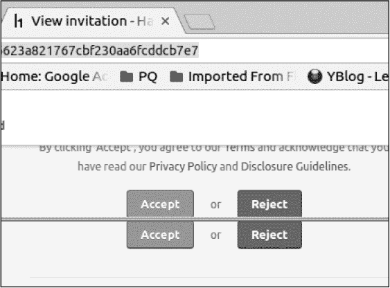

## **15

竞态条件**

*竞态条件* 是指当两个进程竞争完成时，基于一个在执行过程中变得无效的初始条件。一个经典的例子是银行账户之间的转账：

1.  你的银行账户里有$500，你需要将这笔钱全部转账给一个朋友。

1.  使用你的手机，你登录到银行应用并请求向你的朋友转账$500。

1.  10 秒后，转账请求仍在处理。于是你在笔记本上登录银行网站，看到余额仍然是$500，然后再次请求转账。

1.  笔记本和手机的请求在几秒钟内完成。

1.  你的银行账户现在是$0。

1.  你的朋友发信息告诉你他收到了$1,000。

1.  你刷新了账户页面，余额仍然是$0。

尽管这是一个不现实的竞态条件示例，因为（希望）所有银行都能防止资金凭空出现，但这个过程代表了大体的概念。步骤 2 和步骤 3 中的转账条件是，你的账户中有足够的资金来发起转账。但账户余额只会在每次转账过程开始时进行验证。当转账执行时，初始条件已经不再有效，但两个过程仍然完成。

当你拥有快速的互联网连接时，HTTP 请求似乎是瞬时完成的，但请求的处理仍然需要时间。当你登录到一个网站时，你发送的每个 HTTP 请求都必须经过接收网站的重新身份验证；此外，网站还必须加载完成请求所需的数据。竞态条件可能发生在 HTTP 请求完成这两个任务的时间内。以下是一些在 Web 应用程序中发现的竞态条件漏洞示例。

### 多次接受 HackerOne 邀请

**难度：** 低

**网址：** *hackerone.com/invitations/<INVITE_TOKEN>/*

**来源：** *[`hackerone.com/reports/119354/`](https://hackerone.com/reports/119354/)*

**报告日期：** 2016 年 2 月 28 日

**奖励支付：** 纪念品

当你在进行黑客攻击时，要注意你的操作是否依赖于某个条件。寻找那些看起来会执行数据库查找、应用程序逻辑以及更新数据库的操作。

2016 年 2 月，我正在测试 HackerOne 以寻找未授权访问程序数据的漏洞。添加黑客到程序和成员到团队的邀请功能引起了我的注意。

尽管邀请系统已经发生变化，但在我进行测试时，HackerOne 会通过电子邮件发送唯一的邀请链接，而这些链接并不与接收者的电子邮件地址相关联。任何人都可以接受邀请，但该邀请链接只能被接受一次，并且只能由一个账户使用。

作为漏洞猎人，我们无法看到网站接受邀请的实际过程，但我们仍然可以猜测应用程序的工作原理，并利用我们的假设来查找漏洞。HackerOne 使用了一种类似令牌的链接来发送邀请。因此，很可能应用程序会在数据库中查找该令牌，基于数据库中的条目添加一个账户，然后更新数据库中的令牌记录，防止该链接再次被使用。

这种工作流程可能会因两种原因导致竞态条件。首先，查找记录然后根据代码逻辑对记录执行操作的过程会产生延迟。查找是启动邀请过程的前提条件。如果应用程序代码较慢，两个几乎同时发出的请求可能都能执行查找并满足执行条件。

其次，更新数据库记录可能会在条件与修改该条件的操作之间产生延迟。例如，更新记录需要在数据库表中查找要更新的记录，这需要时间。

为了测试是否存在竞态条件，我除了我的主 HackerOne 账户外，还创建了第二个和第三个账户（我将这些账户称为用户 A、B 和 C）。作为用户 A，我创建了一个程序并邀请了用户 B。然后我退出了用户 A 的账户。我作为用户 B 收到邀请邮件，并在浏览器中登录该账户。我在另一个私人浏览器中以用户 C 的身份登录，并打开了相同的邀请链接。

接下来，我将两个浏览器和邀请接受按钮排成几乎重叠的样子，如图 15-1 所示。

*图 15-1：两个堆叠的浏览器窗口显示相同的 HackerOne 邀请*

然后，我尽可能快速地点击了两个接受按钮。第一次尝试没有成功，这意味着我必须重新执行该过程。但第二次尝试成功了，我设法通过一个邀请将两个用户添加到一个程序中。

#### *要点*

在某些情况下，你可以手动测试竞态条件——尽管你可能需要调整工作流程，以便尽可能快速地执行操作。在这种情况下，我可以将按钮并排放置，这使得该漏洞得以利用。在需要执行复杂步骤的情况下，你可能无法使用手动测试。相反，你可以自动化测试，以便几乎同时执行操作。

### 超出 Keybase 邀请限制

**难度：** 低

**URL：** *https://keybase.io/_/api/1.0/send_invitations.json/*

**来源：** *[`hackerone.com/reports/115007/`](https://hackerone.com/reports/115007/)*

**报告日期：** 2015 年 2 月 5 日

**奖励金额：** $350

寻找竞态条件的情况通常发生在网站限制你可以执行的操作次数时。例如，安全应用 Keybase 限制了允许注册的用户数，提供了三次邀请给已注册的用户。如前所述，黑客可能猜测 Keybase 如何限制邀请：很可能，Keybase 收到邀请其他用户的请求后，会检查数据库确认用户是否还有剩余邀请次数，生成一个令牌，发送邀请邮件，并减少该用户剩余的邀请次数。Josip Franjković 认识到这种行为可能会受到竞态条件的影响。

Franjković 访问了 *[`keybase.io/account/invitations/`](https://keybase.io/account/invitations/)* 网址，在那里他可以发送邀请、输入电子邮件地址并同时提交多个邀请。与 HackerOne 的邀请竞态条件不同，手动发送多个邀请会很困难，因此 Franjković 很可能使用了 Burp Suite 来生成邀请的 HTTP 请求。

使用 Burp Suite，你可以将请求发送到 Burp Intruder，这允许你在 HTTP 请求中定义插入点。你可以为每个 HTTP 请求指定负载并将负载添加到插入点。在这个案例中，如果 Franjković 使用了 Burp，他会将多个电子邮件地址作为负载，并让 Burp 同时发送每个请求。

结果，Franjković 成功绕过了三人用户限制，邀请了七名用户访问该网站。Keybase 在解决问题时确认了设计缺陷，并通过使用 *锁* 来解决了该漏洞。锁是一种编程概念，用于限制对资源的访问，防止其他进程访问这些资源。

#### *要点*

在此案例中，Keybase 接受了邀请竞态条件，但并非所有的漏洞奖励计划都会为那些影响较小的漏洞支付奖励，正如在 “多次接受 HackerOne 邀请” 一节中所展示的，在 第 150 页。

### HackerOne 支付竞态条件

**难度:** 低

**网址:** 不适用

**来源:** 未公开

**报告日期:** 2017 年 4 月 12 日

**赏金支付:** $1,000

一些网站会根据你与它们的互动来更新记录。例如，当你在 HackerOne 上提交报告时，提交会触发发送给团队的电子邮件，进而触发更新该团队的统计数据。

但是有些操作，比如支付，并不会立即响应 HTTP 请求。例如，HackerOne 使用 *后台任务* 来为像 PayPal 这样的支付服务创建资金转账请求。后台任务通常是批量处理的，由某个触发条件启动。当网站需要处理大量数据时，通常会使用后台任务，它们独立于用户的 HTTP 请求。这意味着，当一个团队向你颁发悬赏时，团队会在你的 HTTP 请求处理完后立即收到支付凭证，但资金转账会被加入到后台任务中，稍后完成。

后台任务和数据处理是竞态条件的重要组成部分，因为它们可以在检查条件（检查时间）和完成操作（使用时间）之间引入延迟。如果一个网站只在将某些内容添加到后台任务时检查条件，而在实际使用条件时不检查，网站的行为可能会导致竞态条件。

2016 年，HackerOne 开始将授予黑客的悬赏合并成一笔支付，当 PayPal 被用作支付处理器时。在此之前，如果你在一天内获得了多个悬赏，你会收到 HackerOne 为每个悬赏单独支付的款项。更改后，你将会收到所有悬赏的合并支付。

2017 年 4 月，Jigar Thakkar 测试了这个功能，并意识到他可以重复支付。在支付过程中，HackerOne 会根据电子邮件地址收集悬赏，将它们合并为一笔金额，然后将支付请求发送到 PayPal。在这个例子中，前提条件是查找与悬赏相关的电子邮件地址。

Thakkar 发现，如果两个 HackerOne 用户在 PayPal 上注册了相同的电子邮件地址，HackerOne 会将悬赏合并成一笔支付，支付给该单一 PayPal 地址。但如果发现漏洞的用户在悬赏支付合并后但在 HackerOne 后台任务将请求发送给 PayPal 之前更改了他们的 PayPal 地址，那么这笔 lump sum 支付将会发送到原始的 PayPal 地址和用户更改后的新电子邮件地址。

尽管 Thakkar 成功测试了这个漏洞，利用后台任务可能会有一定难度：你需要知道处理何时启动，而且你只有几秒钟的时间来修改条件。

#### *关键要点*

如果你注意到一个网站在你访问后很久才执行某些操作，可能是它正在使用后台任务来处理数据。这是一个测试的机会。更改定义任务的条件，查看该任务是否使用新条件而不是旧条件来处理。确保像后台任务会立即执行一样测试行为——后台处理通常可以很快完成，取决于排队的任务数量和网站处理数据的方式。

### Shopify 合作伙伴竞态条件

**难度:** 高

**网址：** 不适用

**来源：** *[`hackerone.com/reports/300305/`](https://hackerone.com/reports/300305/)*

**报告日期：** 2017 年 12 月 24 日

**支付奖金：** $15,250

之前披露的报告可以告诉你在哪里找到更多漏洞。Tanner Emek 使用这种策略在 Shopify 的合作伙伴平台上发现了一个关键漏洞。这个漏洞使得 Emek 能够访问任何 Shopify 店铺，只要他知道店铺当前员工的电子邮件地址。

Shopify 的合作伙伴平台允许商店所有者授权合作开发者访问他们的商店。合作伙伴通过平台请求访问 Shopify 店铺，商店所有者必须批准请求，合作伙伴才能访问店铺。但是，为了发送请求，合作伙伴必须拥有经过验证的电子邮件地址。Shopify 通过向提供的电子邮件地址发送一个独特的 Shopify URL 来验证电子邮件地址。当合作伙伴访问该 URL 时，电子邮件地址就被认为是已验证的。这个过程在合作伙伴注册账户或更改现有账户的电子邮件地址时都会发生。

在 2017 年 12 月，Emek 阅读了一份由 @uzsunny 撰写的报告，该报告获得了$20,000 的奖金。报告揭示了一个漏洞，使得 @uzsunny 能够访问任何 Shopify 店铺。这个漏洞发生在两个合作伙伴账户共享同一个电子邮件并连续请求访问同一店铺时。Shopify 的代码会自动将店铺现有的员工账户转换为协作账户。当一个合作伙伴在店铺中已有员工账户，并且从合作伙伴平台请求协作访问时，Shopify 的代码会自动接受并将账户转换为协作账户。在大多数情况下，这种转换是有意义的，因为合作伙伴已经通过员工账户访问了店铺。

但该代码没有正确检查与电子邮件地址关联的现有账户类型。如果一个现有的协作账户处于“待处理”状态（尚未被店主接受），它会被转换为一个活跃的协作账户。这样，合作伙伴实际上能够在没有店主互动的情况下批准自己的协作请求。

Emek 发现 @uzsunny 的报告中的漏洞依赖于能够通过经过验证的电子邮件地址发送请求。他意识到，如果他能创建一个账户并将该账户的电子邮件地址更改为与某个员工的电子邮件地址匹配，他可能就能像 @uzsunny 一样，恶意地将员工账户转变为他控制的合作者账户。为了测试这个漏洞是否通过竞争条件可以实现，Emek 创建了一个他控制的电子邮件地址的合作伙伴账户。他收到了来自 Shopify 的验证电子邮件，但并没有立即访问该链接。相反，在合作伙伴平台中，他将自己的电子邮件地址更改为 *cache@hackerone.com*，这是一个他并不拥有的地址，并使用 Burp Suite 拦截了电子邮件更改请求。接着，他点击并拦截了验证链接来验证他的电子邮件地址。当他拦截了这两个 HTTP 请求后，Emek 使用 Burp 依次几乎同时发送了电子邮件更改请求和验证请求。

发送请求后，Emek 刷新页面，发现 Shopify 已执行了更改请求和验证请求。这些操作导致 Shopify 将 Emek 的电子邮件地址验证为 *cache@hackerone.com*。请求任何 Shopify 商店的合作者权限，只要该商店有一个员工的电子邮件地址是 *cache@hackerone.com*，Emek 就可以在没有任何管理员干预的情况下访问该商店。Shopify 确认这个漏洞是由于应用程序在更改和验证电子邮件地址时出现了竞争条件。Shopify 通过在每个操作期间锁定账户数据库记录，并要求商店管理员批准所有合作者请求来修复了这个漏洞。

#### *收获*

回想一下在 “HackerOne 未预期的 HTML 包含” 报告中的内容，见 第 44 页，修复一个漏洞并不代表修复了与应用程序功能相关的所有漏洞。当一个站点披露新漏洞时，阅读报告并重新测试应用程序。你可能什么问题都找不到，可能绕过了开发者预期的修复，或者可能发现了新的漏洞。至少，通过测试这些功能，你会培养出新的技能。彻底测试任何验证系统，思考开发者可能如何编码该功能，以及它是否可能受到竞争条件的影响。

### 总结

任何一个网站执行依赖于某个条件为真的操作，并且在执行操作后改变该条件时，都存在竞争条件的风险。需要留意那些限制你可以执行的操作次数或者使用后台作业处理操作的网站。竞争条件漏洞通常要求条件变化非常迅速，因此，如果你认为某个操作存在漏洞，你可能需要多次尝试才能真正利用这个行为。
