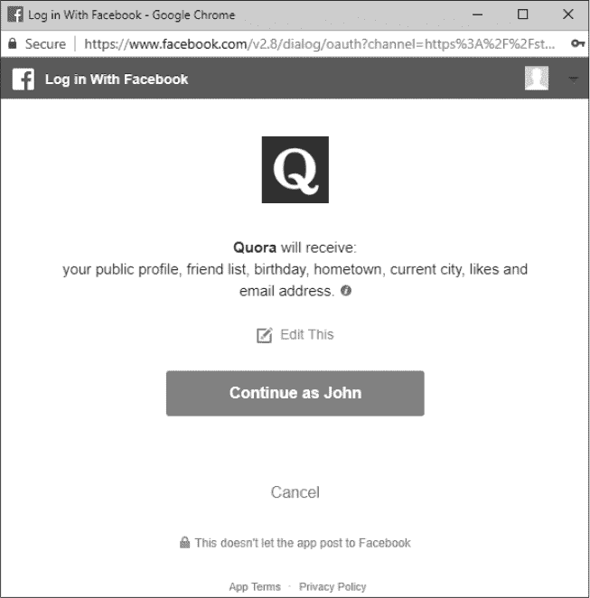

## 第十七章：OAUTH 漏洞


*OAuth* 是一种开放协议，简化并标准化了 web、移动和桌面应用程序中的安全授权。它允许用户在网站上创建账户，而无需创建用户名或密码。在网站上通常可以看到类似 *platform* 的“一键登录”按钮，如 图 17-1 所示，平台可以是 Facebook、Google、LinkedIn、Twitter 等等。


*图 17-1：示例 OAuth 使用 Google 登录按钮*

OAuth 漏洞是一种应用程序配置漏洞，意味着它们依赖于开发人员的实现错误。然而，考虑到 OAuth 漏洞的影响和发生频率，值得专门用一整章来讨论它们。虽然 OAuth 漏洞有许多种类型，本章将主要讨论攻击者如何利用 OAuth 漏洞窃取认证令牌并访问目标用户在资源服务器上的账户信息的案例。

截至目前，OAuth 有两个版本：1.0a 和 2.0，这两个版本互不兼容。关于 OAuth 有很多书籍，但本章主要关注 OAuth 2.0 及其基本工作流程。

### OAuth 工作流程

OAuth 过程较为复杂，我们先从基本术语开始介绍。最基本的 OAuth 流程涉及三个角色：

+   *资源所有者* 是通过 OAuth 尝试登录的用户。

+   *资源服务器* 是一个第三方 API，用于验证资源所有者的身份。任何网站都可以是资源服务器，但最常见的包括 Facebook、Google、LinkedIn 等等。

+   *客户端* 是资源所有者访问的第三方应用。客户端被允许访问资源服务器上的数据。

当你尝试使用 OAuth 登录时，客户端会向资源服务器请求访问你的信息，并询问资源所有者（即你）是否批准访问数据。客户端可能会请求访问你所有的信息，或者仅请求某些特定的数据。客户端请求的信息由作用域（scopes）定义。作用域类似于权限，它们限制了应用程序可以访问资源服务器上的哪些信息。例如，Facebook 的作用域包括用户的 `email`、`public_profile`、`user_friends` 等等。如果你仅授予客户端 `email` 作用域的访问权限，那么客户端无法访问你的个人资料信息、好友列表和其他信息。

现在你已经了解了涉及的各方，让我们以 Facebook 作为示例资源服务器，来看看 OAuth 过程在首次登录客户端时是如何运作的。当你访问客户端并点击“使用 Facebook 登录”按钮时，OAuth 过程就开始了。此时会向客户端的认证端点发送一个`GET`请求。通常，该路径看起来像这样：*https://www.<example>.com/oauth/facebook/*。例如，Shopify 使用 Google 进行 OAuth，URL 为*https://<STORE>.myshopify.com/admin/auth/login?google_apps=1/*。

客户端会通过 302 重定向响应此 HTTP 请求，重定向 URL 将包括用于促进 OAuth 过程的参数，定义如下：

+   *client_id*标识客户端在资源服务器上的身份。每个客户端都会有自己的*client_id*，以便资源服务器能够识别发起请求的应用程序，从而访问资源所有者的信息。

+   *redirect_uri*标识了在资源服务器验证资源所有者后，应该将资源所有者的浏览器重定向到哪里。

+   *response_type*标识应提供什么类型的响应。通常，这可以是令牌或代码，尽管资源服务器可以定义其他接受的值。令牌响应类型提供一个访问令牌，使得能够立即访问资源服务器中的信息。代码响应类型提供一个访问代码，必须通过 OAuth 过程中的额外步骤交换为访问令牌。

+   如前所述，*scope*标识了客户端请求访问资源服务器的权限。在第一次授权请求时，资源所有者应该看到一个对话框，以审查并批准请求的权限范围。

+   *state*是一个无法猜测的值，用于防止跨站请求伪造。这个值是可选的，但应在所有 OAuth 应用中实现。它应该包含在发送到资源服务器的 HTTP 请求中，然后由客户端返回并进行验证，以确保攻击者不能恶意地代表另一个用户触发 OAuth 过程。

一个启动 OAuth 过程的示例 URL 看起来像这样：*https://www.facebook.com/v2.0/dialog/oauth?client_id=123&redirect_uri=https%3A%2F%2Fwww.<example>.com%2Foauth%2Fcallback&response_type=token&scope=email&state=XYZ*。

在收到 302 重定向响应后，浏览器会向资源服务器发送一个`GET`请求。如果你已经登录到资源服务器，应该会看到一个对话框，要求你批准客户端请求的权限范围。图 17-2 展示了网站 Quora（客户端）代表资源所有者请求访问 Facebook（资源服务器）信息的示例。

点击“继续以 John 身份”按钮批准 Quora 请求访问列出的权限范围，包括资源拥有者的公共资料、好友列表、生日、家乡等。在资源拥有者点击按钮后，Facebook 会返回 302 HTTP 响应，将浏览器重定向回先前讨论的 *redirect_uri* 参数所定义的 URL。重定向还包括令牌和状态参数。以下是 Facebook 到 Quora 的 URL 重定向示例（已根据本书进行了修改）：

*https://www.quora.com?access_token=EAAAAH86O7bQBAApUu2ZBTuEo0MZA5xBXTQixBUYxrauhNqFtdxViQQ3CwtliGtKqljBZA8&expires_in=5625&state=F32AB83299DADDBAACD82DA*

在这种情况下，Facebook 返回了一个访问令牌，Quora（客户端）可以使用该令牌立即查询资源拥有者的信息。一旦客户端拥有了 *access_token*，资源拥有者在 OAuth 过程中的参与便已完成。客户端将直接查询 Facebook API 获取所需的资源拥有者信息。资源拥有者能够使用该客户端，而不必知道客户端与 API 之间的交互。



*图 17-2：通过 Facebook OAuth 权限授权登录 Quora*

然而，如果 Facebook 返回的是代码而不是访问令牌，Quora 需要用该代码换取访问令牌以从资源服务器查询信息。这个过程是在客户端和资源服务器之间完成的，不涉及资源拥有者的浏览器。为了获得令牌，客户端向资源服务器发出 HTTP 请求，其中包含三个 URL 参数：访问 *code*，*client_id* 和 *client_secret*。访问 *code* 是通过 302 HTTP 重定向从资源服务器返回的值。*client_secret* 是一个应由客户端保密的值。它是在应用程序配置时由资源服务器生成，并分配 *client_id*。

最后，一旦资源服务器接收到带有 *client_secret*、*client_id* 和访问 *code* 的客户端请求，它会验证这些值并返回 *access_token* 给客户端。在此阶段，客户端可以查询资源服务器以获取关于资源拥有者的信息，OAuth 过程也就完成了。一旦你批准了资源服务器访问你的信息，下一次使用 Facebook 登录客户端时，OAuth 验证过程通常会在后台进行。除非你监控 HTTP 请求，否则你不会看到任何这种交互。客户端可以更改此默认行为，要求资源拥有者重新认证并批准权限范围；不过，这种情况非常罕见。

OAuth 漏洞的严重性取决于与被窃取的令牌相关联的权限范围，如下文示例所示。

### 窃取 Slack OAuth 令牌

**难度：** 低

**URL：** *[`slack.com/oauth/authorize/`](https://slack.com/oauth/authorize/)*

**来源：** *[`hackerone.com/reports/2575/`](http://hackerone.com/reports/2575/)*

**报告日期：** 2013 年 3 月 1 日

**悬赏金额：** $100

一种常见的 OAuth 漏洞发生在开发者错误地配置或比较允许的 *redirect_uri* 参数时，这使得攻击者可以窃取 OAuth 令牌。在 2013 年 3 月，Prakhar Prasad 就在 Slack 的 OAuth 实现中发现了这一点。Prasad 通知了 Slack，表示他可以通过将任意内容附加到一个白名单中的 *redirect_uri* 来绕过他们的 *redirect_uri* 限制。换句话说，Slack 仅验证了 *redirect_uri* 参数的开头部分。如果开发者在 Slack 注册了一个新应用并将 *https://www.<example>.com* 加入白名单，那么攻击者就可以将一个值附加到 URL 中，从而导致重定向发生到一个不期望的位置。例如，修改 URL 使其传递 *redirect_uri=https://<attacker>.com* 会被拒绝，但传递 *redirect_uri=https://www.<example>.com.mx* 则会被接受。

要利用这种行为，攻击者只需要在其恶意网站上创建一个匹配的子域名。如果目标用户访问了恶意修改过的 URL，Slack 会将 OAuth 令牌发送到攻击者的网站。攻击者可以通过在恶意网页中嵌入 `` 标签来代表目标用户发起请求，例如 ``。使用 `` 标签在渲染时会自动发起一个 HTTP `GET` 请求。

#### *要点*

在 *redirect_uri* 没有严格检查的情况下的漏洞是常见的 OAuth 配置错误。有时，这种漏洞是因为一个应用程序将一个域名（如 **.<example>.com*）注册为可接受的 *redirect_uri*。其他时候，这个漏洞是由于资源服务器没有严格检查 *redirect_uri* 参数的开头和结尾部分导致的。在这个例子中，是后者。当你在寻找 OAuth 漏洞时，一定要测试任何表明正在使用重定向的参数。

### 使用默认密码通过身份验证

**难度：** 低

**网址：** *https://flurry.com/auth/v1/account/*

**来源：** *[`lightningsecurity.io/blog/password-not-provided/`](https://lightningsecurity.io/blog/password-not-provided/)*

**报告日期：** 2017 年 6 月 30 日

**悬赏金额：** 未公开

查找 OAuth 实现中的漏洞需要审查整个身份验证过程，从头到尾。这包括识别那些不属于标准化过程的 HTTP 请求。这些请求通常表明开发者已经定制了该过程，并可能引入了漏洞。Jack Cable 就是在 2017 年 6 月发现了这种情况，当时他查看了 Yahoo 的漏洞赏金计划。

雅虎的奖励计划包括分析网站 *[Flurry.com](http://Flurry.com)*。为了开始测试，Cable 使用他的 *@yahoo.com* 电子邮件地址通过雅虎的 OAuth 实现注册了一个 Flurry 账户。Flurry 和雅虎交换了 OAuth 令牌后，向 Flurry 发送的最终 `POST` 请求如下：

```
POST /auth/v1/account HTTP/1.1

Host: auth.flurry.com

Connection: close

Content-Length: 205

Content-Type: application/vnd.api+json

DNT: 1

Referer: https://login.flurry.com/signup

Accept-Language: en-US,en;q=0.8,la;q=0.6

{"data":{"type":"account","id":"...","attributes":{"email":...@yahoo.com,

"companyName":"1234","firstname":"jack","lastname":"cable",➊"password":

"not-provided"}}}
```

请求中的 `"password":"not-provided"` 部分 ➊ 引起了 Cable 的注意。退出账户后，他重新访问了 *[`login.flurry.com/`](https://login.flurry.com/)*，并在没有使用 OAuth 的情况下登录。相反，他提供了他的电子邮件地址和密码 `not-provided`。这一操作成功，Cable 成功登录了他的账户。

如果任何用户使用他们的雅虎账户和 OAuth 流程在 Flurry 注册，Flurry 会将该账户作为客户端注册到他们的系统中。然后，Flurry 会以默认密码 `not-provided` 保存用户账户。Cable 提交了这个漏洞，雅虎在收到报告后五小时内修复了它。

#### *总结*

在这种情况下，Flurry 在认证流程中加入了一个额外的自定义步骤，通过 `POST` 请求在用户认证后创建用户账户。自定义的 OAuth 实现步骤通常配置错误，从而导致漏洞，因此一定要彻底测试这些过程。在这个例子中，Flurry 很可能是在现有的用户注册流程基础上构建了 OAuth 流程，以匹配应用程序的其他部分。Flurry 可能并未要求用户在实施雅虎 OAuth 前创建账户。为了方便没有账户的用户，Flurry 的开发人员可能决定调用相同的注册 `POST` 请求来创建用户。但该请求需要一个密码参数，因此 Flurry 设置了一个不安全的默认密码。

### 窃取 Microsoft 登录令牌

**难度：** 高

**网址：** *[`login.microsoftonline.com`](https://login.microsoftonline.com)*

**来源：** *https://whitton.io/articles/obtaining-tokens-outlook-office-azure-account/*

**报告日期：** 2016 年 1 月 24 日

**奖励金额：** $13,000

尽管微软没有实施标准的 OAuth 流程，但它使用了一个非常相似的流程，适用于测试 OAuth 应用程序。当你测试 OAuth 或任何类似的认证流程时，务必彻底测试重定向参数是如何验证的。你可以通过将不同的 URL 结构传递给应用程序来测试这一点。这正是 Jack Whitton 在 2016 年 1 月做的，当时他测试了微软的登录流程并发现他可以窃取认证令牌。

由于微软拥有众多的服务，因此根据用户正在认证的服务，微软会通过请求 *[login.live.com](http://login.live.com)*、*[login.microsoftonline.com](http://login.microsoftonline.com)* 和 *[login.windows.net](http://login.windows.net)* 来进行身份验证。这些 URL 会为用户返回一个会话。例如，* [outlook.office.com](http://outlook.office.com)* 的流程如下：

1.  用户将访问 *[`outlook.office.com`](https://outlook.office.com)*。

1.  用户将被重定向到 *[`login.microsoftonline.com/login.srf?wa=wsignin1.0&rpsnv=4&wreply=https%3a%2f%2foutlook.office.com%2fowa%2f&id=260563`](https://login.microsoftonline.com/login.srf?wa=wsignin1.0&rpsnv=4&wreply=https%3a%2f%2foutlook.office.com%2fowa%2f&id=260563)*。

1.  如果用户已经登录，将向 `wreply` 参数发送一个 `POST` 请求，`t` 参数中包含用户的令牌。

将 `wreply` 参数更改为其他任何域名会导致流程错误。Whitton 还尝试通过在 URL 末尾添加 *%252f* 来对字符进行双重编码，形成 *https%3a%2f%2foutlook.office.com%252f*。在这个 URL 中，特殊字符会被编码，例如冒号 (*:*) 被编码为 *%3a*，斜杠 (*/*) 被编码为 *%2f*。当进行 *双重编码* 时，攻击者还会在初次编码时对百分号 (*%*) 进行编码。这样做会使得双重编码后的斜杠变成 *%252f*（编码特殊字符的讨论可以参见 “Twitter HTTP Response Splitting” 在 第 52 页）。当 Whitton 将 `wreply` 参数更改为双重编码后的 URL 时，应用程序返回了一个错误，表明 *https://outlook.office.com%f* 不是一个有效的 URL。

接下来，Whitton 将 *@example.com* 添加到域名中，但并未导致错误。相反，它返回了 *`outlook.office.com%2f@example.com/?wa=wsignin1.0`*。之所以会这样，是因为 URL 的结构是：* [//[用户名:密码@]主机[:端口]][/]路径[?查询][#片段]*。`用户名` 和 `密码` 参数将基本的授权凭证传递给网站。因此，通过添加 *@example.com*，重定向的主机不再是 *[outlook.office.com](http://outlook.office.com)*，而是可以设置为任何攻击者控制的主机。

根据 Whitton 的说法，这个漏洞的根本原因在于微软处理解码和 URL 验证的方式。微软可能采用了一个两步过程。首先，微软会进行有效性检查，确保域名有效且符合 URL 结构方案。URL *`outlook.office.com%2f@example.com`* 是有效的，因为 *[outlook.office.com%2f](http://outlook.office.com%2f)* 会被识别为有效的用户名。

其次，微软会递归解码 URL，直到没有其他字符可以解码。在这种情况下，*https%3a%2f%2foutlook.office.com%252f@example.com* 会被递归解码，直到返回 *`outlook.office.com/@example.com`*。这意味着 *@example.com* 被识别为 URL 路径的一部分，而不是主机。主机会被验证为 *[outlook.office.com](http://outlook.office.com)*，因为 *@example.com* 出现在斜杠之后。

当 URL 的各个部分组合起来时，微软会验证 URL 结构、解码 URL，并将其验证为白名单中的 URL，但返回的 URL 仅被解码了一次。这意味着，任何访问 *https://login.microsoftonline.com/login.srf?wa=wsignin1.0&rpsnv=4&wreply=https%3a%2f%2foutlook.office.com%252f@example.com&id=260563* 的目标用户都会将其访问令牌发送到 *example.com*。*example.com* 的恶意所有者可以利用这个令牌登录与该令牌关联的微软服务，并访问其他人的账户。

#### *要点*

在测试 OAuth 流程中的重定向参数时，确保将 *@example.com* 作为重定向 URI 的一部分，以查看应用程序如何处理它。尤其当你注意到该过程正在使用编码字符，应用程序需要解码这些字符以验证白名单中的重定向 URL 时，应该这样做。此外，在测试时始终注意应用程序行为中的任何细微差异。在这种情况下，Whitton 注意到，当他完全更改 `wreply` 参数时，返回的错误与附加双重编码的斜杠时不同，这使他发现了微软配置错误的验证逻辑。

### 窃取 Facebook 官方访问令牌

**难度：** 高

**URL：** *[`www.facebook.com`](https://www.facebook.com)*

**来源：** *[`philippeharewood.com/swiping-facebook-official-access-tokens/`](http://philippeharewood.com/swiping-facebook-official-access-tokens/)*

**报告日期：** 2016 年 2 月 29 日

**奖励支付：** 未公开

在寻找漏洞时，一定要考虑目标应用程序所依赖的被遗忘的资产。在这个例子中，Philippe Harewood 一开始只有一个目标：捕获目标用户的 Facebook 令牌并访问他们的私人信息。但他未能找到 Facebook 在 OAuth 实现上的任何错误。没有灰心丧气，他转变思路，开始寻找可以接管的 Facebook 应用程序，采用了一种类似子域名接管的思路。

这个想法基于一个认识，即 Facebook 的主要功能包括一些依赖于 OAuth 的 Facebook 所有的应用程序，并且这些应用会自动被所有 Facebook 账户授权。所有这些预授权应用的列表位于 *https://www.facebook.com/search/me/apps-used/*。

在查看列表时，Harewood 发现有一个应用被授权，即便 Facebook 已经不再拥有或使用该域名。这意味着 Harewood 可以将该白名单域名注册为 *redirect_uri* 参数，从而接收访问 OAuth 授权端点 *[`facebook.com/v2.5/dialog/oauth?response_type=token&display=popup&client_id=APP_ID&redirect_uri=REDIRECT_URI/`](https://facebook.com/v2.5/dialog/oauth?response_type=token&display=popup&client_id=APP_ID&redirect_uri=REDIRECT_URI/)* 的任何目标用户的 Facebook 令牌。

在 URL 中，易受攻击的应用的 ID 由 *APP_ID* 表示，该 ID 包含对所有 OAuth 范围的访问权限。白名单域名由 *REDIRECT_URI* 表示（Harewood 没有公开该配置错误的应用）。因为该应用已经获得了每个 Facebook 用户的授权，所以任何目标用户都不需要批准请求的范围。此外，OAuth 过程会完全在后台 HTTP 请求中进行。通过访问该应用的 Facebook OAuth URL，用户将被重定向到 URL *http://REDIRECT_URI/#token=access_token_appended_here/*。

因为 Harewood 注册了 *REDIRECT_URI* 的地址，他能够记录访问该 URL 的任何用户的访问令牌，这使他能够访问他们的整个 Facebook 账户。此外，所有官方的 Facebook 访问令牌都包括对其他 Facebook 拥有的资产的访问权限，例如 Instagram。因此，Harewood 可以代表目标用户访问所有 Facebook 资产。

#### *要点*

在寻找漏洞时，要考虑可能被遗忘的资产。在这个例子中，遗忘的资产是一个敏感的 Facebook 应用，具有完全的权限范围。但其他例子包括子域名的 CNAME 记录和应用依赖项，如 Ruby Gems、JavaScript 库等。如果一个应用依赖于外部资产，开发者有可能某天停止使用该资产，并忘记将其从应用中断开。如果攻击者能够接管该资产，这可能对应用及其用户造成严重后果。此外，需要认识到，Harewood 在测试时有一个黑客攻击的目标。采取同样的方式是当你在对大型应用进行黑客攻击时有效的集中精力的方式，因为在这些应用中有无数区域可以测试，且很容易分心。

### 总结

尽管 OAuth 已被标准化为一种身份验证工作流，但它对开发者来说很容易被配置错误。细微的错误可能导致攻击者窃取授权令牌并访问目标用户的私人信息。在进行 OAuth 应用程序黑客攻击时，一定要彻底测试*redirect_uri*参数，查看应用程序是否正确验证了访问令牌的发送情况。同时，也要留意支持 OAuth 工作流的自定义实现；这些功能并未由 OAuth 标准化流程定义，更容易存在漏洞。在放弃任何 OAuth 黑客攻击之前，一定要考虑白名单资产。确认客户端是否默认信任了某些应用程序，这些应用程序可能是开发者遗忘的。
