# 数据的几何结构  

  

你可能会想，既然传统的数据科学方法已经如此流行且强大，为什么还需要基于拓扑学和几何学的数据科学方法呢？这个问题的答案有两个部分。首先，今天的数据格式种类繁多，远比传统的电子表格更加异乎寻常，比如社交网络或文本文件。虽然这些异质数据曾被称为*非结构化数据*，但我们现在意识到，它们通常是结构化的，只不过它们的几何结构比关系数据库中的一系列电子表格更为复杂。拓扑学和几何学的数据科学使我们能够直接在这些异质领域中工作，并将它们转换为更为熟悉的电子表格领域。其次，最近的一个发现表明，即便是电子表格结构化的数据背后，也潜藏着几何结构。通过拓扑学和几何学的数据科学，我们能够利用这种隐藏的几何结构的力量。  

本章将从回顾传统机器学习中的主要概念开始，讨论数据如何被结构化，以及机器学习算法如何通常使用这些结构化数据。接着，我们将从几何学角度回顾监督学习、过拟合和维度灾难。然后，我们将预览其他几种常见的数据类型——网络数据、图像数据和文本数据——并暗示如何在机器学习中利用它们的几何结构。如果你已经熟悉传统机器学习及其应用于现代数据形式的挑战，可以跳过本章，直接进入第二章，技术内容将在那里正式开始，尽管你可能会觉得本章提供的传统机器学习主题的几何学视角仍然很有趣。  

## 机器学习类别  

目前存在许多类型的机器学习算法，而且每天都有新的算法被发明出来。跟上所有最新的发展可能会很困难，但将机器学习算法分为几大类会有所帮助。  

### 监督学习  

*监督学习*算法通常旨在预测某些内容，比如在新的医院协议下的治疗结果，或者客户在接下来六个月离开的概率。我们预测的变量称为*因变量*或*目标变量*，用于预测的变量称为*自变量*或*预测变量*。当我们预测的是数值型变量（例如症状严重程度量表）时，这称为*回归*；当我们预测的是类别型变量（如生存或死亡类别）时，这称为*分类*。  

一些最受欢迎的监督学习算法包括*k*最近邻（*k*-NN）、朴素贝叶斯分类器、支持向量机、随机森林、梯度提升和神经网络。阅读本书不需要掌握这些话题，但如果对至少一种回归方法和一种分类方法有所了解（如线性回归和逻辑回归），会有所帮助。话虽如此，如果你不确定这些内容，也不用担心——这一章会涵盖你所需的概念。

每种监督学习算法都是一种特定类型的函数，具有与数据中的独立变量数量相同的输入变量。我们将这个函数视为根据独立变量的任何值预测因变量的值（参见图 1-1）。对于具有独立变量*x*[1]、*x*[2]、...、*x*[*n*]的线性回归，这是一个线性函数：*f*(*x*[1]、*x*[2]、...、*x*[*n*]) = *a*[1]*x*[1] + *a*[2]*x*[2] + ...。对于其他方法，它是一个复杂的非线性函数。对于许多方法，这个函数是非参数化的，这意味着我们可以通过算法计算它，但无法用公式表达它。**

**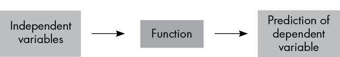**

图 1-1：独立变量流、监督机器学习算法（视为函数）和因变量预测

使用监督学习算法通常涉及将数据划分为两个集合。一个是*训练*数据，其中算法试图调整函数中的参数，使得预测值尽可能接近实际值。在前面的线性回归示例中，参数是系数*a*[*i*]。另一个是*测试*数据，我们在此测量算法执行的效果。*超参数*是用户必须指定的任何参数（与通过训练过程直接从数据中学习到的参数不同）。*k*表示最近邻数目的超参数在*k*-NN 中就是一个例子。

在监督学习算法训练完成后，我们可以使用它来做出新的预测，并估计每个独立变量对因变量的影响（称为*特征重要性*）。特征重要性有助于做出干预决策。例如，了解哪些因素最能影响患者因传染病死亡，可以在疫苗供应有限时为疫苗接种策略提供参考。

### 无监督学习

*无监督学习*算法通常专注于数据探索——例如，通过减少数据集的维度来更好地可视化数据，查找数据点之间的关系，或者检测异常数据点。在无监督学习中，没有因变量——只有自变量。因此，我们不会将数据拆分为训练集和测试集；我们只是将无监督方法应用于所有数据。无监督学习的应用包括基于数百万个遗传标记的市场细分和祖先群体可视化。无监督学习算法的例子包括 k-means 聚类、层次聚类和主成分分析（PCA）——但同样，你不需要了解这些主题就可以阅读本书。

无监督学习和监督学习可以有效地结合。例如，你可以使用无监督学习来发现数据中的新问题，并使用监督学习来回答这些问题。你还可以使用无监督学习进行降维，作为预处理步骤，以提高监督学习算法的性能。

### 匹配算法与其他机器学习

机器学习的另一个常见应用是*匹配算法*，它通过计算点之间的距离来查找数据集中相似的个体。这些算法通常用于向用户推荐产品；它们也用于数据完整性检查，以确保在允许机器学习算法创建模型之前，某些人群的数据是充足的。

随着机器学习和人工智能的兴起，数据完整性变得越来越重要。如果数据中未能很好地捕捉到某些重要的子群体，算法就会倾向于偏向多数群体。例如，如果语言识别系统没有来自非洲或亚洲语言群体的足够数据，系统就很难学习到这些语言群体特有的人类语音声音，例如科伊桑语的咔嗒音或普通话的声调。匹配算法也被用来尝试从经验数据中提取因果关系，当随机对照试验不可行时，它们能够将相似的参与者配对，就像他们被分配到治疗组和安慰剂组一样。

我们可以提及许多其他类型的算法，在实践中，算法类别之间往往存在重叠。例如，YouTube 的推荐算法在监督和无监督方式中都使用*深度学习*（这涉及基于具有多个“隐藏层”的神经网络的机器学习），以及匹配算法和机器学习的另一个支柱*强化学习*（其中算法通过探索真实或模拟环境来自行开发策略——超出本书的范围）。然而，前面提供的机器学习基本路线图将指导我们贯穿本书。

接下来，让我们更仔细地看一下这些算法期望的数据格式。

## 结构化数据

机器学习算法，以及数据科学和统计方法通常在*结构化数据*（也称为*表格数据*）上运行，这意味着一种类似电子表格的对象（数据框或矩阵），其中列是变量，行是*数据点*（也称为*实例*或*观测*）。这些通常存储在关系数据库中，与其他结构化数据一起。表格结构使我们能够讨论自变量、因变量和数据点。本书的重点之一是如何处理不以这种良好格式呈现的数据。但即使是表格数据，几何视角也可能非常有用。

首先，让我们深入研究一个示例，展示几何如何帮助我们更好地理解和处理结构化数据中的分类变量。

### 虚拟变量的几何形式

图 1-2 显示了存储为 Microsoft Excel 工作簿的电子表格的一部分。这里的最后一列是 Outcome，因此我们将其视为因变量；其他三列是自变量。如果我们将这些数据用于监督学习算法，那将是一个回归任务（因为因变量是数值）。第一个自变量是二进制数值（取值为 0 和 1），第二个自变量是离散数值（取整数值），第三个自变量是分类的（有三个性别类别）。一些算法接受分类变量，而另一些要求所有变量都是数值。除非类别是有序的（例如调查数据，其值为“非常不满意”、“不满意”、“满意”和“非常满意”），将分类变量转换为数值的方法是用一组二进制*虚拟变量*替换它，这些变量用值 1 和 0 表示每个类别的是/否格式。在图 1-3 中，我们用两个虚拟变量列替换了性别变量列。

图 1-2：Microsoft Excel 工作簿中结构化数据的示例

即使对于这样一个常见且简单的过程，几何考虑也有助于阐明正在发生的事情。如果分类变量的值是有序的，那么我们可以通过将这些值沿着一个一维轴放置，以反映这些值的顺序，将它们转换为一个单一的数值变量。例如，调查中的“满意”，“非常满意”和“极度满意”可以编码为 1、2 和 3，或者如果你希望“满意”和“非常满意”之间的差异小于“非常满意”和“极度满意”之间的差异，那么你可以将它们编码为 1、2 和 4。

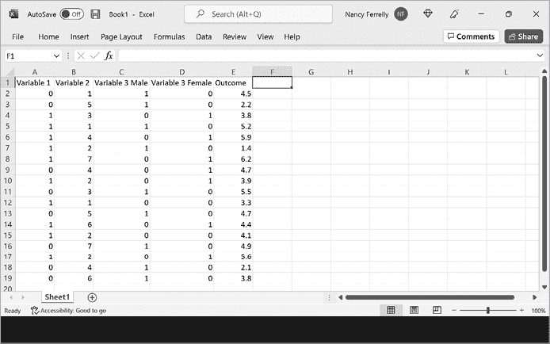

图 1-3：一个转换后的结构化数据集，其中分类变量已被替换为两个二进制虚拟变量

如果类别没有顺序——比如男性、女性和非二元——我们不希望强制将它们全部放入一个维度中，因为这样会人为地对它们进行排序，并使其中一些类别比其他类别更接近（见图 1-4）。

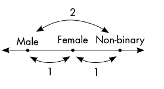

图 1-4：将分类变量的值放在一个维度中会使其中一些类别比其他类别更接近。

几何上，当我们创建虚拟变量时，我们为不同的类别创建了新的轴。有两种方法可以做到这一点。有时，你会看到人们为每个分类变量的值使用一个虚拟变量，而在其他时候，你会看到人们为除一个值之外的所有值使用虚拟变量（就像我们在图 1-3 中所做的那样）。为了理解区别，让我们看看我们的三类别性别变量。

使用三个虚拟变量将类别放置在一个等边三角形的顶点上：男性的坐标为（1,0,0），女性的坐标为（0,1,0），非二元的坐标为（0,0,1）。这确保了各个类别之间的距离相等。只使用两个虚拟变量意味着男性的坐标为（1,0），女性的坐标为（0,1），非二元的坐标为（0,0）。这将我们的等边三角形在三维空间中投影到二维平面上的直角三角形，这样做会扭曲距离。男性和女性现在比彼此更接近非二元，因为它们在这个等腰直角三角形中被长度√2 ≈ 1.4 的斜边分开（见图 1-5）。因此，一些机器学习算法会错误地认为类别男性和女性与类别非二元更相似，而不是彼此。

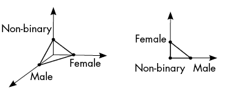

图 1-5：创建性别虚拟变量的两种方法。左边，我们为每个类别使用一个轴，这确保了各个类别之间的距离相等。右边，我们只使用两个轴，这导致一些类别比其他类别更接近。

那么为什么要同时使用两种虚拟变量方法呢？对于*n*值分类变量，使用*n*个虚拟变量而不是*n* – 1 会导致*多重共线性*，在统计语言中，这是独立变量之间的相关性。这里的相关性是每个虚拟变量完全且线性地由其他变量决定。代数上，这是*线性相关性*，意味着一列是其他列的线性组合。这种线性相关性在几何上可以看到：将*n*个类别放置在*n*维空间中时，它们仅覆盖一个(*n* – 1)维平面。在图 1-5 中，左侧三个向量的线性组合仅覆盖包含三角形的平面，而右侧的线性组合则覆盖整个二维坐标系。

多重共线性会导致线性回归和逻辑回归的计算问题，因此对于这些算法，我们应该使用*n* – 1 个虚拟变量而不是全部*n*个。即使对于不会遇到这个特定计算问题的方法，尽可能使用较少的独立变量通常更好，因为这有助于减少维度诅咒——这是数据科学中的一个基本主题，我们将很快从几何角度讨论。

另一方面，对于像*k*-NN 这样的算法，数据点之间的距离至关重要，我们不希望丢弃虚拟变量之一，因为那会扭曲距离（正如我们在图 1-5 中看到的那样），并导致性能不佳。在使用虚拟变量方法时，有时机会和地点，思考几何学可以帮助我们决定何时使用哪种方法。

在使用虚拟变量将所有分类变量转换为数值变量后，我们准备考虑电子表格的几何形态。

### 数字电子表格的几何形态

我们可以将数字电子表格看作描述*欧几里得向量空间* **R**^(*d*) 中的一组点（每行一个点），这是一个几何空间，在二维中看起来像一张平面纸，在三维中看起来像一个实心砖块，但在所有方向上无限延伸，可以是任意维度。这里，*d* 是列数，也是空间的维度。数字数据集中的每一列代表这个空间中的一个轴。具体来说，每个数据点的*d*维坐标只是该行中的值。

当*d* = 1 时，这个欧几里得向量空间**R**^(*d*)是一个直线。当*d* = 2 时，它是一个平面。当*d* = 3 时，它就是我们习惯思考的三维空间。虽然人类实际上无法直观地理解超过三个垂直坐标轴的空间，但即便如此，我们仍然可以通过数学和计算工具分析高维几何。这里需要注意的是，正如平面之外存在许多二维形状（例如球面或圆环面，甚至更奇特的莫比乌斯带），三维空间之外也存在许多三维几何空间（如三维球体内部或四维球体表面）。这同样适用于更高维的空间。传统上，处理结构化数据意味着从**R**^(*d*)的角度来看数据，而非从这些其他几何空间的角度来看。

**R**^(*d*)的欧几里得向量空间结构非常强大；它允许我们计算各种有用的内容。我们可以计算任何一对数据点之间的距离，这对于广泛的机器学习算法来说是必要的。我们可以计算连接任意两点的线段，这被合成少数类过采样技术（SMOTE）用于调整训练样本中的不平衡类别。我们可以计算数据中每个坐标的均值，这对于*填补*缺失值很有帮助（即，通过已知数据对缺失值进行最佳猜测，从而填补缺失值）。

然而，这种漂亮的欧几里得向量空间结构也具有特定和僵化的性质。幸运的是，我们可以在没有全局欧几里得坐标的更一般的环境中计算点之间的距离、连接点的最短路径以及各种形式的插值，包括*流形*（像球面这样的几何对象，放大看时与通常的欧几里得空间相似，但在全局上可以具有更有趣的形状和结构——将在第五章中讲解）和*网络*（在第二章中正式引入的关系结构）。

举一个具体的例子，假设你正在处理大规模的地理空间数据，比如基于邮政编码的犯罪统计数据。你如何对数据点进行聚类或构建任何预测模型？最直接的方法是使用纬度和经度作为变量来传达数据的地理空间特征。但是，这种方法很快就会遇到问题，因为它将圆形的地球投影到平面上，这种方式会显著扭曲距离。例如，经度的范围是从-180°到+180°，所以位于本初子午线两侧的两个点，可能在英里数上非常接近，但在经度上却可能相距非常远（见图 1-6）。因此，能够在球面数据上工作的机器学习算法非常有用，避免了将数据映射到平面表面上的需要。

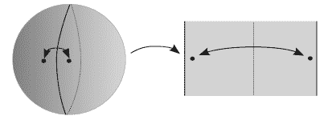

图 1-6：将纬度和经度（左图）作为地理空间数据的变量会扭曲数据点之间的距离。如图所示，位于零度经线两侧非常接近的点，在经纬度平面（右图）上表示为非常远的点。

即使你在处理已经结构化为表格的电子表格数据时，可能仍然存在隐藏的几何结构是相关的。例如，假设你有三个数值变量（因此你的数据位于**R**³空间中），但所有数据点都位于或接近三维空间中的一个球面上。你是否希望考虑点与点之间的距离是沿球面表面的路径长度（这就是球面几何中所做的）还是穿过球体的直线距离（这是传统欧几里得机器学习中所做的）？答案取决于上下文，这是数据科学家需要根据领域知识来决定的——这通常不是算法应该自行决定的内容。例如，如果你的数据点代表一个空中无人机可以访问的房间中的位置，那么欧几里得距离更好；如果你的数据点代表全球范围内的机场，并且有国际航空公司提供服务，那么球面几何更好。

拓扑学和几何数据科学的主要任务之一是发现数据点自然存在的几何对象（就像机场示例中的球面，但在高维空间中可能是非常复杂的形状）。另一个主要任务是利用这些几何对象，这通常涉及以下一个或多个方面：

+   应用已适应更一般几何环境的常规机器学习算法版本

+   应用基于数据形状的全新几何算法

+   提供有意义的全球坐标，将数据转换为结构化的电子表格，以便传统的统计和机器学习工具能够成功应用

本书的主要目标是详细讲解所有这些概念，并展示如何轻松有效地实现它们。但首先，在本介绍性章节的剩余部分，我们将解释一些传统数据科学主题中涉及的几何内容（就像我们之前讲解虚拟变量时所做的）。我们还将暗示一些不同类型的“非结构化”数据所涉及的几何结构，作为后续章节的预览。

### 监督学习的几何学

本节将提供一些标准机器学习主题的几何视角：分类、回归、过拟合以及维度灾难。

#### 分类

一旦数据集被转换为一个数值化的电子表格（假设有 *d* 列），监督分类器的任务是标记每个新输入数据点的预测类别。这可以通过 *决策边界* 来理解，即我们将 **R**^(*d*) 空间划分为不重叠的区域，并为每个区域分配一个类别，表示分类器将为该区域中的所有点预测的标签。（注意，相同的类别可以分配给多个区域。）这些区域允许的几何形状类型由所选的监督分类器方法决定，而这些形状的具体细节则通过训练过程从数据中学习。这为分类过程提供了一个启发性的几何视角。

在图 1-7 中，我们看到在 *d* = 2 的简单二分类示例中，一些标准分类算法的决策边界。

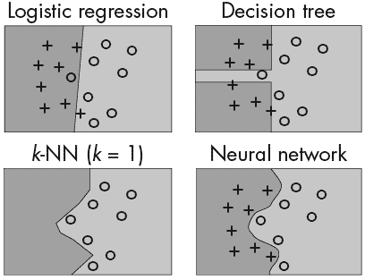

图 1-7：几种分类算法在二维空间中的决策边界

逻辑回归产生线性决策边界。（不过，通过在模型中加入高阶项，您可以实现非线性决策边界。）决策树通过用各自的不等式划分自变量来构建，这导致决策边界由水平和垂直线段组成。在更高的维度中，我们不再是水平和垂直线，而是与坐标轴对齐的平面。随机森林是决策树的集成，仍然会产生这种形式的决策边界，但它们通常包含更多的部分，形成看起来弯曲的形状，实际上是由许多小的水平和垂直线段组成的。*k*-NN 分类器产生多边形决策边界，因为它们根据哪些有限的训练数据点最接近来划分空间。神经网络可以产生复杂的、弯曲的决策边界；这种高度的灵活性既是优点也是缺点，因为如果不小心，它可能会导致过拟合（我们稍后会讨论过拟合问题）。

研究不同分类器算法产生的决策边界可以帮助您更好地理解每个算法的工作原理；它还可以帮助您根据数据的外观选择要使用的算法（对于维度更高的数据，其中*d* > 2，您可以通过绘制不同变量对的二维快照来获取数据）。只需记住，涉及许多选择——要使用哪些变量，是否包括高阶项，要为超参数设置什么值等等——所有这些选择都会影响可能的决策边界类型。每当遇到一个您尚不熟悉的分类算法时，开发对其的直觉的最佳方法之一是绘制它产生的决策边界，并查看随着您调整超参数而变化的方式。

#### 回归

监督回归也可以从几何角度来看，尽管有点难以可视化。回归算法不是基于类别预测将空间划分为有限数量的区域，而是为空间中的每个点分配一个数值；当*d* = 2 时，这可以绘制为热图或三维曲面。图 1-8 展示了一个例子，在这个例子中，我们首先创建了 10 个具有随机依赖变量值的随机点（在顶部图中显示，圆圈大小表示值），然后我们为一组密集点的预测值绘制了 3D 散点图，最后在使用*k*=3 的*k*-NN（左下）和随机森林（右下）时根据高度进行着色。

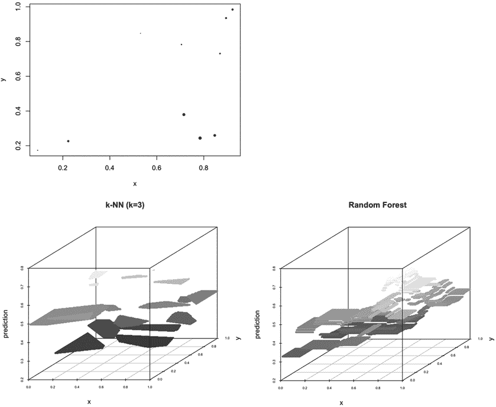

图 1-8：训练数据，依赖变量数值由圆圈大小表示（顶部图），以及两种非线性回归算法的三维预测曲面：3-NN（左下）和随机森林（右下）

线性回归的预测曲面（此处未显示）是一个大的倾斜平面，而这里展示的两种方法的曲面是一组有限数量的平坦区域，其中预测值保持恒定。请注意，这些区域对于*k*-NN 是多边形，对于随机森林是矩形；这种情况总是如此。此外，在本例中使用的超参数选择，随机森林的区域比*k*-NN 的区域要小。换句话说，与*k*-NN 算法相比，随机森林在数据空间中以手术精度切割数据；后者更像是用屠夫刀切南瓜。但这并不总是如此——这种粗糙度的比较取决于随机森林中使用的树的数量和*k*-NN 中使用的邻居的数量。重要的是，对于回归的更细分区就像对于分类的更灵活的决策边界：它通常在训练数据上看起来不错，但在新数据上泛化效果不佳。这将引出我们的下一个主题。

#### 过拟合

让我们回到图 1-7 中的决策边界图。乍一看，似乎边界越灵活，算法的表现越好。这在考虑训练数据时是正确的，但真正重要的是算法在测试数据上的表现。预测分析中的一个著名问题是*过拟合*，即当一个预测算法过于灵活，以至于学习到了训练数据的特定细节，从而在新的未见数据上表现得更差。

在图 1-7 中，逻辑回归算法错误地分类了最左边的圆，而决策树则创建了一个长条形区域，正确地分类了这个点。如果圆形倾向于位于左边，十字形则倾向于位于右边，那么创建这个长条形区域可能会在应用到新数据时损害分类性能——如果是这样的话，这就是决策树过拟合训练数据的一个例子。

通常来说，随着预测算法灵活性的增加，训练误差倾向于不断下降，直到最终稳定，而测试误差则先下降，然后达到最小值，再上升（见图 1-9）。我们希望测试误差曲线的最低点：那是我们能够实现的最佳预测性能。它发生在算法足够灵活，能够拟合数据分布的真实形状，但又足够刚性，不会学习到仅适用于训练数据的虚假细节时。

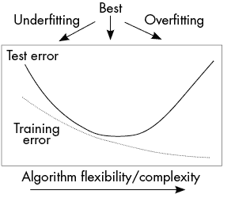

图 1-9：训练误差与测试误差作为预测算法灵活性的函数的图示，展示了过拟合的概念

在图 1-9 中所示的普遍行为通常发生在调整超参数时：随着神经网络中神经元数量的增加、*k*-NN 中邻居数*k*的减少、决策树中分支数量的增加等，分类器的决策边界变得更加灵活。

#### 高维灾难

有时，考虑图 1-9 中的 x 轴表示复杂性而非灵活性会有所帮助。更灵活的算法往往更复杂，反之亦然。衡量算法复杂性的一个最简单但最重要的标准是它使用的独立变量的数量。这也被称为数据的*维度*。如果独立变量的数量是*d*，那么我们可以认为该算法是在一个*d*维欧几里得向量空间**R**^(*d*)中输入点。对于固定数量的数据点，使用过少的独立变量往往会导致欠拟合，而使用过多的独立变量则容易导致过拟合。因此，图 1-9 也可以解释为展示随着数据维度增加而不增加数据集大小时，预测算法的错误分数发生了什么变化。

随着维度的增加而最终导致测试误差增大的现象是一个普遍现象，称为*维度灾难*。在处理结构化数据时，列的数量相对于行的数量较大（如基因组学等领域的常见情况），预测算法容易出现过拟合，而且许多机器学习方法中驱动的数值线性代数也会崩溃。这是一个巨大的问题，许多技术已经被开发出来以帮助应对这一问题——其中一些将在本书后续部分讨论。现在，让我们看看几何学如何为维度灾难提供一些启示。

理解维度灾难的一种方法是考虑欧几里得距离，即在任意多个维度上，像鸟飞行一样的直线距离。想象在一张方形纸上画出两对点，其中一对点彼此靠近，而另一对点彼此远离，如图 1-10 所示。

图 1-10：二维空间中两对点的绘图

让我们通过加入一些高斯噪声来扰动这些点；也就是说，我们将从双变量正态分布中绘制四个向量，并将这些向量加到四个点的坐标上。这样做会使点在随机方向上稍微移动。我们将这样做多次，每次记录扰动后左边一对点之间的欧几里得距离，以及右边一对点之间的距离。如果扰动足够大，我们偶尔会发现左边的点距离彼此比右边的点还远，但总体而言，左边扰动的欧几里得距离会小于右边扰动的欧几里得距离，正如图 1-11 中的直方图所示。

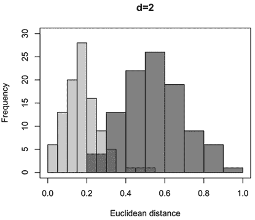

图 1-11：在图 1-10 的左侧，经过随机小幅扰动后的欧几里得距离的直方图（附近点显示为浅灰色），而右侧则是远离点的直方图（显示为深灰色）。

接下来，让我们将我们的方形纸片嵌入为一个二维平面，并将其放置在一个更高维度的欧几里得空间**R**^(*d*)中，然后重复扰动这些点并计算欧几里得距离的实验。在更高维度中，这些扰动会在更多的方向上发生。具体来说，你可以把每个点的*x*和*y*坐标用*d*-2 个零填充，然后对每个*d*个坐标添加少量噪声。图 1-12 显示了在*d* = 10 和*d* = 100 维度下进行此过程时欧几里得距离的结果直方图。

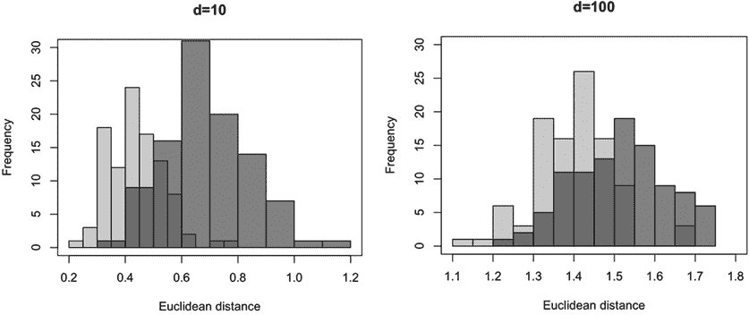

图 1-12：如图 1-11 所示的欧几里得距离直方图，不同之处在于这里的数据是在*d* = 10 维（左）和*d* = 100 维（右）下嵌入后的结果。

我们可以看到，随着维度*d*的增加，两个分布逐渐重叠并且越来越接近。因此，当涉及到噪声时（如现实世界中常有的情况），增加额外的维度会破坏我们区分近点对和远点对的能力。换句话说，随着数据维度的增加，数据中的信号会越来越容易被噪声掩盖，除非你确信这些额外的维度包含了额外的信号。这是一个相当深刻的洞察，通过相对简单的欧几里得几何学我们可以看到这一点！

我们还可以使用扰动来解释为什么高维度会导致过拟合。在图 1-13 中，左侧显示了四个点在平面**R**²中，它们被两个类别标记，且配置不可线性分割（这意味着没有高阶项的逻辑回归分类器将无法正确分类这些点）。

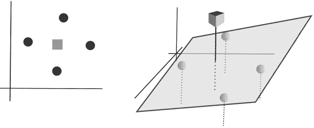

图 1-13：在二维空间中不可线性分割的两类数据点（左）通过将其嵌入三维空间后（右）并进行扰动后可以线性分割。

即使我们对这些点进行少量噪声扰动，也无法找到一条线来分隔这两类数据。在图的右侧，我们通过为每个点添加一个常数作为第三坐标，将这些点嵌入了**R**³。（几何上，这意味着我们把原本的**R**²平面放置在这个三维空间的*xy*平面之上。）然后我们对这些点进行小幅扰动。经过这次三维扰动后，我们可以看到这两类数据变得可线性分割，这意味着逻辑回归分类器在这里将能够达到 100%的准确率。（在图中，我们勾画了一条倾斜的平面来分割这两类数据。）

刚开始，这种额外的灵活性看起来像是一件好事（有时候确实如此！），因为它让我们能够提高训练准确率。但请注意，我们在三维空间中的分类器并没有学会以一种有意义的方式分开各个类别，以便能在新的、未见过的数据上进行泛化。它实际上只是学会了从某个特定扰动中提取垂直噪声。换句话说，增加数据的维度往往会增加分类器拟合训练数据中噪声的可能性，而这恰恰是导致过拟合的原因。

也有一个几何角度来解释由维度诅咒所引起的计算挑战。想象一个边长为 10 单位的正方形，面积为 100 单位。如果我们再添加一个轴，那么我们就得到了一个体积为 1,000 单位的立方体。如果再加一个，我们就得到了一个四维立方体，体积为 10,000 单位。这意味着数据会变得更加分散——随着维度的增加，数据变得更加稀疏。如果我们将一个低维空间中 100 个点的相对密集数据集放入一个 1,000 维的空间中，那么在这个空间中就会有很多地方距离这 100 个点都很远。一个人在这个空间中四处寻找点，可能需要付出大量努力才能找到一个。如果他有限的时间框架内进行寻找，他可能根本找不到任何点。简单来说，高维度下的计算更困难，因为需要跟踪更多的坐标，数据点也更难找到。

在接下来的章节中，我们将通过几何学探讨几种处理高维数据的方法，包括减少数据维度、创建能够显式建模数据几何以拟合模型的算法，以及计算在高维空间中比欧几里得距离更有效的距离。设计用于处理高维数据的机器学习算法领域仍在不断发展，这要归功于基因组学和蛋白质组学等学科，在这些领域中，数据集通常包含数百万或数十亿个独立变量。人们常说需求是发明之母，的确，许多机器学习方法正是在应对高维现实世界数据集的需求下发明出来的。

## 非结构化数据

今天大多数数据并不是自然存在于电子表格格式中的。比如文本数据、网络数据、图像数据，甚至是视频或声音剪辑数据。每种格式都有其自身的几何特征和分析挑战。让我们开始探索一些这些类型的非结构化数据，看看几何学如何帮助我们理解和建模这些数据。

### 网络数据

在下一章，你将获得与网络相关的官方定义，但通过处理社交媒体，你或许已经对网络有了一定的了解。Facebook 的好友关系构成了一个无向网络（节点是 Facebook 用户，边是用户之间的好友关系），而 Twitter 账户则构成了一个有向网络（有向边，因为你既有关注者，也有你关注的账户）。网络数据本身没有什么欧几里得空间或电子表格结构的特点。近年来，深度学习已经从传统的欧几里得电子表格设置扩展到一种更为一般的结构——*黎曼流形*（我们将在第五章讨论）；这一概念的主要应用（称为*几何深度学习*）就是网络数据，尤其是在社交媒体分析中的应用。

例如，Facebook 使用几何深度学习算法自动检测虚假“机器人”账户。除了查看与每个账户相关的传统结构化数据，如人口统计信息和好友数量，这些检测算法还利用了每个账户好友网络的丰富非欧几里得几何特征。从直观上来说，很容易创建看起来有着真实兴趣和好友数量的虚假账户，但要做到使这些账户的好友网络结构类似于真实人群形成的自然好友网络却不容易。网络几何提供了衡量这种“相似性”的方法。

几何深度学习还被用于通过将故事在网络中的传播模式转化为监督学习算法的独立变量，来检测 Twitter 上的假新闻。尽管本书不会涉及几何深度学习，但在处理网络数据时仍有很多事情可以做和需要讨论。例如，我们可以利用网络的几何属性来提取数值变量，从而将网络数据带回到熟悉的结构化数据领域。

### 图像数据

另一种“非结构化”数据实际上具有丰富的几何结构，那就是图像数据。如果图像是灰度的，可以将每个像素视为一个数值变量；如果是彩色图像（红色、绿色和蓝色值），则每个像素可以视为三个变量。然后，我们可以尝试使用这些变量通过无监督算法对图像进行聚类，或者使用有监督算法进行分类。但是，进行这一操作时的问题在于缺乏空间意识。相邻的像素对与图像两端的像素对被视为相同。深度学习的一个重要分支——*卷积神经网络*（CNN）被开发出来，目的是将空间意识引入图像。CNN 通过在图像上滑动小窗口，从像素值中创建新的变量。这一领域的成功在很大程度上使得深度学习广泛获得公众的赞誉，因为 CNN 打破了所有图像识别和分类任务的记录。

让我们考虑一个简单的案例，假设有两张图像可能被纳入用于保护工作的大型动物分类数据集中（见图 1-14）。

图 1-14：克鲁格国家公园的象（左）和母狮（右）

动物们展示在自然环境中，那里树叶、树枝和光照各不相同。它们有不同的分辨率。每个动物的颜色也不同。与动物及其周围物体相关的形状存在差异。手动推导出有意义的独立变量以对这些图像进行分类是困难的。幸运的是，卷积神经网络（CNN）被设计来处理这种图像数据，并自动创建有用的独立变量。

基本思想是将每张图像视为一个数学表面（见图 1-15），然后在这个表面上行走，创建出其显著特征的地图——峰值、谷底和其他相关的几何事件。CNN 的下一层在这张地图上继续行走，并创建出其显著特征的地图，随后传递到下一层，以此类推。最终，CNN 将每张图像转换为一系列地图，这些地图按层次结构编码图像的内容，最终层是实际用于分类的地图。对于这些动物图像，第一张地图可能会识别图像中的高对比度区域。接下来的地图可能会将这些区域组合成形状的轮廓。再接下来的地图可能会标明哪些形状是动物。另一个层次可能会定位动物体内的特定解剖特征——这些解剖特征随后可以作为最终物种分类的基础。

CNN 构建这些地图的精确方式是通过监督训练过程内部学习的：随着算法被提供带标签的数据，每一层神经元之间的连接会形成、断裂，然后再次形成，直到最终层对分类任务尽可能有帮助。我们将在第十章进一步探讨 CNN 及其量子版本。

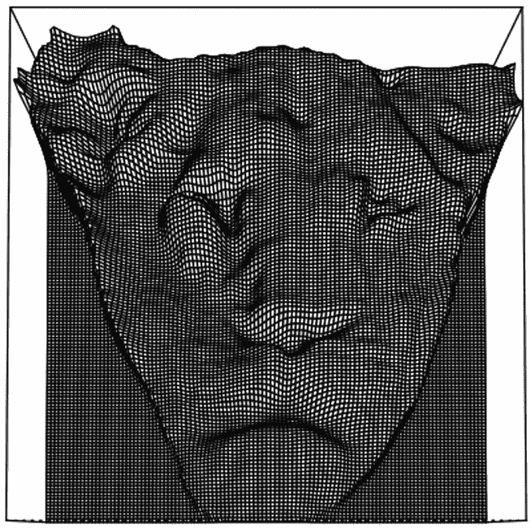

图 1-15：在几何上视为 3D 数学表面的图 1-14 中的母狮头部。

使用计算几何方法来量化峰值和谷值在图像识别和分类之外还有应用。科学家可能想要了解科学现象的动态过程或结构，比如水流或光线在物体上的流动。物体的峰值、谷值和轮廓会影响光线撞击物体时的散射方式，也会决定液体在物体上流动的方式。我们将在本书的后面部分讨论如何挖掘相关峰值、谷值和轮廓的数据。

### 文本数据

近年来崭露头角的另一种“非结构化”数据形式是文本数据。这里，数据带有的结构不像图像那样是空间性的；而是语言性的。最先进的文本处理（例如，谷歌用于处理搜索短语或 Facebook 和 Twitter 用于检测违反平台政策的帖子）利用深度学习来创建一种称为*向量嵌入*的东西，将文本转换为**Rd，其中每个单词或句子都表示为欧几里得向量空间中的一个点。每个单词或句子的坐标是通过阅读大量文本数据学习到的，并且深度学习算法以一种方式选择它们，从本质上将语言意义转化为几何意义。我们将在第九章中探讨深度学习文本嵌入。

**例如，我们可能想要可视化关于文档的不同变量集。由于变量形成了一个高维空间，我们无法以人类可视化的方式绘制它们。在后面的章节中，我们将学习将高维数据映射到低维空间的几何方式，以便数据可以在图中轻松可视化。我们可以根据文档类型或其他相关文档属性在这些图中使用颜色或不同形状进行装饰。如果类似的文档在这些图中聚集在一起，那么涉及的一些变量很可能会帮助我们区分文档。具有未知属性但对这些变量进行了测量的新文档可以通过分类算法进行分组。我们将在第九章进一步探讨这一点。

## 摘要

本章简要回顾了传统机器学习的主要概念，但是在这些概念上加入了几何视角，这对大多数读者可能是新鲜的。在这次回顾中，还讨论了数据结构的含义。主要的观点是，基本上所有的数据都有意义的结构，但这种结构通常是几何性质的，需要几何工具将数据整理成更传统的电子表格格式。这是本书将在全书中更深入探讨的主题。本章还暗示了电子表格数据中一些重要的几何隐藏内容。本书的主要目标之一是展示如何利用这些隐藏的几何特性来提升机器学习算法的性能。

在第二章和第三章，我们将深入探讨用于分析网络数据的算法，包括社交网络和地理网络。这些算法涵盖了用于理解网络结构及个体在网络中角色的本地和全局度量标准，为网络数据开发的聚类方法，用于预测网络中新边的链接预测算法，以及用于理解网络中过程或传染病传播的工具。****
