# 网络的几何结构


网络，在第一章中我们曾简要接触过，已经在我们生活中扮演着越来越重要的角色；因此，网络数据在数据科学中的作用也越来越大。我们如何衡量社交媒体上用户的影响力？或者评估计算机网络对黑客的抗压能力？或者识别连接不同社交群体的人？这些问题都涉及到网络的几何结构，它们都是我们将在本章探讨的概念的例子。

本章将从一个简短的动机部分开始，论证为什么网络数据是现代数据科学中的一个重要话题，并且大大受益于几何推理。接着，我们将介绍网络理论中的基本概念和定义，它们源自图论这一数学语言。本章的主要内容将是对与网络及其顶点相关的各种量的引导性介绍。最后，我们将简要回顾几种在文献中广泛研究并且在 R 语言中容易生成的随机网络类型。

## 网络科学简介

*网络科学*，研究实体通过相互关系的方式进行的学科，是一个重要的跨学科领域，自从社交网络的兴起以来，已经在数据科学中得到了广泛应用。正如我们在第一章中看到的，网络数据在传统意义上是“非结构化”的，但在其他方面它却高度结构化。从数学角度来看，网络根植于一种叫做*图论*的学科，它将实体和关系提炼成其抽象本质。网络在几何上是丰富的，但它们的几何形态不同于我们通常所理解的欧几里得几何中的角度和直线。为了从网络中提取洞察力，我们必须摆脱电子表格中的欧几里得世界，转而拥抱一种更加奇特的几何学，在这种几何学中，球体看起来与我们习惯看到的圆形物体完全不同。

让我们考虑一个社交媒体的例子。像 Facebook 这样的社交平台上的用户形成了一个网络，距离可以通过连接两个个体的最小友谊数量来定义。这种距离的概念支撑了几种衡量用户在网络中中心性的方法，我们可以用这些方法来量化“影响者”。例如，我们可以计算与 Facebook 用户账户直接连接的朋友数量，或者计算有多少朋友的朋友存在。一个人可能没有很多直接的联系，但可能有许多连接良好的朋友。换句话说，即使某个用户的直接社交圈很小，他也可能拥有一个很大的影响力圈。网络的几何学还允许我们通过衡量一个用户的网络与其他用户的网络相比有多不可能，来检测异常值；这有助于社交媒体平台自动检测不真实的账户。

网络基础的异常值检测在最近一起关于选区划分（选区操控）的问题中得到了一个迷人的应用。在 2018 年之前，宾夕法尼亚州的国会选区地图被广泛认为是支持共和党的党派划分结果，但法院并不信服，直到一组专家引入了网络科学。他们展示了可以将选区地图视为网络，并通过在地图网络空间中计算随机游走来统计性地探查这些网络的几何结构，结果发现宾夕法尼亚州的地图偏离了平均值几个标准差。当时正在考虑的新地图恰好位于地图钟形曲线的中间。他们得出结论，旧地图极不可能是自发形成的；它如此不寻常，以至于必须是地图绘制者（他们依赖当时在职的共和党人）故意设计的，目的是增加共和党席位的数量。相比之下，新地图则典型得多（且更公平）。法院被这一网络分析说服，于是 2018 年废除了旧地图，采用了新地图。

即使在那些表面上看起来与网络无关的情景中，有时也可以将数据视为网络数据——这样做就可以利用一套丰富的工具，这些工具借鉴了网络几何的非凡特性。

本章重点介绍了网络的几何结构及其如何用于定义一系列度量，这些度量量化了网络形状和结构的各个方面。在下一章中，我们将应用这些度量来探索机器学习和其他形式的网络数据分析。让我们正式开始我们的旅程。

## 网络理论基础

网络传递的是实体之间的成对关系，实体可以是个人、物体、项目等等。这些实体通过*顶点*（也叫*节点*）表示，而实体对之间的关系则通过*边*连接相应的顶点。以下是一些已经作为网络研究的实体和关系的例子：人们之间的电话和短信、在生物通路中相互作用的蛋白质、通过道路连接的城镇、通过页面链接连接的网站、在同一任务中被激活的大脑部分、语言中词语或词性之间的关系——这只是流行例子的一小部分。

在绘制网络时，顶点通常用点表示，有时还会用符号装饰，以便我们知道每个顶点代表的是哪个；边通常是直线段，尽管有时为了避免人工边交叉，可能会选择将一些边绘制成曲线弧。重要的是顶点的集合和它们之间的边，而不是边的长度、角度或顶点的位置。事实上，如图 2-1 所示，同一网络可以有不同的绘制方式。

这些网络具有相同的顶点和连接顶点的相同边，但这些关系的绘制方式有所不同。无论我们如何可视化这些关系，它们的基本结构不会改变。

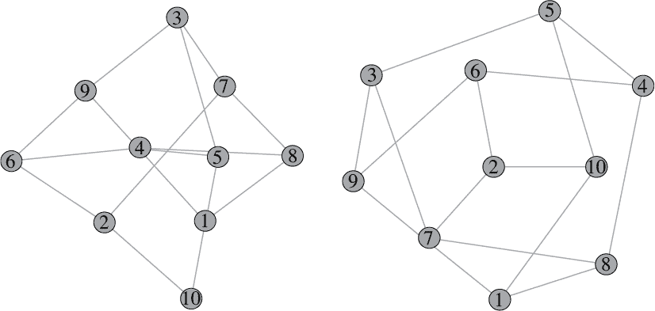

图 2-1：同一网络的两种不同绘制方式。它们具有相同的顶点和相同的连接顶点的边，但关系的绘制方式有所不同。无论我们如何可视化这些关系，它们的基本结构并没有变化。

### 定向网络

如果边表示单向关系（即它们从一个顶点指向另一个顶点，前者称为*源*，后者称为*目标*），那么网络就是*定向的*；否则，边表示的是相互关系，网络就是*无向的*。例如，对于电话交谈，我们可以创建一个无向网络，在每两个有过通话的人之间绘制一条边，或者我们可以创建一个定向网络，用边表示从源人物到目标人物的外拨电话。

具体来说，假设我们有三位同事：Sadako、Pedro 和 Georg。Sadako 是项目负责人，因此她会联系 Pedro 和 Georg。Pedro 联系 Georg，询问项目中与工程方面有关的问题，但 Georg 既没有联系 Pedro，也没有联系 Sadako。Pedro 不会联系 Sadako，因为当 Sadako 联系他时，他已经收到了指示。图 2-2(a)展示了这三位同事的无向网络，而图 2-2(b)展示了定向网络。

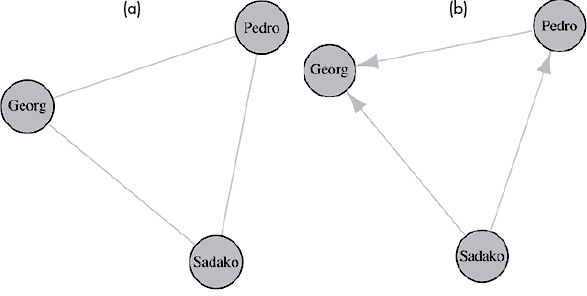

图 2-2：三位同事之间的电话网络，其中(a)是无向的，(b)是定向的

定向网络的其他例子包括旅行路线、机器和社会过程、通过针头传播追踪流行病，以及生物过程模型。从数学角度讲，Facebook 和 Twitter 之间最大的区别在于，Facebook 是一个无向网络（朋友关系是相互的），而 Twitter 是一个定向网络（用户既有粉丝，也有被关注的账户）。

### R 中的网络

在计算机中表示网络的两种主要方式。*边列表*只是按任意顺序列出网络中所有边，通过命名每条边的两个顶点（如果网络是有向的，则第一个顶点被视为源，第二个顶点被视为目标）。在 R 中用于处理网络数据的一个有用包是 igraph 库（在 Python 中也有类似的命令和语法）。要从边列表创建图 2-2(b)中的有向网络，可以使用列表 2-1 中的代码。

```
library(igraph)
edges<-rbind(c("Sadako","Pedro"),c("Sadako","Georg"),c("Pedro","Georg"))
g_colleagues<-graph.edge(edges,directed=T)
```

列表 2-1：从边列表生成图 2-2(b)中的有向网络的脚本

网络的另一种表示形式是电子表格。如果一个网络有*n*个顶点，其*邻接矩阵*是*n*×*n*的矩阵，其行和列由顶点索引，其中（*i, j*）条目中的 0 表示从顶点*i*到顶点*j*没有边，而该条目中的 1 表示存在这样的边。如果网络是无向的，则邻接矩阵是对称的（等于其自身的转置，意味着在交换其行和列时保持不变），因为在这种情况下，从顶点*i*到顶点*j*有边与从顶点*j*到顶点*i*有边是相同的。图示 2-2 提供了使用 R 代码从邻接矩阵而不是边列表构建前述有向网络的代码。

```
library(igraph)
adjmat<-matrix(c(0,0,0,1,0,0,1,1,0),nrow=3)
rownames(adjmat)<-c("Sadako","Pedro","Georg")
colnames(adjmat)<-c("Sadako","Pedro","Georg")
g_colleagues<-graph_from_adjacency_matrix(adjmat,mode="directed",weighted=T)
```

列表 2-2：从邻接矩阵生成图 2-2(b)中的有向网络的脚本

邻接矩阵方法的一个主要优势是将网络置于线性代数的框架中，这里有许多强大的工具可用。例如，我们可以利用邻接矩阵的谱理论（特征值和特征向量）来衡量网络中的中心性。邻接矩阵也可以很容易地推广到*加权网络*；通过允许任意数作为条目（而不仅仅是讨论过的二进制 0 和 1 条目），我们可以为每条边分配一个实数权重，传达该边表示的关系的强度。实际上，这可以用来表示许多不同的重要概念：电话网络中同事之间的通话量，交通网络中位置之间的距离等。你可以把无权网络看作是所有边权重均等于 1 的加权网络。事实上，这就是为什么在图示 2-2 中，尽管我们想要创建无权网络，我们还是将`weighted`参数设置为`T`（true）的原因，否则 igraph 会以不同的方式解释邻接矩阵。

### 网络中的路径和距离

如果两个顶点通过一条边相连，则称它们为*邻居*。在网络中，如果两条边有一个公共顶点，则它们是*相邻的*。网络中的*路径*是一系列相邻的边。如果网络是有向的，则路径中的所有边必须具有兼容的方向。例如，在图 2-2(b)中，我们有一条从 Sadako 到 Pedro，再到 Georg 的两条边的路径，还有一条从 Pedro 到 Georg 的一条边的路径，但从 Pedro 到 Sadako 再到 Georg 不是一条路径，因为这些边的方向不一致。

*路径*的*长度*有两种不同的含义，取决于网络是加权的还是无加权的。在无加权网络中，路径的长度是路径中边的数量；在加权网络中，路径的长度是路径中各边权重的总和。两个顶点之间的*网络距离*是连接它们的最短路径的长度，前提是从一个顶点到另一个顶点存在路径（如果没有路径，网络距离是未定义的）。我们—包括我们自己—通常会说“最短”路径，而不是“最小长度”路径，因为这样听起来更自然。这对于加权网络来说有点误导，因为最小长度路径实际上是权重最小的路径，而不一定是路径中边数最少的最短路径。然而，如果我们小心一点，这只是一个术语上的小瑕疵，我们可以接受。

作为一个例子，让我们考虑图 2-3 中的加权无向网络，表示四个城镇及其之间道路的长度（单位：英里）。

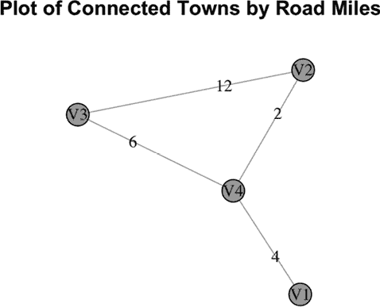

图 2-3：城镇连通性图及连接城镇之间的道路英里数

V2 和 V3 之间的最短路径是经过 V4 的 8 英里路程，而不是直接连接这两个城镇的 12 英里道路。因此，V2 和 V3 之间的网络距离是 8 英里，而不是 12 英里。请注意，这张图中的边和路径的物理长度并不代表由权重定义的长度；换句话说，网络图中的欧几里得距离与网络距离无关！通过 igraph 绘制的网络中，顶点的位置是出于美学原因选择的（例如，为了最小化边的交叉），而不是反映边的权重。刚开始时可能有些难以适应，但随着时间的推移，会变得很自然。列表 2-3 提供了创建和绘制此示例网络的 R 代码。

```
#create symmetric matrix of town connections and miles between each town
towns<-matrix(c(0,0,0,4,0,0,12,2,0,12,0,6,4,2,6,0),nrow=4)

#label the rows and columns so the towns have names
rownames(towns)<-c("V1","V2","V3","V4")
colnames(towns)<-c("V1","V2","V3","V4")

#create a weighted undirected network from this adjacency matrix
library(igraph)
g_towns<-graph_from_adjacency_matrix(towns,mode="undirected",weighted=T)

#plot town graph with edges labeled by weights
plot(g_towns,edge.label=E(g_towns)$weight,main="Plot of Connected Towns by Road Miles",vertex.color=2,vertex.size=20)
```

列表 2-3：生成图 2-3 中连接的城镇网络并绘制它的脚本

网络距离在现实世界中的问题中可能起着重要作用。在 2018 年刚果民主共和国东部的埃博拉疫情爆发期间，城镇之间有限的物理路线影响了疫情的传播、医疗物资和人员的供应链物流，以及受影响城镇和没有活跃病例的城镇之间的人口流动。

关于加权网络的一个注意事项：我们往往认为相互接近的顶点（由网络距离定义）是最相关或连接最紧密的。这意味着边的权重越小，所代表的关系就越强。因此，在设置网络中的权重时，你通常会希望使用倒数。例如，在加权电话网络中，而不是将 A 和 B 之间的权重设置为它们之间的通话次数*c*[AB]，你应该将其设置为倒数 1/*c*[AB]，这样与彼此频繁通话的人在加权网络中会更接近（而不是更远）。在第三章中，我们将重新审视图 2-3 中的城市网络，并将权重倒过来，使它们代表接近性而不是距离。

为了开始探索网络距离所建立的几何结构，我们现在将转向一些网络中的中心性（也可以理解为重要性或影响力）概念。由于我们在本章中将始终依赖于 igraph 库，我们将不再在代码片段中包含`library(igraph)`；因此，在运行以下任何代码示例之前，请确保加载该库。

## 网络中心性度量

测量网络中每个顶点的*中心性*或重要性，可以让你手动分析网络的结构和功能行为。它还经常用于特征提取，因为中心性度量提供了数值特征，这些特征可以输入到传统的监督和无监督机器学习算法中，正如我们在第三章中将看到的那样。换句话说，中心性度量为网络数据提供了一种更传统的电子表格结构。量化顶点中心性的方法有很多，几乎所有方法都涉及前一节中的一些概念——路径、网络距离和邻接矩阵。

中心性有许多现实世界的应用。在流行病学中，接触追踪网络中更中心的个体往往会传播疾病给更多人，而较不中心的个体传播的疾病较少。事实上，中心个体通常与更多人相连，此外，中心个体往往会将一些原本不太可能相遇的群体连接起来——从而为这些群体之间提供传播疾病的桥梁。在社交媒体中，中心个体就是那些“网红”，他们的意见被许多人听到并广泛传播。在市场营销中，中心个体可以作为广告活动的有利媒介。在犯罪学中，识别毒品分销或有组织犯罪网络中的中心个体可以帮助执法机构更有效地开展行动。在科学研究中，引用网络中的中心性有助于揭示高影响力的出版物。

中心性度量指标远比本章所能涵盖的要多，因此我们将重点介绍一些在 igraph 库中实现的流行指标。

### 顶点的度

顶点的最基本中心性度量是其*度*，按照定义，它是与该顶点相连的边的数量。在有向网络中，这可以分为两个部分：*入度*计算的是将该顶点作为目标顶点的边的数量，*出度*计算的是将该顶点作为源顶点的边的数量。在 Facebook 网络中，你的度是你的朋友数量；在 Twitter 中，你的入度是你的粉丝数量，而你的出度是你关注的账户数量。回到图 2-3，城镇 V2 和 V3 的度都是 2，而 V1 的度是 1，V4 的度是 3。

在加权网络中，你还可以衡量一个顶点的*强度*（也称为*加权度*），即与该顶点相连的所有边的权重之和。在图 2-3 中，城镇 V1、V2、V3 和 V4 的强度分别为 4、14、18 和 12。由于无权网络可以视为所有边的权重均为 1 的加权网络，因此顶点的度实际上是强度的一个特例。

尽管其简单性，顶点的度是一个有价值的度量。它是大多数社交媒体平台公开列出的每个账户的唯一数值指标，通常用于确定影响者在营销活动中推广产品时的报酬。然而，它也有显著的局限性。顶点的度衡量的是该顶点直接连接网络的大小，但它并没有反映网络的结构，也没有考虑这些直接连接之外的内容。为了说明这一点，假设有一个 Twitter 用户拥有 10,000 个粉丝，而这些粉丝每个只有少量粉丝；现在将此与另一个只有几百个粉丝，但其中一些粉丝是极具影响力的用户进行比较。虽然第一个用户的度更高，但哪个用户的推文更可能最终获得更多转发？这个例子提示了网络涉及的既有广度又有深度，而度更侧重于前者。

另一个关于度的示例，说明度能捕捉到什么，不能捕捉到什么，假设在一个接触追踪网络中有两个个体。假设一个用户有更多的联系人（因此度更高），但这些联系人大多数彼此之间已经互相关联，而另一个用户有较少的联系人，但这些联系人分布在多个几乎没有互动的社区中。（稍后在本章中，我们将看到这种情况的具体例子。）在疫情爆发期间，哪个个体的流行病学风险更大？

度数的这两个限制——忽略网络深度和忽略社区桥接属性——是我们必须深入研究网络几何学的主要原因之一。那么，接下来让我们简要地浏览一下超越度数的顶点中心性度量方法。

### 顶点的接近度

如何判断一个顶点是位于网络中心附近，还是位于边缘附近呢？一个顶点的*接近度*，定义为该顶点与网络中每个其他顶点之间的网络距离之和的倒数，旨在捕捉这一区别。一个位于网络中心的顶点与其他顶点的距离相对较小，而一个位于边缘的顶点可能与某些顶点的距离适中，但与网络“另一端”的顶点的距离较大。这意味着中心顶点的距离之和小于边缘顶点的距离之和；倒数这个和会反转这个关系，使得中心顶点的接近度得分大于边缘顶点的得分。

在图 2-3 中，你可能直观地猜测 V4 是最中心的，V2 和 V3 是适度中心的，而 V1 是最边缘的。实际上，如果我们忽略边的权重，并将其作为一个无权重的网络来计算接近度得分，我们得到 V1、V2、V3 和 V4 的接近度分别为 0.20、0.25、0.25 和 0.33。例如，V2 的接近度是 1/(1 + 1 + 2)。当使用边的权重时，我们得到的接近度得分为 0.05、0.06、0.04 和 0.08，因此 V4 仍然是最中心的，但现在 V3 是最边缘的；这是因为边的权重使得 V3 与其他顶点的网络距离相对较大。

### 顶点的介数

一个顶点的*介数*通过计算有多少条路径经过该顶点来衡量中心性；更精确地说，它是网络中所有其他顶点对之间最短路径的分数之和，这个分数表示每对顶点之间的最短路径中经过该顶点的比例。当考虑图 2-3 作为一个无权重的网络时，V1 的介数为 0，因为没有剩余顶点之间的最短路径经过 V1。V2 和 V3 也是如此。然而，V4 的介数是 2 = 1 + 1 + 0，因为 V1 和 V2 之间有一条最短路径经过 V4，V1 和 V3 之间有一条最短路径经过 V4，而 V2 和 V3 之间的最短路径不经过 V4。

在图 2-4 中，每个顶点的介数得分为 0.5。例如，对于 V1，V2 和 V4 之间的单边路径不经过 V1，V3 和 V4 之间的单边路径也不经过 V1，而 V2 和 V3 之间有两条最短路径，其中一条经过 V1，合计得到介数得分为 0 + 0 + 1/2。

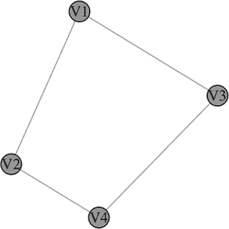

图 2-4：一个四个顶点连接成正方形的网络

如果你将网络看作是编码某物（材料、信息、疾病、交通等）如何在实体之间流动的方式，那么最短路径就是最有效的旅行路线。中介中心性衡量的是移除一个顶点对这些路线的破坏程度。例如，在一个货运配送网络中，一个顶点的中介中心性表示如果某个配送中心关闭（不包括以该配送中心为起点或终点的路线），有多少条运输路线会受到影响，并按影响的程度加权。图 2-3（视为无权网络）中，移除 V1 并不影响其他城市之间的运输路线（中介中心性为 0），但移除 V4 会完全中断两条运输路线（中介中心性为 2）。在图 2-4 中，移除 V1 会影响 V2 和 V3 之间的运输，但只中断它们之间一半的运输路线（中介中心性为 0.5）。中介中心性在估算破坏潜力方面有很多实际应用；例如，它可以帮助识别计算机网络中需要保护的重要服务器（或者在对抗性攻击中最有效的攻击目标！）。

尽管接近中心性和中介中心性衡量的是顶点中心性的不同方面，但它们都基于网络中的最短路径。两点之间的最短路径在几何学中有一个特殊的名称，叫做*测地线*，我们将在第四章、第五章和第六章中更广泛地讨论这一概念。

本节中我们将介绍的所有剩余的中心性度量都是基于邻接矩阵的，可以将它们视为著名的 PageRank 算法的变种，Google 最初使用该算法（并且在某些方面仍在使用）来通过估算在有向网络中顶点的关联性来对搜索结果进行排名，其中顶点是网站，边是链接。接下来的这些中心性度量涉及的数学更加复杂，但我们会尽量突出主要思想和大致框架。实际上，发展对这些中心性分数所传达信息的直觉要比理解它们计算的细节更为重要。

### 特征向量中心性

基于邻接矩阵的中心性度量旨在捕捉基本思想：一个顶点的重要性由它所连接的顶点的重要性决定。这就是之前提到的*网络深度*概念的体现。例如，在社交媒体上，重要的并不仅仅是你拥有多少个粉丝，更重要的是你的粉丝拥有多少粉丝，他们的粉丝又有多少粉丝，依此类推。

让我们把这个思想说得更精确一些。假设我们想为每个顶点 *i* 分配一个重要性得分 *x*[*i*]。一个简单的模型是，假设每个顶点的重要性与其邻接顶点的重要性的加权和成正比：

x[i] = c∑[^(a[ij]x[j])]

其中，求和是针对与顶点 *i* 邻接的顶点 *j*，*a*[*ij*] 是顶点 *i* 和顶点 *j* 之间边的权重，*c* 是一个比例常数，我们假设它与 *i* 无关。这个公式可以表示为矩阵方程：

x⃗ = cAx⃗

其中，***A*** 是网络的邻接矩阵。你可能还记得线性代数中的内容，这个方程规定了顶点重要性向量 *x⃗* 是邻接矩阵的一个 *特征向量*，而 1/*c* 是相应的 *特征值*。当将矩阵视为线性变换时，特征向量是被拉伸但不旋转的方向，特征值则衡量这些方向被拉伸的程度。

矩阵通常有许多不同的特征向量和特征值，并且特征值不一定是实数，所以乍一看，前述的顶点分配问题可能有许多不同的解——其中一些可能涉及复数值。然而幸运的是，如果我们不允许负的边权重和重要性得分，那么称为 *佩龙-弗罗贝纽斯定理* 的定理保证我们可以找到唯一的实数解。换句话说，满足非负性条件时，总是存在一种唯一的方式来为网络中所有顶点分配重要性得分，从而满足我们所有的线性邻居影响条件。几乎是这样：为了保证唯一性，我们需要对重要性得分进行归一化（例如，按比例缩放，使得网络中任何顶点的最大重要性得分为 1）。这样做就能得到顶点的 *特征向量中心性* 得分。

在图 2-3 中，当将网络视为无权网络时，V1、V2、V3 和 V4 的特征向量中心性得分（四舍五入到小数点后两位）分别为 0.46、0.85、0.85 和 1。这与我们直觉一致，V4 是最中心的，而 V1 是最不中心的。当作为加权网络计算时，使用该图中显示的边权重，得分则分别为 0.16、0.91、1 和 0.59。因此，在加权网络中，V1 仍然是最不中心的，但最中心的是 V3。

特征向量中心性（eigenvector centrality）的主要观点是，邻近特征向量中心性得分较高的顶点，其特征向量中心性也较高。用社交网络的术语来说，这意味着你的重要性由你朋友的重要性决定。

我们可以通过从随机游走的角度更精确地解释特征向量中心性。假设你从一个随机顶点开始，不断地选择一个与你当前顶点相连的边来进行随机行走。如果网络是无权的，那么你以相等的概率选择这些边，而如果网络是加权的，则选择边的概率与边的权重成正比。特征向量中心性得分与你在这些随机游走中花费在每个顶点的时间比例成正比。例如，如果网络代表的是万维网（其中顶点是网站，边是链接），那么特征向量中心性反映了如果用户只是随机点击链接，每个网站所获得的流量。

特征向量中心性的一个缺点是，如果两个网络部分之间没有路径连接，随机游走者永远无法在这两部分之间移动。换句话说，每个随机游走者只能局限于它开始时所在的“岛屿”（或者用更数学化的术语，*连通分量*）。对于有向网络，这个问题尤其严重，因为边只能朝一个方向遍历：如果随机游走者到达死胡同，它将永远被困在那里。帮助随机游走者越过岛屿和死胡同的一种方法是允许它们随机跳跃到网络中的不同位置。这正是我们接下来要看的度量方法的主要思想。

### PageRank 中心性

Google 的*PageRank 中心性*只是特征向量中心性的一个小修改；它在计算特征向量之前，将邻接矩阵替换为一个缩放版本。在图 2-3 中，V1、V2、V3 和 V4 的 PageRank 分数，计算为一个无权网络，分别为 0.13、0.25、0.25 和 0.37。

理解 PageRank 的最佳方式是从随机游走的概率角度来看。我们与特征向量中心性时玩的游戏相同，只不过现在每一步有两种可能性：随机游走者要么像之前一样穿越一条相连的边，要么直接跳到网络中的一个随机顶点。在万维网的例子中，这意味着人们既可以点击链接，也可以直接在浏览器中输入 URL。跳跃的能力帮助随机游走者探索网络的更大范围，这有助于提升这个中心性分数所捕捉的信息，相比于特征向量中心性，它能提供更多的网络覆盖。

### Katz 中心性

另一个有用的中心性度量是*Katz 中心性*（有时也称为*Bonacich 中心性*或*alpha 中心性*），它本质上是度数概念的“高阶”扩展。在一个无权网络中，Katz 中心性是一个加权和，表示可以通过长度为 1 的路径到达的顶点数量（这与度数相符）、可以通过长度为 2 的路径到达的顶点数量、可以通过长度为 3 的路径到达的顶点数量，依此类推。这个加权和中的权重由路径长度和一个用户指定的“衰减”参数（称为*alpha*）决定，alpha 的取值范围从 0 到 1。更准确地说，长度为*d*的路径的权重为*α*^(*d*)。这意味着，越远的顶点，其对加权和的贡献越小。

例如，在社交网络或社交媒体中，你的 Katz 中心性最大贡献者是你的朋友数量，接下来最大贡献者是这些朋友的朋友数量，依此类推。简而言之，Katz 中心性是度数的一个更复杂版本，深入探讨了你网络的整体连接性。事实证明，特征向量中心性是 Katz 中心性在衰减参数趋近于某个特定值时的极限。然而，在选择参数 alpha 时要小心；你应该始终选择它小于网络的*谱半径*的倒数（我们将在“全局网络度量”部分讲解）；如果你不这样做，igraph 不会给你报错或警告信息——你只是会得到一些不合理的值，例如某些顶点的负得分。

### 中心节点与权威节点

另一种推广特征向量中心性的方式是为每个顶点提供两个独立的重要性得分，而不仅仅是一个。最常见的形式被称为*权威性和中心性*。从概念上讲，*权威性中心性*衡量的是网络中多少知识储存在某个顶点，而*中心性*衡量的是一个顶点有多好地知道如何找到这些知识（即快速访问附近顶点中存储的信息）。这两者是相互关联的：强大的中心节点往往连接到强大的权威节点。中心节点通常在相关顶点之间有很高的连接率，这有助于快速共享信息。

## 在示例社交网络中度量中心性

为了更好地理解所有这些顶点中心性度量，可以考虑一个比我们之前考虑的更有趣的网络示例。Listing 2-4 中的脚本加载并绘制了一个来自文件的网络，该文件表示本书其中一位作者（Farrelly）的社交网络。你可以在本书的网页上找到这个数据集及其他文件：[`nostarch.com/shapeofdata`](https://nostarch.com/shapeofdata)。

```
#load data including no header
mydata<-as.matrix(read.csv("SocialNetwork.csv",header=F))

#convert data to graph
g_social<-graph_from_adjacency_matrix(mydata,mode="undirected",weighted=T)

#plot graph
plot(g_social,main="Farrelly's Social Network",vertex.size=15,vertex.label.cex=0.5,vertex.color=2)
```

清单 2-4：一个脚本，用于加载社交网络数据集，将其转换为图对象，然后绘制图形

图 2-5 显示了生成的网络图（每次运行该脚本时，结果会略有不同）。

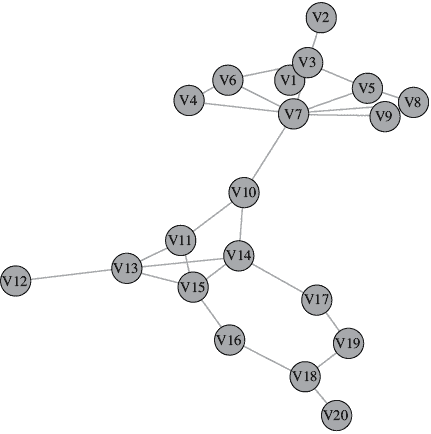

图 2-5：Farrelly 社交网络数据集的图，展示了她的医学院服务小组（上方簇）和退伍军人组织小组（下方簇）之间的连接，其中顶点 7（即 Farrelly 本人）充当了桥梁

发展中心性度量直觉的最佳方法之一是将其绘制为顶点大小参数。（更一般来说，使用顶点大小来展示与网络顶点相关的任何数值属性是一种出色的可视化技术——这可以视为气泡图在网络中的应用。）由于不同中心性度量的范围各不相同，接下来我们将重新缩放每个度量值，使其最大值为 20，因为这似乎能提供比较清晰的图形。清单 2-5 提供了我们用来绘制每个度量的 R 代码。

```
#betweenness
plot(g_social,vertex.size=20*betweenness(g_social)/max(betweenness(g_social)),vertex.label.cex=0.8,vertex.color=2)

#closeness
plot(g_social,vertex.size=20*closeness(g_social)/max(closeness(g_social)),vertex.label.cex=0.8,vertex.color=2)

#eigenvector centrality
plot(g_social,vertex.size=20*eigen_centrality(g_social)$vector,vertex.label.cex=0.8,vertex.color=2)

#PageRank centrality
plot(g_social,vertex.size=20*page_rank(g_social)$vector/max(page_rank(g_social)$vector),vertex.label.cex=0.8,vertex.color=2)

#Katz centrality (with alpha parameter set to 0.2)
plot(g_social,vertex.size=20*alpha_centrality(g_social,alpha=0.2)/max(alpha_centrality(g_social,alpha=0.2)),vertex.label.cex=0.8,vertex.color=2)
```

清单 2-5：一个脚本，用于为 Farrelly 社交网络数据集中的每个中心性度量创建气泡图网络图

我们先从接近中心性和介数中心性开始，如 图 2-6 所示。

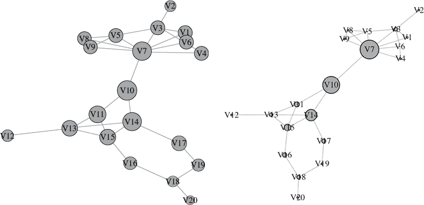

图 2-6：Farrelly 社交网络数据中接近中心性（左）和介数中心性（右）的气泡图

这里的接近得分似乎能够捕捉到我们期望的结果。位于网络中心的顶点较大，而位于外围的顶点较小。注意，这种中心性概念是基于网络的全局几何形态。例如，V10 的接近中心性得分最高，因为它在整个网络中居于中心位置，尽管它对于两个主要簇（医学院朋友和退伍军人朋友）来说是外围的。

介数中心性（如你所记，旨在捕捉当移除某个位置时，会最大程度地破坏网络流动的地方）为 V7 和 V10 提供了比所有其他顶点更大的得分——这两者是连接网络中两个主要簇的桥梁。V14 的介数得分也相对较大，尽管比 V7 和 V10 小，这表明许多（但不是所有）两个主要簇之间的最短路径都会经过这个顶点。

接下来，我们来看一下 图 2-7 中显示的特征向量中心性和 PageRank 中心性得分。

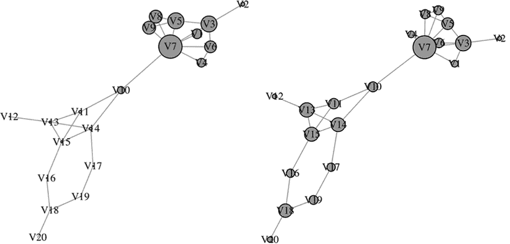

图 2-7：Farrelly 社交网络数据中特征向量中心性（左）和 PageRank 中心性（右）的气泡图

对于这两种度量，V7（代表 Farrelly 本人）具有最高的值，而且这些值在医学院集群中呈现出一种方式，至少直观上，确实能够捕捉到中心性或重要性的概念。也许这张图最引人注目的是这两种紧密相关的基于特征向量的度量之间的对比。对于特征向量中心性，医学院集群中的值完全压倒了老兵组织集群的值，而 PageRank 中心性似乎更能反映出两个集群内部的中心性和重要性。这种差异的原因在于，随机游走中，人们通常选择相邻的顶点以相等的概率遍历，容易在高度互联的医学院集群中徘徊，并且几乎没有概率走出这个集群，走向 V7 到 V10 之间的唯一一条边。而 PageRank 中心性则在随机游走中引入了一个固定的跳跃概率，帮助它们进入老兵组织集群。

在图 2-8 中，我们展示了 Katz 中心性，正如你所记得的，它是度数的一个高阶版本，不仅考虑邻居的数量，还考虑邻居的邻居数量，依此类推。我们通过指定来自高阶连接的影响衰减率，计算了两个不同的衰减参数 alpha 值下的 Katz 中心性。

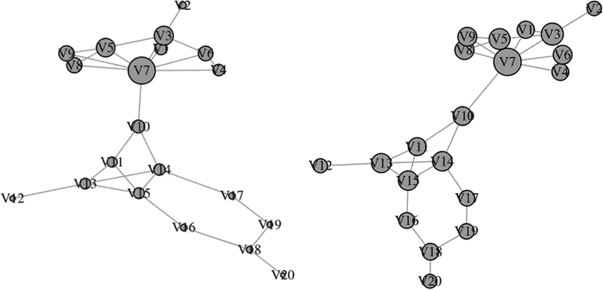

图 2-8：Farrelly 社交网络数据上，衰减参数 alpha = 0.2（左）和 alpha = 0.1（右）时 Katz 中心性的气泡图

结果表明，这个网络的谱半径大约为 4，因此我们需要选择小于 0.25 的 alpha 值（这里选择了 0.2 和 0.1）。我们可以看到，无论选择哪种 alpha 值，都将 Farrelly 的 V7 识别为最中心的顶点，但对于较大的 alpha 参数（左图），得分在 V7 附近保持相对较高，随后迅速衰减。而对于较小的 alpha（右图），衰减则不那么陡峭，Katz 中心性得分在整个网络中更加均匀分布。左图更有可能捕捉到我们通常认为的中心性或重要性，通常建议选择一个非常接近谱半径倒数的 alpha 值（绝对不要选择 igraph 中的默认值 1）。

最后，让我们分析权威性和中心性。在无向网络中，这两个度量是重合的，因此我们首先将网络转换为有向网络。由于在这个社交网络中没有自然的好友关系方向，我们将人工进行如下转换：对于网络中的每条边，例如在顶点 *i* 和顶点 *j* 之间，以三分之一的概率将其转换为从 *i* 到 *j* 的单向边，三分之一的概率将其转换为从 *j* 到 *i* 的单向边，三分之一的概率保持为双向边。列表 2-6 显示了执行此操作的代码，并绘制了结果中的中心性和权威性分数。

```
#randomly remove some entries in the adjacency matrix
mydata_directed<-mydata
for (i in 1:20){
  for (j in i:20){
      rand<-runif(1)
      if(rand < 0.33){mydata_directed[i,j]<-0}
      if(rand >= 0.33 & rand < 0.66){mydata_directed[j,i]<-0}
  }
}

#use this modified adjacency matrix to create a directed network
g_directed<-graph_from_adjacency_matrix(mydata_directed,mode="directed",weighted=T)

#plot the hub centrality and authority centrality for this directed network
plot(g_directed,vertex.size=20*hub_score(g_directed)$vector,vertex.label.cex=0.8,vertex.color=2,edge.arrow.size=0.4)
plot(g_directed,vertex.size=20*authority_score(g_directed)$vector,vertex.label.cex=0.8,vertex.color=2,edge.arrow.size=0.4)
```

列表 2-6：将 Farrelly 的社交网络转为有向网络，并绘制结果中的中心性和权威性分数的脚本

图 2-9 显示了结果图。

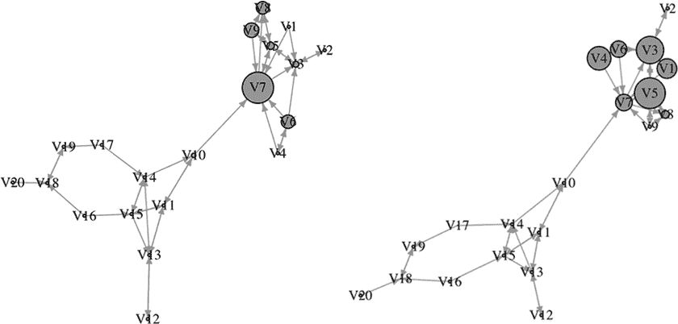

图 2-9：Farrelly 社交网络的有向版本中，中心性（左）和权威性（右）的气泡图

由于医学院群体的高互联性，医学院成员的中心性分数高于退伍军人群体，Farrelly 的顶点 V7 在该网络中作为一个重要的中心存在。许多医学院成员指向 V5 和 V3，这使得这些顶点具有较高的权威性分数，而 V7 的权威性分数相对较低。这表明，V3 和 V5 是该社区内信息的主要来源，他们将信息传递给 V7，后者再与其他医学院成员分享；相反，退伍军人群体成员之间缺乏一个集中的结构，信息流动效率也较低。

现在我们已经通过可视化方式探讨了所有这些中心性度量，让我们使用其中一些度量来对 Farrelly 的社交网络中的顶点进行排名和比较（回到原始的无向版本）。列表 2-7 中的代码可以与 列表 2-4 中的代码结合，生成一些中心性度量的数据集。

```
#create dataset of a few centrality measures on Farrelly's social network
data_social<-cbind(page_rank(g_social)$vector,degree(g_social),hub_score(g_social)$vector,betweenness(g_social))
colnames(data_social)<-c("PageRank","Degree","Hub Score","Betweenness")
```

列表 2-7：创建 Farrelly 社交网络中几个顶点中心性分数表格的脚本

表 2-1 显示了这些顶点的分数，每列中前两项以粗体显示。

表 2-1：Farrelly 社交网络顶点的中心性度量分数

| **顶点** | **PageRank** | **度数** | **中心性分数** | **介数** |
| --- | --- | --- | --- | --- |
| V1 | 0.032 | 2 | 0.414 | 0 |
| V2 | 0.020 | 1 | 0.168 | 0 |
| V3 | **0.075** | **5** | 0.682 | 19.500 |
| V4 | 0.032 | 2 | 0.370 | 0 |
| V5 | 0.057 | 4 | **0.685** | 2.000 |
| V6 | 0.046 | 3 | 0.505 | 1.000 |
| V7 | **0.111** | **8** | **1.000** | **100.500** |
| V8 | 0.044 | 3 | 0.550 | 0 |
| V9 | 0.044 | 3 | 0.550 | 0 |
| V10 | 0.048 | 3 | 0.306 | **90.917** |
| V11 | 0.050 | 3 | 0.118 | 26.667 |
| V12 | 0.022 | 1 | 0.021 | 0 |
| V13 | 0.069 | 4 | 0.087 | 18.917 |
| V14 | 0.067 | 4 | 0.127 | 61.083 |
| V15 | 0.068 | 4 | 0.088 | 36.000 |
| V16 | 0.040 | 2 | 0.024 | 23.083 |
| V17 | 0.040 | 2 | 0.034 | 21.917 |
| V18 | 0.065 | 3 | 0.009 | 20.250 |
| V19 | 0.043 | 2 | 0.011 | 10.167 |
| V20 | 0.026 | 1 | 0.002 | 0 |

在很大程度上，介数中心性将 V7 和 V10 识别为连接网络的最重要的顶点。然而，V10 的其他中心性得分则要谦逊得多，表明它主要作为社区之间的桥梁，而不是网络的真正中心。这是有道理的，因为 V10 在退伍军人群体中显得相当不起眼。它恰好连接到 Farrelly 的 V7，并通过她连接到医学院社区。另一方面，Farrelly 的 V7 有许多邻居（如度数所示），并且在中心度得分和 PageRank 中排名靠前——这与我们对该网络的概念理解相符，即该网络传递的是两个独立的社区，而 Farrelly 参与其中。

V3 在度数和 PageRank 方面排名第二；此人似乎处于医学院社区的社交中心。V5 具有第二高的中心度得分，表明它靠近医学院社区的重要成员。中心度得分（由于该网络是无向的，因此与权威度得分相同）也将 V12 与 V20 区分开来。两者都是退伍军人群体社区的度数为一的外围顶点，并且 PageRank 和介数中心性得分较低。然而，V12 的中心度得分较高，因为它靠近一个高度互联的小子社区。

## 网络的其他量

网络几何不仅提供了顶点的中心性度量。在本节中，我们将介绍与网络中顶点相关的其他一些有趣的量。示例包括捕捉你朋友之间相识可能性的传递性得分，捕捉当顶点被移除时流量转移程度的效率得分，以及捕捉网络结构扭曲的曲率得分。

### 顶点的多样性

虽然中心性中的枢纽和权威性涉及通过有向网络的信息潜在流动，但与加权网络中的顶点相关的另一个度量则涉及从数学信息理论的角度看待信息。顶点的*多样性*是与该顶点连接的边的权重分布的香农熵（一个衡量变量或一组变量信息内容的分数）的缩放版本。如其名所示，这捕捉了附加在每个顶点上的边的权重多样性。熵在均匀分布时最大，因此当所有边的权重相等时，多样性得分最大（并缩放为 1），随着权重的变化，多样性得分会逐渐下降。可以这样理解：在一个加权网络上进行的随机漫步（概率与边的权重成比例）在多样性得分接近 1 的顶点上最难预测，而在多样性得分较小的顶点上则较为容易预测。

### 三元闭合

网络理论中的一个有用概念是*三元闭合*，即已经拥有一对边的顶点三元组之间形成三角形的趋势。用更通俗的语言来说，这相当于在问你两个朋友是否可能互为朋友。考虑图 2-10 所示的朋友网络。

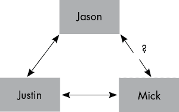

图 2-10：一个有一个友谊链接未知的友谊网络，说明了三元闭合的概念

在这里，贾斯廷和贾森是朋友，贾斯廷和米克也是朋友。问题是贾森和米克是否是朋友。这种情况称为以贾斯廷为中心的*三角形*。如果贾森和米克不是朋友，则称为*开放*三角形；如果他们是朋友，则称为*封闭*三角形。一个大多数为封闭三角形的网络表明高度的凝聚力。在社交网络中，这意味着拥有共同朋友的个体很可能相互认识。另一方面，拥有许多开放三角形的网络可能表明凝聚力较弱，但也可能意味着数据缺失或信息不完整：人们可能不会在社交媒体上添加所有现实中的朋友，情报数据可能不包含恐怖分子小组之间所有的通信形式，等等。在任何现实世界的场景中，可能存在一些关系只是尚未被记录下来。

衡量三元闭合的一种方式是通过*传递性*，它为每个顶点分配一个值，表示以该顶点为中心的三角形中已经闭合的比例。在社交网络中，你的传递性是指你两个朋友相互成为朋友的概率。我们来将以下内容添加到我们从示例 2-6 中的图示集合中：

```
#compute and plot transitivity for each vertex in Farrelly's social network
plot(g_social,vertex.size=20*transitivity(g_social,type="local",isolates="zero"),vertex.label.cex=0.8,vertex.color=2)
```

将名为`type`的参数设置为`local`，会指示 igraph 计算每个顶点周围的传递性，将名为`isolates`的参数设置为`zero`，会强制对度为 1 的顶点的得分设置为 0（否则得分为`NaN`，因为度为 1 的顶点没有围绕它的三角形）。图 2-11 显示了结果图。

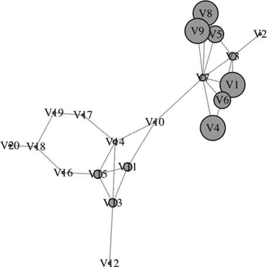

图 2-11：Farrelly 社交网络的传递性气泡图

从另一个角度看，这表明医学院社区比退伍军人社区更具凝聚力，互联性更强。很可能，参加相同课外活动的医学生会在同一班级中互相认识并交流。然而，需要注意的是，Farrelly 的 V7 在医学院个体中的传递性得分相对较低，这意味着尽管该小组整体上比较亲密，但 Farrelly 的一些医学院朋友彼此之间并不是朋友。（V7 的传递性得分还受到影响，因为 Farrelly 的医学院朋友与退伍军人组的朋友 V10 之间没有朋友关系。）

### 一个顶点的效率和离心率

回想一下，我们之前讲过的两个中心性度量，接近度和中介度，是通过网络中最短路径（或*测地线*）的长度来定义的。另一个基于最短路径的有趣度量，叫做*效率*，它是对每个顶点按如下方式定义的：移除该顶点，然后计算所有与该顶点相邻的顶点之间的网络距离。接着，对这些距离的倒数取平均值。移除顶点就像设置了一个路障，而相邻顶点之间的距离则衡量了因路障而必须绕行的距离。倒数这些距离意味着较大的绕行距离会使得效率较低，反之亦然。效率衡量了网络中每个顶点的交通如何容易地被绕过。

效率是探讨网络局部几何结构的一个有用方法。这里的*局部*指的是我们正在探索每个顶点附近的网络几何结构；这与接近度和中介度不同，后者更具有全局性质，因为它们涉及整个网络的路径。让我们在代码清单 2-6 中添加效率的计算。我们需要一个额外的库来实现这一点：

```
#load the brainGraph library that adds on to igraph
library(brainGraph)

#compute efficiency for each vertex in Farrelly's social network
efficiency(g_social,type="local")
```

我们没有显示这个气泡图，因为它看起来与图 2-11 中的传递性图非常相似。事实上，在该网络中，传递性分数与效率分数的相关性为 0.96。在其他网络中，尤其是更大、更复杂的网络中，这种情况未必成立。需要注意的是，传递性是一个极其局部的度量，因为它只考虑相邻顶点及其之间的边。相比之下，效率虽然也是局部的，但由于阻塞物可能延伸到超出直接邻居的网络部分，因此它能够访问到更大范围的网络。

另一种基于路径的顶点度量是 *偏心率*，它像接近度和介数一样，考虑到网络的全局几何结构。它为每个顶点分配从该顶点到网络中任何其他顶点的最大网络距离。这衡量了每个顶点的外围程度，因此较低的偏心率分数通常表示更中心的顶点。我们稍后会详细讨论这一度量。

### Forman–Ricci 曲率

*Ricci 曲率*是几何学中的一个概念，用于衡量直线在曲面上的扭曲程度以及这种扭曲的增长或收缩速率。你可以将其视为一种力量，使直线变成弯曲的路径（就像在湿纸巾上放一个小手重物）。请参见图 2-12，它展示了从左到右 Ricci 曲率逐渐增大的概念性插图。

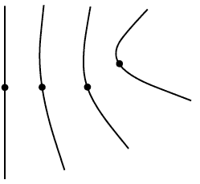

图 2-12：一条直线的中点通过在 Ricci 曲率不断增加的空间中滑动（从左到右）而变形

将这一概念从连续几何学转化到网络领域的一个变体称为 *Forman–Ricci 曲率*。计算 Forman–Ricci 曲率的第一步是给网络中每条边分配一个数值，表示该边所在的邻域的网络扩展程度。使用的数值是 2 减去与该边连接的两个顶点的度数之和；这是该边相邻的边数的负值。例如，在 Farrelly 的社交网络中（图 2-5），V7 和 V10 之间的边具有 Forman–Ricci 曲率 -8（由 V7 的六个非 V10 邻居和 V10 的两个非 V7 邻居得来）。

接下来，我们使用这些边分数来给顶点分配分数，方法如下：一个顶点的 Forman–Ricci 曲率是与该顶点连接的边的 Forman–Ricci 曲率之和。Forman–Ricci 曲率几乎总是负数，因此在可视化时，我们通常使用其相反数。 在列表 2-8 中，我们计算了 Farrelly 社交网络的 Forman–Ricci 曲率，然后使用其相反数绘制顶点的大小和边的粗细。

```
#compute the degrees of all vertices
d<-degree(g_social)

#count edges and initiate vector of edge curvature values
l<-length(E(g_social))
frc<-rep(NA,l)

#loop to calculate and store Forman-Ricci edge curvature
for (I in 1:l){
  w<-as.vector(ends(g_social,E(g_social)[i],names=F))
  frc[i]<-2-d[w[1]]-d[w[2]]
}

#count vertices and initiate vector of vertex curvature values
n<-length(d)
frcv<-rep(NA,n)

#loop to calculate and store Forman-Ricci vertex curvature
for (i in 1:n){
  I<-as.vector(incident(g_social,i))
  frcv[i]<-sum(frc[I])
}

#plot the network with vertex and edge size given by the negated curvature
plot(g_social,edge.width=-frc,vertex.size=-20*frcv/max(-frcv),vertex.label.cex=0.8,vertex.color=2)
```

列表 2-8：一个计算并绘制 Farrelly 社交网络的 Forman–Ricci 曲率的脚本

图 2-13 展示了结果图。

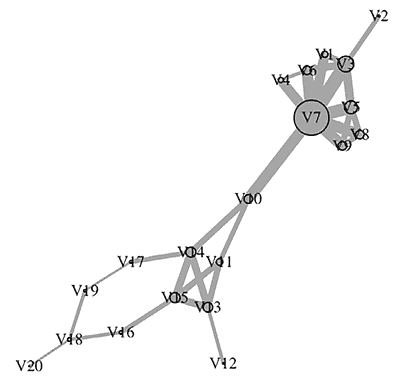

图 2-13：Farrelly 的社交网络的负费曼-里奇曲率

如你所见，网络中边缘更多的区域具有更高的负费曼-里奇曲率。这种情况发生在网络分散的中心区域（例如在这里围绕 Farrelly 的 V7 的医学学校社区）以及紧密相连的区域（例如在退伍军人小组成员中的紧密四顶点子社区）。

在传统几何学中，曲率用于研究物质如何在物体表面流动。类似地，费曼-里奇曲率可以用于研究网络流动模式。我们将在第三章中讨论网络流动的概念。

## 全局网络度量

到目前为止讨论的所有度量都是*顶点度量*，意味着它们为网络中的每个顶点分配一个分数，量化顶点在网络中的角色或位置。例如，你可以提取你的 Facebook 好友网络，并使用这些顶点度量来衡量每个人在网络中的中心性。然而，有时我们不仅仅需要比较单个网络中的顶点，而是需要比较不同的网络。例如，你可能想比较你的 Facebook 好友网络和另一个人的 Facebook 好友网络，或者你可以比较你在 Facebook 上的好友网络与你在其他社交媒体平台上的好友网络。在这种情况下，我们需要为整个网络分配一个单一的数值；这些度量有时被称为*全局网络度量*，或者如果网络的上下文明确，可以简称为*全局度量*。让我们了解几个重要的度量。

### 网络的互联性

最简单的全局度量是网络中的顶点数量和边的数量。与这些紧密相关（但通常更有用）的度量是*密度*，它是网络中边的数量除以该顶点集上可能的最大边数。一个无向网络如果有*n*个顶点，最多有

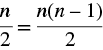

边（不允许有环或多重边），而有向网络的最大边数是这个数量的两倍。密度提供了一个粗略的衡量网络互联程度的指标；在 igraph 中，可以使用`edge_density()`函数来计算密度。图 2-14 展示了一些具有不同密度的网络。

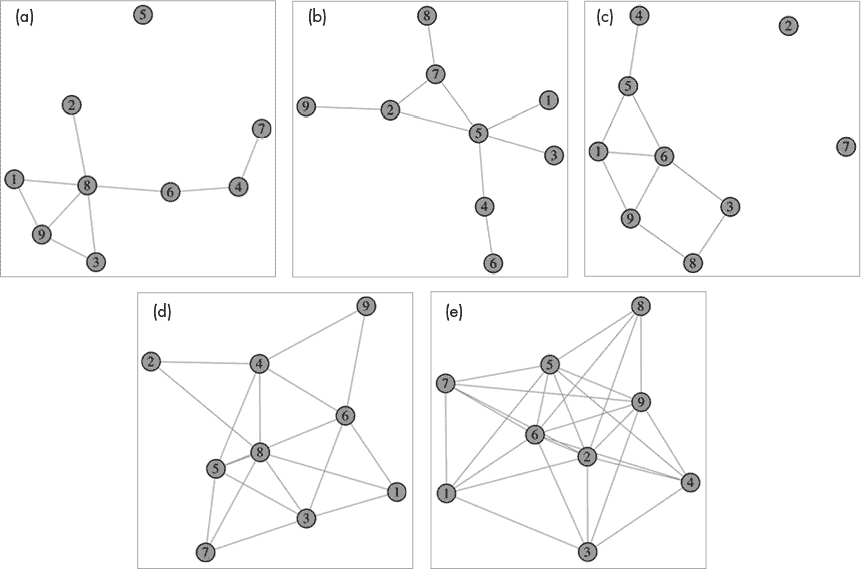

图 2-14：顶行的三个网络的密度都是 25%，而左下角和右下角的网络密度分别为 50%和 75%。

网络中的平均度数也是一个有用的全局度量，但它包含与密度完全相同的信息，并且与密度完美相关。事实上，平均度数是所有顶点度数的总和除以顶点数量，而所有顶点度数的总和总是边数的两倍。因此，平均度数和边密度之间相差一个常数，这个常数仅取决于网络中的顶点数。因此，你可以选择使用其中一个度量，而同时使用两者并不会带来额外的好处。

前一节讨论的传递性概念（量化三元闭合）也有一个全局对应物。当在 igraph 的 `transitivity()` 函数中将 `type` 参数设置为 `global` 时，会计算出一个数字，表示网络中闭合的三角形占所有三角形的比例。这为衡量网络的整体互联性提供了另一种方法，与边密度不同。

### 网络中的传播过程

更为分散的网络通常与更为紧凑的网络表现出不同的行为。例如，考虑三个朋友——阿马拉（Amara）、伊马尼（Imani）和塔拉吉（Taraji）——在午餐桌上互相传递消息。我们会期望这三位女孩在桌子上互相交换信息比她们在不同的课堂上发短信或在走廊里擦肩而过时聊天更容易。让我们来看一些不同的方法来量化网络的传播情况。

在 igraph 的 `efficiency()` 函数中，将 `type` 参数设置为 `global` 会得到该度量的全局版本，它计算网络中所有顶点对之间的距离的倒数的平均值。在这个全局效率的变体中没有任何障碍物。高度互联的网络往往具有较高的全局效率，因为高互联性意味着顶点之间有很多直接路径，但总体而言，最好将全局效率视为衡量网络紧凑性的指标。网络越分散，其全局效率越低。

我们还可以计算网络的*直径*，它是网络中所有顶点的最大偏心度（因此，也是两个顶点之间的“最长最短路径”）。网络的*半径*是最小偏心度，表示网络中心与网络最远部分之间的距离。在 igraph 中，你可以先使用`eccentricity()`函数对所有顶点进行评分，然后使用标准的 R 命令从中提取最大值和最小值。直径和半径都量化了数据传播的某些方面。一种可能导致直径和半径之间差异较大的结构是那些由多个松散的枢纽通过一个单一的桥接个体互相连接的结构。

### 网络的谱度量

我们已经看到，邻接矩阵和与其紧密相关的其他矩阵的特征向量在多个顶点中心性度量中扮演着重要角色；邻接矩阵的谱理论（特征值和特征向量）还为我们提供了一些有用的全局度量。网络的 *谱半径*（在我们讨论 Katz 中心性时提到过）是邻接矩阵的最大特征值。谱半径的多种性质已经被数学上确立。本质上，谱半径衡量了网络中的传播过程。当考虑到有害实体在网络中传播时，如假新闻或病毒，谱半径与网络的鲁棒性是反比关系。例如，在我们下一章将讨论的流行病学模型中，较小的谱半径意味着疾病在网络中传播会更快地消失。

要在 R 中计算网络的谱半径，可以使用 igraph 中的 `spectrum()` 函数，它利用了邻接矩阵通常具有的稀疏结构，或者可以使用 R 中任何标准的特征向量或特征值实现，例如对网络的邻接矩阵使用 `eigen()` 函数。

由于 igraph 的 `spectrum()` 函数可选地返回邻接矩阵的所有特征值和特征向量，因此很容易利用它来计算其他谱度量——例如 *谱差*，即邻接矩阵的最大特征值（谱半径）与第二大特征值之间的差异。谱差控制着某些算法和随机过程在网络上的收敛时间，除此之外，还有其他一些应用。其他有用的谱度量基于一种称为 *图拉普拉斯算子* 的邻接矩阵变体，它是通过对邻接矩阵取负值并将每个顶点的度数添加到相应的对角矩阵项中得到的。图拉普拉斯算子零特征值的重数表示网络的连通分量数。图拉普拉斯算子最小的非零特征值称为 *代数连通性*；它是衡量网络连通性的度量，表示将网络分割成更小部分的难易程度。Farrelly 的社交网络具有相对较低的代数连通性，因为移除一个顶点会将网络分裂成退伍军人组和医学院组。

列表 2-9 展示了如何计算图拉普拉斯算子，并从中提取连通分量数量和代数连通性。

```
#compute the graph Laplacian of a network g
lap<-laplacian_matrix(g)

#compute the eigenvalues and round to avoid numerical issues
evals<-round(eigen(lap)$values,digits=5)

#compute number of connected components
sum(evals == 0)

#compute the algebraic connectivity
unique(evals)[length(unique(evals))-1]
```

列表 2-9：一个计算网络 `g` 的图拉普拉斯算子并从中提取连通分量数量和代数连通性的脚本

例如，在 Figure 2-15 中显示的两个网络上运行此代码，每个网络都有七个连接组件，左侧网络的代数连通性为 0.062，右侧网络的代数连通性为 0.09。

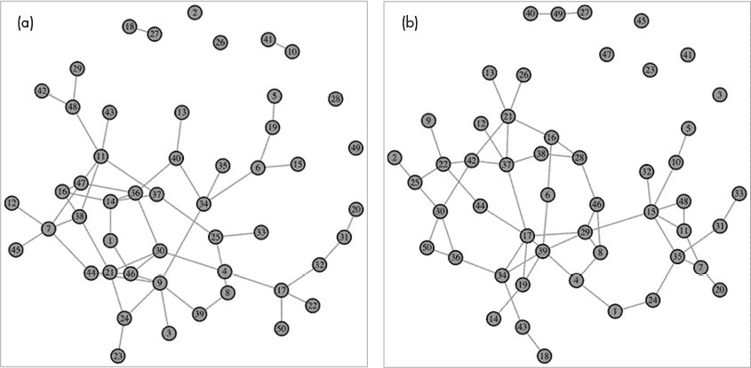

图 2-15：两个网络，绘制以说明与图拉普拉斯矩阵相关的谱度量。它们具有相同数量的连接组件，但右侧网络具有更高的代数连通性。

如果你想比较不同大小网络的分数，最好使用归一化拉普拉斯矩阵；要做到这一点，只需在计算图拉普拉斯矩阵时将`normalized=T`设置为第一行中的 Listing 2-9。

## 用于现实世界行为的网络模型

有几种不同类型的网络可以作为现实世界行为的重要模型；这些提供了有用的基准，用来比较真实世界的网络和数据。让我们从最简单的构建开始。

### Erdös–Renyi 图

*Erdös–Renyi 图* 是根据顶点对的均匀分布随机生成边的网络。这些是通过 `sample_gnp()` 函数在 igraph 中创建的。 Figure 2-15 中的两个网络都是通过使用 `sample_gnp(50,0.05)` 创建的，这将创建一个具有 50 个顶点和边概率为 5% 的网络。以这种方式创建的图的密度将接近指定的边概率，但不一定等于它——就像反复抛硬币不总是会得到一半的正面和一半的反面一样。 Figure 2-14 中的网络也是用 `sample_gnp()` 创建的。

Erdös–Renyi 图提供了一个有用的零假设。如果你认为你的网络结构非常有序，那么它的边应该远离均匀分布，因此网络看起来或行为不像一个 Erdös–Renyi 网络。在接下来的两章中，我们将看到如何实际实现这个想法。Erdös–Renyi 图在自然界中并不经常出现，特别是在社会驱动的环境中。真实网络几乎总是比纯随机边的网络更有结构。

### 无标度图

*无尺度图* 是一种网络，其度分布渐近遵循幂律分布，这意味着存在一个常数 *c*，使得度为 2*d* 的顶点的比例是度为 *d* 的顶点的比例的 1/2^(*c*) 倍（至少大致如此，且随着 *d* 增加，近似值会更加准确）。常数 *c*（称为 *幂指数*）通常在 2 到 3 之间。这个幂律特性导致了许多顶点的度数远高于网络中平均度数的存在。因此，无尺度网络通常呈现出类似于机场航站楼在中央安全门连接的轮辐形状。这些网络中的枢纽有助于缩短顶点之间的距离，从而赋予这些网络某些“小世界”特性。

这些网络有着迷人的历史和成熟的理论，虽然我们没有足够的空间深入讨论。该领域中的一个有趣辩论是，许多自然发生的网络是否是无尺度的——包括互联网页面、社交网络、生物网络，甚至是航空旅行网络——如果是的话，这种现象为何会发生。

生成无尺度网络有多种方法；其中一种比较流行的方法在 igraph 中通过 `sample_pa()` 函数得到了方便的实现。它依赖于所谓的 Barabási–Albert 模型。

### Watts–Strogatz 图

*Watts–Strogatz 图* 是由 1998 年提出的一种随机图模型生成的网络，它倾向于产生比无尺度网络更强的“小世界”特性，例如紧密相连的社区和许多顶点之间较短的网络距离。这些网络通常包括通过冗余和备用路径强化的路径。它们在生物学和社会过程中特别常见。例如，大脑连接网络（在神经元和功能区域层面）、选民网络、社交媒体平台上的影响者网络以及食物链常常形成 Watts–Strogatz 网络。

由于我们已经看到了一些 Erdös–Renyi 图的例子（见图 2-14 和 2-15），现在让我们创建一些其他类型的网络。在图 2-16 中，我们使用 `sample_pa(100,power=2.5,directed=F)` 来生成几个无尺度网络，并使用 `sample_smallworld(1,100,2,0.05)` 来生成几个 Watts–Strogatz 网络。我们留给有兴趣的读者去查阅 igraph 文档，了解后者函数中参数的选择。

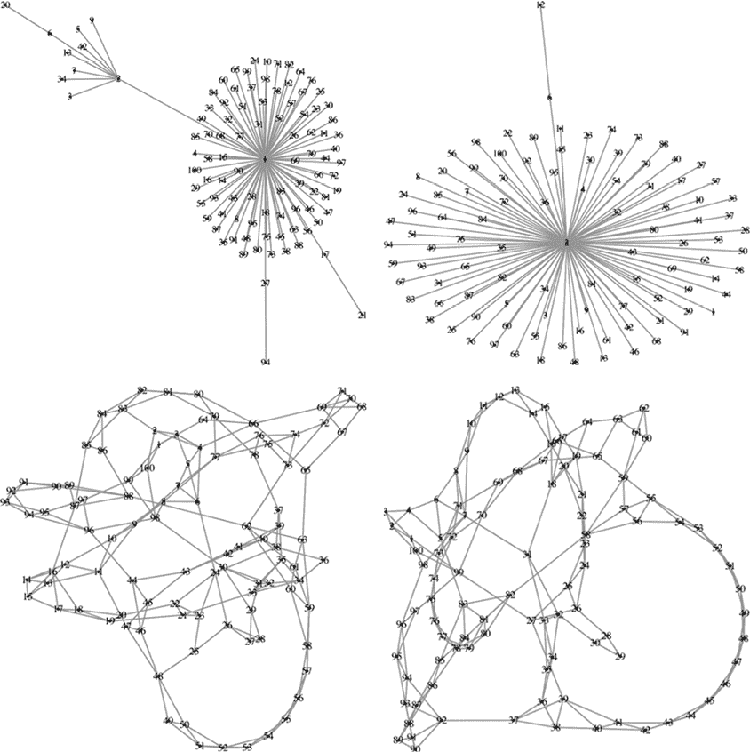

图 2-16：两个无尺度网络（顶部）和两个 Watts–Strogatz 网络（底部）

第一行的无标度网络每个都有一个显著的枢纽，而左侧的网络还额外有一个不太显眼的次级枢纽。假设这些是电力网连接，一场暴风雨摧毁主枢纽时，无标度网络的影响会波及更多的用户，而不是瓦茨–斯特罗加茨网络。这也是为什么许多现实世界的网络在设计时会遵循冗余重的结构。瓦茨–斯特罗加茨网络没有像无标度网络那样显著的枢纽，但它们拥有纯随机的厄尔多斯–雷尼网络所没有的大量结构。例如，前面提到的那些长的强化路径结构，在这些底部的图中很容易识别出来。

## 总结

本章首先简要介绍了数据科学中对网络的需求以及网络科学中对几何的需求。接着，我们介绍了网络及其中涉及的对象——顶点、边、路径等。然后，我们定义并探索了一系列度量标准，用以量化网络及其顶点的各种属性。最后，本章以几个随机图模型作结，这些模型对于生成合成网络数据非常有用，实际网络数据可以与其进行比较。
