# 3

网络分析


在第二章中，我们讨论了一些网络几何指标；在本章中，我们将使用这些指标。首先，我们将解释如何通过顶点指标在网络中进行监督学习，即预测与顶点相关的值并预测网络中的新边；我们还将探讨顶点指标如何使你能够在网络中进行顶点聚类。然后，我们将讨论一些直接在网络几何结构内操作的聚类算法。接下来，我们将解释如何使用全局网络指标对包含多个网络的数据集进行机器学习和统计分析。然后，我们将探讨流行病学中的易感、感染和恢复（SIR）模型的网络变体。通过这个模型，我们可以观察到从疾病到错误信息等实体是如何在网络中传播的，以及网络几何如何影响这种传播。最后，我们将研究如何使用顶点指标制定有针对性的策略来干扰这种传播。

## 使用网络数据进行监督学习

网络数据通常伴随着传统的结构化数据集，其中的行通过网络中的顶点进行标识。例如，你可能有一个社交网络数据集，其中包含个人（顶点）列表、他们之间的友谊（网络中的边）以及一列或多列提供有关每个个体的额外非网络信息的数值或分类列——例如年龄、性别或薪水。我们可能希望将此视为一个监督学习问题，在其中我们训练一个机器学习算法来预测数据列中的一个值。做到这一点的方法是使用顶点指标作为自变量（以及其他任何数据列），这使得算法在进行预测时可以结合每个顶点在网络中的角色。让我们来试试这个方法。

### 利用社交媒体网络指标进行预测

让我们回到 Farrelly 的社交网络，之前我们在第二章分析了该网络，说明了不同的顶点中心性度量。不同网络部分之间的桥梁或紧密连接一些医学院朋友的中心节点，如何影响 Farrelly 在医学院第一学期的日记中提到这些人的频率呢？让我们看看网络指标如何与这个社交网络中的日记提及相关。

我们将选择几个顶点中心性指标，并将 Farrelly 的日记数据作为该集合中的因变量。让我们加载数据，并使用列表 3-1 检查因变量的分布。

```
#import dataset
g<-read.csv("SocialNetworkModel.csv")

#create a histogram of the data
hist(g$Diary.Entries,main="Diary Entry Histogram",xlab="Diary Entries")
```

列表 3-1：导入相关的 *.csv* 文件以进行进一步分析的脚本

图 3-1 显示了因变量分布的直方图（泊松分布）。

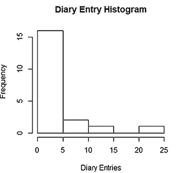

图 3-1：Farrelly 社交网络的日记条目数据的直方图

通常，计数变量，如符合泊松分布的变量，包含大量零值和接近零的值，以及一些大值。从图 3-1 可以看到，这一结果符合泊松分布。泊松分布的变量可能会对机器学习算法造成问题，因为它们涉及大量的零值和一些异常值，比如涉及 V10 的日记条目。这表明，与其他机器学习算法相比，广义线性模型（泊松回归）可能是更适合的监督学习模型。看起来网络中的大多数个体在整个学期中几乎没有（如果有的话）被提及。然而，还是存在一些异常值，包括法雷利和她在网络中的最亲密朋友（V3、V10 和 V14）。让我们深入探讨一下，看看中心性度量如何预测日记提及。在清单 3-2 中，我们对法雷利社交网络中的相关指标进行了采样，并将其作为自变量纳入我们的泊松回归模型。

```
#create a training sample from Farrelly's social network metrics
n<-dim(g)[1]
set.seed(10)
train.index=sample(1:n,15)
train<-g[train.index,]

#build a Poisson regression model
gl<-glm(Diary.Entries~.,data=train,family="poisson")

#examine performance with a model summary and Chi-squared test
summary(gl)

1-pchisq(summary(gl)$deviance,summary(gl)$df[2])
```

清单 3-2：计算泊松回归并分析其结果的脚本

你的结果可能会因 R 版本的种子设置不同而有所变化，但在我们使用这个数据集和其他种子（10 次随机分割中的 9 次）建模的样本中，汇总函数显示，介数中心性似乎在模型中具有较大的系数值，并且是预测法雷利社交网络数据集中日记条目提及最一致的指标。我们的样本中的卡方检验值从*p* < 0.01 到*p* = 0.25 不等。当我们检查与线性回归相关的图表时，可以看到大部分样本很好地符合回归方程。图 3-2 展示了清单 3-2 生成的两幅图（包括 V3、V7 和 V13 作为异常值）。

小样本量可能是导致样本间差异的原因之一，但总体而言，我们有一个良好的预测模型。事实上，这反映了法雷利自己直觉的观点，即她的社交网络中的桥梁往往协调那些能将她的社交网络中不同部分结合起来的、令人难忘的事件和活动。我们将在第六章和第八章中回顾小样本量和异常值对回归模型的不稳定性，并介绍一些更稳定的模型，以便在这些情况下获得一致的模型结果。

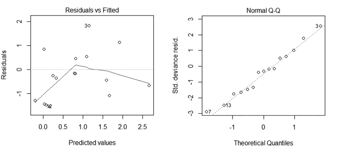

图 3-2：在清单 3-2 中运行的泊松回归的残差图和分位数图

在这种分析中，具有依赖变量且与个人社交网络更紧密相关的更大网络（例如政治观点的强度、锻炼习惯等）通常表现得更好。在生物网络中，中心性度量可以用来预测疾病的严重程度、药物在临床试验中的反应概率，或社交网络基础上的行为健康干预六个月后的疾病风险。分析网络的几何形状通常会产生有用的独立变量，用于预测与网络节点相关的某些特性。

### 预测社交媒体中的网络链接

网络中另一种重要的监督学习形式是*链接预测*，它根据网络的结构或元数据推断潜在的新边。预测链接的一种方法是利用网络的先前增长模式来预测哪些边最有可能出现。这在现实世界中有许多应用，其中一些最显著的应用是在社交媒体中。每当 Facebook 或其他平台建议你添加某人为好友时，后台算法会对其用户网络运行链接预测，并给你与这个潜在好友之间的缺失边赋予一个高分。有许多复杂的方法可以进行链接预测，但一种常见的通用策略是将问题转化为传统的欧几里得监督学习任务。让我们以 Farrelly 的社交网络为例来概念性地探讨这一点。

想象一下这个网络随时间演化，二元指标表示自上一个时间段以来形成的边。如果我们能够根据网络在过去时间段中的几何形态来预测某一时间段内的边形成，那岂不是很酷吗？或者如果我们可以使用节点标签（例如课表或志愿者日期）来预测下一个时间段的边形成呢？

对于独立变量，我们可以使用与两个节点相关的任何特征集合。这些可以是基于网络的内在特征，也可以是社交网络中用户人口统计等外在特征。基于网络的预测因子有两种类型。我们可以通过选择一个函数，将每一对节点的两个节点分数聚合成一个单一的数字（常见的选择包括求和、最大值、均值和差值的绝对值）。例如，我们可以计算每对节点的 PageRank 分数，然后取这两个分数的平均值来为节点对赋值。

另一种基于网络的特征使用某种度量来表示两个顶点之间的网络关系；这里最自然的选择是两个顶点之间的网络距离，尽管你也可以尝试其他选项，如两个顶点之间的最短路径数量或随机游走从一个顶点到另一个顶点的平均时间。所有这些基于网络的预测因子应当针对当前版本的网络进行计算，而不是早期的快照，并且这些基于网络的预测因子可以与任何非网络特征结合使用。（实际上，大多数非网络特征是附加在单个顶点上的，而不是顶点对，因此你再次需要对它们进行聚合，以便为每对顶点得到一个单一的评分。）

一旦为某一感兴趣时间段计算了独立预测因子，并且该时间段存在指示变量，就可以使用监督分类器来预测该时间段内的边缘形成。边缘形成的可能性得分越高，表示在下一个时间段该关系存在的可能性越大。在 Farrelly 的社交网络中，介数中心性可能是主要的基于网络的预测因子，以及来自医学第一学期的社交活动数据或日记条目。她原始社交网络中的每个人在学期结束时都与她相连（大多数人彼此之间也有联系）。

## 使用网络数据进行无监督学习

就像我们可以使用第二章中的顶点度量作为监督学习任务中的预测因子一样，我们也可以将它们作为无监督学习任务中的特征。在聚类的情况下，这将把顶点划分为具有相似功能的集合（中心、桥梁等）。在网络科学中，聚类顶点被称为 *社区挖掘*，因此，当我们将顶点度量用于此目的时，我们获得的社区是通过它们在网络中所扮演的结构角色来定义的。

### 将聚类应用于社交媒体数据集

在清单 3-3 中，我们将 k-means 聚类应用于 Farrelly 的社交网络数据集，这是我们在第二章中的主要运行示例。

```
#rescale the matrix of vertex metrics and apply k-means with k=3
clust<-kmeans(scale(vertdata),3)

#plot the network with clusters represented by vertex color and label
plot(g,vertex.size=6,vertex.color=clust$cluster,vertex.label=clust$cluster)
```

清单 3-3：一个使用 k-means 对顶点度量进行聚类的脚本，将来自图 3-1 的网络顶点聚为 *k* = 3 组

使用 k-means 方法，*k* = 3，并使用 PageRank、度、中心性、介数和传递性作为特征（我们首先对其进行重新缩放），得到的聚类均值和大小见表 3-1，这些值是从原始重新缩放的值计算得出的。

表 3-1：Farrelly 社交网络顶点度量的 k-means 聚类（*k* = 3）的聚类均值和大小

| **聚类** | **PageRank** | **度** | **中心性** | **介数** | **传递性** | **聚类大小** |
| --- | --- | --- | --- | --- | --- | --- |
| 1 | 0.05 | 3.14 | 0.54 | 3.21 | 0.80 | 7 |
| 2 | 0.11 | 8.00 | 1.00 | 100.50 | 0.25 | 1 |
| 3 | 0.05 | 2.50 | 0.08 | 25.75 | 0.097 | 12 |

由于 k-means 聚类涉及随机初始化，因此每次尝试时可能会得到不同的聚类结果。对于这个特定的聚类，我们看到一个顶点被分配到它自己的聚类（Farrelly 的顶点，V7）；除了转移性得分之外，这个顶点的所有得分都异常高，因此在许多指标上它是一个异常值。其余的顶点被分配到另外两个聚类中，这两个聚类似乎主要通过以下特征区分：一个聚类具有较高的枢纽度和转移性得分，而另一个聚类具有较高的介数中心性。让我们通过对顶点按聚类标记进行绘图来展示这个网络（这样做是对 列表 3-3 中代码的简单改编）；见 图 3-3。

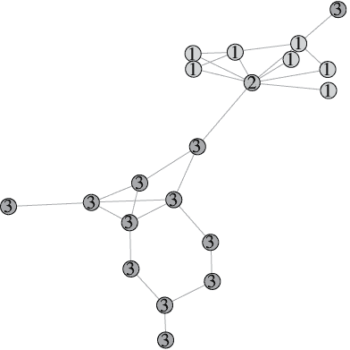

图 3-3：Farrelly 的社交网络按聚类着色和标注，对应于 表 3-1 中总结的 k-means 聚类

我们看到，Farrelly 确实是她自己的聚类，并且非常巧妙的是，聚类 1 几乎完全是剩余的医学院个体，而聚类 2 则是退伍军人组的个体。有趣的是，有一个医学院的人被分配到了聚类 3，因为他们是孤立的（转移性得分为零），并且不属于医学院个体的主要群体。

### 网络中的社区挖掘

到目前为止，我们已经使用网络的几何结构来提取特征，并对其应用了传统的欧几里得机器学习聚类算法。另一种聚类网络中顶点的方法（称为 *社区挖掘*）是直接依赖于网络的几何结构。我们将简要介绍几种实现方式。

#### 使用随机游走探索网络

*Walktrap 算法*通过随机游走来探索网络并寻找社区，其中随机游走“被困住”在某些区域。如果随机游走经常停留在一组特定的顶点中，那么这组顶点就很可能构成一个聚类。例如，在 Farrelly 的社交网络中，从医学院个体中开始的随机游走，很有可能会长时间停留在这些个体中，因为唯一的出路是从 Farrelly 的顶点跨越一座桥。事实上，要离开这里，随机游走必须经过 Farrelly 的顶点，然后我们会选择那座桥作为下一步（从该顶点出发，只有八分之一的概率选择这座桥，因为该顶点有八条边）。同样，从退伍军人组开始的随机游走也很有可能会停留在他们中间。通过这种方式，walktrap 算法擅长找到通过桥梁分隔的社区。该方法的一个缺点是，它需要大量计算资源来探索大型网络。

#### 评估聚类的质量结果

在传统的欧几里得聚类中，评估聚类结果质量的典型方法是将每个聚类内的距离与不同聚类之间的距离进行比较。有一个广泛应用于顶点聚类的网络变种思想：顶点聚类的*模块度*是指随机选择一条边连接到同一聚类中两个顶点的概率，减去如果网络中的边是随机分布时发生这种情况的概率。从直观上看，这种方法比较的是社群内边和社群间边的数量。它有点像一种“提升”度量，因为它比较了聚类在“边缘保持在同一聚类内”的效果，相较于随机化基准的表现。在前一章介绍的 Watts–Strogatz 网络的一个重要的小世界特性是它们通常是高度模块化的（即具有较高模块度得分的聚类）。

模块度还使得你可以将顶点聚类视为一个优化问题：我们寻找最大化模块度得分的聚类划分。尝试所有可能的聚类划分并不实际，因此已经引入了多种算法，旨在寻找高模块度的聚类，但并不保证找到全局最优解。两种常见的方法是*贪心算法*，其中贪心意味着每一步都朝着最能增加模块度的方向前进，而不是短期内采取次优步骤，期望它们能够在长期内带来更大的收益。

*Louvain 聚类*就是一种贪心算法。它从将每个顶点视为独立的聚类开始，然后在每次合并邻近聚类时，只有这样做能增加模块度，算法才会进行合并。一旦这个迭代的局部优化过程终止，算法通过合并所有被分配到同一聚类的顶点来创建一个新的、更小的网络。在这个新网络中，每个顶点都是一个独立的聚类，因此可以在这个较小的图上再次运行相同的迭代局部优化过程。这个算法在实践中非常快速，且通常表现良好，但它在大型网络中常常难以找到较小的社群。还有一种更快的贪心算法，通常被称为*快速贪心聚类*，但它往往无法达到很高的模块度得分。

#### 理解 Spinglass 聚类

另一种聚类方法不涉及随机游走或局部优化。相反，它借鉴了统计力学，这是一门研究粒子相互作用的物理学分支。*自旋玻璃算法*基于系统中粒子之间的磁耦合（正负电荷）；它们的目标是优化电荷在系统中的排列方式。这可以应用于顶点聚类，称为*自旋玻璃聚类*。基本思路是定义与聚类相关的能量，并尝试最小化这个能量。这个能量最小化过程通常通过*模拟退火*来完成，模拟退火是一种优化算法，其根源也在统计力学中。在模拟退火中，与其总是朝着最能降低能量的方向前进（这会在贪心算法中出现，从而有可能陷入局部最优解），不如设置一个温度参数来确定是否朝着一个“错误”的方向移动的概率。随着算法的进行，温度会逐步降低。这有助于算法在初期探索能量景观的较大区域，之后再定下来并聚焦于某一特定解。它模仿了金属冶炼中的冷却过程，在这个过程中金属得以净化。

#### 在社交网络上运行聚类算法

让我们尝试在 Farrelly 的社交网络上运行这四种顶点聚类算法。列表 3-4 实现了这一操作，并绘制了结果，计算了模块化得分（要运行此操作，请确保您已加载此网络数据，如列表 2-4 所示）。

```
#run walktrap, louvain, fast greedy, and spinglass clustering algorithms
cw<-cluster_walktrap(g_social)
modularity(cw) #0.505
plot(cw,g_social,vertex.size=15,vertex.label.cex=0.6,main="Walktrap")

lo<-cluster_louvain(g_social)
modularity(lo) #0.476
plot(lo,g_social,vertex.size=15,vertex.label.cex=0.6,main="Louvain")

fg<-cluster_fast_greedy(g_social)
modularity(fg) #0.467
plot(fg,g_social,vertex.size=15,vertex.label.cex=0.6,main="Fast Greedy")

sg<-cluster_spinglass(g_social)
modularity(sg) #0.505
plot(sg,g_social,vertex.size=15,vertex.label.cex=0.6,main="Spinglass")
```

列表 3-4：运行前面讨论的四种顶点聚类算法在 Farrelly 的社交网络上，绘制结果并计算每个算法的模块化得分

图 3-4 显示了生成的图形。

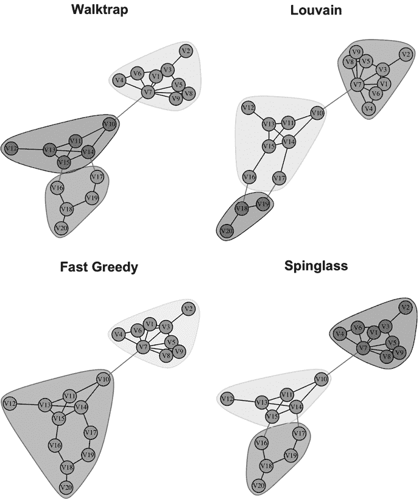

图 3-4：在 Farrelly 的社交网络上使用四种不同算法进行聚类

请注意，对于所有这些函数，用户并未像在 k-means 中那样指定聚类的数量。这些算法在寻找最优解的过程中会自动确定聚类的数量。在这个例子中，walktrap 和自旋玻璃算法都找到了相同的三个聚类，分别是医学院的个体（包括 Farrelly 的顶点 V7）以及将退伍军人群体个体分为两部分。这种三分聚类在这些算法找到的解决方案中产生了最高的模块化得分。

Louvain 找到了下一个最佳得分，结果与之前的类似，唯一不同的是它以略微不同的方式拆分了退伍军人群体（将两个顶点从一个聚类重新分配到另一个聚类）。具有稍微低于此得分的模块度，快速贪心算法最终得出了只有两个聚类的结果（一个是包含 Farrelly 的医学院社区，另一个是退伍军人群体社区）。显然，这个算法中的贪心性使得它无法发现通过拆分退伍军人群体社区可以获得更高的模块度。话虽如此，快速贪心算法找到的这个两聚类解决方案描述了数据的原始背景，在这个背景中，Farrelly 将她的两个独立社区合并在一起。

如果你感兴趣，可以探索在 igraph 中实现的其他一些顶点聚类算法。例如，函数`cluster_edge_betweenness()`使用介数度量，不是作为特征，而是以更直接的方式。具有高介数得分的顶点被认为是*桥梁*，这个函数发现的社区是那些被这些桥梁隔开的社区。另一个有趣的方法是由函数`cluster_infomap()`提供的，它利用信息理论来寻找信息流动顺畅的社区；这也可以通过网络中随机游走的行为来进行解释。

到目前为止，我们已经讨论了单一网络中顶点之间的监督学习和无监督学习。现在让我们考虑比较不同网络的情况。

## 比较网络

有时，网络并不是你的整个数据集。它只是一个数据集中的单个实例，数据集中包含多个网络。例如，检测社交媒体平台上的机器人账户通常涉及监督分类，其中将真实用户的好友或关注者网络与虚假用户的网络进行比较。在第二章中提到的宾夕法尼亚州选区划分案件中，区划图被转化为网络，且旧地图在网络分布中被显示为一个可疑的离群值。神经科学提供了另一个重要的例子，在该领域，通常需要比较网络。事实上，功能性磁共振成像（fMRI）和正电子发射断层扫描（PET）数据通常会被转化为网络结构，其中顶点表示大脑的不同区域，边则基于活动模式（例如，某一区域的连续激活，或在执行一个任务时多个区域的共同激活）。人们通常需要比较两组不同的患者——健康患者与患有特定神经或心理疾病的患者，或者两组不同的疾病群体。转化为网络数据科学，这意味着我们在查看一个两类数据集的网络，看看两类之间是否存在统计学上显著的差异（以理解结构差异）。我们还可能希望训练一个监督分类器，根据网络结构预测类别。

为了生成一些合成数据，让我们创建 100 个每种类型的网络，类型在第二章结尾有描述：Erdös–Renyi 网络、无尺度网络和 Watts–Strogatz 网络。在列表 3-5 中，我们进行这个操作，并绘制网络直径的直方图，查看它在不同类型的网络内部和跨类型的变化。

```
#initiate vectors/lists
n<-100
er<-list()
sf<-list()
ws<-list()
er_d<-rep(NA,n)
sf_d<-rep(NA,n)
ws_d<-rep(NA,n)

#loop to create and store random graphs and compute their diameters
for (i in 1:n){
  er[[i]]<-sample_gnp(100,0.02)
  sf[[i]]<-sample_pa(100,power=2.5,directed=F)
  ws[[i]]<-sample_smallworld(1,100,1,0.1)
  er_d[i]<-diameter(er[[i]])
  sf_d[i]<-diameter(sf[[i]])
  ws_d[i]<-diameter(ws[[i]])
}

#plot combined histogram
hist(er_d,col=rgb(0,0,1,0.2),xlim=c(0,max(max(ws_d),max(ws_d),max(ws_d))),ylim=c(0,40),xlab="Diameter",main="")
hist(sf_d, col=rgb(0,0,1,0.5), add=T)
hist(ws_d, col=rgb(0,0,1,0.8), add=T)
box()
```

列表 3-5：一个脚本，生成 300 个网络，三种类型均匀分配；计算它们的网络直径；然后绘制每种类型的直方图：Erdös–Renyi、无尺度网络和 Watts–Strogatz 网络。

这里选择的参数确保所有随机网络具有相同数量的顶点（任意选择为 100 个）和大致相同的边密度（约 2%）；这样可以确保网络结构区分这三组，而不是像顶点或边的数量这样的简单因素。图 3-5 展示了生成的直方图。

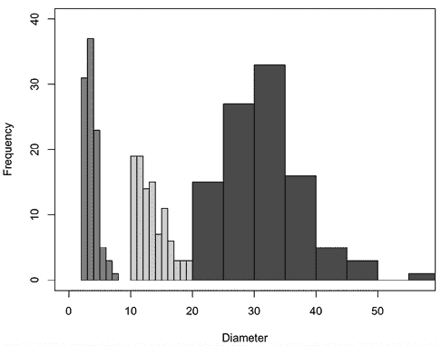

图 3-5：三种不同类型的随机网络的网络直径直方图：Erdös–Renyi（浅灰色）、无尺度（中灰色）和 Watts–Strogatz（深灰色）。

我们看到三个直方图是分离的。厄尔多斯–雷尼网络具有适中的直径。无标度网络的直径值较小。瓦茨–斯特罗加茨网络的直径较大。如果有兴趣，你可以尝试修改清单 3-5，计算第二章中讨论的其他一些全局网络度量（如效率、传递性和谱半径），看看它们在不同类型的随机图结构中表现如何。

现在，你可以使用目前开发的工具在网络数据集上进行许多机器学习任务。对于分类任务（例如，基于社交媒体账户的朋友网络将其标记为机器人或真实账户）或回归任务（例如，根据引用网络预测学术出版物的期刊排名），你可以计算一系列全局网络度量，然后将它们作为特征输入传统的监督学习算法。同样，为了将一组网络聚类成不同类型（例如，根据个体的 fMRI 大脑网络结构对其进行分组），你可以计算全局网络度量，并将它们输入传统的聚类算法。你还可以进行统计分析，如异常值检测和置信区间估计。实际上，通过用全局网络度量值的向量来表示每个网络，你就“构建”了你的网络数据，并为所有我们在数据科学中传统上依赖的统计和机器学习方法打开了大门。

## 分析网络中的传播

网络分析中的另一个重要主题是各种实体在网络中的传播（或*扩散*）。现实世界中有许多这类实例，包括传染病在接触网络中的传播和社交媒体网络中的病毒内容。理解网络的几何结构有助于预测实体在网络中的传播方式，我们可以利用这一洞察力改变网络的几何结构，从而影响传播。

### 跟踪小镇之间的疾病传播

让我们回到上一章的四个小镇加权网络，参见图 2-3。我们将从清单 2-3 中获取其邻接矩阵，并使用它来创建一个加权网络，其边的权重为原始距离的倒数；这样就将距离转化为接近度得分，其中较短的道路具有比较长的道路更大的边权重。清单 3-6（需要先运行清单 2-3 中的脚本）实现了这一点，并绘制了结果。

```
#invert the nonzero entries in the towns adjacency matrix from last chapter
townprox<-apply(towns,MARGIN=c(1,2),function(x) 1/x)
townprox[which(townprox == Inf)]<-0

#create weighted network from this new adjacency matrix
g_townprox<-graph_from_adjacency_matrix(townprox,mode="undirected",weighted=T)

#plot network with edges labeled by weights
plot(g_townprox,edge.label=round(E(g_townprox)$weight,3),vertex.color=2,vertex.size=15,vertex.label.cex=0.8)
```

清单 3-6：一个脚本，它创建并绘制了来自第二章的四个小镇网络，但其边权重由道路长度的倒数给出

图 3-6 显示了结果图。

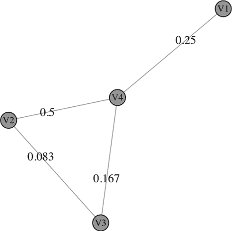

图 3-6：四个小镇及其之间道路的接近度得分（逆距离）

让我们考虑一个简单的传染病传播的流行病学模型，在这个网络中，感染的城镇向其邻近城镇传播疾病的概率由边的接近度评分给出。如果疾病从城镇 V1 开始传播，那么它有 25%的机会传播到 V4。如果传播到 V4，它就有 16.7%的机会继续从 V4 传播到 V3。但是，乘这两个概率（大约 4.2%）并不能给出疾病从 V1 传播到 V3 的概率；它只给出疾病沿着传播路径 V1→V4→V3 传播的概率。另一个可能的传播路径是 V1→V4→V2→V3，这种情况发生的概率是 1%。

对于一个较大的网络，计算所有基于网络中路径给出的潜在传播路径的条件概率显然太过繁琐，无法手动完成，因此我们需要自动化这些计算。此外，这个流行病学模型过于简单，难以实际应用；我们在这里讨论它只是为了让大家了解加权网络的结构如何影响各种实体（如疾病、信息等）在其顶点之间的传播，同时也为接下来我们将要讨论的更复杂的流行病学模型做铺垫。

*SIR 模型*，或者*易感-感染-免疫*模型（或者，*易感-感染-康复*模型），是一种通过假设每个人可以处于三种疾病状态之一来预测疾病在群体中传播的模型：易感（可能被感染）、感染（已感染且能传播疾病）或康复/免疫（对疾病具有免疫力）。该模型有许多变体，包括易感-感染-易感模型、易感-感染-康复-易感模型、包括疫苗部分免疫的模型、在流行期间个体会出生或死亡的模型，以及人口在不同速率下混合的分区或地理模型。所有这些模型的基础都是包含与人口混合（如接触率或时间）和疾病特性（如一个感染者可能引发的新感染数量）相关的参数的偏微分方程系统。由于这些偏微分方程通常难以显式求解，因此我们通常使用计算机模拟来量化不同可能结果的范围和可能性。

为了考虑个体在群体中的社会互动，SIR 模型已被适应到网络中。这可以提供更详细的疾病传播预测，也有助于人们找到减少传播的方法：我们可以运行模型，查看删除某个顶点或边，或以其他方式重构网络，对疾病传播的影响。

第二章中的许多网络几何概念在这里也发挥作用。中心节点是高传输区，可能需要关闭或缩小，具有高介数得分的桥梁和节点提示了切断疾病传播主路线的目标方法，而具有高中心性得分的节点可能表示那些需要尽快接种疫苗或隔离的关键个体。此外，SIR 模型和用于探索它们的计算机模拟技术具有远超流行病学的应用，因为它们为研究网络结构与传播之间复杂关系提供了一种强有力的实证方法。例如，社交媒体上错误信息的传播是一个最近引起广泛关注的问题，并推动了人们更好地理解网络结构如何影响社交媒体传播——SIR 类型的模型在这一领域已经证明了其价值。

### 跟踪风帆运动员之间的疾病传播

让我们从一个例子开始。列表 3-7 加载了一个流行的网络数据集——KONECT 风帆运动员网络。这个加权网络代表了 1986 年秋季，43 位南加州风帆运动员以及他们的互动水平。几乎所有邻接矩阵的非对角元素都非零——意味着这个网络中几乎每条可能的边都存在——所以实际上是边的权重才是关键。这使得可视化这个网络变得困难，因此我们将创建两个密度较低的网络版本——一个是移除所有权重不在前四分之一的边，另一个是移除低于中位数的边。（这是一种简单的加权网络过滤方法，这一概念我们将在第四章中详细讨论。）列表 3-7 实现了这一操作并绘制了结果。

```
#load dataset, compute quartiles, and convert to weighted network
wind<-as.matrix(read.csv("beachdata.csv",header=F))
q<-quantile(wind,prob=c(.25,.5,.75))
g_wind<-graph_from_adjacency_matrix(wind,mode="undirected",weighted=T)

#new networks, keeping only edges with weight in top one and two quartiles
wind_top<-wind
wind_top[which(wind < q[3])]<-0
g_wind_top<-graph_from_adjacency_matrix(wind_top,mode="undirected",weighted=T)
wind_mid<-wind
wind_mid[which(wind < q[2])]<-0
g_wind_mid<-graph_from_adjacency_matrix(wind_mid,mode="undirected",weighted=T)

#plot these two thinned-out networks with weights² as edge thickness
#(squaring the weights is just to increase the visual distinction) plot(g_wind_top,vertex.size=10,vertex.label.cex=0.4,vertex.color=2,edge.width=E(g_wind_top)$weight²)
plot(g_wind_mid,vertex.size=10,vertex.label.cex=0.4,vertex.color=2,edge.width=E(g_wind_mid)$weight²)
```

列表 3-7：一个脚本，加载 KONECT 风帆运动员网络数据集，并创建其两个较稀疏的版本，通过移除权重不在前四分之一或前两个四分之一的边，然后绘制结果

使用`edge_density()`函数，我们发现原始网络的密度为 99.3%，前四分之一的网络密度为 25.8%，而中位数以上的网络密度为 51.4%。图 3-7 中的图表展示了这两个稀疏版本的风帆运动员网络。边的粗细代表边的权重，但为了增加它们之间的视觉区分，我们将边的粗细设置为边权重的平方。

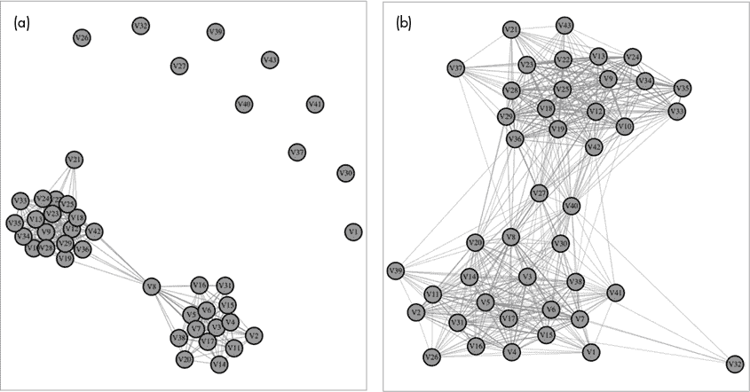

图 3-7：风帆运动员网络的两个稀疏版本，其中所有权重不在前四分之一（左）或前两个四分之一（右）的边已被移除

在 R 中运行 SIR 模拟非常简单。使用 igraph 的 `sir()` 函数，你只需指定网络、感染率（称为 *beta*）和恢复率（称为 *gamma*），然后（可选）指定要进行的模拟试验次数（默认值为 100）。感染率决定了每个时间步骤中，一个易感顶点被感染邻居感染的概率（传染性疾病的感染率较高）；有两个感染邻居时，被感染的几率会翻倍。恢复率决定了感染持续时间的概率分布；较高的恢复率意味着每个时间步骤中，感染的顶点更有可能转到恢复状态。较高的恢复率意味着感染持续时间较短。

绘制 `sir()` 的结果时，你将看到网络中活跃感染者的数量，以及在不同试验中的中位数值和估计的置信区间，作为时间的函数。将 `median()` 函数应用于 `sir()` 的输出，提供了三条时间序列：易感个体的中位数、感染个体的中位数和恢复个体的中位数。让我们来试试这个。在清单 3-8 中，我们模拟了一个疾病，感染率为 3，恢复率为 2。

```
#SIR simulations on the original windsurfer network
sim<-sir(g_wind,beta=3,gamma=2)

#plot the result
plot(sim,main="Number of Infected Over Time, Including Confidence Intervals")

#display the median number of infected individuals for each time bucket
median(sim)$NI
```

清单 3-8：运行 100 次 SIR 模型模拟试验的脚本，使用 KONECT Windsurfer 网络数据集，感染率为 `beta=3`，恢复率为 `gamma=2`，然后绘制结果并显示随时间变化的感染个体中位数

图 3-8 显示了结果图表。

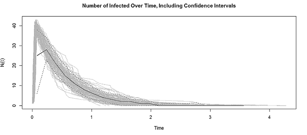

图 3-8：原始 KONECT Windsurfer 网络数据集上的 SIR 模拟结果图（100 次试验），展示了随着时间推移，感染个体数量的变化（包含均值和置信区间），疾病的感染率为 3，恢复率为 2

在其峰值时，中位数为 28 个活跃感染者——这占整个网络的 65%。这是一个通过高度连接的网络传播的高度传染性疾病。运行与清单 3-4 中相同的代码，但将感染率降低为 `beta=1`，并将恢复率提高到 `gamma=10`，产生了图 3-9 中的图表。

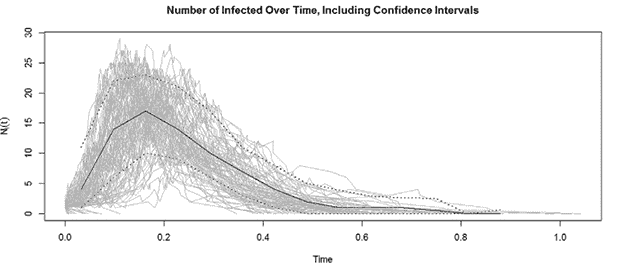

图 3-9：原始 KONECT Windsurfer 网络数据集上的 SIR 模拟（带置信度水平），现在的感染率为 1，恢复率为 10

正如预期的那样，这个新的疫情模拟显示，在较短的时间内，感染人数较少。现在，中位活跃感染人数达到 17，且该疫情的时间周期仅为之前参数的四分之一。当使用 SIR 模型研究现实世界中的疫情时，流行病学家会查阅科学文献中已知的感染率和恢复率参数，如果这些参数尚不清楚，则可以通过已有的传播数据来估算。通常，这些估算会涉及一定程度的不确定性，因此我们可以在不同参数范围内运行 SIR 模拟，以查看可能的结果范围。

### 中断通信和疾病传播

其中一个有趣的建议应用是利用顶点 Forman–Ricci 曲率对顶点进行排名，以便移除顶点，从而中断网络中的通信和疾病传播。在通信网络中，打断通信可能涉及针对特定的基站或孤立网络中的某个重要节点。2020 年，我们看到了如何通过社交距离和隔离 COVID 感染者或暴露者来帮助停止大城市中的 COVID 传播。回想一下，作者网络中的顶点 7 具有较大的 Forman–Ricci 曲率。我们来运行一个带有和不带顶点 7 的 SIR 模型，比较结果：

```
#run and plot SIR epidemic on full author's network
sim1<-sir(g_social,beta=3,gamma=2)
plot(sim1,main="Epidemic on Full Author's Network")

#remove vertex 7 from the author's network and rerun SIR epidemic

g2<-delete_vertices(g_social,v=7)
sim2<-sir(g2,beta=3,gamma=2)
plot(sim2,main="Epidemic on Author's Network with Vertex 7 Removed")
```

这个脚本在原始网络和修改后的网络（移除顶点 7 后）上运行疫情模拟，以比较模拟疫情的严重性。这将生成一个类似于 图 3-10 的初始图表，疫情通过整个网络传播。

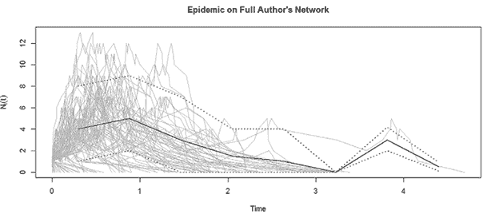

图 3-10：作者完整网络上的 SIR 疫情

图 3-10 显示了一个 SIR 疫情，导致五个时间周期的感染传播，中位感染人数为 5。一些模拟结果建议在前两个时间周期内可能出现最多 12 例感染。这是一个相当严重的疫情，预计会影响超过 25% 的人口，直到整个易感人群都被感染。

让我们来看看当顶点 7 被移除时会发生什么，如 图 3-11 所示。

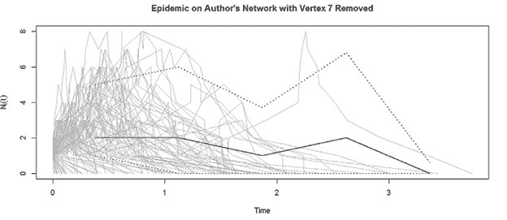

图 3-11：作者修改后的网络（移除顶点 7 后）的 SIR 疫情

图 3-11 显示了一个较轻的疫情，发生在较短的时间框架内。只有四个感染周期，疫情高峰期的中位感染人数仅为 2，最大估计为 8。虽然疫情仍然影响着人群，但它局限于较少的个体，并且迅速结束。在第二个时间周期结束时，大多数模型表明疫情已经结束。

存在许多可以让我们针对顶点来破坏网络的应用。我们不仅可以通过移除网络的某些部分来减轻潜在的流行病风险，还可以通过摧毁具有高度负的 Forman–Ricci 曲率的目标来干扰恐怖分子小组或敌对政府的通信，或者通过摧毁生物网络骨架中的蛋白质或基因来破坏疾病过程。随着网络的发展，Forman–Ricci 曲率的变化也有助于与网络相关的分析能力。

*Forman–Ricci 流* 是一种几何流（微分方程），与网络上曲率随时间变化相关，类似于热量从定义的起点在网络中扩散。跟踪曲率变化可以识别网络中的变化区域。Forman–Ricci 流为量化网络中连接的增长或收缩区域提供了一种方法，例如恐怖分子小组成员的快速扩展、癌症基因网络中突变的积累，或流行病中疾病传播风险的增加。例如，COVID 隔离期间一些地区的大型聚会或活动增加，导致该地区社会网络中的 COVID 传播加剧。Forman–Ricci 流在图像数据集上的应用也为将医学图像数据从原始源文件映射到标准表面（如平面、球面甚至煎锅）提供了一种方法，这样就可以在患者组内外汇总和比较结果。

## 总结

在本章中，我们首先看到了第二章中讨论的顶点度量如何作为网络中监督学习的预测因子（包括链接预测），并作为顶点聚类（即社区挖掘）的特征。这种机器学习方法将网络转化为结构化数据集，并应用欧几里得机器学习算法。接着，我们探讨了一些直接在网络中操作的社区挖掘算法。随后，我们将分析从网络内数据转向分析每个数据点本身就是一个网络的数据集。与我们在前述设置中使用顶点度量类似，这里我们使用全局网络度量作为预测因子或特征，对这种网络数据进行机器学习和统计分析。最后，在本章的最后一节中，我们探讨了流行病学中的 SIR 疾病传播模型在网络中的应用。这里的重点是网络几何和网络传播的交集；特别是，我们讨论了一些基于网络几何的、旨在破坏流行病传播的针对性策略。
