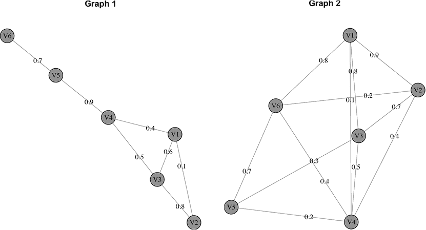
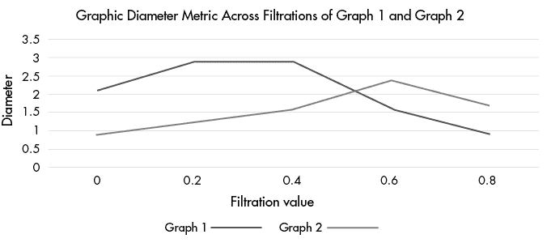
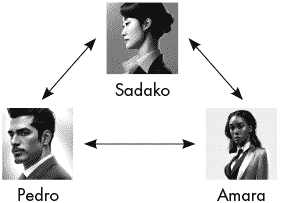
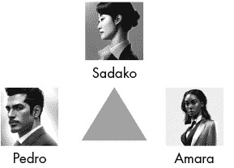
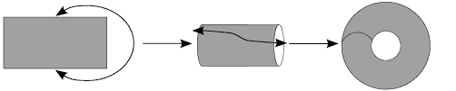
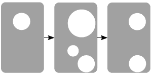
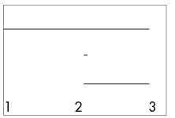
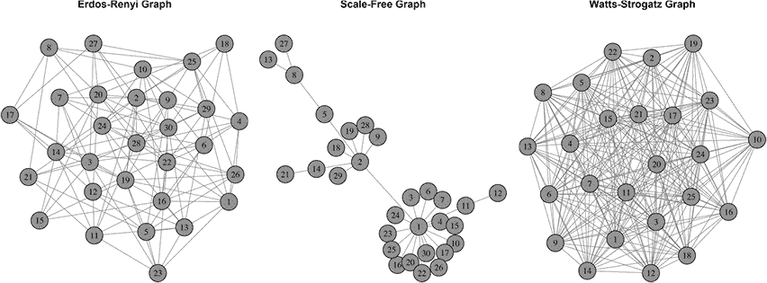
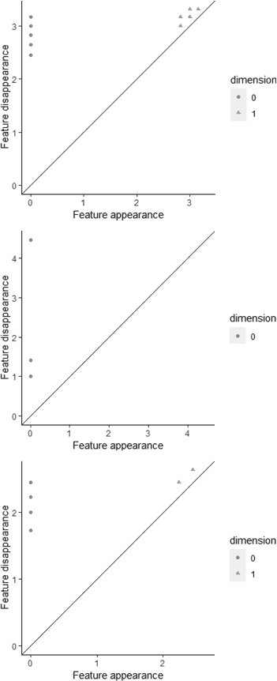

# 4

网络滤波


我们已经探索了许多通过测量几何属性来分析网络数据的方法。在本章中，我们将介绍加权网络的网络滤波，它跟踪网络上的几何属性和网络度量随阈值的变化。接下来，我们将研究如何将网络数据转换为一个更高维的拓扑对象，称为*单纯形复形*，并探索我们之前考虑过的网络度量的高维版本。之后，我们将使用与滤波相关的拓扑工具回到图比较的讨论。

## 图滤波

在前面的章节中，我们回顾了不同的网络度量指标，包括不同的中心性度量、熵、谱半径、直径等许多内容。有一种有趣的方法可以理解加权网络的拓扑属性：*图滤波*，这是一种通过反复删除低于某一阈值的边（例如，所有权重低于 0.2、0.4 或 0.6 的边）来创建一系列加权网络的方法。通过创建一系列阈值图，我们可以识别持久的网络度量，或在广泛的滤波值范围内持续存在的局部和全局网络度量。这为我们提供了可以绘制或跟踪的特征。这个概念是拓扑数据分析（TDA）的核心思想之一。

为了进一步探索，假设我们正在基于青少年在社区中的友谊或非正式社交关系，研究青少年的纵向教育或风险行为结果。假设我们有加权社交网络，每个顶点都有高的度数度量，其中边的权重是根据青少年与朋友在正常一周中相处的时间来加权的。第一组朋友可能会在周末花几个小时一起踢足球。第二组朋友可能每周一起学习一两次，并在课堂上见面。第三组朋友可能经常一起运动、一起做饭后作业或早晨上学前做作业，并且经常住在彼此家里。当我们过滤相处的时间时，前两组朋友的度数度量将在网络中过滤掉。最后一组则会在滤波过程中保持较高的度数度量，因为他们在一起度过的时间更多。这种度数的持久性很可能会揭示出我们研究中的社交关系的强度。

让我们通过分解和探索两个小的示例社交网络，图 1 和图 2，来研究如何实现图滤波。首先，我们将把这两个网络加载到 R 中，并使用 Listing 4-1 中的脚本探索完整网络的结构。

```
#load both networks in R
mydata1<-as.matrix(read.csv("Graph1w.csv",header=F))
mydata2<-as.matrix(read.csv("Graph2w.csv",header=F))

#load igraph and convert to graph objects
library(igraph)
g1<-graph_from_adjacency_matrix(mydata1,mode="undirected",weighted=T)
g2<-graph_from_adjacency_matrix(mydata2,mode="undirected",weighted=T)

#plot the two graphs
plot(g1,edge.label=E(g1)$weight,main="Graph 1")
plot(g2,edge.label=E(g2)$weight,main="Graph 2")
```

Listing 4-1：加载两个不同网络结构以进行滤波的脚本

清单 4-1 中的脚本应该加载两个不同的网络，图 1 和图 2，这两个网络有不同的连接模式，但具有相同数量的顶点。它还应该绘制这两个网络，图中的边权已给出。让我们对比这两个网络，如图 4-1 所示。



图 4-1：两个示例网络的图示

图 4-1 表明，图 1 是一个稀疏连接的网络，边权大多数较大（可能是同一班级的学生在周末参加服务活动的一个样本），而图 2 是一个密集连接的网络，边权具有不同的混合（可能是一个运动队中的友谊网络）。我们预计图 2 中的枢纽得分和其他中心性指标较高，但过滤操作可能会比在图 1 中预期的更快速地改变这些指标。

让我们创建网络的过滤操作，这将使我们能够探索这些网络的一些中心性指标。我们可以通过向清单 4-1 中的脚本添加以下代码来实现：

```
#filter Graph 1
mydata1[mydata1<0.2]<-0
g12<-graph_from_adjacency_matrix(mydata1,mode="undirected",weighted=T)
mydata1[mydata1<0.4]<-0
g14<-graph_from_adjacency_matrix(mydata1,mode="undirected",weighted=T)
mydata1[mydata1<0.6]<-0
g16<-graph_from_adjacency_matrix(mydata1,mode="undirected",weighted=T)
mydata1[mydata1<0.8]<-0
g18<-graph_from_adjacency_matrix(mydata1,mode="undirected",weighted=T)

#filter Graph 2
mydata2[mydata2<0.2]<-0
g22<-graph_from_adjacency_matrix(mydata2,mode="undirected",weighted=T)
mydata2[mydata2<0.4]<-0
g24<-graph_from_adjacency_matrix(mydata2,mode="undirected",weighted=T)
mydata2[mydata2<0.6]<-0
g26<-graph_from_adjacency_matrix(mydata2,mode="undirected",weighted=T)
mydata2[mydata2<0.8]<-0
g28<-graph_from_adjacency_matrix(mydata2,mode="undirected",weighted=T)
```

之前的代码通过边权对图 1 和图 2 进行了过滤，使用了逐步增加的 0.2 的区间。这为每个图的过滤产生了五个网络序列，可以通过对每个过滤图应用网络度量来进一步检查这些网络。

让我们通过向脚本中添加以下内容，检查图 1 过滤后的每个顶点的度中心性：

```
#calculate degree centrality for Graph 1's filtration sequence
d1<-degree(g1)
d12<-degree(g12)
d14<-degree(g14)
d16<-degree(g16)
d18<-degree(g18)

#create a dataset tracking degree centrality across the filtration
g1deg<-cbind(d1,d12,d14,d16,d18)
```

这段代码计算图 1 过滤操作中的度中心性，应该会生成一个包含表 4-1 中信息的数据集。

表 4-1：图 1 过滤后的度中心性

| **Column1** | **d1** | **d12** | **d14** | **d16** | **d18** |
| --- | --- | --- | --- | --- | --- |
| **V1** | 3 | 2 | 2 | 1 | 0 |
| **V2** | 2 | 1 | 1 | 1 | 1 |
| **V3** | 3 | 3 | 3 | 2 | 1 |
| **V4** | 3 | 3 | 3 | 1 | 1 |
| **V5** | 2 | 2 | 2 | 2 | 1 |
| **V6** | 1 | 1 | 1 | 1 | 0 |

表 4-1 显示，顶点 1、3 和 4 具有较高的度中心性；然而，顶点 3 和 4 在更大范围的过滤操作中保持了这些较高的度中心性值，而顶点 1 则较少，表明它们对网络更为重要，尽管在未过滤网络（列 1）中的中心性指标相同。

现在，让我们添加一些代码来计算图 2 过滤后的度中心性：

```
#calculate degree centrality for Graph 2's filtration sequence
d2<-degree(g2)
d22<-degree(g22)
d24<-degree(g24)
d26<-degree(g26)
d28<-degree(g28)

#create a dataset tracking degree centrality across the filtration
g2deg<-cbind(d2,d22,d24,d26,d28)
```

这段代码计算图 2 过滤后的度中心性，产生一个类似于图 1 过滤和中心性计算结果的表格。表 4-2 总结了图 2 过滤和中心性计算的结果。

表 4-2：图 2 过滤后的度中心性

| **Column1** | **d2** | **d22** | **d24** | **d26** | **d28** |
| --- | --- | --- | --- | --- | --- |
| **V1** | 4 | 3 | 3 | 3 | 3 |
| **V2** | 4 | 4 | 3 | 2 | 1 |
| **V3** | 4 | 4 | 3 | 2 | 1 |
| **V4** | 5 | 4 | 3 | 0 | 0 |
| **V5** | 3 | 3 | 1 | 1 | 0 |
| **V6** | 4 | 4 | 3 | 2 | 1 |

如表 4-2 所示，未过滤的图 2 中存在较高的度中心性度量；然而，随着过滤过程的开始，顶点的模式发生了变化。某些顶点，如顶点 1，在整个过滤过程中保持较高的度中心性。其他顶点，如顶点 4，先保持较高的度中心性，然后降到 0。还有一些顶点，如顶点 6，在整个过滤过程中度中心性缓慢下降。这些信息可能对研究某个兴趣子群体中的社会关系有帮助。高程度的非正式社会关系，由较高的中心度表示，已被证明与年轻人在教育成就、职业成就以及应对生活困境方面的韧性有关。

度中心性只是我们可以在过滤过程中计算的一个指标；我们还可以计算其他局部指标，如介数中心性或三元闭合。此外，我们还可以计算全局指标，如谱半径或欧拉特征，通过过滤过程计算图的整体特征。让我们在清单 4-1 中添加以下内容，以计算图 1 每个过滤过程的直径：

```
#calculate graph diameter of Graph 1's filtration
di1<-diameter(g1)
di12<-diameter(g12)
di14<-diameter(g14)
di16<-diameter(g16)
di18<-diameter(g18)
```

通过此代码计算的图 1 过滤过程中直径的序列是 2.1、2.9、2.9、1.6 和 0.9。接下来，让我们计算图 2 的过滤过程中的直径：

```
#calculate graph diameter of Graph 2's filtration
di2<-diameter(g2)
di22<-diameter(g22)
di24<-diameter(g24)
di26<-diameter(g26)
di28<-diameter(g28)
```

通过此代码计算的图 2 过滤过程中的直径序列是 0.9、1.2、1.6、2.4 和 1.7。这与图 1 的直径序列不同，表明在过滤过程的早期，图 2 的直径通常较小，直到过滤序列后期才变大。这个指标的过滤过程可能有助于评估一个社区的整体水平和非正式社会关系的深度，这是衡量居民在需要时可用的社区资源的一个指标。图 4-2 展示了两者过滤过程中的直径变化图，以便比较这两个网络。



图 4-2：图 1 和图 2 的过滤过程中图直径指标的变化图

正如我们在图 4-2 中看到的，图 1 在过滤初期的图直径大于图 2，但这种关系在过滤值为 0.4 后发生了反转。这表明，图 1 在过滤初期具有更大的偏心性，而图 2 在过滤后期表现出更大的偏心性。请记住，偏心性是网络中从一个点到另一个点的最大距离。

如我们在图 4-2 中绘制的图过滤跟踪，可以帮助区分具有不同连接模式或权重的相似图。动态网络，其中权重可能随时间变化，可能是图过滤的一个应用场景。此外，图过滤在比较具有相同顶点但可能具有不同权重的网络（例如脑成像研究中的患者组）时非常有用；事实上，脑成像研究是图过滤方法发展的应用之一。较高的偏心值表示传递神经信号的路径较长；较强的边权表示大脑两个区域之间的连接更强。强边且偏心值较低表明在特定任务下，患者组的大脑中激活了一个功能模块。

尽管图过滤是一个相对较新的概念，但它主要局限于生物网络数据，包括基于脑成像研究的网络。然而，图过滤方法广泛适用于加权网络数据，其工具集也适合在其他领域进一步发展。如果你想更深入地探讨这个话题，可以查阅本书末尾的参考文献，并尝试在自己的数据上应用图过滤。目前，让我们将注意力转向图的拓扑视角，这使我们能够将图中捕捉到的关系扩展到人与人或物与物之间的其他类型互动。

## 从图到单纯复形

图可以被视为具有定义全局属性的拓扑对象，我们可以在分析中利用这些属性，通过考虑图中个体和顶点之间的三方、四方和*n*方互动，将图转化为一个更高维度的图，称为*单纯复形*。让我们考虑三位同事，他们经常合作撰写学术论文，但从未与所有三位同事的名字一起发表过论文。我们将为这三位同事创建一个简单的图，如图 4-3 所示。



图 4-3：展示三位同事之间双向互动的单纯复形

现在让我们想象一篇论文，所有三位同事都参与其中并且他们的名字出现在论文上。这是一个三方互动，而不是三组二方互动，我们最终会得到一个填充的三角形，而不是三组二向箭头，如图 4-4 所示。



图 4-4：展示三位同事之间三方互动的单纯复形

图 4-4 使用一个三角形来表示同事之间的三向连接，类似于之前用箭头表示同事之间的双向连接。这个概念可以推广到四面体用于四向交互，甚至更复杂的形状来表示更高的*n*向交互。*n*的数值没有上限，但当我们向*n*向交互的单纯形复形展开时，计算问题会逐渐显现。涉及电子邮件链、论文合著者或电话会议的分析是常见的应用，这些应用将社交网络分析和图形扩展到单纯形复形的分析中。根据网络的大小和*n*向交互的规模，个体和相互作用的单纯形复形表示可能会随着*n*的值变化变得非常复杂。分析这些结构可能需要大量的计算能力和扩展网络度量的工具。然而，由于图形是拓扑对象，拓扑学的许多定理和工具可以成功应用于它们，而无需进行转换或其他麻烦的操作。这反过来又使得包括偏微分方程和概率论在内的其他数学领域能够应用和发展于图形之上。

就像我们可以对加权图进行过滤一样，我们也可以对单纯形复形进行过滤。单纯形复形的过滤过程取决于单纯形复形的构建方式。在大多数拓扑数据分析算法中，我们从一个数据点云开始，该点云位于可以定义距离度量的空间中。当点之间共享互相的*n*向重叠集（*Čech 复形*）或成对重叠集（*Vietoris–Rips 复形*）时，这些点会被纳入单纯形复形。通过顺序地增大或减小距离度量的值，我们获得了单纯形复形的过滤。在实践中，*Vietoris–Rips 复形*更容易计算，并且是许多常见拓扑数据分析包的基础。这引领我们进入网络分析的一个全新且新兴的领域：将网络工具扩展到单纯形复形。

在前几章介绍的许多工具都有简单复形的类比，包括偏心度、最短路径算法、中心性指标（Katz 中心性、特征向量中心性、接近中心性等）、三元闭合等等。通常，网络数据的简单复形是通过计算网络中的最大团体构建的（尽管也可以定义距离度量并应用前述过程，从网络数据中构建简单复形）。网络的*最大团体*包括顶点群体中最高的*n*路互联边。这些最大团体对应于一个（*n*–1）简单复形。图的*旗形复形*涉及通过计算图的最大团体来构建图的简单复形。从这个复形中，我们可以定义每个简单复形层次的量，并将这些量合并成一个跨层次的总度量。这意味着我们可以在简单复形的各个层次上获得更多关于网络及其组成部分的整体结构信息。

让我们回到前几章介绍的 Farrelly 社交网络，看看度数中心性的扩展——所谓的*拓扑维度*。我们可以将拓扑维度定义为加权度数中心性，即通过该顶点所在团体的维度来加权每个顶点，这涉及到对一个顶点不同维度团体的求和。例如，网络中一个位于最大二团体和最大三团体中的顶点，其拓扑维度为 5。一个位于最大五团体而没有其他团体的顶点，其拓扑维度也为 5。然而，前者的度数可能是 3，分别连接到二团体中的一个顶点和三团体中的两个顶点；而后者的度数为 4，连接到五团体中的四个顶点。

在列表 4-2 中，我们有一个脚本，它计算 Farrelly 社交网络中顶点的最大团体和拓扑维度。

```
#load the author's network
g_social<-read.csv("SocialNetwork.csv")

#create the graph
library(igraph)
g1<-graph_from_adjacency_matrix(g_social,mode="undirected",weighted=F)

#compute the maximal cliques in the author's network data
cl<-maximal.cliques(g1)

#create array
cl<-as.array(cl)

#get clique size from maximal clique array
d<-dim(cl)
l<-rep(NA,d)
for (i in 1:d){
  l[i]<-length(as.vector(cl[[i]]))
}

#create matrix of vertices in maximal cliques
av<-matrix(rep(NA,d*20),20)
for (i in 1:20){
  for (j in 1:d){
    av[i,j]<-i%in%cl[[j]]
  }
}

#convert to binary indicators
avind<-ifelse(av==TRUE,1,0)

#multiply out to calculate each vertex's topological dimension
topmat<-t(avind)*l
topdim<-colSums(topmat)
```

列表 4-2：一个计算 Farrelly 社交网络中顶点拓扑维度的脚本

这个脚本基于图的旗形复形计算拓扑维度。它首先从最大团体计算旗形复形；然后存储每个团体的信息，以便我们可以循环遍历每个团体，查看哪些顶点属于每个团体。将这些信息转换为二进制指示矩阵后，我们可以将团体的维度与指示矩阵相乘，得到一个包含每个顶点拓扑维度的向量。表 4-3 展示了作者网络数据集中每个顶点的拓扑维度和度数。

表 4-3：Farrelly 社交网络中顶点的拓扑维度和度数总结

| **顶点** | **度数** | **拓扑维度** |
| --- | --- | --- |
| 1 | 2 | 3 |
| 2 | 1 | 2 |
| 3 | 5 | 11 |
| 4 | 2 | 3 |
| 5 | 4 | 7 |
| 6 | 3 | 6 |
| 7 | 8 | 18 |
| 8 | 3 | 4 |
| 9 | 3 | 4 |
| 10 | 3 | 6 |
| 11 | 3 | 5 |
| 12 | 1 | 2 |
| 13 | 4 | 8 |
| 14 | 4 | 7 |
| 15 | 4 | 8 |
| 16 | 2 | 4 |
| 17 | 2 | 4 |
| 18 | 3 | 6 |
| 19 | 2 | 4 |
| 20 | 1 | 2 |

表 4-3 展示了度数与拓扑维度之间的显著区别，度数仅在计算中考虑了作者网络的顶点和边，而拓扑维度则包括了更高阶的交互作用。例如，顶点 9 和 10 的度数都是 3；然而，它们的拓扑维度不同，顶点 9 的得分为 4，顶点 10 的得分为 6。顶点 10 在整个网络结构中的重要性大于顶点 9。如果不考虑网络中的更高阶交互作用，我们将无法在这个度量上区分这两个顶点。

对于加权网络，可以将这些基于单纯形复形的度量与图滤波结合起来，产生基于网络的单纯形复形的度量序列。当我们在本章的下一部分讨论一个名为*持久同源性*的工具时，你将会看到这一点。你也可以用欧拉示性数、拓扑维度或尚未开发的单纯形复形扩展的网络度量来做同样的事。

网络度量的单纯形复形扩展是网络科学中的一个全新研究领域，目前几乎没有计算网络度量单纯形类比的包或开源函数。然而，希望这个例子以及一些相关论文能够激发在网络科学包中加入基于单纯形的度量。也许你会接受这个挑战，向 igraph 包或其他开源网络科学工具贡献函数。

接下来我们要介绍的工具涉及的拓扑学内容将比我们之前遇到的更多，所以首先让我们探索一个在图分析和理解单纯形复形中都非常有用的拓扑学概念。

## 同源性简介

我们下一个工具集的基本拓扑学前提是涉及计算对象或数据集中的不同维度的孔。想象一张纸的中间有个洞，或者一个篮球内部有一团空气。这些是不同维度的孔，每个孔将一个物体的连通部分与它的其他部分分开。当这些孔出现在流形或函数中时，我们可以系统地研究它们，并根据这些孔的数量和维度对物体或空间进行分类。

*同调*是对一个物体或空间中不同维度孔洞（连通成分、圆圈、球体、空洞等）进行计数，通常用于对该物体或空间进行分类。对于低维空间，这个过程相当直接；你实际上可以构建空间的物理模型并计数孔洞。然而，也有一些同调变体，允许拓扑学家区分不同类型的物体和空间，即使它们是高维或形状奇特的，也无需物理模型。

对应于每个维度中孔洞的数字形成了一组有用的数值，称为*贝蒂数*，它们组织了给定物体或空间中的孔洞数量和类型，以便可以将每个物体与其他具有相同贝蒂数的物体进行分类和研究。如果你熟悉代数拓扑学，这是一种标准的抽象数学结构分类程序。通常，这些数字存储在一个向量中。虽然这有点抽象，但我们将通过一些简单的示例来解释。

### 贝蒂数的示例

很多运动都涉及到使用球，但从拓扑学的角度来看，并不是所有的球都是相同的。篮球和棒球都是三维空间中的圆形球体。篮球通常比棒球大，但如果有一个大小和棒球相同的儿童玩具篮球，可能会觉得它们非常相似。


图 4-5：一个例子，展示了看起来相似但拓扑上不同的棒球和篮球

然而从拓扑学角度来看，它们是完全不同的。这两个球在第二贝蒂数上有所不同，第二贝蒂数用于计算物体中的三维空洞。贝蒂数向量是一个无限的数字序列，表示每个维度中的孔洞数，起始位置为零维的连通成分，接着是圆圈（第一维度位置）、空洞（第二维度位置）以及更高维度的空洞（从第三维度开始，直到无限维度）。实际上，大多数数据集在第一个贝蒂数之后没有太多孔洞，因此我们可以用零填充贝蒂数向量的其余部分。空心篮球在第一个贝蒂数之后有一个孔，因为它包含一个空洞，因此其贝蒂数向量为（1，0，1，0，...），而实心棒球在任何维度上都没有孔，对应的贝蒂数向量为（1，0，0，0，...）。

有些物体在给定维度上有多个孔。例如，假设在图 4-5 中将一个第二个篮球粘贴到篮球的外表面上。这个物体显然会有另一个空洞，产生一个贝蒂数向量（1，0，2，0，...）。一个甜甜圈，或称为*环面*，具有（1，2，1，0，...）的向量，因为它有两个开口的圆圈定义了管道的两端，这两个圆圈连接后形成了一个空洞。图 4-6 展示了从纸片构建环面的经典方法。



图 4-6：通过连接边缘的纸片构造一个环面

对于那些能够轻松在三维中可视化的对象和空间，分类相对容易。然而，许多行业中使用的数据集涉及的不止三维，比较和分类这些对象需要能够辨别与这些对象相关的 Betti 数字的算法；其中包括基因组数据集（可能涉及百万维空间）、视频序列和多元时间序列。

### 欧拉示性数

一种基于拓扑的度量出现在网络分析和其更高维单纯复形的类似体中，它与前面章节引入的曲率概念相关。*欧拉示性数*，通常用符号 χ 表示，提供了一个数字来概括拓扑空间，并且是一个拓扑不变量，意味着所计算的拓扑量在空间连续变形（拉伸、扭曲或以其他方式操作而不撕裂空间）时不会发生变化。欧拉示性数可以通过 Betti 数字定义；从技术上讲，通过这种方式计算欧拉示性数涉及 Betti 数字的交替求和（零次 Betti 数字 – 一次 Betti 数字 + 二次 Betti 数字 – 三次 Betti 数字 + 四次 Betti 数字……直到存在的最高 Betti 数字）。

欧拉示性数也可以通过单纯复形的维度来定义（顶点数量 – 边的数量 + 三角形的数量 – 互相四向互动的数量 + ……）。然而，包含在边中的顶点不计入顶点数量。作为互相四向互动一部分的三角形也不计算在内。

然而，有一种简单的方法可以使用与最大团体相关的 igraph 函数来获得网络或其更高维单纯复形的最大部分（如前所述）。最大 *k* 团体表示并计数从网络中派生的完整单纯复形的 *k* – 1 维单纯形。它们是构建完整单纯复形并跟踪每个 *n* 维互动中涉及的部分的方便方式。让我们在 Listing 4-2 的脚本中添加代码，来计算作者网络中的最大团体：

```
#create a table counting the number of k+1 simplices in the simplicial complex
summ<-as.numeric(summary(cl)[,1])
jjj<-table(summ)
```

这段代码创建了一个表，总结了我们之前计算的网络中的最大团体。结果应当产生 11 个二团体（一维单纯形或边），6 个三团体（二维单纯形或三角形），以及 1 个四团体（三维单纯形或四方互动）。我们可以将这些值代入欧拉示性数公式：

χ = 0 个顶点 – 11 条边 + 6 个三角形 – 1 个四面体

这给出了一个χ值为-6。最近的研究表明，大多数真实世界的网络具有负欧拉特征。网络数据趋向于负欧拉特征有一个非常有趣的原因，这与网络的曲率有关。图中的负曲率与网络的鲁棒性相关；具有高度负曲率的生物网络通常能够承受网络部分功能的丧失，而不会对有机体产生不利影响。*高斯–博内定理*将通过同调定义的欧拉特征与物体的曲率相关联，包括流形的曲率和流形边界的曲率。最近有一些尝试将网络分析工具如同调和福尔曼–里奇曲率结合起来，深入研究网络特性。这是数学中的一个深刻结果，属于*微分几何*分支，连接了物体的局部几何与其全局拓扑，它是网络科学中的一个较新的研究领域。现在我们知道，网络拓扑和几何是相互关联的，接下来让我们看看一个叫做*持久同调*的拓扑工具。

### 持久同调

今天数据分析中最常用的拓扑基础算法之一是持久同调，它已被应用于基因组学、医疗保健、经济学、能源、心理测量学以及许多其他领域。本质上，持久同调算法的思想是根据数据的不同阈值，从数据构建一个点云，将其过滤成一系列单纯复形（类似于 MRI），并追踪在每个切片中出现和消失的拓扑特征，如孔或空隙。例如，考虑图 4-7 中的三个奶酪切片，每个切片中都有圆形的孔；这些圆形影响数据集的第一个贝蒂数。



图 4-7：包含不同位置孔的三个奶酪切片

在图 4-7 中，所有三个切片中都有一个孔，另一个只出现在中间的切片中，还有一个出现在两个切片中。实际数据中的孔和空隙可以有不同的大小，当我们穿越切片时，孔的直径可能会增大或缩小。持久同调算法对特征的寿命和测量孔的最小大小有阈值。在我们的例子中，我们有一些可能是噪声的特征（要么是半径太小，要么只出现在一片奶酪中），还有一些可能是真实数据集中的特征（例如，出现在所有三个切片中的空隙）。让我们来解读一下这个直觉。

假设我们想比较两个数据集，以查看它们是否来自相同的分布或形状。这在匹配图像数据时很常见。虽然图像数据很少有奶酪孔，但圆形在图像数据中经常出现，通常表现为眼睛。

从技术上讲，通过改变用于构建单纯复形的距离（或过滤），可以在过滤过程中跟踪不同的贝蒂数，并为数据中的每个孔洞分配一个重要性分数，其中重要特征在较长的过滤距离下持续存在（在持久同调的术语中，这被称为*持久性*）。在图 4-7 中，出现在所有三个切片中的孔洞被视为最重要的特征，而仅出现在第二个切片中的孔洞可能是数据中的噪声。然后，这些特征可以绘制在*条形码*或*持久性图*上，以跟踪这些特征的生命周期（它们在过滤中存在的距离尺度）。我们将在接下来的示例分析中探讨条形码和持久性图。

实际上，由于计算问题，数据集通常仅检查低维的孔洞和特征，除非明确计算高维形状数据，否则最常使用零阶（连接成分）和一阶（圆形）贝蒂数。图 4-7 中的示例在所有三个切片中都是连接的，因此它在所有切片中的零阶贝蒂数为 1。然而，圆形在过滤过程中出现并消失，形成类似于图 4-8 的条形码。



图 4-8：绘制在图 4-7 框中的特征（孔洞）持久性的图示

条形码显示了特征出现和消失的时间。例如，在图 4-8 中，我们可以看到一个特征在时间 2 出现并在时间 3 消失（这是图 4-7 中的底部奶酪孔）。数据切片中连接成分的序列与另一种机器学习方法——单链接层次聚类——有着奇特的关系，其中每个高度层级的簇对应于该特定切片中的连接成分。当两种技术使用相同的距离度量时，结果实际上是相同的；然而，持久同调方法将提供比单链接层次聚类的树状图更多的关于数据结构的信息。这意味着机器学习从业者可以选择最适合问题的技术，因为这两种方法各自都有自己的图表和统计测试。例如，对于非技术受众，单链接层次聚类可能更为可取，因为树状图和热图对于生物学家或社会科学家来说更为熟悉。

## 持久同调下的网络比较

在网络分析领域，持久同调可以是比较网络结构的有用方法，以判断不同的网络是否具有相同的基本几何形状。让我们进一步探索这个问题，并应用于模拟网络。在神经科学中，通常将 fMRI 或 PET 数据转化为网络结构，其中大脑的不同区域转化为顶点，并根据活动模式（例如，某个区域的顺序激活，或在同一任务中多个区域的共同激活）将其连接到大脑的其他区域。研究中常见的目标是比较不同组的患者，无论是健康患者与患有特定神经或心理疾病的患者之间，还是两组患病群体之间，以了解在不同疾病间大脑激活模式的差异。

我们将探讨在比较这两种网络时，持久同调的应用。由于 fMRI 数据并不容易作为开源数据获取，我们将在 igraph 中模拟大约与脑成像网络相当规模的网络；这将演示如何将这种方法应用于已经转化为网络数据的成像数据。

igraph 包允许你模拟多种类型的网络数据，包括 Erdös–Renyi 图、无标度图和 Watts–Strogatz 图。我们将使用列表 4-3 中的脚本来创建这些类型的图。

```
#simulate three graphs using the igraph package for further comparison
library(igraph)

#create an Erdos-Renyi graph
g1<-erdos.renyi.game(30,0.3)

#create a scale-free graph
g2<-sample_pa(30,power=2.5,directed=F)

#create a Watts-Strogatz graph
g3<-sample_smallworld(2,5,3,0.3)

#plot the three graphs created
plot(g1,main="Erdos-Renyi Graph")
plot(g2,main="Scale-Free Graph")
plot(g3,main="Watts-Strogatz Graph")
```

列表 4-3：一个模拟三种不同类型网络结构的脚本，用于统计比较

列表 4-3 创建了三种不同类型的网络，这些网络可以通过持久同调进行比较；它还可视化这些网络，结果应与图 4-9 类似（但可能不完全相同）。



图 4-9：三种模拟网络类型的绘图

图 4-9 显示了非常不同类型的图。中间的无标度图包括一个包含许多与中心节点连接但不与其他节点连接的顶点的中心节点。左侧的 Erdös–Renyi 图和右侧的 Watts–Strogatz 图有更多的相互连接，但 Watts–Strogatz 模型似乎具有更多的结构，将顶点连接成团体，而不是随机连接顶点。

让我们将持久同调应用于这些网络，并通过添加以下内容到列表 4-3 来比较这些网络之间持久性图的距离；请注意，由于每种网络类型的模拟不同，您的结果可能会有所不同：

```
#load TDA package
library(TDAstats)

#get adjacency matrices
m1<-as.matrix(get.adjacency(g1))
m2<-as.matrix(get.adjacency(g2))
m3<-as.matrix(get.adjacency(g3))

#compute persistent homology
d1<-calculate_homology(m1,dim=2,format="cloud")
d2<-calculate_homology(m2,dim=2,format="cloud")
d3<-calculate_homology(m3,dim=2,format="cloud")

#plot persistence diagrams
plot_persist(d1)
plot_persist(d2)
plot_persist(d3)

#compute distances among graphs
w1<-phom.dist(d1,d2,limit.num=0)
w2<-phom.dist(d1,d3,limit.num=0)
w3<-phom.dist(d2,d3,limit.num=0)
```

该补充部分从每个模拟的图中推导出一个邻接矩阵，并从该邻接矩阵计算一个持久性图，然后通过零阶同调群之间的距离进行比较。这个脚本应该生成三个持久性图，看起来像图 4-10（注意它们不会完全相同，因为每次运行都会生成稍微不同的结果）。



图 4-10：三种模拟网络类型的持久性图（从上到下：Erdös–Renyi、无尺度图和 Watts–Strogatz）

图 4-10 展示了在每种网络类型中发现的不同拓扑特征。Watts–Strogatz 网络和 Erdös–Renyi 图都产生了许多大的零阶同调特征（即点），而无尺度图则有不同大小的零阶同调特征。无尺度图没有更高阶的同调特征，而其他两个图有第一阶同调特征（即三角形），尽管这些特征非常接近对角线（这表明它们可能是噪声）。直接位于对角线上的点是仅出现在数据一个切片中的特征；一个点离对角线越远，它在数据中存在的时间就越长。对于我们的三种模拟网络，仅从持久性图来看，很难判断无尺度图和 Watts–Strogatz 图是否与 Erdös–Renyi 图有显著差异。

我们可以在脚本中添加内容，以推导出 Erdös–Renyi 持久性图的零分布，并使用一种特殊的距离度量——Wasserstein 距离，来统计检验 Erdös–Renyi 持久性图与无尺度图和 Watts–Strogatz 持久性图之间的结构差异：

```
#get Wasserstein distance between random graphs with the same structure
ww<-rep(NA,100)

for (i in 1:100){
  g1<-erdos.renyi.game(30,0.3)
  g2<-erdos.renyi.game(30,0.3)
  m1<-as.matrix(get.adjacency(g1))
  m2<-as.matrix(get.adjacency(g2))
  d1<-calculate_homology(m1,dim=2,format="cloud")
  d2<-calculate_homology(m2,dim=2,format="cloud")
  ww[i]<-phom.dist(d1,d2,limit.num=0)
}

#compute 95% confidence intervals from the simulated null distribution
quantile(ww,c(0.025,0.975))
```

该脚本从与原始持久性图构建相同的分布中创建 Erdös–Renyi 持久性图的零分布；由于模拟部分具有随机成分，您的结果可能会有所不同。我们的零分布的分位数给出了一个置信区间（0.91, 8.36），其中包括比 Erdös–Renyi 图与 Watts–Strogatz 图（23.59）之间持久性图计算出的距离和 Erdös–Renyi 图与无尺度图（39.78）之间的距离小得多的距离。因此，我们可以得出结论，Watts–Strogatz 图和无尺度图的结构不是随机的。这些图的每个结构都包含了显著的结构成分。

这种类型的模拟在测试来自 fMRI 和 PET 成像研究的脑网络持久性图之间的差异时非常有用，而且在 R 中实现起来也很简单。该方法也可以应用于其他具有假设性基础结构的网络，如社交网络或电力网。许多其他类型的网络分析工具也可以用于比较图形结构，例如局部和全局度量（包括图的半径和直径、度分布、聚类图系数等），而且这些比较目前还没有被深入探索。

## 总结

在本章中，我们过滤了加权网络，以了解在根据边权重移除边的过程中，网络度量如何变化。然后，我们从网络数据中构建了简单复形，以利用多个拓扑工具，包括度量的扩展、欧拉示性数以及一种基于过滤的算法——持久同调，这些工具可用于比较网络。 在下一章中，我们将从网络科学转向距离几何，探索不同的测量选择如何影响监督学习和无监督学习算法。
