# 5

数据科学中的几何学


在本章中，我们将探索几何学中的几个工具：我们将研究距离度量及其在*k*-最近邻算法中的应用；我们将讨论将高维数据映射到潜在弯曲的低维流形的流形学习算法；并且我们将看到如何将分形几何应用于股票市场数据。本章的动机来源于*流形假设*，该假设认为现实世界中的数据通常具有比收集到的数据集维度更低的自然维度。换句话说，一个具有 20 个变量（即 20 维度）的数据集，可能在 12 维空间或 8 维空间中有更好的表示。鉴于维度的诅咒，在低维空间中表示数据是理想的（尤其是当数据集的原始维度很大时，如基因组学或蛋白质组学数据）。选择合适的距离度量来创建这些表示对于解决方案的质量具有重要意义。

## 数据中的距离度量简介

许多机器学习算法依赖于距离度量，它们提供了空间或流形中点或对象之间的度量。选择距离度量的变化可以显著影响机器学习的表现，正如我们将在本章后面看到的那样。*距离度量*提供了空间或流形中点或对象之间的度量。这可以像使用尺子测量平面纸上两点之间的距离那样简单，正如图 5-1 中所演示的。

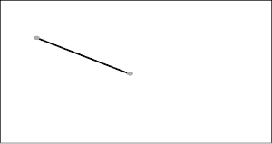

图 5-1：纸面上两个点的图示及连接它们的直线

然而，使用尺子来测量球面上两点之间的距离肯定会更为复杂。

如果你用一根绳子标出连接球面上两点的最短路径，如图 5-2 所示，你可以在绳子上标记距离，然后用尺子测量拉直后的绳子上的距离。这类似于在流形上度量距离时所做的事情，其中*测地线*（相对于弯曲流形的两点之间的最短路径）被提升到*切空间*（由切线、切平面和更高维切线定义的零曲率空间）来测量距离。

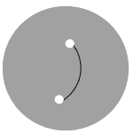

图 5-2：球面上两个点的图示，以及连接它们的测地线

我们将在第六章中更深入地探讨切空间及其在机器学习中的应用，但目前你可以将其想象为将弦提升到一张大纸上，并用尺子测量其长度，以便在曲面外部测量距离，因为在这里更难建立标准的测量方式。虽然测地线和切空间看起来违反直觉，但它们源自我们对欧几里得几何中切线和微积分中导数的理解。

然而，还有其他情况下，两点之间的距离会更加复杂。考虑从一个房屋走到另一个房屋，正如在图 5-3 中所示。

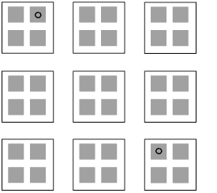

图 5-3：一个社区的房屋图，其中一个人在两栋房屋之间走动

除非有人能够在邻近的房屋之间穿行，而不碰到外墙和内墙（更不用说遇到不满的邻居了！），否则无法画出一条在两栋房屋之间的直线或测地线来提供一条直接路径，正如在图 5-4 中所看到的。

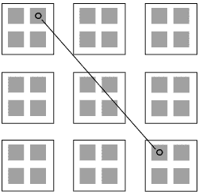

图 5-4：一个社区的房屋图，其中一个人尝试在房屋之间画一条直线

相反，走人行道要实际得多（见图 5-5）。

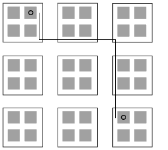

图 5-5：一个社区的房屋图，其中一个人在房屋之间的人行道上走动

距离通常是离散的，而非连续的，或者位于具有曲率的流形上。理解数据空间的几何形状，可以很好地指示出适合数据的距离度量。在接下来的部分中，我们将介绍一些机器学习中常见的距离度量，之后的章节中，我们会将这些距离应用于*k*-NN 算法和降维算法。

## 常见的距离度量

由于度量距离的复杂性，理解一些机器学习中常用的距离度量非常重要，包括我们在第四章中简要接触到的一个（Wasserstein 距离，用于比较持久同调结果）。距离度量有无限多种，有些距离度量还具有可以引起无限种变体的参数。因此，我们无法涵盖所有可能在机器学习中遇到的距离度量。我们已经排除了在推荐系统中有用的某些度量，如余弦距离，因为它们在拓扑数据分析或网络分析应用中并不常见。我们将探讨一些常见的度量；如果你有兴趣深入了解，我们建议你探索*度量几何*这一领域。

### 模拟一个小数据集

在我们开始探索常见的距离度量之前，让我们通过清单 5-1 来模拟一些数据。

```
#create data
a<-rbinom(5,4,0.2)
b<-rbinom(5,1,0.5)
c<-rbinom(5,2,0.1)
mydata<-as.data.frame(cbind(a,b,c))

#create plot
library(scatterplot3d)
scatterplot3d(a,b,c,main="Scatterplot of 3-Dimensional Data")
```

清单 5-1：模拟并绘制小数据集的脚本

这个脚本创建了一个包含三个变量的数据集，并在三维空间中绘制点。这将生成一个绘制在三个坐标轴上的点图（图 5-6）。

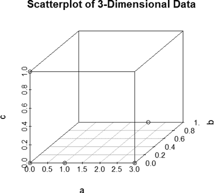

图 5-6：五个点的图，所有点都位于由变量*a*、*b*和*c*定义的坐标轴上

这个数据集包括清单 5-2 中显示的点，我们将用它来计算点之间的距离。

```
> **mydata**
  a b c
1 2 1 0
2 0 0 1
3 1 0 0
4 0 0 0
5 3 0 0
```

清单 5-2：包含模拟数据集中五个点的矩阵，这些点有随机变量*a*、*b*和*c*

现在我们已经生成了一个数据集，让我们看看一些可以用来衡量数据集中点对之间距离的标准距离度量。R 自带了一个非常方便的包，叫做*stats*包（它是 R 基本安装的一部分），可以通过`dist()`函数计算一些常见的距离度量。

### 使用基于范数的距离度量

我们首先考虑的距离是相关的。*范数*是一个函数或向量的“长度”度量。范数涉及将距离差异的幂次求和，然后对结果应用该幂次的根。例如，对于点之间的*欧几里得距离*，会先求出差异的平方和，然后对结果取平方根。对于单个向量（即单个数据点），范数将是从原点到该点的加权距离，其中坐标轴互相交叉。你可以把它想象成从原点到被测点的直线长度。回到我们点的散点图，可能像图 5-7 所示那样绘制。


图 5-7：一个包含五个点的图，图中有一条直线指向集合中的某个点

用于度量点之间度量距离的最常见范数可能是前面提到的欧几里得距离，由 L²-范数给出，定义为点之间的平方距离的平方根，其中 L 是向量（或向量组）的占位符，指数是范数的幂次（这里是 2）。这是高中的几何学课程中通常教授的距离，也被称为*毕达哥拉斯距离*。我们在图 5-4 中看到了它，图中显示了房屋之间最短距离的直线（按鸟飞的路径从空中看）。统计学家在计算回归算法中的平方误差时通常使用欧几里得距离的平方；由于一些原因，我们在这里不再深入探讨，使用欧几里得距离的平方是非常自然的。

与 L²范数相关的是 L¹范数，或称*曼哈顿距离*。曼哈顿距离计算类似于图 5-5 中给出的邻域示例。曼哈顿距离定义为沿每个轴的点差的总和，轴的点差被求和到一个最终的轴距离总计中。假设我们有两个点(0, 1)和(1, 0)，它们可能表示患者是否在疾病模型中某个感兴趣基因中存在基因突变。曼哈顿距离是(0 + 1) + (1 + 0)，即沿所有向量轴的点差之和。在这个例子中，我们发现曼哈顿距离为 2。

该度量在处理计数数据或其他离散数据格式时非常有用，例如本节前面生成的示例数据集。图 5-5 演示了这种类型的距离计算，其中人物需要沿着南北轴和东西轴在人行道上行走。曼哈顿距离和 L¹范数在 Lasso 回归和弹性网回归的应用中经常出现，用于将β系数设置为 0，如果它们距离原点在某个范围内，从而执行变量选择并创建稀疏模型。这在自变量集维度较高（如基因组数据）的情况下非常有用。

L¹范数和 L²范数的推广是*闵可夫斯基距离*，它将范数从 L³范数推广到 L^∞范数。L^∞范数是基于范数的距离的另一种特殊实例，称为*切比雪夫距离*。从数学角度来看，切比雪夫距离是沿任一轴之间的最大距离。它常用于涉及机械或自主系统（如无人机）计划运动的问题中。

随着范数维度的增加，闵可夫斯基距离值通常会减少并趋于稳定。因此，具有高维范数的闵可夫斯基距离可以充当距离平滑器，抑制曼哈顿或欧几里得距离计算中发现的奇异或异常大的距离。闵可夫斯基距离确实有一些条件，包括零向量的长度为零，应用正标量倍数于向量时不会改变向量的方向，并且两点之间的最短距离是直线（称为*三角不等式条件*）。在 R 的`dist()`函数中，范数的维度由参数`p`给出，其中`p=1`对应曼哈顿距离，`p=2`对应欧几里得距离，依此类推。

曼哈顿距离的一个特殊扩展是*堪培拉距离*，它是 L¹范数的加权和。从技术上讲，堪培拉距离是通过找到一对点之间的距离的绝对值，并将其除以这对点的绝对值之和，然后对点对求和来计算的。当处理离群值、入侵检测或混合类型预测变量（连续和离散测量）时，堪培拉距离可以是一个有用的度量。在图 5-7 中的示例点可能不是统计学上的离群值，但它确实位于与其他模拟点不同的数据空间中。

让我们运行这些距离并将结果与本节前面模拟的数据集进行比较；将以下内容添加到列表 5-1 中的代码：

```
#run distance metrics on example dataset
d1<-dist(mydata,"euclidean",upper=T,diag=T)
d2<-dist(mydata,"manhattan",upper=T,diag=T)
d3<-dist(mydata,"canberra",upper=T,diag=T)
d4<-dist(mydata,"minkowski",p=1,upper=T,diag=T)
d5<-dist(mydata,"minkowski",p=2,upper=T,diag=T)
d6<-dist(mydata,"minkowski",p=10,upper=T,diag=T)
```

这段代码计算了应用于我们示例数据集的欧几里得距离、曼哈顿距离、堪培拉距离和闵可夫斯基距离的度量。通过查看模拟数据集中点对之间的欧几里得距离，如表格 5-1 所示，我们可以看到许多点对之间的值有很多小数位数，这是由于计算欧几里得距离时涉及的平方根。

表格 5-1：在列表 5-2 的矩阵中，点对之间的欧几里得距离计算

| **欧几里得** | **1** | **2** | **3** | **4** | **5** |
| --- | --- | --- | --- | --- | --- |
| **1** | 0 | 2.44949 | 1.414214 | 2.236068 | 1.414214 |
| **2** | 2.44949 | 0 | 1.414214 | 1 | 3.162278 |
| **3** | 1.414214 | 1.414214 | 0 | 1 | 2 |
| **4** | 2.236068 | 1 | 1 | 0 | 3 |
| **5** | 1.414214 | 3.162278 | 2 | 3 | 0 |

继续查看曼哈顿距离（表格 5-2），点对之间的距离变为整数，因为计算过程中涉及沿每个轴的离散步长来分隔点。

表格 5-2：在列表 5-2 的矩阵中，点对之间的曼哈顿距离计算

| **曼哈顿** | **1** | **2** | **3** | **4** | **5** |
| --- | --- | --- | --- | --- | --- |
| **1** | 0 | 4 | 2 | 3 | 2 |
| **2** | 4 | 0 | 2 | 1 | 4 |
| **3** | 2 | 2 | 0 | 1 | 2 |
| **4** | 3 | 1 | 1 | 0 | 3 |
| **5** | 2 | 4 | 2 | 3 | 0 |

正如预期的那样，闵可夫斯基距离计算结果与`p=1`时的曼哈顿距离和`p=2`时的欧几里得距离一致。在表格 5-3 中，你可以看到`p=1`时的闵可夫斯基距离。

表格 5-3：在列表 5-2 的矩阵中，点对之间的闵可夫斯基距离计算

| **闵可夫斯基 `p=1`** | **1** | **2** | **3** | **4** | **5** |
| --- | --- | --- | --- | --- | --- |
| **1** | 0 | 4 | 2 | 3 | 2 |
| **2** | 4 | 0 | 2 | 1 | 4 |
| **3** | 2 | 2 | 0 | 1 | 2 |
| **4** | 3 | 1 | 1 | 0 | 3 |
| **5** | 2 | 4 | 2 | 3 | 0 |

堪培拉距离与曼哈顿距离给出了一些相似和重叠的值。然而，由于距离计算中的加权部分，某些距离是不同的（特别是涉及点 2 或 3 的对），如表 5-4 所示。

表 5-4：在清单 5-2 矩阵中的点对之间的堪培拉距离计算

| **堪培拉** | **1** | **2** | **3** | **4** | **5** |
| --- | --- | --- | --- | --- | --- |
| **1** | 0 | 3 | 2 | 3 | 1.8 |
| **2** | 3 | 0 | 3 | 3 | 3 |
| **3** | 2 | 3 | 0 | 3 | 1.5 |
| **4** | 3 | 3 | 3 | 0 | 3 |
| **5** | 1.8 | 3 | 1.5 | 3 | 0 |

在清单 5-2 的距离矩阵计算中，对于某些点，这三种距离为一对点（例如点 4 和 5）提供相同的距离评分。然而，当我们增加`p`值时，某些距离会发生显著变化（例如点 1 和 2）。如果我们在支持向量机分类器中使用这些距离度量，我们可能会得到一个非常不同的线来划分数据，或者产生非常不同的错误率。

还有其他修改或扩展基于范数的距离的方法。一种常见的修改方式类似于堪培拉距离：*马哈拉诺比斯距离*在计算欧几里得距离之前，应用加权方案，然后再对结果取平方根，使得欧几里得距离通过协方差矩阵加权。如果协方差矩阵只是单位矩阵，马哈拉诺比斯距离将退化为欧几里得距离。如果协方差矩阵是对角矩阵，则结果是标准化的欧几里得距离。因此，马哈拉诺比斯距离提供了一种“中心化”的距离度量，可以识别数据样本中的杠杆点和异常值。它通常用于聚类和判别分析，因为异常值和杠杆点可能会扭曲结果。

在 R 中计算马哈拉诺比斯距离有一个简单的方法：`mahalanobis()`函数。让我们再次添加到我们的脚本中：

```
#run Mahalanobis distance metrics
#first use the covariance to center the data
d7<-mahalanobis(mydata,center=F,cov=cov(mydata))

#then center to one of the points of the data, in this case point 1
d8<-mahalanobis(mydata,center=c(2,1,0),cov=cov(mydata))

#then use the column means to center the data
d9<-mahalanobis(mydata,center=colMeans(mydata),cov=cov(mydata))
```

这段代码将计算使用不同中心化策略的马哈拉诺比斯距离，产生三个不同的杠杆/加权标准距离度量，参考表 5-5 中的详细内容。

表 5-5：来自图 5-7 矩阵的个体点的马哈拉诺比斯距离结果

| **马哈拉诺比斯** | **1** | **2** | **3** | **4** | **5** |
| --- | --- | --- | --- | --- | --- |
| **仅协方差** | 6.857143 | 6.857143 | 0.857143 | 0 | 7.714286 |
| **点 1** | 0 | 8 | 5.428571 | 6.857143 | 7.714286 |
| **列的含义** | 3.2 | 3.2 | 0.628571 | 2.057143 | 2.914286 |

通过将每个点作为中心，你可以完成一个类似于`dist()`函数创建的距离矩阵。你只需遍历各个点并将行附加到数据框中。

从马哈拉诺比斯距离计算中可以得出一些有趣的观察结果。当只使用协方差时，原点成为计算距离的参考点，而位于原点的点 4 的马哈拉诺比斯距离为 0。然而，当使用列均值来居中数据时，这个点的值跳跃到了一个更远的值。这表明，尽管点 4 在原点上完全居中，但它距离列均值相当远。另一个有趣的趋势是点 3，它既靠近原点，也靠近居中的列均值，在这个数据集中居中的列均值为(1.2, 0.2, 0.2)。点 3 位于(1, 0, 0)，既靠近原点，又靠近这个居中的列均值。其他点相对较远，无论是从原点还是从居中的列均值。

我们可以将这些列均值添加到数据的图中，并通过再次修改脚本来可视化马哈拉诺比斯距离是如何工作的：

```
#add point to dataset created earlier in this section
colmean<-c(1.2,0.2,0.2)
mydata<-rbind(mydata,colmean)

#create plot
library(scatterplot3d)
scatterplot3d(mydata[,1],mydata[,2],mydata[,3],
main="Scatterplot of 3-Dimensional Data")
```

这段代码将列均值点添加到原始数据集中，以检查数据在三维空间中应该位于哪里；该代码应生成一个类似于图 5-8 的图形。

检查图 5-8 并与图 5-6 进行比较，我们可以看到一个点被放置在轴外，似乎在五个点中占据了一个中心位置。找到数据集的中心位置有助于进行几个数据科学任务，包括发现隐性异常值（即没有任何一个变量极端值但在多变量数据集中远离大多数点的异常值）和计算多变量统计量。正如我们的马哈拉诺比斯结果所示，某些点离这个中心位置更近；这些点是我们数据集中的点 3 和点 4，它们相对靠近原点。

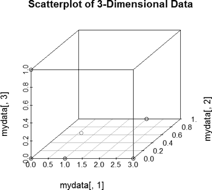

图 5-8：对于 Listing 5-2 中矩阵中的各个点，通过列均值居中计算的马哈拉诺比斯距离图，其中列均值点显示在轴外

这些距离差异在许多机器学习应用中都会出现，我们将在本章稍后应用这些距离于*k*-最近邻问题时，看到距离如何影响机器学习的表现和结果。不同的度量选择会导致性能的剧烈变化，使用错误的度量可能会误导模型结果和解释。

### 比较图形、形状和概率分布

基于范数的距离度量并不是机器学习中唯一可能的度量类。如我们在第四章中所看到的，除了点之间的距离外，还可以计算其他对象之间的距离，如持久性图。粗略来说，这些度量衡量的是概率分布之间的差异。我们已经简要使用过其中的一种，即 Wasserstein 距离，用于比较持久性图分布。现在让我们更仔细地看看。

#### Wasserstein 距离

粗略来说，*Wasserstein 距离*比较了两种分布中堆积的概率权重堆。它通常被称为“地球搬运工距离”，因为 Wasserstein 距离衡量的是将一种分布的概率堆移到另一个分布所需的成本和努力。对于那些数学上更为精通的读者，*p*阶 Wasserstein 距离可以通过将联合分布的边际期望值提升到*p*次方，求出所有这些随机变量的联合概率分布的下确界，然后再对结果取*p*次方根来计算。然而，这些细节超出了本书的预期范围，我们将在探索这个度量时坚持“地球搬运工距离”的直观理解。让我们通过可视化两种泥土堆的分布来帮助理解这个度量（图 5-9）。

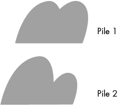

图 5-9：两种泥土堆积物的分布，类似于可以使用 Wasserstein 距离度量进行比较的概率密度函数类型

图 5-9 中的堆积物 1 在左侧有一大堆泥土，如果我们要将堆积物 1 的泥土分布转化为堆积物 2 的分布，那么这些泥土需要铲到右侧的堆积物中。我们的泥土搬运工将需要移动相当多的泥土才能将堆积物 1 变成堆积物 2。然而，如果堆积物 2 的泥土分布更接近堆积物 1，如图 5-10 所示，那么我们的泥土搬运工所需的工作量就会减少。

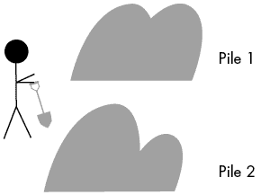

图 5-10：两种泥土堆积物的分布，类似于可以使用 Wasserstein 距离度量进行比较的概率密度函数类型，该度量衡量的是泥土搬运工将堆积物 1 转化为堆积物 2 所需的工作量

要从分布 1 到达分布 2，你可以想象有人正在铲泥土。铲掉的泥土量对应着 Wasserstein 距离。非常相似的概率密度函数会有较小的 Wasserstein 距离；而那些非常不相似的概率密度函数则会有较大的 Wasserstein 距离。

因此，Wasserstein 距离是比较概率分布的一个很好的度量工具——可以用来比较理论分布与样本分布，看看它们是否匹配；也可以用来比较来自相同或不同群体的多个样本分布，看看它们是否匹配；甚至可以用来理解在机器学习函数中是否可能使用更简单的概率分布来近似底层数据，以便机器学习算法中的计算更容易进行。

虽然我们在这里不会深入探讨，但有些分布——包括计数数据、是/否数据，甚至是机器学习输出结构（如树状图）——可以通过其他度量进行比较。现在，让我们看看另一种比较概率分布的方法，这一次是对于离散分布。

#### 熵

一类常见的距离度量涉及一个被称为 *熵* 的属性。信息熵由概率密度函数的负对数定义，衡量概率密度函数中每个点的非随机性程度。通过理解每个值中分布所包含的信息量，就可以比较不同分布之间的信息差异。这对于比较复杂的概率函数或机器学习算法的输出，以及推导非参数统计检验，可以是一个非常有用的工具。

二项分布在数据科学中经常出现。我们可能认为一个随机顾客在两种新界面设计之间没有偏好（在 A/B 测试中，50% 的顾客偏好 A，50% 的顾客偏好 B）。我们可以估计 10 个、20 个或 10,000 个顾客偏好 A 而非 B 的机会，并将其与提供反馈的实际顾客样本进行比较。一个假设可能是我们有不同的顾客群体，其中一个群体非常小。当然，在实际中，我们不知道顾客群体的实际偏好分布，并且可能没有足够的数据通过比例检验来数学地比较这些分布。利用某种度量可以帮助我们推导出检验。

为了更直观地理解这一点，让我们通过 清单 5-3 中的代码来模拟两个二项概率分布。

```
#create samples from two different binomial probability distributions
a<-rbinom(1000,5,0.1)
b<-rbinom(1000,5,0.4)

#create plot of probability density
plot(density(b),ylim=c(0,2),main="Comparison of Probability Distributions")
lines(density(a),col="blue")
```

清单 5-3：模拟不同二项概率分布的脚本

图 5-11 显示了这两个二项分布具有非常不同的密度函数，信息存储在分布的不同部分。

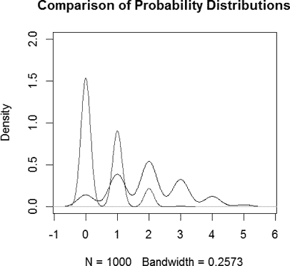

图 5-11：为比较绘制的两个二项分布的密度函数

黑色曲线分布，分布 *b*，**在比分布 *a*（灰色曲线）覆盖更多值的范围内包含了更广泛的信息。基于熵的度量可以用来量化分布 *a* 和 *b* 之间在信息存储上的差异。R 提供了许多工具和包，用于量化和比较信息熵。让我们进一步探索。

R 中的 philentropy 包包含 46 种不同的度量方法，用于比较概率分布，其中包括许多基于熵的度量方法。比较流行的熵度量之一是*Kullback–Leibler 散度*，它度量两个概率分布的相对熵。从技术上讲，Kullback–Leibler 散度度量的是两个概率分布之间对数差异的期望（离散分布为求和，连续分布为积分）。因此，它是信息增益或损失的度量。这使我们能够将信息熵转换为一种分布比较工具，当我们试图比较那些可能不适合常规统计工具的未知或复杂的概率分布时，这个工具非常有用。

让我们通过回到我们的两个二项分布*a*和*b*，来培养直觉。我们将通过在列表 5-3 中添加以下内容来计算这两个分布之间的 Kullback–Leibler 散度：

```
#load package
library(philentropy)

#calculate Kullback-Leibler divergence
kullback_leibler_distance(P=a,Q=b,testNA=T,unit="log2",epsilon=1e-05)
```

这段代码计算了在列表 5-3 中生成的两个二项分布样本的 Kullback–Leibler 散度。在这组模拟数据中，Kullback–Leibler 散度为 398.5428；另一组这些分布的模拟可能会得出不同的散度值。然而，通过使用非参数检验，我们可以将这个散度值与我们分布之一的随机误差成分进行比较，从而判断分布*a*和*b*之间的熵是否存在统计学上的显著差异。我们可以在脚本中添加内容，利用熵差异创建非参数统计检验：

```
#create a nonparametric test
#create a vector to hold results from the simulation loop
test<-rep(NA,1000)

#loop to draw from one of the binomial distributions to generate
#a null distribution for one of our samples
for (i in 1:1000){
  new<-rbinom(1000,5,0.1)
  test[i]<-kullback_leibler_distance(P=a,Q=new,testNA=T,unit="log10",epsilon=1e-05)
}

#obtain the cut-off score for 95% confidence intervals, corresponding
#to values above/below which a sample would be considered statistically
#different than the null distribution
quantile(test,c(0.025,0.0975))
```

本次测试的置信区间表明置信区间为 1,427–1,475，这意味着我们的分布存在显著差异。这是可以预期的，因为分布*a*和*b*的值和范围非常不同。绘制最后一个模拟的分布（图 5-12）表明，新分布与*a*的匹配度远高于与*b*的匹配度。

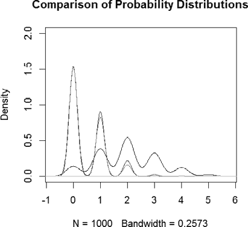

图 5-12：三个二项分布的密度函数图，用于比较，其中两个来自相同分布样本的样本

使用 Kullback–Leibler 散度，我们已经确定*a*和*b*是统计学上不同的种群。如果我们看到包含 104.2 的置信区间，我们会得出结论：*a*和*b*可能来自同一个总体分布。实际中，像比例检验这样的统计检验存在用于比较二项分布，但有些离散分布或样本大小并没有容易的统计比较方法（例如，来自两个卷积神经网络分类器的预测类别分布的比较）。

#### 形状比较

正如我们在第四章中看到的，点集和形状（例如持久性图）可以是重要的数据结构，这些对象也可以被衡量和比较。接下来的三个度量将更深入地讨论这种情况。我们从两个半径不同的圆的例子开始，如图 5-13 所示。

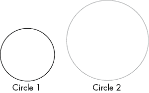

图 5-13：两个半径不同的圆

现在，假设这两个圆是公园中的小径，有人正在遛狗，狗沿外环行走，主人沿内环行走。图 5-14 显示了这一视觉效果。

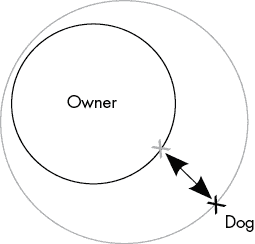

图 5-14：一只狗和主人通过牵引绳连接，在公园的不同小径上行走

在某些时刻，主人和她的狗靠得很近，短牵引绳就足够将它们连接起来。然而，随着它们逆时针移动，主人和狗之间的距离增加，需要更长的牵引绳才能将它们连接起来；你可以在图 5-15 中看到这一点。

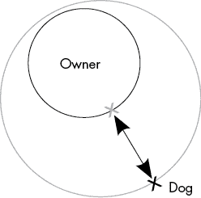

图 5-15：一只狗和主人通过更长的牵引绳连接，在公园的不同小径上行走

一个历史上重要的度量是*弗雷歇距离*，它用于比较不同形状上点之间的距离。我们在这里考虑的弗雷歇距离版本适用于离散测量（通常被认为是多边形）。从多边形构建网格图，并计算最小最大路径，找到两个路径之间可能的最大距离。可以对路径本身及其沿路径的同步性做出许多假设；最严格的要求产生了所谓的*同伦*弗雷歇距离，这在许多机器人学问题中有应用。我们将在第八章中回到同伦应用的问题。

目前，用更通俗的说法，弗雷歇距离被称为“遛狗距离”，它在分析中有许多用途。它不仅可以用于测量曲线或形状上点之间的最大距离，还可以测量形状或曲线上点之间的总距离。许多 R 包包括计算现有版本的弗雷歇距离的函数，包括以下示例中使用的 TSdist 时间序列包。在此包中，两个时间序列是从 ARMA(3, 2) 分布生成的，Series 3 包含 100 个时间点，Series 4 包含 120 个时间点。时间序列在跟踪病人群体中的疾病进展、股市变化以及买方行为等方面非常重要。

让我们加载这些包生成的时间序列并绘制它们，使用列表 5-4 中的代码来可视化潜在的差异。

```
#load package and time series contained in the TSdist package
library(TSdist)
data(example.series4)
data(example.series3)
my1<-example.series4
my2<-example.series3

#plot both time series
plot(my1,main="Time Series Plots of Series 4")
plot(my2,main="Time Series Plots of Series 3")
```

列表 5-4：加载并检查两个时间序列数据集的脚本

图 5-16 显示了两条具有明显高低起伏的时间序列。

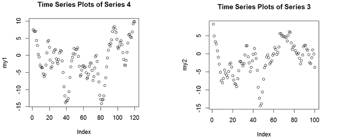

图 5-16：两个示例时间序列的绘图

请注意，时间序列之间的重叠并不完全，我们预期我们的比较会显示这些时间序列之间的一些差异。使用 Fréchet 距离，我们可以衡量时间序列之间的最大/最小偏差（最大/最小链条长度）以及整个比较集的偏差总和。我们将通过向脚本中添加以下代码来检查第 3 序列和第 4 序列的这两个值：

```
#calculate Frechet distance
dis1<-FrechetDistance(my1,my2,FrechetSumOrMax="sum")
dis2<-FrechetDistance(my1,my2,FrechetSumOrMax="min")
dis3<-FrechetDistance(my1,my2,FrechetSumOrMax="max")
```

这段代码计算了时间序列之间 Fréchet 距离的最小值、最大值和总和，应该会得出时间序列曲线之间距离总和为 402.0，时间序列曲线之间点的最大距离为 13.7，时间序列曲线之间点的最小距离为 0.03。这表明，时间序列在某些比较点的值大致相同，而在其他点的值则有很大差异。时间序列曲线之间的距离总和将趋近于对时间序列进行连续时间积分的结果；这一计算可以成为计算函数之间面积的良好工具，使用离散且相对快速的近似方法。

然而，除了 Fréchet 距离，还有其他方法可以用来比较形状，这些方法有时是更可取的。让我们再次回到我们的两个圆，并将它们移动使它们相交，如图 5-17 所示。

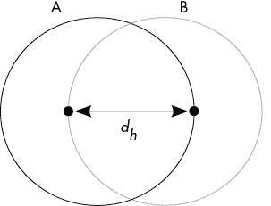

图 5-17：两个相交圆的绘图

我们可以将每个圆上的点想象成我们测量 Fréchet 距离时所做的那样。我们考虑圆 B 上的一个点以及它在圆 A 上的最近点（如图 5-17 所示）。圆 B 上的每个点都会有一个在圆 A 上的最近点，这些点构成了一个最近点的集合。图 5-17 中选择的点是一个特殊的点集。它们是我们最近点集合中最远的两个点。这意味着，从一个圆跳到另一个圆所需的最大距离就出现在这两个点之间。这个距离被称为*Hausdorff 距离*，在早期的计算机视觉和图像匹配任务中有着广泛的应用。如今，它主要用于序列匹配、图形匹配以及其他离散对象匹配任务。

然而，Hausdorff 距离的一个局限性是，所比较的集合必须存在于相同的度量空间中。因此，虽然我们可以比较圆上的点，但不能直接用 Hausdorff 距离比较圆上的点和球面上的点，或者欧几里得平面上的点和正曲率球面上的点。被比较的两个对象必须处于相同的度量空间中。

幸运的是，这个难题有一个解决方案。我们可以简单地在将这两个度量空间映射到单一度量空间时，测量它们之间最远的最短距离，同时保持每个空间内点之间的原始距离（称为*等距嵌入*）。因此，我们可以将球体及其点投影到切平面上，以与其他欧几里得空间进行比较。或者，我们可以将两个物体嵌入到一个更高维的空间中，类似于内核应用中所做的那样。这种 Hausdorff 距离的扩展被称为*Gromov–Hausdorff 距离*。

让我们围绕这个度量建立一些直觉。假设我们有一个三角形和一个四面体，如图 5-18 所示。

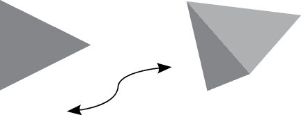

图 5-18：一个三角形和四面体，它们存在于不同维度的欧几里得空间中

图 5-18 中描述的这个问题的一个解决方案是将三角形简单地带入三维欧几里得空间，并计算三维欧几里得空间中物体之间的距离。也许三角形的一部分在嵌入三维空间时与四面体重叠，如图 5-19 所示。


图 5-19：一个三角形和四面体，它们都被映射到三维欧几里得空间中

现在我们可以计算这两个物体最远点集合与最近点集合的距离，这些点可能出现在三角形或四面体的某个尖端。

R 有一个很好的包用于计算 Gromov–Hausdorff 距离（gromovlab），因此我们可以轻松地在 R 中实现这个距离度量。首先，让我们使用清单 5-5 中的代码模拟一个来自二维圆盘的小样本。

```
#create two-dimensional disc sample
a<-runif(100,min=-1,max=1)
b<-runif(100,min=-1,max=1)

#create circle from uniform distribution and restrict to points within the
#circle
d<-a²+b²
w<-which(d>1)
mydata<-cbind(a,b)
mydata<-mydata[-w,-w]

#plot sample
plot(mydata,main="2-Dimensional Disc Sample",ylab="y",xlab="x")
```

清单 5-5：从二维圆盘中采样的脚本，用于检查 Gromov–Hausdorff 距离

绘制时，这应该会呈现出一个大致的圆盘形状；请查看图 5-20。

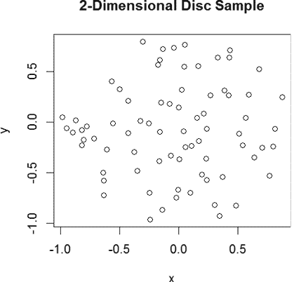

图 5-20：从二维圆盘中采样的样本

现在，让我们在清单 5-5 的基础上添加代码，从同样的均匀分布中模拟一个相同大小的样本，该分布用于生成我们的二维圆盘样本：

```
#create a uniform sample from a line segment
x<-sort(runif(dim(as.data.frame(mydata))[[1]],min=-1,max=1))
```

我们添加的代码从其中一个线段采样，以给出一个一维空间。这为我们提供了两个维度不同的欧几里得空间。现在，我们可以计算每个样本的原生空间中的点之间的距离（对于圆盘是二维欧几里得空间，对于线段是一维欧几里得空间）。从这里，我们可以通过添加以下代码来计算我们的样本之间的 Gromov–Hausdorff 距离：

```
#load the package and calculate the distance matrices for use in calculations
library(gromovlab)
m1<-dist(as.matrix(mydata))
m2<-dist(as.matrix(x))

#calculate distance metric and compare distances with Gromov-Hausdorff
gromovdist(m1,m2,"lp",p=2)
```

这段代码让我们可以比较样本中各点之间的距离矩阵。对于这个随机样本，Gromov–Hausdorff 距离为 5.8。我们可以像在清单 5-3 中那样，基于我们的度量模拟一个非参数检验，以帮助我们判断圆盘和直线的嵌入是否在统计上相同。更改度量参数可能会改变嵌入之间的显著差异或嵌入的质量，正如我们在本章前面比较堪培拉、曼哈顿和欧几里得距离时所看到的那样。感兴趣的读者可以尝试调整嵌入参数，设置自己的非参数检验，看看对于圆盘和直线样本，Gromov–Hausdorff 距离的结果如何变化。

`lp` 参数允许使用本章前面讨论的基于范数的度量。对于这个特定的比较，我们使用了欧几里得范数，因为这两个样本都位于欧几里得空间中，而且所使用的距离矩阵是由欧几里得范数定义的。其他范数，如曼哈顿范数或切比雪夫范数，也可以使用，甚至可能在其他问题中更为合适，并且该软件包支持处理图形和树结构以及距离矩阵。需要注意的是，这个特定的软件包会遍历所有可能的等距嵌入，因此，对于某些问题，所需的计算时间和内存可能会很大。

## *K*-最近邻与度量几何

度量几何在许多算法中都有应用，包括*k*-最近邻（*k*-NN）分析，它根据周围对象的分类来对观察进行分类。理解这种方法的一种方式是考虑一个有不同学生小圈子的高中食堂，如图 5-21 所示。

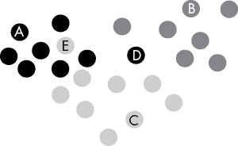

图 5-21：一个有三个不同学生小圈子的高中食堂

在图 5-21 所示的食堂中，存在三个学生小圈子：一个深灰色圈子、一个灰色圈子和一个浅灰色圈子。学生们倾向于待在自己的朋友群体附近，正如学生 A、B 和 C 所展示的那样。这些学生被他们的朋友包围，如果根据一个距离度量（比如欧几里得距离或学生间地砖的数量）分类他们，依据离他们最近的任意数量的学生，就能给出相当准确的小圈子分类。

然而，也有一些学生，比如 D 和 E，位于其他群体附近，或者位于所有三个群体之间。学生 E 可能是流行群体的一员（位于底部中央），同时也是大学运动员群体的一员（位于顶部左侧）；而学生 D 可能是流行的学生、大学运动员以及数学队成员（位于顶部右侧）。根据在对学生 D 和 E 进行分类时，考虑的离他们最近的学生数量，他们可能会被分配到他们的主群体，也可能会被错误地重新分配到一个新的群体，尽管他们可能适合该群体，但并不认为这是他们的主群体。例如，最近的 10 个学生可能会正确地将学生 E 分配到流行群体，而最近的 2 个学生则无法做到这一点。

因此，*k*-NN 方法依赖于邻域大小（在本例中是距离目标学生最近的学生数量）和定义哪些学生最接近目标学生的距离度量方法。让我们更仔细地看看距离度量方法如何影响 *k*-NN 分类准确性。在一个模拟数据集中，假设有三个变量影响分类，另外还有三个噪声变量，数据来自 清单 5-6，并使用了 knnGarden 包（该包包括了前面章节中使用基于规范的距离度量分析的许多距离）。你首先需要下载该包（[`cran.r-project.org/web/packages/knnGarden/index.html`](https://cran.r-project.org/web/packages/knnGarden/index.html)）并在本地安装。

```
#install package (and devtools if not installed)
#your local computer might save the .tar file in a different path than ours
library(devtools)
install_local("~/Downloads/knnGarden.tar")

#create data
a<-rbinom(500,4,0.2)
b<-rbinom(500,1,0.5)
c<-rbinom(500,2,0.1)
d<-rbinom(500,2,0.2)
e<-rbinom(500,1,0.3)
f<-rbinom(500,1,0.8)
class<-a+e-d-rbinom(500,2,0.3)
class[class>=0]<-1
class[class<0]<-0
mydata<-as.data.frame(cbind(a,b,c,d,e,f,class))

#partition data into training and test sets (60% train, 40% test)
s<-sample(1:500,300)
train<-mydata[s,]
test<-mydata[-s,]

#create KNN models with different distances and five nearest neighbors
library(knnGarden)

#Euclidean
ke<-knnVCN(TrnX=train[,-7],OrigTrnG=train[,7],TstX=test[,-7],
K=5,method="euclidean")
accke<-length(which(ke==test[,7]))/length(test[,7])

#Canberra
kc<-knnVCN(TrnX=train[,-7],OrigTrnG=train[,7],TstX=test[,-7],
K=5,method="canberra")
acckc<-length(which(kc==test[,7]))/length(test[,7])

#Manhattan
km<-knnVCN(TrnX=train[,-7],OrigTrnG=train[,7],TstX=test[,-7],
K=5,method="manhattan")
acckm<-length(which(km==test[,7]))/length(test[,7])
```

清单 5-6：一个生成并通过 *k*-NN 分类进行分类的脚本，使用不同的距离度量方法和五个邻居

清单 5-6 创建一个示例，并运行 *k*-NN 算法，基于不同的距离度量方法（包括曼哈顿距离、欧几里得距离和堪培拉距离）对数据点进行分类。在这个特定的模拟中，所有的距离方法得到了相似的准确度（欧几里得距离 81%、曼哈顿距离 81% 和堪培拉距离 82%）。我们可以通过修改 清单 5-6，将最近邻数量增加到 20，从而考虑更大的邻域。

```
#create KNN models with different distance metrics and 20 nearest neighbors

#Euclidean
ke<-knnVCN(TrnX=train[,-7],OrigTrnG=train[,7],TstX=test[,-7],
**K=20**,method="euclidean")
accke<-length(which(ke==test[,7]))/length(test[,7])

#Canberra
kc<-knnVCN(TrnX=train[,-7],OrigTrnG=train[,7],TstX=test[,-7],
**K=20**,method="canberra")
acckc<-length(which(kc==test[,7]))/length(test[,7])

#Manhattan
km<-knnVCN(TrnX=train[,-7],OrigTrnG=train[,7],TstX=test[,-7],
**K=20**,method="manhattan")
acckm<-length(which(km==test[,7]))/length(test[,7])
```

该脚本修改了计算 *k*-NN 模型的函数，修改部分已用粗体标出；我们将参数更改为 `K=20`。对于这个特定的模拟数据集，当考虑 20 个最近邻时，分类准确率存在显著差异。欧几里得距离和曼哈顿距离的准确率略低，为 78.5%，而堪培拉距离则给出了更差的准确率，只有 57%。邻域大小对堪培拉距离的准确率有较大影响，但对欧几里得距离和曼哈顿距离的影响较小。一般来说，使用更多的最近邻有助于平滑数据，类似于加权平均的效果。结果表明，对于我们的堪培拉距离，增加更多的最近邻可能会使数据过度平滑。然而，曼哈顿距离和欧几里得距离的运行结果并没有表现出这种平滑效应，仍然保持其原有的高性能。正如我们的例子所示，距离度量的选择在算法性能中可能起着至关重要的作用，也可能几乎没有影响。因此，距离度量在算法设计中起着与其他参数选择类似的作用。

*k*-NN 模型是与度量几何和邻域关系最为紧密的模型之一，尽管许多其他方法也依赖于距离度量或邻域大小。近期有许多论文提出，采用多尺度方法来定义算法邻域能够提升算法性能，包括在 *k*-NN 回归、深度学习图像分类、持久图和单纯形算法（包括持久同调）中的应用，且这一新兴领域近年来不断发展壮大。

在许多机器学习领域中，距离度量的选择尤为重要，尤其是在降维任务中，我们将一个高维数据集映射到低维空间。例如，假设我们有一个基因组数据集，包含一组患者的 300 个感兴趣的基因位点。这对于在 PowerPoint 幻灯片中展示给相关人员来说，显得有些过于复杂。然而，如果我们能够找到一种好的映射到二维空间的方式，就可以在幻灯片中加入一个数据的散点图，使得人们更容易理解。

## 流形学习

许多降维算法也涉及距离度量和 *k*-NN 计算。最常见的降维算法之一是 *主成分分析（PCA）*，它通过在原始高维空间和低维目标空间之间的线性映射，将高维数据整合到低维空间中。本质上，PCA 寻找一组理想的线性基底，以便在保持最多方差的同时使用尽可能少的线性基底（将与数据相关的大部分信息压缩进来）；这样我们就能丢弃那些包含较少相关信息的数据空间基底。这有助于我们可视化存在三维以上的数据，也有助于去相关化输入到模型中的预测因子。

然而，如前所述，PCA 假设数据位于几何平坦的空间中，并映射到一个低维的平坦空间。正如我们所看到的，这并不总是如此，欧几里得度量可能会给出与其他距离度量不同的距离结果。近年来，许多放宽不同假设并将降维推广到流形的尝试提供了一类新的降维技术，称为*流形学习*。流形学习允许映射到可能弯曲的低维空间，并且将 PCA 推广到包括非欧几里得距离的度量。*流形*是一个局部欧几里得空间，欧几里得空间就是流形的一种示例，因此有些人将*流形学习*视为这个更一般框架的总称。

### 使用多维尺度法

其中一种较老的流形学习算法是*多维尺度法*（*MDS*）。MDS 将点嵌入欧几里得空间，旨在尽可能保持点之间的距离（可以是欧几里得距离）。这是通过最小化用户定义的代价函数来实现的。通过欧几里得距离定义距离和代价函数，得到的结果与 PCA 相同。然而，MDS 不必局限于欧几里得距离，许多其他度量可能更适合特定问题。让我们通过一个小数据集和不同的距离矩阵作为 MDS 算法的输入，进一步探讨这个问题；请查看清单 5-7 中的代码。

```
#create data
a<-rbinom(100,4,0.2)
b<-rbinom(100,1,0.5)
c<-rbinom(100,2,0.1)
d<-rbinom(100,2,0.2)
e<-rbinom(100,1,0.3)
f<-rbinom(100,1,0.8)
mydata<-as.data.frame(cbind(a,b,c,d,e,f))

#create distance matrices using different distance metrics
m1<-dist(mydata,upper=T,diag=T)
m2<-dist(mydata,"minkowski",p=10,upper=T,diag=T) 
m3<-dist(mydata,"manhattan",upper=T,diag=T)
```

清单 5-7：生成示例数据集并从数据集中计算距离矩阵的脚本

现在我们已经生成了一些数据，并计算了三种不同的距离度量，让我们看看距离度量的选择如何影响 MDS 嵌入。我们来计算 MDS 嵌入并通过添加到清单 5-7 来绘制结果。

```
#reduce dimensionality with MDS to two dimensions
c1<-cmdscale(m1,k=2)
c2<-cmdscale(m2,k=2)
c3<-cmdscale(m3,k=2)

#plot results
plot(c1,xlab="Coordinate 1",ylab="Coordinate 2",
main="Euclidean Distance MDS Results")
plot(c2,xlab="Coordinate 1",ylab="Coordinate 2",
main="Minkowski p=10 Distance MDS Results")
plot(c3,xlab="Coordinate 1",ylab="Coordinate 2",
main="Manhattan Distance MDS Results")
```

我们对清单 5-7 的补充应会产生不同的绘图结果。在这个例子中，绘图（如图 5-22 所示）确实会根据使用的度量产生显著不同的结果，这表明不同的距离度量会导致嵌入到不同的空间。

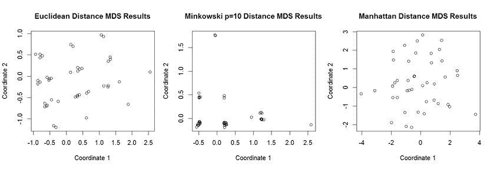

图 5-22：MDS 结果并排显示，结果随选择的距离度量而变化

图 5-22 中的绘图结果表明，闵可夫斯基距离与欧几里得距离或曼哈顿距离的结果有很大不同；在闵可夫斯基类型的 MDS 结果中，许多点聚集在一起，这表明它可能无法像其他度量那样区分点对。然而，欧几里得和曼哈顿距离 MDS 结果之间的差异较小，点分布比在闵可夫斯基距离情况下要广泛得多。

### 扩展多维尺度法与 Isomap

一些流形学习算法将 MDS 扩展到其他类型的空间和距离计算。*Isomap*通过用从邻域图计算出的地理距离矩阵替换距离矩阵来扩展 MDS。这种通过地理距离替换距离计算的方法允许在非平坦空间（例如球面，地理信息系统数据，或通过 MRI 检查的人体器官）上使用自然存在的距离。通常，通过检查点的最近邻来估算距离。这赋予了 Isomap 一个邻域的特征，并提供了一种通过最近邻参数的方差来研究缩放作用的方法。

让我们通过在清单 5-7 中添加内容来探索这一修改，该内容模拟了一个数据集并探索了 MDS。我们将使用欧几里得距离作为相异度度量，尽管其他距离度量也可以像 MDS 中一样使用。为了理解邻域大小的作用，我们将创建 5、10 和 20 个最近邻的邻域：

```
#create Isomap projections of the data generated in Listing 5-6
library(vegan)

i1<-scores(isomap(dist(mydata),ndim=2,k=5))
i2<-scores(isomap(dist(mydata),ndim=2,k=10))
i3<-scores(isomap(dist(mydata),ndim=2,k=20))

#plot results
plot(i1,xlab="Coordinate 1",ylab="Coordinate 2",main="K=5 Isomap Results")
plot(i2,xlab="Coordinate 1",ylab="Coordinate 2",main="K=10 Isomap Results")
plot(i3,xlab="Coordinate 1",ylab="Coordinate 2",main="K=20 Isomap Results")
```

这段代码将 Isomap 应用于清单 5-7 中生成的数据集，并使用欧几里得距离。可以使用其他距离度量，这可能会给出不同的结果，正如 MDS 分析中所示。Isomap 分析的结果表明，对于这个数据集，邻域大小在确定结果中的作用不大，正如图 5-23 中的每个坐标的比例所示。

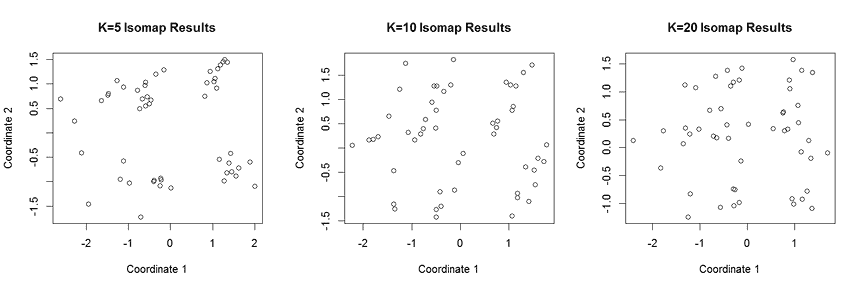

图 5-23：Isomap 结果的并排视图，结果随最近邻数量变化

MDS 和 Isomap 的目标是保留点之间的距离，无论这些点在数据流形上的距离有多远，从而实现距离的全局保留。还有其他全局流形学习算法，能够保留不在同一邻域中的点之间的距离。如果你有兴趣，可以探索一些全局算法，如核 PCA、自编码器和扩散映射。

### 使用局部线性嵌入捕捉局部性质

有时候，流形的全局性质不像局部性质那么重要。实际上，从流形的经典定义来看，局部性质有时可能更有趣。例如，当我们寻找一个点的最近邻时，从几何上非常远的点可能不会是该点的最近邻，但附近的点可能是最近邻，并且这些信息需要在高维空间和低维空间之间的映射中被保留。局部流形学习算法旨在保留局部性质，而在空间映射中较少关注保留全局性质。

*局部线性嵌入*（*LLE*）就是这样一种局部流形学习算法，它是使用较为频繁的流形学习算法之一。粗略来说，LLE 从一个最近邻图开始，然后为每个点根据其最近邻生成一组权重。接着，算法根据一个代价函数计算映射，并保持每个点的最近邻权重集。这使得它能够保持流形上相邻点之间的几何信息。

回到我们在列表 5-7 中的代码，接下来我们将对代码进行扩展，并探索将 LLE 映射到一个二维空间中，使用不同数量的邻居。对于这个包，你需要下载该包（[`mran.microsoft.com/snapshot/2016-08-05/web/packages/TDAmapper/README.html`](https://mran.microsoft.com/snapshot/2016-08-05/web/packages/TDAmapper/README.html)）并本地安装它：

```
#install package
library(devtools)
install_local("~/Downloads/lle.tar")

#create LLE projections of the data generated in Listing 5-6
library(lle)

l1<-lle(mydata,m=2,k=5)
l2<-lle(mydata,m=2,k=10)
l3<-lle(mydata,m=2,k=20)

#plot results
plot(l1$Y,xlab="Coordinate 1",ylab="Coordinate 2",main="K=5 LLE Results")
plot(l2$Y,xlab="Coordinate 1",ylab="Coordinate 2",main="K=10 LLE Results")
plot(l3$Y,xlab="Coordinate 1",ylab="Coordinate 2",main="K=20 LLE Results")
```

这段代码将 LLE 算法应用于我们的数据集，变更算法计算中考虑的最近邻数量。让我们通过观察这个数据集的图表，来理解最近邻在这个局部算法中的作用（见图 5-24）。

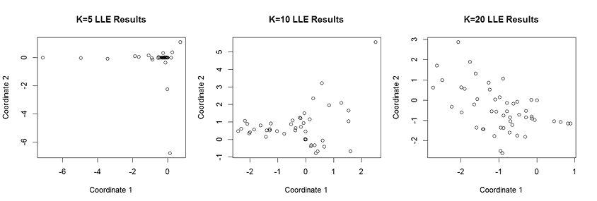

图 5-24：LLE 结果的并排视图，结果随最近邻数量的变化而变化

如图 5-24 所示，邻域大小对 LLE 结果以及新二维空间中点的分布有很大影响。由于最近邻的数量会影响保存的邻域大小，较大的值会导致 LLE 变得更为全局，将该算法转化为更具全局性质的流形学习算法。在`K=20`时似乎能够获得较好的分离，这比`K=5`的局部性要差一些，但对于一个包含 100 个点的数据集来说，仍然是一个相对较小的邻域。如果我们将 K 设置为 100，就会得到一个全局性的算法，生成一个二维图，点在新空间中具有良好的分离和扩展；你可以在图 5-25 中看到这一点。

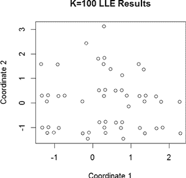

图 5-25：使用整个样本作为最近邻的 LLE 结果图

还有其他局部流形学习算法，其中一些允许像 LLE 的邻域大小那样调整缩放参数。如果你感兴趣，可以探索拉普拉斯特征映射、Hessian LLE 和局部切空间分析。

### 使用 t-分布随机邻居嵌入进行可视化

我们现在已经看到局部算法是如何通过邻域大小定义来捕捉全局特性的。有些流形学习算法明确地捕捉局部和全局特性。一个更著名的算法是一个名为*t-分布随机邻域嵌入*（*t-SNE*）的可视化工具。该算法有两个主要阶段：在高维空间中创建点的概率分布，然后通过最小化 Kullback–Leibler 散度将这些分布与低维空间中的分布进行匹配。因此，该算法并不是从点之间的距离计算开始，而是聚焦于匹配分布之间的距离，以找到最优空间。

t-SNE 并不是通过点的*k*-最近邻来定义邻域，而是通过数据中核函数的带宽来定义邻域；这会产生一个名为*困惑度*的参数，该参数也可以变化，以理解邻域大小的作用。让我们回到在清单 5-7 中生成的数据，看看这在实际中是如何工作的。请添加以下代码：

```
#create t-SNE projections of the data generated in Listing 5-7
library(Rtsne)
library(dimRed)

t1<-getDimRedData(embed(mydata,"tSNE",ndim=2,perplexity=5))
t2<-getDimRedData(embed(mydata,"tSNE",ndim=2,perplexity=15))
t3<-getDimRedData(embed(mydata,"tSNE",ndim=2,perplexity=25))

#plot results
plot(as.data.frame(t1),xlab="Coordinate 1",ylab="Coordinate2",
main="Perplexity=5 t-SNE Results")
plot(as.data.frame(t2),xlab="Coordinate 1",ylab="Coordinate2",
main="Perplexity=15 t-SNE Results")
plot(as.data.frame(t3),xlab="Coordinate 1",ylab="Coordinate2",
main="Perplexity=25 t-SNE Results")
```

这段代码在使用清单 5-7 生成的数据集上运行 t-SNE，改变了困惑度参数。绘图应该会生成类似于图 5-26 的内容，显示低困惑度试验中的聚类比高困惑度试验中的聚类更多。

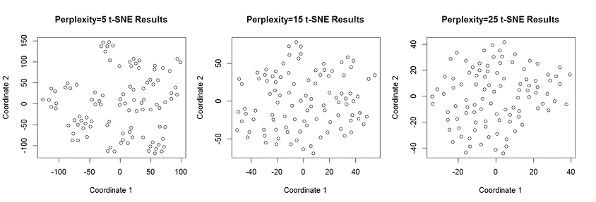

图 5-26：困惑度设置不同的 t-SNE 结果并排绘图

困惑度为 15 和 25 的绘图看起来相当相似，并且随着困惑度的增加，低维空间中坐标的范围减小。某些项目可能在后续分析或可视化可能的趋势时，需要数据的分布更广；而其他项目则可能通过更紧密的数据得到更好的结果。

总结来说，本章中的距离度量在机器学习应用中经常出现。流形学习尤其涉及度量、邻域大小和数据空间映射到的空间类型的不同选择。有许多优秀的教材和论文更详细地介绍了这些算法和类似的算法。然而，我们希望你已经获得了关于降维方法的概览——特别是那些与度量几何紧密相关的方法。

在继续之前，让我们考虑度量几何的最后一个用途。

## 分形

另一个与度量几何相关的工具涉及一种几何对象中的自相似性，称为*分形*。本质上，分形具有同样模式中的同样模式中的同样模式，依此类推。图 5-27 提供了一个示例。

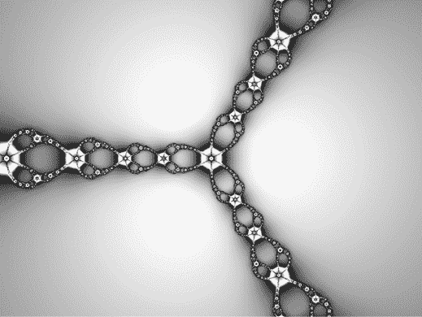

图 5-27：一个分形的示例。注意不同尺度下的图案具有自相似性。

分形在自然和人为系统中经常出现。例如，海岸线、血管、音乐音阶、封闭空间内的疫情传播、股市行为以及单词频率和排名等都在不同尺度下具有自相似性特征。能够测量分形维度使我们能够更好地理解这些现象的自相似性程度。如今有很多分形维度估计器，但大多数都依赖通过某种迭代方法，比较相邻点集的面积变化，从而测量分形曲线下的面积。

回到图 5-27 中的分形，我们可以考虑加入盒子，计算每个迭代曲线下的面积，并将不同尺度下的相对值进行比较，如同在图 5-28 中展示的那样。

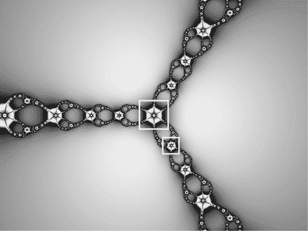

图 5-28：在尺度上测量一系列分形曲线下的面积示例

现在我们对分形有了一些直观理解，让我们来考虑分形维度度量的一个应用。股市在一段时间内常常表现出某种程度的自相似行为。理解市场波动性是明智投资的重要方面，而预测即将到来的市场反转点（如股市崩盘）的一种方法是分析自相似性的变化。道琼斯工业平均指数（DJIA），即美国股市的一个指数，其收盘价数据可以免费下载。这里，我们将考虑模拟的 2019 年 6 月至 2020 年 5 月期间的每日收盘价数据，该时期正值 COVID 自由落体阶段。图 5-29 展示了该时间段内收盘价的图表。

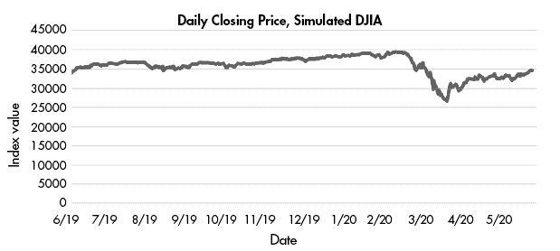

图 5-29：2019 年 6 月到 2020 年 5 月期间模拟的道琼斯工业平均指数（DJIA）收盘价图。请注意，自 2020 年 2 月下旬开始的大幅下跌，正值 COVID 成为全球问题之时。

如果我们预测未来的市场行为，我们将希望结合时间序列数据分析中的工具进行分形分析，而这些内容超出了本书的范围。然而，我们可以通过将数据解析为按月划分的系列并计算每个月系列的分形维度，轻松感知自相似性的变化。从那里，我们可以检查分形维度与其他波动性度量（如一个月内收盘价的波动范围）之间的相关性；我们应该能看到正相关。清单 5-8 加载数据，解析数据，计算分形维度，计算收盘价范围，并运行分形维度与范围之间的相关性测试。

```
#load and parse stock market data
stocks<-read.csv("Example_Stock_Data.csv")
June2019<-stocks[stocks$Month=="June",]
July2019<-stocks[stocks$Month=="July",]
August2019<-stocks[stocks$Month=="August",]
September2019<-stocks[stocks$Month=="September",]
October2019<-stocks[stocks$Month=="October",]
November2019<-stocks[stocks$Month=="November",]
December2019<-stocks[stocks$Month=="December",]
January2020<-stocks[stocks$Month=="January",]
February2020<-stocks[stocks$Month=="February",]
March2020<-stocks[stocks$Month=="March",]
April2020<-stocks[stocks$Month=="April",]
May2020<-stocks[stocks$Month=="May",]

#calculate fractal dimension for each series
library(fractaldim)
junedim<-fd.estimate(June2019[,2],methods="hallwood")$fd
julydim<-fd.estimate(July2019[,2],methods="hallwood")$fd
augustdim<-fd.estimate(August2019[,2],methods="hallwood")$fd
septemberdim<-fd.estimate(September2019[,2],methods="hallwood")$fd
octoberdim<-fd.estimate(October2019[,2],methods="hallwood")$fd
novemberdim<-fd.estimate(November2019[,2],methods="hallwood")$fd
decemberdim<-fd.estimate(December2019[,2],methods="hallwood")$fd
januarydim<-fd.estimate(January2020[,2],methods="hallwood")$fd
februarydim<-fd.estimate(February2020[,2],methods="hallwood")$fd
marchdim<-fd.estimate(March2020[,2],methods="hallwood")$fd
aprildim<-fd.estimate(April2020[,2],methods="hallwood")$fd
maydim<-fd.estimate(May2020[,2],methods="hallwood")$fd

#combine fractal dimension results into a vector
monthlyfd<-c(junedim,julydim,augustdim,septemberdim,octoberdim,novemberdim,
decemberdim,januarydim,februarydim,marchdim,aprildim,maydim)

#examine monthly stock price range
monthlymax<-c(max(June2019[,2]),max(July2019[,2]),max(August2019[,2]),
max(September2019[,2]),max(October2019[,2]),max(November2019[,2]),
max(December2019[,2]),max(January2020[,2]),max(February2020[,2]),
max(March2020[,2]),max(April2020[,2]),max(May2020[,2]))

monthlymin<-c(min(June2019[,2]),min(July2019[,2]),min(August2019[,2]),
min(September2019[,2]),min(October2019[,2]),min(November2019[,2]),
min(December2019[,2]),min(January2020[,2]),min(February2020[,2]),
min(March2020[,2]),min(April2020[,2]),min(May2020[,2]))

monthlyrange<-monthlymax-monthlymin

#examine relationship between monthly fractal dimension and monthly range
cor.test(monthlyfd,monthlyrange,"greater")
```

清单 5-8：一个脚本，加载模拟的 DJIA 收盘数据，计算分形维度和收盘价范围，并进行相关性测试，以确定分形维度与收盘价范围之间的关系。

你应该找到一个约为 0.55 的相关性，或者说是收盘价分形维度与收盘价区间之间的中等关系，这个相关性大约在 0.05 的显著性水平上。自相似性似乎与市场波动性的一个衡量指标有正相关关系。分形维度随着月份变化，有些月份的维度接近 1，而其他月份的维度则较高。令人印象深刻的是，2020 年 3 月的分形维度飙升至 2。

鉴于我们仅有 12 个月的数据用于测试，值得注意的是，我们仍然发现分形维度与收盘价区间之间存在正相关关系。对股市数据感兴趣的读者可以自行优化计算分形维度序列时所选的时间框架窗口和潜在的窗口重叠，并进一步探讨与股市变动点检测中使用的其他几何工具（如 Forman–Ricci 曲率和持久同源性）的相关性。

## 概要

在本章中，我们研究了度量几何及其在几个重要机器学习算法中的应用，包括*k*-NN 算法和几个流形学习算法。我们见证了距离度量（以及其他算法参数）的选择如何显著影响性能。我们还考察了分形及其与股市波动性的关系。计算点和分布之间的距离在许多机器学习领域中都有应用，并且影响着机器学习结果的质量。第五章仅仅触及了度量几何现有工具的表面。你可能想参考本章使用的 R 包中的相关文献，以及当前在距离度量领域的机器学习出版物。
