# 6

几何在机器学习中的新应用


在第五章中，我们探讨了度量几何对机器学习的贡献及其在模型测量和输入中的众多应用。然而，几何学还为机器学习提供了许多其他贡献；在本章中，我们将探讨基于切空间的模型估计方法、外部微积分、与曲线交点相关的工具（可以用来替代算法中的线性代数），以及涉及向量场作用于数据集切空间的基于秩的模型。我们将看到这些工具如何在小数据集的监督学习中发挥作用，帮助社区规划灾难应对，并辨别客户的选择偏好。

## 处理非线性空间

我们的第一个工具帮助数学家和机器学习工程师处理诸如流形之类的非线性空间；它是定义一个点的*切空间*。回想一下微积分课程，我们记得*切线*是与曲线上的一点接触而不穿越曲线的线——在该点上，曲线的斜率等于切线的斜率（即曲线的导数）。考虑图 6-1 中的正弦波示例和该波上的一个点，以及它的切线。

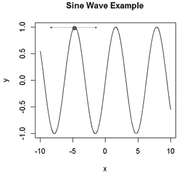

图 6-1：一个正弦波示例，在局部最大值之一处画出的切线

这种切线在二维空间中效果很好。然而，尝试定义一个曲面上某点的切线会变得更加复杂，因为许多（无穷多个）切线都可以与给定点相切（见图 6-2，A 点）。

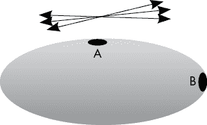

图 6-2：一个椭圆，包含多个通过 A 点的可能切线

事实上，图 6-2 中的线条构成了一个与 A 点相切的二维平面，类似于一张在 A 点与椭圆相切的纸片。你可以将这个*切平面*粘贴到 A 点，如图 6-3 所示。

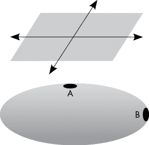

图 6-3：一个椭圆，包含 A 点和与 A 点相关的切平面，切平面延伸出切线和切空间

对于高维对象，切空间可能涉及更多的维度（可以是三维、100 维，甚至是无限维的盒子）。这些切空间与线性代数有着紧密的联系。请记住，向量空间可以通过一组独立的向量组成一个矩阵来定义，这组向量被称为该空间的*基*，在技术上称为*哈梅尔基*。实际上，某个点上对象的切空间的基是该点的偏导数集合。如前所述，在一维空间中，这恰好是切线的斜率。这为流形上每个点提供了一个优美的欧几里得空间，可用于推导点与点之间的单位距离，提供从流形到欧几里得空间的映射，并理解多重共线性。多重共线性发生在变量之间高度相关时，这会导致矩阵的列或行完全相同或几乎相同（从而导致奇异矩阵）。多重共线性是回归算法中的一个问题，因为它会导致冗余的预测变量和奇异矩阵。具有完美方差重叠（高度共线的预测变量）的变量将具有相同的切空间，或者至少共享一些重叠的切空间。

### 引入 dgLARS

基于切空间的一个有用的机器学习算法是*dgLARS*算法（dgLARS 代表“微分几何最小角回归”）。dgLARS 将传统的最小角回归（LARS）扩展为一个适应给定模型误差切空间的算法。LARS 算法通常从回归模型中每个系数设为 0 开始，根据与结果最相关的预测变量逐步添加预测变量；通过最小二乘法计算调整系数，直到一个更高相关性的变量进入模型。当多个预测变量进入模型时，系数将沿联合最小二乘方向增大。

dgLARS 考虑了模型的切空间，调整用于优化系数的评分函数。每次模型更新都使用一个工具的平方根，该工具被称为*条件 Fisher 信息*。条件 Fisher 信息大致衡量给定变量相对于目标（如结果变量）所包含的信息量。对于技术背景的读者来说，参数的 Fisher 信息是该参数评分的方差，评分是该参数对似然函数的自然对数的偏导数。

让我们通过一个实例来具体化这个问题。假设我们正在创建一个模型，以了解影响青少年冒险行为的因素，如吸毒或小偷小摸。我们可能已经测量了许多已知因素（如家庭社会经济状况、中学成绩以及之前的学校或法律事件）。然而，我们希望将我们设计的衡量青少年风险倾向的调查（索引 1）与一个衡量成人风险行为的已知调查（索引 2）进行比较。这两份调查可能会捕获不同类型的信息，并且在与我们的风险结果相关的信息量方面有所不同（图 6-4）。

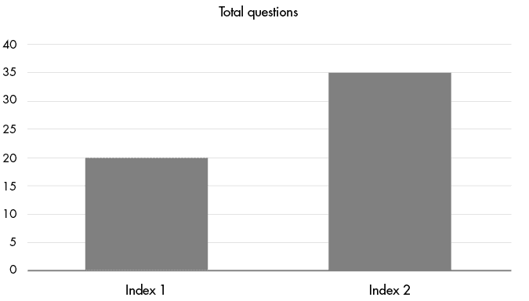

图 6-4：加载到风险指数上的问题数量比较

在图 6-5 示例中，调查问卷 1 的索引包含了更多的信息量。然而，调查问卷 2 的索引中可能存在一些变量的重叠或无关信息，如果能有一个能够捕获此类信息的测量方法那就更好了。也许每个调查中的问题之间存在信息重叠，或者包含了一些无关的信息。让我们考虑每个风险倾向调查中包含的独特且相关的信息（图 6-5）。

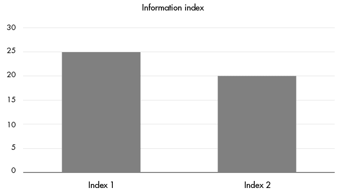

图 6-5：在索引问题中捕获的相关信息的两种调整测量方法

从图 6-5 可以看出，索引 1 和索引 2 包含了一些无关信息和一些重叠信息。索引 1 确实似乎包含比索引 2 更多的信息，如果我们必须选择一个调查问卷来对更多处于风险中的青少年进行调查，我们最好从索引 1 开始。

这有点像 Fisher 信息和 dgLARS 中的变量选择。技术上，*得分*是通过模型的对数似然函数的偏导数计算出来的，这个得分的方差就是 Fisher 信息，可以将其输入到矩阵中以捕获模型的偏导数中的信息。有趣的是，这个矩阵也可以通过相对熵（Kullback-Leibler 散度）的 Hessian 导出，而 Fisher 信息在这种情况下给出了相对熵的曲率。从一个较低技术层面的角度来看，用于选择变量的 Fisher 信息既与统计度量（对数似然函数）有关，又与所考虑的自变量的信息几何结构有关。

对于广义线性模型，可以使用费舍尔信息矩阵推导出一个称为 *条件 Rao 分数* 的得分，用于检验给定变量的系数是否与 0 在统计学上存在显著差异。如果该得分在统计学上与 0 没有显著差异，则该变量将从模型中剔除。在 dgLARS 算法中，这些计算通过在模型误差的切空间中搜索系数向量来完成，从空模型开始。然后，迭代地将该空间的几何形状划分为三个集合：*选择的预测变量*，它们在误差切空间中具有良好的拟合分数；*冗余预测变量*，它们与选择的预测变量共享误差切空间；以及*未选择的预测变量*，它们在误差切空间中的拟合分数较差。因此，dgLARS 利用模型几何形状的信息来找到最适合的模型。

dgLARS 在涉及数据集中预测变量多于观测值的问题上取得了成功，许多关于该算法的出版物专注于基因组学应用，其中患者数量可能为 300 人，基因序列数量可能达到 1,000,000 个。R 提供了一个名为 dglars 的包，用于实现广义线性模型算法，包括逻辑回归、泊松回归、线性回归和伽马回归的连接函数。对于不熟悉广义线性回归的人来说，*连接函数* 本质上是一种特殊类型的依赖变量变换，它使得回归在计数变量、二元变量和其他类型非正态分布的依赖变量（具有一定的几何分布限制）上可以正常工作。

现在我们已经介绍了一些理论，接下来我们将其付诸实践。

### 使用 dgLARS 预测抑郁症

我们希望根据学校问题和智商预测自报的抑郁症。我们将使用的数据是来自 Quora 平台的自选样本中的自报学校问题数据（智商高于 155），包括七个主要的学校问题（欺凌、教师敌意、无聊、抑郁、缺乏动力、外部学习、被安排进入补救课程）。该数据由 22 位个体提供，他们在智商极高范围内提供了分数，并讨论了至少一个学校系统中的问题，且倾向于来自美国的用户。该数据集是从平台上收集并手动处理的，以获得符合智商标准的海报所报告的学校问题类别。你可以在本书的文件中找到该数据集。首先让我们用 清单 6-1 中的代码加载数据。

```
#load data
mydata<-read.csv("QuoraSample.csv")
set.seed(1)
```

清单 6-1：加载 Quora 数据集的脚本

列表 6-1 中的代码加载了一个数据集，研究了教育干预和自尊心的心理学度量。现在，让我们修改脚本，使用 dgLARS 算法在该数据集上运行。R 包提供了交叉验证或不使用交叉验证运行算法的选项。让我们修改列表 6-1 来运行这两种模型选项：

```
#run analysis
library(dglars)
dg<-dglars(factor(Depression)~.,data=mydata,family="binomial")
dg1<-cvdglars(factor(Depression)~.,data=mydata,
family="binomial",control=list(nfold=2))
```

这段代码在完整的学生数据集上运行交叉验证和非交叉验证的 dgLARS 算法。交叉验证版本在具有稀疏预测变量的小数据集上效果不好，因此如果遇到错误，请继续尝试运行交叉验证版本，因为某些分区可能会出现与拆分和拟合模型相关的错误。两个 dgLARS 算法的输出应该在许多预测变量上达成一致，尽管交叉验证拆分版本的算法可能会有所不同，因为数据是随机分区的。接下来，让我们添加脚本来查看第一个模型的总结：

```
#examine results of non-cross-validated model
**>summary(dg)**
Summary of the Selected Model

    Formula: factor(Depression) ~ 1
     Family: 'binomial'
       Link: 'logit'

Coefficients:
     Estimate
Int.  -1.5041
---

                 g: 1.265
     Null deviance: 20.86
 Residual deviance: 20.86
               AIC: 22.86

Algorithm 'pc' (method='dgLASSO')
```

在这个模型中，没有任何因素被选为重要的预测变量。没有因素被选择的主要原因有几个，包括存在具有相反效应的亚群体，这些效应会“平均”掉亚群体的角度，存在扭曲几何形状的异常值，或者预测变量的真实零效应。模型拟合合理，Akaike 信息准则（AIC）为 20.86，残差偏差比没有加入任何项的零偏差要小得多。离散度参数告诉我们数据很好地拟合了二项分布（见`g`接近 1），没有出现现实数据中有时会遇到的分布问题。

现在让我们在脚本中添加代码，查看交叉验证试验的结果：

```
#examine cross-validated model
**>summary(dg1)**
Call:  cvdglars(formula=factor(Depression) ~ ., family="binomial",
    data=mydata, control=list(nfold=2))

Coefficients:
                       Estimate
Int.                    -1.6768
Bullying                 0.3066
Put.in.Remedial.Course   0.2292

dispersion parameter for binomial family taken to be 1

Details:
   number of non-zero estimates: 3
 cross-validation deviance: 12.33
                              g: 0.9838
                        n. fold: 2

Algorithm 'pc' (method='dgLASSO')
```

交叉验证模型的结果应该会与非交叉验证模型略有不同，表明模型在不同的折叠中找到了一些一致性，但并不完全重叠。在交叉验证模型中，被安排在补救课程中的天才儿童往往有更高的抑郁率，而像本样本中那些被安排进入补救课程并开始出现抑郁迹象的儿童可能从这种干预中受益。正如你所看到的，欺凌也是导致抑郁的潜在问题，这暗示了我们可能已经知道的事情：一般来说，学校里应该不容忍欺凌，以促进最佳的心理健康结果。

鉴于样本量较小，广义线性回归模型可能难以估计系数。基于拓扑和几何的线性模型所需的样本量似乎比线性回归模型要小，而在这个问题上得到的一致结果表明，这些模型可以在非常非常小的数据集上工作。然而，交叉验证可能仍然需要最小的样本量，因此如果样本量少于 10，最好避免进行这些分析。

### 使用 dgLARS 预测信用违约

为了理解 dgLARS 在具有二元结果（逻辑回归）和更多观察值及变量的大型数据集上的表现，让我们考虑另一个数据集。UCI 信用违约数据集包括 30,000 个台湾信用案例（2005 年底），并有 23 个违约预测因子，包括人口统计学特征（年龄、婚姻状况、教育状况和性别）、信用额度以及前期使用和支付信息。我们分析的目标是弄清楚哪些预测因子与账户是否会违约相关，并评估我们的 dgLARS 模型的拟合度。

让我们通过列表 6-2 中的代码开始。

```
#load data
mydata<-read.csv("UCIDefaultData.csv")

#load library
library(dglars)

#run analysis, scaling the predictors such that big numbers don't
#result in large differences in coefficient values
#scale the predictor data
mydata1<-scale(mydata[,-c(1,25)])
mydata1<-cbind(mydata1,mydata$default.payment.next.month)
colnames(mydata1)[24]<-"default.payment.next.month"

#run the dglars function with and without cross-validation
dg<-dglars(factor(default.payment.next.month)~.,
data=as.data.frame(mydata1),family="binomial")
dg1<-cvdglars(factor(default.payment.next.month)~.,
data=as.data.frame(mydata1),family="binomial")
summary(dg)
summary(dg1)
```

列表 6-2：一个加载、处理和分析 UCI 信用违约数据集的脚本，使用 dgLARS 和交叉验证的 dgLARS 算法

这应该会生成两个包含大多数预测因子系数的模型。第一个模型是非交叉验证版本（DG），第二个模型是交叉验证版本（DG1）。表 6-1 展示了我们运行代码后的结果。

表 6-1：UCI 信用违约 dgLARS 模型中的各项系数

| **Column1** | **DG 估计** | **DG1 估计** |
| --- | --- | --- |
| Int. | –1.47 | –1.45 |
| LIMIT_BAL | –0.10 | –0.09 |
| SEX | –0.05 | –0.04 |
| EDUCATION | –0.08 | –0.07 |
| MARRIAGE | –0.08 | –0.07 |
| AGE | 0.07 | 0.06 |
| PAY_0 | 0.65 | 0.65 |
| PAY_2 | 0.10 | 0.09 |
| PAY_3 | 0.09 | 0.09 |
| PAY_4 | 0.03 | 0.03 |
| PAY_5 | 0.04 | 0.04 |
| PAY_6 | 0.01 | 0.01 |
| BILL_AMT1 | –0.39 | –0.15 |
| BILL_AMT2 | 0.16 | 0.02 |
| BILL_AMT3 | 0.09 | 0.02 |
| BILL_AMT5 | 0.03 | 0.00 |
| BILL_AMT6 | 0.02 | 0.00 |
| PAY_AMT1 | –0.22 | –0.17 |
| PAY_AMT2 | –0.22 | –0.19 |
| PAY_AMT3 | –0.05 | –0.05 |
| PAY_AMT4 | –0.06 | –0.06 |
| PAY_AMT5 | –0.05 | –0.05 |
| PAY_AMT6 | –0.04 | –0.03 |

一些最大的违约预测因素包括前一个月的账单和支付历史。使用较少（`BILL_AMT1`）、较低支付（`PAY_AMT1`）和按时支付（`PAY_0`）的人更不容易在下个月违约。这非常有道理，因为大多数贷款指标优先考虑向那些债务负担较轻且有按时支付记录的人提供最佳利率的贷款。

交叉验证的 dgLARS 模型对前一个月的使用和支付总额的惩罚较小，表明前一个月的按时支付比具体的数值更为重要。第一个模型的 AIC 值相当大（27,924），但比零模型的 AIC 值（31,705）小得多，表明即使包含了多个预测变量，第一个模型的拟合度也优于零模型。

现在让我们将此模型与逻辑回归进行比较，并比较 AIC 拟合统计量，将以下内容添加到我们的脚本中：

```
#run logistic regression
gl<-glm(factor(default.payment.next.month)~.,
data=as.data.frame(mydata1),family="binomial"(link="logit"))

#calculate AIC of the model
AIC(gl)
```

这段代码在数据集上运行逻辑回归并计算模型的 AIC。在这个例子中，AIC 应该大约为 27,925，几乎与 dgLARS 模型的 AIC 完全相同。这表明逻辑回归和 dgLARS 算法在收敛性上的一致性；在如此大的样本量下，这一结果是可以预期的。逻辑回归是处理大样本量的典型工具，而在这种情况下，使用 dgLARS 似乎没有带来额外的收益。然而，考虑到在大样本量下的收敛性，dgLARS 很可能在较小的样本量下能够提供质量较高的结果，而逻辑回归在这种情况下无法工作。

## 应用离散外微分

另一个来自微分几何的有用工具是*离散外微分*。离散外微分涉及从低维离散形状构建离散形状。在前几章中，我们研究了同调的概念，它用于计算给定对象中的孔洞；从技术上讲，这是通过找到对象在特定维度下的边界来实现的。例如，考虑三角形的边界（见图 6-6）。

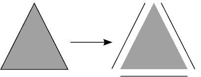

图 6-6：三角形的边界

我们可以更进一步，将线段分解为线段连接的每一个点，如图 6-7 所示。

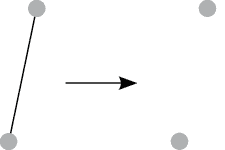

图 6-7：线段的边界

就像我们可以通过识别并分离出边界来拆解形状一样，我们也可以通过组合边界来从低维边界构建形状。从技术上讲，这被称为*上同调*，是离散外微积分的领域。我们可能从两个在某种方式上相关的点（例如在一定距离内，或共享某个特征）开始，并用一条线将它们连接起来（见图 6-8）。

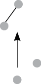

图 6-8：构建成一条线的两个点

对于更具技术背景的读者，我们正在查看微分形式的离散版本，这些形式是单纯形复形上的同调链。这些微分形式有与之相关的向量场。我们可以定义运算符，改变这些场或对象，结合它们，或计算某个场或同调链内存在的内容。这使我们能够处理某些类型的数据，理解诸如电网资源容量、社会网络中的疾病负担（甚至是在计算机屏幕内的像素组间渲染图形）等问题。

这个过程可以扩展到任意多的维度，线段构成三角形，三角形构成四面体，以此类推。我们也可以通过离散外微分跳跃维度，从点跳跃到三角形或四面体，而不是通过线段。因此，离散数据，如渲染像素数据或工程数据，可以被分组并连接起来以供进一步研究。

离散外微分（和同调）的最新应用之一是社交网络分析。如我们在前几章提到的，图是零维和一维的离散对象（点和线）；然而，个体之间的连接可以从双向相互作用（连接点的线）扩展到三方（三角形）或四方（四面体）或 100 方的相互作用（非常大维度的对象），正如图 6-9 中三位同事相互连接所示。

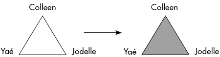

图 6-9：通过三方互动表示的三位同事共同工作项目的图形

在图 6-9 的左侧，我们看到三位同事（Colleen、Jodelle 和 Yaé）成对协作，但并未共同参与过三人合作的项目。在图 6-9 的右侧，我们看到一个涉及三位同事共同合作的项目的表示。如果他们合作了许多论文，我们可以总结他们的双向合作和三方合作，从而得到每个*n*方合作的总和。这对于理解这个协作网络的各个部分的强度可能很有用。

让我们探索这些概念如何帮助灾难物流规划。假设在一个地区有四个城镇，每个城镇通过道路与至少一个其他城镇相连接。假设每个城镇都有自己的物资储备（可能是每个居民的水量），以防飓风袭击该地区并限制交通数天或数周。我们可以通过在 R 中使用清单 6-3 中的代码来建模这一情况。

```
#create matrix of town connections and miles between each town
towns<-matrix(c(0,0,0,4,0,0,12,2,0,12,0,6,4,2,6,0),nrow=4)

#create a graph from the matrix with connections between modes
#going in both directions (undirected graph) with weights
library(igraph)
g1<-graph_from_adjacency_matrix(towns,mode="undirected",weighted=T)

#plot town graph with edges labeled by weights
plot(g1,edge.label=E(g1)$weight,main="Plot of Connected Towns by Road Miles")

#add resource (perhaps liters of water per resident)
V(g1)$number<-c(10,500,80,200)
plot(g1,edge.label=E(g1)$weight,vertex.label=V(g1)$number,vertex.size=40,
main="Situation 1")

#find maximal cliques, representing connected resources
mc1<-max_cliques(g1)
mc1

#add resources that are mutually connected between towns
c1<-V(g1)$number[mc1[[1]][1]]+V(g1)$number[mc1[[1]][2]]
c2<-V(g1)$number[mc1[[2]][1]]+V(g1)$number[mc1[[2]][2]]+
V(g1)$number[mc1[[2]][3]]

#examine time needed to transport using shortest paths
dis1<-distances(g1,v=V(g1),mode=c("all"),weights=E(g1)$weight,
algorithm="dijkstra")
```

清单 6-3：一个脚本，生成连接城镇的示例图，绘制该图，向每个城镇添加资源，可视化这些资源，并分析相互连接的城镇资源。

清单 6-3 创建一个由道路连接的城镇矩阵，然后将其转换为加权图。一旦转换为图形，我们可以添加每个城镇中可用资源的信息，并绘制包含这些信息的图像，以及通过道路连接的城镇之间的距离。然后，我们可以计算城镇之间的相互资源以及从某一城镇到另一城镇的最短旅行距离。这将帮助我们评估灾难中可用的资源以及最佳的物资运输路线。

清单 6-3 的第一个图形应输出一个图，显示哪些城镇是连接的，以及城镇之间的英里数，如图 6-10 所示。

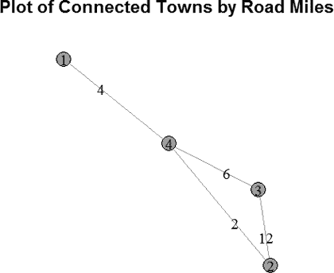

图 6-10：城镇连接性图和连接城镇之间的道路英里数

Figure 6-10 显示，城镇 2、3 和 4 通过多条道路连接，因此即使一条道路被封锁，仍可通过绕行其他城镇到达该城镇。然而，尽管城镇 1 距离最近的城镇只有 4 英里，但它相对孤立。连接城镇 2 和城镇 3 的道路相当长（也许这是一条穿过密林或绕过几个运河的背路）。

Listing 6-3 中的第二个`plot`应输出一个图表，显示每个城镇的总资源，如 Figure 6-11 所示。

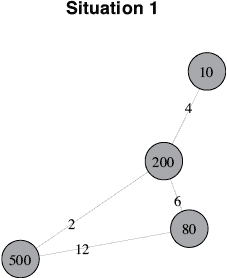

Figure 6-11：城镇连接图，连接城镇之间的道路里程及各城镇内的资源

Figure 6-11 让我们更深入地理解了四个城镇之间的连接性及潜在共享资源。注意，城镇 1 为灾难储备的水量相对较少（每位居民 10 升）。然而，如果城镇 1 和城镇 4 之间的道路在灾难中保持畅通，就可以将城镇 4（每位居民 200 升）的水转移到城镇 1，使得城镇 1 有足够的水源。只要城镇 4 与城镇 2 之间直接连接的道路在灾难中保持畅通，水资源也可以在这两个城镇之间轻松转移（城镇 2 储备了每位居民 500 升水）。

最大团计算得出的是互相连接的城镇（具有互相的*n*路连接的城镇）。这给出了城镇 1 和城镇 4 之间（通过单一道路）以及城镇 2、3 和 4 之间相互连接的关系。通过这些信息，我们可以计算出每个城镇在道路保持畅通的情况下可支配的资源。城镇 1 和城镇 4 之间共有 210 居民升水资源；三方团（城镇 2、3 和 4）共有 780 居民升水资源。

使用最短路径算法，我们可以计算任意两城镇之间的最短路线，以了解如果某个城镇的物资短缺且道路没有受到灾难破坏，物资如何迅速在城镇间调配。Table 6-2 列出了在这种情形下需要行驶的各城镇之间的里程。

Table 6-2：城镇之间的最短距离

|  | **城镇 1** | **城镇 2** | **城镇 3** | **城镇 4** |
| --- | --- | --- | --- | --- |
| **城镇 1** | 0 | 6 | 10 | 4 |
| **城镇 2** | 6 | 0 | 8 | 2 |
| **城镇 3** | 10 | 8 | 0 | 6 |
| **城镇 4** | 4 | 2 | 6 | 0 |

在此情境下最远的路线（10 英里）是当城镇 1 缺水时，从城镇 3 到城镇 1 的物资运输。需要注意的是，绕过最长的道路（8 英里而非 12 英里）从城镇 2 到城镇 3 会更短。

我们可以通过在 Listing 6-3 中添加内容来检视灾难中一条或多条道路受损的情形，从而移除连接各城镇的道路，并重新审视相互供应和最短路径：

```
#remove the link between vertices 2 and 4, providing an efficient supply
#route
g2<-delete_edges(g1,edges="2|4")
V(g2)$number<-c(10,500,80,200)
plot(g2,edge.label=E(g2)$weight,vertex.label=V(g2)$number,vertex.size=40,
main="Situation 2")

#find maximal cliques
mc2<-max_cliques(g2)
mc2

#find resources between sites
c1<-V(g2)$number[mc2[[1]][1]]+V(g2)$number[mc2[[1]][2]]
c2<-V(g2)$number[mc2[[2]][1]]+V(g2)$number[mc2[[2]][2]]
c3<-V(g2)$number[mc2[[3]][1]]+V(g2)$number[mc2[[3]][2]]

#examine time needed to transport using shortest paths
dis2<-distances(g2,v=V(g2),mode=c("all"),weights=E(g2)$weight,
algorithm="dijkstra")
```

这个脚本移除了镇 2 和镇 4 之间的链接，并重新计算了度量，以帮助我们评估由于镇 2 和镇 4 之间道路的阻断，情境发生了哪些变化。这些修改应产生一个类似于图 6-12 的情境 2 图。

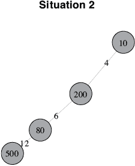

图 6-12：情境 1 的修改版图，其中一条道路在灾难中被摧毁

如图 6-12 所示，这种情境打破了情境 1 中的三角形，孤立了镇 2。如果镇 1 的水源短缺，水必须在镇 1 和镇 2 之间共享，并且预计从镇 2 向镇 1 输送水源可能会很困难。

如果我们查看这些团体，可以看到城镇之间的双向连接，且城镇间的相互供应比情境 1 中的三向连接更为分散。镇 2 和镇 3 之间有一个不错的相互供应，但其他镇可能会在所需水源的传输上产生延迟。此外，如在最短路径表中所示（表 6-3），需要行驶的里程也增加了。

表 6-3：城镇对之间的最短距离

|  | **镇 1** | **镇 2** | **镇 3** | **镇 4** |
| --- | --- | --- | --- | --- |
| **镇 1** | 0 | 22 | 10 | 4 |
| **镇 2** | 22 | 0 | 12 | 18 |
| **镇 3** | 10 | 12 | 0 | 6 |
| **镇 4** | 4 | 18 | 6 | 0 |

从水源最多的城镇（镇 2）调度水变得更加困难，预计的行驶时间大幅增加。如果情境 2 有可能发生，最好在灾难发生前重新分配水源，以避免传输延迟。

离散外微分算子有其他应用。图形渲染和工程问题是离散外微分算子（以及离散外微积分）特别感兴趣的领域。工程中的一些常见应用包括对离散对象的通量和流量计算，或对过程的计算机建模。在图形渲染中，图通常被更一般的网格所替代。

在某些情况下，使用上同调（及其工具：离散外微分算子）来研究对象或点云比使用持久同调要容易，因为最终结果会找到相同的边界和对象。然而，关于如何将离散外微分算子应用于数据的 R 包开发很少，因此代码必须像在清单 6-3 中一样手动解析。自动化和对象操作代码将有助于推动离散外微分算子在数据科学和其他领域的采用。

## 机器学习算法中的非线性代数

关于机器学习中几何学的另一个有趣且最近的发展是非线性代数在机器学习算法中的应用。许多机器学习算法在计算梯度、最小二乘估计量等时，严重依赖线性代数。然而，在那些不是平坦的或涉及直线的关系和空间中，线性代数仅能提供计算结果的近似。看一下图 6-13，它展示了一条直线（由线性代数工具假设，如回归中使用的工具）和一条曲线（可能会给线性代数工具带来估算问题）。

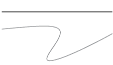

图 6-13：一条直线和一条曲线

非线性在使用线性工具估算曲线和非线性空间时，会引入误差到算法的计算和最终结果中。试想使用直尺来测量图 6-13 中的下部曲线。相对于上方的直线，很难准确地测量该曲线的长度。如果该曲线的长度是需要通过算法最小化或最大化的量，这种测量可能会导致非全局解，或足以扭曲该量，进而影响预测精度或模型拟合统计量，如平方和误差或贝叶斯信息准则。

一种被提议作为机器算法中线性代数计算替代的方法是使用*数值代数几何学*，这是一门处理曲线交点的非线性代数分支。例如，考虑一个二维椭圆与一条一维曲线的交点，如图 6-14 所示。

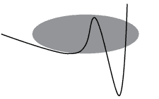

图 6-14：一条曲线与椭圆的交点图

可以使用不同类型的矩阵和矩阵运算来解决非线性系统，类似于线性代数解决线性系统的方式；矩阵中的数字仅仅被多项式方程所替代。这些交点曲线问题中的一些是非凸问题，这通常给机器学习算法及其背后的线性代数带来问题。

*凸优化问题*是那些优化函数创建一个区域，在该区域中通过该区域的直线会连续地位于该区域内（而不是穿越物体中的多个区域和非区域），如图 6-15 所示。

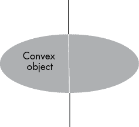

图 6-15：一个凸物体

然而，如果该区域包含孔或凹陷情况，那么情况就不再如此，区域被称为*非凸*，例如在图 6-16 中，区域内的孔将内部集拆分为区域内的集合和孔内的集合。

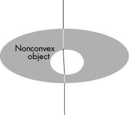

图 6-16：一个非凸物体

优化算法常常在非凸函数和优化函数中的区域中遇到困难，因为常用来解决这些问题的线性规划并不适合非凸优化问题，且逐步方法可能会陷入局部最优解，无法跳出洞或凹陷区域。不幸的是，许多现实世界的数据集及其所用的优化函数涉及非凸区域。数值代数几何为非凸优化问题提供了精确的解决方案，这些问题在现实数据处理中经常出现。一旦将多项式系统以矩阵形式建立，许多软件平台和程序就可以进行计算，包括 Bertini 和 Macauley 软件，它们都可以连接到 R 和 Python。这为非凸优化问题提供了有效的求解器。

最近在数值代数几何领域的几篇出版物和研讨会表明，非线性代数是解决其他类型问题（这些问题可能是凸的）的算法中的一种可行替代方案，它放宽了数学假设并提高了准确性。一篇近期的论文（Evans, 2018）发现，许多统计模型的多个可能解的局部几何重叠（包括 Lasso、时间序列数据的 ARIMA 模型以及贝叶斯网络）。这意味着算法在模型空间中难以有效区分潜在的预测变量集或参数值，特别是在常用且建议的样本量下。可以通过在切空间中拟合模型（如前一节所示）或使用数值代数几何而非线性代数进行优化来解决此问题。这表明数值代数几何和其他非线性方法可以立即应用于机器学习算法，以提高算法性能和模型拟合效果。

不幸的是，目前在 R 中没有实现这些算法的包，因此我们在示例中不再深入探讨。

## 将选择排名与 HodgeRank 进行比较

在一群客户中辨别选择偏好是一个常见的机器学习任务。例如，一家公司可能希望客户比较软件新特性列表中的项目，以便优先安排工程团队在接下来一年的时间。比较选择排名还帮助公司将新产品和服务推销给现有用户，并为可能在现有客户中热销的商品设计新的营销活动。

让我们看一个简单的例子，来排名在海滩上的活动偏好。或许我们正在查看一家酒店从最近的客人那里收集的数据，关于他们在入住期间更喜欢哪些活动；这将使酒店能够优先安排海滩使用和员工招聘，以满足客人未来对主要活动的需求。在这里，我们有三项活动选择（躺在海滩上、游泳或冲浪），其中有一个明显的最爱（冲浪）。图 6-17 总结了这个简单的情况。

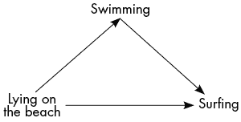

图 6-17：一个相对其他选项排名三项选择的图

我们可以通过添加一个可能的新第四项活动来使问题更加复杂，这项活动比其他三项活动更受欢迎：风筝冲浪。排名仍然相对容易计算，因为所有活动都比躺在海滩上更受欢迎，其中一项活动仅比躺在海滩上更受欢迎（游泳），一项活动比除风筝冲浪外的所有活动更受欢迎（冲浪），而一项活动比其他三项活动更受欢迎（风筝冲浪），如图 6-18 所示。

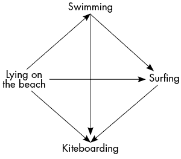

图 6-18：一个添加了另一项活动到偏好数据的图

所有信息都在图中给出，这个特定的人填写了所有选项的相对关系。在现实世界的数据中，这种情况很少见，如图 6-19 所示。

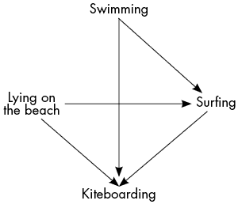

图 6-19：四项活动的不完整偏好图

然而，这些信息仍然显示出对风筝冲浪的强烈偏好，所有的配对排名都指向风筝冲浪，并且所有的配对排名都表明风筝冲浪是最受欢迎的活动。在现实数据中，缺失信息很常见，数据中也常常存在偏好循环，例如在图 6-20 中，冲浪比游泳更受欢迎，而风筝冲浪比冲浪更受欢迎，但却不比游泳更受欢迎。

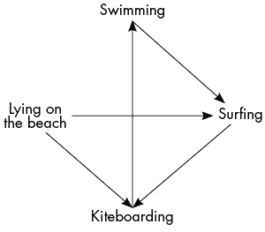

图 6-20：一个不完整且不一致的排名偏好数据示例

这给出了风筝冲浪和游泳相对排名时可能出现的局部不一致性。然而，冲浪和风筝冲浪比另外两项活动更受欢迎，表明它们在可能的选项中排名较高，并且风筝冲浪比冲浪更受欢迎（提供了一种打破平局的方式）。

当没有全局一致的偏好时，情况变得有些模糊，每项活动都比另一项活动更受欢迎，如图 6-21 所示。


图 6-21：一个不完整的偏好数据图，缺乏一致的偏好

在图 6-21 的例子中，无法确定哪项活动比其他活动更受偏好，分析结果也将得出不确定的结论。当客户被要求对金融应用程序中的功能进行排名，或客人被要求对偏好的活动进行排名时，这种情况很常见。大多数客户会分成若干子群体，每个子群体都有自己独特的需求，这些需求可能与另一个重要子群体的需求相反。如何优先考虑功能开发，或者如何提供选择以取悦最多的客户，是一项挑战。

存在许多算法用于进行成对排名比较，以获得相对彼此的偏好排名列表（如 SVMRank、PageRank 等）；然而，通常它们并不提供关于排名中的局部和全局不一致性的信息，这些不一致性可能影响一个项目或选择相对于其他项目的排序位置。代数几何最近为成对排名算法集合中增加了一种工具，可以分解排名结果，包含关于项目的局部和全局不一致性的信息；这就是*HodgeRank*，它通过利用工程问题中常见的基于代数几何的定理——Hodge-Helmholtz 分解来推导这些信息。

*Hodge*–*Helmholtz 分解*将一个向量流（或图上的流）分解为三个不同的组成部分，如图 6-22 所示：*梯度流*，其在局部和全局上都是一致的；*旋度流*，其在局部上是一致的，但在全局上是不一致的；以及*谐波流*，其在局部上是不一致的，但在全局上是一致的。

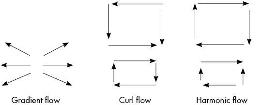

图 6-22：展示 Hodge–Helmholtz 分解分解后的流图

在海滩的示例中，图 6-20 展示了一个旋度流，涉及游泳、冲浪和风筝冲浪（如果没有其他活动被排名在那里，它也可以是谐波流）。图 6-21 是一个全局谐波流（以及局部旋度流）的示例。

*HodgeRank*算法本质上是为成对排名问题扩展了 PageRank；其数学模型归结为一个图数据上的最小二乘问题，从而能够评估全局排名和局部排名的一致性。因此，可疑的排名可以被标记出来，供人工分析师进行审查。该算法还允许在原始成对排名集中存在大量缺失数据，使其在现实世界中经常不完整的排名数据问题中具有广泛的应用性（用户不可能点击三百万个视频选项来对每个视频进行相互排名！）。尽管在 R 中没有现成的软件包，因此我们不会详细讲解一个例子，但在 Matlab 中已有相关的实现，熟悉 Matlab 的读者如果对该算法感兴趣，建议使用列出的 HodgeRank 资源。

## 总结

在本章中，我们学习了来源于微分几何和代数几何的较新算法，并探索了 dgLARS 和离散外微分法在数据分析问题中的应用，包括 Quora 天才样本、信用借贷样本以及灾难规划场景。许多新的算法正在不断开发，我们概述了近年来非线性代数和 Hodge 理论如何为机器学习做出贡献，并影响了许多行业中的重要问题（例如偏好排序和参数模型估计）。

在下一章，我们将回到持久同调，并探讨另一种代数拓扑工具——Mapper 算法。这两者将在本章介绍的学生样本上应用。
