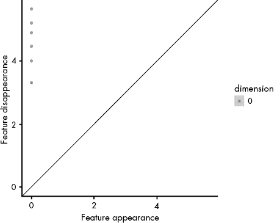
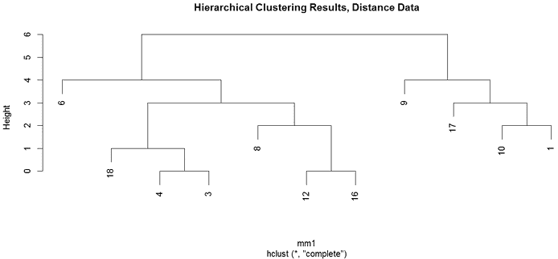
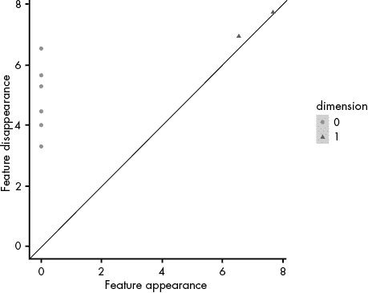
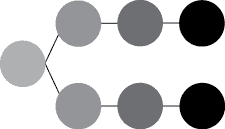
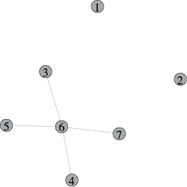
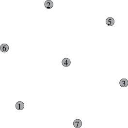

# 7

拓扑数据分析工具


在本章中，我们将探讨直接基于拓扑的算法，并利用它们来理解在第六章中遇到的自我报告教育数据集。包括拓扑基础算法的机器学习分支被称为*拓扑数据分析 (TDA)*。你在第四章中已经见过一些 TDA，我们使用持久同调来探索网络差异。持久同调近年来在机器学习领域引起了广泛关注，并已被应用于心理测量数据验证、图像比较分析、卷积神经网络的池化步骤以及小样本数据的比较。在本章中，我们将重新审视持久同调，并研究 Mapper 算法（现在由 Ayasdi 公司商业化）。

## 寻找具有独特行为的显著群体

之前，我们使用持久同调来区分不同类型的图。回顾一下第四章，持久同调通过点云数据创建单纯复形，对这些单纯复形应用一系列阈值，并计算与每个阈值化单纯复形中存在的拓扑特征相关的一系列数字。为了比较对象，我们可以使用 Wasserstein 距离来衡量不同切片之间的拓扑特征差异。

持久同调今天在工业界有很多应用。*子群挖掘*是其中一个显著应用，我们通过它来寻找数据中具有独特行为的显著群体。特别是，我们经常寻找与零次同调群相关的连通分量，或者几何上相互连接的群体（例如层次聚类中的簇）。例如，在心理测量调查验证中，子群挖掘帮助我们在调查中找到不同的群体，比如在衡量抑郁症的调查中发现不同的抑郁亚型群体。

让我们通过一个实际示例来演示与自我报告教育数据相关的持久同调子群挖掘，这些数据来自一个社交网络网站。我们将模拟数据，并使用 R 中的 TDAstats 包和 R 中的`hclust()`函数进行单链接层次聚类来比较持久同调结果（参见示例 7-1）。我们将回到第六章中关于天才 Quora 用户自我报告他们学校经历的示例数据集（参见书中的文件获取该数据集）。在这个例子中，我们将样本拆分为 11 个个体的集合，以便我们能够通过统计方法比较持久同调结果，确保我们的测量在学生群体的样本间不会发生变化。这为我们的测量提供了一种验证，证明它在群体中的一致性。

```
#load data and set seed
mydata<-read.csv("QuoraSample.csv")
set.seed(1)

#sample data to split into two datasets; remove the IQ scores
s<-sample(1:22,11)
set1<-mydata[s,-1]
set2<-mydata[-s,-1]
```

示例 7-1：一个加载教育数据集并将其拆分为两个集合的脚本，这些集合将使用持久同调进行探索

现在我们已经有了数据集，可以应用持久同调来理解聚类。具体来说，我们关注的是零阶 Betti 数，这些数值对应于连接的群体，以及数据的其他拓扑特征——有关详细信息，请参考第四章。

首先，我们需要计算社交网络中每个学生之间的曼哈顿距离；我们将使用这些距离来定义过滤。曼哈顿距离通常是离散数据的常用距离度量。将以下代码添加到脚本中：

```
#calculate Manhattan distance between pairs of scores
mm1<-dist(set1,"manhattan",diag=T,upper=T)
```

接下来，我们希望将持久同调算法应用于基于距离的数据，以揭示持久特征。使用 TDAstats 包，我们可以添加代码来计算该数据集的零阶和一阶 Betti 数，使用相对较低的过滤设置作为近似的最大尺度（这将给我们更大的聚类）。最后，我们可以在持久性图和层次聚类图中绘制结果：

```
#create the Vietoris-Rips complex (turn data into a simplicial complex)
library(TDAstats)
d1<-calculate_homology(mm1,dim=1,format="cloud")
#plot persistence diagrams where circles=connected components, triangles=loops
plot_persist(d1)
#hierachical cluster
plot(hclust(mm1),main="Hierarchical Clustering Results, Distance Data")
```

`calculate_homology()`函数将距离数据集中的点云数据转换为单纯形复形；然后我们可以应用过滤来识别在过滤过程中出现和消失的拓扑特征。虽然还有其他方法可以从数据中创建单纯形复形，但该包中的 Rips 复形是最容易计算的方法之一。

使用之前的代码，我们绘制了两张图。调用`plot_persist()`应该输出类似于图 7-1 的结果。可以看到，图中似乎存在一个主要群体，可能还会在较低过滤级别处看到一个或两个子群体；然而，这个子群体是否是一个显著特征尚不可知，因为它接近对角线。



图 7-1：第一组教育经验数据的持久性图

使用层次聚类结果（图 7-2）时，很容易看到一个主要群体，然后在较小的距离阈值下出现多个分裂。



图 7-2：模拟数据的树状图

如果在高度为 5 的位置切割聚类，树状图结果表明存在两个主要子群体。让我们根据层次聚类中找到的两个主要聚类，将`set1`数据进行分割，首先检查较小的聚类，然后检查较大的聚类，方法是添加到清单 7-1 中：

```
#smaller cluster
mydata[c(1,9,10,17),]
```

这应该输出以下内容：

```
> **mydata[c(1,9,10,17),]**
    IQ      Bullying Teacher.Hostility Boredom Depression Lack.of.Motivation
1  187             0                 1       0          0                  1
9  182             1                 1       0          0                  1
10 161             0                 0       1          0                  1
17 170             1                 0       0          0                  0
   Outside.Learning Put.in.Remedial.Course
1                 0                      0
9                 0                      1
10                0                      0
17                0                      0
```

在这个个体聚类中，没有报告抑郁症或外部学习情况。一些个体报告了欺凌、教师敌意、无聊、补救教学或缺乏动力的情况。我们可以将这个与树状图中发现的更大聚类进行对比：

```
#larger cluster
mydata[c(3,4,6,8,12,16,18),]
```

这应该输出如下内容：

```
> **mydata[c(3,4,6,8,12,16,18),]**
    IQ Bullying Teacher.Hostility Boredom Depression Lack.of.Motivation
3  155        0                 0       0          0                  0
4  155        0                 0       0          0                  0
6  174        0                 0       1          1                  1
8  170        0                 0       0          0                  0
12 175        0                 1       0          0                  0
16 160        0                 1       0          0                  0
18 185        0                 0       0          0                  1
   Outside.Learning Put.in.Remedial.Course
3                 1                      0
4                 1                      0
6                 1                      1
8                 0                      1
12                1                      1
16                1                      1
18                1                      0
```

与第一个聚类相比，这些个体大多数报告了外部学习且没有欺凌现象。这似乎区分了在校学习经历与课外学习经历。课外学习和不面对欺凌问题可能与学生的学习成果和整体学校体验相关。

该分析中的一个有趣项目是个体 6，他似乎是图 7-2 树状图中的一个离群值。该个体没有处理欺凌或教师敌意问题，但在上学期间处理了其他所有问题。在分析中，离群值可能是重要且具有影响力的。像持久同调这样的基于拓扑的算法通常比其他算法和统计模型更能抵抗离群值：当我们使用 TDA 时，极端值或子群体对结果的影响不会像使用其他方法那样剧烈。例如，在我们的天才样本中，个体 6 可能比持久同调的结果更能影响 k-means 的结果。

子群体挖掘是持久同调的一个重要用途——既可以用于识别数据集中的群体，也可以用于识别可能影响传统聚类方法优化步骤的离群值。让我们继续探索另一个重要的用途：作为一个测量验证工具。

## 验证测量工具

存在许多方法可以比较树状图或持久性图；这仍然是一个活跃的研究领域。持久性图需要转换为度量空间，这使我们能够构建具有兼容距离度量的非参数检验，进而可以比较两个图并从零分布中模拟随机样本，最终我们可以用来比较检验距离。总的来说，这让我们能够验证测量工具。在我们的示例中，我们希望通过比较来自相同人群的样本（我们的 Quora 样本）来验证我们对学校问题的测量。如果持久同调的结果相同，那么我们的测量工具是一致的，这是心理测量学领域测量设计的一个关键特性。

对于持久性图，我们通常使用 Wasserstein 距离，因为它在比较分布和有限样本中的点集时表现良好。对于树状图，Hausdorff 和 Gromov–Hausdorff 距离是两个不错的选择，这两者都衡量形状上点之间最小距离中的最大距离。然而，Gromov–Hausdorff 距离更为复杂，并且包含更多的结构信息，这使得它在某些情况下不太理想。

为了将另一个持久性图的距离与当前图进行比较，我们可以使用我们自报教育数据集中的第二组个体，添加到清单 7-1：

```
#compute Manhattan distance for set 2
mm2<-dist(set2,"manhattan",diag=T,upper=T)

#create the Vietoris-Rips complex
d2<-calculate_homology(mm2,dim=1,format="cloud")

#plot persistence diagrams—circles=connected components, triangles=loops
plot_persist(d2)
```

请注意，我们已将分析的数据集更改为来自完整样本的第二组个体。这创建了一个比较集，应该属于同一人群；在这个示例中，分析中会出现更多潜在的子群体。图表应该看起来像图 7-3。



图 7-3：另一个持久性图，模拟数据，这次使用了不同的参数来模拟数据

在图 7-3 中，我们看到了几个与图 7-1 的样本相似的不同群体。我们还看到了对应于 Betti 数 1 的点；然而，考虑到它们离线很近，这些点很可能是噪声。一个点离对角线越远，它就越有可能是真实的特征。这些新的 Betti 数特征与我们之前的样本不同，但可能不是实际的特征。

使用 TDAstats 包计算图形之间的距离非常容易。将以下几行添加到您的脚本中：

```
#calculate distance between diagrams
w<-phom.dist(d1,d2,limit.num=0)
w
```

这计算了图 7-1 和图 7-3 中显示的零同源性组和第一同源性组的持久图形之间的距离，结果应该大约是 10.73（零同源性）和 0.44（第一同源性），尽管这些值可能根据您使用的 R 版本有所不同。现在可以计算从原始样本中随机抽取样本之间的距离。TDAstats 包提供了一种方便的方式来计算这个过程，无需我们自己编写整个检验函数。让我们将这些代码片段添加到我们的脚本中：

```
#compute permutation test and examine p-values from output
permutation_test(d1,d2,iterations=25)
```

该脚本现在将计算两个样本特征之间的置换检验，生成每个同源性层级的检验统计量和 p 值。如预期的那样，我们的零同源性差异在 95%的置信度下并不显著（*p* = 0.08）。考虑到我们在第一个样本中没有任何第一同源性特征，我们确实看到了样本之间的第一同源性差异显著；然而，统计量本身为 0，表明这是一个人为的发现。

虽然这个例子涉及一个便利样本，并没有实际进行调查，但它与通过持久同源性验证跨人口样本中实际使用的心理测量工具有关。我们还可以使用这种方法来比较不同人口之间的差异，探索一个测量工具在不同人口中的行为变化。也许一组学生已经加速（跳过了一年或更多年级），而另一组没有。我们可能会看到他们在学校中自我报告的经历有很大不同。在这种情况下，测量工具可能在加速组和非加速组之间显示出截然不同的行为。

## 使用 Mapper 算法进行子群体挖掘

在数据科学中，我们经常面临聚类问题，数据可能存在极端的变量尺度差异，包括稀疏或分散的数据，包含异常值，或有显著的群体重叠。这些情况可能会对常见的聚类算法造成问题，例如 k-means（特别是群体重叠问题）或 DBSCAN（稀疏或分散数据）。*Mapper 算法*通过基于分箱、聚类和将聚类拉回到图形或简单复形的多阶段过程来找到聚类，是另一个用于子群体挖掘的有效聚类工具。该算法将莫尔斯理论中的一些概念与持久同调中的过滤概念结合，为聚类算法提供了一个拓扑学基础。

### 逐步执行 Mapper 算法

Mapper 算法的基本步骤包括使用一个标量值函数（称为*莫尔斯函数*）来过滤点云；然后我们将数据分成重叠的箱子，在每个箱子内聚类数据，并根据聚类在不同箱子之间的重叠将这些聚类连接成图形或简单复形。为了可视化这一过程，让我们考虑一个定义了标量值函数的简单点云；我们将根据对点云应用该函数的结果对对象进行着色。请查看图 7-4 中的结果。


图 7-4：具有莫尔斯函数定义的多阴影对象，阴影按渐变变化

现在，这个形状可以被分成四个重叠的箱子。这使我们能够看到具有略微不同莫尔斯函数值的区域之间潜在的有趣关系，这在我们应用聚类算法时将变得非常重要，如图 7-5 所示。


图 7-5：通过阴影渐变分箱图 7-4 的结果

现在我们已经对函数进行了分箱处理（图 7-5），我们可以开始聚类。跨箱子的聚类可能比简单应用聚类算法要复杂一些。这个聚类是必要的，用来定义复形及聚类在箱子间的重叠。我们需要在每个箱子内进行聚类，并结合结果来理解跨箱子聚类的连通性，这样才会得到最终结果。Mapper 算法的一个优势是，结果可以轻松地可视化为图形或单纯形；我们示例的最终结果可能会像图 7-6 一样，其中两个不同的群体从一个连接它们的点开始演变。



图 7-6：通过分箱图 7-4 的结果定义的聚类

在实际应用中，通常会对原始数据应用一种距离度量——相关性、欧几里得距离、汉明距离等——作为处理点云数据并在聚类前创建更好的过滤函数的方法。距离度量数据集的聚类可以使用多种算法，尽管通常实践中使用单链接层次聚类。一般而言，坐标系统对 Mapper 的结果或其他 TDA 算法的结果影响不大。

Mapper 算法相对于其他聚类方法，以及拓扑数据分析（TDA）相对于其他方法的一些优势是显而易见的。数据在小扰动（噪声）下的不变性使得 Mapper 比 k-means 更具鲁棒性，后者对初始种子非常敏感，并且每次运行可能会得到完全不同的结果。（注意，Mapper 对参数变化敏感，但对于重复运行和增加噪声的数据相对较为鲁棒。）结果的压缩或可视化便于对高维数据的聚类结果进行直观展示。由于不依赖坐标系统，我们可以比较不同尺度上或不同平台上收集的数据。此外，Mapper 能够处理聚类重叠，这对 k-means 算法及其衍生算法来说是一个显著挑战。最后，Mapper 处理稀疏性和离群值的能力，使其相比 DBSCAN 具有优势。这使得它非常适合用于小型数据集、预测变量可能多于观察值的情况，或是可能包含大量噪声的杂乱数据。

### 使用 TDAmapper 在数据中寻找聚类结构

TDAmapper R 包提供了 Mapper 算法的实现，可以处理多种类型的处理过的数据。在这个例子中，我们将再次使用来自天才 Quora 用户样本的自我报告教育数据集，其中包括 22 名提供天才范围评分并讨论至少一个感兴趣问题的个体，报告了七个主要学校问题（欺凌、教师敌意、无聊、抑郁、缺乏动力、外部学习、被安排进入补救课程）。目标是了解该样本中各问题之间的关系（有点像在测量中创建子量表）。这是二进制数据，因此我们将使用逆汉明距离来获得距离矩阵。汉明距离通过逐位比较二进制字符串来测量差异，从而获得不相似度的度量。虽然也可以使用其他距离度量来处理二进制数据，但汉明距离在比较基于二进制变量评分的个体之间的整体差异时效果很好。

让我们加载数据并为在 Listing 7-2 中的分析做准备：

```
#load data and clean
mydata<-read.csv("QuoraSample.csv")
mydata<-mydata[,-1]

#load Mapper, igraph, and distance packages
library(TDAmapper)
library(igraph)
library(e1071)

#process data to turn it into a distance matrix
df<-data.frame()
for (j in 1:7){
  for (i in 1:7){
    df[i,j]<-1/(hamming.distance(mydata[,i],mydata[,j]))
  }
}
df[df>1]<-1
```

Listing 7-2：加载并处理数据以获得距离矩阵的脚本

Listing 7-2 中的代码加载了我们的数据集和分析所需的包，然后处理数据以获得距离矩阵，供 Mapper 算法使用。对于二进制数据，可以使用其他距离度量，但 Hamming 距离对于比较基于二进制变量评分的个体之间的整体差异非常有效。

现在让我们应用 Mapper 算法。我们将设置 Mapper 处理距离矩阵，使用三个间隔并具有 70%的重叠，以及三个簇来进行聚类。在小数据集上，较高的重叠参数将鼓励跨簇之间的连接；实际上，30%到 70%之间的设置通常能得到较好的结果。此外，较小的间隔数和簇的数量大约对应于数据集中需要聚类的实例数的一半，这通常在实际中效果不错。通常，使用不同的参数设置是有益的，因为结果会根据初始参数的不同而变化；一些最近的论文建议，Mapper 算法在参数不变的情况下，对于结果的稳定性并不完全可靠。我们还将根据最小和最大 Hamming 距离设置过滤值。我们可以通过在 Listing 7-2 中添加这些代码行来实现：

```
#apply mapper
j<-mapper1D(as.matrix(df),num_intervals=3,percent_overlap=70, num_bins_when_clustering=3,
filter_values=c(0.025,0.05,0.075,0.1,0.125,0.15,0.2))
summary(j)
j$points_in_vertex
```

这段代码在之前设置的参数下运行 Mapper 算法。摘要提供了 Mapper 对象中关于结果的对象列表。顶点内点的摘要告诉我们这些变量如何分组为不同的簇。

探索 Mapper 对象可以为我们提供一些关于哪些问题聚集在一起的洞察。我们可以从 Mapper 对象中获得很多信息，但这次探索将仅限于了解数据集中哪些点最终出现在 Mapper 对象中的哪个簇（顶点）。让我们来看看我们在 Listing 7-2 中的最后一次修改的输出：

```
$points_in_vertex
$points_in_vertex [[1]]
[1] 1

$points_in_vertex [[2]]
[1] 2

$points_in_vertex [[3]]
[1] 3

$points_in_vertex [[4]]
[1] 4

$points_in_vertex [[5]]
[1] 5

$points_in_vertex [[6]]
[1] 3 4 5 6

$points_in_vertex [[7]]
[1] 4 5 6 7
```

从之前的结果中，我们可以看到哪些变量出现在了哪些簇中。我们发现变量 1 和 2（欺凌和教师敌意）倾向于孤立出现（点顶点 1 和 2），而其他问题则倾向于出现在簇中（其他顶点中的点）。考虑到这些是属于权威社会和同伴社会问题，而不是课程病因学问题，这有一定的合理性。教师如何互动以及学生如何表现通常与课程无关，而课堂上缺乏挑战性的问题则直接来源于课程。

在我们的脚本中添加以下内容，我们可以在 igraph 中绘制图形，以便更深入地了解簇的连接性：

```
#create graph from the mapper object's adjacency information
g1<-graph.adjacency(j$adjacency,mode="undirected")
plot(g1)
```

这段代码将 Mapper 的重叠簇结果转化为一个图形对象，可以绘制并分析簇之间是如何重叠的。

图 7-7 显示了教师敌意和同伴欺凌这两个社会性问题的隔离。基于课程的问题往往与缺乏动机和外部学习（项目 5 和 6）有所重叠，这些是这些群体之间的强连接。



图 7-7：在 Quora 样本分析中找到的聚类网络图

Mapper 的一个主要问题是它在重叠和滤波器 bin 划分上的不稳定性。例如，将 bin 重叠调整为 20% 会导致如 图 7-8 所示的未连接图。



图 7-8：定义不同参数的 bin 重叠后的 Quora 样本结果的网络图

一些最近的论文建议使用多尺度来稳定输出；然而，目前对这一概念的探索大多还停留在理论阶段。一般而言，使用不同的重叠比例可以帮助我们大致了解数据中的聚类结构。

## 总结

本章中，我们探讨了一些来自拓扑数据分析的工具。我们使用持久同调比较了教育群体样本的数据，并在自选的极度天才个体样本中探索了教育经验组。近年来，拓扑数据分析（TDA）发展迅速，许多问题可以通过 TDA 的一个或多个工具来解决。在下一章中，我们将探讨这个日益发展的领域中的另一种流行工具。
