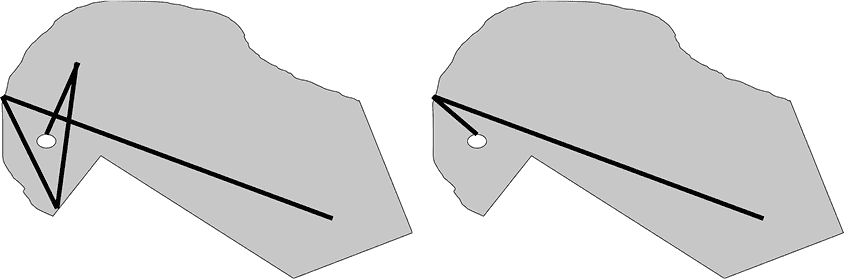
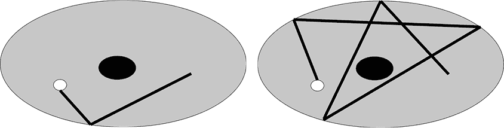
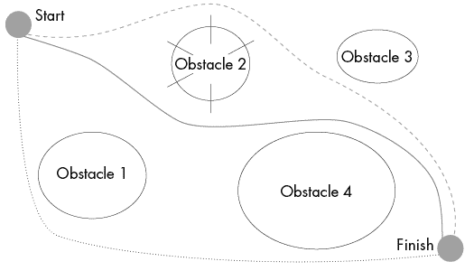
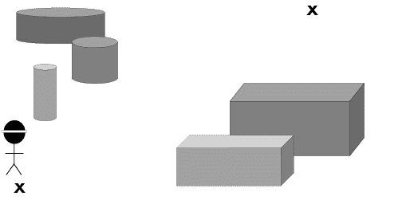
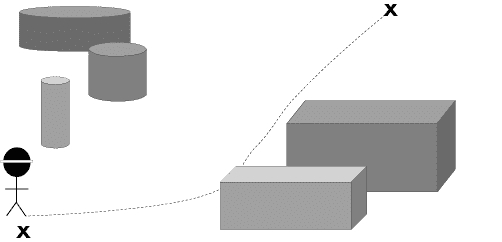
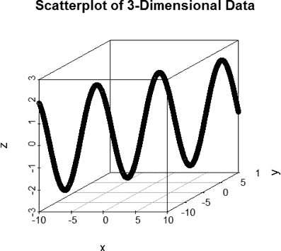

# 同伦算法


本章将探讨与同伦相关的算法，一种基于物体周围路径类型对拓扑物体进行分类的方法，包括基于同伦的回归参数计算。局部极小值和极大值经常困扰数据集：它们为局部探索解空间的算法提供了次优的停止点。在接下来的几页中，我们将看到同伦是如何解决这个问题的。

## 引入同伦

如果两条路径或函数可以在感兴趣的空间内连续变形为彼此，则它们是*同伦的*。想象一下一个高尔夫球场和一对高尔夫球手，其中一个比另一个更擅长推杆。球可以沿着许多不同的路径到达洞口。想象一下，用绳子标出每次击球的路径。一条路径可能相当直接，而另一条路径可能会曲折很远，特别是当果岭崎岖不平时。一个差劲的高尔夫球手可能需要打很多次，这样就会形成一条又长又曲折的路径。但无论果岭上有多少丘陵，或者球手的球需要多少次击打才能进洞，我们都可以通过变形绳子来缩短这些路径，正如在图 8-1 中所示。



图 8-1：高尔夫球场到洞口的长路径（左）变形为到洞口的短路径（右）

让我们稍微扩展一下这个类比，假设高尔夫球场上出现了一个天坑。具有孔洞的拓扑物体和空间可能会使变形过程变得复杂，并导致从一个点到另一个点的多条可能路径。路径可以连接物体上的两个点。根据物体的性质，这些路径有时可以“扭曲”到足以与另一条路径重叠，而不必将路径切割成片段来绕过障碍物（通常是孔洞）。绕过孔洞的曲折路径为路径的连续变形带来了问题。路径不可能绕着一个孔洞扭曲或弯曲，直到两点之间的路径必然与另一条路径重叠。随着孔洞和孔洞周围的路径的增加，开始出现不同类型的路径。一条路径可能仅绕一个孔做一次循环，然后连接两个点。另一条路径可能需要绕一个孔做几次循环，才能连接两个点。再想象一下打高尔夫。假设球场的果岭中央有一个障碍物（例如一块岩石或一个水障碍），形成一个环面（圆环形状），周围有复杂的丘陵，迫使一个糟糕的击球手绕过岩石才能回到洞口，正如你在图 8-2 中所看到的那样。



图 8-2：在环面（甜甜圈形状）球场上，两个起点和终点相同的路径，无法通过变形而不被切割或去除内部孔洞来变换成彼此

在这种情况下，我们不再能够将路径变形为彼此相同的形状，而不切断路径或移除孔洞。随着更多孔洞或更大维度的孔洞的添加，会出现更多等价路径的类别，这些等价路径在一个或多个孔洞周围有相同数量的回路。二维的赛道从起点到终点的可能路径少于三维赛道，因为赛道中的障碍物和孔洞的种类较少。一个包含多个维度的多个孔洞或障碍物的空间，会给路径带来更多可以绕过的障碍物。这意味着对于这个空间存在许多独特的路径。

考虑到数据集通常包含不同维度的孔洞，数据中可能存在许多不同类别的路径。常见于贝叶斯分析和机器人导航路径寻找任务中的随机游走，可能并不等价。这在导航问题中可以是一种优势，允许系统从一组不同的路径中选择，且这些路径有着与长度、资源分配和移动难易度相关的不同成本权重。例如，在图 8-3 中的路径寻找问题中，可能障碍物 2 有尖锐的边缘，如果系统太接近，可能会造成伤害，从而使得最左侧的路径成为系统的理想选择。



图 8-3：一个示例障碍赛道，包含从起点到终点的导航，且有多个可能的解决方案

图 8-3 展示了三条路径，其中没有一条可以变形为另一条路径，除非移动障碍物或切断路径。这些是在空间中的独特路径。通过计算独特路径的总数，我们可以从拓扑上对空间进行分类。

## 引入基于同伦的回归

如前所述，数据集常常包含局部最优解形式的障碍物，即局部最大值和最小值。梯度下降算法和其他逐步优化算法可能会陷入这些局部最优解。你可以把它看作是高维版的丘陵和山谷（鞍点，即更高维的拐点，也可能带来优化问题）。陷入局部最优解通常会给优化问题提供不理想的解。

基于同伦的算法可以帮助估计包含多个局部最优解的高维数据中的参数，在这些条件下，许多常见的算法如梯度下降可能会遇到困难。通过在一个局部最优解较少的空间中找到一个解，并将其持续变形到原始空间，可以提高模型中估计的准确性和所选变量的效果。

为了提供更多的见解，假设一个蒙眼的人试图穿越一个工业区（图 8-4）。没有任何连接，他们肯定会碰到障碍物，并可能误以为自己已经达到了目标，直到被其中一个更大的障碍物停住。



图 8-4：一个蒙眼的人在障碍课程中导航

然而，如果他们有一根绳子将起点和终点连接起来，他们就能更好地在这些点之间导航，并且知道他们遇到的任何障碍物可能都不是最终的终点。连接起点和终点的方式有很多种。图 8-5 展示了其中一种可能的绳子配置。



图 8-5：一个蒙眼的人在带有引导绳的障碍课程中导航

一个蒙眼的人努力避免物理障碍物，可以类比为一个机器学习算法避免局部最优解。例如，我们可以考虑一个具有全局最大值和最小值，但存在其他局部最优解的二元函数，如示例 8-1 中所推导的。

```
#load plot library and create the function
library(scatterplot3d)
x<-seq(-10,10,0.01)
y<-seq(-10,10,0.01)
z<-2*sin(y)-cos(x)
which(z==min(z))
which(z==max(z))
scatterplot3d(x,y,z,main="Scatterplot of 3-Dimensional Data")
```

示例 8-1：一个创建二元函数的脚本，该函数具有全局最小值和最大值，但有许多其他局部最优解

示例 8-1 中的代码生成了图 8-6 中的图表，从中我们可以看到许多极小值和极大值。其他的最优解是局部最优解，其中一些非常接近全局最小值或最大值。



图 8-6：三维数据的散点图，即一个具有多个局部最优解的函数

一个试图优化这个函数的算法很可能会陷入其中一个局部最优解，因为局部最优解附近的值会从该最优解的值上升或下降。一些已知在这种优化类型中表现不佳的算法包括梯度下降法和期望最大化（EM）算法等。像进化算法这样的优化策略也很可能需要很长时间才能找到全局解，这使得它们对于这种数据来说不太理想。

基于同伦的计算为这个局部最优解陷阱问题提供了有效的解决方案；使用基于同伦的计算的算法可以在局部最优解之间摆动，或者脱离局部最优解。实质上，这些算法从一个简单的优化问题开始，在这个问题中没有局部最优解，并根据数据集及其几何形状缓慢变形解，随着变形的进行，避免局部最优解。

目前在机器学习中常用的基于同伦的优化方法包括支持向量机、Lasso，甚至神经网络。R 的 lasso2 包是一个实现基于同伦模型的包；在这个案例中，lasso2 实现了一个基于同伦的 Lasso 算法模型。让我们首先探讨在示例 8-1 中生成的数据的模型拟合和解，其中结果有多个局部最优解，并且预测变量是共线性的，这对于许多机器学习算法来说是一个问题。将以下代码添加到示例 8-1 中的代码：

```
#partition into training and test samples
mydata<-as.data.frame(cbind(x,y,z))
set.seed(10)
s<-sample(1:2001,0.7*2001)
train<-mydata[s,]
test<-mydata[-s,]
```

现在，模型已经准备好构建和测试。我们关心的结果（我们的变量`z`）并不是正态分布的，但高斯分布是模型中最接近的可用分布。在以下脚本的补充部分 Listing 8-1 中，`etastart` 参数需要在开始模型迭代之前设置为 null，并且需要设置一个边界来引导基于同伦法的参数搜索。通常情况下，较低的设置效果最好：

```
#load package and create model
library(lasso2)
etastart<-NULL
las1<-gl1ce(z~.,train,family=gaussian(),bound=0.5,standardize=F)
lpred1<-predict(las1,test)
sum((lpred1-test$z)²)/601
```

这个脚本现在将基于同伦法的 Lasso 模型拟合到训练数据上，然后基于该模型预测测试数据的结果，允许我们评估模型拟合度。该样本的均方误差，计算在最后一行，应该接近 2.30\。（再说一遍，结果可能因 R 版本不同而有所变化，因为种子和采样算法发生了变化。）模型的结果表明，有一个项主导了函数的行为：

```
> **las1**
Call:
gl1ce(formula=z ~ .,data=train,family=gaussian(),standardize=F,
    bound=0.5)

Coefficients:
(Intercept)           x           y
 0.05068903  0.04355682  0.00000000

Family:

Family: gaussian
Link function: identity

The absolute L1 bound was       :  0.5
The Lagrangian for the bound is :  1.305622e-13
```

这些结果可能会因不同 R 版本的读者而有所不同，显示出只有一个变量被选为模型的重要变量。根据我们的模型，`x` 对 `z` 的预测贡献大于 `y` 的贡献。考虑到 `x` 或 `y` 与 `z` 之间的非线性关系，线性回归并不是解决这个问题的好工具，但它确实发现了这种关系中的一些一致性。

为了与另一种方法进行比较，让我们创建一个线性回归模型，并将其添加到 Listing 8-1：

```
#create linear model
l<-lm(z~.,train)
summary(l)
lpred<-predict(l,test)
sum((lpred1-test$z)²)/601
```

这段代码在训练数据上训练一个线性模型，并预测测试集的结果，类似于之前的代码中如何拟合基于同伦法的模型。你可能会收到回归模型的警告，因为`x`和`y`存在共变行为（根据非共线性假设，这对线性回归模型是有问题的）。让我们来看一下这个模型的结果：

```
> **summary(l)**
 Call:
lm(formula=z ~ .,data=train)

Residuals:
     Min       1Q   Median       3Q      Max
-2.51261 -1.48663  0.07368  1.48680  2.37086

Coefficients: (1 not defined because of singularities)
            Estimate Std. Error t value Pr(>|t|)
(Intercept) 0.050689   0.041267   1.228     0.22
x           0.043557   0.007112   6.124 1.18e-09 ***
y                 NA                    NA
---
Signif. codes:  0 '***' 0.001 '**' 0.01 '*' 0.05 '.' 0.1 ' ' 1

Residual standard error: 1.544 on 1398 degrees of freedom
Multiple R-squared:  0.02613,   Adjusted R-squared:  0.02543
F-statistic: 37.51 on 1 and 1398 DF,  p-value: 1.183e-09
```

该样本的均方误差（MSE）应该接近 2.30，与基于同伦法的模型相同。MSE 既考虑了方差，也考虑了估计器的偏差，提供了算法在回归任务中表现的平衡视角。然而，线性回归模型存在共线性问题。惩罚性模型可以避免这个问题，包括基于同伦法的 Lasso 模型。值得注意的是，线性回归和基于同伦法的 Lasso 模型找到的系数是相同的。通常，采用不同优化策略的模型在估计上会有些许不同。在这种情况下，样本量可能较大，预测变量较少，导致两种算法都收敛到全局最优解。

## 在样本数据集上比较结果

让我们回到自我报告的教育数据集，探索学校经历、IQ 和自我报告的抑郁症之间的关系。由于我们不知道这些预测变量与抑郁症之间的函数关系应该是什么，我们不确定是否存在局部最优解。然而，我们确实知道，包含 7 个预测变量和 16 个个体（占数据的 70%）的训练数据集会比较稀疏，并且局部最优解可能会是数据集中的一个问题。有证据表明，基于几何的线性回归模型在稀疏数据集上比其他算法表现得更好，因此我们的基于同伦的 Lasso 模型也可能会表现得更好。

我们来创建清单 8-2，并将数据划分为训练集和测试集。

```
#load data and set seed
mydata<-read.csv("QuoraSample.csv")
set.seed(1)

#sample data to split into two datasets with stratified sampling
#to ensure more balance in the training set with respect to depression
m1<-mydata[mydata$Depression==1,]
m2<-mydata[mydata$Depression==0,]
s1<-sample(1:4,3)
s2<-sample(1:18,6)
train<-rbind(m1[s1,],m2[s2,])
test<-rbind(m1[-s1,],m2[-s2,])
```

清单 8-2：加载并分析 Quora IQ 样本的脚本

现在，让我们运行基于同伦的 Lasso 模型和逻辑回归模型，并对这个小型真实世界数据集的结果进行比较：

```
#run the homotopy-based Lasso model
las1<-gl1ce(factor(Depression)~.,train,family=binomial(),bound=2,standardize=F)
lpred1<-round(predict(las1,test,type="response"))
length(which(lpred1==test$Depression))/length(test$Depression)

#run the logistic regression model
gl<-glm(factor(Depression)~.,train,family=binomial(link="logit"))
glpred<-round(predict(gl,test,type="response"))
length(which(glpred==test$Depression))/length(test$Depression)
```

从前面脚本中运行模型的结果来看，我们应该会发现基于同伦的 Lasso 模型的准确率（大约 85%）高于逻辑回归模型（大约 70%）；此外，逻辑回归模型会输出一个关于拟合概率为 0 或 1 的警告信息。这意味着数据被明显分成了不同的组别，这种情况通常发生在小样本数据中，且数据与结果之间有较强的关系。根据你使用的 R 版本或图形用户界面（GUI），你可能会得到不同的样本，因此拟合统计和结果可能会略有不同。由于这个样本本身就相对较小，结果可能会与这里呈现的结果略有不同。某些样本中可能根本没有某些预测变量的实例。更大的样本会产生跨样本更稳定的模型。

让我们更仔细地查看基于同伦的 Lasso 模型及其系数：

```
> **las1**
Call:
gl1ce(formula=factor(Depression) ~ .,data=train,family=binomial(),
    standardize=F,bound=2)

Coefficients:
           (Intercept)                     IQ               Bullying
           -8.31322182             0.04551602             0.00000000
     Teacher.Hostility                Boredom     Lack.of.Motivation
            0.00000000             0.51213722             0.00000000
      Outside.Learning Put.in.Remedial.Course
           -1.01281345             0.42953330

Family:

Family: binomial
Link function: logit

The absolute L1 bound was       :  2
The Lagrangian for the bound is :  0.4815216
```

从之前的输出结果中，我们可以看到，对于这个样本，较高的 IQ、无聊的认同以及被安排进入辅导班会增加自我报告的抑郁症的可能性。然而，外部学习具有强大的保护作用。事实上，外部学习能够完全抵消由于无聊和被安排进辅导班带来的风险。这表明，对于那些在学校遇到问题的天才儿童，家长可以通过提供外部学习机会，例如晚间大学课程、课外辅导或其他学习机会，来减轻一些潜在的不良后果，例如抑郁症。外部学习机会在天才儿童文献中已经在一定程度上得到了探讨，并得出了类似的结果，但这一话题仍需要进一步的研究。

现在，让我们将这些结果与逻辑回归模型的结果进行比较：

```
> **summary(gl)**
CALL:
glm(formula=factor(Depression) ~ .,family=binomial(link="logit"),
    data=train)

Deviance Residuals:
        20          21           6          16          18           4
 3.971e-06   1.060e-05    -3.971e-06  -3.971e-06  -2.110e-08
        11           2          19
-8.521e-06  -1.060e-05  -1.060e-05

Coefficients:
                         Estimate Std. Error z value Pr(>|z|)
(Intercept)            -7.297e+02  1.229e+06  -0.001        1
IQ                      3.934e+00  6.742e+03   0.001        1
Bullying               -1.421e+01  5.193e+05   0.000        1
Teacher.Hostility       2.798e+01  3.424e+05   0.000        1
Boredom                -1.967e+01  8.765e+04   0.000        1
Lack.of.Motivation      4.174e+01  2.496e+05   0.000        1
Outside.Learning       -6.535e+01  2.765e+05   0.000        1
Put.in.Remedial.Course  1.121e+02  2.712e+05   0.000        1

(Dispersion parameter for binomial family taken to be 1)

    Null deviance: 1.1457e+01  on 8  degrees of freedom
Residual deviance: 5.6954e-10  on 1  degrees of freedom
AIC: 16
Number of Fisher Scoring iterations: 24
```

通过检查之前的输出，似乎逻辑回归模型无法处理该数据集，出现了错误并且输出了非常大的系数。这可能与数据的较小规模有关，其中线性系统是欠定的；然而，这并不是一个预测因子的数量超过样本中个体数量的情况，因此更可能是数据本身的特点，而不仅仅是样本量问题。

请注意，模型未能找到任何显著的自我报告抑郁症的预测因子。线性回归对这个数据集处理得不好，结果不可靠。对于某些样本，某些变量可能在线性回归模型中根本无法计算。同伦模型（以及其他类型的惩罚模型）通常在小型数据集上表现更好，并且有证据表明它们在具有多个局部极值的数据集上表现得更好。尽管这个数据集对于拟合模型来说有些小，但它确实展示了基于同伦的优化（以及一般的惩罚回归）在非常小的数据集上的强大能力，而且其结果比线性回归模型的结果更有意义。

## 摘要

在本章中，我们概述了同伦及其在机器学习中的应用，包括通过一个同伦作为回归算法扩展的示例，应用于一个模拟问题和一个真实数据集。同伦可以帮助回归算法避免局部极值，这些局部极值往往困住局部优化器。

同伦算法在人工智能领域的其他应用包括导航问题。例如，一个自主小车可能需要通过加权从当前位置到目的地的不同可能路径，来穿越医院的走廊和障碍物。同伦算法常被用来生成可能的路径，接着再根据时间成本或路线的危险成本对这些路径进行加权。还可以设置限制条件，以避免生成显然不可行的路径（例如通过小车无法物理通行的区域，或不希望进入的区域——如手术室）。这一拓扑数据分析的分支在未来几年可能会增长，我们鼓励你探索同伦在机器学习、机器人学、微分方程和工程学中的其他应用。
