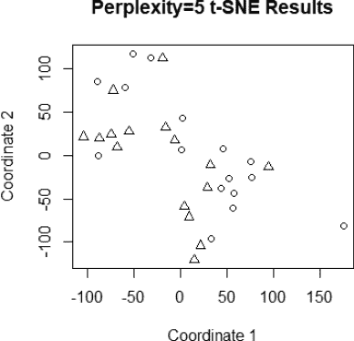
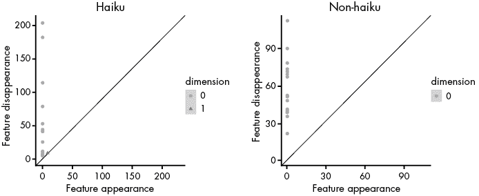
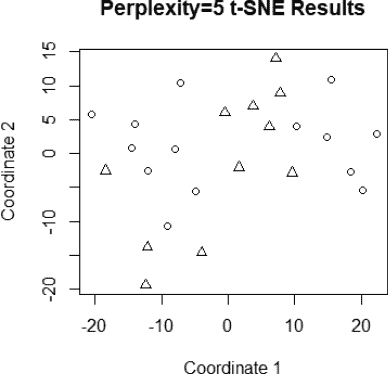

# 第十一章：期末项目：分析文本数据


在本章中，我们将通过一个与语言学和心理学相关的项目，将之前章节中开发的一些工具结合起来。如今，许多重要的数据项目都涉及文本数据，从文本匹配到聊天机器人，再到客户情感分析、作者身份辨识和语言学分析。我们将查看一个小型的语言学特征数据集，这些特征来自不同的创意写作样本，看看不同文体之间的语言使用如何变化；某些文体鼓励不同的写作过程，这反映出不同的作者思维方式，例如写个人散文和写即兴俳句的不同。

具体来说，我们将使用*k*-NN 和我们选择的距离度量来查看聚类重叠情况，然后通过降低数据集的维度来可视化特征空间，再使用 dgLARS 创建一个交叉验证模型，通过特征区分诗歌类型，最后基于语言嵌入检查一个预测模型。通过完成一个完整的项目，我们将看到这些工具如何结合在一起，从数据中得出洞察。

## 构建自然语言处理管道

在第一章中，我们简要讨论了文本数据的重要性以及自然语言处理（NLP）管道如何将文本数据转化为适合监督学习方法的模型特征。这就是我们即将进行的项目的方法。我们将使用 Python 将文本数据转化为特征，然后使用 R 来分析这些特征。

第一步是*解析*数据；我们需要将文本块拆分成更易处理的部分——可以是段落中的句子，也可以是句子中的单词和标点符号。这样我们就能分析小块文本，并将结果结合成一个句子、一个文档，甚至一组文档。例如，在本章中，你可能想要解析每个部分，然后是每个段落，最后是每个段落中的每个单词，以理解语言使用在引言材料和应用示例之间的变化。

有时，你可能需要去除标点符号、某些类型的填充词或词根的附加部分。*词根*排除了像*ing*这样的词尾，它会改变动词的时态或将某一词性转换为另一词性。考虑一下关于篮球练习中*dribble*、*dribbled*和*dribbling*的区别。如果控球后卫正在运球，动作正在发生。如果他们已经整个比赛都在运球，他们可能很累，并已经将球放回架子上。然而，控球后卫的动作，不论是过去还是现在，都是一样的。无论他们是现在做还是昨天做，都不重要。词干提取和词形还原是两种将词语分解为词根的方法：*词干提取*通过将词语简化为其词根来实现，不管词根是否仍然是一个有效的单词；*词形还原*则以确保词根仍然是一个单词的方式简化词语。

一旦文本解析达到你特定应用所需的程度，你就可以开始分析每一部分内容。*情感分析*旨在理解给定文本中的单词和短语背后的情感。例如，“糟糕的产品！！！永远不要买”与“有些用户可能不喜欢这款产品的味道”相比，语气明显更为负面。情感分析通过统计文本中每种情感的总数，量化文本中的情感，使每种情感得到一个分数，并可以将这些分数汇总为最终分数（如果需要的话）。

一旦解析完成，我们可以应用*命名实体识别*，该方法将单词与重要人物、地点或领域相关的术语列表进行匹配。例如，在处理与患者出院和结果相关的医学记录时，你可能希望将单词与诊断列表进行匹配。

在其他应用中，标注词性（包括代词、动词、介词、形容词等）可能非常重要。有些人可能使用某些词性比其他词性更多，理解这些模式可以揭示文本来源的个性、暂时的心态，甚至是诚实程度。对于某些 NLP 应用，可以将这些因素加载到给定的结果或一组结果中，从文本数据中创建全新的度量标准。

每种分析类型都可以作为附加特征集成到关系型数据库中，用于下游模型。例如，正如我们在本章后面将看到的，我们可以标注词性，按特定文档的长度进行标准化，然后将这些特征输入到模型中。你还可以将文档或一组文档中的单词向量化，以计算每个单词在给定文档的文档集中的频率。这通常是深度学习模型和可视化方法在 NLP 应用中之前的步骤。

同样，由于 R 相比于 Python 的 NLP 能力有限，我们已经在 Python 中完成了第一步——将文本数据解析成特征——并将结果文件提供给这本书。接下来，我们将使用 R 进行分析。我们使用了 Python 的 NLTK 工具包来解析文本数据，虽然这些步骤超出了本书的范畴，但我们已将脚本包含在我们的 Python 下载库中（[`nostarch.com/download/ShapeofData_PythonCode.zip`](https://nostarch.com/download/ShapeofData_PythonCode.zip)），并鼓励你下载原始数据，看看你是否能够构建类似的 NLP 管道。

## 项目：诗歌语言分析

现代诗歌包含了许多不同结构、文学手法和主题的诗篇。例如，形式诗歌，如十四行诗或维拉内尔诗歌，在每行中有规定的重音音节数和总音节数，并且有明确的押韵模式。这些类型的诗歌通常广泛使用其他文学手法，如典故或寓言（通过对比其他作品的思想），头韵或元音韵（某种声音的重复），或韵律（诗句中重音音节的模式）。这是一个形式诗歌的例子（十四行诗）：

> 从此以后
> 
> 她的玻璃鞋变成了他的 M-16，
> 
> 她那优雅的裙子变成了褪色的军装。
> 
> 他已不再是当初那个卷入他们阴谋中的人，
> 
> 他在远离王后的地方巡逻了五个月。
> 
> 灰烬化作宫殿，她的梦如今成了废墟，
> 
> 她看着她的马车变成了艾布拉姆斯坦克，
> 
> 仿佛她的童话是一个残酷的恶作剧。
> 
> 他喊道：“快点，伙计们！加速前进！”
> 
> 她的时钟敲响十二点，他的坦克成了简易爆炸装置，
> 
> 寡妇的女儿最终也成了寡妇。
> 
> 现在她只剩下回忆，变成了阴影，
> 
> 以安慰她那黑暗的痛苦日子。
> 
> 她的“从此以后”没有明天，
> 
> 留下灰姑娘的悲伤与忧愁。

相比之下，自由诗不要求每行的结尾有固定的押韵模式，行长可以不同（或者保持一致的长短），并且通常使用如韵律或押韵等文学手法来强调诗中的某些部分。这是一个行长较短的自由诗例子：

> 安雅
> 
> 瘦削，
> 
> 化妆过的，
> 
> 在高跟鞋中晃动
> 
> 太大了，穿不下她的小脚，
> 
> 高跟鞋
> 
> 那闪耀的光芒与撞击声
> 
> 对着冰冷的混凝土
> 
> 如同风
> 
> 抽动她挑弄过的头发
> 
> 像套索一样
> 
> 驯牛的绳索
> 
> 如雪花般飘落
> 
> 紧紧束缚着牛仔裤
> 
> 如同枷锁
> 
> 她穿着它，走上了通往香格里拉的船
> 
> 如街灯般
> 
> 她眼中闪烁着光芒，
> 
> 她凝视着
> 
> 今晚
> 
> 她的十五岁生日。

有些诗歌不太适合自由诗或形式诗，比如散文诗（其中不存在换行）或俳文（一种将散文诗与不同类型的俳句结合的日本形式）。现代俳句及其相关形式通过一个连接两个图像或思想的瞬间的破折号等转折来对比两个图像或思想。通常，现代俳句不符合日语的音节要求，但通常包含对季节和自然（或人性，对于相关形式 senryu）的某种参考。俳文通过诗歌标题、俳句和散文片段将一个故事编织在一起。以下是一个现代俳句的例子：

> 流星——
> 
> 破折号之间
> 
> 出生和死亡

从先前的研究中，我们知道不同的作者可以通过他们偏好的词汇选择和对不同词类的独特使用来识别（这是反抄袭软件的核心特征）；我们也知道语言使用会因作者的心境而异。然而，目前尚不清楚同一作者是否会根据他们所写的诗歌类型而构建不同的诗歌。由于俳句和俳文起源于对想法进行对比的灵感，不同类型的诗歌可能会影响诗歌中语言和语法的使用。

在开始可视化之前，让我们先深入了解一下数据集。数据集中包含八首俳句、八首俳文、八首自由诗和八首形式诗。我们将它们分为基于俳句的诗歌和其他诗歌，以简化按照诗歌通常生成的方式进行分析（自由联想与精心创作）。我们将考虑的特征包括标点符号比例、名词比例、动词比例、人称代词比例、形容词比例、副词比例和介词/连词比例。考虑到每种诗歌类型的构造，这些因素中的一些可能会有所不同。有了更多的诗歌样本，您可以使用其他词类或将动词等类别分解为其各个组成部分。

我们将在 Python 中完成这些步骤，因此我们只会概述使用的步骤，而不会深入到代码中。您可以在本书的文件中找到处理过的数据。

### 标记化文本数据

对诗歌进行分析的第一步是*标记化*文本数据，这意味着我们需要将诗歌解析为单词和标点符号。 Treebank 标记器使用正则表达式来解析句子中的单词，处理缩略词和其他单词和标点的组合，并拼接引号。这些是解析诗歌文本数据的重要步骤，因为标点符号与单词和短语交错出现的频率相对较高。特别是俳句倾向于使用标点符号来在诗歌中创建一个切口，连接两个不同的图像或想法。

由于 Treebank 分词器经常将缩写和其他与标点连接的词拆分，因此使用正则表达式分词器来统计文本中实际存在的单词数量并将它们解析成包含标点的单词是很有用的。考虑到一些诗歌的篇幅较短，我们希望确保不会夸大单词的统计数量。正则表达式分词器的结果为我们提供了一个准确的单词计数，从而可以规范化词性或标点符号的比例。

在获得分词器结果的长度后，我们可以通过从令牌的数量中减去单词的数量来推导出文本中的标点符号长度。这使我们能够比较不同诗歌类型中单词和标点符号的比例，这可能会根据诗歌类型（以及根据先前关于不同作者文本片段语言差异的研究）而有所不同。

### 词性标注

为了标注相关的词性，我们将使用*平均感知机标注器*，这是一种监督学习算法，通常在各种文本类型中具有相当高的准确性，并且已经为 NLTK 包进行了预训练。虽然它在处理大量文本时稍显缓慢，但我们的文本样本相对较小，允许应用程序在不需要大量计算资源的情况下标注单词。通过使用大数据技术，接下来的章节中我们将讨论如何将 NLTK 的平均感知机标注器应用于非常大的数据集。

我们将解析名词、动词、个人代词、副词、形容词、介词和连词，并统计每个文本样本中每个类别的数量。

名词包括单数、复数、普通名词和专有名词的组合。动词包括所有类型和时态的组合。个人代词包括代词和所有格代词。副词和形容词包括副词和形容词的比较级和最高级形式。介词和并列连词也被标注和统计。

平均感知机标注器中还存在一些其他标注的词性，其他标注器可能会包括更细致的词性划分。如果你希望探索如何利用词性来区分文本类型、文本作者或作者的群体特征，你可能需要使用其他标注器，或将名词、动词等从它们的各个成分中分解出来。然而，这将导致数据集中出现更多的列，因此如果你进行这种细致的文本属性和词性分析，建议收集更多样本。

### 向量规范化

由于我们的文本样本中包含一些短诗和一些长诗，具体取决于诗歌类型，我们需要在处理数据之前对词性计数进行标准化。我们的方法包括通过词汇计数（标点符号和单词计数总和）来规范化标点符号，并通过单词计数来规范化词性计数，这些都在本章的文件中进行了总结。这应该提供足够的特征，既能展示诗歌类型差异，又能提供良好的降维效果，帮助可视化我们的数据集。

对于更细致的处理方法，可以解析动词、名词等词性的类型，或者通过词性类别的分数分解来提取更多详细特征，进而为分析工程化更多的特征。如果你熟悉 Python，我们鼓励你在 NLP 流程中进行实验，并自定义你的分析，以获得对诗歌类型语言差异的更多洞察。

现在，让我们继续进行 R 中的分析。

## 在 R 中分析诗歌数据集

我们将从加载处理后的诗歌数据集开始，并使用 Listing 9-1 中的代码来探索我们衍生的特征。

```
#load poem data and set session seed
mydata<-read.csv("PoemData.csv")
summary(mydata)
```

Listing 9-1：读取处理后的诗歌数据的脚本

副词往往是出现频率最低的特征，占每首诗中使用词汇的比例为 0 到 10.5%。名词则是最常出现的词汇，占一首诗中 12.5%到 53.5%的比例。人称代词比较少见，超过四分之一的诗歌没有人称代词（这可能与俳句有关，俳句通常不使用人称代词）。标点符号的使用差异较大，从俳句中没有标点符号，到自由诗中的标点符号几乎占到一半（例如医院的诊断名单诗）。考虑到这种差异，可能我们有很好的特征可以用于分析。

让我们为分析设置随机种子，并使用 t-SNE 可视化词性特征，使用每个可视化点的形状来表示诗歌类型；请在 Listing 9-1 中添加以下代码：

```
#grab relevant pieces of data
mydata1<-mydata[,-1]
haiku<-which(mydata1$Type=="haiku")
mydata1$Type[haiku]<-1
mydata1$Type[-haiku]<-2
set.seed(1)

#create and plot t-SNE projections of poem data
library(dimRed)
t1<-getDimRedData(embed(mydata1[,-1],"tSNE",ndim=2,perplexity=5))
plot(as.data.frame(t1),xlab="Coordinate 1",ylab="Coordinate 2",main="Perplexity=5 t-SNE Results",pch=ifelse(mydata1$Type==1,1,2))
```



图 9-1：按诗歌类型展示的 t-SNE 特征图，类型通过圆圈或三角形表示（`perplexity=5`）

从 Figure 9-1 中的图表可以看出，我们的诗歌趋向于分成几个簇，其中大部分点属于相同类型。这意味着基于核的模型或最近邻模型可能足以根据特征对诗歌类型进行分类。

由于特征之间有一定的分离，我们很可能可以应用算法来对数据进行聚类，并使用监督学习来了解俳句类型诗歌与其他诗歌之间的差异。

让我们将样本分为训练集和测试集，然后应用基于欧几里得距离的*k*-NN 算法，基于每首诗的五个最近邻居来分类诗歌类型，代码继续添加：

```
#create Canberra KNN models with different distances and five nearest neighbors
library(knnGarden)
s<-sample(1:32,24)
train<-mydata1[s,]
test<-mydata1[-s,]
kc<-knnVCN(TrnX=train[,-1],OrigTrnG=train[,1],TstX=test[,-1],
K=5,method="euclidean")
```

由于我们的 t-SNE 图（图 9-1）表明一些分离和通常靠近相似类型诗歌的点，这个模型很可能工作良好。让我们通过这个代码的补充来检查我们测试集的预测和真实标签在*k*-NN 模型下：

```
#examine performance
which(kc==test$Type)
> **1, 2, 3, 4, 5, 6, 7, 8**
```

看起来这个模型正确分类了所有的测试诗歌，表明这是一个能够根据特征区分诗歌类型的高质量模型。

我们将进一步使用一个 10 折交叉验证的 dgLARS 模型来检查这些潜在的类型差异，作为我们代码的一个额外步骤：

```
#create a cross-validated dgLARS model
library(dglars)
dg1<-cvdglars(factor(Type)~.,data=mydata1,
family="binomial",control=list(nfold=10))
dg1
```

由于我们使用的是一个小数据集，可能会出现一个或多个折叠存在问题，导致模型与这里显示的结果略有不同：

```
#examine the dgLARS model
> **dg1**

Call:  cvdglars(formula=factor(Type) ~ .,family="binomial",data=mydata1,
    control=list(nfold=10))

Coefficients:
                   Estimate
Int.                -1.4782
Punctuation_Length   0.3113
Adverb_Count        -0.2767

dispersion parameter for binomial family taken to be 1

Details:
   number of non-zero estimates: 3
      cross-validation deviance: 2.687
                              g: 0.4573
                        n. fold: 10
```

您的模型应该显示标点符号分数和副词分数的差异。自由诗和形式诗的标点使用率更高。鉴于这些类型的诗更有可能使用完整句子而不是连接短语，标点使用的差异与预期的差异一致。

副词分数的差异并不如预期。然而，副词的使用与许多不同的瞬时和固定人格特征相关联。可能是俳句涉及到不同的瞬时情绪或特质，从而在副词使用中反映出风格上的差异。主题内容也可能影响这种差异。

重要的是，这个分析显示了同一作者在相同类型的写作样本中，词性和标点模式会有所变化（诗歌）。鉴于先前的研究表明，一些这些输入特征可以用来识别文本的可能作者，因此重新考虑基于词性分析的作者预测可能是明智的。不同的主题、不同类型的写作以及作者的不同生活阶段可能会影响词汇选择、句子结构和标点符号的使用。

为了看到每种诗歌类型内的诗歌是如何分组的，让我们通过添加到我们的代码中来可视化每种诗歌类型的持久图：

```
#create the Vietoris-Rips complexes
library(TDAstats)
set1<-mydata1[mydata1$Type==1,-1]
set2<-mydata1[mydata1$Type==2,-1]

#compute Manhattan distance for set 1, compute Rips diagram, and plot
mm1<-dist(set1,"manhattan",diag=T,upper=T)
d1<-calculate_homology(as.matrix(mm1),dim=1,threshold=0,format="cloud")
plot_persist(d1)

#compute Manhattan distance for set 2, compute Rips diagram, and plot
mm2<-dist(set2,"manhattan",diag=T,upper=T)
d2<-calculate_homology(as.matrix(mm2),dim=1,threshold=0,format="cloud")
plot_persist(d2)
```

图 9-2 显示了俳句和非俳句样本的持久图，突出了类型内诗歌聚类中的一些差异：



图 9-2：按诗歌类型分类的持久图

正如我们在图 9-2 中看到的，非俳句诗歌的聚类更为一致，而俳句诗歌则呈现出分散的状态，多个诗歌组合在一起时没有太多分隔。这表明，俳句的特征在每首诗歌之间有所不同，而非俳句诗歌的特征则显示出更多的一致性。创作的自发性可能导致俳句诗歌的诗歌结构更加多样化。与诗歌创作的自发性和创作过程中所花费的时间相关的数据，可能会揭示出单次创作时产生的诗歌（例如俳句）与那些有更多创作意图的诗歌之间，在语言使用上的差异。

## 使用基于拓扑的自然语言处理工具

自然语言处理（NLP）作为一个领域，在过去几年中已经发展了很多，NLP 中一些常用工具通过拓扑来解决重要问题。早期的嵌入工具倾向于统计文档中或跨文档的词频，将文本数据解析为适用于机器学习算法的数值数据。然而，单词通常并不包含足够的语义信息来理解一个句子、段落或整篇文档。否定词，如*no*或*not*，会修饰句子中的动作或行为者。例如，“她确实让他进了房子”在语义上与“她确实没有让他进房子”是完全不同的。根据你试图预测或分类的内容，从单个单词到数字矩阵的简单映射并不适用。

此外，一份文档或文档集可能包含超过 30,000 个至少出现一次的单词。最常见的单词通常会频繁出现，但它们的存在并不会增加多少价值。重要的单词可能只会出现一两次。这又引出了维度问题，当我们试图从数据中筛选出重要的趋势时。

幸运的是，近年来通过拓扑映射和特殊类型的神经网络，在低维嵌入方面取得了一些重大进展。*预训练的 transformer 模型*是能够通过其隐藏层正向和反向传递信息，从而为文本数据获取最佳拓扑映射的神经网络。预训练的 transformer 模型通过大规模训练集学习文本数据的低维嵌入，这些训练集通常来自于目标语言或多种语言的文本数据。*BERT*（双向编码器表示模型）及其基于句子的嵌入版本 *SBERT* 是两种常见的开源预训练 transformer 模型，用于将文本数据嵌入到低维的密集矩阵中，以供机器学习任务使用。BERT 模型可以扩展到目前不支持的语言，如豪萨语、林加拉语或鲁沙尼语的文本嵌入；这有潜力加速语言翻译服务并保护濒危语言。*GPT-3*，基于与 BERT 类似的前提进行训练，已经创建了能够准确翻译和生成聊天机器人的模型，这些模型可以从输入文本中解析含义，而不是仅仅匹配关键字或在机器学习算法中处理高维矩阵时消耗大量计算资源。

我们使用 Python 在诗歌数据集上构建了一个基于其严肃或幽默语气的 BERT 模型，以展示 BERT 嵌入如何与本书中的监督学习工具相契合。（请注意，通过数据清洗将诗歌顺序更改后，我们获取了 BERT 嵌入并将其传回到 *.csv* 文件中。）你可以参考 Python 的 transformer 包，了解更多关于如何导入和利用 BERT 模型进行文本嵌入的信息，或者查看本章的 Python 脚本（[`nostarch.com/download/ShapeofData_PythonCode.zip`](https://nostarch.com/download/ShapeofData_PythonCode.zip)）。不过，我们将继续将结果导入 R 并在较低维度中可视化数据，正如我们之前对诗歌语言特征的处理方式一样。让我们创建一个 t-SNE 嵌入并通过 清单 9-2 绘制图表。

```
#load poem data
#load data
mydata<-read.csv("BertSet.csv")

#create the embedding
library(dimRed)
t1<-getDimRedData(embed(mydata[,-1],"tSNE",ndim=2,perplexity=5))

#plot the results
plot(as.data.frame(t1),xlab="Coordinate 1",ylab="Coordinate 2",main="Perplexity=5 t-SNE Results",pch=ifelse(mydata$Type=="serious",1,2))
```

清单 9-2：一个加载 BERT 数据的脚本，用于处理严肃和幽默的诗歌，使用 t-SNE 嵌入数据并绘制结果

图 9-3 展示了嵌入结果，表明诗歌根据类型分成不同的簇。这与我们在图 9-1 中看到的“俳句与非俳句诗歌”结果相呼应，那里我们看到了特征在 t-SNE 嵌入中按类型分离。这再次表明，机器学习分类器应该能很好地处理我们的数据集。



图 9-3：t-SNE 嵌入结果的图表，严肃或幽默类型的诗歌分别用圆圈和三角形表示（`perplexity=5`）

现在我们知道机器学习模型可能在分类此数据方面表现良好，让我们通过添加 Listing 9-3 来拟合一个带有同伦延续的 Lasso 模型，以处理小样本问题：

```
#get training data split
set.seed(1)
s<-sample(1:25,0.85*25)
train<-mydata[s,]
test<-mydata[-s,]

#build Lasso model
library(lasso2)
etastart<-NULL
las1<-gl1ce(factor(Type)~.,train,family=binomial(link=probit),bound=5,standardize=F)
lpred1<-round(predict(las1,test,type="response"))

#examine results
lpred1
**>** **1 1 1 0 1**
test$Type
**>** **[1] serious serious humor serious**
```

Listing 9-3：一个脚本，加载用于严肃和幽默诗歌的 BERT 数据，将数据拆分为训练集和测试集，构建带有同伦延续拟合的 Lasso 模型，并显示测试数据的预测值和实际值。

数据集包含 384 个来自嵌入 BERT 模型的组件和 25 首诗。你使用的 R 版本可能会不同地拆分数据并拟合模型，但在我们使用的 R 版本中，测试数据包含三首严肃的诗歌，接着是一首幽默的诗，再接着是一首严肃的诗。模型预测为一首严肃诗、一首严肃诗、一首严肃诗、一首幽默诗和一首严肃诗（模型准确率为 100％）。考虑到训练集相比于输入到模型中的 384 个预测变量来说是如此之小，这是一个非常出色的表现。请注意，所选特征在语义上意义不大，因为它们只是嵌入。将基于拓扑的方法结合到管道中以处理和建模小数据集，可以在其他模型完全失败的情况下提供不错的预测。

## 总结

本章中，我们应用了本书中概述的几种方法，处理了一个涉及从 NLP 处理的诗歌中提取特征的数据集的语言学问题；我们还对数据进行了嵌入，并创建了一个模型来预测诗歌集中的语气差异。

对于第一个问题，我们通过降低数据集的维度来可视化群体差异，应用了两个监督学习模型来理解分类准确性以及区分诗歌类型的重要特征，并可视化了两组诗歌中存在的拓扑特征。这让我们发现，语言使用，特别是标点符号，在不同的诗歌类型中有所不同。

接着，我们研究了上下文感知嵌入，并使用基于拓扑的嵌入方法和基于拓扑的分类模型来预测我们的诗歌集的语气，这表明我们可以通过构建一个包含 384 个嵌入组件和 21 首诗的训练集来获得相当准确的预测。

在下一章中，我们将通过探讨如何通过分布式计算和量子计算方法来扩展拓扑数据分析算法，来为本书做一个总结。
