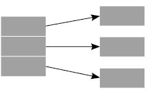
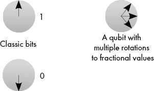
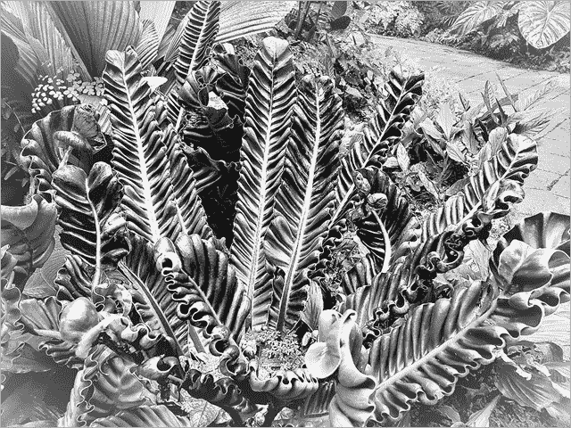

# 多核与量子计算


在前几章中，我们概述了许多来自几何和拓扑学领域的工具。我们看到了这些算法如何影响网络分析、自然语言处理、监督学习、时间序列分析、可视化以及无监督学习。还有许多更多根植于拓扑学的算法，包括改进现有模型（如卷积神经网络或递归神经网络）的混合算法，这一领域有潜力为机器学习领域贡献成千上万的算法。

然而，拓扑学和几何学机器学习算法开发和应用中的一个主要问题是计算成本。虽然大多数情况下不会出现问题，但计算某些网络度量可以扩展到一百万或十亿（甚至更多！）的网络规模。其他类算法，如持久同调或流形学习，则扩展性较差；有些算法在标准笔记本电脑上大约 20,000 行数据时就会遇到问题。对于大规模数据集，计算距离矩阵也需要大量的时间和计算资源。

然而，对于希望扩展这些方法的实践者来说，有几个潜在的选择。在本章中，我们将回顾多核方法和量子计算解决方案。本章中提出的解决方案仍处于初期阶段，随着本书中的算法被采纳为大数据算法，可能会开发出标准的软件包用于量子拓扑数据分析（TDA）算法和分布式 TDA 算法。

## 多核方法在拓扑数据分析中的应用

一种算法扩展方法是将数据的不同部分映射到不同的计算核心或系统，在每个核心的数据上同时计算所需的量，并将每个核心的数据量计算结果重新组合成一个单一的数据集。例如，假设我们想计算一个百万顶点网络中每个顶点的介数中心性。即使这是一个稀疏网络，边缘不多，每次计算介数中心性仍然需要很长时间。然而，如果我们有百万个核心，我们可以将网络映射到每个核心，并用每个核心计算网络中一个顶点的介数中心性。虽然计算时间可能依然很长，但计算所有一百万个顶点的介数中心性所需的总时间会远少于依次计算每个介数中心性（如我们在前几章对较小网络所做的那样）。虽然对于大多数组织来说，百万个核心是不可能的，但 10 个核心或 30 个核心所带来的时间节省可以显著加速计算。

也可以将数据集的部分内容映射到每个核心，来计算某种度量。例如，假设我们有一个包含 30 万人完成的在线客户调查的数据集。计算这 30 万人回答之间的距离会消耗大量计算资源。然而，距离矩阵在许多流形学习和拓扑数据分析算法中是必要的；因此，找到一种更快的方法来计算这些矩阵是很有意义的。我们可以将数据的不同部分映射到不同的核心，来计算更小的距离矩阵，这些矩阵在每个核心计算完之后可以组合成完整的 30 万乘 30 万的距离矩阵。同样，我们将看到显著的时间节省。

一般来说，这些多核方法属于*分布式计算*的范畴，在这种方式下，多个核心被用来计算问题的各个部分，当所有核心计算出它们的解决方案时，这些部分会被组合起来。大多数云计算资源都支持分布式计算，一些可以在云上运行的 R 和 Python 包也支持分布式计算选项。然而，通常是由机器学习或数据工程师来定义算法中的分布式计算步骤。图 10-1 展示了数据如何被解析并发送到不同核心的一个简单示例。



图 10-1：数据的三个部分映射到三个核心，这些核心将在机器学习流程中执行数学或算法步骤

在图 10-1 中，我们将数据集划分为三部分，分别映射到三个核心，以计算我们需要的量。在一个简单的大数据案例中，这可能涉及到计算数据集每一列中的最小值和最大值。然后，我们会计算跨核心的最小值和最大值，保存该值，并输出完整数据集中每一列的最小值和最大值。如果数据集只有几百万行，这可能帮助不大，但如果我们处理的是万亿行数据，这将大大加速计算过程。

多核方法在网络算法中效果很好，例如在第二章到第四章中遇到的那些算法，它们在持久同调和离散外微积分方面也取得了一些成功。只要问题是局部性质的，或者可以在某些步骤中将问题分解为更小的部分，多核方法都是可行的。例如，在机器人路径规划的同伦算法中，我们可以将绕过障碍物的潜在路径分开，并计算每条路径的某些最优值。

不幸的是，目前在 R 或 Python 中很少存在此书中算法的多核版本。然而，这是一个正在积极探索的领域，如果你熟悉大数据平台上的多核框架，鼓励你尝试将这种方法应用于持久同调、流形学习或其他基于几何的算法。

## 量子计算方法

扩展基于几何的算法的另一种方法是将它们实现到一种可以本地利用分布式计算的不同类型的计算机上。*量子计算*是一个最近的流行词，尽管即使在数据科学和软件工程领域，围绕这一领域仍然充满神秘和误解。尽管进展比预期的要快，但该技术仍处于早期阶段，当前系统存在显著的限制，许多公司正投入资金进行硬件研究和开发。然而，一些网络算法已经存在，网络科学是机器学习中最有可能从量子计算中受益的领域之一。在本节中，我们将介绍一些量子计算的基础知识，并列出截至 2023 年与图论和网络科学相关的一些量子算法。

首先，量子计算硬件可以采用几种不同的形式，每种形式都有其优缺点。计算机中的电路类型决定了可以在机器上开发何种算法，而某些类型的电路更适合进行网络分析。目前，两个硬件类型似乎是大多数研究和开发的重点，它们也将是本讨论的重点。

当前的系统有许多限制，包括需要冷却电路、由于量子尺度的效应（穿越能量障碍、相互作用粒子产生的场等），以及量子比特固有的随机误差。尽管如此，研究人员已经能够通过现有的量子计算机和 Python 中的模拟包，探索潜在的新算法和现有算法的量子版本。特别是图论和网络算法似乎非常适合量子计算，而同时通过量子比特搜索组合学解法的能力表明，当量子计算扩展到更大电路时，网络科学将迎来一次飞跃。

### 使用基于量子比特的模型

我们将从最类似经典计算机的量子硬件版本开始：*基于量子比特的模型*，它用量子版本的比特——*量子比特*——替代经典比特，量子比特是经典电路中 0 和 1 比特的量子版本。量子比特与经典比特不同，它们在某一时刻不仅能取 0 或 1 的值，而是可以同时处于 1 和 0 状态，直到量子比特被观察（此时它会塌缩为 0 或 1 状态）。此外，量子比特还可以通过计算门进行旋转，从而取到分数值。这意味着量子比特可以存在于多种不同的状态，并且可以通过量子门演化成最终的优化状态。这样，它们非常灵活。图 10-2 显示了比特和量子比特之间的差异。



图 10-2：比较经典比特与量子比特的图表

让我们快速浏览一下两种主要使用量子比特的硬件类型。如果你不理解这里的每个术语也不用担心，只要记住整体思路即可。两种芯片组使用量子比特。它们都依赖量子比特的量子原理（如叠加）来加速计算和提高精度。第一种是*基于门电路*，它类似于经典硬件，其中门操作作用于量子比特的状态（例如旋转门）。基于门的电路是最常见的，IBM 和 Rigetti 的机器就是例子；通常，基于门的算法能加速算法并提供便于基准测试的算法。另一种选择是目前 D-Wave 机器上使用的量子退火（通过磁场变化作用于量子比特状态，而不是通过门操作量子比特）。这种方法依赖物理加热和冷却过程。通常，与基于门的量子硬件相比，这种系统的性能和精度保证较少。

### 使用基于 Qumodes 的模型

除了量子比特模型，另一个主流模型是*基于量子模式的*电路模型，它是由加拿大公司 Xanadu 开发的基于光子的电路。当前，基于光子计算的软件和算法——它用光子代替量子比特——仅是机器的模拟，但这种模拟使得一些有趣的应用得以开发。这种电路使用波函数作为替代量子比特（量子比特在被测量时会塌缩为 1 或 0），波函数是连续分布的。波函数可以被压缩、映射，或通过其他几何变换进行操作，而不会塌缩成 1 或 0。这个计算机尚不存在，但已有相似的 Python 模拟程序（截至 2023 年），与量子比特电路的模拟程序类似。

### 使用量子网络算法

存在几种与图的性质相关的量子网络科学算法。团体查找算法在网络科学中尤为有用，量子团体查找算法已经存在。最大团算法似乎在它们被测试的非常小的 problém 中享受加速。

量子算法的一个重要警告是它们的概率性质。与其说得到一个输出中的团体列表，不如说量子算法会多次运行，创建团体列表的数组，这些数组可以合并为网络中团体存在的概率分数。这对于优先考虑项目的后续部分中的团体，或在一个非常大的网络中聚焦于最感兴趣的团体是有帮助的，尽管后者将需要比现有技术更大的电路。

量子最大流和最小割算法也存在；这些算法旨在将图划分为具有尽可能少割的社区，从而最大化图上的信息流。到目前为止，应用主要探索了重要性评分的用途，以根据对图结构和通信潜力的影响对边和顶点进行排名。它们在稀疏图中显示出一些潜力，并为推导重要性评分提供了一个概率框架。

确实存在使用 R 包 QuantumOps 的基本量子最大流和最小割算法，但该能力仅限于小型稀疏图。采用量子比特方法时，问题首先被转换为*量子近似优化算法*，或 *QAOA*。QAOA 公式是一种组合算法，依赖于量子比特状态的叠加和称为*单位算符*的东西来解决优化问题。单位算符是一种具有特殊属性的线性代数算符，能够很好地与量子比特电路的底层量子力学相匹配。由于解的概率性质，最好多次运行该算法以获得更精确的答案。在这种情况下，我们将运行算法 10 次（这是一个足够大的任意数字，可以生成具有概率解的可用结果），并通过使用列表 10-1 中的脚本，进一步探索该功能，脚本会重新加载来自列表 4-1 的图 1。

```
#load QuantumOps package
library(QuantumOps)

#transform Graph 1 from Listing 4-1 to unweighted graph
mydata1<-as.matrix(read.csv("Graph1w.csv",header=F))
mydata1[mydata1>0]<-1

#run the quantum approximation optimization algorithm maximum cut algorithm
q<-QAOA_maxcut(mydata1,p=10)

#explore the results
q
```

列表 10-1：在第四章首次看到的图 1 上运行 maxcut 算法 10 次

请注意，这个算法的输出包含 2⁷ 个项目，而我们的原始图包含六个顶点。通常，这种版本的量子最大割算法会在输出中包含 2^(^(+n)^(+1)) 个项目，并且问题会扩展到更大的图。该算法的输出也是原始格式的，用户需要将输出转换为最可能的割。几个现有的 Python 包提供了更可用的输出，但此包为您提供了一种在 R 中探索一些基于量子比特的计算模拟的方式。

除了最大流和最小割算法之外，还有量子版本的随机游走算法，并且有可能基于这些算法构建社区发现算法或类似 PageRank 的算法。事实上，过去几年已经提出并在理论上研究了一些量子 PageRank 算法。然而，这类应用在实践中尚未得到广泛探索。但它为未来网络科学的进一步研究和潜在应用提供了一个途径。

与网络科学关系较少但更贴近图论的其他示例包括图着色算法和专注于测试图属性（如同构性和连通性）的算法。量子图查询和量子版本的 Dijkstra 算法或其他最短路径算法仍处于初级阶段，但它们在量子图论算法和量子网络科学算法的未来中展现出潜力。

尽管量子计算是一项新兴技术，但图论和网络科学已经看到了量子算法的潜在收益，未来可能会开发出更多的算法。目前，现有的算法通常是在 Python 中运行，但随着越来越多的公司开发量子计算机并为研究人员提供访问接口，未来很可能会出现新的量子计算机接口。

### 使用量子计算加速算法

大多数算法目前还没有可用的量子计算或模拟量子计算软件包。然而，可以利用量子计算和模拟量子计算软件包中已有的基本数学工具，逐步构建本书中提到的算法。R 软件包 QuantumOps 提供了一些这样的工具供我们探索，因此，让我们深入了解量子系统中基本数学计算的一个示例。请注意，此软件包仅模拟将在量子计算机上运行的算法，因此，在你的经典笔记本上看到的加速效果并不等同于在真实量子计算机上运行时的效果。然而，下面的示例将展示量子算法是如何被开发以在量子计算机上运行，从而在问题复杂度增加时加速计算，解决需要大量计算力的问题。

有许多算法可以找到两个数字之间的最大公约数，并且可以在量子计算框架内实现这一点。*最大公约数*是指能够同时整除这两个数字的最大数字；例如，能够同时整除 12 和 20 的最大数字是 4。我们可以将 12 分解为它的因数（1、2、3、4、6、12），将 20 分解为它的因数（1、2、4、5、10、20）。然后我们可以看到，4 是两个因数集中的最大共同元素。当数字较小时，这对我们来说是一个简单的手工计算问题；然而，在许多加密应用中，待因式分解或判定为质数的数字可能涉及 12 位或更多的数字。因式分解这些数字需要计算机的帮助。

`gcd()`函数在 QuantumOps 中找到两个数字之间的最大公约数，就像它们在量子计算机上被计算的方式一样。让我们用 12 和 20 作为输入数字，尝试一下这个例子，并看看`gcd()`函数是如何工作的；请参见列表 10-2。

```
#load QuantumOps package
library(QuantumOps)

gcd(12,20)
```

列表 10-2：找到 12 和 20 的最大公约数

你应该从列表 10-2 的代码输出中看到`4`，这对应于我们手工找到的 12 和 20 的最大公约数。这个函数可以计算远大于手工计算范围的公共约数。让我们输入两个新的更大的数字（比如，14,267 和 11,345），通过修改列表 10-2 中的`gcd()`函数来找到它们的最大公约数：

```
gcd(14267,11345)
```

根据我们的输出，这两个数字之间的最大公约数是 1。虽然这两个数字都不是质数，但它们没有共同的因数。对于这样大的数字，这个算法运行得很快，如果你对因式分解算法在网络安全中的应用感兴趣，建议你尝试在你应用中使用的规模上的数字，以进一步探索这个函数及其能力。在量子系统上，运行这个算法以处理更大的数字在合理的计算时间内是可能的。这意味着，一旦量子计算超越研究领域变得更加普及，基于因式分解的安全算法将无法有效运行。

QuantumOps 包并不包含一些更高级的数学工具，而这些工具是算法构建的基础，但它可以定义点积、范数以及其他对距离度量设计至关重要的线性代数工具，还可以定义机器学习任务中常见的其他线性代数工具。在真实的量子计算机上，我们能够更快速地运行算法，并处理比我们目前考虑的问题要大的许多倍。然而，QuantumOps 包使我们能够探索一些量子计算机上进行的量子算法研究中存在的内容。

### 在量子计算机上使用图像分类器

当前机器学习中的热门话题之一是*图像分类*，即利用机器学习根据给定的类别标签对输入图像进行分类。通常，你会拥有一组带有类别标签的图像，可以用来训练机器学习算法，识别出表明图像属于某个类别的特征（如颜色、线条、圆形或更复杂的模式）。例如，考虑标记某些植物或动物种类的问题，基于图片，这些图片可能包含或不包含我们希望自动标记的一个或多个类别。请看图 10-3，它展示了一棵炮弹树的开花部分。


图 10-3：一张费尔柴尔德热带花园中盛开的炮弹树的图片（原产于中美洲和南美洲）

现在请看图 10-4，它展示了一只大象。


图 10-4：一张大象在南非克鲁格国家公园的路上行走的图片

对这些图像进行分类有很多挑战。例如在图 10-3 中，我们看不到整棵树（这使得它难以被识别为树，而不是灌木或藤蔓），而且树正在开花（这意味着其他炮弹树的照片可能没有花）。在图 10-4 中，大象正朝着远离摄像头的方向走（这意味着没有动物面部），图像应用了镜头滤镜（改变了自然颜色），而且图像中包含了其他类型的事物（如植物、道路等）。大多数现实世界中的图像集并不会包含只有目标类别的完整图像，且颜色方案一致（想想你在谷歌图片搜索“猫”时出现的所有猫的图片）。一个好的分类器需要能够对不同光照下、图像中包含其他物体的不同类型的猫进行泛化。

我们可能还会面临用于训练算法的图像集中的类别不平衡问题。我们可能有大量的兰花、郁金香、美洲豹和袋鼠的照片，但我们可能只有相对较少的黑色蝙蝠花、加蓬眼镜蛇或非洲矮锯鲨的照片。例如，我们可能会遇到一种全新的植物，这种植物在自然界中不存在，或者是罕见的植物或花卉，许多图片并不存在，例如图 10-5 中展示的杂交品种。



图 10-5：一张在费尔柴尔德热带花园拍摄的基因工程新植物物种的图片

通常，图像分类算法涉及预训练的或自定义构建的卷积神经网络（CNN），这些在第一章中有讨论。简单回顾一下，卷积神经网络（CNNs）是一种深度学习算法，通过优化从输入图像层到多个不同类型的层，再到包含类别标签的输出层的映射，来寻找相关特征。在 CNN 架构中，某些层会在图像类别中找到显著特征，这些特征会在其他层中汇聚，这些层从前一层中找到最佳特征集并将其输入到下一层的特征提取层。通常，这些架构涉及多个层，而且通常需要大量的训练数据才能表现良好。此外，它们还需要大量的计算能力。

由于量子计算为许多算法提供了更快的运行时间，并且能够利用叠加态来扩展搜索能力，深度学习算法（如 CNN）与量子计算的结合提供了一种协同效应，能够更快速且使用更少的输入数据来找到相关特征。在许多现实应用中，我们并不能访问每一张在 Google 搜索中出现的图像。我们可能只有几百张关于罕见病症的医学图像，或者没有足够的计算能力来优化包含成千上万张蛇类图片的动物图像集，这些蛇类可能对发展中国家的农民或村庄构成威胁。

然而，到 2023 年为止，许多量子神经网络算法已经存在，且许多算法在图像分类等问题上显示出了竞争力的表现（尽管考虑到当前量子计算机的量子比特数量限制，扩展仍然是一个问题）。我们将探讨一个最近在南非开发的量子神经网络，它与 CNN 类似，用于处理图像分类问题，这就是 QuantumOps 包中用于一般用途和著名图像分析基准数据集的电路中心量子分类器。

电路中心量子分类器的细节有些物理学内容较重。如果你没有完全跟上也没关系；我们将在本节后续看到它的实际应用。

以电路为中心的量子分类器的基本方法是通过监督学习来学习电路的量子门参数，类似于在深度学习算法中拟合隐藏的神经网络层参数。独立变量被编码成量子系统的幅度，这些幅度会通过量子门进行操作。这些单比特和双比特量子门通过单比特测量来优化，测量会将系统从叠加态坍缩为单一态。通过多次运行算法来学习梯度，类似于本章前面提到的量子最小割和最大流算法的方法。与深度学习算法一样，我们使用丢弃正则化（dropout）分数，这会在每次迭代中修剪并添加到电路中。最终结果是一个优化过的量子架构，它通过修改独立变量集来创建基于训练集的独立变量和因变量的高质量建议标签。

虽然量子算子如何训练算法的具体细节超出了本书的范围，但该算法本质上是通过量子电路修改处理独立变量的量子物理规律，从而准确预测因变量。这种方法的一个优势是，相较于卷积神经网络（CNNs），神经网络架构和训练过程中所需的参数更少，能够加速拟合过程，并避免在架构设计中需要深入的专业知识，从而得到一个适合问题的架构。

我们将要探讨的数据来自于最常见的图像分析基准数据集之一。MNIST 数据集包含了成千上万张手写数字（0–9）的图片。这些图片分别从 250 位和 500 位书写者的集合中收集，并合并成一个数据集。由于不同的人和不同的文化有不同的书写数字方式（例如，在欧洲某些地区为了区分 1 和 7，会在 7 上加斜线），而且不同的人书写时也常常有不同的倾斜角度（右倾、左倾、正中、向下、向上、直立等），因此，判断图像中是哪一个数字，实际上比表面看起来要更具挑战性。

让我们通过一个示例来详细了解如何将这个以电路为中心的量子分类器应用到 QuantumOps 中，并用于识别 MNIST 数据集中的单个数字，参考示例 10-3。

```
#load QuantumOps package
library(QuantumOps)

QuantumMNIST256Classifier(matrix(sample(256,replace=TRUE),nrow=1),array(1),0,1,1,.001,1,"test")
```

示例 10-3：训练量子分类器以识别数字 0

Listing 10-3 创建了一个图像样本，其中目标类别设置为数字 0（即分类 0 与任何其他数字），学习参数为 1，每次迭代没有学习率衰减，偏置较低（允许其他参数更新得更快），并且只有一次训练迭代。根据你的机器，运行可能需要一些时间，因为该算法正在模拟一个量子系统；甚至可能需要更强大的计算能力。使用 CNN 时，我们需要与网络相关的更多参数（更不用说需要调整架构以适应隐藏层的数量和类型），更多的训练时间，以及更多的计算能力。使用这段代码，我们优化了 33 个量子门并找到了整个优化后的分类器电路矩阵。这代表了量子架构，能够解析手写数字 0 与其他数字的区别。我们可以重复这个过程，直到为 MNIST 中的每个数字类找到量子分类器。在实际的量子计算机上，这个实现会更快，因为电路不需要在经典电路上进行模拟。

虽然量子神经网络的其他版本已经存在，但大多数还没有开源实现。我们鼓励你探索现有的论文，并尝试在现有的量子系统上实现量子神经网络的可能实现。大多数量子计算公司都提供与学术界和工业界研究人员的合作伙伴关系，以加速量子算法设计进展，如果你可以访问量子计算机，你可以在真实的量子计算机上运行本章的算法（以及其他模拟的包），从而利用计算速度的提升。

## 总结

在本章中，我们探讨了分布式计算解决方案来扩展算法，例如我们的计算密集型网络和 TDA 算法。我们还介绍了量子计算框架，模拟了一个用于寻找最小流和最大割解的量子图算法，运行了量子最大公约数算法的模拟，并探索了一个模拟的量子分类器，灵感来源于 CNN，用来探索量子计算的潜力。随着量子计算机的规模扩大并且越来越多的研究人员和行业数据科学家可以使用它们，你未来可能会有机会在实际系统上实施这些类型的算法，这将比经典算法提供更好的性能。

鉴于当前电路设计的进展，未来可能会开发其他解决方案，帮助扩展本书中的算法，这些算法在现有计算基础设施下在大数据处理上存在困难，我们希望扩展算法的工具能够加速几何和拓扑领域新工具的发展。拓扑数据分析领域正在迅速发展。该领域的更多研究可能会导致新算法的出现，解决机器学习和数据分析中的一般性或特定问题。
