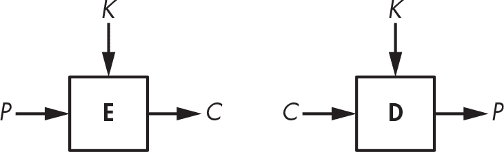
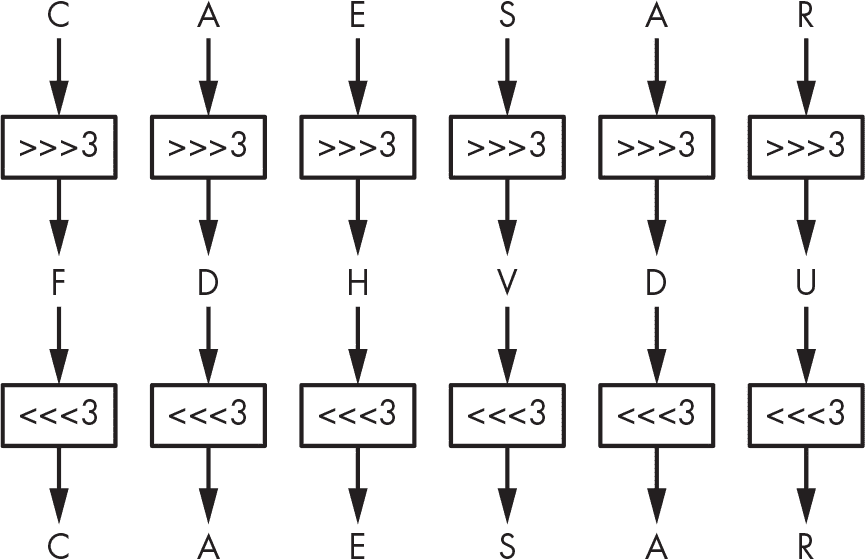
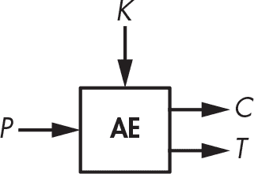
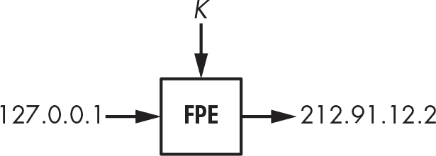
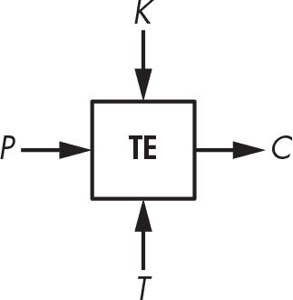

<hgroup>

## <samp class="SANS_Futura_Std_Bold_Condensed_B_11">1</samp> <samp class="SANS_Dogma_OT_Bold_B_11">加密</samp>

</hgroup>

加密是密码学的主要应用，它使得数据变得不可理解，以确保其*机密性*。加密使用一种叫做*密码算法*的算法和一个称为*密钥*的秘密值。如果你不知道这个秘密密钥，就无法解密，也无法获取任何加密消息中的信息——攻击者也是如此。

本章重点介绍对称加密，这是最简单的加密方式。在*对称加密*中，解密密钥与加密密钥相同（与*非对称加密*或*公钥加密*不同，后者的密钥是不同的）。你将从学习最简单的对称加密方法开始，这些经典密码仅能抵御最不懂密码学的攻击者，然后我们将继续学习最强的对称加密方法，它们能保证永久的安全。

### <samp class="SANS_Futura_Std_Bold_B_11">基础知识</samp>

在加密消息时，*明文*指的是未加密的消息，*密文*指的是加密后的消息。因此，密码算法由两个功能组成：*加密*将明文转化为密文，*解密*将密文转回明文。但我们通常会说“密码”时，实际上是指“加密”。例如，图 1-1 展示了一个密码**E**，它接收明文*P*和密钥*K*作为输入，并输出密文*C*。我会将这个关系写作 *C* = **E**(*K*, *P*)。类似地，当密码处于解密模式时，我会写作 **D**(*K*, *C*)。

<samp class="SANS_Futura_Std_Book_Oblique_I_11">图 1-1：基本加密与解密</samp>

> <samp class="SANS_Dogma_OT_Bold_B_15">注意</samp>

*对于某些密码算法，密文与明文的大小相同；对于其他算法，密文会稍微长一些。但密文永远不可能比明文短。*

### <samp class="SANS_Futura_Std_Bold_B_11">经典密码</samp>

经典密码出现在计算机之前，因此它们作用于字母而非比特，这使得它们比现代密码算法（如数据加密标准）要简单得多。例如，在古罗马或第一次世界大战期间，你无法利用计算机芯片的能力来加密一条信息；你只能用笔和纸来完成一切。经典密码有很多种，但最著名的有凯撒密码和维吉尼亚密码。

#### <samp class="SANS_Futura_Std_Bold_Condensed_Oblique_BI_11">凯撒密码</samp>

凯撒密码之所以得名，是因为罗马历史学家苏托尼乌斯报告说尤利乌斯·凯撒使用了它。它通过将每个字母在字母表中向下移动三个位置来加密信息，如果位移到达*Z*，则会回绕到*A*。例如，*ZOO*加密为*CRR*，*FDHVDU*解密为*CAESAR*，等等，如图 1-2 所示。数字 3 并没有什么特别之处；它只是比 11 或 23 更容易在脑海中计算。

<samp class="SANS_Futura_Std_Book_Oblique_I_11">图 1-2：凯撒密码</samp>

凯撒密码非常容易破解：要解密一个给定的密文，只需将字母向回移位三个位置，就能恢复明文。话虽如此，凯撒密码在克拉苏斯和西塞罗时代可能足够强大。因为它没有涉及任何秘密密钥（始终是 3），凯撒密码的用户假设攻击者是文盲或太缺乏教育以至于无法破解——而这种假设今天显然不再现实。（事实上，在 2006 年，意大利警方破译了用凯撒密码变种加密的纸条，成功逮捕了一名黑帮头目。例如，*ABC*被加密为 456，而不是*DEF*。）

凯撒密码能否变得更加安全？你可能会想象一种版本，使用一个秘密的位移值，而不是始终使用 3，但这也帮助不大，因为攻击者可以尝试所有 25 个可能的位移值，直到解密出的消息有意义为止。

#### <samp class="SANS_Futura_Std_Bold_Condensed_Oblique_BI_11">维吉尼亚密码</samp>

大约花费了 1500 年，凯撒密码才在 16 世纪通过意大利人 Giovan Battista Bellaso 的创造得到了有意义的改进，变成了维吉尼亚密码。*维吉尼亚*这个名字来源于法国人布莱兹·德·维吉尼亚，他在 16 世纪发明了另一种密码，但由于历史上的错误归因，维吉尼亚的名字最终被使用了。尽管如此，维吉尼亚密码还是变得非常流行，后来在美国内战中被南方联邦军使用，并且在第一次世界大战期间也被瑞士军队使用，等等。

维吉尼亚密码与凯撒密码类似，不同之处在于字母的位移不是固定的 3 个位置，而是由一个*密钥*定义的值，密钥是由表示字母位置的字母集合构成，表示数字。例如，如果密钥是 DUH，明文中的字母会按照 3、20、7 的值进行位移，因为*D*是比*A*多 3 个字母，*U*是比*A*多 20 个字母，*H*是比*A*多 7 个字母。3、20、7 的模式会一直重复，直到加密整个明文。例如，使用 DUH 作为密钥，*CRYPTO*会加密为*FLFSNV*：*C*被移位 3 个位置变成*F*，*R*被移位 20 个位置变成*L*，依此类推。图 1-3 展示了加密句子*THEY DRINK THE TEA*时的原理。

<samp class="SANS_Futura_Std_Book_Oblique_I_11">图 1-3：维吉尼亚密码</samp>

维吉尼亚密码显然比凯撒密码更安全，但它仍然相对容易破解。解密的第一步是找出密钥的长度。以图 1-3 中的例子为例，*THEY DRINK THE TEA*被加密为*WBLBXYLHRWBLWYH*，密钥为 DUH。（通常会去除空格以隐藏单词边界。）请注意，在密文*WBLBXYLHRWBLWYH*中，字母组*WBL*在密文中每隔九个字母就出现一次。这表明相同的三字母单词使用相同的移位值进行了加密，每次都会生成*WBL*。密码分析员可以推测密钥的长度是九，或者是可以整除九的值（即三）。此外，他们还可以猜测这个重复的三字母单词是*THE*，从而确定 DUH 是一个可能的加密密钥。

破解维吉尼亚密码的第二步是使用一种叫做*频率分析*的方法来确定实际的密钥，这种方法利用了语言中字母分布的不均匀性。例如，在英语中，*E*是最常见的字母，因此如果你发现*X*是密文中最常见的字母，那么这个位置最可能的明文值就是*E*。

尽管相对较弱，维吉尼亚密码在其时代可能足以安全地加密消息。频率分析的局限性在于它需要几个句子，这意味着如果密码用来加密短消息，它就无法奏效。而且，大多数消息只需要在短时间内保密，因此即使密文最终被敌人解密，也没有太大问题。（19 世纪的密码学家奥古斯特·凯尔科夫斯估计，大多数加密的战时消息只需要保密三到四个小时。）

### <samp class="SANS_Futura_Std_Bold_B_11">密码的工作原理</samp>

基于简单的凯撒密码和维吉尼亚密码，我们可以尝试通过识别密码的两个主要组成部分：排列和运作模式，来抽象出密码的工作原理。*排列*是一种函数，它将一个项（在加密学中，指的是一个字母或一组比特）转换，使得每个项都有一个唯一的逆（例如，凯撒密码中的三字母移位）。*运作模式*是一个算法，它利用排列来处理任意大小的消息。凯撒密码的运作模式是微不足道的——它只是对每个字母重复相同的排列——但正如你所看到的，维吉尼亚密码有一个更复杂的模式，其中不同位置的字母会经历不同的排列。

在接下来的章节中，我将更详细地讨论这些组成部分是什么，以及它们与密码安全的关系。我会使用每个组成部分来展示为什么经典的密码注定是不安全的，而不像现代密码那样可以在高速计算机上运行。

#### <samp class="SANS_Futura_Std_Bold_Condensed_Oblique_BI_11">排列</samp>

大多数经典密码都是通过将每个字母替换为另一个字母来工作的——换句话说，通过执行 *替代*。在凯撒密码和维吉尼亚密码中，替代是字母表的移位，尽管字母表或符号集可以有所不同：例如，它可以是阿拉伯字母表，而不是英语字母表；它也可以是单词、数字或表意符号，而不是字母。信息的表示或编码是一个单独的问题，通常与安全性无关。（我们考虑拉丁字母，因为经典密码使用的是这些字母。）

一种密码的替代方式不能是随便的替代方式。它应该是一个置换，即字母 *A* 到 *Z* 的重新排列，使得每个字母都有一个独特的逆转。例如，将字母 *A*、*B*、*C* 和 *D* 分别转换为 *C*、*A*、*D* 和 *B* 的替代就是一个置换，因为每个字母都映射到另一个单独的字母。但将 *A*、*B*、*C*、*D* 转换为 *D*、*A*、*A*、*C* 的替代就不是一个置换，因为 B 和 C 都映射到 A。对于置换，每个字母都有唯一的逆转。

但是，并非所有置换都是安全的。为了确保安全，密码的置换应满足三个标准：

**置换应该由密钥决定 **这可以确保只要密钥是保密的，置换也是保密的。在维吉尼亚密码中，如果你不知道密钥，你就无法知道使用了哪一个置换；因此，你无法轻易地解密。

**不同的密钥应产生不同的置换 **否则，在没有密钥的情况下解密会变得更容易：如果不同的密钥产生相同的置换，那么说明不同的密钥数量少于置换的数量，因此在没有密钥的情况下解密时可尝试的可能性就会减少。在维吉尼亚密码中，每个密钥中的字母决定一个替代方式；有 26 个不同的字母，也有相同数量的不同置换。

**置换应该看起来是随机的，简单来说 **在执行置换后，密文中不应有任何规律，因为模式会使置换对攻击者来说变得可预测，从而降低安全性。例如，维吉尼亚密码的替代方式是相当可预测的：对于给定的偏移量，如果你确定 *A* 加密为 *F*，你就可以推断出移位值是 5，并且你也会知道 *B* 加密为 *G*，*C* 加密为 *H*，以此类推。然而，使用随机选择的置换，如果你知道 *A* 加密为 *F*，你只能知道 *B* *不会* 加密为 *F*。

我们将满足这些标准的置换称为 *安全置换*。正如你接下来会看到的，一个安全置换是建立一个安全密码所必需的，但仅凭这一点并不足以保证安全。密码还需要一种操作模式来支持任意长度的消息。

#### <samp class="SANS_Futura_Std_Bold_Condensed_Oblique_BI_11">操作模式</samp>

假设我们有一个安全的置换，它将 *A* 转换为 *X*，*B* 转换为 *M*，*N* 转换为 *L*，例如。因此，单词 *BANANA* 会加密为 *MXLXLX*，其中每个 *A* 被替换为 *X*。对于明文中的所有字母使用相同的置换，揭示了任何重复的字母。通过分析这些重复字母，你可能无法了解整个信息，但你会了解 *某些* 信息。在 *BANANA* 的例子中，你不需要密钥就能猜测出明文中的三个 *X* 位置共享一个字母，而两个 *L* 位置共享另一个字母。如果你知道这个信息是某种水果的名字，你可以确定它是 *BANANA*（香蕉），而不是 *CHERRY*（樱桃）、*LYCHEE*（荔枝）或其他六个字母的水果。

密码的操作模式（或 *模式*）通过对重复字母使用不同的置换，减少了明文中重复字母的暴露。维吉尼亚密码的模式部分解决了这个问题：如果密钥长度为 *N*，那么每 *N* 个连续字母将使用 *N* 种不同的置换。然而，这仍然可能导致密文中的模式，因为每个第 *N* 个字母使用相同的置换。这就是为什么频率分析能够破解维吉尼亚密码的原因。

如果维吉尼亚密码只对与密钥长度相同的明文进行加密，那么频率分析可以被击败。但即便如此，仍然存在另一个问题：多次重复使用相同的密钥会暴露明文之间的相似性。例如，使用密钥 KYN 时，单词 *TIE* 和 *PIE* 会分别加密为 *DGR* 和 *ZGR*。两者都以相同的两个字母（*GR*）结尾，揭示了两个明文的最后两个字母也相同。一个安全的密码不应该能发现这些模式。

要构建一个安全的密码，必须将安全的置换与安全的模式结合起来。理想情况下，这种结合应该阻止攻击者从消息中获取除长度之外的任何信息。

#### <samp class="SANS_Futura_Std_Bold_Condensed_Oblique_BI_11">为什么经典密码不安全</samp>

经典密码注定不安全，因为它们仅限于你可以用头脑或纸张进行的操作。它们缺乏计算机的计算能力，且容易被简单的计算机程序破解。让我们看看这种简单性为何使它们在今天的世界中变得不安全。

记住，密码的置换应该看起来是随机的，才能是安全的。当然，最好的方法就是 *变* 随机——也就是从所有置换中随机选择每个置换。而且有很多置换可以选择。以 26 个字母的英语字母表为例，大约有 2⁸⁸ 种置换：

这里，感叹号 (!) 是阶乘符号，定义如下：

（要理解为什么我们得出这个数字，可以将置换看作是重新排列字母的列表：第一个字母有 26 种选择，第二个字母有 25 种可能，第三个字母有 24 种可能，以此类推。）这个数字是巨大的：它和人体中的原子数量在同一个数量级。但经典密码只能使用这些置换中的一小部分——即那些需要简单操作（如移位）并且有简短描述（如简短算法或小型查找表）的置换。问题在于，一个安全的置换不能同时满足这两个限制。

你可以通过简单的操作获得安全的置换，方法是选择一个随机的置换，将其表示为一个包含 25 个字母的表格（足以表示 26 个字母的置换，其中缺少第 26 个字母），然后通过查找这个表中的字母来应用它。但那样你就不会有简短的描述了。例如，描述 10 种不同的置换将需要 250 个字母，而不仅仅是维吉尼亚密码中使用的 10 个字母。

你还可以通过简短的描述生成安全的置换。与仅仅移位字母表不同，你可以使用更复杂的操作，如加法和乘法。这就是现代密码的工作方式：给定一个通常为 128 位或 256 位的密钥，它们执行数百次比特操作来加密一个字母。在每秒可以进行数十亿次比特操作的计算机上，这一过程非常迅速，但如果手动操作则需要数小时，而且仍然容易受到频率分析的攻击。

### <samp class="SANS_Futura_Std_Bold_B_11">完美的密码：一次性密钥</samp>

本质上，经典密码在没有巨大的密钥的情况下无法保持安全，但使用巨大的密钥进行加密是不实际的。然而，一次性密钥就是这样一种密码，它是最安全的密码。事实上，它保证了*完美的保密性*：即使攻击者拥有无限的计算能力，也无法了解关于明文的任何信息，除了其长度。

在接下来的部分，我将向你展示一次性密钥是如何工作的，并提供其安全性证明的概要。

#### <samp class="SANS_Futura_Std_Bold_Condensed_Oblique_BI_11">加密与解密</samp>

一次性密钥采用一个明文，*P*，和一个与*P*长度相同的随机密钥，*K*，并生成一个密文，*C*，其定义为：

其中*C*、*P*和*K*是相同长度的比特串，⊕是按位异或操作（XOR），定义为：0 ⊕ 0 = 0，0 ⊕ 1 = 1，1 ⊕ 0 = 1，1 ⊕ 1 = 0。

> <samp class="SANS_Dogma_OT_Bold_B_15">注意</samp>

*我展示的是一次性密钥的常见形式，基于比特操作，但它可以适配其他符号。例如，使用字母时，你将得到一种变种的凯撒密码，其中每个字母的位移指数是随机选定的。*

一次性密码本的解密与加密是完全相同的；它只是一个异或操作：*P* = *C* ⊕ *K*。事实上，我们可以验证* C* ⊕ *K* = *P* ⊕ *K* ⊕ *K* = *P*，因为将*K*与自身进行异或会得到全零字符串 000...000。这就是全部——甚至比凯撒密码还简单。

例如，如果*P* = 01101101，*K* = 10110100，那么我们可以计算出以下内容：

解密通过计算以下内容来恢复*P*：

重要的是，一次性密码本只能*使用一次*：每个密钥*K*应该仅使用一次。如果相同的*K*用于加密*P*[1]和*P*[2]，生成的密文是*C*[1]和*C*[2]，那么窃听者可以计算以下内容：

因此，窃听者会了解到*P*[1]和*P*[2]的异或差异，这本应是保密的信息。此外，如果知道其中一个明文消息，那么另一个消息也能被恢复。

一次性密码本的使用极其不方便，因为它需要一个与明文一样长的密钥，并且每个新消息或数据组都需要一个新的随机密钥。要加密一个 1TB 的硬盘，你还需要另一个 1TB 的硬盘来存储密钥！尽管如此，一次性密码本在历史上被广泛使用——第二次世界大战期间英国特种行动执行部、苏联间谍、美国国家安全局（NSA）都曾使用过，至今在特定的情况下仍然被使用。（我听说过一些瑞士银行家，他们无法达成一致选择一个双方都信任的密码，最后不得不用一次性密码本，但我不建议这样做。）

#### <samp class="SANS_Futura_Std_Bold_Condensed_Oblique_BI_11">为什么一次性密码本是安全的？</samp>

虽然一次性密码本不实用，但理解它的安全性是非常重要的。在 20 世纪 40 年代，美国数学家克劳德·香农证明了，要实现完美的保密性，一次性密码本的密钥必须至少与消息一样长。这个证明的思路相当简单。假设攻击者具有无限的能力，因此可以尝试所有的密钥。目标是加密，使得攻击者在给定一些密文的情况下无法排除任何可能的明文。

一次性密码本完美保密性的直觉如下：如果*K*是随机的，那么生成的密文*C*对于攻击者来说看起来就像*K*一样随机，因为将一个随机字符串与任何固定字符串进行异或运算都会得到一个随机字符串。为了理解这一点，考虑一下随机字符串的第一个比特是 0 的概率（为 1/2）。那么随机比特与第二个比特进行异或得到 0 的概率是多少呢？对，仍然是 1/2。这个论证可以在任意长度的比特串上进行迭代。因此，密文*C*对于不知道*K*的攻击者来说看起来是随机的，所以即使是拥有无限时间和能力的攻击者，也无法从*C*中得出关于*P*的任何信息。换句话说，知道密文并不能提供关于明文的任何信息，除了它的长度——这几乎就是安全密码的定义。

例如，如果密文长度为 128 位（意味着明文也是 128 位），则有 2¹²⁸种可能的密文；因此，从攻击者的角度来看，应该有 2¹²⁸种可能的明文。但是，如果可能的密钥少于 2¹²⁸，攻击者可以排除一些明文。例如，如果密钥只有 64 位，攻击者可以确定 2⁶⁴种可能的明文，并排除绝大多数 128 位字符串。攻击者不能得知明文是什么，但他们能知道明文是什么不是，这使得加密的保密性变得不完美。

要实现完美的安全性，你必须拥有与明文一样长的密钥，但这对于实际使用来说很快就变得不切实际。接下来，我将讨论现代加密方法，以实现既可能又实际的最佳安全性。

### <samp class="SANS_Futura_Std_Bold_B_11">加密安全</samp>

经典的密码不安全，但像一次性密钥这样的完全安全的密码是不切实际的。因此，如果我们想要既安全又可用的密码，就必须在安全性上做出一定的妥协。但是，除了显而易见的、非正式的“窃听者无法解密安全消息”之外，*安全*到底意味着什么呢？

一个密码是安全的，如果即使给定大量明文–密文对，*也无法得知*该密码在应用于其他明文或密文时的行为。这引出了新的问题：

+   攻击者是如何得到这些明文–密文对的？什么是“足够大”的数字？这些都由*攻击模型*定义，即对攻击者能做什么和不能做什么的假设。

+   什么是可以“学到”的？我们说的“密码的行为”是什么？这些由*安全目标*定义，即对什么算作成功攻击的描述。

攻击模型和安全目标必须配合使用；你不能仅仅声称一个系统是安全的，而不解释它是针对谁或防止什么的。*安全概念*是安全目标与攻击模型的结合。如果在给定模型中，任何攻击者都无法突破安全目标，我们就说某个密码*实现了*某个安全概念。

#### <samp class="SANS_Futura_Std_Bold_Condensed_Oblique_BI_11">攻击模型</samp>

攻击模型是一组关于攻击者如何与密码交互以及他们能做什么和不能做什么的假设。攻击模型的目标如下：

+   为设计密码的密码学家设定要求，使他们知道要保护自己免受哪些攻击者及其攻击类型。

+   为了给用户提供关于某个密码是否在他们的环境中安全使用的指导。

+   为了给试图破解密码的密码分析师提供线索，让他们知道某个攻击是否有效。只有在考虑的模型中可行的攻击才是有效的。

攻击模型不需要完全符合现实；它们只是近似值。正如统计学家乔治·E·P·博克斯所说：“所有模型都是错误的；实际的问题是它们必须错到什么程度才不再有用。”为了在密码学中有用，攻击模型至少应涵盖攻击者可以实际用来攻击加密算法的手段。如果一个模型高估了攻击者的能力，这是有益的，因为它有助于预测未来的攻击技术——只有偏执的密码学家才能生存。一个糟糕的模型低估了攻击者的能力，通过让它看起来理论上安全而实际上不安全，提供了对加密算法的虚假信心。

##### <samp class="SANS_Futura_Std_Bold_Condensed_B_11">克尔克霍夫原则</samp>

所有模型中都有一个假设，即*克尔克霍夫原则*，该原则指出，加密算法的安全性应仅依赖于密钥的保密性，而不是加密算法的保密性。今天，当加密算法和协议是公开指定并为所有人使用时，这听起来可能显而易见。但从历史上看，荷兰语言学家奥古斯特·克尔克霍夫指的是专门为特定军队或分队设计的军事加密机器。引用他 1883 年在《军事密码学》一文中的话，他列出了军事加密系统的六个要求：“该系统不需要保密，且可以被敌人窃取而不会造成问题。”

##### <samp class="SANS_Futura_Std_Bold_Condensed_B_11">黑盒模型</samp>

让我们考虑一些有用的攻击模型，这些模型通过攻击者能够观察到的内容和他们可以对加密算法进行的查询来表达。对于我们来说，一个*查询*是将一个输入值发送到某个函数并返回输出的操作，而不暴露该函数的详细信息。例如，一个*加密查询*会接受一个明文并返回相应的密文，而不透露秘密密钥。

我们称这些为*黑盒模型*，因为攻击者只能看到加密算法的输入和输出。例如，一些智能卡芯片能够安全地保护加密算法的内部工作原理及其密钥，但你可以连接到该芯片并要求它解密任何密文。攻击者随后会收到相应的明文，这可能有助于他们确定密钥。这是一个*解密查询*可行的真实示例。

黑盒攻击模型有几种不同类型。这里，我将它们按从最弱到最强的顺序列出，并描述每种模型下攻击者的能力：

**仅密文攻击者（COA）**观察密文，但不知道关联的明文或明文是如何选择的。COA 模型中的攻击者是被动的，无法执行加密或解密查询。

**已知明文攻击者（KPA）**观察密文并且知道关联的明文。KPA 模型中的攻击者因此可以得到一组明文–密文对，假设这些明文是随机选择的。KPA 是一种被动攻击模型。

**选择明文攻击者（CPAs）**可以执行选择明文的加密查询，并观察生成的密文。该模型捕捉了攻击者可以选择所有或部分加密明文并查看其密文的情形。与 COA 或 KPA 等被动模型不同，CPAs 是*主动*攻击者，因为他们影响加密过程，而不是被动监听。

**选择密文攻击者（CCAs）**可以执行加密和解密操作；也就是说，他们可以进行加密查询和解密查询（对不同于目标密文的密文进行查询）。最初，CCA 模型可能听起来很荒谬——如果你能解密，还有什么需要的吗？——但与 CPA 模型一样，它旨在表示攻击者可以对密文施加某些影响并随后获取明文的情况。此外，解密并不总是足以破解系统。例如，某些视频保护设备允许攻击者使用设备芯片执行加密查询和解密查询，但在这种情况下，攻击者对密钥感兴趣，以便重新分发密钥；在这种情况下，仅仅能够“免费”解密并不足以破解系统。

在前述模型中，被观察和查询的密文并不是免费的。每个密文都是通过加密函数计算得来的。这意味着，通过加密查询生成 2*^N*对明文–密文对的计算量大致相当于尝试 2*^N*个密钥的计算量。例如，在计算攻击成本时应该考虑查询的成本。

##### <samp class="SANS_Futura_Std_Bold_Condensed_B_11">灰盒模型</samp>

在*灰盒模型*中，攻击者可以访问加密算法的*实现*。这使得灰盒模型比黑盒模型更具现实性，尤其是在智能卡、嵌入式系统和虚拟化系统等应用中，因为攻击者通常可以物理接触到这些系统，从而有可能篡改算法的内部细节。因此，灰盒模型比黑盒模型更难定义，因为它们依赖于物理、模拟特性，而不仅仅是依赖于算法的输入和输出，而密码学理论往往无法抽象出现实世界的复杂性。

*旁路攻击*是一类在灰盒模型中的攻击。旁路是指依赖于密码实现的一个信息源，无论是在软件中还是硬件中。旁路攻击者观察或测量密码实现的模拟特征，但不会改变其完整性；它们是*非侵入性的*。对于纯软件实现，典型的旁路通道包括执行时间和系统中与密码相关的行为，如错误消息、返回值和分支。以智能卡实现为例，典型的旁路攻击者可能会测量功耗、电磁辐射或声学噪音。

*侵入性攻击*是一类针对密码实现的攻击，比旁路攻击更为强大且成本更高，因为它们通常需要复杂的设备。你可以使用标准 PC 和普通示波器进行基本的旁路攻击，但侵入性攻击可能需要如高分辨率显微镜和化学实验室等工具。侵入性攻击包括一整套技术和程序，包括使用硝酸去除芯片包装、获取显微图像、部分逆向工程，以及通过激光故障注入和电磁注入等技术修改芯片行为。

#### <samp class="SANS_Futura_Std_Bold_Condensed_Oblique_BI_11">安全目标</samp>

我非正式地将安全的目标定义为“无法从密码的行为中获得任何信息”。为了将这个概念转化为严格的数学定义，密码学家定义了两个安全目标，分别对应于了解密码行为的不同概念：

**不可区分性 (IND) **密文应该与随机字符串无法区分。通常通过一个假设的游戏来说明：如果攻击者选择两个明文，并随机获得其中一个明文的密文，那么他们应该无法判断出到底是哪一个明文被加密，即使他们通过对这两个明文进行加密查询（如果模型是 CCA 而非 CPA，还包括解密查询）也无法得出结论。

**不可篡改性 (NM) **给定密文*C*[1] = **E**(*K*, *P*[1])，应该不可能创建另一个密文*C*[2]，其对应的明文*P*[2]在某种有意义的方式上与*P*[1]相关（例如，创建一个*P*[2]，使其等于*P*[1] ⊕ 1，或等于*P*[1] ⊕ *X*，其中*X*是已知的某个值）。令人惊讶的是，一次性密钥是可篡改的：给定密文*C*[1] = *P*[1] ⊕ *K*，你可以定义*C*[2] = *C*[1] ⊕ 1，这也是一个有效的密文，解密得到*P*[2] = *P*[1] ⊕ 1，且使用相同的密钥*K*。哎呀，看来我们的完美密码也不是那么完美。

接下来，我将讨论这些安全目标在不同攻击模型中的应用。

#### <samp class="SANS_Futura_Std_Bold_Condensed_Oblique_BI_11">安全概念</samp>

安全目标只有在结合攻击模型时才有意义。惯例是将安全概念写作*目标*-*模型*。例如，IND-CPA 表示针对选择明文攻击者的不可区分性，NM-CCA 表示针对选择密文攻击者的不可篡改性，等等。让我们从攻击者的安全目标开始。

##### <samp class="SANS_Futura_Std_Bold_Condensed_B_11">语义安全与随机化加密：IND-CPA</samp>

最重要的安全概念是 IND-CPA，也称为*语义安全*。它表达了这样一种直觉：只要密钥保密，密文就不应该泄漏任何关于明文的信息。为了实现 IND-CPA 安全，加密必须在对相同明文加密两次时返回不同的密文；否则，攻击者就可能通过密文识别出重复的明文，从而违背了密文不应泄漏任何信息的定义。但需要注意的是，即使是 IND-CPA 安全的方案，也不可避免地会泄漏关于明文的一条信息：它的长度，或者至少是大致长度。这就是为什么加密压缩数据通常不是一个好主意，因为压缩数据的大小可能会泄漏原始数据的一些信息。

实现 IND-CPA 安全性的一种方法是使用*随机化加密*。顾名思义，它随机化加密过程，并且当相同明文被加密两次时，返回不同的密文。加密可以表示为*C* = **E**(*K*, *R*, *P*)，其中*R*是新生成的随机位。然而，解密仍然是确定性的，因为给定**D**(*K*, *R*, *C*)，无论*R*的值如何，你总是应该得到*P*。

如果加密没有随机化怎么办？在前一页“安全目标”部分介绍的 IND 游戏中，攻击者选择两个明文，*P*[1] 和 *P*[2]，并收到其中一个的密文，但不知道密文对应的是哪个明文。也就是说，他们得到*C*i = **E**(*K*, *P*i)，并必须猜测*i*是 1 还是 2。在 CPA 模型中，攻击者可以执行加密查询来确定*C*[1] = **E**(*K*, *P*[1])和*C*[2] = **E**(*K*, *P*[2])。如果加密没有随机化，只需查看*C*i 是否等于*C*[1]或*C*[2]，就可以确定加密的是哪个明文，从而赢得 IND 游戏。因此，随机化是 IND-CPA 概念的关键。

如果你没有伪随机生成器，仍然可以通过使用需要*唯一数值*（或*仅使用一次的数字*）的加密方案来实现 IND-CPA 安全，而不是使用随机且不可预测的值。每次新的加密调用必须使用唯一的 nonce。一个简单的计数器（1, 2, 3, ...）就能起作用。例如，AES-CTR（在 CTR 模式下使用的 AES 块密码）是 IND-CPA 安全的，只要它的附加输入 nonce 是唯一的。与一些随机化加密方案不同，后者仅将随机性作为加密过程的一部分，nonce 是*解密时必需的*，对于使用 nonce 的算法尤为重要。

> <samp class="SANS_Dogma_OT_Bold_B_15">注意</samp>

*对于随机化加密，密文必须比明文稍长，以允许每个明文对应多个可能的密文。例如，如果每个明文有 2**⁶⁴* *种可能的密文，密文必须比明文长至少 64 位。*

##### <samp class="SANS_Futura_Std_Bold_Condensed_B_11">语义安全加密</samp>

构造一个语义安全密码最简单的方式之一是使用*确定性随机位生成器（DRBG）*，这是一种给定某个秘密值后返回看似随机位的算法：

在这里，*R*是为每个新的加密随机选择的字符串，并与密钥一起传递给 DRBG（*K* || *R*表示由*K*后跟*R*组成的字符串）。这种方法让人联想到一次性密钥：我们不是选择与消息长度相同的随机密钥，而是利用随机位生成器得到一个看似随机的字符串。

证明该密码是 IND-CPA 安全的过程很简单，前提是我们假设 DRBG 生成随机位。该证明是归谬法：如果你能区分密文与随机字符串，意味着你能区分**DRBG**(*K* || *R*) ⊕ *P*与随机字符串，那么这意味着你能区分**DRBG**(*K* || *R*)与随机字符串。请记住，CPA 模型允许你对选择的*P*值获得密文，所以你可以将*P*与**DRBG**(*K* || *R*) ⊕ *P*进行异或，从而得到**DRBG**(*K* || *R*)。但现在我们有一个矛盾，因为我们假设**DRBG**(*K* || *R*)无法与随机值区分开来，它生成的是随机字符串。因此，我们得出结论，密文无法与随机字符串区分开来，因此该密码是安全的。

> <samp class="SANS_Dogma_OT_Bold_B_15">注意</samp>

*作为练习，尝试确定该密码***E****(*K*,* R*,* P*) = (****DRBG****(*K *||* R*)* ⊕ P*,* R*)*满足哪些其他安全性概念。它是 NM-CPA 吗？IND-CCA 吗？你将在下一节找到答案。*

##### <samp class="SANS_Futura_Std_Bold_Condensed_B_11">安全性概念对比</samp>

你已经学过，攻击模型如 CPA 和 CCA 与安全目标如 NM 和 IND 结合起来，构建了安全性概念如 NM-CPA、NM-CCA、IND-CPA 和 IND-CCA。这些概念之间有什么关系？我们能否证明满足概念 X 意味着满足概念 Y？

一些关系是显而易见的：IND-CCA 意味着 IND-CPA，NM-CCA 意味着 NM-CPA，因为任何 CPA 攻击者能做的，CCA 攻击者也能做。也就是说，如果你不能通过执行选择密文和选择明文查询来破解一个密码，那么你仅通过执行选择明文查询也无法破解它。

一个不太明显的关系是，IND-CPA 并不意味着 NM-CPA。为了理解这一点，观察前面提到的 IND-CPA 构造（**DRBG**(*K*, *R*) ⊕ *P*, *R*）并不是 NM-CPA：给定一个密文(*X*, *R*)，你可以创建密文(*X* ⊕ 1, *R*)，这其实是*P* ⊕ 1 的有效密文，从而与不可篡改性（nonmalleability）的概念相矛盾。

但相反的关系成立：NM-CPA 意味着 IND-CPA。直观上，IND-CPA 加密就像把物品放入袋子里：你看不到它们，但可以通过上下摇晃袋子改变它们的位置。NM-CPA 更像是一个保险箱：一旦放进去，你就无法与里面的东西互动。这个类比不适用于 IND-CCA 和 NM-CCA，它们是等价的概念，彼此意味着对方的存在。我就不赘述证明了，那个比较技术性。

到目前为止，我们只讨论了对称加密，其中两方共享一个密钥。在*非对称加密*中，有两个密钥：一个用于加密，另一个用于解密。加密密钥被称为*公钥*，通常认为是公开的，任何想要向你发送加密消息的人都可以使用。而解密密钥则必须保密，被称为*私钥*。

公钥可以从私钥计算得出，但私钥无法从公钥计算得出。换句话说，计算一个方向很容易，但反方向则不行——这就是*公钥加密*的关键，它的函数在一个方向上容易计算，但实际上不可能逆转。

非对称加密的攻击模型和安全目标与对称加密大致相同，不同之处在于因为加密密钥是公开的，任何攻击者都可以通过使用公钥进行加密查询。因此，非对称加密的默认模型是选择明文攻击者。

对称加密和非对称加密是两种主要的加密方式，它们通常结合使用以构建安全的通信系统。它们也构成了更复杂方案的基础，正如你接下来会看到的。

### <samp class="SANS_Futura_Std_Bold_B_11">当密码不只是加密</samp>

基本加密将明文转换为密文，再将密文转换为明文，除了安全性外没有其他要求。然而，一些应用程序常常需要更多的功能，无论是额外的安全特性还是其他功能。这就是为什么密码学家创建了对称加密和非对称加密的变体。一些加密方法已被广泛理解、高效且被广泛部署，而另一些则是实验性的，几乎未被使用，并且性能较差。

#### <samp class="SANS_Futura_Std_Bold_Condensed_Oblique_BI_11">认证加密</samp>

*认证加密（AE）*是一种对称加密，它除了返回密文外，还会返回*认证标签*。图 1-4 展示了认证加密的公式**AE**(*K*, *P*) = (*C*, *T*)，其中认证标签*T*是一个短字符串，在没有密钥的情况下几乎无法猜测。解密时需要*K*、*C*和*T*，并且只有当*T*验证为该明文-密文对的有效标签时，才能返回明文*P*；否则，解密操作会中止并返回错误。

<samp class="SANS_Futura_Std_Book_Oblique_I_11">图 1-4：认证加密</samp>

标签确保消息的*完整性*，并作为证据，表明接收到的密文与最初由知道密钥*K*的合法方发送的密文是相同的。当*K*只与另一方共享时，标签还可以保证消息是由该方发送的；也就是说，它隐式地*认证*了预期的发送者为消息的实际创建者。

> <samp class="SANS_Dogma_OT_Bold_B_15">注意</samp>

*我在这里使用“创建者”而不是“发送者”，因为窃听者可以记录一些由 A 方发送到 B 方的(*C*, *T*)对，然后再次将它们发送给 B 方，假装是 A 方。这个被称为*重放攻击*，可以通过包括计数器号码在消息中来防止。例如，当消息被解密时，它的计数器*i*增加 1：*i* + 1。通过这种方式，可以检查计数器以查看消息是否被发送了两次，从而指示攻击者试图通过重新发送消息来进行重放攻击。这也可以帮助检测丢失的消息。*

*带关联数据的认证加密（AEAD）*是认证加密的扩展，它将某些明文和未加密数据结合起来，并用它生成认证标签**AEAD**(*K*, *P*, *A*) = (*C*, *A*, *T*)。AEAD 的一个典型应用是保护协议的数据报，其中包含明文头和加密负载。在这种情况下，至少有一些头部数据必须保持明文；例如，目的地地址需要保持明文，以便路由网络包。

欲了解更多认证加密的内容，请跳转到第八章。

#### <samp class="SANS_Futura_Std_Bold_Condensed_Oblique_BI_11">格式保持加密</samp>

一个基本的密码算法将比特流作为输入，输出比特流；它并不关心这些比特是表示文本、图像，还是 PDF 文档。密文可能会被编码成原始字节、十六进制字符、base64 或其他格式。但如果你需要密文与明文保持相同格式呢？这是一些数据库系统所要求的，它们只能以规定的格式记录数据。

*格式保留加密（FPE）* 解决了这个问题。它能够生成与明文格式相同的密文。例如，FPE 可以将 IP 地址加密成 IP 地址（如图 1-5 所示），将邮政编码加密成邮政编码，将信用卡号加密成具有有效校验和的信用卡号，等等。

<samp class="SANS_Futura_Std_Book_Oblique_I_11">图 1-5：用于 IP 地址的格式保留加密</samp>

#### <samp class="SANS_Futura_Std_Bold_Condensed_Oblique_BI_11">全同态加密</samp>

*全同态加密（FHE）* 是密码学家们的圣杯：它允许用户将一个密文 *C* = **E**(*K*, *P*) 替换为另一个密文 *C* ′ = **E**(*K*, **F**(*P*))，其中 **F**(*P*) 可以是 *P* 的任何函数，而无需解密初始密文 *C*。例如，*P* 可以是一个文本文件，**F** 可以是修改文本的某一部分。想象一下，一个云应用程序存储你的加密数据，但云提供商不知道数据是什么，或者你修改数据时做了什么更改。听起来是不是很棒？

但是，这也有一个缺点：这种加密方式非常慢——慢到连最基本的操作都需要不可接受的时间。第一个全同态加密（FHE）方案是在 2009 年创建的，从那时起，出现了更高效的变种，但仍不清楚 FHE 是否会足够快以供实际使用。然而，（部分）同态加密在某些特定应用场景下，特别是在评估机器学习模型时，已经证明比其他方法更高效。

#### <samp class="SANS_Futura_Std_Bold_Condensed_Oblique_BI_11">可搜索加密</samp>

*可搜索加密* 使得可以在加密的数据库中进行搜索，而不会泄露搜索词，方法是加密搜索查询本身。像全同态加密一样，可搜索加密能够通过隐藏搜索内容来增强许多基于云的应用程序的隐私，防止云服务提供商看到你的搜索内容。虽然一些商业解决方案声称提供可搜索加密，但它们大多基于标准加密技术，并通过一些技巧实现部分可搜索性。截至目前，可搜索加密仍然是研究社区中的实验性技术。

#### <samp class="SANS_Futura_Std_Bold_Condensed_Oblique_BI_11">可调加密</samp>

*可调加密（TE）* 类似于基本加密，唯一的不同是多了一个称为 *tweak* 的额外参数，它旨在模拟不同版本的密码算法（参见 图 1-6）。这个 tweak 可能是每个客户独有的值，用以确保某个客户的密码不会被其他使用相同产品的第三方克隆，但 TE 的主要应用是 *磁盘加密*。然而，TE 并不限于单一应用，它是一种低层次的加密方式，用于构建其他加密方案，比如认证加密模式。

<samp class="SANS_Futura_Std_Book_Oblique_I_11">图 1-6: 可调加密</samp>

在磁盘加密中，TE 加密存储设备的内容，如硬盘或固态硬盘。（不能使用随机化加密，因为它会增加数据大小，这对存储介质中的文件来说是不可接受的。）为了使加密不可预测，TE 使用依赖于加密数据位置的 tweak 值，通常这个位置是扇区号或块索引。

### <samp class="SANS_Futura_Std_Bold_B_11">可能出错的地方</samp>

加密算法或其实现方式可能以多种方式无法保护机密性。这可能是因为未能满足安全要求（例如“必须是 IND-CPA 安全”）或未设定与实际情况相匹配的要求（如果你仅针对 IND-CPA 安全，而攻击者实际上可以执行选择密文查询）。遗憾的是，许多工程师甚至没有考虑过密码安全要求，只是想要“安全”，却不理解这到底意味着什么。通常，这种做法是灾难的导火索。让我们看看两个例子。

#### <samp class="SANS_Futura_Std_Bold_Condensed_Oblique_BI_11">弱密码</samp>

我们的第一个例子涉及那些可以通过密码分析技术攻击的密码，正如 2G 移动通信标准所发生的那样。2G 移动电话中的加密使用了名为 A5/1 的密码，结果证明它比预期的要弱，任何具备相应技能和工具的人都可以拦截通话。电信运营商不得不找到解决办法以防止这种攻击。

> <samp class="SANS_Dogma_OT_Bold_B_15">注意</samp>

*2G 标准还定义了 A5/2，这是一个适用于欧盟和美国以外地区的密码。A5/2 被故意设计得较弱，以防止强加密在所有地方的使用。*

尽管如此，攻击 A5/1 并非易事，研究人员花了超过 10 年时间才提出一种有效的密码分析方法。此外，这种攻击是一种*时间-空间折衷（TMTO）*，这是一种方法，首先进行长时间（几天或几周）的计算，构建大型查找表，然后将这些表用于实际攻击。对于 A5/1，预计算的表大约有 1TB。后来的移动加密标准，如 3G 和 LTE，指定了更强的密码，但这并不意味着它们的加密不会被破解；它只是意味着通过破解系统中的对称密码，无法破坏其加密。

#### <samp class="SANS_Futura_Std_Bold_Condensed_Oblique_BI_11">错误模型</samp>

下一个例子涉及一个忽视了一些侧信道的无效攻击模型。

使用加密的许多通信协议确保它们使用在 CPA 或 CCA 模型中被认为是安全的密码。然而，一些攻击并不需要加密查询（如在 CPA 模型中那样），也不需要解密查询（如在 CCA 模型中那样）。它们只需要*有效性查询*来判断密文是否有效，而这些查询通常是发送给负责解密密文的系统的。*填充 oracle 攻击*就是这种攻击的一个例子，在这种攻击中，攻击者能够判断一个密文是否符合要求的格式。

具体来说，在填充 oracle 攻击的情况下，只有当密文的明文具有正确的*填充*时，密文才是有效的，填充是附加到明文上以简化加密的字节序列。如果填充不正确，解密会失败，攻击者通常可以检测到解密失败并尝试利用这些失败。例如，Java 异常<samp class="SANS_TheSansMonoCd_W5Regular_11">javax.crypto.BadPaddingException</samp>的存在表明观察到了不正确的填充。

2010 年，研究人员在多个 Web 应用服务器中发现了填充 oracle 攻击。有效性查询包括将一个密文发送到某个系统并观察是否抛出错误。通过这些查询，他们可以在不知道密钥的情况下解密本应安全的密文。

密码学家通常忽视像填充 oracle 攻击这样的攻击，因为它们通常依赖于应用程序的行为以及用户如何与应用程序交互。但如果你没有预见到这种攻击，并且在设计和部署加密时没有将其包含在模型中，你可能会遇到一些令人惊讶的问题。

### <samp class="SANS_Futura_Std_Bold_B_11">进一步阅读</samp>

本书将详细讨论加密及其各种形式，特别是现代安全密码如何运作。然而，我无法涵盖所有内容，很多令人着迷的话题我都未能涉及。例如，要学习加密的理论基础，并更深入地理解不可区分性的概念，可以阅读 1982 年由 Goldwasser 和 Micali 提出的关于语义安全的开创性论文《概率加密与如何在保持所有部分信息秘密的情况下进行心理扑克》。如果你对物理攻击和密码硬件感兴趣，Cryptographic Hardware and Embedded Systems（CHES）会议的论文集是主要参考资料。

此外，除了本章中介绍的加密类型外，还有许多其他类型的加密，包括基于属性的加密、广播加密、功能加密、基于身份的加密、消息锁定加密和代理重加密，仅举几例。有关这些主题的最新研究，请访问*[`<wbr>eprint<wbr>.iacr<wbr>.org`](https://eprint.iacr.org)*，这是一个密码学研究论文的电子档案。
