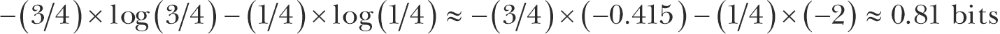

## 第三章：2 随机性


随机性在加密学中无处不在：在生成密钥、加密方案，甚至在对加密系统的攻击中。如果没有随机性，加密将不可能，因为所有操作将变得可预测，从而变得不安全。

本章介绍了在加密学中的随机性概念及其应用。我们讨论了伪随机数生成器以及操作系统如何生成可靠的随机性，最后通过实际例子展示了错误的随机性如何影响安全性。

### 随机还是非随机？

你可能以前听过*随机比特*这个词，但严格来说，实际上并不存在一系列随机比特。真正*随机*的是产生随机比特序列的*算法*，或者说是过程；因此，当我们说“随机比特”时，我们实际上指的是随机生成的比特。

随机比特是什么样的？例如，8 位字符串 11010110 可能看起来比 00000000 更随机，尽管它们生成的机会是相同的（即 1/256）。11010110 看起来比 00000000 更随机，因为它具有典型的随机生成值的特征。也就是说，11010110 没有明显的模式。

当我们看到字符串 11010110 时，大脑会识别出它包含 3 个零和 5 个一，就像其他 55 个 8 位字符串（11111000、11110100、11110010 等）一样，但只有一个 8 位字符串是全零的。因为 3 个零和 5 个一的模式比 8 个零的模式更容易出现，所以我们将 11010110 识别为随机，而将 00000000 识别为非随机，即使它们并非如此。

这个例子说明了人们在识别随机性时常犯的两种错误：

**将非随机性误认为随机性** 认为一个物体是随机生成的，仅仅因为它*看起来*随机

**将随机性误认为非随机性** 认为偶然出现的模式是有某种原因存在的，而不是偶然的

随机看起来和真正随机之间的区别至关重要。实际上，在加密领域，非随机性常常等同于不安全。

“它是偶然发生的”这句话反映了一个特性，即在复杂系统中（在这个例子中，是遵循物理定律的宇宙，宏观层面上是确定性的，而在亚原子、量子层面上是完全随机的），可以出现特定的模式，例如字符串 00000000。根据大数法则，如果许多事件发生，有些事件看起来并不随机——例如彩票抽奖中的一系列顺序数字。许多伪科学和信仰体系实际上是将随机误认为非随机的例子。

### 随机性作为概率分布

任何随机化过程的特征是由*概率分布*决定的，概率分布提供了关于该过程随机性的所有信息。概率分布，或简称*分布*，列出了一个随机化过程的所有结果，并为每个结果分配一个概率。

*概率*是衡量事件发生可能性的指标。它表示为介于 0 和 1 之间的实数，其中 0 表示不可能，1 表示确定。例如，在抛硬币时，每一面落正面的概率是 1/2（或 0.5），而硬币立在边缘的概率接近 0。

概率分布必须包括所有可能的结果，使得所有概率的总和为 1。具体来说，如果有*N*个可能的事件，就有*N*个概率*p*[1]，*p*[2]，...，*p*N，且*p*[1] + *p*[2] + ... + *p*N = 1。在抛硬币的例子中，硬币正面和反面的分布各为 1/2。两者的总和为 1/2 + 1/2 = 1，因为硬币会落在它的两个面之一。

*均匀分布*发生在分布中的所有概率相等时，这意味着所有结果发生的可能性相同。如果有*N*个事件，那么每个事件的概率是 1/*N*。例如，如果一个 128 位密钥是均匀随机选择的——即根据均匀分布——那么 2¹²⁸个可能的密钥中的每个密钥应该有 1/2¹²⁸的概率。

相反，当分布是*非均匀*时，概率并不相等。一个非均匀分布的硬币抛掷被称为偏倚的，例如，正面可能以 1/4 的概率出现，反面可能以 3/4 的概率出现。

> 注

*可以通过使用加重的骰子作弊，使得每个面出现的概率不再是 1/6；然而，硬币无法偏倚。只有当“硬币被允许反弹或旋转，而不是简单地在空中翻转”时，硬币抛掷才可能出现偏差，正如文章《你可以加重骰子，但不能偏倚硬币》中所描述的那样*（[`<wbr>www<wbr>.stat<wbr>.berkeley<wbr>.edu<wbr>/~nolan<wbr>/Papers<wbr>/dice<wbr>.pdf`](https://www.stat.berkeley.edu/~nolan/Papers/dice.pdf)）。

### 熵：不确定性的度量

*熵*是系统中不确定性或无序度的度量。熵越高，随机过程结果的不确定性越大。

我们可以计算概率分布的熵。如果你的分布由概率*p*[1]，*p*[2]，...，*p*N 组成，则其熵是所有概率与其对数的乘积的负和，如下所示：


这里的函数*log*是*二进制对数*，即以二为底的对数。与自然对数不同，二进制对数表示信息的比特，并且当概率是二的幂时，结果为整数。例如，log(1/2) = -1，log(1/4) = -2，通常情况下 log(1/2*^n*) = - *n*。（我们实际上取*负和*，以得到正数。）因此，使用均匀分布生成的随机 128 位密钥具有以下熵值：


如果你将 128 替换为任意整数*n*，那么一个均匀分布的*n*位字符串的熵将是*n*比特。

当分布是均匀时，熵最大，因为均匀分布最大化了不确定性：没有任何结果比其他结果更可能。因此，*n*位值的熵不能超过*n*比特。

同样的，当分布不是均匀时，熵会较低。考虑掷硬币的例子。公平掷硬币的熵值如下：


如果硬币的一面比另一面更可能朝上会怎么样？假设正面的概率是 1/4，反面是 3/4。（记住，所有概率的和应该为 1。）

这样一个有偏掷硬币的熵值如下：



0.81 小于公平掷硬币的 1 比特熵，这告诉我们，硬币越有偏，分布越不均匀，熵值也越低。进一步说明，如果正面朝上的概率是 1/10，那么熵值为 0.469；如果概率降到 1/100，熵值则降至 0.081。

> 注意

*熵也可以被看作是信息的度量。例如，一个公平的掷硬币结果给你准确的 1 比特信息——正面或反面——并且你无法提前预测掷硬币的结果。在不公平的掷硬币情况下，你提前知道反面更可能出现，因此你可以预测结果。不公平掷硬币的结果为你提供了预测结果所需的信息。*

### 随机与伪随机数生成器

加密系统需要随机性来保证安全，因此需要一个可以提供随机性的组件。这个组件的工作是当被请求时返回随机比特。为了生成这种随机性，你需要两样东西：

+   随机数生成器提供的熵源。

+   一种加密算法可以从熵源中生成高质量的随机比特。这在伪随机数生成器中得以实现。

同时使用随机和伪随机数生成器是使加密学既实用又安全的关键。让我们在深入探讨伪随机数生成器之前，简单了解一下随机数生成器的工作原理。

随机性来源于环境，而环境是模拟的、混沌的、不确定的，因此无法预测。仅依赖计算机算法无法生成随机性。在密码学中，随机性通常来自*随机数生成器（RNG）*，这是一种软件或硬件组件，利用模拟世界中的熵来在数字系统中生成不可预测的比特。例如，一个 RNG 可能直接从温度、声学噪声、空气湍流或电静态的测量中采样比特。不幸的是，这些模拟熵源并不总是可用，而且它们的熵通常很难估计。

RNG 也可以通过从附加的传感器、I/O 设备、网络或磁盘活动、系统日志、运行中的进程以及用户活动（如按键和鼠标移动）中获取熵。此类系统和人为活动可以是一个良好的熵源，但它们可能非常脆弱，且容易受到攻击者的操控。此外，它们生成随机比特的速度较慢。

> 注意

量子随机数生成器（QRNG）*是一种依赖于量子力学现象（如放射性衰变、光子极化或热噪声）产生的随机性的随机数生成器。这些现象不受通过方程式从当前状态推导未来状态的限制，因此是绝对意义上的随机性。然而，在实际应用中，从 QRNG 提取的原始比特可能会带有偏差，并且生成速度较慢。与前面提到的熵源类似，它们需要经过后处理才能以高速生成可靠的比特。*

*伪随机数生成器（PRNG）*通过可靠地产生大量人工随机比特来解决生成随机性的挑战，这些比特源自少量真实的随机比特。例如，一个将鼠标移动转换为随机比特的 RNG，如果你停止移动鼠标，就会停止工作，而 PRNG 则始终在请求时返回伪随机比特。

PRNG 依赖于 RNG，但行为有所不同：RNG 从模拟源生成真实的随机比特相对较慢，采用非确定性方式，且无法保证比特的均匀分布或每个比特的高熵。相比之下，PRNG 从数字源快速生成看似随机的比特，采用确定性方式，均匀分布，并且熵足够高，适用于加密应用。实际上，PRNG 将少量不可靠的随机比特转化为适合加密应用的长时间可靠的伪随机比特流，正如图 2-1 所示。


图 2-1：RNG 从模拟源生成的比特较少且不可靠，而 PRNG 将这些比特扩展为长时间可靠的比特流。

#### 伪随机数生成器的工作原理

PRNG 定期从 RNG 接收随机位，并使用这些随机位更新一个大型内存缓冲区，称为 *熵池*。熵池是 PRNG 的熵来源，就像物理环境是 RNG 的熵来源一样。当 PRNG 更新熵池时，它会将熵池中的位混合在一起，以帮助去除任何统计偏差。

为了生成伪随机位，PRNG 运行一个确定性随机位生成器（DRBG）算法，将熵池中的某些位扩展成一个更长的序列。顾名思义，DRBG 是确定性的，而非随机的：给定一个输入，你总是会得到相同的输出。PRNG 确保其 DRBG 永远不会接收到相同的输入两次，因此可以生成唯一的伪随机序列。

在其工作过程中，PRNG 执行三项操作：

***init()* **初始化熵池和 PRNG 的内部状态

***刷新(R)* **使用一些数据 *R* 更新熵池，这些数据通常来自 RNG

***下一步(N)* **返回 *N* 个伪随机位，并更新熵池

*init* 操作将 PRNG 重置为一个全新的状态，重新初始化熵池为某个默认值，并初始化 PRNG 用于执行 *刷新* 和 *下一步* 操作的任何变量或内存缓冲区。

*刷新* 操作通常称为 *重新播种*，其参数 *R* 称为 *种子*。当没有可用的 RNG 时，种子可能是系统中硬编码的唯一值。通常操作系统会调用 *刷新* 操作，而 *下一步* 操作通常由应用程序调用或请求。*下一步* 操作运行 DRBG，并修改熵池，以确保下一次调用会生成不同的伪随机位。

#### 安全性问题

简要谈一下伪随机数生成器（PRNG）如何解决高级安全性问题。具体来说，PRNG 应该保证 *回溯抗性* 和 *预测抗性*。回溯抗性（也叫 *前向保密性*）意味着先前生成的位无法恢复，而预测抗性（*后向保密性*）意味着未来的位应该无法预测。

为了实现回溯抗性，PRNG 应确保在通过 *刷新* 和 *下一步* 操作更新状态时所执行的变换是不可逆的。这样，如果攻击者破坏了系统并获得了熵池的值，他们就无法确定熵池的先前值或之前生成的位。为了实现预测抗性，PRNG 应定期调用 *刷新* 操作，使用攻击者无法得知且难以猜测的 *R* 值，从而防止攻击者确定熵池的未来值，即使整个熵池已被破解。（如果 *R* 值的列表已知，那么你需要知道 *刷新* 和 *下一步* 调用的顺序，才能重建熵池。）

#### PRNG Fortuna

*Fortuna* 是一种伪随机数生成器（PRNG），最初由 Niels Ferguson 和 Bruce Schneier 于 2003 年设计，最早应用于 Windows。Fortuna 取代了 *Yarrow*，这是 John Kelsey 和 Bruce Schneier 于 1998 年设计的方案，曾长期用于 macOS 和 iOS 操作系统，并且已被 Fortuna 替代。我在这里不会提供 Fortuna 的规格，也不会告诉你如何实现它，但我会尽力解释它是如何工作的。你可以在 Ferguson、Schneier 和 Kohno 的《Cryptography Engineering》（Wiley, 2010）一书的 第九章 中找到 Fortuna 的完整描述。

Fortuna 的内部内存包括以下内容：

+   三十二个熵池，*P*[1]，*P*[2]，...，*P*[32]，使得 *P*i 每进行 2*^i* 次重新种子时使用一次。

+   一个密钥 *K* 和一个计数器 *C*（都为 16 字节）。它们构成了 Fortuna 的 DRBG（确定性随机比特生成器）的内部状态。

简单来说，Fortuna 的工作原理如下：

+   *init*() 将 *K* 和 *C* 设为零，并清空 32 个熵池 *P*i，其中 *i* = 1 . . . 32。

+   *refresh*(*R*) 将数据 *R* 添加到某个熵池中。系统选择用来生成 *R* 值的 RNG，并且应该定期调用 *refresh*。

+   *next*(*N*) 使用来自一个或多个熵池的数据更新 *K*，其中熵池的选择主要取决于 *K* 已经更新了多少次。然后，通过使用 *K* 作为密钥加密 *C* 来生成请求的 *N* 位。如果加密 *C* 还不够，Fortuna 会加密 *C* + 1，再加密 *C* + 2，以此类推，直到获得足够的位。

尽管 Fortuna 的操作看起来相当简单，但正确实现它是困难的。首先，你需要将算法的所有细节做到位——如何选择熵池，*next* 中使用的密码类型，如何在没有熵输入时进行处理，等等。尽管规格定义了大多数细节，但它们并未包含全面的测试套件来检查实现是否正确，这使得确保你对 Fortuna 的实现能够按预期行为运行变得困难。

即使 Fortuna 被正确实现，也可能由于算法错误以外的原因发生安全失败。例如，Fortuna 可能没有注意到 RNG 没有产生足够的随机位，因此 Fortuna 会生成质量较差的伪随机位，或者甚至完全停止生成伪随机位。

Fortuna 实现中的另一个风险在于可能将相关的 *种子文件* 暴露给攻击者。Fortuna 种子文件中的数据用于在 RNG（随机数生成器）不可立即使用时，通过 *refresh* 调用将熵传递给 Fortuna——例如，在系统重启后，且在系统的 RNG 记录任何不可预测的事件之前。然而，如果相同的种子文件被使用了两次，Fortuna 会产生相同的位序列。因此，种子文件应该在使用后被擦除，以确保它们不会被重复使用。

最后，如果两个 Fortuna 实例处于相同状态，因为它们共享一个种子文件（即熵池中的数据相同，包括*C*和*K*），那么*下一个*操作将在两个实例中返回相同的位。

#### 加密与非加密伪随机数生成器

有加密和非加密伪随机数生成器。非加密伪随机数生成器设计用于产生均匀分布，适用于科学模拟或视频游戏等应用。然而，绝不能在加密应用中使用非加密伪随机数生成器，因为它们不安全；它们只关心位的概率分布质量，而不关心它们的可预测性。另一方面，加密伪随机数生成器是不可预测的，因为它们还考虑了用于生成良好分布位的底层*操作*的强度。

不幸的是，大多数编程语言暴露的伪随机数生成器（PRNG）——例如 libc 的 rand 和 drand48，PHP 的 rand 和 mt_rand，Python 的 random 模块，Java 的 java.util.Random 类——都是非加密的。默认使用非加密的伪随机数生成器是灾难的开始，因为它通常会被用于加密应用中，所以在生成与加密或安全应用相关的随机性时，务必使用加密伪随机数生成器。

##### 一种流行的非加密伪随机数生成器：梅森旋转算法

*梅森旋转算法 (MT)* 是一种非加密的伪随机数生成器（PRNG），目前（截至本文写作时）被 PHP、Python、R、Ruby 和许多其他系统使用。它甚至（不幸地）被用于区块链钱包密钥生成器中。MT 生成均匀分布的随机位，没有统计偏差，但它是可预测的：只要知道由 MT 生成的几个位，就能猜出接下来的位是什么。

让我们深入了解梅森旋转算法不安全的原因。MT 算法比加密伪随机数生成器的算法要简单得多：它的内部状态是一个数组 *S*，包含 624 个 32 位的字。这个数组最初被设置为 *S*[1]，*S*[2]，...，*S*[624]，然后根据这个方程演变为 *S*[2]，...，*S*[625]，接着是 *S*[3]，...，*S*[626]，依此类推：


这里，⊕ 表示按位异或（在 C 语言中为 ^），∧ 表示按位与（在 C 中为 &），∨ 表示按位或（在 C 中为 |），**A** 是一个函数，它将某个 32 位字 *x* 转换为 (*x* >> 1)，如果 *x* 的最高有效位是 0，或者转换为 (*x* >> 1) ⊕ 0x9908b0df 否则。

在这个方程中，*S*的比特仅通过异或运算相互作用。运算符∧和∨从不将*S*的两个比特结合起来，而是将*S*的比特与常量 0x80000000 和 0x7fffffff 中的比特结合。这样，*S*[625]的任何一个比特都可以表示为*S*[398]、*S*[1]和*S*[2]的异或运算，而任何未来状态中的比特都可以表示为初始状态*S*[1]、...、*S*[624]中比特的异或组合。（例如，当你将*S*[228 + 624] = *S*[852]表示为*S*[625]、*S*[228]和*S*[229]的函数时，你可以进一步将*S*[625]替换为它在*S*[398]、*S*[1]和*S*[2]中的表示。）

因为初始状态中恰好有 624 × 32 = 19,968 个比特（或 624 个 32 位字），任何输出比特都可以表示为至多包含 19,969 项（19,968 个比特加一个常量比特）的方程。这大约是 2.5KB 的数据。反过来也是如此：初始状态中的比特可以表示为输出比特的异或组合。

##### 线性不安全性

我们称位的异或组合为*线性组合*。例如，如果*X*、*Y*和*Z*是位，那么表达式*X* ⊕ *Y* ⊕ *Z*就是线性组合，而(*X* ∧ *Y*) ⊕ *Z*则不是，因为存在与（∧）。如果你在*X* ⊕ *Y* ⊕ *Z*中翻转*X*的某一位，那么结果也会改变，而与*Y*和*Z*的值无关。相反，如果你在(*X* ∧ *Y*) ⊕ *Z*中翻转*X*的某一位，只有当*Y*在相同位置的位为 1 时，结果才会改变。关键在于，线性组合是可预测的，因为你不需要知道位的具体值就能预测它们的变化如何影响结果。

为了进行比较，如果 MT 算法在密码学上是强安全的，那么它的方程应该是*非线性*的，并且不仅涉及单个比特，还应包括比特的与运算（*乘积*），如*S*[1]*S*[15]*S*[182]或者*S*[17]*S*[256]*S*[257]*S*[354]*S*[498]*S*[601]。尽管这些比特的线性组合最多包含 624 个变量，但非线性组合则允许多达 2⁶²⁴个变量。解决这些方程几乎是不可能的，更不用说将其写下来了。（请注意，2³⁰⁵是一个更小的数字，代表可观测宇宙的估算信息容量。）

这里的关键在于，线性变换导致简短的方程（其规模可与变量数量相当），这些方程容易求解，而非线性变换则会产生指数级的方程，其规模极大，实际上是无法求解的。因此，密码学家的任务是设计出能模拟如此复杂的非线性变换的伪随机数生成算法（PRNG），且只使用少量的简单操作。

> 注意

*线性只是众多安全标准中的一种。尽管非线性是必要的，但仅仅有非线性并不足以使得一个伪随机数生成器（PRNG）在密码学上是安全的。*

#### 统计测试的无用性

像 TestU01、Diehard 或国家标准与技术研究院（NIST）测试套件这样的统计测试套件是一种测试伪随机位质量的方法。这些测试会从伪随机数生成器产生的伪随机位中取样（例如，1MB 的位数），计算某些模式分布的统计数据，并将结果与均匀分布所得到的典型结果进行比较。例如，一些测试会统计 1 位与 0 位的数量，或 8 位模式的分布。但统计测试与加密安全性关系不大，可能设计出一个加密弱的伪随机数生成器，使其通过任何统计测试。

当你对随机生成的数据进行统计测试时，通常会看到一堆统计指标作为结果。这些通常是*p*值，一种常见的统计指标。由于这些结果通常不像“通过”或“失败”那么简单，因此它们并不总是容易解释。如果你的第一次结果看起来异常，不要担心：它们可能是某些偶然偏差的结果，或者你可能测试的样本太少。为了确保你看到的结果是正常的，可以将它们与一些可靠的相同大小的样本进行比较——例如，通过以下命令使用 OpenSSL 工具包生成的样本：

```
$ **openssl rand `<number of bytes>`** **-out `<output file>`**
```

### 现实世界中的伪随机数生成器

让我们将注意力转向在现实世界中实现伪随机数生成器。你会在大多数平台的操作系统（OS）中找到加密伪随机数生成器，从桌面和笔记本电脑到嵌入式系统，如路由器和机顶盒，以及虚拟机、手机等。大多数这些伪随机数生成器是基于软件的，但那些纯硬件的伪随机数生成器则被操作系统上运行的应用程序使用，有时也会被其他基于加密库或应用程序上运行的伪随机数生成器使用。

接下来，我们将看看最广泛部署的伪随机数生成器：用于 Linux、Android 和许多其他基于 Unix 的系统；在 Windows 中；以及在最近的英特尔微处理器中，其伪随机数生成器是基于硬件的。

#### Linux 中的随机位

设备文件*/dev/urandom*是基于 Linux 内核的操作系统中加密伪随机数生成器（PRNG）的用户空间接口。你通常会使用它来生成可靠的随机位。因为它是一个设备文件，所以你可以通过将其当作文件读取来请求随机位。例如，以下命令使用*/dev/urandom*将 10MB 的随机位写入文件：

```
$ **dd if=/dev/urandom of=****`<output file>`** **bs=1M count=10**
```

##### 错误使用/dev/urandom 的方式

你可以编写一个天真且不安全的 C 程序，如 Listing 2-1 中所示，读取随机位并寄希望于最好的结果，但那样做是一个糟糕的主意。

```
int random_bytes_insecure(void *buf, size_t len)
{
    int fd = open("/dev/urandom", O_RDONLY);
    read(fd, buf, len);
    close(fd);
    return 0;
}
```

列表 2-1: 不安全使用 /dev/urandom

这段代码不安全；它甚至没有检查<сamp class="SANS_TheSansMonoCd_W5Regular_11">open()和<сamp class="SANS_TheSansMonoCd_W5Regular_11">read()的返回值，这意味着你期望的随机缓冲区可能会被填充为零或保持不变。##### 更安全的使用方式 /dev/urandom

列表 2-2，来自 LibreSSL 库，展示了使用*/dev/urandom*的更安全方式。

```
int random_bytes_safer(void *buf, size_t len)
{
    struct stat st;
    size_t i;
    int fd, cnt, flags;
    int save_errno = errno;

start:
    flags = O_RDONLY;
#ifdef O_NOFOLLOW
    flags |= O_NOFOLLOW;
#endif
#ifdef O_CLOEXEC
    flags |= O_CLOEXEC;
#endif
  ❶ fd = open("/dev/urandom", flags, 0);
    if (fd == -1) {
        if (errno == EINTR)
            goto start;
        goto nodevrandom;
    }
#ifndef O_CLOEXEC
    fcntl(fd, F_SETFD, fcntl(fd, F_GETFD) | FD_CLOEXEC);
#endif

    /* Lightly verify that the device node looks sane. */
    if (fstat(fd, &st) == -1 || !S_ISCHR(st.st_mode)) {
        close(fd);
        goto nodevrandom;
    }
    if (ioctl(fd, RNDGETENTCNT, &cnt) == -1) {
        close(fd);
        goto nodevrandom;
    }
    for (i = 0; i < len;) {
        size_t wanted = len - i;
      ❷ ssize_t ret = read(fd, (char *)buf + i, wanted);

        if (ret == -1) {
            if (errno == EAGAIN || errno == EINTR)
                continue;
            close(fd);
            goto nodevrandom;
        }
        i += ret;
    }
    close(fd);
    if (gotdata(buf, len) == 0) {
        errno = save_errno;
        return 0; /* Satisfied */
    }
nodevrandom:
    errno = EIO;
    return -1;
}
```

列表 2-2: 安全使用 /dev/urandom

与列表 2-1 不同，列表 2-2 进行了多个有效性检查。例如，比较对<сamp class="SANS_TheSansMonoCd_W5Regular_11">open() ❶和<сamp class="SANS_TheSansMonoCd_W5Regular_11">read() ❷的调用与列表 2-1 中的调用：更安全的代码检查这些函数的返回值，并在失败时关闭文件描述符并返回–1。

##### 2022 年之前，/dev/urandom 和/dev/random 的区别

Linux 的伪随机数生成器（PRNG），在 Linux 内核中的*drivers/char/random.c*文件中定义，2022 年（从内核版本 5.17 开始）进行了重大更改。

首先，PRNG 的基本结构在旧版和新版中是相似的，它基于从各种来源（包括系统活动，如键盘、鼠标和磁盘访问）收集的熵，以及一个可以视为大数组的熵池，该数组通过哈希收集的熵数据进行填充。接下来，DRBG 负责生成伪随机数据流，当读取*/dev/random*或*/dev/urandom*，或者调用getrandom()系统调用时返回这些数据流。

历史上，在内核版本 5.17 之前，Linux 的 PRNG 行为如下：与*/dev/urandom*不同，*/dev/random*接口是*阻塞*的；如果内核估计 PRNG 的熵水平不足，那么*/dev/random*在读取时会停止返回字节（“阻塞”），直到内核估计出足够的熵水平。这并不是一个好主意。首先，熵估算器是出了名的不可靠，且容易被攻击者欺骗（这也是为什么 Fortuna 放弃了 Yarrow 的熵估算）。此外，*/dev/random*的估算熵会很快用尽，这可能会导致拒绝服务条件，减慢迫使等待更多熵的应用程序。结果是，在实际应用中，*/dev/random*不比*/dev/urandom*更好，反而带来了更多问题。

##### 2022 年以来，/dev/urandom 和/dev/random 的区别

在 2022 年及以后的 Linux 内核版本（5.17 及以后），加入了几项改进。首先，在创建池内容时，SHA-1 哈希函数被 BLAKE2 替代。最大的变化是*/dev/random*和*/dev/urandom*之间相对行为的修改；甚至有人提议完全消除它们的区别。在本文写作时，在大多数平台上，这两个接口都会检测是否没有足够的熵，但是如果内核未能收集足够的熵，*/dev/urandom*将继续生成伪随机位，而*/dev/random*则会阻塞。

此外，内核的熵估算逻辑得到了极大的改进：不再认为当读取 PRNG 位时熵会减少（这是一个加密学的荒谬理论），而是内核会寻找足够的不确定性（即熵）收集完成的时刻——例如，在系统启动时。

你可以在*/proc/sys/kernel/random/entropy_avail*文件中读取 Linux 系统的熵值。在旧版本的内核中，这个值最大为 4,096 位，并随着伪随机数生成（PRNG）位的产生而减少。而在新内核中，这个值被限制为 256 位，因此不再减少。

#### Windows 中的 CryptGenRandom()函数

在 Windows 中，系统的遗留用户态接口是来自加密应用程序接口（API）的CryptGenRandom()函数。最近的 Windows 版本将CryptGenRandom()函数替换为加密 API：下一代（CNG）中的BcryptGenRandom()函数。Windows 的 PRNG 从内核模式驱动程序*cng.sys*（前身为*ksecdd.sys*）获取熵，其熵收集器在一定程度上基于 Fortuna 算法。像 Windows 中常见的那样，整个过程相对复杂。

清单 2-3 展示了一个典型的 C++调用示例，使用了带有必要检查的CryptGenRandom()函数。

```
int random_bytes(unsigned char *out, size_t outlen)
{
    static HCRYPTPROV handle = 0; /* Only freed when the program ends */
    if(!handle) {
        if(!CryptAcquireContext(&handle, 0, 0, PROV_RSA_FULL,
                                CRYPT_VERIFYCONTEXT | CRYPT_SILENT)) {
            return -1;
        }
    }
    while(outlen > 0) {
        const DWORD len = outlen > 1048576UL ? 1048576UL : outlen;
        if(!CryptGenRandom(handle, len, out)) {
            return -2;
        }
        out    += len;
        outlen -= len;
    }
    return 0;
}
```

清单 2-3: 使用 Windows CryptGenRandom() PRNG 接口

在调用实际的伪随机数生成器（PRNG）之前，你需要声明一个*加密服务提供者*（HCRYPTPROV），然后通过 CryptAcquireContext() 获取*加密上下文*，这会增加出错的可能性。例如，TrueCrypt 加密软件的最终版本被发现调用 CryptAcquireContext() 的方式可能会悄无声息地失败，从而导致随机性不理想而不通知用户。幸运的是，Windows 中新且更简单的 BCryptGenRandom() 接口不需要代码显式地打开句柄（或者至少使得不使用句柄的操作更为简便）。

#### 基于硬件的 PRNG：英特尔安全密钥

到目前为止，我们只讨论了软件 PRNG，我们来看看硬件 PRNG。*英特尔数字随机数生成器*（Intel Digital Random Number Generator），或称*英特尔安全密钥*（Intel Secure Key），是 2012 年在英特尔的 Ivy Bridge 微架构中推出的硬件 PRNG。它基于 NIST 的 SP 800-90 指南，并采用高级加密标准（AES）在 CTR_DRBG 模式下工作。英特尔的 PRNG 通过 RDRAND 汇编指令进行访问，提供了一个独立于操作系统的接口，并且在原则上比软件 PRNG 更快。

软件伪随机数生成器（PRNG）尝试从不可预测的来源收集熵，而英特尔的安全密钥（Intel Secure Key）则有一个单一的熵源，该熵源提供一个由零和一组成的序列流。用硬件工程术语来说，这个熵源是一个带反馈的双差分闩锁——本质上是一个小型硬件电路，它根据热噪声波动在两种状态（0 或 1）之间跳动，频率为 3 GHz。这通常是非常可靠的。

RDRAND 汇编指令的参数是 16、32 或 64 位的寄存器，然后写入一个随机值。当被调用时，如果目标寄存器中的数据集是有效的随机值，RDRAND 会将进位标志（carry flag）设置为 1，否则设置为 0；如果你直接编写汇编代码，记得检查 CF 标志。请注意，常见编译器中的 C 内建函数不会检查 CF 标志，但会返回它的值。

> 注意

*英特尔的 PRNG 框架提供了一条不同于 RDRAND 的汇编指令：RDSEED 汇编指令直接从熵源返回随机位，经过一些条件处理或加密处理后。这一指令的目的是能够为其他 PRNG 提供种子。*

Intel Secure Key 的文档并不完全，但它是基于已知标准构建的，并且已经通过了备受推崇的公司 Cryptography Research 的审计（参见其名为“Analysis of Intel’s Ivy Bridge Digital Random Number Generator”的报告）。尽管如此，关于其安全性仍然存在一些担忧，特别是在爱德华·斯诺登揭露加密后门事件后：伪随机数生成器（PRNG）确实是破坏的完美目标。如果你对此有所担忧，但仍然希望使用 RDRAND 或 RDSEED，请将它们与其他熵源混合使用。这样可以防止在 Intel Secure Key 硬件或相关微代码中，假设的后门被有效利用，除非是在最不可能的情景下。

### 事物可能出错的方式

总结一下，我将展示几个随机性失败的例子。可以选择的例子数不胜数，但我挑选了四个简单到足以理解且能展示不同问题的例子。

#### 不良的熵源

1996 年，Netscape 浏览器的 SSL 实现根据列表 2-4 中显示的伪代码计算 128 位 PRNG 种子，该代码复制自 Goldberg 和 Wagner 的页面，地址为 *[`<wbr>www<wbr>.cs<wbr>.berkeley<wbr>.edu<wbr>/~daw<wbr>/papers<wbr>/ddj<wbr>-netscape<wbr>.html`](https://www.cs.berkeley.edu/~daw/papers/ddj-netscape.html)*。

```
global variable seed;

RNG_CreateContext()
    (seconds, microseconds) = time of day; /* Time elapsed since 1970 */
    pid = process ID;  ppid = parent process ID;
    a = mklcpr(microseconds);
  ❶ b = mklcpr(pid + seconds + (ppid << 12));
    seed = MD5(a, b); /* Derivation of a 128-bit value using the hash MD5 */

mklcpr(x) /* Not cryptographically significant; shown for completeness */
    return ((0xDEECE66D * x + 0x2BBB62DC) >> 1);
MD5() /* A very good standard mixing function, source omitted */
```

列表 2-4：Netscape 浏览器生成 128 位 PRNG 种子的伪代码

这里的问题在于 PID 和微秒是可以猜测的值。假设你可以猜出 秒数 的值，微秒 只有 10⁶种可能的值，因此其熵为 log(10⁶)，约为 20 位。进程 ID（PID）和父进程 ID（PPID）是 15 位值，因此你预计会有 15 + 15 = 30 个附加熵位。但是，通过观察 b 的计算过程 ❶，我们可以看到 3 个位的重叠导致熵只有 15 + 12 = 27 位，总熵仅为 47 位，而一个 128 位的种子应该有 128 位熵。

#### 启动时熵不足

2012 年，研究人员扫描了互联网并收集了来自 TLS 证书和 SSH 主机的公钥。他们发现有一些系统的公钥完全相同，在某些情况下，公钥非常相似（即，RSA 密钥共享质因子）——简而言之，两个数字，*n* = *pq* 和 *n*′ = *p*′*q*′，其中 *p* = *p*′，而通常情况下，不同的模数值下，所有的 *p* 和 *q* 应该是不同的。

事实证明，许多设备在启动时就生成了它们的公钥，在收集足够的熵之前就已经生成，尽管它们使用了其他正常的 PRNG（通常是*/dev/urandom*）。不同系统中的 PRNG 生成了相同的随机位，因为它们使用了相同的熵源（例如，硬编码的种子）。

从高层次来看，相同密钥的存在是由于类似以下的密钥生成方案，伪代码如下：

```
prng.seed(seed)
p = prng.generate_random_prime()
q = prng.generate_random_prime()
n = p*q
```

如果两个系统在相同种子的情况下运行此代码，它们将生成相同的*p*、相同的*q*，因此也会生成相同的*n*。

不同密钥中共享质因子的存在是由于密钥生成方案，在该过程中注入了额外的熵，如下所示：

```
prng.seed(seed)
p = prng.generate_random_prime()
prng.add_entropy()
q = prng.generate_random_prime()
n = p*q
```

如果两个系统使用相同的种子运行此代码，它们将生成相同的*p*，但通过prng.add_entropy()注入的熵将确保生成不同的*q*。

共享质因子的问提在于，给定*n* = *pq*和*n*′ = *pq*′，通过计算*n*和*n*′的最大公约数（GCD），可以轻松恢复共享的*p*。有关详细信息，请参见 Heninger、Durumeric、Wustrow 和 Halderman 的论文《Mining Your Ps and Qs》，可以在*[`<wbr>factorable<wbr>.net`](https://factorable.net)找到。

#### 非加密 PRNG

之前我们讨论了加密 PRNG 和非加密 PRNG 之间的区别，以及为什么后者永远不应该用于加密应用程序。可惜的是，许多系统忽略了这一点，因此我们将看看其中一个这样的例子。

流行的 MediaWiki 应用程序运行在 Wikipedia 和许多其他维基网站上。它使用随机性来生成诸如安全令牌和临时密码等内容，这些内容应该是不可预测的。不幸的是，MediaWiki 的一个现已过时的版本使用了一个非加密的 PRNG——梅森旋转算法（Mersenne Twister），来生成这些令牌和密码。以下是漏洞版 MediaWiki 源代码的一个片段；查找获取随机位的函数，并阅读注释：

```
 /**
         * Generate a hex-y looking random token for various uses.
         * Could be made more cryptographically sure if someone cares.
         * @return string
         */
function generateToken($salt = '') {
    $token = dechex(mt_rand()).dechex(mt_rand());
    return md5($token . $salt);
}
```

你注意到前面的代码中的mt_rand()了吗？这里，mt代表梅森旋转算法（Mersenne Twister）。在 2012 年，研究人员展示了如何利用梅森旋转算法的可预测性，基于几个安全令牌预测未来的令牌和临时密码。MediaWiki 已经修补，改用了加密 PRNG。

#### 具有强随机性的采样错误

下一个错误展示了即使是一个强大的加密 PRNG，且具有足够的熵，也可能产生有偏的分布。聊天程序 Cryptocat 旨在提供安全通信。它使用了一个函数，试图创建一个均匀分布的十进制数字串——即 0 到 9 之间的数字。然而，单纯对随机字节取模 10 并不能产生均匀分布；当你将所有 0 到 255 之间的数字取模 10 时，你不会得到 0 到 9 之间的每个值出现的次数相等。

Cryptocat 为了解决这个问题并获得均匀分布，采取了以下措施：

```
Cryptocat.random = function() {
    var x, o = '';
    while (o.length < 16) {
        x = state.getBytes(1);
        if (x[0] <= 250) {
            o += x[0] % 10;
        }
    }
    return parseFloat('0.' + o)
}
```

那几乎是完美的。通过仅选择数字中 10 的倍数并丢弃其他数字，你应该期望数字 0 到 9 的均匀分布。不幸的是，在 if 条件中存在一个错位错误。我会把细节留给你作为练习。你应该会发现存在一个小的统计偏差，偏向索引 0（提示：<= 应该改为 <）。

### 进一步阅读

我刚刚只是触及了加密学中随机性的表面。关于随机性的理论还有很多值得学习的内容，包括不同的熵概念、随机性提取器，甚至是在复杂性理论中随机化和去随机化的力量。要深入了解伪随机数生成器（PRNG）及其安全性，可以阅读 Kelsey、Schneier、Wagner 和 Hall 于 1998 年发表的经典论文《Cryptanalytic Attacks on Pseudorandom Number Generators》。然后，查看你最喜欢的应用程序中 PRNG 的实现，尝试找出它们的弱点。（可以在线搜索“random generator bug”来查找大量示例。）

然而，关于随机性的讨论还没结束。我们将在本书中多次遇到它，你将发现它在构建安全系统中有着许多重要的作用。
