## 4 分组密码


冷战时期，美国和苏联各自开发了自己的密码。美国政府创建了数据加密标准（DES），该标准从 1979 年到 2005 年作为联邦标准使用，而苏联 KGB 则开发了 GOST 28147-89，这是一个直到 1990 年才公开的算法，至今仍在使用。2000 年，美国国家标准与技术研究院（NIST）选择了 DES 的继任者——高级加密标准（AES），该算法在比利时开发，现在广泛应用于大多数电子设备。AES、DES 和 GOST 28147-89 都是*分组密码*，这是一种将处理数据块的核心算法与*操作模式*结合起来的密码类型，后者用于处理数据块序列。

本章回顾了构成分组密码的核心算法，讨论了它们的工作模式，并解释了它们如何协同工作。还讨论了 AES 的工作原理，并以介绍一种经典的攻击工具——1970 年代的“中间人攻击”和 2000 年代流行的攻击技术——填充 Oracle 攻击作为结尾。

### 什么是分组密码？

一个分组密码由加密算法和解密算法组成：

+   *加密算法* (**E**) 接收一个密钥 *K* 和一个明文数据块 *P*，并生成一个密文数据块 *C*。我们将加密操作写作 *C* = **E**(*K*, *P*)。

+   *解密算法* (**D**) 是加密算法的逆操作，将密文解密还原为原始明文 *P*。我们将此操作写作 *P* = **D**(*K*, *C*)。

由于它们是彼此的逆操作，加密和解密算法通常涉及相似的操作。

#### 安全目标

如果你已经跟随之前关于加密、随机性和不可区分性的讨论，那么安全分组密码的定义应该不会让你感到惊讶。我们将继续将安全性定义为类似随机的特性，可以这么说。

为了保证分组密码的安全性，它应该是一个*伪随机置换（PRP）*，意味着只要密钥是保密的，攻击者就不应能够从任何输入计算出分组密码的输出。也就是说，只要*K*对攻击者而言是保密且随机的，他们应该无法知道**E**(*K*, *P*)的具体样式，无论给定什么样的*P*。

更一般来说，攻击者不应能够在块密码的输入/输出值中发现任何*模式*。换句话说，给定黑盒访问加密和解密函数以及某个固定且未知的密钥，应该无法将块密码与真正的随机置换区分开来。同样，攻击者也应该无法恢复安全块密码的密钥；否则，他们可以利用该密钥将块密码与随机置换区分开来。这意味着攻击者无法预测与给定密文对应的明文，即块密码所生成的密文。

#### 块大小

块密码由两个值来表征：块大小和密钥大小。安全性依赖于这两个值。大多数块密码要么使用 64 位块，要么使用 128 位块——DES 的块为 64 位（2⁶），AES 的块为 128 位（2⁷）。在计算中，通常以 2 的幂来度量的长度简化了数据处理、存储和寻址。但为什么是 2⁶和 2⁷而不是 2⁴或 2¹⁶位呢？

块密码的块大小不宜过大，以便最小化密文长度和内存占用。块密码首先将输入数据转换为一系列块，这意味着如果块的大小为 128 位，要加密一个 16 位的消息，需要将该消息转换为一个 128 位的块，以便块密码进行处理并返回一个 128 位的密文。块越宽，这种开销就越大。处理一个 128 位的块，至少需要 128 位内存。64 位、128 位甚至 512 位的块足够小，可以适应大多数 CPU 的寄存器或通过专用硬件电路实现，从而在大多数情况下实现高效的加密。然而，较大的块（例如，几个千字节长）可能会对实现的成本和性能产生明显影响。

当密文的长度或内存占用至关重要时，可能需要使用 64 位块，因为它们产生较短的密文并消耗更少的内存。否则，128 位或更大的块更好，主要是因为现代 CPU 通常比 64 位块更高效地处理 128 位块，而且它们更安全（参见“Sweet32”攻击，见 *[`<wbr>sweet32<wbr>.info`](https://sweet32.info)*）。特别是，CPU 可以利用指令高效地并行处理一个或多个 128 位块——例如，英特尔 CPU 中的高级矢量扩展（AVX）指令集。

#### 字典攻击

虽然块不应过大，但也不应过小；否则，它们可能会受到*字典攻击*的威胁，字典攻击是针对块密码的攻击，这种攻击仅在使用较小的块时才有效。使用 16 位块时，字典攻击的工作原理如下：

1. 获取与每个 16 位明文块对应的 65,536（2¹⁶）个密文。

2.  构建一个查找表——*代码本*——将每个密文块映射到其对应的明文块。

3.  要解密一个未知的密文块，在表中查找其对应的明文块。

使用 16 位区块时，查找表只需要 2¹⁶ × 16 = 2²⁰位的内存，约为 128 千字节。使用 32 位区块时，内存需求增加到 16GB，仍然可以管理。但是，使用 64 位区块时，你必须存储 2⁷⁰位（一个 zettabit，或者 128 exabytes），那时就不行了。因此，对于 128 位或更大区块，代码本攻击并不是问题。

### 如何构建区块密码

存在数百种区块密码，但只有少数几种构建方法。实际上，区块密码并不是一个巨大的算法，而是一个轮次的重复——一种单独看可能很弱，但通过数量上来补强的短序列操作。构建一个轮次的主要方法有两种：替代-置换网络（如在 AES 中）和费斯特尔方案（如在 DES 中）。在这一部分中，你将先查看当所有轮次相同的时候，如何通过一种攻击来破解，然后再了解这些技术。

#### 区块密码的轮次

计算区块密码实际上就是计算一系列的轮次*。* 在区块密码中，轮次是一个基本的变换，容易指定和实现，并且重复多次以形成区块密码的算法。这种结构由一个小的组件多次重复，比起由一个巨大的算法组成的结构，更容易实现和分析。

例如，一个具有三轮的区块密码通过计算 *C* = **R**3)) 来加密一个明文，其中轮次是 **R**[1]、**R**[2] 和 **R**[3]，*P* 是明文。每一轮还应该有一个逆操作，这样接收者就能够解密回明文。具体地，*P* = **iR**1))，其中 **iR**[1] 是 **R**[1] 的逆操作，以此类推。

轮函数——**R**[1]、**R**[2]等——通常是相同的算法，但它们由一个我们称之为*轮密钥*的值进行参数化。两个具有不同轮密钥的轮函数会表现不同，因此，如果输入相同，它们会产生不同的输出。

我们通过主密钥*K*使用*密钥调度*算法来推导轮密钥。例如，**R**[1]使用轮密钥*K*[1]，**R**[2]使用轮密钥*K*[2]，依此类推。

每一轮的轮密钥应该彼此不同。也就是说，并非所有的轮密钥都应该与密钥*K*相等；否则，所有的轮次将会是相同的，区块密码的安全性将降低，接下来我将描述这一点。

#### 滑动攻击 和轮密钥

在分组密码中，任何一轮不应与另一轮相同，以避免*滑动攻击*。如图 4-1 所示，滑动攻击会寻找两个明文/密文对（*P*[1]，*C*[1]）和（*P*[2]，*C*[2]），其中*P*[2] = **R**(*P*[1])，**R**是密码的轮次。当轮次相同的时候，两个明文之间的关系*P*[2] = **R**(*P*[1])，就意味着它们的密文之间有相同的关系*C*[2] = **R**(*C*[1])。图 4-1 展示了三个轮次，但关系*C*[2] = **R**(*C*[1])无论轮次数为 3、10 还是 100 都会成立。问题在于，知道某一轮的输入和输出往往有助于恢复密钥。（详情请参阅 1999 年由 Alex Biryukov 和 David Wagner 撰写的论文《高级滑动攻击》，可通过*[`www.iacr.org/archive/eurocrypt2000/1807/18070595-new.pdf`](https://www.iacr.org/archive/eurocrypt2000/1807/18070595-new.pdf)*获取。）

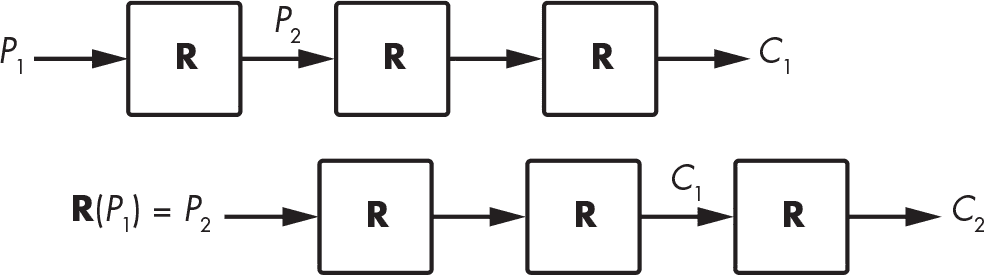

图 4-1：针对具有相同轮次的分组密码的滑动攻击原理

使用不同的轮密钥作为参数可以确保各个轮次的行为不同，从而防止滑动攻击。

> 注意

*使用轮密钥的一个潜在副产品和好处是防止*旁路攻击*，即利用密码实现过程中泄露的信息进行的攻击（例如，电磁辐射）。如果从主密钥* K*到轮密钥*K[i]*的转换是不可逆的，那么如果攻击者找到*K[i]*，他们就不能利用该密钥找到*K*。不幸的是，很少有分组密码具有单向密钥调度。AES 的密钥调度允许攻击者从任何轮密钥*K[i]*计算*K*，例如。*

#### 替代-置换网络

如果你读过关于密码学的教科书，可能会接触到“混淆”和“扩散”这两个概念。*混淆*意味着输入（明文和加密密钥）会经历复杂的转换，而*扩散*意味着这些转换对输入的每一位都依赖相同。总体来说，混淆关注的是深度，而扩散关注的是广度。在分组密码的设计中，混淆和扩散通过替代和置换操作的形式体现，我们将其结合在替代-置换网络（SPN）中。

替代通常以*S 盒*或*替代盒*的形式出现，它们是小型查找表，用来转换 4 位或 8 位的块。例如，分组密码 Serpent 的八个 S 盒中的第一个由 16 个元素（3 8 f 1 a 6 5 b e d 4 2 7 0 9 c）组成，每个元素表示一个 4 位的 nibble。这个特定的 S 盒将 4 位 nibble 0000 映射为 3（0011），将 4 位 nibble 0101（十进制为 5）映射为 6（0110），依此类推。

> 注意

*S 盒必须小心选择以确保其密码学强度：它们应尽可能非线性（输入和输出应通过复杂的方程式相关联），且没有统计偏差（例如，翻转一个输入位应该可能影响输出位的任何位）。*

替换–置换网络中的置换可以像改变位的顺序一样简单，这种方法容易实现，但并没有很好地混合位。某些密码算法使用基本的线性代数和矩阵乘法来混合位：它们执行一系列固定值（矩阵系数）的乘法操作，然后将结果相加。这种操作可以迅速在所有位之间创建依赖关系，从而确保强的扩散性。例如，块加密算法 FOX 将一个 4 字节向量 (*a*, *b*, *c*, *d*) 转换为 (*a*′, *b*′, *c*′, *d*′)，我们定义如下：


在这些方程中，我们将 2 和 253 解释为二进制多项式，而不是整数；因此，我们对加法和乘法的定义与我们习惯的略有不同。例如，我们不是有 2 + 2 = 4，而是 2 + 2 = 0。无论如何，初始状态中的每个字节都会影响最终状态中的所有 4 个字节。

#### 费斯特尔方案

在 1970 年代，IBM 工程师霍斯特·费斯特尔设计了一种块加密算法 Lucifer，其工作原理如下：

1.  将 64 位块拆分为两个 32 位的部分 *L* 和 *R*。

2.  将 *L* 设置为 *L* ⊕ **F**(*R*)，其中 **F** 是一个替换–置换轮。

3.  交换 *L* 和 *R* 的值。

4.  返回第 2 步并重复 15 次。

5.  将 *L* 和 *R* 合并为 64 位输出块。

该结构是一个*费斯特尔方案*，如图 4-2 所示。左侧是前面描述的方案；右侧是一个功能等效的表示形式，其中，轮次交替执行 *L* = *L* ⊕ **F**(*R*) 和 *R* = *R* ⊕ **F**(*L*) 的操作，而不是交换 *L* 和 *R*。

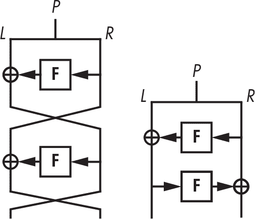

图 4-2：费斯特尔方案块加密结构的两种等效形式

我已省略图 4-2 中的密钥，以简化图示，但请注意，第一个 **F** 使用一个轮密钥 *K*[1]，第二个 **F** 使用另一个轮密钥 *K*[2]。在 DES 中，**F**函数使用一个 48 位的轮密钥，它从 56 位密钥 *K* 中推导出来。

在费斯特尔方案中，**F**函数可以是伪随机置换（PRP）或伪随机函数（PRF）。PRP 对于任何两个不同的输入都会产生不同的输出，而 PRF 则可能有 *X* 和 *Y* 的值，使得 **F**(*X*) = **F**(*Y*)。但是在费斯特尔方案中，这种差异并不重要，只要 **F** 是密码学上强的。

在费斯特尔结构中应该进行多少轮？嗯，DES 执行 16 轮，而 GOST 28147-89 执行 32 轮。如果**F**函数尽可能强大，从理论上讲，四轮就足够了，但现实中的加密算法使用更多轮来防御**F**中的潜在弱点。

### 高级加密标准

AES 是世界上使用最广泛的密码算法。在 AES 被采用之前，使用的标准密码是 DES，它的 56 位安全性极其低，还有升级版的 DES，即 Triple DES 或 3DES。尽管 3DES 提供了更高的安全级别（112 位安全性），但它的效率较低，因为为了获得 112 位安全性，密钥需要达到 168 位，并且它在软件中的速度较慢（DES 的设计初衷是为了在集成电路中运行快速，而不是在主流 CPU 上）。AES 解决了这两个问题。

NIST 在 2000 年将 AES 标准化为 DES 的替代方案，从那时起，它成为了世界上事实上的加密标准。今天，大多数商业加密产品都支持 AES，NSA 也批准了它用于保护最高机密信息。（一些国家确实更倾向于使用自己的密码算法，主要是因为它们不想使用美国的标准，但 AES 实际上比美国更具比利时特色。）

> 注意

*AES 在成为 AES 竞赛中的 15 个候选算法之一时，曾以*Rijndael*（这是其发明者 Rijmen 和 Daemen 的名字合成词，发音类似于“rain-dull”）命名。该竞赛由 NIST 于 1997 年至 2000 年举行，目的是指定“一个未分类、公开披露的加密算法，能够有效保护敏感政府信息，直到下个世纪”，正如 1997 年在*《联邦公报》*中发布的竞赛公告所述。*AES 竞赛就像是密码学家的“才艺大赛”，任何人都可以通过提交密码或破解其他参赛者的密码来参与。*

#### AES 内部结构

AES 处理 128 位的块，使用 128 位、192 位或 256 位的秘密密钥，其中 128 位密钥最为常见，因为它使加密稍微更快，并且对于大多数应用来说，128 位和 256 位安全性的差异并不重要。

与一些密码算法处理单个比特或 64 位字不同，AES 处理的是*字节*。它将 16 字节的明文视为一个二维字节数组（*s* = *s*[0]，*s*[1]，…，*s*[15]），如图 4-3 所示。（我们使用字母*s*是因为这个数组是*内部状态*，简称*状态*。）AES 通过转换这个数组的字节、列和行来生成最终的密文。


图 4-3：AES 的内部状态，作为一个 4×4 的 16 字节数组

为了转换其状态，AES 使用如图 4-4 所示的 SPN 结构，对于 128 位密钥为 10 轮，192 位密钥为 12 轮，256 位密钥为 14 轮。

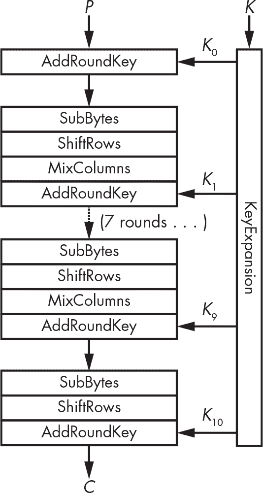

图 4-4：AES 的内部操作

图 4-4 显示了 AES 轮次的四个基本模块（注意，除了最后一轮，其他所有轮次都是 SubBytes、ShiftRows、MixColumns 和 AddRoundKey 的组合）：

**AddRoundKey **将轮密钥与内部状态进行 XOR 运算。

**SubBytes **根据 S-box 替换每个字节（*s*[0], *s*[1] . . . , *s*[15]）。在本例中，S-box 是一个包含 256 个元素的查找表。

**ShiftRows **将第*i*行按*i*个位置移位，其中*i*的范围是 0 到 3（参见图 4-5）。

**MixColumns **对状态的四列应用相同的线性变换（即，每组具有相同灰度的单元格，如图 4-5 左侧所示）。

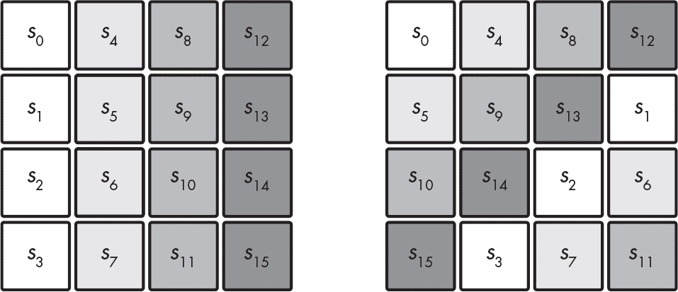

图 4-5：ShiftRows 在内部状态的每一行内旋转字节。

请记住，在 SPN 中，*S*代表替代，*P*代表置换。这里，替代层是 SubBytes，置换层是 ShiftRows 和 MixColumns 的组合。

如图 4-4 所示，关键调度函数 KeyExpansion 是 AES 的密钥调度算法。此扩展从 16 字节的密钥生成 11 个轮密钥（*K*[0], *K*[1], . . . , *K*[10]），每个轮密钥为 16 字节，使用与 SubBytes 相同的 S-box 以及 XOR 组合。KeyExpansion 的一个重要特性是，给定任何一个轮密钥，*K*i，攻击者可以通过反向算法确定所有其他轮密钥以及主密钥*K*。从任意轮密钥获取密钥的能力降低了密码的抗侧信道攻击能力，因为攻击者可以轻松恢复一个轮密钥。

如果没有这些操作，AES 将完全不安全。每个操作以特定的方式贡献于 AES 的安全性：

+   如果没有 KeyExpansion，所有轮次将使用相同的密钥*K*，AES 将容易受到滑动攻击。

+   如果没有 AddRoundKey，加密将不再依赖于密钥；因此，任何人都可以在没有密钥的情况下解密任何密文。

+   SubBytes 引入了非线性操作，增加了密码学强度。没有它，AES 只会是一个可以通过高中代数（即高斯消元法）解出的线性方程系统。

+   如果没有 ShiftRows，给定列的变化将不会影响其他列，这意味着你可以通过为每列构建四个 2³²元素的代码簿来破解 AES。（请记住，在安全的分组密码中，输入中的一个比特的翻转应该影响所有输出比特。）

+   如果没有 MixColumns，字节的变化不会影响状态中的任何其他字节。选择明文攻击者可以通过存储每个字节可能值的加密值的 16 个 256 字节的查找表来解密任何密文。

注意 图 4-4 中，AES 的最后一轮不包括 MixColumns 操作。此操作被省略以节省不必要的计算：因为 MixColumns 是线性的，你可以通过一种不依赖于其值或密钥的方式在最后一轮中消除其效果。然而，我们无法在不知道状态值的情况下逆转 SubBytes，除非在 AddRoundKey 之前已知该值。

要解密一个密文，AES 通过取其逆函数来逐步恢复每个操作：SubBytes 的逆查找表会逆转 SubBytes 变换，ShiftRow 会向相反方向移动，MixColumns 的逆运算被应用（如同矩阵运算的矩阵逆），AddRoundKey 的 XOR 保持不变，因为 XOR 的逆操作还是 XOR。

#### AES 实践

作为练习，你可以使用 Python 的 cryptography 库来加密和解密一个数据块，方法如 清单 4-1 所示。

```
from cryptography.hazmat.primitives.ciphers import Cipher, algorithms, modes
from os import urandom

BLOCK_SIZE = 16
KEY_SIZE = 16

# Pick a random 16-byte key using Python's crypto PRNG.
k = urandom(KEY_SIZE)
print(f"k = {k.hex()}")

# Create an instance of AES-128.
aes = Cipher(algorithms.AES(k), modes.ECB())
aes_ecb_encryptor = aes.encryptor()

# Set plaintext p to the all-zero string.
p = bytes([0x00] * BLOCK_SIZE)

# Encrypt plaintext p to ciphertext c.
c = aes_ecb_encryptor.update(p) + aes_ecb_encryptor.finalize()
print(f"enc({p.hex()}) = {c.hex()}")

# Decrypt ciphertext c to plaintext p.
aes_ecb_decryptor = aes.decryptor()
p = aes_ecb_decryptor.update(c) + aes_ecb_decryptor.finalize()
print(f"dec({c.hex()}) = {p.hex()}")
```

清单 4-1：Python 中的 AES 加密和解密一个数据块

运行此脚本会产生如下类似的输出：

```
$ **./aes_block.py**
k = 2c6202f9a582668aa96d511862d8a279
enc(00000000000000000000000000000000) = 12b620bb5eddcde9a07523e59292a6d7
dec(12b620bb5eddcde9a07523e59292a6d7) = 00000000000000000000000000000000
```

你将得到不同的结果，因为每次执行时密钥都会随机化。

### 如何实现 AES

实际的 AES 软件与 图 4-4 中的算法工作方式不同。你不会在生产级别的 AES 代码中找到一个 SubBytes() 函数，接着是 ShiftRows() 函数，再然后是 MixColumns() 函数，因为那样效率低下。相反，快速的 AES 软件使用基于表格的实现和本地指令。

#### 基于表格的实现

基于表格的 AES 实现将 SubBytes-ShiftRows-MixColumns 序列替换为一系列 XOR 操作和在程序中硬编码并在执行时加载到内存中的查找表。这是可能的，因为 MixColumns 等价于对四个 32 位值进行 XOR 操作，每个值都依赖于来自状态的一个字节和 SubBytes。因此，你可以构建四个包含 256 个条目的表格，每个表格对应一个字节值，并通过查找四个 32 位值并对它们进行 XOR 操作来实现 SubBytes-MixColumns 序列。

例如，OpenSSL 工具包中的基于表格的 C 实现类似于 清单 4-2。

```
 /* Round 1: */
  t0 = Te0[s0 >> 24] ^ Te1[(s1 >> 16) & 0xff] ^ Te2[(s2 >> 8) & 0xff] ^ Te3[s3 & 0xff] ^ rk[4];
  t1 = Te0[s1 >> 24] ^ Te1[(s2 >> 16) & 0xff] ^ Te2[(s3 >> 8) & 0xff] ^ Te3[s0 & 0xff] ^ rk[5];
  t2 = Te0[s2 >> 24] ^ Te1[(s3 >> 16) & 0xff] ^ Te2[(s0 >> 8) & 0xff] ^ Te3[s1 & 0xff] ^ rk[6];
  t3 = Te0[s3 >> 24] ^ Te1[(s0 >> 16) & 0xff] ^ Te2[(s1 >> 8) & 0xff] ^ Te3[s2 & 0xff] ^ rk[7];
  /* Round 2: */
  s0 = Te0[t0 >> 24] ^ Te1[(t1 >> 16) & 0xff] ^ Te2[(t2 >> 8) & 0xff] ^ Te3[t3 & 0xff] ^ rk[8];
  s1 = Te0[t1 >> 24] ^ Te1[(t2 >> 16) & 0xff] ^ Te2[(t3 >> 8) & 0xff] ^ Te3[t0 & 0xff] ^ rk[9];
  s2 = Te0[t2 >> 24] ^ Te1[(t3 >> 16) & 0xff] ^ Te2[(t0 >> 8) & 0xff] ^ Te3[t1 & 0xff] ^ rk[10];
  s3 = Te0[t3 >> 24] ^ Te1[(t0 >> 16) & 0xff] ^ Te2[(t1 >> 8) & 0xff] ^ Te3[t2 & 0xff] ^ rk[11];
`--snip--`
```

列表 4-2：OpenSSL 中基于表格的 AES 实现摘录

一个基本的基于表格的 AES 加密实现需要四个 4KB 的表格，因为每个表格存储 256 个 32 位值，占用 256 × 32 = 8,192 位，即 1KB。解密还需要另四个表格，因此需要额外的 4KB 存储。但有一些技巧可以将存储从 4KB 减少到 1KB，甚至更少。

可惜的是，基于表格的实现容易受到*缓存时间攻击*的影响，攻击者通过利用程序读取或写入缓存内存元素时的时间差异来进行攻击。访问时间会根据访问元素在缓存内存中的相对位置而变化。因此，时间差泄漏了关于访问元素的信息，进而泄漏了涉及的秘密信息。

缓存时间攻击很难避免。一个显而易见的解决方案是完全舍弃查找表，通过编写一个执行时间不依赖于输入的程序来避免这种攻击，但这样几乎不可能做到，同时还保持相同的速度。因此，芯片制造商选择了一种激进的解决方案：他们不再依赖可能存在漏洞的软件，而是依赖于*硬件*。

#### 原生指令

AES 原生指令（AES-NI）解决了 AES 软件实现中缓存时间攻击的问题。要理解 AES-NI 如何工作，可以想象软件如何在硬件上运行：为了运行一个程序，微处理器将二进制代码转换为一系列指令，然后集成电路组件执行这些指令。例如，两个 32 位值之间的 MUL 汇编指令会激活微处理器中实现 32 位乘法器的晶体管。为了实现加密算法，我们通常将一系列基本操作——加法、乘法、异或等——组合在一起，然后微处理器按照预定的顺序激活其加法器、乘法器和异或电路。

AES 原生指令通过提供专门的汇编指令来计算 AES，将开发人员的工作提升到全新水平。在使用 AES-NI 时，你无需将 AES 回合编写为一系列汇编指令，只需要调用指令 AESENC，芯片会为你计算回合。原生指令允许你指示处理器执行 AES 回合，而不需要将回合编程为一系列基本操作的组合。

使用原生指令的典型 AES 汇编实现可以参考列表 4-3。

```
PXOR       %xmm5,  %xmm0
AESENC     %xmm6,  %xmm0
AESENC     %xmm7,  %xmm0
AESENC     %xmm8,  %xmm0
AESENC     %xmm9,  %xmm0
AESENC     %xmm10, %xmm0
AESENC     %xmm11, %xmm0
AESENC     %xmm12, %xmm0
AESENC     %xmm13, %xmm0
AESENC     %xmm14, %xmm0
AESENCLAST %xmm15, %xmm0
```

列表 4-3：使用 AES 原生指令实现的 AES-128

这段代码加密了最初存储在寄存器xmm0中的 128 位明文，假设寄存器xmm5到xmm15存储了预计算的轮密钥，每条指令将其结果写入xmm0。初始的PXOR指令在计算第一轮之前执行与第一轮密钥的异或操作，最后的AESENCLAST指令执行最后一轮的方式与其他轮略有不同（MixColumns 被省略）。

> 注意
> 
> *AES 在实现了本地指令的平台上速度大约是原来的 10 倍，正如我写这段文字时，几乎所有的笔记本、台式机和服务器微处理器，以及大多数手机和平板电脑都已经实现了这些指令。虽然 Intel 在 2008 年首次提出了 AES 指令，但这些指令也可以在 AMD 处理器中使用，除了 x86 之外的大多数架构也有等效的硬件实现 AES 的指令。例如，Armv8 指令集包含了指令*AESSE*（用于计算 SubBytes 和 ShiftRows）和*AESMS*（用于计算 MixColumns）。*
> 
> *在 Intel 的 Ice Lake 微架构上，*AESENC*指令的延迟为三个周期，反向吞吐量为半个周期，意味着调用*AESENC*需要三个周期才能完成，而我们可以在每个周期内发起两次新的指令调用。实际上，执行*AESENC*操作的微操作的内部结构使得新指令的计算可以在前一个计算完成之前开始。更重要的是，Ice Lake 架构使用了 AES 指令的向量化版本，可以同时启动多个指令。有关更多详细信息，请参阅 Nir Drucker、Shay Gueron 和 Vlad Krasnov 的文章《让 AES 重回巅峰》，文章可以在* [`<wbr>eprint<wbr>.iacr<wbr>.org<wbr>/2018<wbr>/392`](https://eprint.iacr.org/2018/392)*找到。*
> 
> *为了一个接一个地加密一系列的块，完成 10 轮需要 3 × 10 = 30 个周期，或者每个字节需要 30 / 16 = 1.875 个周期。在 2 GHz 的频率下（2 × 10**⁹* *每秒周期数），这给出了大约 1GBps 的理论最大吞吐量。如果你能并行处理块，那么你就不需要在开始另一个之前完成一次完整的 *AESENC* 调用。在这种情况下，你可以每个周期做两次 *AESENC* 调用，并且每个周期获得两个结果，从而提供更高的理论吞吐量（在 2 GHz 时，最多超过 10GBps），具体取决于数据大小和操作模式。*

#### AES 安全性

AES 的安全性是分组密码中最强的，它永远不会被破解。从根本上来说，AES 是安全的，因为所有输出比特都依赖于所有输入比特，并且这种依赖是复杂的伪随机的方式。为了实现这一点，AES 的设计者们精心选择了每个组件，基于特定的原因——MixColumns 由于其最大扩散性，SubBytes 由于其最优的非线性。这个组合使 AES 能够抵抗一类又一类的密码分析攻击。

但没有证据表明 AES 对所有可能的攻击都是免疫的。首先，我们不知道所有可能的攻击是什么，我们也不总是知道如何证明一个密码对某种特定攻击是安全的。真正增加对 AES 安全性信心的唯一方法是众包攻击：让许多有技能的人尝试破解 AES，并且理想情况下，无法成功。

经过 15 年以上的研究和数百篇研究论文，我们才刚刚触及 AES 理论安全性的表面。2011 年，密码分析师发现了一种方法，可以通过进行大约 2¹²⁶次操作来恢复 AES-128 密钥，而不是 2¹²⁸次操作，速度提升了 4 倍。但这个“攻击”需要大量的明文-密文对——大约需要 2⁸⁸比特的数据。这是一个有趣的发现，但并不是你需要担心的事情。

当你在实现和部署加密时，应该关注成千上万的事情，但 AES 的安全性并不是其中之一。对分组密码来说，最大的威胁不在于其核心算法，而在于其操作模式。如果你选择了错误的模式或误用了正确的模式，即便是像 AES 这样强大的密码也无法保护你。

### 操作模式

在第一章中，我解释了加密方案如何将置换与操作模式结合起来，以处理任意长度的消息。在这一节中，我将介绍分组密码使用的主要操作模式、它们的安全性和功能属性，以及如何（不）使用它们。我将从最愚蠢的那个开始：电子密码本。

#### 电子密码本模式

最简单的块密码加密模式是电子密码本（ECB），它几乎不算是一种操作模式。ECB 处理明文块*P*[1]、*P*[2]、…、*P*[N]，通过计算*C*[1] = **E**(*K*, *P*[1])、*C*[2] = **E**(*K*, *P*[2])等，逐块独立处理，正如图 4-6 所示。这是一种简单的操作，但也是不安全的——ECB 是不安全的，您不应使用它。

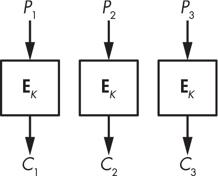

图 4-6：ECB 模式

微软的密码学家 Marsh Ray 曾说过：“大家都知道 ECB 模式不好，因为我们能看到企鹅。”他指的是一种著名的 ECB 不安全性示例，使用了 Linux 吉祥物 Tux 的图像，如图 4-7 所示。

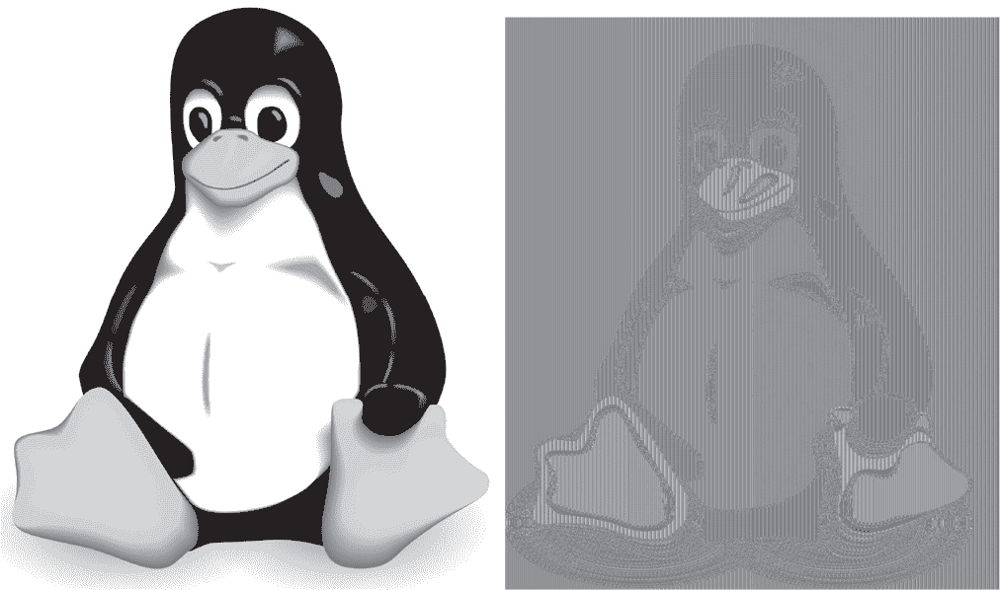

图 4-7：原始图像（左）和 ECB 加密图像（右）

Tux 的原始图像在左侧，使用 AES 加密后的 ECB 图像（尽管底层密码不重要）在右侧。由于 ECB 将原始图像中所有相同灰度的块加密为新图像中相同灰度的新色调，因此在加密版本中很容易看到企鹅的形状；换句话说，ECB 加密生成的是颜色不同的相同图像。

清单 4-4 中的 Python 程序也显示了 ECB 的不安全性。它选择一个伪随机密钥，并加密一个包含两个空字节块的 32 字节消息p。请注意，加密产生了两个相同的块，并且使用相同的密钥和相同的明文重复加密时，又会产生相同的两个块。

```
#!/usr/bin/env python

from cryptography.hazmat.primitives.ciphers import Cipher, algorithms, modes
from os import urandom

BLOCK_SIZE = 16
KEY_SIZE = 16

# The blocks() function splits a data string into space-separated blocks.
def blocks(data):
    split = [data[i:i+BLOCK_SIZE].hex() for i in range(0, len(data), BLOCK_SIZE)]
    return ' '.join(split)
k = urandom(KEY_SIZE)
print(f"k = {k.hex()}")

# Create an instance of AES-128 to encrypt and decrypt.
aes = Cipher(algorithms.AES(k), modes.ECB())
aes_ecb_encryptor = aes.encryptor()

# Set plaintext p as two blocks of zeros.
p = bytes([0x00] * 2 * BLOCK_SIZE)

# Encrypt plaintext p to ciphertext c.
c = aes_ecb_encryptor.update(p) + aes_ecb_encryptor.finalize()
print(f"enc({blocks(p)}) = {blocks(c)}")
```

清单 4-4：在 Python 中使用 AES 的 ECB 模式

运行此脚本将生成如下所示的密文块：

```
$ **./aes_ecb.py**
k = 50a0ebeff8001250e87d31d72a86e46d
enc(00000000000000000000000000000000 00000000000000000000000000000000) =
5eb4b7af094ef7aca472bbd3cd72f1ed 5eb4b7af094ef7aca472bbd3cd72f1ed
```

在使用 ECB 模式时，相同的密文块会向攻击者揭示相同的明文块，无论这些块是在同一密文中，还是在不同的密文中。这表明，ECB 模式下的块密码在语义上是不安全的。

ECB 的另一个问题是它只接受完整的数据块，因此如果数据块是 16 字节，比如在 AES 中，您只能加密 16 字节、32 字节、48 字节或其他 16 字节的倍数的数据块。解决这个问题有几种方法，您将在下一个模式 CBC 中看到。（我不会告诉您这些技巧如何在 ECB 中工作，因为您本不应使用 ECB。）

#### 密码块链模式

密码块链接（CBC）与电子密码本（ECB）类似，但有一个小小的变化，这个变化带来了很大的不同：CBC 不是直接加密第 *i* 个块 *P*i，像 *C*i = **E**(*K*, *P*i) 那样，而是设定 *C*i = **E**(*K*, *P*i ⊕ *C*i [− 1])，其中 *C*i [− 1] 是前一个密文块——从而将块 *C*i [− 1] 和 *C*i 进行*链式*连接。当加密第一个块 *P*[1] 时，由于没有前一个密文块可用，CBC 会采用一个随机初始值（IV），正如图 4-8 所示。

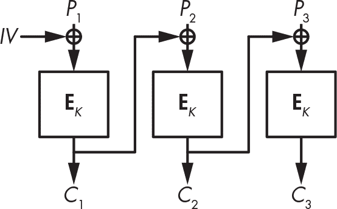

图 4-8: CBC 模式

CBC 模式使得每个密文块都依赖于所有前面的块，确保相同的明文块不会变成相同的密文块。随机初始值保证了，当用两个不同的初始值两次调用密码算法时，相同的明文会加密成不同的密文。

列表 4-5 演示了这两个优点。这个程序将一个全零的 32 字节消息（如列表 4-4 中的那样）进行两次 CBC 加密，并显示两个密文。加粗的行 iv = urandom(BLOCK _SIZE) 为每次新的加密选择一个新的随机 IV。

```
#!/usr/bin/env python

from cryptography.hazmat.primitives.ciphers import Cipher, algorithms, modes
from os import urandom

BLOCK_SIZE = 16
KEY_SIZE = 16

# The blocks() function splits a data string into space-separated blocks.
def blocks(data):
    split = [data[i:i+BLOCK_SIZE].hex() for i in range(0, len(data), BLOCK_SIZE)]
    return ' '.join(split)

# Pick a random key.
k = urandom(KEY_SIZE)
print(f"k  = {k.hex()}")

# Pick a random IV.
**iv = urandom(BLOCK_SIZE)**
print(f"iv = {iv.hex()}")

# Pick an instance of AES in CBC mode.
aes_cbc_encryptor = Cipher(algorithms.AES(k), modes.CBC(iv)).encryptor()

# Set plaintext p as two blocks of zeros.
p = bytes([0x00] * 2 * BLOCK_SIZE)

c = aes_cbc_encryptor.update(p) + aes_cbc_encryptor.finalize()
print(f"enc({blocks(p)}) = {blocks(c)}")

# Now with a different IV and the same key
**iv = urandom(BLOCK_SIZE)**
print(f"iv = {iv.hex()}")

aes_cbc_encryptor = Cipher(algorithms.AES(k), modes.CBC(iv)).encryptor()
c = aes_cbc_encryptor.update(p) + aes_cbc_encryptor.finalize()
print(f"enc({blocks(p)}) = {blocks(c)}")
```

列表 4-5: 使用 AES 的 CBC 模式

这两个明文是相同的（两个全零块），但加密后的块应该是不同的，正如这个执行示例所示：

```
$ **./aes_cbc.py**
k = 9cf0d31ad2df24f3cbbefc1e6933c872
iv = 0a75c4283b4539c094fc262aff0d17af
enc(00000000000000000000000000000000 00000000000000000000000000000000) =
370404dcab6e9ecbc3d24ca5573d2920 3b9e5d70e597db225609541f6ae9804a
iv = a6016a6698c3996be13e8739d9e793e2
enc(00000000000000000000000000000000 00000000000000000000000000000000) =
655e1bb3e74ee8cf9ec1540afd8b2204 b59db5ac28de43b25612dfd6f031087a
```

遗憾的是，我们常常使用常量 IV 而不是随机 IV，这会暴露出相同的明文以及以相同块开始的明文。例如，假设 CBC 将两个块的明文 *P*[1] || *P*[2] 加密成两个块的密文 *C*[1] || *C*[2]。如果 CBC 使用相同的 IV 加密 *P*[1] || *P*[2]′，其中 *P*[2]′ 是与 *P*[2] 不同的块，那么密文将变成 *C*[1] || *C*[2]′，其中 *C*[2]′ 与 *C*[2] 不同，但 *C*[1] 相同。因此，攻击者可以猜测两个明文的第一个块是相同的，即使他们只能看到密文。

> 注意

*在 CBC 模式下，解密需要知道加密时使用的 IV，因此 IV 会与密文一起明文发送。*

使用 CBC 时，解密通常比加密更快，因为解密可以并行进行。虽然加密新块 *P*i 时需要等待前一个块 *C*i [− 1]，但解密一个块时，会计算 *P*i = **D**(*K*, *C*i) ⊕ *C*i [− 1]，其中不需要前一个明文块 *P*i [− 1]。这意味着，只要你知道前一个密文块，就可以并行解密所有块，通常你是知道的。

#### CBC 模式下的消息加密

让我们回到块终止问题，看看如何处理长度不是块大小倍数的明文。例如，当块大小为 16 字节时，如何用 AES-CBC 加密 18 字节的明文？剩下的 2 个字节该怎么处理？你将看到两种广泛使用的技术来解决这个问题。第一种是填充，它使密文比明文稍长，而第二种是*密文偷取*，它生成与明文长度相同的密文。

##### <code class="SANS_Futura_Std_Bold_Condensed_B_11">消息填充</code>

填充是一种使你能够加密任何长度的消息的技术，即使是小于一个块的消息。PKCS#7 标准和 RFC 5652 为块密码指定了填充方式，我们几乎在所有使用 CBC 的地方都使用它。

我们使用填充来扩展消息，通过向明文添加额外的字节来填充完整的块。以下是填充 16 字节块的规则：

+   如果剩余 1 个字节——例如，明文是 1 字节、17 字节或 33 字节长——则使用 15 个字节<code class="SANS_TheSansMonoCd_W5Regular_11">0f</code>（十进制为 15）填充消息。

+   如果剩余 2 个字节，使用 14 个字节<code class="SANS_TheSansMonoCd_W5Regular_11">0e</code>（十进制为 14）填充消息。

+   如果剩余 3 个字节，使用 13 个字节<code class="SANS_TheSansMonoCd_W5Regular_11">0d</code>（十进制为 13）填充消息。

如果有 15 个明文字节，并且缺少一个字节来填充块，填充会添加一个<code class="SANS_TheSansMonoCd_W5Regular_11">01</code>字节。如果明文已经是 16 的倍数，即块长度，则会添加 16 个字节<code class="SANS_TheSansMonoCd_W5Regular_11">10</code>（十进制为 16）。该技巧可以推广到任何块长度，最多可达到 255 字节（对于更大的块，1 字节太小，无法编码大于 255 的值）。

填充消息的解密过程如下：

1.  像解密未填充的 CBC 一样解密所有块。

2.  确保最后一个块的最后字节符合填充规则：即它们以至少一个<code class="SANS_TheSansMonoCd_W5Regular_11">01</code>字节、至少两个<code class="SANS_TheSansMonoCd_W5Regular_11">02</code>字节或至少三个<code class="SANS_TheSansMonoCd_W5Regular_11">03</code>字节结尾，依此类推。如果填充无效——例如，最后的字节是<code class="SANS_TheSansMonoCd_W5Regular_11">01 02 03</code>——则消息会被拒绝。否则，解密会去除填充字节并返回剩余的明文字节。

填充的一个缺点是，它会使密文至少增加 1 字节，最多增加一个块的长度。

##### <code class="SANS_Futura_Std_Bold_Condensed_B_11">密文偷取</code>

密文偷取是我们用来加密长度不是块大小倍数的消息的另一种技巧。密文偷取比填充更复杂且不太常用，但它提供了一些好处：

+   明文可以是任意*比特*长度，而不仅仅是字节。例如，你可以加密一个 131 比特的消息。

+   密文的长度与明文完全相同。

+   密文盗用不容易受到填充 oracle 攻击的威胁，这种攻击有时会对带填充的 CBC 模式有效（如你将在第 83 页的“填充 Oracle 攻击”中看到的那样）。

在 CBC 模式下，密文盗用通过从前一个密文块中提取比特来扩展最后一个不完整的明文块，然后对该块进行加密。最后的不完整密文块由前一个密文块的前几个比特组成——即那些尚未附加到最后明文块上的比特。

在图 4-9 中，我们有三个块，其中最后一个块*P*[3]是不完整的（由零表示）。如果*P*[3]是 3 个字节，我们将其与前一个密文块**E**(*K*, *P*[2])的最后 12 个位进行异或，得到加密结果作为*C*[2]。最后一个密文块*C*[3]由**E**(*K*, *P*[2])的前 4 个字节组成。解密操作只是这个过程的逆操作。

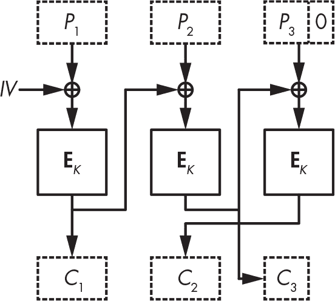

图 4-9：用于 CBC 模式加密的密文盗用

密文盗用没有什么重大问题，但它不够优雅，且很难做到正确，尤其是当 NIST 的标准指定了三种不同的实现方式时（参见《特别出版物 800-38A》）。

#### 计数器模式

为了避免密文盗用带来的问题，同时保留其好处，可以使用计数器模式（CTR）。CTR 几乎不是一种块密码模式：它将块密码转化为流密码，直接接受比特并输出比特，不需要担心“块”的概念。（我将在第五章详细讨论流密码。）

在 CTR 模式下（参见图 4-10），块密码算法不会转换明文数据。相反，它加密由计数器和随机数组成的块。*计数器*是一个整数，每个块都会递增。消息中的不同块不应使用相同的计数器，但不同的消息可以使用相同的计数器值序列（1, 2, 3, ……）。*随机数*是一个只使用一次的数字。它对于单一消息中的所有块都是相同的，但不同的消息不应使用相同的随机数。

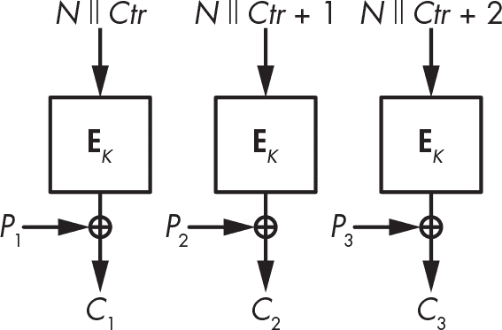

图 4-10：CTR 模式

图 4-10 展示了在 CTR 模式下，加密操作是将明文与通过“加密”随机数*N*和计数器*Ctr*得到的流进行异或。解密过程相同，因此加密和解密都只需要加密算法。Python 脚本清单 4-6 为你提供了一个实践示例。

```
#!/usr/bin/env python

from cryptography.hazmat.primitives.ciphers import Cipher, algorithms, modes
from os import urandom

BLOCK_SIZE = 16
KEY_SIZE = 16

# Pick a random key.
k = urandom(KEY_SIZE)
print(f"k  = {k.hex()}")

# And a random nonce
# (careful with random nonces, see discussion below).
n = urandom(BLOCK_SIZE)
print(f"nonce  = {n.hex()}")

# Create a 7-byte plaintext p.
p = bytes([0x00] * 7)

# Encrypt the plaintext p with AES-CTR.
aes_ctr_encryptor = Cipher(algorithms.AES(k), modes.CTR(n)).encryptor()

c = aes_ctr_encryptor.update(p) + aes_ctr_encryptor.finalize()
print(f"enc({p.hex()}) = {c.hex()}")

# Decrypt the ciphertext c.
aes_ctr_decryptor = Cipher(algorithms.AES(k), modes.CTR(n)).decryptor()
p = aes_ctr_decryptor.update(c) + aes_ctr_decryptor.finalize()
print(f"dec({c.hex()}) = {p.hex()}")

# Decrypt the ciphertext c using the encryption function.
aes_ctr_encryptor = Cipher(algorithms.AES(k), modes.CTR(n)).encryptor()
p = aes_ctr_encryptor.update(c) + aes_ctr_encryptor.finalize()
print(f"enc({c.hex()}) = {p.hex()}")
```

清单 4-6：在 CTR 模式下使用 AES

这个示例执行加密一个 4 字节的明文并得到一个 4 字节的密文。然后它使用加密函数解密该密文：

```
$ **./aes_ctr.py**
k = 130a1aa77fa58335272156421cb2a3ea
enc(00010203) = b23d284e
enc(b23d284e) = 00010203
```

与 CBC 中的初始值一样，加密者提供 CTR 的 nonce，并将其与密文一起明文发送。但与 CBC 的初始值不同，CTR 的 nonce 不需要是随机的；它只需要是唯一的。nonce 应该是唯一的，原因与我们不应该重用一次性密码本相同：当调用伪随机流*S*时，如果你用相同的 nonce 加密*P*[1]得到*C*[1] = *P*[1] ⊕ *S*，并且用相同的 nonce 加密*P*[2]得到*C*[2] = *P*[2] ⊕ *S*，那么*C*[1] ⊕ *C*[2]就会揭示出*P*[1] ⊕ *P*[2]。

只有当 nonce 足够长时，随机 nonce 才能奏效；例如，如果 nonce 是*n*位，那么在进行了 2*^n*^(/2)次加密及同样多的 nonce 后，你可能会遇到重复。64 位对于随机 nonce 来说是不够的，因为你可以预期在大约 2³²个 nonce 之后会发生重复，这个数字是不可接受的低。

如果每个新的明文都递增计数器，且计数器足够长——例如，64 位计数器——那么计数器将保证是唯一的。

CTR 的一个特别好处是，它比任何其他模式都更快。不仅如此，它是可并行化的，而且你甚至可以在不知道消息的内容之前，通过选择一个 nonce 并计算你将来与明文异或的流来开始加密。

> 注意

*根据我们实现的 CTR 版本，我们可能会将 API 使用的 nonce 与计数器作为参数连接起来（如图 4-10 所示），或直接将计数器视为与块一样宽。*

### 事物可能出错的地方

有两种必须了解的块密码攻击：Meet-in-the-middle 攻击，这是一种在 1970 年代发现的技术，至今仍在许多密码分析攻击中使用（不要与 man-in-the-middle 攻击混淆），以及填充 Oracle 攻击，这是一类在 2002 年由学术密码学家发现的攻击，最初被忽视，直到十年后重新被发现，并与若干脆弱应用程序一起曝光。

#### Meet-in-the-Middle 攻击

3DES 块密码是 1970 年代标准 DES 的升级版，使用 56 × 3 = 168 位密钥（比 DES 的 56 位密钥有所改进）。但是，3DES 的安全级别是 112 位而不是 168 位，这是由于*meet-in-the-middle (MitM)*攻击。

图 4-11 显示了 3DES 如何使用 DES 加密和解密函数加密一个块：首先使用密钥*K*[1]进行加密；然后使用密钥*K*[2]进行解密；最后使用密钥*K*[3]进行加密。如果*K*[1] = *K*[2]，则前两次调用会相互抵消，3DES 简化为一个使用密钥*K*[3]的单一 DES。3DES 进行加密-解密-加密，而不是三次加密，以便在需要时使用新的 3DES 接口模拟 DES。

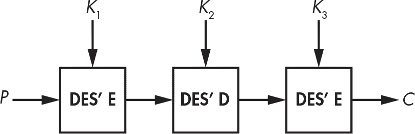

图 4-11：3DES 块密码结构

为什么使用三重 DES 而不是仅使用双重 DES——也就是说，为什么将明文 *P* 加密为 **E**(*K*[2], **E**(*K*[1], *P*))？事实证明，MitM 攻击使双重 DES 的安全性仅与单一 DES 相当。图 4-12 展示了 MitM 攻击的实际应用。

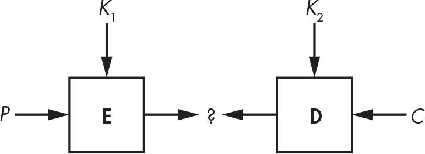

图 4-12：MitM 攻击

MitM 攻击用于攻击双重 DES 的过程如下：

1.  假设你有 *P* 和 *C* = **E**(*K*[2], **E**(*K*[1], *P*))，其中有两个未知的 56 位密钥，*K*[1] 和 *K*[2]。（DES 使用 56 位密钥，因此双重 DES 总共使用 112 位密钥。）你构建一个包含 2⁵⁶ 条目的密钥值表 **E**(*K*[1], *P*)，其中 **E** 是 DES 加密函数，*K*[1] 是存储的值。

2.  对于所有 2⁵⁶ 个 *K*[2] 的值，计算 **D**(*K*[2], *C*)，并检查结果值是否作为索引出现在表中（因此作为中间值，如图 4-12 中的问号所示）。

3.  如果你找到一个中间值作为表的索引，获取表中对应的 *K*[1] 并通过使用其他 *P* 和 *C* 对来验证所找到的 (*K*[1], *K*[2]) 是否正确。使用 *K*[1] 和 *K*[2] 对 *P* 进行加密，然后检查得到的密文是否为给定的 *C*。

该方法通过执行约 2⁵⁷ 次操作来恢复 *K*[1] 和 *K*[2]，而不是执行 2¹¹² 次操作：步骤 1 对 2⁵⁶ 个块进行加密，然后步骤 2 对最多 2⁵⁶ 个块进行解密，总共进行 2⁵⁶ + 2⁵⁶ = 2⁵⁷ 次操作。你还需要存储 2⁵⁶ 个每个 15 字节的元素，或者大约 1 EB 的存储空间。虽然这需要大量存储，但有一个技巧可以让你在几乎不占用内存的情况下执行相同的攻击（正如你将在第六章中看到的）。

你可以将 MitM 攻击几乎以与双重 DES 相同的方式应用于 3DES，唯一不同的是第三阶段将遍历所有 2¹¹² 个 *K*[2] 和 *K*[3] 的值。因此，整个攻击在执行大约 2¹¹² 次操作后成功，这意味着尽管 3DES 具有 168 位密钥材料，它只获得了 112 位的安全性。

#### 填充 Oracle 攻击

本章的结尾是 2000 年代最简单却最具破坏力的攻击之一：填充 oracle 攻击。记住，填充是通过额外字节填充明文来完成块的填充。例如，一个 111 字节的明文是六个 16 字节块，后面跟着 15 个字节。在这种情况下，形成一个完整的块填充会添加一个 01 字节。对于一个 110 字节的明文，填充会添加 2 个 02 字节。对于一个 109 字节的明文，它会添加 3 个 03 字节，依此类推，直到添加 16 个 10 字节，其中十六进制值 10 等于 16。

*填充 oracle* 是一个系统，它的行为取决于 CBC 加密密文的填充是否有效。你可以将它看作一个黑盒或一个 API，当收到格式不正确的密文时，它返回一个 *成功* 或 *错误* 的值。例如，你可以在远程主机上的某个服务中获得一个填充 oracle，当它接收到格式不正确的密文时，会发送错误消息。给定这样的 oracle，填充 oracle 攻击记录哪些输入具有有效填充，哪些没有，然后利用这些信息来解密选定的密文值。

假设你想解密一个密文块 *C*[2]。我将 *X* 称为你正在寻找的值，即 **D**(*K*, *C*[2])，*P*[2] 是在 CBC 模式下解密后得到的块（参见 图 4-13）。如果你选择一个随机块 *C*[1] 并将两个块的密文 *C*[1] || *C*[2] 发送到 oracle，只有当 *C*[1] ⊕ *X = P*[2] 以有效填充结尾时，解密才会成功——一个 01 字节、两个 02 字节、或者三个 03 字节，依此类推。

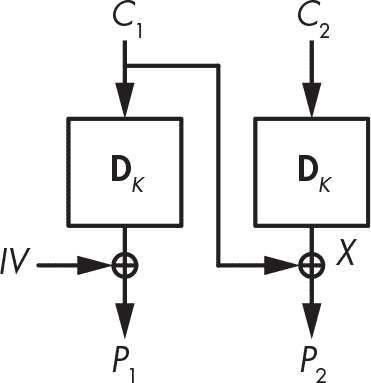

图 4-13：填充 oracle 攻击恢复 X 通过选择 C1 并检查填充的有效性。

基于这一观察，CBC 加密中的填充 oracle 攻击可以像这样解密一个块 *C*[2]（字节以数组表示法表示：*C*[1][0] 是 *C*[1] 的第一个字节，*C*[1][1] 是第二个字节，以此类推，到 *C*[1][15]，*C*[1] 的最后一个字节）：

1.  选择一个随机块 *C*[1]，并改变其最后一个字节，直到填充 oracle 接受该密文为有效。通常，在有效的密文中，*C*[1][15] ⊕ *X*[15] = 01，所以你将在尝试大约 128 个 *C*[1][15] 的值后找到 *X*[15]。

2.  通过将*C*[1][15]设置为*X*[15] ⊕ 02来查找值*X*[14]，然后搜索给出正确填充的*C*[1][14]。当 oracle 接受密文为有效时，意味着你已经找到了*C*[1][14]，使得*C*[1][14] ⊕ *X*[14] = 02。

3.  对所有 16 个字节重复步骤 1 和 2。

攻击平均需要对每个 16 个字节的 oracle 进行 128 次查询，总共约 2,000 次查询。（请注意，每次查询必须使用相同的初始值。）

> 注意

*实际上，实现一个填充 oracle 攻击比我所描述的要复杂一些，因为你必须处理第 1 步中的错误猜测。一个密文可能有有效的填充，不是因为* P2 *以单个01结尾，而是因为它以两个02字节或三个03字节结尾。你可以通过测试修改了更多字节的密文来管理这一点。*

### 进一步阅读

关于分组密码有很多可以讨论的内容，无论是算法如何工作，还是如何被攻击。例如，Feistel 网络和 SPN 并不是构建分组密码的唯一方式。分组密码 IDEA 和 FOX 使用 Lai–Massey 结构，而 Threefish 使用 ARX 网络，这是加法、字轮换和异或的组合。

还有比 ECB、CBC 和 CTR 更多的模式。有些模式是民间传说中的技术，没有人使用，比如 CFB 和 OFB，而其他模式则用于特定应用，如 XTS 用于可调加密，或 GCM 用于认证加密。

我已经讨论了 Rijndael，AES 的获胜者，但在比赛中还有其他 14 种算法：CAST-256、CRYPTON、DEAL、DFC、E2、FROG、HPC、LOKI97、Magenta、MARS、RC6、SAFER+、Serpent 和 Twofish。我建议查阅它们，看看它们是如何工作的，如何设计的，如何被攻击的，以及它们的速度如何。还值得查看 NSA 的设计（Skipjack，最近的 SIMON 和 SPECK）以及更近期的“轻量级”分组密码，如 GIFT、KATAN、PRESENT 或 PRINCE。
