<hgroup>

## <samp class="SANS_Futura_Std_Bold_Condensed_B_11">5</samp> <samp class="SANS_Dogma_OT_Bold_B_11">流加密</samp>

</hgroup>


对称加密可以是分组加密或流加密。回顾第四章，分组加密将明文的若干位与密钥位混合，生成相同大小的密文块，通常为 64 位或 128 位。另一方面，流加密不混合明文和密钥位；相反，它们从密钥生成伪随机位，通过将其与明文进行异或加密，类似于第一章中解释的一次性密码本。

流加密有时被排斥，因为它们在历史上比分组加密更脆弱，更容易被破解——无论是业余爱好者设计的实验性算法，还是被数百万用户使用的系统中的加密算法，包括手机、Wi-Fi 和公共交通智能卡。但幸运的是，尽管花了将近 20 年时间，我们现在知道如何设计安全的流加密算法，并信任它们来保护蓝牙连接、移动 4G 通信和 TLS 连接。

本章首先介绍流加密的工作原理，并讨论流加密的两大主要类别：有状态流加密和基于计数器的流加密。然后我们将研究硬件和软件导向的流加密算法，并查看一些不安全的加密算法（如在 GSM 移动通信中使用的 A5/1 和在旧版 TLS 中使用的 RC4）以及安全的、最先进的算法（如硬件中的 Grain-128a 和软件中的 Salsa20）。

### <samp class="SANS_Futura_Std_Bold_B_11">流加密的工作原理</samp>

流加密更像是确定性随机比特生成器（DRBG），而非分组加密，因为它们生成的是伪随机比特流，而不是直接混合明文数据。

流加密与确定性随机比特生成器（DRBG）不同之处在于，DRBG 只接受一个输入值，而流加密接受两个值：一个密钥和一个随机数。密钥应当保密，通常为 128 位或 256 位。随机数不必保密，但应当对每个密钥唯一，通常为 64 位到 128 位之间。

流加密生成我们称之为*密钥流*的伪随机比特流。为了加密密钥流，我们将其与明文进行异或操作，然后再与密文进行异或操作以解密。图 5-1 展示了基本的流加密操作，其中**SC**是流加密算法，*KS*是密钥流，*P*是明文，*C*是密文。

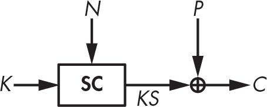

<samp class="SANS_Futura_Std_Book_Oblique_I_11">图 5-1：流加密如何加密，使用一个秘密密钥</samp> <samp class="SANS_Futura_Std_Book_11">K</samp><samp class="SANS_Futura_Std_Book_Oblique_I_11">和一个公共随机数</samp> <samp class="SANS_Futura_Std_Book_11">N</samp>

流密码计算 *KS* = **SC**(*K*, *N*)，加密过程为 *C* = *P* ⊕ *KS*，解密过程为 *P* = *C* ⊕ *KS*。加密和解密函数是相同的，因为它们执行的是相同的操作——即用密钥流对位进行异或运算。因此，例如，某些加密库提供一个单一的 <samp class="SANS_TheSansMonoCd_W5Regular_11">encrypt</samp> 函数来处理加密和解密。

流密码允许你使用密钥 *K*[1] 和随机数 *N*[1] 加密一条消息，然后使用不同的密钥 *K*[1] 和随机数 *N*[2] 加密另一条消息，或者使用密钥 *K*[2]（不同于 *K*[1]）和随机数 *N*[1]。然而，你绝不应再使用 *K*[1] 和 *N*[1] 进行加密，因为这样会重复使用相同的密钥流 *KS*。也就是说，你将得到第一个密文 *C*[1] = *P*[1] ⊕ *KS* 和第二个密文 *C*[2] = *P*[2] ⊕ *KS*，如果你知道 *P*[1]，那么你可以通过 *C*[1] ⊕ *C*[2] ⊕ *P*[1] 来确定 *P*[2]。

> <samp class="SANS_Dogma_OT_Bold_B_15">注意</samp>

随机数 *是“仅使用一次的数字”（number used only once）的缩写。在流密码的上下文中，我们有时称其为*IV*，即“初始化值”（initial value）。*

从高层次来看，流密码分为两种类型：有状态流密码和基于计数器的流密码。*有状态流密码* 有一个在生成密钥流过程中不断变化的内部状态。该密码从密钥和随机数初始化状态，然后调用更新函数以更新状态值，并从状态生成一个或多个密钥流位，如图 5-2 所示。例如，RC4 是有状态的，而 Salsa20 是基于计数器的。

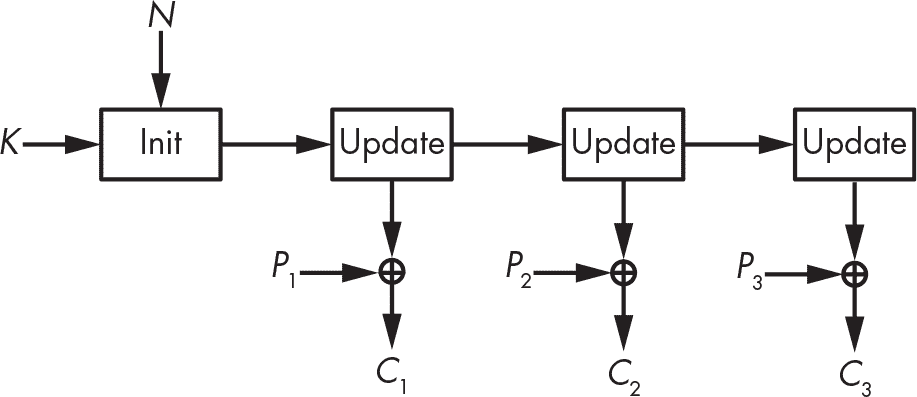

<samp class="SANS_Futura_Std_Book_Oblique_I_11">图 5-2：有状态流密码</samp>

*基于计数器的流密码* 通过一个密钥、一个随机数和一个计数器值生成密钥流块，如图 5-3 所示。与有状态流密码不同，基于计数器的流密码，如 Salsa20，在生成密钥流时不跟踪任何秘密信息，除了计数器的值。

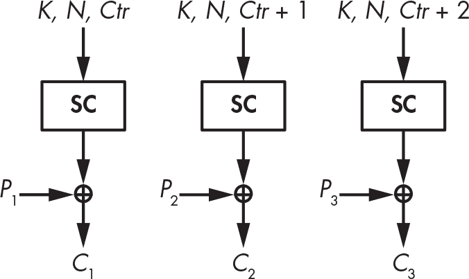

<samp class="SANS_Futura_Std_Book_Oblique_I_11">图 5-3：基于计数器的流密码</samp>

这两种方法定义了流密码的高级架构，和核心算法如何工作无关。流密码的内部结构也分为两类，具体取决于密码的目标平台：硬件导向和软件导向。

### <samp class="SANS_Futura_Std_Bold_B_11">硬件导向流密码</samp>

当密码学家谈论硬件时，他们指的是专用集成电路（ASIC）、可编程逻辑设备（PLD）和现场可编程门阵列（FPGA）。一个密码算法的硬件实现是一个电子电路，它在比特级别上实现密码学算法，且不能用于其他任何用途；换句话说，该电路是*专用硬件*。另一方面，密码学算法的软件实现只是告诉微处理器执行什么指令来运行该算法。这些指令作用于字节或字（byte/word），然后调用一些实现通用操作（如加法和乘法）的电子电路。软件处理的是 32 位或 64 位的字节或字，而硬件处理的是比特（bit）。最早的流密码算法处理的是比特，以节省复杂的字级操作，从而在硬件上更加高效，这是当时它们的目标平台。

流密码算法主要用于硬件实现，因为它们比块密码算法更便宜。它们需要的内存和逻辑门比块密码算法少，因此在集成电路上占用的面积更小，从而降低了制造成本。例如，按门等效数计算，这是集成电路的标准面积度量，你会发现流密码算法只需要不到 1000 个门等效；相比之下，典型的面向软件的块密码算法至少需要 10000 个门等效，使得加密比使用流密码算法时贵了一个数量级。

然而，如今块密码算法的成本不再高于流密码算法——首先，因为现在有一些硬件友好的块密码算法，它们的体积几乎和流密码一样小，其次，因为硬件成本大幅下降。然而，流密码算法通常与硬件相关联，因为它们曾是最优选择。

在下一节中，我将解释硬件流密码背后的基本机制，即*反馈移位寄存器（FSR）*。几乎所有硬件流密码都以某种方式依赖于 FSR，无论是 2G 手机中使用的 A5/1 密码，还是更新的 Grain-128a 密码。

> <samp class="SANS_Dogma_OT_Bold_B_15">注意</samp>

*第一个标准块密码算法，数据加密标准（DES），是为了硬件优化的，而非软件。当美国政府在 1970 年代将 DES 标准化时，大多数目标应用都是硬件实现。因此，DES 中的 S 盒在硬件实现时非常小且计算快速，但在软件中却效率低下，这也就不足为奇了。与 DES 不同，当前的高级加密标准（AES）处理的是字节，因此在软件中比 DES 更加高效。*

#### <samp class="SANS_Futura_Std_Bold_Condensed_Oblique_BI_11">反馈移位寄存器</samp>

无数的流密码使用 FSR，因为它们简单且易于理解。FSR 是一个由比特组成的数组，配备了一个更新的 *反馈函数*，我将其表示为 **f**。FSR 的状态存储在数组或寄存器中，每次 *更新* FSR 时，使用反馈函数来更改状态值并产生一个输出比特。

在实际应用中，FSR 的工作方式如下：如果 *R*[0] 是 FSR 的初始值，那么下一状态 *R*[1] 被定义为将 *R*[0] 向左移 1 位，其中离开寄存器的比特作为输出，而空缺的位置由 **f**(*R*[0]) 填充。

我们重复相同的规则来计算后续的状态值 *R*[2]、*R*[3] 等。也就是说，给定 *R*t，FSR 在时刻 *t* 的状态，下一状态 *R*[t + 1] 为以下内容：


在此方程中，<samp class="SANS_TheSansMonoCd_W5Regular_11">|</samp> 是逻辑或运算符，<samp class="SANS_TheSansMonoCd_W5Regular_11"><<</samp> 是移位运算符，像 C 语言中使用的那样。例如，给定 8 位字符串 00001111，我们得到：


比特移位将比特向左移动，丢失最左边的比特以保持状态的比特长度，并将最右边的比特归零。FSR 的更新操作是相同的，唯一不同的是最右边的比特不被设置为 0，而是被设置为 **f**(*R*t)。

例如，考虑一个 4 比特的 FSR，其反馈函数 **f** 对所有 4 比特进行异或运算。将状态初始化为以下内容：


现在将比特向左移动，其中 1 是输出，最右边的比特设置为以下内容：


现在状态变为：


下一次更新输出 1，将状态左移，并将最右边的比特设置为以下内容：


现在状态如下：


接下来的三次更新返回三个 0 比特，并给出以下状态值：


因此，在五次迭代后我们回到了初始状态 1100；从此循环中观察到的任何值更新状态五次都能回到这个初始值。我们说，给定任一值 1100、1000、0001、0011 或 0110，5 是 FSR 的 *周期*。因为该 FSR 的周期是 5，时钟信号钟动寄存器 10 次会得到两次相同的 5 位序列。同样，如果从 1100 开始时钟信号钟动寄存器 20 次，输出比特将是 11000110001100011000，或者四次相同的 5 位序列 11000。直观上，这种重复模式应该避免，较长的周期对安全性更好。

> <samp class="SANS_Dogma_OT_Bold_B_15">注意</samp>

*如果你打算在流密码中使用 FSR，请避免使用周期较短的 FSR，因为它们的输出更容易预测。对于某些类型的 FSR，容易推算出它们的周期，但对于其他类型几乎不可能做到这一点。*

图 5-4 展示了这个周期的结构，以及该 FSR 的其他周期，每个周期都是一个圆圈，圆圈中的点代表寄存器的一个状态。

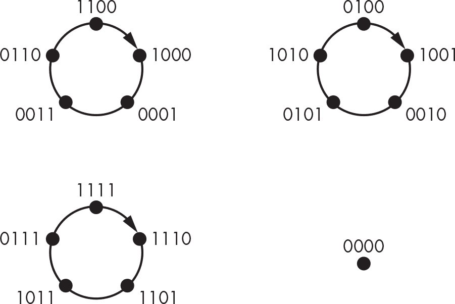

<samp class="SANS_Futura_Std_Book_Oblique_I_11">图 5-4: FSR 的周期，其中反馈函数将 4 个位进行异或运算</samp>

实际上，这个特定的 FSR 有两个其他的周期-5 循环——{0100, 1001, 0010, 0101, 1010}和{1111, 1110, 1101, 1011, 0111}。请注意，任何给定的状态只能属于一个状态循环。在这里，我们有三个周期，每个周期包含五个状态，涵盖了 4 位寄存器的 16 个可能值中的 15 个。第 16 个可能值是 0000，正如图 5-4 所示，它是一个周期-1 循环，因为 FSR 将 0000 转换为 0000。

FSR 本质上是一个位寄存器，每次更新寄存器时都会输出一个位（寄存器最左边的位），并且有一个函数计算寄存器的新最右位。（所有其他位都会左移。）一个 FSR 的周期，从某个初始状态开始，是需要的更新次数，直到 FSR 再次进入相同的状态。如果需要*N*次更新才能做到这一点，那么 FSR 将一次又一次地生成相同的*N*个位。

##### <samp class="SANS_Futura_Std_Bold_Condensed_B_11">线性反馈移位寄存器</samp>

*线性反馈移位寄存器 (LFSRs)* 是具有*线性*反馈函数的 FSRs——即，一个反馈函数，它是某些状态位的异或（XOR）运算，如前一节中的 4 位 FSR 示例及其反馈函数返回寄存器 4 个位的异或运算。回想一下，在密码学中，线性意味着可预测性，暗示着简单的数学结构。而且，正如你所预期的那样，正因为这种线性特性，我们可以使用线性复杂度、有限域和原始多项式等概念来分析 LFSRs——但我会跳过数学细节，只给出基本的事实。

> <samp class="SANS_Dogma_OT_Bold_B_15">注意</samp>

*在线性代数中，我们定义一个线性变换* ***f*** *为一个满足* ***f****(*u *+* v*) =* ***f****(*u*) +* ***f****(*v*) 的函数。如果你知道* ***f***(u) *和* ***f****(*v*)，那么你就可以在不知道* u *或* v*的情况下确定* ***f****(*u *+* v*)*。对于非线性函数，情况要复杂得多；你无法轻易地从* ***f****(*u*) 和* ***f****(*v*)* 找到* ***f****(*u *+* v*)*。*

选择哪些位进行异或运算对 LFSR 的周期至关重要，从而影响其加密值。好消息是，我们知道如何选择位的位置，以确保最大周期为 2*^n* – 1。具体来说，我们从右至左，分别为位 1 到位*n*，写出多项式表达式 1 + *X* + *X*² + ... + *X* *^n*，其中只有当第*i*个位置的位被用在反馈函数中的异或运算时，才包括项 *X* *^i*。只有当该多项式是*原始的*，周期才是最大周期。要使多项式是原始的，它必须具备以下性质：

+   多项式必须是不可约的，这意味着它不能被因式分解——也就是说，不能写成更小的多项式的积。例如，*X* + *X*³ 不是不可约的，因为它等于(1 + *X*)(*X* + *X*²)：


+   该多项式必须满足某些其他数学性质，这些性质无法用简单的数学概念解释，但可以通过测试轻松验证。

> <samp class="SANS_Dogma_OT_Bold_B_15">注意</samp>

*n*位 LFSR 的最大周期是 2*^n* – 1，而不是 2*^n*，因为全零状态总是自循环，永远不变。由于任何数量的零异或结果都是零，来自反馈函数的输入位将始终为零；因此，全零状态注定会保持全零。 

例如，图 5-5 显示了一个 4 位 LFSR，其反馈多项式为 1 + *X* + *X*³ + *X*⁴，在此我们将位置 1、3 和 4 的位进行异或运算，计算出新的位，设为*L*[1]。然而，这个多项式不是原始的，因为它可以因式分解为(1 + *X*³)(1 + *X*)。

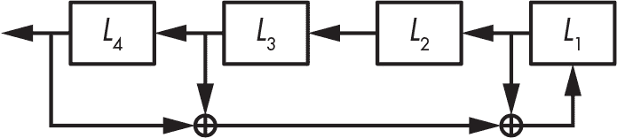

<samp class="SANS_Futura_Std_Book_Oblique_I_11">图 5-5：具有反馈多项式 1 +</samp> <samp class="SANS_Futura_Std_Book_11">X</samp> <samp class="SANS_Futura_Std_Book_Oblique_I_11">+</samp> <samp class="SANS_Futura_Std_Book_11">X</samp><samp class="SANS_Futura_Std_Book_Oblique_I-SUP_11">3</samp> <samp class="SANS_Futura_Std_Book_Oblique_I_11">+</samp> <samp class="SANS_Futura_Std_Book_11">X</samp><samp class="SANS_Futura_Std_Book_Oblique_I-SUP_11">4</samp>

实际上，图 5-5 中的 LFSR 的周期不是最大周期。为了证明这一点，从状态 0001 开始：


现在左移 1 位，并将新位设为 0 + 0 + 1 = 1：


再进行五次相同操作，得到以下状态值：


六次更新后的状态与初始状态相同，这表明我们处于一个周期为 6 的循环中，证明该 LFSR 的周期不是最大值 15。

现在我们来看一个具有最大周期的 LFSR，参考图 5-6 中的 LFSR。

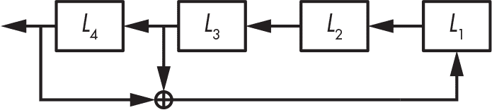

<samp class="SANS_Futura_Std_Book_Oblique_I_11">图 5-6：一个具有反馈多项式 1 +</samp> <samp class="SANS_Futura_Std_Book_11">X</samp><samp class="SANS_Futura_Std_Book_Oblique_I-SUP_11">3</samp> <samp class="SANS_Futura_Std_Book_Oblique_I_11">+</samp> <samp class="SANS_Futura_Std_Book_11">X</samp><samp class="SANS_Futura_Std_Book_Oblique_I-SUP_11">4</samp><samp class="SANS_Futura_Std_Book_Oblique_I_11">，一个原始多项式，确保最大周期</samp>

该反馈多项式是一个原始多项式，描述为 1 + *X*³ + *X*⁴，你可以验证它的周期是最大值（即 15）。从初始值开始，状态按以下方式演变（从 0001 到 0010、0100、1001、0011，依此类推）：


该状态遍历所有可能的值，除了 0000，并且在最终循环之前没有重复。这证明了周期是最大值，且反馈多项式是原始的。

可惜的是，使用 LFSR 作为流密码并不安全。如果*n*是 LFSR 的位长度，攻击者只需要*n*个输出位就能恢复 LFSR 的初始状态，从而确定所有之前的位并预测所有未来的位。之所以可能发生这种攻击，是因为 LFSR 是线性的，这意味着状态位之间的关系服从线性方程，解决这些方程是很简单的。你可以使用 Berlekamp–Massey 算法来解决由 LFSR 数学结构定义的方程，不仅可以找到 LFSR 的初始状态，还可以找到其反馈多项式。实际上，你甚至不需要知道 LFSR 的确切长度就能成功；你可以对所有可能的*n*值重复 Berlekamp–Massey 算法，直到找到正确的值。

结论是，LFSR 在密码学上较弱，因为它们是线性的。输出位和初始状态位通过简单且简短的方程关联，你可以使用高中线性代数技巧来解决这些方程。为了增强 LFSR 的安全性，我们可以加入一点非线性。

##### <samp class="SANS_Futura_Std_Bold_Condensed_B_11">过滤 LFSR</samp>

为了减轻 LFSR 的不安全性，可以通过在返回之前将其输出位通过非线性函数进行处理来隐藏其线性特性，从而产生一个*过滤 LFSR*，正如图 5-7 所示。

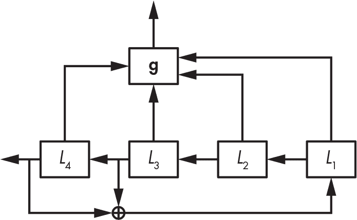

<samp class="SANS_Futura_Std_Book_Oblique_I_11">图 5-7：一个过滤 LFSR</samp>

图 5-7 中的**g**函数必须是一个*非线性*函数——它不仅进行 XOR 操作，还结合了逻辑与或运算。例如，*L*[1]*L*[2] + *L*[3]*L*[4]是一个非线性函数（我省略了乘号，因此*L*[1]*L*[2]表示*L*[1] × *L*[2]，或者使用 C 语法表示为*L*[1] & *L*[2]）。

> <samp class="SANS_Dogma_OT_Bold_B_15">注意</samp>

*你可以直接用 FSR 的位表示反馈函数，比如* L1L2 *+* L3L4*，或者使用等效的多项式表示法 1 +* XX*²* +* X*³*X*⁴**。直接表示法更容易理解，但多项式表示法更适用于 FSR 属性的数学分析。除非我们关心数学属性，否则我们会坚持使用直接表示法。*

滤波 LFSR 比普通 LFSR 更强，因为它们的非线性函数能阻止直接攻击。不过，像以下这样的更复杂攻击仍然能够破解系统：

**代数攻击** 解出从输出位推导出的非线性方程系统，其中方程中的未知数是 LFSR 状态的位。

**立方体攻击** 计算非线性方程的导数，将系统的次数降到 1，然后像线性系统一样高效地求解。

**快速相关攻击** 利用过滤函数，尽管它们是非线性的，但通常表现得像线性函数。

这里的教训，如我们在前面的例子中看到的那样，是创可贴无法修补枪伤。用稍微强一点的层来修补破损的算法并不能使整个系统变得安全。你必须从核心解决问题。

##### <samp class="SANS_Futura_Std_Bold_Condensed_B_11">非线性 FSR</samp>

*非线性 FSR（NFSR）*类似于 LFSR，但它有一个非线性的反馈函数，而不是线性的。反馈函数不仅仅是按位 XOR 操作，它还可以包括按位与（AND）和或（OR）操作——这既有优点也有缺点。

非线性反馈函数的一个好处是，它们使 NFSR 在密码学上比 LFSR 更强，因为输出位依赖于初始秘密状态，并且根据指数大小的方程进行复杂的计算。LFSR 的线性函数使关系保持简单，最多有*n*项（*N*[1]，*N*[2]，...，*N*[n]，如果*N*是 NFSR 的状态位）。例如，一个 4 位的 NFSR，初始秘密状态为(*N*[1]，*N*[2]，*N*[3]，*N*[4])，反馈函数为*N*[1] + *N*[2] + *N*[1]*N*[2] + *N*[3]*N*[4]，其第一个输出位为以下表达式：


第二次迭代将*N*[1]值替换为新的位。将第二个输出位用初始状态表示，我们得到以下方程：


这个新方程的代数次数为 3（最高次乘积的位数，这里是*N*[1]*N*[3]*N*[4]），而不是反馈函数的次数 2，并且它有六个项而不是四个。因此，迭代非线性函数会迅速产生无法处理的方程，因为输出的大小呈指数增长。尽管在运行 NFSR 时你永远不会计算这些方程，攻击者必须解决它们才能破解系统。

NFSR 的一个缺点是，没有高效的方法来确定 NFSR 的周期或知道其周期是否最大。对于一个 *n* 位的 NFSR，你需要进行接近 2*^n* 次试验，才能验证其周期是否最大。对于 80 位或更大位数的 NFSR，这种计算几乎是不可能的。

幸运的是，使用 NFSR 而不必担心短周期有一个技巧：你可以将 LFSR 和 NFSR 结合起来，既能确保最大周期，又能提供加密强度——这正是 Grain-128a 的工作原理。

#### <samp class="SANS_Futura_Std_Bold_Condensed_Oblique_BI_11">Grain-128a</samp>

还记得在第四章中讨论的 AES 竞赛吗？流密码 Grain 是一个类似项目 eSTREAM 竞赛的产物。这个竞赛于 2008 年结束，推荐了多个流密码，其中包括四个面向硬件的密码和四个面向软件的密码。Grain 就是其中一个硬件密码，Grain-128a 是 Grain 的原始作者升级版。图 5-8 展示了 Grain-128a 的工作机制。

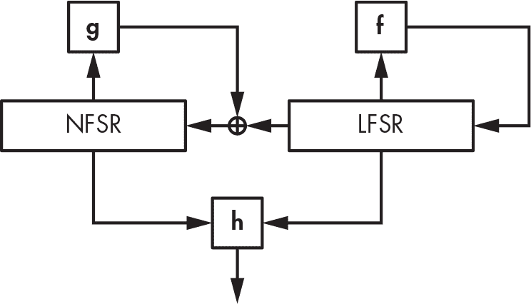

<samp class="SANS_Futura_Std_Book_Oblique_I_11">图 5-8：Grain-128a 的机制，带有 128 位 NFSR 和 128 位 LFSR</samp>

Grain-128a 可以说是流密码中最简单的一种，结合了一个 128 位的 LFSR、一个 128 位的 NFSR 和一个滤波函数 **h**。LFSR 的最大周期为 2¹²⁸ – 1，确保整个系统的周期至少为 2¹²⁸ – 1，以防 NFSR 存在潜在的短周期。同时，NFSR 和非线性滤波函数 **h** 增强了加密强度。

Grain-128a 采用一个 128 位的密钥和一个 96 位的 nonce。它将 128 位的密钥位复制到 NFSR 的 128 位中，将 96 位的 nonce 位复制到前 96 位 LFSR 中，剩下的 32 位用 1 填充，最后一个位填充为 0。初始化阶段会更新整个系统 256 次，然后返回第一个密钥流位。在初始化过程中，**h** 函数返回的位不会作为密钥流输出，而是进入 LFSR，以确保其后续状态依赖于密钥和 nonce。

Grain-128a 的 LFSR 反馈函数是


*L*[1]、*L*[2]、……、*L*[128] 是 LFSR 的位。这个反馈函数只从 128 位的 LFSR 中取出 6 位，但这足以得到一个原始多项式，确保最大周期。较少的位数最小化了硬件实现的成本。

这是 Grain-128a 的 NFSR 的反馈多项式（*N*[1]，……，*N*[128]）：

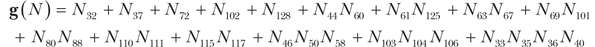

这个函数经过精心选择，以最大化其加密强度，同时最小化实现成本。它的代数度为 4，因为其项中包含最多的变量（即 *N*[33]*N*[35]*N*[36]*N*[40]）。此外，**g** 不能通过线性函数来逼近，因为它是高度非线性的。而且，除了 **g** 之外，Grain-128a 还将来自 LFSR 的位与结果进行异或运算，将该结果反馈回 NFSR 的新右侧位。

过滤器函数 **h** 是另一个非线性函数；它从 NFSR 中提取 9 位，从 LFSR 中提取 7 位，并以一种确保良好加密属性的方式将它们组合起来。

在我写这篇文章时，Grain-128a 尚未被发现有任何已知的攻击方式，我相信它将继续保持安全。Grain-128a 被用于一些低端嵌入式系统，这些系统需要一种紧凑且快速的流密码——通常是工业专有系统——这也是为什么 Grain-128a 在开源软件社区中鲜为人知的原因。

#### <samp class="SANS_Futura_Std_Bold_Condensed_Oblique_BI_11">A5/1</samp>

A5/1 是一种流密码，用于对 2G 移动通信标准中的语音通信进行加密。A5/1 标准创建于 1987 年，但直到 1990 年代末才公布，因为它是在被逆向工程后才被公开的。攻击在 2000 年代初期出现，最终 A5/1 被破解，可以对加密的通信进行实际（而非理论）解密。让我们来看一下为什么以及如何发生的。

##### <samp class="SANS_Futura_Std_Bold_Condensed_B_11">A5/1 的机制</samp>

如图 5-9 所示，A5/1 依赖于三个 LFSR，并使用一种乍一看似乎很聪明的技巧，但实际上并不安全。

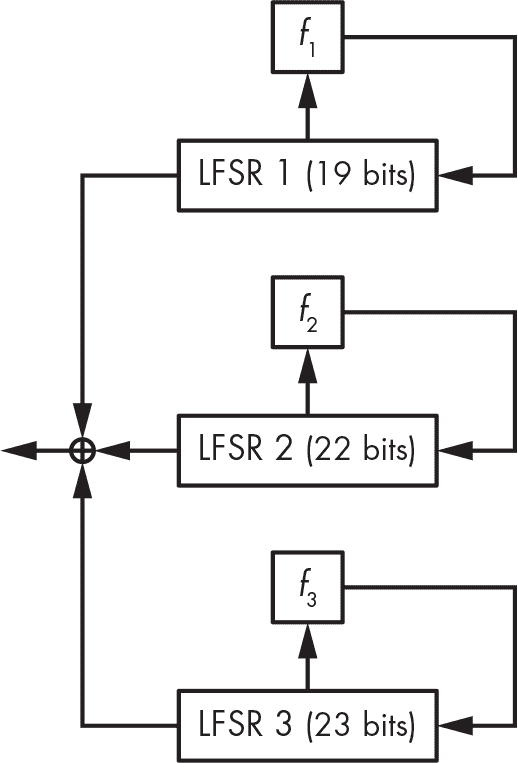

<samp class="SANS_Futura_Std_Book_Oblique_I_11">图 5-9：A5/1 加密算法</samp>

A5/1 使用 19 位、22 位和 23 位的 LFSR，其每个多项式如下：


为什么只使用 LFSR 而没有 NFSR 就能被认为是安全的呢？其中的技巧在于 A5/1 的更新机制。A5/1 的设计者并没有在每个时钟周期都更新三个 LFSR，而是增加了一个时钟规则，具体执行以下操作：

1.  检查 LFSR 1 的第 9 位、LFSR 2 的第 11 位和 LFSR 3 的第 11 位，这些被称为*时钟位*。这三个位中，所有位的值要么相同（1 或 0），要么有两个位的值相同。

2.  时钟更新那些时钟位与多数值相等的寄存器，值为 0 或 1。每次更新时，两个或三个 LFSR 会被时钟同步。

如果没有这个规则，A5/1 根本无法提供任何安全性，绕过这个规则足以破坏加密算法。然而，正如你将看到的，这并非易事。

> <samp class="SANS_Dogma_OT_Bold_B_15">注意</samp>

*在 A5/1 的不规则时钟规则中，每个寄存器在每次更新时以 3/4 的概率进行时钟跳变。换句话说，至少有一个寄存器的位值与其他寄存器相同的概率为 1 - (1/2)**²**，其中 (1/2)**²* *是另外两个寄存器的位值不同的概率。*

2G 通信使用 A5/1，密钥为 64 位，nonce 为 22 位，每个新的数据帧都会改变 nonce。A5/1 的初始化机制首先将所有寄存器设置为零，然后逐位注入密钥，接着是 nonce，注入每一位后寄存器都会更新。然后，系统根据前述的不规则规则更新 100 次。

对 A5/1 的攻击恢复了系统的 64 位初始状态（19 + 22 + 23 的 LFSR 初始值），从而通过解开初始化机制，揭示了 nonce（如果它尚未已知）和密钥。这些攻击是*已知明文攻击（KPA）*，因为部分加密数据是已知的，攻击者可以通过将密文与已知明文块进行异或运算，来确定相应的密钥流部分。

对 A5/1 的攻击主要有两种类型：

**微妙攻击** 利用 A5/1 的内部线性性及其简单的不规则时钟系统。

**暴力攻击** 仅利用 A5/1 的短密钥和帧号注入的可逆性。

让我们看看这些攻击是如何工作的。

##### <samp class="SANS_Futura_Std_Bold_Condensed_B_11">微妙攻击</samp>

我们将研究*猜测并确定*微妙攻击。在这种攻击中，攻击者猜测状态的某些秘密值以确定其他值。在密码分析中，“猜测”意味着暴力破解：对于 LFSR 1 和 2 的每个可能值以及在前 11 个时钟周期中 LFSR 3 的时钟位的所有可能值，攻击通过解方程重建 LFSR 3 的位，这些方程依赖于猜测的位。当猜测正确时，攻击者就能获得 LFSR 3 的正确值。

攻击的伪代码如下：

```
For all 219 values of LFSR 1's initial state
    For all 222 values of LFSR 2's initial state
        For all 211 values of LFSR 3's clocking bit during the first 11 clocks
            Reconstruct LFSR 3's initial state
            Test whether guess is correct; if yes, return; else continue
```

相比第三章中讨论的 2⁶⁴-次尝试的暴力破解搜索，这种攻击效率如何？在最坏的情况下，当算法仅在最后一次测试时成功时，该攻击最多会进行 2¹⁹ × 2²² × 2¹¹ = 2⁵²次操作。假设前述伪代码中的最后两个操作所需的计算量与在暴力破解中测试 64 位密钥所需的计算量相当，那么这比暴力破解搜索速度快了大约 2¹²（或约 4000）倍。但这个假设正确吗？

回顾我们在第三章中关于完整攻击成本的讨论。当评估一次攻击的成本时，我们不仅需要考虑执行攻击所需的计算量，还需要考虑并行性和内存消耗。在这里，这两个问题都不成立：与任何暴力破解攻击一样，猜测并确定攻击是显著并行的（或者在*N*个核心上运行时，速度是*N*倍）且不需要比仅仅运行密码算法更多的内存。

我们的 2⁵²攻击成本估算不准确，还有另一个原因。实际上，每个 2⁵²操作（测试一个密钥候选）所需的时钟周期数是暴力破解攻击测试一个密钥所需时钟周期数的四倍。结果是，这个特定攻击的真实成本接近于 4 × 2⁵² = 2⁵⁴次操作，相比暴力破解攻击。

对 A5/1 的猜测-确定攻击可以解密加密的移动通信，但在一个专用硬件设备集群上运行时，恢复密钥需要几个小时。换句话说，它远未达到实时解密的程度。为此，我们有另一种类型的攻击。

##### <samp class="SANS_Futura_Std_Bold_Condensed_B_11">暴力攻击</samp>

*时间-内存权衡（TMTO）*攻击就是对 A5/1 的暴力攻击。这种攻击不关心 A5/1 的内部结构；它只关心其状态是 64 位长。TMTO 攻击将 A5/1 视为一个黑盒，它接受一个 64 位值（状态）并输出一个 64 位值（前 64 个密钥流位）。

该攻击背后的思想是通过使用大量内存来降低暴力搜索的成本。最简单的 TMTO 类型是一种密码本攻击，其中你预先计算一个包含密钥和值对组合的 2⁶⁴个元素的表，并为每个 2⁶⁴个可能的密钥存储输出值。要使用这个预先计算的表进行攻击，只需收集 A5/1 实例的输出，然后在表中查找哪个密钥对应该输出。攻击本身很快——只需要查找一个内存中的值，但表的创建需要进行 2⁶⁴次 A5/1 计算。更糟糕的是，密码本攻击需要极其庞大的内存：2⁶⁴ × (64 + 64)比特，即 2⁶⁸字节或 256 exabyte。这相当于数十个数据中心，因此我们可以忘掉这一点。

TMTO 攻击通过在攻击的在线阶段增加计算量来减少密码本攻击的内存要求。表越小，破解密钥所需的计算量就越大。无论如何，准备表格的成本大约是 2⁶⁴次操作，但这只需要做一次。

在 2010 年，研究人员花费了约两个月的时间，通过使用图形处理单元（GPU）并并行运行 100,000 个 A5/1 实例，生成了 2TB 的表格。在这些庞大的表格的帮助下，用 A5/1 加密的电话通话几乎可以实时解密。电信运营商已采取了规避措施来减轻这一攻击，但真正的解决方案是在 3G 和 4G 移动通信标准中出现的，这些标准彻底放弃了 A5/1。

### <samp class="SANS_Futura_Std_Bold_B_11">面向软件的流密码</samp><samp class="SANS_Futura_Std_Bold_B_11">-导向流密码</samp>

软件流密码使用字节或 32 位、64 位字而不是单独的比特，这在现代 CPU 上更为高效，因为指令在相同时间内可以对字进行算术运算，效果与对比特的运算一样。软件流密码因此比硬件密码更适合用于服务器或浏览器等个人计算机上的应用，后者通过强大的通用处理器将密码作为原生软件运行。

今天，软件流密码受到了相当大的关注，原因有几个。首先，由于许多设备嵌入了强大的 CPU 且硬件变得更加便宜，因此对小型按位操作的密码需求减少了。例如，4G 移动通信标准中的两个流密码（欧洲的 SNOW3G 和中国的 ZUC）使用 32 位字而非比特，区别于较旧的 A5/1。

其次，流密码在软件中的流行度已超过了分组密码，尤其是在针对 CBC 模式分组密码的填充 oracle 攻击事件后。除此之外，流密码比分组密码更易于指定和实现：它们只是将密钥比特作为秘密输入，而不是将消息和密钥比特混合在一起。事实上，最流行的流密码之一实际上是伪装的分组密码：计数模式下的 AES（CTR）。

一种流行的软件流密码设计被 SNOW3G 和 ZUC 使用，它复制了硬件密码及其 FSR，替换了比特为字节或字。但这些并不是对密码学家最有趣的设计。截至本文撰写时，最受关注的两种设计是 RC4 和 Salsa20，尽管其中一种已经完全被攻破，但它们仍被广泛应用于多个系统中。

#### <samp class="SANS_Futura_Std_Bold_Condensed_Oblique_BI_11">RC4</samp>

RC4 由 RSA 安全公司的 Ron Rivest 于 1987 年设计，并在 1994 年被逆向工程并泄露，长期以来一直是最广泛使用的流密码。RC4 被应用于无数场合，其中最著名的是第一个 Wi-Fi 加密标准 Wired Equivalent Privacy (WEP) 和用于建立 HTTPS 连接的传输层安全协议（TLS）。不幸的是，RC4 对于大多数应用而言并不够安全，包括 WEP 和 TLS。为了理解原因，我们来看看 RC4 的工作原理。

##### <samp class="SANS_Futura_Std_Bold_Condensed_B_11">RC4 工作原理</samp>

RC4 是有史以来最简单的密码之一。它不执行任何类似加密的操作，也没有 XOR、乘法、S-box 等... 什么都没有。它仅仅是交换字节。RC4 的内部状态是一个包含 256 个字节的数组 *S*，最初设置为 *S*[0] = 0, *S*[1] = 1, *S*[2] = 2, ... , *S*[255] = 255，然后通过其 *密钥调度算法（KSA）* 从一个 *n* 字节的 *K* 中初始化，算法的实现如同在 Listing 5-1 中的 Python 代码所示。

```
j = 0
# Set S to the array S[0] = 0, S[1] = 1, . . . , S[255] = 255.
S = range(256)
# Iterate over i from 0 to 255.
for i in range(256):
    # Compute the sum of v.
    j = (j + S[i] + K[i % n]) % 256
    # Swap S[i] and S[j].
    S[i], S[j] = S[j], S[i]
```

<samp class="SANS_Futura_Std_Book_Oblique_I_11">Listing 5-1: RC4 的密钥调度算法</samp>

一旦这个算法完成，数组*S*仍然包含从 0 到 255 的所有字节值，但现在是随机排列的。例如，使用全零 128 位密钥时，状态*S*（从*S*[0]到*S*[255]）变为：


然而，如果我翻转第一个密钥位并重新运行 KSA，我会得到一个完全不同、显然是随机的状态：


给定初始状态*S*，RC4 生成一个与明文*P*长度相同的密钥流*KS*，用来计算密文：*C* = *P* ⊕ *KS*。密钥流*KS*的字节是根据清单 5-2 中的 Python 代码，从*S*计算得出的，前提是*P*是*m*字节长。

```
i = 0
j = 0
for b in range(m):
    i = (i + 1) % 256
    j = (j + S[i]) % 256
    S[i], S[j] = S[j], S[i]
    KS[b] = S[(S[i] + S[j]) % 256]
```

<samp class="SANS_Futura_Std_Book_Oblique_I_11">清单 5-2：RC4 的密钥流生成，其中</samp> <samp class="SANS_Futura_Std_Book_11">S</samp> <samp class="SANS_Futura_Std_Book_Oblique_I_11">是清单 5-1 中初始化的状态</samp>

在清单 5-2 中，每次迭代的<samp class="SANS_TheSansMonoCd_W5Regular_11">for</samp>循环最多会修改 RC4 内部状态*S*的 2 个字节：交换值的*S*[*i*]和*S*[*j*]。也就是说，如果*i* = 0 且*j* = 4，并且如果*S*[0] = 56 且*S*[4] = 78，那么交换操作将*S*[0]设为 78，*S*[4]设为 56。如果*j*等于*i*，则*S*[*i*]不被修改。

这看起来太简单，难以保证安全，然而加密分析师花了 20 年才发现可被利用的漏洞。在这些漏洞被揭示之前，我们仅知道 RC4 在特定实现中的弱点，例如在第一个 Wi-Fi 加密标准 WEP 中。

##### <samp class="SANS_Futura_Std_Bold_Condensed_B_11">WEP 中的 RC4</samp>

WEP，第一代 Wi-Fi 安全协议，由于协议设计和 RC4 的弱点，现在已经完全被破解。

在其 WEP 实现中，RC4 加密 802.11 帧的有效载荷数据，这些数据报（或数据包）在无线网络中传输数据。所有在同一会话中传输的有效载荷都使用相同的 40 位或 104 位秘密密钥，但在帧头中有一个假定为唯一的 3 字节随机数（它编码元数据，并位于实际有效载荷之前）。

问题在于 RC4 不支持随机数（nonce），至少在它的官方规范中没有支持，而没有随机数就无法使用流密码。WEP 的设计者通过一种变通方法解决了这一限制：他们在无线帧的头部包含了一个 24 位的随机数，并将其添加到 WEP 密钥前面，作为 RC4 的密钥使用。也就是说，如果随机数是字节*N*[0]，*N*[1]，*N*[2]，而 WEP 密钥是*K*[0]，*K*[1]，*K*[2]，*K*[3]，*K*[4]，那么实际的 RC4 密钥就是*N*[0]，*N*[1]，*N*[2]，*K*[0]，*K*[1]，*K*[2]，*K*[3]，*K*[4]。最终效果是，40 位的密钥变成了 64 位的有效密钥，104 位的密钥变成了 128 位的有效密钥。结果是什么呢？广告中的 128 位 WEP 协议实际上最多只能提供 104 位的安全性。

但这里是 WEP 的 nonce 技巧的真正问题：

**nonce 太小，只有 24 位** 这意味着，如果为每个新消息随机选择一个 nonce，你必须等待大约 2^(24/2) = 2¹² 个数据包，或者几兆字节的数据流量，直到你能找到两个使用相同 nonce 和相同密钥流加密的数据包。即使 nonce 是一个从 0 到 2²⁴-1 的计数器，在发生溢出之前，也需要几千兆字节的数据量，才能让攻击者通过重复的 nonce 解密数据包。但问题更大。

**以这种方式组合 nonce 和密钥有助于恢复密钥** WEP 的三个非保密 nonce 字节使攻击者能够在密钥调度算法运行三次后确定 *S* 的值。因为这个原因，密码分析师发现第一个密钥流字节强烈依赖于第一个秘密密钥字节——KSA 使用的第四个字节——这种偏差可以被利用来恢复秘密密钥。

利用这些弱点需要访问密文和密钥流——也就是说，已知或选择的明文。但这很容易：已知明文发生在 Wi-Fi 帧封装了带有已知头部的数据时，而选择的明文发生在攻击者注入用目标密钥加密的已知明文时。结果是，攻击在实际中有效，而不仅仅是在理论上。

在 2001 年首次出现 WEP 攻击后，研究人员发现了一些更快速的攻击方法，所需的密文更少。如今，你甚至可以找到像 aircrack-ng 这样的工具，实施整个攻击，从网络嗅探到密码分析。

WEP 的不安全性既来源于 RC4 的弱点，RC4 采用了单次使用的密钥，而不是像任何合适的流密码那样使用密钥和 nonce（一次性随机数），也来源于 WEP 设计本身的缺陷。

现在让我们来看 RC4 的第二大失败。

##### <samp class="SANS_Futura_Std_Bold_Condensed_B_11">TLS 中的 RC4</samp>

TLS 是互联网中使用的最重要的安全协议。它以支撑 HTTPS 连接而广为人知，但也被用于保护一些虚拟专用网络（VPN）连接、电子邮件服务器、移动应用程序等。遗憾的是，TLS 长期以来一直支持 RC4。

与 WEP 不同，TLS 实现没有犯同样明显的错误，即调整 RC4 规格来使用公共 nonce。相反，TLS 只给 RC4 提供了一个独特的 128 位会话密钥，这意味着它比 WEP 稍微不那么容易破解。

TLS 中的弱点仅仅源于 RC4 及其不可原谅的缺陷：统计偏差，或称非随机性，这一点我们知道对于流密码来说是完全不可接受的。例如，RC4 生成的第二个密钥流字节是零的概率为 1/128，而理想情况下它的概率应该是 1/256（回忆一下，一个字节可以取 0 到 255 之间的 256 个值；因此，真正随机的字节零出现的概率应该是 1/256）。更离奇的是，大多数专家直到 2013 年依然相信 RC4，尽管其统计偏差自 2001 年以来就已为人所知。

RC4 已知的统计偏差本应足以让我们彻底放弃这种密码算法，即使我们不知道如何利用这些偏差来危及实际应用。在 TLS 中，RC4 的缺陷直到 2011 年才被公开利用，但据称 NSA 在此之前就已经利用 RC4 的弱点来攻破 TLS 的 RC4 连接。

结果表明，不仅 RC4 的第二个密钥流字节有偏差，前 256 个字节也都有偏差。2011 年，研究人员发现其中一个字节为零的概率等于 1/256 + *c*/256²，其中常数*c*的值介于 0.24 和 1.34 之间。不仅仅是字节零，其他字节值也存在类似的偏差。RC4 令人惊讶之处在于，它在很多非加密伪随机数生成器都能成功的地方失败了——也就是说，它无法生成均匀分布的伪随机字节（即每个 256 个字节中，每个字节都有 1/256 的概率出现）。

RC4 在 TLS 中的缺陷甚至可以在最弱的攻击模型——选择密文攻击中被利用：你收集密文并寻找明文，而不是密钥。但有一个警告：你需要许多密文，并使用不同的密钥多次加密*相同的明文*。我们有时将这种攻击模型称为*广播模型*，因为它类似于将相同的消息广播给多个接收者。

假设你想要解密明文 P 的明文字节*P*[1]，并且通过拦截同一消息的不同密文，获取了多个密文字节。这样，你将得到四个密文的第一个字节*C*¹、*C*²、*C*³、*C*⁴，以及四个密钥流*KS*¹、*KS*²、*KS*³、*KS*⁴，使得：


由于 RC4 的偏差，密钥流字节*KS*[1]*^i*（四个实例中的第一个字节）更可能是零，而不是其他任何字节值。因此，*C*[1]*^i*字节更可能等于*P*[1]，而不是任何其他值。为了确定*P*[1]，给定*C*[1]*^i*字节，只需计算每个字节值出现的次数，并返回出现频率最高的字节作为*P*[1]。然而，由于统计偏差非常小，你需要数百万个值才能以一定的准确性得到正确的结果。

攻击概括为恢复多个明文字节并利用多个偏差值（这里为零）。算法变得稍微复杂了一些。但是，这种攻击很难实施，因为它需要收集许多加密同一明文但使用不同密钥的密文。例如，该攻击无法破解使用 RC4 的所有 TLS 保护连接，因为您需要欺骗服务器将相同明文加密给许多不同的接收者，或者多次使用不同密钥加密给同一接收者。

#### <samp class="SANS_Futura_Std_Bold_Condensed_Oblique_BI_11">Salsa20</samp>

Salsa20 是一种简单的、面向软件的密码算法，专为现代 CPU 优化，已在许多协议和库中实现，以及其变体 ChaCha。其设计者，受人尊敬的密码学家 Daniel J. Bernstein，于 2005 年将 Salsa20 提交给 eSTREAM 竞赛，并在 eSTREAM 的软件组合中赢得了一席之地。Salsa20 的简单性和速度使其在开发者中非常流行。

Salsa20 是基于计数器的流密码 —— 它通过重复处理每个块的计数器来生成密钥流。如图 5-10 所示，*Salsa20 核心* 算法使用密钥（*K*）、一次性数（*N*）和计数器值（*Ctr*）来转换一个 512 位块。然后 Salsa20 将结果添加到块的原始值中以生成 *密钥流块*。（如果算法直接将核心的排列作为输出返回，Salsa20 将是完全不安全的，因为它可以被反向操作。最终加上初始秘密状态 *K* || *N* || *Ctr* 使得密钥到密钥流块的转换是不可逆的。）

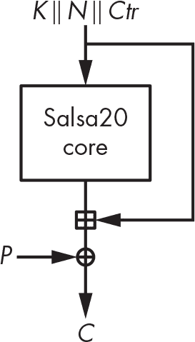

<samp class="SANS_Futura_Std_Book_Oblique_I_11">图 5-10：Salsa20 用于 512 位明文块的加密方案</samp>

##### <samp class="SANS_Futura_Std_Bold_Condensed_B_11">使用 Quarter-Round 函数</samp>

Salsa20 的核心置换使用称为 *quarter-round*（**QR**）的函数，它将四个 32 位字（*a*、*b*、*c* 和 *d*）转换如下：


我们按自上而下的顺序计算这四行，意味着 *b* 的新值取决于 *a* 和 *d*，*c* 的新值取决于 *a* 和 *b* 的新值（因此也取决于 *d*），依此类推。

<<< 操作是按指定位数进行逐字左旋转，可以是 1 到 31 之间的任何值（对于 32 位字）。例如，<<< 8 将一个字的位向左旋转八个位置，如下例所示：


##### <samp class="SANS_Futura_Std_Bold_Condensed_B_11">转换 Salsa20 的 512 位状态</samp>

Salsa20 的核心置换将 512 位的内部状态转换为一个 4×4 的 32 位字数组。图 5-11 展示了初始状态，使用了一个由八个字（256 位）组成的密钥、两个字（64 位）的随机数、两个字（64 位）的计数器以及四个固定常数字（128 位），这些常数对于每次加密/解密和所有块都是相同的。

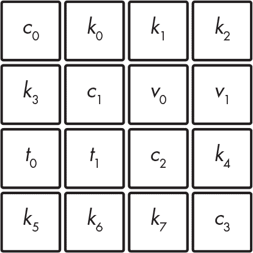

<samp class="SANS_Futura_Std_Book_Oblique_I_11">图 5-11：Salsa20 状态的初始化</samp>

为了转换初始的 512 位状态，Salsa20 首先独立地对四列应用 **QR** 变换（称为 *列轮*），然后独立地对四行应用变换（*行轮*），正如 图 5-12 所示。列轮/行轮序列就是 *双轮*。Salsa20 重复进行 10 次双轮，总共 20 轮，这就是 *Salsa20* 中 *20* 的由来。


<samp class="SANS_Futura_Std_Book_Oblique_I_11">图 5-12：通过 Salsa20 的四分之一轮（</samp><samp class="SANS_Futura_Std_Bold_Oblique_BI_11">QR</samp><samp class="SANS_Futura_Std_Book_Oblique_I_11">）函数转换的列和行</samp>

列轮通过以下方式转换四列：


行轮通过以下方式转换行：


在列轮中，每个 **QR** 以从上到下的顺序接受 *x*i 参数，而行轮的 **QR** 以对角线上的词作为第一个参数（如 图 5-12 右侧数组所示），而不是来自第一列的词。

##### <samp class="SANS_Futura_Std_Bold_Condensed_B_11">评估 Salsa20</samp>

清单 5-3 展示了当使用全零密钥（<samp class="SANS_TheSansMonoCd_W5Regular_11">00</samp> 字节）和全一随机数（<samp class="SANS_TheSansMonoCd_W5Regular_11">ff</samp> 字节）初始化时，Salsa20 第一个和第二个块的初始状态。这两个状态仅在计数器中有 1 位的差异，计数器部分用粗体显示：具体来说，第一个块为 0，第二个块为 1。

```
61707865 00000000 00000000 00000000      61707865 00000000 00000000 00000000
00000000 3320646e ffffffff ffffffff      00000000 3320646e ffffffff ffffffff
**00000000** 00000000 79622d32 00000000      **00000001** 00000000 79622d32 00000000
00000000 00000000 00000000 6b206574      00000000 00000000 00000000 6b206574
```

<samp class="SANS_Futura_Std_Book_Oblique_I_11">清单 5-3：使用全零密钥和全一随机数时 Salsa20 第一个和第二个块的初始状态</samp>

然而，尽管只有 1 位的差异，经过 10 次双轮变换后的内部状态彼此完全不同，正如 清单 5-4 所示。

```
e98680bc f730ba7a 38663ce0 5f376d93      1ba4d492 c14270c3 9fb05306 ff808c64
85683b75 a56ca873 26501592 64144b6d      b49a4100 f5d8fbbd 614234a0 e20663d1
6dcb46fd 58178f93 8cf54cfe cfdc27d7      12e1e116 6a61bc8f 86f01bcb 2efead4a
68bbe09e 17b403a1 38aa1f27 54323fe0      77775a13 d17b99d5 eb773f5b 2c3a5e7d
```

<samp class="SANS_Futura_Std_Book_Oblique_I_11">清单 5-4：经过 10 次 Salsa20 双轮变换后的 清单 5-3 状态</samp>

但请记住，即使密钥流块中的字值看起来随机，这也远不能保证安全性。RC4 的输出看起来是随机的，但它有明显的偏差。幸运的是，Salsa20 比 RC4 更加安全，并且没有统计偏差。然而，请记住，即使密钥流在统计上与完全随机字节无法区分，这也不足以实现密码学安全。##### <samp class="SANS_Futura_Std_Bold_Condensed_B_11">学习差分密码分析</samp>

为了证明 Salsa20 比 RC4 更安全，让我们来看看*差分密码分析*的基础知识，它研究的是状态之间的差异，而不是它们的实际值。例如，Listing 5-3 中的两个初始状态在计数器中的第 1 位或 Salsa20 状态数组中的词 *x*[8] 有 1 位的不同。下表显示了这两个状态之间的按位差异：


这两个状态之间的差异实际上是这两个状态的 XOR 结果。加粗的 1 位对应于这两个状态之间的 1 位差异。在这两个状态的 XOR 结果中，任何非零位都表示差异。

为了查看 Salsa20 的核心算法在初始状态下如何迅速传播变化，让我们观察两种状态在多轮迭代过程中的差异。在一轮之后，差异会传播到第一列中的两个其他单词：


在两轮之后，差异进一步传播到已经包含差异的行，除了第二行。此时状态之间的差异较为稀疏；在一个字中的比特变化不多：


在三轮之后，状态之间的差异变得更加密集，尽管许多零位显示出许多比特位置仍然未受初始差异的影响：


在四轮之后，差异对于人类观察者看起来是随机的，从统计学角度来看，它们几乎也是随机的：


仅仅经过四轮，一次差异就会传播到 512 位状态的大部分位。在密码学中，我们称之为*完全扩散*。

差异不仅会传播到所有状态，而且传播的方式符合复杂的方程式，使得未来的差异难以预测，因为高度的*非线性*关系驱动了状态的演变，这得益于异或（XOR）、加法和旋转的混合。如果我们只使用 XOR，虽然差异依然会传播，但过程将是线性的，因此不安全。

##### <samp class="SANS_Futura_Std_Bold_Condensed_B_11">攻击 Salsa20/8</samp>

Salsa20 默认执行 20 轮，但我们有时使用仅 12 轮的版本，称为 Salsa20/12，以提高速度。尽管 Salsa20/12 比 Salsa20 少了八轮，但根据最新的研究进展，实际上它与 20 轮版本一样可靠。即使是 Salsa20/8，只有八轮，也被认为只是理论上较弱，但在实践中与 Salsa20 一样稳固。

理论上，打破 Salsa20 应该需要 2²⁵⁶次操作，因为它使用了 256 位密钥。如果能够通过少于 2²⁵⁶次的操作恢复密钥，则该加密算法在理论上是破解的。Salsa20/8 恰好就是这种情况。

对 Salsa20/8 的攻击（发布于 2008 年的论文《拉丁舞的新特性：Salsa、ChaCha 和 Rumba 的分析》，我作为共同作者之一，并因此获得了 Daniel J. Bernstein 的密码分析奖）利用了 Salsa 核心算法在四轮后的统计偏差，从而恢复了八轮 Salsa20 的密钥。实际上，这大多是一个理论攻击：我们估计其复杂度为 2²⁵¹次核心函数操作——这是不可行的，就像计算 2¹⁰⁰次操作或更多一样不现实，但比打破预期的 2²⁵⁶复杂度要容易一些。

该攻击不仅利用了 Salsa20/8 前四轮的偏差，还利用了最后四轮的一个特性：已知 nonce，*N*，和计数器，*Ctr*（参见图 5-10），要将密钥流逆向计算回初始状态所需的唯一值就是密钥，*K*。但是正如图 5-13 所示，如果你仅知道部分*K*，你可以将计算逆转到第四轮，并观察到一些中间状态的位——包括偏差位！你只有在正确猜出部分密钥时，才会观察到偏差；因此，偏差就作为一个指示，表明你已经找到了正确的密钥。

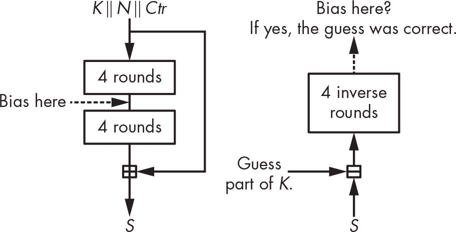

<samp class="SANS_Futura_Std_Book_Oblique_I_11">图 5-13：Salsa20/8 攻击原理</samp>

在实际的 Salsa20/8 攻击中，为了确定正确的猜测，我们需要猜测密钥的 220 个位，并且需要 2³¹对具有相同特定 nonce 差异的密钥流块。一旦筛选出正确的 220 个位，我们就能通过暴力破解 36 个位。暴力破解需要 2³⁶次操作，这一计算量比 2²²⁰ × 2³¹ = 2²⁵¹次试验还要小，而后者是找到 220 个位以完成攻击第一部分所需的次数。

### <samp class="SANS_Futura_Std_Bold_B_11">可能出错的地方</samp>

可惜，流密码中可能会出现许多问题，从脆弱、不安全的设计到实现不当的强加密算法。我将在接下来的章节中探讨每一类潜在问题。

#### <samp class="SANS_Futura_Std_Bold_Condensed_Oblique_BI_11">Nonce 重用</samp>

流密码中最常见的失败发生在使用相同的密钥多次重用 nonce 时。这会产生相同的密钥流，从而使加密被破解——例如，通过将两个密文进行异或操作；然后，密钥流消失，你将得到两个明文的异或结果。

一个真实的例子是早期版本的 Microsoft Word 和 Excel，它们为每个文档使用了唯一的 nonce，但修改文档并不会改变 nonce。因此，人们可以使用旧版本文档的明文和加密文本来解密后来加密的版本。如果微软犯下这个错误，你可以想象问题会有多大。

某些在 2010 年代设计的流密码尝试通过构建“抗滥用”构造来减轻 nonce 重用的风险，或者即使 nonce 被使用两次也能保持安全的密码。然而，达到这一安全级别会带来性能上的惩罚，正如你在 第八章 中看到的 SIV 模式。

#### <samp class="SANS_Futura_Std_Bold_Condensed_Oblique_BI_11">损坏的 RC4 实现</samp>

尽管 RC4 本身非常脆弱，但如果你盲目优化其实现，它可能会变得更脆弱。例如，考虑一下 2007 年的 Underhanded C 竞赛中的一个参赛作品，这是一个非正式的竞赛，程序员编写看似无害的代码，实际上却包含恶意功能。

其工作原理如下。实现 RC4 算法中行 <samp class="SANS_TheSansMonoCd_W5Regular_11">swap(S[i], S[j])</samp> 的一种简单方法是执行以下操作，如 Python 代码所示：

```
buf = S[i]
S[i] = S[j]
S[j] = buf
```

这种交换两个变量的方法是可行的，但你需要创建一个新的变量 <samp class="SANS_TheSansMonoCd_W5Regular_11">buf</samp>。为了避免这种情况，程序员通常使用以下 *XOR-交换* 技巧来交换变量 <samp class="SANS_TheSansMonoCd_W5Regular_11">x</samp> 和 <samp class="SANS_TheSansMonoCd_W5Regular_11">y</samp> 的值：

```
x = x <samp class="SANS_DejaVu_Sans_Book_I_11">⊕</samp> y
y = x <samp class="SANS_DejaVu_Sans_Book_I_11">⊕</samp> y
x = x <samp class="SANS_DejaVu_Sans_Book_I_11">⊕</samp> y
```

这个方法之所以有效，是因为第二行将 <samp class="SANS_TheSansMonoCd_W5Regular_11">y</samp> 设置为 <samp class="SANS_TheSansMonoCd_W5Regular_11">x</samp> ⊕ <samp class="SANS_TheSansMonoCd_W5Regular_11">y</samp> ⊕ <samp class="SANS_TheSansMonoCd_W5Regular_11">y = x</samp>，第三行将 <samp class="SANS_TheSansMonoCd_W5Regular_11">x</samp> 设置为 <samp class="SANS_TheSansMonoCd_W5Regular_11">x</samp> ⊕ <samp class="SANS_TheSansMonoCd_W5Regular_11">y</samp> ⊕ <samp class="SANS_TheSansMonoCd_W5Regular_11">x</samp> ⊕ <samp class="SANS_TheSansMonoCd_W5Regular_11">y</samp> ⊕ <samp class="SANS_TheSansMonoCd_W5Regular_11">y = y</samp>。使用这个技巧来实现 RC4 会得到 清单 5-5 中的实现（改编自 David Wagner 和 Philippe Biondi 提交到 2007 年 Underhanded C 竞赛的程序，并在线访问于 *[`<wbr>www<wbr>.underhanded<wbr>-c<wbr>.org<wbr>/<wbr>_page<wbr>_id<wbr>_16<wbr>.html`](http://www.underhanded-c.org/_page_id_16.html)*）。

```
#define TOBYTE(x) (x) & 255
#define SWAP(x,y) do {x^=y; y^=x; x^=y;} while (0)

static unsigned char S[256];
static int i=0, j=0;

void init(char *passphrase) {
    int passlen = strlen(passphrase);
    for (i=0; i<256; i++)
        S[i] = i;
    for (i=0; i<256; i++) {
        j = TOBYTE(j + S[TOBYTE(i)] + passphrase[j % passlen]);
        SWAP(S[TOBYTE(i)], S[j]);
    }
    i = 0; j = 0;
}

unsigned char encrypt_one_byte(unsigned char c) {
    int k;
    i = TOBYTE(i+1);
    j = TOBYTE(j + S[i]);
    SWAP(S[i], S[j]);
    k = TOBYTE(S[i] + S[j]);
    return c ^ S[k];
}
```

<samp class="SANS_Futura_Std_Book_Oblique_I_11">列表 5-5：由于使用了异或交换，RC4 的 C 语言实现不正确</samp>

你能发现异或交换的问题吗？

当 <samp class="SANS_TheSansMonoCd_W5Regular_11">i = j</samp> 时，情况就变得糟糕。与其保持状态不变，异或交换会将 <samp class="SANS_TheSansMonoCd_W5Regular_11">S[i]</samp> 设置为 <samp class="SANS_TheSansMonoCd_W5Regular_11">S[i]</samp> ⊕ <samp class="SANS_TheSansMonoCd_W5Regular_11">S[i] = 0</samp>。实际上，每当 <samp class="SANS_TheSansMonoCd_W5Regular_11">i</samp> 等于 <samp class="SANS_TheSansMonoCd_W5Regular_11">j</samp> 时，状态中的一个字节就会被置为零，无论是在密钥调度还是加密过程中，最终会导致一个全零的状态，从而生成一个全零的密钥流。例如，在处理 68KB 数据后，256 字节状态中的大多数字节都变为零，输出的密钥流如下所示：


这里的教训是，不要过度优化你的加密实现。在密码学中，清晰和信心始终优于性能。

#### <samp class="SANS_Futura_Std_Bold_Condensed_Oblique_BI_11">嵌入硬件的弱密码</samp>

当一个加密系统无法保持安全时，有些系统会迅速通过远程静默更新受影响的软件（如网页应用程序）或通过发布新版本并提示用户升级（如移动应用程序）来响应。其他系统则没那么幸运，需要坚持使用被破坏的加密系统一段时间，才能升级到安全版本，某些卫星电话就是这种情况。

在 2000 年代初期，美国和欧洲的电信标准化机构（TIA 和 ETSI）共同开发了两项卫星电话通信标准。卫星电话类似于移动电话，区别在于它们的信号通过卫星传输，而非地面基站。其优点是，只要有卫星覆盖，几乎可以在全球任何地方使用。缺点是价格、质量、延迟，以及，事实证明，安全性。

GMR-1 和 GMR-2 是大多数商业供应商（如 Thuraya 和 Inmarsat）采用的两种卫星电话标准。它们都包含流密码用于加密语音通信。GMR-1 的密码设计偏向硬件，结合了四个 LFSR，类似于 A5/2——一种故意不安全的密码，用于面向非西方国家的 2G 移动标准。GMR-2 的密码设计偏向软件，使用了 8 字节的状态和 S 盒。两种流密码都不安全，只能防御业余攻击者，无法抵御国家级机构的攻击。

这个故事提醒我们，流密码曾经比块密码更容易被破解，而且更容易被破坏。为什么？因为如果你故意设计一个弱的流密码，当你发现漏洞时，你依然可以把问题归咎于流密码本身的弱点，并否认任何恶意意图。

### <samp class="SANS_Futura_Std_Bold_B_11">进一步阅读</samp>

要了解更多关于流密码的信息，可以从 eSTREAM 竞赛的档案开始，访问 *[`<wbr>www<wbr>.ecrypt<wbr>.eu<wbr>.org<wbr>/stream<wbr>/project<wbr>.html`](https://www.ecrypt.eu.org/stream/project.html)*，在这里你可以找到数百篇关于流密码的论文，其中包括 30 多个候选算法的详细信息以及许多攻击。最有趣的攻击之一是相关性攻击、代数攻击和立方体攻击。特别参考 Nicolas Courtois 和 Willi Meier 的研究，了解前两种攻击类型，以及 Itai Dinur 和 Adi Shamir 的立方体攻击研究。

要了解更多关于 RC4 攻击的信息，可以查阅 2001 年 Scott Fluhrer、Itsik Mantin 和 Adi Shamir（FMS）提出的攻击，以及 2013 年关于“RC4 在 TLS 中的安全性”的研究文章。

Salsa20 的遗产同样值得关注。流密码 ChaCha 与 Salsa20 相似，但其核心置换略有不同，后来这一置换被用于哈希函数 BLAKE，正如你在第六章中看到的那样。这些算法都利用了 Salsa20 的软件实现技术，采用并行指令，正如在 *[`<wbr>cr<wbr>.yp<wbr>.to<wbr>/snuffle<wbr>.html`](https://cr.yp.to/snuffle.html)* 中所讨论的那样。
