<hgroup>

## <samp class="SANS_Futura_Std_Bold_Condensed_B_11">6</samp> <samp class="SANS_Dogma_OT_Bold_B_11">哈希函数</samp>

</hgroup>


哈希函数——如 SHA-256、SHA3 和 BLAKE3——组成了密码学家的瑞士军刀：它们被用于数字签名、公钥加密、完整性验证、消息认证、密码保护、密钥协议以及许多其他加密协议。

无论你是在加密电子邮件、在手机上发送信息、连接到 HTTPS 网站，还是通过虚拟私人网络（VPN）或安全外壳（SSH）连接到远程机器，哈希函数都会在幕后发挥作用。

哈希函数是迄今为止最通用和最普遍的所有加密算法。它们的应用包括：云存储系统使用它们来识别相同的文件并检测修改过的文件；Git 版本控制系统使用它们来识别仓库中的文件；终端检测和响应（EDR）系统使用它们来检测修改过的文件；基于网络的入侵检测系统（NIDS）使用哈希值来检测通过网络的已知恶意数据；法医分析师使用哈希值来证明数字化文物未被修改；比特币在其工作量证明系统中使用哈希函数——还有更多应用。

与流密码不同，流密码从短输入生成长输出，哈希函数则从长输入生成短输出，称为 *哈希值* 或 *摘要*（见图 6-1）。

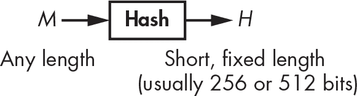

<samp class="SANS_Futura_Std_Book_Oblique_I_11">图 6-1：哈希函数的输入和输出</samp>

本章围绕两个主要话题展开。首先是安全性：一个哈希函数安全意味着什么？为此，我介绍了两个关键概念——碰撞抗性和原像抗性。第二个话题则围绕哈希函数的构建展开。我解释了现代哈希函数使用的高级技术，并回顾了最常见的哈希函数的内部结构：SHA-1、SHA-2、SHA-3 和 BLAKE2。最后，你将看到如果误用，安全哈希函数也可能表现得不安全。

> <samp class="SANS_Dogma_OT_Bold_B_15">注意</samp>

*不要将加密哈希函数与* 非加密 *哈希函数混淆。你在数据结构中使用非加密哈希函数，如哈希表，或用于检测偶然的错误，它们根本不提供任何安全性。例如，循环冗余检验（CRC）是非加密哈希，你用它来检测文件的意外修改。*

### <samp class="SANS_Futura_Std_Bold_B_11">安全哈希函数</samp>

哈希函数的安全性概念与我们迄今为止讨论的有所不同。加密算法通过保护数据的机密性，确保明文数据无法被读取，而哈希函数则通过保护数据的完整性，确保数据——无论是明文还是加密——未被篡改。如果哈希函数是安全的，那么两组不同的数据应该始终具有不同的哈希值。因此，文件的哈希值可以作为其唯一标识符。

考虑哈希函数最常见的应用：*数字签名*，或简称*签名*。在使用数字签名时，应用程序处理的是要签名消息的哈希值，而不是消息本身，正如图 6-2 所示。

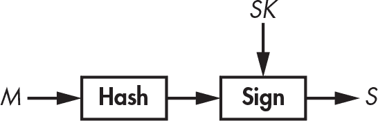

<samp class="SANS_Futura_Std_Book_Oblique_I_11">图 6-2：数字签名方案中的哈希函数，其中哈希值充当消息的代理</samp>

哈希值充当消息的标识符。如果消息中哪怕只有一个位被改变，消息的哈希值将完全不同。因此，哈希函数有助于确保消息没有被篡改。签名消息的哈希值与签名消息本身同样安全，而签名一个较短的哈希值，比如 256 位，比签名一个可能非常大的消息要快得多。事实上，大多数签名算法仅在像哈希值这样的短输入上工作。

#### <samp class="SANS_Futura_Std_Bold_Condensed_Oblique_BI_11">不可预测性</samp> <samp class="SANS_Futura_Std_Bold_Condensed_Oblique_BI_11">再一次</samp>

哈希函数的密码学强度来源于其输出的不可预测性。以下是 256 位的十六进制值；你可以使用 NIST 标准哈希函数 SHA-256，输入 ASCII 字母<samp class="SANS_TheSansMonoCd_W5Regular_11">a</samp>、<samp class="SANS_TheSansMonoCd_W5Regular_11">b</samp>和<samp class="SANS_TheSansMonoCd_W5Regular_11">c</samp>来计算这些哈希。尽管<samp class="SANS_TheSansMonoCd_W5Regular_11">a</samp>、<samp class="SANS_TheSansMonoCd_W5Regular_11">b</samp>和<samp class="SANS_TheSansMonoCd_W5Regular_11">c</samp>的差异仅为 1 或 2 个位（<samp class="SANS_TheSansMonoCd_W5Regular_11">a</samp>是位序列 01100001，<samp class="SANS_TheSansMonoCd_W5Regular_11">b</samp>是 01100010，<samp class="SANS_TheSansMonoCd_W5Regular_11">c</samp>是 01100011），但它们的哈希值却完全不同：

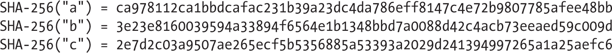

仅凭这三个哈希值，无法预测<samp class="SANS_TheSansMonoCd_W5Regular_11">d</samp>的 SHA-256 哈希值或其任何位，因为安全哈希函数的哈希值是*不可预测*的。一个安全的哈希函数应该像一个黑箱，每次接收到输入时返回一个随机字符串。

安全哈希函数的通用理论定义是，它的行为类似于一个真正的随机函数（有时称为*随机神谕*）。具体来说，一个安全哈希函数不应该具有任何随机函数不具备的属性或模式。这个定义对理论工作者有帮助，但在实际应用中，我们需要更具体的概念，即预影像抗性和碰撞抗性。

#### <samp class="SANS_Futura_Std_Bold_Condensed_Oblique_BI_11">预影像抗性</samp>

一个给定哈希值*H*的*预影像*是任何一个消息*M*，使得 **Hash**(*M*) = *H*。预影像*抗性*描述了这样的安全保证：给定一个随机的哈希值，攻击者永远无法找到该哈希值的预影像。实际上，你有时可以将哈希函数称为*单向函数*，因为你可以从消息得到它的哈希值，但不能反过来。

事实上，即使拥有无限的计算能力，你也无法反转哈希函数。例如，假设我使用 SHA-256 哈希函数对某个消息进行哈希，得到这个 256 位的哈希值：


即使拥有无限的时间和计算能力，你也永远无法确定我选择的*那*个消息来生成这个特定的哈希值，因为有很多消息会哈希到相同的值。因此，你会找到*一些*消息，它们会生成这个哈希值（可能包括我选择的那个），但你无法确定我用的具体消息。你将获得*无条件的安全性*。

例如，一个 256 位的哈希值有 2²⁵⁶ 种可能的值（这是实际使用的哈希函数的典型长度），但比如说，1,024 位消息有更多的值（即，2^(1,024) 种可能的值）。因此，可以推导出，平均而言，每个可能的 256 位哈希值会有 2^(1,024) / 2²⁵⁶ = 2^(1,024 – 256) = 2⁷⁶⁸ 个 1,024 位的预影像。

实际上，你必须确保几乎不可能找到*任何*与给定哈希值对应的消息，而不仅仅是被用来生成该哈希值的消息，这正是预影像抗性所代表的含义。具体来说，你可以讨论第一预影像抗性和第二预影像抗性。*第一预影像抗性*（或称*预影像抗性*）描述了在这种情况下，几乎不可能找到与给定哈希值对应的消息。另一方面，*第二预影像抗性*描述的是，给定一个消息*M*[1]，几乎不可能找到另一个消息*M*[2]，使得*M*[1] 和 *M*[2] 的哈希值相同。

##### <samp class="SANS_Futura_Std_Bold_Condensed_B_11">预影像的代价</samp>

给定一个哈希函数和一个哈希值，你可以通过尝试不同的消息来搜索第一个预影像，直到找到与目标哈希匹配的那个。列表 6-1 显示了如何使用类似于 <samp class="SANS_TheSansMonoCd_W5Regular_11">solve_preimage()</samp> 的算法来实现这一点。

```
solve_preimage(H) {
    repeat {
        M = random_message()
        if Hash(M) == H then return M
    }
}
```

<samp class="SANS_Futura_Std_Book_Oblique_I_11">清单 6-1：安全哈希函数的最佳逆像搜索算法</samp>

在这里，<samp class="SANS_TheSansMonoCd_W5Regular_11">random_message()</samp>生成一个随机消息（比如，一个随机的 1024 位值）。如果哈希的位长*n*足够大，<samp class="SANS_TheSansMonoCd_W5Regular_11">solve_preimage()</samp>几乎永远不会完成，因为它在找到逆像之前，平均需要 2*^n*次尝试。这在处理*n* = 256 时是个无望的局面，像现代哈希函数 SHA-256 和 BLAKE2 就是如此。  ##### <samp class="SANS_Futura_Std_Bold_Condensed_B_11">为什么第二个逆像抵抗力较弱</samp>

如果你能够找到第一个逆像，那么你也能找到第二个逆像（对于同一个哈希函数）。作为证明，如果算法<samp class="SANS_TheSansMonoCd_W5Regular_11">solve_preimage()</samp>返回给定哈希值的逆像，使用清单 6-2 中的算法找到某个消息*M*的第二个逆像。

```
solve_second_preimage(M) {
    H = Hash(M)
    return solve_preimage(H)
}
```

<samp class="SANS_Futura_Std_Book_Oblique_I_11">清单 6-2：如果能够找到第一个逆像，如何找到第二个逆像</samp>

你将通过将第二个逆像问题视为一个逆像问题并应用逆像攻击来找到第二个逆像。因此，任何抗第二个逆像的哈希函数也是抗逆像的。（如果不是这样，它也不会对第二个逆像具有抵抗力，参见前面的<samp class="SANS_TheSansMonoCd_W5Regular_11">solve_second_preimage()</samp>算法。）换句话说，找到第二个逆像的最佳攻击几乎与找到第一个逆像的最佳攻击相同，除非哈希函数存在某些缺陷，允许更高效的攻击。另请注意，逆像搜索攻击本质上类似于对分组密码或流密码的密钥恢复攻击，不同之处在于加密情况下有一个已知大小的确切解。

#### <samp class="SANS_Futura_Std_Bold_Condensed_Oblique_BI_11">抗碰撞性</samp>

无论你选择哪种哈希函数，碰撞是不可避免的，因为*抽屉原理*指出，如果你有*m*个洞和*n*只鸽子要放进这些洞中，并且*n*大于*m*，那么至少有一个洞必须包含超过一只鸽子。

> <samp class="SANS_Dogma_OT_Bold_B_15">注意</samp>

*你可以将抽屉原理推广到其他物品和容器。例如，美国宪法中的任何 27 个单词序列至少包含两个以相同字母开头的单词。在哈希函数的世界里，洞是哈希值，而鸽子是消息。因为你知道可能的消息数量远大于哈希值的数量，所以碰撞*必定*会存在。*

然而，尽管碰撞是不可避免的，但要考虑一个哈希函数是*抗碰撞*的，碰撞应该很难找到——换句话说，攻击者不应该能够找到两个不同的消息，它们的哈希值相同。

碰撞抗性与第二预像抗性有关：如果你能为一个哈希函数找到第二预像，你也能找到碰撞，正如列表 6-3 所示。

```
solve_collision() {
    M = random_message()
    return (M, solve_second_preimage(M))
}
```

<samp class="SANS_Futura_Std_Book_Oblique_I_11">列表 6-3：天真碰撞搜索算法</samp>

也就是说，任何碰撞抗性的哈希也是第二预像抗性的。如果不是这样，就会有一个高效的解第二预像算法可以用来破解碰撞抗性。

#### <samp class="SANS_Futura_Std_Bold_Condensed_Oblique_BI_11">如何寻找碰撞</samp>

寻找碰撞比寻找预像更快：它大约需要 2*^n*^(/2) 次操作，而不是 2*^n*，这是由于*生日攻击*，其核心思想如下：给定 *N* 个消息和同样数量的哈希值，你可以通过考虑每一对哈希值（数量级大约为 *N*²）来产生 *N* × (*N* – 1) / 2 个潜在的碰撞。之所以叫做*生日*攻击，是因为它通常用*生日悖论*来说明，生日悖论指出一组 23 个人中，恰好有两个人生日相同的概率接近 1/2——这并不是悖论，只是对许多人来说是一个惊讶。

> <samp class="SANS_Dogma_OT_Bold_B_15">注意</samp>

N *× (*N *– 1) / 2 是两个*不同*消息的对数，你除以 2 是因为你将 (*M1*,* M2*) 和 (*M2*,* M1*) 视为同一对，顺序不重要。*

作比较，在预像搜索的情况下，*N* 个消息仅能得到 *N* 个候选预像，而相同的 *N* 个消息大约会得到 *N*² 个潜在的碰撞。通过 *N*² 代替 *N*，你可以说找到解决方案的机会是*二次*增多的。搜索的复杂度相应降低：要找到一个碰撞，使用 2*^n*^(/2) 条消息，而不是 2*^n*。

##### <samp class="SANS_Futura_Std_Bold_Condensed_B_11">天真生日攻击</samp>

下面是使用生日攻击寻找碰撞的最简单方法：

1.  计算 2*^n*^(/2) 个消息的 2*^n*^(/2) 哈希值，并将所有消息/哈希对存储在一个列表中。

2.  按哈希值对列表进行排序，将相同的哈希值放在一起。

3.  搜索排序后的列表，找到两个连续的条目，它们具有相同的哈希值。

不幸的是，这种方法需要大量内存（足以存储 2*^n*^(/2) 个消息/哈希对），而排序大量元素会减慢搜索速度，平均需要大约 *n*2*^(n/2)* 次操作，使用快速排序算法如快速排序。

##### <samp class="SANS_Futura_Std_Bold_Condensed_B_11">低内存碰撞搜索与 Rho 方法</samp>

*Rho 方法*是一种寻找碰撞的算法，不同于天真生日攻击，它只需要少量内存。它的工作原理如下：

1. 给定一个具有*n*位哈希值的哈希函数，选择一个随机的哈希值（*H*[1]），并定义 *H*[1] = *H* ′[1]。

2. 计算 *H*[2] = **Hash**(*H*[1]) 和 *H* ′[2] = **Hash**(**Hash**(*H* ′[1]))。在第一种情况下应用哈希函数一次，而在第二种情况下应用哈希函数两次。

3. 迭代该过程并计算 *H*i [+ 1] = **Hash**(*H*i)， *H* ′i [+ 1] = **Hash**(**Hash** (*H* ′i))，对*i*值递增，直到达到 *i* 使得 *H*i [+ 1] = *H* ′i [+ 1]。

图 6-3 帮助可视化该攻击，其中从*H*[1]到*H*[2]的箭头表示 *H*[2] = **Hash**(*H*[1])。观察到*H*的序列最终进入一个循环，也叫做*周期*，其形状类似希腊字母 rho（ρ）。该周期从*H*[5]开始，且由碰撞 **Hash**(*H*[4]) = **Hash**(*H*[10]) = *H*[5]所特征化。这里的关键观察是，找到一个碰撞，你只需要找到这样的一个周期。Rho 方法允许攻击者检测到周期的位置，因此能够找到碰撞。

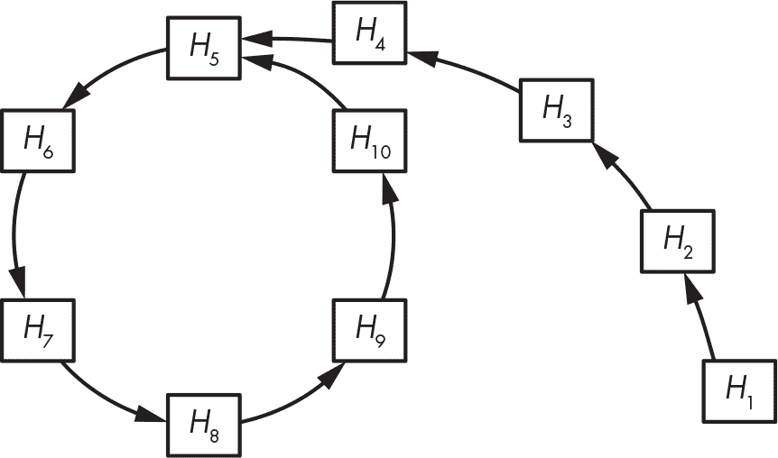

<samp class="SANS_Futura_Std_Book_Oblique_I_11">图 6-3：Rho 哈希函数的结构，其中每个箭头表示哈希函数的评估。开始于</samp> <samp class="SANS_Futura_Std_Book_11">H</samp><samp class="SANS_Futura_Std_Book_Oblique_I-SUB_11">5</samp> <samp class="SANS_Futura_Std_Book_Oblique_I_11">的周期对应于一个碰撞，</samp> <samp class="SANS_Futura_Std_Bold_Oblique_BI_11">Hash</samp><samp class="SANS_Futura_Std_Book_Oblique_I_11">(</samp><samp class="SANS_Futura_Std_Book_11">H</samp><samp class="SANS_Futura_Std_Book_Oblique_I-SUB_11">4</samp><samp class="SANS_Futura_Std_Book_Oblique_I_11">) =</samp> <samp class="SANS_Futura_Std_Bold_Oblique_BI_11">Hash</samp><samp class="SANS_Futura_Std_Book_Oblique_I_11">(</samp><samp class="SANS_Futura_Std_Book_11">H</samp><samp class="SANS_Futura_Std_Book_Oblique_I-SUB_11">10</samp><samp class="SANS_Futura_Std_Book_Oblique_I_11">) =</samp> <samp class="SANS_Futura_Std_Book_11">H</samp><samp class="SANS_Futura_Std_Book_Oblique_I-SUB_11">5</samp><samp class="SANS_Futura_Std_Book_Oblique_I_11">。</samp>

基于 Rho 方法的先进碰撞查找技术通过先检测循环的起始点，再找到碰撞，而不需要在内存中存储大量值或排序一个长列表。成功找到碰撞大约需要 2*^n*^(/2)次操作。实际上，图 6-3 中的哈希值要远少于一个具有 256 位或更多摘要的实际函数。平均来说，循环和尾部（从*H*[1]到*H*[5]的部分，在图 6-3 中展示）各自包括大约 2*^n*^(/2)个哈希值，其中*n*是哈希值的位长度。因此，找到碰撞至少需要进行 2*^n*^(/2) + 2*^n*^(/2)次哈希评估。### <samp class="SANS_Futura_Std_Bold_B_11">如何构建哈希函数</samp>

在 1980 年代，加密学者意识到，哈希消息最简单的方法是将其分割成若干块，并使用相似的算法逐块处理。这个策略即为*迭代哈希*，它有两种主要形式：

+   使用*压缩函数*进行迭代哈希，该函数将输入转换为*更小的输出*，正如图 6-4 所示。这种技术也叫做*Merkle–Damgård*结构，以加密学者拉尔夫·梅尔克尔和伊万·丹麦戈德命名，他们首次描述了这种结构。

+   使用将输入转换为*相同大小*输出的函数进行迭代哈希，使得任何两个不同的输入都会产生两个不同的输出（即*排列*）。这样的函数称为*海绵函数*。

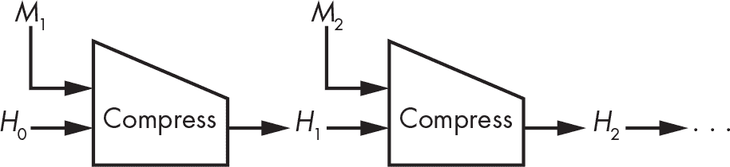

<samp class="SANS_Futura_Std_Book_Oblique_I_11">图 6-4：使用名为 Compress 的压缩函数的 Merkle–Damgård 结构</samp>

我们现在将讨论这些结构如何工作以及压缩函数在实践中的表现。

#### <samp class="SANS_Futura_Std_Bold_Condensed_Oblique_BI_11">基于压缩的哈希函数</samp>

从 1980 年代到 2010 年代开发的所有哈希函数都基于 Merkle–Damgård（M–D）结构：MD4、MD5、SHA-1 以及 SHA-2 系列，还有不太知名的 RIPEMD 和 Whirlpool 哈希函数。虽然 M–D 结构并不完美，但它简单且已证明对许多应用足够安全。

> <samp class="SANS_Dogma_OT_Bold_B_15">注意</samp>

*在 MD4、MD5 和 RIPEMD 中，*MD*代表*消息摘要*，而非*Merkle–Damgård*。*

为了对消息进行哈希，M–D 结构将消息分成相同大小的块，并使用压缩函数将这些块与内部状态混合，如图 6-4 所示。这里，*H*[0]是内部状态的*初始值*（记作 IV），*H*[1]、*H*[2]等是*链值*，最终的内部状态值就是消息的哈希值。

消息块通常是 512 位或 1,024 位，但原则上可以是任意大小。无论块的长度如何，它对特定的哈希函数是固定的。例如，SHA-256 使用 512 位块，SHA-512 使用 1,024 位块。

##### <samp class="SANS_Futura_Std_Bold_Condensed_B_11">填充块</samp>

如果你想要哈希一个无法分割为完整块的消息会发生什么？例如，如果块是 512 位，那么一个 520 位的消息将包含一个 512 位块和 8 位。此时，M–D 构造会按照以下方式形成最后一个块：取出剩下的比特块（在我们的例子中为 8 位），附加 1 位，然后附加 0 位，最后附加原始消息的长度，长度以固定比特数编码。这个填充技巧保证了任何两个不同的消息都会给出不同的块序列，从而得到不同的哈希值。

例如，如果你使用 SHA-256 对 8 位字符串 10101010 进行哈希，该哈希函数使用 512 位消息块，则第一个也是唯一一个块的位表示如下：


这里，消息位是前 8 位（10101010），而填充位是其后所有位（以斜体显示）。块末尾的*1000*（带下划线）是消息的长度，即 8 的二进制编码（最多 32 位）。因此，填充产生了一个由单个 512 位块组成的 512 位消息，准备好由 SHA-256 的压缩函数处理。

##### <samp class="SANS_Futura_Std_Bold_Condensed_B_11">安全性保证</samp>

Merkle–Damgård 构造将一个安全的压缩函数（其输入为小且固定长度）转变为一个安全的哈希函数，该哈希函数能够接受任意长度的输入。如果一个压缩函数是抗原像攻击和抗碰撞攻击的，那么基于 M–D 构造构建的哈希函数同样也具备这两种抗性。之所以如此，是因为我们可以将针对 M–D 哈希的任何成功的原像攻击转化为对压缩函数的成功原像攻击，正如 Merkle 和 Damgård 在他们 1989 年的论文中所展示的那样（请参见本章的“进一步阅读”部分）。碰撞的情况也是如此：攻击者无法打破哈希函数的抗碰撞性，除非打破了底层压缩函数的抗碰撞性；因此，后者的安全性保证了哈希函数的安全性。

请注意，反过来的论点并不成立，因为压缩函数的碰撞不一定会导致哈希的碰撞。对于链式值 *X* 和 *Y*，它们都不同于 *H*[0]，**Compress**(*X*, *M*[1]) 和 **Compress**(*Y*, *M*[2]) 之间的任意碰撞不会导致哈希碰撞，因为你无法将碰撞“插入”到哈希的迭代链中——除非其中一个链值恰好是 *X*，另一个是 *Y*，但这种情况发生的可能性很小。

##### <samp class="SANS_Futura_Std_Bold_Condensed_B_11">寻找多重碰撞</samp>

*多重碰撞*发生在三条或更多消息哈希到相同的值时。例如，三元组(*X*, *Y*, *Z*)，使得**Hash**(*X*) = **Hash**(*Y*) = **Hash**(*Z*)，就是一个*3-碰撞*。理想情况下，多重碰撞应该比单一碰撞更难找到，但有一个简单的技巧可以几乎以与单次碰撞相同的成本找到它们。其工作原理如下：

1.  找到一个碰撞 **Compress**(*H*[0], *M*[1.1]) = **Compress**(*H*[0], *M*[1.2]) = *H*[1]。这只是一个 2-碰撞，即两条消息哈希到相同的值。

2.  以 *H*[1] 作为起始链值，找到第二次碰撞：**Compress** (*H*[1], *M*[2.1]) = **Compress**(*H*[1], *M*[2.2]) = *H*[2]。现在你得到了一个 4-碰撞，四条消息哈希到相同的值 *H*[2]：*M*[1.1] || *M*[2.1]，*M*[1.1] || *M*[2.2]，*M*[1.2] || *M*[2.1]，以及 *M*[1.2] || *M*[2.2]。

3.  重复找到 *N* 次碰撞，你将得到 2*^N* 条消息，每条包含 *N* 个块，哈希到相同的值——即 2*^N* 碰撞，代价“仅仅”约为 *N*2*^N* 次哈希计算。

实际上，这个技巧并不是特别实用，因为它首先需要找到一个基本的 2-碰撞。

##### <samp class="SANS_Futura_Std_Bold_Condensed_B_11">构建压缩函数</samp>

所有在实际哈希函数中使用的压缩函数，如 SHA-256 和 BLAKE2，都基于块密码，因为这是构建压缩函数最简单的方法。图 6-5 展示了基于块密码的最常见压缩函数，即 *Davies–Meyer 构造*。

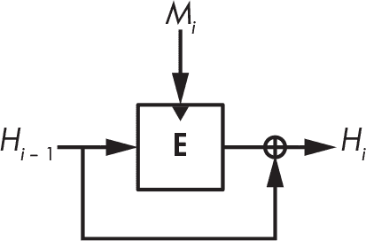

<samp class="SANS_Futura_Std_Book_Oblique_I_11">图 6-5: Davies–Meyer 构造。深色三角形显示了块密码密钥的输入位置。</samp>

给定消息块 *M*i 和前一个链值 *H*i [– 1]，Davies–Meyer 压缩函数使用一个块密码 **E** 来计算新的链值，公式如下：


消息块 *M*i 作为块密码的密钥，链值 *H*i [– 1] 作为其明文块。只要块密码是安全的，结果的压缩函数也将是安全的，并且抵抗碰撞和前像攻击。如果没有前一个链值的异或操作（⊕ *H*i [– 1]），Davies–Meyer 就不安全，因为你可以反转它，通过块密码的解密函数从新的链值回到前一个链值。

> <samp class="SANS_Dogma_OT_Bold_B_15">注意</samp>
> 
> *Davies–Meyer 构造有一个令人惊讶的性质：你可以找到* 固定点*，或链值，在应用给定消息块的压缩函数后保持不变。只需将* H[i –] 1 *=* **D***(*M[i]*, 0) 作为链值，其中 *D* 是与 *E* 对应的解密函数。因此，新的链值 *H[i]* 等于原始的 *H[i –] 1*：*
> 
> 
> 
> *你得到* H[i] *=* H[i –] 1 *是因为将零解密值输入加密函数会得到零——因此* ***E****(*M[i]*,* ***D****(*M[i]*, 0)) = 0——只留下* ⊕ H[i –] 1 *部分，这部分出现在压缩函数输出的表达式中。你可以为基于 Davies–Meyer 构造的 SHA-2 函数的压缩函数找到固定点。例如，幸运的是，固定点并不是安全风险。*

除了 Davies–Meyer 之外，还有许多基于分组密码的压缩函数，例如在图 6-6 中展示的函数。

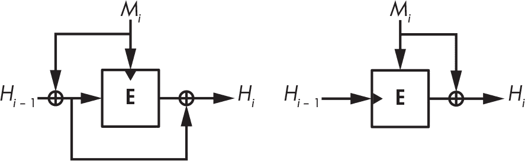

<samp class="SANS_Futura_Std_Book_Oblique_I_11">图 6-6：其他安全的基于分组密码的压缩函数构造</samp>

这些方法较少被使用，因为它们更为复杂，或者需要消息块的长度与链值相同。

#### <samp class="SANS_Futura_Std_Bold_Condensed_Oblique_BI_11">基于置换的哈希函数</samp>

经过数十年的研究，密码学家已掌握了关于基于分组密码的哈希技术的所有知识。然而，难道没有更简单的哈希方法吗？为什么要使用一个需要密钥的分组密码算法，而哈希函数本身不需要密钥？为什么不构建一个带有固定密钥的分组密码的哈希函数，或者一个简单的置换算法？

那些更简单的哈希函数是海绵函数，它们使用单一的置换来代替压缩函数和分组密码（见图 6-7）。海绵函数不使用分组密码来混合消息位与内部状态，而是直接进行异或操作。海绵函数不仅比 Merkle–Damgård 函数简单，而且更加多功能。你会发现它们不仅作为哈希函数使用，还作为确定性随机比特生成器、流密码、伪随机函数（见第七章）和认证密码（见第八章）等使用。最著名的海绵函数是 Keccak，也被称为 SHA-3。

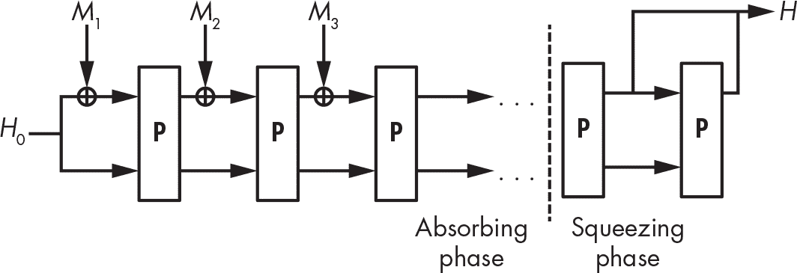

<samp class="SANS_Futura_Std_Book_Oblique_I_11">图 6-7：海绵构造</samp>

海绵函数的工作原理如下：

1.  它将第一个消息块 *M*[1] 与 *H*[0]（内部状态的预定义初始值，例如全零字符串）进行异或运算。所有消息块的大小相同且小于内部状态的大小。

2.  一个置换 **P** 将内部状态转变为另一个相同大小的值。

3.  它将消息块 *M*[2] 与 **P** 进行异或运算，然后重复对消息块 *M*[3]、*M*[4] 等进行同样的操作。这是 *吸收阶段*。

4.  在注入所有消息块之后，再次应用 **P** 并从状态中提取一块比特以形成哈希。如果需要更长的哈希，再次应用 **P** 并提取一块比特。这是 *挤压阶段*。

海绵函数的安全性取决于其内部状态的长度和块的长度。如果消息块的长度为*r*位，内部状态的长度为*w*位，则有*c* = *w* – *r* 位是消息块无法修改的内部状态部分。*c*的值就是海绵函数的*容量*，而海绵函数所保证的安全级别是*c*/2。例如，要实现 256 位安全性，并且使用 64 位消息块，内部状态的长度至少应为*w* = 2 × 256 + 64 = 576 位。安全级别还取决于哈希值的长度*n*。因此，碰撞攻击的复杂度是 2*^n*^(/2)与 2*^c*^(/2)之间的较小值，而第二原像攻击的复杂度是 2*^n*与 2*^c*^(/2)之间的较小值。

为了保证安全，置换**P**应表现得像一个随机置换，既没有统计偏差，也没有数学结构可以让攻击者预测输出结果。与基于压缩函数的哈希相似，海绵函数也对消息进行填充，但填充过程更简单，因为它不需要包括消息的长度。最后一位消息位后面紧跟一个 1 位，然后是必要数量的零位。

### <samp class="SANS_Futura_Std_Bold_B_11">SHA 哈希函数系列</samp>

*安全哈希算法（SHA）* 哈希函数是由 NIST 定义的标准，供美国非军事联邦政府机构使用。它们被视为全球标准，只有少数非美国政府出于主权原因选择自己的哈希算法（如中国的 SM3、俄罗斯的 Streebog 和乌克兰的 Kupyna），而非因为不信任 SHA 的安全性。美国的 SHA 算法比非美国的算法经过了更多的密码分析审查。

> <samp class="SANS_Dogma_OT_Bold_B_15">注意</samp>

*消息摘要算法 5 (MD5) 是 1992 年到 2005 年间最流行的哈希函数，直到它在 2005 年左右被攻破，许多应用程序开始转向使用 SHA 系列哈希函数。MD5 处理 512 位的消息块，并更新一个 128 位的内部状态以生成 128 位哈希，因此最好的情况提供 128 位的原像安全性和 64 位的碰撞安全性。1996 年，密码分析师就 MD5 压缩函数的碰撞问题发出警告，但直到 2005 年，中国的密码分析师团队才发现如何计算出完整 MD5 哈希的碰撞。直到现在，找到 MD5 的碰撞只需要几秒钟，但一些系统仍然使用或支持 MD5，通常是出于向后兼容的原因。*

#### <samp class="SANS_Futura_Std_Bold_Condensed_Oblique_BI_11">SHA-1</samp>

SHA-1 标准源自 NSA 原始 SHA-0 哈希函数的失败。1993 年，NIST 标准化了 SHA-0 哈希算法，但 1995 年 NSA 发布了 SHA-1，以修复 SHA-0 中未发现的安全问题。当 1998 年两位研究人员发现如何在约 2⁶⁰次操作内找到 SHA-0 的碰撞，而不是预期的 SHA-0 和 SHA-1 这样的 160 位哈希函数所需的 2⁸⁰次操作时，修正的原因变得明确。后来，攻击将复杂度降低到约 2³³次操作，导致 SHA-0 在不到一个小时内就发生了实际碰撞。

##### <samp class="SANS_Futura_Std_Bold_Condensed_B_11">SHA-1 内部结构</samp>

SHA-1 结合了 Merkle-Damgård 哈希函数和基于专门设计的块密码的 Davies-Meyer 压缩函数。也就是说，SHA-1 通过对 512 位消息块（*M*）进行以下操作的迭代来工作：


在这里，使用加号（+）而非⊕（XOR）是有意为之。**E**(*M*, *H*)和 *H* 被视为 32 位整数的数组，两个处于相同位置的词相加：**E**(*M*, *H*)的第一个 32 位词与 *H* 的第一个 32 位词相加，依此类推。*H* 的初始值对任何消息都是固定的，随后 *H* 根据之前的公式进行修改，处理完所有块后，*H* 的最终值作为消息的哈希值返回。

一旦使用消息块作为密钥、当前 160 位链接值作为明文块运行块密码，160 位的结果就会被视为五个 32 位词的数组，其中每个词与初始 *H* 值中的对应 32 位词相加。

清单 6-4 展示了 SHA-1 的压缩函数，<samp class="SANS_TheSansMonoCd_W5Regular_11">SHA1-compress()</samp>：

```
SHA1-compress(H, M) {
    (a0, b0, c0, d0, e0) = H   // Parsing H as five 32-bit big-endian words
    (a, b, c, d, e) = **SHA1-blockcipher**(a0, b0, c0, d0, e0, M)
    return (a + a0, b + b0, c + c0, d + d0, e + e0)
}
```

<samp class="SANS_Futura_Std_Book_Oblique_I_11">清单 6-4：SHA-1 的压缩函数</samp>

SHA-1 的块密码 <samp class="SANS_TheSansMonoCd_W5Regular_11">SHA1-blockcipher()</samp>，以粗体显示，接受一个 512 位的消息块 *M* 作为密钥，并通过迭代 80 步的短操作序列来转换五个 32 位词（<samp class="SANS_TheSansMonoCd_W5Regular_11">a</samp>、<samp class="SANS_TheSansMonoCd_W5Regular_11">b</samp>、<samp class="SANS_TheSansMonoCd_W5Regular_11">c</samp>、<samp class="SANS_TheSansMonoCd_W5Regular_11">d</samp> 和 <samp class="SANS_TheSansMonoCd_W5Regular_11">e</samp>），通过这些步骤将词 <samp class="SANS_TheSansMonoCd_W5Regular_11">a</samp> 替换为五个词的组合。然后，它会像移位寄存器一样移动数组中的其他词。清单 6-5 以伪代码描述了这些操作，其中 <samp class="SANS_TheSansMonoCd_W5Regular_11">K[i]</samp> 是与轮次相关的常量。

```
SHA1-blockcipher(a, b, c, d, e, M) {
    W = **expand**(M)
    for i = 0 to 79 {
        new = (a <<< 5) + **f**(i, b, c, d) + e + K[i] + W[i]
        (a, b, c, d, e) = (new, a, b >>> 2, c, d)
    }
    return (a, b, c, d, e)
}
```

<samp class="SANS_Futura_Std_Book_Oblique_I_11">清单 6-5：SHA-1 的块密码</samp>

清单 6-5 中的< samp class="SANS_TheSansMonoCd_W5Regular_11">expand()</samp>函数通过将*W*的前 16 个字设置为*M*，并将后续的字设置为先前字的 XOR 组合，左移 1 位，生成一个包含 80 个 32 位字的数组*W*。清单 6-6 显示了相应的伪代码。

```
expand(M) {
    // The 512-bit M is seen as an array of sixteen 32-bit words.
    W = empty array of eighty 32-bit words
    for i = 0 to 79 {
        if i < 16 then W[i] = M[i]
        else
            W[i] = (W[i – 3] <samp class="SANS_DejaVu_Sans_Book_I_11">⊕</samp> W[i – 8] <samp class="SANS_DejaVu_Sans_Book_I_11">⊕</samp> W[i – 14] <samp class="SANS_DejaVu_Sans_Book_I_11">⊕</samp> W[i – 16]) <<< 1
    }
    return W
}
```

<samp class="SANS_Futura_Std_Book_Oblique_I_11">清单 6-6：SHA-1 的</samp> <samp class="SANS_Futura_Std_Book_Oblique_I_11">expand()</samp> <samp class="SANS_Futura_Std_Book_Oblique_I_11">函数</samp>

清单 6-6 中的<samp class="SANS_TheSansMonoCd_W5Regular_11"><<< 1</samp>操作是 SHA-1 和 SHA-0 函数之间唯一的区别。

最后，清单 6-7 展示了在<samp class="SANS_TheSansMonoCd_W5Regular_11">SHA1-blockcipher()</samp>中的<samp class="SANS_TheSansMonoCd_W5Regular_11">f()</samp>函数，这是一系列基本的按位逻辑运算（布尔函数），依赖于轮次编号。

```
f(i, b, c, d) {
    if i < 20 then return ((b & c) <samp class="SANS_DejaVu_Sans_Book_I_11">⊕</samp> (~b & d))
    if i < 40 then return (b <samp class="SANS_DejaVu_Sans_Book_I_11">⊕</samp> c <samp class="SANS_DejaVu_Sans_Book_I_11">⊕</samp> d)
    if i < 60 then return ((b & c) <samp class="SANS_DejaVu_Sans_Book_I_11">⊕</samp> (b & d) <samp class="SANS_DejaVu_Sans_Book_I_11">⊕</samp> (c & d))
    if i < 80 then return (b <samp class="SANS_DejaVu_Sans_Book_I_11">⊕</samp> c <samp class="SANS_DejaVu_Sans_Book_I_11">⊕</samp> d)
}
```

<samp class="SANS_Futura_Std_Book_Oblique_I_11">清单 6-7：SHA-1 的</samp> <samp class="SANS_Futura_Std_Book_Oblique_I_11">f()</samp> <samp class="SANS_Futura_Std_Book_Oblique_I_11">函数</samp>

清单 6-7 中的第二和第四个布尔函数简单地将三个输入字进行 XOR 操作，这是一个线性操作。相反，第一个和第三个函数使用非线性<samp class="SANS_TheSansMonoCd_W5Regular_11">&</samp>运算符（逻辑与）来防止差分密码分析，这种分析利用了按位差异的可预测传播。如果没有<samp class="SANS_TheSansMonoCd_W5Regular_11">&</samp>运算符（换句话说，如果<samp class="SANS_TheSansMonoCd_W5Regular_11">f()</samp>始终是<samp class="SANS_TheSansMonoCd_W5Regular_11">b</samp> ⊕ <samp class="SANS_TheSansMonoCd_W5Regular_11">c</samp> ⊕ <samp class="SANS_TheSansMonoCd_W5Regular_11">d</samp>，例如），SHA-1 将容易被破解，通过追踪其内部状态中的模式。

##### <samp class="SANS_Futura_Std_Bold_Condensed_B_11">SHA-1 的攻击</samp>

尽管比 SHA-0 更强大，SHA-1 仍然不安全，这也是为什么自 2014 年以来，Chrome 浏览器将使用 SHA-1 的 HTTPS 连接标记为不安全。尽管其 160 位哈希值应提供 80 位的碰撞抗性，但在 2005 年，研究人员发现了 SHA-1 的弱点，并估计找到碰撞需要大约 2⁶³次计算（如果算法完美无缺，则需要 2⁸⁰次计算）。真正的 SHA-1 碰撞直到 12 年后才出现，当时经过多年的研究，密码分析师通过与谷歌研究人员的联合工作，展示了两个碰撞的 PDF 文档（参见*[`<wbr>shattered<wbr>.io`](https://shattered.io)）。

你不应该使用 SHA-1。大多数网页浏览器现在标记 SHA-1 为不安全，NIST 也不再推荐 SHA-1。应使用 SHA-2、SHA-3、BLAKE2 或 BLAKE3 代替。

#### <samp class="SANS_Futura_Std_Bold_Condensed_Oblique_BI_11">SHA-2</samp>

SHA-2 是 SHA-1 的继任者，由 NSA 设计并在 2002 年由 NIST 标准化。SHA-2 是一个包含四种哈希函数的家族：SHA-224、SHA-256、SHA-384 和 SHA-512（其中 SHA-256 和 SHA-512 是两种主要算法）。这些三位数表示每个哈希值的位长度。

开发 SHA-2 的初衷是为了生成更长的哈希值，从而提供比 SHA-1 更高的安全性。然而，SHA-1 和 SHA-2 的结构非常相似。所有 SHA-2 实例也都使用 Merkle–Damgård 结构，并且其压缩函数与 SHA-1 的非常相似，但具有更强的非线性和差异传播特性。

##### <samp class="SANS_Futura_Std_Bold_Condensed_B_11">SHA-256</samp>

SHA-256 是最常见的 SHA-2 版本。虽然 SHA-1 有 160 位的链值，但 SHA-256 具有 256 位的链值，由八个 32 位字组成。SHA-1 和 SHA-256 都使用 512 位的消息块，但 SHA-1 执行 80 轮，而 SHA-256 执行 64 轮，使用 <samp class="SANS_TheSansMonoCd_W5Regular_11">expand256()</samp> 函数将 16 字的消息块扩展为 64 字的消息块，如 列表 6-8 所示。

```
expand256(M) {
    // The 512-bit M is seen as an array of sixteen 32-bit words.
    W = empty array of sixty-four 32-bit words
    for i = 0 to 63 {
        if i < 16 then W[i] = M[i]
        else {
            // The ">>" shifts instead of a ">>>" rotates and is not a typo.
            s0 = (W[i – 15] >>> 7) <samp class="SANS_DejaVu_Sans_Book_I_11">⊕</samp> (W[i – 15] >>> 18) <samp class="SANS_DejaVu_Sans_Book_I_11">⊕</samp> (W[i – 15] >> 3)
            s1 = (W[i – 2] >>> 17) <samp class="SANS_DejaVu_Sans_Book_I_11">⊕</samp> (W[i – 2] >>> 19) <samp class="SANS_DejaVu_Sans_Book_I_11">⊕</samp> (W[i – 2] >> 10)
            W[i] = W[i – 16] + s0 + W[i – 7] + s1
        }
    }
    return W
}
```

<samp class="SANS_Futura_Std_Book_Oblique_I_11">列表 6-8：SHA-256 的</samp> <samp class="SANS_Futura_Std_Book_Oblique_I_11">expand256()</samp> <samp class="SANS_Futura_Std_Book_Oblique_I_11">函数</samp>

请注意，SHA-2 的 <samp class="SANS_TheSansMonoCd_W5Regular_11">expand256()</samp> 消息扩展比 SHA-1 的 <samp class="SANS_TheSansMonoCd_W5Regular_11">expand()</samp> 在 列表 6-6 中要复杂得多，后者仅执行 XOR 和 1 位旋转。SHA-256 的压缩函数的主要循环也比 SHA-1 更复杂，每次迭代执行 26 次算术运算，而 SHA-1 只执行 11 次。再次说明，这些操作包括 XOR、逻辑与运算和字旋转。更高的复杂性使得 SHA-256 对差分密码分析更具抵抗力。

##### <samp class="SANS_Futura_Std_Bold_Condensed_B_11">其他 SHA-2 算法</samp>

SHA-2 家族包括 SHA-224，它在算法上与 SHA-256 相同，唯一的不同是它的初始值由一组不同的八个 32 位字组成，并且其哈希值长度为 224 位，而不是 256 位，取的是最终链值的前 224 位。

SHA-2 家族还包括 SHA-512 和 SHA-384 算法。SHA-512 与 SHA-256 类似，不同之处在于它使用的是 64 位字而不是 32 位字。因此，它使用 512 位的链值（八个 64 位字）并处理 1024 位的消息块（十六个 64 位字），并且进行 80 轮而非 64 轮。除非需要处理更宽的字长，压缩函数几乎与 SHA-256 相同（例如，SHA-512 包括操作<samp class="SANS_TheSansMonoCd_W5Regular_11">a >>> 34</samp>，但如果是 SHA-256 的 32 位字，这个操作就没有意义）。SHA-384 与 SHA-512 的关系就像 SHA-224 与 SHA-256 的关系一样——它们使用相同的算法，只是初始值不同，最终哈希被截断为 384 位。

从安全性角度来看，所有四个版本的 SHA-2 迄今为止都履行了其承诺：SHA-256 保证了 256 位的前像抗性，SHA-512 保证了大约 256 位的碰撞抗性，等等。不过，仍然没有确凿的证据证明 SHA-2 的算法是安全的；我们讨论的只是可能的安全性。

尽管如此，在对 MD5 和 SHA-1 进行实际攻击之后，研究人员和 NIST 开始担心 SHA-2 的长期安全性，因为它与 SHA-1 有相似之处，许多人认为 SHA-2 迟早也会遭遇攻击。直到我写这篇文章时，我们还没有看到 SHA-2 被成功攻击过。尽管如此，NIST 已制定了备选方案：SHA-3。

#### <samp class="SANS_Futura_Std_Bold_Condensed_Oblique_BI_11">SHA-3 竞赛</samp>

NIST 于 2007 年宣布启动 SHA-3 竞赛（NIST 哈希函数竞赛的正式名称），该竞赛开始时要求提交符合一些基本要求的方案：哈希算法必须至少与 SHA-2 一样安全和快速，并且其功能应当至少与 SHA-2 相当。SHA-3 候选算法还不能与 SHA-1 和 SHA-2 太相似，以免受到可能攻破 SHA-1 及 SHA-2 的攻击。到 2008 年，NIST 已收到来自全球的 64 份提交，包括来自大学和大型企业（如 BT、IBM、微软、高通和索尼等）的方案。在这 64 份提交中，有 51 份符合要求并进入了竞赛的第一轮。

在竞赛的最初几周，密码分析师们无情地攻击了所有提交的方案。2009 年 7 月，NIST 公布了 14 个第二轮候选算法。在经过 15 个月的分析和评估这些候选算法的性能后，NIST 选出了五个最终候选算法：

**BLAKE** 是一种增强版的 Merkle–Damgård 哈希算法，其压缩函数基于区块密码，而该区块密码又基于流密码 ChaCha 的核心函数，这些函数包括加法链、异或操作和字位旋转。BLAKE 是由一个来自瑞士和英国的学术研究团队设计的，其中包括我在攻读博士学位时的工作。

**Grøstl** 是一种增强型 Merkle–Damgård 哈希，其压缩函数使用基于 AES 块加密的两个置换（或固定密钥块密码）。Grøstl 由来自丹麦和奥地利的七位学术研究人员设计。

**JH** 是一种经过调整的海绵函数构造，其中消息块在置换前后都被注入，而不仅仅是在置换之前。该置换还执行类似于替代-置换块密码的操作（请参见 第四章）。JH 由一位来自新加坡大学的密码学家设计。

**Keccak** 是一种海绵函数，其置换仅执行按位操作。Keccak 由来自比利时和意大利的一家半导体公司工作的四位密码学家设计，其中包括 AES 的两位设计者之一。

**Skein** 是一种基于与 Merkle–Damgård 不同工作模式的哈希函数，其压缩函数基于一种新型的块密码，仅使用整数加法、异或运算和字轮转。Skein 由来自学术界和工业界的八位密码学家设计，其中大部分人来自美国，包括著名的 Bruce Schneier。

在对五个入围算法进行广泛分析后，NIST 宣布了最终的获胜者：Keccak。NIST 的报告称 Keccak 具有“优雅的设计、大的安全余量、良好的整体性能、在硬件中的出色效率以及灵活性”。让我们看看 Keccak 是如何工作的。

#### <samp class="SANS_Futura_Std_Bold_Condensed_Oblique_BI_11">Keccak (SHA-3)</samp>

NIST 选择 Keccak 的原因之一是它与 SHA-1 和 SHA-2 完全不同。首先，它是一种海绵函数。Keccak 的核心算法是一个 1,600 位状态的置换，接收 1,152、1,088、832 或 576 位的数据块，分别生成 224、256、384 或 512 位的哈希值——与 SHA-2 哈希函数生成的四种长度相同。但与 SHA-2 不同，SHA-3 使用一个核心算法，而不是两个算法来处理所有四种哈希长度。

另一个原因是 Keccak 不仅仅是一个哈希函数。SHA-3 标准文档 FIPS 202 定义了四个哈希函数——SHA3-224、SHA3-256、SHA3-384 和 SHA3-512——以及两个算法，分别为 SHAKE128 和 SHAKE256。(*SHAKE* 代表 *基于 Keccak 的安全哈希算法*)。这两个算法是 *可扩展输出函数（XOFs）*，即可以生成可变长度的哈希值的哈希函数，甚至可以生成非常长的哈希值。数字 128 和 256 表示每个算法的安全级别。

FIPS 202 标准本身很冗长且难以解析，但你可以找到开源实现，这些实现速度较快，并且使得算法易于理解。例如，由 Markku-Juhani O. Saarinen 编写的 tiny_sha3 (*[`<wbr>github<wbr>.com<wbr>/mjosaarinen<wbr>/tiny<wbr>_sha3`](https://github.com/mjosaarinen/tiny_sha3)*) 通过 19 行 C 代码解释了 Keccak 的核心算法，部分内容如在 Listing 6-9 中所示。

```
static void sha3_keccakf(uint64_t st[25], int rounds)
{
    (⊕)
    for (r = 0; r < rounds; r++) {

      ❶ // Theta
        for (i = 0; i < 5; i++)
            bc[i] = st[i] ^ st[i + 5] ^ st[i + 10] ^ st[i + 15] ^ st[i + 20];
        for (i = 0; i < 5; i++) {
            t = bc[(i + 4) % 5] ^ ROTL64(bc[(i + 1) % 5], 1);
            for (j = 0; j < 25; j += 5)
                st[j + i] ^= t;
        }

      ❷ // Rho Pi
        t = st[1];
        for (i = 0; i < 24; i++) {
            j = keccakf_piln[i];
            bc[0] = st[j];
            st[j] = ROTL64(t, keccakf_rotc[i]);
            t = bc[0];
        }
 ❸ // Chi
        for (j = 0; j < 25; j += 5) {
            for (i = 0; i < 5; i++)
                bc[i] = st[j + i];
            for (i = 0; i < 5; i++)
                st[j + i] ^= (~bc[(i + 1) % 5]) & bc[(i + 2) % 5];
        }

      ❹ // Iota
        st[0] ^= keccakf_rndc[r];
    }
    (⊕)
}
```

<samp class="SANS_Futura_Std_Book_Oblique_I_11">列表 6-9：tiny_sha3 实现</samp>

tiny_sha3 程序实现了 Keccak 的置换 **P**，这是一个可逆变换，作用于一个视为 25 个 64 位字数组的 1,600 位状态。该代码迭代执行一系列轮次，每轮包括四个主要步骤：

1.  <samp class="SANS_TheSansMonoCd_W5Regular_11">Theta</samp> ❶ 包括对 64 位字的异或运算，或者是字的 1 位旋转值（<samp class="SANS_TheSansMonoCd_W5Regular_11">ROTL64(w, 1)</samp> 操作将字 <samp class="SANS_TheSansMonoCd_W5Regular_11">w</samp> 左旋转 1 位）。

2.  <samp class="SANS_TheSansMonoCd_W5Regular_11">Rho Pi</samp> ❷ 包括对 64 位字进行常量旋转，常量硬编码在 <samp class="SANS_TheSansMonoCd_W5Regular_11">keccakf_rotc[]</samp> 数组中。

3.  <samp class="SANS_TheSansMonoCd_W5Regular_11">Chi</samp> ❸ 包括更多的异或运算，还包括 64 位字之间的逻辑与（<samp class="SANS_TheSansMonoCd_W5Regular_11">&</samp> 操作）。这些与运算是 Keccak 中唯一的非线性操作，它们带来了密码学的强度。

4.  <samp class="SANS_TheSansMonoCd_W5Regular_11">Iota</samp> ❹ 包括与一个 64 位常量的异或运算，该常量被硬编码在 <samp class="SANS_TheSansMonoCd_W5Regular_11">keccakf _rndc[]</samp> 中。

这些操作为 SHA-3 提供了一个强大的置换算法，避免了任何偏差或可利用的结构。SHA-3 是经过十多年研究的产物，数百名技术娴熟的密码分析师未能攻破它。它不太可能在短期内被破解。

### <samp class="SANS_Futura_Std_Bold_B_11">BLAKE2 和 BLAKE3 哈希函数</samp>

安全性可能是最重要的，但速度排在第二位。我见过很多情况，开发者不会从 MD5 切换到 SHA-1，仅仅因为 MD5 更快，或者从 SHA-1 切换到 SHA-2，因为 SHA-2 比 SHA-1 慢得多。不幸的是，SHA-3 的速度并没有超过 SHA-2，而由于 SHA-2 仍然是安全的，所以升级到 SHA-3 的动力较少。那么，我们如何在比 SHA-1 和 SHA-2 更快的同时，还能实现更高的安全性呢？答案就是哈希函数 BLAKE2，它是在 SHA-3 竞赛之后发布的。

> <samp class="SANS_Dogma_OT_Bold_B_15">注意</samp>

*完全公开：我与 Samuel Neves、Zooko Wilcox-O’Hearn 和 Christian Winnerlein 一起设计了 BLAKE2。*

BLAKE2 的设计思想如下：

+   它应该至少与 SHA-3 同样安全，甚至更强。

+   它应该比所有之前的哈希标准更快，包括 MD5。

+   它应该适合用于现代应用，并能够哈希大量数据，无论是作为少量的大消息还是许多小消息，无论是否使用秘密密钥。

+   它应该适用于支持多核系统上的并行计算以及单核内指令级并行的现代 CPU。

工程过程的结果是一对主要的哈希函数：

+   BLAKE2b（或简称 BLAKE2），为 64 位平台优化，生成的摘要长度从 1 到 64 字节不等。

+   BLAKE2s 经过优化，适用于 8 到 32 位平台，生成的摘要长度从 1 到 32 字节不等。

每个函数都有一个并行变体，可以利用多个 CPU 核心。BLAKE2b 的并行版本 BLAKE2bp 在四个核心上运行，而 BLAKE2sp 在八个核心上运行。前者在现代服务器和笔记本 CPU 上速度最快，可以在笔记本 CPU 上接近 2Gbps 的速度进行哈希。BLAKE2 的速度和特性使其成为最受欢迎的非 NIST 标准哈希函数。BLAKE2 被广泛应用于各种软件，并且已集成到 OpenSSL 和 Sodium 等主要密码学库中。BLAKE2 还是互联网工程任务组（IETF）的标准，详见 RFC 7693。

> <samp class="SANS_Dogma_OT_Bold_B_15">注意</samp>

*你可以在*[`<wbr>blake2<wbr>.net`](https://blake2.net)*找到 BLAKE2 的规格和参考代码，并且可以从*[`<wbr>github<wbr>.com/BLAKE2`](https://github.com/BLAKE2)*下载优化过的代码和库。参考代码还提供了 BLAKE2X，这是 BLAKE2 的一个扩展，能够生成任意长度的哈希值。*

如图 6-8 所示，BLAKE2 的压缩函数是 Davies–Meyer 构造的一个变体，它将参数作为额外输入——即一个*计数器*（确保每个压缩函数的行为像一个不同的函数）和一个*标志*（指示压缩函数是否在处理最后一个消息块，以增强安全性）。

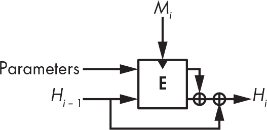

<samp class="SANS_Futura_Std_Book_Oblique_I_11">图 6-8：BLAKE2 的压缩函数。块密码处理后，状态的两半进行异或操作。</samp>

BLAKE2 的压缩函数中的块密码基于流密码 ChaCha，ChaCha 本身是 Salsa20 流密码的一个变体，Salsa20 在第五章中有讨论。在这个块密码中，BLAKE2b 的核心操作由以下一系列操作组成，它使用两个消息字*M*i 和*M*j，将四个 64 位字的状态转化：

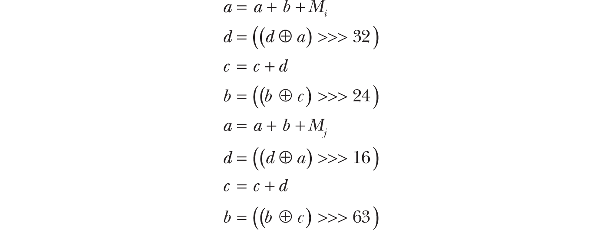

BLAKE2s 的核心操作类似，但它使用 32 位字而非 64 位字（因此使用不同的旋转值）。

最后但同样重要的是，BLAKE3 是 BLAKE2 的一个更具可并行性、更简单、更通用且更快的版本，首次在 2020 年的现实世界密码学大会上发布。BLAKE3 由 Jack O’Connor、Samuel Neves、Zooko Wilcox-O’Hearn 和我自己设计，凭借其不可否认的优势，BLAKE3 迅速成为最受欢迎的哈希函数之一。更多详细信息，请参见*[`<wbr>github<wbr>.com<wbr>/BLAKE3<wbr>-team<wbr>/BLAKE3`](https://github.com/BLAKE3-team/BLAKE3)*。

### <samp class="SANS_Futura_Std_Bold_B_11">事情如何可能出错</samp>

尽管哈希函数表面上看似简单，但在错误的地方或以错误的方式使用时，可能会导致重大的安全问题——例如，在需要检查文件完整性的应用程序中，使用弱校验算法（如 CRC）而不是加密哈希函数来验证通过网络传输的数据的完整性。然而，这种弱点与其他弱点相比，显得微不足道，后者甚至可能完全破坏看似安全的哈希函数。你将看到两个失败的例子：第一个适用于 SHA-1 和 SHA-2，但不适用于 BLAKE2 或 SHA-3，而第二个适用于这四个函数中的所有。

#### <samp class="SANS_Futura_Std_Bold_Condensed_Oblique_BI_11">长度扩展攻击</samp>

图 6-9 展示了*长度扩展攻击*，这是 Merkle–Damgård 构造的主要威胁。

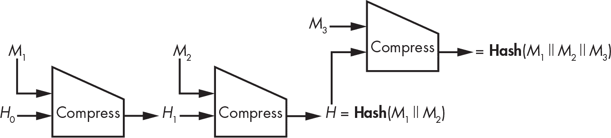

<samp class="SANS_Futura_Std_Book_Oblique_I_11">图 6-9：长度扩展攻击</samp>

基本上，如果你知道某个*未知*消息*M*的**Hash**(*M*)，其中*M*由块*M*[1]和*M*[2]（填充后）组成，你可以确定任何块*M*[3]的**Hash**(*M*[1] || *M*[2] || *M*[3]*)。因为*M*[1] || *M*[2]的哈希值是紧跟在*M*[2]之后的链式值，所以即使你不知道被哈希的数据，也可以将另一个块*M*[3]添加到已哈希的消息中。更重要的是，这个技巧可以推广到未知消息中任意数量的块（此处的*M*[1] || *M*[2]）或后缀中的块（*M*[3]）。

长度扩展攻击不会影响哈希函数的大多数应用，但如果在哈希函数使用上过于创新，可能会危及安全。不幸的是，尽管 NSA 设计了这些 SHA-2 哈希函数，并且 NIST 对其进行了标准化，而且两者都清楚这一缺陷的存在，但 SHA-2 哈希函数仍然容易受到长度扩展攻击。这一缺陷本可以通过简单地改变最后一个压缩函数的调用方式来避免（例如，通过在先前的调用中传递 0 位，而在最后一个调用中传递 1 位作为额外的参数）。这就是 BLAKE2 所做的。

#### <samp class="SANS_Futura_Std_Bold_Condensed_Oblique_BI_11">欺骗存储证明协议</samp>

云计算应用程序在*存储证明*协议中使用哈希函数——即协议中，服务器（云服务提供商）向客户端（云存储服务用户）证明服务器确实存储了它应当代表客户端存储的文件。

2007 年，Ramakrishna Kotla、Lorenzo Alvisi 和 Mike Dahlin 的论文《SafeStore: A Durable and Practical Storage System》（*［https://www.cs.utexas.edu/~lorenzo/papers/p129-kotla.pdf](https://www.cs.utexas.edu/~lorenzo/papers/p129-kotla.pdf)）提出了一种存储证明协议，用于验证某个文件*M*的存储，具体如下：

1.  客户端选择一个随机值*C*作为*挑战*。

2.  服务器计算**Hash**(*M* || *C*)作为*响应*并将结果发送给客户端。

3. 客户端也计算**Hash**(*M* || *C*)并检查它是否与从服务器接收到的值匹配。

本文的前提是服务器不应该能够欺骗客户端，因为如果服务器不知道*M*，它就无法猜测**Hash**(*M* || *C*)。但这里有一个陷阱：实际上，**Hash**是一个迭代哈希，它会逐块处理输入，并在每个块之间计算中间的链接值。例如，如果**Hash**是 SHA-256，且*M*的长度为 512 位（SHA-256 中一个块的大小），服务器就可以作弊。怎么做呢？服务器第一次接收到*M*时，它计算 *H*[1] = **Compress**(*H*[0], *M*[1])，其中 *H*[0] 是 SHA-256 的初始值，*M* 是 512 位的输入。然后，它将 *H*[1] 记录在内存中，并丢弃*M*，此时它不再存储*M*。

当客户端发送一个随机值 *C* 时，服务器计算 **Compress**(*H*[1], *C*)，并将填充添加到 *C* 以填满完整的块，然后将结果返回为**Hash**(*M* || *C*)。客户端接着会认为，由于服务器返回了正确的**Hash**(*M* || *C*)值，它持有完整的消息——然而，正如你所看到的，它可能并不持有完整消息。

这个技巧适用于 SHA-1、SHA-2、SHA-3 以及 BLAKE2。解决方案很简单：请求**Hash**(*C* || *M*)而不是**Hash**(*M* || *C*)。

### <samp class="SANS_Futura_Std_Bold_B_11">进一步阅读</samp>

想了解更多关于哈希函数的信息，可以阅读 1980 年代和 1990 年代的经典文献：比如 Ralph Merkle 的《单向哈希函数与 DES》和 Ivan Damgård 的《哈希函数的设计原则》。还可以阅读由 Bart Preneel、René Govaerts 和 Joos Vandewalle 合著的《基于块密码的哈希函数：一种综合方法》。

关于碰撞搜索的更多信息，可以参考 1997 年由 Paul van Oorschot 和 Michael Wiener 撰写的论文《并行碰撞搜索及其密码分析应用》。如果你想了解支撑前像抗性、碰撞抗性以及长度扩展攻击的理论安全概念，可以查找*indifferentiability*（不可区分性）。

有关哈希函数的最新研究，可以参考 SHA-3 竞赛的档案，其中包含所有不同的算法以及它们是如何被破解的。你可以在 SHA-3 Zoo 找到许多相关的参考资料，网址是 *[`<wbr>ehash<wbr>.iaik<wbr>.tugraz<wbr>.at<wbr>/wiki<wbr>/The<wbr>_SHA<wbr>-3<wbr>_Zoo<wbr>.html`](https://ehash.iaik.tugraz.at/wiki/The_SHA-3_Zoo.html)*，也可以访问 NIST 的页面，网址是 *[`<wbr>csrc<wbr>.nist<wbr>.gov<wbr>/projects<wbr>/hash<wbr>-functions<wbr>/sha<wbr>-3<wbr>-project`](https://csrc.nist.gov/projects/hash-functions/sha-3-project)*。

关于 SHA-3 的获胜者 Keccak 和海绵函数的更多信息，可以查看* [`<wbr>keccak<wbr>.team<wbr>/sponge<wbr>_duplex<wbr>.html`](https://keccak.team/sponge_duplex.html)*，这是 Keccak 设计者的官方网站。

最后，你可以查阅这两个关于弱哈希函数的真实攻击实例：

+   国家级恶意软件 Flame 利用 MD5 碰撞制造了一个伪造证书，看起来像是一个合法的软件。

+   Xbox 游戏主机使用了一种弱的块密码（称为 TEA）来构建哈希函数，这被利用来黑客攻击主机并在其上运行任意代码。
