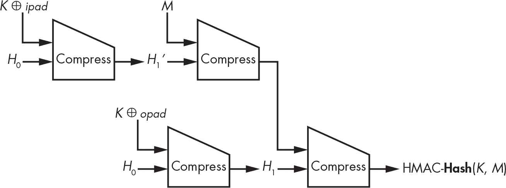
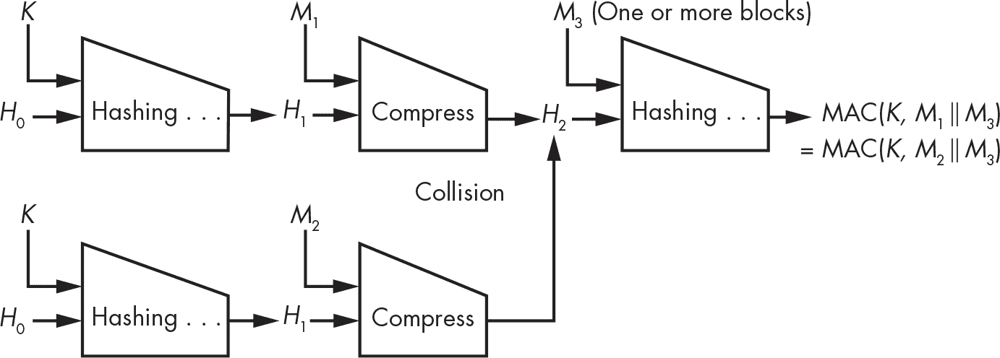
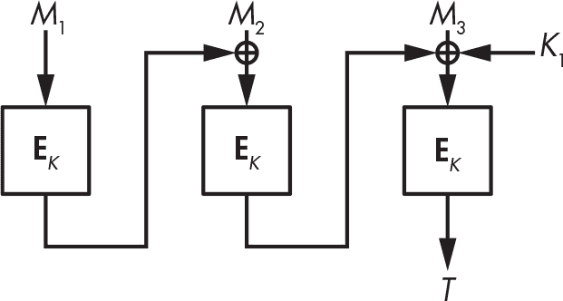
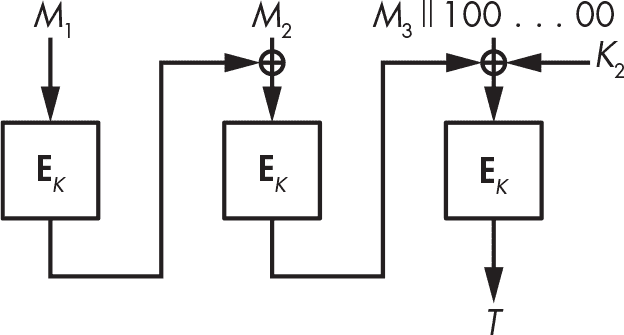
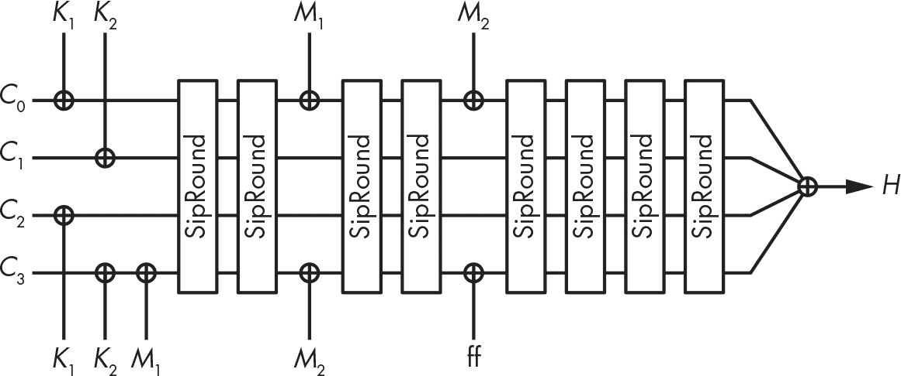
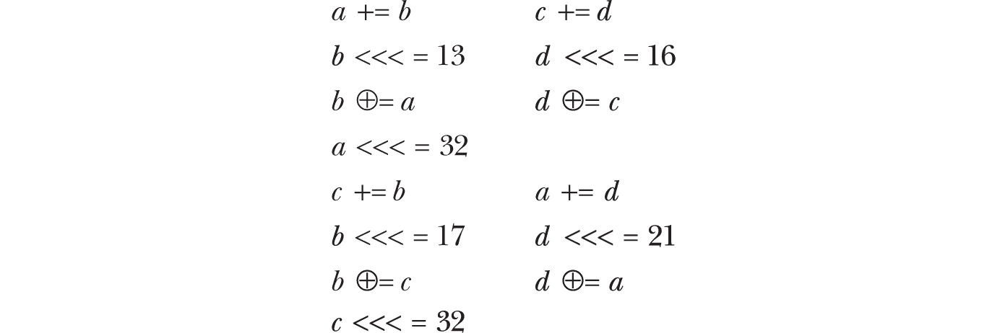

## 第八章：7 带密钥的哈希


第六章中的哈希函数接收消息并返回其哈希值——通常是一个 256 位或 512 位的短字符串。任何人都可以计算消息的哈希值，并验证某条消息是否哈希到特定的值。然而，当你希望只有特定的人能够计算哈希时，你需要使用带有*密钥*的哈希函数进行哈希处理。

带密钥的哈希是两种加密算法的基础：*消息认证码（MACs）*，用于验证消息并保护其完整性，和 *伪随机函数（PRFs）*，用于生成看似随机的哈希大小值。我们将在本章的第一节中探讨 MAC 和 PRF 的相似之处，然后回顾 MAC 和 PRF 的工作原理。一些 MAC 和 PRF 基于哈希函数，一些基于分组密码，还有一些是原创设计。最后，我们将讨论针对本来安全的 MAC 的攻击示例。

### 消息认证码

MAC 通过生成一个值 *T* = **MAC**(*K*, *M*) 来保护消息的完整性和真实性，这个值被称为消息 *M* 的身份验证标签（通常令人困惑地称为 *M* 的 MAC）。就像你知道加密算法的密钥就能解密消息一样，如果你知道 MAC 的密钥，你也可以验证消息是否没有被篡改。

例如，假设 Alex 和 Bill 共享一个密钥 *K*，并且 Alex 将消息 *M* 及其身份验证标签 *T* = **MAC**(*K*, *M*) 发送给 Bill。在收到消息及其身份验证标签后，Bill 重新计算 **MAC**(*K*, *M*) 并检查它是否等于收到的身份验证标签。因为只有 Alex 才能计算出这个值，所以 Bill 知道消息在传输过程中没有被损坏（确认其完整性），无论是偶然的还是恶意的，同时也知道是 Alex 发送了这条消息（确认其真实性）。

#### 安全通信中的 MAC

安全通信系统通常将加密算法和 MAC 结合使用，以保护消息的机密性、完整性和真实性。例如，互联网协议安全（IPsec）、SSH 和 TLS 协议会为每个传输的网络数据包生成一个 MAC。

并非所有通信系统都使用 MAC。 有时，身份验证标签可能会给每个数据包增加不可接受的开销，通常在 64 到 128 位之间。例如，旧的 GSM 移动通信标准加密了语音通话的数据包，但并未对其进行身份验证。攻击者可以修改加密后的音频信号，而接收者不会察觉。

#### 伪造和选择消息攻击

一个 MAC（消息认证码）安全意味着什么？首先，和加密算法一样，秘密密钥应该保持机密。如果一个 MAC 是安全的，攻击者不应该在不知道密钥的情况下伪造某个消息的标签。我们将伪造的消息/标签对称为*伪造*，而恢复密钥是*伪造攻击*这一更广泛类别的特定案例。安全性概念认为，伪造应该是不可能被发现的，这就是*不可伪造性*。此外，也应该不可能从标签列表中恢复秘密密钥，否则攻击者可以使用密钥伪造标签。

攻击者能做什么来破坏一个 MAC？换句话说，攻击模型是什么？最基本的攻击模型是*已知消息攻击*，它被动地收集消息及其关联的标签（例如，通过监听网络）。但真实的攻击者往往可以发起*主动*攻击，因为他们可以选择要认证的消息，从而获得他们想要的消息的 MAC。因此，标准模型是*选择消息攻击*，其中攻击者可以为自己选择的消息获取标签。

#### 重放攻击

MAC 并不免疫于*重放攻击*。例如，如果你在监听 Alex 和 Bill 的通信，你可以捕获 Alex 发送给 Bill 的消息及其标签，并后来再次将其发送给 Bill，伪装成 Alex。为了防止这种*重放攻击*，协议会在每个消息中包含一个消息编号。每个新消息的编号递增，并与消息一起通过 MAC 进行认证。接收方会按顺序收到编号为 1、2、3、4 等的消息。因此，如果攻击者尝试再次发送消息 1，接收方会注意到这条消息的顺序错乱，从而发现它可能是之前消息 1 的重放。

### 伪随机函数

一个伪随机函数（PRF）使用秘密密钥返回**PRF**(*K*, *M*)，其输出看起来是随机的。由于密钥是秘密的，攻击者无法预测输出值。

不像 MAC，PRF 不是用来独立使用的，而是作为加密算法或协议的一部分。例如，你可以使用 PRF 在 Feistel 结构中创建分组密码——请参见第四章《如何构造分组密码》。密钥派生方案使用 PRF 从主密钥或密码生成加密密钥，而身份验证方案使用 PRF 从随机挑战生成响应。（基本上，服务器发送一个随机挑战消息 *M*，客户端则通过 **PRF**(*K*, *M*) 在响应中返回，以证明它知道 *K*。）5G 电信标准使用 PRF 来验证 SIM 卡和服务提供商，类似的 PRF 生成在通话过程中使用的加密密钥和 MAC 密钥。TLS 协议使用 PRF 从主秘密和会话特定的随机值生成密钥材料。甚至在 Python 语言内置的非加密函数 hash() 中，也有一个 PRF 用于比较对象。

#### PRF 安全性

为了保证安全，伪随机函数（PRF）应该没有任何模式，使其输出与真正的随机值有所区别。一个不知道密钥的攻击者，*K*，不应该能够区分 **PRF**(*K*, *M*) 的输出和随机值。换句话说，攻击者应该没有任何手段知道自己是在与一个 PRF 算法交互，还是与一个随机函数交互。这个安全概念的学术术语是“无法区分于随机函数”。（想了解更多关于 PRF 理论基础的内容，请参见 Goldreich 的《*密码学基础*》第一卷，第 3.6 节。）

#### PRF 比 MAC 更强

PRF 和 MAC 都是带密钥的哈希函数，但 PRF 本质上比 MAC 更强，因为 MAC 的安全要求较弱。你会认为一个 MAC 安全，如果攻击者无法伪造标签——也就是说，如果他们不能猜测 MAC 的输出——而一个 PRF 只有在其输出是不可区分的随机字符串时才是安全的。如果你不能区分一个 PRF 的输出和随机字符串，这意味着它们的值无法被猜测；换句话说，任何安全的 PRF 也是一个安全的 MAC。

然而，反过来说，一个安全的 MAC 不一定是一个安全的 PRF。例如，假设你从一个安全的 PRF，**PRF1**，开始，并希望从中构建第二个 PRF，**PRF2**，像这样：


因为**PRF2**的输出被定义为**PRF1**的输出后跟一个 0 位，它看起来不像真正的随机字符串，你可以通过最后那个 0 位来区分其输出。因此，**PRF2**不是一个安全的 PRF。然而，由于**PRF1**是安全的，**PRF2**仍然可以作为一个安全的 MAC。如果你能够伪造一个标签，*T* = **PRF2**(*K*, *M*)，对于某些*M*，那么你也能伪造**PRF1**的标签，而你知道这本身是不可能的，因为 PRF1 是一个安全的 MAC。因此，**PRF2**是一个带密钥的哈希，它是一个安全的 MAC，但不是一个安全的 PRF。

但是别担心：你不会在实际应用中找到这样的 MAC 构造。事实上，许多已经部署或标准化的 MAC 也都是安全的 PRF，且常常同时作为两者使用。例如，TLS 使用 HMAC-SHA-256 算法既作为 MAC，也作为 PRF。

### 如何从未加密的哈希生成带密钥的哈希

在密码学的历史中，MAC（消息认证码）和 PRF（伪随机函数）很少是从零开始设计的，而是通常基于现有算法构建，通常是哈希函数或块密码。看起来很明显，你可以通过给（未加密的）哈希函数提供一个密钥和消息来生成一个带密钥的哈希函数，但这其实说起来容易做起来难。

#### 秘密前缀构造

我们将要讨论的第一个技术，*秘密前缀构造*，通过将密钥附加到消息前面，并返回**Hash**(*K* || *M*)，将普通哈希函数转换为带密钥的哈希。当哈希函数容易受到长度扩展攻击（参见第六章中的“长度扩展攻击”）时，以及当哈希支持不同长度的密钥时，这种方法是 insecure 的。

##### 对长度扩展攻击的安全性问题

回想一下第六章中提到的，SHA-2 系列的哈希函数允许攻击者在给定消息的较短版本的哈希值时，计算出部分未知消息的哈希值。用正式术语来说，长度扩展攻击使得攻击者可以在只知道**Hash**(*K* || *M*[1])的情况下，计算出**Hash**(*K* || *M*[1] || *M*[2])，而不知道*M*[1]或*K*。这些函数使得攻击者可以免费伪造有效的 MAC 标签，因为他们不应该仅凭*M*[1]的 MAC 就能猜测出*M*[1] || *M*[2]的 MAC。这个事实使得当与 SHA-256 或 SHA-512 一起使用时，秘密前缀构造作为 MAC 和 PRF 是 insecure 的。这是 Merkle–Damgård 结构允许长度扩展攻击的一个弱点，而 SHA-3 的所有候选者都没有这个问题。抵御长度扩展攻击是 SHA-3 提交的必要条件（参见第六章）。

##### 不同密钥长度的安全性问题

当允许使用不同长度的密钥时，密文前缀构造也是不安全的。例如，如果密钥 *K* 是 24 位的十六进制字符串 123abc，且 *M* 是 def00，那么 **Hash**() 处理的值是 *K* || *M* = 123abcdef00。如果 *K* 是 16 位的字符串 123a，且 *M* 是 bcdef000，那么 **Hash**() 处理的值也是 *K* || *M* = 123abcdef00。因此，密文前缀构造 **Hash**(*K* || *M*) 的结果对于两个密钥来说是相同的。

这个问题与底层哈希函数无关；你可以通过将密钥的长度与密钥和消息一起哈希来修复它，例如，将密钥的位长编码为 16 位整数 *L*，然后哈希 **Hash**(*L* || *K* || *M*)。然而，现代哈希函数如 BLAKE2 和 SHA-3 已经包含了一个密钥模式，避免了这些问题，并且能生成安全的 PRF 和安全的 MAC。

#### 密文后缀构造

与在密文前缀结构中将密钥哈希到消息之前不同，您可以将其 *哈希在后面*。这正是 *密文后缀结构* 的工作方式，通过构建一个由哈希函数构成的伪随机函数（PRF），如 **Hash**(*M* || *K*)。

将密钥放在末尾会产生很大的不同。针对密文前缀 MAC 的长度扩展攻击无法对密文后缀起作用。对密文后缀 MAC 应用长度扩展会得到 **Hash**(*M*[1] || *K* || *M*[2])，而不是 **Hash**(*M*[1] || *K*)，但这并不是一个有效的攻击，因为 **Hash**(*M*[1] || *K* || *M*[2]) 不是一个有效的密文后缀 MAC；密钥需要在末尾。

然而，密文后缀构造对于另一类攻击更为脆弱。假设你有一个哈希冲突 **Hash**(*M*[1]) = **Hash**(*M*[2])，其中 *M*[1] 和 *M*[2] 是两个不同的消息，可能具有不同的大小。在像 SHA-256 这样的 M-D 哈希函数中，这意味着 **Hash**(*M*[1] || *P*[1] || *K*) 和 **Hash**(*M*[2] || *P*[2] || *K*) 也将相等，其中 *P*[1] 和 *P*[2] 是为了完成块而添加的填充数据。在处理 *M*[1] || *P*[1] 后，哈希函数的状态与处理 *M*[2] || *P*[2] 后的状态相同。将 K 添加到每个实例中会保持状态的相等，从而导致冲突，无论 *K* 的值如何。

为了利用这一特性，攻击者：

1.  找到两个冲突的消息，*M*[1] 和 *M*[2]。

2.  请求 *M*[1] 的 MAC 标签，**Hash**(*M*[1] || *K*)

3.  猜测 **Hash**(*M*[2] || *K*) 相同，从而伪造一个有效的标签，破坏 MAC 的安全性。

#### HMAC 构造

*基于哈希的 MAC（HMAC）*结构允许你从哈希函数构建一个 MAC，这比使用秘密前缀或秘密后缀更安全。只要底层哈希是抗碰撞的，HMAC 就能产生一个安全的伪随机函数（PRF），即使不是这种情况，只要哈希的压缩函数是 PRF，HMAC 仍能产生一个安全的 PRF。IPsec、SSH 和 TLS 等安全通信协议都使用了 HMAC。（你可以在 NIST FIPS 198-1 标准和 RFC 2104 中找到 HMAC 规范。）

HMAC 使用哈希函数**哈希**来计算 MAC 标签，如图 7-1 所示，并根据以下表达式进行：


值*opad*（外填充）是十六进制字符串5c5c5c. . .5c，其长度与**哈希**的块大小相同。密钥*K*通常比一个块要短，并且用00字节填充并与*opad*进行异或操作。例如，如果*K*是 1 字节的字符串00，那么*K* ⊕ *opad* = *opad*。（如果*K*是任何长度的全零字符串，直到块的长度，也是如此。）*K* ⊕ *opad*是由外部调用**哈希**处理的第一个块——即方程中最左边的**哈希**，或图 7-1 中的底部哈希。



图 7-1：基于压缩函数的哈希函数的 HMAC 基于哈希的 MAC 结构

值*ipad*（内填充）是一个字符串（363636 . . . 36），其长度与**哈希**的块大小相同，并以 00 字节补充。得到的块是首先由**哈希**的内层调用处理的——即方程式中最右侧的**哈希**，或图 7-1 中的顶部哈希。

> 注意

*信封法是一种比秘密前缀或秘密后缀更安全的构造。它可以表示为* ***Hash****(*K *||* M *||* K*)，一种*三明治 MAC*，但从理论上讲，它不如 HMAC 安全。*

如果使用 SHA-256 作为**哈希**函数，则称 HMAC 实例为 HMAC-SHA-256。更一般地，称使用哈希函数*Hash*的 HMAC 实例为 HMAC-*Hash*。这意味着如果有人要求你使用 HMAC，你应该始终问：“使用哪种哈希函数？”

#### 一种针对基于哈希的 MAC 的通用攻击

有一种攻击方法可以针对所有基于迭代哈希函数的 MAC 进行攻击。回想一下在“秘密后缀构造”中对第 143 页中的攻击，我们使用哈希碰撞来获取 MAC 的碰撞。你可以使用相同的策略来攻击秘密前缀 MAC 或 HMAC，尽管后果不那么严重。

图 7-2 展示了秘密前缀 MAC **哈希**(*K* || *M*)。



图 7-2：基于哈希的 MAC 的通用伪造攻击原理

如果摘要是*n*位，你可以找到两个消息，*M*[1]和*M*[2]，使得**Hash**(*K* || *M*[1]) = **Hash**(*K* || *M*[2])，通过向持有密钥的系统请求大约 2*^n*^(/2)个 MAC 标签。（回想一下第六章中的生日攻击。）如果哈希函数支持长度扩展，像 SHA-256 那样，你可以使用*M*[1]和*M*[2]通过选择一些任意数据*M*[3]来伪造 MAC，然后查询 MAC 预言机得到**Hash**(*K* || *M*[1] || *M*[3])，这就是消息*M*[1] || *M*[3]的 MAC。结果证明，这也是消息*M*[2] || *M*[3]的 MAC，因为*M*[1]和*M*[3]以及*M*[2]和*M*[3]的哈希内部状态是相同的。你已经成功伪造了一个 MAC 标签。（随着*n*增长到例如 128 位时，这项工作会变得不可行。）

即使哈希函数不容易受到长度扩展攻击，这个攻击仍然有效，它同样适用于 HMAC。这是因为所需的只是哈希函数内部的碰撞，而不一定是在整个哈希值中的碰撞。攻击的成本取决于链值的大小和 MAC 的长度：如果一个 MAC 的链值是 512 位而它的标签是 128 位，2⁶⁴的计算将找到一个 MAC 碰撞，但可能不会在内部状态中找到碰撞，因为找到这样的碰撞平均需要 2^(512/2) = 2²⁵⁶次操作。

### 如何从块密码创建带密钥的哈希

许多哈希函数中的压缩函数是建立在块密码上的（参见第六章）。例如，HMAC-SHA-256 PRF 是对 SHA-256 压缩函数的一系列调用，SHA-256 压缩函数本身就是一个块密码，重复执行一系列的轮次。换句话说，HMAC-SHA-256 是一个块密码，嵌套在一个压缩函数内，再嵌套在哈希函数中，最后构建成 HMAC。那么，为什么不直接使用块密码，而要构建这样一个层级结构呢？

*基于密码的 MAC（CMAC）*就是这样的一个结构：它只使用一个块密码，如 AES，来创建一个 MAC。虽然比 HMAC 不那么流行，但 CMAC 已经被应用于许多系统中，包括互联网密钥交换（IKE）协议，它是 IPsec 套件的一部分。例如，IKE 使用 AES-CMAC-PRF-128 结构作为核心算法（或基于 AES 的 CMAC，输出为 128 位）。CMAC 在 RFC 4493 中有规范。

#### 破解 CBC-MAC

CMAC 是在 2005 年设计的，作为*CBC-MAC*的改进版本，CBC-MAC 是一种较简单的基于块密码的 MAC，源自密码块链接（CBC）密码工作模式（参见第四章中的“工作模式”）。

CBC-MAC，CMAC 的前身，十分简单：要计算消息 *M* 的标签，给定一个块密码 **E**，将 *M* 在 CBC 模式下使用全零初始值（IV）加密，然后丢弃除最后一个密文块外的所有块。也就是说，计算

*C*[1] = **E**(*K*, *M*[1]), *C*[2] = **E**(*K*, *M*[2] ⊕ *C*[1]), *C*[3] = **E**(*K*, *M*[3] ⊕ *C*[2])

对 *M* 的每个块进行同样的操作，仅保留最后一个 *C*i —— 即 *M* 的 CBC-MAC 标签 —— 简单，并且容易被攻击。

为了理解为什么 CBC-MAC 不安全，考虑单块消息 *M*[1] 的 CBC-MAC 标签，*T*[1] = **E**(*K*, *M*[1])，以及另一块单块消息 *M*[2] 的标签，*T*[2] = **E**(*K*, *M*[2])。给定这两个配对，(*M*[1], *T*[1]) 和 (*M*[2], *T*[2])，你可以推导出 *T*[2] 也是两块消息 *M*[1] || (*M*[2] ⊕ *T*[1]) 的标签。如果你将 CBC-MAC 应用于 *M*[1] || (*M*[2] ⊕ *T*[1]) 并计算 *C*[1] = **E**(*K*, *M*[1]) = *T*[1]，然后 *C*[2] = **E**(*K*, (*M*[2] ⊕ *T*[1]) ⊕ *T*[1]) = **E**(*K*, *M*[2]) = *T*[2]，你就能从两个消息/标签配对中创建出第三个消息/标签配对，而无需知道密钥。也就是说，你可以伪造 CBC-MAC 标签，从而破坏 CBC-MAC 的安全性。

#### 修复 CBC-MAC

CMAC 通过使用与前面的块不同的密钥来处理最后一个块，从而修复了 CBC-MAC。为此，CMAC 首先从主密钥 *K* 中派生出两个密钥 *K*[1] 和 *K*[2]，使得 *K*、*K*[1] 和 *K*[2] 是不同的。CMAC 使用 *K*[1] 或 *K*[2] 来处理最后一个块，而前面的块使用 *K*。

为了确定 *K*[1] 和 *K*[2]，CMAC 首先计算一个临时值 *L* = **E**(0, *K*)，其中 0 作为块密码的密钥，*K* 作为明文块。然后，CMAC 将 *K*[1] 设置为 (*L* << 1)，如果 *L* 的最高有效位（MSB）为 0；否则，将 *K*[1] 设置为 (*L* << 1) ⊕ 87，如果 *L* 的 MSB 为 1。（十六进制数 87，即十进制的 135，因其在数据块大小为 128 位时的数学性质而被选择；如果数据块大小不是 128 位，则需要选择不同的值。）密钥 *K*[2] 被设置为 (*K*[1] << 1)，如果 *K*[1] 的 MSB 为 0；否则，*K*[2] = (*K*[1] << 1) ⊕ 87。

给定 *K*[1] 和 *K*[2]，CMAC 的工作方式与 CBC-MAC 相似，唯一不同的是最后一块。如果最终消息块 *M*n 恰好等于一个块的大小，CMAC 将返回 **E**(*K*, *M*n ⊕ *C*n [− 1] ⊕ *K*[1]) 作为标签，如图 7-3 所示。



图 7-3：当消息是一个完整块序列时，基于 CMAC 块密码的 MAC 构造

如果 *M*n 的位数少于一个块，CMAC 会使用一个 1 位和零填充它，并返回 **E**(*K*, *M*n ⊕ *C*n [− 1] ⊕ *K*[2]) 作为标签，如图 7-4 所示。



图 7-4：当消息的最后一个块必须用 1 位和零填充以填满一个块时，基于 CMAC 块密码的 MAC 构造

第一个案例仅使用*K*[1]，第二个案例仅使用*K*[2]，但两者都使用主密钥*K*来处理在最后一个消息块之前的消息块。

与 CBC 加密模式不同，CMAC 不接受 IV（初始化向量）作为参数，并且是确定性的：对于同一个密钥，CMAC 始终为给定的消息*M*返回相同的标签，因为**CMAC**(*M*)的计算不是随机化的——这没问题，因为与加密不同，MAC 计算不需要随机化即可保证安全，这也避免了必须选择随机 IV 的负担。### 专用 MAC 设计

你已经看到如何回收哈希函数和块密码算法来构建 PRF，只要它们底层的哈希或密码算法是安全的，PRF 也会是安全的。像 HMAC 和 CMAC 这样的方案只是简单地结合现有的哈希函数或块密码算法来生成一个安全的 PRF 或 MAC。重用现有的算法虽然方便，但这是否是最有效的方法呢？

直观上，PRF（伪随机函数）和 MAC（消息认证码）相比无密钥哈希函数在安全性上所需的工作量更少——它们使用了一个秘密密钥，防止攻击者篡改算法，因为攻击者没有密钥。此外，PRF 和 MAC 仅暴露一个短标签给攻击者，而不像块密码算法那样暴露与消息同样长度的密文。因此，PRF 和 MAC 不需要哈希函数或块密码算法的最大计算能力——这就是*专用设计*的意义所在，即专门为作为 PRF 或 MAC 而设计的算法。

接下来的部分将重点介绍两种这样的算法：Poly1305 和 SipHash。我将解释它们的设计原理以及为什么它们（很可能）是安全的。

#### Poly1305

Poly1305 算法（发音为*poly*-*thirteen*-*o-five*）是由 Daniel J. Bernstein 于 2005 年设计的（他也是第五章中的 Salsa20 流密码和启发 BLAKE 及 BLAKE2 哈希函数的 ChaCha 密码的创造者）。Poly1305 经过优化，能够在现代 CPU 上实现超快的速度，截止目前，它已经成为 TLS 1.3 和 OpenSSH 等多种应用程序中支持的算法之一。与 Salsa20 不同，Poly1305 的设计基于上世纪 70 年代的技术——即通用哈希函数和 Wegman–Carter 构造方法。

##### 通用哈希函数

Poly1305 MAC 使用了*通用哈希函数*。这种哈希函数比加密哈希函数要弱，但速度更快。例如，通用哈希函数不必具备抗碰撞性。

类似于伪随机函数（PRF），通用哈希由一个秘密密钥参数化：给定一个消息 *M* 和密钥 *K*，我们用 **UH**(*K*, *M*) 表示通用哈希函数 **UH** 的输出。通用哈希函数只有一个安全要求：对于任意两个消息 *M*[1] 和 *M*[2]，以及一个随机密钥 *K*，**UH**(*K*, *M*[1]) 等于 **UH**(*K*, *M*[2]) 的概率必须是微不足道的。与 PRF 不同，通用哈希不需要是伪随机的；只是不能有一对 (*M*[1]，*M*[2]) 对，能够在多个不同的密钥下生成相同的哈希值。由于它们的安全要求更容易满足，通用哈希函数需要的运算较少，比 PRF 快得多。

然而，你只能将通用哈希用作 MAC 来验证最多一个消息。例如，考虑 Poly1305 中使用的通用 *多项式评估* 哈希。（更多关于这一概念的信息，请参见 Edgar Gilbert、Jessie MacWilliams 和 Neil Sloane 在 1974 年发表的开创性文章《检测欺骗的编码》）。这种多项式评估哈希是由一个质数 *p* 参数化的，它接受一个由两个数字 *R* 和 *K* 组成的密钥（范围为 [1, *p*））以及一个包含 *n* 个块的消息 *M*（*M*[1]，*M*[2]，. . . ，*M*n）。然后，你可以按照以下方式计算通用哈希的输出：


在此方程中，加号（+）表示正整数的加法，*K*^i 是 *K* 的 *i* 次方，"mod *p*" 表示结果对 *p* 取模（即结果除以 *p* 的余数；例如，12 mod 10 = 2，10 mod 10 = 0，8 mod 10 = 8，依此类推）。

因为你希望哈希操作尽可能快速，基于通用哈希的 MAC 通常使用 128 位的消息块和一个略大于 2¹²⁸ 的质数 *p*，例如 2¹²⁸ + 51。128 位宽度通过高效使用常见 CPU 的 32 位和 64 位算术单元，允许非常快速的实现。

##### 安全限制

通用哈希有一个弱点：由于通用哈希只能安全地验证一个消息，攻击者可以通过请求两个消息的标签来突破之前的多项式评估 MAC。具体来说，他们可以请求一个所有块都为零的消息的标签——*M*[1] = *M*[2] = . . . = 0——从而得到标签 **UH**(*R*, *K*, 0) = *R*，进而找出秘密值 *R*。或者，他们可以请求一个消息的标签，其中 *M*[1] = 1 且 *M*[2] = *M*[3] = . . . = 0（其标签为 *T* = *R* + *K*），这样他们就可以通过从 *T* 中减去 *R* 来找出 *K*。现在攻击者知道了整个密钥（*R*，*K*），并且能够伪造任何消息的 MAC。

幸运的是，存在一种方法可以将单消息安全性提升到多消息安全性。

##### Wegman–Carter MAC

使用通用哈希函数对多个消息进行身份验证的技巧得益于 IBM 研究员 Mark Wegman 和 Lawrence Carter 以及他们 1981 年发表的论文《新哈希函数及其在身份验证和集合相等中的应用》。Wegman–Carter 结构通过使用两个密钥，*K*[1]和*K*[2]，以及通用哈希函数和伪随机函数（PRF）来构建 MAC，返回结果为：


其中*N*是一个随机数，必须针对每个密钥*K*[2]使用最多一次，而**PRF**的输出与通用哈希函数**UH**的输出大小相同。通过将这两个值相加，**PRF**的强伪随机输出掩盖了**UH**的加密弱点。你可以将其视为对通用哈希结果的加密，其中 PRF 充当流密码，并通过使得使用相同密钥*K*[1]可以验证多个消息，来防止之前的攻击。

总结一下，Wegman–Carter 结构**UH**(*K*[1], *M*) + **PRF**(*K*[2], *N*)在假设以下条件的情况下，提供了一个安全的 MAC：

+   **UH**是一个安全的通用哈希。

+   **PRF**是一个安全的伪随机函数。

+   每个随机数*N*只针对每个密钥*K*[2]使用一次。

+   **UH**和**PRF**的输出值足够长，确保具有足够的安全性。

现在让我们看看 Poly1305 如何利用 Wegman–Carter 结构来构建一个安全且快速的 MAC。

##### Poly1305-AES

Poly1305 最初被提议为 Poly1305-AES，结合了 Poly1305 通用哈希和 AES 块密码。Poly1305-AES 比基于 HMAC 的 MAC，甚至比 CMAC 还要快，因为它只计算一个 AES 块，并通过一系列简单的算术运算并行处理消息。

给定 128 位的*K*[1]、*K*[2]和*N*，以及消息*M*，Poly1305-AES 返回以下结果：


模 2¹²⁸的约简确保结果适合 128 位。Poly1305 将消息*M*解析为一系列 128 位的块（*M*[1]，*M*[2]，...，*M*n），并将每个块的最高有效位附加一个第 129 位，使得所有块的长度为 129 位。（如果最后一个块小于 16 字节，它会先填充一个 1 位，接着是 0 位，然后再添加最后的第 129 位。）接着，Poly1305 计算该多项式，得到以下结果：


这个表达式的结果是一个最多 129 位长的整数。当你将其与 128 位的值**AES**(*K*[2], *N*)相加时，结果会模 2¹²⁸约简，生成一个 128 位的 MAC。

> 注意

*我曾经描述过 Wegman–Carter 使用 PRF，但 AES 不是 PRF，它是伪随机置换（PRP）。然而，这不影响结果，因为 Wegman–Carter 结构在 PRP 和 PRF 上都能很好地工作。这是因为如果你给定一个函数，它既可以是 PRF 也可以是 PRP，单从函数的输出值无法判断它是 PRF 还是 PRP。换句话说，区分 PRP 和 PRF 在计算上是困难的。*

Poly1305-AES 的安全分析（参见 *[`<wbr>cr<wbr>.yp<wbr>.to<wbr>/mac<wbr>/poly1305<wbr>-20050329<wbr>.pdf`](https://cr.yp.to/mac/poly1305-20050329.pdf)* 中的 "Poly1305-AES 消息认证码"）表明，只要 AES 是一个安全的分组密码，并且所有实现都正确，Poly1305-AES 就是 128 位安全的——这与任何加密算法一样。

你可以将 Poly1305 通用哈希与 AES 之外的其他算法结合使用。例如，Poly1305 被与流密码 ChaCha 一起使用（参见 RFC 7539，"ChaCha20 和 Poly1305 用于 IETF 协议"）。毫无疑问，Poly1305 将继续在需要快速 MAC 的地方得到应用。

尽管 Poly1305 既快速又安全，但它也有一些缺点。首先，它的多项式评估实现起来较为复杂，特别是对于那些不熟悉相关数学概念的人来说尤为困难。（参见 *[`<wbr>github<wbr>.com<wbr>/floodyberry<wbr>/poly1305<wbr>-donna`](https://github.com/floodyberry/poly1305-donna)* 的示例。）其次，单独使用时，它只对一个消息是安全的，除非你使用 Wegman-Carter 构造。但是在这种情况下，它需要使用一个 nonce，并且如果 nonce 被重复使用，算法将变得不安全。最后，Poly1305 对长消息进行了优化，但如果仅处理小消息（比如少于 128 字节），它就显得有些过度。在这种情况下，SipHash 是一个不错的解决方案。

#### SipHash

我与 Dan Bernstein 一起在 2012 年设计了 SipHash，最初是为了解决一个非加密问题：哈希表的拒绝服务攻击。哈希表是一种数据结构，特别用于编程语言中高效地存储元素。在 SipHash 之前，哈希表依赖于非加密的密钥哈希函数，这些哈希函数经常能轻易找到冲突，这可以被利用来减慢系统速度并执行拒绝服务攻击。我们观察到伪随机函数（PRF）可以解决这个问题，于是着手设计了 SipHash，一个适用于哈希表的 PRF。由于哈希表主要处理短输入，SipHash 对短消息进行了优化。SipHash 是一个完整的 PRF 和 MAC，在大多数输入较短的场景下表现出色。

SipHash 使用了一个技巧，使它比基本的海绵函数更安全：它不是在置换前仅对消息块进行一次异或运算，而是在置换前后都对消息块进行异或运算，正如 图 7-5 所示。SipHash 的 128 位密钥被视为两个 64 位字，*K*[1] 和 *K*[2]，它们异或成一个 256 位的固定初始状态，这个状态又被视为四个 64 位字。接下来，密钥被丢弃，计算 SipHash 就简化为通过一个叫做 SipRound 的核心函数进行迭代，然后将消息块异或到四字内部状态中。最后，SipHash 通过将四个状态字异或在一起，返回一个 64 位标签。



图 7-5：SipHash-2-4 处理一个 15 字节的消息（一个块， M1，8 字节，和一个块， M2，7 字节，再加 1 字节填充）

SipRound 函数使用一堆 XOR 运算以及加法和字旋转来使函数安全。 SipRound 通过从上到下执行以下操作来转换四个 64 位字（*a*、*b*、*c*、*d*）的状态。左侧和右侧的操作是独立的，可以并行执行：



这里，*a* += *b* 是 *a* = *a* + *b* 的简写，*b* <<< = 13 是 *b* = *b* <<< 13 的简写（64 位字 *b* 左旋 13 位）。

这些对 64 位字的简单操作几乎是您需要实现以计算 SipHash 的全部内容——尽管您不必自己实现它。 您可以在大多数语言中找到现成的实现，如 C、Go、Java、JavaScript、Python 和 Rust。

> 注意

*我写了* ***SipHash****-*x*-*y *作为 SipHash 版本，意味着在每个消息块注入之间进行* x *个 SipRounds，然后进行* y *轮。更多轮次需要更多操作，这会减慢操作速度，但也会增加安全性。 默认版本是 SipHash-2-4（简称为 SipHash），迄今为止它已经抵抗了密码分析。 请注意，我还定义了 SipHash128，SipHash 的一个生成 128 位标签的版本。*

许多系统，如 Rust 语言、OpenBSD 操作系统和比特币区块链，内部使用 SipHash。Linux 内核也使用 SipHash，并且还使用 HalfSipHash，“SipHash 的不安全的年轻表亲”，一个具有 64 位密钥和 32 位输出的较小版本（参见*[`<wbr>docs<wbr>.kernel<wbr>.org<wbr>/security<wbr>/siphash<wbr>.html`](https://docs.kernel.org/security/siphash.html)*）。### 事情可能出错的地方

像密码和无密钥哈希函数一样，纸面上安全的 MAC 和 PRF 在实际环境中使用时可能会受到攻击。 让我们讨论两个例子。

#### MAC 验证的时序攻击

*侧信道攻击* 针对的是加密算法的实现而不是算法本身。特别是 *时序攻击* 利用算法的执行时间来确定秘密信息，如密钥、明文和秘密随机值。变时间字符串比较不仅在 MAC 验证中引入漏洞，还在许多其他加密和安全功能中引入漏洞。

当远程系统在依赖于标签值的时间内验证标签时，MAC（消息认证码）可能会受到定时攻击的影响，从而允许攻击者通过尝试多个错误的标签来确定正确的消息标签，最终找出完成时间最长的那个。当服务器逐字节按顺序比较正确的标签和错误标签，直到字节不同时，问题就出现了。例如，列表 7-1 中的 Python 代码逐字节按可变时间比较两个字符串：如果第一个字节不同，函数仅经过一次比较就返回；如果字符串 x 和 y 相同，函数会根据字符串的长度进行 n 次比较。

```
def compare_mac(x, y, n):
    if len(x) != len(y):
        return False
    if len(x) != n:
        return False
    for i in range(n):
        if x[i] != y[i]:
            return False
    return True
```

列表 7-1：比较两个 n-字节字符串，采用可变时间

为了演示 compare_mac() 函数的漏洞，我们将编写一个程序，测量 100,000 次调用 compare_mac() 的执行时间，首先是相同的 16 字符 x 和 y 值，然后是第三个字节不同的 x 和 y 值。后者的比较应该花费明显更少的时间，因为 compare_mac() 比较的字节比相同的 x 和 y 少，正如列表 7-2 所示。

```
from time import time

MAC1 = 'abcdefghijklmnop'
MAC2 = 'abXdefghijklmnop'
TRIALS = 100000

def compare_mac(x, y, n):
    if len(x) != len(y):
        return False
 if len(x) != n:
        return False
    for i in range(n):
        if x[i] != y[i]:
            return False
    return True

# Each call to compare_mac() will look at all 16 characters.
start = time()
for i in range(TRIALS):
    compare_mac(MAC1, MAC1, len(MAC1))
end = time()
print("%0.5f" % (end-start))

# Each call to compare_mac() will look at three characters.
start = time()
for i in range(TRIALS):
    compare_mac(MAC1, MAC2, len(MAC1))
end = time()
print("%0.5f" % (end-start))
```

列表 7-2：执行 compare_mac() 时测量时间差异，来自列表 7-1

在搭载 ARM M1 芯片的 MacBook Pro 上，列表 7-2 中的程序执行时间分别约为 67 毫秒和 26 毫秒。这个差异足够大，可以帮助识别算法内部发生了什么。现在，将差异转移到字符串中的其他偏移位置，你将会观察到不同偏移位置的执行时间不同。如果<code class="SANS_TheSansMonoCd_W5Regular_11">MAC1</code>是正确的 MAC 标签，而<code class="SANS_TheSansMonoCd_W5Regular_11">MAC2</code>是攻击者尝试的标签，你就能轻松识别第一个差异的位置，这个位置表示正确猜测的字节数。

如果执行时间不依赖于某个秘密时序，那么定时攻击将无法生效，这也是实现者努力编写*恒定时间*实现的原因——即无论输入的秘密值是什么，代码完成所需的时间都完全相同。例如，列表 7-3 中的 C 函数以恒定时间比较两个<code class="SANS_TheSansMonoCd_W5Regular_11">size</code>字节的缓冲区：临时变量<code class="SANS_TheSansMonoCd_W5Regular_11">result</code>只有在两个缓冲区之间存在差异时才为非零。

```
int cmp_const(const void *a, const void *b, const size_t size)
{
    const unsigned char *_a = (const unsigned char *) a;
    const unsigned char *_b = (const unsigned char *) b;
    unsigned char result = 0;
    size_t i;

    for (i = 0; i < size; i++) {
        result |= _a[i] ^ _b[i];
    }

    return result; /* Returns 0 if *a and *b are equal, nonzero otherwise */
}
```

<code class="SANS_Futura_Std_Book_Oblique_I_11">列表 7-3：用于更安全的 MAC 验证的恒定时间比较两个缓冲区</code>  #### <code class="SANS_Futura_Std_Bold_Condensed_Oblique_BI_11">当海绵泄漏时</code>

基于置换的算法，如 SHA-3 和 SipHash，简单、易于实现，且具有紧凑的实现，但在面对恢复系统状态快照的旁路攻击时，它们比较脆弱。例如，如果一个进程能够随时读取 RAM 和寄存器的值，或者读取内存的核心转储，攻击者就能确定 SHA-3 在 MAC 模式下的内部状态，或 SipHash 的内部状态，然后计算置换的逆操作来恢复初始的秘密状态。之后，他们可以伪造任何消息的标签，从而破坏 MAC 的安全性。

幸运的是，这种攻击对基于压缩函数的 MAC（如 HMAC-SHA-256 和带密钥的 BLAKE2）无效，因为攻击者需要在密钥使用的精确时刻捕获内存快照。结果是，如果你处于一个可能泄露进程部分内存的环境中，你可以使用基于不可逆变换压缩函数的 MAC，而不是基于置换的 MAC。

### <code class="SANS_Futura_Std_Bold_B_11">进一步阅读</code>

受人尊敬的 HMAC 值得更多的关注，比我在这里所能提到的要多得多，特别是它的广泛应用和最终因与弱哈希函数结合而导致的衰退背后的思维过程。我推荐 1996 年由 Mihir Bellare、Ran Canetti 和 Hugo Krawczyk 撰写的论文《消息认证的哈希函数键控》，该论文介绍了 HMAC 及其同类 NMAC，还有 2006 年 Bellare 撰写的后续论文《NMAC 和 HMAC 的新证明：无需碰撞抗性的安全性》，该论文证明了 HMAC 不需要碰撞抗性的哈希函数，只需要具有压缩函数的伪随机函数（PRF）的哈希函数。在进攻方面，Pierre-Alain Fouque、Gaëtan Leurent 和 Phong Nguyen 在 2007 年的论文《HMAC/NMAC-MD4 和 NMAC-MD5 的完整密钥恢复攻击》中展示了如何攻击基于脆弱哈希函数（如 MD4 或 MD5）构建的 HMAC 和 NMAC。（HMAC-MD5 和 HMAC-SHA-1 并未完全崩溃，但风险已经足够高。）

Wegman–Carter MACs 也值得更多关注，无论是从实际应用的角度，还是从其底层理论的角度。Wegman 和 Carter 的开创性论文可以在 *[`<wbr>cr<wbr>.yp<wbr>.to<wbr>/bib<wbr>/entries<wbr>.html`](https://cr.yp.to/bib/entries.html)* 中找到。其他前沿设计包括 UMAC 和 VMAC，它们是处理长消息时速度最快的 MAC 之一。

本章没有讨论的另一种 MAC 是 *Pelican*，它使用经过简化的 AES 区块密码（将完整区块密码的 10 轮减少到 4 轮）来验证消息块，在一种简易结构中进行认证，具体描述可以参考 *[`<wbr>eprint<wbr>.iacr<wbr>.org<wbr>/2005<wbr>/088`](https://eprint.iacr.org/2005/088)*。不过，Pelican 更多的是一个好奇心驱动的研究，实际上很少被使用。

最后但同样重要的是，如果你有兴趣寻找密码学软件中的漏洞，可以关注 CBC-MAC 的使用，或者关注由于 HMAC 处理任意大小的密钥而导致的弱点——如果 *K* 太长，就将 **Hash**(*K*) 作为密钥，而不是 *K*，从而使得 *K* 和 **Hash**(*K*) 成为 *等效密钥*。或者，你也可以关注那些应该使用 MAC 却没有使用的系统——这种情况很常见。

在 第八章 中，我们将结合 MAC 和密码学算法来保护消息的真实性、完整性和*保密性*。我们也会在没有使用 MAC 的情况下实现这一目标，得益于认证密码，它将基础密码和 MAC 的功能结合在一起，每次加密时都会返回一个标签。
