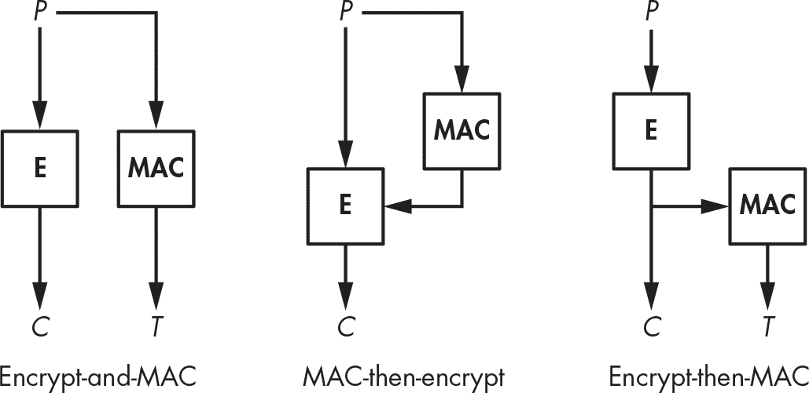
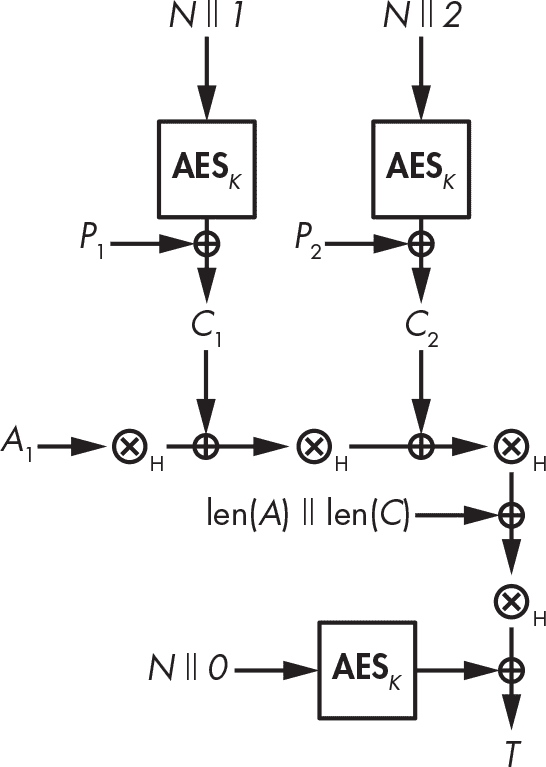
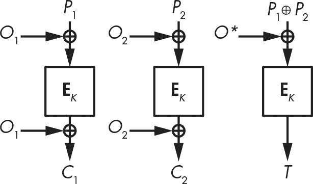
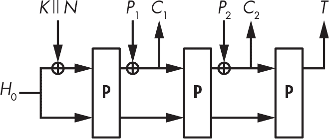
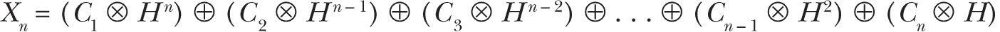

## 8 认证加密


本章讲解的是一种算法，它不仅保护消息的机密性，还保护其真实性。回想一下第七章，消息认证码（MAC）通过创建一个标签（类似于签名）来保护消息的真实性。像 MAC 一样，本章中的认证加密（AE）算法不仅生成认证标签，还会加密消息。换句话说，单一的 AE 算法提供了常规密码和 MAC 的功能。

结合密码学和消息认证码（MAC）可以实现不同级别的认证加密，正如你在本章中将学到的那样。我们将回顾几种将 MAC 与密码学结合的方式，讨论哪些方法是最安全的，并探索既生成密文又生成认证标签的密码算法。然后，我们将介绍四种重要的认证加密算法：三种基于分组密码的构造，重点讨论广泛使用的高级加密标准（AES-GCM）模式，以及一种仅使用置换算法的密码。

### 使用 MAC 的认证加密

图 8-1 展示了三种将 MAC 和密码结合来同时加密和认证明文的方法：加密与 MAC、MAC-再加密和加密-再 MAC。



图 8-1：密码与 MAC 的组合

这些组合方法的区别在于应用加密和生成认证标签的顺序。选择特定的 MAC 或密码算法并不重要，只要每种算法本身是安全的，并且 MAC 和密码算法使用不同的密钥。

在加密与 MAC 组合中，明文被加密并且认证标签直接从明文生成，因此这两步操作（加密和认证）是独立的，你可以并行计算它们。在 MAC-再加密方案中，你首先从明文生成标签，然后将明文和 MAC 一起加密。在加密-再 MAC 方法中，你首先加密明文，然后从密文中生成标签。让我们看看哪种方法可能是最安全的。

#### 加密与 MAC 方法

*加密与 MAC*方法分别计算密文和 MAC 标签。给定明文*P*，发送方计算密文*C* = **E**(*K*[1], *P*)，其中**E**是加密算法，*C*是得到的密文。你从明文计算认证标签*T*，即*T* = **MAC**(*K*[2], *P*)。这两步操作是独立的，因此可以并行计算。

一旦你生成了密文和认证标签，发送方将两者传输给预期的接收方。当接收方收到 *C* 和 *T* 时，他们通过计算 *P* = **D**(*K*[1], *C*) 解密 *C* 以获得明文 *P*。接下来，他们使用解密后的明文计算 **MAC**(*K*[2], *P*)，并将结果与接收到的 *T* 进行比较。如果 *C* 或 *T* 被损坏，验证将失败，消息将被视为无效。

从理论上讲，加密并附加 MAC 是最不安全的 MAC 和密码组合，因为即使是一个安全的 MAC 也可能泄露 *P* 的信息，使得 *P* 更容易被恢复。因为使用 MAC 的目的是为了使标签不可伪造，并且标签不一定是随机的，明文 (*P*) 的认证标签 (*T*) 即使在 MAC 被认为是安全的情况下，也可能泄露信息！（如果 MAC 是伪随机函数，标签就不会泄露任何关于 *P* 的信息。）

尽管相对较弱，许多系统仍然继续支持加密并附加 MAC，包括安全传输层协议 SSH，其中每个加密数据包 *C* 后面跟随标签 *T* = **MAC**(*K*, *N* || *P*)，其中 *N* 是一个 32 位的序列号，每个数据包递增。在实践中，由于使用了像 HMAC-SHA-256 这样的强大 MAC 算法，它们不会泄露 *P* 的信息，因而加密并附加 MAC 在 SSH 中被证明足够安全。输入以下命令

```
$ **ssh -Q mac**
```

查看 OpenSSH 软件支持的 MAC 列表。

#### MAC-然后加密组合

*MAC-然后加密* 组合通过首先计算认证标签 *T* = **MAC**(*K*[2], *P*) 来保护消息 *P*。接下来，根据 *C* = **E**(*K*[1], *P* || *T*)，它将明文和标签一起加密生成密文。

一旦这些步骤完成，发送方只传输 *C*，它包含了加密的明文和标签。接收方收到后，通过计算 *P* || *T* = **D**(*K*[1], *C*) 解密 *C* 以获得明文和标签 *T*。接下来，接收方通过根据 **MAC**(*K*[2], *P*) 直接从明文计算标签来验证接收到的标签 *T*，以确认计算出的标签与标签 *T* 相等。

与加密并附加 MAC 类似，在使用 MAC-然后加密时，接收方必须在确定是否接收到损坏的数据包之前先解密 *C* —— 这个过程可能会让接收方看到潜在损坏的明文。尽管如此，MAC-然后加密比加密并附加 MAC 更安全，因为它隐藏了明文的认证标签，从而防止标签泄露明文的信息。

TLS 协议已使用 MAC-然后加密多年，但 TLS 1.3 将 MAC-然后加密替换为经过认证的密码（有关 TLS 1.3 的更多信息，请参见第十三章）。

#### 加密-然后 MAC 组合

encrypt-then-MAC 组合将两个值发送给接收方：由 *C* = **E**(*K*[1], *P*) 产生的密文和基于密文的标签 *T* = **MAC**(*K*[2], *C*)。接收方使用 **MAC**(*K*[2], *C*) 计算标签，并验证它是否等于接收到的 *T*。如果值相等，则计算明文为 *P* = **D**(*K*[1], *C*)；如果不相等，则丢弃密文。

这种方法的一个优点是接收方只需要计算 MAC 来检测消息是否损坏，这意味着不需要解密损坏的密文。此外，攻击者不能发送 *C* 和 *T* 的对给接收方解密，除非他们已经破解了 MAC，这使得攻击者更难将恶意数据传输给接收方。

这种特性组合使得 encrypt-then-MAC 比 encrypt-and-MAC 和 MAC-then-encrypt 方法更强大。这也是广泛使用的 IPsec 安全通信协议套件采用这种方法来保护数据包（例如，在 VPN 隧道内）的原因之一。

注意，SSH 和 TLS 并没有使用 encrypt-then-MAC，因为在创建 SSH 和 TLS 时，其他方法已经足够有效——这并不是因为理论上的弱点不存在，而是因为不良特性不一定会变成实际的漏洞。

### 认证密码算法

*认证密码算法* 是密码和 MAC 组合的替代方案。它们像普通的密码算法，只不过它们会在返回密文的同时还返回一个认证标签。

你可以将认证密码加密表示为 **AE**(*K*, *P*) = (*C*, *T*)。术语 **AE** 代表 *认证加密*，它基于密钥 (*K*) 和明文 (*P*)，返回密文 (*C*) 和生成的认证标签 (*T*)。换句话说，单一的认证密码算法完成了密码和 MAC 组合的工作，使得它更简洁、更快速，并且通常更安全。

你可以将认证密码解密表示为 **AD**(*K*, *C*, *T*) = *P*。这里，**AD** 代表 *认证解密*，它根据密文 (*C*)、标签 (*T*) 和密钥 (*K*) 返回明文 (*P*)。如果标签验证失败，**AD** 会返回错误，防止接收方处理可能被伪造的明文。同样，如果 **AD** 返回明文，说明它是由知道秘密密钥的某人或某物加密的。

认证密码的基本安全要求很简单：其认证强度应该与 MAC 的强度一样，这意味着应该不可能伪造一个密文和标签对 (*C*, *T*)，使得解密函数 **AD** 接受并解密它。

就保密性而言，一个认证密码比一个基础密码从根本上更强大，因为持有秘密密钥的系统只有在认证标签有效时才会解密密文。如果标签无效，明文会被丢弃。这一特性防止了攻击者进行选择密文查询攻击，即他们创建密文并请求相应的明文。

#### 带关联数据的认证加密

密码学家将*关联数据*定义为通过认证密码处理的任何数据，使得这些数据经过认证（通过认证标签）但不被加密。默认情况下，所有输入到认证密码的数据都是被加密*和*认证的。

假设你想要验证一条消息，包括它的未加密部分，但不加密整个消息——也就是说，你想验证和传输数据，除了加密的消息之外。例如，如果一个密码算法处理一个由头部和有效负载组成的网络数据包，你可能会选择加密有效负载来隐藏实际传输的数据，但不加密头部，因为头部包含将数据包传递给最终接收者所需的信息。与此同时，你可能仍然希望验证头部数据，以确保它是从预期的发送者收到的。

为了实现这些目标，密码学家创造了*带关联数据的认证加密（AEAD）*的概念。AEAD 算法允许你将明文数据附加到密文中，以一种方式使得如果明文数据被篡改，认证标签将无法通过验证，密文也无法解密。这些明文数据必须以安全的方式进行编码和序列化，以防止对其内容的歧义解释。

你可以将 AEAD 操作写成**AEAD**(*K*, *P*, *A*) = (*C*, *A*, *T*)。给定一个密钥(*K*)、明文(*P*)和关联数据(*A*)，AEAD 返回密文、未加密的关联数据*A*和认证标签。AEAD 保持未加密的关联数据不变，密文是明文的加密。认证标签依赖于*P*和*A*，并且只有当*C*和*A*都没有被修改时，认证标签才会被验证为有效。

由于认证标签依赖于*A*，你可以通过**ADAD**(*K*, *C*, *A*, *T*) = (*P*, *A*)来计算带关联数据的解密。解密需要密钥、密文、关联数据和标签，以便计算明文和关联数据，如果*C*或*A*被破坏，解密将失败。

使用 AEAD 时，你可以将*A*或*P*留空。如果关联数据*A*为空，AEAD 就变成了一个普通的认证密码；如果*P*为空，那它就只是一个 MAC。

> 注意

*截至本文写作时，AEAD 是当前认证加密的标准。由于几乎所有当前使用的认证密码都支持关联数据，在本书中提到的认证密码，除非特别说明，都是指 AEAD。当讨论 AEAD 的加密和解密操作时，我将分别称之为* ***AE*** *和* ***AD***。*

#### 可预测性和随机数

回想一下第一章中提到的，为了保证安全，加密方案必须是不可预测的，并且在重复加密相同明文时返回不同的密文——否则，攻击者就能确定是否加密了相同的明文。为了不可预测性，分组密码和流密码会给密码算法提供一个额外的参数：初始值（IV）或*随机数*——这是一个只能使用一次的数字。认证密码也使用了同样的技巧。因此，你可以将认证加密表示为**AE**(*K*, *P*, *A*, *N*)，其中*N*是随机数。加密操作需要选择一个从未与相同密钥一起使用过的随机数。

与分组密码和流密码一样，使用认证密码进行解密时需要使用加密时所用的随机数，以确保解密操作正确。因此，你可以将解密表示为**AD**(*K*, *C*, *A*, *T*, *N*) = (*P*, *A*)，其中*N*是用于生成*C*和*T*的随机数。

#### 良好认证密码的标准

自 2000 年代初以来，研究人员一直在努力定义什么才是一个好的认证密码，但答案仍然难以捉摸。由于 AEAD 有许多不同角色的输入，其安全性比仅加密消息的基本密码更难定义。例如，研究文章《随机数被注意到：AEAD 再探》，可在*[`<wbr>eprint<wbr>.iacr<wbr>.org<wbr>/2019<wbr>/624`](https://eprint.iacr.org/2019/624)*查看，提出了一个基于随机数加密的理论框架。尽管如此，在本节中，我将总结评估认证密码的安全性、性能和功能时需要考虑的最重要标准。

##### 安全性

衡量认证密码强度的最重要标准是其保护数据机密性的能力（即明文的保密性），以及通信的真实性和完整性（例如，MAC 检测损坏消息的能力）。认证密码必须在这两个领域都具备竞争力：其机密性必须与最强密码相当，而其真实性必须与最好的 MAC 相当。换句话说，如果你去掉 AEAD 中的认证部分，你应该得到一个安全的密码，而如果去掉加密部分，你应该得到一个强大的 MAC。

认证密码强度的另一个衡量标准是它在面对重复的随机数时的脆弱性。例如，如果随机数被重复使用，攻击者是否能够解密密文或识别明文之间的差异？

研究人员称这种强度的概念为*滥用抗性*，并设计了滥用抗性的认证密码，来评估重复使用随机数的影响，并尝试确定在这种攻击面前，机密性、真实性或两者是否会受到破坏，以及加密数据可能泄露哪些信息。

##### 性能

和每种加密算法一样，认证密码的吞吐量是通过每秒处理的比特数来衡量的。这一速度取决于密码算法执行的操作数量以及认证功能的额外开销。认证密码的额外安全特性会带来性能损失。然而，密码性能的衡量标准不仅仅是纯粹的速度，还包括并行性、结构以及密码是否支持流式处理。我们来更深入地了解这些概念。

密码的*并行性*是衡量其在不等待前一个数据块处理完成的情况下同时处理多个数据块的能力。基于块密码的设计可以轻松实现并行化，当每个数据块可以独立于其他数据块进行处理时。例如，第四章中的 CTR 块密码模式是可并行的，而 CBC 加密模式则不可并行，因为块是相互链式的。

认证密码的内部结构是另一个重要的性能标准。主要有两种结构类型：单层和双层。在双层结构中（例如广泛使用的 AES-GCM），一个算法处理明文，然后第二个算法处理结果。通常，第一个层是加密层，第二个层是认证层。但正如你可能预料到的那样，双层结构使得实现更加复杂，并且通常会导致计算速度变慢。

当认证密码能够逐块处理消息并丢弃已处理的块时，它就是*可流式处理*（也称为*在线*密码）。相反，不能流式处理的密码必须存储整个消息，通常是因为它们需要对数据进行两次连续的处理：一次从头到尾，另一次从尾到头，利用第一次处理得到的数据。

由于可能的高内存需求，某些应用程序无法使用不可流式处理的密码。例如，一台路由器可以接收加密的数据块，解密它，然后返回明文数据块，然后再继续解密后续的消息块，尽管接收解密消息的接收者仍需验证解密数据流末尾发送的认证标签。

##### 其他特性

功能标准是指密码或其实现的特性，这些特性与安全性或性能无直接关系。例如，一些认证密码只允许关联数据位于待加密数据之前（因为它们需要访问关联数据以开始加密）。其他的则要求关联数据位于待加密数据之后，或者支持在任何位置（即使是明文块之间）插入关联数据。最后这种情况是最理想的，因为它允许用户在任何可能的情况下保护数据，但这也是最难以安全设计的：更多的功能往往带来更多的复杂性和潜在漏洞。

另一个需要考虑的功能标准是，你是否可以使用相同的核心算法进行加密和解密。例如，许多认证密码基于 AES 区块密码，它规定使用两种相似的算法来加密和解密数据块。如第四章中所述，CBC 区块密码模式需要两种算法，而 CTR 模式只需要加密算法。同样，认证密码可能不需要两种算法。虽然实现加密和解密算法的额外成本不会影响大多数软件，但在低成本专用硬件上，往往会有所体现，在这种硬件上，实施成本通常以逻辑门或加密占用的硅面积来衡量。

### AES-GCM 认证密码标准

AES-GCM 是最广泛使用的认证密码。AES-GCM 基于 AES 算法，而 Galois 计数器模式（GCM）的工作方式本质上是对 CTR 模式的一种调整，加入了一个小巧高效的组件来计算认证标签。在我写这篇文章时，AES-GCM 已成为 NIST 标准（SP 800-38D），是 NSA Suite B 的一部分，并且被 IETF 认可，用于安全网络协议 IPsec、SSH 以及 TLS 1.2 和 1.3。

> 注意

*尽管 GCM 可以与任何区块密码一起使用，但你可能只会看到它与 AES 一起使用。*

#### GCM 内部机制

图 8-2 展示了 AES-GCM 的工作原理：由一个秘密密钥 (*K*) 参数化的 AES 实例将一个由随机数 (*N*) 与计数器（从 1 开始，接着递增为 2、3 等）连接起来组成的块进行转换，然后将结果与明文块进行异或操作，得到密文块。到目前为止，与 CTR 模式相比，这没有什么新意。



图 8-2：AES-GCM 模式，应用于一个关联数据块， A1，以及两个明文块， P1 和 P2。圆圈中的乘号表示由 H，从 K派生出的认证密钥进行多项式乘法。

密文块随后通过异或和乘法的组合进行混合（正如你接下来会看到的）。你可以把 AES-GCM 看作是做了 (1) 在 CTR 模式下的加密和 (2) 对密文块进行 MAC 操作。因此，AES-GCM 本质上是一种加密-再进行 MAC 构造，其中 AES-CTR 使用 128 位密钥 (*K*) 和 96 位随机数 (*N*) 进行加密。

为了验证密文的真实性，GCM 使用了 Wegman–Carter MAC（见 第七章），它将值 **AES**(*K*, *N* || 0) 与通用哈希函数 *GHASH* 的输出进行异或。在 图 8-2 中，GHASH 对应于操作序列 “⊗[H]”，然后与 len(*A*) || len(*C*) 进行异或，或与 *A*（关联数据）的比特长度以及 *C*（密文）的比特长度进行异或。

因此，你可以将认证标签的值表示为 *T* = **GHASH** (*H*, *A*, *C*) ⊕ **AES**(*K*, *N* || 0)，其中 *H* 是 *哈希密钥*，或 *认证密钥*。这个密钥被确定为 *H* = **AES**(*K*, 0)，即等于由一系列空字节组成的块的加密（为了清晰起见，我没有在 图 8-2 中包含这一步）。

> 注意

*在 GCM 中，GHASH 并不直接使用* K *，以确保如果 GHASH 的密钥被泄露，主密钥* K *仍然保持秘密。给定* K*，你可以通过计算 ***AES****(*K*, 0) 来得到* H*，但你无法从这个值恢复* K*，因为* K* 在这里作为 AES 的密钥。*

GHASH 使用 *多项式表示法* 将每个密文块与认证密钥 *H* 相乘。这种多项式乘法的使用使得 GHASH 在硬件和软件中都非常快，因为许多常见微处理器都提供了一个特殊的多项式乘法指令（CLMUL，用于无进位乘法）。

可惜，GHASH 远非理想。首先，它的速度并不理想。即使使用了 CLMUL 指令，加密明文的 AES-CTR 层仍然比 GHASH MAC 更快。其次，正确实现 GHASH 非常麻烦。事实上，即便是 OpenSSL 项目中经验丰富的开发人员——世界上最广泛使用的加密软件——也曾在实现 AES-GCM 的 GHASH 时犯错。有一个提交在 gcm_ghash_clmul 函数中存在一个 bug，允许攻击者伪造 AES-GCM 的有效 MAC。 （幸运的是，英特尔工程师在 bug 进入下一版 OpenSSL 发布之前发现了这个错误。）

#### GCM 安全性

AES-GCM 的最大弱点是它在面对随机数重复时的脆弱性。如果你使用相同的随机数 *N* 加密两个不同的消息，那么观察这两个密文的攻击者可以确定它们各自明文的异或值。攻击者还可以恢复出认证密钥 *H*，并用它伪造任何密文、关联数据或它们的组合的标签。

查看 AES-GCM 计算背后的基本代数（见 图 8-2）有助于澄清这种脆弱性。你可以将标签 (*T*) 计算为 *T* = **GHASH** (*H*, *A*, *C*) ⊕ **AES**(*K*, *N* || 0)，其中 GHASH 是一个具有线性相关输入输出的通用哈希函数。

如果你用相同的随机数 *N* 计算两个标签 *T*[1] 和 *T*[2]，那么 AES 部分将会消失。如果你有两个标签，*T*[1] = **GHASH**(*H*, *A*[1], *C*[1]) ⊕ **AES**(*K*, *N* || 0) 和 *T*[2] = **GHASH**(*H*, *A*[2], *C*[2]) ⊕ **AES**(*K*, *N* || 0)，将它们进行异或操作，结果如下：


如果你两次使用相同的随机数，那么攻击者可以恢复出 **GHASH**(*H*, *A*[1], *C*[1]) ⊕ **GHASH**(*H*, *A*[2], *C*[2])，其中 *A*[1]、*C*[1]、*A*[2] 和 *C*[2] 是已知的。GHASH 的线性特性允许攻击者恢复出 *H*。

2016 年，研究人员扫描了互联网，查找通过 HTTPS 服务器暴露的 AES-GCM 实例，试图寻找存在重复随机数的系统（参见研究文章 *[`<wbr>eprint<wbr>.iacr<wbr>.org<wbr>/2016<wbr>/475`](https://eprint.iacr.org/2016/475)*）。他们发现了 184 台存在重复随机数的服务器，其中 23 台总是使用全零字符串作为随机数。

#### GCM 效率

GCM 模式的一个优点是 GCM 加密和解密过程中的每个块可以独立处理，从而可以将它们的计算并行化。然而，GMAC 计算是无法并行化的，因为它必须从密文的开始到结束计算，一旦 GHASH 处理完任何关联数据后才可以计算。这种无法并行化的特性意味着，任何先接收明文然后接收关联数据的系统都必须等待所有关联数据被读取并哈希处理之后，才能对第一个密文块进行哈希处理。

然而，GCM 是可流式处理的：由于其两层计算可以流水线处理，因此无需在计算 GHASH 之前存储所有密文块，因为 GHASH 会在每个块被加密时处理它。换句话说，*P*[1] 会加密为 *C*[1]，然后 GHASH 在 *P*[2] 加密为 *C*[2] 的同时处理 *C*[1]，之后 *P*[1] 和 *C*[1] 就不再需要，以此类推。

### OCB 认证加密模式

*偏移代码本（OCB）*首次开发于 2001 年，早于 GCM，并且像 GCM 一样，它从块加密算法生成一个认证的密码文本，尽管它做得更快、更简单。由于在 2021 年之前，OCB 的使用受专利保护，并且需要从发明者那里获得许可，因此它尚未广泛采用。现在，OCB 对任何人免费开放，任何应用程序都可以使用。

与 GCM 不同，OCB 将加密和认证融合为一个处理层，并使用一个密钥。没有单独的认证层，因此 OCB 提供的认证几乎是免费的，并且执行的块加密调用几乎与非认证加密模式一样多——OCB 几乎与 ECB 模式一样简单（参见 第四章），只不过它更安全。

#### OCB 内部结构

图 8-3 显示了 OCB 的工作原理：它将每个明文块 *P* 加密为一个密文块 *C* = **E**(*K*, *P* ⊕ *O*) ⊕ *O*，其中 **E** 是一个块加密函数。在这里，*O*（*偏移量*）是一个值，它依赖于密钥和每处理一个新块时递增的随机数。



图 8-3：OCB 在处理两个明文块且没有关联数据时的加密过程

为了生成认证标签，OCB 首先对明文块进行异或运算，计算 *S* = *P*[1] ⊕ *P*[2] ⊕ *P*[3] ⊕ . . . 然后，标签为 *T* = **E**(*K*, *S* ⊕ *O*^*)，其中 *O*^* 是通过处理最后一个明文块时的偏移量计算出的偏移值。

像 AES-GCM 一样，OCB 也支持将关联数据作为一系列块，即 *A*[1]、*A*[2] 等。当 OCB 加密的消息包含关联数据时，按照公式计算认证标签。


在这里，OCB 定义了与用于加密 *P* 的偏移量不同的偏移量。

与 GCM 和加密后再 MAC 不同，后者通过将密文块组合形成标签，OCB 通过组合明文数据来计算认证标签。这种方法没有问题，且 OCB 得到了坚实的安全证明。

> 注意

*有关如何实现 OCB 的更多信息，请参见 RFC 7253 或 2011 年 Ted Krovetz 和 Phillip Rogaway 撰写的论文《认证加密模式的软件性能》，该文介绍了最新和最好的 OCB 版本，即 OCB3。有关 OCB 的更多细节，请参见 FAQ：* [`<wbr>web<wbr>.cs<wbr>.ucdavis<wbr>.edu<wbr>/rogaway<wbr>/ocb<wbr>/ocb<wbr>-faq<wbr>.htm`](http://web.cs.ucdavis.edu/rogaway/ocb/ocb-faq.htm)。

#### OCB 安全性

OCB 对重复的 nonce（随机数）比 GCM 稍微不那么脆弱。如果你使用同一个 nonce 两次，攻击者可以看到两个密文后，发现例如第一个消息的第三个明文块与第二个消息的第三个明文块相同。使用 GCM 时，攻击者不仅能发现重复项，还能找出相同位置块之间的异或差异。因此，重复 nonce 对 GCM 的影响比 OCB 更严重。

与 GCM 一样，重复的 nonce 会危及 OCB 的真实性，尽管影响较小。例如，攻击者可以将用 OCB 认证的两条消息中的块组合起来，生成一个与原始两条消息之一相同的加密消息，并且具有相同的校验和和标签，但攻击者无法像在 GCM 中那样恢复秘密密钥。

2023 年，密码学家发现，使用非常短的 nonce（6 位）的 OCB3 会显著降低其安全性；请参阅这篇文章：* [`<wbr>eprint<wbr>.iacr<wbr>.org<wbr>/2023<wbr>/326`](https://eprint.iacr.org/2023/326)*。请注意，OCB2 版本已被破解，详情请参见这篇文章：* [`<wbr>eprint<wbr>.iacr<wbr>.org<wbr>/2019<wbr>/311<wbr>.pdf`](https://eprint.iacr.org/2019/311.pdf)*。

#### OCB 效率

OCB 和 GCM 的效率大致相同。像 GCM 一样，OCB 也是可以并行处理和流式传输的。在原始效率方面，GCM 和 OCB 对底层块加密算法（通常是 AES）调用次数差不多，但 OCB 比 GCM 略快，因为它只需要对明文进行异或运算，而不是像相对昂贵的 GHASH 计算那样执行额外的操作。（在早期的英特尔微处理器中，AES-GCM 的速度曾比 AES-OCB 慢三倍以上，因为 AES 和 GHASH 指令必须争夺 CPU 资源，无法并行执行。）

OCB 和 GCM 实现之间的一个重要区别是，OCB 需要块密码的加密和解密函数来进行加密和解密，这增加了硬件实现的成本，尤其是在加密组件的硅片资源有限的情况下。相比之下，GCM 只使用加密函数来进行加密和解密。

### SIV 认证密码模式

*合成初始化向量（SIV）* 是一种通常与 AES 一起使用的认证密码模式。与 GCM 和 OCB 不同，即使使用相同的随机数两次，SIV 依然是安全的：攻击者如果获取到使用相同随机数加密的两个密文，最多只能知道是否对相同的明文进行过两次加密。与 GCM 或 OCB 不同，攻击者无法判断两个消息的第一个块是否相同，因为用于加密的随机数是通过给定的随机数和明文的组合来计算的。

SIV 构造的规范比 GCM 更为通用。与 GCM 的 GHASH 详细内部实现不同，SIV 只告诉你如何将一个密码 (**E**) 和一个伪随机函数 (**PRF**) 结合起来得到一个认证密码：首先计算标签 *T* = **PRF**(*K*[1], *N* || *P*)，然后计算密文 *C* = **E**(*K*[2], *T*, *P*)，其中 *T* 作为 **E** 的随机数。因此，SIV 需要两个密钥 (*K*[1] 和 *K*[2]) 以及一个随机数 (*N*)。

SIV 的主要限制是它不可流式处理：在计算 *T* 后，它必须将整个明文 *P* 保存在内存中。换句话说，要用 SIV 加密一个 100GB 的明文，你必须先存储这 100GB，以便 SIV 加密可以读取它。

文档 RFC 5297 基于 2006 年 Phillip Rogaway 和 Thomas Shrimpton 发表的论文《确定性认证加密》，指定 SIV 使用 CMAC-AES（一个基于 AES 的 MAC 构造）作为伪随机函数（PRF），并使用 AES-CTR 作为密码算法。2015 年，提出了一种更高效的 SIV 版本——GCM-SIV，它结合了 GCM 的快速 GHASH 函数和 SIV 模式，并且几乎与 GCM 一样快。然而，与原始的 SIV 一样，GCM-SIV 也不可流式处理。（更多信息请参见 *[`<wbr>eprint<wbr>.iacr<wbr>.org<wbr>/2015<wbr>/102`](https://eprint.iacr.org/2015/102)*。）

### 基于置换的 AEAD

现在介绍一种完全不同的认证密码构建方法：我们将不围绕像 AES 这样的块密码构建操作模式，而是看一种围绕置换构建模式的密码。置换简单地将输入转换为大小相同的输出，可逆且不使用密钥，这是最简单的组件。更好的是，最终得到的 AEAD 不仅快速、可证明安全，而且比 GCM 和 OCB 更能抵抗重用随机数攻击。

图 8-4 展示了基于置换的 AEAD 是如何工作的：从一个固定的初始状态 *H*[0] 开始，你将密钥 *K* 和随机数 *N* 依次与内部状态进行异或操作，以获得一个与原始状态相同大小的新内部状态。然后，你通过置换 **P** 转换新的状态，并获得状态的新值。接下来，你将第一个明文块 *P*[1] 与状态进行异或操作，并将得到的结果作为第一个密文块 *C*[1]，其中 *P*[1] 和 *C*[1] 大小相同，但都比状态短。



图 8-4：基于置换的认证加密算法

要加密第二个块，通过**P**转换状态，将下一个明文块 *P*[2] 与当前状态进行异或操作，并将结果作为 *C*[2]。然后对所有明文块进行迭代，并在最后一次调用 **P** 后，从内部状态中提取位作为认证标签 *T*，如图 8-4 右侧所示。

> 注意

*你可以根据图 8-4 中的模式来支持关联数据，但过程稍微复杂一些，因此我将跳过其描述。*

设计*安全*的基于置换的认证加密算法有一定要求。首先，只能对状态的一部分进行异或操作：这一部分越大，成功攻击者对内部状态的控制越多，密码的安全性就越低。实际上，所有的安全性都依赖于内部状态的保密性。

此外，你必须正确地填充块并添加额外的位，以确保任何两个不同的消息会产生不同的结果。举个反例，如果最后一个明文块小于完整块，它不应该仅仅填充 0；否则，一个例如 2 字节的明文块（0000）会变成一个完整的明文块（0000 . . . 0000），同样，3 字节的块（000000）也会变成完整的明文块。结果，你会得到两个消息相同的标签，尽管它们的大小不同。

如果在这样的基于置换的加密算法中重用随机数，则影响不像在 GCM 或 OCB 中那么严重——认证标签的强度不会受到影响。如果重复使用随机数，攻击者只能知道两个加密消息是否以相同的值开始，并且了解这个公共值或前缀的长度。例如，尽管使用相同的随机数加密两个六块消息 *ABCXYZ* 和 *ABCDYZ*（这里每个字母表示一个块）可能会产生两个密文 *JKLTUV* 和 *JKLMNO*，它们有相同的前缀，攻击者也无法得知这两个明文共享相同的最后两个块（*YZ*）。

从性能角度来看，基于置换的密码提供了单层操作、流式处理和使用单核算法进行加密和解密的优势。然而，它们不像 GCM 或 OCB 那样可以并行化，因为对**P**的新调用需要等待先前的调用完成。

> 注意

*如果你有冲动选择自己喜欢的置换并制作自己的认证密码，请不要这样做。你可能会犯错，最终得到一个不安全的密码。阅读经验丰富的密码学家为诸如 Keyak（源自 Keccak 的算法）、Duplex 构造和 deck 函数等算法编写的规范，访问* [`<wbr>keccak<wbr>.team`](https://keccak.team)*。你会发现，基于置换的密码比它们最初看起来的要复杂得多。*

### 如何出错

认证密码的攻击面比哈希函数或分组密码大，因为它们不仅要实现保密性*和*真实性。它们需要多个不同的输入值，并且必须在输入仅包含关联数据且没有加密数据、极大明文或不同密钥大小的情况下保持安全。它们还必须对所有随机数值在攻击者收集大量消息/标签对时保持安全，并且在一定程度上能够抵御随机数重复的意外情况。

这要求很高，即使是 AES-GCM 也有几个不完美之处。

#### AES-GCM 和弱哈希密钥

AES-GCM 的一个弱点在于其认证算法 GHASH：某些哈希密钥 *H* 的值极大地简化了针对 GCM 认证机制的攻击。具体而言，如果 *H* 的值属于所有 128 位字符串的某些特定数学定义的子群，攻击者可能通过重新排列之前消息的块来猜测某些消息的有效认证标签。

为了理解这个弱点，我们来看一下 GHASH 是如何工作的。

##### GHASH 内部结构

正如你在图 8-2 中看到的，GHASH 从一个 128 位的值 *H* 开始，初始值设置为 **AES**(*K*, 0)，然后反复计算：


从 *X*[0] = 0 开始，处理密文块 *C*[1]、*C*[2] 等。GHASH 返回最终的 *X*i，用于计算最终标签。

假设为了简便，所有 *C*i 值都等于 1，那么对于任何 *I*，你都会得到以下结果：


接下来，从我们的第一个方程计算出 X[1]，结果为：


将 *X*[0] 替换为 0，*C*[1] 替换为 1，得到如下结果：


由于⊗在⊕上的分配律，我们将 *X*[1] 替换为 *H*，将 *C*[2] 替换为 1，然后计算下一个值 *X*[2]，结果为：


其中 *H* ² 是 *H* 的平方，或 *H* ⊗ *H*。

现在，通过将 *X*[2] 用于其推导，你得出 *X*[3]，并得到以下结果：


接下来，你推导出 *X*[4] 为 *X*[4] = *H* ⁴ ⊕ *H* ³ ⊕ *H* ² ⊕ *H*，以此类推，最终得到最后的 *X*i 为：


请记住，你将所有块 *C*i 设置为 1。如果这些值是任意的，你将得到以下结果：



GHASH 然后将消息的长度与最后的 *X*n 异或，将结果乘以 *H*，并将此值与 **AES**(*K*, *N* || 0) 异或以创建最终的认证标签 *T*。

##### 问题出现的地方

从这里开始可能会出什么问题？我们首先来看最简单的情况：

+   如果 *H* = 0，则无论 *C*i 的值如何，*X*n 都为 0，因此与消息无关。也就是说，如果 *H* 为 0，则所有消息的认证标签将相同。

+   如果 *H* = 1，则标签仅仅是密文块的异或，重新排列密文块将得到相同的认证标签。

由于 0 和 1 只是 *H* 的 2¹²⁸ 种可能值中的两种，因此它们出现的概率仅为 2/2¹²⁸ = 1/2¹²⁷。但也有其他弱值—即所有当 *H* 被提升到 *i* 次方时，属于*短周期*的 *H* 的所有值。例如，*H* 的值 10d04d25f93556e69f58ce2f8d035a4 属于长度为 5 的周期，因为它满足 *H*⁵ = *H*，因此任何 *e* 为 5 的倍数时，*H* *^e* = *H*（即第五次方周期的定义）。因此，在前面的最终 GHASH 值 *X*n 表达式中，交换块 *C*n（与 *H* 相乘）和块 *C*n – [4]（与 *H*⁵ 相乘）不会改变认证标签，这就等于伪造攻击。攻击者可能利用这一特性构造一个新的消息及其有效标签，而无需知道密钥，这应该是不可能的，对于一个安全的认证密码。

前面的示例基于长度为 5 的周期，但存在许多更长的周期，因此有许多 *H* 的值比应有的更弱。结果是，在极不可能的情况下，如果 *H* 属于一个短周期的值，并且攻击者可以伪造任意数量的认证标签，除非他们知道 *H* 或 *K*，否则他们无法确定 *H* 的周期长度。虽然攻击者无法利用这个漏洞，但你可以通过仔细选择用于模减的多项式来避免此问题。

> 注意

*有关此攻击的更多细节，请阅读 Markku-Juhani O. Saarinen 的《GCM、GHASH 和其他多项式 MAC 和哈希的循环攻击》，可以在* [`<wbr>eprint<wbr>.iacr<wbr>.org<wbr>/2011<wbr>/202`](https://eprint.iacr.org/2011/202) 上查阅。

#### AES-GCM 和小标签

实际上，AES-GCM 通常返回 128 位标签，但它可以生成任意长度的标签。不幸的是，当使用较短的标签时，伪造的概率显著增加。

使用 128 位标签时，攻击者试图伪造标签的成功概率应为 1/2¹²⁸，因为有 2¹²⁸种可能的 128 位标签。（通常，对于一个*n*位标签，成功的概率应为 1/2^n，其中 2^n 是*n*位标签的可能值的数量。）但是，当使用较短的标签时，由于 GCM 结构中的弱点，伪造的概率远高于 1/2^n，这些弱点超出了本讨论的范围。例如，32 位标签允许一个攻击者在知道某个 2MB 消息的认证标签后，以 1/2¹⁶的几率成功，而不是 1/2³²。

通常，对于*n*位标签，伪造的概率不是 1/2^n，而是 2^m/2^n，其中 2^m 是成功的攻击者观察到标签的最长消息的块数。例如，如果你使用 48 位标签并处理 4GB 的消息（或 2²⁸个每个 16 字节的块），那么伪造的概率是 2²⁸/2⁴⁸ = 1/2²⁰，大约相当于百万分之一的几率。这在密码学中算是一个相对较高的几率。（有关此攻击的更多信息，请参见 Niels Ferguson 在 2005 年发表的论文《GCM 中的认证弱点》）

### 进一步阅读

要了解更多关于认证密码的信息，请访问 CAESAR 主页，认证加密竞赛：安全性、适用性和鲁棒性：[`competitions.cr.yp.to/caesar.html`](http://competitions.cr.yp.to/caesar.html)。CAESAR 于 2012 年开始，是一场类似于 AES 和 SHA-3 竞赛的加密竞赛，尽管它并不是由 NIST 组织的。

CAESAR 竞赛吸引了大量创新设计：从类似 OCB 的模式到基于置换的模式（如 NORX 和 Keyak），以及完全原创的算法（如 AEZ 或 AEGIS）。2019 年，CAESAR 竞赛结束，选出了七个算法组成的组合，分为三类，你可以在其官方网站上找到：[`competitions.cr.yp.to/caesar-submissions.html`](https://competitions.cr.yp.to/caesar-submissions.html)。

另一个可以找到认证加密算法的竞争项目是 NIST 的轻量级密码学项目。该项目从 2017 年到 2023 年，旨在标准化优化资源受限环境（如嵌入式平台的内存、处理器大小等）使用的算法。该竞争的获胜者是 Ascon，这是一类基于置换的算法，详细信息可在其官方网站上查看，网址是*[`<wbr>ascon<wbr>.iaik<wbr>.tugraz<wbr>.at`](https://ascon.iaik.tugraz.at)*。要了解其他候选算法以及在项目研讨会上展示的工作，请访问*[`<wbr>csrc<wbr>.nist<wbr>.gov<wbr>/Projects<wbr>/lightweight<wbr>-cryptography`](https://csrc.nist.gov/Projects/lightweight-cryptography)*。

本章中，我们重点讨论了 GCM，但在实际应用中，其他几种模式也被使用。具体来说，带 CBC-MAC 的计数器模式（CCM）和 EAX 模式在 2000 年代初与 GCM 竞争标准化，尽管最终选用了 GCM，但其竞争者也在一些应用中被使用。例如，CCM 被用于 WPA2 Wi-Fi 加密协议。考虑阅读这些密码的规格，并审视它们相对的安全性和性能优势。

这就是我们关于对称密钥密码学的讨论的总结！你已经了解了分组密码、流密码、（带密钥的）哈希函数，以及现在的认证密码——所有与对称密钥或根本不使用密钥的主要密码学组件。在我们转向*非对称*密码学之前，第九章将重点介绍计算机科学和数学，为非对称方案（如 RSA（第十章）和 Diffie–Hellman（第十一章））提供背景。
