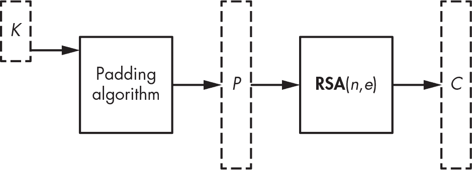
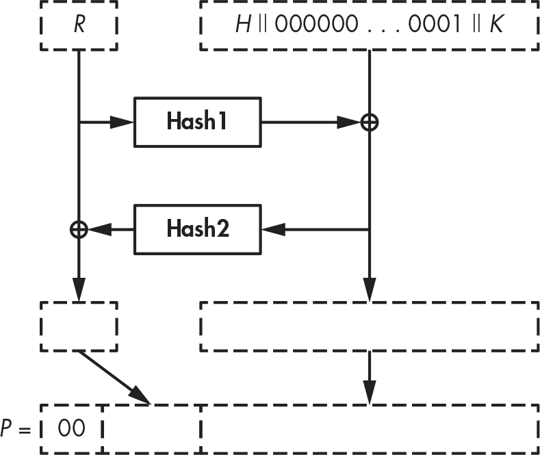
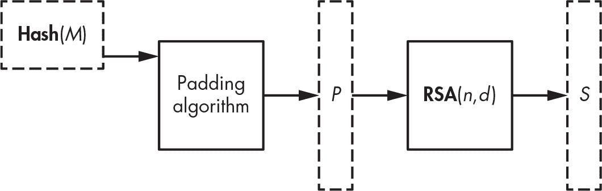
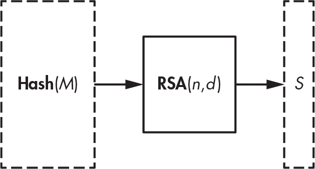
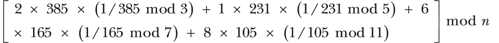

## 10 RSA


1977 年，Rivest–Shamir–Adleman (RSA) 加密系统的出现彻底革新了密码学，它是第一个公钥加密方案。与经典的对称密钥加密方案使用相同的密钥来加密和解密消息不同，*公钥加密*（或*非对称*加密）使用两把密钥：公钥，任何想要为你加密消息的人都可以使用；私钥，用于解密通过公钥加密的消息。这种魔法是 RSA 成为真正突破的原因，40 年后，它依然是公钥加密的典范，并且是互联网安全的核心工具。（在 RSA 出现的前一年，Whitfield Diffie 和 Martin Hellman 提出了公钥密码学的概念，但他们的方案只能在公钥设置中执行密钥分发。）

RSA 通过创建一个*陷门置换*来工作，这个函数将数字*x*转换为范围内的数字*y*，使得使用公钥计算从*x*到*y*变得容易，但除非知道私钥——也就是陷门，否则从*y*到*x*的计算几乎是不可能的。（可以将*x*看作是明文，将*y*看作是密文。）

除了加密，RSA 还可以用来构建数字签名，其中只有私钥的拥有者才能签署消息，而公钥则允许任何人验证签名的有效性。

本章将讲解 RSA 陷门置换是如何工作的，以及为什么仅靠这种置换不足以构建*安全*的加密和签名。我还将讨论 RSA 相对于因式分解问题的安全性（见第九章）、如何安全实现 RSA 以及如何攻击 RSA。

我们从解释 RSA 背后的基本数学概念开始。

### RSA 背后的数学原理

在处理消息时，无论是加密还是签名，RSA 首先会从该消息中创建一个大数字，并通过大数字之间的乘法运算对其进行处理。因此，要理解 RSA 是如何工作的，你需要了解它操作的那些大数字是什么，以及这些数字上的乘法是如何进行的。

要加密或签名，RSA 将一个介于 1 和*n* - 1 之间的正整数进行变换，其中*n*是一个称为*模数*的大数字。当这些数字相乘时，会得到另一个符合这些标准的数字。这些数字组成一个群，你可以将其表示为**Z**n^*，并称之为模*n*的乘法群。（参见第九章第 189 页中“群”的数学定义。）

例如，考虑模 4 的整数群 **Z**[4]^*。回想一下第九章，一个群必须包含单位元素（即 1），并且群中的每个数字 *x* 必须有一个逆元 *y*，使得 *x* × *y* = 1。你如何确定构成 **Z**[4]^* 的集合？根据定义，你知道 0 不属于 **Z**[4]^*，因为任何数字与 0 相乘都不可能得到 1，因此 0 没有逆元。数字 1 属于 **Z**[4]^*，因为 1 × 1 = 1，所以 1 是它自己的逆元。然而，数字 2 不属于该群，因为无法通过将 2 与 **Z**[4]^* 的另一个元素相乘得到 1（注意，2 与 4 不是互质的，因为 4 和 2 有公因子 2）。数字 3 属于 **Z**[4]^*，因为它是 **Z**[4]^* 中的逆元。因此，**Z**[4]^* = {1, 3}。

现在考虑**Z**[5]^*，即模 5 的整数乘法群。如同第九章中所述，**Z**[5]^* = {1, 2, 3, 4}。实际上，由于 5 是质数，1、2、3 和 4 都与 5 互质，因此 **Z**[5]^* 的集合包含了它们。我们来验证一下：2 × 3 mod 5 = 1；因此，2 是 3 的逆元，而 3 是 2 的逆元；注意，4 是它自己的逆元，因为 4 × 4 mod 5 = 1；最后，1 在该群中依然是它自己的逆元。

当 *n* 不是质数时，要找出群 **Z**n^* 中的元素个数，可以使用*欧拉函数*，我们将其写作 φ(*n*)，其中 φ 代表希腊字母 phi。这个函数给出与 *n* 互质的元素个数，即 **Z**n^* 中的元素个数。通常，如果 *n* 是质数的积，即 *n* = *p*[1] × *p*[2] × … × *p*m，那么群 **Z**n^* 中的元素个数如下：


RSA 仅处理 *n* 是两个大质数的积的数字，通常表示为 *n* = *pq*。相关的群 **Z**n^* 包含 φ(*n*) = (*p* – 1)(*q* – 1) 个元素。通过展开这个表达式，你可以得到等价的定义 φ(*n*) = *n* – *p* – *q* + 1，或者 φ(*n*) = (*n* + 1) – (*p* + *q*)，它更直观地表示了 φ(*n*) 相对于 *n* 的值。

### RSA 陷门置换

RSA 陷门置换是基于 RSA 的加密和签名的核心算法。给定模数 *n* 和一个数字 *e*，你可以称之为*公钥指数*，RSA 陷门置换将集合 **Z**n^* 中的一个数字 *x* 转换为数字 *y* = *x**^e* mod *n*。换句话说，它计算的结果是 *x* 自乘 *e –* 1 次后对 *n* 取模，然后返回该结果。当你使用 RSA 陷门置换进行加密时，模数 *n* 和指数 *e* 组成了 RSA 公钥。

为了从 *y* 中恢复出 *x*，你可以使用另一个数字 *d* 来计算以下公式：


因为 *d* 是让你能够解密的陷阱门，它是 RSA 密钥对中私钥的一部分，这意味着它应该始终保密。数字 *d* 也叫做 *秘密指数*。

当然，*d* 并不是任意一个数字；它是这样一个数字，使得 *e* 乘以 *d* 等于 1，因此有 *x**^(ed)* mod *n* = *x*，对任意 *x* 都成立。更精确地说，你必须满足 *ed* mod φ(*n*) = 1，才能得到 *x**^(ed)* = *x*¹ = *x* 并正确解密消息。请注意，这里计算的是模 φ(*n*) 而不是模 *n*，因为指数像是 **Z**n^* 元素的 *索引*，而不是这些元素本身。由于 **Z**n^* 有 φ*(n*) 个元素，索引必须小于 φ*(n*)。

数字 φ(*n*) 对 RSA 的安全性至关重要。实际上，求解 RSA 模数 *n* 的 φ(*n*) 相当于破解 RSA，因为你可以通过计算 *e* 的逆元轻松从 φ(*n*) 和 *e* 推导出秘密指数 *d*。因此，*p* 和 *q* 也应保持机密，因为知道 *p* 或 *q* 可以通过计算 (*p* – 1)(*q* – 1) = φ(*n*) 来得出 φ(*n*)。

> 注意

*φ(*n*) 被称为**Z**[n]*^* 的*阶*；阶是群体的重要特征，对其他公钥系统（如 Diffie–Hellman 和椭圆曲线密码学）至关重要。*

### RSA 密钥生成与安全性

*密钥生成* 是创建 RSA 密钥对的过程，即一个公钥（模数 *n* 和公钥指数 *e*）及其私钥（秘密指数 *d*）。由于数字 *p* 和 *q*（使得 *n* = *pq*）以及顺序 φ(*n*) 也应保持机密，因此它们通常作为私钥的一部分。

为了生成 RSA 密钥对，首先选择两个随机素数 *p* 和 *q*，然后从中计算 φ(*n*)。接着将 *d* 计算为 *e* 的逆元。Listing 10-1 演示了如何使用 SageMath（一个开源的类似 Python 的环境，包含许多数学包）来实现这一过程，SageMath 的网址是 (*[`<wbr>www<wbr>.sagemath<wbr>.org`](https://www.sagemath.org)*）。

```
sage: **p = random_prime(2³²); p**
1103222539
sage: **q = random_prime(2³²); q**
17870599
sage: **n = p*q; n**
19715247602230861
sage: **phi = (p-1)*(q-1); phi**
19715246481137724
sage: **e = random_prime(phi); e**
13771927877214701
sage: **d = xgcd(e, phi)[1]; d = mod(d, phi)**
11417851791646385
sage: **mod(d*e, phi)**
1
```

Listing 10-1：使用 SageMath 生成 RSA 参数

这里你使用 random_prime() 函数来选择小于给定参数的随机素数 p 和 q。接下来，你将 p 和 q 相乘得到模数 n 和 φ(*n*)，其中 φ(*n*) 是 phi 变量。然后，你通过选择一个小于 phi 的随机素数生成随机公钥指数 e，以确保 e 在模 phi 下有逆元。

你使用 Sage 的 xgcd() 函数来生成相关的私钥指数 *d*。这个函数使用扩展欧几里得算法，给定两个数字 *a* 和 *b*，计算出 *s* 和 *t*，使得 *as* + *bt* = **GCD**(*a*, *b*)。最后，你检查 *ed* mod φ(*n*) = 1，以确保 *d* 正确地反转了 RSA 置换。

> 注意

*我在清单 10-1 中使用了一个 64 位模数* n *，以避免产生多页输出，但在实际应用中，为了确保安全，RSA 模数应至少为 2,048 位。*

现在你可以应用陷门置换，正如清单 10-2 所示。

```
sage: **x = 1234567**
sage: **y = power_mod(x, e, n); y**
17129109575774132
sage: **power_mod(y, d, n)**
1234567
```

清单 10-2：计算 RSA 陷门置换的正反运算

你将整数 1,234,567 赋值给*x*，然后使用 power_mod(x, e, n) 函数，即指数模 *n* 运算，或者以方程形式表示的 *x**^e* mod *n*，来计算 *y*。计算出 *y* = *x**^e* mod *n* 后，你使用陷门 *d* 计算 *y**^d* mod *n* 来返回原始的 *x*。

没有陷门 *d*，要找到 *x* 有多难？一个能够分解大数的攻击者，可以通过恢复 *p* 和 *q*，然后计算 φ(*n*) 来从 *e* 计算出 *d*，从而破解 RSA。RSA 还有一个风险，攻击者可以从 *x**^e* mod *n*，即 *e* 次方根模 *n* 计算出 *x*，而不必分解 *n*。虽然这两个风险看起来密切相关，但我们不能确定它们是否等价。

假设因式分解和求 *e* 次方根的难度相当，RSA 的安全性依赖于三个因素：*n* 的大小、*p* 和 *q* 的选择，以及如何使用陷门置换。如果 *n* 太小，就可以在合理的时间内进行因式分解，从而揭示私钥。为了安全起见，*n* 至少应为 2048 位（大约 90 位的安全等级，需要约 2⁹⁰ 次运算），但最好是 4096 位（大约 128 位的安全等级）。*p* 和 *q* 的值应为不相关的随机质数，且大小相似。如果它们太小或太接近，就更容易从 *n* 中确定它们的值。最后，不应直接使用 RSA 陷门置换进行加密或签名，稍后我会讨论这个问题。

### 使用 RSA 加密

通常，RSA 与对称加密方案结合使用，其中 RSA 加密一个对称密钥，该密钥用于使用对称密码（如 AES-GCM）加密消息。但使用 RSA 加密消息或对称密钥比简单地将目标转换为数字 *x* 并计算 *x**^e* mod *n* 要复杂得多。

在以下小节中，我将解释为什么直接应用 RSA 陷门置换是不安全的，以及基于 RSA 的强加密是如何工作的。

#### 教科书版 RSA 加密的易变性

短语 *教科书版 RSA 加密* 描述了简单的 RSA 加密方案，其中指数运算的数字仅包含你想要加密的消息。例如，为了加密字符串 *RSA*，你首先将其转换为一个数字——例如，通过将每个字母的 ASCII 编码连接起来作为字节：*R*（字节 52）、*S*（字节 53）和 *A*（字节 41）。转换成十进制后，结果字节串 525341 等于 5,395,265，接下来你可以通过计算 5,395,265*^e* mod *n* 来加密它。如果没有私钥，理论上是无法解密该消息的。

然而，教科书版 RSA 加密是确定性的：如果你两次加密相同的明文，你将得到相同的密文。而且还有一个更大的问题：给定两个教科书版 RSA 密文 *y*[1] = *x*[1]*^e* mod *n* 和 *y*[2] = *x*[2]*^e* mod *n*，你可以通过将这两个密文相乘，推导出 *x*[1] × *x*[2] 的密文：


结果是 (*x*[1] × *x*[2])*^e* mod *n*，即消息 *x*[1] × *x*[2] mod *n* 的密文。攻击者可以通过从两个 RSA 密文中创建一个新的有效密文，从而危及加密的安全性，使他们能够推断出原始消息的信息。这种弱点使教材 RSA 加密变得*可变*。（如果你知道 *x*[1] 和 *x*[2]，你也可以计算 (*x*[1] × *x*[2])*^e* mod *n*，但如果你只知道 *y*[1] 和 *y*[2]，你不应能将密文相乘并得到相乘的明文的密文。）

另一个简单的教材 RSA 加密问题是“特殊”消息的存在。无论 *n* 和 *e* 是什么，1*^e* = 1。因此，消息 1 在加密过程中保持不变。教材 RSA 还有许多其他问题，但你将通过使用强 RSA 加密方法来避免这些问题。

#### 带 OAEP 的强 RSA 加密

为了使 RSA 密文不可伪造，加密过程中指数化的数字应将消息数据与额外的数据（称为*填充*）结合起来，正如图 10-1 所示。



图 10-1：使用 RSA 加密对称密钥 K，使用 (n, e) 作为公钥

以这种方式使用 RSA 加密的标准方法是使用最优非对称加密填充（OAEP），这种组合通常被称为 RSA-OAEP。该方案涉及创建一个与模数相同大小的比特串，通过在应用 RSA 函数之前用额外的数据和随机性填充消息。

> 注意

*如 PKCS#1 标准和 NIST 的特别出版物 800-56B 所示，OAEP 被称为 RSAES-OAEP。OAEP 改进了早期的方法* *PKCS#1 v1.5，这是 RSA 发布的一系列公钥密码标准（PKCS）中的第一个。它的安全性明显低于 OAEP，但在 OAEP 引入后，仍在许多系统中使用。*

##### 安全性

OAEP 使用伪随机数生成器（PRNG）确保密文的不可区分性和不可伪造性，通过使加密具有概率性。只要 RSA 函数和 PRNG 安全，且哈希函数不太弱，它已被证明是安全的。在使用 RSA 加密时，应该使用 OAEP，而不是其前身标准 PKCS#1 v1.5。

##### 加密

使用 RSA 的 OAEP 模式加密需要一个消息（如对称密钥*K*）、一个伪随机数生成器（PRNG）和两个哈希函数。为了创建密文，使用给定模数*n*长度的*m*字节（即 8*m*位，因此*n*小于 2⁸*^m*）。要加密*K*，将*编码后的消息*构造为

*M* = *H* || 00 . . . 00 || 01 || *K*

其中*H*是由 OAEP 方案定义的*h*字节常量，后跟必要数量的00字节和一个01字节。图 10-2 展示了如何处理这个编码后的消息*M*。



图 10-2：使用 RSA-OAEP 加密对称密钥， K，其中 H 是一个固定参数， R 是随机位

你生成一个*h*字节的随机字符串*R*，并设置*M* = *M* ⊕ **Hash1**(*R*)，其中**Hash1**(*R*)的长度与*M*相同。接下来，设置*R* = *R* ⊕ **Hash2**(*M*)，其中**Hash2**(*M*)的长度与*R*相同。现在，使用这些新的*M*和*R*值来形成一个*m*字节的字符串*P* = 00 || *M* || *R*，其长度与模数*n*相同，且你可以将其转换为一个小于*n*的整数。这次转换得到的数字是*x*，然后你可以使用它来计算 RSA 函数*x**^e* mod *n*以得到密文。

要解密密文*y*，首先计算*x* = *y**^d* mod *n*，然后从中恢复出*M*和*R*的最终值。接下来，通过计算*M* ⊕ **Hash1**(*R* ⊕ **Hash2**(*M*))来恢复*M*的初始值。最后，验证*M*的格式是否为*H* || 00 . . . 00 || 01 || *K*，其中*h*字节的*H*后跟若干00字节，接着是一个01字节。

在实际应用中，参数 *m* 和 *h*（分别是模数的长度和**Hash2**输出的长度）通常设置为 *m* = 256 字节（适用于 2048 位 RSA）和 *h* = 32（使用 SHA-256 作为 **Hash2**）。这意味着 *m* – *h* – 1 = 223 字节用于 *M*，其中最多有 *m* – 2*h* – 2 = 190 字节可以用于 *K*（"-2" 是由于 *M* 中的 01 字节分隔符）。然后，**Hash1** 的哈希值由 *m* – *h* – 1 = 223 字节组成，这比任何常见哈希函数的哈希值要长。为了构建具有如此不同寻常输出长度的哈希，RSA 标准规范定义了一种 *掩码生成函数* 技术，用于创建从任何哈希函数返回任意大小哈希值的哈希函数。另一种方法是使用可扩展输出函数（XOF），例如 SHAKE 或 BLAKE3，尽管这与标准规范不同。

### 使用 RSA 签名

数字签名可以证明与特定数字签名相关的私钥持有者签署了某个消息，通常是为了支持其内容。因为只有私钥持有者知道私有指数 *d*，其他任何人都无法根据某个值 *x* 计算出签名 *y* = *x**^d* mod *n*，但每个人都可以通过公共指数 *e* 验证 *y**^e* mod *n* = *x*。原则上，可以使用该验证的签名作为证据，证明私钥持有者签署了某个特定消息；这就是所谓的 *不可否认性*。

很容易将 RSA 签名视为加密的逆过程，但它们并不相同。使用 RSA 签名并不等于使用私钥加密。加密提供了保密性，而数字签名则有助于防止伪造。这种区别的最明显例子是，签名方案可以泄露签名消息的部分信息，因为消息本身并不保密。例如，揭示部分消息内容的方案可以是一个安全的签名方案，但却不是一个安全的加密方案。

由于必要的处理开销，公钥加密只能处理短消息，通常是秘密密钥而非实际消息。然而，签名方案可以通过使用其哈希值 **Hash**(*M*) 作为代理来处理任意大小的消息，而且它可以是确定性且安全的。与 RSA-OAEP 类似，基于 RSA 的签名方案可以使用填充方案，但也可以使用 RSA 模数允许的最大消息空间。

#### 教科书中的 RSA 签名

一个*教科书式的 RSA 签名*是通过直接计算 *y* = *x**^d* mod *n* 来签名消息 *x* 的方法，其中 *x* 可以是 1 到 *n* – 1 之间的任何数字。像教科书加密一样，教科书 RSA 签名方法简单易于指定和实现，但在面对多种攻击时却不安全。一个这样的攻击涉及到一个简单的伪造：由于 1*^d* mod *n* = 1 和 (*n* – 1)*^d* mod *n* = *n* – 1，不管私钥 *d* 的值如何，攻击者可以伪造 1 或 *n* – 1 的签名，而无需知道 *d*。

更令人担忧的是*盲化攻击*。例如，假设你想让第三方在你知道他们绝不会故意签署的某个消息 *M* 上签名。为了发起这种攻击，首先找出某个值 *R*，使得 *R**^e**M* mod *n* 是一个你受害者愿意签署的消息。接着，你说服他们签署该消息并展示给你他们的签名，该签名等于 *S* = (*R**^e**M*)*^d* mod *n*，即消息的 *d* 次方。得到这个签名后，你可以通过一些简单的计算推导出 *M* 的签名，也就是 *M**^d*。

因为你可以将 *S* 写成 (*R* *^e**M*)*^d* = *R**^(ed)**M**^d*，并且因为 *R**^(ed)* = *R*（根据定义），所以你有 *S* = (*R**^e**M*)*^d* = *RM**^d*。为了得到签名 *M**^d*，你可以按照以下方式将 *S* 除以 *R*：


这通常是一种实用且强大的攻击方式。

#### PSS 签名标准

RSA *概率签名方案（PSS）* 就像 OAEP 对于 RSA 加密一样，是对 RSA 签名的改进。它的设计目的是通过增加填充数据来使消息签名更加安全。

图 10-3 展示了 PSS 是如何将比模数更窄的消息与一些随机和固定的比特组合，然后再通过 RSA 加密这些填充后的结果。



图 10-3：使用 RSA 和 PSS 标准签名消息 M，其中（n， d）是私钥

像所有公钥签名方案一样，PSS 是基于消息的哈希值进行操作，而不是直接在消息本身上签名。签名**Hash**(*M*) 只有在哈希函数是抗碰撞的情况下才是安全的。这样，你就可以签名任何长度的消息，因为在对消息进行哈希后，无论消息的原始长度如何，你都能得到一个相同固定长度的哈希值。

为什么不通过对 **Hash**(*M*) 应用 OAEP 加密来签名呢？不幸的是，你不能这样做。虽然 OAEP 类似于 PSS，但已被证明仅在加密中是安全的，而不是用于签名。

类似于 OAEP，PSS 也需要一个伪随机数生成器（PRNG）和两个哈希函数。一个，**Hash1**，是一个具有标准输出长度的典型哈希，如 SHA-256。另一个，**Hash2**，是一个宽输出哈希，类似于 OAEP 的 **Hash2**。与 OAEP 一样，PSS 可以使用掩码生成函数（MGF）构建这样的哈希。

PSS 签名过程如下（其中 *h* 是 **Hash1** 的输出长度）：

1.  使用 PRNG 选择一个 *r* 字节的随机字符串 *R*。

2.  形成编码消息 *M*′ = 0000000000000000 || **Hash1**(*M*) || *R*，长度为 *h* + *r* + 8 字节（开头有 8 个零字节）。

3.  计算 *h* 字节字符串 *H* = **Hash1**(*M*′)。

4.  设置 *L* = 00\. . .00 || 01 || *R*，或者是一个由 00 字节组成的序列，后跟一个 01 字节和 *R*，并且有足够数量的 00 字节，使得 *L* 的长度为 *m* – *h* – 1 字节（模数 *m* 的字节宽度减去哈希长度 *h* 再减去 1）。

5.  设置 *L* = *L* ⊕ **Hash2**(*H*)，用新值替换之前的 *L*。

6.  将 *m* 字节字符串 *P* = *L* || *H* || BC 转换为小于 *n* 的数字 *x*。这里，字节 BC 是附加在 *H* 后的固定值。

7.  给定刚得到的 *x* 值，计算 RSA 函数 *x**^d* mod *n* 来获得签名。

8.  验证签名时，给定消息 *M*，计算 **Hash1**(*M*)，然后使用公钥指数 *e* 反转 RSA 函数并从签名中恢复 *L*、*H*，然后 *M*′，并在每个步骤中检查填充的正确性。

在实践中，随机字符串 *R*（在 RSA-PSS 标准中称为 *salt t*）通常与哈希值的长度相同。例如，如果你使用 *n* = 2,048 位和 SHA-256 作为哈希函数，则值 *L* 为 *m* – *h* – 1 = 256 – 32 – 1 = 223 字节，随机字符串 *R* 通常为 32 字节。

与 OAEP 一样，PSS 是可证明安全的，已标准化，并且在许多加密软件工具和库中都有实现，包括 OpenSSL 和 Go 语言的加密模块。与 OAEP 一样，它看起来复杂且容易出现实现错误和处理不当的边界情况。与 RSA 加密不同，PSS 在签名方面有一个更简单的替代方案：不需要 PRNG，只有一个哈希函数，并且没有填充。

#### 全域哈希签名

*全域哈希（FDH）* 是你能想象的最简单的签名方案。要实现它，将字节字符串 **Hash**(*M*) 转换为数字 *x*，然后创建签名 *y* = *x**^d* mod *n*，如图 10-4 所示。



图 10-4：使用 RSA 和全域哈希技术对消息进行签名

签名验证也很简单。给定一个签名为数字*y*，计算*x* = *y**^e* mod *n*，然后将结果与**Hash**(*M*)进行比较。这个过程简单、确定且安全。那么，为什么还要去研究 PSS 的复杂性呢？

PSS 是在 1996 年，FDH 之后发布的，它的安全性证明比 FDH 更令人信服。具体来说，它的证明提供了比 FDH 证明略高的安全保障，并且其随机性的使用加强了该证明。

这些更强的理论保证是许多加密学家偏好 PSS 而非 FDH 的主要原因，但今天使用 PSS 的大多数应用程序可以切换到 FDH，而不会有明显的安全损失。然而，在某些情况下，使用 PSS 而非 FDH 是可行的，因为 PSS 的随机性能保护其免受一些对其实现的攻击，例如我们将在“如何出错”一章中讨论的故障攻击，详见第 211 页。

无论如何，RSA 签名（PSS 或 FDH）的使用越来越少。基于椭圆曲线的签名，如 ECDSA 和 EdDSA，已变得更为流行，尤其是因为它们计算签名的速度更快（尽管 RSA 在签名验证时通常更快）。

### RSA 实现

我希望你永远不需要从零实现 RSA。如果有人要求你这样做，尽量跑得快一点，并质疑那个要求你这么做的人是否理智。加密学家和工程师们花了几十年时间，才开发出既快速、足够安全又理想中没有严重漏洞的 RSA 实现，所以重新发明 RSA 并不明智。即使有了所有文档，完成这项艰巨任务也需要几个月的时间。

通常，在软件中使用 RSA 时，你会使用一个库或 API，这些库或 API 提供执行 RSA 操作所需的功能。例如，Go 语言在其crypto包中有以下功能（来自 *[`<wbr>go<wbr>.dev<wbr>/src<wbr>/crypto<wbr>/rsa<wbr>/rsa<wbr>.go`](https://go.dev/src/crypto/rsa/rsa.go)*）：

```
func EncryptOAEP(hash hash.Hash, random io.Reader, pub *PublicKey, msg []byte, label []byte) (out []byte, err error)
```

函数EncryptOAEP()接受一个哈希函数、一个伪随机数生成器（PRNG）、一个公钥、一个消息和一个标签（OAEP 的可选参数），并返回一个密文和错误代码。当你调用EncryptOAEP()时，它会调用encrypt()来计算给定填充数据的 RSA 功能，正如清单 10-3 所示。

```
func encrypt(c *big.Int, pub *PublicKey, m *big.Int) *big.Int {
    e := big.NewInt(int64(pub.E))
    c.Exp(m, e, pub.N)
    return c
}
```

清单 10-3：Go 语言加密库中核心 RSA 加密功能的实现

这里的主要操作是c.Exp(m, e, pub.N)，它将消息m提升到指数e的幂次，模pub.N运算，并将结果赋值给变量c。

如果你选择自己实现 RSA，而不是使用现成的库函数，务必依赖现有的*大数*库，这是一组允许你定义并计算大数（数值位数达到几千位）上进行算术运算的函数和类型。例如，你可以在 C 语言中使用 GNU 多重精度（GMP）算术库，或者在 Go 语言中使用big包。（相信我，你不想自己实现大数算术运算。）

即使你在实现 RSA 时只使用库函数，也要确保理解其内部实现原理，这样你才能评估风险，判断其是否符合应用的安全需求。

#### 快速指数运算算法

*指数运算*是将*x*提升到*e*次方的操作，计算*x**^e* mod *n*时需要使用。当处理大数时，比如 RSA，如果实现不当，这个操作可能非常慢。如何高效地计算指数运算呢？

计算*x**^e* mod *n*的简单方法需要*e* – 1 次乘法，如清单 10-4 中的伪代码算法所示。

```
expModNaive(x, e, n) {
    y = x
    for i = 1 to e – 1 {
        y = y * x mod n
    }
 return y
}
```

清单 10-4：一种朴素的指数运算伪代码算法，将 x 提升到指数 e 模 n

这个算法简单但效率极低。你可以通过对中间值*y*进行平方，而不是相乘，直到达到正确的值，从而以指数级速度获得相同的结果。这种方法族称为*平方-乘法*、*平方指数法*或*二进制指数法*。

假设你想计算 3^(65,537) mod 36,567,232,109,354,321。例如，数字 65,537 是大多数 RSA 实现中的公钥指数。你可以将数字 3 乘以自身 65,536 次，或者你可以通过知道 65,537 可以写成 2¹⁶ + 1，来使用一系列平方操作来解决这个问题。基本上，你首先初始化一个变量*y* = 3，然后进行以下的平方（*y*²）运算：

1.  设置*y* = *y*² mod *n*（现在*y* = 3² mod *n*）。

2.  设置*y* = *y*² mod *n*（现在*y* = (3²)² mod *n* = 3⁴ mod *n*）。

3.  设置*y* = *y*² mod *n*（现在*y* = (3⁴)² = 3⁸ mod *n*）。

4.  设定 *y* = *y*² mod *n*（现在 *y* = (3⁸)² = 3¹⁶ mod *n*）。

5.  设定 *y* = *y*² mod *n*（现在 *y* = (3¹⁶)² = 3³² mod *n*）。

继续进行，直到 *y* = 3^(65,536)，通过进行 16 次平方运算。

为了得到最终结果，你需要返回 3 × *y* mod *n* = 3^(65,537) mod *n* = 26,652,909,283,612,267。换句话说，你只用了 17 次乘法运算来计算结果，而朴素方法需要 65,536 次乘法运算。

更一般地，平方和乘法方法通过逐个扫描指数的比特，计算每个指数比特的平方来加倍指数值，并且对于每个遇到值为 1 的比特，乘以原始数值。在上述例子中，指数 65,537 的二进制表示是 10000000000000001，你为每个新比特进行了平方运算，并且只在第一个和最后一个比特时才乘以原始数值 3。

列表 10-5 展示了如何将 *x**^e* mod *n* 作为一个通用算法来计算，当指数 *e* 包含比特 *e*m – [1]*e*m – [2] . . . *e*[1]*e*[0] 时，其中 *e*[0] 是最低有效位。

```
expMod(x, e, n) {
    y = x
    for i = m – 1 to 0 {
        y = y * y  mod n
        if ei == 1 then
            y = y * x  mod n
    }
    return y
}
```

列表 10-5：伪代码中的快速指数算法，将 x 提升到 e 的幂次 modulo n

expMod() 算法的运行时间是 *O*(*m*)，而朴素算法的运行时间是 *O*(2*^m*)，其中 *m* 是指数的比特长度。这里，*O*() 是在 第九章 中介绍的渐进复杂度符号。

所有严肃的系统都会实现这种最简单的平方和乘法方法的某个变体。一个变体是 *滑动窗口* 方法，它考虑比特块而不是单个比特来执行给定的乘法操作。例如，查看 Go 语言中的函数 expNN()，其源代码可以在 *[`<wbr>go<wbr>.dev<wbr>/src<wbr>/math<wbr>/big<wbr>/nat<wbr>.go`](https://go.dev/src/math/big/nat.go)* 中找到。

这些平方和乘法指数算法有多安全？不幸的是，加速过程的技巧通常会导致对某些攻击的脆弱性增加。

这些算法的弱点源于指数运算高度依赖于指数值的事实。在列表 10-5 中的if操作会根据指数的位是 0 还是 1 而采取不同的分支。如果某个位是 1，那么for循环的一个迭代会比为 0 时慢，攻击者通过监控 RSA 操作的执行时间，可以利用这个时间差恢复私有指数。这就是所谓的*时序攻击*。对硬件的攻击可以通过监控设备的功耗来区分 1 位和 0 位，并观察哪些迭代执行额外的乘法，从而揭示私有指数中哪些位是 1。

根据平台的不同，信息通道可能不是执行时间。例如，您可能通过测量设备的功耗并观察哪些迭代执行额外的乘法来区分指数中的 1 位和 0 位，从而揭示私有指数位为 1 的部分。这是一种*功耗分析攻击*。很少有开源加密库能够有效防御这些类型的攻击。

#### 较小的指数以实现更快的公钥操作

因为 RSA 计算本质上是指数运算，所以其性能取决于涉及数字的大小，特别是指数。较小的指数需要更少的乘法，因此可以使指数运算更快。

原则上，公共指数*e*可以是介于 3 和φ(*n*) - 1 之间的任何值，只要*e*与φ(*n*)互质。但实际上，你会发现只有小的*e*值，而且大多数情况下，*e* = 65,537 是由于加密和签名验证速度的考虑。例如，Microsoft Windows CryptoAPI 仅支持适合 32 位整数的公共指数。*e*越大，计算*x**^e* mod *n*的速度就越慢。

与公共指数的大小不同，私有指数*d*的大小不可避免地接近*n*，使得解密比加密慢得多，签名比验证慢得多。因为*d*是秘密的，它必须是不可预测的，因此不能限制为一个小值。例如，如果*e*固定为 65,537，则相应的*d*通常与模数*n*的数量级相同，如果*n*是 2048 位长，*d*将接近 2^(2,048)。

正如在“快速指数算法”中讨论的那样，在第 206 页，将一个数提升到 65,537 次方需要 17 次乘法，而将一个数提升到某个 2048 位数的次方需要大约 3000 次乘法。

你可以通过使用 OpenSSL 工具包来估算 RSA 的速度。例如，列表 10-6 展示了在配备 M2 芯片组的 MacBook 上进行 512 位、1,024 位、2,048 位和 4,096 位 RSA 操作的结果：

```
Doing 1024 bits private rsa sign ops for 10s: 119019 1024 bits private RSA sign ops in 9.93s
Doing 1024 bits public rsa verify ops for 10s: 2573979 1024 bits public RSA verify ops in 9.93s
Doing 2048 bits private rsa sign ops for 10s: 19184 2048 bits private RSA sign ops in 9.93s
Doing 2048 bits public rsa verify ops for 10s: 769696 2048 bits public RSA verify ops in 9.93s
Doing 4096 bits private rsa sign ops for 10s: 3005 4096 bits private RSA sign ops in 9.92s
Doing 4096 bits public rsa verify ops for 10s: 206367 4096 bits public RSA verify ops in 9.91s

 sign    verify   sign/s verify/s
rsa 1024 bits 0.000083s 0.000004s 11985.8 259212.4
rsa 2048 bits 0.000518s 0.000013s  1931.9  77512.2
rsa 4096 bits 0.003301s 0.000048s   302.9  20824.1
`--snip--`
```

列表 10-6：使用 OpenSSL 工具包（版本 3.2.0）进行 RSA 操作的示例基准测试

为了了解验证相较于签名生成的速度慢多少，可以计算验证时间与签名时间的比率。列表 10-6 中的基准测试显示，对于 1,024 位、2,048 位和 4,096 位模数，我得到的验证与签名速度比大约分别为 21.6、40.1 和 68.7。随着模数大小的增加，这一差距会变大，因为*e*操作所需的乘法次数对于模数大小保持不变（例如，当*e* = 65,537 时为 17 次操作），而私钥操作则需要更多的乘法，因为*d*也相应增大。

如果小指数如此有优势，为什么不使用 65,537 而选择像 3 这样的数呢？实际上，当使用 OAEP、PSS 或 FDH 等安全方案实现 RSA 时，使用 3 作为指数是可以的，甚至更快。然而，加密学家避免这么做，因为当*e* = 3 时，某些不安全的方案可能会导致特定类型的数学攻击。数字 65,537 足够大，可以避免这种*低指数攻击*，而且它只有两个非零位，这在计算*x*^(65,537)时可以减少计算时间。对于数学家来说，65,537 还是一个特殊的数字：它是第四个费马数，或者是形如


因为它等于 2¹⁶ + 1，其中 16 = 2⁴，但这对大多数加密工程师来说只是一个与主题无关的好奇心。 #### 中国剩余定理

加速解密和签名生成（即计算*y**^d* mod *n*）的最常见技巧是*中国剩余定理（CRT）*，它能让 RSA 速度提高约四倍。

CRT 通过计算两个模*p*和模*q*的指数，而不是单一的模*n*指数，从而加速解密。由于*p*和*q*远小于*n*，因此执行两个“小”指数运算比执行一个“大”指数运算要快。

中国剩余定理并不特定于 RSA。它是一个通用的算术结果，简单形式为：如果 *n* = *n*[1]*n*[2]*n*[3] . . . ，其中 *n*is 是两两互质的（即 **GCD**(*n*i, *n*j) = 1 对于任何不同的 *i* 和 *j*），那么就可以从 *x* mod *n*[1]，*x* mod *n*[2]，*x* mod *n*[3]，. . . 的值中计算出 *x* mod *n*。例如，假设你有 *n* = 1,155，这是素因数 3 × 5 × 7 × 11 的乘积，并且你想要确定 *x*，使得 *x* mod 3 = 2，*x* mod 5 = 1，*x* mod 7 = 6，*x* mod 11 = 8。（我随意选择了 2、1、6 和 8。）使用中国剩余定理来找到 *x*，计算 *P*(*n*[1]) + *P*(*n*[2]) + . . .，其中 *P*(*n*i) 定义如下：


请注意，第二项 *n*/*n*i 等于除这个 *n*i 外所有因子的乘积。

要将这个公式应用于本例并恢复 *x* mod 1155，计算 *P*(3)，*P*(5)，*P*(7)，和 *P*(11)；然后将它们加起来，得到如下表达式：



在这里，我刚刚应用了前面定义的*P*(*n*i)。（计算每个数字的数学原理很简单，但我不会在这里详细说明。）然后，你可以将这个表达式简化为[770 + 231 + 1980 + 1680] mod *n* = 41。由于 41 是我为这个示例选择的数字，所以你得到了正确的结果。

将中国剩余定理应用于 RSA 比前面的示例更简单，因为每个 *n* 只有两个因子（即 *p* 和 *q*）。给定一个密文 *y* 需要解密时，代替计算 *y**^d* mod *n*，使用中国剩余定理计算 *x*p = *y**^s* mod *p*，其中 *s* = *d* mod (*p* – 1)，并且 *x*q = *y**^t* mod *q*，其中 *t* = *d* mod (*q* – 1)。将这两个表达式结合起来并计算 *x*，得到如下：


就是这样。这比单次指数运算要快，即使使用了平方乘法技巧，因为涉及大量乘法的运算是在模 *p* 和 *q* 上进行的，而这两个数字的大小是 *n* 的一半，而指数运算的复杂度比线性增长还要快。当你将数字的大小加倍时，你不仅仅是将指数运算的成本加倍，它增长得更快。

> 注意

*在最终操作中，你可以提前计算两个数字* q *× (1/*q *mod* p*) 和* p *× (1/*p *mod* q*)，这意味着你只需要计算两个乘法和一次模 *n* 的加法来找到 *x*。

不幸的是，这些技术存在一个安全警告。

### 出错的方式

比 RSA 方案本身更优雅的是一系列攻击，这些攻击之所以有效，要么是因为实现过程泄露（或者可以被设计为泄露）了关于内部信息，要么是因为 RSA 被不安全地使用。我将在接下来的章节中讨论两种经典的这类攻击示例。

#### Bellcore 攻击与 RSA-CRT

RSA 上的 Bellcore 攻击是 RSA 历史上最重要的攻击之一。它最早于 1996 年被发现，之所以突出，是因为它利用了 RSA 对 *故障注入*（故意使算法一部分发生故障并可能产生错误结果）的脆弱性。例如，攻击者可以通过突然改变电压供应或向芯片的某个特定部位发射激光脉冲，暂时扰乱硬件电路或嵌入式系统。然后，攻击者可以通过观察结果的影响，利用算法内部故障的结果。通过将正确结果与故障结果进行比较，可以提供关于算法内部值的信息，包括秘密值。同样，尝试验证结果是否有效也可能泄露可被利用的信息。

Bellcore 攻击就是这样一种故障攻击。它适用于使用中国剩余定理且是确定性的 RSA 签名方案——这意味着它适用于 FDH，但不适用于 PSS，后者是概率性的。

要理解 Bellcore 攻击，请回顾上一节的内容，在使用中国剩余定理时，通过计算以下内容，你得到的结果等于 *x**^d* mod *n*，其中 *x*p = *y**^s* mod *p*，*x*q = *y**^t* mod *q*：


现在假设攻击者在计算 *x*q 时诱发故障，使得你得到某个不正确的值，该值与实际的 *x*q 不同。我们将这个不正确的值称为 *x*q′，最终得到的结果称为 *x*′。攻击者随后可以将不正确的签名 *x*′ 从正确签名 *x* 中减去，从而因式分解 *n*，结果如下：


因此，*x* – *x*′ 的值是 *p* 的倍数，所以 *p* 是 *x* – *x*′ 的约数。因为 *p* 也是 *n* 的约数，所以 *n* 和 *x* – *x*′ 的最大公约数为 *p*，**GCD**(*x* – *x*′, *n*) = *p*。然后你可以计算 *q* = *n*/*p* 和 *d*，从而完全破解 RSA 签名。

这种攻击的变种在你只知道消息已签名而不知道正确签名的情况下有效。还有一种类似的故障攻击针对模数值，而不是针对中国剩余定理（CRT）值的计算，但我在这里不打算详细讨论。

#### 共享私有指数或模数

现在我将向你展示为什么你的公钥不应与他人的模数 *n* 相同。

不同系统或不同人的私钥应该有不同的私有指数 *d*，即使它们使用不同的模数。或者你也可以尝试自己设置 *d* 值来解密为其他实体加密的消息，直到你找到一个与之共享相同 *d* 的密钥。类似地，不同的密钥对应该有不同的 *n* 模数值，即使它们有不同的 *d*，因为 *p* 和 *q* 通常是私钥的一部分。因此，如果我与别人共享相同的 *n*，从而拥有相同的 *p* 和 *q*，我就可以利用 *p* 和 *q* 从你的公钥 *e* 计算出你的私钥。

假设你知道你自己的私有指数 *d*[1] 和另一个与你共享相同模数 *n* 的人的公有指数 *e*[2]，但不知道其因子 *p* 和 *q*。那么，你如何从你自己的私有指数 *d*[1] 计算出 *p* 和 *q*，进而找到另一个人的私有指数 *d*[2] 呢？这个解决方案有点技术性，但非常优雅。

记住，*d* 和 *e* 满足 *ed* = *k*φ(*n*) + 1，其中 φ(*n*) 是秘密的，可能揭示出 *p* 和 *q*。你不知道 *k* 或 φ(*n*)，但你可以计算出 *k*φ(*n*) = *ed* – 1。

你可以用 *k*φ(*n*) 做什么呢？根据 *欧拉定理*，对于与 *n* 互质的任何数字 *a*，都有 *a*^(φ()*^n*^) = 1 mod *n*。因此，模 *n* 下，你可以得到以下结果：


因为 *k*φ(*n*) 是一个偶数，你可以将其写成 2*^s**t* 的形式，其中 *s* 和 *t* 是某些数字。也就是说，你可以将 *a**^k*^(φ()*^n*^) = 1 mod *n* 表示为 *x*² = 1 mod *n*，其中 *x* 是从 *k*φ(*n*) 计算出来的。你可以称这种 *x* 为 *单位根*。

关键的观察是，*x*² = 1 mod *n* 等价于 *x*² – 1 = (*x* – 1)(*x* + 1) 整除 *n*。换句话说，*x* – 1 或 *x* + 1 必须与 *n* 有共同因子，这样就能得到 *n* 的因式分解。

清单 10-7 展示了该方法的 Python 实现，在此实现中，为了简化，我使用了小的 64 位数字来从 *n* 和 *d* 中找出因子 *p* 和 *q*。

```
from math import gcd

n = 36567232109354321
e = 13771927877214701
d = 15417970063428857

❶ kphi = d*e - 1
t = kphi

❷ while t % 2 == 0:
    t = divmod(t, 2)[0]

❸ a = 2
while a < 100:
  ❹ k = t
    while k < kphi:
        x = pow(a, k, n)
      ❺ if x != 1 and x != (n - 1) and pow(x, 2, n) == 1:
          ❻ p = gcd(x - 1, n)
            break
        k = k*2
    a = a + 2

q = n//p
❼ assert (p*q) == n
print('p = ', p)
print('q = ', q)
```

清单 10-7：一个计算质因数的 Python 程序 p 和 q 从私有指数 d

该程序通过找到数字 *t* 使得 *k*φ(*n*) = 2*^s**t*，来从 *e* 和 *d* ❶ 确定 *k*φ(*n*)，其中 *s* ❷ 是某个数。然后，它寻找 *a* 和 *k* 使得 (*a**^k*)² = 1 mod *n* ❸，以 *t* 作为 *k* 的起点 ❹。当这个条件得到满足 ❺，你就找到了一个解。接下来，它确定因子 *p* ❻ 并验证 ❼ *pq* 的值是否等于 *n* 的值。最后，它打印出结果值 *p* 和 *q*：

```
p = 2046223079
q = 17870599
```

该程序正确地返回了两个因子。

### 进一步阅读

RSA 值得专门写一本书。我不得不省略了许多重要且有趣的主题，比如丹尼尔·布莱辛巴赫（Daniel Bleichenbacher）对 OAEP 前身（标准 PKCS#1 v1.5）进行的填充 oracle 攻击，或者曼格（Manger）对 OAEP 的填充 oracle 攻击，这两种攻击在精神上与第四章中描述的块加密的填充 oracle 攻击类似。还有迈克尔·维纳（Michael Wiener）针对具有低私钥指数的 RSA 攻击，以及使用科珀史密斯（Coppersmith）方法攻击具有小指数的 RSA，并且这些攻击可能也存在不安全的填充。

要查看与侧信道攻击及其防御相关的研究成果，请访问自 1999 年以来举行的 CHES 研讨会论文集，网址为*[`<wbr>ches<wbr>.iacr<wbr>.org`](https://ches.iacr.org)*。在撰写本章时，最有用的参考之一是丹·博内（Dan Boneh）的《RSA 密码系统二十年攻击回顾》（Twenty Years of Attacks on the RSA Cryptosystem），这篇综述回顾并解释了针对 RSA 的最重要攻击。关于时间攻击的参考文献，必读的是比利·鲍勃·布鲁姆利（Billy Bob Brumley）和丹·博内的论文《远程时间攻击是可行的》（Remote Timing Attacks Are Practical），它不仅在分析上做出了贡献，而且在实验上也非常重要。要深入了解故障攻击，请阅读丹·博内、理查德·德米洛（Richard DeMillo）和理查德·利普顿（Richard Lipton）合著的《消除密码计算中的错误的重要性》（On the Importance of Eliminating Errors in Cryptographic Computations）的 Bellcore 攻击论文完整版。

学习 RSA 实现工作原理的最佳方法，虽然有时痛苦且令人沮丧，就是审查广泛使用的实现的源代码。例如，查看 OpenSSL、NSS（Mozilla Firefox 浏览器使用的库）、Crypto++或其他流行软件中 RSA 及其底层大数算术的实现，研究它们的算术运算实现以及它们对时间攻击和故障攻击的防御。
