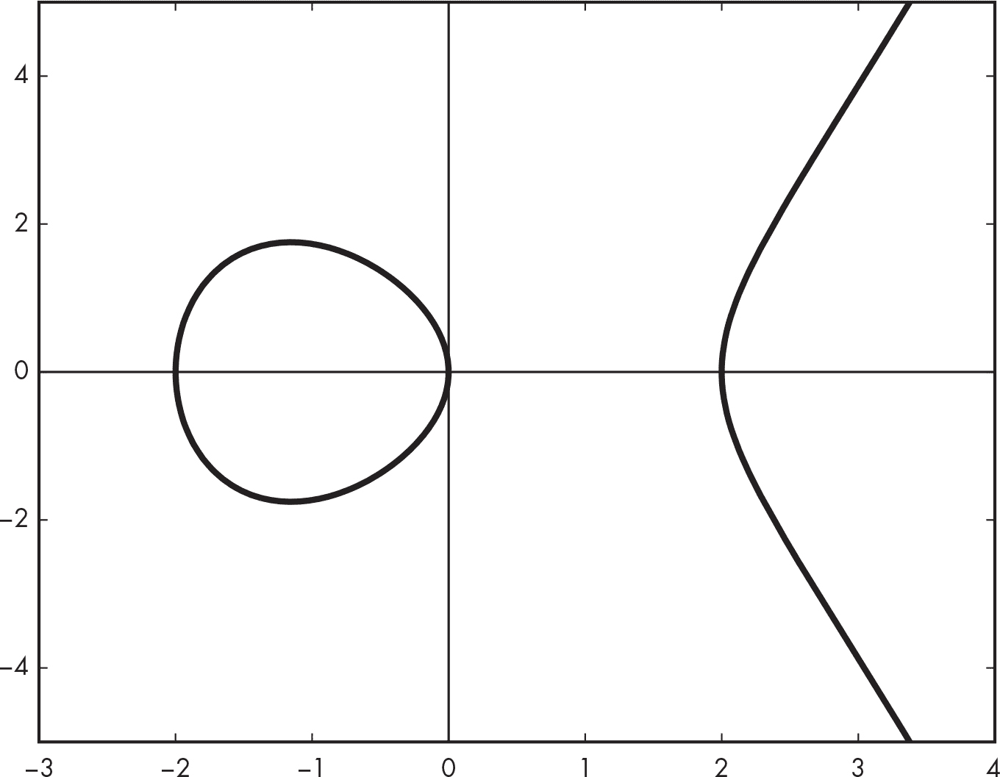
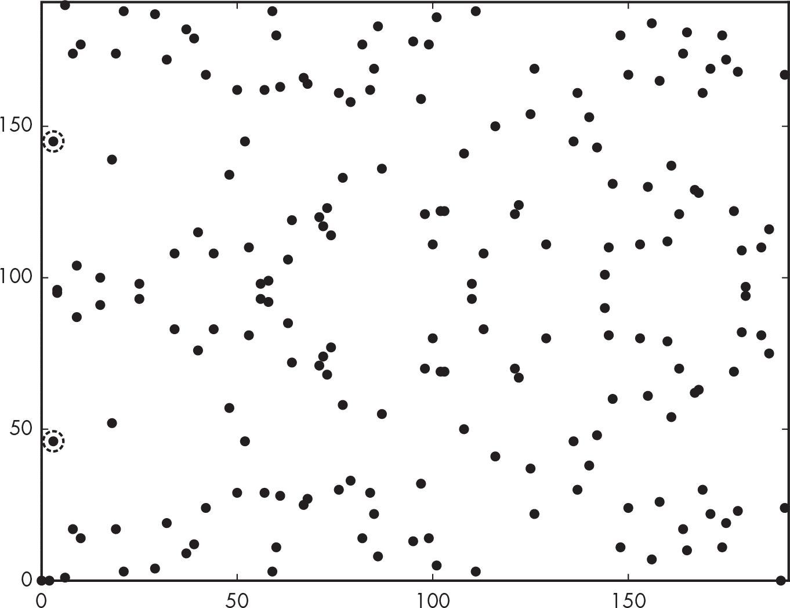
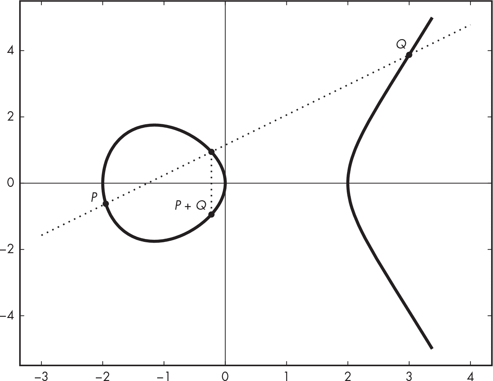
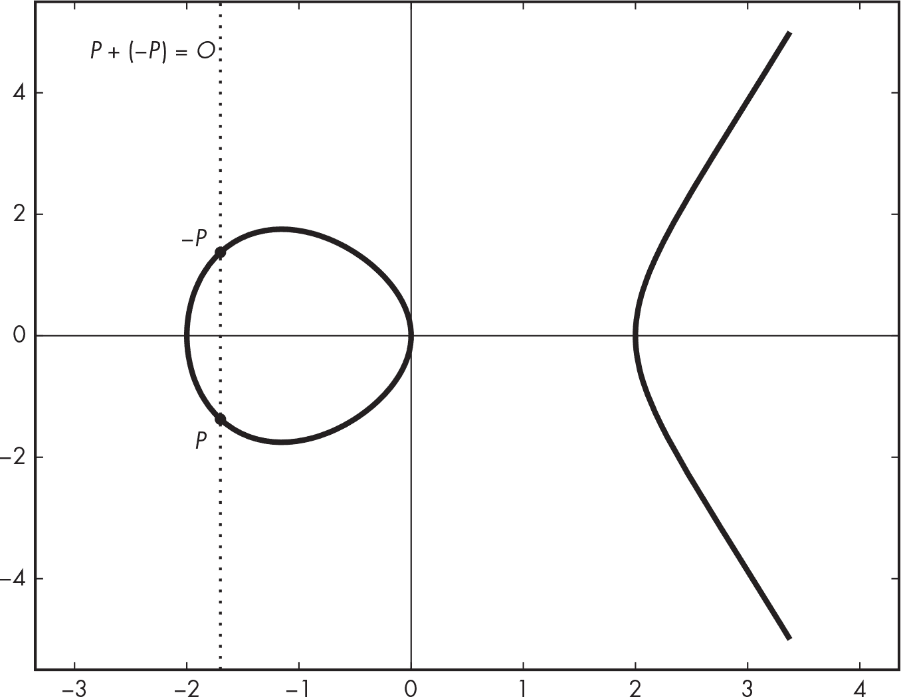
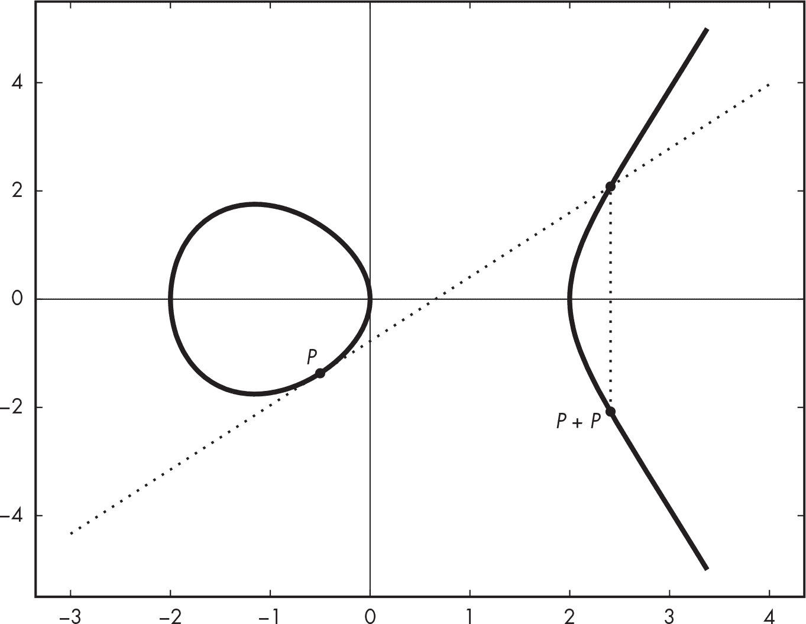
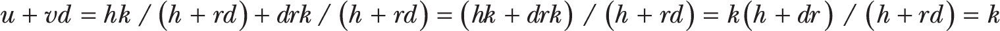

<hgroup>

## <samp class="SANS_Futura_Std_Bold_Condensed_B_11">12</samp> <samp class="SANS_Dogma_OT_Bold_B_11">椭圆曲线</samp>

</hgroup>


1985 年引入的*椭圆曲线密码学（ECC）*彻底改变了公钥密码学。它比 RSA 和经典的 Diffie–Hellman 等替代方案更强大、更高效：256 位密钥的 ECC 比 4096 位密钥的 RSA 更强大。但它也更复杂。

像 RSA 一样，ECC 主要由大数的乘法运算组成，但它通过在数学曲线上组合点来进行这些运算，这条曲线被称为*椭圆曲线*（顺便说一下，这与椭圆没有任何关系）。更复杂的是，椭圆曲线有许多类型——简单和复杂、高效和低效、安全和不安全，这取决于使用场景。

ECC 直到 2000 年代初才被标准化机构采纳，直到更晚的时间才在主流密码软件中出现：OpenSSL 在 2005 年增加了对 ECC 的支持，OpenSSH 安全连接工具则等到了 2011 年。如今，你会在大多数 HTTPS 连接中找到 ECC，在手机中，以及像比特币和以太坊这样的区块链平台中。实际上，椭圆曲线使得常见的公钥密码学操作，如加密、签名和密钥协商，比其经典版本更加高效。大多数依赖离散对数问题（DLP）的密码学应用，当基于其椭圆曲线对应物 ECDLP 时，也能正常工作，其中有一个显著的例外：安全远程密码协议（SRP）。

本章重点介绍了椭圆曲线密码学（ECC）的应用，并讨论了在何时以及为什么要使用 ECC 而不是 RSA 或经典的 Diffie–Hellman 算法，以及如何选择适合您应用的椭圆曲线。

### <samp class="SANS_Futura_Std_Bold_B_11">什么是椭圆曲线？</samp>

椭圆曲线是平面上的一条*曲线*——由具有 x 和 y 坐标的点组成。曲线的方程定义了所有属于该曲线的点。例如，曲线*y* = 3 是一条纵坐标为 3 的水平直线，形式为*y* = *ax* + *b*且固定常数*a*和*b*的曲线是直线，*x*² + *y*² = 1 是一个半径为 1、以原点为中心的圆等等。不管是哪种类型的曲线，曲线上的点都是满足该曲线方程的(*x*, *y*)坐标对。

在密码学中，椭圆曲线通常有一种形式的方程 *y*² = *x*³ + *ax* + *b*（*Weierstrass 形式*），其中常数*a*和*b*定义了曲线的形状。例如，图 12-1 显示了满足方程*y*² = *x*³ - 4*x*的椭圆曲线。



<samp class="SANS_Futura_Std_Book_Oblique_I_11">图 12-1：一个椭圆曲线，其方程为</samp> <samp class="SANS_Futura_Std_Book_11">y</samp><samp class="SANS_Futura_Std_Book_Oblique_I-SUP_11">2</samp> <samp class="SANS_Futura_Std_Book_Oblique_I_11">=</samp> <samp class="SANS_Futura_Std_Book_11">x</samp><samp class="SANS_Futura_Std_Book_Oblique_I-SUP_11">3</samp> <samp class="SANS_Futura_Std_Book_Oblique_I_11">– 4</samp><samp class="SANS_Futura_Std_Book_11">x</samp><samp class="SANS_Futura_Std_Book_Oblique_I_11">, 显示在实数范围内</samp>

该图展示了所有使得 *x* 在 –3 和 4 之间的点，无论是位于曲线左侧（看起来像圆形的部分）还是右侧（看起来像抛物线的部分）。所有这些点的 (*x*, *y*) 坐标都满足曲线方程 *y*² = *x*³ – 4*x*。例如，当 *x* = 0 时，*y*² = *x*³ – 4*x* = 0³ – 4 × 0 = 0；因此，*y* = 0 是一个解，点 (0, 0) 属于该曲线。同样，如果 *x* = 2，方程的解是 *y* = 0，意味着点 (2, 0) 属于该曲线。

> <samp class="SANS_Dogma_OT_Bold_B_15">注意</samp>

*在这一章中，我将重点讨论最简单、最常见类型的椭圆曲线——其方程形式为* y*²* =* x*³* +* ax *+* b*——但其他椭圆曲线有不同形式的方程。例如，*Edwards 曲线*的方程形式为* x*²* +* y*²* = 1 +* dx*²*y*²**。密码学家有时使用 Edwards 曲线（例如，在 Ed25519 方案中）。*

在使用椭圆曲线进行密码学时，区分属于曲线的点和其他点至关重要，因为曲线外的点通常会带来安全风险。然而，曲线的方程并不总是有解，至少在自然数平面中没有解。例如，要求解横坐标 *x* = 1 的点，你需要解 *y*² = *x*³ – 4*x*，得到 *y*² = *x*³ – 4*x* = 1³ – 4 × 1，结果为 –3。但 *y*² = –3 没有解，因为没有任何数字使得 *y*² = –3。在复数范围内存在解（√3*i*），但在实际应用中，椭圆曲线密码学只使用自然数（ECC 使用的是模素数下的整数，通常是直接运算或通过多项式）。因为 *x* = 1 时曲线的方程没有解，曲线在该位置上没有点，如图 12-1 所示。

如果你尝试求解 *x* = –1，你会得到方程 *y*² = –1 + 4 = 3，它有两个解（*y* = √3 ≈ 1.73 和 *y* = –√3 ≈ –1.73），即 3 的平方根及其负值。这两个值的平方都是 3，且图 12-1 中有两个点，*x* = –1。更一般地，曲线对于所有满足其方程的点，相对于 x 轴是对称的（所有形如*y*² = *x*³ + *ax* + *b*的椭圆曲线也是如此，*y* = 0 除外）。

#### <samp class="SANS_Futura_Std_Bold_Condensed_Oblique_BI_11">整数上的椭圆曲线</samp>

这里有一点不同：椭圆曲线加密中的曲线实际上并不像图 12-1 那样。它们既不是曲线，也不是椭圆。它们更像是图 12-2，这是一组点的云，而不是一条曲线。这里到底发生了什么？



<samp class="SANS_Futura_Std_Book_Oblique_I_11">图 12-2：方程</samp> <samp class="SANS_Futura_Std_Book_11">y</samp><samp class="SANS_Futura_Std_Book_Oblique_I-SUP_11">2</samp> <samp class="SANS_Futura_Std_Book_Oblique_I_11">=</samp> <samp class="SANS_Futura_Std_Book_11">x</samp><samp class="SANS_Futura_Std_Book_Oblique_I-SUP_11">3</samp> <samp class="SANS_Futura_Std_Book_Oblique_I_11">– 4</samp><samp class="SANS_Futura_Std_Book_11">x</samp> <samp class="SANS_Futura_Std_Book_Oblique_I_11">在</samp> <samp class="SANS_Futura_Std_Book_11">Z</samp><samp class="SANS_Futura_Std_Book_Oblique_I-SUB_11">191</samp><samp class="SANS_Futura_Std_Book_Oblique_I_11">上，模 191 的整数集合</samp>

图 12-1 和图 12-2 基于相同的曲线方程，*y*² = *x*³ – 4*x*，但它们分别展示了与不同数字集合相关的曲线点：图 12-1 展示的是*实数*集合上的曲线点，其中包含负数、小数等。例如，作为一条连续曲线，它显示了在*x* = 2.0、*x* = 2.1、*x* = 2.00002 等位置的点。而图 12-2 则只展示满足此方程的*整数*，排除了小数。具体来说，图 12-2 展示了曲线*y*² = *x*³ – 4*x*在*模 191*的整数集合下的情况：0, 1, 2, 3，一直到 190。你可以用**Z**[191]表示这个数字集合。（这里没有特别的意义，除了 191 是一个素数。我选择了一个小的数字，以避免图表上的点太多。）因此，图 12-2 中的点的 x 和 y 坐标都是模 191 的整数，并且满足方程*y*² = *x*³ – 4*x*。例如，当*x* = 2 时，*y*² = 0，*y* = 0 是一个有效的解。这意味着点(2, 0)属于该曲线。

如果*x* = 3，你得到方程*y*² = 27 – 12 = 15，它在**Z**[191]中有两个解，46 和 145。实际上，46² = 2,116，2,116 mod 191 = 15，145² = 21,025，21,025 mod 191 = 15。因此，点(3, 46)和(3, 145)都属于该曲线，并在图 12-2 中出现（左侧被圈起来的两个点）。

> <samp class="SANS_Dogma_OT_Bold_B_15">注意</samp>
> 
> *图 12-2 考虑了从集合 ***Z***191 *= {0, 1, 2, . . . , 190} 中选取的点，这个集合包括零。这与我们在讨论 RSA 和 Diffie-Hellman 时提到的表示为 ***Z***[p]^*（带星号上标）的群不同。之所以有所不同，是因为你将同时进行数的乘法和加法，因此需要确保数的集合包括加法的恒等元素（即 0，使得* x *+ 0 = *x* 对于每个 *x* ∈ ***Z***191）。*
> 
> *另外，每个数字* x *在加法下都有一个逆元素，记作 –*x*，使得* x *+ (–*x*) = 0。例如，100 在 ***Z***191 中的逆元素是 91，因为 100 + 91 mod 191 = 0。这样的数集，其中加法和乘法都是可能的，并且每个元素 *x* 都有加法逆元素（记作 –*x*），并且除了零元素外，每个元素都有乘法逆元素（记作 1 /* x*），叫做一个*域*。当一个域包含有限个元素时，就像 ***Z***191 和所有用于椭圆曲线加密的域一样，它是一个*有限域*。

#### <samp class="SANS_Futura_Std_Bold_Condensed_Oblique_BI_11">加法法则</samp>

现在你知道椭圆曲线上的点是满足曲线方程 *y*² = *x*³ + *ax* + *b* 的坐标对 (*x*, *y*)，我们来看一下如何使用 *加法法则* 来加椭圆曲线上的点。

##### <samp class="SANS_Futura_Std_Bold_Condensed_B_11">加法运算两个点</samp>

假设你想在椭圆曲线上加两个点，*P* 和 *Q*，得到一个新点 *R*，它是这两个点的和。理解点加法的最简单方法是通过几何规则确定 *R* = *P* + *Q* 在曲线上相对于 *P* 和 *Q* 的位置：画出连接 *P* 和 *Q* 的直线，找到与该直线相交的曲线上的另一个点，*R* 是该点相对于 x 轴的对称点。例如，在 图 12-3 中，连接 *P* 和 *Q* 的直线与曲线相交于 *P* 和 *Q* 之间的第三个点，点 *P* + *Q* 具有相同的 x 坐标，但 y 坐标是其逆值。



<samp class="SANS_Futura_Std_Book_Oblique_I_11">图 12-3：椭圆曲线点加法几何规则的一般情况</samp>

这个几何规则很简单，但它并不会直接给出点 *R* 的坐标。你可以使用公式 *x*R = m² – *x*P – *x*Q 和 *y*R = m(*x*P – *x*R) – *y*P 计算点 *R* 的坐标 (*x*R, *y*R)，其中 m = (*y*Q – *y*P) / (*x*Q – *x*P) 是连接 *P* 和 *Q* 的直线的斜率。

不幸的是，这些公式和图 12-3 中的画线技巧并不总是有效。例如，如果 *P* = *Q*，你就无法在两个点之间画线（因为只有一条），如果 *Q* = –*P*，则直线不会再次与曲线相交，因此没有曲线上的点可供对称。我们将在接下来的章节中探讨这些情况。

##### <samp class="SANS_Futura_Std_Bold_Condensed_B_11">加点及其负点</samp>

点 *P* = (*x*P, *y*P) 的负点是点 –*P* = (*x*P, –*y*P)，这是围绕 x 轴对称的点。对于任何 *P*，你可以说 *P* + (–*P*) = *O*，其中 *O* 是 *无穷远点*。如图 12-4 所示，*P* 和 –*P* 之间的直线延伸到无穷远，并且永远不与曲线相交。无穷远点对椭圆曲线来说，类似于零对整数的意义，只不过它是一个“虚拟”点，你无法在特定位置定位它，因为它位于无穷远处。



<samp class="SANS_Futura_Std_Book_Oblique_I_11">图 12-4：加法规则——点及其负点的相加，或</samp> <samp class="SANS_Futura_Std_Book_11">P</samp> <samp class="SANS_Futura_Std_Book_Oblique_I_11">+ (–</samp><samp class="SANS_Futura_Std_Book_11">P</samp><samp class="SANS_Futura_Std_Book_Oblique_I_11">) =</samp> <samp class="SANS_Futura_Std_Book_11">O,</samp> <samp class="SANS_Futura_Std_Book_Oblique_I_11">当两点之间的直线永远不与曲线相交时</samp>

##### <samp class="SANS_Futura_Std_Bold_Condensed_B_11">点的加倍</samp>

当 *P* = *Q*（即 *P* 和 *Q* 在同一位置）时，*P* 和 *Q* 的加法等同于计算 *P* + *P*，即 2*P*。这种加法操作称为 *加倍*。

要找到结果 *R* = 2*P* 的坐标，你不能使用上一节中的几何规则，因为你不能在 *P* 和 *P* 之间画一条直线。相反，你需要画出在 *P* 处与曲线相切的直线，然后 2*P* 是这条直线与曲线交点的对称点，如图 12-5 所示。



<samp class="SANS_Futura_Std_Book_Oblique_I_11">图 12-5：加倍点的几何规则——也就是说，</samp> <samp class="SANS_Futura_Std_Book_11">P</samp> <samp class="SANS_Futura_Std_Book_Oblique_I_11">+</samp> <samp class="SANS_Futura_Std_Book_11">P</samp>

用于确定 *R* = *P* + *P* 坐标（*x*R, *y*R）的公式与用于计算两个不同点 *P* 和 *Q* 的公式略有不同。基本公式为 *x*R = *m*² – *x*P – *x*Q 和 *y*R = *m*(*x*P – *x*R) – *y*P，其中 *m* 的值为 (3*x*P² + *a*) / 2*y*P，*a* 是曲线的参数，如 *y*² = *x*³ + *ax* + *b* 中所示。

##### <samp class="SANS_Futura_Std_Bold_Condensed_B_11">点的乘法</samp>

要通过给定的整数 *k* 来乘以椭圆曲线上的点，你可以通过将 *P* 加到自身 *k* – 1 次来确定点 *kP*。换句话说，2*P* = *P* + *P*，3*P* = *P* + *P* + *P*，依此类推。要获得 *kP* 的 x 和 y 坐标，重复将 *P* 加到自身并应用前述的加法法则。

然而，要高效地计算 *kP*，通过应用加法法则将 *P* 加到自身 *k* – 1 次的朴素方法远非最优。例如，如果 *k* 很大（例如，2²⁵⁶ 级别），像在基于椭圆曲线的加密方案中出现的那样，那么计算 *k* – 1 次加法几乎是不可行的。

通过采用第十章《快速指数算法》中的技巧来计算 *x**^e* mod *n*，你可以获得指数级的加速。不同之处在于，你是通过整数乘法而非计算指数来进行运算。但你可以将这个方法改为*加倍并相加*，在这种情况下，乘法变成加法，平方变成加倍。

例如，使用朴素方法计算 8*P* 需要七次加法，而使用三次加法可以计算 8*P*，首先计算 *P*[2] = *P* + *P*，然后 *P*[4] = *P*[2] + *P*[2]，最后 *P*[4] + *P*[4] = 8*P*。这是最简单的情况，当乘数是 2 的幂次方时，例如 8 = 2³。否则，例如，要计算 10*P*，步骤如下：观察到 10 的二进制表示是 1010，从最重要的（“最左”）位开始，按如下方式计算结果 *R*：

**位 1** 首先设置 *R* = *P*。

**位 0** 加倍，设置 *R* = 2*R* = 2*P*。

**位 1** 加倍并相加，设置 *R* = 2*R* + *P* = 2(2*P*) + *P* = 5*P*。

**位 0** 加倍，设置 *R* = 2*R* = 2(5*P*) = 10*P*。

#### <samp class="SANS_Futura_Std_Bold_Condensed_Oblique_BI_11">椭圆曲线群</samp>

你不仅可以将椭圆曲线上的点相加，还可以使用它们来形成一个群结构。根据群的定义（参见第九章中的“群”），如果点 *P* 和 *Q* 属于给定的曲线，那么 *P* + *Q* 也属于该曲线。

此外，由于加法是*结合律*的，你有 (*P* + *Q*) + *R* = *P* + (*Q* + *R*) 对于任何点 *P*, *Q*, 和 *R*。在椭圆曲线点的群体中，我们称单位元为无限远点，并用 *O* 来表示，使得 *P* + *O* = *P* 对于任何 *P*。每个点 *P* = (*x*P, *y*P) 都有一个逆元素，–*P* = (*x*P , –*y*P)，使得 *P* + (–*P*) = *O*。

在实践中，大多数基于椭圆曲线的加密系统使用的是 *x* 和 *y* 坐标，这些数字是模一个素数 *p* 的数（换句话说，这些数字属于有限域 **Z**p）。正如 RSA 的安全性依赖于所使用的数字大小一样，基于椭圆曲线的加密系统的安全性也依赖于曲线上的点的数量。那么，你如何知道椭圆曲线上的点的数量，或者它的*基数*呢？其实，这取决于曲线和 *p* 的值。

> <samp class="SANS_Dogma_OT_Bold_B_15">注意</samp>

*素域并不是椭圆曲线密码学中唯一使用的域。还有* 二进制域*，它是由两个元素域（包括 0 和 1）的扩展，其元素表示为具有二进制系数的多项式。与一般目的的微处理器相比，二进制域上的算术运算通常更容易在硬件逻辑电路中高效实现。*

曲线 **Z**p 上大约有 *p* 个点，但你可以使用 Schoof 算法精确计算点的数量，该算法用于计算有限域上的椭圆曲线的点数。你会发现这个算法已经内置在 SageMath 中。例如，清单 12-1 使用 Schoof 算法计算 **Z**[191] 上曲线 *y*² = *x*³ – 4*x* 的点数，参见图 12-1。

```
sage: **Z = Zmod(191)**
sage: **E = EllipticCurve(Z, (-4,0))**
sage: **E.cardinality()**
192
```

<samp class="SANS_Futura_Std_Book_Oblique_I_11">清单 12-1：计算曲线的基数或点数</samp>

在清单 12-1 中，首先定义变量 <samp class="SANS_TheSansMonoCd_W5Regular_11">Z</samp> 为模 191 的整数集合；然后定义变量 <samp class="SANS_TheSansMonoCd_W5Regular_11">E</samp> 为系数为 -4 和 0 的椭圆曲线 <samp class="SANS_TheSansMonoCd_W5Regular_11">Z</samp> 上的曲线。最后，你计算曲线的点数，即它的 *基数*、*群阶* 或简称 *阶*。此计数包括无穷远点 *O*。

### <samp class="SANS_Futura_Std_Bold_B_11">ECDLP 问题</samp>

第九章介绍了离散对数问题（DLP）：给定一个基数 *g*，找出一个数 *y*，使得 *x* = *g* *^y* mod *p*，其中 *p* 是某个大素数。椭圆曲线密码学有类似的问题，给定基点 *P*，找出数 *k*，使得点 *Q* = *kP*。这就是椭圆曲线离散对数问题。与数字不同，椭圆曲线的问题作用于点，并使用乘法代替指数运算。

几乎所有的椭圆曲线密码学都基于 ECDLP 问题，像 DLP 一样，ECDLP 被认为是困难的，并且自 1985 年引入以来经受了密码分析。与经典 DLP 的一个重要区别是，ECDLP 允许你使用更小的数字，同时仍然享有类似的安全级别。

通常，当参数 *p* 是 *n* 位时，ECC 可以提供约 *n*/2 位的安全性。例如，使用一个模 256 位 *p* 的椭圆曲线可以提供约 128 位的安全性。为了比较，使用 DLP 或 RSA 达到类似的安全性水平，需要使用几千位的数字。使用更小的数字进行 ECC 运算是它通常比 RSA 或经典的 Diffie–Hellman 更快的原因之一。

解决 ECDLP 的一种方法是找到两个输出之间的碰撞，*c*[1]*P* + *d*[1]*Q* 和 *c*[2]*P* + *d*[2]*Q*。这些方程中的点 *P* 和 *Q* 是这样的：*Q* = *kP*，其中 *k* 是一个未知数，而 *c*[1]、*d*[1]、*c*[2] 和 *d*[2]* 是你需要找到 *k* 的数字。

正如在 第六章 中的哈希函数一样，碰撞发生在两个不同的输入产生相同输出时。因此，要解决 ECDLP，你需要找到以下条件成立的点：


假设你已经找到了四个系数，接下来你要恢复 *k*。为此，将 *Q* 替换为 *kP* 的值，你会得到以下结果：


这告诉你，当对曲线上的点数取模时，(*c*[1] + *d*[1]*k*) 等于 (*c*[2] + *d*[2]*k*)，这并不神秘。

从中，你可以推导出以下内容：


然后，你找到了 *k*，也就是 ECDLP 的解。当然，这只是大致的框架——细节更复杂且更有趣，特别是在如何恢复系数 *c*[1]、*c*[2]、*d*[1]、*d*[2] 的方式上。

在实际应用中，椭圆曲线的范围至少为 256 位数字，这使得通过寻找碰撞来攻击椭圆曲线加密变得不切实际，因为这样做需要最多 2¹²⁸ 次操作（这就是在 256 位数字上找到碰撞的成本——详见 第六章）。

### <samp class="SANS_Futura_Std_B_11">椭圆曲线上的 Diffie–Hellman 密钥协商</samp>

回想一下 第十一章 中提到的经典 Diffie–Hellman（DH）密钥协商协议，两个参与方通过交换非秘密值来建立共享密钥。给定某个固定数 *g*，爱丽丝选择一个秘密随机数 *a*，计算 *A* = *g**^a*，并将 *A* 发送给鲍勃。然后鲍勃选择一个秘密随机数 *b*，并将 *B* = *g**^b* 发送给爱丽丝。然后，两人将各自的秘密密钥与对方的公钥结合，计算出相同的 *A**^b* = *B**^a* = *g**^(ab)*。

椭圆曲线版的 DH，*椭圆曲线 Diffie–Hellman（ECDH）*，与经典 DH 相同，只是符号不同。在 ECC 的情况下，给定某个固定点 *G*，爱丽丝选择一个秘密随机数 *a*，计算 *A* = *aG*（点 *G* 乘以整数 *a*），并将 *A* 发送给鲍勃。鲍勃选择一个秘密随机数 *b*，计算点 *B* = *bG*，并将其发送给爱丽丝。然后，两人都计算相同的共享密钥，*aB* = *bA* = *abG*。

ECDH 与 ECDLP 问题的关系，就像 DH 与 DLP 的关系一样：只要 ECDLP 问题足够困难，它就安全。因此，你可以将依赖于 DLP 的 DH 协议调整为使用椭圆曲线，并依赖 ECDLP 作为难度假设。例如，认证 DH 和 Menezes–Qu–Vanstone (MQV)协议，在与椭圆曲线一起使用时也会是安全的。事实上，MQV 最初就是定义为在椭圆曲线上工作的。

### <samp class="SANS_Futura_Std_B_11">椭圆曲线签名</samp>

用于椭圆曲线签名（ECC）签名的主要标准算法是*椭圆曲线数字签名算法（ECDSA）*。该算法已在许多应用中取代了 RSA 签名和经典的 DSA 签名。ECDSA 是 NIST 的标准，支持在 TLS 和 SSH 协议中，并且是许多区块链平台（包括比特币和以太坊）中的主要签名算法。

与所有签名方案一样，ECDSA 包括一个*签名生成*算法，签名者使用它来创建一个使用私钥生成的签名，以及一个*验证*算法，验证者使用它根据签名者的公钥检查签名的正确性。签名者持有一个数字，*d*，作为私钥，而验证者持有公钥，*P* = *dG*。两者都事先知道使用的椭圆曲线、其阶数（*n*，曲线中的点数）以及基点*G*的坐标。

#### <samp class="SANS_Futura_Std_Bold_Condensed_Oblique_BI_11">ECDSA 签名生成</samp>

要对消息进行签名，签名者首先使用加密哈希函数（如 SHA-256 或 BLAKE2）对消息进行哈希处理，生成一个哈希值，*h*，你可以将其理解为一个介于 0 和*n* – 1 之间的数字。接下来，签名者选择一个介于 1 和*n* – 1 之间的随机数，*k*，并计算*kG*，得到一个坐标为(*x*, *y*)的点。签名者现在设定*r* = *x* mod *n*，并计算*s* = (*h* + *rd*) / *k* mod *n*，然后使用这些值作为签名（*r*, *s*）。

签名的长度取决于你使用的坐标长度。例如，当你使用一个坐标为 256 位数字的曲线时，*r*和*s*都是 256 位长，从而得到一个 512 位长的签名。

#### <samp class="SANS_Futura_Std_Bold_Condensed_Oblique_BI_11">ECDSA 签名验证</samp>

ECDSA 验证算法使用签名者的公钥来验证签名的有效性。

要验证一个 ECDSA 签名（*r*, *s*）和消息的哈希值，*h*，验证者首先计算*w* = 1 / *s*，即签名中*s*的逆，等于*k* / (*h* + *rd*) mod *n*，因为*s*被定义为*s* = (*h* + *rd*) / *k*。接下来，验证者用*h*乘以*w*来找到*u*，按照以下公式：


然后，验证者用*w*乘以*r*来找到*v*：


给定*u*和*v*，验证者根据以下公式计算点*Q*：


这里，*P*是签名者的公钥，等于*dG*，只有当*Q*的 x 坐标等于签名中的*r*值时，验证者才接受该签名。

这个过程之所以有效，是因为最后一步，你通过用公钥*P*的实际值*dG*替代它来计算点*Q*：


当你用*u*和*v*的实际值替换它们时，你将得到以下结果：



这告诉你 (*u* + *vd*) 等于在签名生成过程中选择的值 *k*，并且 *uG* + *vdG* 等于点 *kG*。换句话说，验证算法成功地计算出了点 *kG*，这是在签名生成过程中计算的相同点。一旦验证者确认 *kG* 的 x 坐标等于接收到的 *r*，验证就完成；否则，签名会被拒绝为无效。

#### <samp class="SANS_Futura_Std_Bold_Condensed_Oblique_BI_11">ECDSA 与 RSA 签名</samp>

虽然一些人认为椭圆曲线加密学是 RSA 公钥加密的替代方案，但 ECC 和 RSA 并没有太多共同之处。你只在加密和签名时使用 RSA，而 ECC 是一系列算法，你可以用它来执行加密、生成签名、进行密钥协议，并提供高级加密功能，如基于身份的加密（一种使用从个人标识符（如电子邮件地址）派生的加密密钥的加密方式）。

在比较 ECDSA 和 RSA 签名时，回想一下在 RSA 签名中，签名者使用他们的私钥 *d* 来计算签名，公式为 *y* = *x**^d* mod *n*，其中 *x* 是要签名的数据，*y* 是签名。验证过程使用公钥 *e* 来确认 *y**^e* mod *n* 是否等于 *x*——这个过程显然比 ECDSA 的过程要简单。

RSA 的验证过程通常比 ECC 的签名验证更快，因为它使用较小的公钥 *e*。RSA 签名的验证过程仅包括对 *y*^(65,537) mod *n* 的指数运算。

ECC 相对于 RSA 有两个主要优势：更短的签名和更快的签名速度。由于 ECC 使用的是较短的数字，它比 RSA 生成的签名更短（只有几百位，而不是几千位），如果需要存储或传输大量签名，这是一个明显的优势。使用 ECDSA 进行签名也比使用 RSA 更快，因为 ECDSA 使用的是更小的数字，其计算开销更小。例如，列表 12-2 显示 ECDSA 在签名速度上比 RSA 快大约 200 倍，验证速度与 RSA 相当（基准测试在 Apple M2 处理器上进行）。请注意，在这个例子中，ECDSA 签名也比 RSA 签名更短，因为它们是 512 位（由两个 256 位元素组成），而不是 4,096 位。

```
$ **openssl speed ecdsap256 rsa4096**
                              sign     verify     sign/s     verify/s
rsa 4096 bits            0.003297s  0.000048s      303.3      20933.4
                              sign     verify     sign/s     verify/s
256 bit ecdsa (nistp256)   0.0000s    0.0000s    63709.1      20979.8
```

<samp class="SANS_Futura_Std_Book_Oblique_I_11">列表 12-2：比较 4,096 位 RSA 签名与 256 位 ECDSA 签名的速度</samp>

比较这些不同大小的签名性能是公平的，因为它们提供了相似的安全性水平。然而，实际上，许多系统使用 2,048 位的 RSA 签名，这比 256 位的 ECDSA 安全性低几个数量级。由于其较小的模数大小，2,048 位 RSA 在验证时比 256 位 ECDSA 更快，但在签名时仍然较慢，正如 列表 12-3 所示。

```
$ **openssl speed rsa2048**
                              sign     verify     sign/s     verify/s
rsa 2048 bits            0.000520s  0.000013s     1923.7      77221.1
```

<samp class="SANS_Futura_Std_Book_Oblique_I_11">列表 12-3：2,048 位 RSA 签名的速度</samp>

除非签名验证至关重要*且*你不关心签名速度，否则应优先选择 ECDSA，例如在一次签名、多个验证的场景下（例如，当一个 Windows 可执行应用程序被签名一次，然后被所有执行它的系统验证）。

#### <samp class="SANS_Futura_Std_Bold_Condensed_Oblique_BI_11">EdDSA 和 Ed25519</samp>

ECDSA 在 1990 年代初作为椭圆曲线版本的 DSA（数字签名算法）引入，该算法是 NSA 的数字签名标准，1991 年由 NIST 标准化。但在 1989 年，加密学家 Claus-Peter Schnorr 提出了所谓的 Schnorr 签名方案，这是一种比(EC)DSA 更简单、更高效的算法，也适用于椭圆曲线。然而，Schnorr 申请了限制其签名方案使用的专利，阻碍了其广泛采用和标准化。

在 Schnorr 的专利于 2008 年到期后，加密学家 Daniel J. Bernstein、Niels Duif、Tanja Lange、Peter Schwabe 和 Bo-Yin Yang 在 Schnorr 的思想基础上构建了*Edwards 曲线 DSA（EdDSA）*，这是一种仅适用于椭圆曲线的签名方案，具有以下优点：

+   比 ECDSA 更简单

+   比 ECDSA 更快，签名和验证速度均优

+   确定性（而 ECDSA 和 Schnorr 签名使用随机数进行签名），消除了与随机性缺陷相关的风险

让我们看看一般的 EdDSA 是如何工作的，以及它的特定实例 Ed25519 为何如此吸引人。为了简化说明，我将提供这些方案的简化概述。有关这些方案的完整细节和背后的原理，请参阅 2011 年的论文《高速高安全性签名》和 RFC 8032《Edwards 曲线数字签名算法（EdDSA）》。

请注意，我使用的符号类似于原文中的符号，可能与本书之前使用的符号有所不同。

##### <samp class="SANS_Futura_Std_Bold_Condensed_B_11">EdDSA 签名</samp>

像任何签名方案一样，使用 EdDSA 签名需要私钥和消息，但与 ECDSA 不同，私钥是一个随机字节串，而不是随机（标量）数值。你通过对私钥字符串进行哈希运算来推导出实际的私有标量。这带来了几个安全优势，包括使应用程序更容易通过简单地从伪随机数生成器（PRNG）中导出原始字节来选择随机密钥，而不必确保密钥格式正确且不弱。它还帮助从密钥和消息中有效地派生一个随机数，从而替代了像 ECDSA 中那样使用每个签名的随机值。

签名过程如下所示，从 256 位私钥*k*和任意大小的消息*M*，以及给定的基点*B*：

1.  计算*a* || *h* = **Hash**(*k*)，对于生成 512 位值的哈希函数，其中前 256 位形成私有标量*a*，后 256 位形成字符串*h*。

2.  将公钥定义为*A* = *aB*（实际上，这是预先计算的）。

3.  计算消息的“预哈希” *r* = **Hash**(*h* || *M*)，并计算椭圆曲线点 *R* = *rB*，这是签名的第一部分，*签名点*。

4.  计算数字 *S* = *r* + **Hash**(*R*，*A*，*M*) × *a*，签名的第二部分。

返回的签名是一个二元组（*R*，*S*）。

计算瓶颈是标量点乘法 *rB*，其中 *B* 是固定的基点。当消息较长时，哈希消息两次的成本也可能很大。然而，与 ECDSA 不同的是，你无需计算模逆。

在实践中，你可以优化实现——例如，避免每次签名时都重新计算公钥。你还必须将值设置为正确的类型（如需要模约简的数字），并以可靠且不含歧义的格式进行编码（例如曲线点）。

##### <samp class="SANS_Futura_Std_Bold_Condensed_B_11">EdDSA 验证</samp>

给定签名（*R*，*S*），消息 *M*，公钥 *A*，和基点 *B*，验证过程包括检查 *SB* 是否等于 *R* + **Hash**(*R*，*A*，*M*)*A*。注意，*SB* = *S* × *B*。

如果你用第 4 步计算出的表达式替换 *S*，则 *SB* 等于以下值：


在这个表达式中，你知道 *rB* = *R*，*aB* = *A*。因此，最终得到预期结果，*R* + **Hash**(*R*，*A*，*M*) × *A*。

与 ECDSA 相比，你避免了计算模逆。与 ECDSA 一样，你需要两次标量点乘法（*SB* 和 **Hash**(*R*，*A*，*M*)*A*）。

##### <samp class="SANS_Futura_Std_Bold_Condensed_B_11">Ed25519</samp>

Ed25519 是 EdDSA 的一个特定实例，具有以下参数：

+   基于 Curve25519 的*扭曲爱德华曲线*，你将在下一节中看到

+   使用 SHA-512 作为哈希函数

+   为了优化效率，选择一个基点 *B*

截至 2023 年，Ed25519 可能是第二受欢迎的椭圆曲线签名算法，因其性能优势和高安全性保障（见 *[`<wbr>ed25519<wbr>.cr<wbr>.yp<wbr>.to`](https://ed25519.cr.yp.to)*）。

OpenSSH、苹果产品和许多区块链平台使用 Ed25519 来签署交易。2023 年 2 月，Ed25519 被纳入 NIST 标准，成为 FIPS 186-5《数字签名标准》的一部分。

Ed25519 遇到了一些互操作性问题，正如你在本章稍后会看到的那样。

### <samp class="SANS_Futura_Std_Bold_B_11">使用椭圆曲线加密</samp>

尽管你通常会使用椭圆曲线进行签名，但也可以使用它们进行加密。不过，你很少会在实践中看到这样做，因为存在明文大小的限制：你最多可以加密约 100 比特的明文，而在相同安全等级下，RSA 可以加密接近 4000 比特。

你可以使用椭圆曲线集成加密方案（*ECIES*）进行加密，这是一种*混合*方案，结合了非对称加密和对称加密。它使用 Diffie–Hellman 操作来派生共享密钥，并通过认证密码保护数据。

给定接收者的公钥*P*，ECIES 加密消息*M*，如下所示：

1.  选择一个随机数*d*，并计算点*Q* = *dG*，其中基点*G*是一个固定参数。这里，(*d*, *Q*)充当临时密钥对，仅用于加密*M*。

2.  通过计算*S* = *dP*来计算 ECDH 共享密钥。

3.  使用密钥派生函数（KDF）从*S*中派生出对称密钥*K*。

4.  使用*K*和对称认证密码加密*M*，得到密文*C*和认证标签*T*。

ECIES 密文由临时公钥*Q*、*C*和*T*组成。解密过程很简单：接收者通过将*Q*与自己的私有指数相乘来计算*S*，然后派生出密钥*K*，解密*C*并验证*T*。

### <samp class="SANS_Futura_Std_Bold_B_11">选择曲线</samp>

评估椭圆曲线安全性的标准包括你使用的群体的阶（即其点的数量）、加法公式以及参数的来源。

有多种类型的椭圆曲线，但并非所有曲线都适用于加密目的。在选择曲线方程*y*² = *x*³ + *ax* + *b*中的系数*a*和*b*时，需谨慎，按照既定的安全标准选择；否则，你可能会得到一条不安全的曲线。在实际应用中，你会使用已知的曲线进行加密，但了解什么样的曲线是安全的将有助于你在众多可用曲线中做出选择，并更好地理解相关风险。以下是一些需要记住的要点：

+   群体的阶不应该是小数的乘积；否则，解决 ECDLP 问题将变得更容易。

+   在第 235 页的《加法法则》中，你学习到，当*Q* = *P*时，添加点*P* + *Q*需要一个特定的加法公式。不幸的是，如果攻击者能够区分点的倍加与不同点之间的加法，单独处理这种情况可能会泄露关键信息。一些曲线之所以安全，*正是因为*它们对所有点加法使用统一的公式。（当曲线不需要特定的倍加公式时，它采用*统一*的加法法则。）

+   如果曲线的创建者没有解释*a*和*b*的来源，他们可能会被怀疑有不正当行为，因为你无法知道他们是否选择了较弱的值，从而使加密系统可能受到未知的攻击。

让我们回顾一些最常见的曲线，特别是用于签名或 Diffie–Hellman 密钥交换的曲线。

> <samp class="SANS_Dogma_OT_Bold_B_15">注意</samp>

*你可以在* [`<wbr>safecurves<wbr>.cr<wbr>.yp<wbr>.to`](https://safecurves.cr.yp.to) *上找到更多关于曲线的标准和细节*。

#### <samp class="SANS_Futura_Std_Bold_Condensed_Oblique_BI_11">NIST 曲线</samp>

2000 年，NIST 在 FIPS 186 文档中对几条曲线进行了标准化，作为“联邦政府使用的推荐椭圆曲线”。五条 NIST 曲线，称为 *素数曲线*，是在素数上进行模运算的（参见 第 233 页的《椭圆曲线整数运算》）。另外十条 NIST 曲线使用二进制多项式，这是一种使硬件实现更高效的数学对象。（由于二进制多项式很少与椭圆曲线一起使用，我不会进一步详细介绍它们。）

最常见的 NIST 曲线是素数曲线。其中最常见的是 P-256，这是一条在模 256 位数字 *p* = 2²⁵⁶ – 2²²⁴ + 2¹⁹² + 2⁹⁶ – 1 上工作的曲线。P-256 的方程是 *y*² = *x*³ – 3*x* + *b*，其中 *b* 是一个 256 位数字。NIST 还提供了 192 位、224 位、384 位和 521 位的素数曲线（这不是打字错误；它是 521，而不是 512）。

NIST 曲线有时会受到批评，因为只有 NSA（曲线的创建者）知道其方程中 *b* 系数的来源。他们提供的解释是，*b* 结果来自于使用 SHA-1 哈希运算对一个看似随机的常数进行处理。例如，P-256 的 *b* 参数来自以下常数：<samp class="SANS_TheSansMonoCd_W5Regular_11">c49d3608 86e70493 6a6678e1 139d26b7 819f7e90</samp>。没有人知道为什么 NSA 选择了这个特定的常数，但大多数专家不认为曲线的起源隐藏着任何弱点。

#### <samp class="SANS_Futura_Std_Bold_Condensed_Oblique_BI_11">Curve25519</samp>

Daniel J. Bernstein 于 2006 年将 Curve25519（通常发音为 *curve-twenty-five-five-nineteen*）带入了世界。出于性能考虑，他设计了 Curve25519，使其比标准曲线更快且使用更短的密钥。但 Curve25519 也带来了安全方面的好处；与 NIST 曲线不同，它没有可疑的常数，并且可以使用相同的统一公式来加法操作不同点或加倍一个点。

Curve25519 的方程形式 *y*² = *x*³ + 486662*x*² + *x* 与本章其他方程略有不同，但它仍属于椭圆曲线家族。该方程的不寻常形式允许特定的实现技术，使得 Curve25519 在软件中运行得更快。

Curve25519 使用模 2²⁵⁵ - 19 的数字运算，这是一个尽可能接近 2²⁵⁵ 的素数。*b* 系数 486662 是满足 Bernstein 设置的安全标准的最小整数。综合这些特性，使得 Curve25519 比 NIST 曲线及其可疑系数更值得信赖。

Curve25519 被广泛使用——例如，在 WhatsApp、TLS 1.3、OpenSSH 以及许多其他系统中。继这一成功之后，Curve25519 于 2023 年 2 月被加入到 NIST 批准的曲线列表中，作为文档 SP 800-186《基于离散对数的密码学推荐：椭圆曲线域参数》的一部分。

> <samp class="SANS_Dogma_OT_Bold_B_15">注意</samp>

*欲了解 Curve25519 的详细信息及其背后的理由，请查看 Daniel J. Bernstein 于 2016 年的演讲《Curve25519 的前十年》* [`<wbr>cr<wbr>.yp<wbr>.to<wbr>/talks<wbr>.html#2016<wbr>.03<wbr>.09`](https://cr.yp.to/talks.html#2016.03.09)。

#### <samp class="SANS_Futura_Std_Bold_Condensed_Oblique_BI_11">其他曲线</samp>

在我撰写本文时，大多数加密应用使用的是 NIST 曲线或 Curve25519（包括通过 Ed25519），但仍有其他旧的标准在使用，并且新的曲线正被标准化委员会推广。旧的国家标准包括法国的 ANSSI 曲线和德国的 Brainpool 曲线：这两种曲线不支持完整的加法公式，并且使用了来源不明的常数。

一些较新的曲线比旧的曲线更加高效，且没有任何嫌疑；它们提供不同的安全等级和各种效率优化。例如，Curve41417，它是 Curve25519 的一个变种，支持更大的数字并提供更高的安全级别（大约 200 位）；Ed448-Goldilocks，它是一个 448 位的曲线，首次提出于 2014 年并在 RFC 8032 中指定；以及 Diego Aranha 等人在《A Note on High-Security General-Purpose Elliptic Curves》（见 *[`<wbr>eprint<wbr>.iacr<wbr>.org<wbr>/2013<wbr>/647`](https://eprint.iacr.org/2013/647)*）中提出的六条曲线，尽管这些曲线很少被使用。这些曲线的具体细节超出了本书的范围。

最后，Ristretto 计划（* [`<wbr>ristretto<wbr>.group`](https://ristretto.group) *）是一种从非素数阶（因此有子群）的椭圆曲线构造素数阶点群的技术。Ristretto 提供了一种安全且明确的方式来表示椭圆曲线上的点，消除了与 Curve25519 结构相关的风险。

### <samp class="SANS_Futura_Std_Bold_B_11">可能出现的问题</samp>

椭圆曲线的一个缺点是它们相对较复杂。相比 RSA 或经典的 Diffie–Hellman，椭圆曲线需要更多的参数，这也意味着更大的攻击面和更多设计错误与实现漏洞的可能性。ECC 实现还可能受到侧信道攻击的影响，特别是它们的大数运算——例如，当计算时间依赖于秘密值时。

在接下来的部分，我将讨论三种可能出现在椭圆曲线上的漏洞，尽管实现是安全的。

#### <samp class="SANS_Futura_Std_Bold_Condensed_Oblique_BI_11">ECDSA 与不良随机数</samp>

ECDSA 签名是随机化的，因为在设置*s* = (*h* + *rd*) / *k* mod *n*时涉及一个秘密的随机数*k*。然而，如果你重复使用相同的*k*来签署第二条消息，攻击者可以将结果值组合起来，*s*[1] = (*h*[1] + *rd*) / *k* 和 *s*[2] = (*h*[2] + *rd*) / *k*，得到 *s*[1] – *s*[2] = (*h*[1] – *h*[2]) / *k*，然后 *k* = (*h*[1] – *h*[2]) / (*s*[1] – *s*[2])。一旦知道了*k*，你就可以轻松通过以下方式恢复私钥*d*：


与 RSA 签名不同，RSA 签名如果使用了弱的伪随机数生成器（PRNG）是无法恢复密钥的，但非随机数的使用可能导致 ECDSA 的*k*被恢复，就像 2010 年 PlayStation 3 游戏机遭遇的攻击一样，fail0verflow 团队在德国柏林举行的第 27 届 Chaos Communication Congress 大会上展示了这一攻击。他们发现相同的*k*被重用来签署不同的游戏，然后能够找到签名密钥，从而可以签署任何程序并授权其在游戏机上运行。

#### <samp class="SANS_Futura_Std_Bold_Condensed_Oblique_BI_11">无效曲线攻击</samp>

如果输入点没有正确验证，你可以巧妙地破解 ECDH。主要原因是，给出点和点*P* + *Q*和坐标的公式从不涉及曲线的*b*系数；相反，它们仅依赖于*P*和*Q*的坐标以及*a*系数（当点加倍时）。不幸的是，结果是，当你加两个点时，你无法确定自己是否在正确的曲线上工作，因为你实际上可能在加另一个曲线上的点，这个曲线有不同的*b*系数。这意味着你可以破解 ECDH，如下场景所示——*无效曲线攻击*。

假设 Alice 和 Bob 正在运行 ECDH 协议，并且他们已经就一个曲线和基点*G*达成了协议。Bob 将他的公钥*bG*发送给 Alice。Alice 不是发送约定曲线上的公钥*aG*，而是发送一个不同曲线上的点，可能是故意的，也可能是意外的。不幸的是，这个新曲线是脆弱的，并允许 Alice 选择一个点*P*，使得解决 ECDLP 变得容易。她选择一个阶数较低的点，其中存在一个相对较小的*k*，使得*kP* = *O*。

Bob 认为他拥有一个合法的公钥，并计算他认为是共享密钥的*bP*，对其进行哈希处理，并使用结果密钥加密发送给 Alice 的数据。当 Bob 计算*bP*时，他不知情地在较弱的曲线上进行计算。因此，由于*P*被选择为属于较大点群体中的一个小子群，结果*bP*也属于该小子群，如果攻击者知道*P*的阶，可以高效地确定共享密钥*bP*。

防止这种情况的一种方法是通过确保点*P*和*Q*的坐标满足曲线方程，来确认它们属于正确的曲线。这可以确保你仅在安全的曲线上进行计算。

2015 年，TLS 协议的某些实现中发现了这种无效曲线攻击，该协议使用 ECDH 协议来协商会话密钥。（详细信息，请参见 Tibor Jager、Jörg Schwenk 和 Juraj Somorovsky 的论文《实用的 TLS-ECDH 无效曲线攻击》。）

#### <samp class="SANS_Futura_Std_Bold_Condensed_Oblique_BI_11">不兼容的 Ed25519 验证规则</samp>

你看到，Ed25519 是一种经过优化的签名方案，旨在提供高效性和高安全性保证。Ed25519 的设计者在一篇科学论文中详细描述了它的工作原理，并发布了一个编码良好的参考实现。该算法已在 RFC 8032 中作为 IETF 标准进行规范。人们本应期待 Ed25519 只有一个版本，不同的实现应完全一致：对于给定的输入值，它们应该表现一致并返回相同的结果。

不幸的是，情况并非如此。正如密码学家 Henry de Valence 在文章《现在是 255:19AM，你知道你的验证标准是什么吗？》（参见 *[`<wbr>hdevalence<wbr>.ca<wbr>/blog<wbr>/2020<wbr>-10<wbr>-04<wbr>-its<wbr>-25519am`](https://hdevalence.ca/blog/2020-10-04-its-25519am)*）中记录的那样，不同的 Ed25519 实现对有效签名的标准有所不同。事实上，RFC 8032 并没有完全描述验证标准——许多实现甚至未能遵守该标准。

在 de Valence 文章中的 15 个实现中，每个都有自己的验证标准。特别是，*R*（签名中的点）和 *A*（公钥）的验证通常不同，*S* × *B* 和 *R* + **Hash**(*R*, *A*, *M*) × *A* 之间的相等性验证也常常不同。分歧可能出现在多个层面，包括点的编码（即如何组装字节来描述其坐标）和验证点是否属于正确的子群。

结果是，同一方案的不同实现可能表现不同——例如，在区块链网络中，某些节点会接受签名，而其他节点则会拒绝，这对于共识协议来说是一个问题。所有细节在 de Valence 的博客文章中有解释。

### <samp class="SANS_Futura_Std_Bold_B_11">进一步阅读</samp>

椭圆曲线密码学是一个迷人且复杂的话题，涉及大量的数学内容。我没有讨论诸如点的阶、曲线的伴数、射影坐标、扭转点以及解决 ECDLP 问题的方法等重要概念。如果你对数学感兴趣，可以在 Henri Cohen 和 Gerhard Frey 编写的《椭圆曲线和超椭圆曲线密码学手册》（Chapman and Hall/CRC，2005 年）中找到关于这些及其他相关主题的信息。Joppe Bos、Alex Halderman、Nadia Heninger、Jonathan Moore、Michael Naehrig 和 Eric Wustrow 在 2013 年发表的调查报告《椭圆曲线密码学的实践》也提供了带有实际示例的插图介绍（*[`eprint.iacr.org/2013/734`](https://eprint.iacr.org/2013/734)*）。
