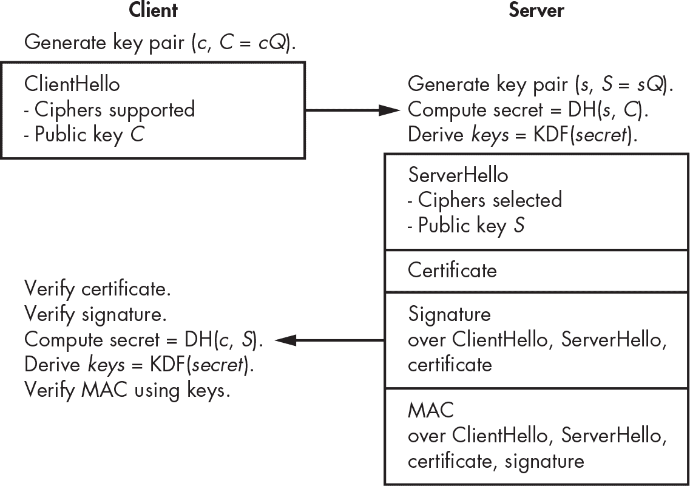
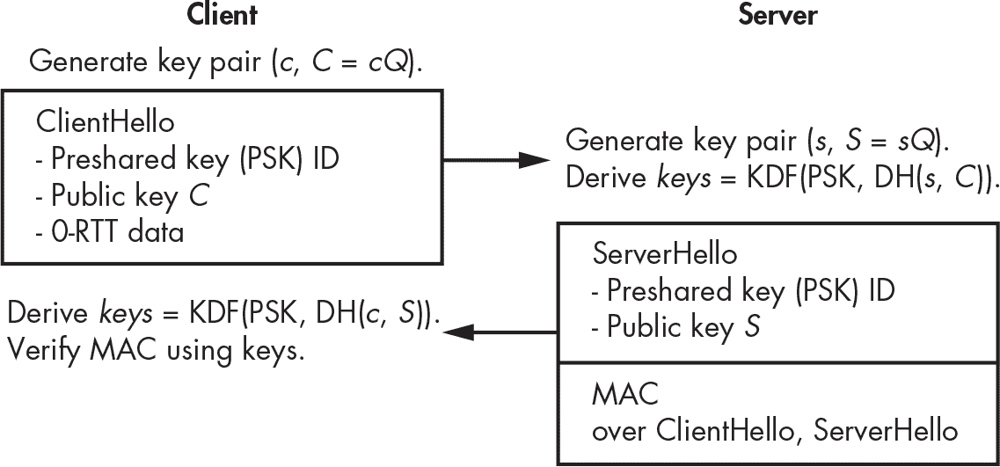
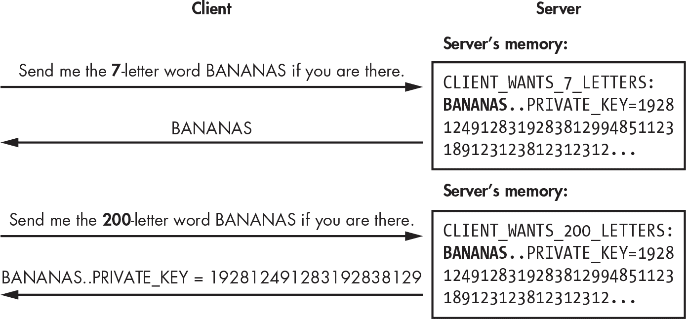

## 第十四章：13 TLS


*传输层安全（TLS）协议*是互联网安全的主力军。TLS 保护服务器和客户端之间的连接，无论是网站与其访客之间、电子邮件服务器之间、移动应用程序与其服务器之间，还是视频游戏服务器与玩家之间。如果没有 TLS，互联网将不会那么安全。

TLS 与应用程序无关，意味着你可以将它用于依赖 HTTP 协议的基于 Web 的应用程序，也可以用于任何客户端计算机或设备需要与远程服务器建立连接的系统。例如，TLS 广泛应用于物联网（IoT）应用中的机器对机器通信，如与远程服务器通信的智能冰箱。

本章提供了 TLS 的简要概述，随着时间的推移，TLS 变得越来越复杂。不幸的是，复杂性和臃肿带来了多个漏洞，其实现中的错误也屡次成为头条新闻——Heartbleed、BEAST、CRIME 和 POODLE 都是影响了数百万个 Web 服务器的漏洞。

> 注意

*你可能会听到有人将 TLS 称为*安全套接字层（SSL）*，它是 TLS 的前身名称。*

2013 年，工程师们开始着手开发 TLS 1.3。如你在本章中将学到的，TLS 1.3 摒弃了不必要且不安全的特性，用当时最先进的算法替代了旧算法，最终结果是一个更简洁、更快速、更安全的协议。

在我们探讨 TLS 1.3 的工作原理之前，让我们回顾一下 TLS 旨在解决的问题以及它存在的原因。

### 目标应用程序和要求

TLS 是 HTTPS 网站中的*S*，浏览器地址栏中出现的挂锁图标表示该页面是安全的。创建 TLS 的主要驱动力是通过认证站点并加密流量来实现安全浏览，保护个人数据、信用卡号码和用户凭证等敏感信息，广泛应用于电子商务和电子银行等领域。

TLS 还通过在客户端和服务器之间建立一个*安全通道*来保护一般的基于互联网的通信，确保传输的数据是机密的、已验证的并且未经修改。

TLS 的安全目标之一是防止中间人攻击，在这种攻击中，攻击者截获传输方的加密流量，解密流量以捕获明文内容，然后重新加密并发送给接收方。TLS 通过使用证书和受信任的证书颁发机构来验证服务器（可选地验证客户端），从而防止这些攻击，具体内容将在“证书和证书颁发机构”一节中讨论，见第 258 页。

为了确保广泛采用，TLS 需要满足四个额外的要求：效率、互操作性、可扩展性和多功能性。对于 TLS，效率意味着尽量减少与未加密连接相比的性能损失。这对服务器（减少服务提供商硬件成本）和客户端（避免明显的延迟或减少移动设备的电池寿命）都有好处。该协议需要具备互操作性，以便能够在任何硬件和任何操作系统上工作。它还必须具备可扩展性，以便支持额外的功能或算法。最后，它必须是多功能的——也就是说，不局限于某个特定的应用程序。这与传输控制协议（TCP）相似，TCP 不关心其上层应用协议是什么。

### TLS 协议套件

为了保护客户端和服务器之间的通信，TLS 由多个版本的几个协议组成，形成了 TLS 协议的 *套件*。TLS 不是一个传输协议，通常位于传输协议（TCP）和应用层协议（如 HTTP 或 SMTP）之间，以加密通过 TCP 连接传输的数据。

TLS 也可以在 *用户数据报协议 (UDP)* 传输协议上工作，这通常用于“无连接”传输，尤其是在延迟必须最小化的场景中，如音频或视频流媒体以及在线游戏。然而，与 TCP 不同，UDP 不保证数据的传输或正确的包排序。因此，TLS 的 UDP 版本——*数据报传输层安全协议 (DTLS)*——有所不同。关于 TCP 和 UDP 的更多信息，请参见 Charles Kozierok 的 *《TCP/IP 指南》*（No Starch Press，2005 年）。

#### TLS 和 SSL 协议家族

TLS 始于 1995 年，当时 Netscape 开发了 TLS 的前身——SSL 协议。SSL 远非完美，SSL 2.0 和 SSL 3.0 都存在安全漏洞。你永远不应该使用 SSL，而应该始终使用 TLS——令人困惑的是，人们常常将 TLS 称为 SSL，包括安全专家。

并非所有版本的 TLS 都是安全的。TLS 1.0（1999 年）是最不安全的版本，尽管它比 SSL 3.0 更安全。TLS 1.1（2006 年）更好，但包含了一些弱算法。TLS 1.2（2008 年）更好，但它复杂，只有在正确配置的情况下才能提供高安全性。此外，它的复杂性增加了实现中的错误风险和配置错误的风险。例如，TLS 1.2 支持 AES 在 CBC 模式下，这常常容易受到填充 oracle 攻击。

TLS 1.2 继承了 TLS 较早版本的数十个特性和设计选择，这使得其在安全性和性能方面并不理想。为了整顿这一混乱局面，密码学工程师重新设计了 TLS——只保留了优秀的部分并添加了安全功能。结果是 TLS 1.3，这是一次全面革新，简化了臃肿的设计并提升了安全性和效率。本质上，TLS 1.3 是成熟的 TLS。

#### TLS 简介

TLS 有两个主要协议：*握手协议*（或简称*握手*）确定了双方共享的密钥；*记录协议*描述了如何使用这些密钥来保护数据。TLS 处理的数据包称为*记录*。TLS 定义了一种封装来自更高层协议数据的数据包格式，以便传输到另一方。

握手由启动安全连接的客户端开始。客户端发送一个称为 ClientHello 的初始消息，其中包含它希望使用的密码。服务器检查此消息及其参数，然后响应一个 ServerHello 消息。一旦客户端和服务器处理彼此的消息，它们就可以使用通过握手协议建立的会话密钥交换加密数据，详见“TLS 握手协议”第 263 页。

#### 证书和证书颁发机构

TLS 握手中最关键的步骤，也是 TLS 安全性的核心，是*证书验证步骤*，在此步骤中，服务器使用证书向客户端进行身份验证。

*证书*本质上是一对公钥及其签名以及相关信息（包括域名）。例如，当连接到*[`<wbr>www<wbr>.google<wbr>.com`](https://www.google.com)*时，您的浏览器从某个网络主机接收证书，然后验证证书的签名，其内容类似于“我是*google.com*，我的公钥是[*key*]”。如果签名验证成功，证书及其公钥就是*受信任的*，浏览器会继续建立连接。（有关签名的详细信息，请参阅第十章和第十二章。）

浏览器通过*证书颁发机构（CA）*知道用于验证签名的公钥，这本质上是在浏览器或操作系统中硬编码的公钥。公钥的私钥（即其签名能力）属于一个受信任的组织，该组织确保其签发的证书中的公钥属于声称拥有它们的网站或实体。换句话说，CA 充当*受信任的第三方*。如果没有 CA，就无法验证由*google.com*提供的公钥是否属于 Google 而不是中间人进行的中间人攻击。

例如，清单 13-1 展示了当你使用 OpenSSL 命令行工具在 443 端口发起到 *www.google.com* 的 TLS 连接时会发生什么，443 端口是用于基于 TLS 的 HTTP 连接（HTTPS）的网络端口。

```
$ **openssl s_client -connect www.google.com:443**
CONNECTED(00000003)
---
Certificate chain
 0 s:CN = www.google.com
   i:C = US, O = Google Trust Services LLC, CN = GTS CA 1C3
 1 s:C = US, O = Google Trust Services LLC, CN = GTS CA 1C3
   i:C = US, O = Google Trust Services LLC, CN = GTS Root R1
 2 s:C = US, O = Google Trust Services LLC, CN = GTS Root R1
   i:C = BE, O = GlobalSign nv-sa, OU = Root CA, CN = GlobalSign Root CA
---
Server certificate
-----BEGIN CERTIFICATE-----
MIIEiDCCA3CgAwIBAgIQNJvIv7ypW9IQHaA7P69MzzANBgkqhkiG9w0BAQsFADBG
MQswCQYDVQQGEwJVUzEiMCAGA1UEChMZR29vZ2xlIFRydXN0IFNlcnZpY2VzIExM
QzETMBEGA1UEAxMKR1RTIENBIDFDMzAeFw0yMzA5MDQwODIzMjlaFw0yMzExMjcw
ODIzMjhaMBkxFzAVBgNVBAMTDnd3dy5nb29nbGUuY29tMFkwEwYHKoZIzj0CAQYI
KoZIzj0DAQcDQgAENEMvWAY0TRTb0w5ZxbUbX/Z+EcviE50SzQzvP/xyyVIaURM4
A0Jer9IJO/6Iq6o2AfDXUxrdBKpSzlzaeFCaqqOCAmgwggJkMA4GA1UdDwEB/wQE
AwIHgDATBgNVHSUEDDAKBggrBgEFBQcDATAMBgNVHRMBAf8EAjAAMB0GA1UdDgQW
BBRnwQnVC8ok1e6YPIbQwjB+XFpPRjAfBgNVHSMEGDAWgBSKdH+vhc3ulc09nNDi
RhTzcTUdJzBqBggrBgEFBQcBAQReMFwwJwYIKwYBBQUHMAGGG2h0dHA6Ly9vY3Nw
LnBraS5nb29nL2d0czFjMzAxBggrBgEFBQcwAoYlaHR0cDovL3BraS5nb29nL3Jl
cG8vY2VydHMvZ3RzMWMzLmRlcjAZBgNVHREEEjAQgg53d3cuZ29vZ2xlLmNvbTAh
BgNVHSAEGjAYMAgGBmeBDAECATAMBgorBgEEAdZ5AgUDMDwGA1UdHwQ1MDMwMaAv
oC2GK2h0dHA6Ly9jcmxzLnBraS5nb29nL2d0czFjMy9mVkp4YlYtS3Rtay5jcmww
ggEFBgorBgEEAdZ5AgQCBIH2BIHzAPEAdgDoPtDaPvUGNTLnVyi8iWvJA9PL0RFr
7Otp4Xd9bQa9bgAAAYpfgRjOAAAEAwBHMEUCID+BcS984SEh2E2UrKfLvF2fG7qa
SYkzbELytrDz91wmAiEAlwOPMM26CynmadsqomPMXKdRNMvzdyciHVimh0snrBAA
dwB6MoxU2LcttiDqOOBSHumEFnAyE4VNO9IrwTpXo1LrUgAAAYpfgRkAAAAEAwBI
MEYCIQDZf1tULkVCXRc68zJwgp5WFJUbTxFjz6CP+eLb3dgz3gIhAJ9uS7psu2Gl
HdTXokXTetMY7MCdIcuj60Qm/qTn+1dFMA0GCSqGSIb3DQEBCwUAA4IBAQCIEn0v
QzaqNCOhiI5TKcRhaR24yKid3F57a/GOM1LDE/v7oCm+3fxtvuK9HVa/Dmnvavqp
ci7TpMDj/ocXjE4dL4/yHaVx6GhTDKMW/bbBkDaqXoSdb9lAcUZPLRTV4AjFdjmB
8wZTf95bnfeuKNXWlbo/k/9pRRhFNKKMUI54xLiVdj4wk1EUAsrMTTn+Ol2ZbFeS
s614abBT5W0hhFkLvjvEht8p3UKQwwyhRjZMBsae/d0QfT8hglVtVhhGd7f1hFqI
XSERl8EsyDc3urCsa+RjUjCvE9Q+y2X8WVV0HPCjwsANU56qEZmh4kqgg5paW/SL
maM/8Vny/nKNd6Dj
-----END CERTIFICATE-----
subject=CN = www.google.com

issuer=C = US, O = Google Trust Services LLC, CN = GTS CA 1C3

---
No client certificate CA names sent
Peer signing digest: SHA256
Peer signature type: ECDSA
Server Temp Key: X25519, 253 bits
---
SSL handshake has read 4295 bytes and written 396 bytes
Verification: OK
---
New, TLSv1.3, Cipher is TLS_AES_256_GCM_SHA384
Server public key is 256 bit
Secure Renegotiation IS NOT supported
Compression: NONE
Expansion: NONE
No ALPN negotiated
Early data was not sent
Verify return code: 0 (ok)
```

清单 13-1：与 [www<wbr>.google<wbr>.com](http://www.google.com) 建立 TLS 连接并接收证书以验证连接

证书数据位于 BEGIN CERTIFICATE 和 END CERTIFICATE 标记之间。在此之前，证书链 包含证书链的描述，其中以 s: 开头的行描述了经认证实体的 *主题*，以 i: 开头的行描述了签名的 *颁发者*。证书 0 是 *[www<wbr>.google<wbr>.com](http://www.google.com)* 收到的，证书 1 属于签署证书 0 的实体，证书 2 属于签署证书 1 的实体。

颁发证书 0 的组织是 Google（通过 Google Trust Services 实体，GTS），它授权颁发证书 0 给域名 *[www<wbr>.google<wbr>.com](http://www.google.com)*，并使用私钥 GTS CA 1C3 对证书进行签名。证明该密钥属于 Google 密钥层次结构的证书是证书 1，它由 Google 内的根证书 GTS Root R1 签名。证书 2 由 GlobalSign（一个公认的认证机构）颁发，证明 GTS Root R1 密钥属于 Google 组织。

在这个示例中，你的操作系统通常已经有证书 1 和证书 2，并将其视为受信任的证书。在这种情况下，你只需要验证两个签名：证书 0 中的 Google GTS CA 1C3 实体签名和证书 1 中的 Google GTS Root R1 实体签名。如果你的系统尚未将证书 2 作为受信任证书，但却包含了 GlobalSign 的根证书（GlobalSign Root CA），那么你还需要验证证书 2 中的 GlobalSign 签名。

证书颁发机构如 Google 和 GlobalSign 必须是可信的，只会向可信实体颁发证书，并且必须保护其私钥，以防止攻击者代表它们颁发证书（例如，伪装成合法的 *[www<wbr>.google<wbr>.com](http://www.google.com)* 服务器）。

要查看证书内容，可以在 Unix 终端中输入命令 openssl x509 -text -noout，然后将证书粘贴到 列表 13-1 中。输出将显示在 列表 13-2 中。

```
$ **openssl x509 –text –noout**
Certificate:
  Data:
    Version: 3 (0x2)
    Serial Number:
      34:9b:c8:bf:bc:a9:5b:d2:10:1d:a0:3b:3f:af:4c:cf
    Signature Algorithm: sha256WithRSAEncryption
    Issuer: C = US, O = Google Trust Services LLC, CN = GTS CA 1C3
    Validity
      Not Before: Sep  4 08:23:29 . . .
      Not After : Nov 27 08:23:28 . . .
    Subject: CN = www.google.com
    Subject Public Key Info:
      Public Key Algorithm: id-ecPublicKey
        Public-Key: (256 bit)
        pub:
          04:34:43:2f:58:06:34:4d:14:db:d3:0e:59:c5:b5:
          1b:5f:f6:7e:11:cb:e2:13:9d:12:cd:0c:ef:3f:fc:
          72:c9:52:1a:51:13:38:03:42:5e:af:d2:09:3b:fe:
          88:ab:aa:36:01:f0:d7:53:1a:dd:04:aa:52:ce:5c:
          da:78:50:9a:aa
        ASN1 OID: prime256v1
        NIST CURVE: P-256
    X509v3 extensions:
      X509v3 Key Usage: critical
        Digital Signature
      X509v3 Extended Key Usage:
        TLS Web Server Authentication
      X509v3 Basic Constraints: critical
        CA:FALSE
      X509v3 Subject Key Identifier:
        67:C1:09:D5:0B:CA:24:D5:EE:98:3C:86:D0:C2:30:7E:5C:5A:4F:46
      X509v3 Authority Key Identifier:
        8A:74:7F:AF:85:CD:EE:95:CD:3D:9C:D0:E2:46:14:F3:71:35:1D:27
 Authority Information Access:
        OCSP - URI:http://ocsp.pki.goog/gts1c3
        CA Issuers - URI:http://pki.goog/repo/certs/gts1c3.der
      X509v3 Subject Alternative Name:
        DNS:www.google.com
      X509v3 Certificate Policies:
        Policy: 2.23.140.1.2.1
        Policy: 1.3.6.1.4.1.11129.2.5.3
      X509v3 CRL Distribution Points:
        Full Name:
          URI:http://crls.pki.goog/gts1c3/fVJxbV-Ktmk.crl
      CT Precertificate SCTs:
        Signed Certificate Timestamp:
          Version   : v1 (0x0)
          Log ID    : E8:3E:D0:DA:3E:F5:06:35:32:E7:57:28:BC:89:6B:C9:
                    03:D3:CB:D1:11:6B:EC:EB:69:E1:77:7D:6D:06:BD:6E
          Timestamp : Sep  4 09:23:30.638 2023 GMT
          Extensions: none
          Signature : ecdsa-with-SHA256
            30:45:02:20:3F:81:71:2F:7C:E1:21:21:D8:4D:94:AC:
            A7:CB:BC:5D:9F:1B:BA:9A:49:89:33:6C:42:F2:B6:B0:
            F3:F7:5C:26:02:21:00:97:03:8F:30:CD:BA:0B:29:E6:
            69:DB:2A:A2:63:CC:5C:A7:51:34:CB:F3:77:27:22:1D:
            58:A6:87:4B:27:AC:10
        Signed Certificate Timestamp:
          Version   : v1 (0x0)
          Log ID    : 7A:32:8C:54:D8:B7:2D:B6:20:EA:38:E0:52:1E:E9:84:
                    16:70:32:13:85:4D:3B:D2:2B:C1:3A:57:A3:52:EB:52
          Timestamp : Sep  4 09:23:30.688 2023 GMT
          Extensions: none
          Signature : ecdsa-with-SHA256
            30:46:02:21:00:D9:7F:5B:54:2E:45:42:5D:17:3A:F3:
            32:70:82:9E:56:14:95:1B:4F:11:63:CF:A0:8F:F9:E2:
            DB:DD:D8:33:DE:02:21:00:9F:6E:4B:BA:6C:BB:61:A5:
            1D:D4:D7:A2:45:D3:7A:D3:18:EC:C0:9D:21:CB:A3:EB:
            44:26:FE:A4:E7:FB:57:45
    Signature Algorithm: sha256WithRSAEncryption
    Signature Value:
      88:12:7d:2f:43:36:aa:34:23:a1:88:8e:53:29:c4:61:69:1d:
      b8:c8:a8:9d:dc:5e:7b:6b:f1:8e:33:52:c3:13:fb:fb:a0:29:
      be:dd:fc:6d:be:e2:bd:1d:56:bf:0e:69:ef:6a:fa:a9:72:2e:
      d3:a4:c0:e3:fe:87:17:8c:4e:1d:2f:8f:f2:1d:a5:71:e8:68:
      53:0c:a3:16:fd:b6:c1:90:36:aa:5e:84:9d:6f:d9:40:71:46:
      4f:2d:14:d5:e0:08:c5:76:39:81:f3:06:53:7f:de:5b:9d:f7:
      ae:28:d5:d6:95:ba:3f:93:ff:69:45:18:45:34:a2:8c:50:8e:
      78:c4:b8:95:76:3e:30:93:51:14:02:ca:cc:4d:39:fe:3a:5d:
      99:6c:57:92:b3:ad:78:69:b0:53:e5:6d:21:84:59:0b:be:3b:
      c4:86:df:29:dd:42:90:c3:0c:a1:46:36:4c:06:c6:9e:fd:dd:
      10:7d:3f:21:82:55:6d:56:18:46:77:b7:f5:84:5a:88:5d:21:
      11:97:c1:2c:c8:37:37:ba:b0:ac:6b:e4:63:52:30:af:13:d4:
      3e:cb:65:fc:59:55:74:1c:f0:a3:c2:c0:0d:53:9e:aa:11:99:
      a1:e2:4a:a0:83:9a:5a:5b:f4:8b:99:a3:3f:f1:59:f2:fe:72:
      8d:77:a0:e3
```

列表 13-2：解码从 [www<wbr>.google<wbr>.com](http://www.google.com) 接收到的证书

本列表展示了命令 openssl x509 解码证书，证书最初以一块 base64 编码的数据形式提供。由于 OpenSSL 知道这些数据的结构，它可以告诉你证书中的内容，包括序列号、版本信息、标识信息、有效期（Not Before 和 Not After 行）、公钥（这里是 RSA 模数及其公钥指数），以及前述信息的签名。

尽管安全专家和密码学家经常声称整个证书系统本质上是有缺陷的，但它仍然是我们所拥有的最佳解决方案之一，例如 SSH 采用的“首次使用信任”（TOFU）策略。

#### 记录协议

通过 TLS 1.3 通信交换的所有数据都以 TLS 记录的序列传输，TLS 使用的数据包。TLS 记录协议（即*记录层*）本质上是一个传输协议，与传输数据的意义无关；这使得 TLS 适用于任何应用。

TLS 记录协议首先传输在握手过程中交换的数据。一旦握手完成且双方共享一个秘密密钥，应用数据将被分段并作为 TLS 记录的一部分进行传输。

##### TLS 记录的结构

一个 TLS 记录是一个最多为 16KB 的数据块，具有以下结构：

+   第一个字节表示传输数据的类型，并设置为值 22 以表示握手数据，23 以表示加密数据，21 以表示警报。TLS 1.3 规范将此值称为 ContentType。

+   第二个和第三个字节分别设置为 03 和 01。这些字节是出于历史原因而固定的，并且并非 TLS 1.3 版本所特有。规范将此 2 字节值称为 ProtocolVersion。

+   第四个和第五个字节对要传输的数据的长度进行编码，作为一个 16 位整数，长度不能大于 2¹⁴ 字节（16KB）。

+   剩余的字节是要传输的数据（或*负载*），其长度等于记录第四和第五个字节所编码的值。

> 注意

*TLS 记录有一个相对简单的结构。如你所见，TLS 记录的头部仅包含三个字段。相比之下，IPv4 数据包在负载之前包含 14 个字段，TCP 段包含 13 个字段。*

当 TLS 1.3 记录的第一个字节（ContentType）设置为 23 时，经过身份验证的加密算法对负载进行加密和认证。负载包括密文和随后的认证标签，接收端分别对其进行解密和验证。接收者知道使用哪种加密算法和密钥进行解密，这是 TLS 协议的魔力：如果你接收到一个加密的 TLS 记录，你已经知道了加密算法和密钥，因为执行握手协议时已建立这些信息。

##### 随机数

与许多其他协议不同，例如 IPsec 的封装安全负载（ESP），TLS 记录没有指定认证加密算法将使用的随机数。

加密和解密 TLS 记录的随机数（nonce）源自 64 位的序列号，由每一方本地维护，并在每个新记录中递增。当客户端加密数据时，它通过将序列号与 client_write_iv 值（本身源自共享密钥）进行异或操作来生成一个随机数。服务器在传输数据时使用类似的方法选择随机数，但使用的是 server_write_iv 值。

例如，如果你传输三个 TLS 记录，你将从第一个记录推导出随机数 0，从第二个记录推导出随机数 1，从第三个记录推导出随机数 2；如果随后接收三个记录，你也将按此顺序使用随机数 0、1 和 2。重新使用相同的序列号值加密传输数据并解密接收数据并不是一个弱点，因为它们与不同的常量（client_write_iv 和 server_write_iv）进行异或操作，而且每个方向使用不同的密钥。

##### 零填充功能

TLS 1.3 记录支持*零填充*，这有助于缓解流量分析攻击。攻击者通过*流量分析*利用传输数据的时序、数据量等特征，从流量模式中提取信息。例如，即使在使用强加密的情况下，由于密文和明文的大小大致相同，攻击者仅通过观察密文的长度，就可以推测消息的大致大小。

零填充通过向明文中添加零来增加密文的大小，从而欺骗观察者认为加密后的消息比实际长度要长。

#### TLS 握手协议

握手是 TLS 协议的核心——这是客户端和服务器建立共享秘密密钥以开始安全通信的过程。在 TLS 握手期间，客户端和服务器扮演不同的角色。客户端提出一些配置（TLS 版本和一组密码套件，按优先顺序排列），服务器选择它将使用的配置。服务器应遵循客户端的偏好。为了确保不同实现之间的互操作性，并确保任何实现 TLS 1.3 的服务器都能读取任何实现 TLS 1.3 的客户端发送的数据（即使它使用的是不同的库或编程语言），TLS 1.3 规范还描述了数据应该以何种格式发送。

图 13-1 展示了握手过程如何交换数据，如 TLS 1.3 规范所描述。



图 13-1：TLS 1.3 握手过程

在 TLS 1.3 握手中，客户端向服务器发送一条消息，内容是：“我想与你建立 TLS 连接。这里是我支持的用于加密 TLS 记录的密码算法，还有一个 Diffie–Hellman 公钥。”该公钥必须专门为此 TLS 会话生成，客户端保留与之对应的私钥。客户端发送的消息还包括一个 32 字节的随机值和可选信息（如附加参数）。这条初始消息，*ClientHello*，在作为一系列字节传输时必须遵循特定的格式，如 TLS 1.3 规范所定义的。

服务器接收到 ClientHello 消息后，验证其格式是否正确，并响应一个包含丰富信息的 ServerHello 消息。通常，当连接到 HTTPS 网站时，该消息包含将用于加密 TLS 记录的密码算法、Diffie–Hellman 公钥、一个 32 字节的随机值（在“降级保护”一节中讨论，见第 266 页）、证书、ClientHello 和 ServerHello 消息中所有先前信息的签名（使用与证书公钥关联的私钥计算），以及该信息的 MAC 值，外加签名。MAC 是使用从 Diffie–Hellman 共享秘密派生的对称密钥计算的，服务器通过其 Diffie–Hellman 私钥和客户端公钥计算出该共享秘密。

当客户端收到 ServerHello 消息时，它验证证书的有效性，验证签名，计算共享的 Diffie–Hellman 秘密，并从中派生对称密钥，同时验证服务器发送的 MAC。一旦所有内容都验证无误，客户端就准备好向服务器发送加密消息。

> 注意

*TLS 1.3 支持许多选项和扩展，因此它可能表现得不同。例如，你可以配置 TLS 1.3 握手，要求客户端证书，以便服务器验证客户端的身份。TLS 1.3 还支持使用预共享密钥的握手方式。*

让我们看看实际操作中的情况。假设你已经部署了 TLS 1.3 来提供对网站 *[`<wbr>www<wbr>.nostarch<wbr>.com`](https://www.nostarch.com)* 的安全访问。当你将浏览器（客户端）指向这个网站时，浏览器会向网站的服务器发送一个 ClientHello 消息，其中包含它支持的加密算法。网站会用一个 ServerHello 消息和一个包含与该域名 *[www<wbr>.nostarch<wbr>.com](http://www.nostarch.com)* 关联的公钥的证书进行响应。客户端使用浏览器中嵌入的证书颁发机构验证证书的有效性（一个受信任的证书颁发机构，它的证书应该包含在浏览器或操作系统的证书存储中以供验证）。一旦所有检查通过，浏览器会请求来自 *[www<wbr>.nostarch<wbr>.com](http://www.nostarch.com)* 服务器的初始页面。

在成功完成 TLS 1.3 握手后，客户端和服务器之间的所有通信都将被加密并认证。窃听者可以得知某个特定 IP 地址的客户端正在与另一个特定 IP 地址的服务器通信，并且可以观察到交换的加密内容，但无法得知底层的明文内容或修改加密消息（如果他们修改了消息，接收方会注意到通信被篡改，因为消息是经过认证的）。这对于许多应用来说已经足够安全。

#### TLS 1.3 加密算法

TLS 1.3 使用已认证的加密算法、密钥派生函数（从共享秘密派生密钥的哈希函数）以及 Diffie–Hellman 操作——但是这些是如何工作的，使用了哪些算法，以及它们的安全性如何呢？

关于已认证的加密算法的选择，TLS 1.3 仅支持三种算法：AES-GCM、AES-CCM（比 GCM 略微低效的模式）以及结合 Poly1305 MAC 的 ChaCha20 流加密算法（如 RFC 7539 中所定义）。由于 TLS 1.3 防止使用不安全的密钥长度，例如 64 位或 80 位，因此密钥可以是 128 位（AES-GCM 或 AES-CCM）或 256 位（AES-GCM 或 ChaCha20-Poly1305）。

图 13-1 中的密钥派生操作（KDF）基于 HKDF，它是一个基于 HMAC（参见 第七章）的构造，并在 RFC 5869 中定义，使用 SHA-256 或 SHA-384 哈希函数。

执行 Diffie–Hellman 操作（TLS 1.3 握手的核心）的选项仅限于椭圆曲线加密和模素数的整数乘法群（如传统的 Diffie–Hellman）。但你不能随便使用任何椭圆曲线或群体：支持的曲线包括三种 NIST 曲线，以及 Curve25519（见 第十二章）和 Curve448，这两者在 RFC 7748 中有定义。TLS 1.3 还支持基于整数群体的 DH，而不是椭圆曲线。支持的群体是 RFC 7919 中定义的五个群体：2,048 位、3,072 位、4,096 位、6,144 位和 8,192 位。

2,048 位的组在理论上可能是 TLS 1.3 最薄弱的环节。其他选项至少提供 128 位的安全性，而 2,048 位的 Diffie–Hellman 被认为提供的安全性低于 100 位。因此，支持 2,048 位组可以被视为与 TLS 1.3 其他设计选择不一致。实际上，100 位的安全性大致等同于 128 位的安全性——也就是说，几乎不可能破解。

### TLS 1.3 相对于 TLS 1.2 的改进

TLS 1.3 与其前身大不相同。首先，它淘汰了 MD5、SHA-1、RC4 和 CBC 模式中的 AES 等弱算法。此外，TLS 1.2 通常使用加密算法和 MAC（如 HMAC-SHA-1）的组合来保护记录，这种组合在 MAC-然后加密的构造中使用，而 TLS 1.3 只支持更高效且安全的认证加密算法。TLS 1.3 还摒弃了椭圆曲线点编码协商，并为每个曲线定义了一个单一的点格式。

TLS 1.3 移除了 1.2 中削弱协议的特性，降低了协议的整体复杂性，从而减少了攻击面。例如，TLS 1.3 放弃了可选的数据压缩功能，这是 TLS 1.2 中启用了 CRIME 攻击的功能。该攻击利用了消息压缩版本的长度泄露了消息内容的信息这一事实。

但 TLS 1.3 也带来了新的功能，使得连接更安全或更高效。我将讨论其中的三项功能：降级保护、单次往返握手和会话恢复。

#### 降级保护

TLS 1.3 的 *降级保护* 功能是防止 *降级攻击* 的防御措施，在这种攻击中，攻击者强迫客户端和服务器使用比 1.3 更弱的 TLS 版本。为了执行降级攻击，攻击者通过拦截并修改 ClientHello 消息，将客户端不支持 TLS 1.3 的信息传递给服务器，从而迫使服务器使用较弱的 TLS 版本。现在，攻击者可以利用 TLS 较早版本中的漏洞。

为了防止降级攻击，TLS 1.3 服务器在 ServerHello 消息中发送的 32 字节随机值中使用三种类型的模式来识别请求的连接类型。模式应与客户端请求的特定类型的 TLS 连接相匹配。如果客户端收到错误的模式，它就会知道出了问题。

具体来说，如果客户端请求 TLS 1.2 连接，前 8 个 32 字节设置为44 4F 57 4E 47 52 44 01，如果请求 TLS 1.1 连接，则设置为44 4F 57 4E 47 52 44 00。然而，如果客户端请求 TLS 1.3 连接，这前 8 个字节应该是随机的。例如，如果客户端发送一个 ClientHello 请求 TLS 1.3 连接，但网络上的攻击者将其修改为请求 TLS 1.1 连接，当客户端收到包含错误模式的 ServerHello 时，它会知道自己的 ClientHello 消息已被修改。（攻击者无法随意修改服务器的 32 字节随机值，因为这个值是经过加密签名的。）

#### 单回合握手

在典型的 TLS 1.2 握手中，客户端发送一些数据到服务器，等待回应，然后再发送更多数据并等待服务器回应后才发送加密消息。延迟是两次往返时间（RTT）。相比之下，TLS 1.3 的握手只需要一次往返时间（见图 13-1）。节省的时间可以达到几百毫秒。在考虑到流行服务的服务器每秒处理数千个连接时，这一差异非常重要。

#### 会话恢复

TLS 1.3 比 TLS 1.2 更快，但通过完全消除加密会话前的往返时间，它甚至可以更快（可节省几百毫秒）。诀窍在于使用*会话恢复*，该方法利用在先前会话中客户端和服务器之间交换的预共享密钥来启动新会话。会话恢复带来了两个主要好处：客户端可以立即开始加密，并且后续会话无需使用证书。

图 13-2 展示了会话恢复的工作原理。



图 13-2：TLS 1.3 会话恢复握手，其中 0-RTT 数据是与 ClientHello 一起发送的会话恢复数据

首先，客户端发送包含已经与服务器共享的密钥标识符（称为*PSK*，即*预共享密钥*）和一个新的 DH 公钥的 ClientHello 消息。客户端还可以在这条消息中包含加密数据（称为*0-RTT 数据*）。当服务器响应 ClientHello 消息时，它会提供一个数据交换的 MAC。客户端验证 MAC 后，可以确认它与之前的服务器进行通信，从而使证书验证显得有些多余。客户端和服务器执行如同正常握手中的 Diffie–Hellman 密钥协商，后续的消息将使用依赖于 PSK 和新计算的 Diffie–Hellman 共享密钥的密钥进行加密。

### TLS 安全性的优势

我们将评估 TLS 1.3 在第十一章中提到的两种主要安全概念下的优势：身份验证和前向保密。

#### 身份验证

在 TLS 1.3 握手期间，服务器通过证书机制对客户端进行身份验证。然而，客户端并未进行身份验证，客户端可以通过在握手后向服务器端应用程序（如 Gmail）提供用户名和密码来进行身份验证。如果客户端已与远程服务建立会话，它可以通过发送*安全 Cookie*来进行身份验证，该 Cookie 只能通过 TLS 连接发送。

在某些情况下，客户端可以使用类似服务器用于身份验证的基于证书的机制来对服务器进行身份验证：客户端向服务器发送*客户端证书*，服务器在授权客户端之前验证该证书。然而，由于客户端证书会增加客户端和服务器（即证书颁发机构）的复杂性，因此你很少会使用客户端证书：客户端需要执行复杂的操作将证书集成到系统中并保护其私钥，而证书颁发机构需要确保只有授权的客户端收到证书，并且满足其他要求。

#### 前向保密性

回顾第十一章中的“密钥协商协议”，密钥协商提供前向保密性，前提是当当前会话受到攻击时，先前的会话不会受到影响。在数据泄露模型中，只有临时秘密被泄露，而在漏洞模型中，长期秘密被暴露。

幸运的是，TLS 1.3 的前向保密性在数据泄露和安全漏洞面前依然有效。在数据泄露模型中，攻击者恢复了临时密钥，如特定会话的会话密钥或 Diffie–Hellman 私钥（图 13-1 中的 *c*、*s*、*secret* 和 *keys* 的值）。然而，攻击者只能使用这些值解密当前会话的通信，而无法解密先前的会话，因为不同的 *c* 和 *s* 值被使用了（从而产生不同的密钥）。

在漏洞模型中，攻击者也会恢复长期密钥（即与证书中的公钥对应的私钥）。然而，这在解密先前会话时并没有比临时密钥更有用，因为这个私钥仅用于验证服务器身份，前向保密性依然有效。

实际上，如果攻击者攻破了客户端的机器，并获得了其所有内存的访问权限，他们可能从内存中恢复出当前会话的 TLS 会话密钥和秘密信息。但更重要的是，如果先前的密钥仍然保存在内存中，攻击者可能会找到它们并解密先前的会话，从而绕过理论上的前向保密性。因此，为了确保前向保密性，TLS 实现必须在密钥不再使用时正确地将其从内存中擦除，通常通过清空内存来实现。

### 事情如何出错

TLS 1.3 作为一种通用的安全通信协议符合要求，但它并不是万无一失的。像任何安全系统一样，在某些情况下它可能会失败（例如，当设计者对真实攻击的假设错误时）。不幸的是，即使是配置了最安全密码的最新版本 TLS 1.3 也可能被攻破。例如，TLS 1.3 的安全性依赖于假设三方（客户端、服务器和证书授权机构）都将诚实地行为，但如果某一方被攻破，或者 TLS 实现本身存在问题该怎么办？

#### 受损的证书授权机构

根证书授权机构（根 CA）是浏览器信任的组织，用来验证远程主机提供的证书。例如，如果你的浏览器接受 *[www<wbr>.google<wbr>.com](http://www.google.com)* 提供的证书，假设一个受信任的 CA 已经验证了证书所有者的合法性。浏览器通过检查 CA 签发的签名来验证证书。由于只有 CA 才知道创建此签名所需的私钥，我们假设其他人无法代表 CA 创建有效证书。通常情况下，网站的证书不会由根 CA 签署，而是由一个中级 CA 签署，后者通过证书链与根 CA 连接。

如果 CA 的私钥被攻破，攻击者能够使用 CA 的私钥为任何 URL 生成证书，例如*google.com*域名下的 URL，而不需要 Google 的批准。攻击者可以利用这些证书冒充合法服务器或子域名，如*mail.google.com*，并截获用户的凭证和通信。这正是 2011 年发生的事件，当时一名攻击者入侵了荷兰证书机构 DigiNotar 的网络，并创建了看似合法的证书。攻击者使用这些伪造的证书对多个 Google 服务进行攻击。

#### 受损服务器

如果服务器被攻破并完全被攻击者控制，那么一切都失去了：服务器持有会话密钥，作为 TLS 连接的终点。攻击者可以在数据加密前看到所有传输的数据，也可以在数据解密后看到所有接收的数据。他们还可能获取到服务器的私钥，这可能使他们能够使用自己的恶意服务器冒充合法服务器。此时，TLS 并不能保护你。

幸运的是，这类安全灾难在像 Gmail 和 iCloud 这样的高关注度应用中很少发生，它们得到了很好的保护，有时甚至将私钥存储在独立的安全模块中，例如硬件安全模块（HSM），直接或通过密钥管理系统（KMS）应用。

通过诸如数据库查询注入和跨站脚本等漏洞对 Web 应用程序的攻击更为常见，因为它们大多数不依赖于 TLS 的安全性，并且通过攻击者在合法的 TLS 连接上进行。这类攻击可能会泄露用户名、密码等信息。

#### 受损客户端

当客户端，如浏览器，受到远程攻击者的攻击时，TLS 安全性也会受到威胁。攻击者通过攻破客户端，能够捕获会话密钥、读取任何解密的数据等。他们甚至可以在客户端系统中安装一个恶意 CA 证书，使其默默接受本应无效的证书，从而让攻击者截获 TLS 连接。

受损的 CA 或服务器场景与受损客户端场景的区别在于，在受损客户端的情况下，只有目标客户端受到影响，而不是可能影响到*所有*客户端。

#### 实现中的漏洞

和任何加密组件一样，当 TLS 的实现中存在漏洞时，它也可能会失败。TLS 漏洞的典型案例是 Heartbleed（见图 13-3），这是 OpenSSL 在一个名为*heartbeat*的小型 TLS 特性中的缓冲区溢出漏洞。Heartbleed 在 2014 年由一名 Google 研究员和 Codenomicon 公司独立发现，影响了数百万的 TLS 服务器和客户端。



图 13-3：OpenSSL 实现的 TLS 中的 Heartbleed 漏洞

客户端首先将一个缓冲区和缓冲区长度发送给服务器，以检查服务器是否在线。在这个例子中，缓冲区是字符串*BANANAS*，客户端明确表示这个词有七个字母。服务器读取这个七个字母的单词并将其返回给客户端。

问题在于服务器没有确认长度是否正确，而是按照客户端提供的长度读取尽可能多的字符。因此，如果客户端提供的长度比字符串的实际长度长，服务器就会从内存中读取过多的数据，并将其连同任何可能包含敏感信息（如私钥或会话 cookie）的额外数据一起返回给客户端。

Heartbleed 漏洞让人震惊。为了避免类似的未来漏洞，OpenSSL 和其他主要的 TLS 实现现在进行严格的代码审查，并使用自动化工具如模糊测试（fuzzers）来识别潜在问题。

### 进一步阅读

本章并不是 TLS 的全面指南，你可能想深入了解 TLS 的历史、以前的漏洞以及其最新版本。完整的 TLS 1.3 规范可以在 TLS 工作组（TLSWG）主页上找到，网址是 *[`<wbr>tlswg<wbr>.org`](https://tlswg.org)*，其中包含了协议的所有内容（虽然不一定包括其底层的理论依据）。

我还建议你了解一些使用 TLS 的主要协议，如 QUIC（用于 Chrome 和 Google 服务器之间的连接）和 SRTP（用于视频会议和流媒体传输）。

此外，以下是与 TLS 部署相关的两个重要倡议：

+   SSL Labs TLS 测试 (*[`<wbr>www<wbr>.ssllabs<wbr>.com<wbr>/ssltest`](https://www.ssllabs.com/ssltest)*) 是由 Qualys 提供的免费服务，允许你测试浏览器或服务器的 TLS 配置，提供安全评分以及改进建议。如果你设置了自己的 TLS 服务器，可以使用这个测试来确保一切安全。

+   Let’s Encrypt (*[`<wbr>letsencrypt<wbr>.org`](https://letsencrypt.org)*) 是一个非营利组织，提供“自动化”部署 TLS 到你的 HTTP 服务器的服务。它包括自动生成证书和配置 TLS 服务器的功能，并支持所有常见的 Web 服务器和操作系统。
