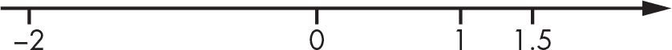
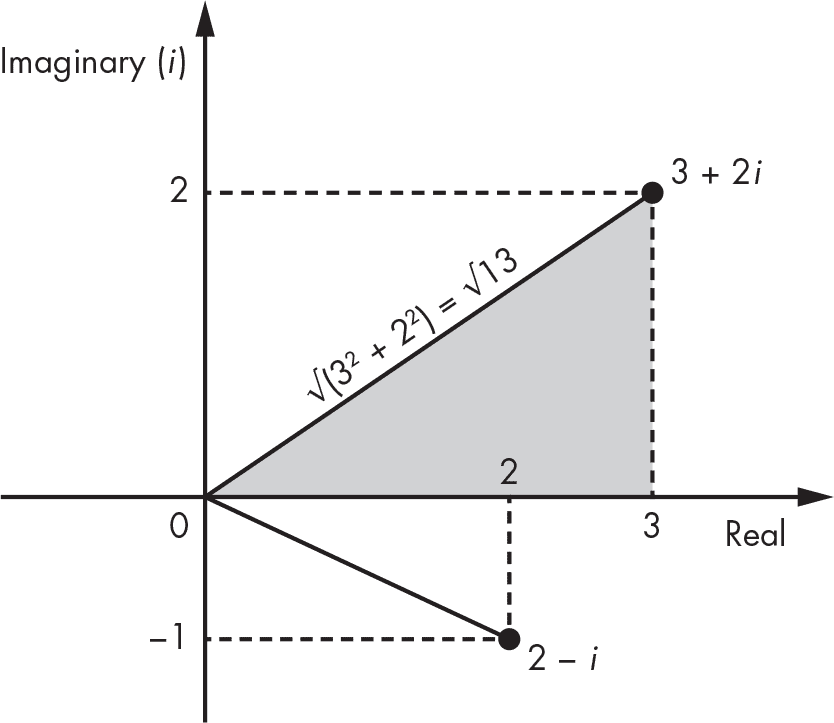
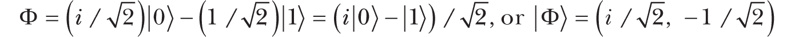
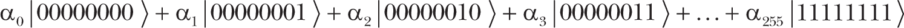
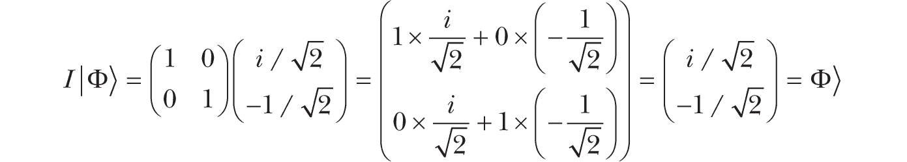
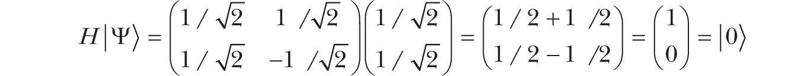
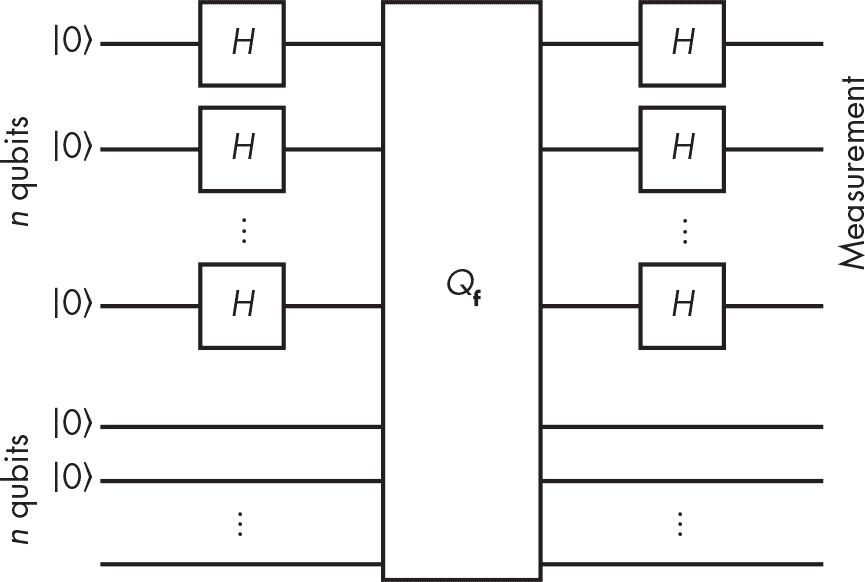
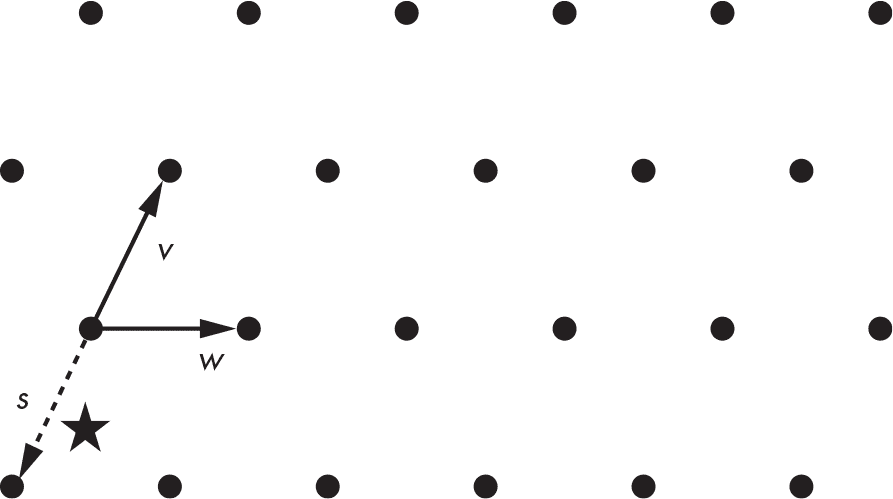

<hgroup>

## <samp class="SANS_Futura_Std_Bold_Condensed_B_11">14</samp> <samp class="SANS_Dogma_OT_Bold_B_11">量子与后量子</samp>

</hgroup>

在本章中，我们将探讨加密学的未来，假设一个百年或更长的时间跨度——届时量子计算机可能已经存在。量子计算机利用量子物理中的现象来运行我们不常见的不同类型的算法。虽然目前还没有大型量子计算机，但它们有潜力破解 RSA、Diffie–Hellman 协议和椭圆曲线加密——这些是截至目前部署或标准化的所有公钥加密算法。

为了应对量子计算的风险，密码学研究人员已开发出替代性的公钥*后量子*算法。2015 年，美国国家安全局（NSA）呼吁转向量子抗性算法，而在 2017 年，美国国家标准与技术研究院（NIST）开始了一项标准化后量子算法的过程，并在 2022 年发布了相关的新标准。

本章提供了关于量子计算机原理的非技术性概述，并简要介绍了后量子算法。虽然其中涉及一些数学内容，但只是基础的算术和线性代数，所以不用担心那些不常见的符号。

### <samp class="SANS_Futura_Std_Bold_B_11">量子计算机如何工作</samp>

量子计算利用量子物理以不同的方式进行计算，执行传统计算机无法完成的任务，比如高效地破解 RSA 和椭圆曲线加密。量子计算机并不是一种超快的普通计算机。事实上，量子计算机无法高效地解决那些传统计算机也无法解决的复杂问题，比如暴力搜索或**NP**-难题。

量子力学——研究亚原子粒子行为的物理学分支，这些粒子的行为是真正随机的——是量子计算机的基础。与传统计算机不同，传统计算机通过位（bit）来工作，而这些位只能是 0 或 1，量子计算机则通过*量子位*（或*量子比特*）来工作，量子比特可以“同时是 0 和 1”。这是一种模糊的状态，称为*叠加*，我的引号表示这是一种过于简化的说法。在这个微观世界中，物理学家发现，像电子和光子这样的粒子以一种高度反直觉的方式表现：在你观察电子之前，它并不在空间的一个确定位置，而是在多个位置同时存在（也就是处于叠加状态）。一旦你观察它——这个操作叫做*测量*——它会停在一个固定的、随机的位置，且不再处于叠加状态；量子态*坍缩*了。这使得在量子计算机中创造量子比特成为可能，并且伴随着量子纠缠和干涉现象的出现。

量子计算机的工作原理依赖于*纠缠*，即两个粒子以一种方式相互连接（纠缠），使得观察其中一个的值能够得到另一个的值，即使这两个粒子相隔甚远（可能是几公里，甚至是光年）。*爱因斯坦-波多尔斯基-罗森（EPR）悖论*阐述了这一现象，正是这一现象让阿尔伯特·爱因斯坦最初否定了量子力学。（详见*[`<wbr>plato<wbr>.stanford<wbr>.edu<wbr>/entries<wbr>/qt<wbr>-epr<wbr>/`](https://plato.stanford.edu/entries/qt-epr/)*了解更深入的解释。）

*干涉*对于量子计算机的运作也至关重要。利用这一特性，粒子可以因其波动性而相互结合或相互抵消正如著名的双缝实验所示。量子计算利用干涉作用，使得有效解的“波”相互增强，而无效解的波则相互抵消。

为了解释量子计算机的工作原理，我将区分实际的量子计算机（硬件，包括其量子比特）与量子算法（运行在其上的软件，由*量子门*组成）。

#### <samp class="SANS_Futura_Std_Bold_Condensed_Oblique_BI_11">量子比特</samp>

你可以用*振幅*来表征量子比特或其组合，振幅是类似于概率的数字，但并不是*完全*的概率。概率是介于 0 和 1 之间的数字，而振幅是形式为*a* + *bi*（即*a* + *b* × *i*）的复数，其中*a*和*b*是实数，*i*是*虚数单位*。你使用数字*i*来形成形式为*bi*的*虚数*，其中*b*是实数。当你将*i*与实数相乘时，得到另一个虚数，再将其自身相乘会得到-1（即*i*² = -1）。

与实数不同，实数你可以看作属于一条直线（见图 14-1），*复数*属于一个平面（一个二维空间），正如图 14-2 所展示的那样。

<samp class="SANS_Futura_Std_Book_Oblique_I_11">图 14-1：实数作为无限直线上的点的示意图</samp>

在图 14-2 中，x 轴对应于*a* + *bi*中的*a*，y 轴对应于*b*，而虚线对应于每个数字的实部和虚部。例如，从点 3 + 2*i*到 3 的垂直虚线长 2 个单位（即虚部 2*i*中的 2）。

<samp class="SANS_Futura_Std_Book_Oblique_I_11">图 14-2：复数作为二维空间中的点的示意图</samp>

你可以使用勾股定理来计算从原点（0）到点*a* + *bi*的线段长度，将这条线视为三角形的斜边。斜边的长度等于点坐标的平方和的平方根，或者√(*a*² + *b*²)，这叫做复数*a* + *bi*的*模*。你可以将模表示为|*a* + *bi*|，并将其作为复数的长度来使用。

在量子计算机中，寄存器由一个或多个量子比特组成，这些量子比特处于叠加态，可以通过一组这样的复数或振幅来表征。但是，正如你将看到的，这些振幅不能是任意的数。

##### <samp class="SANS_Futura_Std_Bold_Condensed_B_11">单量子比特的振幅</samp>

你可以通过两个振幅来描述单一量子比特，我们将其表示为α（alpha）和β（beta）。然后，你可以将量子比特的状态表示为α|0⟩ + β|1⟩，其中| ⟩表示量子态中的向量。这种表示意味着，当你观察这个量子比特时，出现 0 的概率是|α|²，出现 1 的概率是|β|²。为了使这些成为实际的概率，|α|²和|β|²必须是 0 和 1 之间的数，且|α|² + |β|²必须等于 1。

例如，假设你有量子比特Ψ（psi），其振幅α = 1/√2 和β = 1/√2。你可以按如下方式表示：

在量子比特Ψ中，值 0 的振幅是 1/√2，值 1 的振幅也相同，都是 1/√2。为了从振幅中得到实际的概率，计算 1/√2 的模（因为它没有虚部，所以模是 1/√2），然后将其平方：(1/√2)² = 1/2。这意味着，如果你观察量子比特Ψ，你有 1/2 的机会看到 0，看到 1 的机会也相同。

现在考虑量子比特Φ（phi），其中：

量子比特Φ与Ψ在本质上是不同的，因为与Ψ中振幅具有相同值不同，量子比特Φ具有不同的振幅，α = *i*/√2（一个正的虚数）和β = –1/√2（一个负的实数）。然而，如果你观察Φ，看到 0 或 1 的机会是 1/2，和Ψ是一样的。根据之前的规则，计算看到 0 的概率如下：

注意，因为α = *i*/√2，你可以将α写为*a* + *bi*，其中*a* = 0，*b* = 1/√2，计算|α| = √(*a*² + *b*²)得到 1/√2。

不同的量子比特可能表现得很相似（对于两个量子比特，看到 0 的概率相同），但它们的振幅不同。这说明，看到 0 或 1 的实际概率只能部分地表征一个量子比特；这类似于观察物体在墙上的影子，它能提供物体的宽度和高度的提示，但无法得知其深度。在量子比特的情况下，这个隐藏的维度就是其振幅的值：它是正数还是负数？它是实数还是虚数？

> <samp class="SANS_Dogma_OT_Bold_B_15">注意</samp>

*为了简化符号，我们通常将一个量子比特写作它的一对振幅（*α*, *β*）。因此，我们可以将前面的例子写作|*Ψ⟩* = (1/√2, 1/√2)。*

##### <samp class="SANS_Futura_Std_Bold_Condensed_B_11">量子比特组的振幅</samp>

我们如何理解多个量子比特呢？例如，当这八个量子比特的量子态通过纠缠连接时，它们可以形成一个*量子字节*。你可以如下描述这个量子字节，其中α是与这八个量子比特的 256 种可能值相关联的振幅：

请注意，你必须满足|α[0]|² + |〈α[1]|² + . . . + |α[255]|² = 1，以使所有概率的总和为 1。

你可以将这八个量子比特视为一组 2⁸ = 256 个振幅，因为它有 256 种可能的配置，每种配置都有其独特的振幅。然而，在物理现实中，你将拥有八个物理对象，而不是 256 个。256 个振幅是这组八个量子比特的隐性特征；这些 256 个数字中的每一个都可以取无穷多种不同的值。一般来说，你可以通过一组 2*^n*个复数来描述*n*个量子比特的组，这个数量随着量子比特数目的增加而指数级增长。

如果你想使用经典计算机模拟量子态的演化，你需要存储这个指数级别的振幅数量并进行计算来修改它们。这一要求是经典计算机无法高效模拟量子计算机的主要原因之一：因为这样做需要巨大的内存（大约是 2*^n*的数量级），以存储一个量子系统中* n *个量子比特所包含的信息。实际上，你最多可以模拟 50 到 60 个量子比特，具体取决于计算的类型。

#### <samp class="SANS_Futura_Std_Bold_Condensed_Oblique_BI_11">量子门</samp>

振幅和*量子门*的概念是量子计算的独特特性。量子门本质上是对一个或多个量子比特的变换，它是量子计算领域中电子门的对应物。经典计算机使用寄存器、内存和微处理器对数据执行一系列指令，而量子计算机通过应用一系列量子门对一组量子比特进行可逆变换，然后测量一个或多个量子比特的值。量子计算机具有更强大的计算能力，因为仅凭* n *个量子比特，它们就能影响 2*^n*个振幅的值。这一特性具有深远的影响。

从数学角度来看，量子算法本质上是一个量子门电路，它在最终测量之前会对一组复数（振幅）进行变换，在测量时观察一个或多个量子比特的值（见图 14-3）。

<samp class="SANS_Futura_Std_Book_Oblique_I_11">图 14-3：量子算法的原理</samp>

我们也将量子算法称为*量子门阵列*或*量子电路*。

##### <samp class="SANS_Futura_Std_Bold_Condensed_B_11">量子门作为矩阵乘法</samp>

与经典计算机的布尔门（与门、异或门等）不同，量子门作用于一组幅度，就像矩阵在与向量相乘时的作用一样。例如，要对量子比特Φ应用最简单的量子门——*恒等*门，我们将*I*视为一个 2×2 的恒等矩阵，并与由Φ的两个幅度组成的列向量相乘：

这个矩阵-向量乘法的结果是另一个列向量，包含两个元素，其中上面的值等于*I*矩阵的第一行与输入向量的点积（即将第一元素 1 与*i*/√2 的乘积与第二元素 0 与–1/√2 的乘积相加的结果），底部值也类似。

恒等门*I*几乎没什么用，因为它不做任何事情，保持量子比特不变。

> <samp class="SANS_Dogma_OT_Bold_B_15">注意</samp>

*实际上，量子计算机不会显式地计算矩阵-向量乘法，因为矩阵会大得太不可处理。（这也是为什么经典计算机无法模拟量子计算的原因。）相反，量子计算机会通过物理变换将量子比特转化为物理粒子，这些物理变换等效于矩阵乘法。困惑了吗？理查德·费曼曾说过：“如果你没有完全困惑于量子力学，那你就不理解它。”*

##### <samp class="SANS_Futura_Std_Bold_Condensed_B_11">Hadamard 量子门</samp>

最有用的量子门之一是*Hadamard 门*，通常表示为*H*。你可以按如下方式定义 Hadamard 门（注意右下位置的负值）：

将这个门作用于量子比特|Ψ⟩ = (1/√2, 1/√2)会得到以下结果：

通过将 Hadamard 门*H*作用于|Ψ⟩，你得到一个量子比特|0⟩，其中值|0⟩的幅度为 1，|1⟩的幅度为 0。这告诉你量子比特是确定性行为的：如果你观察这个量子比特，你总是会看到 0，永远看不到 1。换句话说，你失去了初始量子比特|Ψ⟩的随机性。

再次将 Hadamard 门作用于量子比特|0⟩会得到以下结果：

这将使你回到量子比特|Ψ⟩并恢复随机状态。我们常在量子算法中使用 Hadamard 门，将确定性状态转变为均匀随机状态。

##### <samp class="SANS_Futura_Std_Bold_Condensed_B_11">并非所有矩阵都是量子门</samp>

虽然你可以将量子门的应用视为矩阵乘法，但并不是所有的矩阵都对应量子门。回想一下，量子比特由复数 α 和 β 组成，分别是量子比特的幅度，满足条件 |α|² + |β|² = 1。如果你通过矩阵乘法对量子比特进行操作后得到的两个幅度不满足这个条件，那么结果就不能是一个量子比特。量子门仅对应 *单位矩阵*，它们保持 |α|² + |β|² = 1 的特性。

单位矩阵（以及量子门的定义）是 *可逆的*，这意味着给定一个操作的结果，你可以通过应用 *逆* 矩阵来计算回原始的量子比特。这就是为什么量子计算是一种 *可逆计算* 的原因。

### <samp class="SANS_Futura_Std_Bold_B_11">量子加速</samp>

*量子加速*发生在量子计算机能够比经典计算机更快地解决问题时。例如，在经典计算机上查找一个无序列表中的 *n* 个项目时，平均需要进行 *n*/2 次操作，因为你需要查看列表中的每一项，直到找到你想要的那个。（平均来说，你将在查找列表的一半后找到该项。）没有任何经典算法能够比 *n*/2 更快。然而，存在一种量子算法可以仅用 *O*(√*n*) 次操作来查找某个项，这比 *n*/2 少了几个数量级。例如，如果 *n* 等于 1,000,000，则 *n*/2 为 500,000，而 √*n* 为 1,000。

我们通过 *时间复杂度* 来量化量子算法与经典算法之间的差异，我们用 *O*() 表示法来表示时间复杂度。在前面的例子中，量子算法的运行时间是 *O*(√*n*)，而经典算法的运行时间不可能比 *O*(*n*) 更快。由于这种时间复杂度的差异是由于平方指数的关系，我们称之为 *二次加速*。虽然这样的加速可能带来不同，但实际上还有更强大的加速。

#### <samp class="SANS_Futura_Std_Bold_Condensed_Oblique_BI_11">指数加速与西蒙问题</samp>

*指数加速*是量子计算的圣杯。当一个在经典计算机上需要指数级时间（例如 *O*(2*^n*)）来完成的任务，能够在量子计算机上以多项式复杂度执行时——即 *O*(*n**^k*)，其中 *k* 为某个固定数字时，就会出现指数加速。这种指数加速能够将一个几乎不可能完成的任务变为可能。（回想一下在第九章中，密码学家和复杂性理论家将指数级时间与不可能任务联系在一起，将多项式时间与实际任务联系在一起。）

指数加速的典型例子是*Simon 问题*。在这个计算问题中，一个函数**f**()将*n*位字符串转换为*n*位字符串，使得**f**()的输出看起来像一个随机的*n*位字符串，但有一个限制：存在一个秘密值*m*，使得对于任意两个值*x*、*y*，我们有**f**(*x*) = **f**(*y*)当且仅当*y* = *x* ⊕ *m*。Simon 问题的任务是，在给定黑箱访问**f**()的情况下找到*m*。

用经典算法解决 Simon 问题归结为找到碰撞，或者找到值*x*和*y*，使得**f**(*x*) = **f**(*y*)。这大约需要 2*^n*^(/2)次查询**f**()。然而，图 14-4 显示，量子算法仅需大约*n*次查询即可解决 Simon 问题，且具有极高的时间效率，时间复杂度为*O*(*n*)。

<samp class="SANS_Futura_Std_Book_Oblique_I_11">图 14-4：解决 Simon 问题的量子算法电路</samp>

在解决 Simon 问题的量子电路中，你初始化 2*n*个量子比特为|0⟩，对前*n*个量子比特应用 Hadamard 门(*H*)，然后对两个*n*量子比特组应用门*Q***[f]**。给定两个*n*量子比特组*x*和*y*，门*Q*f 将量子态|*x*⟩|*y*⟩转换为态|*x*⟩|**f**(*x*) ⊕ *y*⟩。也就是说，它可逆地计算函数**f**()，因为你可以通过计算**f**(*x*)并对**f**(*x*) ⊕ *y*进行异或操作，从新态恢复到旧态。（解释为什么这样有效超出了本书的范围。）

你只能在非常特定的情况下利用对称加密算法的指数加速来解决 Simon 问题，但下一节将讨论量子计算在一些真实的加密杀手级应用中的作用。

#### <samp class="SANS_Futura_Std_Bold_Condensed_Oblique_BI_11">Shor 算法的威胁</samp>

1995 年，AT&T 的研究员彼得·肖尔（Peter Shor）发表了一篇开创性的文章，标题为《量子计算机上的素因子分解和离散对数的多项式时间算法》。*肖尔算法*是一种量子算法，当解决因式分解、离散对数（DLP）和椭圆曲线离散对数（ECDLP）问题时，能带来指数级的加速。用经典计算机无法高效地解决这些问题，但使用量子计算机可以。这意味着量子计算机能够破解任何依赖这些问题的加密算法，包括 RSA、Diffie–Hellman、椭圆曲线加密以及目前大多数已部署的公钥加密机制（除了那些已经转向后量子加密的算法）。换句话说，你可以将 RSA 或椭圆曲线加密的安全性降低到凯撒密码的级别。（肖尔本可以将他的文章命名为“在量子计算机上破解所有公钥加密”）著名的复杂性理论专家斯科特·阿伦森（Scott Aaronson）称肖尔算法为“20 世纪末期的重大科学成就之一”。

实际上，肖尔算法解决的比因式分解和离散对数问题更广泛的一个问题类别。具体来说，如果一个函数**f**()是*周期性的*——即，如果存在一个ω（周期），使得**f**(*x* + ω) = **f**(*x*) 对于任何 *x* 都成立——那么肖尔算法将高效地找到ω。（这看起来与西蒙问题非常相似，西蒙问题是肖尔算法的一个重要灵感来源。）

讨论肖尔算法如何实现加速的具体细节过于技术化，不适合本书讨论，但下一节将展示如何使用肖尔算法解决因式分解和离散对数问题（详见第九章），这正是 RSA 和 Diffie–Hellman 背后的难题。

##### <samp class="SANS_Futura_Std_Bold_Condensed_B_11">因式分解问题</samp>

假设你要因式分解一个大数*N* = *pq*。如果你能计算出*a**^x* mod *N*的周期ω，对于某个常数*a*，那么因式分解*N*就变得容易了。这个任务对于经典计算机来说非常困难，但对于量子计算机来说却很容易。首先选择一个小于*N*的随机数*a*，然后使用肖尔算法求解函数**f**(*x*) = *a**^x* mod *N*的周期ω。找到周期后，你会得到*a**^x* mod *N* = *a**^(x + ω)* mod *N*（也就是说，*a**^x* mod *N* = *a**^x**a*^ω mod *N*），这意味着*a*^ω mod *N* = 1，或等价地，*a*^ω – 1 mod *N* = 0。换句话说，*a*^ω – 1 是*N*的倍数，意味着*a*^ω – 1 = *kN*，其中*k*是一个未知数。

当ω是偶数时，因式分解*a*^ω – 1 很容易，形式为(*a*^ω*^/*² – 1)(*a*^ω*^/*² + 1)，其中*a*^ω*^/*²是*单位根*，因为(*a*^ω*^/*²)² mod *N* = 1。若周期ω是奇数，则需要用另一个值的*a*重新运行肖尔算法，直到得到偶数。

由于*a*^ω – 1 的因子包含*k*和*N*的素因子，你可以找到这些因子，并将它们分布在*a*^ω*^/*² – 1 和*a*^ω*^/*² + 1 的因子之间。然后，你可以计算*a*^ω*^(/2)* – 1 和*N*之间的最大公约数（GCD），以及*a*^ω*^(/2)* + 1 和*N*之间的最大公约数，从而得到*N*的一个非平凡因子——即一个不等于 1 或*N*的值。如果不是这种情况——例如，当*a*^ω*^/*² – 1 或*a*^ω*^/*² + 1 是*N*的倍数时——就重新开始攻击，选择另一个*a*。

得到*N*的因子后，你现在可以从 RSA 公钥中恢复出私钥，从而解密加密信息或伪造签名。

请注意，用于因式分解一个数字*N*的最佳经典算法的运行时间是指数级的，取决于*N*的位长*n*（即*n* = log[2] *N*）。然而，Shor 算法的运行时间是*n*的*多项式*级别——即*O*(*n*²(log *n*)(log log *n*)）。这意味着，如果你有一个量子计算机，你可以运行 Shor 算法，并在比数千年更合理的时间内看到结果。

##### <samp class="SANS_Futura_Std_Bold_Condensed_B_11">离散对数问题</samp>

离散对数问题的挑战在于给定*y* = *g**^x* mod *p*，对于一些已知的数字*g*和*p*，求解*x*。在经典计算机上解决这个问题需要(sub)指数级的时间，但通过 Shor 算法，你可以轻松地找到*x*，因为它有一个高效的周期查找技术。

例如，考虑函数**f**(*a*, *b*) = *g**^a**y**^b*。假设你想找到该函数的周期，数字ω和ω′，使得**f**(*a* + ω, *b* + ω′) = **f**(*a*, *b*)对任意的*a*和*b*成立。那么你要找的解就是*x* = –ω/ω′模*q*，其中*q*是*g*的阶，是一个已知参数。等式**f**(*a* + ω, *b* + ω′) = **f**(*a*, *b*)意味着*g*^ω*y*^ω′ mod *p* = 1。通过将*y*替换为*g**^x*，你得到*g*^ω *^(+ x)*^ω′ mod *p* = 1，这相当于ω + *x*ω′ mod *q* = 0，从而推导出*x* = –ω/ω′。

再次，整体复杂度是*O*(*n*²(log *n*)(log log *n*))，其中*n*是*p*的位长。该算法可以推广，用于在任何有限的交换群中找到离散对数，而不仅仅是模素数的数字群。因此，你也可以将其应用于解决 ECDLP 问题，这是离散对数问题在椭圆曲线上的版本。

#### <samp class="SANS_Futura_Std_Bold_Condensed_Oblique_BI_11">Grover 算法</samp>

量子加速的另一个重要形式是能够在*n*个项中进行搜索，时间复杂度为*n*的平方根，而任何经典算法的时间复杂度都是*n*。这种二次加速得益于*Grover 算法*，这是一种 1996 年发现的量子算法。我不会详细介绍 Grover 算法的内部原理，因为它们本质上是一些 Hadamard 门，但我会解释 Grover 解决了什么样的问题及其对加密安全的潜在影响。我还将解释为什么通过加倍密钥或哈希值大小，可以让对称加密算法免受量子计算机的破坏，而非对称算法则彻底被破坏。

可以将 Grover 算法视为一种在*n*个可能的值中找到值*x*的方法，使得**f**(*x*) = 1，而对于其他大多数值，**f**(*x*) = 0。如果*m*个值的*x*满足**f**(*x*) = 1，Grover 将在时间*O*(√(*n*/*m*))内找到解决方案；也就是说，所需时间与*n*除以*m*的平方根成正比。相比之下，经典算法的最优复杂度是*O*(*n*/*m*)。

现在考虑**f**()可以是任何函数。举个例子，它可以是“**f**(*x*) = 1，当且仅当 *x* 等于未知的密钥 *K*，使得 **E**(*K*, *P*) = *C*”对于某个已知的明文 *P* 和密文 *C*，其中 **E**() 是某个加密函数。实际上，这意味着如果你使用量子计算机寻找一个 128 位的 AES 密钥，你将在时间复杂度为 2⁶⁴的情况下找到密钥，而如果只使用经典计算机，则需要 2¹²⁸的时间。你需要一个足够大的明文以确保密钥的唯一性。（如果明文和密文是 32 位，比如会有很多候选密钥将该明文映射为该密文。）复杂度 2⁶⁴比 2¹²⁸小得多，这意味着恢复一个秘密密钥会更容易。但有一个简单的解决方案：为了恢复 128 位的安全性，只需使用 256 位密钥！Grover 算法将把搜索密钥的复杂度降到 2^(256 / 2) = 2¹²⁸次操作。

Grover 算法也可以找到哈希函数的原像（参见第六章）。为了找到某个值*h*的原像，我们将**f**()函数定义为“**f**(*x*) = 1，当且仅当 **Hash**(*x*) = *h*，否则 **f**(*x*) = 0。”因此，Grover 可以让你以 2*^n*^(/2)次操作的代价找到*n*位哈希的原像。与加密一样，为了确保 2*^n*后量子安全性，使用比原来大两倍的哈希值，因为 Grover 算法至少需要 2*^n*次操作才能找到一个 2*n*位值的原像。

结论是，你可以通过加倍密钥或哈希值的大小来拯救对称加密算法，使其免受量子计算机的破坏。

> <samp class="SANS_Dogma_OT_Bold_B_15">注意</samp>

*有一个著名的量子算法，能在时间* O*(2*^n*^(/3)**)*内找到哈希函数碰撞，而不是经典生日攻击中的* O*(2*^n*^(/2)**)*。这表明量子计算机在寻找哈希函数碰撞方面可以超越经典计算机，尽管* O*(2*^n*^(/3)**)-时间的量子算法也需要* O*(2*^n*^(/3)**)的空间或内存来运行。将* O*(2*^n*^(/3)**)的计算机空间给经典算法，它可以运行一个并行碰撞搜索算法，碰撞时间只有* O*(2*^n*^(/6)**)*，比* O*(2*^n*^(/3)**)量子算法要快得多。（有关此攻击的详细信息，请参见 Daniel J. Bernstein 的《哈希碰撞成本分析》，链接为*[`<wbr>cr<wbr>.yp<wbr>.to<wbr>/papers<wbr>.html#collisioncost`](https://cr.yp.to/papers.html#collisioncost)*。）然而，2017 年，密码学家提出了一个量子算法，可以在时间* O*(2**²*^n*^(/5)**)*内找到碰撞，要求* O*(*n*)的量子内存和* O*(2*^n*^(/5)**)的经典内存。这可能超越经典搜索（见* [`<wbr>eprint<wbr>.iacr<wbr>.org<wbr>/2017<wbr>/847`](https://eprint.iacr.org/2017/847)*）。*

### <samp class="SANS_Futura_Std_Bold_B_11">为什么构建量子计算机如此困难？</samp>

尽管从理论上讲可以构建量子计算机，但我们并不知道这有多难，或者什么时候能够实现，甚至是否能够实现。截至 2024 年中，纪录保持者是一台拥有 1,121 个量子比特的机器（IBM 的“Condor”），而要破解任何加密，我们需要保持数百万个量子比特稳定运行数周。关键是，我们还没有达到这个阶段。

构建量子计算机的难点在于需要非常微小的物体来充当量子比特——比原子还要小，比如光子。由于量子比特必须非常小，它们也非常脆弱。

此外，量子比特必须保持在极低的温度下（接近绝对零度）才能保持稳定。即使在冰点温度下，量子比特的状态也会衰减，最终变得无用。到目前为止，我们尚未找到制造能够持续几秒钟以上（其相干时间）的量子比特的方法。

另一个挑战是环境因素，比如热量和磁场，可能会影响量子比特的状态并导致计算错误。从理论上讲，纠正这些错误是可能的，但实际上非常困难。纠正量子比特的错误需要量子纠错码，而这又需要额外的量子比特和足够低的错误率。

目前，形成量子比特的主要方法有两种：超导电路和离子阱。谷歌和 IBM 的实验室支持使用*超导电路*，这是基于将量子比特形成为微小的电路，这些电路依赖于超导材料中的量子现象，在这些材料中，电荷载体是电子对。由超导电路构成的量子比特有非常短的寿命。

*离子阱*，或称捕获离子，包含离子（带电原子），通过激光操控将量子比特准备在特定的初始状态。离子阱比超导电路通常更稳定，但其操作较慢，并且似乎更难扩展。

构建量子计算机实际上是一项登月计划般的努力。挑战在于：1）建立一个具有少量量子比特的系统，该系统稳定、容错，并能够应用基本的量子门操作；2）将这样一个系统扩展到数千或数百万个量子比特，从而使其具有实用价值。从纯物理的角度来看，据我们所知，没有什么能阻止大规模容错量子计算机的创造。但理论上许多事情是可能的，而实践中却很难实现或成本过高（比如安全计算机）。未来将证明谁是对的——量子乐观主义者（预测十年内会有大型量子计算机）还是量子怀疑论者（认为人类永远不会见到量子计算机）。

如前所述，截至 2024 年 1 月，最先进的成就之一是 IBM 的量子计算芯片 Condor，该芯片包含 1,121 个量子比特，采用基于超导电路的技术。但在比较量子计算系统时，量子比特的数量不应是唯一的衡量标准。其他重要因素包括稳定时间、纠缠在一起的量子比特数目，以及可靠地纠正错误的能力。### <samp class="SANS_Futura_Std_Bold_B_11">后量子密码算法</samp>

*后量子密码学*领域致力于设计量子计算机无法破解的公钥算法；也就是说，它们是量子安全的，并且可以替代 RSA 和基于椭圆曲线的算法，尤其是在未来，当现成的量子计算机能够轻松破解 4,096 位的 RSA 模数时。

这样的算法不应依赖于 Shor 算法已知能高效求解的难题，因为 Shor 算法消除了因数分解和离散对数问题的计算难度。对称算法，如分组密码和哈希函数，在面对量子计算机时理论安全性只会丧失一半，但不会像 RSA 那样被完全破解。它们可能构成后量子方案的基础。

在接下来的章节中，我们将回顾四种主要的后量子算法类型：基于编码的、基于格的、多变量的和基于哈希的。

#### <samp class="SANS_Futura_Std_Bold_Condensed_Oblique_BI_11">基于编码的密码学</samp>

基于码的后量子密码算法基于*纠错码*，这些技术旨在通过噪声信道传输位。纠错码的基本理论可以追溯到 1950 年代。第一个基于码的加密方案（*McEliece*密码系统）于 1978 年开发，至今尚未被破解。你可以使用基于码的加密方案进行加密和签名。它们的主要限制是公钥的大小，通常在几十兆字节左右。但当网页的平均大小大约是 2MB 时，这真的是个问题吗？

让我首先解释一下什么是纠错码。假设你想将一串比特传输为一串 3 位的单词，但传输不可靠，你担心其中一个或多个比特可能会被错误地传输：你发送的是 010，但接收器接收到的是 011。你可以通过使用一个基本的纠错*重复码*来解决这个问题：不是传输 010，而是传输 000111000（每个比特重复三次），接收器通过对每三位比特取多数值来解码接收到的字。

例如，一个接收器将解码重复码字 100110111 为 011，因为 100 包含两个 0，接着 110 包含两个 1，111 包含三个 1。这个特定的纠错码允许接收器每 3 位块最多纠正一个错误，因为如果在同一个 3 位块中发生两个错误，多数值将是错误的。

*线性码*是纠错码的一个不太简单的例子。在线性码的情况下，编码的单词被视为一个*n*位的向量*v*，编码过程是将*v*与一个*m*×*n*矩阵*G*相乘，计算得到码字*w* = *vG*。（在这个例子中，*m*大于*n*，意味着码字比原始单词长。）可以构造矩阵*G*，使得对于给定的数字*t*，*w*中的任何*t*位错误都能让接收方恢复正确的*v*。换句话说，*t*是可以纠正的最大错误数量。

为了使用线性码加密数据，McEliece 密码系统构造了*G*，作为三个矩阵的秘密组合，并通过计算*w* = *vG*加上一些随机值*e*（其中有固定数量的位设置为 1）来进行加密。在这里，*G*是公钥，私钥由矩阵*A*、*B*和*C*组成，使得*G* = *ABC*。知道*A*、*B*和*C*的人可以可靠地解码消息并恢复*w*。但是，如果没有这些矩阵，应该不可能解码该字，并因此解密。

McEliece 加密方案的安全性依赖于解码线性码时信息不足的难度，这是一个我们知道是**NP**-难的问题，因此超出了量子计算机的能力范围。然而，请记住，**NP**-难的问题并不意味着所有实例在实际中都无法解决。因此，有必要评估加密系统所呈现的困难问题的实例，以及这些实例是否总是很难解决。经过密码学家和编码理论专家多年的分析，McEliece 加密方案满足这一标准。

#### <samp class="SANS_Futura_Std_Bold_Condensed_Oblique_BI_11">基于格的密码学</samp>

*格*是数学结构，本质上由一个在*n*维空间中的点集组成，并具有某种周期性结构。例如，图 14-5 展示了如何将二维格（*n* = 2）视为点集。

<samp class="SANS_Futura_Std_Book_Oblique_I_11">图 14-5：二维格点上的点，其中</samp> <samp class="SANS_Futura_Std_Book_11">v</samp> <samp class="SANS_Futura_Std_Book_Oblique_I_11">和</samp> <samp class="SANS_Futura_Std_Book_11">w</samp> <samp class="SANS_Futura_Std_Book_Oblique_I_11">是格的基向量，</samp> <samp class="SANS_Futura_Std_Book_11">s</samp> <samp class="SANS_Futura_Std_Book_Oblique_I_11">是距离星形点最近的向量</samp>

格理论催生了看似简单的加密方案。我将简要介绍一下它的要点。

*短整型解（SIS）* 是基于格的加密中的一个难题，要求给定（*A*，*b*）来找到秘密向量*s*，使得*b* = *As* mod *q*，其中 *A* 是一个随机的 *m*×*n* 矩阵，*q* 是一个素数。

另一个基于格的加密难题，*带错误学习（LWE）*，包括给定（*A*，*b*）来寻找秘密向量*s*，其中*b* = *As* + *e* mod *q*，*A* 是一个随机的 *m*×*n* 矩阵，*e* 是一个随机噪声向量，*q* 是一个素数。这个问题看起来很像基于码的密码学中的有噪解码。

SIS 和 LWE 在某种程度上是等价的，我们可以将它们重新表述为*最近向量问题（CVP）*，即通过组合一组基向量来找到与给定点最近的格向量。虚线向量*s*在图 14-5 中显示了如何通过组合基向量*v*和*w*来找到距离星形点最近的向量。

CVP 和其他格问题被认为对于经典计算机和量子计算机都很难解决。但这并不直接转化为安全的密码系统，因为一些问题只有在最坏情况下（即对于它们的最难实例）才是困难的，而不是在平均情况下（我们需要的是加密所需的）。此外，虽然找到 CVP 的精确解是困难的，但找到其近似解则可能容易得多。

也就是说，基于格的后量子密码系统已经证明提供了最佳的安全性和性能组合。NIST 在 2022 年选择的标准主要来自这个家族，稍后你会看到。

#### <samp class="SANS_Futura_Std_Bold_Condensed_Oblique_BI_11">多变量密码学</samp>

*多变量密码学* 专注于构建密码方案，这些方案的破解难度与解多变量方程组的难度相当，方程组中涉及多个未知数，并且这些未知数在方程中被相乘。例如，考虑以下包含四个未知数 *x*[1]、*x*[2]、*x*[3]、*x*[4] 的方程组：

这些方程由一些项的和组成，这些项要么是单一未知数，例如 *x*[4]（或一次项），要么是两个未知数的乘积，例如 *x*[2]*x*[3]（二次项或 *二次* 项）。要解这个系统，你需要找到满足所有四个方程的 *x*[1]、*x*[2]、*x*[3]、*x*[4] 的值。方程的定义可以是实数范围内的，整数范围内的，或者是有限数集的。然而，在密码学中，方程通常是基于某些素数模数的，或者是基于二进制值（0 和 1）的。

这里的难题是解决一个随机的二次方程组，这被称为 *多变量二次方程 (MQ)*。这个问题是 **NP**-困难的，因此它是后量子系统的潜在基础，因为量子计算机无法高效地解决 **NP**-困难问题。

不幸的是，在 MQ 上构建加密系统并不那么简单。例如，如果你使用 MQ 来进行签名，私钥可能由三组方程组成：*L*[1]、*N* 和 *L*[2]。按照这个顺序将它们结合起来，会得到一个叫做 *P* 的方程组，即公钥。依次应用 *L*[1]、*N* 和 *L*[2]（即按方程组的方式变换一组值）等价于应用 *P*，通过将 *x*[1]、*x*[2]、*x*[3]、*x*[4] 转换为 *y*[1]、*y*[2]、*y*[3]、*y*[4]，例如，按以下方式定义：

在这样的加密系统中，*L*[1]、*N* 和 *L*[2] 的选择方式是，*L*[1] 和 *L*[2] 是线性变换（即只有加法项，没有乘法项），并且是可逆的，而 *N* 是一个二次方程组，也是可逆的。这使得三者的组合成为一个可逆的二次方程组，但在不知道 *L*[1]、*N* 和 *L*[2] 的逆运算的情况下，逆运算很难确定。

计算签名的过程是计算 *L*[1]、*N* 和 *L*[2] 的逆运算，这些运算应用于某个消息 *M*，我们将其视为一系列变量，*x*[1]、*x*[2]、...：

然后，验证签名的过程就是验证 *P*(*S*) = *M*。

攻击者如果能够计算出 *P* 的逆运算或从 *P* 中确定 *L*[1]、*N* 和 *L*[2]，就能够破解这样的加密系统。解决这些问题的实际难度取决于方案的参数，如使用的方程数量和数字的大小与类型。但是，选择安全的参数非常困难，而且不止一个“安全”的多变量方案已经被破解。

多变量密码学由于难以在安全性和性能之间取得可靠的平衡，因此在主要应用中尚未普及。然而，多变量签名方案的一个实际好处是它们产生的签名较短。

#### <samp class="SANS_Futura_Std_Bold_Condensed_Oblique_BI_11">基于哈希的密码学</samp>

与前面的方案不同，基于哈希的密码学依赖于加密哈希函数的安全性，而不是数学问题的难度。因为量子计算机无法破解哈希函数，所以它们无法破解任何依赖于查找碰撞或预像难度的内容，而这正是基于哈希函数的签名方案的关键思想。

基于哈希的密码学方案相当复杂，因此我们将看看它们最简单的构建模块：*Winternitz 单次签名（WOTS）*，这是大约 1979 年发现的一个技巧。这里的 *单次* 意味着你只能用私钥签署一条消息；否则，签名方案会变得不安全。（你可以将 WOTS 与其他方法结合，签署多条消息，正如你很快会看到的那样。）

假设你想签署一条消息，该消息被视为一个介于 0 和 *w* – 1 之间的数字，其中 *w* 是该方案的某个参数。私钥是一个随机字符串，*K*。要签署消息 *M*，其中 0 ≤ *M* < *w*，计算 **Hash**(**Hash**(...(**Hash**(*K*)))，其中哈希函数 **Hash** 重复 *M* 次。你将此值表示为 **Hash***^M*(*K*)。公钥是 **Hash***^w*(*K*)，或者是 *w* 次嵌套 **Hash** 运算的结果，从 *K* 开始。

WOTS 签名通过检查**Hash***^(w – M)*(*S*)是否等于公钥**Hash***^w*(*K*)来验证*S*。注意，*S*是在对**Hash**应用了*M*次后得到的*K*，因此，如果你再进行*w* – *M*次**Hash**运算，你将得到一个等于*K*经过*M* + (*w* – *M*) = *w*次哈希运算后的值，这就是公钥。

该方案有显著的局限性：

**攻击者可以伪造签名**从**Hash***^M*(*K*)，即*M*的签名，你可以计算出**Hash**(**Hash***^M*(*K*)) = **Hash***^M* ^(+ 1)(*K*)，这就是消息*M* + 1 的有效签名。你可以通过不仅对*M*进行签名，还对*w* – *M*进行签名，并使用第二个密钥来修复这个问题。

**仅适用于短消息**如果消息长度为 8 位，则最多有 2⁸ – 1 = 255 种可能的消息，因此你需要计算**Hash**最多 255 次才能创建签名。这对于短消息有效，但对于较长的消息则无效——例如，对于 128 位的消息，签名消息 2¹²⁸ – 1 将需要无限长的时间。一个解决方法是将较长的消息拆分为较短的消息，并分别对每个部分进行签名。

**仅适用于一次**如果你使用私钥签署多个消息，攻击者可以恢复足够的信息来伪造签名。例如，如果*w* = 8，并且你使用前述技巧签署数字 1 和 7，以避免简单的伪造，攻击者会得到**Hash**¹(*K*)和**Hash**⁷(*K* ′)作为数字 1 的签名，并且得到**Hash**⁷(*K*)和**Hash**¹(*K* ′)作为数字 7 的签名。从这些值，攻击者可以计算**Hash***^x*(*K*)和**Hash***^x*(*K* ′)，其中*x*是[1;7]范围内的任意值，从而伪造代表*K*和*K* ′所有者的签名。没有简单的方法可以修复这个问题。

最先进的基于哈希的方案依赖于 WOTS 的更复杂版本，结合了树形数据结构和旨在使用不同密钥签署不同消息的精密技术。不幸的是，最终得到的方案会生成大型签名（例如，SPHINCS+就是 NIST 在 2022 年标准化的一种签名算法，签名大小达到数十千字节）。

你还应该注意*有状态*和*无状态*签名方案之间的区别。SPHINCS+是无状态的，而 XMSS 是有状态的，因为它需要维护一个计数器。有状态性大大简化了算法设计，但要求用户在使用算法时必须维护诸如计数器之类的状态。

最后，请注意，仅依赖哈希函数的公钥构造只能提供签名方案，而不能提供加密方案。

### <samp class="SANS_Futura_Std_Bold_B_11">NIST 标准</samp>

2017 年，NIST 组织了一场公开竞赛，以识别适用于加密和签名的后量子算法标准。像之前的竞赛一样，AES（Rijndael）和 SHA-3（Keccak）就是在此类竞赛中诞生的，NIST 的后量子密码学标准化项目邀请了密码学家提交算法，并对其他提交者的算法进行密码分析，以将其排除出竞赛。

NIST 收到了 69 份提交，其中大多数是基于格的。在这些提交中，26 个进入了第二轮。2020 年 7 月，NIST 选择了七个最终算法和八个备选算法。2022 年 7 月，NIST 宣布了前四个标准：

**CRYSTALS-Kyber** 一种基于格的*密钥封装机制（KEM）*，它是一种可以视为秘密密钥加密方案的原语。它可以用于加密数据（在混合方案中，使用由 KEM 加密的密钥实际加密数据）并用于密钥协商，类似于 Diffie–Hellman 协议。

**CRYSTAL-Dilithium** 一种基于格的签名方案，由与 CRYSTALS-Kyber 相同的团队设计。

**Falcon** 一种基于格的签名方案，采用与 Dilithium 略有不同的技术和假设。

**SPHINCS+** 一种基于哈希的签名方案，因此是唯一不基于格的算法。

NIST 在关于使用两个基于格的签名方案时声明了以下内容：

[两者]都因其强大的安全性和卓越的性能而被选中，NIST 预计它们将在大多数应用中表现良好。由于 CRYSTALS-Dilithium 签名可能过大，Falcon 也将被 NIST 标准化。

最短的 Dilithium 签名大约为 2KB，而 Falcon 的签名长度是其一半。NIST 还声明将标准化 SPHINCS+，“以避免仅依赖格的安全性来保证签名安全。”

截至撰写本文时，草案标准已在 FIPS 系列下发布，分别为 FIPS 203（模块-基于格的密钥封装机制标准）、FIPS 204（模块-基于格的数字签名标准）和 FIPS 205（无状态哈希基础数字签名标准），而 Falcon 的标准预计会稍晚发布。

这些后量子算法预计将首先以混合模式使用，与经典的、非量子抗性算法结合使用，以规避弱点风险。例如，Kyber 通常与 X25519 结合使用，X25519 是基于 Curve25519 的 Diffie–Hellman 方案，用于保护 TLS 连接。

NIST 还宣布了四个进入“第四轮”的算法。这些包括三个基于编码的加密方案：BIKE、Classic McEliece 和 HQC。基于同态的 SIKE 在宣布后不久就被发现完全被攻破，因此退出了比赛。

NIST 于 2022 年夏季启动了一个新项目，旨在识别更多的后量子签名方案，并表示“非基于结构化格的签名方案最为关注”，并期待收到“短签名和快速验证”的提交。2023 年 6 月，NIST 收到 50 个提交，包括 11 个多变量方案、7 个基于格的方案、6 个基于码的方案、2 个基于哈希的方案，以及 7 个使用*MPC-in-the-head*的方案。这一新兴技术将多方计算（MPC）协议转化为零知识证明，即通过验证一条数据来验证签名的有效性。这些方案的数量和种类将导致新的攻击和攻击技术，期待能够形成可靠的标准。

### <samp class="SANS_Futura_Std_Bold_B_11">事情可能出错的方式</samp>

后量子密码学可能比 RSA 或椭圆曲线密码学更强大，但它并非万无一失或无所不能。我们对后量子方案及其实现的安全性理解比其他情况下更为有限，这也带来了更大的风险。

#### <samp class="SANS_Futura_Std_Bold_Condensed_Oblique_BI_11">不明确的安全级别</samp>

后量子方案可能看起来异常强大，但在面对量子和经典攻击时却可能不安全。基于格的算法，如环-LWE 家族的计算问题（LWE 问题的变体，使用多项式进行运算），有时存在问题。环-LWE 对于密码学家具有吸引力，因为我们可以利用它构建加密系统，其破解难度原则上与解决环-LWE 问题中最难实例的难度相当，而这些问题通常是**NP**-难的。但当安全性看起来过于完美时，它往往并不是真的如此。

安全性证明通常是渐近性的，意味着它们仅对大参数值成立，比如底层格的维度。然而，实际中使用的参数要小得多。即使基于格的方案看起来和某些**NP**-难问题一样难以破解，其安全性仍然很难量化。在基于格的算法中，我们很少能清楚地了解针对它们的最佳攻击以及攻击的计算或硬件成本，因为我们对这些新构造的理解不足。这种不确定性使得基于格的方案更难与理解较为透彻的构造（如 RSA）进行比较。然而，研究人员在这方面已取得了一些进展，理想情况下，在几年内，基于格的问题将像 RSA 一样被充分理解。（有关环-LWE 问题的更多技术细节，请阅读 Peikert 的精彩综述，链接见* [`<wbr>eprint<wbr>.iacr<wbr>.org<wbr>/2016<wbr>/351`](https://eprint.iacr.org/2016/351)*。）

#### <samp class="SANS_Futura_Std_Bold_Condensed_Oblique_BI_11">大型量子计算机的最终存在</samp>

想象一下 2048 年 4 月 2 日的 CNN 头条：“ACME 公司揭露其秘密建造的量子计算机，推出破解加密即服务平台。” 好吧，RSA 和椭圆曲线加密完蛋了。那么接下来呢？

关键在于，后量子加密比后量子签名更为重要。首先，我们来看签名的情况。如果你仍在使用 RSA-PSS 或 ECDSA 作为签名方案，你可以使用后量子签名方案颁发新的签名，以恢复签名的可信度。你需要撤销之前的量子不安全公钥，并为你签署的每条消息计算新的签名。经过一些工作后，你就可以恢复正常。

只有在使用量子不安全的加密方案（如 RSA-OAEP）加密数据时，你才有理由感到恐慌。在这种情况下，所有传输的密文都有可能被破解，因此使用后量子算法重新加密这些明文没有意义，因为你的数据的机密性已经丧失。

那么密钥协议呢，像 Diffie–Hellman (DH)和它的椭圆曲线变种(ECDH)呢？乍一看，情况看起来和加密一样糟糕：攻击者如果已经收集了公钥 *g**^a* 和 *g**^b*，他们可以利用他们的新量子计算机计算出秘密指数 *a* 或 *b*，然后计算出共享的秘密 *g**^(ab)*，进而推导出加密你流量的密钥。但实际上，Diffie–Hellman 并不总是如此简单地使用。加密你的数据的实际会话密钥可能是由 Diffie–Hellman 共享秘密和你系统的某些内部状态共同推导出来的。这就是现代移动消息系统的工作原理，得益于 Signal 应用程序开创的协议。当你通过 Signal 发送新消息给对方时，它会计算一个新的 Diffie–Hellman 共享秘密，并将其与依赖于该会话中先前消息的内部秘密相结合（该会话可能会持续较长时间）。这种 Diffie–Hellman 的高级使用方式，使得即使是量子计算机的攻击者也更难破解。

#### <samp class="SANS_Futura_Std_Bold_Condensed_Oblique_BI_11">实现问题</samp>

实际上，后量子方案是由代码构成的——即在某些物理处理器上运行的软件——而不仅仅是抽象的算法。无论算法在理论上多么强大，它们也无法避免实现错误、软件漏洞或侧信道攻击。一个算法在理论上可能完全是后量子的，但一旦实现，可能会被攻破——例如，由于程序员忘记输入分号，导致经典计算机程序出现漏洞。

此外，像基于编码和基于格的算法等方案在很大程度上依赖于数学运算，其实现使用了各种技巧，使这些运算尽可能快速。同样，这些算法中代码的复杂性使得实现更容易受到旁道攻击的威胁，例如定时攻击，这类攻击通过测量执行时间推断关于秘密值的信息。事实上，我们已经将此类攻击应用于基于编码的加密（参见 *[`<wbr>eprint<wbr>.iacr<wbr>.org<wbr>/2010<wbr>/479`](https://eprint.iacr.org/2010/479)*）和基于格的签名方案（参见 *[`<wbr>eprint<wbr>.iacr<wbr>.org<wbr>/2016<wbr>/300`](https://eprint.iacr.org/2016/300)*）。

具有讽刺意味的是，由于实现中的潜在漏洞，使用后量子方案在实践中的安全性可能比非后量子方案更低。

### <samp class="SANS_Futura_Std_Bold_B_11">进一步阅读</samp>

要学习量子计算的基础知识，可以阅读迈克尔·尼尔森（Michael Nielsen）和艾萨克·春光（Isaac Chuang）合著的经典书籍《量子计算与量子信息（纪念版）》(剑桥，2011)。斯科特·艾伦森（Scott Aaronson）的《自德谟克里特以来的量子计算》（剑桥，2013）是一本更具娱乐性的读物，涉及的不仅仅是量子计算。

有多个软件模拟器允许你进行量子计算实验，例如 *[`<wbr>www<wbr>.quantumplayground<wbr>.net`](https://www.quantumplayground.net)* 上的量子计算游乐场，或 IBM 的 *[`<wbr>quantum<wbr>.ibm<wbr>.com`](https://quantum.ibm.com)* 平台。这些网站相对易于使用，得益于直观的可视化。

有关后量子密码学的最新研究，参见 *[`<wbr>pqcrypto<wbr>.org`](https://pqcrypto.org)* 以及相关会议 PQCrypto。

未来几年，后量子密码学有望特别令人兴奋，这得益于 NIST 后量子密码学标准化项目的持续推进以及后量子解决方案的大规模部署。
