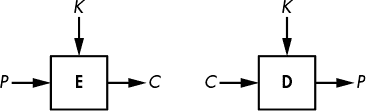
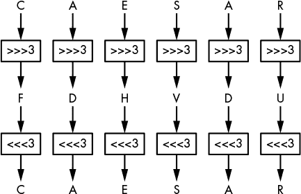
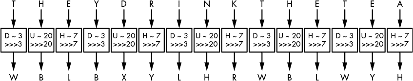
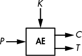
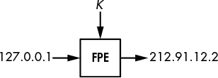
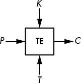

## 第二章：加密

加密是密码学的主要应用，它使数据变得无法理解，以确保其*机密性*。加密使用一种叫做*密码*的算法和一个叫做*密钥*的秘密值；如果你不知道秘密密钥，就无法解密，也无法知道任何加密消息中的信息——攻击者也是如此。

本章将重点讲解对称加密，它是最简单的加密方式。在*对称加密*中，解密所使用的密钥与加密所使用的密钥相同（与*非对称加密*或*公钥加密*不同，后者解密所使用的密钥与加密所使用的密钥不同）。你将从学习最弱的对称加密形式开始，这些经典密码只能抵御最没有技术基础的攻击者，然后逐步学习最强的加密形式，它们是永远安全的。

### 基础知识

当我们加密一条信息时，*明文*指的是未加密的信息，而*密文*指的是加密后的信息。因此，密码由两个功能组成：*加密*将明文转化为密文，*解密*将密文还原为明文。但我们通常会说“密码”，实际上是指“加密”。例如，图 1-1 展示了一个密码**E**，它被表示为一个框，输入明文*P*和密钥*K*，输出密文*C*。我会将这个关系写作*C* = **E**(*K*, *P*)。类似地，当密码处于解密模式时，我会写作**D**(*K*, *C*)。

*图 1-1：基本加密与解密*

**注意**

*对于某些密码，密文与明文大小相同；对于其他一些密码，密文稍微长一些。然而，密文永远不可能比明文短。*

### 经典密码

经典密码是指早于计算机的密码，因此它们操作的是字母而非比特。它们比现代密码（如 DES）简单得多——例如，在古罗马或第一次世界大战期间，你无法使用计算机芯片的强大算力来加密消息，因此只能用笔和纸完成所有工作。经典密码有很多种，但最著名的是凯撒密码和维吉尼亚密码。

#### *凯撒密码*

凯撒密码之所以得名，是因为罗马历史学家苏埃托尼乌斯报道了尤利乌斯·凯撒使用它。它通过将每个字母在字母表中向下移动三个位置来加密信息，当移位到 Z 时会回绕到 A。例如，ZOO 加密为 CRR，FDHVDU 解密为 CAESAR，依此类推，如图 1-2 所示。数字 3 并没有什么特别的意义，它只比 11 或 23 更容易在脑海中计算。

凯撒密码非常容易破解：要解密给定的密文，只需将字母向后移动三个位置，即可恢复明文。也就是说，凯撒密码在克拉苏斯和西塞罗时代可能足够强大。因为没有涉及秘密密钥（始终是 3），使用凯撒密码的人只需假设攻击者是文盲或者教育水平太低，无法破解密码——这一假设在今天显然不再现实。（事实上，2006 年，意大利警方在破译使用凯撒密码变体加密的纸条上的信息后逮捕了一名黑帮老大：例如，ABC 被加密为 456，而不是 DEF。）

*图 1-2：凯撒密码*

凯撒密码能否变得更加安全？你可以想象一个版本，使用一个秘密的偏移值，而不是始终使用 3，但这并不会有太大帮助，因为攻击者可以轻松地尝试所有 25 种可能的偏移值，直到解密出的消息有意义。

#### *维杰尼尔密码*

大约 1500 年后，凯撒密码才迎来了有意义的改进，即由意大利人乔凡·巴蒂斯塔·贝拉索（Giovan Battista Bellaso）在 16 世纪创造的维杰尼尔密码。“维杰尼尔”这个名字来源于法国人布莱兹·德·维杰尼尔（Blaise de Vigenère），他在 16 世纪发明了一种不同的密码，但由于历史上的误归功，维杰尼尔的名字被广泛使用。尽管如此，维杰尼尔密码变得非常流行，并且后来在美国内战期间被南方联邦军使用，第一次世界大战期间被瑞士军队等使用。

维杰尼尔密码与凯撒密码类似，不同之处在于字母不是按三个位置偏移，而是根据一个*密钥*的值来偏移，密钥是一个字母集合，根据字母在字母表中的位置表示数字。例如，如果密钥是 DUH，明文中的字母将使用 3、20、7 的值进行偏移，因为*D*距离*A*三个字母，*U*距离*A*二十个字母，*H*距离*A*七个字母。3、20、7 的模式将重复，直到你加密完整个明文。例如，单词 CRYPTO 使用 DUH 作为密钥加密后会变成 FLFSNV：*C*向后移动三位变成*F*，*R*向后移动二十位变成*L*，依此类推。图 1-3 展示了这一加密原理，使用密钥加密句子“THEY DRINK THE TEA”。

*图 1-3：维杰尼尔密码*

维吉尼亚密码显然比凯撒密码更安全，但它仍然相对容易破解。破解它的第一步是确定密钥的长度。例如，参考图 1-3，其中“THEY DRINK THE TEA”被加密为“WBLBXYLHRWBLWYH”使用密钥“DUH”。（通常会去掉空格以隐藏词边界。）注意到在密文“WBLBXYLHRWBLWYH”中，字母组“WBL”在密文中每隔九个字母就出现一次。这表明相同的三字母单词是使用相同的移位值加密的，每次都会产生“WBL”。密码分析员可以推测，密钥的长度要么是九，要么是九的倍数（即三）。此外，他们可能会猜测这个重复的三字母单词是“THE”，从而确定“DUH”是可能的加密密钥。

破解维吉尼亚密码的第二步是使用一种叫做*频率分析*的方法来确定实际的密钥，该方法利用语言中字母分布的不均匀性。例如，在英语中，*E*是最常见的字母，因此，如果你发现*X*是密文中最常见的字母，那么该位置上最可能的明文字母就是*E*。

尽管相对较弱，维吉尼亚密码在它被使用时可能足够安全地加密信息。首先，因为刚才提到的攻击方法需要至少几句话的信息，如果密码只用来加密简短的消息，这个方法就不适用。其次，大多数消息只需要在短时间内保持机密，因此即使密文最终被敌人解密，也没有太大关系。（19 世纪的密码学家奥古斯特·凯尔科夫估计，大多数加密的战时消息只需要保密三到四个小时。）

### 密码是如何工作的

基于像凯撒和维吉尼亚密码这样简单的密码，我们可以尝试抽象出密码的工作原理，首先通过识别它的两个主要组件：排列和操作模式。*排列*是一个函数，它将一个项（在密码学中是一个字母或一组比特）转换，使得每个项都有一个唯一的逆项（例如，凯撒密码的三字母移位）。*操作模式*是一个算法，它使用排列来处理任意大小的消息。凯撒密码的操作模式很简单：它只是对每个字母重复相同的排列，但正如你所见，维吉尼亚密码有一个更复杂的模式，其中不同位置的字母会经历不同的排列。

在接下来的章节中，我将更详细地讨论这些内容，以及它们如何与密码的安全性相关。我使用每个组件来展示为什么经典密码注定是不安全的，而现代密码则能在高速计算机上运行。

#### *排列*

大多数经典密码通过将每个字母替换为另一个字母来工作——换句话说，通过进行*替代*。在凯撒密码和维热内密码中，替代是字母表的移位，尽管字母表或符号集可以变化：例如，它可以是阿拉伯字母表；也可以是单词、数字或象形文字，而不仅仅是字母。信息的表示或编码是一个单独的问题，与安全性关系不大。（我们这里只考虑拉丁字母，因为经典密码使用的是这些字母。）

密码的替代不能只是任何替代。它应该是一个置换，即字母*A*到*Z*的重新排列，使得每个字母都有一个唯一的逆。例如，一个将字母*A*、*B*、*C*、*D*分别替换为*C*、*A*、*D*、*B*的替代是一个置换，因为每个字母都映射到另一个唯一的字母。但一个将*A*、*B*、*C*、*D*替换为*D*、*A*、*A*、*C*的替代就不是一个置换，因为*B*和*C*都映射到*A*。在置换中，每个字母只有一个逆。

然而，并不是每个置换都是安全的。为了确保安全，密码的置换应满足三个标准：

+   **置换应该由密钥决定**，这样只要密钥保密，置换也能保持保密。在维热内密码中，如果你不知道密钥，你就不知道使用了哪种 26 种置换；因此，你无法轻易解密。

+   **不同的密钥应产生不同的置换**。否则，它会变得更容易在没有密钥的情况下进行解密：如果不同的密钥产生相同的置换，这意味着不同的密钥比不同的置换少，因此在没有密钥的情况下解密时可尝试的可能性会更少。在维热内密码中，密钥中的每个字母决定了一个替换；有 26 个不同的字母，也有同样多的不同置换。

+   **置换应该看起来像是随机的**，简单来说。执行置换后，密文中不应有任何模式，因为模式会使得攻击者能够预测置换，从而降低其安全性。例如，维热内密码的替代是相当可预测的：如果你确定*A*加密成*F*，你可以推断出移位值是 5，并且你还会知道*B*加密成*G*，*C*加密成*H*，依此类推。然而，使用随机选择的置换，知道*A*加密成*F*只会告诉你*B*不会加密成*F*。

我们将满足这些标准的置换称为*安全置换*。但正如你接下来会看到的，安全置换是构建安全密码所必需的，但仅凭它还不足够。密码还需要一种操作模式，以支持任意长度的消息。

#### *操作模式*

假设我们有一个安全的置换，它将 *A* 转换为 *X*，将 *B* 转换为 *M*，将 *N* 转换为 *L*，例如。那么单词 BANANA 会被加密为 MXLXLX，其中每个 *A* 都被替换成 *X*。对明文中的所有字母使用相同的置换就会暴露出明文中的重复字母。通过分析这些重复字母，虽然你可能无法完全理解整个信息，但你可以了解到关于信息的*某些*内容。在 BANANA 示例中，你无需密钥就能猜到明文的三个 *X* 位置上是相同的字母，两个 *L* 位置上也有相同的字母。因此，假如你知道信息是一个水果的名字，你可以判断它是 BANANA 而不是 CHERRY、LYCHEE 或其他六个字母的水果。

密码的操作模式（或称为*模式*）通过对重复字母使用不同的置换，减少了明文中重复字母的暴露。维吉尼亚密码的模式部分解决了这个问题：如果密钥的长度是 *N* 字符，那么每 *N* 个连续字母将使用 *N* 个不同的置换。然而，这仍然可能导致密文中的模式，因为每 *N* 个字母使用相同的置换。这就是为什么频率分析能破译维吉尼亚密码的原因，正如你之前看到的。

频率分析可以被抵消，如果维吉尼亚密码只加密与密钥长度相同的明文。但即便如此，还有另一个问题：多次重复使用相同的密钥会暴露明文之间的相似性。例如，使用密钥 KYN，单词 TIE 和 PIE 会分别加密为 DGR 和 ZGR。两者都以相同的两个字母（*GR*）结尾，揭示了两个明文的最后两个字母是相同的。用安全的密码，这种发现不应该是可能的。

要构建一个安全的密码，你必须将一个安全的置换与一个安全的模式相结合。理想情况下，这种组合可以防止攻击者了解信息的任何内容，除了其长度之外。

#### *为什么经典密码不安全*

经典密码注定不安全，因为它们仅限于你可以在脑海中或在纸上完成的操作。它们缺乏计算机的计算能力，且很容易被简单的计算机程序破解。让我们来看看为什么这种简单性会在今天的世界中使它们不安全的根本原因。

记住，一个密码的置换应该看起来是随机的，以保证安全。当然，最好的“看起来”随机的方式就是*真正*随机——也就是说，从所有置换的集合中随机选择每一个置换。并且有很多置换可以选择。在 26 个字母的英语字母表中，约有 2⁸⁸ 种置换：

26! = 403291461126605635584000000 ≈ 2⁸⁸

这里，感叹号 (!) 是阶乘符号，定义如下：

*n*! = *n* × (*n* − 1) × (*n* – 2) × … × 3 × 2

（要理解为什么我们得到这个数字，可以将置换视为字母重新排序的列表进行计数：第一个字母有 26 种选择，第二个字母有 25 种选择，第三个字母有 24 种选择，依此类推。）这个数字非常庞大：它的数量级与人体内原子的数量级相当。但经典的密码只能使用这些置换的一个小部分——即那些只需要简单操作（如移位）并且具有简短描述（如短算法或小型查找表）的置换。问题在于，一个安全的置换无法同时满足这两种限制。

你可以通过简单的操作来获得安全的置换，方法是选择一个随机的置换，将其表示为一个包含 25 个字母的表格（足够表示 26 个字母的置换，缺少第 26 个字母），然后通过查找该表格中的字母来应用它。但这样做就没有一个简短的描述。例如，描述 10 种不同置换需要 250 个字母，而不仅仅是维吉尼亚密码中使用的 10 个字母。

你还可以使用简短的描述生成安全的置换。你可以不只是对字母表进行简单的移位，而是使用更复杂的操作，例如加法、乘法等。这就是现代密码学的工作原理：给定一个通常为 128 或 256 位的密钥，它们执行数百次比特操作来加密单个字母。在每秒能执行数十亿次比特操作的计算机上，这个过程非常迅速，但如果手动进行，则需要数小时，而且仍然容易受到频率分析的攻击。

### 完美加密：一次性密码本

从本质上讲，经典的密码学方法如果没有一个巨大的密钥，是无法保证安全的，但用一个巨大的密钥进行加密是不切实际的。然而，一次性密码本就是这样一种密码，它是最安全的密码。事实上，它保证了*完美的保密性*：即使攻击者拥有无限的计算能力，也不可能通过密文得知明文的任何信息，除了它的长度。

在接下来的章节中，我将向你展示一次性密码本是如何工作的，并提供其安全性证明的概述。

#### *使用一次性密码本进行加密*

一次性密码本将明文 *P* 和与 *P* 长度相同的随机密钥 *K* 作为输入，生成密文 *C*，定义为

*C* = *P* ⊕ *K*

其中 *C*、*P* 和 *K* 是相同长度的比特串，而 ⊕ 是按位异或操作（XOR），定义为 0 ⊕ 0 = 0, 0 ⊕ 1 = 1, 1 ⊕ 0 = 1, 1 ⊕ 1 = 0。

**注意**

*我正在以通常的形式展示一次性密码本，即按比特工作，但它也可以适配到其他符号上。例如，对于字母，你将得到一种变体的凯撒密码，其中每个字母的移位索引是随机选择的。*

一次性密码本的解密与加密相同；它只是一个异或操作：*P* = *C* ⊕ *K*。事实上，我们可以验证 *C* ⊕ *K* = *P* ⊕ *K* ⊕ *K* = *P*，因为将 *K* 与自身进行异或操作会得到全零字符串 000 … 000。就是这样——比凯撒密码还简单。

例如，如果*P* = 01101101 且*K* = 10110100，则我们可以计算出以下内容：

*C* = *P* ⊕ *K* = 01101101 ⊕ 10110100 = 11011001

解密过程通过计算以下内容来恢复*P*：

*P* = *C* ⊕ *K* = 11011001 ⊕ 10110100 = 01101101

重要的是，一次性密码本只能使用*一次*：每个密钥*K*应该只使用一次。如果同一个*K*被用来加密*P*[1]和*P*[2]，从而生成*C*[1]和*C*[2]，那么窃听者可以计算出以下内容：

*C*[1] ⊕ *C*[2] = (*P*[1] ⊕ *K*) ⊕ (*P*[2] ⊕ *K*) = *P*[1] ⊕ *P*[2] ⊕ *K* ⊕ *K* = *P*[1] ⊕ *P*[2]

因此，窃听者将会得知*P*[1]和*P*[2]之间的异或差异，而这应该是保密的信息。此外，如果其中一个明文消息已知，则可以恢复另一个消息。

当然，一次性密码本在使用上极为不便，因为它要求密钥与明文一样长，并且每条新消息或每组数据都需要一个新的随机密钥。要加密一个一 TB 的硬盘，你还需要另一个一 TB 的硬盘来存储密钥！尽管如此，一次性密码本在历史上确实被使用过。例如，二战期间，英国特别行动处、KGB 间谍、NSA 都使用过一次性密码本，至今在某些特定的场景下仍然使用。（我听说过一些瑞士银行家，由于无法就双方都信任的密码达成一致，最终使用了一次性密码本，但我不推荐这么做。）

#### *为什么一次性密码本是安全的？*

尽管一次性密码本并不实用，但理解其安全性原理仍然很重要。在 1940 年代，美国数学家克劳德·香农证明了一次性密码本的密钥必须至少与消息一样长，才能实现完美的保密性。该证明的思路相当简单。你假设攻击者拥有无限的计算能力，因此可以尝试所有的密钥。目标是加密使得攻击者在给定某些密文的情况下，无法排除任何可能的明文。

一次性密码本的完美保密性的直觉可以这样理解：如果*K*是随机的，那么对攻击者来说，得到的*C*看起来和*K*一样随机，因为随机字符串与任何固定字符串进行异或运算得到的结果是随机的。为了验证这一点，考虑一下得到随机字符串的第一个比特为 0 的概率（即 1/2 的概率）。那么一个随机比特与第二个比特进行异或得到 0 的概率是多少？对，还是 1/2。相同的推理可以对任意长度的比特字符串进行迭代。因此，密文*C*对于一个不知道*K*的攻击者来说看起来是随机的，所以即使攻击者拥有无限的时间和能力，也不可能从*C*中了解任何关于*P*的信息。换句话说，知道密文不会提供任何关于明文的信息，除了它的长度——这几乎就是安全密码的定义。

例如，如果密文是 128 位长（意味着明文也是 128 位），那么有 2¹²⁸种可能的密文；因此，从攻击者的角度来看，应该有 2¹²⁸种可能的明文。但如果可能的密钥少于 2¹²⁸，攻击者就可以排除一些明文。如果密钥只有 64 位，例如，攻击者可以确定 2⁶⁴种可能的明文并排除掉绝大多数 128 位的字符串。攻击者虽然无法知道明文是什么，但他们可以知道明文不是什么，这使得加密的保密性不完美。

正如你所看到的，要实现完美的安全性，你必须拥有与明文长度相等的密钥，但这对于实际应用来说很快就变得不切实际。接下来，我将讨论现代加密中为实现既可能又实用的最佳安全性所采取的方法。

密码学中的概率

*概率*是一个数字，用来表示某个事件发生的可能性或机会。它的值在 0 和 1 之间，其中 0 表示“永不发生”，而 1 表示“总是发生”。概率越高，机会越大。你会看到很多关于概率的解释，通常是用袋子里的白球和红球，以及抽取任意颜色球的概率来描述。

密码学通常使用概率来衡量攻击成功的机会，方法是：1) 计算成功事件的数量（例如，事件“找到唯一正确的秘密密钥”）；2) 计算所有可能事件的总数（例如，如果我们使用*n*位密钥，则所有可能的密钥总数为 2^(*n*)）。在这个例子中，随机选择一个密钥是正确的概率为 1/2^(*n*)，即成功事件的数量（1 个秘密密钥）与所有可能事件的数量（2^(*n*)个可能密钥）之比。对于常见的密钥长度如 128 位和 256 位来说，1/2^(*n*)的数字非常小，可以忽略不计。

如果事件的概率是*p*，那么该事件*不发生*的概率为 1 – *p*。因此，在我们之前的例子中，得到错误密钥的概率是 1 – 1/2^(*n*)，这是一个非常接近 1 的数字，意味着几乎确定。

### 加密安全

你已经知道经典的加密算法并不安全，而像一次性密码本这样的完全安全的加密算法则不实际。因此，如果我们想要既安全又可用的加密算法，就不得不在安全性上做一些妥协。但是，“安全”到底意味着什么呢？除了显而易见且非正式的“窃听者无法解密安全信息”之外，还有什么含义？

直观来说，如果即使在拥有大量明文–密文对的情况下，*也无法得出任何关于密码行为的信息*，那么该密码就是安全的。这引出了新的问题：

+   攻击者是如何获得这些对的？什么算是“大量”？这一切都由*攻击模型*来定义，即关于攻击者能够做什么和不能做什么的假设。

+   我们讨论的“学习内容”和“密码行为”是什么？这是由*安全目标*定义的，描述了什么是成功的攻击。

攻击模型和安全目标必须结合在一起；你不能在没有解释对谁或从什么方面安全的情况下声称系统是安全的。*安全概念*因此是某个安全目标与某个攻击模型的结合。如果在给定的模型中，任何攻击者都无法达到安全目标，我们就说一个密码*实现了*某种安全概念。

#### *攻击模型*

攻击模型是一组关于攻击者如何与密码交互以及他们能做什么和不能做什么的假设。攻击模型的目标如下：

+   为设计密码的密码学家设定要求，使他们知道需要防范哪些攻击者和哪些类型的攻击。

+   为用户提供指导，帮助他们判断密码在其环境中是否安全可用。

+   为试图破解密码的密码分析人员提供线索，让他们知道某个攻击是否有效。只有当某个攻击在考虑的模型中是可行的，才能称之为有效攻击。

攻击模型不需要完全符合现实；它们是近似的。正如统计学家乔治·E·P·博克斯所说：“所有模型都是错误的；实际的问题是它们必须错误到什么程度才不再有用。” 在密码学中，为了有用，攻击模型至少应涵盖攻击者能够做的事情来攻击密码。如果一个模型高估了攻击者的能力，那是可以接受的，也是件好事，因为它有助于预测未来的攻击技术——只有偏执的密码学家才能生存。一个不好的模型低估了攻击者的能力，通过让密码在理论上看似安全，实则在现实中并不安全，从而提供了错误的信心。

##### 克尔霍夫原则

所有模型中都做出一个假设，即所谓的*克尔霍夫原则*，该原则指出，密码的安全性应仅依赖于密钥的保密性，而不依赖于密码本身的保密性。今天，这听起来可能很显然，因为密码和协议都是公开指定并被大家使用的。但是从历史上看，荷兰语言学家奥古斯特·克尔霍夫指的是专为某个军队或军区设计的军事加密机器。引用他在 1883 年发表的《军事密码学》一文中的话，其中列出了军事加密系统的六项要求：“系统不应要求保密，并且可以被敌人窃取而不会造成问题。”

##### 黑盒模型

现在让我们考虑一些有用的攻击模型，这些模型通过攻击者能观察到的内容和他们能对密码做出的查询来表达。对于我们的目的，*查询*是指将输入值传送给某个函数并返回输出的操作，而不暴露该函数的细节。

举个例子，一个*加密查询*接受明文并返回相应的密文，而不泄露密钥。

我们称这些模型为*黑盒模型*，因为攻击者只能看到加密过程的输入和输出。例如，一些智能卡芯片安全地保护加密器的内部结构以及其密钥，但你可以连接到芯片并请求它解密任何密文。攻击者随后会收到相应的明文，这可能帮助他们确定密钥。这是一个现实的例子，其中*解密查询*是可能的。

有几种不同的黑盒攻击模型。在这里，我按从最弱到最强的顺序列出了它们，并描述了每种模型中攻击者的能力：

+   *密文-only 攻击者（COA）* 观察密文，但不知道关联的明文，也不知道这些明文是如何被选择的。COA 模型中的攻击者是被动的，不能执行加密或解密查询。

+   *已知明文攻击者（KPA）* 观察密文并知道关联的明文。KPA 模型中的攻击者因此得到明文-密文对的列表，假设明文是随机选择的。再一次，KPA 是一个被动攻击者模型。

+   *选择明文攻击者（CPA）* 可以对自己选择的明文进行加密查询，并观察结果的密文。这个模型描述了攻击者可以选择全部或部分被加密的明文，并查看相应的密文的情形。与 COA 或 KPA 这种被动模型不同，CPA 是*主动*攻击者，因为他们影响加密过程，而不是被动地窃听。

+   *选择密文攻击者（CCA）* 可以同时执行加密和解密；也就是说，他们能够执行加密查询和解密查询。CCA 模型一开始可能听起来很荒谬——如果你能解密，还需要什么？——但和 CPA 模型一样，它旨在表示攻击者可以对密文产生一定影响并后来获得明文的情形。而且，解密某个内容并不总是足够打破一个系统。例如，一些视频保护设备允许攻击者使用设备的芯片执行加密查询和解密查询，但在这种情况下，攻击者关注的是密钥以便重新分发；在这种情况下，能够“免费”解密并不足以破坏系统。

在前述模型中，观察到并查询的密文并不是免费的。每个密文都来自加密函数的计算。这意味着，通过加密查询生成 2^(*n*)明文-密文对所需的计算量大致等同于尝试 2^(*n*)个密钥的计算量。例如，在计算攻击成本时，应考虑查询的成本。

##### 灰盒模型

在*灰盒模型*中，攻击者可以访问密码的*实现*。这使得灰盒模型比黑盒模型更符合实际应用，例如智能卡、嵌入式系统和虚拟化系统，因为攻击者通常可以物理接触这些系统，从而篡改算法的内部结构。与此同时，灰盒模型比黑盒模型更难定义，因为它们依赖于物理和模拟属性，而不仅仅是算法的输入和输出，密码理论往往无法抽象出现实世界的复杂性。

*侧信道攻击*是一类存在于灰盒模型中的攻击。侧信道是一个依赖于密码实现的、无论是软件还是硬件，的信息源。侧信道攻击者观察或测量密码实现的模拟特征，但不会改变其完整性；他们是*非侵入性的*。对于纯软件实现，典型的侧信道包括执行时间和围绕密码的系统行为，如错误消息、返回值、分支等。例如，在智能卡的实现中，典型的侧信道攻击者会测量功耗、电磁辐射或声学噪声。

*侵入性* *攻击*是一类比侧信道攻击更强大的攻击方式，并且更为昂贵，因为它们需要复杂的设备。你可以使用标准 PC 和市场上的示波器进行基本的侧信道攻击，但侵入性攻击则需要诸如高分辨率显微镜和化学实验室之类的工具。因此，侵入性攻击包括一整套技术和程序，从使用硝酸去除芯片包装到显微成像获取、部分逆向工程以及可能通过激光故障注入等方式修改芯片行为。

#### *安全目标*

我非正式地将安全目标定义为“无法从密码的行为中学到任何东西。”为了将这个想法转化为严格的数学定义，密码学家定义了两个主要的安全目标，分别对应于对“了解密码行为”的不同理解：

**不可区分性（IND）** 密文应当与随机字符串不可区分。通常通过以下假设游戏来说明这一点：如果攻击者选择了两个明文，然后随机收到其中一个明文加密后的密文，他们不应能判断出哪个明文被加密，即使通过使用这两个明文进行加密查询（如果模型是 CCA 而非 CPA，还可以进行解密查询）。

**不可篡改性 (NM)** 给定密文*C*[1] = **E**(*K*, *P*[1])，应该不可能创建另一个密文*C*[2]，其对应的明文*P*[2]与*P*[1]在某种意义上相关（例如，创建一个*P*[2]，使得*P*[2] = *P*[1] ⊕ 1，或者*P*[2] = *P*[1] ⊕ *X*，其中*X*是某个已知的值）。令人惊讶的是，一次性密码本是可篡改的：给定密文*C*[1] = *P*[1] ⊕ *K*，你可以定义*C*[2] = *C*[1] ⊕ 1，这实际上是密文*P*[2] = *P*[1] ⊕ 1 在相同密钥*K*下的有效密文。哎呀，这就是我们完美密码的缺陷。

接下来，我将讨论在不同攻击模型下的安全目标。

#### *安全概念*

安全目标只有与攻击模型结合使用时才有意义。约定是将安全概念写作*目标*-*模型*。例如，IND-CPA 表示对选择明文攻击者的不可区分性，NM-CCA 表示对选择密文攻击者的不可篡改性，等等。让我们从攻击者的安全目标开始。

##### 语义安全和随机加密：IND-CPA

最重要的安全概念是 IND-CPA，也叫做*语义* *安全性*。它传达的直觉是，只要密钥保密，密文不应泄露任何关于明文的信息。为了实现 IND-CPA 安全性，加密必须在对同一明文进行两次加密时返回不同的密文；否则，攻击者可能会通过密文识别重复的明文，从而与密文不应泄露任何信息的定义相矛盾。

实现 IND-CPA 安全性的一种方法是使用*随机加密*。顾名思义，它使加密过程具有随机性，并在对同一明文进行两次加密时返回不同的密文。加密可以表示为*C* = **E**(*K*, *R*, *P*)，其中*R*是新生成的随机位。然而，解密仍然是确定性的，因为给定**E**(*K*, *R*, *P*)，无论*R*的值是什么，你都应该始终得到*P*。

如果加密不是随机的呢？在《安全目标》中引入的 IND 游戏中，攻击者选择两个明文，*P*[1]和*P*[2]，并收到其中一个的密文，但不知道密文对应的是哪个明文。也就是说，他们得到*C*[*i*] = **E**(*K*, *P*[*i*])，并且必须猜测*i*是 1 还是 2。在 CPA 模型中，攻击者可以执行加密查询，确定*C*[1] = **E**(*K*, *P*[1])和*C*[2] = **E**(*K*, *P*[2])。如果加密不是随机的，攻击者只需查看*C*[*i*]是否等于*C*[1]或*C*[2]，即可判断加密的是哪个明文，从而赢得 IND 游戏。因此，随机化是 IND-CPA 概念的关键。

**注意**

*对于随机加密，密文必须比明文稍长，以便每个明文有多个可能的密文。例如，如果每个明文有 2⁶⁴ 个可能的密文，那么密文必须至少比明文长 64 位。*

##### 实现语义安全加密

一种最简单的语义安全密码构造方法使用了 *确定性随机位生成器（DRBG）*，这是一种根据某些秘密值返回看似随机位的算法：

*E*(*K*, *R*, *P*) = (**DRBG**(*K* || *R*) ⊕ *P*, *R*)

在这里，*R* 是为每个新加密随机选择的字符串，并与密钥一起提供给 DRBG（*K* || *R* 表示由 *K* 和 *R* 组成的字符串）。这种方法让人联想到一次性密码本：我们不是选择一个与消息长度相同的随机密钥，而是利用随机位生成器来获得一个看似随机的字符串。

证明该密码是 IND-CPA 安全的过程很简单，前提是我们假设 DRBG 生成的是随机位。这个证明采用反证法：如果你能区分密文和随机字符串，也就是说，你能区分 **DRBG**(*K* || *R*) ⊕ *P* 与随机字符串的区别，那么这就意味着你能区分 **DRBG**(*K* || *R*) 与随机字符串的区别。记住，CPA 模型允许你获取选择的 *P* 值对应的密文，所以你可以将 *P* 与 **DRBG**(*K*, *R*) ⊕ *P* 做异或运算，得到 **DRBG**(*K*, *R*)。但是现在我们遇到矛盾，因为我们一开始假设 **DRBG**(*K*, *R*) 无法与随机字符串区分开来，从而生成随机字符串。所以我们得出结论，密文无法与随机字符串区分开来，因此该密码是安全的。

**注意**

*作为练习，试着确定上述密码 **E**(*K*, *R*, *P*) = (***DRBG**(*K* || *R*) ⊕ *P*, *R*) 满足哪些其他安全概念。*它是 NM-CPA 吗？是 IND-CCA 吗？你将在下一节中找到答案。*

##### 比较安全概念

你已经了解到，攻击模型如 CPA 和 CCA 与安全目标如 NM 和 IND 结合，构建了安全概念 NM-CPA、NM-CCA、IND-CPA 和 IND-CCA。这些概念是如何关联的？我们能否证明满足概念 X 就意味着满足概念 Y？

一些关系是显而易见的：IND-CCA 蕴含 IND-CPA，NM-CCA 蕴含 NM-CPA，因为 CPA 攻击者能做的事情，CCA 攻击者也能做。也就是说，如果你不能通过执行选择密文和选择明文查询来破解一个密码，那么你也不能仅通过执行选择明文查询来破解它。

一个不太显而易见的关系是，IND-CPA 并不蕴含 NM-CPA。为了理解这一点，可以观察到之前的 IND-CPA 构造（**DRBG**(*K* || *R*) ⊕ *P*, *R*）并不是 NM-CPA：给定一个密文 (*X*, *R*)，你可以创建密文 (*X* ⊕ 1, *R*)，这就是 *P* ⊕ 1 的有效密文，从而与不可篡改性的概念相矛盾。

但是，相反的关系是成立的：NM-CPA 蕴含 IND-CPA。直觉上，IND-CPA 加密就像把物品放进一个袋子里：你看不见它们，但可以通过上下摇动袋子来重新排列它们的位置。NM-CPA 更像一个保险箱：一旦放入，你就无法与里面的物品互动。但这种类比不适用于 IND-CCA 和 NM-CCA，它们是等价的概念，每个都蕴含另一个。我就不赘述证明过程了，那个非常技术性。

两种类型的加密应用

加密应用有两种主要类型。*传输中*加密保护从一台机器发送到另一台机器的数据：数据在发送之前被加密，接收之后被解密，就像电子商务网站的加密连接。*静态加密*保护存储在信息系统中的数据。数据在写入内存之前被加密，在读取之前被解密。例子包括笔记本电脑上的磁盘加密系统，以及云虚拟实例的虚拟机加密。我们看到的安全概念适用于这两种类型的应用，但需要考虑的正确概念可能取决于具体应用。

### 非对称加密

到目前为止，我们只考虑了对称加密，其中两个方共享一个密钥。在*非对称加密*中，有两个密钥：一个用于加密，另一个用于解密。加密密钥称为*公钥*，通常被认为是公开的，任何想给你发送加密消息的人都可以使用。解密密钥必须保持秘密，称为*私钥*。

公钥可以从私钥中计算得出，但显然私钥不能从公钥中计算得出。换句话说，计算方向是单向的，容易计算，但反向计算几乎是不可能的——这就是*公钥加密学*的关键，其函数在一个方向上易于计算，但几乎无法逆向计算。

非对称加密的攻击模型和安全目标与对称加密差不多，只不过由于加密密钥是公开的，任何攻击者都可以使用公开密钥进行加密查询。因此，非对称加密的默认模型是选择明文攻击者（CPA）。

对称加密和非对称加密是两种主要的加密方式，通常结合使用来构建安全通信系统。它们也用作更复杂方案的基础，正如你接下来会看到的。

### 当密码学做的不仅仅是加密

基本加密将明文转化为密文，将密文转化为明文，唯一的要求是安全性。然而，一些应用往往需要更多的东西，不论是额外的安全特性还是额外的功能。因此，加密学家们创建了对称加密和非对称加密的变体。某些变体已被广泛理解、高效且广泛应用，而其他一些则是实验性的，使用很少，且性能较差。

#### *认证加密*

*认证加密（AE）*是一种对称加密方式，它返回一个*认证标签*，除了密文之外。图 1-4 展示了认证加密集 **AE**(*K*, *P*) = (*C*, *T*)，其中认证标签*T*是一个短字符串，只有拥有密钥的人才能猜测出来。解密过程需要*K*、*C*和*T*，并且只有在验证*T*是该明文-密文对的有效标签时，才会返回明文*P*；否则，它会中止并返回错误。

*图 1-4：认证加密*

该标签确保消息的*完整性*，并作为证据证明接收到的密文与最初由知道密钥*K*的合法方发送的密文完全相同。当*K*仅与另一个方共享时，该标签还保证消息是由该方发送的；即，它隐式地*验证*了预期的发送者作为消息的实际创建者。

**注意**

*我在这里使用“创建者”而非“发送者”，因为窃听者可以记录一些由 A 方发送给 B 方的(C, T)对，并且再将它们发送给 B 方，假装是 A 方发送的。这被称为重放攻击，可以通过在消息中包含一个计数器数字来防止。例如，当消息被解密时，其计数器*i*会增加 1：i + 1。*通过这种方式，可以检查计数器，查看消息是否已被发送两次，从而表明攻击者正在通过重新发送消息进行重放攻击。这也可以检测丢失的消息。*

*认证加密* *与附加数据（AEAD）*是认证加密的扩展，它采用一些明文和未加密的数据，并利用这些数据生成认证标签**AEAD**(*K*, *P*, *A*) = (*C*, *T*)。AEAD 的一个典型应用是保护协议的数据报，其中包含一个明文头部和一个加密负载。在这种情况下，至少有一些头部数据必须保持明文；例如，目标地址需要保持明文，以便路由网络数据包。

要了解更多关于认证加密的信息，请跳转到第八章。

#### *格式保留加密*

基本的密码算法处理比特并返回比特；它不关心比特表示的是文本、图像还是 PDF 文档。密文可以进一步编码为原始字节、十六进制字符、base64 等格式。但如果需要密文与明文具有相同格式呢？例如，一些数据库系统要求数据只能以预定格式记录，那么该如何处理？

*格式保留加密（FPE）*解决了这个问题。它可以创建与明文具有相同格式的密文。例如，FPE 可以将 IP 地址加密为 IP 地址（如图 1-5 所示），将邮政编码加密为邮政编码，将信用卡号码加密为带有效校验和的信用卡号码，等等。

*图 1-5：IP 地址的格式保留加密*

#### *完全同态加密*

*完全同态加密（FHE）*是密码学家的圣杯：它使得用户能够将密文*C* = **E**(*K*, *P*)替换为另一个密文*C*′ = **E**(*K*, **F**(*P*))，其中**F**(*P*)可以是*P*的任何函数，而无需解密初始密文*C*。例如，*P*可以是一个文本文件，**F**可以是对部分文本的修改。你可以想象一个云应用程序，它存储你的加密数据，而云服务提供商既不知道数据是什么，也不知道你更改数据时做了什么类型的更改。听起来是不是很神奇？

但也有一面：这种加密类型非常慢——慢到即使是最基本的操作也会耗费不可接受的时间。第一个 FHE 方案诞生于 2009 年，从那时起出现了更高效的变体，但目前尚不清楚 FHE 是否能快到足以实际应用。

#### *可搜索加密*

*可搜索加密*通过对搜索查询本身进行加密，使得可以在加密数据库上进行搜索而不会泄露搜索的内容。像完全同态加密一样，可搜索加密能够通过隐藏搜索内容来增强许多基于云的应用程序的隐私，防止云服务提供商窥探你的搜索内容。一些商业解决方案声称提供可搜索加密，尽管它们大多基于标准加密技术，并通过一些技巧实现部分可搜索性。然而，截至目前，可搜索加密在研究社区仍然处于实验阶段。

#### *可调加密*

*可调加密（TE）*类似于基础加密，只不过增加了一个叫做*调整值*的附加参数，它旨在模拟密码的不同版本（见图 1-6）。调整值可能是一个独特的每个客户的值，以确保客户的加密算法无法被其他使用相同产品的方克隆，但 TE 的主要应用是*磁盘加密*。然而，TE 并不局限于单一应用，它是一种低级别的加密类型，可用于构建其他方案，如认证加密模式。

*图 1-6：可调加密*

在磁盘加密中，TE 加密存储设备的内容，如硬盘或固态硬盘。（由于随机化加密会增加数据的大小，这对于存储介质上的文件来说是不可接受的，因此无法使用随机化加密。）为了使加密不可预测，TE 使用一个取决于加密数据位置的调整值，通常是扇区号或块索引。

### 错误的可能性

加密算法或其实现可能以多种方式未能保护机密性。这可能是因为未能匹配安全要求（例如“符合 IND-CPA 安全”），或未设定与现实相匹配的要求（如果你只针对 IND-CPA 安全，而攻击者实际上可以执行选择密文查询）。可悲的是，许多工程师甚至没有考虑加密安全要求，只想要“安全”，却不理解这到底意味着什么。通常，这种做法注定会带来灾难。让我们来看两个例子。

#### *弱密码*

我们的第一个例子涉及使用密码分析技术可以被攻击的密码，就像 2G 移动通信标准的情况一样。2G 手机中的加密使用了一种名为 A5/1 的密码，结果比预期的弱，使得任何拥有正确技能和工具的人都能拦截通话。电信运营商不得不寻找解决方法来防止这种攻击。

**注意**

*2G 标准还定义了 A5/2，这是一个用于欧盟和美国以外地区的密码。A5/2 故意被设计得较弱，以防止在任何地方使用强加密。*

话虽如此，攻击 A5/1 并不简单，研究人员花费了超过 10 年的时间才提出了一种有效的密码分析方法。此外，这种攻击是一种*时间-内存权衡（TMTO）*，即首先进行数天或数周的计算以构建大型查找表，然后这些表被用于实际的攻击。对于 A5/1，预计算的表格大小超过 1TB。后来的移动加密标准，如 3G 和 LTE，指定了更强的密码，但这并不意味着它们的加密不会被攻破；而是意味着加密不会通过破解系统中的对称密码来被攻破。

#### *错误模型*

下一个例子涉及一个忽视某些侧信道的无效攻击模型。

使用加密的许多通信协议确保它们使用在 CPA 或 CCA 模型中被认为安全的密码。然而，一些攻击并不需要加密查询，如在 CPA 模型中，也不需要解密查询，如在 CCA 模型中。它们只需要*有效性查询*来判断一个密文是否有效，这些查询通常发送到负责解密密文的系统。*填充 Oracle 攻击*就是这类攻击的一个例子，在这种攻击中，攻击者通过观察密文是否符合要求的格式来获取信息。

具体来说，在填充 Oracle 攻击中，只有当密文的明文具有正确的*填充*时，密文才是有效的，填充是附加到明文的字节序列，以简化加密。如果填充不正确，解密将失败，攻击者通常能检测到解密失败并尝试利用它们。例如，Java 异常`javax.crypto.BadPaddingException`的出现将表明观察到了错误的填充。

2010 年，研究人员在多个 Web 应用服务器中发现了填充 Oracle 攻击。这些有效性查询通过向某个系统发送密文并观察它是否抛出错误来进行。通过这些查询，他们可以解密原本安全的密文，而无需知道密钥。

密码学家通常忽视像填充 Oracle 攻击这样的攻击，因为它们通常依赖于应用程序的行为以及用户与应用程序的交互方式。但是，如果你没有预见到这些攻击，并且在设计和部署加密时没有将它们纳入模型，你可能会遇到一些令人吃惊的麻烦。

### 进一步阅读

本书中我们详细讨论了加密及其多种形式，尤其是现代安全密码的工作原理。不过，我们无法涵盖所有内容，许多有趣的主题将不会讨论。例如，要学习加密的理论基础并深入理解不可区分性（IND）的概念，你应该阅读 1982 年由 Goldwasser 和 Micali 提出的关于语义安全的论文《概率加密及如何在保持所有部分信息秘密的情况下玩心理扑克》。如果你对物理攻击和密码硬件感兴趣，CHES 会议的论文集是主要参考资料。

还有许多其他类型的加密方法，远超本章所介绍的，包括基于属性的加密、广播加密、功能加密、基于身份的加密、消息锁定加密和代理重加密等。关于这些主题的最新研究，你可以查看*[`eprint.iacr.org/`](https://eprint.iacr.org/)*，这是一个密码学研究论文的电子档案。
