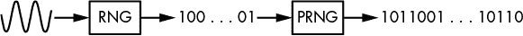

## 第三章：随机性


随机性在密码学中无处不在：在生成秘密密钥、加密方案，甚至在密码系统的攻击中。没有随机性，密码学将无法进行，因为所有操作都将变得可预测，因此不安全。

本章将介绍密码学中随机性的概念及其应用。我们讨论伪随机数生成器以及操作系统如何产生可靠的随机性，并通过实际例子展示有缺陷的随机性如何影响安全性。

### 随机还是非随机？

你可能已经听过“随机位”这个词，但严格来说，并没有所谓的“随机位”序列。真正随机的是产生随机位序列的算法或过程；因此，当我们说“随机位”时，实际上指的是随机生成的位。

随机位是什么样子的？例如，对于大多数人来说，8 位字符串 11010110 比 00000000 更具随机性，尽管它们生成的机会是相同的（即 1/256）。11010110 看起来更随机，是因为它具有典型的随机生成值的特征。也就是说，11010110 没有明显的模式。

当我们看到字符串 11010110 时，大脑会注册到它的零（3 个）和一（5 个）的数量大致相同，就像其他 55 个 8 位字符串（11111000、11110100、11110010 等），但只有一个 8 位字符串是全零的。因为模式“三个零和五个一”比“八个零”的模式更可能出现，我们将 11010110 识别为随机，而将 00000000 识别为非随机。如果一个程序生成了 11010110，你可能认为它是随机的，即使它并不随机。相反，如果一个随机程序生成了 00000000，你可能会怀疑它是不是随机的。

这个例子展示了人们在识别随机性时常犯的两种错误：

**把非随机性误认为是随机性** 认为某个对象是随机生成的，仅仅因为它*看起来*是随机的。

**把随机性误认为是非随机性** 认为偶然出现的模式是出于其他原因，而非偶然。

随机看起来与真正随机之间的区别至关重要。事实上，在密码学中，非随机性通常意味着不安全。

### 随机性作为概率分布

任何随机化过程都由*概率分布*来表征，概率分布提供了关于该过程随机性的所有信息。概率分布，或者简而言之分布，列出了随机化过程的结果，其中每个结果都被分配一个*概率*。

概率衡量一个事件发生的可能性。它表示为介于 0 和 1 之间的实数，其中概率为 0 表示不可能，概率为 1 表示确定。例如，当抛一枚双面硬币时，每一面朝上的概率为 1/2，我们通常假设硬币落在边缘的概率为零。

概率分布必须包括所有可能的结果，以使所有概率的总和为 1。具体来说，如果有 *N* 个可能的事件，那么有 *N* 个概率 *p*[1]，*p*[2]，…，*p*[*N*]，并且 *p*[1] + *p*[2] + … + *p*[*N*] = 1。例如，在抛硬币的情况下，正面和反面的分布分别是 1/2 和 1/2。两个概率的总和为 1/2 + 1/2 = 1，因为硬币会落在两个面之一。

*均匀分布*发生在分布中的所有概率相等时，这意味着所有结果发生的可能性相等。如果有 *N* 个事件，那么每个事件的概率为 1/*N*。例如，如果一个 128 位的密钥是均匀随机选择的——即根据均匀分布——那么所有 2¹²⁸ 个可能的密钥的概率应该是 1/2¹²⁸。

相反，当分布是 *非均匀* 时，概率并不相等。例如，一次具有非均匀分布的硬币抛掷可能会以 1/4 的概率出现正面，3/4 的概率出现反面。

### 熵：不确定性的度量

*熵*是衡量系统中不确定性或无序度的指标。你可以将熵看作是随机过程结果中的惊讶程度：熵越高，结果的不确定性越大。

我们可以计算概率分布的熵。如果你的分布包含概率 *p*[1]，*p*[2]，…，*p*[*N*]，那么它的熵是所有概率与它们的对数相乘的负和，如下所示：

−*p*[1] × log(*p*[1]) − *p*[2] × log(*p*[2]) − … − *p[N]* × log(*p[N]*)

这里的函数 *log* 是 *二进制对数*，即以二为底的对数。与自然对数不同，二进制对数以位为单位表示信息，并且当概率是二的幂时，它会返回整数值。例如，log(1/2) = -1，log(1/4) = -2，更一般地，log(1/2^(*n*)) = - *n*。（这就是为什么我们实际取 *负和*，以得到一个正数。）因此，使用均匀分布生成的随机 128 位密钥的熵为：

2¹²⁸ × (−2^(−128) × log(2^(−128))) = −log(2^(−128)) = 128 位

如果你将 128 替换为任意整数 *n*，你会发现均匀分布的 *n* 位字符串的熵为 *n* 位。

当分布是均匀时，熵最大，因为均匀分布最大化了不确定性：没有结果比其他结果更有可能发生。因此，*n* 位值的熵不能超过 *n* 位。

同样地，当分布不均匀时，熵就较低。考虑硬币抛掷的例子。公平抛掷的熵是如下：

−(1/2) × log (1/2) − (1/2) × log (1/2) = 1/2 + 1/2 = 1 bit

如果硬币的一面比另一面更可能朝上怎么办？比如正面朝上的概率是 1/4，反面朝上的概率是 3/4（记住所有概率的总和应该为 1）。

这种偏向的抛掷的熵为：

−(3/4) × log(3/4) − (1/4) × log(1/4) ≈ −(3/4) × (−0.415) − (1/4) × (−2) ≈ 0.81 bit

0.81 比公平抛掷的 1 位熵要少，这告诉我们硬币越偏，分布越不均匀，熵越低。进一步说，如果正面的概率是 1/10，那么熵为 0.469；如果概率降至 1/100，熵降至 0.081。

**注意**

*熵也可以视为信息的度量。例如，公平抛硬币的结果给你正好一位信息——正面或反面——你无法预先预测抛掷结果。在不公平的硬币抛掷中，你提前知道反面更可能出现，因此你通常可以预测抛掷的结果。硬币抛掷的结果提供了预测结果所需的信息，且可以确定预测。*

### 随机数生成器（RNGs）和伪随机数生成器（PRNGs）

加密系统需要随机性来保持安全性，因此需要一个组件来获取随机性。这个组件的任务是，在被请求时返回随机位。那么，如何生成这种随机性呢？你需要两个东西：

+   不确定性的来源，或称*熵的来源*，由随机数生成器（RNGs）提供。

+   一个加密算法，用于从熵的来源产生高质量的随机位。这在伪随机数生成器（PRNGs）中有所体现。

使用 RNGs 和 PRNGs 是使加密技术实用且安全的关键。在深入研究 PRNGs 之前，我们先简要了解 RNGs 的工作原理。

随机性来自环境，它是模拟的、混乱的、不确定的，因此是不可预测的。仅靠计算机算法无法生成随机性。在加密学中，随机性通常来自*随机数生成器（RNGs）*，这些是利用模拟世界中的熵生成数字系统中不可预测位的软件或硬件组件。例如，一个 RNG 可能直接从温度、声噪、空气湍流或电气静电的测量中采样位。不幸的是，这些模拟熵源并不总是可用，而且它们的熵通常难以估计。

RNG 还可以通过从附加的传感器、I/O 设备、网络或磁盘活动、系统日志、运行中的进程和用户活动（如按键和鼠标移动）中获取熵来收集一个正在运行的操作系统中的熵。此类系统和人为生成的活动可以是一个很好的熵源，但它们可能很脆弱，且容易受到攻击者的操控。此外，它们生成随机位的速度较慢。

*量子随机数生成器（QRNGs）* 是一种依赖于量子力学现象（如放射性衰变、真空波动和观察光子偏振）产生随机性的 RNG。它们可以提供*真正的*随机性，而不仅仅是表面上的随机性。然而，实际上，QRNG 可能存在偏差，并且不能快速生成位；像前面提到的熵源一样，它们需要额外的组件才能在高速下稳定生成。

*伪随机数生成器（PRNGs）* 解决了我们在生成随机性方面的挑战，通过可靠地从少量真正的随机位中生成许多人工随机位。例如，一个将鼠标移动转换为随机位的 RNG 如果停止移动鼠标就会停止工作，而 PRNG 每次请求时都会返回伪随机位。

PRNG 依赖于 RNG，但其行为有所不同：RNG 从模拟源中以非确定性的方式相对缓慢地产生真正的随机位，并且没有高熵的保证。相比之下，PRNG 从数字源中以确定性的方式快速生成看似随机的位，并且具有最大熵。本质上，PRNG 将少量不可靠的随机位转换为适用于加密应用的大量可靠伪随机位，如图 2-1 所示。



*图 2-1：RNG 从模拟源中生成少量不可靠的位，而 PRNG 将这些位扩展为可靠的长位流。*

#### *PRNG 工作原理*

PRNG 定期从 RNG 获取随机位，并使用它们更新一个大型内存缓冲区，称为 *熵池*。熵池是 PRNG 的熵源，就像物理环境对于 RNG 一样。当 PRNG 更新熵池时，它将熵池中的位混合在一起，以帮助消除任何统计偏差。

为了生成伪随机位，PRNG 运行一个确定性随机位生成器（DRBG）算法，将熵池中的一些位扩展成更长的序列。顾名思义，DRBG 是确定性的，而不是随机的：给定一个输入，你总是会得到相同的输出。PRNG 确保其 DRBG 永远不会接收到相同的输入两次，从而生成唯一的伪随机序列。

在其工作过程中，PRNG 执行三个操作，如下所示：

***init()*** 初始化熵池和 PRNG 的内部状态

***refresh(R)*** 使用一些数据 *R* 更新熵池，数据通常来源于 RNG

***next(N)*** 返回 *N* 个伪随机比特并更新熵池

*init* 操作将 PRNG 重置为一个全新的状态，重新初始化熵池为默认值，并初始化 PRNG 用于执行 *refresh* 和 *next* 操作的任何变量或内存缓冲区。

*refresh* 操作通常称为 *重新播种*，其参数 *R* 被称为 *种子*。当没有 RNG 可用时，种子可能是系统中硬编码的唯一值。*refresh* 操作通常由操作系统调用，而 *next* 则通常由应用程序调用或请求。*next* 操作运行 DRBG 并修改熵池，确保下一次调用将生成不同的伪随机比特。

#### *安全问题*

我们简要讨论一下 PRNG 如何解决一些高级安全问题。具体来说，PRNG 应该保证 *回溯抵抗* 和 *预测抵抗*。回溯抵抗（也称为 *前向保密性*）意味着无法恢复先前生成的比特，而预测抵抗（*后向保密性*）意味着未来的比特无法预测。

为了实现回溯抵抗，PRNG 应确保在通过 *refresh* 和 *next* 操作更新状态时所执行的转换是不可逆的，这样即使攻击者攻破系统并获得熵池的值，也无法确定熵池之前的值或先前生成的比特。为了实现预测抵抗，PRNG 应定期调用 *refresh*，使用攻击者无法知道且难以猜测的 *R* 值，从而防止攻击者在熵池被完全攻破的情况下预测未来的熵池值。（即使知道了使用的 *R* 值列表，你仍然需要知道 *refresh* 和 *next* 调用的顺序，才能重建熵池。）

#### *PRNG Fortuna*

*Fortuna* 是一种 PRNG 构造，最初由 Niels Ferguson 和 Bruce Schneier 于 2003 年设计，用于 Windows。Fortuna 替代了 *Yarrow*，后者是 Kelsey 和 Schneier 于 1998 年设计的，现在用于 macOS 和 iOS 操作系统。我不会在这里提供 Fortuna 的规格说明或实施方法，但我会尝试解释其工作原理。你可以在 Ferguson、Schneier 和 Kohno 的《Cryptography Engineering》一书的 第九章 中找到 Fortuna 的完整描述（Wiley，2010）。

Fortuna 的内部内存包括以下内容：

+   三十二个熵池，*P*[1]，*P*[2]，…，*P*[32]，其中 *P*[*i*] 每 2^(*i*) 次重新播种时使用一次。

+   一个密钥 *K* 和一个计数器 *C*（均为 16 字节）。这两者组成了 Fortuna DRBG 的内部状态。

简单来说，Fortuna 的工作方式如下：

+   *init*() 将 *K* 和 *C* 设置为零，并清空 32 个熵池 *P*[*i*]，其中 *i* = 1 … 32。

+   *刷新*(*R*)将数据*R*附加到一个熵池中。系统选择用于生成*R*值的 RNG，并且应该定期调用*刷新*。

+   *下一步*(*N*)使用来自一个或多个熵池的数据更新*K*，熵池的选择主要取决于*K*已经更新的次数。然后，通过使用*K*作为密钥加密*C*来生成请求的*N*比特。如果加密*C*不足够，Fortuna 将依次加密*C* + 1，*C* + 2，依此类推，直到获得足够的比特。

尽管 Fortuna 的操作看起来相当简单，但正确实现它们却很难。首先，你需要把算法的所有细节弄对——即如何选择熵池、*下一步*使用什么类型的加密算法、在没有熵的情况下如何处理等等。虽然规范定义了大部分细节，但它们没有包含全面的测试套件来检查实现是否正确，这使得确保你对 Fortuna 的实现按预期工作变得困难。

即使 Fortuna 正确实现，也可能由于其他原因发生安全失败，而非仅仅是使用了不正确的算法。例如，如果 RNG 未能生成足够的随机比特，Fortuna 可能不会察觉，结果 Fortuna 会生成质量较低的伪随机比特，或者可能完全停止生成伪随机比特。

Fortuna 实现中另一个固有的风险是可能会暴露关联的*种子文件*给攻击者。Fortuna 种子文件中的数据用于在 RNG 不可用时通过*刷新*调用为 Fortuna 提供熵，例如系统重启后，系统的 RNG 尚未记录任何不可预测事件时。然而，如果相同的种子文件被使用了两次，那么 Fortuna 将生成相同的比特序列。因此，种子文件在使用后应被擦除，以确保不被重复使用。

最后，如果两个 Fortuna 实例处于相同的状态，因为它们共享一个种子文件（意味着它们共享相同的数据在熵池中，包括相同的*C*和*K*），那么*下一步*操作将在两个实例中返回相同的比特。

#### *加密与非加密 PRNGs*

存在加密和非加密的伪随机数生成器（PRNG）。非加密 PRNG 被设计用来生成均匀分布，适用于科学模拟或视频游戏等应用。然而，绝对不要在加密应用中使用非加密 PRNG，因为它们不安全——它们只关注比特的概率分布质量，而不关心其可预测性。另一方面，加密 PRNG 是不可预测的，因为它们还关注用于生成均匀分布比特的底层*操作*的强度。

不幸的是，大多数编程语言暴露的伪随机数生成器（PRNGs），例如 libc 的`rand`和`drand48`，PHP 的`rand`和`mt_rand`，Python 的`random`模块，Ruby 的`Random`类等，都是非加密的。默认使用非加密 PRNG 是一个灾难的开端，因为它通常最终会在加密应用中被使用，所以一定要在加密应用中只使用加密 PRNG。

##### 一种流行的非加密 PRNG：梅森旋转算法

*梅森旋转算法*（MT）是一种非加密的伪随机数生成器（PRNG），目前（撰写本文时）在 PHP、Python、R、Ruby 和许多其他系统中使用。MT 将生成均匀分布的随机位，没有统计偏差，但它是可预测的：给定由 MT 生成的几个位，足够容易地判断出接下来会产生哪些位。

让我们深入看看，是什么使得梅森旋转算法不安全。MT 算法比加密伪随机数生成器（crypto PRNGs）的算法要简单得多：其内部状态是一个由 624 个 32 位字组成的数组，*S*。这个数组最初设置为 *S*[1]、*S*[2]、…、*S*[624]，然后根据这个公式演变为 *S*[2]、…、*S*[625]，接着是 *S*[3]、…、*S*[626]，以此类推：

*S*[*k* + 624] = *S*[*k* + 397] ⊕ **A**((*S[k]* ∧ 0x80000000) ∨ (*S*[*k* + 1] ∧ 0x7fffffff))

这里，⊕表示按位异或（在 C 语言中为`^`），∧表示按位与（在 C 语言中为`&`），∨表示按位或（在 C 语言中为`|`），**A**是一个函数，将某个 32 位字 *x* 转换为 (*x* >> 1)，如果 *x* 的最高有效位为 0，或者转换为 (*x* >> 1) ⊕ 0x9908b0df，否则。

请注意，在这个公式中，*S*的位仅通过异或运算相互作用。操作符∧和∨从未将*S*的两个位结合在一起，而只是将*S*的位与常量 0x80000000 和 0x7fffffff 的位结合在一起。这样，*S*[625]中的任何位都可以表示为*S*[398]、*S*[1]和*S*[2]的位的异或，而任何未来状态中的位都可以表示为初始状态*S*[1]、…、*S*[624]中位的异或组合。（例如，当你将 *S*[228 + 624] = *S*[852] 表示为 *S*[625]、*S*[228] 和 *S*[229] 的函数时，你可以进一步将 *S*[625] 替换为它在 *S*[398]、*S*[1] 和 *S*[2] 的表示形式。）

因为初始状态中恰好有 624 × 32 = 19,968 位（或者 624 个 32 位字），任何输出位都可以表示为最多包含 19,969 项（19,968 位加一个常量位）的方程。这大约是 2.5 千字节的数据。反过来说，初始状态中的位也可以表示为输出位的异或。

##### 线性不安全性

我们将位的异或（XOR）组合称为*线性组合*。例如，如果*X*、*Y*和*Z*是位，那么表达式 *X* ⊕ *Y* ⊕ *Z* 就是一个线性组合，而 (*X* ∧ *Y*) ⊕ *Z* 不是，因为有一个与运算（∧）。如果你翻转 *X* 中的一个位，在 *X* ⊕ *Y* ⊕ *Z* 中，结果也会改变，无论 *Y* 和 *Z* 的值如何。相比之下，如果你翻转 (*X* ∧ *Y*) ⊕ *Z* 中 *X* 的一个位，只有当 *Y* 在同一位置的位为 1 时，结果才会发生变化。关键是，线性组合是可预测的，因为你不需要知道位的值，就能预测它们值的变化如何影响结果。

做个对比，如果 MT 算法是密码学上强的，它的方程将是*非线性的*，不仅涉及单个位，还会涉及位的与运算（*乘积*），例如 *S*[1]*S*[15]*S*[182] 或 *S*[17]*S*[256]*S*[257]*S*[354]*S*[498]*S*[601]。虽然这些位的线性组合最多包含 624 个变量，但非线性组合可以允许多达 2⁶²⁴个变量。解决这些方程几乎是不可能的，更不用说写出这些方程了。（请注意，2³⁰⁵，这个更小的数字，是可观察宇宙的估计信息容量。）

这里的关键是，线性变换会导致短小的方程（其大小与变量的数量相当），这些方程容易求解，而非线性变换则会产生指数大小的方程，几乎无法解决。因此，密码学家的任务是设计出仅使用少量简单操作的 PRNG 算法，模拟这种复杂的非线性变换。

**注意**

*线性性*只是众多安全标准中的一个。虽然它是必要的，但仅有非线性并不足以使一个伪随机数生成器（PRNG）在密码学上是安全的。

#### *统计测试的无用性*

像 TestU01、Diehard 或美国国家标准与技术研究院（NIST）测试套件这样的统计测试套件是测试伪随机位质量的一种方式。这些测试会取样由 PRNG 生成的伪随机位（比如，取一兆字节的数据），计算这些位中某些模式的分布的统计量，并将结果与完美、均匀分布的典型结果进行比较。例如，一些测试会计算 1 位与 0 位的数量，或者 8 位模式的分布。但统计测试在密码学安全性方面基本上是无关的，完全可以设计出一个密码学上弱的 PRNG，它能骗过任何统计测试。

当你对随机生成的数据运行统计测试时，通常会看到一些统计指标作为结果。这些通常是*p*-值，常见的统计指标。由于它们通常不像通过或失败那样简单，结果不总是容易解释。如果你的第一次测试结果看起来不正常，不要担心：它们可能是某种意外偏差的结果，或者你测试的样本太少。为了确保你看到的结果是正常的，可以将其与一些可靠的相同大小的样本进行比较；例如，使用以下命令通过 OpenSSL 工具包生成的样本：

```
$ openssl rand *<number of bytes>* -out *<output file>*
```

### 现实世界中的 PRNG

让我们将注意力转向如何在实际世界中实现伪随机数生成器（PRNG）。你会在大多数平台的操作系统（OS）中找到加密 PRNG，包括桌面和笔记本电脑、嵌入式系统（如路由器和机顶盒）以及虚拟机、手机等。大多数这些 PRNG 是软件实现的，但有些是纯硬件的。这些 PRNG 被操作系统上运行的应用程序使用，有时也被运行在加密库或应用程序上的其他 PRNG 使用。

接下来，我们将看一下最广泛部署的 PRNG：用于 Linux、Android 和许多其他 Unix 系统的那个；Windows 中的那个；以及最近的英特尔微处理器中的那个，它是硬件实现的。

#### *在 Unix 系统中生成随机比特*

设备文件*/dev/urandom*是常见*nix 系统加密伪随机数生成器（PRNG）与用户空间的接口，它通常用于生成可靠的随机比特。因为它是一个设备文件，所以从*/dev/urandom*请求随机比特是通过将其当作文件读取来完成的。例如，以下命令使用*/dev/urandom*将 10MB 的随机比特写入一个文件：

```
$ dd if=/dev/urandom of=*<output file>* bs=1M count=10
```

##### 错误的使用/dev/urandom 方法

你可以编写一个像清单 2-1 所示的简单且不安全的 C 程序来读取随机比特，并寄希望于它能正常工作，但那是一个不好的主意。

```
int random_bytes_insecure(void *buf, size_t len)
{
    int fd = open("/dev/urandom", O_RDONLY);
    read(fd, buf, len);
    close(fd);
    return 0;
}
```

*清单 2-1：不安全地使用/dev/urandom*

这段代码是不安全的；它甚至没有检查`open()`和`read()`的返回值，这意味着你期望的随机缓冲区可能会被零填充，或者保持不变。

##### 更安全的使用/dev/urandom 方法

从 LibreSSL 复制过来的清单 2-2 展示了更安全的使用*/dev/urandom*的方法。

```
int random_bytes_safer(void *buf, size_t len)
{
    struct stat st;
    size_t i;
    int fd, cnt, flags;
    int save_errno = errno;

start:
    flags = O_RDONLY;
#ifdef O_NOFOLLOW
    flags |= O_NOFOLLOW;
#endif
#ifdef O_CLOEXEC
    flags |= O_CLOEXEC;
#endif
    fd = ❶open("/dev/urandom", flags, 0);
    if (fd == -1) {
        if (errno == EINTR)
            goto start;
        goto nodevrandom;
    }
#ifndef O_CLOEXEC
    fcntl(fd, F_SETFD, fcntl(fd, F_GETFD) | FD_CLOEXEC);
#endif
    /* Lightly verify that the device node looks sane */
    if (fstat(fd, &st) == -1 || !S_ISCHR(st.st_mode)) {
        close(fd);
        goto nodevrandom;
    }
    if (ioctl(fd, RNDGETENTCNT, &cnt) == -1) {
        close(fd);
        goto nodevrandom;
    }
    for (i = 0; i < len; ) {
        size_t wanted = len - i;
        ssize_t ret = ❷read(fd, (char *)buf + i, wanted);
        if (ret == -1) {
            if (errno == EAGAIN || errno == EINTR)
                continue;
            close(fd);
            goto nodevrandom;
        }
        i += ret;
    }
    close(fd);
    if (gotdata(buf, len) == 0) {
        errno = save_errno;
        return 0;                		/* satisfied */
    }
nodevrandom:
    errno = EIO;
    return -1;
}
```

*清单 2-2：安全使用/dev/urandom*

与清单 2-1 不同，清单 2-2 进行了几个合理性检查。比较一下❶处的`open()`调用和❷处的`read()`调用，与清单 2-1 中的调用，你会注意到，更安全的代码检查了这些函数的返回值，并在失败时关闭文件描述符并返回-1。

##### Linux 中/dev/urandom 与/dev/random 的区别

不同的 Unix 版本使用不同的 PRNG。Linux 的 PRNG 定义在 Linux 内核的*drivers/char/random.c*中，主要使用哈希函数 SHA-1 将原始熵位转化为可靠的伪随机位。PRNG 从各种来源（包括键盘、鼠标、磁盘和中断时序）收集熵，并拥有一个 512 字节的主熵池，以及一个用于*/dev/urandom*的非阻塞池和一个用于*/dev/random*的阻塞池。

*/dev/urandom*和*/dev/random*有什么区别？简而言之，*/dev/random*试图估算熵的数量，并且如果熵的水平太低，则拒绝返回位。虽然这听起来像是一个好主意，但实际上并不是。首先，熵估算器通常不可靠，并且容易被攻击者欺骗（这也是 Fortuna 放弃 Yarrow 熵估算的原因之一）。此外，*/dev/random*很快就会用完估算的熵，这可能会导致拒绝服务状况，拖慢被迫等待更多熵的应用程序。总的来说，实际上，*/dev/random*并不比*/dev/urandom*更好，反而带来了更多的问题。

##### 估算*/dev/random*的熵

你可以通过在 Linux 上读取*/proc/sys/kernel/random/entropy_avail*中的当前熵值（以位为单位）来观察*/dev/random*的熵估算是如何演变的。例如，清单 2-3 中显示的脚本首先通过从*/dev/random*读取 4KB 来最小化熵估算，然后等待直到估算值达到 128 位，从*/dev/random*读取 64 位，然后显示新的估算值。运行脚本时，注意到用户活动如何加速熵恢复（读取的字节以 base64 编码打印到标准输出）。

```
#!/bin/sh
ESTIMATE=/proc/sys/kernel/random/entropy_avail
timeout 3s dd if=/dev/random bs=4k count=1 2> /dev/null | base64
ent=`cat $ESTIMATE`
while [ $ent -lt 128 ]
do
    sleep 3
    ent=`cat $ESTIMATE`
    echo $ent
done
dd if=/dev/random bs=8 count=1 2> /dev/null | base64
cat $ESTIMATE
```

*清单 2-3：展示*/dev/urandom*熵估算演变的脚本

清单 2-3 的示例运行输出了清单 2-4 所示的结果。（猜猜我开始随机移动鼠标并敲击键盘来收集熵的时间。）

```
xFNX/f2R87/zrrNJ6Ibr5R1L913tl+F4GNzKb60BC+qQnHQcyA==
2
18
19
27
28
72
124
193
jq8XWCt8
129
```

*清单 2-4：展示清单 2-3 中熵估算演变脚本的示例执行*

如清单 2-4 所示，根据*/dev/random*的估算器，我们在熵池中剩下了 193 − 64 = 129 位熵。仅仅因为从 PRNG 中读取了*N*位熵，是否有意义认为 PRNG 的熵减少了*N*位呢？（剧透：没有。）

**注意**

*像*/dev/random*一样，*Linux 的 getrandom()系统调用在未收集到足够初始熵时会阻塞。然而，不同于* /dev/random*，*它不会尝试估算系统中的熵，并且在初始化阶段之后永远不会阻塞。这是可以的。（你可以通过调整标志强制 getrandom()使用*/dev/random*并阻塞，但我不明白为什么你会这么做。）*

#### *Windows 中的 CryptGenRandom()函数*

在 Windows 中，系统的传统用户空间接口是通过加密应用程序接口（API）中的 `CryptGenRandom()` 函数实现的。`CryptGenRandom()` 函数在最近的 Windows 版本中已被 Cryptography API: Next Generation (CNG) API 中的 `BcryptGenRandom()` 函数所替代。Windows 的伪随机数生成器（PRNG）从内核模式驱动程序 *cng.sys*（前身为 *ksecdd.sys*）中获取熵，其熵收集器大致基于 Fortuna。像 Windows 中通常的情况一样，这个过程比较复杂。

清单 2-5 展示了一个典型的 C++ 调用 `CryptGenRandom()` 并进行必要检查的例子。

```
int random_bytes(unsigned char *out, size_t outlen)
{
    static HCRYPTPROV handle = 0; /* only freed when the program ends */
    if(!handle) {
        if(!CryptAcquireContext(&handle, 0, 0, PROV_RSA_FULL,
                            CRYPT_VERIFYCONTEXT | CRYPT_SILENT)) {
            return -1;
        }
    }
    while(outlen > 0) {
        const DWORD len = outlen > 1048576UL ? 1048576UL : outlen;
        if(!CryptGenRandom(handle, len, out)) {
            return -2;
        }
        out    += len;
        outlen -= len;
    }
    return 0;
}
```

*清单 2-5：使用 Windows CryptGenRandom() PRNG 接口*

请注意，在 清单 2-5 中，在调用实际的 PRNG 之前，您需要声明一个 *加密服务提供者*（`HCRYPTPROV`），然后通过 `CryptAcquireContext()` 获取一个 *加密上下文*，这增加了出错的几率。例如，TrueCrypt 加密软件的最终版本曾经以一种可能默默失败的方式调用 `CryptAcquireContext()`，从而导致随机性不佳且未通知用户。幸运的是，Windows 中更新的 `BCryptGenRandom()` 接口要简单得多，不需要代码显式地打开句柄（或者至少让不使用句柄变得更容易）。

#### *基于硬件的 PRNG：英特尔微处理器中的 RDRAND*

我们到目前为止只讨论了软件 PRNG，现在我们来看看硬件 PRNG。*英特尔数字随机数生成器* 是一个硬件 PRNG，它于 2012 年在英特尔的 Ivy Bridge 微架构中推出，基于 NIST 的 SP 800-90 指南，并在 CTR_DRBG 模式下使用高级加密标准（AES）。英特尔的 PRNG 通过 `RDRAND` 汇编指令访问，该指令提供了一个独立于操作系统的接口，原则上比软件 PRNG 更快。

而软件 PRNG 尝试从不可预测的来源收集熵，`RDRAND` 具有单一的熵源，它提供一个连续的熵数据流，由零和一组成。从硬件工程的角度来看，这个熵源是一个具有反馈的双差分闩锁；本质上，它是一个小型硬件电路，根据热噪声波动，在 800 MHz 的频率下在两种状态（0 或 1）之间跳跃。这种方式通常是相当可靠的。

`RDRAND` 汇编指令以 16 位、32 位或 64 位的寄存器作为参数，然后写入一个随机值。当被调用时，`RDRAND` 如果目标寄存器中的数据是有效的随机值，则会将进位标志设置为 1，否则为 0，这意味着如果你直接编写汇编代码，应该检查 `CF` 标志。请注意，常见编译器中可用的 C 内建函数不会检查 `CF` 标志，但会返回其值。

**注意**

*英特尔的 PRNG 框架提供了一条不同于*RDRAND*的汇编指令：*RDSEED*汇编指令直接从熵源返回随机位，经过一些条件处理或加密处理后。它旨在为其他 PRNG 提供种子。*

英特尔的 PRNG 文档仅部分公开，但它是基于已知标准构建的，并且已经由著名的公司 Cryptography Research 进行了审计（参见他们的报告《分析 Intel 的 Ivy Bridge 数字随机数生成器》）。尽管如此，仍然有人对其安全性表示担忧，尤其是在斯诺登揭露了加密后门的背景下，PRNG 的确是破坏的完美目标。如果你担心但仍希望使用`RDRAND`或`RDSEED`，只需将它们与其他熵源混合使用。这样做将防止在除最极端的情况下，有效地利用 Intel 硬件或相关微代码中假设存在的后门。

### 如何出错

总结一下，我将展示一些随机性失败的例子。虽然有无数例子可供选择，但我选择了四个足够简单的例子，以便理解并说明不同的问题。

#### *熵源不足*

1996 年，Netscape 浏览器的 SSL 实现根据清单 2-6 中的伪代码计算 128 位 PRNG 种子，该伪代码复制自 Goldberg 和 Wagner 的页面，地址为*[`www.cs.berkeley.edu/~daw/papers/ddj-netscape.html`](http://www.cs.berkeley.edu/~daw/papers/ddj-netscape.html)*。

```
   global variable seed;

   RNG_CreateContext()
       (seconds, microseconds) = time of day; /* Time elapsed since 1970 */
       pid = process ID;  ppid = parent process ID;
       a = mklcpr(microseconds);
    ➊ b = mklcpr(pid + seconds + (ppid << 12));
      seed = MD5(a, b); /* Derivation of a 128-bit value using the hash MD5 */

   mklcpr(x) /* not cryptographically significant; shown for completeness */
       return ((0xDEECE66D * x + 0x2BBB62DC) >> 1);

   MD5() /* a very good standard mixing function, source omitted */
```

*清单 2-6：Netscape 浏览器生成 128 位 PRNG 种子的伪代码*

这里的问题是，PID 和微秒是可以猜测的值。假设你能猜测到`秒`的值，那么`微秒`只有 10⁶个可能的值，因此其熵为 log(10⁶)，即约 20 位。进程 ID（PID）和父进程 ID（PPID）是 15 位值，因此你预期得到 15 + 15 = 30 个额外的熵位。但如果你查看如何在❶处计算`b`，你会发现三个比特的重叠只会产生约 15 + 12 = 27 位的熵，总熵只有 47 位，而一个 128 位的种子应该有 128 位熵。

#### *启动时熵不足*

2012 年，研究人员扫描了整个互联网，收集了来自 TLS 证书和 SSH 主机的公钥。他们发现少数系统的公钥完全相同，在某些情况下，公钥非常相似（即共享素数因子的 RSA 密钥）：简而言之，两个数字，*n* = *pq*和*n′* = *p′q′*，其中*p* = *p′*，而通常所有的*p*和*q*应该在不同的模数值中是不同的。

经进一步调查，结果发现许多设备在收集足够的熵之前，就在首次启动时生成了它们的公钥，尽管使用的是一个相对不错的 PRNG（通常是*/dev/urandom*）。不同系统中的 PRNG 最终产生了相同的随机位，因为它们使用了相同的基础熵源（例如，硬编码的种子）。

从高层次来看，相同密钥的存在是由于像下面这样的密钥生成方案，以下是伪代码：

```
prng.seed(seed)
p = prng.generate_random_prime()
q = prng.generate_random_prime()
n = p*q
```

如果两个系统使用相同的种子运行这段代码，它们将产生相同的*p*、相同的*q*，因此也会产生相同的*n*。

不同密钥中共享质数的存在是由于密钥生成方案，在过程中注入了额外的熵，具体如下所示：

```
prng.seed(seed)
p = prng.generate_random_prime()
prng.add_entropy()
q = prng.generate_random_prime()
n = p*q
```

如果两个系统使用相同的种子运行这段代码，它们将产生相同的*p*，但通过`prng.add_entropy()`注入的熵将确保生成不同的*q*。

共享质因子的一个问题是，给定*n* = *pq* 和 *n′* = *pq′*，通过计算*n*和*n′*的*最大公约数*(GCD)，可以轻松恢复共享的*p*。详细信息请参见 Heninger、Durumeric、Wustrow 和 Halderman 的论文《Mining Your Ps and Qs》，该论文可以在* [`factorable.net/`](https://factorable.net/) *找到。

#### *非加密 PRNG*

之前我们讨论了加密和非加密 PRNG 之间的区别，以及为什么后者永远不应该用于加密应用。遗憾的是，许多系统忽视了这一细节，因此我想至少给你一个这样的例子。

流行的 MediaWiki 应用程序在 Wikipedia 和许多其他 wiki 网站上运行。它使用随机性来生成诸如安全令牌和临时密码等内容，这些内容当然应该是不可预测的。不幸的是，MediaWiki 的一个已废弃版本使用了非加密 PRNG——梅森旋转算法，来生成这些令牌和密码。以下是易受攻击的 MediaWiki 源代码片段。查找用于获取随机位的函数，并务必阅读注释。

```
        /**
         * Generate a hex-y looking random token for various uses.
         * Could be made more cryptographically sure if someone cares.
         * @return string
         */
function generateToken( $salt = '' ) {
    $token = dechex(mt_rand()).dechex(mt_rand());
    return md5( $token . $salt );
}
```

你注意到前面的代码中的`mt_rand()`了吗？这里，`mt`代表梅森旋转算法（Mersenne Twister），这是之前讨论过的非加密 PRNG。2012 年，研究人员展示了如何利用梅森旋转算法的可预测性，通过几个安全令牌预测未来的令牌和临时密码。为此，MediaWiki 进行了修补，以使用加密 PRNG。

#### *强随机性下的采样错误*

下一个错误展示了即使是具有足够熵的强加密 PRNG，也可能生成有偏分布。聊天程序 Cryptocat 旨在提供安全通信。它使用了一个函数，试图创建一个均匀分布的十进制数字字符串——即 0 到 9 之间的数字。然而，仅仅取随机字节对 10 取模并不能得到均匀分布，因为当将 0 到 255 之间的所有数字对 10 取模时，你并不能在 0 到 9 之间获得相等数量的值。

Cryptocat 采取了以下方法来解决这个问题并获得均匀分布：

```
Cryptocat.random = function() {
    var x, o = '';
    while (o.length < 16) {
         x = state.getBytes(1);
         if (x[0] <= 250) {
             o += x[0] % 10;
         }
     }
    return parseFloat('0.' + o)
}
```

这几乎是完美的。通过只保留倍数为 10 的数字并丢弃其他数字，你应该能得到数字 0 到 9 的均匀分布。不幸的是，在`if`条件中存在一个越界错误。具体细节我留给你作为练习。你应该会发现，生成的值的熵是 45，而不是大约 53 位（提示：`<=`应该改为`<`）。

### 进一步阅读

在这一章中，我仅仅触及了密码学中随机性的表面。关于随机性的理论还有很多内容需要学习，包括不同的熵概念、随机提取器，以及随机化和去随机化在复杂性理论中的应用等主题。要深入了解伪随机数生成器（PRNG）及其安全性，可以阅读 1998 年由 Kelsey、Schneier、Wagner 和 Hall 发表的经典论文《Cryptanalytic Attacks on Pseudorandom Number Generators》。然后，查看你最喜欢的应用程序中 PRNG 的实现，并尝试找出它们的弱点。（可以在线搜索“random generator bug”来找到许多相关实例。）

然而，我们并没有结束对随机性的讨论。我们将在本书中多次遇到它，你将发现它在构建安全系统时的多种帮助作用。
