## 4

分组密码


在冷战时期，美国和苏联分别开发了各自的密码。美国政府创建了数据加密标准（DES），该标准从 1979 年到 2005 年被作为联邦标准使用，而 KGB 开发了 GOST 28147-89，这是一个直到 1990 年才公开的算法，至今仍在使用。2000 年，美国国家标准与技术研究院（NIST）选择了 DES 的继任者——*高级加密标准（AES）*，这是一个在比利时开发的算法，现在广泛应用于大多数电子设备中。AES、DES 和 GOST 28147-89 有一个共同点：它们都是 *分组密码*，这是一种结合了一个核心算法（处理数据块）和一种操作模式（或数据块序列处理技术）的密码类型。

本章回顾了分组密码的核心算法，讨论了它们的工作模式，并解释了它们如何协同工作。它还讨论了 AES 的工作原理，并以覆盖 1970 年代的经典攻击工具——中间人攻击和 2000 年代流行的攻击技术——填充 oracle 攻击作为结尾。

### 什么是分组密码？

一个分组密码由加密算法和解密算法组成：

+   *加密算法* (**E**) 以一个密钥 *K* 和一个明文块 *P* 为输入，生成一个密文块 *C*。加密操作可以表示为 *C* = **E**(*K*, *P*)。

+   *解密算法* (**D**) 是加密算法的逆操作，将消息解密为原始明文 *P*。这个操作可以表示为 *P* = **D**(*K*, *C*)。

由于加密算法和解密算法互为逆操作，通常它们涉及的操作是相似的。

#### *安全目标*

如果你已经阅读过关于加密、随机性和不可区分性的早期讨论，安全分组密码的定义应该不会让你感到惊讶。同样，我们将安全性定义为随机性，看起来像是随机的。

为了使分组密码安全，它应该是一个 *伪随机置换（PRP）*，这意味着只要密钥是保密的，攻击者就不应该能够从任何输入计算出分组密码的输出。也就是说，只要 *K* 对攻击者来说是保密且随机的，他们应该无法知道 **E**(*K*, *P*) 在给定 *P* 时的样子。

更一般地说，攻击者应该无法在一个分组密码的输入/输出值中发现任何 *模式*。换句话说，攻击者在获得加密和解密函数的黑盒访问权限的情况下，应该无法区分一个分组密码和真正的随机置换，前提是密钥是固定且未知的。由此可得，攻击者也无法恢复一个安全分组密码的密钥；否则，他们就能利用该密钥将分组密码与随机置换区分开来。当然，这也意味着攻击者无法预测与某个给定密文对应的明文。

#### *分组大小*

块密码由两个值来表征：块大小和密钥大小。安全性取决于这两个值。大多数块密码的块大小为 64 位或 128 位——DES 的块为 64 位（2⁶），AES 的块为 128 位（2⁷）。在计算中，二的幂次长度简化了数据处理、存储和寻址。但为什么是 2⁶和 2⁷，而不是 2⁴或 2¹⁶位呢？

一方面，块的大小不应过大，以最小化密文的长度和内存占用。关于密文的长度，块密码处理的是块，而不是比特。这意味着，当块为 128 位时，为了加密一个 16 位的消息，首先需要将消息转换为一个 128 位块，只有这样，块密码才会处理它并返回一个 128 位的密文。块越宽，开销就越大。至于*内存占用*，为了处理一个 128 位的块，你至少需要 128 位的内存。这个内存大小足够小，可以适应大多数 CPU 的寄存器或使用专用硬件电路实现。64 位、128 位甚至 512 位的块在大多数情况下都足够短，可以高效实现。但更大的块（例如几千字节）可能会显著影响实现的成本和性能。

当密文的长度或内存占用至关重要时，可能需要使用 64 位块，因为它们生成的密文较短，占用更少的内存。否则，128 位或更大的块更好，主要因为 128 位块在现代 CPU 上比 64 位块处理更高效，而且也更安全。特别是，CPU 可以利用特殊的 CPU 指令来高效地并行处理一个或多个 128 位块——例如，英特尔 CPU 中的高级向量扩展（AVX）指令集。

#### *密码本攻击*

虽然块不应太大，但也不应太小；否则，它们可能容易受到*密码本攻击*的威胁，密码本攻击是针对块密码的一种攻击，只有在使用较小块时才会高效。密码本攻击在使用 16 位块时的工作原理如下：

1.  获取对应于每个 16 位明文块的 65536（2¹⁶）个密文。

1.  构建查找表——即*密码本*——将每个密文块映射到其对应的明文块。

1.  要解密一个未知的密文块，可以在表中查找其对应的明文块。

当使用 16 位块时，查找表只需要 2¹⁶ × 16 = 2²⁰位内存，即 128 千字节。使用 32 位块时，内存需求增加到 16 千兆字节，仍然可以管理。但使用 64 位块时，你需要存储 2⁷⁰位（一个泽比特，或 128 艾字节），所以这根本不可能。对于更大的块，密码本攻击就不会成为问题。

### 如何构建块密码

虽然有数百种分组密码，但构造分组密码的方法却只有少数几种。首先，实际使用的分组密码并不是一个庞大的算法，而是由多个 *轮次* 组成的，这些轮次是由一小段操作构成的，单独来看可能很弱，但通过重复使用变得非常强大。其次，构造一轮的主要技术有两种：置换-替代网络（如 AES）和费斯特尔结构（如 DES）。在本节中，我们将探讨这些技术的工作原理，并在此之前，我们还会讨论当所有轮次都相同时会出现的一种攻击。

#### *分组密码的轮次*

计算分组密码的过程归结为计算一系列的 *轮次*。在分组密码中，轮次是一种基本变换，简单易指定和实现，并且会多次迭代以形成分组密码的算法。这个结构由一个小组件多次重复组成，较之于由一个庞大的算法组成的结构，它在实现和分析上更为简单。

例如，一个三轮的分组密码通过计算 *C* = **R**3)) 来加密明文，其中轮次为 **R**[1]、**R**[2] 和 **R**[3]，*P* 为明文。每一轮还应该有一个逆操作，以便接收方能够将密文解密回明文。具体地说，*P* = **iR**1))，其中 **iR**[1] 是 **R**[1] 的逆操作，依此类推。

轮函数——**R**[1]、**R**[2] 等——通常是相同的算法，但它们由一个名为 *轮密钥* 的值来参数化。两个具有不同轮密钥的轮函数将表现不同，因此如果输入相同，输出也会不同。

轮密钥是从主密钥 *K* 中派生出来的密钥，使用一种称为 *密钥调度* 的算法。例如，**R**[1] 使用轮密钥 *K*[1]，**R**[2] 使用轮密钥 *K*[2]，以此类推。

每一轮的轮密钥应该互不相同。因此，并非所有轮密钥都应该与密钥*K*相同。否则，所有轮次将是相同的，分组密码的安全性会降低，正如接下来所描述的那样。

#### *滑动攻击与轮密钥*

在分组密码中，为了避免*滑动攻击*，每一轮的操作不应与其他轮次相同。滑动攻击寻找两个明文/密文对（*P*[1], *C*[1]）和（*P*[2], *C*[2]），其中 *P*[2] = **R**(*P*[1])，如果**R**是密码的轮函数（参见图 4-1）。当轮次相同的时候，两个明文之间的关系 *P*[2] = **R**(*P*[1])，就意味着它们各自的密文之间也存在关系 *C*[2] = **R**(*C*[1])。图 4-1 显示了三轮，但无论轮数是 3、10 还是 100，关系 *C*[2] = **R**(*C*[1]) 始终成立。问题在于，知道单轮的输入和输出通常有助于恢复密钥。（详情请阅读 1999 年 Biryukov 和 Wagner 的论文《高级滑动攻击》，可以在 *[`www.iacr.org/archive/eurocrypt2000/1807/18070595-new.pdf`](https://www.iacr.org/archive/eurocrypt2000/1807/18070595-new.pdf)* 上找到）

使用不同的轮密钥作为参数可以确保各轮操作的不同，从而有效防止滑动攻击。

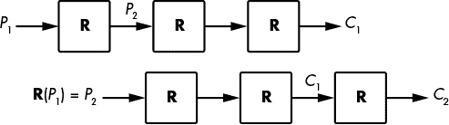

*图 4-1：针对具有相同轮次的分组密码的滑动攻击原理*

**注意**

*使用轮密钥的一个潜在副作用和好处是防御旁道攻击，旁道攻击是指利用密码实现过程中泄露的信息（例如电磁辐射）进行的攻击。如果从主密钥* K *到轮密钥* K[i] *的转换不可逆，那么如果攻击者找到* K[i] *，他们就无法使用该密钥来恢复* K。* 不幸的是，很少有分组密码采用单向密钥调度。AES 的密钥调度允许攻击者从任何一个轮密钥* K[i] *计算出* K*，例如。

#### *替代–置换网络*

如果你读过关于密码学的教材，你一定会接触到*混淆*和*扩散*这两个概念。混淆意味着输入（明文和加密密钥）经历复杂的转换，而扩散则意味着这些转换依赖于输入的所有位。在高级层面上，混淆关注的是深度，而扩散关注的是广度。在分组密码的设计中，混淆和扩散以替代和置换操作的形式出现，这些操作结合在替代–置换网络（SPNs）中。

替代通常以*S-boxes*（或*替代盒*）的形式出现，这是用于转换 4 位或 8 位数据块的小型查找表。例如，分组密码 Serpent 的八个 S-box 中的第一个由 16 个元素组成（3 8 f 1 a 6 5 b e d 4 2 7 0 9 c），其中每个元素代表一个 4 位的字节。这个特定的 S-box 将 4 位字节 0000 映射到 3（0011），4 位字节 0101（十进制为 5）映射到 6（0110），以此类推。

**注意**

*S 盒必须谨慎选择，以确保其密码学强度：它们应该尽可能非线性（输入和输出应通过复杂的方程式相关联），并且没有统计偏差（例如，翻转一个输入位应该可能影响任何输出位）。*

替代-置换网络中的置换可以像更改位的顺序一样简单，这种方法易于实现，但并不会有效地混合位。某些密码算法并不简单地重新排列位，而是使用基本的线性代数和矩阵乘法来混合位：它们执行一系列带有固定值（矩阵系数）的乘法操作，然后将结果相加。这样的线性代数操作可以迅速在所有位之间创建依赖关系，从而确保强烈的扩散。例如，分组密码 FOX 将 4 字节向量(*a*, *b*, *c*, *d*)转换为(*a*′, *b*′, *c*′, *d*′)，定义如下：

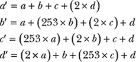

在上述方程中，数字 2 和 253 被解释为二进制多项式，而不是整数；因此，加法和乘法的定义与我们习惯的有所不同。例如，2 + 2 = 4 在这里表示为 2 + 2 = 0\. 无论如何，重点是初始状态中的每个字节都会影响最终状态中的所有 4 个字节。

#### *费斯特尔方案*

在 1970 年代，IBM 工程师霍斯特·费斯特尔设计了一种名为 Lucifer 的分组密码，其工作原理如下：

1.  将 64 位块分为两个 32 位的部分，*L* 和 *R*。

1.  将 *L* 设为 *L* ⊕ **F**(*R*)，其中 **F** 是一个替代-置换回合。

1.  交换 *L* 和 *R* 的值。

1.  跳转到第 2 步并重复 15 次。

1.  将 *L* 和 *R* 合并为 64 位输出块。

该结构被称为*费斯特尔方案*，如图 4-2 所示。左侧是如前所述的方案；右侧是一个功能等效的表示形式，其中，操作 *L* = *L* ⊕ **F**(*R*) 和 *R* = *R* ⊕ **F**(*L*) 交替进行，而不是交换 *L* 和 *R*。

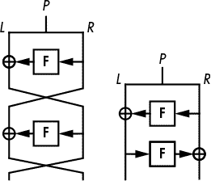

*图 4-2：费斯特尔方案分组密码结构的两种等效形式*

我在图 4-2 中省略了密钥，以简化图示，但请注意，第一次**F**函数使用第一个回合密钥 *K*[1]，第二次**F**函数使用另一个回合密钥 *K*[2]。在 DES 中，**F**函数使用一个 48 位的回合密钥，该密钥从 56 位密钥 *K* 中派生。

在费斯特尔方案中，**F**函数可以是伪随机置换（PRP）或伪随机函数（PRF）。PRP 对任意两个不同输入产生不同的输出，而 PRF 对于某些值 *X* 和 *Y*，有 **F**(*X*) = **F**(*Y*)。但在费斯特尔方案中，只要**F**在密码学上足够强大，这种差异并不重要。

在费斯特尔结构中应该有多少轮？嗯，DES 执行 16 轮，而 GOST 28147-89 执行 32 轮。如果**F**函数尽可能强大，理论上四轮就足够了，但实际的加密算法通常使用更多轮，以防御**F**中可能存在的弱点。

### 高级加密标准（AES）

AES 是世界上最常用的加密算法。在 AES 采用之前，标准的加密算法是 DES，它的 56 位安全性完全不够，而且升级版的 DES 称为三重 DES（3DES）。

尽管 3DES 提供了更高的安全性（112 位安全性），但它效率低下，因为为了达到 112 位的安全性，密钥需要 168 位长，而且在软件中运行较慢（DES 是为集成电路设计的，并非为主流 CPU 设计）。AES 解决了这两个问题。

NIST 在 2000 年将 AES 标准化，作为 DES 的替代方案，至此它成为全球公认的加密标准。今天，大多数商业加密产品都支持 AES，NSA 也已批准其用于保护最高机密的信息。（一些国家确实更喜欢使用自己的加密算法，主要是因为他们不想使用美国标准，但 AES 实际上比美国更具比利时背景。）

**注意**

*AES 曾被称为 Rijndael（这是它的发明者 Rijmen 和 Daemen 名字的合成词，发音类似于“rain-dull”），当时它是 AES 竞赛中的 15 个候选算法之一。该竞赛由 NIST 在 1997 至 2000 年间举办，目的是指定一个“非机密的、公开的加密算法，能够有效保护敏感的政府信息，直至下个世纪”。这项竞赛可以说是加密学家的“天才大赛”，任何人都可以通过提交自己的加密算法或破解其他参赛者的算法来参与。*

#### *AES 内部结构*

AES 处理 128 位的块，使用 128、192 或 256 位的密钥，其中 128 位密钥是最常见的，因为它使加密速度稍快一些，而且 128 位和 256 位安全性的差异对于大多数应用来说并不重要。


*图 4-3：AES 的内部状态，视为一个 16 字节的 4 × 4 数组*

有些加密算法处理单个比特或 64 位字，但 AES 操作的是*字节*。它将 16 字节的明文视为一个二维的字节数组（*s* = *s*[0]，*s*[1]，…，*s*[15]），如图 4-3 所示。（字母*s*表示这个数组，因为它被称为*内部状态*，或简称*状态*。）AES 通过变换该数组的字节、列和行来生成最终的密文。

为了变换其状态，AES 采用了如图 4-4 所示的 SPN 结构，128 位密钥使用 10 轮，192 位密钥使用 12 轮，256 位密钥使用 14 轮。

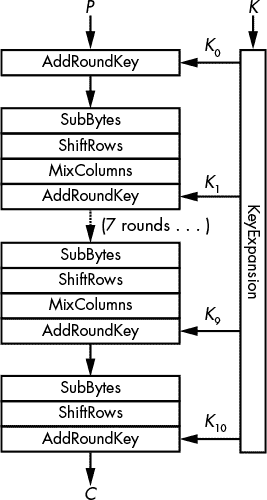

*图 4-4：AES 的内部操作*

图 4-4 展示了 AES 轮次的四个基本构件（注意，除了最后一轮，所有轮次都是 SubBytes、ShiftRows、MixColumns 和 AddRoundKey 的序列）：

**AddRoundKey** 将一个轮密钥与内部状态进行 XOR 运算。

**SubBytes** 用一个 S 盒根据查找表替换每个字节（*s*[0]、*s*[1]、…、*s*[15]）。在这个例子中，S 盒是一个包含 256 个元素的查找表。

**ShiftRows** 将第*i*行按*i*个位置进行移位，*i*的范围从 0 到 3（见图 4-5）。

**MixColumns** 对状态的四列（即每组具有相同灰度的单元格，如图 4-5 左侧所示）应用相同的线性变换。

记住，在 SPN 中，*S*代表替代（substitution），*P*代表置换（permutation）。在这里，替代层是 SubBytes，置换层是 ShiftRows 和 MixColumns 的组合。

密钥调度函数*KeyExpansion*，如图 4-4 所示，是 AES 的密钥调度算法。该扩展使用与 SubBytes 相同的 S 盒和一系列 XOR 操作，从 16 字节密钥中创建 11 个轮密钥（*K*[0]、*K*[1]、…、*K*[10]），每个轮密钥为 16 字节。KeyExpansion 的一个重要特性是，给定任何轮密钥 *K*[*i*]，攻击者可以通过反转算法确定所有其他轮密钥以及主密钥 *K*。从任何轮密钥中获取密钥的能力通常被视为对抗旁道攻击的一种不完美防御，因为攻击者可以轻松恢复一个轮密钥。

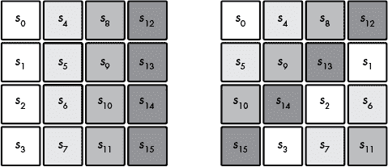

*图 4-5：ShiftRows 在内部状态的每一行内旋转字节。*

如果没有这些操作，AES 将完全不安全。每个操作以特定的方式贡献了 AES 的安全性：

+   如果没有 KeyExpansion，所有轮次都将使用相同的密钥 *K*，AES 将容易受到滑动攻击。

+   如果没有 AddRoundKey，加密就不再依赖于密钥，因此任何人都可以在没有密钥的情况下解密任何密文。

+   SubBytes 引入了非线性操作，增强了加密强度。如果没有它，AES 将只是一个可以用高中代数解出的线性方程的大系统。

+   如果没有 ShiftRows，给定列中的变化将永远不会影响其他列，这意味着你可以通过为每列构建四个 2³²元素的代码本来破解 AES。（记住，在安全的分组密码中，输入中翻转一个位应影响所有输出位。）

+   如果没有 MixColumns，字节的变化不会影响状态中的任何其他字节。这样，一个选择明文的攻击者就可以通过存储 16 个查找表（每个查找表 256 字节）来解密任何密文，这些查找表包含每个字节所有可能值的加密值。

注意在图 4-4 中，AES 的最后一轮不包括 MixColumns 操作。为了节省无用的计算，省略了该操作：因为 MixColumns 是线性的（即可预测的），你可以通过以不依赖于其值或密钥的方式组合位来取消其在最后一轮的效果。然而，SubBytes 不能在不知道状态值的情况下进行逆操作，除非在 AddRoundKey 之前已经知道状态值。

要解密密文，AES 通过取其逆函数来解开每个操作：SubBytes 的逆查找表反转 SubBytes 转换，ShiftRow 反向移位，MixColumns 的逆应用（就像矩阵编码其操作的矩阵逆），而 AddRoundKey 的 XOR 保持不变，因为 XOR 的逆仍然是另一个 XOR。

#### *AES 实践*

要尝试使用 AES 进行加密和解密，你可以使用 Python 的加密库，如列表 4-1 所示。

```
#!/usr/bin/env python

from cryptography.hazmat.primitives.ciphers import Cipher, algorithms, modes
from cryptography.hazmat.backends import default_backend
from binascii import hexlify as hexa
from os import urandom

# pick a random 16-byte key using Python's crypto PRNG
k = urandom(16)
print "k = %s" % hexa(k)
# create an instance of AES-128 to encrypt a single block
cipher = Cipher(algorithms.AES(k), modes.ECB(), backend = default_backend())
aes_encrypt = cipher.encryptor()

# set plaintext block p to the all-zero string
p = '\x00'*16
# encrypt plaintext p to ciphertext c
c = aes_encrypt.update(p) + aes_encrypt.finalize()
print "enc(%s) = %s" % (hexa(p), hexa(c))
# decrypt ciphertext c to plaintext p
aes_decrypt = cipher.decryptor()
p = aes_decrypt.update(c) + aes_decrypt.finalize()
print "dec(%s) = %s" % (hexa(c), hexa(p))
```

*列表 4-1：使用 Python 的加密库尝试 AES*

运行此脚本将生成类似以下的输出：

```
$ ./aes_block.py
k = 2c6202f9a582668aa96d511862d8a279
enc(00000000000000000000000000000000) = 12b620bb5eddcde9a07523e59292a6d7
dec(12b620bb5eddcde9a07523e59292a6d7) = 00000000000000000000000000000000
```

你会得到不同的结果，因为每次执行时密钥都会随机化。

### 实现 AES

真实的 AES 软件与图 4-4 中展示的算法有所不同。你不会在生产级的 AES 代码中看到调用 `SubBytes()` 函数、然后是 `ShiftRows()` 函数，再然后是 `MixColumns()` 函数，因为那样效率低下。相反，快速的 AES 软件使用一种称为基于表的实现和本地指令的特殊技术。

#### *基于表的实现*

基于表的 AES 实现将 SubBytes-ShiftRows-MixColumns 序列替换为 XOR 和查找表的组合，这些表在程序中硬编码并在执行时加载到内存中。这是可能的，因为 MixColumns 等同于对四个 32 位值进行 XOR 操作，每个值都依赖于状态中的一个字节和 SubBytes。因此，你可以构建四个包含 256 个条目的表格，每个字节值一个，使用查找四个 32 位值并将它们 XOR 合起来来实现 SubBytes-MixColumns 序列。

例如，OpenSSL 工具包中的基于表的 C 实现如下所示：列表 4-2。

/* 第一轮：*/

t0 = Te0[s0 >> 24] ^ Te1[(s1 >> 16) & 0xff] ^ Te2[(s2 >> 8) & 0xff] ^ Te3[s3 & 0xff] ^ rk[ 4];

t1 = Te0[s1 >> 24] ^ Te1[(s2 >> 16) & 0xff] ^ Te2[(s3 >> 8) & 0xff] ^ Te3[s0 & 0xff] ^ rk[ 5];

t2 = Te0[s2 >> 24] ^ Te1[(s3 >> 16) & 0xff] ^ Te2[(s0 >> 8) & 0xff] ^ Te3[s1 & 0xff] ^ rk[ 6];

t3 = Te0[s3 >> 24] ^ Te1[(s0 >> 16) & 0xff] ^ Te2[(s1 >> 8) & 0xff] ^ Te3[s2 & 0xff] ^ rk[ 7];

/* 第二轮：*/

s0 = Te0[t0 >> 24] ^ Te1[(t1 >> 16) & 0xff] ^ Te2[(t2 >> 8) & 0xff] ^ Te3[t3 & 0xff] ^ rk[ 8];

s1 = Te0[t1 >> 24] ^ Te1[(t2 >> 16) & 0xff] ^ Te2[(t3 >> 8) & 0xff] ^ Te3[t0 & 0xff] ^ rk[ 9];

s2 = Te0[t2 >> 24] ^ Te1[(t3 >> 16) & 0xff] ^ Te2[(t0 >> 8) & 0xff] ^ Te3[t1 & 0xff] ^ rk[10];

s3 = Te0[t3 >> 24] ^ Te1[(t0 >> 16) & 0xff] ^ Te2[(t1 >> 8) & 0xff] ^ Te3[t2 & 0xff] ^ rk[11];

--snip--

*列表 4-2：OpenSSL 中的基于表格的 AES C 实现*

基本的基于表格的 AES 加密实现需要四千字节的表格，因为每个表格存储 256 个 32 位值，分别占用 256 × 32 = 8192 位，或者一千字节。解密还需要另外四个表格，因此总共需要四千字节的存储。但有一些技巧可以将存储需求从四千字节减少到一千字节，甚至更少。

可惜，基于表格的实现容易受到*缓存时间攻击*的影响，这种攻击通过利用程序读取或写入缓存内存元素时的时间差异来进行。根据访问的元素在缓存内存中的相对位置，访问时间会有所不同。于是，时间差泄露了关于访问了哪个元素的信息，而这又进一步泄露了涉及的密钥信息。

缓存时间攻击难以避免。一种显而易见的解决方案是完全放弃查找表，编写一个程序，使得执行时间不依赖于输入，但要做到这一点几乎是不可能的，并且仍能保持相同的速度。因此，芯片制造商采取了一个激进的解决方案：他们不依赖于可能存在漏洞的软件，而是依赖于*硬件*。

#### *原生指令*

AES 原生指令（AES-NI）解决了 AES 软件实现中缓存时间攻击的问题。要理解 AES-NI 的工作原理，你需要考虑软件在硬件上运行的方式：要运行一个程序，微处理器将二进制代码翻译成由集成电路组件执行的一系列指令。例如，`MUL`汇编指令在两个 32 位值之间执行时，将激活微处理器中实现 32 位乘法器的晶体管。要实现一个加密算法，我们通常只是表达这种基本操作的组合——加法、乘法、异或等——然后微处理器按照预定顺序激活其加法器、乘法器和异或电路。

AES 原生指令通过为开发者提供专门的汇编指令来计算 AES，达到了全新的高度。使用 AES-NI 时，你不需要将 AES 轮次编程为一系列的汇编指令，而只需调用指令`AESENC`，芯片就会为你计算这一轮。原生指令让你可以直接告诉处理器运行一个 AES 轮次，而不需要将轮次编程为基本操作的组合。

使用原生指令的 AES 典型汇编实现可以参考列表 4-3。

```
PXOR       %xmm5,  %xmm0
AESENC     %xmm6,  %xmm0
AESENC     %xmm7,  %xmm0
AESENC     %xmm8,  %xmm0
AESENC     %xmm9,  %xmm0
AESENC     %xmm10, %xmm0
AESENC     %xmm11, %xmm0
AESENC     %xmm12, %xmm0
AESENC     %xmm13, %xmm0
AESENC     %xmm14, %xmm0
AESENCLAST %xmm15, %xmm0
```

*列表 4-3：AES 原生指令*

这段代码将 128 位明文最初存放在寄存器 `xmm0` 中，假设寄存器 `xmm5` 到 `xmm15` 存储着预计算好的轮密钥，每条指令将结果写入 `xmm0`。初始的 `PXOR` 指令在计算第一轮之前对第一个轮密钥进行异或运算，最后的 `AESENCLAST` 指令在执行最后一轮时略有不同（MixColumns 被省略）。

**注意**

*AES 在实现了本地指令的平台上速度大约是普通平台的十倍，当前几乎所有的笔记本、台式机和服务器微处理器，以及大多数手机和平板都实现了这些本地指令。事实上，在最新的英特尔微架构上，AESENC 指令的延迟为四个周期，反向吞吐量为一个周期，这意味着调用 AESENC 需要四个周期完成，并且每个周期都可以进行新的调用。连续加密一系列数据块时，因此完成 10 轮加密需要 4 × 10 = 40 个周期，或者 40 / 16 = 每字节 2.5 个周期。在 2 GHz（每秒 2 × 10⁹ 个周期）的频率下，这意味着约每秒 736 兆字节的吞吐量。如果待加密或解密的数据块是独立的，如某些操作模式所允许，那么可以并行处理四个数据块，以充分利用 AESENC 电路，从而将每个数据块的延迟从 40 个周期缩短到 10 个周期，吞吐量约为每秒 3 吉字节。*

#### *AES 是否安全？*

AES 和所有块密码一样安全，且永远不会被破解。从根本上说，AES 的安全性来源于所有输出位都依赖于所有输入位，以某种复杂的伪随机方式进行处理。为了实现这一点，AES 的设计者们仔细选择了每个组成部分，每个选择都有其特定原因——MixColumns 以其最大的扩散特性和 SubBytes 以其最优的非线性特性——并且他们已证明这种组合可以保护 AES 免受一系列密码分析攻击。

但是并没有证据证明 AES 对所有可能的攻击都免疫。首先，我们并不知道所有可能的攻击是什么，而且我们也不总是知道如何证明一个密码算法能抵御某种特定的攻击。真正获得对 AES 安全性信心的唯一方法就是众包攻击：让许多技术熟练的人尝试破解 AES，并且希望他们未能成功。

在超过 15 年和数百篇研究论文之后，AES 的理论安全性只被轻微触及。2011 年，密码分析学家发现通过进行大约 2¹²⁶ 次操作而非 2¹²⁸ 次操作，可以恢复 AES-128 密钥，这相当于加速了四倍。但这种“攻击”需要大量的明文-密文对——大约 2⁸⁸ 位。这意味着虽然是个有趣的发现，但并不是你需要担心的事情。

关键点是，在实现和部署加密时，你需要关心很多事情，但 AES 的安全性并不是其中之一。对分组密码的最大威胁并不来自它们的核心算法，而是它们的操作模式。当选择了不正确的模式，或者正确的模式被滥用时，即使是像 AES 这样的强加密算法也无法保护你。

### 操作模式

在 第一章 中，我解释了加密方案如何结合置换和操作模式来处理任意长度的消息。在本节中，我将介绍分组密码常用的主要操作模式、它们的安全性和功能特性，以及如何（不）使用它们。我将从最愚蠢的一个开始：电子代码本。

#### *电子代码本（ECB）模式*


*图 4-6：ECB 模式*

最简单的分组密码加密模式是电子代码本（ECB），它几乎不算是一种操作模式。ECB 将明文块 *P*[1]、*P*[2]、…、*P*[*N*] 分别处理，通过计算 *C*[1] = **E**(*K*, *P*[1])，*C*[2] = **E**(*K*, *P*[2])，依此类推，如 图 4-6 所示。这是一个简单的操作，但也是一个不安全的操作。我再重复一遍：ECB 是不安全的，你不应该使用它！

微软的密码学家 Marsh Ray 曾说过：“每个人都知道 ECB 模式不好，因为我们可以看到企鹅。”他指的是一个著名的示例，展示了 ECB 不安全性的图像，使用了 Linux 吉祥物 Tux 的图像，如 图 4-7 所示。你可以看到左侧是 Tux 的原始图像，右侧是用 AES 加密的 ECB 模式图像（尽管底层的加密算法并不重要）。由于原始图像中相同灰度的所有块被加密为新图像中相同的灰度，因此很容易在加密后的版本中看到企鹅的形状；换句话说，ECB 加密只是给你一个相同的图像，但颜色不同。

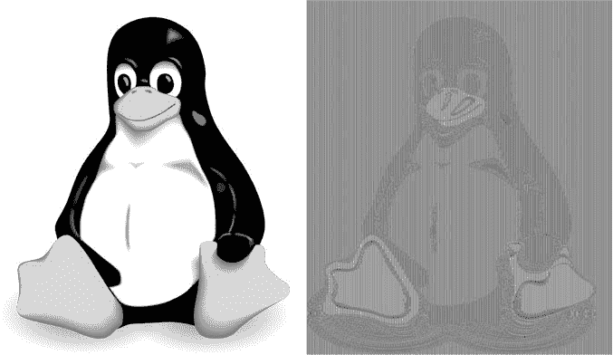

*图 4-7：原始图像（左）和 ECB 加密后的图像（右）*

列表 4-4 中的 Python 程序也展示了 ECB 的不安全性。它选择一个伪随机密钥并加密一个包含两个空字节块的 32 字节消息 `p`。请注意，加密后的结果是两个相同的块，且使用相同的密钥和相同的明文重复加密时，结果再次是这两个相同的块。

```
#!/usr/bin/env python

from cryptography.hazmat.primitives.ciphers import Cipher, algorithms, modes
from cryptography.hazmat.backends import default_backend
from binascii import hexlify as hexa
from os import urandom

BLOCKLEN = 16
def blocks(data):
    split = [hexa(data[i:i+BLOCKLEN]) for i in range(0, len(data), BLOCKLEN)]
    return ' '.join(split)

k = urandom(16)
print 'k = %s' % hexa(k)

# create an instance of AES-128 to encrypt and decrypt
cipher = Cipher(algorithms.AES(k), modes.ECB(), backend=default_backend())
aes_encrypt = cipher.encryptor()
# set plaintext block p to the all-zero string
p = '\x00'*BLOCKLEN*2

# encrypt plaintext p to ciphertext c
c = aes_encrypt.update(p) + aes_encrypt.finalize()
print 'enc(%s) = %s' % (blocks(p), blocks(c))
```

*列表 4-4：在 Python 中使用 AES 的 ECB 模式*

运行这个脚本会得到像这样的密文块，例如：

```
$ ./aes_ecb.py
k = 50a0ebeff8001250e87d31d72a86e46d
enc(00000000000000000000000000000000 00000000000000000000000000000000) =
5eb4b7af094ef7aca472bbd3cd72f1ed 5eb4b7af094ef7aca472bbd3cd72f1ed
```

正如你所看到的，当使用 ECB 模式时，相同的密文块会向攻击者透露相同的明文块，无论这些是单一密文中的块，还是不同密文中的块。这表明，ECB 模式下的分组密码并不具备语义安全性。

另一个关于 ECB 的问题是，它只接受完整的数据块，因此如果块是 16 字节，比如在 AES 中，你只能加密 16 字节、32 字节、48 字节或其他 16 字节的倍数块。你将会看到下一种模式——CBC——可以解决这个问题。（我不会告诉你这些技巧在 ECB 中是如何工作的，因为你本来就不应该使用 ECB。）

#### *密码块链接（CBC）模式*

密码块链接（CBC）与 ECB 类似，但有一个小小的变化，这个变化带来了大不同：CBC 不是直接加密第*i*个块 *P*[*i*]，而是将 *C*[*i*] 设置为 **E**(*K*, *P*[*i*] ⊕ *C*[*i* − 1])，其中 *C*[*i* − 1] 是前一个密文块——从而将块 *C*[*i* − 1] 和 *C*[*i*] 链接起来。当加密第一个块 *P*[1] 时，没有前一个密文块可用，因此 CBC 会使用一个随机的初始值（IV），如图 4-8 所示。

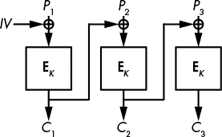

*图 4-8：CBC 模式*

CBC 模式使每个密文块都依赖于之前的所有块，确保相同的明文块不会变成相同的密文块。随机的初始值保证了当使用两个不同的初始值调用密码时，即使明文相同，加密后的密文也会不同。

清单 4-5 展示了这两个好处。这个程序接收一个全零的 32 字节消息（像清单 4-4 中的那样），用 CBC 加密两次，并展示这两个密文。加粗显示的`iv = urandom(16)`为每次新的加密选择一个新的随机 IV。

#!/usr/bin/env python

from cryptography.hazmat.primitives.ciphers import Cipher, algorithms, modes

from cryptography.hazmat.backends import default_backend

from binascii import hexlify as hexa

from os import urandom

BLOCKLEN = 16

# blocks()函数将数据字符串分割为以空格分隔的块

def blocks(data):

split = [hexa(data[i:i+BLOCKLEN]) for i in range(0, len(data), BLOCKLEN)]

return ' '.join(split)

k = urandom(16)

print 'k = %s' % hexa(k)

# 选择一个随机的 IV

iv = urandom(16)

print 'iv = %s' % hexa(iv)

# 选择一个 AES CBC 模式的实例

aes = Cipher(algorithms.AES(k), modes.CBC(iv), backend=default_backend()).encryptor()

p = '\x00'*BLOCKLEN*2

c = aes.update(p) + aes.finalize()

print 'enc(%s) = %s' % (blocks(p), blocks(c))

# 现在使用不同的 IV 和相同的密钥

iv = urandom(16)

print 'iv = %s' % hexa(iv)

aes = Cipher(algorithms.AES(k), modes.CBC(iv), backend=default_backend()).encryptor()

c = aes.update(p) + aes.finalize()

print 'enc(%s) = %s' % (blocks(p), blocks(c))

*清单 4-5：使用 AES 的 CBC 模式*

两个明文是相同的（两个全零块），但加密后的块应该是不同的，如下面的执行示例所示：

```
$ ./aes_cbc.py
k = 9cf0d31ad2df24f3cbbefc1e6933c872
iv = 0a75c4283b4539c094fc262aff0d17af
enc(00000000000000000000000000000000 00000000000000000000000000000000) =
370404dcab6e9ecbc3d24ca5573d2920 3b9e5d70e597db225609541f6ae9804a
iv = a6016a6698c3996be13e8739d9e793e2
enc(00000000000000000000000000000000 00000000000000000000000000000000) =
655e1bb3e74ee8cf9ec1540afd8b2204 b59db5ac28de43b25612dfd6f031087a
```

唉，CBC 通常使用常量 IV 而不是随机 IV，这会暴露相同的明文和以相同块开头的明文。例如，假设两个块的明文*P*[1] || *P*[2]被加密为两个块的密文*C*[1] || *C*[2]。如果*P*[1] || *P*[2]′使用相同的 IV 加密，其中*P*[2]′是与*P*[2]不同的块，那么密文将看起来像*C*[1] || *C*[2]′，其中*C*[2]′与*C*[2]不同，但与第一个块*C*[1]相同。因此，攻击者可以猜测这两个明文的第一个块是相同的，即使他们只能看到密文。

**注意**

*在 CBC 模式中，解密需要知道用于加密的 IV，因此 IV 会与密文一起明文传输。*

使用 CBC 时，由于并行处理，解密比加密速度要快得多。虽然新块*P*[*i*]*的加密需要等待前一个块*C*[*i* − 1]*，但一个块的解密计算为*P*[*i*] = **D**(*K*, *C*[*i*]) ⊕ *C*[*i* − 1]*，其中不需要前一个明文块*P*[*i* − 1]*。这意味着，只要你知道前一个密文块，所有的块就可以并行解密，通常你是知道的。

#### *如何在 CBC 模式下加密任何消息*

让我们回到块终止问题，看看如何处理一个长度不是块长度倍数的明文。例如，当块大小是 16 字节时，如何使用 AES-CBC 加密一个 18 字节的明文？剩下的两个字节怎么办？我们将介绍两种广泛使用的技术来解决这个问题。第一种是填充，它使得密文比明文稍长，而第二种是*密文偷取*，它生成的密文与明文长度相同。

##### 填充消息

填充是一种技术，它允许你加密任意长度的消息，即使消息小于一个完整的块。块加密的填充方法在 PKCS#7 标准和 RFC 5652 中有所规定，并且在几乎所有使用 CBC 的地方都有应用，比如一些 HTTPS 连接中。

填充用于通过向明文添加额外字节来扩展消息，以填充完整的块。以下是填充 16 字节块的规则：

+   如果剩下一个字节——例如，如果明文是 1 个字节，17 个字节或 33 个字节长——则用 15 个 0f 字节（十进制 15）填充消息。

+   如果剩余两个字节，用 14 个 0e 字节（十进制 14）填充消息。

+   如果剩余三个字节，使用 13 个 0d 字节（十进制 13）填充消息。

如果有 15 个明文字节，缺少一个字节来填充一个块，填充会添加一个 01 字节。如果明文已经是 16 的倍数（块大小），则会添加 16 个 10 字节（十进制 16）。你应该明白了。这种技巧可以推广到任何块大小，最多到 255 字节（对于更大的块，一个字节太小，无法编码大于 255 的值）。

填充消息的解密过程如下：

1.  像未填充的 CBC 一样解密所有的块。

1.  确保最后一个块的最后几字节符合填充规则：它们至少以一个 01 字节、两个 02 字节或三个 03 字节等结尾。如果填充无效——例如，如果最后的字节是 01 02 03——消息将被拒绝。否则，解密会去掉填充字节，返回剩余的明文字节。

填充的一个缺点是，它会使密文的长度至少增加一个字节，最多增加一个块。

##### 密文偷窃

密文偷窃是另一种用于加密长度不是块大小倍数的消息的技巧。密文偷窃比填充更加复杂且不太流行，但它至少有三个优点：

+   明文可以是任意*比特*长度，而不仅仅是字节。例如，你可以加密一个 131 比特的消息。

+   密文的长度与明文完全相同。

+   密文偷窃不会受到填充 oracle 攻击的威胁，这是一种强大的攻击方式，有时会对使用填充的 CBC 模式产生作用（我们将在“填充 Oracle 攻击”中看到，见第 74 页）。

在 CBC 模式下，密文偷窃通过从前一个密文块中延伸最后不完整的明文块，然后对结果块进行加密。最后的不完整密文块由前一个密文块的前几个块组成；也就是说，是那些没有附加到最后一个明文块中的位。

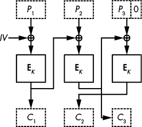

*图 4-9：CBC 模式下的密文偷窃加密*

在图 4-9 中，我们有三个数据块，其中最后一个数据块，*P*[3]，是不完整的（用零表示）。*P*[3]与前一个密文块的最后几位进行异或操作，得到的加密结果作为*C*[2]返回。最后一个密文块，*C*[3]，则由前一个密文块的前几位组成。解密操作就是此过程的逆操作。

密文偷窃并没有什么重大问题，但它不够优雅且难以正确实现，特别是当 NIST 的标准指定了三种不同的实现方式时（参见《特殊出版物 800-38A》）。

#### *计数器（CTR）模式*

为了避免麻烦并保留密文偷窃的优点，你应该使用计数器模式（CTR）。CTR 几乎不是一种块加密模式：它将块加密算法转化为一种流加密算法，直接处理比特流并输出比特流，而不会涉及块的概念。（我将在第五章中详细讨论流加密算法。）

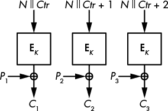

*图 4-10：CTR 模式*

在 CTR 模式中（见 图 4-10），块加密算法不会转换明文数据。相反，它将加密由 *计数器* 和 *nonce* 组成的块。计数器是一个整数，每个块递增一次。在一条消息中，不能有两个块使用相同的计数器，但不同的消息可以使用相同的计数器序列（1、2、3、…）。nonce 是一个仅使用一次的数字。在单个消息中，它对所有块都是相同的，但不同的消息不应使用相同的 nonce。

如 图 4-10 所示，在 CTR 模式下，加密过程将明文与来自“加密” nonce *N* 和计数器 *Ctr* 的流进行异或。解密过程相同，因此加密和解密只需要使用相同的加密算法。Python 脚本在 列表 4-6 中提供了一个实际示例。

```
#!/usr/bin/env python

from Crypto.Cipher import AES
from Crypto.Util import Counter
from binascii import hexlify as hexa
from os import urandom
from struct import unpack

k = urandom(16)
print 'k = %s' % hexa(k)

# pick a starting value for the counter
nonce = unpack('<Q', urandom(8))[0]
# instantiate a counter function
ctr = Counter.new(128, initial_value=nonce)

# pick an instance of AES in CTR mode, using ctr as counter
aes = AES.new(k, AES.MODE_CTR, counter=ctr)

# no need for an entire block with CTR
p = '\x00\x01\x02\x03'

# encrypt p
c = aes.encrypt(p)
print 'enc(%s) = %s' % (hexa(p), hexa(c))
# decrypt using the encrypt function
ctr = Counter.new(128, initial_value=nonce)
aes = AES.new(k, AES.MODE_CTR, counter=ctr)
p = aes.encrypt(c)
print 'enc(%s) = %s' % (hexa(c), hexa(p))
```

*列表 4-6：在 CTR 模式下使用 AES*

示例执行加密一个 4 字节的明文并获得一个 4 字节的密文。然后使用加密函数解密该密文：

```
$ ./aes_ctr.py
k = 130a1aa77fa58335272156421cb2a3ea
enc(00010203) = b23d284e
enc(b23d284e) = 00010203
```

与 CBC 模式中的初始值一样，CTR 模式中的 nonce 由加密者提供，并与明文密文一起发送。但与 CBC 模式的初始值不同，CTR 的 nonce 不需要是随机的，它只需要是唯一的。nonce 必须唯一的原因与一次性密钥不能重复使用相同：当调用伪随机流 *S* 时，如果你用相同的 nonce 对 *P*[1] 进行加密得到 *C*[1] = *P*[1] ⊕ *S*，再用相同的 nonce 对 *P*[2] 进行加密得到 *C*[2] = *P*[2] ⊕ *S*，那么 *C*[1] ⊕ *C*[2] 就会揭示 *P*[1] ⊕ *P*[2]。

只有当随机 nonce 足够长时，才能解决这个问题；例如，如果 nonce 是 *n* 位，则加密 2^(*N*/ 2) 次和使用相同数量的 nonce 后，很可能会遇到重复值。因此，64 位的随机 nonce 是不够的，因为在大约 2³² 个 nonce 后就会出现重复，这是一个不可接受的低数字。

如果每次新的明文都会递增计数器，并且计数器足够长（例如 64 位计数器），那么计数器就能保证唯一性。

CTR 模式的一个特别好处是，它比任何其他模式都要快。它不仅可以并行化，而且即使在不知道消息内容之前，你也可以选择一个 nonce，并计算出稍后用来与明文进行异或运算的流。

### 错误发生的情况

有两种必须了解的块密码攻击：中间人攻击，这是一种在 1970 年代发现的技术，但至今仍然在许多密码分析攻击中使用（与中间人攻击不同），以及填充 Oracle 攻击，这类攻击在 2002 年由学术密码学家发现，最初大多被忽视，最终在十年后重新被发现，并伴随着几个易受攻击的应用程序。

#### *中间人攻击*

3DES 块密码是 1970 年代标准 DES 的升级版，它使用 56 × 3 = 168 位的密钥（相对于 DES 的 56 位密钥有了提升）。但是，3DES 的安全级别是 112 位，而不是 168 位，因为存在 *meet-in-the-middle (MitM)* 攻击。

正如你在图 4-11 中看到的，3DES 使用 DES 的加密和解密功能加密一个块：首先使用密钥 *K*[1] 进行加密，然后使用密钥 *K*[2] 进行解密，最后使用另一个密钥 *K*[3] 进行加密。如果 *K*[1] = *K*[2]，前两个调用会相互抵消，3DES 就会简化为使用密钥 *K*[3] 的单一 DES。3DES 采用加密-解密-加密的方式，而不是三次加密，以便在需要时使用新的 3DES 接口让系统能够模拟 DES。

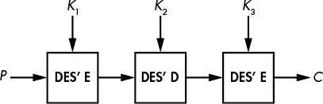

*图 4-11：* 3DES 块密码构造

为什么使用三重 DES，而不仅仅是双重 DES，即 **E**(*K*[1], **E**(*K*[2], *P*))？事实证明，MitM 攻击使得双重 DES 的安全性仅相当于单 DES。图 4-12 展示了 MitM 攻击的实际操作。

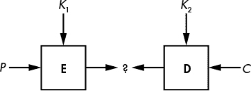

*图 4-12：* *meet-in-the-middle* 攻击*

*meet-in-the-middle* 攻击的工作原理如下，用于攻击双重 DES：

1.  假设你有 *P* 和 *C* = **E**(*K*[2], **E**(*K*[1], *P*))，其中有两个未知的 56 位密钥，*K*[1] 和 *K*[2]。（DES 使用 56 位密钥，所以双重 DES 总共使用 112 位密钥。）你构建一个包含 2⁵⁶ 条目、**E**(*K*[1], *P*) 的键值表，其中 **E** 是 DES 加密函数，*K*[1] 是存储的值。

1.  对所有 2⁵⁶ 个 *K*[2] 的值，计算 **D**(*K*[2], *C*) 并检查计算结果是否出现在表中作为索引（因此作为一个中间值，在图 4-12 中用问号表示）。

1.  如果在表中找到一个中间值作为索引，你需要从表中提取对应的 *K*[1] 并通过使用其他 *P* 和 *C* 的组合验证 (*K*[1], *K*[2]) 是否正确。使用 *K*[1] 和 *K*[2] 对 *P* 进行加密，然后检查得到的密文是否是给定的 *C*。

该方法通过执行约 2⁵⁷ 次操作来恢复 *K*[1] 和 *K*[2]，而不是 2¹¹² 次操作：第 1 步加密 2⁵⁶ 个块，然后第 2 步最多解密 2⁵⁶ 个块，总共执行 2⁵⁶ + 2⁵⁶ = 2⁵⁷ 次操作。你还需要存储 2⁵⁶ 个每个 15 字节的元素，或者大约 128 PB（拍字节）。这已经非常庞大，但有一个技巧可以让你用几乎不占内存的方式运行相同的攻击（你将在第六章中看到）。

正如你所看到的，你几乎可以用和攻击双重 DES 时一样的方法来攻击 3DES，唯一的区别是第三阶段会遍历所有 2¹¹² 个 *K*[2] 和 *K*[3] 的值。因此，整个攻击大约需要执行 2¹¹² 次操作，意味着尽管 3DES 拥有 168 位的密钥材料，但它的安全性只有 112 位。

#### *填充 Oracle 攻击*

让我们以 2000 年代最简单但最具破坏性的攻击之一作为本章的结尾：填充 oracle 攻击。记住，填充是为了填满一个块而在明文中添加额外的字节。例如，一个 111 字节的明文是六个 16 字节块和接着的 15 字节。为了形成完整的块，填充会添加一个 01 字节。对于一个 110 字节的明文，填充会添加两个 02 字节，依此类推。

*填充 oracle* 是一种根据 CBC 加密密文中的填充是否有效而表现不同的系统。你可以将其看作一个黑盒或一个 API，它返回“成功”或“错误”值。填充 oracle 可以在远程主机上的服务中找到，当它接收到格式错误的密文时会发送错误消息。给定一个填充 oracle，填充 oracle 攻击记录哪些输入具有有效的填充，哪些没有，并利用这些信息来解密所选的密文值。

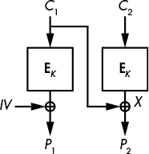

*图 4-13：填充 oracle 攻击通过选择 *C*[1] 并检查填充的有效性来恢复 *X*。*

假设你想解密密文块 *C*[2]。我将 *X* 称为你要查找的值，即 **D**(*K*, *C*[2])，而 *P*[2] 是在 CBC 模式下解密得到的块（见图 4-13）。如果你选择一个随机块 *C*[1] 并将这两个块的密文 *C*[1] || *C*[2] 发送给 oracle，解密只有在 *C*[1] ⊕ *P*[2] = *X* 以有效的填充结尾时才会成功——即一个 01 字节、两个 02 字节或三个 03 字节，依此类推。

基于这个观察，填充 oracle 攻击可以像这样解密 CBC 加密的一个块 *C*[2]（字节用数组表示法表示：*C*[1][0] 是 *C*[1] 的第一个字节，*C*[1][1] 是第二个字节，以此类推，直到 *C*[1][15]，即 *C*[1] 的最后一个字节）：

1.  选择一个随机的块 *C*[1]，并通过改变其最后一个字节，直到填充 oracle 接受密文为有效。通常，在有效的密文中，*C*[1][15] ⊕ *X*[15] = 01，因此你需要尝试大约 128 个 *C*[1][15] 的值后，就能找到 *X*[15]。

1.  通过将 *C*[1][15] 设置为 *X*[15] ⊕ 02，并搜索能给出正确填充的 *C*[1][14]，来找到 *X*[14] 的值。当 oracle 接受密文为有效时，这意味着你已找到 *C*[1][14]，使得 *C*[1][14] ⊕ *X*[14] = 02。

1.  对所有 16 字节重复步骤 1 和步骤 2。

攻击平均需要对每个 16 字节进行 128 次 oracle 查询，总共大约 2000 次查询。（注意每个查询必须使用相同的初始值。）

**注意**

*实际上，实现填充 oracle 攻击比我所描述的要复杂一些，因为你必须处理步骤 1 中的错误猜测。一个密文可能具有有效的填充，并非因为* P[2] *以一个单独的 01 结尾，而是因为它以两个 02 字节或三个 03 字节结尾。但这可以通过测试更多字节被修改的密文的有效性来轻松管理。*

### 深入阅读

关于分组密码有很多要说的，无论是算法如何工作，还是它们如何被攻击。例如，Feistel 网络和 SPN 并不是构建分组密码的唯一方式。分组密码 IDEA 和 FOX 使用 Lai–Massey 结构，而 Threefish 使用 ARX 网络，它结合了加法、字节旋转和 XOR 操作。

还有许多其他模式，而不仅仅是 ECB、CBC 和 CTR。一些模式是没有人使用的民间技术，如 CFB 和 OFB，而其他模式则是为特定应用设计的，例如 XTS 用于可调整加密，或 GCM 用于认证加密。

我曾讨论过 Rijndael，AES 的获胜者，但在这场竞赛中还有 14 种其他算法：CAST-256、CRYPTON、DEAL、DFC、E2、FROG、HPC、LOKI97、Magenta、MARS、RC6、SAFER+、Serpent 和 Twofish。我建议你查阅它们，了解它们是如何工作的，如何设计的，如何被攻击的，以及它们的速度。还值得查看 NSA 的设计（Skipjack，以及最近的 SIMON 和 SPECK）以及一些更现代的“轻量级”分组密码，例如 KATAN、PRESENT 或 PRINCE。
