## 5

流密码


对称密码可以是块密码或流密码。回想一下第四章，块密码通过将明文比特与密钥比特混合在一起，产生相同大小的密文块，通常为 64 或 128 位。而流密码则不同，它们不会将明文和密钥比特混合在一起；相反，它们通过密钥生成伪随机比特，并通过与伪随机比特进行异或（XOR）操作来加密明文，就像第一章中解释的一次性密钥一样。

流密码有时会被排斥，因为历史上它们比块密码更脆弱，而且更容易被破解——无论是业余爱好者设计的实验性密码，还是在包括移动电话、Wi-Fi 和公共交通智能卡在内的系统中使用的密码。但这些都已经是历史了。幸运的是，虽然花费了 20 年时间，我们现在知道如何设计安全的流密码，并且相信它们能够保护像蓝牙连接、移动 4G 通信、TLS 连接等内容。

本章首先介绍流密码的工作原理，并讨论流密码的两大主要类别：有状态密码和基于计数器的密码。然后，我们将研究硬件和软件导向的流密码，并查看一些不安全的密码（例如 GSM 移动通信中的 A5/1 和 TLS 中的 RC4）以及一些安全的、最先进的密码（如硬件使用的 Grain-128a 和软件使用的 Salsa20）。

### 流密码的工作原理

流密码更像是确定性随机比特生成器（DRBGs），而不是完整的伪随机数生成器（PRNGs），因为像 DRBGs 一样，流密码是确定性的。流密码的确定性使得你可以通过重新生成用于加密的伪随机比特来解密。使用 PRNG，你可以加密但无法解密——这虽然安全，但毫无用处。

区分流密码与 DRBGs 的关键在于，DRBGs 只接受一个输入值，而流密码接受两个值：一个密钥和一个随机数。密钥应该是保密的，通常为 128 位或 256 位。随机数不需要保密，但它应该对于每个密钥都是唯一的，通常为 64 到 128 位之间。

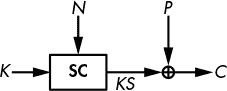

*图 5-1：流密码如何加密，采用一个秘密密钥*，K，*和一个公共的随机数*，N

流密码生成一个称为 *密钥流* 的伪随机比特流。密钥流与明文进行异或操作来加密明文，然后再次与密文进行异或操作来解密密文。图 5-1 展示了基本的流密码加密操作，其中 **SC** 是流密码算法，*KS* 是密钥流，*P* 是明文，*C* 是密文。

流密码计算 *KS* = **SC**(*K*, *N*)，加密为 *C* = *P* ⊕ *KS*，解密为 *P* = *C* ⊕ *KS*。加密和解密函数是相同的，因为两者执行的操作相同——即用密钥流进行异或运算。这就是为什么某些加密库提供一个单独的 `encrypt` 函数，用于加密和解密的原因。

流密码允许你使用密钥 *K*[1] 和 nonce *N*[1] 加密一条消息，然后使用密钥 *K*[1] 和与 *N*[1] 不同的 nonce *N*[2] 或使用与 *K*[1] 不同的密钥 *K*[2] 和 nonce *N*[1] 再加密另一条消息。然而，你永远不应该再次使用 *K*[1] 和 *N*[1] 进行加密，因为那样你就会使用两次相同的密钥流 *KS*。这时你会有第一个密文 *C*[1] = *P*[1] ⊕ *KS*，第二个密文 *C*[2] = *P*[2] ⊕ *KS*，如果你知道 *P*[1]，那么你可以通过 *C*[1] ⊕ *C*[2] ⊕ *P*[1] 计算出 *P*[2]。

**注意**

*名称* nonce *实际上是* number used only once（仅使用一次的数字）的缩写。*在流密码的上下文中，它有时被称为 IV，即* initial value（初始值）。

#### *有状态与基于计数器的流密码*

从高层次的角度来看，流密码有两种类型：有状态和基于计数器的。*有状态流密码* 具有一个在生成密钥流的过程中不断变化的秘密内部状态。密码从密钥和 nonce 初始化状态，然后调用更新函数来更新状态值，并从状态中生成一个或多个密钥流位，如图 5-2 所示。例如，著名的 RC4 就是一个有状态密码。

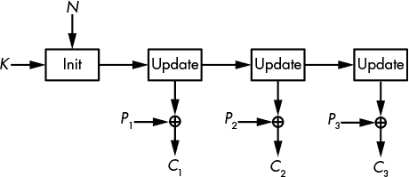

*图 5-2：有状态流密码*

*基于计数器的流密码* 从密钥、nonce 和计数器值生成密钥流块，如图 5-3 所示。与有状态流密码（例如 Salsa20）不同，基于计数器的流密码在生成密钥流时不会记住任何秘密状态。

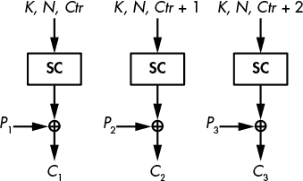

*图 5-3：基于计数器的流密码*

这两种方法定义了流密码的高层架构，无论核心算法如何工作。流密码的内部实现也分为两类，取决于密码的目标平台：硬件导向和软件导向。

### 硬件导向的流密码

当密码学家谈到硬件时，他们指的是应用特定集成电路（ASICs）、可编程逻辑设备（PLDs）和现场可编程门阵列（FPGAs）。密码算法的硬件实现是一个电子电路，按位实现加密算法，且不能用于其他任何用途；换句话说，这个电路是*专用硬件*。另一方面，密码算法的软件实现仅仅是告诉微处理器执行什么指令来运行算法。这些指令处理字节或字，并调用实现一般操作（如加法和乘法）的电子电路。软件处理 32 位或 64 位的字节或字，而硬件处理的是比特。最早的流密码按比特工作，以避免复杂的字操作，从而在当时的硬件平台上更加高效。

流密码在硬件实现中被广泛使用的主要原因是它们比分组密码更便宜。流密码需要的内存和逻辑门比分组密码少，因此占用集成电路的面积更小，从而降低了制造成本。例如，以门等效（gate-equivalents）为计量标准，流密码的面积通常小于 1000 个门等效；相比之下，典型的软件导向分组密码至少需要 10000 个门等效，这使得加密在成本上比流密码贵了一个数量级。

然而，今天，分组密码不再比流密码更昂贵——首先，因为现在有一些硬件友好的分组密码，它们的体积与流密码相差无几，其次，因为硬件的成本已经大幅下降。尽管如此，流密码仍然常与硬件相关联，因为它们曾经是最佳选择。

在下一节中，我将解释硬件流密码的基本机制，这种机制叫做*反馈移位寄存器*（*FSRs*）。几乎所有的硬件流密码都以某种方式依赖于 FSR，无论是 2G 手机中使用的 A5/1 密码，还是较新的密码 Grain-128a。

**注意**

*第一个标准分组密码数据加密标准（DES）是为了硬件优化的，而不是为了软件优化。当美国政府在 1970 年代将 DES 标准化时，大多数目标应用是硬件实现。因此，DES 中的 S 盒在硬件中作为逻辑电路实现时既小又快速计算，但在软件中则效率低下。与 DES 不同，目前的高级加密标准（AES）处理字节，因此在软件中比 DES 更高效。*

#### *反馈移位寄存器*

无数的流密码都使用了 FSR，因为它们简单且易于理解。FSR 只是一个配备有更新*反馈函数*的比特数组，我将其表示为**f**。FSR 的状态存储在数组或寄存器中，每次*更新*FSR 时，使用反馈函数来改变状态的值并生成一个输出位。

实际上，FSR 的工作方式是这样的：如果 *R*[0] 是 FSR 的初始值，下一状态 *R*[1] 定义为 *R*[0] 左移 1 位，离开寄存器的位作为输出，并且空位由**f**(*R*[0])填充。

相同的规则重复用于计算随后的状态值 *R*[2]、*R*[3]，依此类推。也就是说，给定 *R*[*t*]，FSR 在时刻*t*的状态，下一个状态 *R*[*t* + 1] 如下：

*R*[*i* + 1] = (*R*[*t*] << 1)|**f**(*R*[*t*])

在这个方程中，`|`是逻辑或运算符，<<是位移运算符，像在 C 语言中一样使用。例如，给定 8 位字符串 00001111，我们得到：

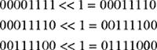

位移操作将位向左移动，丢失最左侧的位，以保持状态的位长，并将最右侧的位置为 0。FSR 的更新操作是相同的，不同之处在于，最右侧的位不是置为 0，而是设置为**f**(*R*[*t*])。

例如，考虑一个 4 位的 FSR，其反馈函数**f**将所有 4 个比特进行异或操作。将状态初始化为：

1 1 0 0

现在将位向左移，其中输出 1，最右侧的位设置为以下内容：

**f**(1100) = 1 ⊕ 1 ⊕ 0 ⊕ 0 = 0

现在状态变为：

1 0 0 0

下一次更新输出 1，左移状态，并将最右侧的位设置为：

**f**(1000) = 1 ⊕ 0 ⊕ 0 ⊕ 0 = 1

现在状态是：

0 0 0 1

接下来的三次更新输出三个 0 位，并给出以下状态值：

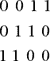

因此，在五次迭代后，我们回到最初的状态 1100，我们可以看到，从该周期中观察到的任一值更新状态五次都会使我们回到初始值。我们称 5 是 FSR 的*周期*，对于任何一个值 1100、1000、0001、0011 或 0110 来说都适用。由于这个 FSR 的周期是 5，时钟信号让寄存器时钟跳动 10 次时将输出两次相同的 5 位序列。同理，如果你让寄存器跳动 20 次，从 1100 开始，输出位将是 11000110001100011000，或者四次相同的 5 位序列 11000。直观上，应该避免这样的重复模式，更长的周期对安全性更有利。

**注意**

*如果你计划在流密码中使用 FSR，避免使用周期较短的 FSR，因为它们的输出更容易预测。有些类型的 FSR 使得推算其周期变得容易，但有些则几乎不可能做到这一点。*

图 5-4 展示了这个周期的结构，以及该 FSR 的其他周期，每个周期以一个圆圈显示，圆圈中的点代表寄存器的一个状态。

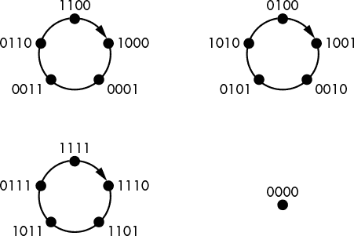

*图 5-4：FSR 的周期，其反馈函数将 4 位进行异或*

确实，这个特定的 FSR 还有两个其他的周期为 5 的循环——即 {0100, 1001, 0010, 0101, 1010} 和 {1111, 1110, 1101, 1011, 0111}。请注意，任何给定的状态只能属于一个状态循环。在这里，我们有三个周期，每个周期包含五个状态，涵盖了我们 4 位寄存器的 2⁴ = 16 个可能值中的 15 个。第 16 个可能值是 0000，正如 图 5-4 所示，它是一个周期为 1 的循环，因为 FSR 会将 0000 转换为 0000。

你已经看到，FSR 本质上是一个位寄存器，其中每次更新寄存器都会输出一个位（寄存器的最左边位），而函数计算出寄存器的新最右边位。（其他位都会左移。）FSR 的周期是从某个初始状态开始，直到 FSR 再次进入相同状态所需的更新次数。如果需要 *N* 次更新才能达到这一点，那么 FSR 会一次又一次地生成相同的 *N* 位。

##### 线性反馈移位寄存器

线性反馈移位寄存器（LFSR）是具有 *线性* 反馈函数的 FSR——即一个函数，它是某些状态位的异或（XOR），就像上一节中 4 位 FSR 的示例及其反馈函数返回寄存器 4 位的异或结果一样。回想一下，在密码学中，线性性意味着可预测性，并暗示着一个简单的基础数学结构。正如你可能预期的那样，得益于这种线性性，LFSR 可以通过线性复杂度、有限域和原始多项式等概念进行分析——但我会跳过数学细节，直接给你核心要点。

哪些位被异或在一起对于 LFSR 的周期及其密码学价值至关重要。好消息是，我们知道如何选择位的位置，以确保最大周期，即 2^(*n*) – 1。具体来说，我们取位的索引，从最右边的 1 到最左边的 *n*，并写出多项式表达式 1 + *X* + *X*² + … + *X*^(*n*)，其中只有当第 *i* 位是反馈函数中异或的位之一时，才会包含 *X*^(*i*) 这一项。只有当该多项式是 *原始* 时，周期才是最大周期。为了是原始的，该多项式必须具备以下特性：

+   多项式必须是不可约的，这意味着它不能被因式分解；也就是说，不能写成更小多项式的积。例如，*X* + *X*³ 不是不可约的，因为它等于 (1 + *X*)(*X* + *X*²)：

    (1 + *X*)(*X* + *X*²) = *X* + *X*² + *X*² + *X*³ = *X* + *X*³

+   多项式必须满足一些其他的数学性质，这些性质不能用简单的数学概念来解释，但可以通过测试轻松验证。

**注意**

*一个 n 位 LFSR 的最大周期是 2*^n - *1，而不是 2*^n，*因为全零状态总是无限循环在自己上。由于任何数量零的异或结果是零，从反馈函数进入状态的新位将始终为零；因此，全零状态注定会一直保持为全零。*

例如，图 5-5 展示了一个具有反馈多项式 1 + *X* + *X*³ + *X*⁴的 4 位 LFSR，其中位置 1、3 和 4 的位进行异或运算以计算新位，设置为*L*[1]。然而，这个多项式不是原始的，因为它可以分解为(1 + *X*³)(1 + *X*)。

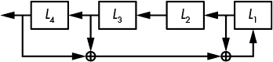

*图 5-5：具有反馈多项式 1 + X + X³ + X⁴的 LFSR*

确实，图 5-5 所示的 LFSR 的周期并不是最大值。为了证明这一点，从状态 0001 开始。

0 0 0 1

现在左移 1 位，并将新位设置为 0 + 0 + 1 = 1：

0 0 1 1

重复该操作四次后，得到以下状态值：

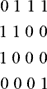

正如你所看到的，经过五次更新后的状态与初始状态相同，这证明我们处于一个周期为 5 的循环中，并且证明了 LFSR 的周期不是最大值 15。

现在，相比之下，考虑图 5-6 所示的 LFSR。

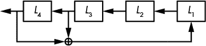

*图 5-6：具有反馈多项式 1 + X³ + X⁴的 LFSR，*一个原始多项式，确保最大周期*

这个反馈多项式是由 1 + *X*³ + *X*⁴描述的原始多项式，你可以验证它的周期确实是最大值（即 15）。具体来说，从初始值开始，状态按如下方式演变：

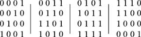

该状态涵盖了所有可能的值，除了 0000，并且没有重复，直到最终进入循环。这证明了周期是最大的，并且证明了反馈多项式是原始的。

可惜，使用 LFSR 作为流密码是不安全的。如果*n*是 LFSR 的位长度，攻击者只需要*n*个输出位就能恢复 LFSR 的初始状态，从而确定所有先前的位并预测所有未来的位。之所以可能进行此攻击，是因为 Berlekamp–Massey 算法可以用来解 LFSR 数学结构定义的方程，不仅能找到 LFSR 的初始状态，还能找到它的反馈多项式。事实上，你甚至不需要知道 LFSR 的确切长度就能成功；你可以对所有可能的*n*值重复使用 Berlekamp–Massey 算法，直到找到正确的值。

结果是 LFSR 在加密上较弱，因为它们是线性的。输出位和初始状态位通过简单且短小的方程式相互关联，这些方程可以通过高中线性代数技巧轻松解决。

为了加强 LFSR，我们因此需要加入一些非线性。

##### 过滤后的 LFSR

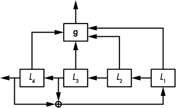

*图 5-7：经过滤波的 LFSR*

为了减轻 LFSRs 的不安全性，可以通过将其输出位通过非线性函数处理，再返回以生成所谓的*过滤 LFSR*（见图 5-7）。

图 5-7 中的**g**函数必须是一个*非线性*函数—既能对比特进行异或操作，又能结合逻辑与或或操作。例如，*L*[1]*L*[2] + *L*[3]*L*[4]是一个非线性函数（我省略了乘号，因此*L*[1]*L*[2]表示*L*[1] × *L*[2]，或在 C 语言中表示为*L*[1] & *L*[2]）。

**注意**

*你可以直接通过 FSR 的位来编写反馈函数，例如* L[1]L[2] + L[3]L[4]，*或者使用等效的多项式表示法* 1 + XX² + X³X⁴。*直接表示法更易于理解，但多项式表示法更适合 FSR 性质的数学分析。除非我们关心数学性质，否则我们将坚持使用直接表示法。*

滤波 LFSRs 比普通 LFSRs 更强，因为它们的非线性函数能抵挡简单的攻击。然而，更复杂的攻击如以下几种将破坏系统：

+   *代数攻击*将解出从输出位推导出的非线性方程组，其中方程中的未知数是 LFSR 状态中的比特。

+   *立方体攻击*将计算非线性方程的导数，以将系统的阶数降到一，然后像线性系统一样高效地求解。

+   *快速相关攻击*将利用过滤函数，尽管其具有非线性，仍然倾向于像线性函数一样表现。

这里的教训，如我们在之前的例子中看到的，是创可贴无法修复枪伤。用稍微强一点的层修补破损的算法并不会使整个系统安全。问题必须从根本上解决。

##### 非线性反馈移位寄存器（NFSRs）

非线性反馈移位寄存器（NFSRs）类似于 LFSRs，但它们采用非线性反馈函数，而不是线性反馈函数。也就是说，反馈函数不仅仅是逐位异或，可能还包括逐位与（AND）和或（OR）操作—这一特性既有优点也有缺点。

添加非线性反馈函数的一个好处是，它们使 NFSRs 在密码学上比 LFSRs 更强，因为输出位依赖于初始秘密状态，以一种复杂的方式，符合指数大小的方程。LFSRs 的线性函数保持关系简单，最多有*n*项（*N*[1]、*N*[2]、……、*N*[*n*]，如果*N*[*i*]是 NFSR 的状态位）。例如，一个 4 位的 NFSR，其初始秘密状态为(*N*[1]、*N*[2]、*N*[3]、*N*[4])，反馈函数为(*N*[1] + *N*[2] + *N*[1]*N*[2] + *N*[3]*N*[4])，将生成第一个输出位，公式如下：

*N*[1] + *N*[2] + *N*[1]*N*[2] + *N*[3]*N*[4]

第二次迭代将用新的比特替换*N*[1]的值。将第二个输出位表示为初始状态的形式，我们得到以下方程：

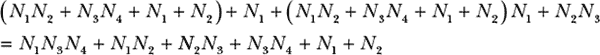

这个新方程具有代数度 3（即最多有几个比特相乘，这里是*N*[1]*N*[3]*N*[4]），而不是反馈函数的代数度 2，它有六个项而不是四个。因此，迭代非线性函数很快就会产生无法管理的方程，因为输出的大小呈指数增长。尽管在运行 NFSR 时你永远不会计算这些方程，但攻击者必须解决这些方程才能破解系统。

NFSR 的一个缺点是，没有有效的方法来确定 NFSR 的周期，或者简单地说，无法知道它的周期是否是最大周期。对于一个*n*比特的 NFSR，你需要进行接近 2^(*n*)次的试验来验证其周期是否为最大周期。对于 80 比特或更大的 NFSR，这个计算几乎是不可能的。

幸运的是，有一个技巧可以在不担心短周期的情况下使用 NFSR：你可以将 LFSR 和 NFSR 结合起来，从而获得一个保证的最大周期以及密码学强度——这正是 Grain-128a 的工作原理。

#### *Grain-128a*

记得在第四章中讨论的 AES 竞赛吗？它与 AES 分组密码有关。流密码 Grain 是一个类似项目的产物，名为 eSTREAM 竞赛。该竞赛于 2008 年结束，并公布了一份推荐的流密码候选名单，包含了四个面向硬件的密码和四个面向软件的密码。Grain 是这些硬件密码之一，Grain-128a 是 Grain 原作者提出的升级版。图 5-8 展示了 Grain-128a 的工作机制。

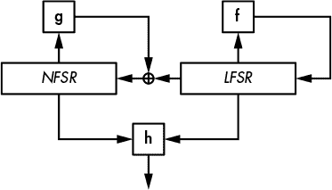

*图 5-8：Grain-128a 的机制，包含一个 128 比特的 NFSR 和一个 128 比特的 LFSR*

如图 5-8 所示，Grain-128a 可以说是尽可能简单的流密码，它结合了一个 128 比特的 LFSR，一个 128 比特的 NFSR，以及一个滤波函数**h**。LFSR 具有 2¹²⁸ – 1 的最大周期，这确保了整个系统的周期至少为 2¹²⁸ – 1，从而防止了 NFSR 中可能出现的短周期。同时，NFSR 和非线性滤波函数**h**增强了密码学强度。

Grain-128a 采用 128 比特的密钥和 96 比特的随机数（nonce）。它将 128 比特的密钥位复制到 NFSR 的 128 比特中，并将 96 比特的随机数位复制到 LFSR 的前 96 个比特中，剩下的 32 个比特用 1 填充，并在末尾加一个零比特。初始化阶段更新整个系统 256 次，然后才返回第一个密钥流比特。在初始化过程中，**h**函数返回的比特不会作为密钥流输出，而是进入 LFSR，确保其后续状态同时依赖于密钥和随机数。

Grain-128a 的 LFSR 反馈函数为

**f**(*L*) = *L*[32] + *L*[47] + *L*[58] + *L*[90] + *L*[121] + *L*[128]

其中，*L*[1]、*L*[2]、…、*L*[128]是 LFSR 的位。这种反馈函数仅取自 128 位 LFSR 中的 6 个位，但这些足以得到一个原始多项式，保证最大周期。较少的位数最小化了硬件实现的成本。

这是 Grain-128a 的 NFSR 反馈多项式（*N*[1]、…、*N*[128]）：

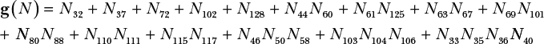

这个函数经过精心选择，以最大化其密码学强度，同时最小化实现成本。它的代数阶为 4，因为其包含最多变量的项有四个变量（即，*N*[33]*N*[35]*N*[36]*N*[40]）。此外，**g**无法通过线性函数近似，因为它是高度非线性的。此外，除了**g**，Grain-128a 还将来自 LFSRs 的位进行 XOR 运算，将结果反馈作为 NFSR 的新最右边的位。

过滤函数**h**是另一个非线性函数；它从 NFSR 中取 9 个位，从 LFSR 中取 7 个位，并以确保良好的密码学属性的方式将它们结合在一起。

在我写这段话的时候，Grain-128a 没有已知的攻击方法，我相信它将保持安全。Grain-128a 被用于一些低端嵌入式系统，这些系统需要紧凑且快速的流加密算法——通常是工业专有系统——这也是 Grain-128a 在开源软件社区中不为人知的原因。

#### *A5/1*

A5/1 是一种流加密算法，曾用于 2G 移动标准中的语音通信加密。A5/1 标准创建于 1987 年，但直到 1990 年代末期才发布，因为它是通过逆向工程得出的。2000 年代初出现了攻击方法，最终 A5/1 被破解，能够对加密通信进行实际（而非理论上的）解密。让我们来看看为什么以及如何发生的。

##### A5/1 的机制

A5/1 依赖于三个 LFSR，并使用一个乍一看很巧妙但实际上无法提供安全性的技巧（参见图 5-9）。

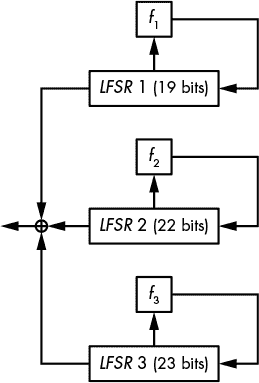

*图 5-9：A5/1 密码*

正如你在图 5-9 中看到的，A5/1 使用了 19、22 和 23 位的 LFSR，每个 LFSR 的多项式如下：

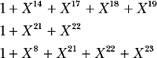

如何仅通过 LFSRs 而没有 NFSR 来认为这能被视为安全？其中的技巧在于 A5/1 的更新机制。A5/1 的设计者没有在每个时钟周期更新所有三个 LFSR，而是添加了一个时钟规则，执行以下操作：

1.  检查 LFSR 1 的第九位、LFSR 2 的第十一位和 LFSR 3 的第十一位，这些被称为*时钟位*。在这三个位中，要么它们的值都相同（1 或 0），要么恰好有两个值相同。

1.  时钟对那些时钟位与大多数值相同的寄存器进行时钟操作，0 或 1。每次更新时，可能会时钟两个或三个 LFSR。

如果没有这个简单的规则，A5/1 根本不会提供任何安全性，绕过这个规则就足以破解密码。然而，正如你将看到的那样，这并不容易实现。

**注意**

*在 A5/1 的不规则时钟规则中，每个寄存器在每次更新时有 3/4 的概率被时钟驱动。也就是说，至少有一个其他寄存器具有相同位值的概率是 1 – (1/2)²，其中(1/2)²是另外两个寄存器具有不同位值的机会。*

2G 通信使用具有 64 位密钥和 22 位随机数的 A5/1，每个数据帧都会更改该随机数。对 A5/1 的攻击可以恢复系统的 64 位初始状态（19 + 22 + 23 的 LFSR 初始值），进而揭示随机数（如果它尚未被知道）和密钥，通过解开初始化机制。这些攻击被称为*已知明文攻击（KPA）*，因为部分加密数据是已知的，这使得攻击者能够通过将密文与已知的明文片段进行异或运算来确定相应的密钥流部分。

对 A5/1 的攻击有两种主要类型：

**微妙攻击** 利用 A5/1 的内部线性性及其简单的不规则时钟系统

**暴力攻击** 仅利用 A5/1 的短密钥和帧号注入的可逆性

让我们看看这些攻击是如何工作的。

##### 微妙攻击

在一种叫做*猜测与确定*的微妙攻击中，攻击者猜测状态中的某些秘密值，以确定其他值。在密码分析中，“猜测”意味着暴力破解：对于 LFSR 1 和 LFSR 2 的每一个可能值，以及 LFSR 3 在前 11 次时钟期间的所有可能时钟位值，攻击者通过求解依赖于猜测位的方程式来重构 LFSR 3 的位。当猜测正确时，攻击者得到 LFSR 3 的正确值。

攻击的伪代码如下：

```
For all 219 values of LFSR 1's initial state
    For all 222 values of LFSR 2's initial state
        For all 211 values of LFSR 3's clocking bit during the first 11 clocks
            Reconstruct LFSR 3's initial state
            Test whether guess is correct; if yes, return; else continue
```

相较于在第三章中讨论的 2⁶⁴次暴力搜索，这种攻击的效率如何？在最坏情况下，当算法仅在最后一次测试时成功时，这种攻击最多进行 2¹⁹ × 2²² × 2¹¹ = 2⁵²次操作。假设上述伪代码中的最后两次操作所需的计算量与在暴力搜索中测试 64 位密钥相当，那么它比暴力搜索快 2¹²（即大约 4000）倍。但这个假设是否正确？

回想我们在第三章中对完整攻击成本的讨论。在评估攻击成本时，我们不仅需要考虑执行攻击所需的计算量，还需要考虑并行性和内存消耗。在这里，这两个问题都不是问题：与任何暴力攻击一样，猜测与确定攻击具有显著的并行性（或在*N*个核心上运行时速度是*N*倍），并且不需要比运行密码本身更多的内存。

我们对 2⁵²攻击成本的估计不准确，原因还有一个。实际上，2⁵²次操作（测试一个密钥候选）所需的时钟周期约为暴力破解攻击时的四倍。结果是，与暴力破解攻击相比，这种特定攻击的实际成本更接近 4 × 2⁵² = 2⁵⁴次操作。

对 A5/1 的猜测-确定攻击可以解密加密的移动通信，但在专用硬件设备集群上运行时，恢复密钥需要几个小时。换句话说，它远不能实现实时解密。要实现这一点，我们还有另一种攻击方式。

##### 残酷攻击

时间-内存权衡（TMTO）攻击就是对 A5/1 的残酷攻击。这种攻击不关心 A5/1 的内部实现；它只关心其状态是 64 位长的。TMTO 攻击将 A5/1 视为一个黑盒，输入 64 位值（状态），然后输出 64 位值（前 64 位密钥流）。

这种攻击的思想是，通过使用大量内存来降低暴力搜索的成本。最简单的 TMTO 类型是代码本攻击。在代码本攻击中，你预计算一个包含 2⁶⁴个元素的表格，表格中包含密钥和值对（key`:`value），并存储每个 2⁶⁴个可能密钥的输出值。要使用这个预计算的表格进行攻击，你只需收集一个 A5/1 实例的输出，然后在表格中查找哪个密钥对应该输出。攻击本身很快—只需要查找内存中的一个值的时间—但表格的创建需要进行 2⁶⁴次 A5/1 计算。更糟糕的是，代码本攻击需要大量的内存：2⁶⁴ × (64 + 64)位，即 2⁶⁸字节，或者 256 exabytes。这相当于数十个数据中心，所以我们可以忘掉这个方法。

TMTO 攻击通过增加攻击在线阶段的计算量，减少了代码本攻击所需的内存；表格越小，破解一个密钥所需的计算就越多。无论如何，准备表格仍需要大约 2⁶⁴次操作，但这只需要做一次。

2010 年，研究人员花费约两个月时间，使用图形处理单元（GPU）并行运行 100000 个 A5/1 实例，生成了两个 TB 大小的表格。在这些大型表格的帮助下，使用 A5/1 加密的通话几乎可以实时解密。电信运营商已实施解决方法来减轻这种攻击，但真正的解决方案出现在后来的 3G 和 4G 移动通信标准中，这些标准彻底放弃了 A5/1。

### 面向软件的流密码

软件流密码使用字节或 32 位或 64 位字（而不是单独的比特）进行操作，这在现代 CPU 上更为高效，因为指令在相同的时间内可以对字进行算术运算，和对比特操作是一样的。因此，软件流密码比硬件密码更适用于运行在个人计算机上的服务器或浏览器，在这些设备上，强大的通用处理器将密码作为原生软件运行。

今天，由于以下几个原因，软件流密码引起了相当大的兴趣。首先，由于许多设备嵌入了强大的 CPU，且硬件变得更便宜，因此对小型比特定向密码的需求减少了。例如，移动通信标准 4G 中的两个流密码（欧洲的 SNOW3G 和中国的 ZUC）使用 32 位字而不是比特，这与较旧的 A5/1 不同。

其次，流密码在软件中的流行度超过了块密码，特别是在对块密码的 CBC 模式填充 oracle 攻击事件之后。此外，流密码比块密码更容易指定和实现：流密码只是将密钥比特作为机密输入，而不是将消息和密钥比特混合在一起。事实上，最流行的流密码之一实际上是伪装成块密码的：以计数器模式（CTR）使用的 AES。

一种软件流密码设计，SNOW3G 和 ZUC 使用的设计，模仿硬件密码及其线性反馈移位寄存器（FSRs），将比特替换为字节或字。但这些设计对密码学家来说并不是最有趣的设计。截至本文写作时，最受关注的两种设计是 RC4 和 Salsa20，它们被应用于许多系统，尽管其中一种已经完全被攻破。

#### *RC4*

RC4 由 RSA 安全公司（RSA Security）的 Ron Rivest 于 1987 年设计，随后在 1994 年被逆向工程并泄露。RC4 长期以来是最广泛使用的流密码。RC4 已被应用于无数应用程序中，最著名的包括第一个 Wi-Fi 加密标准无线等效隐私（WEP）和用于建立 HTTPS 连接的传输层安全（TLS）协议。不幸的是，RC4 对大多数应用程序来说并不够安全，包括 WEP 和 TLS。为了理解原因，让我们看看 RC4 是如何工作的。

##### RC4 的工作原理

RC4 是迄今为止最简单的密码之一。它不执行任何类似密码学的操作，也没有异或、没有乘法、没有 S 盒……什么都没有。它只是交换字节。RC4 的内部状态是一个 256 字节的数组*S*，最初设置为*S*[0] = 0, *S*[1] = 1, *S*[2] = 2, … , *S*[255] = 255，然后通过*n*字节的*K*使用其*密钥调度算法*（*KSA*）初始化，具体工作方式如列表 5-1 中的 Python 代码所示。

```
j = 0
# set S to the array S[0] = 0, S[1] = 1, … , S[255] = 255
S = range(256)
# iterate over i from 0 to 255
for i in range(256):
    # compute the sum of v
    j = (j + S[i] + K[i % n]) % 256
    # swap S[i] and S[j]
    S[i], S[j] = S[j], S[i]
```

*列表 5-1：RC4 的密钥调度算法*

一旦这个算法完成，数组*S*仍然包含从 0 到 255 的所有字节值，但现在它们的顺序是随机的。例如，对于全零 128 位密钥，状态*S*（从*S*[0]到*S*[255]）变成了这样：

0, 35, 3, 43, 9, 11, 65, 229, (…), 233, 169, 117, 184, 31, 39

然而，如果我翻转第一个密钥位并重新运行 KSA，我会得到一个完全不同的、看似随机的状态：

32, 116, 131, 134, 138, 143, 149, (…), 152, 235, 111, 48, 80, 12

给定初始状态*S*，RC4 生成一个与明文*P*长度相同的密钥流*KS*，用于计算密文：*C* = *P* ⊕ *KS*。密钥流*KS*的字节是根据 S5-2 中的 Python 代码，从*S*计算得出的，如果*P*是*m*字节长。

```
i = 0
j = 0
for b in range(m):
    i = (i + 1) % 256
    j = (j + S[i]) % 256
    S[i], S[j] = S[j], S[i]
    KS[b] = S[(S[i] + S[j]) % 256]
```

*Listing 5-2: RC4 的密钥流生成，其中*S*是 Listing 5-1 中初始化的状态*

在 S5-2 中，每次`for`循环迭代会修改 RC4 的内部状态*S*中的最多 2 个字节：*S*[*i*]和*S*[*j*]，它们的值会被交换。也就是说，如果*i* = 0 且*j* = 4，并且如果*S*[0] = 56 且*S*[4] = 78，那么交换操作会将*S*[0]设为 78，将*S*[4]设为 56。如果*j*等于*i*，则*S*[*i*]不被修改。

这看起来过于简单，不足以保证安全，然而，密码学家花了 20 年才发现可被利用的漏洞。在这些漏洞被揭露之前，我们只知道 RC4 在特定实现中的弱点，正如在第一个 Wi-Fi 加密标准 WEP 中那样。

##### WEP 中的 RC4

WEP，第一代 Wi-Fi 安全协议，由于协议设计和 RC4 的弱点，现在已经完全被攻破。

在其 WEP 实现中，RC4 加密 802.11 帧的有效载荷数据，这些数据报（或数据包）在无线网络上传输数据。所有在同一会话中传输的有效载荷使用相同的 40 位或 104 位密钥，但帧头中编码了一个所谓的唯一的 3 字节 nonce（这是帧的部分，包含元数据，位于实际有效载荷之前）。看到问题了吗？

问题在于，RC4 不支持 nonce，至少在其官方规格中不支持，并且流加密算法在没有 nonce 的情况下无法使用。WEP 设计者通过一种变通方法解决了这个限制：他们在无线帧的头部加入了一个 24 位的 nonce，并将其添加到 WEP 密钥中，作为 RC4 的密钥。也就是说，如果 nonce 是字节*N*[0]、*N*[1]、*N*[2]，WEP 密钥是*K*[0]、*K*[1]、*K*[2]、*K*[3]、*K*[4]，那么实际的 RC4 密钥就是*N*[0]、*N*[1]、*N*[2]、*K*[0]、*K*[1]、*K*[2]、*K*[3]、*K*[4]。其结果是，40 位的密钥变成了 64 位有效密钥，104 位的密钥变成了 128 位有效密钥。结果呢？广告中所说的 128 位 WEP 协议实际上最多只能提供 104 位的安全性。

但是，WEP 的随机数（nonce）技巧存在真正的问题：

+   **nonce 太小，只有 24 位**。这意味着，如果每个新消息都随机选择一个 nonce，你需要等待大约 2^(24/2) = 2¹²个数据包，或者几兆字节的流量，才能找到两个使用相同 nonce 加密的数据包，从而得到相同的密钥流。即便 nonce 是一个从 0 到 2²⁴-1 的计数器，直到发生溢出，攻击者也需要几 GB 的数据才能找到重复的 nonce，从而使得攻击者能够解密数据包。但更大的问题是：

+   **以这种方式将 nonce 和密钥结合有助于恢复密钥**。WEP 的三个非机密的 nonce 字节使得攻击者可以在经过三次密钥调度算法迭代后确定*S*的值。因此，密码分析师发现，第一个密钥流字节强烈依赖于第一个机密密钥字节——即 KSA 处理的第四个字节——而且这种偏差可以被利用来恢复机密密钥。

利用这些弱点需要访问到密文和密钥流；也就是说，已知明文或选择明文。但这很容易做到：已知明文出现在 Wi-Fi 帧中，当这些帧封装了已知的头部数据时，选择明文则发生在攻击者注入已知明文并使用目标密钥加密的情况下。结果是，这些攻击在实际中有效，而不仅仅是纸面上有效。

在 2001 年首次出现 WEP 攻击后，研究人员发现了更快的攻击方法，只需要更少的密文。今天，你甚至可以找到像 aircrack-ng 这样的工具，来实现从网络嗅探到密码分析的整个攻击过程。

WEP 的不安全性既来源于 RC4 的缺陷，RC4 使用的是单一的一次性密钥，而不是像任何合适的流密码那样使用密钥和 nonce 的组合，也来源于 WEP 设计本身的缺陷。

现在，让我们看看 RC4 的第二大失败。

##### TLS 中的 RC4

TLS 是互联网上使用的最重要的安全协议。它最著名的是作为 HTTPS 连接的基础，但它也用于保护一些虚拟专用网络（VPN）连接、电子邮件服务器、移动应用程序等。可悲的是，TLS 长期以来一直支持 RC4。

与 WEP 不同，TLS 的实现并没有犯同样的明显错误，即为了使用公共 nonce 而修改 RC4 规格。相反，TLS 只是为 RC4 提供了一个唯一的 128 位会话密钥，这意味着它比 WEP 稍微安全一些。

TLS 的弱点仅仅是由于 RC4 及其不可原谅的缺陷：统计偏差或非随机性，而我们知道这是流密码的致命缺陷。例如，RC4 产生的第二个密钥流字节为零的概率为 1/128，而理想情况下应该是 1/256。（回想一下，一个字节可以取 0 到 255 之间的 256 个值；因此，一个真正随机的字节出现零的概率应该是 1/256。）更疯狂的是，尽管自 2001 年起就已经知道 RC4 的统计偏差，大多数专家直到 2013 年仍然继续信任 RC4。

RC4 的已知统计偏差本应足以让我们完全放弃这种加密算法，即使我们不知道如何利用这些偏差来破坏实际应用。在 TLS 中，RC4 的缺陷直到 2011 年才被公开利用，但据称，NSA 在那之前就已经利用 RC4 的弱点来破解 TLS 的 RC4 连接。

事实证明，RC4 的第二个密钥流字节有偏差，而前 256 个字节也都有偏差。2011 年，研究人员发现，这些字节中某个字节为零的概率等于 1/256 + *c*/256²，其中 *c* 是一个常数，取值范围在 0.24 到 1.34 之间。这不仅仅是针对字节零，其他字节值也存在这种偏差。RC4 的惊人之处在于，它在许多非加密的伪随机数生成器（PRNG）成功的地方失败——即生成均匀分布的伪随机字节（也就是说，每个 256 个字节中，每个字节出现的概率为 1/256）。

即使是最弱的攻击模型也可以用来利用 RC4 在 TLS 实现中的缺陷：基本上，你收集密文并寻找明文，而不是密钥。但有一个警告：你需要多条密文，使用不同的密钥多次加密 *相同的明文*。这种攻击模型有时被称为 *广播模型*，因为它类似于将相同的消息广播给多个接收者。

例如，假设你想要解密明文字节 *P*[1]，而你已经截获了多条相同消息的不同密文字节。那样，前四个密文字节将看起来像这样：

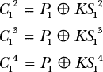

由于 RC4 的偏差，密钥流字节 *KS*[1]^(*i*) 更有可能为零，而不是其他字节值。因此，*C*[1]^(*i*) 字节更有可能等于 *P*[1]，而不是任何其他值。为了根据 *C*[1]^(*i*) 字节确定 *P*[1]，你只需计算每个字节值的出现次数，并返回出现频率最高的字节作为 *P*[1]。然而，由于统计偏差非常小，你需要数百万个字节值才能有足够的把握得到正确答案。

这个攻击可以推广到恢复多个明文字节，并利用多个偏差值（这里是零）。算法只会变得稍微复杂一些。然而，这个攻击难以付诸实践，因为它需要收集多条加密相同明文但使用不同密钥的密文。例如，这种攻击无法破解所有使用 RC4 的 TLS 保护连接，因为你需要欺骗服务器加密相同的明文并发送给多个接收者，或者用不同的密钥多次加密同一个接收者。

#### *Salsa20*

Salsa20 是一种简单的软件导向密码，针对现代 CPU 进行了优化，并已在众多协议和库中实现，以及它的变种 ChaCha。其设计者、备受尊敬的密码学家丹尼尔·J·伯恩斯坦（Daniel J. Bernstein）在 2005 年将 Salsa20 提交到 eSTREAM 竞赛，并成功获得 eSTREAM 软件组合中的一席之地。Salsa20 的简单性和速度使它在开发者中广受欢迎。

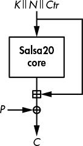

*图 5-10：Salsa20 对 512 位明文块的加密方案*

Salsa20 是一种基于计数器的流密码——它通过不断处理递增的计数器生成密钥流。正如在图 5-10 中所示，*Salsa20 核心*算法使用一个密钥（*K*）、一个随机数（*N*）和一个计数器值（*Ctr*）来转换一个 512 位的块。然后，Salsa20 将结果加到该块的原始值上，生成一个*密钥流块*。（如果算法直接返回核心的置换结果作为输出，Salsa20 将完全不安全，因为它可以被反转。最终将初始秘密状态*K* || *N* || *Ctr* 加入，使得转换从密钥到密钥流块不可逆。）

##### 四分之一轮函数

Salsa20 的核心置换使用一个叫做*四分之一轮*（**QR**）的函数来转换四个 32 位字（*a*，*b*，*c*，和*d*），如图所示：

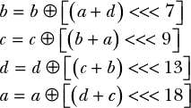

这四行是从上到下计算的，这意味着*b*的新值依赖于*a*和*d*，*c*的新值依赖于*a*和*b*的新值（因此也依赖于*d*），以此类推。

操作<<<是按字进行的左旋转，旋转的位数可以是 1 到 31 之间的任意值（对于 32 位字）。例如，<<< 8 表示将一个字的位向左旋转八个位，如以下示例所示：

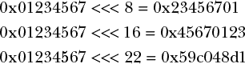

##### 转换 Salsa20 的 512 位状态

Salsa20 的核心置换将一个 512 位的内部状态视为一个 4 × 4 的 32 位字数组进行转换。图 5-11 显示了初始状态，使用了一个包含八个字（256 位）的密钥、两个字（64 位）的随机数、两个字（64 位）的计数器和四个固定的常数字（128 位），这些常数对于每次加密/解密以及所有块都是相同的。

为了转换初始的 512 位状态，Salsa20 首先将**QR**变换独立应用于所有四列（称为*列轮*），然后应用于所有四行（*行轮*），如图 5-12 所示。列轮/行轮的序列称为*双轮*。Salsa20 重复进行 10 个双轮，总共进行 20 轮，因此得名*Salsa20*。

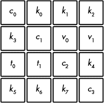

*图 5-11：Salsa20 状态的初始化*

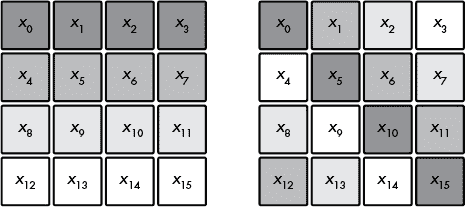

*图 5-12：Salsa20 的四分之一轮（**QR**）函数转化的列和行*

**列轮**将四列如图所示转换：


**行轮**通过以下方式转换行：

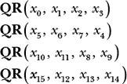

请注意，在列轮（column-round）中，每个**QR**都会按照从上到下的顺序接受 *x*[*i*] 参数，而行轮（row-round）的**QR**则将对角线上的单词作为第一个参数（如图 5-12 右侧的数组所示），而不是来自第一列的单词。

##### 评估 Salsa20

清单 5-3 显示了 Salsa20 在使用全零密钥（`00` 字节）和全一 nonce（`ff` 字节）初始化时，第一个和第二个块的初始状态。这两个状态仅在计数器中有一位差异，如粗体所示：具体来说，第一个块为 0，第二个块为 1。

```
61707865 00000000 00000000 00000000      61707865 00000000 00000000 00000000
00000000 3320646e ffffffff ffffffff      00000000 3320646e ffffffff ffffffff
00000000 00000000 79622d32 00000000      00000001 00000000 79622d32 00000000
00000000 00000000 00000000 6b206574      00000000 00000000 00000000 6b206574
```

*清单 5-3：使用全零密钥和全一 nonce 初始化的前两个块的 Salsa20 初始状态*

然而，尽管只有一位差异，但在经过 10 次双轮之后，各自的内部状态彼此之间完全不同，如清单 5-4 所示。

```
e98680bc f730ba7a 38663ce0 5f376d93      1ba4d492 c14270c3 9fb05306 ff808c64
85683b75 a56ca873 26501592 64144b6d      b49a4100 f5d8fbbd 614234a0 e20663d1
6dcb46fd 58178f93 8cf54cfe cfdc27d7      12e1e116 6a61bc8f 86f01bcb 2efead4a
68bbe09e 17b403a1 38aa1f27 54323fe0      77775a13 d17b99d5 eb773f5b 2c3a5e7d
```

*清单 5-4：经过 10 次 Salsa20 双轮后的清单 5-3 状态*

但是请记住，尽管密钥流块中的单词值看起来是随机的，但我们已经看到，这远不能保证安全性。RC4 的输出看起来是随机的，但它有明显的偏差。幸运的是，Salsa20 比 RC4 安全得多，并且没有统计偏差。

##### 差分密码分析

为了证明 Salsa20 比 RC4 更安全，我们来看看*差分密码分析*的基础，即研究状态之间的差异，而不是它们的实际值。例如，图 5-13 中的两个初始状态在计数器中有一位差异，或者在 Salsa20 的状态数组中由单词 *x*[8] 表示。这两个状态之间的逐位差异在这个数组中展示如下：

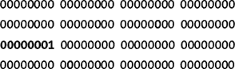

这两个状态之间的差异实际上是这两个状态的异或（XOR）。粗体显示的 1 位对应于这两个状态之间的 1 位差异。在两个状态的 XOR 中，任何非零的位都表示存在差异。

为了查看 Salsa20 的核心算法如何快速传播变化，我们来看一下初始状态在整个轮次迭代中的差异。经过一轮之后，差异传播到第一列的三个单词中的两个：

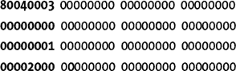

经过两轮后，差异进一步传播到已经包含差异的行中，除了第二行。此时，状态之间的差异相当稀疏；如图所示，单词内部的变化位数不多：

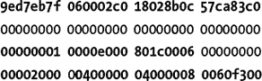

三轮之后，状态之间的差异变得更加密集，尽管许多零位表明许多比特位置仍然未受到初始差异的影响：

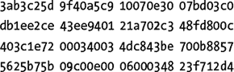

四轮之后，差异对于人类观察者看起来是随机的，从统计学角度来看，它们也几乎是随机的，如下所示：

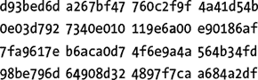

因此，仅经过四轮，一个单一的差异就会传播到 512 位状态的大部分位。在密码学中，这称为*完全扩散*。

我们已经看到差异在 Salsa20 的轮次中迅速传播。但不仅差异会跨越所有状态传播，它们还会按照复杂的方程传播，这使得未来的差异难以预测，因为高度的*非线性*关系推动了状态的演变，这要归功于 XOR、加法和旋转的混合。如果仅使用 XOR，差异仍然会传播，但过程将是线性的，因此不安全。

##### 攻击 Salsa20/8

Salsa20 默认进行 20 轮，但有时仅使用 12 轮，这个版本被称为 Salsa20/12，目的是使其运行更快。尽管 Salsa20/12 比 Salsa20 少了八轮，但它仍然比更弱的 Salsa20/8 强得多，后者只有八轮，且较少使用。

破解 Salsa20 理想情况下需要进行 2²⁵⁶次操作，因为它使用的是 256 位密钥。如果通过进行少于 2²⁵⁶次操作就能恢复密钥，那么该密码算法在理论上就被攻破了。这正是 Salsa20/8 的情况。

对 Salsa20/8 的攻击（在 2008 年发表的论文《拉丁舞蹈的新特征：Salsa、ChaCha 和 Rumba 的分析》中发布，我是该论文的共同作者，并因此获得了丹尼尔·J·伯恩斯坦颁发的密码分析奖）利用了 Salsa 核心算法在四轮之后的统计偏差来恢复八轮 Salsa20 的密钥。实际上，这主要是一个理论攻击：我们估计其复杂度为 2²⁵¹次核心函数操作——虽然不可能，但比破解预计的 2²⁵⁶复杂度要容易一些。

攻击不仅利用了 Salsa20/8 前四轮的偏差，还利用了最后四轮的一个特性：知道 nonce，*N*，和计数器，*Ctr*（请参考图 5-10），从密钥流反向计算回初始状态所需的唯一值是密钥，*K*。但如图 5-13 所示，如果你只知道*K*的某一部分，你可以在第四轮之前部分反转计算，并观察该中间状态的一些位——包括偏差位！只有当你正确猜测部分密钥时，才能观察到偏差；因此，偏差作为一个指示器，表明你得到了正确的密钥。

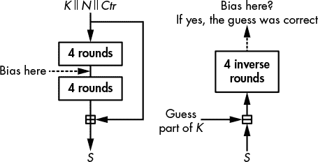

*图 5-13：Salsa20/8 攻击的原理*

在对 Salsa20/8 的实际攻击中，为了确定正确的猜测，我们需要猜测**220 位**的密钥，并且需要 2³¹对密钥流块，它们在 nonce 的差异上是相同的。一旦我们找到了正确的 220 位，我们只需暴力破解 36 位。暴力破解需要 2³⁶次操作，这一计算远远超过了找到这 220 位所需的 2²²⁰ × 2³¹ = 2²⁵¹次试验，这是攻击的第一部分所需的试验次数。

### 错误的地方

唉，流密码有许多可能出错的地方，从脆弱、不安全的设计到错误实现的强算法。我将在接下来的章节中探讨每类潜在问题。

#### *Nonce 重用*

流密码中最常见的失败是一个业余错误：当一个**nonce**与相同的密钥被多次重用时，就会发生这种错误。这会产生相同的密钥流，使你可以通过将两个密文进行异或操作来破解加密。这样，密钥流就会消失，剩下的就是两个明文的异或结果。

例如，Microsoft Word 和 Excel 的旧版本为每个文档使用了唯一的 nonce，但一旦文档被修改，nonce 就不会再改变。因此，旧版本文档的明文和加密文本可以用于解密后续加密版本。如果连 Microsoft 都犯下了这样的错误，你可以想象这个问题可能有多大。

一些在 2010 年代设计的流密码通过构建“抗滥用”结构（或即使 nonce 被重用也能保持安全的密码）来试图降低 nonce 重用的风险。然而，达到这种安全水平是有性能代价的，正如我们在第八章中看到的 SIV 模式一样。

#### *RC4 的错误实现*

尽管 RC4 已经很弱，但如果你盲目优化它的实现，它可能会变得更弱。例如，考虑 2007 年 Underhanded C Contest 中的一个例子，这是一个非正式的竞赛，程序员编写看似无害的代码，实际上包含恶意功能。

这是它的工作原理。在 RC4 算法中，实施`swap(S[i], S[j])`的最直接方式是按照下面的 Python 代码来操作：

```
buf = S[i]
S[i] = S[j]
S[j] = buf
```

交换两个变量的这种方法显然有效，但你需要创建一个新的变量，`buf`。为了避免这种情况，程序员通常使用*XOR 交换*技巧，如下所示，用来交换变量`x`和`y`的值：

```
x = x ⊕ y
y = x ⊕ y
x = x ⊕ y
```

这个技巧之所以有效，是因为第二行将`y`设置为`x ⊕ y`，然后第三行将`x`设置为`x ⊕ y ⊕ x ⊕ y ⊕ y = y`。使用这个技巧来实现 RC4 的结果，如清单 5-5 所示（改编自 Wagner 和 Biondi 提交的程序，参与了 Underhanded C Contest，并在线发布于*[`www.underhanded-c.org/_page_id_16.html`](http://www.underhanded-c.org/_page_id_16.html)*）。

```
# define TOBYTE(x) (x) & 255
# define SWAP(x,y) do { x^=y; y^=x; x^=y; } while (0)
static unsigned char S[256];
static int i=0, j=0;

void init(char *passphrase) {
    int passlen = strlen(passphrase);
    for (i=0; i<256; i++)
        S[i] = i;
    for (i=0; i<256; i++) {
        j = TOBYTE(j + S[TOBYTE(i)] + passphrase[j % passlen]);
        SWAP(S[TOBYTE(i)], S[j]);
    }
    i = 0; j = 0;
}

unsigned char encrypt_one_byte(unsigned char c) {
    int k;
    i = TOBYTE(i+1);
    j = TOBYTE(j + S[i]);
    SWAP(S[i], S[j]);
    k = TOBYTE(S[i] + S[j]);
    return c ^ S[k];
}
```

*清单 5-5：由于使用了 XOR 交换，RC4 的 C 语言实现错误*

现在停止阅读，尝试找出 Listing 5-5 中 XOR 交换的问题。

当 `i = j` 时，事情就会出问题。与其让状态保持不变，XOR 交换会将 `S[i]` 设置为 `S[i]` ⊕ `S[i] = 0`。实际上，每当密钥调度或加密过程中 `i` 等于 `j` 时，状态中的一个字节会被设置为零，最终导致全零状态，从而生成全零的密钥流。例如，当处理了 68KB 的数据后，256 字节状态中的大部分字节都变成了零，输出的密钥流看起来如下：

00 00 00 00 00 00 00 53 53 00 00 00 00 00 00 00 00 00 00 00 13 13 00 5c 00 a5 00 00 …

这里的教训是，避免过度优化你的加密实现。在加密学中，清晰和自信总是优于性能。

#### *弱加密算法嵌入硬件中*

当一个加密系统不再安全时，一些系统可以通过远程静默更新受影响的软件来迅速响应（例如某些付费电视系统），或通过发布新版本并提示用户升级（例如移动应用）。然而，其他一些系统就不那么幸运了，它们在升级到安全版本之前，必须坚持使用被攻破的加密系统，就像某些卫星电话那样。

在 2000 年代初期，美国和欧洲的电信标准化机构（TIA 和 ETSI）共同开发了两项卫星电话（satphone）通信标准。卫星电话类似于移动电话，只不过它们的信号通过卫星而不是地面站传输。其优势在于几乎可以在全球任何地方使用。它们的缺点是价格、质量、延迟以及，结果证明，安全性。

GMR-1 和 GMR-2 是大多数商业厂商（如 Thuraya 和 Inmarsat）采用的两种卫星电话标准。两者都包含流密码用于加密语音通信。GMR-1 的加密算法以硬件为导向，结合了四个线性反馈移位寄存器（LFSRs），类似于 A5/2，这是 2G 移动通信标准中故意不安全的加密算法，目的是为了服务于非西方国家。GMR-2 的加密算法以软件为导向，使用 8 字节状态和 S 盒。两种流密码都不安全，只能保护用户免受业余攻击，而无法防御国家级的机构。

这个故事应该提醒我们，流密码曾经比块密码更容易破解，而且它们更容易被破坏。为什么？嗯，如果你故意设计一个弱的流密码，当漏洞被发现时，你仍然可以把责任归咎于流密码的弱点，并否认任何恶意意图。

### 进一步阅读

要了解更多关于流密码的信息，可以从*[[`www.ecrypt.eu.org/stream/project.html`](http://www.ecrypt.eu.org/stream/project.html)]*的 eSTREAM 竞赛档案开始，在那里你将找到关于流密码的数百篇论文，包括 30 多个候选算法的细节以及许多攻击方法。其中一些最有趣的攻击方法包括相关攻击、代数攻击和立方攻击。特别可以参考 Courtois 和 Meier 的工作，了解前两种攻击类型，Dinur 和 Shamir 的工作则涉及立方攻击。

关于 RC4 的更多信息，可以参考 Paterson 及其团队的工作，*[[`www.isg.rhul.ac.uk/tls/`](http://www.isg.rhul.ac.uk/tls/)]*，这项工作研究了 RC4 在 TLS 和 WPA 中的安全性。同时也可以了解 Spritz，这是一种类似 RC4 的密码，由 Rivest 于 2014 年设计，他在 1980 年代设计了 RC4。

Salsa20 的遗产也值得关注。流密码 ChaCha 与 Salsa20 相似，但核心置换稍有不同，后来这种置换被用于哈希函数 BLAKE，如你将在第六章中看到的那样。这些算法都利用了 Salsa20 的软件实现技术，使用并行化指令，如在*[[`cr.yp.to/snuffle.html`](https://cr.yp.to/snuffle.html)]*中所讨论的。
