## 第七章：哈希函数


哈希函数——例如 MD5、SHA-1、SHA-256、SHA-3 和 BLAKE2——是加密学家的瑞士军刀：它们广泛应用于数字签名、公钥加密、完整性验证、消息认证、密码保护、密钥协商协议及许多其他加密协议中。无论是加密电子邮件、发送手机消息、连接 HTTPS 网站，还是通过 IPSec 或 SSH 连接远程机器，背后都可能有某种哈希函数在发挥作用。

哈希函数无疑是所有加密算法中最具多功能性和最为普及的。它们在现实世界中有很多应用实例：云存储系统利用哈希函数识别相同的文件并检测文件是否被修改；Git 版本控制系统利用哈希函数识别仓库中的文件；基于主机的入侵检测系统（HIDS）利用哈希值检测修改过的文件；基于网络的入侵检测系统（NIDS）通过哈希值检测通过网络的已知恶意数据；取证分析师使用哈希值证明数字文物未被篡改；比特币在其工作量证明系统中使用哈希函数——这些应用举不胜举。

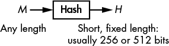

*图 6-1：哈希函数的输入和输出*

不同于流密码，流密码将一个短的输入转化为一个长的输出，哈希函数则接受一个长的输入并输出一个短的值，称为 *哈希值* 或 *摘要*（见 图 6-1）。

本章主要围绕两个主题展开。首先是安全性：什么样的哈希函数才算是安全的？为此，我介绍了两个关键概念——碰撞抵抗性和预影像抵抗性。第二个主要主题是哈希函数的构造。我们将研究现代哈希函数所使用的高层次技术，并回顾最常见的哈希函数：SHA-1、SHA-2、SHA-3 和 BLAKE2。最后，我们将看到如果不当使用，安全哈希函数也可能表现得不安全。

**注意**

*不要将加密哈希函数与* 非加密 *哈希函数混淆。非加密哈希函数用于数据结构，如哈希表或用于检测偶然错误，它们根本不提供任何安全性。例如，循环冗余检验（CRC）是非加密哈希函数，用于检测文件的偶然修改。*

### 安全哈希函数

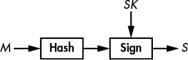

*图 6-2：数字签名方案中的哈希函数。哈希值充当消息的代理。*

哈希函数的安全性概念与我们之前看到的有所不同。密码算法保护数据的机密性，目的是确保明文传输的数据无法被读取，而哈希函数则保护数据的完整性，目的是确保数据——无论是明文还是加密——没有被修改。如果哈希函数是安全的，那么两份不同的数据应该始终有不同的哈希值。因此，一个文件的哈希值可以作为它的标识符。

考虑哈希函数的最常见应用：*数字签名*，或简称*签名*。当使用数字签名时，应用程序处理待签名消息的哈希值，而不是消息本身，如图 6-2 所示。哈希值充当消息的标识符。如果消息中的任何一位发生变化，消息的哈希值将完全不同。因此，哈希函数有助于确保消息没有被修改。签署消息的哈希值与签署消息本身一样安全，签署一个 256 位的短哈希值要比签署一个可能非常大的消息要快得多。事实上，大多数签名算法只能处理如哈希值这样短的输入。

#### *不可预测性再次出现*

哈希函数的所有加密强度都来自其输出的不可预测性。以接下来的 256 位十六进制值为例；这些哈希值是使用 NIST 标准哈希函数 SHA-256 计算的，输入为 ASCII 字母`a`、`b`和`c`。如你所见，尽管`a`、`b`和`c`仅相差一到两位（二进制：`a`是 01100001，`b`是 01100010，`c`是 01100011），它们的哈希值却完全不同。

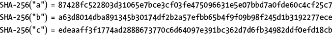

仅凭这三个哈希值，无法预测`d`的 SHA-256 哈希值或其中任何一位的值。为什么？因为安全哈希函数的哈希值是*不可预测的*。一个安全的哈希函数应该像一个黑盒子，每次接收到输入时都会返回一个随机字符串。

安全哈希函数的一般理论定义是，它的行为像一个真正的随机函数（有时称为*随机预言机*）。具体而言，安全哈希函数不应具有任何随机函数没有的特性或模式。这个定义对理论学者有帮助，但在实际应用中我们需要更具体的概念：即预影像抗性和碰撞抗性。

#### *预影像抗性*

给定哈希值*H*的*预影像*是任何消息*M*，使得**Hash**(*M*) = *H*。预影像*抗性*描述了这样一个安全保证：给定一个随机的哈希值，攻击者永远无法找到该哈希值的预影像。事实上，哈希函数有时被称为*单向* *函数*，因为你可以从消息得到其哈希值，但无法反向操作得到原消息。

首先，注意到即使有无限的计算能力，哈希函数也无法反转。例如，假设我使用 SHA-256 哈希函数对某个消息进行哈希，并得到这个 256 位的哈希值：

`f67a58184cef99d6dfc3045f08645e844f2837ee4bfcc6c949c9f7674367adfd`

即使有无限的计算能力，你也永远无法确定我选择的*那个*消息来生成这个特定的哈希值，因为有许多消息哈希到相同的值。因此，你会找到*一些*生成这个哈希值的消息（可能包括我选择的那个），但你无法确定我使用的消息。

例如，一个 256 位哈希（这是实际中常用的哈希函数长度）有 2²⁵⁶个可能的值，但例如 1024 位消息有更多的值（即，2¹⁰²⁴个可能的值）。因此，平均而言，每个可能的 256 位哈希值将有 2¹⁰²⁴ / 2²⁵⁶ = 2^(1024 - 256) = 2⁷⁶⁸个 1024 位的预像。

在实际应用中，我们必须确保几乎不可能找到*任何*映射到给定哈希值的消息，而不仅仅是使用的消息，这正是预像抗性的含义。具体来说，我们讨论的是第一预像抗性和第二预像抗性。*第一预像抗性*（或简称*预像抗性*）描述的是几乎不可能找到一个映射到给定值的消息的情况。另一方面，*第二预像抗性*描述的是在给定一个消息*M*[1]的情况下，几乎不可能找到另一个消息*M*[2]，使得*M*[1]和*M*[2]哈希到相同的值。

##### 预像的代价

给定一个哈希函数和一个哈希值，你可以通过尝试不同的消息直到找到目标哈希来搜索第一个预像。你可以使用类似于 Listing 6-1 中`find-preimage()`的算法来完成这项工作。

```
find-preimage(H) {
    repeat {
        M = random_message()
        if Hash(M) == H then return M
     }
}
```

*Listing 6-1：安全哈希函数的最优预像搜索算法*

在 Listing 6-1 中，`random_message()`生成一个随机消息（例如，随机的 1024 位值）。显然，如果哈希的位长*n*足够大，`find-preimage()`将永远无法完成，因为平均需要 2^(*n*)次尝试才能找到一个预像。当处理*n* = 256 时，这种情况是绝望的，就像现代的 SHA-256 和 BLAKE2 哈希一样。

##### 为什么第二预像抗性较弱

我声明，如果你能找到第一个预像，你也能找到第二个预像（对于相同的哈希函数）。作为证明，如果算法`solve-preimage()`返回给定哈希值的一个预像，你可以使用 Listing 6-2 中的算法来找到某个消息*M*的第二个预像。

```
solve-second-preimage(M) {
    H = Hash(M)
    return solve-preimage(H)
}
```

*Listing 6-2：如果你能找到第一个预像，如何找到第二个预像*

也就是说，你可以通过将其视为预映像问题并应用预映像攻击来找到第二预映像。由此可以得出，任何二次预映像抗性的哈希函数也是预映像抗性的。（如果不是，它也不会是二次预映像抗性的，按前面的`solve-second-``preimage`算法来判断。）换句话说，我们可以用来找到第二预映像的最佳攻击几乎与我们用来找到第一次预映像的最佳攻击完全相同（除非哈希函数存在某些缺陷，允许更高效的攻击）。另请注意，预映像搜索攻击本质上与块密码或流密码的密钥恢复攻击相同——即，对单一魔法值的暴力搜索。

#### *碰撞抗性*

无论你选择使用什么哈希函数，由于*鸽巢原理*，碰撞是不可避免的。鸽巢原理表明，如果你有*m*个孔和*n*只鸽子要放入这些孔中，并且如果*n*大于*m*，那么至少有一个孔里必须有多于一只鸽子。

**注意**

*这可以推广到其他物品和容器。例如，美国宪法中任何 27 个单词的序列，至少包含两个以相同字母开头的单词。在哈希函数的世界中，孔是哈希值，鸽子是消息。因为我们知道可能的消息数量远远超过哈希值的数量，所以碰撞*必须*存在。*

然而，尽管碰撞是不可避免的，碰撞应该和原始消息一样难以找到，才能使一个哈希函数被认为是*碰撞抗性*的——换句话说，攻击者不应该能够找到两个哈希值相同的不同消息。

碰撞抗性的概念与二次预映像抗性的概念相关：如果你能找到哈希函数的第二预映像，你也能找到碰撞，正如清单 6-3 所示。

```
solve-collision() {
    M = random_message()
    return (M, solve-second-preimage(M))
}
```

*清单 6-3：天真碰撞搜索算法*

也就是说，任何碰撞抗性的哈希函数也是二次预映像抗性的。如果不是这样的话，就会有一个高效的`solve-second-preimage`算法可用于破解碰撞抗性。

#### *找到碰撞*

找到碰撞比找到预映像要快，大约需要 2^(*n*/2)次操作，而不是 2^(*n*)，这要归功于*生日攻击*，其关键思想如下：给定*N*个消息和相同数量的哈希值，通过考虑每一对哈希值的*对*，你可以产生*N* × (*N* – 1) / 2 个潜在的碰撞（一个与*N*²数量级相同的数字）。之所以称之为*生日*攻击，是因为它通常使用所谓的*生日悖论*来说明，即只有 23 个人的群体，便有 1/2 的概率包含两个人拥有相同的生日。

**注意**

N × (N – *1*) / 2 是两个*不同*消息对的数量，我们除以 2，因为我们把* (M[1], M[2])* 和* (M[2], M[1])* 视为相同的对。换句话说，我们不在乎顺序。

为了进行比较，在预影像搜索的情况下，*N* 个消息只会得到 *N* 个候选预影像，而相同的 *N* 个消息则给出大约 *N*² 个潜在碰撞，正如前面所讨论的那样。通过 *N*² 而不是 *N*，我们可以说找到解决方案的机会是*二次*增长的。搜索的复杂度也因此*二次*降低：为了找到一个碰撞，你只需要使用 2^(*n*/2) 个消息，也就是 2^(*n*/2)，而不是 2^(*n*)。

##### 天真的生日攻击

下面是执行生日攻击以寻找碰撞的最简单方法：

1.  计算 2^(*n*/2) 个哈希值，对 2^(*n*/2) 个任意选择的消息进行哈希，并将所有消息/哈希对存储在一个列表中。

1.  根据哈希值对列表进行排序，以便将所有相同的哈希值放置在一起。

1.  在排序列表中搜索，找到两个连续的条目，它们具有相同的哈希值。

不幸的是，这种方法需要大量内存（足以存储 2^(*n*/2) 个消息/哈希对），而且排序大量元素会减慢搜索速度，使用快速排序算法时平均需要进行约 *n*2^(*n*) 次基本操作。

##### 低内存碰撞搜索：Rho 方法

*Rho 方法*是一种寻找碰撞的算法，与天真的生日攻击不同，它只需要少量的内存。它的工作原理如下：

1.  给定一个 *n* 位的哈希值，选择一个随机的哈希值 (*H*[1])，并定义 *H*[1] = *H′*[1]。

1.  计算 *H*[2] = **Hash**(*H*[1])，以及 *H′*[2] = **Hash**(**Hash**(*H′*[1])); 也就是说，在第一个情况下，我们应用哈希函数一次，而在第二个情况下，我们应用两次。

1.  反复进行该过程，计算 *H*[*i*] [+ 1] = **Hash**(*H*[*i*])， *H′*[*i*] [+ 1] = **Hash**(**Hash**(*H′*[*i*]))，直到你找到 *i* 使得 *H*[*i*] [+ 1] = *H′*[*i*] [+ 1]。

图 6-3 将帮助你可视化攻击，其中例如从 *H*[1] 到 *H*[2] 的箭头表示 *H*[2] = **Hash**(*H*[1])。请注意，*H*[*i*] 的序列最终进入一个循环，也称为 *cycle*，其形状类似于希腊字母 rho (ρ)。这个循环从 *H*[5] 开始，并且具有碰撞 **Hash**(*H*[4]) = **Hash**(*H*[10]) = *H*[5]。这里的关键观察是，要找到碰撞，你只需要找到这样的一个循环。上面的算法允许攻击者检测循环的位置，因此找到碰撞。

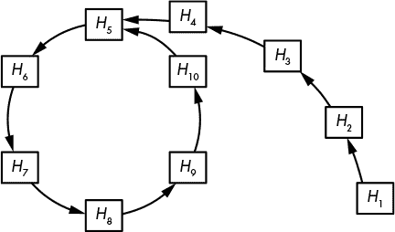

*图 6-3：Rho 哈希函数的结构。每个箭头表示一次哈希函数的评估。以 *H[5]* 为起点的循环对应一个碰撞，***Hash***(H[4]) = ***Hash***(H[10]) = H[5]。

高级碰撞查找技术通过首先检测循环的起始位置，再找到碰撞，而不需要在内存中存储大量值，也不需要排序长列表。Rho 方法需要大约 2^(*n*/2)次操作才能成功。事实上，图 6-3 的哈希值要比实际的 256 位或更长的摘要函数少得多。平均而言，循环和尾部（从图 6-3 中*H*[1]到*H*[5]的部分）每个包含大约 2^(*n*/2)个哈希值，其中*n*是哈希值的位长度。因此，您需要至少 2^(*n*/2) + 2^(*n*/2)次哈希评估才能找到碰撞。

### 构建哈希函数

在 1980 年代，密码学家意识到对消息进行哈希的最简单方法是将其拆分为多个块，并使用相似的算法依次处理每个块。这种策略被称为*迭代哈希*，它有两种主要形式：

+   使用*压缩函数*进行迭代哈希，该函数将输入转换为*较小的输出*，如图 6-4 所示。这种技术也被称为*Merkle–Damgård*构造（以密码学家 Ralph Merkle 和 Ivan Damgård 的名字命名）。

+   使用一个将输入转换为相同大小输出的函数进行迭代哈希，使得任何两个不同的输入产生两个不同的输出（即*置换*），如图 6-7 所示。这样的函数被称为*海绵函数*。

接下来我们将讨论这些构造如何实际运作，以及压缩函数在实践中的样子。

#### *基于压缩的哈希函数：Merkle–Damgård 构造*

从 1980 年代到 2010 年代开发的所有哈希函数都基于 Merkle–Damgård（M-D）构造：MD4、MD5、SHA-1 及 SHA-2 家族，以及较不为人知的 RIPEMD 和 Whirlpool 哈希函数。M-D 构造虽然并不完美，但它简单且已证明对于许多应用足够安全。

**注意**

*在 MD4、MD5 和 RIPEMD 中，*MD*代表*消息摘要*，而不是 Merkle–Damgård。*

为了对消息进行哈希，M-D 构造将消息拆分成大小相同的块，并使用压缩函数将这些块与内部状态混合，如图 6-4 所示。这里，*H*[0]是内部状态的初始值（记作 IV），*H*[1]、*H*[2]、…被称为*链值*，而内部状态的最终值即为消息的哈希值。

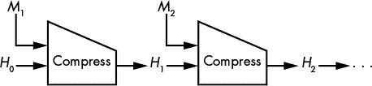

*图 6-4：使用名为 Compress 的压缩函数的 Merkle–Damgård 构造*

消息块通常是 512 或 1024 位，但原则上可以是任意大小。然而，给定哈希函数的块长度是固定的。例如，SHA-256 使用 512 位块，而 SHA-512 使用 1024 位块。

##### 填充块

如果你想哈希一个无法分割成完整块的消息会发生什么呢？例如，如果块是 512 位，那么一个 520 位的消息将包含一个 512 位块加上 8 位。在这种情况下，M–D 结构将按如下方式形成最后一个块：取剩余的比特块（在我们的例子中是 8 位），附加 1 位，然后附加 0 位，最后附加原始消息的长度，并以固定的比特数进行编码。这种填充技巧确保了任何两个不同的消息都会产生不同的块序列，从而得到不同的哈希值。

例如，如果你使用 SHA-256 对 8 位字符串 10101010 进行哈希运算，而 SHA-256 是一个具有 512 位消息块的哈希函数，那么第一个且唯一的块将以比特形式如下所示：

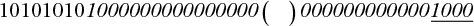

这里，消息的比特是前八个比特（10101010），而填充比特是所有后续的比特（以斜体显示）。块末尾的 *1000*（下划线部分）是消息的长度，或以二进制编码的 8。填充最终生成一个由单个 512 位块组成的 512 位消息，准备好由 SHA-256 的压缩函数处理。

##### 安全性保障

Merkle-Damgård 结构本质上是一种将小的、固定长度输入的安全压缩函数转换为接受任意长度输入的安全哈希函数的方法。如果一个压缩函数是抗预像和抗碰撞的，那么基于它使用 M–D 结构构建的哈希函数也将具有抗预像和抗碰撞的特性。这是因为任何成功的预像攻击都可以转化为针对压缩函数的成功预像攻击，正如 Merkle 和 Damgård 在他们 1989 年的论文中所展示的那样（见“进一步阅读” 第 126 页）。碰撞的情况也是如此：攻击者无法破解哈希函数的碰撞抗性，除非首先破解底层压缩函数的碰撞抗性；因此，后者的安全性保障了哈希的安全性。

请注意，反向的论点是错误的，因为压缩函数的碰撞不一定会导致哈希函数的碰撞。对于链接值 *X* 和 *Y*（都不同于 *H*[0]），**Compress**(*X*, *M*[1]) = **Compress**(*Y*, *M*[2]) 的碰撞不会给你哈希碰撞，因为你不能将碰撞插入到哈希的迭代链中——除非其中一个链值恰好是 *X*，另一个是 *Y*，但这种情况发生的可能性极低。

##### 查找多重碰撞

*多重碰撞* 发生在三个或更多消息哈希到相同的值时。例如，三元组 (*X*, *Y*, *Z*)，使得 **Hash**(*X*) = **Hash**(*Y*) = **Hash**(*Z*) 被称为 *3-碰撞*。理想情况下，多重碰撞应该比碰撞更难发现，但有一个简单的技巧可以在几乎与单一碰撞相同的成本下找到它们。其工作原理如下：

1.  找到第一次碰撞：**Compress**(*H*[0], *M*[1.1]) = **Compress**(*H*[0], *M*[1.2]) = *H*[1]。现在你有一个 2-碰撞，或两个消息哈希到相同的值。

1.  用 *H*[1] 作为起始链式值找到第二次碰撞：**Compress**(*H*[1], *M*[2.1]) = **Compress**(*H*[1], *M*[2.2]) = *H*[2]。现在你有一个 4-碰撞，四个消息哈希到相同的值 *H*[2]：*M*[1.1] || *M*[2.1]，*M*[1.1] || *M*[2.2]，*M*[1.2] || *M*[2.1]，和 *M*[1.2] || *M*[2.2]。

1.  重复并找到 *N* 次碰撞，你将得到 2^(*N*) *N* 块消息哈希到相同的值，或者 2^(*N*)-碰撞，代价是“大约”只有 *N*2^(*N*) 次哈希计算。

在实践中，这个技巧并不特别实用，因为它首先要求你找到一个基本的 2-碰撞。

##### 构建压缩函数：Davies-Meyer 构造

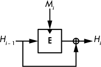

*图 6-5：Davies-Meyer 构造。黑色三角形显示了块密码的密钥输入位置。*

实际哈希函数中使用的所有压缩函数，例如 SHA-256 和 BLAKE2，都基于块密码，因为这是构建压缩函数的最简单方式。图 6-5 显示了基于块密码的压缩函数中最常见的，即 *Davies-Meyer 构造*。

给定一个消息块，*M*[*i*]，和前一个链式值 *H*[*i* − 1]，Davies-Meyer 压缩函数使用块密码 **E** 来计算新的链式值，公式如下：

*H[i]* = **E**(*M[i]*, *H*[*i* − 1]) ⊕ *H*[*i* − 1]

消息块 *M*[*i*] 充当块密码的密钥，链式值 *H*[*i*] [– 1] 充当其明文块。只要块密码是安全的，结果的压缩函数也是安全的，并且具有抗碰撞和抗原像性。若没有前一个链式值的 XOR 操作（⊕ *H*[*i*] [– 1]），Davies-Meyer 将不安全，因为你可以反转它，通过使用块密码的解密函数，从新的链式值推导出前一个链式值。

**注意**

*Davies-Meyer 构造有一个令人惊讶的性质：你可以找到* 固定点，*或者链式值，在应用压缩函数和给定消息块后保持不变。只需要取* H[*i* – 1] = **D**(M[i], *0) 作为链式值，其中* **D** *是与**E**对应的解密函数。* 新的链式值* H[i] *因此等于原始的* H[i – 1]：

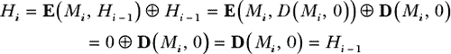

*我们得到* H[i] = H[i – 1] *因为将零的解密值输入加密函数会得到零——即项 **E***(M[i], ***D***(M[i], *0))——只留下 ⊕ H[i – 1] *部分，作为压缩函数输出的表达式。你可以找到 SHA-2 函数的压缩函数的固定点，类似于标准的 MD5 和 SHA-1，它们也基于 Davies-Meyer 构造。幸运的是，固定点并不是安全隐患。*

除了 Davies–Meyer 之外，还有许多基于分组密码的压缩函数，如图 6-6 所示，但它们不太流行，因为它们更复杂或要求消息数据块与链值的长度相同。

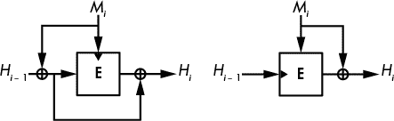

*图 6-6：其他安全的基于分组密码的压缩函数构造*

#### *基于置换的哈希函数：海绵函数*

经过数十年的研究，密码学家已知晓基于分组密码的哈希技术的所有知识。但难道就没有一种更简单的哈希方法吗？为什么要使用分组密码这种需要密钥的算法，而哈希函数不需要密钥？为什么不使用固定密钥的分组密码，结合单一的置换算法来构建哈希函数？

那些更简单的哈希函数被称为海绵函数，它们使用单一的置换而不是压缩函数和分组密码（参见图 6-7）。海绵函数不是使用分组密码将消息位与内部状态混合，而是直接执行异或操作。海绵函数不仅比 Merkle–Damgård 函数更简单，而且更具通用性。你会发现它们不仅用作哈希函数，还可以用作确定性随机位生成器、流密码、伪随机函数（参见第七章）和认证密码（参见第八章）。最著名的海绵函数是 Keccak，也称为 SHA-3。

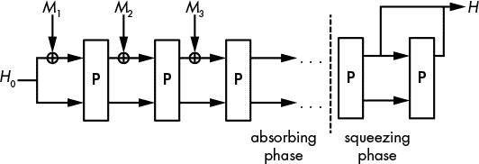

*图 6-7：海绵构造*

海绵函数的工作方式如下：

1.  它将第一个消息数据块*M*[1]与**H**[0]进行异或操作，**H**[0]是预定义的内部状态初始值（例如，全零字符串）。消息数据块的大小相同，且小于内部状态的大小。

1.  置换**P**将内部状态转换为另一个相同大小的值。

1.  它对数据块*M*[2]进行异或操作，并再次应用**P**，然后对消息数据块*M*[3]、*M*[4]等重复此操作。这称为*吸收阶段*。

1.  在注入所有消息数据块后，它再次应用**P**，并从状态中提取一块比特形成哈希。（如果需要更长的哈希，重复应用**P**并提取一块。）这称为*挤压阶段*。

海绵函数的安全性取决于其内部状态的长度和数据块的长度。如果消息块的长度为 *r* 位，内部状态的长度为 *w* 位，那么有 *c* = *w* – *r* 位的内部状态是无法被消息块修改的。*c* 的值称为海绵函数的 *容量*，而海绵函数所保证的安全级别是 *c*/2。例如，为了在使用 64 位消息块时达到 256 位的安全性，内部状态应该是 *w* = 2 × 256 + 64 = 576 位。当然，安全级别还取决于哈希值的长度 *n*。因此，碰撞攻击的复杂度是 2^(*n*/2) 和 2^(*c*/2) 之间的最小值，而第二预影像攻击的复杂度是 2^(*n*) 和 2^(*c*/2) 之间的最小值。

为了确保安全，置换 **P** 应该像随机置换一样运作，没有统计偏差，也没有允许攻击者预测输出的数学结构。与基于压缩函数的哈希一样，海绵函数也会对消息进行填充，但由于不需要包含消息的长度，填充更加简单。最后的消息位后面跟着一个 1 位，接着是必要数量的零位。

### SHA 哈希函数族

安全哈希算法（SHA）哈希函数是由美国国家标准与技术研究院（NIST）为非军事的美国联邦政府机构定义的标准。它们被认为是全球标准，只有一些非美国政府出于主权原因而选择自己的哈希算法（如中国的 SM3、俄罗斯的 Streebog 和乌克兰的 Kupyna），而非因对 SHA 安全性的缺乏信任。美国的 SHA 哈希函数比非美国的哈希函数经过了更多密码分析学家的审查。

**注意**

*消息摘要 5 (MD5) 是从 1992 年到大约 2005 年最流行的哈希函数，直到它被攻破为止，许多应用程序随后转向了某种 SHA 哈希函数。MD5 处理 512 位的消息块并更新一个 128 位的内部状态以生成一个 128 位的哈希，从而提供最多 128 位的预影像安全性和 64 位的碰撞安全性。1996 年，密码分析师警告 MD5 的压缩函数存在碰撞问题，但他们的警告没有得到重视，直到 2005 年，中国的密码分析团队发现了如何计算 MD5 哈希的碰撞。直到现在，计算 MD5 的碰撞只需要几秒钟，但许多系统仍然使用或支持 MD5，通常是出于向后兼容的原因。*

#### *SHA-1*

SHA-1 标准源于美国国家安全局（NSA）原始 SHA-0 哈希函数的失败。1993 年，NIST 将 NSA 的 SHA-0 哈希算法标准化，但在 1995 年，NSA 发布了 SHA-1 以修复 SHA-0 中未明示的安全问题。1998 年，两个研究人员发现如何在大约 2⁶⁰ 次操作中找到 SHA-0 的碰撞，而不是预期的 2⁸⁰ 次操作（对于 160 位哈希函数，如 SHA-0 和 SHA-1）。后来的攻击将复杂度降低到大约 2³³ 次操作，使得 SHA-0 在不到一小时内出现实际碰撞。

##### SHA-1 内部结构

SHA-1 结合了 Merkle–Damgård 哈希函数和基于特制块密码的 Davies–Meyer 压缩函数，后者有时被称为 SHACAL。即，SHA-1 通过对 512 位消息块（*M*）迭代以下操作工作：

*H* = **E**(*M*, *H*) + *H*

这里使用加号（+）而不是 ⊕（异或）是有意为之。**E**(*M*, *H*) 和 *H* 被视为 32 位整数的数组，每个相同位置的两个字被加在一起：**E**(*M*, *H*) 的第一个 32 位字与 *H* 的第一个 32 位字相加，依此类推。*H* 的初始值对于任何消息都是常量，然后根据上述公式修改 *H*，处理完所有块后，返回 *H* 的最终值作为消息的哈希值。

一旦使用消息块作为密钥，并将当前 160 位链接值作为明文块运行块密码，得到的 160 位结果被视为五个 32 位字的数组，每个字与初始 *H* 值中的相应 32 位字相加。

列表 6-4 显示了 SHA-1 的压缩函数 `SHA1-compress()`：

```
SHA1-compress(H, M) {
    (a0, b0, c0, d0, e0) = H   // parsing H as five 32-bit big endian words
    (a, b, c, d, e) = SHA1-blockcipher(a0, b0, c0, d0, e0, M)
    return (a + a0, b + b0, c + c0, d + d0, e + e0)
}
```

*列表 6-4：SHA-1 的压缩函数*

SHA-1 的块密码 `SHA1-blockcipher()`，在 列表 6-5 中以粗体显示，接受一个 512 位消息块 *M* 作为密钥，通过迭代 80 步短序列的操作，将五个 32 位字（`a`、`b`、`c`、`d` 和 `e`）转换，替换字 `a` 为所有五个字的组合。然后，它会像移位寄存器一样将数组中的其他字移动。

```
SHA1-blockcipher(a, b, c, d, e, M) {
    W = expand(M)
    for i = 0 to 79 {
        new = (a <<< 5) + f(i, b, c, d) + e + K[i] + W[i]
        (a, b, c, d, e) = (new, a, b >>> 2, c, d)
    }
    return (a, b, c, d, e)
}
```

*列表 6-5：SHA-1 的块密码*

在 列表 6-6 中显示的 `expand()` 函数通过将 *W* 的前 16 个字设置为 *M*，并将其余字设置为前面字的异或组合（左移一位），从 16 字消息块创建了一个由 80 个 32 位字组成的数组 *W*。

```
expand(M) {
    // the 512-bit M is seen as an array of sixteen 32-bit words
    W = empty array of eighty 32-bit words
    for i = 0 to 79 {
        if i < 16 then W[i] = M[i]
        else
            W[i] = (W[i – 3] ⊕ W[i – 8] ⊕ W[i – 14] ⊕ W[i – 16]) <<< 1
    }
    return W
}
```

*列表 6-6：SHA-1 的 expand() 函数*

在 列表 6-6 中的 `<<< 1` 操作是 SHA-1 和 SHA-0 函数之间的唯一差异。

最后，`f()` 函数（见 列表 6-7）在 `SHA1-blockcipher()` 中是一个基本的按位逻辑操作（布尔函数）序列，取决于轮次。

```
f(i, b, c, d) {
    if i < 20 then return ((b & c) ⊕ (~b & d))
    if i < 40 then return (b ⊕ c ⊕ d)
    if i < 60 then return ((b & c) ⊕ (b & d) ⊕ (c & d))
    if i < 80 then return (b ⊕ c ⊕ d)
}
```

*列表 6-7：SHA-1 的 f() 函数*

在列表 6-7 中的第二和第四个布尔函数仅仅是将三个输入字进行 XOR 运算，这是一种线性操作。相比之下，第一和第三个函数使用非线性 & 运算符（逻辑与）来防止差分密码分析，差分密码分析正如你记得的那样，利用了位差传播的可预测性。如果没有 & 运算符（换句话说，如果 `f()` 始终是 `b` ⊕ `c` ⊕ `d`，例如），那么通过追踪内部状态中的模式，SHA-1 将很容易被破解。

##### SHA-1 攻击

尽管比 SHA-0 更安全，但 SHA-1 仍然不安全，这也是 Chrome 浏览器将使用 SHA-1 的 HTTPS 网站标记为不安全的原因。尽管其 160 位哈希应该赋予其 80 位碰撞抗性，但在 2005 年，研究人员发现了 SHA-1 的弱点，并估计找到一个碰撞大约需要 2⁶³ 次计算。（如果算法完美无缺，这个数字应该是 2⁸⁰）。真正的 SHA-1 碰撞直到十二年后才出现，当时，Marc Stevens 和其他研究人员通过与 Google 研究人员的合作，展示了两个相撞的 PDF 文档（见 *[`shattered.io/`](https://shattered.io/)*）。

结论是你不应该使用 SHA-1。如前所述，互联网浏览器现在将 SHA-1 标记为不安全，NIST 也不再推荐 SHA-1。请改用 SHA-2 哈希函数，或者 BLAKE2 或 SHA-3。

#### *SHA-2*

SHA-2 是 SHA-1 的继任者，由 NSA 设计并由 NIST 标准化。SHA-2 是四个哈希函数的系列：SHA-224、SHA-256、SHA-384 和 SHA-512，其中 SHA-256 和 SHA-512 是两个主要算法。这些三位数字表示每个哈希的位长。

##### SHA-256

开发 SHA-2 的最初动机是生成更长的哈希，从而提供比 SHA-1 更高的安全性。例如，虽然 SHA-1 的链接值为 160 位，但 SHA-256 的链接值为 256 位，或者说是八个 32 位字。SHA-1 和 SHA-256 都有 512 位的消息块；然而，SHA-1 执行 80 轮，而 SHA-256 执行 64 轮，通过 `expand256()` 函数将 16 字的消息块扩展为 64 字的消息块，这在列表 6-8 中有所展示。

```
expand256(M) {
    // the 512-bit M is seen as an array of sixteen 32-bit words
    W = empty array of sixty-four 32-bit words
    for i = 0 to 63 {
        if i < 16 then W[i] = M[i]
        else {
            // the ">>" shifts instead of a ">>>" rotates and is not a typo
            s0 = (W[i – 15] >>> 7) ⊕ (W[i – 15] >>> 18) ⊕ (W[i – 15] >> 3)
            s1 = (W[i – 2] >>> 17) ⊕ (W[i – 2] >>> 19) ⊕ (W[i – 2] >> 10)
            W[i] = W[i – 16] + s0 + W[i – 7] + s1
        }
    }
    return W
}
```

*列表 6-8：SHA-256 的 expand256() 函数*

请注意，SHA-2 的 `expand256()` 消息扩展比 SHA-1 的 `expand()` 更为复杂，后者如之前在列表 6-6 中所示，简单地执行 XOR 和 1 位旋转。而 SHA-256 的压缩函数的主要循环也比 SHA-1 更复杂，每次迭代执行 26 次算术操作，而 SHA-1 只有 11 次。再一次，这些操作是 XOR、逻辑与（AND）和字旋转。

##### 其他 SHA-2 算法

SHA-2 系列包括 SHA-224，它与 SHA-256 在算法上完全相同，唯一不同的是其初始值是一组不同的 8 个 32 位字，而其哈希值长度为 224 位，而不是 256 位，并且该值取自最终链接值的前 224 位。

SHA-2 系列还包括 SHA-512 和 SHA-384 算法。SHA-512 与 SHA-256 相似，只是它使用 64 位字而不是 32 位字。因此，它使用 512 位的链接值（8 个 64 位字），并处理 1024 位的消息块（16 个 64 位字），并执行 80 轮操作，而不是 64 轮。压缩函数在其他方面几乎与 SHA-256 相同，只是为适应更宽的字大小，旋转距离有所不同。（例如，SHA-512 包含操作`a >>> 34`，如果是 SHA-256 的 32 位字，这个操作就没有意义。）SHA-384 是 SHA-512 的变种，类似于 SHA-224 与 SHA-256 的关系——也就是说，相同的算法，只是初始值不同，最终的哈希值被截断为 384 位。

从安全性角度来看，所有四个 SHA-2 版本至今都兑现了它们的承诺：SHA-256 保证 256 位的原像抗性，SHA-512 则保证约 256 位的碰撞抗性，等等。然而，SHA-2 函数的安全性没有得到真正的证明；我们讨论的只是可能的安全性。

尽管如此，在 MD5 和 SHA-1 遭遇实际攻击之后，研究人员和 NIST 开始对 SHA-2 的长期安全性产生担忧，因为 SHA-2 与 SHA-1 相似，许多人认为 SHA-2 被攻击只是时间问题。然而，截至目前，我们尚未看到对 SHA-2 的成功攻击。不管怎样，NIST 制定了备选方案：SHA-3。

#### *SHA-3 竞赛*

2007 年宣布的 NIST 哈希函数竞赛（SHA-3 竞赛的官方名称）开始时发布了征集公告，并给出了基本要求：哈希算法的安全性和速度至少要与 SHA-2 一样，并且至少要具备与 SHA-2 相同的功能。SHA-3 的候选算法还应该与 SHA-1 和 SHA-2 有足够的区别，以避免遭受破坏 SHA-1 甚至 SHA-2 的攻击。到 2008 年，NIST 收到了来自全球的 64 个提交，包括来自大学和大型企业（如 BT、IBM、微软、Qualcomm 和索尼等）的提交。在这 64 个提交中，51 个符合要求，进入了第一轮比赛。

在竞赛的最初几周，密码分析师们对各个提交进行了毫不留情的攻击。2009 年 7 月，NIST 宣布了 14 个第二轮候选算法。经过 15 个月对这些候选算法的分析和评估，NIST 选出了五个决赛入围者：

**BLAKE** 是一种增强型 Merkle-Damgård 哈希，其压缩函数基于块密码，块密码又基于流密码 ChaCha 的核心函数，包括一系列加法、XOR 运算和字轮转。BLAKE 由一个包括我在内的瑞士和英国的学术研究团队设计。

**Grøstl** 一种增强型 Merkle–Damgård 哈希，其压缩函数使用基于 AES 块密码核心功能的两种置换（或固定密钥块密码）。Grøstl 由来自丹麦和奥地利的七位学术研究人员团队设计。

**JH** 一种调整过的海绵函数构造，其中消息块在置换之前和之后都被注入，而不仅仅是在之前。该置换还执行类似于替代–置换块密码的操作（如第四章所讨论）。JH 由一位来自新加坡大学的密码学家设计。

**Keccak** 一种海绵函数，其置换仅执行按位操作。Keccak 由一个位于比利时和意大利的半导体公司工作的四人密码学家团队设计，其中包括 AES 的两位设计者之一。

**Skein** 一种基于不同于 Merkle–Damgård 操作模式的哈希函数，其压缩函数基于一种新型块密码，仅使用整数加法、XOR 和字轮转。Skein 由来自学术界和工业界的八位密码学家团队设计，其中除了一个人之外，其他人均位于美国，包括著名的布鲁斯·施奈尔（Bruce Schneier）。

在对五个候选算法进行了广泛分析后，NIST 宣布 Keccak 为最终获胜者。NIST 的报告称 Keccak 具有“优雅的设计、大的安全余量、良好的通用性能、卓越的硬件效率和灵活性”。让我们来看一下 Keccak 是如何工作的。

#### *Keccak (SHA-3)*

NIST 选择 Keccak 的原因之一是它与 SHA-1 和 SHA-2 完全不同。首先，它是一种海绵函数。Keccak 的核心算法是一种 1600 位状态的置换，它可以处理 1152、1088、832 或 576 位的块，分别产生 224、256、384 或 512 位的哈希值——这与 SHA-2 哈希函数产生的四种长度相同。但与 SHA-2 不同，SHA-3 使用单一核心算法来处理所有四种哈希长度，而不是使用两种算法。

另一个原因是 Keccak 不仅仅是一个哈希。SHA-3 标准文档 FIPS 202 定义了四种哈希——SHA3-224、SHA3-256、SHA3-384 和 SHA3-512——以及两种算法，分别为 SHAKE128 和 SHAKE256。(*SHAKE*代表*带 Keccak 的安全哈希算法*)。这两种算法是*可扩展输出函数*（*XOFs*），即可以生成可变长度哈希的哈希函数，甚至可以生成非常长的哈希值。数字 128 和 256 代表每个算法的安全级别。

FIPS 202 标准本身冗长且难以解析，但你会发现开源实现通常速度较快，并且比规范更容易理解该算法。例如，Markku-Juhani O. Saarinen 的 MIT 许可证 tiny_sha3 (*[`github.com/mjosaarinen/tiny_sha3/`](https://github.com/mjosaarinen/tiny_sha3/)* )在 19 行 C 代码中解释了 Keccak 的核心算法，部分代码如 Listing 6-9 所示。

```
static void sha3_keccakf(uint64_t st[25], int rounds)
{
    (⊕)
    for (r = 0; r < rounds; r++) {

     ❶ // Theta 
        for (i = 0; i < 5; i++)
            bc[i] = st[i] ^ st[i + 5] ^ st[i + 10] ^ st[i + 15] ^ st[i + 20];

        for (i = 0; i < 5; i++) {
            t = bc[(i + 4) % 5] ^ ROTL64(bc[(i + 1) % 5], 1);
            for (j = 0; j < 25; j += 5)
                st[j + i] ^= t;
        }

     ❷ // Rho Pi
        t = st[1];
        for (i = 0; i < 24; i++) {
            j = keccakf_piln[i];
            bc[0] = st[j];
            st[j] = ROTL64(t, keccakf_rotc[i]);
            t = bc[0];
        }

     ❸ // Chi
        for (j = 0; j < 25; j += 5) {
            for (i = 0; i < 5; i++)
                bc[i] = st[j + i];
            for (i = 0; i < 5; i++)
                st[j + i] ^= (~bc[(i + 1) % 5]) & bc[(i + 2) % 5];
        }

     ❹ // Iota
        st[0] ^= keccakf_rndc[r];
    }
    (⊕)
}
```

*Listing 6-9: tiny_sha3 实现*

tiny_sha3 程序实现了 Keccak 的置换**P**，这是对一个 1600 位状态的可逆变换，状态被视为 25 个 64 位字的数组。查看代码时，请注意它会迭代一系列回合，每个回合由四个主要步骤组成（如❶、❷、❸和❹所标记）：

+   第一步，`Theta` ❶，包括 64 位字之间的 XOR 操作，或是对字的 1 位旋转值进行 XOR（`ROTL64(w, 1)`操作是将字`w`向左旋转 1 位）。

+   第二步，`Rho Pi` ❷，包括将 64 位字旋转，通过硬编码在`keccakf_rotc[]`数组中的常数进行旋转。

+   第三步，`Chi` ❸，包括更多的 XOR 操作，但也包含 64 位字之间的逻辑与（& 运算符）。这些与操作是 Keccak 中唯一的非线性操作，它们带来了加密强度。

+   第四步，`Iota` ❹，包括与一个 64 位常数进行 XOR 操作，该常数被硬编码在`keccakf_rndc[]`中。

这些操作为 SHA-3 提供了一个强大的置换算法，没有任何偏差或可利用的结构。SHA-3 是经过十多年研究的成果，数百名经验丰富的密码分析师都未能破解它。它在短时间内不太可能被破解。

### BLAKE2 哈希函数

安全性可能是最重要的，但速度排在第二位。我见过许多开发者仅仅因为 MD5 比 SHA-1 快，而不愿意从 MD5 切换到 SHA-1，或者因为 SHA-2 比 SHA-1 明显更慢，而不愿从 SHA-1 切换到 SHA-2。不幸的是，SHA-3 并没有比 SHA-2 更快，并且由于 SHA-2 仍然安全，因此升级到 SHA-3 的动机不大。那么，如何比 SHA-1 和 SHA-2 更快地进行哈希并且更加安全呢？答案就在哈希函数 BLAKE2 中，它是在 SHA-3 竞赛后发布的。

**注意**

*完全披露：我是 BLAKE2 的设计者之一，和 Samuel Neves、Zooko Wilcox-O’Hearn、Christian Winnerlein 一起设计的。*

BLAKE2 的设计考虑了以下几点：

+   它应该至少与 SHA-3 同样安全，甚至可能更强。

+   它应该比所有之前的哈希标准都更快，包括 MD5。

+   它应该适用于现代应用程序，能够处理大量数据，无论是作为少量大消息还是大量小消息，带或不带秘密密钥。

+   它应该适用于支持多核系统并行计算的现代 CPU，以及单核中的指令级并行性。

该工程过程的结果是一对主要的哈希函数：

+   BLAKE2b（或简称 BLAKE2），针对 64 位平台进行了优化，能够生成从 1 到 64 字节不等的哈希值。

+   BLAKE2s，针对 8 到 32 位平台进行了优化，能够生成从 1 到 32 字节不等的哈希值。

每个函数都有一个并行变体，可以利用多个 CPU 核心。BLAKE2b 的并行版本 BLAKE2bp 可以在四个核心上运行，而 BLAKE2sp 可以在八个核心上运行。前者在现代服务器和笔记本电脑的 CPU 上最快，并且在笔记本电脑 CPU 上的哈希速度接近 2 Gbps。事实上，BLAKE2 是目前最快的安全哈希，其速度和特点使它成为最受欢迎的非 NIST 标准哈希。BLAKE2 被广泛应用于各种软件，并已集成到 OpenSSL 和 Sodium 等主要的加密库中。

**注意**

*你可以在* [`blake2.net/`](https://blake2.net/) *找到 BLAKE2 的规格和参考代码，* [`github.com/BLAKE2/`](https://github.com/BLAKE2/) *可以下载优化过的代码和库。参考代码还提供了 BLAKE2X，这是 BLAKE2 的扩展，可以生成任意长度的哈希值。*

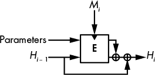

*图 6-8：BLAKE2 的压缩函数。在分组密码之后，状态的两个半部分通过异或操作结合。*

BLAKE2 的压缩函数，如图 6-8 所示，是 Davies-Meyer 构造的一个变种，采用参数作为附加输入——即一个 *计数器*（确保每个压缩函数的行为像不同的函数）和一个 *标志*（指示压缩函数是否正在处理最后一个消息块，以提高安全性）。

BLAKE2 压缩函数中的分组密码基于流密码 ChaCha，而 ChaCha 本身是第五章讨论的 Salsa20 流密码的变种。在这个分组密码中，BLAKE2b 的核心操作由以下一系列操作组成，这些操作通过两个消息字 *M*[*i*] 和 *M*[*j*] 转换四个 64 位字的状态：

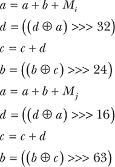

BLAKE2s 的核心操作类似，但使用的是 32 位而不是 64 位字（因此使用不同的旋转值）。

### 错误发生的方式

尽管哈希函数表面上看起来很简单，但当在错误的地方或以错误的方式使用时，可能会引发严重的安全问题——例如，当像 CRC 这样的弱校验和算法被用来替代加密哈希函数检查文件完整性，尤其是在传输数据的网络应用中。然而，这种弱点与一些其他弱点相比显得微不足道，后者可能会导致看似安全的哈希函数完全失效。我们将看到两个失败的例子：第一个例子适用于 SHA-1 和 SHA-2，但不适用于 BLAKE2 或 SHA-3，而第二个例子适用于这四个函数。

#### *长度扩展攻击*

*长度扩展攻击*，如图 6-9 所示，是对 Merkle-Damgård 构造的主要威胁。

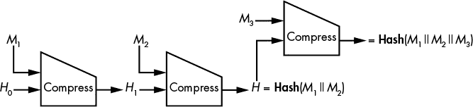

*图 6-9：长度扩展攻击*

基本上，如果你知道某个*未知*消息*M*的**哈希**(*M*)，它由块*M*[1]和*M*[2]（经过填充）组成，你可以为任何块*M*[3]确定**哈希**(*M*[1] || *M*[2] || *M*[3])。因为*M*[1] || *M*[2]的哈希值是紧接着*M*[2]之后的链式值，你可以添加另一个块*M*[3]到哈希消息中，即使你不知道已经哈希的数据。而且，这个技巧可以推广到任何数量的未知消息块（这里是*M*[1] || *M*[2]）或后缀（*M*[3]）。

长度扩展攻击不会影响哈希函数的大多数应用，但如果哈希函数使用得过于创意，它可能会危及安全。不幸的是，SHA-2 哈希函数容易受到长度扩展攻击，尽管 NSA 设计了这些函数，而 NIST 也在两者都知道这个缺陷的情况下对它们进行了标准化。这个缺陷本可以通过让最后一次压缩函数调用与其他所有调用不同来避免（例如，在前面的调用使用 0 位时，最后一次调用可以使用 1 位作为额外参数）。实际上，BLAKE2 就是这样做的。

#### *欺骗存储证明协议*

云计算应用已在*存储证明*协议中使用哈希函数——即，协议中服务器（云服务提供商）向客户端（云存储服务的用户）证明服务器确实存储了它应该为客户端存储的文件。

2007 年，Ramakrishna Kotla、Lorenzo Alvisi 和 Mike Dahlin 发表的论文“SafeStore: A Durable and Practical Storage System” *([`www.cs.utexas.edu/~lorenzo/papers/p129-kotla.pdf`](https://www.cs.utexas.edu/~lorenzo/papers/p129-kotla.pdf)*) 提出了一个存储证明协议来验证某个文件*M*的存储，具体如下：

1.  客户端随机选择一个值，*C*，作为*挑战*。

1.  服务器计算**哈希**(*M* || *C*)作为*响应*并将结果发送给客户端。

1.  客户端还计算**哈希**(*M* || *C*)并检查它是否与从服务器接收到的值匹配。

论文的前提是，服务器不应该能够欺骗客户端，因为如果服务器不知道*M*，它就无法猜测**哈希**(*M* || *C*)。但有一个问题：实际上，**哈希**将是一个迭代哈希，它按块处理输入，每个块之间计算中间链式值。例如，如果**哈希**是 SHA-256，而*M*的长度为 512 位（即 SHA-256 中的一个块大小），那么服务器可以作弊。如何作弊？当服务器第一次接收到*M*时，它计算 *H*[1] = **压缩**(*H*[0], *M*[1])，这是从 SHA-256 的初始值*H*[0]和 512 位的*M*中得到的链式值。然后它将 *H*[1] 记录在内存中并丢弃 *M*，此时它不再存储 *M*。

现在，当客户端发送一个随机值*C*时，服务器计算**Compress**(*H*[1], *C*)，并在*C*上添加填充以填满一个完整的块，然后将结果作为**Hash**(*M* || *C*)返回。客户端随后会认为，由于服务器返回了**Hash**(*M* || *C*)的正确值，它持有完整的消息——但是，正如你所看到的，事实可能并非如此。

这个技巧适用于 SHA-1、SHA-2、SHA-3 和 BLAKE2。解决方案很简单：请求**Hash**(*C* || *M*)而不是**Hash**(*M* || *C*)。

### 进一步阅读

想深入了解哈希函数，可以阅读 1980 年代和 1990 年代的经典文献：例如拉尔夫·梅尔克尔的《单向哈希函数与 DES》和伊万·达姆高德的《哈希函数的设计原则》。另外，还可以阅读第一篇全面研究基于分组密码的哈希方法的论文《基于分组密码的哈希函数：一种综合方法》，该文由普雷内尔、戈瓦尔茨和范德瓦尔勒撰写。

想了解更多碰撞搜索的内容，可以阅读 1997 年由范·奥尔肖特和维纳撰写的论文《带有密码分析应用的并行碰撞搜索》。想深入了解支撑预映像抗性、碰撞抗性以及长度扩展攻击的理论安全概念，可以搜索*不可区分性*。

有关哈希函数的最新研究，请参阅 SHA-3 竞赛的档案，其中包括所有不同的算法及其被破解的方式。你可以在* [`ehash.iaik.tugraz.at/wiki/The_SHA-3_Zoo`](http://ehash.iaik.tugraz.at/wiki/The_SHA-3_Zoo) *上找到关于 SHA-3 Zoo 的许多参考资料，另一个是在 NIST 的页面，* [`csrc.nist.gov/groups/ST/hash/sha-3/`](http://csrc.nist.gov/groups/ST/hash/sha-3/) *。

想了解更多关于 SHA-3 冠军 Keccak 和海绵函数的内容，请访问* [`keccak.noekeon.org/`](http://keccak.noekeon.org/) *和* [`sponge.noekeon.org/`](http://sponge.noekeon.org/) *，这是 Keccak 设计者的官方网站。

最后但同样重要的是，研究以下两个弱哈希函数的实际利用案例：

+   国家级恶意软件 Flame 利用了 MD5 碰撞来制造伪造证书，并伪装成合法的软件。

+   Xbox 游戏主机使用了一个弱的分组密码（称为 TEA）来构建哈希函数，这被利用来破解主机并在其上运行任意代码。
