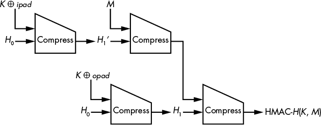
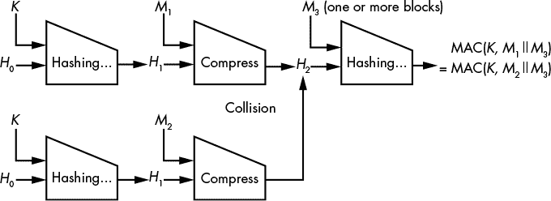
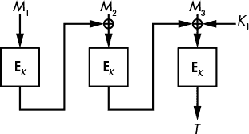
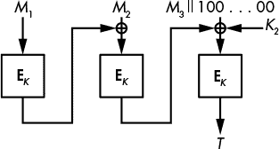
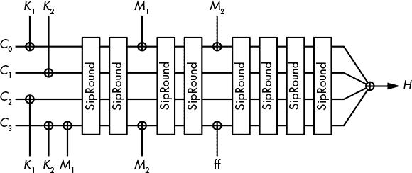
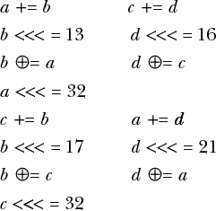

## 带密钥的哈希


第六章 中讨论的哈希函数接受一条消息并返回其哈希值——通常是一个 256 位或 512 位的短字符串。任何人都可以计算一条消息的哈希值，并验证特定消息是否哈希到特定值，因为其中没有涉及秘密值，但有时你不希望随便让任何人做这个操作。这就是 *带密钥* 的哈希函数的作用，或者说是使用秘密密钥的哈希。

带密钥的哈希形式是两种重要加密算法的基础：*消息认证码（MAC）*，它用于认证消息并保护其完整性，以及 *伪随机函数（PRF）*，它生成随机看似的哈希大小值。在本章的第一节中，我们将探讨为什么 MAC 和 PRF 是相似的；然后我们将回顾实际的 MAC 和 PRF 如何工作。一些 MAC 和 PRF 基于哈希函数，一些基于块加密算法，其他的则是原创设计。最后，我们将回顾一些攻击示例，这些攻击对其他安全的 MAC 进行攻击。

### 消息认证码（MAC）

MAC 通过生成一个值 *T* = **MAC**(*K*, *M*) 来保护消息 *M* 的完整性和真实性，这个值被称为消息的认证标签 *T*（通常令人困惑地称为 *M* 的 MAC）。就像你知道加密算法的密钥可以解密消息一样，如果你知道 MAC 的密钥，你也可以验证消息是否被篡改。

例如，假设 Alex 和 Bill 共享一个密钥 *K*，并且 Alex 向 Bill 发送消息 *M* 及其认证标签 *T* = **MAC**(*K*, *M*)。收到消息和认证标签后，Bill 重新计算 **MAC**(*K*, *M*) 并检查它是否等于收到的认证标签。因为只有 Alex 能够计算出这个值，Bill 知道消息在传输过程中没有被篡改（确认完整性），无论是意外的还是恶意的，并且消息是由 Alex 发送的（确认真实性）。

#### *MAC 在安全通信中的应用*

安全通信系统通常结合使用加密算法和 MAC 来保护消息的机密性、完整性和真实性。例如，互联网协议安全（IPSec）、安全外壳协议（SSH）和传输层安全（TLS）中的协议都会为每个传输的网络数据包生成一个 MAC。

并非所有通信系统都使用 MAC。有时候，认证标签会给每个数据包增加不可接受的开销，通常在 64 到 128 位之间。例如，3G 和 4G 移动电话标准对编码语音通话的数据包进行加密，但并不进行认证。攻击者可以修改加密的音频信号，接收者却无法察觉。因此，如果攻击者破坏了加密的语音数据包，它将解密为噪声，听起来像是静电噪音。

#### *伪造和选择消息攻击*

对于 MAC（消息认证码）来说，什么才算安全呢？首先，与加密算法一样，秘密密钥应该保持机密。如果一个 MAC 是安全的，攻击者在不知道密钥的情况下，不能创建某个消息的标签。这样伪造的消息/标签对被称为*伪造*，而恢复密钥只是一个更广泛的攻击类别——*伪造攻击*——的特定案例。提出“伪造应该无法找到”的安全概念称为*不可伪造性*。显然，从标签列表中恢复秘密密钥应该是不可能的；否则，攻击者可以使用密钥伪造标签。

攻击者可以做什么来破坏 MAC 呢？换句话说，攻击模型是什么？最基本的模型是*已知消息攻击*，即被动收集消息及其关联的标签（例如，通过窃听网络）。但真正的攻击者通常会发起更强大的攻击，因为他们通常可以选择要认证的消息，从而获得他们想要的消息的 MAC。因此，标准模型是*选择消息攻击*，即攻击者获得他们选择的消息的标签。

#### *重放攻击*

MAC 并不安全于涉及标签*重放*的攻击。例如，如果你窃听了 Alex 和 Bill 的通信，你可以捕获 Alex 发送给 Bill 的消息及其标签，并在稍后再次将这些信息发送给 Bill，假装是 Alex。为了防止这种*重放攻击*，协议会在每个消息中包含一个消息编号。每个新消息的编号都会递增，并与消息一起进行认证。接收方会收到编号为 1、2、3、4 等的消息。因此，如果攻击者试图再次发送编号为 1 的消息，接收方会注意到该消息的顺序不对，并且这可能是之前编号为 1 的消息的重放。

### 伪随机函数（PRF）

PRF（伪随机函数）是一种使用秘密密钥返回**PRF**(*K*, *M*)的函数，其输出看起来是随机的。因为密钥是保密的，攻击者无法预测输出值。

与 MAC 不同，PRF 并不打算单独使用，而是作为密码学算法或协议的一部分。例如，PRF 可以用于创建在第 55 页“如何构建分组密码”中讨论的 Feistel 结构中的分组密码。密钥衍生方案使用 PRF 从主密钥或密码中生成加密密钥，身份验证方案使用 PRF 从随机挑战中生成响应。（基本上，服务器发送一个随机挑战消息，*M*，客户端在响应中返回**PRF**(*K*, *M*)以证明它知道*K*。）4G 电话标准使用 PRF 来验证 SIM 卡及其服务提供商，类似的 PRF 还用于生成电话通话期间使用的加密密钥和 MAC 密钥。TLS 协议使用 PRF 从主密钥以及会话特定的随机值中生成密钥材料。甚至 Python 语言内置的非加密`hash()`函数中也有一个 PRF，用于比较对象。

#### *伪随机函数（PRF）安全性*

为了确保安全性，伪随机函数的输出应该没有任何模式，不能与真正的随机值区分开来。一个不知道密钥的攻击者，*K*，不应该能够区分**PRF**(*K*, *M*)的输出与随机值的区别。从另一个角度来看，攻击者应该无法知道他们是在与一个 PRF 算法进行交互，还是在与一个随机函数交互。这个安全性概念的学术术语是*与* *随机* *函数不可区分性*。（要了解更多关于 PRF 的理论基础，请参见 Goldreich 的《*密码学基础*》第一卷第 3.6 节。）

#### *为什么 PRF 比 MAC 更强*

PRF 和 MAC 都是基于密钥的哈希，但 PRF 在本质上比 MAC 更强，主要是因为 MAC 的安全要求较弱。MAC 被认为是安全的，如果标签无法伪造——也就是说，MAC 的输出不能被猜测——而 PRF 只有在其输出是不可区分的随机字符串时才被认为是安全的，这是一项更强的要求。如果 PRF 的输出不能与随机字符串区分开来，那么意味着它们的值无法被猜测；换句话说，任何安全的 PRF 也是一个安全的 MAC。

然而，反过来并不成立：一个安全的 MAC 不一定是一个安全的 PRF。例如，假设你从一个安全的 PRF，**PRF1**，开始，并且你想从它构建一个第二个 PRF，**PRF2**，像这样：

**PRF2**(*K*, *M*) = **PRF1**(*K*, *M*) || 0

因为**PRF2**的输出定义为**PRF1**的输出后跟一个 0 位，它看起来不像一个真正的随机字符串，你可以通过那个最后的 0 位来区分它的输出。因此，**PRF2**不是一个安全的 PRF。然而，由于**PRF1**是安全的，**PRF2**仍然可以作为一个安全的 MAC。为什么？因为如果你能够伪造一个标签，*T* = **PRF2**(*K*, *M*)，对于某个*M*，那么你也能够伪造一个**PRF1**的标签，而我们知道，伪造**PRF1**的标签本来就是不可能的，因为**PRF1**是一个安全的 MAC。因此，**PRF2**是一个带密钥的哈希，它是一个安全的 MAC，但不是一个安全的 PRF。

但别担心：你在实际应用中不会遇到这种 MAC 构造。事实上，许多已经部署或标准化的 MAC 也是安全的 PRF，且经常同时作为两者使用。例如，TLS 使用 HMAC-SHA-256 算法既作为 MAC，也作为 PRF。

### 从无密钥哈希创建带密钥哈希

在密码学的历史中，MAC 和 PRF 很少是从头开始设计的，而是基于现有算法，通常是基于哈希函数或块加密算法构建的。一种看似显而易见的方式是给（无密钥的）哈希函数输入一个密钥和一个消息，但这并非易事，正如我接下来要讨论的那样。

#### *秘密前缀构造*

我们将要审视的第一个技术，称为*秘密前缀构造*，通过将密钥加到消息前面并返回**Hash**(*K* || *M*), 将一个普通的哈希函数转变为带密钥的哈希函数。尽管这种方法并不总是错误，但当哈希函数易受长度扩展攻击（如在《长度扩展攻击》第 125 页中讨论的那样）和哈希函数支持不同长度的密钥时，它可能会不安全。

##### 对长度扩展攻击的脆弱性

回想一下第六章，SHA-2 家族的哈希函数允许攻击者在给定较短版本消息的哈希值时，计算出部分未知消息的哈希值。从形式上讲，*长度扩展*攻击允许攻击者计算出**Hash**(*K* || *M*[1] || *M*[2])，只需知道**Hash**(*K* || *M*[1])，而无需知道*M*[1]或*K*。这些函数允许攻击者免费伪造有效的 MAC 标签，因为他们本不应该能够仅凭*M*[1]的 MAC 来猜测*M*[1] || *M*[2]的 MAC。这一事实使得秘密前缀构造在使用 SHA-256 或 SHA-512 时与 MAC 和 PRF 一样不安全。Merke–Damgård 的弱点就是允许长度扩展攻击，而 SHA-3 的所有最终候选算法都不存在这个问题。抵御长度扩展攻击的能力是 SHA-3 提交的强制要求。

##### 不同密钥长度带来的脆弱性

当秘密前缀构造允许使用不同长度的密钥时，它也不安全。例如，如果密钥*K*是 24 位的十六进制字符串 123abc，*M*是 def00，那么**Hash**()将处理值*K* || *M* = 123abcdef00。如果*K*是 16 位字符串 123a，*M*是 bcdef000，那么**Hash**()将处理*K* || *M* = 123abcdef00。因此，秘密前缀构造**Hash**(*K* || *M*)的结果对于这两个密钥是相同的。

这个问题与底层哈希函数无关，可以通过将密钥的长度与密钥和消息一起哈希来解决，例如通过将密钥的比特长度编码为 16 位整数*L*，然后哈希**Hash**(*L* || *K* || *M*)。但你不应该需要这样做。现代哈希函数，如 BLAKE2 和 SHA-3，包含一种键控模式，可以避免这些问题，并产生一个安全的伪随机函数（PRF），因此也可以得到一个安全的 MAC。

#### *秘密后缀构造*

与秘密前缀构造中在消息之前对密钥进行哈希不同，我们可以在消息之后对密钥进行哈希。这正是*秘密后缀构造*的工作原理：通过将哈希函数构建成一个伪随机函数（PRF），例如**Hash**(*M* || *K*)。

将密钥放在最后会带来很大不同。首先，针对秘密前缀 MAC 的长度扩展攻击无法作用于秘密后缀构造。对秘密后缀 MAC 应用长度扩展时，你会得到**Hash**(*M*[1] || *K* || *M*[2])，而不是**Hash**(*M*[1] || *K*)，但这并不是一个有效的攻击，因为**Hash**(*M*[1] || *K* || *M*[2])并不是一个有效的秘密后缀 MAC；密钥需要位于最后。

然而，秘密后缀构造在面对另一种攻击时较弱。假设你得到了哈希碰撞**Hash**(*M*[1]) = **Hash**(*M*[2])，其中*M*[1]和*M*[2]是两个不同的消息，可能大小不同。以 SHA-256 这样的哈希函数为例，这意味着**Hash**(*M*[1] || *K*)和**Hash**(*M*[2] || *K*)也会相等，因为内部会根据之前哈希的内容处理*K*，即**Hash**(*M*[1])，其值等于**Hash**(*M*[2])。因此，无论*K*的值如何，你都会得到相同的哈希值，无论是将*K*放在*M*[1]后面，还是放在*M*[2]后面。

为了利用这一特性，攻击者会：

1.  找到两个碰撞消息，*M*[1]和*M*[2]。

1.  请求*M*[1]的 MAC 标签**Hash**(*M*[1] || *K*)

1.  假设**Hash**(*M*[2] || *K*)与**Hash**(*M*)相同，从而伪造一个有效标签并破坏 MAC 的安全性。

#### *HMAC 构造*

基于哈希的 MAC（HMAC）构造使我们能够从哈希函数构建一个 MAC，这比单纯的秘密前缀或秘密后缀更安全。只要底层的哈希是抗碰撞的，HMAC 就能产生一个安全的伪随机函数（PRF），即使哈希函数不是抗碰撞的，只要哈希的压缩函数是一个 PRF，HMAC 仍然会产生一个安全的 PRF。安全通信协议如 IPSec、SSH 和 TLS 都使用了 HMAC。（你可以在 NIST 的 FIPS 198-1 标准和 RFC 2104 中找到 HMAC 的规格。）

HMAC 使用哈希函数 **哈希** 来计算一个 MAC 标签，如 图 7-1 所示，并根据以下表达式计算：

**哈希**((*K* ⊕ *opad*) **哈希**((*K* ⊕ *ipad*) *M*))

*opad*（外填充）是一个字符串（*5c5c5c … 5c*），它的长度与 **哈希** 的块大小相同。密钥 *K* 通常比一个块短，且用 00 字节填充，并与 *opad* 做异或运算。例如，如果 *K* 是 1 字节的字符串 *00*，则 *K* ⊕ *opad* = *opad*。（如果 *K* 是任意长度的全零字符串，且长度不超过一个块的大小，结果也一样。）*K* ⊕ *opad* 是由外层调用 **哈希** 处理的第一个块——即方程中最左边的 **哈希**，或者 图 7-1 中的底部哈希。

*ipad*（内填充）是一个字符串（*363636* … *36*），它的长度与 **哈希** 的块大小相同，并且也是以 00 字节填充的。生成的块是由内层调用 **哈希** 处理的第一个块——即方程中最右边的 **哈希**，或者 图 7-1 中的顶部哈希。



*图 7-1：基于 HMAC 的哈希 MAC 构造*

**注意**

*信封方法比秘密前缀和秘密后缀更加安全。它表示为 **哈希***(K || M || K)，一种被称为 *三明治 MAC* 的构造，但它理论上比 HMAC 安全性低。*

如果使用 SHA-256 作为 **哈希** 函数，则我们称这个 HMAC 实例为 HMAC-SHA-256。更一般地，我们称使用哈希函数 *哈希* 的 HMAC 实例为 HMAC-*哈希*。这意味着，如果有人让你使用 HMAC，你应该总是问：“使用哪种哈希函数？”

#### *针对基于哈希的 MAC 的通用攻击*

针对所有基于迭代哈希函数的 MAC 存在一种攻击。回想一下在 “秘密后缀构造”（第 131 页）中我们利用哈希碰撞来获取 MAC 的碰撞。你可以使用相同的策略来攻击秘密前缀 MAC 或 HMAC，尽管后果不如前者那样严重。

为了说明这一攻击，考虑带有秘密前缀的 MAC **Hash**(*K* || *M*)，如图 7-2 所示。如果摘要长度为*n*位，你可以找到两个消息，*M*[1]和*M*[2]，使得**Hash**(*K* || *M*[1]) = **Hash**(*K* || *M*[2])，通过向系统请求大约 2^(*n*)^(/2)个 MAC 标签。 （回顾第六章中的生日攻击。）如果哈希函数容易受到长度扩展攻击（如 SHA-256），你可以使用*M*[1]和*M*[2]来伪造 MAC，通过选择任意数据*M*[3]，然后查询 MAC oracle 以获取**Hash**(*K* || *M*[1] || *M*[3]），即消息*M*[1] || *M*[3]的 MAC。事实证明，这也是消息*M*[2] || *M*[3]的 MAC，因为哈希的内部状态在*M*[1]和*M*[3]以及*M*[2]和*M*[3]之间是相同的，你成功伪造了一个 MAC 标签。（随着*n*值的增加，比如超过 128 位，攻击的工作量变得不可行。）



*图 7-2：基于哈希的 MAC 的通用伪造攻击原理*

即使哈希函数本身不容易受到长度扩展攻击，这个攻击依然有效，并且同样适用于 HMAC。攻击的成本取决于链值的大小和 MAC 长度：如果一个 MAC 的链值为 512 位，标签为 128 位，那么进行 2⁶⁴次计算将找到一个 MAC 碰撞，但可能找不到内部状态的碰撞，因为找到这样的碰撞需要进行 2^(512/2) = 2²⁵⁶次操作。

### 从块密码创建带密钥的哈希：CMAC

回顾第六章，许多哈希函数中的压缩函数是基于块密码构建的。例如，HMAC-SHA-256 PRF 是对 SHA-256 的压缩函数的多次调用，而 SHA-256 本身就是一个块密码，重复进行一系列的轮次。换句话说，HMAC-SHA-256 是在哈希内部的压缩函数中的块密码，位于 HMAC 构造之中。那么，为什么不直接使用块密码，而是要构建这样的分层构造呢？

*CMAC*（即*基于密码的消息认证码*）是一种构造方法：它仅使用块密码（如 AES）来创建消息认证码（MAC）。尽管 CMAC 不如 HMAC 流行，但它已经在许多系统中得到部署，包括 Internet 密钥交换（IKE）协议，这是 IPSec 套件的一部分。例如，IKE 使用名为 AES-CMAC-PRF-128 的构造来生成密钥材料，作为核心算法（或者基于 AES 的 128 位输出的 CMAC）。CMAC 在 RFC 4493 中有详细规定。

#### *破解 CBC-MAC*

CMAC 是在 2005 年作为*CBC-MAC*的改进版设计的，CBC-MAC 是一种基于块密码的简单消息认证码，源自密码块链接（CBC）块密码的操作模式（见“操作模式”第 65 页）。

CBC-MAC，CMAC 的前身，简单：要计算一个消息 *M* 的标签，给定一个块密码 **E**，你可以使用全零的初始值（IV）在 CBC 模式下加密 *M*，并丢弃除最后一个密文块以外的所有块。也就是说，你计算 *C*[1] = **E**(*K*, *M*[1])，*C*[2] = **E**(*K*, *M*[2] ⊕ *C*[1])，*C*[3] = **E**(*K*, *M*[3] ⊕ *C*[2])，以此类推，对每个 *M* 的块进行计算，并只保留最后一个 *C*[*i*]，即你为 *M* 计算的 CBC-MAC 标签——简单，并且容易被攻击。

为了理解为什么 CBC-MAC 不安全，考虑单块消息 *M*[1] 的 CBC-MAC 标签 *T*[1] = **E**(*K*, *M*[1]) 和另一单块消息 *M*[2] 的标签 *T*[2] = **E**(*K*, *M*[2])。给定这两个对（*M*[1], *T*[1]）和（*M*[2], *T*[2]），你可以推断出 *T*[2] 也是由两块消息 *M*[1] || (*M*[2] ⊕ *T*[1]) 组成的消息的标签。实际上，如果你对 *M*[1] || (*M*[2] ⊕ *T*[1]) 应用 CBC-MAC 并计算 *C*[1] = **E**(*K*, *M*[1]) = *T*[1]，然后计算 *C*[2] = **E**(*K*, (*M*[2] ⊕ *T*[1]) ⊕ *T*[1]) = **E**(*K*, *M*[2]) = *T*[2]，你就可以在不知道密钥的情况下通过两个消息/标签对创建一个第三个消息/标签对。也就是说，你可以伪造 CBC-MAC 标签，从而破坏 CBC-MAC 的安全性。

#### *修复 CBC-MAC*

CMAC 通过使用与前面的块不同的密钥处理最后一个块，从而修复了 CBC-MAC。为此，CMAC 首先从主密钥 *K* 中派生出两个密钥 *K*[1] 和 *K*[2]，使得 *K*、*K*[1] 和 *K*[2] 互不相同。在 CMAC 中，最后一个块使用 *K*[1] 或 *K*[2] 处理，而前面的块则使用 *K*。

为了确定 *K*[1] 和 *K*[2]，CMAC 首先计算一个临时值，*L* = **E**(0, *K*)，其中 0 作为块密码的密钥，*K* 作为明文块。然后，CMAC 设置 *K*[1] 的值为 (*L* << 1)，如果 *L* 的最高有效位（MSB）为 0；或者设置为 (*L* << 1) ⊕ 87，如果 *L* 的 MSB 为 1。（数字 87 是根据其数学性质精心选择的，当数据块为 128 位时是合适的；如果块不是 128 位，则需要选择其他值。）

*K*[2] 的值设置为 (*K*[1] << 1)，如果 *K*[1] 的 MSB 为 0；否则，*K*[2] = (*K*[1] << 1) ⊕ 87。

给定 *K*[1] 和 *K*[2]，CMAC 的工作方式类似于 CBC-MAC，除了最后一个块。如果最终消息块 *M*[*n*] 恰好是一个块的大小，CMAC 返回值 **E**(*K*, *M*[*N*] ⊕ *C*[*n*] [− 1] ⊕ *K*[1]) 作为标签，如 图 7-3 所示。但如果 *M*[*N*] 的位数少于一个块，CMAC 会用 1 位和零进行填充，并返回值 **E**(*K*, *M*[*n*] ⊕ *C*[*n* − 1] ⊕ *K*[2]) 作为标签，如 图 7-4 所示。请注意，第一个情况仅使用 *K*[1]，第二个情况仅使用 *K*[2]，但两者都只使用主密钥 *K* 来处理前面的消息块。



*图 7-3：当消息是整数块序列时，基于 CMAC 块密码的 MAC 构造*



*图 7-4：当消息的最后一个块需要填充 1 位和零以填满一个块时，基于 CMAC 分组密码的 MAC 构造*

请注意，与 CBC 加密模式不同，CMAC 不需要将 IV 作为参数，并且是确定性的：CMAC 对于给定的消息*M*始终返回相同的标签，因为**CMAC**(*M*)的计算是非随机的——这是可以接受的，因为与加密不同，MAC 计算不需要随机化才能保证安全，这也消除了选择随机 IV 的负担。

### 专用 MAC 设计

你已经看到如何通过回收哈希函数和分组密码来构建安全的伪随机函数（PRF），只要它们底层的哈希函数或密码是安全的。像 HMAC 和 CMAC 这样的方案仅仅是将现有的哈希函数或分组密码组合在一起，以得到一个安全的 PRF 或 MAC。重复使用现有的算法是方便的，但这是否是最有效的方式？

直观地看，PRF 和 MAC 的安全性应当比无密钥的哈希函数所需的工作量少——它们使用一个秘密密钥，防止攻击者篡改算法，因为他们没有密钥。而且，PRF 和 MAC 只向攻击者暴露一个短标签，不像分组密码那样暴露与消息一样长的密文。因此，PRF 和 MAC 不需要哈希函数或分组密码的全部计算能力，这正是*专用设计*的意义——即，专门为了作为 PRF 和/或 MAC 而设计的算法。

接下来的部分将集中讨论两种广泛使用的算法：Poly1305 和 SipHash。我将解释它们的设计原则以及为什么它们可能是安全的。

#### *Poly1305*

Poly1305 算法（发音为*poly*-*thirteen*-*o-five*）由丹尼尔·J·伯恩斯坦（Daniel J. Bernstein）于 2005 年设计（他是第五章中讨论的 Salsa20 流密码的创造者，也是启发了第六章中讨论的 BLAKE 和 BLAKE2 哈希函数的 ChaCha 密码的发明者）。Poly1305 经过优化，能够在现代 CPU 上运行得非常快速，而在我写这篇文章时，它已经被 Google 用来保护 HTTPS（基于 TLS 的 HTTP）连接，并且被 OpenSSH 等许多应用程序所使用。与 Salsa20 不同，Poly1305 的设计基于 20 世纪 70 年代的技术——即，通用哈希函数和 Wegman-Carter 构造。

##### 通用哈希函数

Poly1305 MAC 在内部使用*通用哈希函数*，其强度远低于加密哈希函数，但也要快得多。通用哈希函数不必具备抗碰撞性，例如，这意味着为了实现其安全目标，需要做的工作较少。

类似于伪随机函数（PRF），通用哈希由一个秘密密钥参数化：给定一条消息 *M* 和密钥 *K*，我们写作**UH**(*K*, *M*)，这是通用哈希函数的输出计算，记作**UH**。通用哈希函数只有一个安全性要求：对于任意两条消息 *M*[1] 和 *M*[2]，**UH**(*K*, *M*[1]) = **UH**(*K*, *M*[2]) 的概率对于一个随机密钥 *K* 必须是微不足道的。与伪随机函数（PRF）不同，通用哈希不需要是伪随机的；它只是要求不存在一对(*M*[1]，*M*[2])能为许多不同的密钥计算出相同的哈希。由于它们的安全性要求更容易满足，因此所需的操作较少，因此通用哈希函数比伪随机函数（PRF）快得多。

然而，你可以使用通用哈希作为 MAC 来验证至多一条消息。例如，考虑在 Poly1305 中使用的通用哈希，它被称为*多项式评估*哈希。（有关这种概念的更多信息，请参见 Gilbert、MacWilliams 和 Sloane 在 1974 年发表的开创性文章《检测欺骗的编码》。）这种多项式评估哈希由一个质数*p*参数化，并以一个由两个数字 *R* 和 *K* 组成的密钥作为输入，范围在[1, *p*]之间，以及一条由*n*个块组成的消息 *M*（*M*[1]，*M*[2]，…，*M*[*n*]）。然后，通用哈希的输出计算如下：

**UH**(*R*, *K*, *M*) = *R* + *M*[1]*K* + *M*[3]*K*² + *M*[3]*K*³ + … + *M[n]K^n* mod *p*

加号（+）表示正整数的加法，*K*^(*i*)是数字*K*的*i*次方，而“mod *p*”表示结果的模*p*运算（即结果除以*p*的余数；例如，12 mod 10 = 2，10 mod 10 = 0，8 mod 10 = 8，等等）。

由于我们希望哈希尽可能快，基于通用哈希的 MAC 通常使用 128 位的消息块，并且使用稍大于 2¹²⁸的质数 *p*，例如 2¹²⁸ + 51。128 位宽度通过有效利用常见 CPU 的 32 位和 64 位算术单元，能够实现非常快速的运算。

##### 潜在的漏洞

通用哈希有一个弱点：因为通用哈希只能安全地验证一条消息，攻击者可以通过请求仅两条消息的标签来破坏前面的多项式评估 MAC。具体来说，他们可以请求一条消息的标签，其中 *M*[1] = *M*[2] = … = 0（即，其标签为**UH**(*R*, *K*, 0) = *R*），然后利用这些标签找出秘密值 *R*。或者，他们可以请求一条消息的标签，其中 *M*[1] = 1 且 *M*[2] = *M*[3] = … = 0（即，其标签为*T* = *R* + *K*），这将使他们能够通过从*T*中减去 *R* 来找出 *K*。现在攻击者知道了整个密钥（*R*，*K*），他们可以伪造任何消息的 MAC。

幸运的是，有一种方法可以将单消息安全性扩展到多消息安全性。

##### Wegman-Carter MACs

利用通用哈希函数进行多条消息认证的诀窍来源于 IBM 研究员 Wegman 和 Carter 以及他们 1981 年发表的论文《新哈希函数及其在认证和集合等值中的应用》。所谓的 Wegman–Carter 构造通过使用两个密钥 *K*[1] 和 *K*[2]，并结合一个通用哈希函数和一个 PRF，构建一个 MAC，返回结果如下：

**MAC**(*K*[1], *K*[2], *N*, *M*) = **UH**(*K*[1], *M*) + **PRF**(*K*[2], *N*)

其中 *N* 是一个唯一数，应对每个密钥 *K*[2] 唯一，并且 **PRF** 的输出与通用哈希函数 **UH** 的输出一样大。通过将这两个值相加，**PRF** 的强伪随机输出掩盖了 **UH** 的密码学弱点。你可以将其视为对通用哈希结果的加密，其中 PRF 充当流密码，防止了之前的攻击，使得使用相同的密钥 *K*[1] 对多条消息进行认证成为可能。

总结一下，Wegman–Carter 构造 **UH**(*K*[1], *M*) + **PRF**(*K*[2], *N*) 提供一个安全的 MAC，前提是我们假设以下条件：

+   **UH** 是一个安全的通用哈希函数。

+   **PRF** 是一个安全的 PRF。

+   每个唯一数 *N* 只在每个密钥 *K*[2] 中使用一次。

+   **UH** 和 **PRF** 的输出值足够长，确保提供足够的安全性。

现在让我们看看 Poly1305 如何利用 Wegman–Carter 构造来构建一个安全且快速的 MAC。

##### Poly1305-AES

Poly1305 最初被提出为 Poly1305-AES，将 Poly1305 通用哈希与 AES 块密码结合在一起。Poly1305-AES 比基于 HMAC 的 MAC 或者 CMAC 更加快速，因为它仅计算一个 AES 块，并通过一系列简单的算术运算并行处理消息。

给定一个 128 位的 *K*[1]、*K*[2] 和 *N*，以及消息 *M*，Poly1305-AES 返回以下内容：

**Poly 1305**(*K*[1], *M*) + **AES**(*K*[2], *N*) mod 2¹²⁸

2¹²⁸ 的模减法确保结果适合 128 位。消息 *M* 被解析为一系列 128 位的块 (*M*[1]，*M*[2]，…，*M*[*n*])，并且在每个块的最高有效位添加了第 129 位，使所有块的长度为 129 位。（如果最后一个块小于 16 字节，则在最终的第 129 位之前会用一个 1 位和若干个 0 位进行填充。）接下来，Poly1305 评估多项式来计算以下内容：

**Poly 1305**(*K*[1], *M*) = *M*[1]*K*[1]^(*i*) + *M*[2]*K*[1]^(*n* − 1) + … +*M[n]K*[1] mod 2¹³⁰ − 5

这个表达式的结果是一个最大长度为 129 位的整数。当与 128 位的 **AES**(*K*[2], *N*) 值相加时，结果会通过模 2¹²⁸ 操作来减少，从而生成一个 128 位的 MAC。

**注意**

*AES 并不是一个 PRF；它是一个伪随机置换（PRP）。然而，这里并不重要，因为 Wegman–Carter 构造既适用于 PRP 也适用于 PRF。因为如果你给定一个函数，无论它是 PRF 还是 PRP，仅凭观察函数的输出值是难以确定它是 PRF 还是 PRP。*

Poly1305-AES 的安全性分析（参见* [`cr.yp.to/mac/poly1305-20050329.pdf`](http://cr.yp.to/mac/poly1305-20050329.pdf) *中的“Poly1305-AES 消息认证码”）表明，只要 AES 是一个安全的分组密码，并且所有内容都被正确实现，Poly1305-AES 是 128 位安全的——这与任何密码学算法一样。

Poly1305 通用哈希可以与 AES 以外的其他算法结合使用。例如，Poly1305 曾与流密码 ChaCha 一起使用（请参见 RFC 7539，“ChaCha20 和 Poly1305 用于 IETF 协议”）。毫无疑问，Poly1305 将在需要快速 MAC 的地方继续使用。

#### *SipHash*

虽然 Poly1305 快速且安全，但它也有几个缺点。首先，它的多项式计算实现效率较低，尤其是对许多不熟悉相关数学概念的人来说，难以高效实现。（可以查看* [`github.com/floodyberry/poly1305-donna/`](https://github.com/floodyberry/poly1305-donna/)*上的示例）。其次，仅靠它本身，它只能保证一个消息的安全，除非使用 Wegman–Carter 构造法。但在这种情况下，它需要一个 nonce，如果 nonce 重复，算法就变得不安全。最后，Poly1305 优化了长消息的处理，但如果只处理小消息（例如少于 128 字节），就显得过于复杂。在这种情况下，SipHash 就是解决方案。

我在 2012 年与 Dan Bernstein 共同设计了 SipHash，最初是为了解决一个非密码学问题：哈希表的拒绝服务攻击。哈希表是用于在编程语言中高效存储元素的数据结构。在 SipHash 出现之前，哈希表依赖于非密码学的带密钥哈希函数，而这些函数很容易产生碰撞，攻击者可以通过拒绝服务攻击轻松地使远程系统变慢。我们认为伪随机函数（PRF）可以解决这个问题，因此我们着手设计了 SipHash，一个适用于哈希表的 PRF。由于哈希表主要处理短输入，SipHash 针对短消息进行了优化。然而，SipHash 不仅仅可以用于哈希表：它是一个完整的 PRF 和 MAC，特别适合处理大多数短输入的情况。

##### SipHash 的工作原理

SipHash 使用了一种技巧，使其比基本的海绵函数更安全：它不是仅在置换前对消息块进行一次 XOR 操作，而是将它们在置换前后都进行 XOR 操作，如图 7-5 所示。SipHash 的 128 位密钥被视为两个 64 位字，*K*[1]和*K*[2]，它们通过 XOR 运算生成一个 256 位的固定初始状态，该状态被视为四个 64 位字。接下来，密钥被丢弃，计算 SipHash 的过程简化为通过一个核心函数 SipRound 进行迭代，然后将消息块进行 XOR 操作，以修改四字内部状态。最后，SipHash 通过将四个状态字进行 XOR 运算，返回一个 64 位的标签。



*图 7-5：SipHash-2-4 处理一个 15 字节的消息（一个 8 字节的块 M[1] 和一个 7 字节的块 M[2]，再加上 1 字节的填充）*

SipRound 函数通过一系列 XOR 操作、加法和字旋转来确保函数的安全性。SipRound 通过执行以下操作来转换四个 64 位字的状态（*a*，*b*，*c*，*d*），从上到下。左右两边的操作是独立的，可以并行执行：



这里，*a* += *b* 是 *a* = *a* + *b* 的简写，而 *b* <<< = 13 是 *b* = *b* <<< 13 的简写（64 位字 *b* 左旋 13 位）。

这些对 64 位字的简单操作几乎是你计算 SipHash 所需实现的全部内容——尽管你不必自己实现它。你可以在大多数编程语言中找到现成的实现，包括 C、Go、Java、JavaScript 和 Python。

**注意**

*我们将* **SipHash**-x-y *写作 SipHash 版本，表示它在每次消息块注入之间进行* x *轮 SipRounds，然后是* y *轮。更多的轮数意味着更多的操作，这会减慢操作速度，但也会增加安全性。默认版本是 SipHash-2-4（简写为 SipHash），目前它已经抵抗了密码分析。然而，你可能希望保守一些，选择 SipHash-4-8，这样会进行两倍的轮数，因此速度也会变慢两倍。*

### 错误发生的方式

像密码算法和无密钥哈希函数一样，纸面上安全的 MAC 和 PRF 在真实环境中面对现实攻击者时，也可能会受到攻击。我们来看两个例子。

#### *MAC 验证中的时间攻击*

*侧信道攻击* 针对的是加密算法的实现，而非算法本身。特别地，*时间攻击* 利用算法的执行时间来确定秘密信息，如密钥、明文和随机数值。正如你可能想象的那样，变量时间的字符串比较不仅会在 MAC 验证中引入漏洞，还会在许多其他加密和安全功能中产生问题。

当远程系统在验证标签时，其所用时间依赖于标签的值，从而使得 MAC 在面对时间攻击时可能会受到威胁，这允许攻击者通过尝试多个错误标签，找出执行时间最长的正确标签。问题发生在服务器通过逐字节比较正确标签和错误标签，直到两者的字节不同。例如，列表 7-1 中的 Python 代码逐字节比较两个字符串，且所用时间是可变的：如果第一个字节不同，函数将在一次比较后返回；如果字符串 `x` 和 `y` 相同，函数将根据字符串的长度进行 `n` 次比较。

```
def compare_mac(x, y, n):
    for i in range(n):
        if x[i] != y[i]:
            return False
    return True
```

*列表 7-1：比较两个* n-*字节字符串，所用时间可变*

为了演示 `verify_mac()` 函数的漏洞，让我们编写一个程序，测量 100000 次调用 `verify_mac()` 的执行时间，首先使用相同的 10 字节 `x` 和 `y` 值，然后使用 `x` 和 `y` 在第三个字节上有所不同的值。我们应该预期，后者的比较时间会明显比前者短，因为 `verify_mac()` 将比较更少的字节，而不像相同的 `x` 和 `y` 那样，正如在 清单 7-2 中所示。

```
from time import time

MAC1 = '0123456789abcdef'
MAC2 = '01X3456789abcdef'
TRIALS = 100000

# each call to verify_mac() will look at all eight bytes
start = time()
for i in range(TRIALS):
    compare_mac(MAC1, MAC1, len(MAC1))
end = time()
print('%0.5f' % (end-start))

# each call to verify_mac() will look at three bytes
start = time()
for i in range(TRIALS):
    compare_mac(MAC1, MAC2, len(MAC1))
end = time()
print('%0.5f' % (end-start))
```

*清单 7-2：在执行 compare_mac() 时测量时间差异，参见 清单 7-1*

在我的测试环境中，程序在 清单 7-2 中的典型执行时间分别为 0.215 秒和 0.095 秒。这一差异足够显著，可以让你识别算法中的发生情况。现在，将差异移到字符串的其他偏移位置，你会观察到不同偏移位置的执行时间不同。如果 `MAC1` 是正确的 MAC 标签，而 `MAC2` 是攻击者尝试的标签，你可以轻松地识别第一个差异的位置，这就是正确猜测字节的数量。

当然，如果执行时间不依赖于秘密时序，时序攻击就不起作用，这就是为什么实现者努力编写 *常量时间* 实现——即对于任何秘密输入值，代码执行的时间完全相同。例如，清单 7-3 中的 C 函数在常量时间内比较两个 `size` 字节的缓冲区：临时变量 `result` 仅在两个缓冲区之间有差异时才为非零。

```
int cmp_const(const void *a, const void *b, const size_t size) 
{
  const unsigned char *_a = (const unsigned char *) a;
  const unsigned char *_b = (const unsigned char *) b;
  unsigned char result = 0;
  size_t i;

  for (i = 0; i < size; i++) {
    result |= _a[i] ^ _b[i];
  }

  return result; /* returns 0 if *a and *b are equal, nonzero otherwise */
}
```

*清单 7-3：对两个缓冲区进行常量时间比较，以便更安全地验证 MAC*

#### *当海绵结构泄漏时*

基于置换的算法，如 SHA-3 和 SipHash，简单易用且实现紧凑，但在面对侧信道攻击（能恢复系统状态快照）时非常脆弱。例如，如果进程可以随时读取 RAM 和寄存器的值，或读取内存的核心转储，攻击者就能确定 SHA-3 在 MAC 模式下的内部状态，或者 SipHash 的内部状态，然后计算置换的反向操作，恢复初始的秘密状态。接着，他们可以伪造任何消息的标签，从而破坏 MAC 的安全性。

幸运的是，这种攻击对于基于压缩函数的 MAC（如 HMAC-SHA-256 和带密钥的 BLAKE2）不起作用，因为攻击者需要在密钥被使用的确切时刻获得内存快照。结果是，如果你处在一个可能泄漏部分进程内存的环境中，可以使用基于不可逆变换压缩函数的 MAC，而不是基于置换的 MAC。

### 深入阅读

受人尊敬的 HMAC 值得比这里所能容纳的更多关注，尤其是它广泛应用的思路，以及当与弱哈希函数结合时最终导致其衰退的过程。我推荐 1996 年 Bellare、Canetti 和 Krawczyk 的论文《为消息认证键控哈希函数》，该文介绍了 HMAC 及其兄弟 NMAC，以及 2006 年 Bellare 的后续论文《NMAC 和 HMAC 的新证明：无碰撞抗性安全性》，该文证明了 HMAC 不需要碰撞抗性哈希，只需要具有压缩函数的哈希，该函数是伪随机函数（PRF）。在攻击方面，2007 年 Fouque、Leurent 和 Nguyen 的论文《对 HMAC/NMAC-MD4 和 NMAC-MD5 的完全密钥恢复攻击》展示了当 HMAC 和 NMAC 建立在脆弱的哈希函数（如 MD4 或 MD5）之上时，如何进行攻击。（顺便提一下，HMAC-MD5 和 HMAC-SHA-1 并不是完全破坏的，但风险足够高。）

Wegman–Carter MAC 也值得更多关注，既因为它们在实践中的兴趣，也因为它们的基础理论。Wegman 和 Carter 的开创性论文可以在*[`cr.yp.to/bib/entries.html`](http://cr.yp.to/bib/entries.html)*上找到。其他最先进的设计包括 UMAC 和 VMAC，它们是长消息上最快的 MAC 之一。

本章未讨论的一种 MAC 是*Pelican*，它使用简化的 AES 分组密码（将完整的分组密码从 10 轮简化为 4 轮）在简化的结构中认证消息块，具体描述见*[`eprint.iacr.org/2005/088/`](https://eprint.iacr.org/2005/088/)*。然而，Pelican 更像是一种好奇心，它在实际中很少使用。

最后，如果你对发现加密软件中的漏洞感兴趣，可以查找使用 CBC-MAC 的情况，或者查找由于 HMAC 处理任意大小密钥而导致的弱点——如果*K*太长，就使用**Hash**(*K*)作为密钥，而不是*K*，从而使*K*和**Hash**(*K*)成为*等效密钥*。或者，直接查找那些在应该使用 MAC 时没有使用的系统——这是一个常见的情况。

在第八章中，我们将探讨如何将 MAC 与密码算法结合以保护消息的真实性、完整性，*以及*机密性。我们还将探讨如何通过认证密码实现这一目标，认证密码结合了基本密码的功能与 MAC 的功能，通过返回一个标签与每个密文一起传递。
