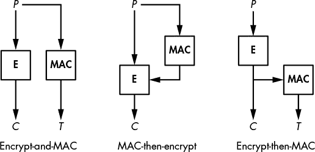
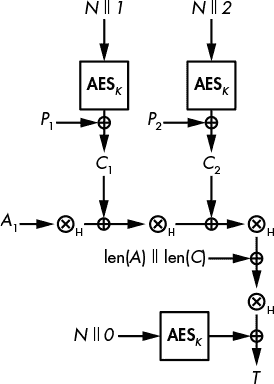
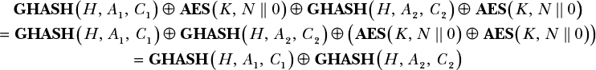
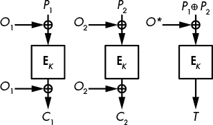
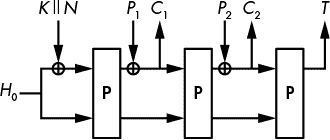

## 8

认证加密

本章讨论的是一种不仅保护消息机密性，还保护其真实性的算法。回想一下第七章中的内容，消息认证码（MAC）是通过创建标签来保护消息真实性的算法，标签是一种签名。与 MAC 类似，本章将讨论的认证加密（AE）算法也会生成认证标签，但它们同时也会加密消息。换句话说，单一的 AE 算法同时具备普通密码算法和 MAC 的功能。

结合密码算法和 MAC 可以实现不同级别的认证加密，正如你在本章中将要学习的那样。我将回顾几种将 MAC 与密码算法结合的可能方式，解释哪些方法是最安全的，并向你介绍既生成密文又生成认证标签的密码算法。接下来，我们将关注四种重要的认证密码算法：三种基于分组密码的构造，重点介绍流行的高级加密标准（AES-GCM）在 Galois 计数模式下的应用，以及一种仅使用置换算法的密码。

### 使用 MAC 的认证加密

如图 8-1 所示，MAC 和密码算法可以通过三种方式结合，以同时对明文进行加密和认证：加密并 MAC、MAC 后加密以及加密后 MAC。

*图 8-1：密码和 MAC 组合*

这三种组合方式的区别在于加密应用的顺序和认证标签的生成方式。然而，选择具体的 MAC 或密码算法并不重要，只要每种算法本身是安全的，并且 MAC 和密码算法使用不同的密钥。

如图 8-1 所示，在加密并 MAC 的组合方式中，明文首先被加密，然后直接从明文生成认证标签，因此这两种操作（加密和认证）是相互独立的，可以并行计算。在 MAC 后加密方案中，标签首先从明文生成，然后将明文和 MAC 一起加密。与此相反，在加密后 MAC 方法中，明文首先被加密，然后从密文中生成标签。

这三种方法的资源消耗大致相同。接下来我们将看看哪种方法可能是最安全的。

#### *加密并 MAC*

*加密并 MAC* 方法将密文和 MAC 标签分别计算。给定一个明文（*P*），发送方计算密文 *C* = **E**(*K*[1], *P*)，其中 **E** 是加密算法，*C* 是生成的密文。认证标签（*T*）由明文计算得到，*T* = **MAC**(*K*[2], *P*)。你可以先计算 *C* 和 *T*，也可以并行计算。

一旦密文和认证标签生成完毕，发送方将两者传输给目标接收方。当接收方接收到*C*和*T*时，他们通过计算*P* = **D**(*K*[1], *C*)来解密*C*，从而获得明文*P*。接着，他们使用解密后的明文计算**MAC**(*K*[2], *P*)，并将结果与接收到的*T*进行比较。如果*C*或*T*受到损坏，这一验证将失败，消息将被视为无效。

至少从理论上讲，加密-然后 MAC 是最不安全的 MAC 和密码组合，因为即便是一个安全的 MAC 也可能泄露*P*的信息，从而使得*P*更容易被恢复。因为使用 MAC 的目的仅仅是使标签不可伪造，而且标签不一定看起来是随机的，明文(*P*)的认证标签(*T*)即使在 MAC 被认为安全的情况下，也可能泄露信息！（当然，如果 MAC 是伪随机函数，标签就不会泄露任何*P*的信息。）

尽管相对较弱，加密-然后 MAC 依然被许多系统支持，包括安全传输层协议 SSH，其中每个加密包*C*后面跟着标签*T* = **MAC**(*K*, *N* || *P*)，该标签通过未加密的明文数据包*P*发送。此公式中的*N*是一个 32 位的序列号，每发送一个包都会递增，用于帮助确保接收到的包按正确顺序处理。实际上，由于使用了像 HMAC-SHA-256 这样的强大 MAC 算法（它不会泄露*P*的信息），加密-然后 MAC 已被证明足够适用于 SSH。

#### *MAC-然后加密*

*MAC-然后加密*组合通过首先计算认证标签*T* = **MAC**(*K*[2], *P*)来保护消息*P*。接下来，根据*C* = **E**(*K*[1], *P* || *T*)，它将明文和标签一起加密，生成密文。

一旦这些步骤完成，发送方只传输*C*，其中包含加密后的明文和标签。接收方接收后，通过计算*P* || *T* = **D**(*K*[1], *C*)来解密*C*，从而获得明文和标签*T*。接下来，接收方通过根据**MAC**(*K*[2], *P*)从明文计算标签，来验证接收到的标签*T*，以确认计算出的标签是否等于标签*T*。

与加密-然后 MAC（encrypt-and-MAC）类似，当使用 MAC-然后加密时，接收方必须在确定是否接收到损坏的数据包之前先解密*C*——这一过程可能会让接收方看到潜在损坏的明文。然而，MAC-然后加密比加密-然后 MAC 更安全，因为它隐藏了明文的认证标签，从而防止标签泄露明文信息。

MAC-然后加密（MAC-then-encrypt）已经在 TLS 协议中使用多年，但 TLS 1.3 将 MAC-然后加密替换为经过认证的加密算法（有关 TLS 1.3 的更多信息，请参见第十三章）。

#### *加密-然后 MAC*

加密-再计算 MAC 的组合向接收者发送两个值：由 *C* = **E**(*K*[1], *P*) 产生的密文，以及基于密文的标签 *T* = **MAC**(*K*[2], *C*)。接收方通过 **MAC**(*K*[2], *C*) 计算标签，并验证其是否与接收到的 *T* 相等。如果值相等，则计算明文 *P* = **D**(*K*[1], *C*)；如果不相等，则丢弃该密文。

这种方法的一个优势是接收方只需要计算一个 MAC 来检测损坏的消息，这意味着无需解密损坏的密文。另一个优势是，攻击者不能发送一对 *C* 和 *T* 给接收方进行解密，除非他们破解了 MAC，这使得攻击者更难将恶意数据传输给接收方。

这种功能组合使得加密-再计算 MAC 比加密-和 MAC 计算、以及 MAC-再加密的方式更强大。这也是广泛使用的 IPSec 安全通信协议套件采用它来保护数据包（例如在 VPN 隧道内）的原因之一。

那么为什么 SSH 和 TLS 不使用加密-再计算 MAC（encrypt-then-MAC）呢？简单的答案是，在 SSH 和 TLS 被创建时，其他方法看起来已经足够有效——并不是因为理论上的弱点不存在，而是因为理论上的弱点不一定会转化为实际的安全漏洞。

### 认证加密算法

*认证加密算法*是替代密码算法和 MAC 组合的一种选择。它们与普通的密码算法类似，只不过它们除了返回密文外，还会返回一个认证标签。

认证加密算法的加密表示为 **AE**(*K*, *P*) = (*C*, *T*)。术语 **AE** 代表 *认证加密*，如你从这个公式中看到的，它基于密钥 (*K*) 和明文 (*P*), 返回密文 (*C*) 和生成的认证标签对 (*T*)。换句话说，一个单一的认证加密算法完成了密码和 MAC 组合的相同工作，从而使其更加简洁、快速且通常更安全。

认证加密算法的解密表示为 **AD**(*K*, *C*, *T*) = *P*。这里，**AD** 代表 *认证解密*，它在给定密文 (*C*), 标签 (*T*), 和密钥 (*K*) 的情况下返回明文 (*P*)。如果 *C* 或 *T* 任意一个或两个无效，**AD** 将返回错误，以防止接收方处理可能已被伪造的明文。换句话说，如果 **AD** 返回明文，你可以确定它已经被某个知道秘密密钥的人或事物加密过。

认证加密算法的基本安全要求很简单：其认证应当与 MAC 的安全性一样强，这意味着不可能伪造出解密函数 **AD** 会接受并解密的密文和标签对 (*C*, *T*)。

就保密性而言，经过认证的密码系统本质上比基本密码系统更强，因为持有密钥的系统只有在认证标签有效的情况下才能解密密文。如果标签无效，明文将被丢弃。这个特点防止了攻击者执行选择密文查询攻击，即他们生成密文并请求相应的明文。

#### *带有关联数据的认证加密*

加密学家将*关联数据*定义为通过认证密码处理的任何数据，这些数据已经被认证（感谢认证标签），但未被加密。事实上，默认情况下，所有输入到认证密码的明文数据都会被加密*并*认证。

那么，如果你只是想认证整个消息，包括它的未加密部分，而不是加密整个消息怎么办？也就是说，你希望在加密消息的基础上认证和传输其他数据。例如，如果一个密码处理一个由头部和有效负载组成的网络数据包，你可能选择加密有效负载以隐藏实际传输的数据，但不加密头部，因为它包含将数据包交付给最终接收者所需的信息。同时，你可能仍然希望认证头部的数据，以确保它是从预期的发送方收到的。

为了实现这些目标，加密学家提出了带有关联数据的认证加密（AEAD）这一概念。AEAD 算法允许你将明文数据附加到密文中，以使得如果明文数据被篡改，认证标签将无法验证，密文也无法解密。

我们可以将 AEAD 操作表示为**AEAD**(*K*, *P*, *A*) = (*C*, *A*, *T*)。给定一个密钥(*K*)、明文(*P*)和关联数据(*A*)，AEAD 返回密文、未加密的关联数据*A*和认证标签。AEAD 保持未加密的关联数据不变，而密文则是明文的加密。认证标签依赖于*P*和*A*，只有当*C*和*A*都未被修改时，才会被验证为有效。

由于认证标签依赖于*A*，使用关联数据的解密通过**ADAD**(*K*, *C*, *A*, *T*) = (*P*, *A*)来计算。解密需要密钥、密文、关联数据和标签，以计算明文和关联数据，如果*C*或*A*被篡改，解密将失败。

使用 AEAD 时需要注意的一点是，你可以将*A*或*P*留空。如果关联数据*A*为空，AEAD 将变为一个普通的认证密码；如果*P*为空，它只是一个 MAC。

**注意**

*截至目前，AEAD 是当前认证加密的标准。由于几乎所有现有的认证加密算法都支持关联数据，因此在本书中提到认证加密算法时，除非特别说明，我指的都是 AEAD。在讨论 AEAD 的加密和解密操作时，我将分别称之为**AE**和**AD**。*

#### *通过 Nonce 避免可预测性*

请回想一下第一章中提到的，为了确保安全，加密方案必须是不可预测的，并且在多次调用加密同一明文时返回不同的密文——否则，攻击者可以判断是否对相同的明文进行了两次加密。为了确保不可预测性，分组加密和流加密算法会向加密算法提供一个额外的参数：初始值（IV）或 nonce——一个只能使用一次的数字。认证加密算法也使用了相同的技巧。因此，认证加密可以表示为**AE**(*K*, *P*, *A*, *N*)，其中*N*是 nonce。加密操作负责选择一个从未与相同密钥一起使用过的 nonce。

与分组加密和流加密算法一样，使用认证加密算法进行解密时，需要加密时使用的 nonce（随机数），以确保解密操作正确。因此，我们可以将解密表示为**AD**(*K*, *C*, *A*, *T*, *N*) = (*P*, *A*)，其中*N*是用于生成*C*和*T*的 nonce。

#### *什么才是一个好的认证加密算法？*

自 2000 年代初期以来，研究人员一直在努力定义什么才算一个好的认证加密算法，直到我写下这段话时，答案仍然难以捉摸。由于 AEAD 具有多种角色不同的输入，定义其安全性比基本加密算法（仅加密消息）更为困难。然而，在本节中，我将总结在评估认证加密算法的安全性、性能和功能时需要考虑的最重要标准。

##### 安全性标准

用于衡量认证加密算法强度的最重要标准是其保护数据机密性（即明文的保密性）以及通信的真实性和完整性（例如，MAC 检测消息损坏的能力）。一个认证加密算法必须在这两个方面都具有竞争力：它的机密性必须与最强的加密算法一样强，其真实性必须与最强的 MAC 一样强。换句话说，如果你去掉 AEAD 中的认证部分，应该得到一个安全的加密算法；如果去掉加密部分，应该得到一个强大的 MAC。

另一个衡量认证加密算法安全性强度的标准则基于一些更微妙的因素——即其在面对重复的 nonce 时的脆弱性。例如，如果一个 nonce 被重复使用，攻击者是否能够解密密文或区分明文之间的差异？

研究人员将这种稳健性的概念称为*误用抗性*，并设计了抗误用认证加密算法来评估重复随机数的影响，并尝试确定在此类攻击下，机密性、真实性或两者是否会受到威胁，以及有关加密数据的信息可能会泄漏的程度。

##### 性能标准

与每个加密算法一样，认证加密算法的吞吐量可以用每秒处理的比特数来衡量。这个速度取决于加密算法执行的操作次数以及认证功能的额外开销。正如你所想，认证加密算法的额外安全特性会带来性能上的损失。然而，衡量加密算法性能的不仅仅是纯粹的速度。它还与并行化能力、结构以及加密算法是否支持流式处理有关。让我们更仔细地分析这些概念。

加密算法的*并行化能力*是衡量其能否同时处理多个数据块而不需要等待前一个数据块处理完成的能力。基于块加密的设计，当每个数据块可以独立于其他数据块处理时，通常容易并行化。例如，第四章中讨论的 CTR 块加密模式是可以并行化的，而 CBC 加密模式则不行，因为它们的块是串联的。

认证加密算法的内部结构是另一个重要的性能标准。主要有两种结构类型：单层结构和双层结构。在双层结构中（例如，广泛使用的 AES-GCM），一种算法处理明文，然后第二种算法处理结果。通常，第一个层是加密层，第二个层是认证层。但正如你所预料的，双层结构会使实现变得更加复杂，并且通常会导致计算变慢。

当认证加密算法能够逐块处理消息并丢弃已经处理过的块时，它就是*流式*（也称为*在线*）加密算法。相比之下，非流式加密算法必须存储整个消息，通常是因为它们需要对数据进行两次连续的处理：第一次从开始到结束，第二次从结束到开始，使用第一次处理所得到的数据。

由于可能需要较高的内存，一些应用程序无法使用非流式加密算法。例如，一个路由器可以接收一个加密的数据块，解密后返回明文块，然后再继续解密消息的后续数据块，尽管解密后的消息接收方仍然需要验证发送的认证标签。

##### 功能标准

功能标准是指加密算法或其实现的特性，这些特性与安全性或性能没有直接关系。例如，一些认证加密算法只允许关联数据出现在待加密数据之前（因为它们需要访问这些数据以开始加密）。其他算法要求关联数据出现在待加密数据之后，或者支持在任何位置包括关联数据——即使是在明文块之间。这种最后一种情况是最好的，因为它使用户能够在任何可能的情况下保护数据，但它也是最难以安全设计的：一如既往，更多的功能往往带来更多的复杂性——也可能带来更多的潜在漏洞。

另一个需要考虑的功能标准是，是否可以使用相同的核心算法进行加密和解密。例如，许多认证加密算法是基于 AES 块加密算法的，该算法指定使用两种相似的算法分别进行加密和解密块。如第四章中所讨论的，CBC 块加密模式需要两种算法，而 CTR 模式只需要加密算法。同样，认证加密算法可能不需要两种算法。尽管实现加密和解密算法的额外成本对大多数软件影响不大，但在低成本专用硬件上，通常会很明显，因为在这种硬件上，实施成本是以逻辑门或加密所占硅面积来衡量的。

### AES-GCM：认证加密标准

AES-GCM 是最广泛使用的认证加密算法。AES-GCM 当然是基于 AES 算法的，而 Galois 计数器模式（GCM）实际上是对 CTR 模式的一个改进，其中加入了一个小巧高效的组件来计算认证标签。在我写这篇文章时，AES-GCM 是唯一一个被 NIST 标准化的认证加密算法（SP 800-38D）。AES-GCM 也是 NSA Suite B 和互联网工程任务组（IETF）用于安全网络协议 IPSec、SSH 和 TLS 1.2 的一部分。

**注意**

*尽管 GCM 可以与任何块加密算法一起使用，但你可能只会看到它与 AES 配合使用。有些人不想使用 AES，因为它是美国的算法，但他们也不使用 GCM，原因相同。因此，GCM 很少与其他加密算法配对使用。*

#### *GCM 内部结构：CTR 和 GHASH*

*图 8-2：AES-GCM 模式，应用于一个关联数据块* A[1]，*和两个明文块* P[1] *和* P[2]。*圈出的乘法符号表示由* H *进行的多项式乘法，*H* 是从* K *衍生的认证密钥。

图 8-2 显示了 AES-GCM 的工作原理：由一个秘密密钥（*K*）参数化的 AES 实例将由一次性数（*N*）与计数器（从 1 开始，然后递增为 2、3 等）连接组成的块进行变换，然后将结果与明文块进行 XOR 操作，从而得到密文块。到目前为止，与 CTR 模式相比，这没有什么新变化。

接下来，密文块使用 XOR 和乘法的组合进行混合（如你接下来将看到的）。你可以将 AES-GCM 视为执行 1）CTR 模式加密和 2）对密文块进行 MAC 操作。因此，AES-GCM 本质上是一种加密后再进行 MAC 的构造，其中 AES-CTR 使用 128 位密钥（*K*）和 96 位随机数（*N*）进行加密，唯一的不同是计数器从 1 开始，而不是像正常的 CTR 模式那样从 0 开始（就安全性而言，这并不重要）。

为了认证密文，GCM 使用 Wegman-Carter MAC（见第七章）来认证密文，它将**AES**(*K*, *N* || 0*)的值与名为*GHASH*的通用哈希函数的输出进行 XOR。在图 8-2 中，GHASH 对应于“⊗[H]”的操作序列，后面是与 len(*A*) || len(*C*)进行 XOR 操作，或者说是与*A*（关联数据）的位长和*C*（密文）的位长进行 XOR。

因此，我们可以将认证标签的值表示为*T* = **GHASH**(*H*, *C*) ⊕ **AES**(*K*, *N* || 0)，其中*C*是密文，*H*是*哈希密钥*或*认证密钥*。该密钥被确定为*H* = **AES**(*K*, 0)，即加密等于一串空字节的块（为了清晰起见，这一步在图 8-2 中没有出现）。

**注意**

*在 GCM 中，GHASH 并不直接使用* K *，以确保如果 GHASH 的密钥被泄露，主密钥* K *仍然保持机密。给定* K *，你可以通过计算**AES**(*K*, *0*)得到* H *，但是你无法从这个值恢复* K *，因为* K *在这里作为 AES 的密钥作用。*

正如图 8-2 所示，GHASH 使用*多项式表示法*将每个密文块与认证密钥*H*相乘。这种多项式乘法使得 GHASH 在硬件和软件中都非常快速，因为许多常见微处理器中都提供了一个特殊的多项式乘法指令（`CLMUL`，即无进位乘法）。

不幸的是，GHASH 远非理想。首先，它的速度并不最优。即使使用了`CLMUL`指令，加密明文的 AES-CTR 层仍然比 GHASH MAC 快。其次，GHASH 的实现非常麻烦。实际上，连 OpenSSL 项目的经验丰富的开发人员——世界上最常用的加密软件——也在实现 AES-GCM 的 GHASH 时出了问题。一次提交中，`gcm_ghash_clmul`函数中有一个 bug，允许攻击者伪造 AES-GCM 的有效 MAC。（幸运的是，这个错误在 bug 进入下一版本的 OpenSSL 之前被英特尔工程师发现了。）

多项式乘法

虽然对于我们来说多项式乘法明显比经典的整数运算复杂，但对于计算机来说，它更简单，因为没有进位。例如，假设我们想计算多项式 (1 + *X* + *X*²) 和 (*X* + *X*³) 的乘积。我们首先像进行普通的多项式乘法那样，将这两个多项式 (1 + *X* + *X*²) 和 (*X* + *X*³) 相乘，得到以下结果（两个 *X*³ 项互相抵消）：

(1 + *X* + *X*²) ⊕ (*X* + *X*³) = *X* + *X*³ + *X*² + *X*⁴ + *X*³ + *X*⁵ = *X* + *X*² + *X*⁴ + *X*⁵

我们现在进行模运算，将 *X* + *X*² + *X*⁴ + *X*⁵ 对 1 + *X*³ + *X*⁴ 进行模约简，得到 *X*²，因为 *X* + *X*² + *X*⁴ + *X*⁵ 可以表示为 *X* + *X*² + *X*⁴ + *X*⁵ = *X* ⊗ (1 + *X*³ + *X*⁴) + *X*²。更一般地，*A* + *BC* 对 *B* 取模等于 *A*，这是模约简的定义。

#### *GCM 安全性*

AES-GCM 的最大弱点是在面对重复 nonce 时的脆弱性。如果在 AES-GCM 实现中使用相同的 nonce *N* 两次，攻击者可以获得认证密钥 *H*，并利用它伪造任何密文、关联数据或两者的组合的标签。

查看 AES-GCM 计算背后的基本代数（如 图 8-2 所示）将帮助我们理解这种脆弱性。具体来说，标签 (*T*) 是通过 *T* = **GHASH**(*H*, *A*, *C*) ⊕ **AES**(*K*, *N* || 0) 计算出来的，其中 GHASH 是一个输入输出线性相关的通用哈希函数。

如果你得到两个标签，*T*[1] 和 *T*[2]，它们是用相同的 nonce *N* 计算出来的，结果会怎样？没错，AES 部分会消失。如果我们有两个标签，*T*[1] = **GHASH**(*H*, *A*[1], *C*[1]) ⊕ **AES**(*K*, *N* || 0) 和 *T*[2] = **GHASH**(*H*, *A*[1], *C*[1]) ⊕ **AES**(*K*, *N* || 0)，那么将它们异或得到以下结果：

如果相同的 nonce 被使用两次，攻击者就可以恢复值 **GHASH**(*H*, *A*[1], *C*[1]) ⊕ **GHASH**(*H*, *A*[2], *C*[2])，对于一些已知的 *A*[1]、*C*[1]、*A*[2] 和 *C*[2]。GHASH 的线性特性使得攻击者可以轻松地确定 *H*。（如果 GHASH 使用了与加密部分相同的密钥 *K*，情况会更糟，但由于 *H* = **AES**(*K*, 0)，所以无法通过 *H* 来找到 *K*。）

直到 2016 年，研究人员仍在互联网上扫描 AES-GCM 通过 HTTPS 服务器暴露的实例，寻找具有重复 nonce 的系统（见 *[`eprint.iacr.org/2016/475/`](https://eprint.iacr.org/2016/475/)*）。他们发现了 184 台具有重复 nonce 的服务器，其中 23 台总是使用全零字符串作为 nonce。

#### *GCM 效率*

GCM 模式的一个优势是，GCM 加密和解密都可以并行处理，允许你独立地加密或解密不同的明文块。然而，AES-GCM 的 MAC 计算无法并行化，因为在 GHASH 处理完任何关联数据后，它必须从密文的开始到结束进行计算。缺乏并行化意味着任何先接收明文再接收关联数据的系统，必须等到所有关联数据被读取并哈希完后，才能开始哈希第一个密文块。

然而，GCM 是可以流式处理的：由于其两层计算可以流水线处理，因此在计算 GHASH 时不需要先存储所有密文块，因为 GHASH 会在每个块被加密时处理它。换句话说，*P*[1] 会被加密为 *C*[1]，然后 GHASH 处理 *C*[1]，同时 *P*[2] 被加密为 *C*[2]，之后 *P*[1] 和 *C*[1] 就不再需要，以此类推。

### OCB: 比 GCM 更快的认证密码

缩写 *OCB* 代表 *offset codebook*（尽管其设计者 Phil Rogaway 更喜欢直接称之为 OCB）。OCB 于 2001 年首次开发，早于 GCM，并且像 GCM 一样，它从一个块密码生成一个认证密码，尽管它做得更快、更简单。那么为什么 OCB 没有得到更广泛的采用呢？不幸的是，直到 2013 年，所有 OCB 的使用都需要从发明人那里获得许可证。幸运的是，正如我写这篇文章时，Rogaway 允许非军事软件实现免费授权（参见 *[`web.cs.ucdavis.edu/~rogaway/ocb/license.htm`](http://web.cs.ucdavis.edu/~rogaway/ocb/license.htm)*）。因此，尽管 OCB 还不是正式标准，也许我们会开始看到它的更广泛应用。

与 GCM 不同，OCB 将加密和认证合并成一个处理层，并只使用一个密钥。没有单独的认证组件，因此 OCB 基本上可以“免费”获得认证，并且它的块密码调用次数几乎和非认证密码一样。实际上，OCB 几乎和 ECB 模式一样简单（参见 第四章），只不过它是安全的。

#### *OCB 内部原理*

图 8-3 显示了 OCB 的工作原理：OCB 将每个明文块 *P* 加密为密文块 *C* = **E**(*K*, *P* ⊕ *O*) ⊕ *O*，其中 **E** 是一个块密码加密函数。这里的 *O*（称为 *偏移量*）是一个依赖于密钥和对每个新处理的块递增的 nonce 的值。

为了生成认证标签，OCB 首先对明文块进行 XOR 运算，计算 *S* = *P*[1] ⊕ *P*[2] ⊕ *P*[3] ⊕ …（即所有明文块的 XOR）。然后认证标签为 *T* = **E**(*K*, *S* ⊕ *O*^*)，其中 *O*^* 是从处理的最后一个明文块的偏移量计算出来的偏移值。

*图 8-3：OCB 加密过程，当处理两个明文块且没有关联数据时*

与 AES-GCM 类似，OCB 也支持作为一系列块的关联数据，*A*[1]、*A*[2] 等。当 OCB 加密消息包含关联数据时，认证标签会根据公式进行计算。

*T* = **E**(*K*, *S* ⊕ *O*^*) ⊕ **E**(*K*, *A*[1] ⊕ *O*[1]) ⊕ **E**(*K*, *A*[2] ⊕ *O*[2]) ⊕ …

其中，OCB 指定的偏移值与用于加密 *P* 的偏移值不同。

与 GCM 和加密后 MAC（Encrypt-then-MAC）不同，后者通过结合密文生成认证标签，而 OCB 是通过结合明文数据来计算认证标签。这个方法没有问题，而且 OCB 得到了坚实的安全性证明。

**注意**

*关于如何正确实现 OCB 的更多信息，请参见 RFC 7253 或 Krovetz 和 Rogaway 2011 年的论文《Authenticated-Encryption Modes 的软件性能》，该论文涵盖了最新且最好的 OCB 版本 OCB3。有关 OCB 的进一步细节，请参见 OCB 常见问题解答* [`web.cs.ucdavis.edu/~rogaway/ocb/ocb-faq.htm`](http://web.cs.ucdavis.edu/~rogaway/ocb/ocb-faq.htm)。

#### *OCB 安全性*

与 GCM 相比，OCB 对重复的 nonce 要稍微不那么脆弱。例如，如果 nonce 被使用两次，攻击者看到这两个密文后，会注意到，第一个消息的第三个明文块与第二个消息的第三个明文块相同。对于 GCM，攻击者不仅可以找到重复的块，还能在同一位置找到块之间的 XOR 差异。因此，重复的 nonce 对 GCM 的影响要比 OCB 更严重。

与 GCM 一样，重复的 nonce 会破坏 OCB 的真实性，但效果较差。例如，攻击者可以将通过 OCB 验证的两个消息的块合并，生成另一个加密消息，该消息的校验和和标签与原始两个消息之一相同，但攻击者无法像 GCM 那样恢复出密钥。

#### *OCB 效率*

OCB 和 GCM 的速度大致相同。像 GCM 一样，OCB 也是可并行化和可流式处理的。在原始效率方面，GCM 和 OCB 调用底层块密码（通常是 AES）的次数大致相同，但 OCB 比 GCM 略高效，因为它仅仅是对明文进行 XOR 操作，而不像 GCM 那样执行相对昂贵的 GHASH 计算。（在早期的英特尔微处理器中，AES-GCM 的速度比 AES-OCB 慢了三倍以上，因为 AES 和 GHASH 指令必须竞争 CPU 资源，无法并行执行。）

OCB 和 GCM 实现之间的一个重要区别是，OCB 需要块密码的加密和解密功能才能进行加解密，这在只有有限硅资源用于加密组件的硬件实现中会增加成本。相比之下，GCM 仅使用加密功能来进行加解密。

### SIV：最安全的认证加密算法？

*合成 IV*，也称为*SIV*，是一种经过认证的加密模式，通常与 AES 一起使用。与 GCM 和 OCB 不同，SIV 即使使用相同的 nonce 两次也依然安全：如果攻击者获得了使用相同 nonce 加密的两个密文，他们只能知道是否是同一明文被加密了两次。与使用 GCM 或 OCB 加密的消息不同，攻击者无法判断两个消息的第一个块是否相同，因为用于加密的 nonce 首先是作为给定 nonce 和明文的组合计算出来的。

SIV 的构造规范比 GCM 更为通用。与 GCM 的 GHASH 详细内部机制不同，SIV 只是告诉你如何将一个加密器（**E**）和一个伪随机函数（**PRF**）结合起来得到一个认证加密器。具体来说，你计算标签*T* = **PRF**(*K*[1], *N* || *P*)，然后计算密文*C* = **E**(*K*[2], *T*, *P*)，其中*T*作为**E**的 nonce。因此，SIV 需要两个密钥（*K*[1]和*K*[2]）和一个 nonce（*N*）。

SIV 的主要问题在于它不能流式处理：计算完*T*之后，它必须将整个明文*P*保存在内存中。换句话说，要用 SIV 加密一个 100GB 的明文，你必须首先存储这 100GB 的明文，以便 SIV 加密可以读取它。

基于 2006 年 Rogaway 和 Shrimpton 的论文《确定性认证加密》（Deterministic Authenticated-Encryption），文档 RFC 5297 规定 SIV 使用 CMAC-AES（一种基于 AES 的 MAC 构造）作为 PRF，并将 AES-CTR 作为加密器。2015 年，提出了一种更高效的 SIV 版本，称为 GCM-SIV，它结合了 GCM 的快速 GHASH 函数和 SIV 的模式，速度几乎与 GCM 一样。然而，像原始 SIV 一样，GCM-SIV 也不能流式处理。（有关更多信息，请参见 *[`eprint.iacr.org/2015/102/`](https://eprint.iacr.org/2015/102/)*。）

### 基于置换的 AEAD

现在我们来看一种完全不同的构建认证加密器的方法：我们不围绕像 AES 这样的块加密器来构建工作模式，而是看一种围绕置换构建工作模式的加密器。置换仅仅是将一个输入转换为一个与其大小相同的输出，且是可逆的，不使用密钥，这是最简单的组成部分。更好的是，得到的 AEAD 是快速的，具有可证明的安全性，并且比 GCM 和 OCB 对 nonce 重用的抵抗力更强。

图 8-4 展示了基于置换的 AEAD 是如何工作的：从某个固定的初始状态*H*[0]开始，你将密钥*K*和 nonce*N*按顺序进行 XOR 操作，得到与原始状态大小相同的新状态。接着你用**P**变换新状态，并获得另一个新状态值。然后，你将第一个明文块*P*[1]与当前状态进行 XOR 操作，并将结果作为第一个密文块*C*[1]，其中*P*[1]和*C*[1]大小相等，但都比状态小。

要加密第二个块，你需要用 **P** 变换当前状态，将下一个明文块 *P*[2] 与当前状态进行异或运算，然后将结果作为 *C*[2]。然后，你对所有明文块进行迭代，在最后一次调用 **P** 后，从内部状态中提取比特作为认证标签 *T*，如 图 8-4 右侧所示。

*图 8-4：基于置换的认证加密算法*

**注意**

*如图 8-4 所示的模式可以调整以支持关联数据，但过程稍微复杂，因此我们将跳过其描述。*

设计基于置换的认证加密算法有一些要求，以确保安全性。首先，需要注意的是，你只能对部分状态进行异或操作：这一部分越大，成功攻击者对内部状态的控制越多，从而降低了算法的安全性。实际上，所有安全性都依赖于内部状态的保密性。

此外，块必须适当地填充额外的位，以确保任何两个不同的消息都会产生不同的结果。作为反例，如果最后一个明文块小于完整块的大小，则不应仅用零填充；否则，一个两字节（0000）的明文块将变成完整的明文块（0000 … 0000），而一个三字节（000000）的块也会变成相同的完整块。因此，尽管这两个消息的大小不同，你将得到相同的标签。

如果在这种基于置换的加密算法中重用了一个随机数（nonce）会怎样？好消息是，影响没有 GCM 或 OCB 那么严重——认证标签的强度不会受到影响。如果随机数重复，成功的攻击者只能知道两个加密消息是否以相同的值开始，以及这个公共值或前缀的长度。例如，虽然使用相同的随机数加密两个六块的消息 *ABCXYZ* 和 *ABCDYZ*（这里每个字母代表一个块）可能会得到相同前缀的密文 *JKLTUV* 和 *JKLMNO*，攻击者无法知道这两个明文共享相同的最后两个块 (*YZ*)。

在性能方面，基于置换的加密算法具有单层操作、可流处理以及加解密使用单一核心算法的优点。然而，它们不像 GCM 或 OCB 那样可以并行化，因为对 **P** 的新调用需要等待前一个调用完成。

**注意**

*如果你有冲动选择你最喜欢的置换算法并自己制作认证密码，不要这么做。你很可能会弄错细节，最终得到一个不安全的密码。阅读由经验丰富的密码学家编写的算法规范，例如 Keyak（一个源自 Keccak 的算法）和 NORX（由 Philipp Jovanovic、Samuel Neves 和我设计），你会发现基于置换的密码比它们初看起来要复杂得多。*

### 错误可能发生的情况

认证密码比哈希函数或分组密码有更大的攻击面，因为它们不仅要实现保密性 *和* 真实性。它们需要接受多个不同的输入值，并且必须在所有输入情况下保持安全——无论是仅包含关联数据而没有加密数据，还是非常大的明文，或者不同的密钥大小。它们还必须在所有随机数值下保持安全，抵御攻击者收集大量消息/标签对，并在一定程度上抵御随机数的意外重复。

这是一个很大的要求，正如你接下来将看到的那样，甚至 AES-GCM 也有几个缺陷。

#### *AES-GCM 和弱哈希密钥*

AES-GCM 的一个弱点存在于其认证算法 GHASH 中：某些哈希密钥 *H* 的值大大简化了对 GCM 认证机制的攻击。具体来说，如果 *H* 的值属于某些特定的、数学上定义的 128 位字符串子群，攻击者可能通过重排前一条消息的块来猜测某条消息的有效认证标签。

为了理解这个弱点，让我们来看一下 GHASH 是如何工作的。

##### GHASH 内部结构

正如你在图 8-2 中看到的，GHASH 从一个 128 位值 *H* 开始，初始值设为 **AES**(*K*, 0)，然后反复计算

*X[i]* = (*X*[*i* − 1] ⊕ *C[i]*) ⊗ *H*

从 *X*[0] = 0 开始，处理密文块 *C*[1]、*C*[2] 等等。最终的 *X*[*i*] 由 GHASH 返回，用于计算最终标签。

现在为了简化，假设所有的 *C*[*i*] 值都等于 1，那么对于任何 *i*，我们得到：

*C[i]* ⊗ = 1 ⊗ *H* = *H*

接下来，从 GHASH 方程式出发：

*X[i]* = (*X*[i − 1] ⊕ *C[i]*) ⊗ *H*

我们得到：

*X*[1] = (*X*[0] ⊕ *C*[1]) ⊕ *H* = (0 ⊕ 1) ⊗ *H* = *H*

将 *X*[0] 替换为 0，*C*[1] 替换为 1，得到以下结果：

(0 ⊕ 1) = 1

得益于 ⊗ 在 ⊕ 上的分配律，我们将 *X* 替换为 *H*，并将 *C*[2] 替换为 1，然后计算下一个值 *X*[2] 如下：

*X*[2] = (*X*[1] ⊕ *X*[2]) ⊗ *H* = (*H* ⊕ 1) ⊗ *H* = *H*² ⊕ *H*

其中 *H*² 是 *H* 的平方，或 *H* ⊗ *H*。

现在通过将 *X*[2] 的推导代入，得出 *X*[3]，并得到以下结果：

*X*[3] = (*X*[2] ⊕ *C*[3]) ⊗ *H* = (*H*² ⊕ *H* ⊕ 1) ⊗ *H* = *H*³ ⊕ *H*² ⊕ *H*

接下来，我们推导出 *X*[4] 为 *X*[4] = *H* ⁴ ⊕ *H* ³ ⊕ *H* ² ⊕ *H*，以此类推，最终最后的 *X*[*i*] 为：

*X[n]* = *H^n* ⊕ *H*^(*n* − 1) ⊕ *H*^(*n* − 2) ⊕ … ⊕ *H*² ⊕ *H*

记住，我们将所有块*C*[*i*]设为 1。如果这些值是任意的，我们将得到以下结果：

*X[n]* = *C*[1] ⊕ *H^n* ⊕ *C*[2] ⊕ *H*^(*n* − 1) ⊕ *C*[3] *H*^(*n* − 2) ⊕ … ⊕ *C*[*n* − 1] *H*² ⊕ *C*[*n*] ⊕ *H*

然后，GHASH 会将消息的长度异或到这个最后的*X*[*n*]，将结果乘以*H*，然后将这个值与**AES**(*K*, *N* || 0)进行异或，生成最终的认证标签*T*。

##### 问题出现的地方

从这里可能出什么问题呢？我们首先来看两个最简单的情况：

+   如果*H* = 0，则*X*[*n*] = 0，无论*C*[*i*]的值如何，因而无论消息如何。也就是说，如果*H*为 0，所有消息的认证标签将相同。

+   如果*H* = 1，则标签仅为密文块的异或值，重新排序密文块将得到相同的认证标签。

当然，0 和 1 只是 2¹²⁸中*H*的可能值中的两个，因此它们发生的概率仅为 2/2¹²⁸ = 1/2¹²⁷。但还有其他弱值——即，所有当*H*被提升到*i*次方时属于*短周期*的值。例如，值*H* = 10d04d25f93556e69f58ce2f8d035a4 属于长度为五的周期，因为它满足*H* ⁵ = *H*，因此*H*^(*e*) = *H*，对于任何*e*是五的倍数的情况（这是关于五次方的周期的定义）。因此，在前面的最终 GHASH 值*X*[*n*]的表达式中，将块*C*[*n*]（与*H*相乘）和块*C*[*n* - 4]（与*H* ⁵相乘）交换，将不会改变认证标签，这相当于伪造。攻击者可能会利用这一性质，在不知情的情况下构造一个新的消息及其有效标签，而这是一个安全的认证密码所不应该允许的。

前面的示例基于一个长度为五的循环，但实际上有许多更长的循环，因此有许多值的*H*比应该的要弱。结果是，在极不可能的情况下，如果*H*属于一个短周期的值，并且攻击者可以伪造任意数量的认证标签，那么除非他们知道*H*或*K*，否则无法确定*H*的周期长度。因此，尽管这一漏洞无法被利用，但通过更仔细地选择用于模运算的多项式，本来是可以避免的。

**注意**

*关于此攻击的更多细节，请阅读 Markku-Juhani O. Saarinen 的《GCM、GHASH 和其他多项式 MAC 和哈希的循环攻击》，可在* [`eprint.iacr.org/2011/202/`](https://eprint.iacr.org/2011/202/) 获得。

#### *AES-GCM 和小标签*

实际上，AES-GCM 通常返回 128 位的标签，但它可以生成任意长度的标签。不幸的是，当使用较短的标签时，伪造的概率会显著增加。

当使用 128 位标签时，尝试伪造的攻击者成功的概率应该是 1/2¹²⁸，因为存在 2¹²⁸种可能的 128 位标签。（通常，对于*n*位标签，成功的概率应该是 1/2^(*n*)，其中 2^(*n*)是*n*位标签的可能值数。）但是，当使用较短的标签时，由于 GCM 结构中的一些弱点（这超出了本讨论的范围），伪造的概率远高于 1/2^(*n*)。例如，32 位标签将允许一个知道某 2MB 消息的认证标签的攻击者以 1/2¹⁶的概率成功，而不是 1/2³²。

通常，对于*n*位标签，伪造的概率不是 1/2^(*n*)，而是 2^(*m*)/2^(*n*)，其中 2^(*m*)是成功攻击者观察到标签的最长消息的块数。例如，如果你使用 48 位标签并处理 4GB 的消息（即 2²⁸个 16 字节的块），那么伪造的概率将是 2²⁸/2⁴⁸ = 1/2²⁰，大约是一百万分之一。这对于密码学来说是一个相对较高的概率。（有关这种攻击的更多信息，请参阅尼尔斯·弗格森（Niels Ferguson）在 2005 年发表的论文《GCM 中的认证弱点》）

### 进一步阅读

想要了解更多关于认证密码的信息，请访问 CAESAR 的主页，认证加密竞赛：安全性、适用性和健壮性（*[`competitions.cr.yp.to/caesar.html`](http://competitions.cr.yp.to/caesar.html)*）。CAESAR 自 2012 年开始，是一场类似于 AES 和 SHA-3 竞赛的密码竞赛，尽管它并非由 NIST 组织。

CAESAR 竞赛吸引了大量创新设计：从类似 OCB 的模式到基于置换的模式，以及新的核心算法。举例来说，包括前面提到的基于置换的认证密码 NORX 和 Keyak；AEZ（如 AEasy），它建立在一种不可流式化的两层模式上，使其具有抗滥用能力；AEGIS，一种简单美观的认证密码，利用了 AES 的轮函数。

本章中，我集中讨论了 GCM，但实际上还有一些其他模式在实际应用中也有使用。具体来说，带 CBC-MAC 的计数器模式（CCM）和 EAX 模式在 2000 年代初期曾与 GCM 竞争标准化，尽管 GCM 最终被选中，但这两种竞争者仍在一些应用中使用。例如，CCM 用于 WPA2 Wi-Fi 加密协议。你可能想要阅读这些密码的规范，并回顾它们在安全性和性能上的相对优劣。

这就结束了我们关于对称密钥加密的讨论！你已经了解了分组密码、流密码、（带密钥的）哈希函数，以及现在的认证密码——这些都是与对称密钥或完全不使用密钥的主要加密组件。在我们进入*非对称*加密之前，第九章将更多地聚焦于计算机科学和数学，为 RSA（第十章）和 Diffie–Hellman（第十一章）等非对称方案提供背景知识。
