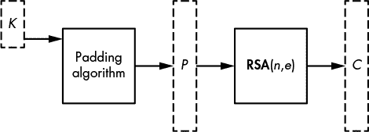
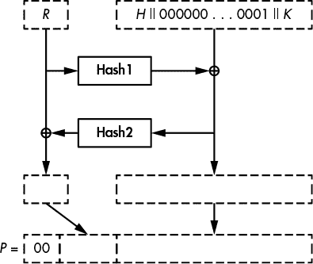
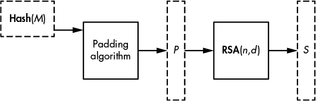
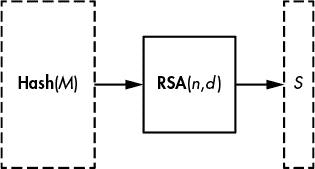
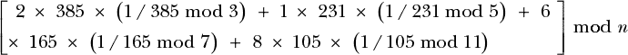

## 第十一章：RSA


Rivest–Shamir–Adleman (RSA) 加密系统在 1977 年问世时，作为第一个公钥加密方案，彻底改变了密码学；而经典的对称密钥加密方案使用相同的秘密密钥来加密和解密信息，公钥加密（也叫做*非对称*加密）则使用两个密钥：一个是你的公钥，任何想要为你加密信息的人都可以使用它，另一个是你的私钥，只有使用这个私钥才能解密用公钥加密的信息。这种“魔法”是 RSA 成为真正突破性技术的原因，40 年后，它仍然是公钥加密的典范，是互联网安全的核心工具。（在 RSA 发布的前一年，Diffie 和 Hellman 提出了公钥密码学的概念，但他们的方案无法进行公钥加密。）

RSA 本质上是一种算术技巧。它通过创建一个叫做*陷门置换*的数学对象来工作，这是一种将数字*x*转换为范围内的数字*y*的函数，使得通过公钥从*x*计算出*y*很容易，但除非你知道私钥——*陷门*，否则几乎不可能从*y*计算出*x*。（可以把*x*看作明文，把*y*看作密文。）

除了加密，RSA 还用于构建数字签名，其中私钥的拥有者是唯一能够签署信息的人，而公钥则使任何人都能验证签名的有效性。

在本章中，我将解释 RSA 的陷门置换是如何工作的，讨论 RSA 相对于因数分解问题的安全性（在第九章中讨论），并进一步解释为什么单靠 RSA 的陷门置换不足以构建*安全*的加密和签名。我还将讨论如何实现 RSA，并演示如何攻击 RSA。

我们从解释 RSA 背后的基本数学概念开始。

### RSA 背后的数学

在加密一条信息时，RSA 将该信息视为一个大数字，加密本质上是对大数字进行乘法运算。因此，为了理解 RSA 如何工作，我们需要知道它处理的是什么类型的大数字，以及如何在这些数字上进行乘法运算。

RSA 将其加密的明文视为介于 1 和*n* – 1 之间的正整数，其中*n*是一个称为*模数*的大数字。更准确地说，RSA 处理的是小于*n*且与*n*互质的数字，这些数字与*n*没有共同的素因子。当这些数字相乘时，会得到另一个满足这些标准的数字。我们称这些数字组成一个群，记作**Z**[*N*]^*，并称之为整数模*n*的乘法群。（请参见“什么是群？”中第 174 页的群的数学定义。）

举个例子，考虑模 4 的整数群 **Z**[4]^*。回想一下 第九章，一个群必须包含一个单位元（即 1），并且群中的每个数字 *x* 必须有一个逆元，即存在一个数字 *y*，使得 *x* × *y* = 1。那么我们如何确定组成 **Z**[4]^* 的集合呢？根据我们的定义，我们知道 0 不在 **Z**[4]^* 中，因为任何数字与 0 相乘都不能得到 1，因此 0 没有逆元。同样地，数字 1 属于 **Z**[4]^*，因为 1 × 1 = 1，所以 1 是它自己的逆元。然而，数字 2 不属于这个群，因为我们无法通过将 2 与 **Z**[4]^* 中的其他元素相乘来得到 1（原因是 2 与 4 不互质，因为 4 和 2 共享因子 2）。数字 3 属于 **Z**[4]^*，因为它在 **Z**[4]^* 中是它自己的逆元。因此，**Z**[4]^* = {1, 3}。

现在考虑 **Z**[5]^*，这是模 5 的整数乘法群。这个集合包含哪些数字呢？数字 5 是质数，且 1、2、3 和 4 都与 5 互质，因此 **Z**[5]^* 的集合是 {1, 2, 3, 4}。我们来验证一下：2 × 3 mod 5 = 1，因此，2 是 3 的逆元，3 是 2 的逆元；注意，4 是它自己的逆元，因为 4 × 4 mod 5 = 1；最后，1 在这个群中也是它自己的逆元。

为了计算当 *n* 不是质数时群 **Z**[*n*]^* 中的元素个数，我们使用 *欧拉函数*，用符号 φ(*n*) 表示，其中 φ 代表希腊字母 phi。这个函数给出了与 *n* 互质的元素个数，也就是 **Z**[*n*]^* 中的元素个数。通常来说，如果 *n* 是质数的乘积 *n* = *p*[1] × *p*[2] × … × *p*[*m*]，那么群 **Z**[*n*]^* 中的元素个数为：

φ(*n*) = (*p*[1] − 1) × (*p*[2] − 1) × … × (*p[m]* − 1)

RSA 只处理 *n* 是两个大质数的乘积的数字，通常表示为 *n* = *pq*。相关的群 **Z**[*N*]^* 将包含 φ(*n*) = (*p* – 1)(*q* – 1) 个元素。通过展开这个表达式，我们得到等价的定义 φ(*n*) = *n* – *p* – *q* + 1，或者 φ(*n*) = (*n* + 1) – (*p* + *q*)，这更加直观地表达了 φ(*n*) 相对于 *n* 的值。换句话说，除了 (*p* + *q*) 之外，所有 1 和 *n* – 1 之间的数字都属于 **Z**[*N*]^* 并且在 RSA 操作中是“有效的数字”。

### RSA 陷门置换

RSA 陷门置换是 RSA 加密和签名背后的核心算法。给定模数 *n* 和数字 *e*，称为 *公钥指数*，RSA 陷门置换将集合 **Z**[*n*]^* 中的数字 *x* 转换为数字 *y* = *x*^(*e*) mod *n*。换句话说，它计算出与 *x* 自乘 *e* 次模 *n* 相等的值，并返回结果。当我们使用 RSA 陷门置换进行加密时，模数 *n* 和指数 *e* 组成 RSA 公钥。

为了从 *y* 中恢复出 *x*，我们使用另一个数字，记作 *d*，计算如下：

*y^d* mod *n* = (*x^e*)^(*d*) mod *n* = *x^(ed)* mod *n* = *x*

因为 *d* 是让我们能够解密的“陷门”，它是 RSA 密钥对中的一部分，和公钥不同，应该始终保密。数字 *d* 也称为 *秘密指数*。

显然，*d* 不是随便的数字；它是满足 *e* 与 *d* 相乘等于 1 的数字，因此满足 *x*^(*ed*) mod *n* = *x* 对任何 *x* 都成立。更准确地说，我们必须有 *ed* = 1 mod φ(*n*)，才能确保 *x*^(*ed*) = *x*¹ = *x* 并正确解密消息。请注意，我们这里计算的是模 φ(*n*) 而不是模 *n*，因为指数行为类似于 **Z**[*n*]^* 的元素索引，而不是元素本身。由于 **Z**[*n*]^* 中有 φ(*n*) 个元素，索引必须小于 φ(*n*)。

数字 φ(*n*) 对 RSA 的安全性至关重要。事实上，求解 RSA 模数 *n* 的 φ(*n*) 等同于破解 RSA，因为秘密指数 *d* 可以通过计算 *e* 的逆元，轻松从 φ(*n*) 和 *e* 推导出来。因此，*p* 和 *q* 也应当保密，因为知道 *p* 或 *q* 就可以通过计算 (*p* – 1)(*q* – 1) = φ(*n*) 来得到 φ(*n*)。

**注意**

φ(n) *也称为* 群的顺序 **Z**[n]^*；*顺序是群的重要特征，这对于其他公钥系统（如 Diffie–Hellman 和椭圆曲线密码学）也至关重要。*

### RSA 密钥生成与安全性

*密钥生成* 是创建 RSA 密钥对的过程，即生成公钥（模数 *n* 和公钥指数 *e*）和对应的私钥（秘密指数 *d*）。数字 *p* 和 *q*（使得 *n* = *pq*）以及顺序 φ(*n*) 也应当保密，因此它们通常被视为私钥的一部分。

为了生成 RSA 密钥对，我们首先选择两个随机的素数 *p* 和 *q*，然后根据这两个数计算 φ(*n*)，接着计算 *d* 作为 *e* 的逆元。为了演示这一过程，清单 10-1 使用了 SageMath (*[`www.sagemath.org/`](http://www.sagemath.org/)*)，这是一个开源的类 Python 环境，包含了许多数学包。

```
❶ sage: p = random_prime(2³²); p
   1103222539
❷ sage: q = random_prime(2³²); q
   17870599
❸ sage: n = p*q; n
   19715247602230861‬
❹ sage: phi = (p-1)*(q-1); phi
   36567230045260644
❺ sage: e = random_prime(phi); e
   13771927877214701
❻ sage: d = xgcd(e, phi)[1]; d
   15417970063428857
❼ sage: mod(d*e, phi)
   1
```

*清单 10-1：使用 SageMath 生成 RSA 参数*

**注意**

*为了避免输出多页内容，我在 清单 10-1 中使用了一个 64 位的模数* n *，但实际上，RSA 模数应至少为 2048 位。*

我们使用`random_prime()`函数来选择小于给定参数的随机质数`p` ❶ 和 `q` ❷，然后将`p`和`q`相乘得到模数`n` ❸ 和φ(*n*)，即变量`phi` ❹。接下来，我们生成一个随机的公有指数`e` ❺，通过选择一个小于`phi`的随机质数，确保`e`具有模`phi`的逆元。然后，我们通过使用 Sage 中的`xgcd()`函数来生成关联的私有指数*d* ❻。该函数通过扩展欧几里得算法计算出两个数*a*和*b*的数值*s*和*t*，使得*as* + *bt* = **GCD**(*a*, *b*)。最后，我们检查*ed* mod φ(*n*) = 1 ❼，以确保*d*可以正确地反转 RSA 置换。

现在我们可以应用陷门置换，如在 Listing 10-2 中所示。

```
❶ sage: x = 1234567
❷ sage: y = power_mod(x, e, n); y
  19048323055755904
❸ sage: power_mod(y, d, n)
  1234567
```

*Listing 10-2: 计算 RSA 陷门置换的前后过程*

我们将整数 1234567 赋值给*x* ❶，然后使用`power_mod(x, e, n)`函数进行模*n*的幂运算，或者按方程形式计算*x*^(*e*) mod *n*，得到*y* ❷。计算得出*y* = *x*^(*e*) mod *n*后，我们再用陷门*d*计算*y*^(*d*) mod *n* ❸，以返回原始的*x*。

那么，在没有陷门*d*的情况下，找到*x*有多困难呢？一个能够因式分解大数的攻击者可以通过恢复*p*和*q*，再通过计算φ(*n*)来从*e*中计算出*d*，从而破解 RSA。但这并非唯一的风险。RSA 的另一个风险在于攻击者能够从*x*^(*e*) mod *n*中计算出*x*，即计算*e*次方根模*n*，而不必因式分解*n*。这两种风险看起来紧密相关，尽管我们无法确定它们是否等价。

假设因式分解确实困难，而求解*e*次方根也同样困难，RSA 的安全性取决于三个因素：*n*的大小，*p*和*q*的选择，以及陷门置换的使用方式。如果*n*太小，可能会在实际时间内被因式分解，进而暴露私钥。为了安全起见，*n*至少应为 2048 位（约 90 位的安全级别，需要大约 2⁹⁰次操作的计算量），但最好是 4096 位（约 128 位的安全级别）。*p*和*q*的值应该是无关的随机质数，且大小相近。如果它们太小或过于接近，从*n*中确定它们的值就变得更容易。最后，RSA 的陷门置换不应直接用于加密或签名，正如我稍后将讨论的那样。

### 使用 RSA 加密

通常，RSA 与对称加密方案结合使用，其中 RSA 用于加密对称密钥，然后使用该密钥通过诸如高级加密标准（AES）等加密算法加密消息。但使用 RSA 加密消息或对称密钥比简单地将目标转换为数字*x*并计算*x*^(*e*) mod *n*更为复杂。

在接下来的各个小节中，我将解释为什么简单应用 RSA 陷门置换是不安全的，以及强 RSA 加密是如何工作的。

#### *打破教科书式 RSA 加密的易变性*

*教科书式 RSA 加密*是用来描述一种简化的 RSA 加密方案，其中明文仅包含你想要加密的消息。例如，要加密字符串 *RSA*，我们首先通过连接每个字母的 ASCII 编码（作为字节）来将其转换为数字：*R*（字节 52）、*S*（字节 53）和 *A*（字节 41）。得到的字节串 `525341` 转换为十进制后是 5395265，我们可以通过计算 5395265^(*e*) mod *n* 来加密它。如果不知道私钥，就无法解密该消息。

然而，教科书式 RSA 加密是确定性的：如果你两次加密相同的明文，你会得到相同的密文。这是一个问题，但更大的问题是——给定两个教科书式 RSA 密文 *y*[1] = *x*[1]^(*e*) mod *n* 和 *y*[2] = *x*[2]^(*e*) mod *n*，你可以通过将这两个密文相乘，推导出 *x*[1] × *x*[2] 的密文，就像这样：

*y*[1] × *y*[2] mod *n* = *x*[1]^(*e*) × *x*[2]^(*e*) mod *n* = (*x*[1] × *x*[2])^(*e*) mod *n*

结果是 (*x*[1] × *x*[2])^(*e*) mod *n*，即消息 *x*[1] × *x*[2] mod *n* 的密文。因此，攻击者可以通过将两个 RSA 密文结合，创建一个新的有效密文，从而通过让他们推导出原始消息的信息，来破坏你的加密安全性。我们说，这种弱点使得教科书式的 RSA 加密变得*易变*。（当然，如果你知道 *x*[1] 和 *x*[2]，你也可以计算 (*x*[1] × *x*[2])^(*e*) mod *n*，但如果你只知道 *y*[1] 和 *y*[2]，你不应该能够通过相乘密文得到相乘后的明文密文。）

#### *强 RSA 加密：OAEP*

为了使 RSA 密文不易变，密文应包括消息数据和一些附加数据，这些附加数据被称为 *填充*，如图 10-1 所示。以这种方式加密 RSA 的标准方法是使用最优非对称加密填充（OAEP），通常称为 RSA-OAEP。该方案通过在应用 RSA 函数之前，用额外的数据和随机数填充消息，创建一个与模数相同大小的位串。



*图 10-1：使用 RSA 加密对称密钥* K，*以* (n, e) *作为公钥*

**注意**

*OAEP 在官方文档中被称为 RSAES-OAEP，如 RSA 公司和 NIST 的特殊出版物 800-56B 中的 PKCS#1 标准。OAEP 改进了现在被称为 PKCS#1 v1.5 的早期方法，这是一系列由 RSA 创建的公钥密码学标准（PKCS）中的第一个。它明显不如 OAEP 安全，但仍然在许多系统中使用。*

##### OAEP 的安全性

OAEP 使用伪随机数生成器（PRNG）来确保密文的不可区分性和不可篡改性，使得加密具有概率性。只要 RSA 函数和 PRNG 是安全的，且哈希函数不太弱，它就被证明是安全的。每当你需要使用 RSA 加密时，都应使用 OAEP。

##### OAEP 加密工作原理

为了以 RSA-OAEP 模式加密，你需要一个消息（通常是一个对称密钥，*K*）、一个伪随机数生成器（PRNG）和两个哈希函数。为了生成密文，你使用一个给定的模数 *n*，它有 *m* 字节长（即 8*m* 位，因此 *n* 小于 2⁸^(*m*)）。为了加密 *K*，*编码消息* 形成 *M* = *H* || 00 … 00 || 01 || *K*，其中 *H* 是由 OAEP 方案定义的 *h* 字节常量，后面跟着所需数量的 00 字节和一个 01 字节。然后，按照下文所述的方式处理这个编码后的消息 *M*，并如 图 10-2 所示。



*图 10-2：使用 RSA-OAEP 加密对称密钥* K，*其中* H *是固定参数，* R *是随机位*

接下来，生成一个 *h* 字节的随机字符串 *R* 并设置 *M* = *M* ⊕ **Hash1**(*R*)，其中 **Hash1**(*R*) 的长度与 *M* 相同。然后设置 *R* = *R* ⊕ **Hash2**(*M*)，其中 **Hash2**(*M*) 的长度与 *R* 相同。现在，使用这些新的 *M* 和 *R* 值来形成一个 *m* 字节的字符串 *P* = 00 || *M* || *R*，它的长度与模数 *n* 相同，并且可以转换为一个小于 *n* 的整数。此转换的结果是数字 *x*，然后使用 RSA 函数 *x*^(*e*) mod *n* 来计算密文。

解密密文 *y* 时，你首先计算 *x* = *y*^(*d*) mod *n*，并从中恢复 *M* 和 *R* 的最终值。接下来，你通过计算 *M* ⊕ **Hash1**(*R* ⊕ **Hash2**(*M*)) 来恢复 *M* 的初始值。最后，你验证 *M* 的格式是否为 *H* || 00 … 00 || 01 || *K*，其中 *H* 是 *h* 字节长，后面跟着 00 字节和一个 01 字节。

在实际应用中，参数 *m* 和 *h*（分别是模数的长度和**Hash2**输出的长度）通常为 *m* = 256 字节（对于 2048 位 RSA）和 *h* = 32（使用 SHA-256 作为 **Hash2**）。这使得 *m* – *h* – 1 = 223 字节可用于 *M*，其中最多有 *m* – 2*h* – 2 = 190 字节可用于 *K*（“– 2”是由于 *M* 中的分隔符 01 字节）。然后，**Hash1** 哈希值由 *m* – *h* – 1 = 223 字节组成，这比任何常见哈希函数的哈希值都要长。

**注意**

*为了构建具有如此不寻常输出长度的哈希，RSA 标准文档指定使用* mask generating function *技术来创建能够从任何哈希函数返回任意大哈希值的哈希函数。*

### 使用 RSA 签名

数字签名可以证明与特定数字签名相关联的私钥持有者签署了某条消息，并且该签名是合法的。因为除了私钥持有者之外，没有人知道私有指数*d*，所以没有人能够从某个值*x*计算出签名*y* = *x*^(*d*) mod *n*，但是任何人都可以通过公共指数*e*验证*y*^(*e*) mod *n* = *x*。该验证过的签名可以在法庭上用来证明私钥持有者确实签署了某条特定消息——这一不可否认的特性被称为*不可否认性*。

人们可能会误以为 RSA 签名是加密的反向操作，但实际上并非如此。用 RSA 签名与用私钥加密是不同的。加密提供保密性，而数字签名用于防止伪造。这个差异最明显的例子是，签名方案可以泄露签名消息的部分信息，因为消息本身并不保密。例如，某个透露消息部分内容的方案可以是一个安全的签名方案，但却不是一个安全的加密方案。

由于公钥加密需要较高的处理开销，它只能处理短消息，这些消息通常是秘密密钥而不是实际的消息。然而，签名方案可以通过使用消息的哈希值**Hash**(*M*)作为代理，处理任意大小的消息，并且可以是确定性且安全的。像 RSA-OAEP 一样，基于 RSA 的签名方案可以使用填充方案，但它们也可以使用 RSA 模数所允许的最大消息空间。

#### *破解教科书式 RSA 签名*

我们所说的*教科书式 RSA 签名*是通过直接计算*y* = *x*^(*d*) mod *n*来签署消息*x*的方法，其中*x*可以是介于 0 和*n* – 1 之间的任意数值。像教科书加密一样，教科书式 RSA 签名简单易于指定和实现，但在面对多种攻击时也容易受到攻击。一种攻击方式是伪造签名：当攻击者注意到 0^(*d*) mod *n* = 0，1^(*d*) mod *n* = 1，以及(*n* – 1)^(*d*) mod *n* = *n* – 1 时，不论私钥*d*的值如何，攻击者都可以伪造 0、1 或*n* – 1 的签名，而无需知道*d*。

更让人担忧的是*盲签名攻击*。举个例子，假设你想让第三方在某条有罪的消息*M*上签名，而你知道他们绝对不会主动签署此消息。要发起这种攻击，你可以先找到一个值*R*，使得*R*^(*e*)*M* mod *n*是受害者会愿意签署的消息。接下来，你会说服他们签署该消息并展示他们的签名，这个签名等于*S* = (*R*^(*e*)*M*)^(*d*) mod *n*，即消息的*d*次方。现在，凭借这个签名，你可以通过一些简单的计算推导出*M*的签名，即*M*^(*d*)。

这如何工作：因为 *S* 可以写作 (*R*^(*e*)*M*)^(*d*) = *R*^(*ed*)*M*^(*d*)，并且因为 *R*^(*ed*) = *R* 等于 *R*^(*ed*) = *R*（按定义），我们有 S = (*R*^(*e*)*M*)^(*d*) = *RM*^(*d*)。为了获得 *M*^(*d*)，我们只需通过 *R* 将 *S* 除以，从而获得签名：

*S*/*R* = *RM^d*/*R* = *M^d*

如你所见，这是一个实际且强大的攻击方式。

#### *PSS 签名标准*

RSA *概率签名方案 (PSS)* 就像 OAEP 对 RSA 加密的作用一样，是对 RSA 签名的扩展。它旨在通过增加填充数据来提高消息签名的安全性。

如 图 10-3 所示，PSS 将比模数更窄的消息与一些随机和固定的位结合，然后对这些填充后的结果进行 RSA 运算。



*图 10-3：使用 RSA 和 PSS 标准签名消息* M，*其中* (n, d) *是私钥*

像所有公钥签名方案一样，PSS 基于消息的哈希值而非消息本身进行工作。只要哈希函数是抗碰撞的，签名 **Hash**(*M*) 就是安全的。PSS 的一个特别好处是，你可以用它来签名任何长度的消息，因为对消息进行哈希后，不管原始消息的长度如何，你都会得到一个相同长度的哈希值。哈希的长度通常是 256 位，使用的哈希函数是 SHA-256。

为什么不直接通过对 **Hash**(*M*) 运行 OAEP 来签名？不幸的是，你不能。虽然与 PSS 相似，但 OAEP 只被证明在加密中是安全的，而不是在签名中。

与 OAEP 类似，PSS 也需要一个 PRNG 和两个哈希函数。其中一个，**Hash1**，是一个典型的哈希函数，具有 *h* 字节的哈希值，如 SHA-256。另一个，**Hash2**，是一个宽输出哈希函数，类似于 OAEP 的 **Hash2**。

对于消息 *M*，PSS 签名过程如下（其中 *h* 是 **Hash1** 的输出长度）：

1.  使用 PRNG 选择一个 *r* 字节的随机字符串 *R*。

1.  构造编码消息 *M**′* = 0000000000000000 || **Hash1**(*M*) || *R*，长度为 *h* + *r* + 8 字节（前面加上八个零字节）。

1.  计算 *h* 字节字符串 *H* = **Hash1**(*M**′*)。

1.  设置 *L* = 00 … 00 || 01 || *R*，或者一串 00 字节，后跟一个 01 字节，然后是 *R*，使得 *L* 的长度为 *m* – *h* – 1 字节（模数的字节宽度 *m* 减去哈希长度 *h* 再减去 1）。

1.  设置 *L* = *L* ⊕ **Hash2**(*H*)，从而用新值替换 *L* 的旧值。

1.  将 *m* 字节的字符串 *P* = *L* || *H* || BC 转换为一个小于 *n* 的数字 *x*。这里，字节 BC 是在 *H* 后附加的固定值。

1.  给定刚获得的 *x* 值，计算 RSA 函数 *x*^(*d*) mod *n* 以获得签名。

要验证给定消息 *M* 的签名，你需要计算 **Hash1**(*M*)，然后使用公钥指数 *e* 来恢复 *L* 和 *H*，再从签名中恢复 *M′*，并在每一步检查填充的正确性。

实际上，随机字符串 *R*（在 RSA-PSS 标准中称为 *salt*）通常与哈希值的长度相同。例如，如果你使用 *n* = 2048 位并选择 SHA-256 作为哈希算法，值 *L* 的长度为 *m* – *h* – 1 = 256 – 32 – 1 = 223 字节，而随机字符串 *R* 通常为 32 字节。

与 OAEP 相似，PSS 是经过证明的安全、标准化且广泛部署的。和 OAEP 一样，它看起来过于复杂，容易发生实现错误和角落情况的处理不当。但与 RSA 加密不同，有一种方法可以绕过这种额外的复杂性，采用一种甚至不需要伪随机数生成器（PRNG）的签名方案，从而减少由不安全的 PRNG 引起的不安全 RSA 签名的风险，下面将讨论这一点。

#### *全域哈希签名*

*全域哈希（FDH）* 是你能想象的最简单的签名方案。要实现它，你只需将字节串 **Hash**(*M*) 转换为一个数字 *x*，然后创建签名 *y* = *x*^(*d*) mod *n*，如 图 10-4 所示。



*图 10-4：使用全域哈希技术签名消息*

签名验证也很简单。给定一个数字签名 *y*，你计算 *x* = *y*^(*e*) mod *n*，然后将结果与 **Hash**(*M*) 进行比较。它简单、确定性且安全。那么，为什么还要使用复杂的 PSS 呢？

主要原因是，PSS 是在 1996 年发布的，晚于 FDH，并且它有一个比 FDH 更能令人信服的安全性证明。具体来说，它的证明提供了略高于 FDH 证明的安全保证，且其使用的随机性有助于增强这一证明。

这些更强的理论保证是密码学家偏好 PSS 而不是 FDH 的主要原因，但今天使用 PSS 的大多数应用可以在没有显著安全损失的情况下切换到 FDH。然而，在某些情况下，使用 PSS 而不是 FDH 的一个合理理由是，PSS 的随机性保护它免受一些针对其实现的攻击，比如我们将在 “事物如何出错”（第 196 页）中讨论的故障攻击。

### RSA 实现

我真诚地希望你永远不必从零实现 RSA。如果有人要求你这么做，尽量跑得越快越好，并质疑要求你这么做的人的理智。密码学家和工程师花了几十年才开发出快速、足够安全且希望没有致命漏洞的 RSA 实现，因此你真的不想重新发明 RSA。即使有所有文档可用，完成这个艰巨任务也需要几个月的时间。

通常，在实现 RSA 时，你会使用一个提供执行 RSA 操作所需函数的库或 API。例如，Go 语言的 `crypto` 包中有以下函数（来自 *[`www.golang.org/src/crypto/rsa/rsa.go`](https://www.golang.org/src/crypto/rsa/rsa.go)*）：

```
func EncryptOAEP(hash hash.Hash, random io.Reader, pub *PublicKey, msg []byte,
label []byte) (out []byte, err error)
```

函数`EncryptOAEP()`接受一个哈希值、一个伪随机数生成器（PRNG）、一个公钥、一个消息和一个标签（OAEP 的可选参数），并返回一个签名和一个错误码。当你调用`EncryptOAEP()`时，它会调用`encrypt()`来计算给定填充数据的 RSA 函数，如清单 10-3 所示。

```
func encrypt(c *big.Int, pub *PublicKey, m *big.Int) *big.Int {
    e := big.NewInt(int64(pub.E))
    c.Exp(m, e, pub.N)
    return c
  }
```

*清单 10-3：从 Go 语言加密库实现核心 RSA 加密函数*

清单 10-3 中显示的主要操作是`c.Exp(m, e, pub.N)`，它将消息`m`提升到指数`e`并对`pub.N`取模，然后将结果赋值给变量`c`。

如果你选择实现 RSA，而不是使用现成的库函数，务必依赖一个现有的*大数*库，它是一组函数和类型，允许你定义和计算对数千位长的大数的算术运算。例如，你可以在 C 语言中使用 GNU 多精度（GMP）算术库，或者在 Go 语言中使用`big`包。（相信我，你不想自己实现大数算术。）

即使你在实现 RSA 时仅使用库函数，也务必了解其内部工作原理，以便衡量风险。

#### *快速指数运算算法：平方并乘法*

计算 *x* 的 *e* 次幂时的操作，称为*指数运算*。当我们处理大数时，如 RSA，如果简单实现，这一操作可能非常缓慢。但我们如何高效地完成这个操作呢？

计算 *x*^(*e*) mod *n* 的简单方法需要 *e* – 1 次乘法，如清单 10-4 中的伪代码算法所示。

```
expModNaive(x, e, n) {
    y = x
    for i = 1 to e – 1 {
        y = y * x  mod n
    }
    return y
}
```

*清单 10-4：伪代码中的一个简单指数运算算法*

这个算法简单但效率极低。一种获得相同结果并显著加速的方法是，通过平方而不是乘法指数，直到达到正确的值。这类方法被称为*平方并乘*，或者*通过平方的指数运算*，或者*二进制指数运算*。

例如，假设我们要计算 3⁶⁵⁵³⁷ mod 36567232109354321（65537 是大多数 RSA 实现中使用的公共指数）。我们可以将数字 3 自己乘以 65536 次，或者我们可以通过理解 65537 可以写成 2¹⁶ + 1，来使用一系列平方运算来解决这个问题。基本上，我们做以下操作：

初始化一个变量 *y* = 3，然后计算以下平方（*y*²）操作：

1.  设置 *y* = *y*² mod *n*（现在 *y* = 3² mod *n*）。

1.  设置 *y* = *y*² mod *n*（现在 *y* = (3²)² mod *n* = 3⁴ mod *n*）。

1.  设置 *y* = *y*² mod *n*（现在 *y* = (3⁴)² = 3⁸ mod *n*）。

1.  设置 *y* = *y*² mod *n*（现在 *y* = (3⁸)² = 3¹⁶ mod *n*）。

1.  设置 *y* = *y*² mod *n*（现在 *y* = (3¹⁶)²= 3³² mod *n*）。

以此类推，直到 *y* = 3⁶⁵⁵³⁶，通过执行 16 次平方运算。

为了得到最终结果，我们返回 3 × *y* mod *n* = 3⁶⁵⁵³⁷ mod *n* = 26652909283612267。换句话说，我们只需要通过 17 次乘法来计算结果，而不是使用朴素方法的 65536 次乘法。

更一般来说，平方并乘法方法通过从左到右逐一扫描指数的每一位，计算每一位的平方以加倍指数的值，并对每个位为 1 时与原始数字相乘。在前面的例子中，指数 65537 在二进制中是 10000000000000001，我们为每个新位平方*y*，并且仅在第一个和最后一个位时才与原始数字 3 相乘。

Listing 10-5 展示了如何作为一个通用算法在伪代码中计算 *x*^(*e*) mod *n*，其中指数 *e* 包含位 *e*[*m*] [–] [1]*e*[*m*] [–] [2] … *e*[1]*e*[0]，其中 *e*[0] 是最低有效位。

```
expMod(x, e, n) {
    y = x
    for i = m – 1 to 0 {
        y = y * y  mod n
        if ei == 1 then
            y = y * x  mod n
    }
    return y
}
```

*Listing 10-5: 快速指数运算算法的伪代码*

Listing 10-5 中显示的`expMod()`算法的运行时间为*O*(*m*)，而朴素算法的运行时间为*O*(2^(*m*)), 其中 *m* 是指数的位长。这里的*O*()是第九章中引入的渐近复杂度符号。

真实系统通常实现这种最简单的平方并乘法方法的变种。其中一种变种是*滑动窗口*方法，它考虑一块块的位而非单个的位来执行给定的乘法操作。例如，参见 Go 语言中的`expNN()`函数，其源代码可以在* [`golang.org/src/math/big/nat.go`](https://golang.org/src/math/big/nat.go)*找到。

这些平方并乘法指数算法有多安全？不幸的是，虽然加速过程的技巧通常能提高速度，但往往会增加对某些攻击的脆弱性。让我们看看会出现什么问题。

这些算法的弱点在于指数运算对指数值的依赖性很强。Listing 10-5 中显示的`if`操作根据指数的某一位是 0 还是 1 来选择不同的分支。如果某一位是 1，那么`for`循环的迭代将比 0 时慢，攻击者通过监控 RSA 操作的执行时间可以利用这个时间差来恢复私有指数。这就是所谓的定时攻击。硬件攻击者可以通过监控设备的功耗来区分 1 位和 0 位，并观察哪些迭代执行了额外的乘法，从而揭示私有指数中哪些位为 1。

只有少数加密库实现了有效的防御机制，能够抵御定时攻击，更不用说应对像功率分析攻击这样的攻击了。

#### *使用小指数以加速公钥操作*

由于 RSA 计算本质上是指数运算，因此其性能取决于所用指数的值。较小的指数需要较少的乘法，因此可以使指数计算更快。

公共指数 *e* 理论上可以是介于 3 和 φ(*n*) - 1 之间的任何值，只要 *e* 和 φ(*n*) 互质。但实际上，您只会发现小的 *e* 值，而且大多数情况下 *e* = 65537，这是由于加密和签名验证速度的考虑。例如，Microsoft Windows CryptoAPI 只支持适合 32 位整数的公共指数。*e* 越大，计算 *x*^(*e*) mod *n* 的速度就越慢。

与公共指数的大小不同，私有指数 *d* 将与 *n* 大小相当，这使得解密比加密慢得多，签名也比验证慢得多。实际上，由于 *d* 是保密的，它必须是不可预测的，因此不能限制为一个小值。例如，如果 *e* 固定为 65537，那么相应的 *d* 通常与模数 *n* 的数量级相同，如果 *n* 是 2048 位长，那么它将接近 2²⁰⁴⁸。

正如在 “快速指数算法：平方乘法” 第 192 页中讨论的那样，将一个数字提高到 65537 次方只需要 17 次乘法，而将一个数字提高到某个 2048 位数字的次方则需要大约 3000 次乘法。

确定 RSA 实际速度的一种方法是使用 OpenSSL 工具包。例如，列表 10-6 显示了在我的 MacBook 上进行 512 位、1024 位、2048 位和 4096 位 RSA 操作的结果，该 MacBook 配备了 2.7 GHz 时钟频率的 Intel Core i5-5257U 处理器。

```
$ openssl speed rsa512 rsa1024 rsa2048 rsa4096
Doing 512 bit private rsa's for 10s: 161476 512 bit private RSA's in 9.59s
Doing 512 bit public rsa's for 10s: 1875805 512 bit public RSA's in 9.68s
Doing 1024 bit private rsa's for 10s: 51500 1024 bit private RSA's in 8.97s
Doing 1024 bit public rsa's for 10s: 715835 1024 bit public RSA's in 8.45s
Doing 2048 bit private rsa's for 10s: 13111 2048 bit private RSA's in 9.65s
Doing 2048 bit public rsa's for 10s: 288772 2048 bit public RSA's in 9.68s
Doing 4096 bit private rsa's for 10s: 1273 4096 bit private RSA's in 9.71s
Doing 4096 bit public rsa's for 10s: 63987 4096 bit public RSA's in 8.50s
OpenSSL 1.0.2g  1 Mar 2016
--snip--
                  sign    verify    sign/s verify/s
rsa  512 bits 0.000059s 0.000005s  16838.0 193781.5
rsa 1024 bits 0.000174s 0.000012s   5741.4  84714.2
rsa 2048 bits 0.000736s 0.000034s   1358.7  29831.8
rsa 4096 bits 0.007628s 0.000133s    131.1   7527.9
```

*列表 10-6：使用 OpenSSL 工具包的 RSA 操作基准测试*

验证与签名生成相比慢多少？为了获得一个概念，我们可以计算验证时间与签名时间的比率。列表 10-6 中的基准测试显示，对于 512 位、1024 位、2048 位和 4096 位模数大小，我得到的验证与签名速度比率分别约为 11.51、14.75、21.96 和 57.42。这个差距随着模数大小的增加而增大，因为 *e* 操作所需的乘法次数将与模数大小保持恒定（例如，当 *e* = 65537 时是 17），而私钥操作由于 *d* 随着模数增大而增加，始终需要更多的乘法。

但是，如果小指数这么好用，为什么不用 65537 而用 3 呢？实际上，在实现带有安全方案的 RSA（如 OAEP、PSS 或 FDH）时，使用 3 作为指数也是可以的，而且会更快。然而，加密专家避免这样做，因为当 *e* = 3 时，较不安全的方案会使某些数学攻击成为可能。数字 65537 足够大，可以避免这种*低指数攻击*，并且由于其低哈明重量，它只有一个位是 1，从而减少了计算时间。65537 对数学家也有特别意义：它是第四个费马数，或一种形式为

2^((2^(*n*))) + 1

因为它等于 2¹⁶ + 1，其中 16 = 2⁴，但这仅仅是一个好奇心，通常对加密工程师来说并不重要。

#### *中国剩余定理*

加速解密和签名验证（即计算 *y*^(*d*) mod *n*）的最常见技巧是*中国剩余定理（CRT）*。它使得 RSA 约四倍更快。

中国剩余定理通过计算两个指数，模 *p* 和模 *q*，而不是直接模 *n*，可以加快解密速度。因为 *p* 和 *q* 比 *n* 小得多，所以执行两个“较小”的指数运算比执行一个“较大”的要快。

中国剩余定理并不仅限于 RSA。它是一个一般的算术结果，最简单的形式指出，如果 *n* = *n*[1]*n*[2]*n*[3] …，其中 *n*[*i*]s 是两两互质的（即 **GCD**(*n*[*i*], *n*[*j*]) = 1 对于任何不同的 *i* 和 *j*），那么值 *x* mod *n* 可以从 *x* mod *n*[1]、*x* mod *n*[2]、*x* mod *n*[3] 等值计算出来。例如，假设我们有 *n* = 1155，我们将其写成素因数的乘积 3 × 5 × 7 × 11。我们想要确定满足 *x* mod 3 = 2、*x* mod 5 = 1、*x* mod 7 = 6 和 *x* mod 11 = 8 的数字 *x*。（我任意选择了 2、1、6 和 8。）

要使用中国剩余定理找到 *x*，我们可以计算 *P*(*n*[1]) + *P*(*n*[2]) + …，其中 *P*(*n*[*i*]) 定义如下：

*P*(*n[i]*) = (*x* mod *n[i]*) × *n* / *n[i]* × (1 / (*n* / *n[i]*) mod *n[i]*) mod *n*

注意，第二项 *n*/*n*[*i*] 等于除了这个 *n*[*i*] 之外所有其他因子的乘积。

为了将这个公式应用到我们的例子中并恢复 *x* mod 1155，我们取任意值 2、1、6 和 8；我们计算 *P*(3)、*P*(5)、*P*(7) 和 *P*(8)；然后将它们加在一起，得到以下表达式：



在这里，我刚刚应用了前面定义的 *P*(*n*[*i*])。（每个数字如何找到的数学原理是直接的，但我不会在这里详细说明。）然后可以将这个表达式简化为 [770 + 231 + 1980 + 1680] mod *n* = 41，实际上 41 正是我为这个例子选择的数字，所以我们得到了正确的结果。

将 CRT 应用于 RSA 比之前的例子更简单，因为每个 *n* 只有两个因子（即 *p* 和 *q*）。给定一个密文 *y* 需要解密时，与你计算 *y*^(*d*) mod *n* 的方式不同，你使用 CRT 来计算 *x*[*p*] = *y*^(*s*) mod *p*，其中 *s* = *d* mod (*p* – 1)，并且 *x*[*q*] = *y*^(*t*) mod *q*，其中 *t* = *d* mod (*q* – 1)。然后，你将这两个表达式结合起来，计算 *x* 得到如下结果：

*x* = *x[p]* × *q* × (1/*q* mod *p*) + *x[q]* × *p* × (1/*p* mod *q*) mod *n*

就是这样。它比平方乘法更快，因为乘法密集的操作是在模 *p* 和 *q* 上进行的，而这两个数的大小仅为 *n* 的一半。

**注意**

*在最后的操作中，两个数* q × (1/q *mod* p) *和* p × (1/p *mod* q) *可以提前计算，这意味着只需要计算两次乘法和一次模 *n* 的加法来找到* x。

不幸的是，这些技术附带有一个安全隐患，接下来我将讨论这一点。

### 错误如何发生

比 RSA 方案本身更美妙的是，一系列攻击的方式，它们之所以有效，要么是因为实现泄漏了（或可以被诱导泄漏）算法内部信息，要么是因为 RSA 被不安全地使用。我将在接下来的章节中讨论两个经典的攻击示例。

#### *Bellcore 攻击 RSA-CRT*

Bellcore 攻击是 RSA 历史上最重要的攻击之一。1996 年首次发现时，它引起了广泛关注，因为它利用了 RSA 对 *故障注入* 的漏洞——故障注入攻击通过迫使算法的一部分出错，从而得到不正确的结果。例如，硬件电路或嵌入式系统可以通过突然改变电压供应或向芯片上精确选定的部分照射激光脉冲来临时扰动。攻击者可以通过观察最终结果的影响，利用算法内部操作的故障。例如，比较正确结果和错误结果，可以提供关于算法内部值（包括密钥）的信息。

Bellcore 攻击就是这样一种故障攻击。它作用于使用中国剩余定理的 RSA 签名方案，并且是确定性的——这意味着它作用于 FDH，但不作用于 PSS，因为 PSS 是概率性的。

要理解 Bellcore 攻击如何工作，请回想上一节内容，使用 CRT 时，等于 *x*^(*d*) mod *n* 的结果是通过以下计算获得的，其中 *x*[*p*] = *y*^(*s*) mod *p* 和 *x*[*q*] = *y*^(*t*) mod *q*：

*x* = *x[p]* × *q* × (1/*q* mod *p*) + *x[q]* × *p* × (1/*p* mod *q*) mod *n*

现在假设攻击者在 *x*[*q*] 的计算中引入了一个故障，使得你得到了一个错误的值，与实际的 *x*[*q*] 不同。我们将这个错误的值称为 *x*[*q*]′，并称最终得到的结果为 *x*′。攻击者可以通过将错误的签名 *x*′ 与正确的签名 *x* 相减，进而分解 *n*，得到如下结果：

*x* − *x*′ = (*x[q]* − *x*[*q*]′) × *p* × (1/*p* mod *q*) mod *n*

因此，*x* – *x*′ 是 *p* 的倍数，所以 *p* 是 *x* – *x*′ 的一个约数。由于 *p* 也是 *n* 的约数，*n* 和 *x* – *x*′ 的最大公约数为 *p*，**GCD**(*x* – *x*′, *n*) = *p*。然后我们可以计算 *q* = *n*/*p* 和 *d*，从而导致 RSA 签名的完全破解。

这种攻击的一个变种发生在你不知道正确签名的情况下，但只知道消息已被签名。也有类似的故障攻击，针对的是模数值，而不是针对 CRT 值的计算，但我在这里不详细讨论这个。

#### *共享私有指数或模数*

现在我将向你展示为什么你的公钥不应该与其他人的模数 *n* 相同。

不同系统或人员的不同私钥显然应该有不同的私有指数 *d*，即使它们使用不同的模数，或者你可能会尝试你自己的 *d* 值来解密为其他实体加密的消息，直到你碰到一个与自己共享相同 *d* 的密钥。以同样的道理，不同的密钥对应该有不同的 *n* 值，即使它们有不同的 *d*，因为 *p* 和 *q* 通常是私钥的一部分。因此，如果我们共享相同的 *n*，从而共享相同的 *p* 和 *q*，我可以通过你的公钥 *e* 结合 *p* 和 *q* 计算出你的私钥。

如果我的私钥只是一个对 (*n*, *d*[1])，而你的私钥是 (*n*, *d*[2])，你的公钥是 (*n*, *e*[2])，假设我知道 *n* 但不知道 *p* 和 *q*，那么我不能直接从你的公钥指数 *e*[2] 计算出你的私有指数 *d*[2]。那么，你如何仅凭私有指数 *d* 计算出 *p* 和 *q* 呢？这个解决方案有点技术性，但非常优雅。

记住，*d* 和 *e* 满足 *ed* = *k*φ(*n*) + 1，其中 φ(*n*) 是秘密的，可能直接给我们 *p* 和 *q*。我们不知道 *k* 或 φ(*n*)，但是我们可以计算出 *k*φ(*n*) = *ed* – 1。

我们能用这个值 *k*φ(*n*) 做什么？第一个观察是，根据 *欧拉定理*，我们知道对于任何与 *n* 互质的数 *a*，*a*^(φ(*n*)) = 1 mod *n*。因此，模 *n* 下我们有如下关系：

*a*^(*kφ*(*n*)) = (*a*^(φ(*n*)))^(*k*) = 1^(*k*) = 1

第二个观察是，由于 *k*φ(*n*) 是偶数，我们可以将其写成 2^(*s*)*t* 的形式，其中 *s* 和 *t* 是某些数值。也就是说，我们能够将 *a*^(*k*φ(*n*)) = 1 mod *n* 写成 *x*² = 1 mod *n*，其中 *x* 可以通过 *k*φ(*n*) 轻松计算得到。这样的 *x* 称为 *单位根*。

关键观察是，*x*² = 1 mod *n* 等价于说 *x*² – 1 = (*x* – 1)(*x* + 1) 能被 *n* 整除。换句话说，*x* – 1 或 *x* + 1 必须与 *n* 有共同因子，这可以帮助我们找到 *n* 的因式分解。

列表 10-7 显示了此方法的 Python 实现，其中，为了简化，我们使用小的 64 位数字来从 *n* 和 *d* 中找到因子 *p* 和 *q*。

```
  from math import gcd

  n = 36567232109354321
  e = 13771927877214701
  d = 15417970063428857

❶ kphi = d*e - 1
   t = kphi

❷ while t % 2 == 0:
      t = divmod(t, 2)[0]

❸ a = 2
  while a < 100:
   ❹ k = t
      while k < kphi:
          x = pow(a, k, n)
       ❺ if x ! = 1 and x ! = (n - 1) and pow(x, 2, n) == 1:
           ❻ p = gcd(x - 1, n)
              break
          k = k*2
      a = a + 2

  q = n//p
❼ assert (p*q) == n
  print('p = ', p)
  print('q = ', q)
```

*列表 10-7：一个计算私有指数* d *的质因子* p *和* q *的 Python 程序*

该程序通过找到数字 *t*，使得 *k*φ(*n*) = 2^(*s*)*t*，来确定 *k*φ(*n*)，其中 *s* ❷ 是某个值。然后它寻找 *a* 和 *k*，使得 (*a*^(*k*))² = 1 mod *n* ❸，使用 *t* 作为 *k* 的起始点 ❹。当此条件得到满足 ❺ 时，我们就找到了一个解。接着，程序确定因子 *p* ❻ 并验证 ❼ *pq* 的值是否等于 *n* 的值。最后，程序打印出结果 *p* 和 *q* 的值：

```
p = 2046223079
q = 17870599
```

该程序正确返回两个因子。

### 进一步阅读

RSA 本身值得一本书的篇幅。许多重要且有趣的话题我不得不省略，比如 Bleichenbacher 对 OAEP 前身（标准 PKCS#1 v1.5）进行的填充 oracle 攻击，这与第四章中对分组密码的填充 oracle 攻击在精神上相似。此外，还有 Wiener 对低私有指数 RSA 的攻击，以及使用 Coppersmith 方法对具有小指数的 RSA 进行的攻击，这些攻击可能也存在不安全的填充。

要查看与侧信道攻击和防御相关的研究结果，请查看自 1999 年以来举办的 CHES 研讨会论文集，访问 *[`www.chesworkshop.org/`](http://www.chesworkshop.org/)*。在编写本章时，最有用的参考文献之一是 Boneh 的“二十年 RSA 加密系统攻击”——一篇回顾并解释 RSA 最重要攻击的综述性文章。关于定时攻击的参考文献，Brumley 和 Boneh 的论文《远程定时攻击是可行的》是必读的，因其在分析和实验方面的贡献。要了解更多关于故障攻击的内容，请阅读 Boneh、DeMillo 和 Lipton 的 Bellcore 攻击论文《在密码学计算中消除错误的重要性》的完整版。

学习 RSA 实现如何工作，尽管有时痛苦且令人沮丧，但最好的方法是查看广泛使用的实现的源代码。例如，可以查看 OpenSSL 中的 RSA 及其底层大数运算实现，查看 NSS（Mozilla Firefox 浏览器使用的库）、Crypto++或其他流行软件中的实现，检查它们的运算操作以及它们对定时攻击和故障攻击的防御措施。
