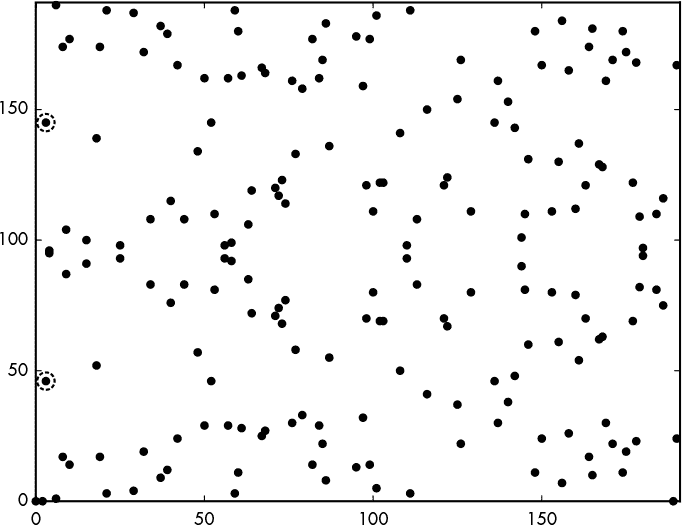
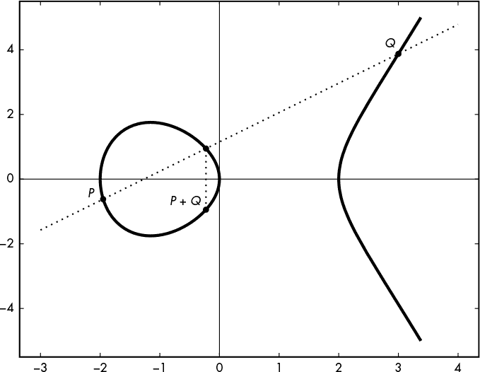
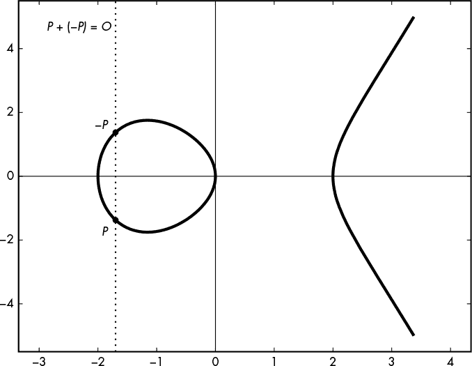
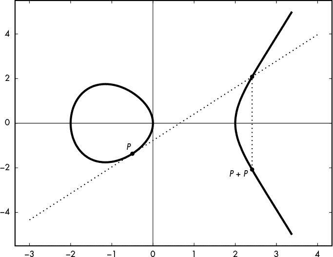
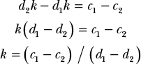

## 12

椭圆曲线


1985 年引入的*椭圆曲线密码学（ECC）*彻底改变了我们进行公钥密码学的方法。与 RSA 和经典的 Diffie–Hellman 等替代方案相比，ECC 更强大且高效（例如，使用 256 位密钥的 ECC 比使用 4096 位密钥的 RSA 更强大），但它也更复杂。

像 RSA 一样，ECC 通过乘法运算处理大数字，但不同于 RSA，它是通过在数学曲线上结合点来完成的，这条曲线叫做*椭圆曲线*（顺便说一下，它与椭圆无关）。更复杂的是，椭圆曲线有很多不同类型——简单的和复杂的，高效的和低效的，安全的和不安全的。

尽管椭圆曲线密码学（ECC）在 1985 年首次被提出，但直到 2000 年代初，标准化组织才开始采纳它，并且直到更晚的时候，主要工具包才开始支持：OpenSSL 在 2005 年添加了 ECC，而 OpenSSH 安全连接工具则等到 2011 年才支持 ECC。但现代系统几乎没有理由不使用 ECC，你会在比特币和许多苹果设备的安全组件中看到它。实际上，椭圆曲线使你能够比传统算法更快地执行常见的公钥密码学操作，如加密、签名和密钥协商。大多数依赖离散对数问题（DLP）的加密应用在基于其椭圆曲线对手 ECDLP 时也能正常工作，唯一的显著例外是：安全远程密码（SRP）协议。

本章重点介绍 ECC 的应用，并讨论为什么选择 ECC 而不是 RSA 或经典的 Diffie–Hellman，以及如何为你的应用选择合适的椭圆曲线。

### 什么是椭圆曲线？

椭圆曲线是平面上的一条*曲线*——一组具有*x*和*y*坐标的点。曲线的方程定义了所有属于该曲线的点。例如，曲线*y* = 3 是一个横坐标为 3 的水平线，形式为*y* = *ax* + *b*的曲线是直线，*x*² + *y*² = 1 是一个半径为 1、以原点为中心的圆，依此类推。无论曲线的类型如何，曲线上的点都是满足曲线方程的(*x*, *y*)对。

用于加密的椭圆曲线通常是其方程形式为*y*² = *x*³ + *ax* + *b*（即*魏尔斯特拉斯形式*），其中常数*a*和*b*定义了曲线的形状。例如，图 12-1 展示了满足方程*y*² = *x*³ – 4*x*的椭圆曲线。


*图 12-1：具有方程 y*² = *x*³ – 4*x 的椭圆曲线，显示在实数范围内*

**注意**

*在本章中，我将重点介绍最简单、最常见的椭圆曲线类型——即其方程类似于* y² = x³ + ax + b——*但也有其他形式的椭圆曲线。例如，*爱德华兹曲线*是方程为* x² + y² = 1 + dx²y² 的椭圆曲线。*爱德华兹曲线有时用于密码学（例如，在 Ed25519 方案中）*。

图 12-1 显示了组成 *x* 从 -3 到 4 之间曲线的所有点，无论是位于左侧的圆形曲线上的点，还是位于右侧的抛物线曲线上的点。所有这些点的 (*x*, *y*) 坐标都满足曲线方程 *y*² = *x*³ – 4*x*。例如，当 *x* = 0 时，*y*² = *x*³ – 4*x* = 0³ – 4 × 0 = 0；因此，*y* = 0 是一个解，点 (0, 0) 属于该曲线。同样地，如果 *x* = 2，方程的解是 *y* = 0，这意味着点 (2, 0) 属于该曲线。

区分属于曲线的点和其他点非常重要，因为在使用椭圆曲线进行密码学时，我们将使用来自曲线的点，而曲线外的点往往会带来安全风险。然而，请注意，曲线的方程并不总是有解，至少在自然数平面中没有解。例如，要找到横坐标为 *x* = 1 的点，我们需要解 *y*² = *x*³ – 4*x*，对于 *x*³ – 4*x* = 1³ – 4 × 1，结果为 –3。但 *y*² = –3 没有解，因为没有一个数满足 *y*² = –3。（在复数中有解，但椭圆曲线密码学只处理自然数——更准确地说，是模素数的整数。）因为曲线方程在 *x* = 1 时没有解，所以在 x 轴上该位置没有点，如图 12-1 所示。

如果我们尝试求解 *x* = –1 呢？在这种情况下，我们得到方程 *y*² = –1 + 4 = 3，方程有两个解（*y* = √3 和 *y* = –√3），即三的平方根及其负值。平方一个数总是得到一个正数，因此对于任何实数 *y*，都有 *y*² = (–*y*)²，正如你所看到的，图 12-1 中的曲线对于所有解其方程的点相对于 x 轴是对称的（所有形式为 *y*² = *x*³ + *ax* + *b* 的椭圆曲线都是如此）。

#### *整数上的椭圆曲线*

现在，稍微有点意外：在椭圆曲线密码学中使用的曲线实际上看起来并不像图 12-1 中所示的曲线。它们更像是 图 12-2，这是一团点而不是曲线。这是怎么回事呢？

图 12-1 和 12-2 实际上是基于相同的曲线方程 *y*² = *x*³ – 4*x*，但它们显示的是相对于不同数集的曲线点：图 12-1 显示的是实数集上的曲线点，其中包括负数、小数等。例如，作为连续曲线，它显示了 *x* = 2.0、*x* = 2.1、*x* = 2.00002 等点。另一方面，图 12-2 只显示满足该方程的 *整数*，这排除了小数。例如，图 12-2 显示的是方程 *y*² = *x*³ – 4*x* 相对于模 191 的整数：0, 1, 2, 3，一直到 190。这个数集被表示为 **Z**[191]。（这里没有特别之处，除非 191 是一个质数。我选了一个小数字，以避免图表上出现太多点。）因此，图 12-2 上显示的所有点都有满足方程 *y*² = *x*³ – 4*x* 的整数坐标 *x* 和 *y*，且这些坐标是模 191 的整数。例如，当 *x* = 2 时，*y*² = 0，*y* = 0 是一个有效解。这告诉我们点 (2, 0) 属于该曲线。



*图 12-2：方程 y² = x³ – 4*x 在 **Z**[191] 上的椭圆曲线，**Z**[191] 是模 191 的整数集合*

如果 *x* = 3 会怎么样？我们得到方程 *y*² = 27 – 12 = 15，这个方程有两个解 *y*² = 15（即 46 和 145），因为 46² mod 191 = 15 和 145² mod 191 = 15 都等于 15，属于 **Z**[191]。因此，点 (3, 46) 和 (3, 145) 属于该曲线，并如 图 12-2 所示（左侧突出显示的两个点）。

**注意**

*图 12-2 考虑的是来自集合 **Z**[191] = *{0, 1, 2, … , 190} 的点，这个集合包括零。这与我们在讨论 RSA 和 Diffie-Hellman 时提到的带星号上标的 **Z**[p]^*（星号上标）集合不同。之所以有这种差异，是因为我们将进行加法和乘法运算，因此需要确保数集包含加法的单位元素（即 0，确保 *x + 0 = x* 对于 **Z**[191] 中的每个 *x*）。*此外，每个数字 *x* 都有一个相对于加法的逆元，记作 *–x*，使得 *x + (–x) = 0*。例如，100 在 **Z**[191] 中的逆元是 91，因为 100 + 91 mod 191 = 0。这样的数集，其中加法和乘法都可行，并且每个元素 *x* 都有一个相对于加法的逆元（记作 *–x*）以及一个相对于乘法的逆元（记作 1* / x），被称为一个*域*。当一个域有有限个元素时，如 **Z**[191]，并且所有用于椭圆曲线加密的域都是如此，它被称为一个*有限域*。

#### *添加和乘法运算*

我们已经看到，椭圆曲线上的点都是满足曲线方程 *y*² = *x*³ + *ax* + *b* 的坐标 (*x*, *y*)。在本节中，我们将讨论如何加椭圆曲线上的点，这条规则称为 *加法定律*。

##### 加法两个点

假设我们要将椭圆曲线上的两点 *P* 和 *Q* 相加，得到一个新的点 *R*，它是这两点的和。理解点加法的最简单方法是根据几何规则确定 *R* = *P* + *Q* 在曲线上相对于 *P* 和 *Q* 的位置：画出连接 *P* 和 *Q* 的直线，找到这条直线与曲线相交的另一个点，并且 *Q* 是该点关于 x 轴的反射。例如，在图 12-3 中，连接 *P* 和 *Q* 的直线与曲线相交于 *P* 和 *Q* 之间的第三个点，点 *P* + *Q* 是与之具有相同 *x* 坐标，但 *y* 坐标相反的点。



*图 12-3：在椭圆曲线上加点的一般几何规则*

这个几何规则很简单，但它不会直接给出点 *R* 的坐标。我们使用点 *P* 的坐标 (*x*[*P*], *y*[*P*]) 和点 *Q* 的坐标 (*x*[*Q*], *y*[*Q*])，通过公式 *x*[*R*] = *m*² – *x*[*P*] – *x*[*Q*] 和 *y*[*R*] = *m*( *x*[*P*] – *x*[*R*]) – *y*[*P*]，计算点 *R* 的坐标 (*x*[*R*], *y*[*R*])，其中 *m* = (*y*[*Q*] – *y*[*P*]) / (*x*[*Q*] – *x*[*P*]) 是连接点 *P* 和 *Q* 的直线的斜率。

不幸的是，这些公式以及图 12-3 中展示的画线技巧并不总是有效。例如，如果 *P* = *Q*，你无法在两点之间画一条直线（只有一条），而且如果 *P* = –*P*，这条线不会再次穿过曲线，因此没有与曲线相交的点可以进行镜像反射。我们将在下一节探讨这些情况。

##### 加点与其负点

点 *P* = (*x*[*P*], *y*[*P*]) 的负点是点 –*P* = (*x*[*P*], –*y*[*P*])，即关于 x 轴对称的点。对于任何点 *P*，我们有 *P* + (–*P*) = *O*，其中 *O* 称为 *无穷远点*。如图 12-4 所示，点 *P* 和 –*P* 之间的直线延伸至无穷大，并且永远不会与曲线相交。（无穷远点是一个虚拟点，属于任何椭圆曲线；它对于椭圆曲线的意义就像零对于整数的意义。）



*图 12-4：在椭圆曲线上加点的几何规则，操作为* P + (–P) = O *当连接点的直线永远不会与曲线相交时*

##### 点的倍加

当 *P* = *Q*（即 *P* 和 *Q* 处于相同的位置）时，*P* 和 *Q* 的相加等价于计算 *P* + *P*，也表示为 2*P*。因此，这个加法运算称为 *倍加*。

然而，要找出结果 *R* = 2*P* 的坐标，我们不能使用前一节的几何规则，因为我们无法画出 *P* 和它自身之间的连线。相反，我们画出一条在 *P* 处与曲线相切的线，*2P* 是这条线与曲线相交点的对称点，如图 12-5 所示。



*图 12-5：使用加倍操作在椭圆曲线上加法的几何规则* P + P

用来确定 *R* = *P* + *P* 的坐标 (*x*[*R*]，*y*[*R*]) 的公式与我们用来处理不同的 *P* 和 *Q* 的公式略有不同。同样，基本公式是 *x*[*R*] = *m*² – *x*[*P*] – *x*[*Q*] 和 *y*[*R*] = *m*(*x*[*P*] – *x*[*R*]) – *y*[*P*]，但是 *m* 的值不同；它变为 (3*x*[*P*]² + *a*) / 2*y*[*P*]，其中 *a* 是曲线的参数，如 *y*² = *x*³ + *ax* + *b* 中所示。

##### 乘法

为了通过给定的整数 *k* 来乘椭圆曲线上的点，我们通过将 *P* 加到自身 *k* – 1 次来确定点 *kP*。换句话说，2*P* = *P* + *P*，3*P* = *P* + *P* + *P*，以此类推。为了获得 *kP* 的 *x* 和 *y* 坐标，我们反复将 *P* 加到自身并应用前述的加法法则。

然而，为了高效地计算 *kP*，使用通过应用加法法则 *k* – 1 次来加 *P* 的朴素技巧远非最佳。例如，如果 *k* 很大（比如 2²⁵⁶ 级别），如在基于椭圆曲线的加密方案中出现的那样，那么计算 *k* – 1 次加法是完全不可行的。

但有一个技巧：通过采用在“快速幂算法：平方加倍”第 192 页讨论的技巧，可以显著加速计算 *x*^(*e*) mod *n*。例如，为了用三次加法而不是七次计算 8*P*，你首先计算 *P*[2] = *P* + *P*，然后 *P*[4] = *P*[2] + *P*[2]，最后 *P*[4] + *P*[4] = 8*P*。

#### *椭圆曲线群*

由于点可以相加，椭圆曲线上的点集形成一个群。根据群的定义（见“什么是群？”第 174 页），如果点 *P* 和 *Q* 属于给定的曲线，那么 *P* + *Q* 也属于该曲线。

此外，由于加法是*结合律*的，我们有 (*P* + *Q*) + *R* = *P* + (*Q* + *R*)，对于任何点 *P*、*Q* 和 *R* 都成立。在椭圆曲线点的群体中，单位元称为无穷远点，记作 *O*，使得 *P* + *O* = *P* 对于任何 *P* 都成立。每个点 *P* = (*x*[*P*] , *y*[*P*]) 都有一个逆元素，–*P* = (*x*[*P*] , –*y*[*P*])，使得 *P* + (–*P*) = *O*。

在实践中，大多数基于椭圆曲线的加密系统使用的是模一个质数*p*的*x*和*y*坐标（换句话说，使用的是有限域**Z**[*p*]中的数）。就像 RSA 的安全性依赖于所用数字的大小一样，基于椭圆曲线的加密系统的安全性也依赖于曲线上的点的数量。但是，我们如何知道椭圆曲线上的点的数量，或者它的*基数*呢？嗯，这取决于曲线和*p*的值。

一个经验法则是，曲线上大约有*p*个点，但你可以使用 Schoof 算法来计算精确的点数，该算法用于计算有限域上的椭圆曲线的点数。你会发现这个算法已经内置在 SageMath 中。例如，列表 12-1 展示了如何使用该算法计算曲线*y*² = *x*³ – 4*x*上**Z**[191]的点数，具体见图 12-1。

```
sage: Z = Zmod(191)
sage: E = EllipticCurve(Z, (-4,0))
sage: E.cardinality()
192
```

*列表 12-1：计算基数或曲线上的点数*

在列表 12-1 中，我们首先将变量`Z`定义为模 191 的整数集合；然后，我们将变量`E`定义为以系数–4 和 0 定义的`Z`上的椭圆曲线。最后，我们计算了曲线上的点的数量，也就是它的*基数*、*群* *阶*，或者简称*阶*。请注意，这个计数包括了无穷远的点*O*。

### ECDLP 问题

第九章介绍了 DLP：即给定某个基数*g*，找到数字*y*，使得*x* = *g*^(*y*) mod *p*，其中*p*是一个大的质数。椭圆曲线密码学有一个类似的问题：给定基点*P*，找到数字*k*，使得点*Q* = *kP*。这个问题叫做*椭圆曲线离散对数问题*，简称*ECDLP*。（与数字不同，椭圆曲线的问题作用于点，且使用乘法而不是指数运算。）

所有椭圆曲线密码学都是建立在 ECDLP 问题上的，这个问题就像 DLP 一样，被认为是困难的，并且自 1985 年引入密码学以来经受住了密码分析的考验。ECDLP 与经典的 DLP 之间一个重要的区别是，ECDLP 允许使用更小的数字，同时仍然享有类似的安全级别。

通常，当*p*是*n*位时，你会获得大约*n*/2 位的安全性。例如，取一个模*p*的椭圆曲线，其中*p*为 256 位，将提供大约 128 位的安全性。为了对比，若使用 DLP 或 RSA 来实现相似的安全性，你需要使用几千位的数字。ECC 算术使用较小的数字，这是它通常比 RSA 或经典 Diffie–Hellman 更快的原因之一。

解决 ECDLP 的一种方法是找到两个输出之间的碰撞，*c*[1]*P* + *d*[1]*Q* 和 *c*[2]*P* + *d*[2]*Q*。这些方程中的点*P*和*Q*是满足*Q* = *kP*（其中*k*为某个未知值）的点，而*c*[1]、*d*[1]、*c*[2]和*d*[2]是你需要的数字，以便找到*k*。

与第六章中讨论的哈希函数类似，当两个不同的输入产生相同的输出时，就会发生碰撞。因此，为了解决 ECDLP 问题，我们需要找到满足以下条件的点：

*c*[1]*P* + *d*[1]*Q* = *c*[2]*P* + *d*[2]*Q*

为了找到这些点，我们将*Q*替换为值*kP*，得到以下结果：

*c*[1]*P* + *d*[1]*kP* = (*c*[1] + *d*[1]*k*)*P* = *c*[2]*P* + *d*[2]*kP* = (*c*[2] + *d*[2]*k*)*P*

这告诉我们，当对曲线上的点数取模时，(*c*[1] + *d*[1]*k*) 等于 (*c*[2] + *d*[2]*k*)，这并不是什么秘密。

从中我们可以推导出以下内容：



而我们已经找到了*k*，即 ECDLP 的解。

当然，这只是宏观视角，细节要复杂且更有趣。在实际操作中，椭圆曲线的数字至少扩展到 256 位，这使得通过寻找碰撞来攻击椭圆曲线密码学变得不切实际，因为这需要最多 2¹²⁸次操作（这是找到 256 位数字的碰撞所需的代价，正如你在第六章中学到的）。

### 椭圆曲线 Diffie–Hellman 密钥协商

回想一下第十一章中提到的经典 Diffie–Hellman (DH) 密钥协商协议，其中两方通过交换非秘密的值来建立共享秘密。给定某个固定数值*g*，爱丽丝选择一个秘密的随机数*a*，计算出*A* = *g*^(*a*)，然后将*A*发送给鲍勃，而鲍勃选择一个秘密的随机数*b*，计算出*B* = *g*^(*b*)，然后将*B*发送给爱丽丝。然后，两方将各自的私钥与对方的公钥结合，得到相同的共享密钥*A*^(*b*) = *B*^(*a*) = *g*^(*ab*)。

椭圆曲线版本的 DH 与经典 DH 完全相同，只是符号不同。在 ECC 的情况下，对于某个固定点*G*，爱丽丝选择一个秘密的随机数*d*[*A*]，计算出*P*[*A*] = *d*[*A*]*G*（即点*G*乘以*d*[*A*]），并将*P*[*A*]发送给鲍勃。鲍勃选择一个秘密的随机数*d*[*B*]，计算出点*P*[*B*] = *d*[*B*]*G*，并将其发送给爱丽丝。然后，两方计算出相同的共享秘密，*d*[*A*]*P*[*B*] = *d*[*B*]*P*[*A*] = *d*[*A*]*d*[*B*]*G*。这种方法称为*椭圆曲线 Diffie–Hellman*，或*ECDH*。

ECDH 与 ECDLP 问题的关系，就像 DH 与 DLP 问题的关系一样：它在 ECDLP 难解的前提下是安全的。因此，依赖 DLP 的 DH 协议可以改编为使用椭圆曲线，并依赖 ECDLP 作为难度假设。例如，认证的 DH 和 Menezes–Qu–Vanstone (MQV)也将在使用椭圆曲线时保持安全。（事实上，MQV 最初就是定义为在椭圆曲线上工作的。）

#### *使用椭圆曲线签名*

用于使用椭圆曲线加密（ECC）签名的标准算法是 *ECDSA*，即 *椭圆曲线数字签名算法*。该算法已经在许多应用中取代了 RSA 签名和经典 DSA 签名。例如，它是比特币中唯一使用的签名算法，并且得到了许多 TLS 和 SSH 实现的支持。

与所有签名方案一样，ECDSA 包含一个 *签名生成* 算法，签名者使用该算法结合自己的私钥生成签名，以及一个 *验证* 算法，验证者使用该算法结合签名者的公钥检查签名的正确性。签名者持有一个数字 *d* 作为私钥，验证者持有公钥 *P* = *dG*。双方都预先知道使用的椭圆曲线、其阶（*n*，即曲线上的点数），以及基点 *G* 的坐标。

##### ECDSA 签名生成

为了对消息进行签名，签名者首先使用加密哈希函数（如 SHA-256 或 BLAKE2）对消息进行哈希处理，生成哈希值 *h*，该值被解释为介于 0 和 *n* – 1 之间的数字。接着，签名者选择一个介于 1 和 *n* – 1 之间的随机数 *k*，并计算 *kG*，即坐标为（*x*，*y*）的点。签名者现在设置 *r* = *x* mod *n*，并计算 *s* = (*h* + *rd*) / *k* mod *n*，然后将这些值作为签名（*r*，*s*）。

签名的长度将取决于所使用的坐标长度。例如，当使用 256 位数值的坐标时，*r* 和 *s* 都将是 256 位长，从而生成一个 512 位长的签名。

##### ECDSA 签名验证

ECDSA 验证算法使用签名者的公钥来验证签名的有效性。

为了验证 ECDSA 签名（*r*，*s*）和消息的哈希值 *h*，验证者首先计算 *w* = 1 / *s*，即签名中 *s* 的逆元，等于 *k* / (*h* + *rd*) mod *n*，因为 *s* 定义为 *s* = (*h* + *rd*) / *k*。接着，验证者将 *w* 与 *h* 相乘，按以下公式计算 *u*：

*wh* = *hk* (*h* + *rd*) = *u*

然后，验证者将 *w* 与 *r* 相乘来计算 *v*：

*wr* = *rk* (*h* + *rd*) = *v*

给定 *u* 和 *v*，验证者按照以下公式计算点 *Q*：

*Q* = *uG* + *vP*

这里，*P* 是签名者的公钥，等于 *dG*，并且验证者只有在 *Q* 的 *x* 坐标等于签名中的 *r* 值时才接受该签名。

这一过程之所以有效，是因为在最后一步，我们通过将公钥 *P* 替换为其实际值 *dG* 来计算点 *Q*：

*uG* + *vdG* = (*u* + *vd*)*G*

当我们将 *u* 和 *v* 替换为其实际值时，得到以下结果：

*u* + *vd* = *hk* (*h* + *rd*) + *drk* / (*h* + *rd*) = (*hk* + *drk*) / (*h* + *rd*) = *k* (*h* + *dr*) / (*h* + *rd*) = *k*

这告诉我们（*u* + *vd*）等于在签名生成过程中选择的值 *k*，而 *uG* + *vdG* 等于点 *kG*。换句话说，验证算法成功计算了点 *kG*，这是在签名生成过程中计算出的同一点。一旦验证者确认 *kG* 的 *x* 坐标等于接收到的 *r*，验证完成；否则，签名将被视为无效并被拒绝。

##### ECDSA 与 RSA 签名

椭圆曲线密码学通常被视为 RSA 的替代方案，用于公钥密码学，但 ECC 和 RSA 没有太多相似之处。RSA 仅用于加密和签名，而 ECC 是一系列算法，可以用于执行加密、生成签名、进行密钥协商，并提供先进的加密功能，如基于身份的加密（这是一种使用从个人标识符（例如电子邮件地址）派生的加密密钥的加密方式）。

在比较 RSA 和 ECC 的签名算法时，请记住，在 RSA 签名中，签名者使用他们的私钥 *d* 来计算签名，公式为 *y* = *x*^(*d*) mod *n*，其中 *x* 是要签名的数据，*y* 是签名。验证使用公钥 *e* 来确认 *y*^(*e*) mod *n* 是否等于 *x* ——这一过程显然比 ECDSA 的过程简单。

RSA 的验证过程通常比 ECC 的签名生成过程更快，因为它使用了一个较小的公钥 *e*。但 ECC 相对于 RSA 有两个主要优势：更短的签名和更快的签名速度。因为 ECC 使用更短的数字，它生成的签名比 RSA 更短（只有几百位，而不是几千位），如果你需要存储或传输大量签名，这是一个明显的好处。使用 ECDSA 签名的速度也比 RSA 签名更快（尽管验证签名的速度差不多），因为 ECDSA 使用的数字比 RSA 小得多，且安全级别相似。例如，示例 12-2 显示，ECDSA 在签名时大约快 150 倍，在验证时稍微快一些。请注意，ECDSA 签名也比 RSA 签名更短，因为它们是 512 位（两个 256 位的元素），而 RSA 签名是 4096 位。

```
$ openssl speed ecdsap256 rsa4096
                              sign     verify     sign/s     verify/s
rsa 4096 bits            0.007267s  0.000116s      137.6       8648.0
                              sign     verify     sign/s     verify/s
256 bit ecdsa (nistp256)   0.0000s    0.0001s    21074.6       9675.7
```

*示例 12-2：比较 4096 位 RSA 签名和 256 位 ECDSA 签名的速度*

对这些不同大小的签名进行性能比较是公平的，因为它们提供了相似的安全级别。然而，在实践中，许多系统使用 2048 位的 RSA 签名，这比 256 位的 ECDSA 安全性低几个数量级。由于其较小的模数大小，2048 位 RSA 在验证时比 256 位 ECDSA 更快，但在签名时仍然较慢，如示例 12-3 所示。

```
$ openssl speed rsa2048
                          sign         verify     sign/s     verify/s
rsa 2048 bits            0.000696s  0.000032s     1436.1      30967.1
```

*示例 12-3：2048 位 RSA 签名的速度*

结果是，除了签名验证至关重要*且*你不在乎签名速度的情况（例如，在一个 Windows 可执行应用程序被签名一次然后在所有执行该程序的系统中进行验证时），你应该选择 ECDSA 而非 RSA。

#### *椭圆曲线加密*

尽管椭圆曲线更常用于签名，但你仍然可以用它们进行加密。不过，由于可以加密的明文大小的限制，在实际应用中很少有人这么做：与 RSA 在相同安全等级下可加密约 4000 位的明文相比，椭圆曲线加密最多只能加密约 100 位的明文。

用椭圆曲线加密的一种简单方法是使用*集成加密方案（IES）*，这是一种基于 Diffie-Hellman 密钥交换的混合非对称–对称密钥加密算法。本质上，IES 通过生成一个 Diffie-Hellman 密钥对，将私钥与接收者的公钥结合，从共享的秘密中派生出对称密钥，然后使用认证加密算法加密消息。

在椭圆曲线中使用时，IES 依赖于 ECDLP 的难度，并称为*椭圆曲线集成加密方案（ECIES）*。给定接收者的公钥 *P*，ECIES 按以下方式加密消息 *M*：

1.  选择一个随机数，*d*，并计算点 *Q* = *dG*，其中基点 *G* 是一个固定的参数。在这里，(*d*, *Q*) 作为一个临时密钥对，仅用于加密 *M*。

1.  通过计算 *S* = *dP* 来计算 ECDH 共享密钥。

1.  使用密钥派生方案（KDF）从 *S* 派生出对称密钥 *K*。

1.  使用 *K* 和对称认证加密算法加密 *M*，得到密文 *C* 和认证标签 *T*。

ECIES 密文由临时公钥 *Q*，然后是 *C* 和 *T* 组成。解密过程非常直接：接收者通过将 *R* 与其私钥指数相乘来计算 *S*，然后派生出密钥 *K* 并解密 *C*，同时验证 *T*。

### 选择曲线

用于评估椭圆曲线安全性的标准包括所用群的阶数（即其点的数量）、加法公式以及其起源。

椭圆曲线有多种类型，但并非所有曲线都同样适合加密用途。在选择时，务必小心选择曲线方程 *y*² = *x*³ + *ax* + *b* 中的系数 *a* 和 *b*；否则，你可能会选择一个不安全的曲线。在实际应用中，你会使用某种事实上的标准曲线进行加密，但了解什么构成安全的曲线将帮助你在多种曲线中做出选择，并更好地理解相关风险。以下是一些需要牢记的要点：

+   群的阶数不应为小数字的乘积；否则，解 ECDLP 问题会变得容易得多。

+   在“添加和乘法点”第 221 页中，你学到，添加点*P* + *Q*时，当*Q* = *P*时需要使用特定的加法公式。不幸的是，如果将这种情况与一般情况区别对待，可能会泄漏关键信息，尤其是当攻击者能够区分倍加和不同点之间的加法时。一些曲线之所以安全，*因为*它们对所有点加法使用相同的公式。（当曲线不需要特定的倍加公式时，我们说它符合*统一*的加法规则。）

+   如果曲线的创作者没有解释*a*和*b*的来源，他们可能会被怀疑有所隐瞒，因为我们无法知道他们是否选择了较弱的值，从而可能导致一些尚未发现的加密系统攻击。

让我们回顾一些最常用的曲线，特别是用于签名或 Diffie–Hellman 密钥协商的曲线。

**注意**

*你可以在专门的网站上找到更多关于曲线的标准和细节* [`safecurves.cr.yp.to/`](https://safecurves.cr.yp.to/)。

#### *NIST 曲线*

2000 年，美国国家标准与技术研究院（NIST）在 FIPS 186 文档中对 NIST 曲线进行了标准化，文件标题为“联邦政府使用的推荐椭圆曲线”。五条 NIST 曲线在素数模（如《整数上的椭圆曲线》第 219 页所讨论）下工作，被称为*素数曲线*。另外十条 NIST 曲线使用二进制多项式，这是一种数学对象，它能使硬件实现更加高效。（我们不会进一步讨论二进制多项式，因为它们很少与椭圆曲线一起使用。）

最常见的 NIST 曲线是素数曲线。在这些曲线中，最常见的之一是 P-256，它在模 256 位数*p* = 2²⁵⁶ – 2²²⁴ + 2¹⁹² + 2⁹⁶ – 1 的数上工作。P-256 的方程是*y*² = *x*³ – 3*x* + *b*，其中*b*是一个 256 位的数字。NIST 还提供 192 位、224 位、384 位和 521 位的素数曲线。

NIST 曲线有时受到批评，因为只有 NSA（曲线的创作者）知道它们方程中*b*系数的来源。我们所得到的唯一解释是，*b*是通过使用 SHA-1 对一个看起来是随机的常数进行哈希处理得出的。例如，P-256 的*b*参数来自以下常数：`c49d3608 86e70493 6a6678e1 139d26b7 819f7e90`。

没有人知道 NSA 为什么选择这个特定的常数，但大多数专家认为曲线的起源并不隐藏任何弱点。

#### *Curve25519*

Daniel J. Bernstein 于 2006 年将 Curve25519（读作*curve-twenty-five-five-**nineteen*）带给了世界。出于性能考虑，他设计了 Curve25519，使其比标准曲线更快，并且使用较短的密钥。但 Curve25519 还带来了安全性上的好处，因为与 NIST 曲线不同，它没有可疑的常数，并且可以使用相同的统一公式来进行不同点的加法或点的倍加。

Curve25519 方程的形式，*y*² = *x*³ + 486662*x*² + *x*，与本章中你所见的其他方程略有不同，但它仍属于椭圆曲线家族。这个方程的不寻常形式允许使用特定的实现技术，使 Curve25519 在软件中运行非常快速。

Curve25519 使用的是以素数 2²⁵⁵ – 19 为模的数字，这是一个 256 位素数，尽可能接近 2²⁵⁵。*b* 系数 486662 是满足 Bernstein 安全标准的最小整数。综合这些特性，使得 Curve25519 比 NIST 曲线及其可疑系数更值得信任。

Curve25519 已经被广泛使用：在 Google Chrome、Apple 系统、OpenSSH 和许多其他系统中。然而，由于 Curve25519 不是一个 NIST 标准，一些应用仍坚持使用 NIST 曲线。

**注意**

*要了解 Curve25519 的所有细节和背后的原理，请查看 Daniel J. Bernstein 于 2016 年做的讲座“Curve25519 的前 10 年”，可通过此链接访问* [`cr.yp.to/talks.html#2016.03.09/`](http://cr.yp.to/talks.html#2016.03.09/)。

#### *其他曲线*

在我写这篇文章时，大多数加密应用都使用 NIST 曲线或 Curve25519，但仍有其他遗留标准在使用，并且一些新曲线正在标准化委员会中被推广和推动。一些旧的国家标准包括法国的 ANSSI 曲线和德国的 Brainpool 曲线：这两种曲线不支持完整的加法公式，并且使用未知来源的常数。

一些更新的曲线比旧的曲线更高效，并且没有任何怀疑；它们提供了不同的安全级别和各种效率优化。例子包括 Curve41417，它是 Curve25519 的一个变种，使用更大的数字并提供更高的安全性（大约 200 位）；Ed448-Goldilocks，它是一个 448 位曲线，首次提出于 2014 年，并被认为是互联网标准；以及 Aranha 等人在《A note on high-security general-purpose elliptic curves》中提出的六条曲线（见 *[`eprint.iacr.org/2013/647/`](http://eprint.iacr.org/2013/647/)*），尽管这些曲线很少被使用。这些曲线的具体细节超出了本书的讨论范围。

### 事情可能出错的方式

由于椭圆曲线的复杂性和较大的攻击面，它们也有一些缺点。它们使用比经典 Diffie–Hellman 更多的参数，这带来了更大的攻击面，更多的出错和滥用的机会——以及可能影响其实现的软件漏洞。由于其运算中使用了大量的数字，椭圆曲线软件也可能容易受到侧信道攻击。如果计算的速度依赖于输入，攻击者可能能够获得关于加密所用公式的信息。

在接下来的章节中，我将讨论即使实现是安全的，椭圆曲线仍然可能出现的两种漏洞。这些是协议漏洞，而不是实现漏洞。

#### *ECDSA 随机性差的问题*

ECDSA 签名是随机的，因为在设置 *s* = (*h* + *rd*) / *k* mod *n* 时涉及一个秘密的随机数 *k*。然而，如果相同的 *k* 被重复用于签名第二条消息，攻击者可以将得到的两个值 *s*[1] = (*h*[1] + *rd*) / *k* 和 *s*[2] = (*h*[2] + *rd*) / *k* 结合起来，得到 *s*[1] – *s*[2] = (*h*[1] – *h*[2]) / *k*，然后 *k* = (*h*[1] – *h*[2]) / (*s*[1] – *s*[2])。当 *k* 被知道时，私钥 *d* 可以通过以下计算轻松恢复：

(*ks*[1] − *h*[1]) / *r* = ((*h*[1] + *rd*) − *h*[1]) / *r* = *rd* / *r* = *d*

与 RSA 签名不同，如果使用弱的伪随机数生成器（PRNG），RSA 签名不会允许恢复密钥，但非随机数的使用可能导致 ECDSA 的 *k* 可以被恢复，就像 2010 年 PlayStation 3 游戏机遭遇的攻击那样，这次攻击由 fail0verflow 团队在德国柏林举办的第 27 届 Chaos Communication Congress 上展示。

#### *使用另一条曲线破解 ECDH*

如果你没有验证输入点，ECDH 可以被优雅地破解。主要原因是，给出点 *P* + *Q* 和坐标的公式从来不涉及曲线的 *b* 系数；它们仅依赖于 *P* 和 *Q* 的坐标以及 *a* 系数（当对一个点进行加倍时）。不幸的是，结果就是，当你加两个点时，你永远不能确定自己正在使用正确的曲线，因为你实际上可能在使用一个不同 *b* 系数的曲线。也就是说，你可以像下面的场景所描述的那样，通过所谓的 *无效曲线攻击* 来破解 ECDH。

假设 Alice 和 Bob 正在运行 ECDH，并且已经就一条曲线和一个基点 *G* 达成一致。Bob 将他的公钥 *d*[B]*G* 发送给 Alice。Alice 并没有在商定的曲线上发送公钥 *d*[A]*G*，而是发送了一个不同曲线上的点，无论是故意还是无意。遗憾的是，这条新曲线较弱，允许 Alice 选择一个点 *P*，使得解决 ECDLP 变得容易。她选择了一个低阶的点，对于这个点，存在一个相对较小的 *k*，使得 *kP* = *O*。

现在，Bob 认为自己拥有一个合法的公钥，他计算了自己认为的共享秘密 *d*[B]*P*，对其进行哈希处理，并使用得到的密钥加密发送给 Alice 的数据。问题在于，当 Bob 计算 *d*[B]*P* 时，他在不知情的情况下实际上是在较弱的曲线上进行计算。因此，由于 *P* 是从较大点群中的一个小子群中选择的，结果 *d*[B]*P* 也将属于这个小子群，这使得攻击者如果知道 *P* 的阶，就能有效地确定共享秘密 *d*[B]*P*。

防止这种情况的一种方法是确保点*P*和*Q*属于正确的曲线，通过确保它们的坐标满足曲线方程来实现。这样可以防止这种攻击，确保你只能在安全曲线上进行操作。

2015 年发现某些 TLS 协议实现存在无效曲线攻击，该协议使用 ECDH 来协商会话密钥。（详情请参阅 Jager、Schwenk 和 Somorovsky 的论文《TLS-ECDH 上的实用无效曲线攻击》）。

### 进一步阅读

椭圆曲线密码学是一个迷人且复杂的主题，涉及大量数学内容。我没有讨论一些重要的概念，如点的阶、曲线的余因子、射影坐标、扭曲点以及解决 ECDLP 问题的方法。如果你对数学有兴趣，你可以在 Cohen 和 Frey 编著的《椭圆曲线与超椭圆曲线密码学手册》（Chapman and Hall/CRC, 2005）中找到有关这些和其他相关主题的信息。2013 年由 Bos、Halderman、Heninger、Moore、Naehrig 和 Wustrow 编写的《椭圆曲线密码学实践中的应用》调查报告，也提供了一个很好的插图介绍，包含实际例子（*[`eprint.iacr.org/2013/734/`](https://eprint.iacr.org/2013/734/)*）。
