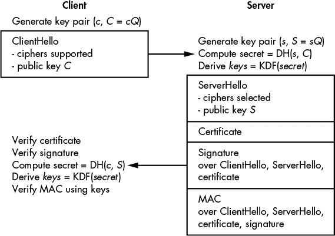
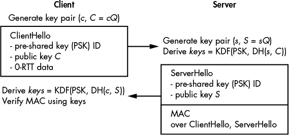
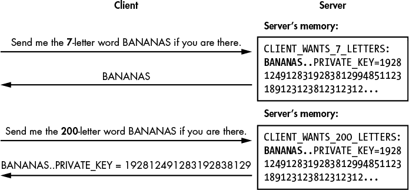

## TLS


*传输层安全性*（*TLS*）*协议*，也叫做*安全套接字层*（*SSL*），这是其前身的名称，是互联网安全的支柱。TLS 保护服务器和客户端之间的连接，无论是网站与访客之间的连接、电子邮件服务器、移动应用与其服务器之间的连接，还是视频游戏服务器与玩家之间的连接。如果没有 TLS，就不会有安全的在线商务、安全的在线银行，或者说安全的任何在线事务。

TLS 是与应用无关的；它不关心加密内容的类型。这意味着你可以将其用于依赖 HTTP 协议的基于 Web 的应用程序，也可以用于任何需要客户端计算机或设备与远程服务器建立连接的系统。例如，TLS 广泛用于所谓的物联网（IoT）应用中的机器间通信。

本章为你提供了 TLS 的简要概览。如你所见，随着时间的推移，TLS 变得越来越复杂。不幸的是，复杂性和臃肿带来了多个漏洞，且其杂乱的实现中发现的错误屡次登上头条——比如 Heartbleed、BEAST、CRIME 和 POODLE，所有这些漏洞影响了数百万台 Web 服务器。

2013 年，工程师们厌倦了修复 TLS 中新出现的加密漏洞，于是对其进行了全面改革，并开始着手开发 TLS 1.3。如你将在本章中了解到的那样，TLS 1.3 摒弃了不必要和不安全的特性，并用先进的密码算法替代了旧的算法。结果是一个更简洁、更快速且更安全的协议。

但在我们探讨 TLS 1.3 如何工作之前，先让我们回顾一下 TLS 最初旨在解决的问题，以及它存在的理由。

### 目标应用和需求

TLS 最著名的是作为 HTTPS 网站中的*S*，以及浏览器地址栏中显示的锁形图标，表示该页面是安全的。创建 TLS 的主要驱动力是通过加密网站连接来保护信用卡号码、用户凭证和其他敏感信息，从而在电子商务或电子银行等应用程序中实现安全浏览。

TLS 还通过在客户端和服务器之间建立*安全通道*来帮助保护基于互联网的通信，确保传输的数据是机密的、经过身份验证的且未被篡改。

TLS 的一个安全目标是防止中间人攻击，其中攻击者拦截传输方的加密流量，解密流量以捕获明文内容，然后重新加密并发送给接收方。TLS 通过使用证书和受信任的证书颁发机构来验证服务器（并可选择验证客户端），从而防止中间人攻击，我们将在第 238 页的“证书和证书颁发机构”部分中详细讨论。

为了确保广泛采用，TLS 需要满足另外四个要求：它需要高效、互操作、可扩展且多功能。

对于 TLS，效率意味着尽量减少与未加密连接相比的性能损失。这对服务器（减少服务提供商硬件成本）和客户端（避免明显的延迟或移动设备电池寿命的减少）都有好处。该协议需要具有互操作性，以便能够在任何硬件和操作系统上工作。它还需要具有可扩展性，以支持额外的功能或算法。而且它必须是多功能的——也就是说，不绑定于特定的应用程序（这与传输控制协议类似，后者不关心其上方使用的应用协议）。

### TLS 协议套件

为了保护客户端与服务器之间的通信，TLS 由多个版本的多个协议组成，这些协议共同构成了 TLS 协议 *套件*。尽管 *TLS* 代表 *传输层安全性*，它实际上并不是一种传输协议。TLS 通常位于传输协议 TCP 和应用层协议（如 HTTP 或 SMTP）之间，用于保护通过 TCP 连接传输的数据。

TLS 还可以通过 *用户数据报协议（UDP）* 传输协议工作，UDP 被用于“无连接”的传输，如语音或视频流量。然而，与 TCP 不同，UDP 不保证数据的传输或正确的包排序。因此，UDP 版本的 TLS 略有不同，称为 *DTLS*（*数据报传输层安全协议*）。关于 TCP 和 UDP 的更多内容，请参阅 Charles Kozierok 的 *The TCP/IP Guide*（No Starch Press，2005 年）。

#### *TLS 和 SSL 协议族：简史*

TLS 的诞生可追溯到 1995 年，当时 Netscape 浏览器的开发商 Netscape 开发了 TLS 的前身——安全套接字层（SSL）协议。SSL 远非完美，SSL 2.0 和 SSL 3.0 都存在安全漏洞。最终的结论是，你绝对不应该使用 SSL，应该始终使用 TLS——但令人困惑的是，TLS 经常被称为“SSL”，即使是安全专家也是如此。

此外，并非所有版本的 TLS 都是安全的。TLS 1.0（1999 年）是最不安全的版本，尽管它仍然比 SSL 3.0 更安全。TLS 1.1（2006 年）稍好一些，但包含一些如今已知较弱的算法。TLS 1.2（2008 年）则更好，但它比较复杂，只有在正确配置的情况下才能实现高安全性（这并非易事）。此外，它的复杂性增加了实现中的错误风险和配置错误的风险。例如，TLS 1.2 支持 AES CBC 模式，这通常容易受到填充 Oracle 攻击的威胁。

TLS 1.2 从早期版本的 TLS 继承了数十项特性和设计选择，这使得它在安全性和性能方面都存在一些不足。为了解决这一问题，密码学工程师重新设计了 TLS——保留了好的部分，并添加了安全功能。最终的结果是 TLS 1.3，这是一项彻底的改革，简化了臃肿的设计，并使其更加安全、高效和简洁。本质上，TLS 1.3 是成熟版的 TLS。

#### *TLS 简要概述*

TLS 有两种主要协议：一种确定如何传输数据，另一种确定传输哪些数据。*记录协议*定义了一个数据包格式，用于封装来自更高层协议的数据并将其发送给另一方。这是一个简单的协议，人们常常忘记它是 TLS 的一部分。

*握手协议*——或者简称 *握手*——是 TLS 的密钥协商协议。它常常被误认为是“整个”TLS 协议，但记录协议和握手协议是无法分开的。

握手由客户端发起，用以与服务器建立安全连接。客户端发送一条初始消息，称为 ClientHello，其中包含它希望使用的加密算法参数。服务器检查此消息及其参数后，回应一条消息，称为 ServerHello。一旦客户端和服务器处理完对方的消息，它们就准备好通过握手协议建立的会话密钥来交换加密数据，如你将在“TLS 握手协议”第 241 页中看到的那样。

#### *证书与证书颁发机构*

TLS 握手中最关键的步骤，也是 TLS 安全性的核心，是*证书验证步骤*，其中服务器使用*证书*来向客户端验证其身份。

证书本质上是一个公钥，并附带该公钥的签名和相关信息（包括域名）。例如，当连接到 *[`www.google.com/`](https://www.google.com/)* 时，浏览器会从某个网络主机接收到证书，并随后验证该证书的签名，签名内容可能类似于“我就是 *[google.com](http://google.com)*，我的公钥是[*key*]”。如果签名被验证通过，则该证书（及其公钥）被认为是*可信任的*，浏览器可以继续建立连接。（关于签名的详细信息，请参见第十章和第十二章）

浏览器如何知道验证签名所需的公钥？这就是*证书颁发机构*（*CA*）概念的作用。CA 本质上是硬编码在你的浏览器或操作系统中的公钥。该公钥的私钥（即其签名能力）属于一个受信任的组织，该组织确保其颁发的证书中的公钥属于声明拥有该公钥的网站或实体。也就是说，CA 充当*受信任的第三方*。没有 CA，就无法验证由 *[google.com](http://google.com)* 提供的公钥是否属于 Google，而不是属于正在进行中间人攻击的窃听者。

例如，清单 13-1 中显示的命令展示了当我们使用 OpenSSL 命令行工具在端口 443（TLS 基于 HTTP 连接的网络端口，即 HTTPS）上启动与*[www.google.com](http://www.google.com)*的 TLS 连接时发生的情况：

```
$ openssl s_client -connect www.google.com:443
CONNECTED(00000003)
--snip--
---
Certificate chain
❶ 0 s:/C=US/ST=California/L=Mountain View/O=Google Inc/CN=www.google.com
   i:/C=US/O=Google Inc/CN=Google Internet Authority G2
❷ 1 s:/C=US/O=Google Inc/CN=Google Internet Authority G2
   i:/C=US/O=GeoTrust Inc./CN=GeoTrust Global CA
❸ 2 s:/C=US/O=GeoTrust Inc./CN=GeoTrust Global CA
   i:/C=US/O=Equifax/OU=Equifax Secure Certificate Authority
---
Server certificate
-----BEGIN CERTIFICATE-----
MIIEgDCCA2igAwIBAgIISCr6QCbz5rowDQYJKoZIhvcNAQELBQAwSTELMAkGA1UE
BhMCVVMxEzARBgNVBAoTCkdvb2dsZSBJbmMxJTAjBgNVBAMTHEdvb2dsZSBJbnRl
--snip--
cb9reU8in8yCaH8dtzrFyUracpMureWnBeajOYXRPTdCFccejAh/xyH5SKDOOZ4v
3TP9GBtClAH1mSXoPhX73dp7jipZqgbY4kiEDNx+hformTUFBDHD0eO/s2nqwuWL
pBH6XQ==
-----END CERTIFICATE-----
subject=/C=US/ST=California/L=Mountain View/O=Google Inc/CN=www.google.com
issuer=/C=US/O=Google Inc/CN=Google Internet Authority G2
--snip--
```

*清单 13-1：与* [www.google.com](http://www.google.com) *建立 TLS 连接并接收证书以验证连接*

我已将输出结果裁剪，只显示有趣的部分，即证书。请注意，在第一个证书（以 `BEGIN CERTIFICATE` 标签开头）之前，是*证书链*的描述，其中以 `s:` 开头的行描述了主题名称，以 `i:` 开头的行描述了签名的颁发者。在这里，证书 `0` 是从*[google.com](http://google.com)*接收到的 ❶，证书 `1` ❷属于签署证书 `0` 的实体，证书 `2` ❸属于签署证书 `1` 的实体。颁发证书 `2`（GeoTrust）的组织授权 Google Internet Authority 为域名 *[www.google.com](http://www.google.com)* 颁发证书（证书 `1`），从而将信任转移给了 Google Internet Authority。

显然，这些 CA 组织必须是可信的，并且只能向可信的实体颁发证书，它们还必须保护其私钥，以防止攻击者代表它们颁发证书（例如，冒充合法的 *[google.com](http://google.com)* 服务器）。

要查看证书的内容，我们在 Linux 终端中输入清单 13-2 中显示的命令，然后粘贴在清单 13-1 中显示的第一个证书。

```
$ openssl x509 –text –noout
-----BEGIN CERTIFICATE-----
--snip--
-----END CERTIFICATE-----
Certificate:
    Data:
        Version: 3 (0x2)
        Serial Number: 5200243873191028410 (0x482afa4026f3e6ba)
    Signature Algorithm: sha256WithRSAEncryption
        Issuer: C=US, O=Google Inc, CN=Google Internet Authority G2
        Validity
            Not Before: Dec 15 14:07:56 2016 GMT
            Not After : Mar  9 13:35:00 2017 GMT
        Subject: C=US, ST=California, L=Mountain View, O=Google Inc, CN=www.google.com
        Subject Public Key Info:
            Public Key Algorithm: rsaEncryption
                Public-Key: (2048 bit)
                Modulus:
                    00:bc:bc:b2:f3:1a:16:3b:c6:f6:9d:28:e1:ef:8e:
                    92:9b:13:b2:ae:7b:50:8f:f0:b4:e0:36:8d:09:00:
--snip--
                    8f:e6:96:fe:41:41:85:9d:a9:10:9a:09:6e:fc:bd:
                    43:fa:4d:c6:a3:55:9a:9e:07:8b:f9:b1:1e:ce:d1:
                    22:49
                Exponent: 65537 (0x10001)
--snip--
    Signature Algorithm: sha256WithRSAEncryption
         94:cd:66:55:83:f1:16:7d:46:d8:66:21:06:ec:c6:9d:7c:1c:
         2b:c1:f6:4f:b7:3e:cd:01:ad:69:bd:a1:81:6a:7c:96:f5:9c:
         --snip--
         85:fa:2b:99:35:05:04:31:c3:d1:e3:bf:b3:69:ea:c2:e5:8b:
         a4:11:fa:5d
```

*清单 13-2：解码从* [www.google.com](http://www.google.com) *接收到的证书*

你在 Listing 13-2 中看到的是命令 `openssl x509` 解码一个证书，该证书最初是作为一块 base64 编码的数据提供的。由于 OpenSSL 知道这块数据的结构，它可以告诉我们证书内部的内容，包括序列号和版本信息、标识信息、有效期（`Not Before` 和 `Not After` 行）、公钥（这里是一个 RSA 模数及其公钥指数）以及前述信息的签名。

尽管安全专家和密码学家常常声称整个证书系统在设计上存在漏洞，但它仍然是我们拥有的最佳解决方案之一，例如，SSH 采用的首次使用信任（TOFU）策略就是一个例子。

#### *记录协议（Record Protocol）*

所有通过 TLS 1.3 通信交换的数据都是作为 *TLS 记录* 传输的，TLS 使用的数据包。TLS 记录协议（*记录层*）本质上是一种传输协议，与传输数据的含义无关；这使得 TLS 适用于任何应用。

TLS 记录协议首先用于承载握手过程中交换的数据。一旦握手完成，双方共享一个秘密密钥，应用数据会被分割成多个块，作为 TLS 记录的一部分进行传输。

##### TLS 记录的结构

一个 TLS 记录是最多 16 千字节的数据块，其结构如下：

+   第一个字节表示传输数据的类型，设置为 22 表示握手数据，23 表示加密数据，21 表示警报。在 TLS 1.3 规范中，这个值被称为 ContentType。

+   第二个和第三个字节分别被设置为 3 和 1。这些字节由于历史原因是固定的，并且不特定于 TLS 1.3 版本。在规范中，这个 2 字节的值被称为 ProtocolVersion。

+   第四个和第五个字节编码了传输数据的长度，表示为一个 16 位整数，最大为 2¹⁴ 字节（16KB）。

+   剩下的字节是要传输的数据（也称为 *负载*），其长度等于记录的第四和第五个字节编码的值。

**注意**

*TLS 记录有一个相对简单的结构。正如我们所见，TLS 记录的头部仅包含三个字段。作为对比，IPv4 包在其负载之前包含 14 个字段，TCP 段则包含 13 个字段。*

当 TLS 1.3 记录的第一个字节（ContentType）被设置为 23 时，它的负载会使用经过认证的密码算法进行加密和认证。负载由密文和一个认证标签组成，接收方会解密该负载。那么，接收方如何知道使用哪个密码和密钥来解密呢？这就是 TLS 的魔力：如果你收到一个加密的 TLS 记录，你已经知道使用哪个密码和密钥，因为它们在 TLS 握手协议执行时已经建立。

##### 随机数（Nonces）

与许多其他协议（例如 IPsec 的封装安全有效载荷（ESP））不同，TLS 记录并没有指定经过身份验证的密码算法所使用的随机数。

用于加密和解密 TLS 记录的随机数是从 64 位序列号派生的，这些序列号由每一方本地维护，并且在每个新记录中递增。当客户端加密数据时，它通过将序列号与一个名为`client_write_iv`的值进行异或运算来派生随机数，这个值本身是从共享密钥中派生的。服务器使用类似的方法，但使用不同的值，称为`server_write_iv`。

例如，如果你传输三个 TLS 记录，你将从第一个记录派生一个从 0 开始的随机数，从第二个记录派生一个从 1 开始的随机数，从第三个记录派生一个从 2 开始的随机数；如果你接收三个记录，你也将按此顺序使用随机数 0、1 和 2。对于加密传输数据和解密接收数据使用相同序列号值并不构成弱点，因为它们与不同的常量（`client_write_iv` 和 `server_write_iv`）进行异或运算，并且每个方向使用不同的密钥。

##### 零填充

TLS 1.3 记录支持一个很好的功能，叫做*零填充*，它能够缓解流量分析攻击。*流量分析*是一种攻击者通过分析流量模式（例如时序、传输的数据量等）来提取信息的方法。例如，因为密文的大小大致与明文相同，即使使用强加密，攻击者也能仅通过查看密文的长度来大致判断消息的大小。

零填充会向明文添加零，以增加密文的大小，从而欺骗观察者认为加密后的消息比实际的要长。

#### *TLS 握手协议*

*握手*是 TLS 协议的关键协商协议——客户端和服务器通过该过程建立共享的密钥，以便启动安全通信。在 TLS 握手过程中，客户端和服务器扮演不同的角色。客户端提出一些配置（TLS 版本和密码套件，按优先顺序排列），服务器选择要使用的配置。服务器应该遵循客户端的偏好，但也可以选择不同的配置。为了确保不同实现之间的互操作性，并保证任何实现 TLS 1.3 的服务器都能读取任何实现 TLS 1.3 的客户端发送的数据（即使它使用的是不同的库或编程语言），TLS 1.3 规范还描述了数据应如何发送的格式。

图 13-1 展示了在 TLS 1.3 规范中描述的握手过程中文件交换的方式。如你所见，在 TLS 1.3 握手中，客户端向服务器发送一条消息，内容为：“我想与你建立一个 TLS 连接。这里是我支持的加密 TLS 记录的密码套件，还有一个 Diffie–Hellman 公钥。”该公钥必须专门为此次 TLS 会话生成，且客户端保留相关的私钥。客户端发送的消息还包括一个 32 字节的随机值和可选信息（如附加参数等）。这条消息称为*ClientHello*，并且在以字节序列传输时必须遵循 TLS 1.3 规范中定义的特定格式。



*图 13-1：连接到 HTTPS 网站时的 TLS 1.3 握手过程*

但请注意，规范还描述了数据应以何种格式发送，以确保各个实现之间的互操作性，从而保证任何实现 TLS 1.3 的服务器都能够读取任何实现 TLS 1.3 的客户端发送的 TLS 1.3 数据，即使客户端可能使用不同的库或编程语言。

服务器接收到 ClientHello 消息后，验证消息格式是否正确，并以一条名为 *ServerHello* 的消息作出响应。ServerHello 消息包含大量信息：它包含将用于加密 TLS 记录的密码套件，一个 Diffie–Hellman 公钥，一个 32 字节的随机值（详见“降级保护”第 244 页），一个证书，一个对 ClientHello 和 ServerHello 消息中所有先前信息的签名（使用与证书公钥相关联的私钥计算），以及该信息和签名的 MAC。MAC 是使用从 Diffie–Hellman 共享密钥派生的对称密钥计算的，该密钥由服务器从其 Diffie–Hellman 私钥和客户端的公钥计算得出。

当客户端接收到 ServerHello 消息时，它会验证证书的有效性，验证签名，计算共享的 Diffie–Hellman 密钥并从中派生出对称密钥，同时验证服务器发送的 MAC。一旦所有内容都被验证，客户端就准备好向服务器发送加密消息。

然而，请注意，TLS 1.3 支持许多选项和扩展，因此它的行为可能与这里描述的不同（并且与图 13-1 所示的不同）。例如，你可以配置 TLS 1.3 握手以要求客户端证书，从而使服务器验证客户端的身份。TLS 1.3 还支持使用预共享密钥的握手。

**注意**

*TLS 1.3 支持许多选项和扩展，因此它的行为可能与这里描述的有所不同（并且在 图 13-1 中有所展示）。例如，你可以配置 TLS 1.3 握手要求客户端证书，以便服务器验证客户端的身份。TLS 1.3 还支持使用预共享密钥的握手。*

让我们来看一下实际应用。假设你已经部署了 TLS 1.3 来提供对网站 *[`www.nostarch.com/`](https://www.nostarch.com/)* 的安全访问。当你将浏览器（客户端）指向这个网站时，浏览器向网站的服务器发送一个包含支持的密码套件的 ClientHello 消息。网站则用一个 ServerHello 消息和一个包含与域名 *[www.nostarch.com](http://www.nostarch.com)* 相关的公钥的证书作出回应。客户端使用浏览器中嵌入的证书颁发机构之一验证该证书的有效性（收到的证书应该由一个受信任的证书颁发机构签名，该机构的证书应该包含在浏览器的证书库中，以便进行验证）。一旦所有检查通过，浏览器就会从 *[www.nostarch.com](http://www.nostarch.com)* 服务器请求该网站的初始页面。

在成功完成 TLS 1.3 握手后，客户端和服务器之间的所有通信都将被加密和认证。窃听者可以知道某个 IP 地址的客户端正在与另一个 IP 地址的服务器进行通信，并且可以观察交换的加密内容，但无法得知底层的明文或修改加密消息（如果他们这样做，接收方会注意到通信已被篡改，因为消息不仅被加密，还经过认证）。对于许多应用来说，这样的安全性就足够了。

#### *TLS 1.3 加密算法*

我们知道 TLS 1.3 使用了认证加密算法、密钥衍生函数（一个从共享秘密中衍生出秘密密钥的哈希函数），以及 Diffie-Hellman 操作。那么这些是如何工作的，使用了哪些算法，安全性如何呢？

关于认证密码的选择，TLS 1.3 只支持三种算法：AES-GCM、AES-CCM（比 GCM 略低效的模式）和与 Poly1305 MAC 结合使用的 ChaCha20 流密码（如 RFC 7539 所定义）。因为 TLS 1.3 阻止使用不安全的密钥长度，如 64 位或 80 位（这两者都太短），所以秘密密钥可以是 128 位（AES-GCM 或 AES-CCM）或 256 位（AES-GCM 或 ChaCha20-Poly1305）。

图 13-1 中的密钥衍生操作（KDF）基于 HKDF，这是一种基于 HMAC 的构造（在 第七章 中有讨论），并在 RFC 5869 中定义，使用 SHA-256 或 SHA-384 哈希函数。

执行 Diffie-Hellman 操作（TLS 1.3 握手的核心）时，你的选择仅限于椭圆曲线密码学和模质数的整数乘法群（如传统的 Diffie-Hellman 所示）。但是，你不能使用任意椭圆曲线或群体：支持的曲线包括三个 NIST 曲线以及 Curve25519（在第十二章中讨论）和 Curve448，这两者都在 RFC 7748 中定义。TLS 1.3 还支持在整数群体上进行 DH，而非椭圆曲线。支持的群体是 RFC 7919 中定义的五个群体：2048、3072、4096、6144 和 8192 位的群体。

2048 位组可能是 TLS 1.3 的最弱环节。尽管其他选项至少提供 128 位安全性，但 2048 位 Diffie-Hellman 被认为提供不到 100 位的安全性。因此，支持 2048 位组可以被视为与 TLS 1.3 的其他设计选择不一致。

### TLS 1.3 相较于 TLS 1.2 的改进

TLS 1.3 与其前身有很大不同。首先，它去除了像 MD5、SHA-1、RC4 以及 AES 在 CBC 模式下等弱算法。而且，虽然 TLS 1.2 通常使用加密算法和 MAC（例如 HMAC-SHA-1）的组合来保护记录，采用“先 MAC 再加密”的结构，TLS 1.3 只支持更高效且更安全的认证加密算法。TLS 1.3 还去掉了椭圆曲线点编码协商，并为每条曲线定义了单一的点格式。

TLS 1.3 的主要开发目标之一是去除 TLS 1.2 中削弱协议的特性，减少协议的整体复杂性，从而降低其攻击面。例如，TLS 1.3 去掉了可选的数据压缩功能，这一功能曾使 TLS 1.2 易受 CRIME 攻击。该攻击利用了压缩后消息的长度泄露了消息内容的信息这一事实。

不过，TLS 1.3 也带来了新的特性，使得连接更加安全或高效。我将简要讨论其中的三个特性：降级保护、单回合握手和会话恢复。

#### *降级保护*

TLS 1.3 的*降级保护*功能旨在防止*降级攻击*，即攻击者迫使客户端和服务器使用比 1.3 版本更弱的 TLS 版本。为了执行降级攻击，攻击者通过拦截并修改 ClientHello 消息，告知服务器客户端不支持 TLS 1.3，从而迫使服务器使用较弱的 TLS 版本。现在，攻击者可以利用早期版本 TLS 中的漏洞。

为了防御降级攻击，TLS 1.3 服务器在 ServerHello 消息中发送的 32 字节随机值中使用三种模式，来识别请求的连接类型。该模式应与客户端请求的特定 TLS 连接类型匹配。如果客户端接收到错误的模式，它就会知道出现了问题。

具体来说，如果客户端请求一个 TLS 1.2 连接，32 字节中的前八个字节将被设置为 44 4F 57 4E 47 52 44 01，而如果请求的是 TLS 1.1 连接，则这些字节设置为 44 4F 57 4E 47 52 44 00。但是，如果客户端请求一个 TLS 1.3 连接，这前八个字节应该是随机的。例如，如果客户端发送一个 ClientHello 请求 TLS 1.3 连接，但网络中的攻击者将其修改为请求 TLS 1.1 连接，当客户端收到具有错误模式的 ServerHello 时，它将知道其 ClientHello 消息已被篡改。（攻击者无法随意修改服务器的 32 字节随机值，因为该值是通过加密签名的。）

#### *单次往返握手*

在典型的 TLS 1.2 握手中，客户端向服务器发送一些数据，等待响应，然后再发送更多数据并等待服务器的响应，然后才会发送加密消息。延迟是两个往返时间（RTT）。相比之下，TLS 1.3 的握手只需要一个往返时间，如 图 13-1 所示。节省的时间可能达到几百毫秒。听起来可能不多，但考虑到流行服务的服务器每秒处理成千上万的连接时，这个时间差异实际上非常重要。

#### *会话恢复*

TLS 1.3 比 1.2 更快，但通过完全消除加密会话之前的往返过程，可以使其更快（大约几百毫秒）。诀窍是使用 *会话恢复*，这是一种利用客户端和服务器在先前会话中交换的预共享密钥来启动新会话的方法。会话恢复带来了两个主要好处：客户端可以立即开始加密，而且在后续会话中无需使用证书。

图 13-2 显示了会话恢复是如何工作的。首先，客户端发送一个 ClientHello 消息，其中包括与服务器已共享的密钥标识符（称为 *PSK*，即 *预共享密钥*），以及一个新的 DH 公钥。客户端还可以在此消息中包含加密数据（这些数据称为 *0-RTT 数据*）。当服务器响应 ClientHello 消息时，它提供一个用于数据交换的 MAC。客户端验证该 MAC，并知道它与之前相同的服务器进行通信，从而使证书验证变得有些多余。客户端和服务器进行与正常握手一样的 Diffie–Hellman 密钥协商，后续的消息使用依赖于 PSK 和新计算的 Diffie–Hellman 共享密钥的加密密钥进行加密。



*图 13-2：TLS 1.3 会话恢复握手。0-RTT 数据是随 ClientHello 一起发送的会话恢复数据。*

### TLS 安全性的优势

我们将评估 TLS 1.3 在 第十一章 中讨论的两个主要安全概念的强度：身份验证和前向保密性。

#### *身份验证*

在 TLS 1.3 握手过程中，服务器通过证书机制对客户端进行身份验证。然而，客户端并没有得到认证，客户端可以通过在 TLS 记录中提供用户名和密码，在完成握手后与基于服务器的应用程序（例如 Gmail）进行身份验证。如果客户端已经与远程服务建立了会话，它可以通过发送*安全 Cookie*进行身份验证，该 Cookie 只能通过 TLS 连接发送。

在某些情况下，客户端可以使用类似于服务器身份验证机制的基于证书的机制来对服务器进行身份验证：客户端将 *客户端证书* 发送给服务器，服务器验证该证书后再授权客户端。然而，由于客户端证书会增加客户端和服务器（即证书颁发者）的复杂性，因此很少使用客户端证书：客户端需要执行复杂的操作，将证书集成到系统中并保护其私钥，而颁发者需要确保只有授权的客户端收到证书，以及满足其他要求。

#### *前向保密性*

请回忆起在 “密钥协商协议” 第 205 页中的内容，当当前会话被破解时，如果以前的会话没有受到影响，密钥协商被称为提供前向保密性。在数据泄露模型中，仅临时密钥受到影响，而在安全漏洞模型中，长期密钥被暴露。

幸运的是，TLS 1.3 的前向保密性在数据泄露和安全漏洞面前仍然有效。在数据泄漏模型中，攻击者恢复了某个会话的临时密钥，例如会话密钥或 Diffie–Hellman 私钥（在 图 13-1 第 242 页中的 *c*、*s*、*secret* 和 *keys* 值）。然而，攻击者只能使用这些值解密当前会话的通信，而无法解密之前的会话，因为使用了不同的 *c* 和 *s* 值（从而生成了不同的密钥）。

在安全漏洞模型中，攻击者还恢复了长期密钥（即与证书中的公钥对应的私钥）。然而，这对于解密之前的会话并不比临时密钥更有用，因为该私钥仅用于验证服务器，前向保密性再次得以维持。

那么在实际操作中会发生什么呢？假设攻击者入侵了客户端的计算机，并获得了其所有内存的访问权限。现在，攻击者可能从内存中恢复当前会话的 TLS 会话密钥和密钥。但是更重要的是，如果之前的密钥仍然保存在内存中，攻击者可能也能够找到它们，并用它们解密之前的会话，从而绕过理论上的前向保密性。因此，为了确保前向保密性，TLS 实现必须在不再使用密钥时，正确地从内存中清除这些密钥，通常是通过将内存置零来实现。

### 问题可能出在哪里

TLS 1.3 作为通用安全通信协议符合要求，但并非万无一失。像任何安全系统一样，它在某些情况下也会失败（例如，当设计者对实际攻击的假设被证明是错误的时）。不幸的是，即使是配置了最安全密码的最新版本 TLS 1.3 也可能会被攻破。例如，TLS 1.3 的安全性依赖于假设所有三方（客户端、服务器和证书颁发机构）都会诚实地行事，但如果其中一方遭到攻击或 TLS 实现本身存在问题怎么办？

#### *受损的证书颁发机构*

根证书颁发机构（Root CAs）是浏览器信任的组织，用于验证远程主机提供的证书。例如，如果你的浏览器接受了*[www.google.com](http://www.google.com)*提供的证书，假设一个受信任的 CA 已经验证了证书所有者的合法性。浏览器通过检查 CA 签发的签名来验证证书。由于只有 CA 知道创建此签名所需的私钥，因此我们假设其他人无法代表 CA 创建有效的证书。通常，一个网站的证书不会由根 CA 签发，而是由中间 CA 签发，中间 CA 通过证书链与根 CA 连接。

假设 CA 的私钥被泄露。那么攻击者将能够使用 CA 的私钥为任何 URL（比如，* [google.com](http://google.com) * 域名下的 URL）创建证书，而无需 Google 的批准。那么会发生什么呢？攻击者可以利用这些证书冒充合法服务器或子域名，比如* [mail.google.com](http://mail.google.com) *，并拦截用户的凭据和通信。这正是 2011 年发生的事情，当时攻击者入侵了荷兰证书机构 DigiNotar 的网络，并成功创建了看似合法的 DigiNotar 证书。攻击者随后利用这些伪造证书访问了多个 Google 服务。

#### *受损的服务器*

如果服务器被攻破并完全被攻击者控制，那么一切都完了：攻击者将能够看到所有传输数据在加密之前的内容，以及所有接收到的数据在解密之后的内容。攻击者还能够获取服务器的私钥，这可能让他们通过自己的恶意服务器冒充合法的服务器。显然，在这种情况下，TLS 无法保护你。

幸运的是，这种安全灾难在像 Gmail 和 iCloud 这样的大型应用中很少见，这些应用得到了很好的保护，有时其私钥还存储在独立的安全模块中。通过诸如数据库查询注入和跨站脚本等漏洞对 Web 应用的攻击更为常见，因为这些攻击大多数独立于 TLS 的安全性，并且是攻击者通过合法的 TLS 连接进行的。这类攻击可能会危及用户名、密码等信息。

#### *被攻破的客户端*

当客户端（例如浏览器）被远程攻击者攻破时，TLS 安全性也会受到威胁。攻击者攻破客户端后，将能够捕获会话密钥、读取任何解密的数据等。他们甚至可以在客户端浏览器中安装一个恶意的 CA 证书，使其悄悄接受原本无效的证书，从而让攻击者拦截 TLS 连接。

与被攻破的 CA 或服务器场景不同，被攻破的客户端场景的最大区别在于，在客户端被攻破的情况下，只有被攻击的客户端会受到影响，而不是*所有*客户端。

#### *实现中的漏洞*

与任何加密系统一样，TLS 在其实现存在漏洞时可能会失败。TLS 漏洞的典型案例是 Heartbleed（参见图 13-3），这是 OpenSSL 实现中的一个缓冲区溢出漏洞，涉及到 TLS 的一个小功能——心跳。Heartbleed 漏洞于 2014 年被 Google 的一名研究员和 Codenomicon 公司独立发现，并影响了数百万个 TLS 服务器和客户端。

如图 13-3 所示，客户端首先向服务器发送一个缓冲区及其长度，以检查服务器是否在线。在这个例子中，缓冲区是字符串*BANANAS*，客户端明确表示这个词是七个字母长。服务器读取这个七个字母的单词并将其返回给客户端。



*图 13-3：OpenSSL 中 TLS 实现的 Heartbleed 漏洞*

问题在于服务器没有确认长度是否正确，而是会尝试读取客户端告诉它的字符数。因此，如果客户端提供的长度超过了字符串的实际长度，服务器会从内存中读取过多的数据，并将其返回给客户端，连同任何可能包含敏感信息的额外数据，例如私钥或会话 cookie。

你听到 Heartbleed 漏洞的消息时，应该不会感到惊讶。为了避免未来类似的漏洞，OpenSSL 和其他主要的 TLS 实现现在进行严格的代码审查，并使用自动化工具，如模糊测试工具（fuzzers），来识别潜在问题。

### 深入阅读

正如我在开头所提到的，本章并不是关于 TLS 的全面指南，你可能想要更深入地了解 TLS 1.3。首先，完整的 TLS 1.3 规范涵盖了协议的所有内容（尽管不一定包括其背后的理论依据）。你可以在 TLS 工作组（TLSWG）的主页上找到该规范，网址是：*[`tlswg.github.io/`](https://tlswg.github.io/)*。

此外，让我提到两个重要的 TLS 倡议：

+   SSL Labs TLS 测试（*[`www.ssllabs.com/ssltest/`](https://www.ssllabs.com/ssltest/)）*是 Qualys 提供的一个免费服务，允许你测试浏览器或服务器的 TLS 配置，提供安全评分和改进建议。如果你设置了自己的 TLS 服务器，可以使用这个测试来确保一切安全，并获得“A”评级。

+   Let’s Encrypt（*[`letsencrypt.org/`](https://letsencrypt.org/)）*是一个非盈利组织，提供“自动化”在你的 HTTP 服务器上部署 TLS 的服务。它包括自动生成证书和配置 TLS 服务器的功能，并且支持所有常见的 Web 服务器和操作系统。
