## 第十五章：量子与后量子

之前的章节主要关注当今的密码学，但在本章中，我将探讨密码学的未来，时间跨度大约是一个世纪或更长——一个*量子计算机*存在的时代。量子计算机是利用量子物理现象来运行不同类型算法的计算机，区别于我们习惯的算法。量子计算机目前还不存在，看起来也很难建造，但如果有一天它们存在，那么它们将有潜力突破 RSA、Diffie–Hellman 和椭圆曲线密码学——也就是本文所提到的所有已经部署或标准化的公钥加密算法。

为了应对量子计算机带来的风险，密码学研究人员开发了替代性的公钥加密算法，这些算法被称为*后量子*算法，能够抵抗量子计算机的攻击。2015 年，NSA（美国国家安全局）呼吁转向量子抗性算法，这些算法旨在即使在面对量子计算机时也能保持安全，2017 年，美国标准化机构 NIST 开始了一个过程，最终将标准化后量子算法。

本章将为您提供量子计算机背后的原理的非技术性概述，并简要介绍后量子算法。虽然涉及一些数学内容，但仅限于基础算术和线性代数，因此不要被这些不常见的符号吓到。

### 量子计算机的工作原理

量子计算是一种利用量子物理进行不同计算的计算模型，它能够完成经典计算机无法做到的事情，比如高效破解 RSA 和椭圆曲线密码学。但量子计算机并不是一种超快的普通计算机。事实上，量子计算机无法解决任何经典计算机无法解决的问题，比如暴力破解或**NP**-完全问题。

量子计算机基于量子力学，量子力学是研究亚原子粒子行为的物理学分支，而这些粒子的行为是真正随机的。与操作 0 或 1 的经典计算机不同，量子计算机基于*量子比特*（或*量子位*），它们可以同时是 0 和 1——这种状态叫做*叠加*。物理学家发现，在这个微观世界中，电子和光子等粒子表现出一种极其反直觉的方式：在你观察电子之前，它并不位于空间的某个确定位置，而是同时位于多个位置（也就是处于叠加状态）。但是，一旦你观察它——这在量子物理中叫做*测量*——它就会停留在一个固定的、随机的位置，并不再处于叠加状态。这种量子魔力使得量子计算机能够创建量子位。

但量子计算机之所以能够工作，是因为一个更为疯狂的现象，称为*纠缠*：两个粒子可以以一种方式连接（纠缠），使得观察其中一个粒子的值能够得出另一个粒子的值，即使这两个粒子相距遥远（可能相隔数公里甚至光年）。这种行为通过*爱因斯坦–波多尔斯基–罗森（EPR）* *悖论*得以说明，这也是阿尔伯特·爱因斯坦最初否定量子力学的原因。（详见 *[`plato.stanford.edu/entries/qt-epr/`](https://plato.stanford.edu/entries/qt-epr/)*，了解其深入解释。）

为了最好地解释量子计算机的工作原理，我们应当区分实际的量子计算机（由量子比特组成的硬件）和量子算法（在其上运行的软件，由*量子门*组成）。接下来的两部分将讨论这两个概念。

#### *量子比特*

量子比特（qubits）或其组合由称为*幅度*的数字来描述，这些幅度类似于概率，但并不*完全*是概率。概率是介于 0 和 1 之间的数字，而幅度是一个形如*a* + *b* × *i*（或简单地说是*a* + *bi*）的复数，其中*a*和*b*是实数，*i*是*虚数单位*。数字*i*用于形成*虚数*，其形式为*bi*，其中*b*为实数。当*i*与实数相乘时，我们得到另一个虚数，而当*i*与自己相乘时，结果为-1；也就是说*i*² = -1。

与实数不同，实数可以看作属于一条直线（见图 14-1），*复数*可以看作属于一个平面（一个二维空间），如图 14-2 所示。这里，图中的 x 轴对应于*a* + *bi*中的*a*，y 轴对应于*b*，虚线对应于每个数字的实部和虚部。例如，从点 3 + 2*i*垂直向下到 3 的虚线长为 2（即虚部 2*i*中的 2）。

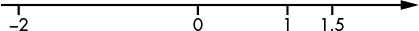

*图 14-1：实数作为无限直线上的点的展示*

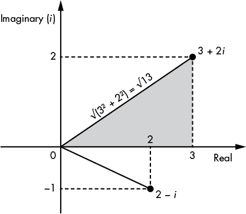

*图 14-2：复数作为二维空间中的点的展示*

如你在图 14-2 中所见，你可以利用毕达哥拉斯定理计算从原点（0）到点*a* + *bi*的线段长度，方法是将这条线看作一个三角形的对角线。这条对角线的长度等于该点坐标平方和的平方根，即√(*a*² + *b*²)，我们称其为复数*a* + *bi*的*模*。我们用|*a* + *bi*|表示模，并可以将其作为复数的长度。

在量子计算机中，寄存器由 1 个或多个量子比特组成，这些量子比特处于由一组这样的复数组成的叠加状态中。但正如我们将看到的，这些复数——幅度——不能是任意的数字。

##### 单个量子比特的幅度

一个单独的量子比特由两个振幅组成，分别称为 α（alpha）和 β（beta）。我们可以将量子比特的状态表示为 α |0〉 + β |1〉，其中“| 〉”符号用于表示量子态中的向量。这种表示意味着，当你观察这个量子比特时，它出现 0 的概率为 |α|²，出现 1 的概率为 |β|²。当然，为了让这些成为实际的概率，|α|² 和 |β|² 必须是介于 0 和 1 之间的数字，并且 |α|² + |β|² 必须等于 1。

例如，假设我们有一个量子比特 （psi），其振幅为 α = 1/√2 和 β = 1/√2。我们可以将其表示为以下形式：

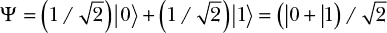

这个表示意味着在量子比特  中，值 0 的振幅为 1/√2，而值 1 的振幅也为 1/√2。为了从振幅中得到实际的概率，我们计算 1/√2 的模（它等于 1/√2，因为它没有虚部），然后将其平方：(1/√2)² = 1/2。也就是说，如果你观察量子比特 ，你有 1/2 的机会看到 0，同样也有 1/2 的机会看到 1。

现在考虑量子比特 Φ（phi），其中

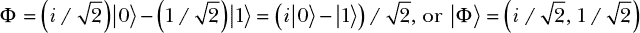

量子比特 Φ 与  本质上是不同的，因为与  中的振幅相等不同，量子比特 Φ 的振幅为 α = *i*/√2（一个正的虚数）和 β = –1/√2（一个负的实数）。然而，如果你观察 Φ，看到 0 或 1 的机会是 1/2，与  相同。事实上，我们可以根据之前的规则计算出看到 0 的概率：

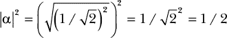

**注意**

*因为* α = i/√2，α *可以写成* a + bi *形式，其中* a = 0 *且* b = 1/√2，*并且计算* |α| = √(a² + b²) *得到* 1/√2。

结果是，不同的量子比特对观察者的表现可能相似（两个量子比特看到 0 的概率相同），但它们的振幅不同。这告诉我们，实际观察到 0 或 1 的概率仅部分地描述了一个量子比特；就像你观察墙上的物体影子时，影子的形状能让你了解物体的宽度和高度，但无法了解其深度。对于量子比特而言，这个隐藏的维度就是它的振幅值：它是正数还是负数？是实数还是虚数？

**注意**

*为了简化符号，量子比特通常仅写作其振幅对*（α, β）。*我们之前的例子可以写作* |〉 = (1/√2, 1/√2)。

##### 量子比特组的振幅

我们已经探讨了单个量子比特，但如何理解多个量子比特呢？例如，一个*量子字节*可以由 8 个量子比特组成，当这 8 个量子比特的量子态相互联系时（我们称这些量子比特是纠缠的，这是一种复杂的物理现象）。这样的量子字节可以如下描述，其中α是与这 8 个量子比特的 256 个可能值对应的幅度：

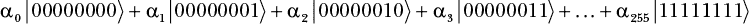

注意，我们必须有|α[0]|² + |α[1]|² + … + |α[255]|² = 1，确保所有概率的总和为 1。

我们的 8 个量子比特可以视为一组 2⁸ = 256 个幅度，因为它有 256 种可能的配置，每种配置都有其对应的幅度。然而，在物理现实中，你只有 8 个物理对象，而不是 256 个。256 个幅度是这 8 个量子比特的一个隐式特性；这些 256 个数字中的每一个可以取任意数量的不同值。泛化来说，一组*n*个量子比特由一组 2^(*n*)个复数组成，这个数字随着量子比特数量的增加而指数级增长。

这种对大量高精度复数的编码是经典计算机无法模拟量子计算机的核心原因：为了做到这一点，经典计算机需要一个无法估量的巨大内存量（大小大约为 2^(*n*)），来存储仅由*n*个量子比特所包含的相同信息。

#### *量子门*

幅度和量子门的概念是量子计算的独特之处。与经典计算机使用寄存器、内存和微处理器来执行一系列数据指令不同，量子计算机通过应用一系列量子门反向转换一组量子比特，然后测量一个或多个量子比特的值。量子计算机承诺提供更强的计算能力，因为仅用*n*个量子比特，它们就可以处理 2^(*n*)个数字（量子比特的幅度）。这一特性具有深远的意义。

从数学角度来看，量子算法本质上是一个*量子门*的电路，它在最终测量之前将一组复数（幅度）进行转换，在最终测量中会观察到一个或多个量子比特的值（见图 14-3）。你也会看到量子算法被称为*量子门阵列*或*量子电路*。

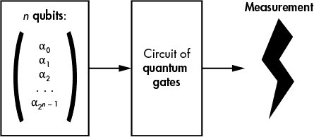

*图 14-3：量子算法原理*

##### 量子门作为矩阵乘法

与经典计算机的布尔门（如与门、异或门等）不同，量子门作用于一组幅度，就像矩阵在与向量相乘时的作用一样。例如，为了对量子比特Φ应用最简单的量子门——*恒等*门，我们将*I*视为一个 2 × 2 矩阵，并将其与包含Φ的两个幅度的列向量相乘，如下所示：

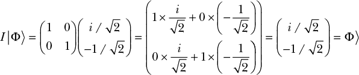

该矩阵–向量乘法的结果是另一个包含两个元素的列向量，其中顶部的值等于*I*矩阵的第一行与输入向量的点积（即第一元素 1 与*i*/√2 的乘积加上第二元素 0 与–1/√2 的乘积），底部值同理。

**注意**

*实际上，量子计算机不会显式计算矩阵–向量乘法，因为矩阵会非常大。（这也是为什么量子计算不能被经典计算机模拟的原因。）相反，量子计算机会通过物理转换来变换量子比特，物理转换等价于矩阵乘法。困惑吗？理查德·费曼曾经说过：“如果你对量子力学不完全困惑，那你就不理解它。”*

##### 哈达玛量子门

到目前为止，我们看到的唯一量子门是单位矩阵*I*，它几乎没什么用，因为它不做任何操作，保持量子比特不变。现在我们将看到一个最有用的量子门，叫做*哈达玛门*，通常表示为*H*。哈达玛门的定义如下（请注意右下角的负值）：

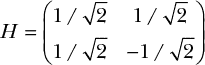

让我们看看如果我们将这个门应用于量子比特|〉 = (1/√2, 1/√2)时会发生什么：

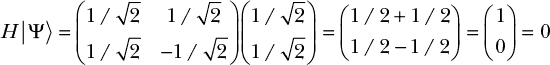

通过将哈达玛门*H*应用于|〉，我们得到量子比特|0〉，其值|0〉的振幅为 1，|1〉的振幅为 0。这告诉我们该量子比特将表现出确定性：也就是说，如果你观察这个量子比特，你总是会看到 0，而不会看到 1。换句话说，我们已经失去了初始量子比特|〉的随机性。

如果我们再次对量子比特|0〉应用哈达玛门，会发生什么？

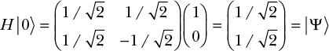

这将我们带回到量子比特|〉和一个随机化的状态。实际上，哈达玛门常用于量子算法中，用来将一个确定性状态转化为均匀随机的状态。

##### 并非所有矩阵都是量子门

尽管量子门可以看作是矩阵乘法，但并不是所有的矩阵都对应于量子门。回想一下，量子比特由复数α和β组成，并且量子比特的振幅满足条件|α|² + |β|² = 1。如果在将量子比特与矩阵相乘后，我们得到的两个振幅不满足这个条件，那么结果就不能是量子比特。量子门只能对应于那些保持|α|² + |β|² = 1 性质的矩阵，这样的矩阵被称为*单位矩阵*。

单位矩阵（以及量子门的定义）是*可逆*的，这意味着给定一个操作的结果，你可以通过应用*逆*矩阵计算回原始的量子比特。这也是为什么量子计算被称为一种*可逆计算*的原因。

### 量子加速

*量子加速*指的是一个问题能通过量子计算机比经典计算机更快地解决。例如，在经典计算机上查找一个无序列表中的 *n* 个项目时，平均需要 *n*/2 次操作，因为你需要查看列表中的每一项，直到找到你要找的项。（平均来说，你会在搜索列表一半时找到目标项。）没有任何经典算法能够比 *n*/2 更快。然而，量子算法能够在大约 √*n* 次操作中完成搜索，这比 *n*/2 要小得多。例如，如果 *n* 为 1000000，则 *n*/2 为 500000，而 √*n* 为 1000。

我们试图通过 *时间复杂度* 来量化量子算法和经典算法之间的差异，时间复杂度用 *O*() 符号表示。在前面的例子中，量子算法的时间复杂度是 *O*(√*n*)，而经典算法的时间复杂度则不可能快于 *O*(*n*)。由于这里时间复杂度的差异来自于平方指数，我们称这种加速为 *二次* *加速*。虽然这种加速可能带来一定的差异，但还有更强大的加速方式。

#### *指数加速与西蒙问题*

*指数加速*是量子计算的圣杯。当在经典计算机上需要指数时间（如 *O*(2^(*n*))) 才能完成的任务，在量子计算机上却能以多项式复杂度完成——即以 *O*(*n*^(*k*)) 的时间复杂度完成，其中 *k* 为某个固定常数。这种指数加速能将一个几乎不可能完成的任务转变为可行的任务。（回忆一下第九章，密码学家和复杂性理论家将指数时间与不可能的任务相关联，而将多项式时间与实际可行的任务相关联。）

指数加速的代表性问题是 *西蒙问题*。在这个计算问题中，一个函数 **f**() 将 *n* 位的字符串转换为 *n* 位的字符串，使得 **f**() 的输出看起来是随机的，除了有一个值 *m*，使得任何满足 **f**(*x*) = **f**(*y*) 的两个值 *x* 和 *y*，都有 *y* = *x* ⊕ *m*。解决这个问题的方法是找到 *m*。

使用经典算法解决西蒙问题的路线归结为找到一个碰撞，这大约需要 2^(*n*/2) 次查询 **f**()。然而，量子算法（如图 14-4 所示）能够在大约 *n* 次查询内解决西蒙问题，且其极高效的时间复杂度为 *O*(*n*)。

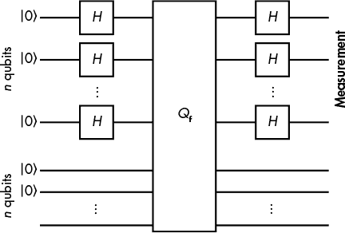

*图 14-4：解决西蒙问题的量子算法电路*

如你在图 14-4 中看到的那样，你将 2*n*个量子比特初始化为|0〉，对前*n*个量子比特应用 Hadamard 门（*H*），然后对两组*n*量子比特应用*Q***f**门。给定两个*n*量子比特组*x*和*y*，*Q***f**门将量子态|*x*〉|*y*〉转换为|*x*〉|**f**(*x*) ⊕ *y*〉。也就是说，它对量子态**f**(*)进行可逆计算，因为你可以通过计算**f**(*x*)并与**f**(*x*) ⊕ *y*进行异或运算来从新状态回到旧状态。（不幸的是，解释为什么这一切有效超出了本书的范围。）

对 Simon 问题的指数加速只能在非常特定的情况下对称加密算法起作用，但在接下来的部分，你将看到量子计算的真正“杀手级”加密应用。

#### *Shor 算法的威胁*

1995 年，AT&T 的研究员 Peter Shor 发表了一篇开创性的文章，题为“在量子计算机上进行素因数分解和离散对数的多项式时间算法”。*Shor 的算法*是一种量子算法，在解决因式分解、离散对数（DLP）和椭圆曲线离散对数（ECDLP）问题时能够实现指数级的加速。你无法使用经典计算机解决这些问题，但你可以用量子计算机来解决。这意味着你可以使用量子计算机解决任何依赖这些问题的密码算法，包括 RSA、Diffie-Hellman、椭圆曲线密码学以及所有当前部署的公钥密码学机制。换句话说，你可以将 RSA 或椭圆曲线密码学的安全性降低到凯撒密码的水平。（Shor 也可以将他的文章标题定为“在量子计算机上破解所有公钥密码学”）Shor 的算法被著名的复杂性理论学家 Scott Aaronson 称为“20 世纪末期的主要科学成就之一”。

Shor 的算法实际上解决了一类比因式分解和离散对数更为广泛的问题。具体来说，如果一个函数**f**(*)是*周期性的*——即，如果存在一个ω（周期），使得对于任何*x*都有**f**(*x* + ω) = **f**(*x*)，那么 Shor 的算法将有效地找到ω。（这看起来与前面讨论的 Simon 问题非常相似，事实上 Simon 的算法是 Shor 算法的一个重要灵感来源。）Shor 算法高效计算函数周期的能力对密码学家来说非常重要，因为这种能力可以用于攻击公钥密码学，正如我接下来会讨论的那样。

讨论 Shor 算法如何实现其加速的细节对于本书来说过于技术化，但在这一节中，我将展示如何使用 Shor 算法攻击公钥密码学。我们来看看 Shor 的算法如何用来解决因式分解和离散对数问题（如第九章所讨论的），这分别是 RSA 和 Diffie-Hellman 背后的难题。

#### *Shor 算法解决因式分解问题*

假设你想因式分解一个大数 *N* = *pq*。如果你能计算出 *a*^(*x*) mod *N* 的周期，那么分解 *N* 就变得容易了。这个任务在经典计算机上很难做到，但在量子计算机上却很容易。你首先选择一个小于 *N* 的随机数 *a*，然后让 Shor 算法找到函数 **f**(*x*) = *a*^(*x*) mod *N* 的周期 ω。找到周期后，你会得到 *a*^(*x*) mod *N* = *a*^(*x* + ω) mod *N*（即，*a*^(*x*) mod *N* = *a*^x *a*^ω mod *N*），这意味着 *a*^ω mod *N* = 1，或者 *a*^ω – 1 mod *N* = 0。换句话说，*a*^ω – 1 是 *N* 的倍数，或者 *a*^(ω – 1) = *kN*，其中 *k* 是一个未知的数值。

这里的关键观察是，你可以轻松地将数字 *a*^(ω – 1) 因式分解为两个项的乘积，其中 *a*^(ω – 1) = (*a*^(ω / 2) – 1)(*a*^(ω / 2) + 1)。然后，你可以计算 (*a*^(ω / 2) – 1) 和 *N* 之间的最大公约数（GCD），并检查是否已经找到了 *N* 的一个非平凡因子（即，除了 1 或 *N* 之外的值）。如果没有，你可以使用另一个值 *a* 再次运行相同的算法。经过几次试验，你将找到 *N* 的一个因子。你现在已经从公钥恢复了私钥，这使得你可以解密消息或伪造签名。

那么，这个计算到底有多简单呢？请注意，经典算法中用于因式分解一个数 *N* 的最佳算法，运行时间是指数级别的，取决于 *N* 的位长 *n*（即，*n* = log[2] *N*）。然而，Shor 算法的运行时间是 *n* 的多项式时间——即 *O*(*n*²(log *n*)(log log *n*)）。这意味着，如果我们有一台量子计算机，我们可以运行 Shor 算法，并在合理的时间内（几天？几周？也许几个月？）看到结果，而不是几千年。

#### *Shor 算法与离散对数问题*

离散对数问题的挑战在于给定 *y* = *g*^(*x*) mod *p*，找出 *y* 的值，其中 *g* 和 *p* 是已知的数值。解决这个问题在经典计算机上需要指数时间，但 Shor 算法通过其高效的周期查找技术使得你可以轻松找到 *y*。

例如，考虑函数 **f**(*a*, *b*) = *g*^(*a*)*y*^(*b*)。假设我们想找到该函数的周期，即数字 ω 和 ω′，使得 **f**(*a* + ω, *b* + ω′) = **f**(*a*, *b*) 对任意 *a* 和 *b* 成立。那么，我们寻求的解是 *x* = –ω / ω′ 模 *q*，其中 *g* 的阶 *q* 是已知的参数。等式 **f**(*a* + ω, *b* + ω′) = **f**(*a*, *b*) 暗示 *g*^ω *y*^(ω′) mod *p* = 1。通过将 *y* 替换为 *g*^(*x*)，我们得到 *g*^(ω + xω′) mod *p* = 1，等价于 ω + *x*ω′ mod *q* = 0，从而得到 *x* = –ω / ω′。

再次强调，整体复杂度为 *O*(*n*²(log *n*)(log log *n*))，其中 *n* 是 *p* 的位长。该算法可以推广到求解任何交换群中的离散对数，而不仅仅是质数模数的数值群。

#### *Grover 算法*

在 Shor 算法实现因式分解的指数级加速之后，量子加速的另一重要形式是能够在时间上与 *n* 的平方根成比例地在 *n* 个项目中进行搜索，而任何经典算法都需要与 *n* 成比例的时间。这种二次加速得益于 *格罗弗算法*，这是一种在 1996 年（Shor 算法之后）发现的量子算法。我不会深入讲解格罗弗算法的内部原理，因为它基本上就是一堆 Hadamard 门，但我会解释格罗弗算法能解决什么样的问题，以及它对加密安全性的潜在影响。我还将展示为什么通过将对称加密算法的密钥或哈希值大小翻倍，你可以从量子计算机中“拯救”它，而非对称算法则无法挽救。

将格罗弗算法看作是一种在 *n* 个可能值中找到值 *x* 的方法，使得 **f**(*x*) = 1，而对于其他大多数值，**f**(*x*) = 0。如果有 *m* 个 *x* 满足 **f**(*x*) = 1，格罗弗算法将以时间 *O*(√(*n* / *m*)) 找到解决方案；也就是说，所需时间与 *n* 除以 *m* 的平方根成比例。相比之下，经典算法的最优时间为 *O*(*n* / *m*)。

现在考虑到 **f**() 可以是任何函数。例如，它可以是“**f**(*x*) = 1 当且仅当 *x* 等于未知的秘密密钥 *K*，使得 **E**(*K*, *P*) = *C*”，其中 *P* 是已知的明文，*C* 是已知的密文，**E**() 是某种加密函数。实际上，这意味着，如果你使用量子计算机寻找一个 128 位的 AES 密钥，你将在时间上与 2⁶⁴ 成比例地找到密钥，而不是像仅使用经典计算机时那样需要 2¹²⁸ 的时间。你需要足够大的明文来确保密钥的唯一性。（如果明文和密文都是 32 位，许多候选密钥可能将这个明文映射到这个密文。）复杂度 2⁶⁴ 远小于 2¹²⁸，这意味着恢复一个秘密密钥要容易得多。但有一个简单的解决方案：为了恢复 128 位的安全性，只需使用 256 位的密钥！这样，格罗弗算法将把搜索密钥的复杂度减少到“仅” 2^(256 / 2) = 2¹²⁸ 次操作。

格罗弗算法还可以找到哈希函数的前像（这是在第六章中讨论的一个概念）。为了找到某个值 *h* 的前像，**f**() 函数被定义为“**f**(*x*) = 1 当且仅当 **Hash**(*x*) = *h*，否则 **f**(*x*) = 0。”因此，格罗弗算法可以在大约 2^(*n*/2) 次操作的代价下找到 *n* 位哈希的前像。与加密类似，为了确保 2^(*n*) 的 *后量子* 安全性，只需使用大小为两倍的哈希值，因为格罗弗算法将在至少 2^(*n*) 次操作中找到 2*n* 位值的前像。

最终结论是，你可以通过将对称加密算法的密钥或哈希值大小翻倍，从量子计算机中“拯救”对称加密算法，而非对称算法则无法挽救。

**注意**

*有一种量子算法可以在时间* O(2^(n/3)) *内找到哈希函数的碰撞，* *而不是* O(2^(n/2))，* *就像经典的生日攻击那样。这表明量子计算机在寻找哈希函数碰撞方面可能优于经典计算机，* *除非是* O(2^(n/3)) *时间的量子算法还需要* O(2^(n/3)) *的空间或内存来运行。给经典算法提供* O(2^(n/3)) *的计算空间，它可以运行一个并行碰撞搜索算法，碰撞时间仅为* O(2^(n/6))，* *比* O(2^(n/3)) *的量子算法快得多。 (有关此攻击的详细信息，请参见 Daniel J. Bernstein 的《哈希碰撞的成本分析》 [`cr.yp.to/papers.html#collisioncost`](http://cr.yp.to/papers.html#collisioncost)。)

### 为什么构建量子计算机如此困难？

尽管量子计算机在理论上是可以构建的，但我们不知道它会有多难，或者它何时能够实现，甚至是否能实现。到目前为止，看起来真的非常困难。截止到 2017 年初，记录保持者是一台能够将 14（十四！）个量子比特稳定保持几毫秒的机器，而我们需要将数百万个量子比特稳定保持几周才能破解任何加密。关键是，我们还没有做到这一点。

为什么构建量子计算机如此困难？因为你需要极小的物体来充当量子比特——大约是电子或光子的大小。由于量子比特必须如此微小，它们也极其脆弱。

量子比特必须保持在极低的温度（接近绝对零度），以保持稳定性。但是即使在如此寒冷的温度下，量子比特的状态也会衰退，最终变得无用。到目前为止，我们还不知道如何制造能保持超过几秒钟的量子比特。

另一个挑战是量子比特可能会受到环境的影响，比如热量和磁场，这些因素会在系统中产生噪声，从而导致计算错误。理论上，我们可以处理这些错误（只要错误率不是太高），但实际上非常困难。修正量子比特的错误需要特定的技术，称为量子错误纠正码，这些技术又需要额外的量子比特和足够低的错误率。但我们不知道如何构建具有如此低错误率的系统。

目前，形成量子比特并因此构建量子计算机的主要方法有两种：超导电路和离子阱。使用*超导电路*是谷歌和 IBM 实验室主张的方法。它基于将量子比特形成为依赖于超导材料量子现象的微小电路，其中电荷载体是电子对。由超导电路制成的量子比特需要保持在接近绝对零度的温度下，并且它们的寿命非常短。截止目前，保持稳定的量子比特数量最多为九个，并且稳定时间仅为几微秒。

*离子阱*，即被困离子，由带电的原子组成，使用激光操控以将量子比特准备为特定的初始状态。使用离子阱是构建量子比特的最早方法之一，且它们通常比超导电路更稳定。截止目前的纪录是 14 个量子比特在几毫秒内保持稳定。但离子阱操作较慢，且在扩展性上似乎不如超导电路。

构建量子计算机真的是一项雄心勃勃的任务。挑战在于：1）构建一个具有少量量子比特的系统，该系统稳定、容错并能够应用基本的量子门操作；2）将这样的系统扩展到数千或数百万个量子比特，以使其变得实用。从纯物理学角度来看，根据我们目前的知识，并没有什么能阻止构建大型容错量子计算机的出现。但许多事情在理论上是可能的，却在实践中证明难以实现或成本过高（例如安全计算机）。当然，未来将证明谁是对的——量子乐观主义者（他们有时预测十年内会有大型量子计算机）还是量子怀疑论者（他们认为人类永远不会看到量子计算机的诞生）。

### 后量子加密算法

*后量子密码学*领域致力于设计无法被量子计算机破解的公钥算法；也就是说，它们将是量子安全的，并能够在量子计算机可以轻松破解 4096 位 RSA 模数的未来，取代 RSA 和基于椭圆曲线的算法。

这些算法不应依赖于已知可以通过 Shor 算法高效求解的难题，因为 Shor 算法破坏了因式分解和离散对数问题的难度。对称算法，如分组密码和哈希函数，在面对量子计算机时，理论安全性只会降低一半，但不会像 RSA 那样被彻底破解。它们可能构成后量子方案的基础。

在以下几节中，我将解释四种主要的后量子算法类型：基于编码的、基于格的、多变量的和基于哈希的。其中特别喜欢基于哈希的，因为它简单且具有强大的安全保障。

#### *基于编码的加密学*

基于编码的后量子加密算法基于*纠错码*，这是一种旨在通过噪声信道传输比特的技术。纠错码的基本理论可以追溯到 20 世纪 50 年代。第一个基于编码的加密方案（*McEliece* 加密系统）于 1978 年开发，至今未被攻破。基于编码的加密方案既可用于加密也可用于签名。它们的主要限制是公钥的大小，通常在几百千字节的数量级。但当网页的平均大小约为两兆字节时，这真的是个问题吗？

让我首先解释一下什么是纠错码。假设你想要将一串比特作为一系列（假设是）3 比特的字传输，但传输不可靠，你担心一个或多个比特可能会被错误传输：你发送的是 010，但接收方收到的是 011。解决这个问题的一种简单方法是使用一个非常基础的纠错码：你不直接传输 010，而是传输 000111000（每个比特重复三次），接收方通过取每组三个比特的多数值来解码接收到的字。例如，100110111 会被解码为 011，因为该模式出现了两次。但正如你所看到的，这种特定的纠错码只允许接收方在每个 3 比特块中最多纠正一个错误，因为如果在同一个 3 比特块中发生两个错误，多数值将是错误的。

*线性码*是较为复杂的纠错码的一种例子。在线性码的情况下，待编码的字被视为一个*n*比特的向量*v*，而编码则是将*v*与一个*m* × *n*的矩阵*G*相乘，计算出码字*w* = *vG*。（在这个例子中，*m*大于*n*，意味着码字比原始字更长。）矩阵*G*可以被构造为一种结构，使得对于给定的数字*t*，*w*中的任何*t*比特错误都能使接收方恢复出正确的*v*。换句话说，*t*是可以被纠正的最大错误数量。

为了使用线性码进行数据加密，McEliece 加密系统将*G*构造为三个矩阵的秘密组合，并通过计算*w* = *vG*加上一些随机值*e*（这是一个固定的 1 比特数字）来进行加密。这里，*G*是公钥，私钥由矩阵*A*、*B*和*C*组成，使得*G* = *ABC*。知道*A*、*B*和*C*可以可靠地解码消息并恢复*w*。（你可以在线查阅解码步骤的详细描述。）

McEliece 加密方案的安全性依赖于解码线性码所需的信息不足的困难，这个问题被称为**NP**完全问题，因此超出了量子计算机的解码能力。

#### *基于格点的加密学*

*格点*是数学结构，基本上由一组位于*n*维空间中的点组成，并具有某种周期性结构。例如，在二维空间（*n* = 2）中，格点可以被视为图 14-5 所示的点集。

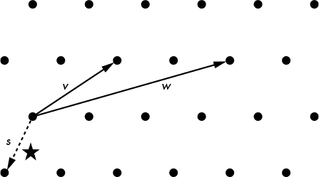

*图 14-5：二维格点的点，其中* v *和* w *是格点的基向量，* s *是最接近星形点的向量*

格点理论催生了看似简单的加密方案。我将给你简要介绍一下。

基于格的加密中的第一个困难问题被称为 *短整数解*（SIS）。SIS 的问题是给定 (*A*，*b*)，找出 *n* 个数字的秘密向量 *s*，使得 *b* = *As* mod *q*，其中 *A* 是一个随机的 *m* × *n* 矩阵，*q* 是素数。

基于格的加密中的第二个困难问题称为 *带错误学习*（LWE）。LWE 的问题是给定 (*A*，*b*)，找出 *n* 个数字的秘密向量 *s*，其中 *b* = *As* + *e* mod *q*，*A* 是一个随机的 *m* × *n* 矩阵，*e* 是一个随机的噪声向量，*q* 是素数。这个问题看起来很像在基于编码的密码学中进行噪声解码。

SIS 和 LWE 在某种程度上是等价的，可以通过将一组基向量组合来重新表述为 *最近向量问题（CVP）* 在格上的实例，即在格中找到距离给定点最近的向量。图 14-5 中的虚线向量 *s* 显示了我们如何通过组合基向量 *v* 和 *w* 来找到最接近星形点的向量。

CVP 和其他格问题被认为对于经典计算机和量子计算机都很困难。但这并不直接转化为安全的加密系统，因为有些问题仅在最坏情况下（即它们的最难实例）才困难，而不是在平均情况下（这对于加密来说是需要的）。此外，虽然找到 CVP 的精确解很困难，但找到一个近似解可能要容易得多。

#### *多元密码学*

*多元密码学* 旨在构建加密方案，其破解难度与解决多元方程组或涉及多个未知数的方程组的难度相当。例如，考虑以下涉及四个未知数 *x*[1]、*x*[2]、*x*[3]、*x*[4] 的方程组：

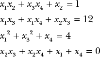

这些方程包含的是单个未知数的和，例如 *x*[4]（或一次项），或者是两个未知数的乘积，例如 *x*[2]*x*[3]（二次项或 *二次* 项）。为了求解这个方程组，我们需要找到满足所有四个方程的 *x*[1]、*x*[2]、*x*[3]、*x*[4] 的值。方程可能是在所有实数、仅在整数范围内，或者在有限的数集上。在密码学中，方程通常是在某些素数的模数下，或者是在二进制值（0 和 1）下。

这里的问题是，在给定一个 *随机* 二次方程组的情况下，找到一个 **NP**-困难的解。这个困难的问题，称为 *多元二次方程（MQ）*，因此是后量子系统的潜在基础，因为量子计算机无法有效解决 **NP**-困难问题。

不幸的是，在 MQ 基础上构建加密系统并非易事。例如，如果我们要使用 MQ 进行签名，私钥可能由三个方程组组成，*L*[1]、*N* 和 *L*[2]，当按此顺序组合时，得到另一个方程组，我们称之为 *P*，即公钥。依次应用变换 *L*[1]、*N* 和 *L*[2]（即按照方程组变换一组值）相当于通过变换 *x*[1]、*x*[2]、*x*[3]、*x*[4] 到 *y*[1]、*y*[2]、*y*[3]、*y*[4] 来应用 *P*，其定义如下：

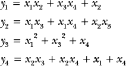

在这样的加密系统中，*L*[1]、*N* 和 *L*[2] 的选择是这样的：*L*[1] 和 *L*[2] 是线性变换（即方程中只有加法，而没有乘法），且是可逆的；而 *N* 是一个二次方程系统，也具有可逆性。这使得三者的组合是一个可逆的二次方程系统，但其逆矩阵在不知道 *L*[1]、*N* 和 *L*[2] 的逆的情况下很难求出。

计算签名的过程就是计算 *L*[1]、*N* 和 *L*[2] 的逆矩阵，然后应用到某条消息 *M* 上，*M* 被视为一组变量 *x*[1]、*x*[2]、……。

*S* = *L*[2]^(−1)(*N*^(−1)(*L*[1]^(−1)(*M*)))

验证签名的过程就是验证 *P*(*S*) = *M*。

攻击者如果能计算出 *P* 的逆矩阵，或者从 *P* 中确定 *L*[1]、*N* 和 *L*[2]，就能够破坏这种加密系统。解决这些问题的实际难度取决于方案的参数，比如使用的方程数量、数字的大小和类型等。但选择安全的参数是困难的，且曾经有多个被认为安全的多变量方案被攻破。

多变量密码学在主要应用中并未得到广泛使用，原因是对该方案的安全性存在担忧，并且它通常速度较慢或需要大量内存。然而，多变量签名方案的一个实际好处是它能生成较短的签名。

#### *基于哈希的密码学*

与之前的方案不同，基于哈希的密码学依赖于密码学哈希函数的安全性，而不是数学问题的难度。由于量子计算机无法破解哈希函数，因此它们无法破解任何依赖于找到哈希冲突难度的系统，而这是基于哈希函数的签名方案的核心思想。

基于哈希的加密方案相当复杂，因此我们将仅关注它们最简单的构建块：一次性签名，这一技巧大约在 1979 年被发现，并以发明者命名为 *Winternitz 一次性签名*（*WOTS*）。这里的“一次性”意味着私钥只能用来签名一条消息；否则，签名方案将变得不安全。（*WOTS* 可以与其他方法结合使用，以签署多条消息，正如你将在后续部分看到的那样。）

但首先，让我们看看 WOTS 是如何工作的。假设你想签署一个被视为 0 到*w* – 1 之间的数字的消息，其中*w*是方案的某个参数。私钥是一个随机字符串，*K*。要签署消息*M*，其中 0 ≤ *M* < *w*，你需要计算**Hash**(**Hash**(…(**Hash**(*K*)))，其中哈希函数**Hash**重复*M*次。我们将这个值表示为**Hash**^(*M*)(*K*)。公钥是**Hash**^(*w*)(*K*)，或者说是从*K*开始的*w*次嵌套**Hash**迭代的结果。

一个 WOTS 签名，*S*，通过检查**Hash**^(*w* – *M*)(*S*)是否等于公钥**Hash**^(*w*)(*K*)来验证。注意，*S*是经过*M*次应用**Hash**后的*K*，因此如果我们再进行*w* – *M*次应用**Hash**，我们会得到一个等于*K*哈希*M* + (*w* – *M*) = *w*次的值，即公钥。

这个方案看起来相当愚蠢，而且有显著的局限性：

**签名可能会被伪造**

从**Hash**^(*M*)(*K*)，即*M*的签名，你可以计算**Hash**(**Hash**^(*M*)(*K*)) = **Hash**^(*M* + 1)(*K*)，这是*M* + 1 的有效签名。这个问题可以通过不仅签署*M*，还签署*w* – *M*，并使用第二个密钥来解决。

**它仅适用于短消息**

如果消息长度为 8 位，则最多有 2⁸ – 1 = 255 个可能的消息，因此你需要计算**Hash**最多 255 次才能生成签名。这可能适用于短消息，但不适用于较长的消息：例如，对于 128 位的消息，签署消息 2¹²⁸ – 1 将需要永远的时间。一个解决方法是将较长的消息拆分为较短的消息。

**它只能使用一次**

如果一个私钥用于签署多个消息，攻击者可以恢复足够的信息来伪造签名。例如，如果*w* = 8 并且你使用前面的方法签署数字 1 和 7，以避免简单的伪造，攻击者将获得**Hash**¹(*K*)和**Hash**⁷(*K**′*)作为签名 1 的签名，以及**Hash**⁷(*K*)和**Hash**¹(*K**′*)作为签名 7 的签名。通过这些值，攻击者可以计算出**Hash**^(*x*)(*K*)和**Hash**^(*x*)(*K**′*)，其中*x*在[1;7]范围内，从而伪造代表*K*和*K**′*的签名。没有简单的方法来解决这个问题。

先进的基于哈希的方案依赖于更复杂版本的 WOTS，结合树形数据结构和复杂的技术，旨在用不同的密钥签署不同的消息。不幸的是，结果产生的签名很大（大约几十千字节，如 SPHINCS 一样，SPHINCS 是本文写作时的一个先进方案），而且有时会限制它们能够签署的消息数量。

### 错误可能发生的方式

后量子密码学可能比 RSA 或椭圆曲线加密更强大，但它并不是无懈可击或全能的。我们对后量子方案及其实现的安全性理解，远不如非后量子加密那么深入，这带来了增加的风险，以下部分将总结这些风险。

#### *不清晰的安全级别*

后量子方案可能看起来非常强大，但在量子攻击和经典攻击面前，仍然可能不安全。基于格的算法，如环-LWE 家族的计算问题（LWE 问题的多项式版本），有时存在问题。环-LWE 对密码学家具有吸引力，因为它可以用来构建加密系统，在原则上，这些系统的破解难度与解决最难的环-LWE 问题一样大，而环-LWE 问题可以是**NP**-难的。但当安全性看起来过于完美时，通常并非如此。

安全性证明的一个问题是，它们通常是渐近的，这意味着它们只对大数量的参数（如基础格的维度）有效。然而，在实际操作中，使用的参数数量要小得多。

即使一个基于格的方案看起来像是一个**NP**-难题一样难以破解，其安全性仍然难以量化。对于基于格的算法来说，我们很少能清楚地了解对它们的最佳攻击方式，以及这种攻击在计算或硬件方面的成本，因为我们对这些最新构造的理解不足。这种不确定性使得基于格的方案比那些更为理解的构造（如 RSA）更难进行比较，这让潜在的用户感到害怕。然而，研究人员在这一方面已有进展，且希望在几年内，基于格的问题能像 RSA 一样被理解。（有关 Ring-LWE 问题的更多技术细节，请阅读 Peikert 的精彩综述，见 *[`eprint.iacr.org/2016/351/`](https://eprint.iacr.org/2016/351/)*。）

#### *快进：如果为时已晚，会发生什么？*

想象一下这个 CNN 头条：2048 年 4 月 2 日：“ACME 公司揭露其秘密建造的量子计算机，推出破解加密即服务平台。”好吧，RSA 和椭圆曲线加密完蛋了。那接下来怎么办？

结论是，后量子加密比后量子签名更为关键。让我们先看签名的情况。如果你仍在使用 RSA-PSS 或 ECDSA 作为签名方案，你可以通过使用后量子签名方案重新签发新签名，以恢复签名的信任。你将撤销旧的、对量子攻击不安全的公钥，并为每一条你签署过的消息计算新的签名。做一点工作后，你会没事的。

只有在你使用量子加密数据时，才需要恐慌——

不安全的方案，例如 RSA-OAEP。在这种情况下，所有传输的密文都可能被泄露。显然，再用量子后算法对该明文进行加密是毫无意义的，因为数据的机密性已经丧失。

那么，Diffie–Hellman（DH）及其椭圆曲线版本（ECDH）的密钥协商呢？

从表面上看，情况似乎与加密一样糟糕：攻击者收集了公钥 *g*^(*a*) 和 *g*^(*b*)，他们可以利用崭新的量子计算机计算出秘密指数 *a* 或 *b*，进而计算出共享秘密 *g*^(*ab*)，然后从中推导出用于加密流量的密钥。但实际上，Diffie–Hellman 并不总是以这种简单的方式使用。实际用于加密数据的会话密钥可能是从 Diffie–Hellman 共享秘密和系统的某些内部状态一起推导出来的。

例如，这就是现代移动消息系统如何工作的原因，得益于 Signal 应用程序开创的协议。当你通过 Signal 向一个对等方发送新消息时，会计算出一个新的 Diffie–Hellman 共享秘密，并将其与一些依赖于该会话中先前发送的消息的内部秘密结合（该会话可以跨越较长时间）。这种 Diffie–Hellman 的高级使用使得攻击者的工作更加困难，即使他拥有量子计算机。

#### *实现问题*

实际上，量子后方案将是代码，而不是算法；也就是说，它们是在某个物理处理器上运行的软件。无论这些算法在纸面上多么强大，它们都无法免于实现错误、软件漏洞或侧信道攻击。一个算法在理论上可能是完全的量子后方案，但仍然可能被一个简单的经典计算机程序破解，因为程序员忘记输入了一个分号。

此外，像基于代码和基于格的算法这样的方案在很大程度上依赖于数学运算，这些运算的实现使用了各种技巧，以使这些操作尽可能快速。但同样，这些算法中的代码复杂性使得实现更容易受到侧信道攻击的威胁，例如时序攻击，通过测量执行时间推断关于秘密值的信息。事实上，这种攻击已经应用于基于代码的加密（见 *[`eprint.iacr.org/2010/479/`](https://eprint.iacr.org/2010/479/)*）和基于格的签名方案（见 *[`eprint.iacr.org/2016/300/`](https://eprint.iacr.org/2016/300/)*）。

结果是，具有讽刺意味的是，量子后方案在实践中一开始将比非量子后方案更不安全，因为它们的实现存在漏洞。

### 进一步阅读

要学习量子计算的基础知识，可以阅读 Nielsen 和 Chuang 所著的经典教材《*Quantum Computation and Quantum Information*》（剑桥大学出版社，2000 年）。Aaronson 的《*Quantum Computing Since Democritus*》（剑桥大学出版社，2013 年）是一本更具娱乐性的非技术读物，内容涉及的范围不仅限于量子计算。

多款软件模拟器可以让你尝试量子计算。*Quantum Computing Playground*（[`www.quantumplayground.net/`](http://www.quantumplayground.net/)）设计尤为出色，采用简单的编程语言和直观的可视化效果。

有关后量子密码学的最新研究，请访问*[`pqcrypto.org/`](https://pqcrypto.org/)*以及相关的会议 PQCrypto。

未来几年将是后量子密码学特别令人兴奋的时期，这得益于 NIST 的后量子密码学项目，这是一个致力于开发未来后量子标准的社区合作项目。一定要查看该项目的官方网站*[`csrc.nist.gov/groups/ST/post-quantum-crypto/`](http://csrc.nist.gov/groups/ST/post-quantum-crypto/)*，了解相关算法、研究论文和研讨会。
