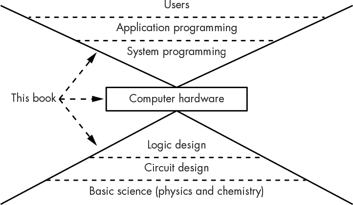

# 前言

几年前，我和我们来自瑞典的交换生一起坐缆车。我问她有没有考虑过高中毕业后做什么。她说她在考虑工程学，并且去年上过一门编程课。我问她学了什么。她回答说：“Java。”我本能地回应道：“那真可惜。”

为什么我这么说呢？我花了一段时间才弄明白。并不是说 Java 是一种糟糕的编程语言；其实它相当不错。我这么说是因为 Java（以及其他编程语言）通常被用来教授编程的方式——*没有教任何关于计算机的知识*。如果你觉得这有点奇怪，那么这本书就是为你准备的。

Java 编程语言是由 James Gosling、Mike Sheridan 和 Patrick Naughton 在 1990 年代在 Sun Microsystems 发明的。它在一定程度上是根据当时广泛使用的 C 编程语言模型设计的。C 语言不包含自动的内存管理，内存管理错误曾是当时的常见问题。Java 通过设计消除了这一类编程错误；它将底层的内存管理隐藏起来，不让程序员直接接触。这也是它成为初学者编程语言的一个重要原因。但要培养出优秀的程序员和程序，光有一门好的编程语言还远远不够。事实证明，Java 引入了一类新的、更难调试的编程问题，包括由于隐藏的内存管理系统所导致的性能问题。

正如你在本书中看到的，理解记忆是程序员的一项关键技能。当你在学习编程时，很容易养成一些难以打破的习惯。研究表明，曾在所谓的“安全”游乐场玩耍的孩子，在成年后受伤的几率比那些没有玩过的人要高，可能是因为他们没有学会摔倒会疼。编程就像这种情况。安全的编程环境让入门不那么吓人，但你也需要为外部世界做好准备。本书帮助你完成这一过渡。

### 为什么好的编程很重要

要理解为什么仅仅教授计算机编程而不讲解计算机本身的问题，首先要考虑计算机的普及程度。计算机的价格已经大幅下降，以至于使用计算机现在成为了建造许多事物的最便宜方式。例如，使用计算机在汽车仪表盘上显示一幅老式模拟时钟的图像，比使用机械时钟便宜得多。这是计算机芯片制造方式的结果；它们或多或少是通过印刷方式制造出来的。如今，制造包含数十亿个组件的芯片已经不再是什么大事。需要注意的是，我说的是计算机本身的价格，而不是包含计算机的物品的价格。通常来说，今天的计算机芯片价格甚至低于其包装的成本。市面上有一些计算机芯片，仅需几分钱。未来可能会有一个时刻，几乎所有东西都会包含计算机。

许多计算机在做许多事情，这意味着许多计算机程序。由于计算机无处不在，计算机编程领域也极其多样化。就像医学一样，许多程序员都成了专家。你可以在多个领域中专攻，例如视觉、动画、网页、手机应用、工业控制、医疗设备等。

但计算机编程的奇怪之处在于，与医学不同，在编程中你可以成为一个专家，而无需成为一个通才。你大概不会希望一个从未学习过解剖学的心脏外科医生，但今天许多程序员的情况却是如此。 这真的是一个问题吗？事实上，有很多证据表明这种做法并没有很好地奏效，几乎每天都有关于安全漏洞和产品召回的报道。曾经有法院案件，其中因呼气测醉仪被定罪的醉驾者赢得了审查呼气测醉仪代码的权利。事实证明，代码中充满了漏洞，导致判决被推翻。最近，一款防病毒软件在一次心脏手术中让医疗设备崩溃。由于波音 737 MAX 飞机的设计问题，导致了生命的丧失。像这样的事件层出不穷，难以激发人们的信心。

### 学习编程只是一个起点

这种局面的部分原因在于，写出看起来*有效*的程序并不那么困难，或者说，程序在大多数时候看起来是有效的。让我们用 1980 年代的音乐变化（不是迪斯科！）做个类比。过去，人们必须打下基础才能创作音乐。这包括学习音乐理论、作曲、如何演奏乐器、听力训练以及大量的练习。然后，Roland 的 Ikutaro Kakehashi 提出的“数字音乐乐器接口”（MIDI）标准问世，它让任何人都可以从计算机上制作“音乐”，而无需培养茧子。我的看法是，只有一小部分计算机生成的“音乐”是真正的音乐；大多数只是噪音。*音乐*是由真正的音乐家创作的——他们可能会或可能不会使用 MIDI 在他们的基础上创作。如今的编程就像使用 MIDI。你不再需要大量汗水，不需要花费多年时间练习，甚至不需要学习理论就能写出程序。但这并不意味着这些程序是好或可靠的。

这种情况可能会变得更糟，至少在美国是如此。有既得利益的富人，比如那些拥有软件公司的，已经在游说立法，要求每个人在学校里都学习编程。这听起来理论上很不错，但在实践中并不理想，因为并不是每个人都有成为优秀程序员的天赋。我们并不会强制每个人学习踢足球，因为我们知道这并不适合每个人。这个倡议的真正目标可能不是培养优秀的程序员，而是通过向市场注入大量低质量的程序员，进而提高软件公司利润，这将压低工资。这些推动这一议题的人并不十分关心代码质量——他们还在推动立法限制他们对缺陷产品的责任。当然，你可以为了乐趣而编程，就像你可以为了乐趣而踢足球一样。只是不要指望你会被选入超级碗。

2014 年，奥巴马总统说他学会了编程。他确实在优秀的可视化编程工具 Blockly 中拖动了一些东西，甚至在 JavaScript 中输入了一行代码（JavaScript 是一种与 Java 无关的编程语言，它是在 Netscape 公司发明的，Netscape 是 Mozilla 基金会的前身，该基金会维护着多个软件包，包括*Firefox*浏览器。）现在，你认为他真的学会了编程吗？给你一个提示：如果你认为学会了，那么你可能需要在读这本书的同时提升你的批判性思维能力。当然，他可能学到了一点点编程知识，但*不，他并没有学会编程*。如果他能在一个小时内学会编程，那么编程就这么简单，以至于不需要在学校里教授。

### 低级知识的重要性

斯蒂芬·沃尔夫拉姆（Stephen Wolfram），Mathematica 和 Wolfram 语言的创始人，在一篇名为《如何教授计算思维》的博客文章中表达了一个有趣且有些相反的观点。沃尔夫拉姆将计算思维定义为“以足够清晰且系统化的方式表述事物，以至于可以告诉计算机如何去做”。我完全同意这个定义。事实上，这也是我写这本书的一个重要动机。

但是，我强烈不同意 Wolfram 的观点，即学习编程的人应该通过使用他开发的这些强大的高级工具来培养计算思维技能，而不是学习基础的基础技术。例如，从越来越多的人对统计学的兴趣可以看出，“数据整理”是一个不断发展的领域。但当人们只是把一堆庞大的数据输入到他们并不完全理解的花哨程序中时，会发生什么呢？

一种可能性是它们生成有趣但毫无意义或不正确的结果。例如，最近的一项研究（由 Mark Ziemann、Yotam Eren 和 Assam El-Osta 所著的《基因名称错误在科学文献中普遍存在》）表明，五分之一的已发布基因学论文因不当使用电子表格而出现错误。试想一下，更多人掌握更强大的工具会带来哪些种类的错误和后果！当人们的生命受到影响时，确保正确至关重要。

理解基础技术可以帮助你培养对可能出错的地方的敏感度。仅仅知道高级工具使得你容易问错问题。在毕业前学习如何使用锤子，再学如何使用钉枪是值得的。学习基础系统和工具的另一个原因是，它能让你有能力创造新的工具，这一点非常重要，因为即使工具的使用者更多，工具的创造者依然是需要的。了解计算机，以便程序的行为不再是一个谜，能帮助你编写更好的代码。

### 谁应该阅读本书？

这本书是为那些希望成为优秀程序员的人准备的。什么才算一个优秀的程序员？首先，优秀的程序员拥有良好的批判性思维和分析能力。要解决复杂问题，程序员需要评估程序是否真正正确地解决了问题的能力。这比听起来要困难。经验丰富的程序员经常看别人写的程序，然后讽刺地评论：“哇，这是一个复杂的无解方案，解决了一个简单的非问题。”

你可能熟悉一个经典的奇幻元素：巫师通过学习事物的真实名称获得对其的控制力。如果巫师忘记了某个细节，那将是灾难性的。优秀的程序员就像这些巫师，他们能够在脑海中保持事物的本质，而不会遗漏任何细节。

优秀的程序员还具备一定的艺术性，像熟练的工匠一样。找到完全难以理解的代码并不罕见，就像许多英语使用者被詹姆斯·乔伊斯的小说《芬尼根的守夜人》搞得一头雾水一样。优秀的程序员编写的代码不仅能正常运行，还能让其他人理解和维护。

最后，优秀的程序员需要深刻理解计算机的工作原理。凭借浅薄的知识无法很好地解决复杂的问题。本书适合那些正在学习编程但对缺乏深度的内容感到不满的人，也适合那些已经在编程但希望获得更多的人。

### 什么是计算机？

一个常见的答案是，计算机是人们用来做各种任务的电器，比如查看电子邮件、网上购物、写论文、整理照片和玩游戏。这一定义部分源自于一些粗心的术语，它们在消费品开始融入计算机时变得流行。另一个常见的答案是，计算机是使我们的高科技玩具（如手机和音乐播放器）运作的大脑。这个答案更接近事实。

发送电子邮件和玩游戏是通过计算机上运行的程序实现的。计算机本身就像一个新生儿。它实际上并不懂得做什么。我们几乎不去思考人类基本的机械结构，因为我们主要与运行在这些基本机械上的人格互动，就像计算机上运行的程序一样。例如，当你在浏览网页时，你不仅仅是使用计算机本身在阅读网页；你是在使用其他人编写的程序，这些程序运行在你的计算机、托管网页的计算机以及所有使互联网运作的中间计算机上。

### 什么是计算机编程？

教师是训练人类基本机械运作以完成特定任务的人。同样，编程就是成为计算机的教师。程序员教计算机做程序员想让它做的事。

知道如何教计算机是有用的，特别是当你想让计算机做一些它不知道如何做的事情，而你又不能直接购买现成的程序，因为还没有人创造出这样的程序时。例如，你可能习惯于万维网的存在，但它其实是最近才发明的，当时蒂姆·伯纳斯-李爵士需要为欧洲核子研究组织（Conseil Européen pour la Recherche Nucléaire，简称 CERN）的科学家们提供一种更好的方式来共享信息。为此，他还被授予了骑士勋章。多酷啊！

教导计算机很复杂，但比教人容易。我们对计算机的工作原理了解得更多。而且，计算机出现问题的几率远低于人类。

计算机编程是一个两步过程：

1.  理解宇宙。

1.  用三岁小孩能理解的方式解释它。

这意味着什么呢？嗯，你不能编写计算机程序去做你自己不了解的事情。例如，如果你不知道拼写规则，你就无法编写拼写检查器；如果你不了解物理学，你就不能编写一款好的动作电子游戏。因此，成为一名优秀计算机程序员的第一步是尽可能多地学习其他方面的知识。问题的解决往往来自意想不到的地方，所以不要因为某事看似与问题不相关就忽视它。

过程的第二步要求你将所知道的内容解释给一台具有非常僵化世界观的机器，就像小孩子一样。这种僵化在孩子三岁左右时非常明显。假设你正在试图出门。你问你的孩子：“你的鞋子在哪里？”她的回答是：“在那里。”她*确实*回答了你的问题。问题是，她并不理解你实际上是要求她穿上鞋子，这样你们才能一起出去。灵活性和推理能力是孩子们在成长过程中学会的技能。但计算机就像彼得·潘：它们永远不会长大。

计算机也像小孩子一样，因为它们不知道如何进行概括。它们仍然很有用，因为一旦你弄清楚如何向它们解释某个问题，它们会非常迅速且不知疲倦地执行，但它们没有任何常识。计算机会不知疲倦地做你要求的事情，而不去评估这是否是一个错误的任务，就像 1940 年电影《幻想曲》中的《巫师学徒》片段里的魔法扫帚一样。让计算机做某事就像是让魔灯中的精灵（不是 FBI 版本）来满足一个愿望。你必须非常小心地表达你的请求！

你可能会怀疑我在这里说的内容，因为计算机看起来比它们实际更强大。比如，当你使用计算机时，它知道如何画画，纠正拼写，理解你在说什么，播放音乐，等等。但请记住，那不是计算机——那是一套由别人编写的复杂程序，使得计算机能够完成这些任务。计算机与运行在其上的程序是分开的。

就像看着一辆车在路上行驶。它似乎在正确的时间停下、启动，避免障碍，顺利到达目的地，饿了就吃，等等。但这不仅仅是车的问题。它是车和驾驶员的结合体。计算机就像这辆车，程序就像驾驶员。没有知识，你无法分辨出哪些是车做的，哪些是驾驶员做的。（参见梅·斯文森的《南行高速公路》。你可能会在一生中改变你对诗篇末尾提出的问题的回答。）

总而言之，计算机编程包括学习你需要知道的内容来解决问题，然后将其解释给一个小孩。由于有很多种解决问题的方法，编程既是一门艺术，也是一门科学。它不仅仅是暴力破解，更关乎寻找优雅的解决方案。是的，你*可以*通过在墙上砸个洞来离开房子，但通过门走出去可能要容易得多。许多人可以写出像*[HealthCare.gov](http://HealthCare.gov)* 这样包含数百万行代码的东西，但能用几千行代码完成它才是真正的技术。

然而，在你能够给一个三岁的孩子下达指令之前，你需要先了解三岁孩子的理解能力。而且这个三岁孩子可不一般——它是一个外星生命形式。计算机的规则与我们不一样。你可能听说过人工智能（AI），它试图让计算机像人类一样行动。这个领域的进展远比最初预期的要慢。主要原因是我们并不真正理解这个问题；我们对人类思维的理解还远远不够。正如你能想象的那样，当我们自己都不清楚怎么做时，要教一个外星人按照我们的方式思考是非常困难的。

人类的大脑让你在不自觉地思考的情况下做事。你的大脑最初只是一个硬件，然后被编程。例如，你学会了移动手指，接着学会了抓取物体。经过练习后，你就能在不思考实现这一动作的每个步骤的情况下，直接抓取物品。像让·皮亚杰（法国心理学家，1898–1980）和诺姆·乔姆斯基（美国语言学家，1928 年生）等哲学家，提出了关于这种学习过程如何运作的不同理论。大脑仅仅是一个通用设备，还是它有专门的硬件来处理语言等功能？这个问题仍在研究中。

我们能够无意识地执行任务的惊人能力使得学习编程变得困难，因为编程需要将任务分解成计算机可以遵循的小步骤。例如，你可能知道如何玩井字棋。让一组人聚集在一起，每个人独立列出玩家应该采取的步骤，以便在任何棋盘配置下做出良好的决定。（我敢肯定你能在网上找到这个，但不要查。）每个人列出步骤后，举行一个比赛，看看谁的规则最好！你的规则好到什么程度？你遗漏了哪些步骤？当你玩这个游戏时，你究竟知道自己在做什么吗？很有可能，你遗漏了很多直觉上就能理解的因素，因为你没有明确地把它们列出来。

如果还不清楚，第一步——理解宇宙——比第二步——向三岁小孩解释——更为重要。想一想：如果你不知道该说什么，知道如何说有什么用呢？尽管如此，目前的教育体系更侧重于第二步。这是因为，教授和评分任务的机械性部分比创意性部分要容易得多。而且通常，教师在这方面的训练很少，他们使用的是别人为他们准备的课程大纲。然而，本书则专注于第一步。虽然它无法全面涵盖宇宙，但它探讨的是计算机宇宙中的问题及其解决方案，而不是专注于实现这些解决方案所需的具体编程语法。

### 编码、编程、工程和计算机科学

用于描述与软件相关工作的术语有很多。这些术语没有确切的定义，尽管它们已经获得了一些粗略的含义。

*编码*，作为“学习编码”一部分所普及的一个相对较新的术语，可以看作是翻译工作的某种机械性工作。我们可以将其与医疗编码的工作进行比较。当你去看医生时，获得诊断是简单的部分。困难的部分是将诊断转化为 ICD 标准中的 10 万多个代码之一，截至目前为 ICD-10。一位通过认证的专业编码员了解这些代码，知道当医生给出“被牛撞击”这个诊断时，应该分配代码 W55.2XA。由于代码的数量庞大，这实际上比许多编程领域的编码工作更为复杂。但这个过程与编码员在网页上被指示“将文本加粗”时所做的工作类似；编码员知道该使用哪个代码来实现这一目标。

ICD-10 标准非常复杂，几乎没有编码员能够完全掌握它。相反，医疗编码员通常会在某些专业领域获得认证，例如“神经系统疾病”或“精神和行为障碍”。这类似于编码员精通 HTML 或 JavaScript 等编程语言。

但是，*编程*——也就是成为一名程序员——意味着了解的不仅仅是一个或两个专业领域。在这个情境中，医生与程序员类似。医生通过评估病人来确定诊断。这可能非常复杂。例如，如果病人有烧伤并且浑身湿透，这是属于“奇异的个人外貌”（R46.1）还是“因水上滑雪板起火导致的烧伤，初次接诊”（V91.07XA）呢？一旦医生得出了诊断，就可以制定治疗计划。治疗计划必须有效；医生可能不希望看到同一病人因“过度保护的父母”（Z62.1）而再次就诊。

就像医生一样，程序员评估问题并确定解决方案。例如，可能需要一个网站，让人们根据荒谬程度对 ICD-10 代码进行排名。程序员会确定存储和操作数据的最佳算法，客户端和服务器之间的通信结构，用户界面等等。这可不是简单的“插入代码”之类的事情。

*工程学*是复杂度的下一个层次。一般而言，工程学是将知识运用到实践中以完成某项任务的艺术。你可以将 ICD 标准的制定视为一种工程；它将庞大的医学诊断领域压缩成一套代码，这些代码比医生的笔记更易于追踪和分析。是否认为这样的复杂系统代表了*良好*的工程学，见仁见智。作为计算机工程的一个例子，许多年前，我参与了一个项目，旨在开发一种低成本的医疗监护仪，类似于医院中看到的那种设备。我的任务是设计一个系统，使得医生或护士在没有任何文档的情况下，能够在 5 分钟内搞明白如何使用。正如你想象的那样，这需要的不仅仅是编程知识。我最终达成了目标——我的解决方案最终只需约 30 秒就能学会使用。

编程常常与计算机科学混淆。虽然许多计算机科学家从事编程工作，但大多数程序员并不是计算机科学家。*计算机科学*是对计算的研究。计算机科学的发现被工程师和程序员所使用。

编码、编程、工程和计算机科学是独立的但相关的学科，它们在所需的知识类型和数量上有所不同。成为计算机科学家、工程师或编码员并不自动意味着成为一个优秀的程序员。虽然本书让你了解工程师和计算机科学家如何思考，但它并不会把你培养成一个；通常，这需要大学教育并结合一些艰苦的相关经验。工程学和编程类似于音乐或绘画——它们既是技能的一部分，也是艺术的一部分。本书对这两个方面的阐述应能帮助你提高作为程序员的技能。

### 计算机领域

计算机设计和编程是一个庞大的研究领域，我在这里无法全面涵盖。你可以将其视为分层结构，如图 1 所示。

*图 1：计算机领域*

请记住，图 1 是一个简化版本，实际中分割各个层次的线条并不像图中那样清晰。

大多数人是计算机系统的*用户*。你现在可能就属于这一类。有一类特殊的用户，称为*系统管理员*，他们的工作是保持计算机系统的正常运行。他们安装软件，管理用户账户，进行备份，等等。他们通常拥有普通用户没有的特殊权限。

写网页、手机应用和音乐播放器等程序的人被称为*应用程序程序员*。他们编写用户用来与计算机互动的软件，使用其他人创建的模块。应用程序编程在大多数“学习编码”课程中都被教授，仿佛所有程序员要做的只是如何导入这些模块并将它们拼接在一起。虽然在很多时候你可以通过这种方式应付，但实际上更好的是理解这些模块和粘合剂。

应用程序不会直接与计算机硬件进行交互；这就是*系统编程*发挥作用的地方。系统程序员创建了应用程序程序员使用的构建模块。系统程序员需要了解硬件，因为他们的代码与硬件进行交互。本书的目标之一是教你成为一名优秀系统程序员所需的知识。

计算机硬件不仅包括实际进行计算的部分，还包括这一部分如何与外部世界连接。计算机硬件表现为*逻辑*。这与编写计算机程序所使用的逻辑相同，它是理解计算机运作的关键。逻辑由各种类型的电子*电路*构成。电路设计超出了本书的范围，但你可以通过学习电气工程来了解更多。如果你想征服世界，可以考虑电气工程和计算机科学双学位。

当然，所有这一切都建立在基础科学之上，从我们对电的理解，到制造芯片所需的化学知识。

如图 1 所示，每一层都建立在其下方的基础上。这意味着在较低层级的设计选择或错误会影响到所有上层。例如，1994 年左右，英特尔 Pentium 处理器中的设计错误导致某些除法操作产生错误结果。这影响了所有在这些处理器中使用浮点除法的软件。

如你所见，系统编程处于软件层级的底部。它类似于基础设施，如道路、电力和水。成为一名优秀的程序员总是重要的，但如果你是一个系统程序员，那就更为重要，因为别人依赖你的基础设施。你还可以看到，系统编程夹在应用程序编程和计算机硬件之间，这意味着你需要了解这两者中的一些内容。梵语单词*yoga*的意思是“合一”，就像瑜伽修行者寻求统一身心一样，系统程序员是技术瑜伽士，他们将硬件与软件统一起来。

你不必学习系统编程就能在其他层次上工作。但如果不学习，你将不得不找别人帮助你解决你领域之外的问题，而不是自己能够搞定。了解核心技术还会在更高层次上带来更好的解决方案。这不仅仅是我的看法；你可以查阅 Ville-Matias Heikkilä在 2014 年发表的博客文章《我们文明的资源泄漏漏洞》来了解类似的观点。

本书还旨在涵盖大量的复古历史。大多数程序员并没有学习自己领域的历史，因为有太多内容需要覆盖。结果是，很多人犯了已经有人犯过的错误。了解一些历史至少可以让你犯出新的、更好的错误，而不是重复过去的错误。请记住，你今天使用的热门新技术明天很快就会变成复古。

说到历史，本书充满了有趣的技术和它们发明者的名字。花些时间了解这些技术和人物。大多数提到的人都解决了至少一个有趣的问题，了解他们是如何看待世界以及他们如何接近并解决问题是值得的。在尼尔·斯蒂芬森 2008 年的小说《阿纳特姆》中有一段精彩的对话：

“我们的对手是一艘载满原子弹的外星飞船，而我们只有一个量角器。”

“好吧，我回家看看能不能找到一个尺子和一根线。”

注意基础知识的依赖。这不是“让我们查一下维基百科该怎么做”或“我在 Stack Overflow 上发个问题”或“我去 GitHub 找个包”。学会解决别人没有解决过的问题是一项至关重要的技能。

本书中的许多示例基于旧技术，比如 16 位计算机。因为你几乎可以从它们中学到你需要知道的一切，而且它们更容易装进一页纸里。

### 本书内容

本书在概念上分为三部分。第一部分探讨计算机硬件，包括它是什么以及如何构建。第二部分研究在硬件上运行的软件的行为。最后一部分涉及编程艺术——与他人合作编写优秀程序。

**第一章：计算机的内部语言**

本章开始探讨三岁孩子的思维方式。计算机只是小角色；它们为生计而聚集比特。你将了解它们是什么以及可以用它们做什么。我们将通过角色扮演来赋予比特以及比特的集合以意义。

**第二章：组合逻辑**

本章探讨了为何使用比特而不是数字，并探讨了数字计算机的合理性。内容包括讨论一些早期的技术，这些技术为我们今天所拥有的技术铺平了道路。本章涵盖了组合逻辑的基础知识。你将学习如何通过比特和逻辑构建更复杂的功能。

**第三章：顺序逻辑**

在本章中，你将学习如何利用逻辑来构建存储器。这包括学习如何生成时间，因为存储器不过是随时间持久化的状态。本章涵盖了顺序逻辑的基础知识，并讨论了各种存储技术。

**第四章：计算机结构**

本章展示了计算机是如何由前面章节中讨论的逻辑和存储元素构建而成的。并探讨了几种不同的实现方法。

**第五章：计算机体系结构**

在本章中，我们将探讨第四章中看到的一些计算机附加组件。你将学习它们如何提供必要的功能和效率。

**第六章：通信故障**

计算机需要与外界进行交互。本章涵盖了输入和输出内容。它还重新审视了数字与模拟之间的差异，以及我们如何使数字计算机在模拟世界中工作。

**第七章：数据组织**

现在你已经了解了计算机的工作原理，我们将探讨如何有效地使用计算机。计算机程序操作内存中的数据，正确映射内存使用方式与解决的问题之间的关系非常重要。

**第八章：语言处理**

编程语言的发明是为了让人们更容易地编程计算机。本章探讨了将语言转化为实际在计算机上运行的过程。

**第九章：Web 浏览器**

很多编程工作是为 Web 浏览器进行的。本章介绍了 Web 浏览器的工作原理，并详细讲解了其主要组件。

**第十章：应用程序和系统编程**

在本章中，我们将编写两个版本的程序，分别在图 1 中的两个不同层次上运行。本章展示了应用级编程和系统级编程之间的诸多差异。

**第十一章：捷径与近似**

提高程序效率很重要。本章探讨了一些提高程序效率的方法，帮助程序避免不必要的工作。

**第十二章：死锁与竞争条件**

许多系统包含不止一台计算机。本章分析了当我们尝试让计算机协同工作时可能出现的一些问题。

**第十三章：安全性**

计算机安全是一个高级话题。本章介绍了基础知识，并避免深入数学内容。

**第十四章：机器智能**

本章还涉及一个高级话题。新的应用是由大数据、人工智能和机器学习的结合产生的——从驾驶你的汽车到被广告搞得抓狂。

**第十五章：现实世界的考虑因素**

编程是一个非常有条理且逻辑性的过程。但人类参与了决定编程内容和方式的过程，而人类往往缺乏逻辑性。本章讨论了现实世界中编程的一些问题。

阅读本书时，请记住许多解释是简化的，因此并不完全正确，细节上可能有所偏差。要让解释完美无缺需要过多的干扰性细节。如果你在学习过程中发现这一点，不必惊讶。你可以把这本书当作是一本去计算机世界旅行的华丽宣传册。它不能详尽覆盖所有内容，而当你亲自去访问时，你会发现许多微妙的差异。
