## 第一章：计算机的内部语言**


语言的核心是能够传递信息。作为程序员，你的工作就是向计算机提供指令。计算机不理解我们的人类语言，因此你必须学习它们的语言。

人类语言是经过数千年进化的产物。我们对它如何进化了解不多，因为早期语言发展并未达到足以记录历史的程度。（显然没有人写过关于语言发展的歌谣。）计算机语言则是另一个故事，它们是相对较新的发明，远在计算机语言出现之前，人类语言已经发展完善，正因如此我们能够写出关于它们的内容。

人类语言和计算机语言有许多相同的元素，比如书面符号和其正确排列与使用的规则。它们不同的是，计算机语言没有非书面语言形式；计算机仅使用书面语言。

在这一章中，你将开始学习计算机语言。这个过程就像人类语言一样，是分阶段进行的。我们必须从字母开始，逐步构建到单词和句子。幸运的是，计算机语言比人类语言简单得多。

### 什么是语言？

语言是一种便捷的捷径。它使我们能够在不需要展示复杂概念的情况下进行交流。它还允许概念通过中介传达，甚至可以跨越距离。

每一种语言——无论是书面语言、口语，还是通过一系列手势或敲击两块石头来表达——都是作为符号集合来*编码*的意义。然而，单纯将意义编码为符号是不够的。语言只有在所有交流方拥有相同的*语境*时才有效，这样他们才能将相同的意义赋予相同的符号。例如，*Toto* 这个词可能会让许多人联想到《绿野仙踪》中的狗，而其他人则可能想到日本的加热马桶盖制造商。我最近在与我的法国交换生讨论服装时遇到了许多困惑。原来，在美国，“*camisole*”这个词通常是指背心，而在法国却是指紧身衣！在这两个例子中，相同的符号只能通过语境来区分，而这个语境并不总是容易辨别的。计算机语言也有这个问题。

### 书面语言

书面语言是符号的序列。我们通过将符号按照特定顺序排列来形成单词。例如，在英语中，我们可以通过将三个符号（即字母）按照从左到右的顺序排列，形成单词*yum*，即：*y u m*。

有许多可能的符号和组合。英语中有 26 个基本符号（A–Z）——如果我们忽略大小写、标点、连字等——这是英语母语者在幼儿时期学到的。其他语言有不同类型和数量的符号。一些语言，如汉字书写的中文和日文汉字，拥有大量的符号，每个符号本身就是一个词。

语言还使用不同的排列顺序，比如希伯来语从右到左阅读，中文则是竖直排列。符号的顺序很重要：*d o g*与*g o d*是不同的。

尽管风格在某些方面可以被视为一种独立的语言，但我们不会根据字体来区分符号：a、*a*和**a**都是相同的符号。

有三个组成部分构成了书面语言技术，包括计算机语言：

+   存储符号的容器

+   容器中允许使用的符号

+   容器的排列顺序

有些语言包含更复杂的规则，限制了基于其他容器中符号的符号在容器中的合法性。例如，一些符号不能占据相邻的容器。

### 比特

我们将从容器开始讲解。这在自然语言中可能称为*字符*，在计算机中则称为*比特*。术语*比特*是*二进制*和*数字*两个词的结合。之所以称为“尴尬的结合”，是因为*二进制*指的是包含两个部分的事物，而*数字*是指我们日常数字系统中的 10 个符号（0-9）之一。你将在下一章了解为什么我们使用比特；目前，只需要知道它们便宜且容易构建。

比特是二进制的，这意味着一个比特容器只能容纳两个符号中的一个，有点像摩尔斯电码中的点和划。摩尔斯电码通过将这两个符号按不同组合串联起来来表示复杂的信息。例如，字母*A*是点划，*B*是划点点点，*C*是划点划点，依此类推。符号的顺序非常重要，就像在人类语言中一样：划点代表*N*，而不是*A*。

符号的概念是抽象的。它们代表什么其实并不重要；它们可以是开和关、白天和夜晚，或者是鸭子和鹅。但请记住，语言没有上下文是无法工作的。如果发送者认为他们在说*U*（点点划），而接收者听到的是*鸭鸭鹅*，那就会很奇怪了。

在本章的剩余部分，你将学习计算中常见的将意义赋予比特的几种方式。记住，过程中有很多假设——例如，你可能会遇到类似“假设这个比特代表蓝色”的说法。编程实际上就是这么运作的，因此，尽管你将学习一些标准的比特使用方式，适当时也不要害怕创造你自己的方式。

### 逻辑运算

位的一个用途是表示是/否问题的答案，例如“天气冷吗？”或“你喜欢我的帽子吗？”我们用*真*表示“是”，用*假*表示“否”。像“狗派对在哪里？”这样的问题没有是/否的答案，不能用单个位来表示。

在人类语言中，我们经常将几个是/否的条款合并成一个句子。我们可能会说，“如果天气冷或下雨就穿上外套”或“如果下雪并且不是上学日，就去滑雪。” 另一种说法可能是“如果冷为真或下雨为真，则穿外套为真”，以及“如果下雪为真且上学日不为真，则滑雪为真。”这些是*逻辑操作*，它们根据其他位的内容产生一个新的位。

#### *布尔代数*

就像代数是一组操作数字的规则一样，*布尔代数* 是由 19 世纪英国数学家乔治·布尔发明的一组操作位的规则。与常规代数一样，结合律、交换律和分配律也适用。

有三种基本的布尔操作，*非*、*与* 和 *或*，以及一种复合操作，*异或*（“exclusive-or”的缩写），如下面所述：

**非** 这个操作表示“相反”。例如，如果一个位为假，*非* 该位将为真。如果一个位为真，*非* 该位将为假。

**与** 这个操作涉及两个或更多的位。在一个 2 位操作中，只有当第一个*与*第二个位都为真时，结果才为真。当有超过两个位时，只有当*所有*位都为真时，结果才为真。

**或** 这个操作也涉及两个或更多的位。在一个 2 位操作中，如果第一个*或*第二个位为真，则结果为真；否则，结果为假。如果有超过两个位，只有当任意一个位为真时，结果才为真。

**异或** *异或* 操作的结果为真，当且仅当第一个和第二个位具有不同的值。它要么为真，要么为假，但不是两者都有。由于“异或”这个词太长，我们通常使用缩写 XOR（发音为“ex-or”）。

图 1-1 以图形方式总结了这些布尔操作，即所谓的*真值表*。*输入* 在框外，*输出* 在框内。在这些表格中，T 代表真，F 代表假。

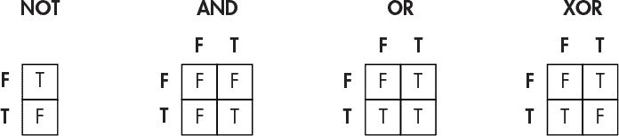

*图 1-1：布尔操作的真值表*

图 1-2 显示了该如何操作 NOT 和 AND 操作。我们可以通过从输入或多个输入追踪路径来找到输出。

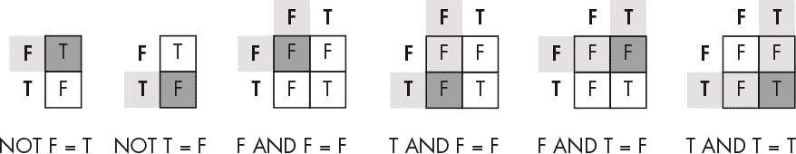

*图 1-2：使用真值表*

如你所见，非操作只是反转输入的状态。另一方面，AND 操作只有在两个输入都为真时才返回真。

**注意**

*异或操作是由其他操作构建的。例如，2 个位的异或，*a* 和 *b*，*等同于*（a 或 b）与 非（a 和 b）相与。*这表明基本的布尔操作可以以不同的方式组合，以得到相同的结果。*

#### *德·摩根定律*

在 19 世纪，英国数学家奥古斯都·德·摩根（Augustus De Morgan）提出了一条只适用于布尔代数的定律——同名的*德·摩根定律*。该定律指出，操作*a AND b*等价于操作*NOT*(*NOT a OR NOT b*)，如图 1-3 所示。

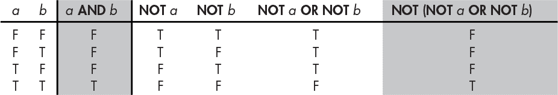

*图 1-3：德·摩根定律的真值表*

请注意，第二列的*a AND b*结果与最后一列*NOT*(*NOT a OR NOT b*)中的结果是相同的。这意味着通过足够的 NOT 操作，我们可以将 AND 操作替换为 OR 操作（反之亦然）。这一点非常有用，因为计算机处理的现实世界输入并不在它们的控制之下。虽然如果输入是*冷*或*下雨*的形式会很好，但它们往往是*NOT cold*或*NOT raining*。类似于英语等语言中的双重否定（“我们没去滑雪”），德·摩根定律是一个工具，它让我们不仅可以对已经看到的*正逻辑*进行操作，还可以对这些*负逻辑*命题进行操作。图 1-4 展示了正负逻辑形式下穿外套的决策。

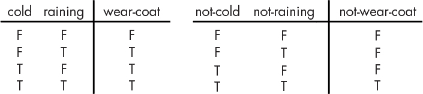

*图 1-4：正负逻辑*

在左侧（正逻辑）我们可以通过单一的 OR 操作来做决定。在右侧（负逻辑），德·摩根定律允许我们通过单一的 AND 操作来做决定。如果没有德·摩根定律，我们将不得不将负逻辑的情况实现为*NOT*不冷*OR NOT*不下雨。虽然这样可以工作，但每个操作都有价格和性能上的成本，所以减少操作可以减少成本。执行 NOT 操作的硬件需要真正的金钱，正如你将在下一章学到的，级联操作会拖慢速度。

德·摩根告诉我们，这等同于“冷和下雨”，这样更简单。

### 使用位表示整数

让我们往上走一步，学习如何使用位来表示数字。数字比逻辑更复杂，但比语言简单得多。

#### *表示正数*

我们通常使用 *十进制* 数字系统，因为它与我们的生理结构相对应。十个不同的符号，称为 *数字*，可以进入容器：0123456789。容器是从右向左堆叠的。每个容器都有一个与其内容不同的名称；我们称最右边的容器为个位数，接下来是十位数，百位数，千位数，依此类推。这些名称是 10 的幂的别名；10⁰ 是一，10¹ 是十，10² 是一百，10³ 是一千。这个系统被称为 *十进制*，因为 10 是支撑指数的基数。一个数字的值是每个容器值与其内容值乘积的和。例如，数字 5,028 是 5 千、0 百、2 十和 8 个一的和，即 5 × 10³ + 0 × 10² + 2 × 10¹ + 8 × 10⁰，如 图 1-5 所示。


*图 1-5: 数字 5,028 的十进制表示*

我们可以使用类似的方法来构造二进制数字。由于我们使用的是位（bit）而非数字，我们只有两个符号：0 和 1。但这并不成问题。在十进制中，每当容器空间不足时，我们会增加一个新的容器；我们可以将 9 放入一个容器，但需要两个容器才能表示 10。在二进制中也是如此；我们只需要为任何大于 1 的数字增加一个新容器。最右边的容器仍然表示个位数，但下一个是什么呢？它是 *二位数*。在十进制中，每个容器的值是其右边容器值的 10 倍。因此，在二进制中，每个容器的值是其右边容器值的 2 倍。就这么简单！容器的值是 2 的幂，这意味着它是一个 *二进制* 系统，而不是十进制系统。

表 1-1 列出了 2 的一些幂。我们可以将其作为参考来理解数字 5,028 的二进制表示。

**表 1-1:** 2 的幂

| **扩展** | **幂** | **十进制** |
| --- | --- | --- |
| 2 ÷ 2 | 2⁰ | 1 |
| 2 | 2¹ | 2 |
| 2 × 2 | 2² | 4 |
| 2 × 2 × 2 | 2³ | 8 |
| 2 × 2 × 2 × 2 | 2⁴ | 16 |
| 2 × 2 × 2 × 2 × 2 | 2⁵ | 32 |
| 2 × 2 × 2 × 2 × 2 × 2 | 2⁶ | 64 |
| 2 × 2 × 2 × 2 × 2 × 2 × 2 | 2⁷ | 128 |
| 2 × 2 × 2 × 2 × 2 × 2 × 2 × 2 | 2⁸ | 256 |
| 2 × 2 × 2 × 2 × 2 × 2 × 2 × 2 × 2 | 2⁹ | 512 |
| 2 × 2 × 2 × 2 × 2 × 2 × 2 × 2 × 2 × 2 | 2¹⁰ | 1,024 |
| 2 × 2 × 2 × 2 × 2 × 2 × 2 × 2 × 2 × 2 × 2 | 2¹¹ | 2,048 |
| 2 × 2 × 2 × 2 × 2 × 2 × 2 × 2 × 2 × 2 × 2 × 2 | 2¹² | 4,096 |
| 2 × 2 × 2 × 2 × 2 × 2 × 2 × 2 × 2 × 2 × 2 × 2 × 2 | 2¹³ | 8,192 |
| 2 × 2 × 2 × 2 × 2 × 2 × 2 × 2 × 2 × 2 × 2 × 2 × 2 × 2 | 2¹⁴ | 16,384 |
| 2 × 2 × 2 × 2 × 2 × 2 × 2 × 2 × 2 × 2 × 2 × 2 × 2 × 2 × 2 | 2¹⁵ | 32,768 |

表 1-1 中最右列的每个数字代表二进制容器的值。图 1-6 展示了如何将数字 5,028 以二进制表示，基本上使用了我们之前用于十进制表示的相同过程。

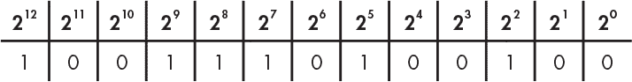

*图 1-6：二进制中的数字 5,028*

转换为二进制的结果是：

```
1 × 212 + 0 × 211 + 0 × 210 + 1 × 29 + 1 × 28 + 1 × 27 + 0 × 26 + 1 × 25 + 0 × 24 + 0 × 23 + 1 × 22 + 0 × 21 + 0 × 20 = 5,028
```

如你所见，数字 5,028 的二进制表示包含一个 4,096（2¹²），零个 2,048（2¹¹），零个 1,024（2¹⁰），一个 512（2⁹），一个 256（2⁸），依此类推，组成了 1001110100100。进行与十进制数相同的计算，我们写成 1 × 2¹² + 0 × 2¹¹ + 0 × 2¹⁰ + 1 × 2⁹ + 1 × 2⁸ + 1 × 2⁷ + 0 × 2⁶ + 1 × 2⁵ + 0 × 2⁴ + 0 × 2³ + 1 × 2² + 0 × 2¹ + 0 × 2⁰。用表 1-1 中的十进制数字替换，我们得到 4,096 + 512 + 256 + 128 + 32 + 4，结果为 5,028。

我们会说，5,028 是一个四位的十进制数字。在二进制中，它是一个 13 位的数字。

数字的位数决定了我们在十进制中能够表示的值的范围。例如，100 个不同的值，范围从 0 到 99，可以用两位数表示。同样，位数决定了我们在二进制中能够表示的值的范围。例如，2 位可以表示 0 到 3 范围内的四个值。表 1-2 总结了不同位数下我们可以表示的值的数量和范围。

**表 1-2：** 二进制数值范围

| **位数** | **值的数量** | **值的范围** |
| --- | --- | --- |
| 4 | 16 | 0...15 |
| 8 | 256 | 0...255 |
| 12 | 4,096 | 0...4,095 |
| 16 | 65,536 | 0...65,535 |
| 20 | 1,048,576 | 0...1,058,575 |
| 24 | 16,777,216 | 0...16,777,215 |
| 32 | 4,294,967,296 | 0...4,294,967,295 |
| 64 | 18,446,744,073,709,551,616 | 0...18,446,744,073,709,551,615 |

二进制数中最右边的位称为*最低有效位*，而最左边的位称为*最高有效位*，因为改变最右边的位对数字的值影响最小，而改变最左边的位对数字的值影响最大。计算机领域的人喜欢使用三字母缩略词，或者我们称之为 TLA，因此这些通常被称为*LSB*和*MSB*。图 1-7 展示了在 16 位中表示的数字 5,028 的示例。

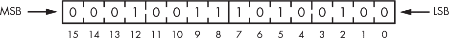

*图 1-7：MSB 和 LSB*

你会注意到，虽然数字 5,028 的二进制表示使用了 13 位，图 1-7 中它却是用 16 位表示的。就像在十进制中一样，我们总是可以使用比最少要求更多的容器，只需在左边添加*前导零*。在十进制中，05,028 与 5,028 的值是相同的。二进制数通常这样表示，因为计算机是基于位块构建的。

#### *二进制加法*

现在你知道如何使用二进制表示数字，让我们来看看如何用二进制数字进行简单的算术运算。在十进制加法中，我们从右边（最低有效位）到左边（最高有效位）逐位相加，如果结果大于 9，我们就进 1。同样，在二进制中，我们逐位加上每个比特，从最低有效位到最高有效位，如果结果大于 1，我们就进 1。

实际上，二进制加法要容易一些，因为两个比特有 4 种可能的组合，而两个数字有 100 种组合。例如，图 1-8 展示了如何使用二进制数加 1 和 5，并显示了每一列上方的进位数字。

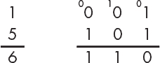

*图 1-8：二进制加法*

数字 1 的二进制表示是 001，而数字 5 的二进制表示是 101，因为（1 × 4）+（0 × 2）+（1 × 1）= 5。为了将二进制数字 001 和 101 相加，我们从最右边的列（最低有效位）开始。在该列中加 1 和 1 得到 2，但我们在二进制中没有表示 2 的符号。但我们知道 2 的二进制表示是 10（[1 × 2] + [0 × 1] = 2），因此我们将 0 作为和，并将 1 进位到下一位。由于中间的比特是 0，我们只有之前进位过来的 1 作为和。然后，我们将最左边的列中的数字相加：0 加 1 就是二进制中的 1。最终结果是二进制的 110，或十进制的 6，这就是 1 和 5 相加的结果。

你可能注意到，二进制加法的规则可以通过我们之前讨论的逻辑运算来表达，正如图 1-9 所示。我们将在第二章中看到，实际上计算机硬件就是通过这种方式进行二进制加法的。

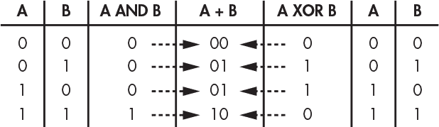

*图 1-9：使用逻辑运算进行二进制加法*

当我们将 2 个比特加在一起时，结果的值是这 2 个比特的异或（XOR），进位的值是这 2 个比特的与（AND）。你可以在图 1-9 中看到这一点，其中 1 和 1 的二进制相加结果为 10。这意味着进位值是 1，这是通过执行表达式（1 *AND* 1）得到的。类似地，表达式（1 *XOR* 1）得到 0，这就是我们为该比特位置分配的值。

两个比特的加法操作很少单独发生。回到图 1-8，看起来我们在每一列中加了 2 个比特，但实际上我们加的是 3 个，因为有进位。幸运的是，我们不需要学习任何新知识来加 3 个比特（因为 A + B + C 等同于(A + B) + C，根据结合律），所以我们可以通过一对 2 比特加法来完成 3 比特的加法。

当加法结果超出我们拥有的位数时会发生什么？这会导致*溢出*，每当我们从最高有效位（MSB）进位时，就会发生溢出。例如，如果我们有 4 位数字，并且将 1001（9[10]）加到 1000（8[10]），结果应该是 10001（17[10]），但是它会变成 0001（1[10]），因为没有地方存放最高有效位。正如我们稍后会更详细地看到的，计算机有一个*条件码寄存器*，它是一个存储奇怪信息的地方。这里面有一个*溢出位*，它保存来自最高有效位的进位值。我们可以查看这个值来判断是否发生了溢出。

你可能知道，你可以通过加上那个数字的负数来从一个数字中减去另一个数字。我们将在下一节中学习如何表示负数。超过最高有效位的借位被称为*下溢*。计算机也有一个对应的条件码来表示这一点。

#### *表示负数*

在上一节中，我们表示的所有数字都是正数。但很多现实世界的问题涉及到正数和负数。让我们看看如何用位来表示负数。例如，假设我们有 4 个位可用。如你在上一节中学到的，4 个位可以表示 0 到 15 之间的 16 个数字。仅仅因为 4 个位能表示 16 个数字，并不意味着这些数字必须是 0 到 15 之间的。记住，语言是通过意义和上下文来运作的。这意味着我们可以创造新的上下文来解释位。

##### 符号和大小

*符号*通常用于区分负数和正数。符号有两个值，正和负，因此可以使用一位来表示。我们任意选择最左边的位（MSB）作为符号，剩下 3 个位可以表示 0 到 7 之间的数字。如果符号位是 0，我们将这个数字视为正数。如果是 1，我们将其视为负数。这使我们能够表示 15 个不同的正负数字，而不是 16 个，因为存在正零和负零。表 1-3 展示了这如何帮助我们表示-7 到+7 之间的数字。

这叫做*符号和大小*表示法，因为有一个位表示符号，其他位表示大小，或者说表示值距离零的远近。

符号和大小表示法由于两个原因不常用。首先，构建位需要成本，因此我们不想通过为零使用两种不同的表示来浪费它们；我们宁愿用这些位组合来表示另一个数字。第二，使用异或（XOR）和与（AND）进行算术运算时，这种表示法不起作用。

**表 1-3：** 符号和大小二进制数

| **符号** | **2²** | **2¹** | **2⁰** | **十进制** |
| --- | --- | --- | --- | --- |
| `0` | `1` | `1` | `1` | +7 |
| `0` | `1` | `1` | `0` | +6 |
| `0` | `1` | `0` | `1` | +5 |
| `0` | `1` | `0` | `0` | +4 |
| `0` | `0` | `1` | `1` | +3 |
| `0` | `0` | `1` | `0` | +2 |
| `0` | `0` | `0` | `1` | +1 |
| `0` | `0` | `0` | `0` | +0 |
| `1` | `0` | `0` | `0` | –0 |
| `1` | `0` | `0` | `1` | –1 |
| `1` | `0` | `1` | `0` | –2 |
| `1` | `0` | `1` | `1` | –3 |
| `1` | `1` | `0` | `0` | –4 |
| `1` | `1` | `0` | `1` | –5 |
| `1` | `1` | `1` | `0` | –6 |
| `1` | `1` | `1` | `1` | –7 |

假设我们想把 +1 加到 -1 上。我们期望得到 0，但使用符号和大小表示法时我们得到了不同的结果，如图 1-10 所示。

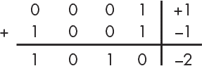

*图 1-10：符号和大小加法*

如你所见，0001 表示二进制中的正 1，因为其符号位是 0。1001 表示二进制中的负 1，因为符号位是 1。使用 XOR 和 AND 算术将它们相加，得到 1010。它的十进制值是-2，这不是+1 和-1 的和。

我们可以通过使用更复杂的逻辑来使符号和大小算术运算正常工作，但将事情保持尽可能简单也是有价值的。让我们探索几种不同的数字表示方式，找到更好的方法。

##### 一的补码

获取负数的另一种方法是将正数的所有位反转，这就是所谓的*一的补码*表示法。我们将位分区的方式类似于符号和大小。在这个过程中，我们通过 NOT 操作得到补码。表 1-4 展示了使用一的补码表示的从–7 到 7 的数值。

**表 1-4：** 一的补码二进制数

| **符号** | **2²** | **2¹** | **2⁰** | **十进制** |
| --- | --- | --- | --- | --- |
| `0` | `1` | `1` | `1` | +7 |
| `0` | `1` | `1` | `0` | +6 |
| `0` | `1` | `0` | `1` | +5 |
| `0` | `1` | `0` | `0` | +4 |
| `0` | `0` | `1` | `1` | +3 |
| `0` | `0` | `1` | `0` | +2 |
| `0` | `0` | `0` | `1` | +1 |
| `0` | `0` | `0` | `0` | +0 |
| `1` | `1` | `1` | `1` | –0 |
| `1` | `1` | `1` | `0` | –1 |
| `1` | `1` | `0` | `1` | –2 |
| `1` | `1` | `0` | `0` | –3 |
| `1` | `0` | `1` | `1` | –4 |
| `1` | `0` | `1` | `0` | –5 |
| `1` | `0` | `0` | `1` | –6 |
| `1` | `0` | `0` | `0` | –7 |

如你所见，将 0111（+7）的每一位反转得到 1000（–7）。

一的补码表示法仍然存在两个零的不同表示问题。它仍然不能轻松进行加法运算。为了解决这个问题，我们使用*环绕进位*，如果从最高有效位有进位，则将进位加到最低有效位以得到正确的结果。图 1-11 展示了这一过程是如何工作的。

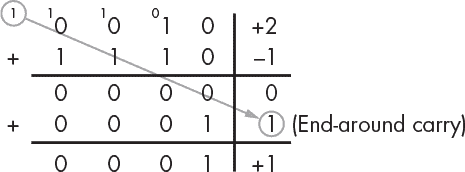

*图 1-11：一的补码加法*

为了使用反补码表示法加上 +2 和 -1，我们按通常的方式对 0010 和 1110 进行二进制加法。由于在最高有效位（符号位）加法的结果是 10，我们将 0 带下来，并将 1 作为每一位的进位。但我们只有 4 位可用，因此当我们到达最高有效位时，我们将进位带回到第一位，得到 0001，即 +1，这就是 +2 和 -1 的正确和。如你所见，要使这一过程可行需要增加大量的复杂性。

虽然这样可行，但仍然不是一个很好的解决方案，因为我们需要额外的硬件来处理进位位。

现代计算机不使用符号和大小或反补码表示法。这些方法的算术运算没有额外的硬件是无法正常工作的，而额外的硬件需要花费金钱。让我们看看能否找到一种能解决这个问题的表示法。

##### 二进制补码

如果我们不添加任何特殊硬件，只使用 XOR 和 AND 操作，会发生什么情况？我们来弄清楚，当 +1 加上某个比特模式时，结果是 0，并称之为 -1。假设我们使用 4 位数字，+1 为 0001。将 1111 加到它上面，结果是 0000，如图 1-12 所示，因此我们将使用这个比特模式来表示 -1。

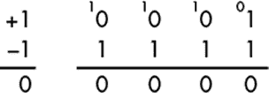

*图 1-12：找到 -1*

这就是所谓的 *二进制补码* 表示法，它是最常用的有符号整数二进制表示法。我们可以通过对一个数字进行补码（即对每一位进行 NOT 操作）然后加 1 来得到该数字的负数，同时丢弃最高有效位的进位。+1 的补码是 0001，补码是 1110，再加 1 就得到 1111 表示 -1。同样，+2 是 0010，它的补码是 1101，再加 1 就得到 1110 来表示 -2。表 1-5 展示了使用二进制补码表示法的 -8 到 +7。

**表 1-5：** 二进制补码数字

| **符号** | **2²** | **2¹** | **2⁰** | **十进制** |
| --- | --- | --- | --- | --- |
| `0` | `1` | `1` | `1` | +7 |
| `0` | `1` | `1` | `0` | +6 |
| `0` | `1` | `0` | `1` | +5 |
| `0` | `1` | `0` | `0` | +4 |
| `0` | `0` | `1` | `1` | +3 |
| `0` | `0` | `1` | `0` | +2 |
| `0` | `0` | `0` | `1` | +1 |
| `0` | `0` | `0` | `0` | +0 |
| `1` | `1` | `1` | `1` | –1 |
| `1` | `1` | `1` | `0` | –2 |
| `1` | `1` | `0` | `1` | –3 |
| `1` | `1` | `0` | `0` | –4 |
| `1` | `0` | `1` | `1` | –5 |
| `1` | `0` | `1` | `0` | –6 |
| `1` | `0` | `0` | `1` | –7 |
| `1` | `0` | `0` | `0` | –8 |

让我们试着使用 0 来看看二进制补码是否解决了零的重复表示问题。如果我们将 0000 反转每一位，得到 1111 作为它的补码。将 1 加到 1111 上，我们得到 [1]0000，但因为这是一个 5 位数字，超出了可用的位数，所以我们可以忽略进位中的 1。这样，我们剩下的就是 0000，这是我们最开始的值，因此零在二进制补码中只有一个表示。

程序员需要知道表示所需数字需要多少位。这将最终成为第二天性。与此同时，你可以参考表 1-6，它展示了我们可以使用不同大小的二进制补码表示的值的范围。

**表 1-6:** 二进制补码数值范围

| **位数** | **值的数量** | **值的范围** |
| --- | --- | --- |
| 4 | 16 | –8...7 |
| 8 | 256 | –128...127 |
| 12 | 4,096 | 2,048...2,047 |
| 16 | 65,536 | –32,768...32,767 |
| 20 | 1,048,576 | –524,288...524,287 |
| 24 | 16,777,216 | –8,388,608...8,388,607 |
| 32 | 4,294,967,296 | –2,147,483,648...2,137,483,647 |
| 64 | 18,446,744,073,709,551,616 | –9,223,372,036,854,775,808 ...9,223,372,036,854,775,807 |

从表 1-6 中可以看出，随着位数的增加，可以表示的值范围呈指数级增长。重要的是要记住，我们始终需要上下文来确定我们看到的一个 4 位数字是二进制补码表示的 15，而不是–1，是符号和幅度表示的–7，还是一补码表示的–0。你必须知道你正在使用哪种表示方法。

### 表示实数

到目前为止，我们已经能够使用二进制表示整数。那么，如何表示实数呢？实数在十进制中包含一个小数点。我们需要某种方法来表示二进制中等效的小数点。再次说明，这可以通过在不同的上下文中解释位来实现。

#### *定点表示*

使用二进制表示小数的一种方法是选择一个任意位置作为二进制点，即小数点的二进制等价物。例如，如果我们有 4 位，我们可以假设其中两位位于二进制点的右侧，表示四个小数值，另外两位位于左侧，表示四个整数值。这种表示方法称为*定点*表示，因为二进制点的位置是固定的。表 1-7 展示了这种表示方法如何工作。

**表 1-7:** 定点二进制数

| **整数** |  | **小数** | **值** |
| --- | --- | --- | --- |
| 0 | 0 | . | 0 | 0 | 0 |
| 0 | 0 | . | 0 | 1 | ¼ |
| 0 | 0 | . | 1 | 0 | ½ |
| 0 | 0 | . | 1 | 1 | ¾ |
| 0 | 1 | . | 0 | 0 | 1 |
| 0 | 1 | . | 0 | 1 | 1¼ |
| 0 | 1 | . | 1 | 0 | 1½ |
| 0 | 1 | . | 1 | 1 | 1¾ |
| 1 | 0 | . | 0 | 0 | 2 |
| 1 | 0 | . | 0 | 1 | 2¼ |
| 1 | 0 | . | 1 | 0 | 2½ |
| 1 | 0 | . | 1 | 1 | 2¾ |
| 1 | 1 | . | 0 | 0 | 3 |
| 1 | 1 | . | 0 | 1 | 3¼ |
| 1 | 1 | . | 1 | 0 | 3½ |
| 1 | 1 | . | 1 | 1 | 3¾ |

小数点左侧的整数应该看起来很熟悉，来自二进制表示。与我们在整数中看到的类似，我们从点右边的 2 位中得到四个值，它们表示的是四分之一，而不是十进制中的熟悉的十分之一。

尽管这种方法效果相当不错，但它并不常用于通用计算机，因为它需要使用大量位数来表示有用的数字范围。某些特殊用途计算机，如*数字信号处理器*（*DSP*），仍然使用定点数。而且，正如你将在第十一章中看到的那样，定点数在某些应用中仍然是有用的。

通用计算机被设计用来解决通用问题，这些问题涉及范围广泛的数字。你可以通过快速浏览一本物理学教材来了解这个范围。例如，有像普朗克常数（6.63 × 10^(–34) 焦耳·秒）这样的极小数字，也有像阿伏伽德罗常数（6.02 × 10²³ 分子/摩尔）这样的巨大数字。这是一个 10⁵⁷的范围，约等于 2¹⁹¹，也就是接近 200 位！位数并不便宜，无法用几百位表示每一个数字，因此我们需要一种不同的方法。

#### *浮点数表示法*

我们通过使用科学计数法的二进制版本来解决这个问题，这种表示方法用于表示包括普朗克常数和阿伏伽德罗常数在内的广泛数字范围。科学计数法通过（还有其他方法吗？）为解释创建一个新的上下文来表示大范围的数字。它使用一个十进制点左侧的数字，称为*尾数*，乘以 10 的某个幂，称为*指数*。计算机使用相同的系统，只不过尾数和指数是二进制数字，并且使用 2 而不是 10。

这就是所谓的*浮点数*表示法，它之所以令人困惑，是因为二进制（或十进制）小数点总是位于相同的位置：在“1”和“2”之间（在十进制中是十位和分位之间）。 “浮点”只是另一种说法，即“科学计数法”，它让我们可以写成 1.2 × 10^(–3)，而不是 0.0012。

请注意，我们不需要任何位来表示基数是 2，因为浮点数定义默认就假设基数是 2。通过将有效数字与指数分开，浮点数系统允许我们表示非常小或非常大的数字，而无需存储所有那些零。

表 1-8 展示了一个 4 位浮点数表示法，其中 2 位为尾数，2 位为指数。

**表 1-8：** 浮点二进制数字

| **尾数** |  | **指数** | **值** |
| --- | --- | --- | --- |
| 0 | 0 | . | 0 | 0 | 0 (0 × 2⁰) |
| 0 | 0 | . | 0 | 1 | 0 (0 × 2¹) |
| 0 | 0 | . | 1 | 0 | 0 (0 × 2¹) |
| 0 | 0 | . | 1 | 1 | 0 (0 × 2³) |
| 0 | 1 | . | 0 | 0 | 0.5 (½ × 2⁰) |
| 0 | 1 | . | 0 | 1 | 1.0 (½ × 2¹) |
| 0 | 1 | . | 1 | 0 | 2.0 (½ × 2²) |
| 0 | 1 | . | 1 | 1 | 4.0 (½ × 2³) |
| 1 | 0 | . | 0 | 0 | 1.0 (1 × 2⁰) |
| 1 | 0 | . | 0 | 1 | 2.0 (1 × 2¹) |
| 1 | 0 | . | 1 | 0 | 4.0 (1 × 2²) |
| 1 | 0 | . | 1 | 1 | 8.0 (1 × 2³) |
| 1 | 1 | . | 0 | 0 | 1.5 (1½ × 2⁰) |
| 1 | 1 | . | 0 | 1 | 3.0 (1½ × 2¹) |
| 1 | 1 | . | 1 | 0 | 6.0 (1½ × 2²) |
| 1 | 1 | . | 1 | 1 | 12.0 (1½ × 2³) |

虽然这个例子只使用了几个比特，但它揭示了这个浮点系统中存在的一些低效之处。首先，你会注意到有很多浪费的比特组合。例如，有四种方式表示 0，有两种方式表示 1.0、2.0 和 4.0。其次，并不是每个可能的数字都有对应的比特模式；随着数字变大，指数会让数字之间的距离变得更远。其副作用之一是，虽然我们可以将 0.5 和 0.5 相加得到 1.0，但我们无法将 0.5 和 6.0 相加，因为没有比特模式表示 6.5。（有一个数学分支，叫做*数值分析*，专门研究如何跟踪计算结果的准确性。）

#### *IEEE 浮点标准*

尽管奇怪，浮点系统仍然是计算机中表示实数的标准方法。使用的比特比表 1-8 中更多，并且有两个符号，一个用于尾数，另一个是隐藏的符号，属于指数部分。此外，还有许多技巧确保诸如舍入等操作尽可能精确，并尽量减少浪费的比特组合。一个叫做*IEEE 754*的标准详细规定了所有这些内容。IEEE 代表电气和电子工程师协会，这是一个专业组织，其活动包括制定标准。

我们希望在可用的比特数下最大化精度。一个聪明的技巧叫做*归一化*，它调整尾数，以确保没有前导零（即左边的零）。每次左移尾数都需要相应调整指数。第二个技巧，来自数字设备公司（DEC），通过丢弃尾数的最左边的比特来提高精度，因为我们知道它总是 1，从而为另一个比特腾出空间。

你不需要了解 IEEE 754 的所有细节（暂时）。但你应该了解你经常会遇到的两种浮点数类型：单精度和双精度。单精度数字使用 32 个比特，能够表示大约±10^(±38)范围内的数字，精度大约为 7 位数字。双精度数字使用 64 个比特，能够表示更广泛的数字范围，大约是±10^(±308)，精度为约 15 位数字。图 1-13 展示了它们的布局。

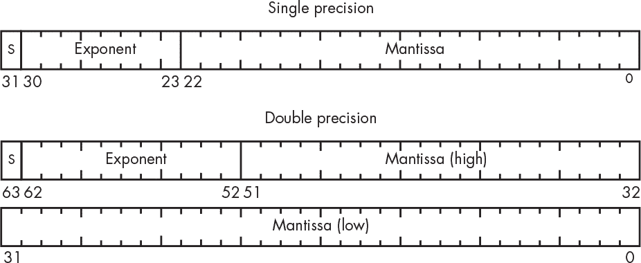

*图 1-13：IEEE 浮点数格式*

两种格式都有尾数的符号位——图 1-13 中的*S*。你可以看到，双精度数字比单精度多了三个指数位，范围是单精度的八倍。双精度数字的尾数位比单精度多 29 个，从而提供了更高的精度。然而，这一切的代价是，双精度数字占用了比单精度数字多两倍的比特。

你可能注意到，指数没有明确的符号位。IEEE 754 的设计者决定，所有 0 和所有 1 的指数值将具有特殊意义，因此实际的指数值必须被塞进剩余的比特模式中。他们通过使用*偏置*（偏移）指数值来实现这一点。对于单精度数字，偏置值为 127，这意味着 127 的比特模式（01111111）表示指数为 0。1 的比特模式（00000001）表示指数为-126，而 254（11111110）表示指数为+127。双精度与此类似，只是偏置值为 1023。

IEEE 754 的另一个方便之处在于，它有特殊的比特模式来表示像除以零这种运算，它的结果是正无穷大或负无穷大。它还定义了一个特殊值，叫做*NaN*，表示“不是一个数字”——所以，如果你发现自己处于 NaN 状态，可能意味着你进行了非法的算术运算。这些特殊的比特模式使用了前面讨论的保留指数值。

### 二进制编码十进制系统

你刚刚看到了几种常见的二进制数字表示方式，但还有许多其他的替代系统。其中一种是*二进制编码十进制*（*BCD*），我们使用 4 个比特来表示每个十进制数字。例如，数字 12 在二进制中是 1100。但在 BCD 中，它是 0001 0010，其中 0001 表示十位上的 1，0010 表示个位上的 2。这对习惯于使用十进制的人来说，是一种更为熟悉且舒适的表示方式。

计算机曾经能够处理 BCD（Binary-Coded Decimal）数字，但这个系统现在已经不再是主流。然而，它在许多地方仍然会出现，所以了解它是值得的。特别是，许多计算机交互的设备，如显示器和加速度计，都使用 BCD。

BCD 系统逐渐被淘汰的主要原因是它没有像二进制那样高效地使用比特。可以看到，BCD 需要比二进制更多的比特来表示一个数字。尽管比特变得比以前便宜了，但它们也没有便宜到我们愿意丢弃每 16 个比特组合中的 6 个，因为那相当于浪费了 37.5%的可用比特。

### 更简便的二进制数字处理方式

众所周知，操作二进制数字会导致视力受损；它会让人视觉疲劳！人们已经想出了一些方法，让二进制数字更容易阅读。我们将在这里介绍其中的一些方法。

#### *八进制表示*

一种对眼睛友好的方法是*八进制表示*。*八进制*表示的是基数为 8，八进制表示的思想是将比特按三位一组。正如你现在应该知道的，3 个比特可以表示 2³，即从 0 到 7 的八个值。假设我们有一个像 100101110001010100 这样的庞大二进制数字。它让我的眼睛很难受。图 1-14 展示了如何将它转换成八进制表示。

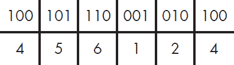

*图 1-14：二进制数的八进制表示*

如你所见，我们将位分成三位一组，然后为每一组分配一个八进制值，得到 456124，这样读起来就容易多了。例如，要得到 100 的八进制值，我们只需将它当作一个二进制数处理：（1 × 2²）+（0 × 2¹）+（0 × 2⁰）= 4。

#### *十六进制表示*

八进制表示仍在使用，但不如过去那么广泛。*十六进制表示*（即基数为 16）几乎已经取代了它，因为现在计算机的内部结构是以 8 位为单位的，这样就可以整除 4，但不能整除 3。

对于二进制，我们很容易重新利用我们熟悉的符号，因为我们只需要两个符号：0 和 1。对于八进制，我们只需要 8 个数字中的 8 个。但是对于十六进制，我们需要 16 个符号，这比我们现有的还要多。我们需要一个符号表示 10，另一个符号表示 11，一直到 15。我们*假装*（我告诉过你我们要这么做）字母 abcdef（或 ABCDEF）代表 10 到 16 的值。例如，假设我们有一个看起来吓人的二进制数字 11010011111111000001。图 1-15 展示了如何将其转换为十六进制。

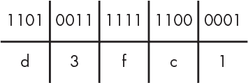

*图 1-15：二进制数的十六进制表示*

在这个例子中，我们将位分成四个一组。然后，我们为每一组分配一个 16 个符号中的值（0123456789abcdef）。例如，1101（第一组 4 位）会被分配为 `d`，因为它的值是 1(2³) + 1(2²) + 0(2¹) + 1(2⁰) = 13，十进制表示的 13 用 `d` 来表示。我们将接下来的 4 位（0011）映射到另一个符号，依此类推。例如，11010011111111000001 转换为 d3fc1 的十六进制值。表 1-9 列出了一个方便的十六进制值列表，你可以参考直到它变得得心应手。

**表 1-9：二进制到十六进制的转换**

| **二进制** | **十六进制** | **二进制** | **十六进制** |
| --- | --- | --- | --- |
| `0000` | 0 | `1000` | 8 |
| `0001` | 1 | `1001` | 9 |
| `0010` | 2 | `1010` | a |
| `0011` | 3 | `1011` | b |
| `0100` | 4 | `1100` | c |
| `0101` | 5 | `1101` | d |
| `0110` | 6 | `1110` | e |
| `0111` | 7 | `1111` | f |

#### *表示上下文*

你如何知道如何解读一个数字呢？例如，数字 10 如果是二进制就是 2，八进制是 8，十进制是 10，十六进制是 16。数学书籍使用下标，因此我们可以用下标来区分它们，像这样：10[2]、10[8]、10[10] 或 10[16]。但是，在计算机键盘上输入下标不太方便。如果我们能使用一种一致的表示法，那就好了，可惜很多人认为他们有更好的方法，并不断发明新的表示法。以下是许多计算机编程语言使用的表示法：

+   以 0 开头的数字是八进制数字——例如，017。

+   以 1 到 9 之间的数字开头的数字是十进制数——例如，123。

+   以 0x 为前缀的数字是十六进制数——例如，0x12f。

请注意，我们无法区分八进制和十进制的 0，但这不重要，因为它们具有相同的值。而且很少有编程语言使用二进制的表示法，因为二进制不再广泛使用，通常可以通过上下文来确定。有些语言，如 C++，使用 0b 前缀来表示二进制数字。

### 位的命名

计算机不仅仅是无组织的位桶。设计计算机的人必须根据成本原因对位数和组织结构做出决策。就像数字表示一样，许多方案曾被尝试过，只有一些方案得以存活。

位太小，不足以十分有用，因此它们被组织成更大的块。例如，霍尼韦尔 6000 系列计算机使用 36 位块作为其基本组织方式，并允许将这些块分为 18 位、9 位或 6 位块，或合并成 72 位块。DEC PDP-8 是第一台商业化的迷你计算机（于 1965 年推出），使用 12 位块。随着时间的推移，世界逐渐选择了 8 位块作为基本单元，我们称之为*字节（byte）*。

不同大小的块有名称，以便于引用。表 1-10 总结了当前使用的某些常见单位的名称和大小。

**表 1-10：** 位集合的名称

| **名称** | **位数** |
| --- | --- |
| 半字节 | 4 |
| 字节 | 8 |
| 半字 | 16 |
| 长字 | 32 |
| 双字 | 64 |

你可能会疑惑为什么我们有半字、长字和双字，但却没有普通字。*字（Word）*用于描述在特定计算机设计中事物的自然大小。自然大小指的是可以快速操作的最大数据块。例如，虽然你可以在 DEC PDP-11 上访问字节、半字和长字，但它的内部组织是 16 位的，因此自然大小是 16 位。像 C 和 C++这样的编程语言允许将变量声明为`int`（即*整数*的缩写），使其成为自然大小。你还可以使用一组支持的特定大小来声明变量。

有一些标准术语使得引用大数字变得容易。曾经有一个标准，但现在它已经被新的标准取代。工程师们有个习惯，他们总是找到一些接近自己需要表达的词汇，并把它们用作自己想要的意思。例如，在公制系统中，*kilo*表示千，*mega*表示百万，*giga*表示十亿，*tera*表示万亿。我们借用了这些术语，但稍作改变，因为我们在计算中使用的是二进制而非十进制。当我们在计算中提到*千比特*或*千字节*（*K*或*KB*）时，实际上我们并不是指一千。我们指的是接近一千的二进制数，即 1,024，或者 2¹⁰。*兆字节*（*M*或*MB*）同理，表示 2²⁰；*千兆*（*G*或*GB*）表示 2³⁰；*太字节*（*T*或*TB*）表示 2⁴⁰。

但有时我们确实指的是十进制版本。你需要了解上下文，才能知道应用哪种解释。传统上，十进制版本用来表示磁盘驱动器的大小。一位美国律师假装不知道这一点，并对*(Safier v. WDC)*提起诉讼，声称磁盘驱动器比广告上标明的要小。（依我看，这就像那些声称 2×4 木材实际上并不是 2 英寸×4 英寸的诉讼一样愚蠢，尽管这些木材的尺寸一直都是未经刨平的未加工木材的尺寸。）这导致了新的 IEC 标准前缀的创建：*kibi (KiB)*表示 2¹⁰，*mebi (MiB)*表示 2²⁰，*gibi (GiB)*表示 2³⁰，*tebi (TiB)*表示 2⁴⁰。这些前缀虽然慢慢被接受，但“kibis”对我来说听起来像狗粮。

*字符*这一术语常常与*字节*互换使用，因为正如我们在下一节中看到的，字符的编码通常是为了适应字节而设计的。现在，随着对非英语语言的更好支持，我们经常需要讨论多字节字符。

### 表示文本

到此为止，你已经了解了计算机中我们所能操作的唯一元素——比特，并且知道我们可以用比特来表示其他事物，比如数字。现在是时候将其提升到一个新层次，使用数字来表示其他事物，例如键盘上的字母和符号。

#### *美国信息交换标准代码*

就像我们在数字表示中看到的那样，关于文本表示也有多个竞争的方案。最终获胜的方案来自 1963 年，叫做*美国信息交换标准代码（ASCII）*，它为键盘上的所有符号分配了 7 位的数字值。例如，65 代表大写字母`A`，66 代表大写字母`B`，以此类推。失败的方案是 IBM 的*扩展二进制编码十进制交换码（EBCDIC）*，该编码基于打孔卡片使用的编码方式。没错，EBCDIC 中的“BCD”部分指的就是我们之前见过的二进制编码十进制。 表 1-11 展示了 ASCII 代码表。

**表 1-11：** ASCII 代码表

| **十进制** | **十六进制** | **字符** | **十进制** | **十六进制** | **字符** | **十进制** | **十六进制** | **字符** | **十进制** | **十六进制** | **字符** |
| --- | --- | --- | --- | --- | --- | --- | --- | --- | --- | --- | --- |
| 0 | 00 | NUL | 32 | 20 | SP | 64 | 40 | @ | 96 | 60 | ` |
| 1 | 01 | SOH | 33 | 21 | ! | 65 | 41 | A | 97 | 61 | a |
| 2 | 02 | STX | 34 | 22 | “ | 66 | 42 | B | 98 | 62 | b |
| 3 | 03 | ETX | 35 | 23 | # | 67 | 43 | C | 99 | 63 | c |
| 4 | 04 | EOT | 36 | 24 | $ | 68 | 44 | D | 100 | 64 | d |
| 5 | 05 | ENQ | 37 | 25 | % | 69 | 45 | E | 101 | 65 | e |
| 6 | 06 | ACK | 38 | 26 | & | 70 | 46 | F | 102 | 66 | f |
| 7 | 07 | BEL | 39 | 27 | ’ | 71 | 47 | G | 103 | 67 | g |
| 8 | 08 | BS | 40 | 28 | ( | 72 | 48 | H | 104 | 68 | h |
| 9 | 09 | HT | 41 | 29 | ) | 73 | 49 | I | 105 | 69 | i |
| 10 | 0A | NL | 42 | 2A | * | 74 | 4A | J | 106 | 6A | j |
| 11 | 0B | VT | 43 | 2B | + | 75 | 4B | K | 107 | 6B | k |
| 12 | 0C | FF | 44 | 2C | , | 76 | 4C | L | 108 | 6C | l |
| 13 | 0D | CR | 45 | 2D | - | 77 | 4D | M | 109 | 6D | m |
| 14 | 0E | SO | 46 | 2E | . | 78 | 4E | N | 110 | 6E | n |
| 15 | 0F | SI | 47 | 2F | / | 79 | 4F | O | 111 | 6F | o |
| 16 | 10 | DLE | 48 | 30 | 0 | 80 | 50 | P | 112 | 70 | p |
| 17 | 11 | DC1 | 49 | 31 | 1 | 81 | 51 | Q | 113 | 71 | q |
| 18 | 12 | DC2 | 50 | 32 | 2 | 82 | 52 | R | 114 | 72 | r |
| 19 | 13 | DC3 | 51 | 33 | 3 | 83 | 53 | S | 115 | 73 | s |
| 20 | 14 | DC4 | 52 | 34 | 4 | 84 | 54 | T | 116 | 74 | t |
| 21 | 15 | NAK | 53 | 35 | 5 | 85 | 55 | U | 117 | 75 | u |
| 22 | 16 | SYN | 54 | 36 | 6 | 86 | 56 | V | 118 | 76 | v |
| 23 | 17 | ETB | 55 | 37 | 7 | 87 | 57 | W | 119 | 77 | w |
| 24 | 18 | CAN | 56 | 38 | 8 | 88 | 58 | X | 120 | 78 | x |
| 25 | 19 | EM | 57 | 39 | 9 | 89 | 59 | Y | 121 | 79 | y |
| 26 | 1A | SUB | 58 | 3A | : | 90 | 5A | Z | 122 | 7A | z |
| 27 | 1B | ESC | 59 | 3B | ; | 91 | 5B | [ | 123 | 7B | { |
| 28 | 1C | FS | 60 | 3C | < | 92 | 5C | \ | 124 | 7C | &#124; |
| 29 | 1D | GS | 61 | 3D | = | 93 | 5D | ] | 125 | 7D | } |
| 30 | 1E | RS | 62 | 3E | > | 94 | 5E | ^ | 126 | 7E | ~ |
| 31 | 1F | US | 63 | 3F | ? | 95 | 5F | _ | 127 | 7F | DEL |

让我们在这个表格中找到字母 *A*。你可以看到它的十进制值是 65，对应的十六进制是 0x41——这在八进制中是 0101。事实证明，ASCII 字符编码仍然在一些地方大量使用八进制，出于历史原因。

你会注意到 ASCII 表格中有许多奇怪的代码。它们被称为 *控制字符*，因为它们控制的是某些功能，而不是用于打印。表 1-12 显示了它们所代表的含义。

**表 1-12：** ASCII 控制字符

| NUL | null | SOH | heading 开始 |
| --- | --- | --- | --- |
| STX | 文本开始 | ETX | 文本结束 |
| EOT | 结束传输 | ENQ | 请求 |
| ACK | 确认 | BEL | 响铃 |
| BS | 退格 | HT | 水平制表符 |
| NL | 换行 | VT | 垂直制表符 |
| FF | 换页 | CR | 回车 |
| SO | shift out | SI | shift in |
| DLE | 数据链路转义 | DC1 | 设备控制 #1 |
| DC2 | 设备控制 #2 | DC3 | 设备控制 #3 |
| DC4 | 设备控制 #4 | NAK | 否定确认 |
| SYN | 同步空闲 | ETB | 传输块结束符 |
| CAN | 取消 | EM | 结束符 |
| SUB | 替代 | ESC | 转义 |
| FS | 文件分隔符 | GS | 组分隔符 |
| RS | 记录分隔符 | US | 单位分隔符 |
| SP | 空格 | DEL | 删除 |

这些标准中的许多是为通信控制而设计的。例如，`ACK`（确认）意味着“我收到了消息”，而`NAK`（否定确认）意味着“我没有收到消息”。

#### *其他标准的发展*

ASCII 在一段时间内有效，因为它包含了英语所需的字符。大多数早期的计算机都是美国制造的，而那些不是的则是英国制造的。随着计算机的普及，需要支持其他语言的需求逐渐增长。*国际标准化组织 (ISO)* 采用了 ISO-646 和 ISO-8859 标准，基本上是 ASCII 的扩展，增加了欧洲语言中使用的重音符号和其他附加符号。*日本工业标准 (JIS)* 委员会则提出了 JIS X 0201 标准，用于日文字符。此外，还有中文标准、阿拉伯文标准等。

产生这些不同标准的一个原因是它们是在比特比现在昂贵得多的时代创建的，因此字符被压缩成 7 或 8 个比特。随着比特的价格下降，一个新的标准叫做*Unicode*被制定出来，它为字符分配了 16 位代码。那时，人们认为 16 位足以容纳地球上所有语言的字符，并且还会有足够的空间。Unicode 后来被扩展到 21 位（其中 1,112,064 个值是有效的），我们认为这个标准能够满足需求，但即便如此，考虑到我们创造新猫表情的倾向，这个标准也许并不能长久。

#### *Unicode 转换格式 8 位*

计算机使用 8 位存储 ASCII 字符，因为它们并未设计来处理 7 位数据。再次强调，尽管比以前便宜很多，位并不便宜到我们愿意用 16 个来存储一个字母，而当我们可以只用 8 个时就足够了。Unicode 通过为字符编码提供不同的编码来解决这个问题。*编码*是代表另一个位模式的位模式。没错——我们正在使用像位这样的抽象来创建表示字符的数字，然后使用其他数字来表示这些数字！你明白我说的“虚构”是什么意思了吗？有一种特定的编码叫做*Unicode Transformation Format–8 位*（*UTF-8*），由美国计算机科学家 Ken Thompson 和加拿大程序员 Rob Pike 发明，它因其效率和向后兼容性而被广泛使用。UTF-8 为每个 ASCII 字符使用 8 位，因此不会为 ASCII 数据占用额外空间。它以一种不破坏期望 ASCII 的程序的方式编码非 ASCII 字符。

UTF-8 将字符编码为一系列 8 位的块，通常称为*八位字节*。UTF-8 的一个巧妙之处在于，第一块中最重要的 1 的数量决定了序列的长度，并且很容易识别第一块。这非常有用，因为它使程序能够轻松找到字符边界。所有的 ASCII 字符都适合 7 位，所以它们每个只需要一个块，这对我们讲英语的人来说非常方便，因为比起需要非 ASCII 符号的其他语言，它更紧凑。图 1-16 展示了 UTF-8 如何与 Unicode 相比编码字符。

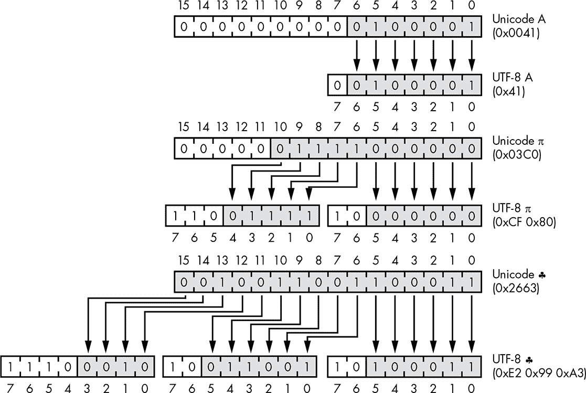

*图 1-16：UTF-8 编码示例*

在图 1-16 中，我们可以看到字母*A*的数字代码在 ASCII 和 Unicode 中是相同的。为了在 UTF-8 中编码*A*，我们可以说，任何适合 7 位的代码都将得到一个 UTF-8 块，并且 MSB（最高有效位）设置为 0。这就是为什么字母*A*在 UTF-8 中有一个前导 0 的原因。接下来，我们看到π符号的 Unicode，它不适合 7 位，但适合 11 位。为了在 UTF-8 中编码π，我们使用两个 8 位块，第一个块以 110 开头，第二个块以 10 开头，这样每个块分别留有 5 位和 6 位来容纳剩余的代码。最后，我们看到♣的 Unicode，它适合 16 位，因此需要三个 UTF-8 块。

### 使用字符表示数字

UTF-8 使用数字表示由位表示的数字，再用这些数字表示字符。但这还没完！接下来我们将使用字符来表示其中一些数字。计算机间通信的早期，人们不仅仅想发送文本，还希望传输二进制数据。但这并不简单，因为正如我们之前看到的，许多 ASCII 值被保留用于控制字符，并且在不同的系统间处理不一致。此外，一些系统仅支持传输 7 位字符。

#### *Quoted-Printable 编码*

*Quoted-Printable 编码*，也称为 QP 编码，是一种允许 8 位数据通过仅支持 7 位数据的路径进行通信的机制。它是为电子邮件附件创建的。这种编码方式允许任何 8 位字节值由三个字符表示：字符 = 后跟一对十六进制数字，每个字节的半字节对应一个数字。当然，采用这种方式时，= 字符具有特殊含义，因此必须用 =3D 来表示，这个值来源于 表 1-11。

Quoted-Printable 编码有一些额外的规则。如果制表符和空格字符出现在行尾，它们必须分别表示为 =09 和 =20。编码数据的行不能超过 76 个字符。行尾的 = 是软换行符，在接收方解码时会被去除。

#### *Base64 编码*

虽然 Quoted-Printable 编码是可行的，但它效率不高，因为需要三个字符来表示一个字节。*Base64* 编码更加高效，这在计算机间通信速度远低于今天时尤为重要。Base64 编码将 3 个字节的数据压缩成 4 个字符。这三个字节的 24 位数据被分成四个 6 位的块，每个块都被分配一个可打印字符，如 表 1-13 所示。

**表 1-13：** Base64 字符编码

| **数字** | **字符** | **数字** | **字符** | **数字** | **字符** | **数字** | **字符** |
| --- | --- | --- | --- | --- | --- | --- | --- |
| 0 | A | 16 | Q | 32 | g | 48 | w |
| 1 | B | 17 | R | 33 | h | 49 | x |
| 2 | C | 18 | S | 34 | i | 50 | y |
| 3 | D | 19 | T | 35 | j | 51 | z |
| 4 | E | 20 | U | 36 | k | 52 | 0 |
| 5 | F | 21 | V | 37 | l | 53 | 1 |
| 6 | G | 22 | W | 38 | m | 54 | 2 |
| 7 | H | 23 | X | 39 | n | 55 | 3 |
| 8 | I | 24 | Y | 40 | o | 56 | 4 |
| 9 | J | 25 | Z | 41 | p | 57 | 5 |
| 10 | K | 26 | a | 42 | q | 58 | 6 |
| 11 | L | 27 | b | 43 | r | 59 | 7 |
| 12 | M | 28 | c | 44 | s | 60 | 8 |
| 13 | N | 29 | d | 45 | t | 61 | 9 |
| 14 | O | 30 | e | 46 | u | 62 | + |
| 15 | P | 31 | f | 47 | v | 63 | / |

字节 0、1、2 会被编码为 `AAEC`。图 1-17 展示了这一过程。

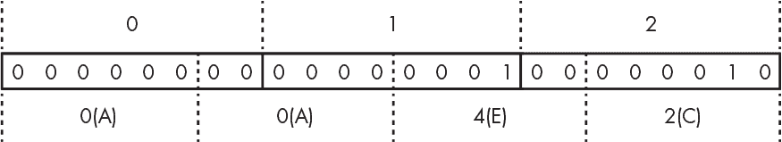

*图 1-17：Base64 编码*

这种编码将每组三个字节转换为四个字符。但无法保证数据的长度会是 3 字节的倍数。这个问题通过*填充*字符解决；如果最后只有 2 个字节，则会在末尾加上`=`，如果只有 1 个字节，则会加上`==`。

这种编码仍然广泛用于电子邮件附件中。

#### *URL 编码*

如上所述，Quoted-Printable 编码赋予了=字符特殊的含义，并且该编码包含了表示=字符而不触发特殊含义的机制。一个几乎相同的方案在网页 URL 中也有使用。

如果你曾经查看过网页 URL，可能会注意到像*%26*和*%2F*这样的字符序列。这是因为某些字符在 URL 的上下文中有特殊含义。但有时我们需要将这些字符作为*字面量*使用——换句话说，就是不带有这些特殊含义。

正如我们在上一节看到的，字符是通过一系列 8 位块表示的。每个块可以通过两个十六进制字符表示，如图 1-16 所示。*URL 编码*，也称为*百分号编码*，将字符替换为%后跟其十六进制表示。

例如，正斜杠字符（/）在 URL 中有特殊含义。它的 ASCII 值为 47，在十六进制中是 2F。如果我们需要在 URL 中使用/而不触发其特殊含义，我们可以将其替换为%2F。（由于我们刚刚赋予了%字符特殊含义，如果我们字面意思是指%本身，就需要将其替换为%25。）

### 表示颜色

数字的另一个常见用途是表示颜色。你已经知道数字可以用来表示图表上的坐标。计算机图形学通过在相当于电子图表纸上的坐标点上绘制颜色块来制作图像。绘制在每个坐标对上的颜色块被称为*图像元素*，更常见的叫法是*像素*。

计算机显示器通过混合红色、绿色和蓝色光来生成颜色，这种方法被称为*RGB 颜色模型*。这些颜色可以通过一个*颜色立方体*来表示，其中每个轴代表一种*基础*颜色，如图 1-18 所示。值为 0 表示某种光线关闭，值为 1 表示光线亮度最大。

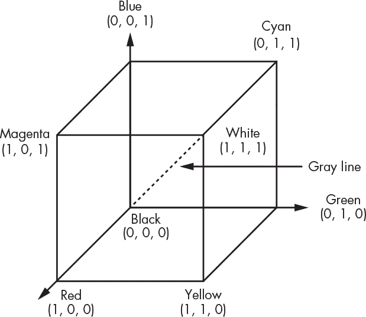

*图 1-18：RGB 颜色立方体*

你可以看到，如果没有光亮，颜色是黑色；如果所有光线都完全亮起，颜色是白色，意味着它们的亮度达到了最大值。如果只有红色光亮起，则呈现红色。红色和绿色混合会产生黄色。将所有三种光调到相同的水平则会得到灰色。这种混色方式称为*加色*系统，因为加入基础颜色会产生不同的颜色。图 1-19 展示了颜色立方体中几种颜色的坐标。

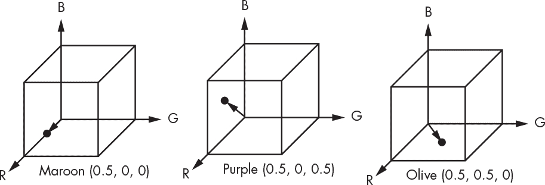

*图 1-19：RGB 颜色立方体示例*

如果你尝试过绘画，你可能更熟悉一种*减色*颜色系统，其中原色是青色、品红和黄色。减色系统通过从白光中去除波长来产生颜色，而不是像加色系统那样通过添加彩色光来产生颜色。虽然没有一种颜色系统能够产生人眼能看到的所有颜色，但减色系统能够产生比加色系统更多的颜色。为了让艺术家能够在计算机显示器上工作，并且保证设计在杂志上打印出来时仍然看起来正确，已经存在一整套*印前*技术。如果你真的对颜色感兴趣，可以阅读 Maureen Stone 的*数字颜色领域指南*。

人眼是一种非常混乱的机械装置，它是为了生存进化的，而不是为了计算。人眼能够区分大约 1000 万种颜色，但它并不是线性的；光强翻倍并不一定会使感知的亮度翻倍。更糟糕的是，人眼对整体光照水平的反应随时间变化缓慢，这种现象被称为*暗适应*。并且，不同颜色的反应不同；眼睛对绿色变化非常敏感，而对蓝色的变化相对不敏感，这种现象在国家电视系统委员会（NTSC）标准中得到了利用。现代计算机已经决定将 1000 万四舍五入到最接近的 2 的幂，并使用 24 位来表示颜色。这 24 位被分为三个 8 位字段，每个字段代表一种颜色原色。

你可能已经注意到，表 1-10 中没有 24 位的名称。这是因为现代计算机并不是为 24 位单元设计的（尽管曾有一些 24 位机器，比如 Honeywell DDP-224）。因此，颜色被打包成最接近的标准大小，即 32 位（*长字*），如图 1-20 所示。

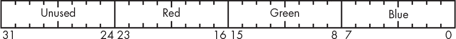

*图 1-20：RGB 颜色打包*

你可以看到，这种方案为每种颜色留出了 8 个未使用的位。考虑到现代计算机显示器上像素超过 800 万，这个数量是相当可观的。我们不能让这些位浪费掉，那么我们能做些什么呢？答案是，我们可以用它们做一些在上述颜色讨论中缺失的东西：*透明度*，即你能“透过”颜色看到多少。到目前为止，我们只讨论了不透明颜色，但例如玫瑰色眼镜就不能仅用不透明颜色表示。

#### *添加透明度*

在早期的动画电影中，每一帧都是手绘的。这不仅非常费力，而且还存在大量的视觉“抖动”，因为不可能在每一帧中精确重现背景。美国动画师 John Bray（1879–1978）和 Earl Hurd（1880–1940）通过他们在 1915 年发明的*底片动画*解决了这个问题。在底片动画中，移动的角色是画在透明的赛璐璐片上，然后可以将其移到静态背景图像上。

尽管计算机动画的起源可以追溯到 20 世纪 40 年代，但它在 70 年代和 80 年代才真正起飞。当时的计算机速度不足以完成电影导演所期望的一切（可能永远也做不到，因为，嗯，导演们）。并且需要一种机制来将由不同算法生成的对象结合起来。就像传统的手绘动画一样，透明度允许*合成*，即将来自不同来源的图像结合在一起。如果你曾经使用过像 GIMP 或 Photoshop 这样的图像编辑器，你可能对这个概念非常熟悉。

1984 年，Tom Duff 和 Thomas Porter 在 Lucasfilm 发明了一种实现透明度和合成的方法，这一方法至今已成为标准。他们为每个像素添加了一个透明度值，称为*alpha*（α）。α是一个介于 0 和 1 之间的数学值，其中 0 表示颜色完全透明，1 表示颜色完全不透明。一组*合成代数*方程式定义了具有不同 alpha 值的颜色如何组合以产生新颜色。

Duff 和 Porter 的实现非常巧妙。由于他们没有使用浮动点系统，他们用 255 表示α值为 1，利用了图 1-20 中额外的 8 位。Duff 和 Porter 不是存储红色、绿色和蓝色，而是存储颜色值乘以α。例如，如果颜色是中等红色，则红色为 200，绿色和蓝色为 0。如果它是完全不透明的，红色值为 200，因为α为 1（α值表示为 255）。但是，半透明的中等红色的α为 0.5，因此存储的红色值为 200 × 0.5 = 100，存储的α为 127（255 × 0.5 = 127）。图 1-21 显示了带α值的像素存储方式。

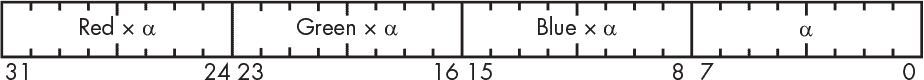

*图 1-21：RGBα颜色打包*

因此，合成图像涉及将颜色值乘以α。将颜色以预乘形式存储意味着我们不需要在每次使用像素时都进行这些乘法运算。

#### *编码颜色*

由于网页主要是*文本*文档，即一系列可读字符，通常采用 UTF-8 编码，我们需要一种使用文本表示颜色的方法。

我们以类似于 URL 编码的方式来做这件事，通过使用*十六进制三元组*来指定颜色。十六进制三元组是一个#符号，后跟六个十六进制值，格式为#rrggbb，其中 rr 是红色值，gg 是绿色值，bb 是蓝色值。例如，#ffff00 表示黄色，#000000 表示黑色，#ffffff 表示白色。每一个 8 位的颜色值都会被转换为两个字符的十六进制表示。

尽管α在网页中也可用，但没有简洁的格式来表示它。它使用的是另一套完全不同的方案。

### 总结

在本章中，你学习了尽管比特从概念上来看很简单，但它们可以用来表示复杂的事物，如非常大的数字、字符，甚至颜色。你学习了如何将十进制数字表示为二进制，如何使用二进制进行简单的算术运算，以及如何表示负数和分数。你还学习了使用比特对字母和字符进行编码的不同标准。

有一个极客笑话说：“世界上有两种人——理解二进制的人和不理解的人。”现在你应该属于前者。

在第二章中，你将学习一些硬件基础知识，这将帮助你理解计算机的物理组成部分，以及为什么计算机首先使用比特。
